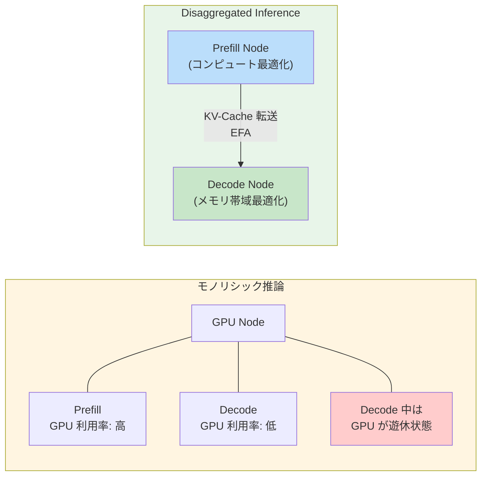
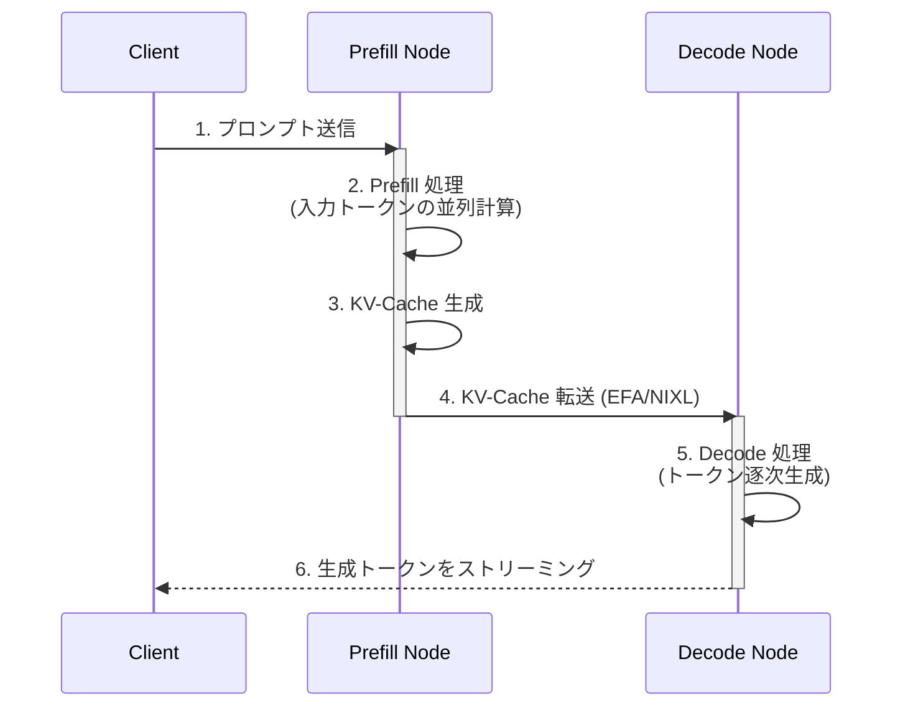
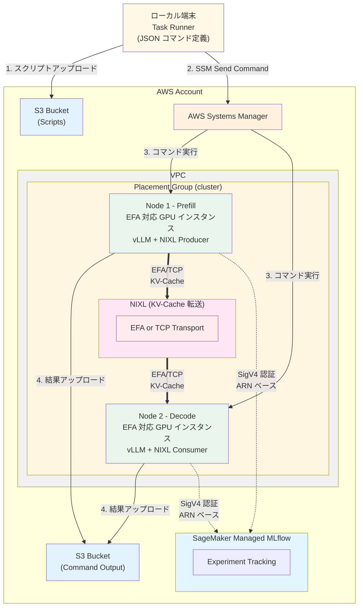

## はじめに

本記事で使用する実装コードは以下の GitHub リポジトリで公開しています。まだ作成中のため今回の記事の範囲では `v0.1.0` で問題なく動くと思ってください。

https://github.com/littlemex/disaggregated-inference-with-nixl-over-aws-efa/tree/v0.1.0

本記事は、Disaggregated Inference の実験基盤となる AWS 環境の構築に焦点を当てます。vLLM や NIXL のインストール、実験の実行については次回の記事で解説します。

### P/D Disaggregated Inference とは


出典: [AWS Neuron SDK Documentation - Disaggregated Inference](https://awsdocs-neuron.readthedocs-hosted.com/en/latest/libraries/nxd-inference/developer_guides/disaggregated-inference.html)

:::message
本記事では説明の便宜上「GPU ノード」と呼称していますが、Disaggregated Inference の概念は GPU に限定されません。AWS Trainium や Inferentia などのアクセラレーターでも同様に適用できます。
:::

Large Language Model（LLM）の推論処理は、大きく 2 つのフェーズに分かれます。1 つ目は入力プロンプト全体を並列に処理して KV-Cache（Key-Value Cache: Transformer の Attention 機構における Key と Value の計算結果をキャッシュしたもの）を生成する Prefill フェーズ、2 つ目は生成された KV-Cache を参照しながらトークンを 1 つずつ逐次生成する Decode フェーズです。

推論パイプラインでは、この 2 つのフェーズを同一の GPU 上で直列に実行するのが一般的です。しかし、一般的には Prefill はコンピュート律速（GPU 演算能力がボトルネック）、Decode はメモリ帯域律速（KV-Cache へのアクセスがボトルネック）と、それぞれ要求するリソース特性が大きく異なります。同じ GPU で両方を処理すると、Decode 中に GPU の演算ユニットが遊休状態となり、高価な計算資源を十分に活かせません。

P/D Disaggregated Inference は、この Prefill と Decode を物理的に異なる GPU ノードに分離するアーキテクチャです。Prefill ノードは演算性能を最大限に活用してプロンプト処理に専念し、生成された KV-Cache を高速ネットワーク経由で Decode ノードに転送します。Decode ノードはメモリ帯域に最適化された環境でトークン生成を行います。この分離により、各フェーズに最適なリソース配分が可能になり、GPU 利用効率とスループットの両方を向上させることができる可能性が高まります。

:::message
データ転送の効率の問題さえボトルネックにならなければ、原理的には Prefill と Decode で異なるインスタンスタイプを選択することが可能なはずです。今後、ヘテロジニアス（異種混合）なインスタンスでの P/D Disaggregated Inference についても調査・検証を進めたいと考えています。
:::

### なぜ分離が必要なのか

この分離の動機を、リソース利用の観点からもう少し具体的に見てみましょう。

Prefill フェーズでは入力トークンを一括で並列処理するため、GPU の演算ユニットを高い利用率で稼働させることができます。一方、Decode フェーズではトークンを 1 つずつ逐次生成するため、各ステップの計算量が小さく、GPU 演算ユニットの利用率は大幅に低下します。代わりに、毎ステップ KV-Cache 全体を読み出す必要があるため、メモリ帯域がボトルネックになります。

この性質の違いにより、モノリシックな構成では Decode 中に高価な GPU の演算リソースが遊休状態となります。Disaggregated Inference で各フェーズを専用ノードに分離すれば、Prefill ノードは次のリクエストの処理にすぐ取りかかれるため、GPU の演算リソースを無駄なく活用できます。

さらに、Disaggregated Inference は TPOT（Time Per Output Token: 出力トークンあたりの生成時間）の一貫性を向上させます。Continuous batching（実行中のバッチに新しいリクエストを動的に追加する手法）では、Decode 中に新しい Prefill リクエストが到着すると、Decode が中断されます。[AWS Neuron SDK のドキュメント](https://awsdocs-neuron.readthedocs-hosted.com/en/latest/libraries/nxd-inference/developer_guides/disaggregated-inference.html)によれば、batch size 8 の環境では各リクエストが平均 7 回中断されますが、Disaggregated Inference では KV-Cache 転送による 1 回のみの影響に抑えられます。この分離により、Prefill と Decode を独立してスケーリングでき、トラフィックパターンの変化にも柔軟に対応できるようになります。

以下の図 1 は、モノリシックと Disaggregated Inference のアーキテクチャを比較したものです。



図 2 は Disaggregated Inference の処理フローを示しています。



ただし、分離にはトレードオフがあります。リソース効率が向上する代わりに、KV-Cache のネットワーク転送レイテンシというコストが発生します。このコストを最小化するため、AWS の場合だと AWS EFA の低レイテンシ通信が重要になります。EFA については以下でまとめているので一読してください。

https://zenn.dev/tosshi/articles/0eeb53ca63f8b2

:::message alert
**記事の目的**

本記事では、Disaggregated Inference の実験基盤として、AWS EFA を利用可能な GPU クラスタ環境を AWS CDK で構築します。あわせて、実験管理に SageMaker Managed MLflow を統合し、パラメータとメトリクスを体系的に記録できる環境を整えます。MLflow にこだわりがあるわけではないので好きなものを使ってください。
:::

実験基盤をプリミティブな EC2 インスタンスにローカルからスクリプトを流し込む構成にしたことには、いくつか理由があります。

1. **Slurm はバッチ処理に特化しており**、今後の推論スケーリング実験を考慮すると、Slurm 環境をわざわざ用意する意義が薄く、本来の用途でもないこと
2. **コンテナベースの場合**、コンテナを利用することのオーバーヘッドを調査・測定する手間があること

これらの理由から、まずはできるだけ余計な影響のない EC2 インスタンスベースの実験基盤としました。

:::message
GPU ノードあたりの単価だけでクラウドを選定する方が多いですが、クラウドのバックボーンネットワークの構成や品質は、大規模な分散推論のスループットに大きく影響を与えます。特に大規模であればあるほど、ノード単価に比べてネットワーク品質によるスループット影響が無視できない要素になります。

AWS の Clos ネットワークの冗長性をうまく活用した SRD とハードウェアオフローディングを作り込んでいる点は、技術的に優れていると考えます。他のクラウドについては詳しくないため、ここではコメントを控えます。
:::

## 本記事で構築する環境

GPU クラスタ（というほどのものではありませんが）として g6e.12xlarge（NVIDIA L40S 48GB x4）を 2 ノード構成で構築します。ノード間は EFA による 100 Gbps の低レイテンシネットワークで接続します。実験パラメータとメトリクスは SageMaker Managed MLflow で一元管理し、環境の正常性を確認するための検証スクリプト群も提供します。

### 実験対象

実験では Qwen2.5-32B-Instruct を使用し、4K から 100K tokens の範囲でベンチマークを行います。TP（Tensor Parallelism: モデルのパラメータを複数 GPU に分割して並列処理する手法）サイズは 4（全 4 GPU を使用）とし、KV-Cache 転送には NIXL を用いて EFA と TCP の性能を比較します。

### アーキテクチャ

構築する環境の全体像を以下に示します。



### 主要コンポーネントと選定理由

**GPU インスタンス**: CDK のパラメータで任意の EFA 対応インスタンスを指定可能です。本記事ではデフォルト値として g6e.12xlarge（NVIDIA L40S 48GB x4）を使用しますが、g5.12xlarge（A10G 24GB x4）や p5.48xlarge（H100 80GB x8）など、要件に応じて変更できます。

**SageMaker Managed MLflow**: マネージド型の MLflow tracking server で、サーバー運用が不要です。S3 にアーティファクトを永続化し、IAM ベースのアクセス制御により、チーム間でも安全に実験データを共有できます。Presigned URL に対応していてわざわざ AWS Console を開かなくても UI アクセスできる点が気に入っています。

**EFA**: AWS が提供する高性能ネットワークインターフェースです。OS のカーネルバイパスにより、通常の TCP/IP 通信と比べてレイテンシを削減します。libfabric プロバイダーを通じて RDMA 通信を実現し、CPU オーバーヘッドを最小化します。

**g6e.12xlarge**: 100 Gbps の EFA 帯域幅が利用可能です。今回は Disaggregated Inference における EFA の影響を確認することが目的の一つなので、EFA を利用できる GPU インスタンス、かつ、利用するモデルが乗る VRAM を保持している必要があります。検証する最大トークン長も考慮してインスタンスを選定してください。

**Placement Group**: 同一 Availability Zone 内の物理的に近接したラックにインスタンスを配置する仕組みです。ネットワークのホップ数をできるだけ減らし、EFA の性能を引き出します。

**SSM Session Manager**: SSH keypair やポート 22 の開放が不要になります。IAM ベースで安全にインスタンスへ接続してコマンドを送り込むことができます。タスクランナースクリプトで汎用的にインスタンスにスクリプトを流し込む実装にしており、json で実行する一連のコマンドリストを準備すれば汎用的に実験コマンドを流し込めます。

## 検証

:::message
環境構築は AI にやって貰えばすぐできる時代なのであまり丁寧に解説しませんし、例外ケースの考慮もしません。リージョンは自由に変更できますが以下のコマンドの必要な書き換え作業は自身で頑張ってください。クォータ制限等も確認して必要なら上限緩和申請の対応をしてください。セキュリティは多少考慮していますが権限の範囲など甘い部分があるので自己責任で動かしてください。
:::

以下がインストールされていることを確認してください。

```bash
# バージョン確認
node --version      # v18 以上
aws --version       # AWS CLI v2
cdk --version       # AWS CDK v2
python3 --version   # Python 3.9 以上
session-manager-plugin --version
```

### 1. リポジトリのクローン

```bash
git clone https://github.com/littlemex/disaggregated-inference-with-nixl-over-aws-efa.git
cd disaggregated-inference-with-nixl-over-aws-efa
# まだ大幅に修正を繰り返しているので必ず v0.1.0 を指定してください
git checkout v0.1.0
```

### 2. リージョンと環境変数の設定

```bash
export AWS_DEFAULT_REGION=us-east-1
export CDK_DEFAULT_REGION=us-east-1
export CDK_DEFAULT_ACCOUNT=$(aws sts get-caller-identity --query Account --output text)
```

### 3. CDK プロジェクトのセットアップ

```bash
cd cdk
npm install
# npx cdk bootstrap # 初回のみ

# ご自身の環境を確認して必要に応じて CDK コンテキストパラメータを確認して変えてください
npx cdk deploy --all \
  --context instanceType=g6e.12xlarge \
  --context availabilityZone=us-east-1c \
  --context trackingServerName=nixl-efa-mlflow
```

:::message
`cdk deploy --all` を実行すると、まず MLflow スタック（`mlflow-prod-east-1`）がデプロイされ、tracking server ARN が CloudFormation の出力として保存されます。その後、NIXL EFA スタック（`nixl-efa-dev-east-1`）がデプロイされ、この ARN を自動的に参照します。

この順序は `bin/app.ts` の以下のコードで保証されています。

```typescript
const mlflowArn = mlflowStack.trackingServer.attrTrackingServerArn;
nixlEfaStack.addDependency(mlflowStack);
```

手動で ARN を指定する必要はありません。
:::

デプロイには 10-15 分かかります。MLflow tracking server の作成に大部分の時間を要します。完了すると以下の出力が表示されます。

```
Outputs:
mlflow-prod-east-1.TrackingServerArn = arn: aws: sagemaker: us-east-1:123456789012: mlflow-tracking-server/nixl-efa-mlflow
nixl-efa-dev-east-1.Node1InstanceId = i-0123456789abcdef0
nixl-efa-dev-east-1.Node1PublicIp = 3.80.45.55
nixl-efa-dev-east-1.Node1PrivateIp = 172.31.27.100
nixl-efa-dev-east-1.Node2InstanceId = i-0abcdef0123456789
nixl-efa-dev-east-1.Node2PublicIp = 18.232.147.93
nixl-efa-dev-east-1.Node2PrivateIp = 172.31.27.101
nixl-efa-dev-east-1.ScriptsBucketName = nixl-efa-dev-east-1-scriptsbucket-xxxxx
nixl-efa-dev-east-1.SecurityGroupId = sg-0123456789abcdef0
nixl-efa-dev-east-1.PlacementGroupName = NixlClusterPlacementGroup-xxxxx
```

### 4. デプロイ情報の取得

デプロイ完了後、インスタンス ID と IP アドレスを取得します。

```bash
# Node1 のインスタンス ID を取得
NODE1_ID=$(aws ec2 describe-instances \
  --region us-east-1 \
  --filters "Name=tag:Name,Values=nixl-node1" "Name=instance-state-name,Values=running" \
  --query 'Reservations[0].Instances[0].InstanceId' \
  --output text)

# Node2 のインスタンス ID を取得
NODE2_ID=$(aws ec2 describe-instances \
  --region us-east-1 \
  --filters "Name=tag:Name,Values=nixl-node2" "Name=instance-state-name,Values=running" \
  --query 'Reservations[0].Instances[0].InstanceId' \
  --output text)

# Node2 のプライベート IP を取得
NODE2_PRIVATE_IP=$(aws ec2 describe-instances \
  --region us-east-1 \
  --filters "Name=tag:Name,Values=nixl-node2" "Name=instance-state-name,Values=running" \
  --query 'Reservations[0].Instances[0].PrivateIpAddress' \
  --output text)

# 情報を表示
echo "Node1 Instance ID: $NODE1_ID"
echo "Node2 Instance ID: $NODE2_ID"
echo "Node2 Private IP: $NODE2_PRIVATE_IP"
```

### 5. インスタンスへの接続

SSM Session Manager でインスタンスに接続します。スクリプトはローカルからタスクランナー経由で流し込めるため必ずしもインスタンスに乗り込んで作業する必要はありませんが、今回は手動で乗り込んで動作確認をしてみます。

```bash
# Node 1 に接続
aws ssm start-session --target $NODE1_ID
```

bash に切り替えます。

```bash
bash
```

CDK デプロイ時に User Data で `/etc/environment` に以下の二つの環境変数が書き込まれます。SSM Session Manager 経由ではログインシェルのプロファイルが実行されないため、環境変数を手動で読み込む必要があります。

```bash
# インスタンス上で実行
source /etc/environment
echo $MLFLOW_TRACKING_ARN  # ARN が表示されることを確認
echo $AWS_DEFAULT_REGION    # us-east-1 が表示されることを確認
```

### 6. GPU 環境の確認

g6e.12xlarge の GPU が正しく認識されていることを確認します。

```bash
# GPU の確認
nvidia-smi
```

以下のように NVIDIA L40S が 4 基表示されることを確認してください。

```
+-----------------------------------------------------------------------------------------+
| NVIDIA-SMI 550.xx.xx    Driver Version: 550.xx.xx    CUDA Version: 12.x                |
|-----------------------------------------------------------------------------------------+
| GPU  Name                 Persistence-M | Bus-Id          Disp.A | Volatile Uncorr. ECC |
|   0  NVIDIA L40S                    On  | 00000000: XX:00.0   Off |                    0 |
|   1  NVIDIA L40S                    On  | 00000000: XX:00.0   Off |                    0 |
|   2  NVIDIA L40S                    On  | 00000000: XX:00.0   Off |                    0 |
|   3  NVIDIA L40S                    On  | 00000000: XX:00.0   Off |                    0 |
+-----------------------------------------------------------------------------------------+
```

### 7. 環境確認スクリプトの実行

インスタンス上でリポジトリをクローンし、検証スクリプトを実行します。

```bash
# インスタンス上で実行
cd /tmp
git clone https://github.com/littlemex/disaggregated-inference-with-nixl-over-aws-efa.git
cd disaggregated-inference-with-nixl-over-aws-efa/scripts
git checkout v0.1.0

# Node 2 のプライベート IP を環境変数に設定
export NODE2_PRIVATE_IP=172.31.27.101  # デプロイ出力の値に置き換える

# 実行
bash ./check-environment.sh
```

`check-environment.sh` は以下の 7 項目を順番に検証します。

| 検証項目 | 確認内容 |
|---------|---------|
| EFA デバイス | `/dev/infiniband/uverbs0` の存在、EFA インターフェース、`fi_info` コマンド |
| GPU | `nvidia-smi` の動作、GPU デバイス数、CUDA バージョン |
| vLLM | Python パッケージのインポート、CLI コマンド |
| NIXL | Python パッケージのインポート |
| NCCL tests | `/opt/nccl-tests/build/` 配下のベンチマークツール |
| MLflow | パッケージ、ARN 環境変数、接続テスト |
| ネットワーク | プライベート IP、インターネット接続、ピアノード接続 |

初回実行では、vLLM と NIXL がまだインストールされていないため、一部チェックが FAIL します。EFA、GPU、ネットワークのチェックがすべて PASS していれば、環境構築は正常です。
```
==========================================
Summary
==========================================
Checks passed: 10
Checks failed: 3

Some checks failed. Please review the output above.
```

vLLM と NIXL のインストールは次回の記事で扱います。

### 8. NCCL 通信ベンチマーク（ノード内 GPU 間通信）

単一ノード内の GPU 間通信性能を確認するため、NCCL 通信ベンチマークを実行します。

:::message
このベンチマークは単一ノード内の GPU 間通信（NVLink/PCIe 経由）を測定します。ノード間の EFA 通信性能測定は、次回以降の記事で扱います。
:::

#### 8.1. NCCL tests のセットアップ

Node 1 で NCCL tests をインストールします。

```bash
# インスタンス上で実行
cd /tmp/disaggregated-inference-with-nixl-over-aws-efa/scripts

# NCCL tests のセットアップ（初回のみ）
sudo bash setup-nccl-tests.sh
```

このスクリプトは、依存パッケージ（build-essential, libopenmpi-dev など）と NCCL コアライブラリ（libnccl2, libnccl-dev）をインストールした後、NVIDIA 公式リポジトリから NCCL tests をクローンします。MPI サポートを有効にしてビルドし、`/opt/nccl-tests/build/` 配下にベンチマークツールを生成します。

#### 8.2. ベンチマークの実行

```bash
# Node 1 で実行
bash nccl-benchmark.sh
```

デフォルトでは、all_reduce（すべての GPU でデータを集約し、結果を全 GPU に配布する操作）と all_gather（すべての GPU からデータを収集し、全 GPU に配布する操作）の 2 つの NCCL collective operation を測定します。

測定パラメータは環境変数でカスタマイズできます。

```bash
# GPU 数を指定
NUM_GPUS=2 bash nccl-benchmark.sh

# データサイズ範囲を指定
MIN_SIZE=1M MAX_SIZE=64M bash nccl-benchmark.sh

# ステップファクターを指定
STEP_FACTOR=4 bash nccl-benchmark.sh
```

#### 8.3. EFA モードでの実行

EFA デバイスが検出されない場合は TCP モードで実行されます。EFA を有効化するには、以下の環境変数を設定してからベンチマークを実行します。

```bash
export FI_PROVIDER=efa
export FI_EFA_USE_DEVICE_RDMA=1
export NCCL_DEBUG=INFO

bash nccl-benchmark.sh
```

EFA が正常に動作している場合、結果ファイル名に `_EFA_` が含まれ、帯域幅が大幅に向上します。結果ファイルは `/tmp/nccl-benchmark-results/` に以下の形式で保存されます。

- `all_reduce_{EFA|TCP}_YYYYMMDD_HHMMSS.txt`
- `all_gather_{EFA|TCP}_YYYYMMDD_HHMMSS.txt`

### 9. MLflow 接続テスト

MLflow への接続を確認します。SageMaker Managed MLflow への接続には `sagemaker-mlflow` プラグインが必要です。このプラグインが **SigV4 認証**を自動処理するため、presigned URL の手動取得は不要です。

#### 9.1. 依存パッケージのインストール

```bash
# インスタンス上で実行
cd /tmp/disaggregated-inference-with-nixl-over-aws-efa/scripts

# sagemaker-mlflow プラグインと依存パッケージをインストール
bash install-mlflow-deps.sh
```

`install-mlflow-deps.sh` は、Python バージョンの確認（3.8 以上が必要）を行い、`sagemaker-mlflow` プラグイン（`mlflow` と `boto3` を含む）をインストールします。その後、インストール済みパッケージのバージョン確認、MLflow プラグインのエントリポイント登録確認、AWS 認証情報の検証、`MLFLOW_TRACKING_ARN` 環境変数の確認を順番に実行します。

::::details sagemaker-mlflow プラグインの仕組み

`sagemaker-mlflow` プラグインは MLflow のプラグインシステム（entry_points）を通じて以下の 3 つのエントリポイントを登録します。

| エントリポイント | 役割 |
|----------------|------|
| `mlflow.tracking_store` | ARN から SageMaker MLflow エンドポイント URL を構築 |
| `mlflow.request_auth_provider` | 各 API リクエストに SigV4 認証ヘッダーを自動付与 |
| `mlflow.request_header_provider` | `x-mlflow-sm-tracking-server-arn` ヘッダーを追加 |

tracking URI に ARN を設定するだけで、認証が透過的に処理されます。presigned URL 方式はブラウザ用の Web UI アクセス向けであり、Python クライアントからの API アクセスにはこのプラグインを使用します。

::::

#### 9.2. 接続テストの実行

```bash
# 環境変数の確認（SSM セッションでは手動で読み込む必要あり）
source /etc/environment
echo $MLFLOW_TRACKING_ARN

# 接続テスト（scripts ディレクトリ内で実行すること）
python3 test-mlflow.py
```

:::message
`test-mlflow.py` は同ディレクトリの `mlflow_helper.py` をインポートするため、必ず `scripts/` ディレクトリ内から実行してください。
:::

成功すると以下の出力が表示されます。

::::details MLflow テスト出力の詳細

```
================================================================================
MLflow Connectivity Test
================================================================================

[STEP 1] Setting up MLflow tracking...
  Tracking URI (ARN): arn: aws: sagemaker: us-east-1:123456789012: mlflow-tracking-server/nixl-efa-mlflow
  Status: [OK] Connection successful

[STEP 2] Creating/getting experiment: nixl-efa-test
  Experiment ID: 1
  Artifact Location: s3://nixl-efa-mlflow-artifacts-xxxxx/mlflow-artifacts/1

[STEP 3] Starting test run...
  Run ID: a1b2c3d4e5f6789012345678abcdef01

[STEP 4] Logging parameters...
  - backend: tcp
  - prompt_tokens: 128
  - max_tokens: 128
  - concurrency: 1
  - engine: vllm
  - model: test-model
  - test_type: connectivity

[STEP 5] Logging metrics...
  - ttft_mean: 100.5
  - ttft_p50: 98.2
  - ttft_p95: 120.3
  - ttft_p99: 145.7
  - tpot_mean: 10.2
  - tpot_p50: 9.8
  - throughput_tokens_per_sec: 500.0

[STEP 6] Logging tags...

[STEP 7] Retrieving and verifying run...
  Verifying parameters...
    [OK] All parameters verified
  Verifying metrics...
    [OK] All metrics verified

[STEP 8] Listing recent runs in experiment...
  Found 1 recent run(s):
    1. Run ID: a1b2c3d4e5f6789012345678abcdef01
       Name: connectivity_test_20260227_123456
       Status: FINISHED
       Start Time: 2026-02-27 12:34:56.789000

================================================================================
[SUCCESS] All MLflow connectivity tests passed!
================================================================================
```

::::

### 10. MLflow UI での確認

1. AWS Console -> SageMaker -> MLflow Tracking Servers
2. "nixl-efa-mlflow" を選択
3. "Open MLflow UI" をクリック
4. 左メニューの "Experiments" から "nixl-efa-test" を選択
5. 記録されたラン（`connectivity_test_20260227_123456`）が表示されることを確認

実際の MLflow UI URL: `https://<tracking-server-id>.us-east-1.experiments.sagemaker.aws`

## 実装の重要なポイント

ここからは実装の技術的なポイントを紹介します。環境構築の手順としては不要ですが、実装の背景を理解する際の参考にしてください。

### EFA Network Interface の作成

[GitHub: nixl-efa-stack.ts - EFA Network Interface の作成](https://github.com/littlemex/disaggregated-inference-with-nixl-over-aws-efa/blob/v0.1.0/cdk/lib/nixl-efa-stack.ts)

CDK で EFA を有効化するには、`CfnNetworkInterface` の `interfaceType` を `"efa"` に設定します。

```typescript
const node1Efa = new ec2.CfnNetworkInterface(this, "Node1EfaInterface", {
  subnetId: subnet.subnetId,
  groupSet: [this.securityGroup.securityGroupId],
  interfaceType: "efa",
  tags: [{ key: "Name", value: "node1-efa" }],
});

const node1 = new ec2.CfnInstance(this, "Node1", {
  imageId: ami.getImage(this).imageId,
  instanceType,  // g6e.12xlarge
  placementGroupName: this.placementGroup.ref,
  networkInterfaces: [{
    networkInterfaceId: node1Efa.ref,
    deviceIndex: "0",
  }],
  // ...
});
```

### EFA Security Group の設定

EFA は TCP 以外のプロトコルも使用するため、同一 Security Group 内のインスタンス間で全トラフィックを許可します。

```typescript
this.securityGroup.addIngressRule(
  this.securityGroup,  // ソースは同じ Security Group
  ec2.Port.allTraffic(),
  "All traffic within security group for EFA"
);
```

このルールは、同じ Security Group に属するインスタンス間のみの通信を許可するため、セキュリティリスクは限定的です。

### AMI の選択

Deep Learning OSS Nvidia Driver AMI (Ubuntu 22.04) を使用しています。この AMI には NVIDIA ドライバ、CUDA、PyTorch がプリインストールされています。

```typescript
const ami = ec2.MachineImage.lookup({
  name: "Deep Learning OSS Nvidia Driver AMI GPU PyTorch * (Ubuntu 22.04) *",
  owners: ["amazon"],
});
```

### MLflow IAM ポリシー

[GitHub: nixl-efa-stack.ts - MLflow IAM ポリシー](https://github.com/littlemex/disaggregated-inference-with-nixl-over-aws-efa/blob/v0.1.0/cdk/lib/nixl-efa-stack.ts)

::::details MLflow IAM ポリシーの詳細

SageMaker Managed MLflow への接続に必要な IAM ポリシーは、コントロールプレーンとデータプレーンで分かれています。CDK 実装では MLflow tracking server の ARN が指定された場合に自動的に両方のポリシーを付与します。

```typescript
// コントロールプレーン: tracking server の情報取得、presigned URL 生成
ec2Role.addToPolicy(new iam.PolicyStatement({
  sid: "SageMakerMLflowControlPlane",
  actions: [
    "sagemaker: DescribeMlflowTrackingServer",
    "sagemaker: CreatePresignedMlflowTrackingServerUrl",
  ],
  resources: [mlflowTrackingServerArn],
}));

// データプレーン: 実験・ラン・メトリクスの読み書き
ec2Role.addToPolicy(new iam.PolicyStatement({
  sid: "SageMakerMLflowDataPlane",
  actions: ["sagemaker-mlflow: *"],
  resources: [mlflowTrackingServerArn],
}));
```

::::

### トラブルシューティング

::::details トラブルシューティング
## EFA デバイスが検出されない

**症状**: `check-environment.sh` で EFA チェックが失敗

以下のコマンドで状況を確認してください。

```bash
# インスタンスタイプを確認
curl -s http://169.254.169.254/latest/meta-data/instance-type

# EFA デバイスの確認
ls /dev/infiniband/

# fi_info で EFA プロバイダーを確認
fi_info -p efa
```

EFA 対応の g6e インスタンスは g6e.8xlarge 以上です。

## インスタンス起動失敗 

**症状**: CDK デプロイ時に容量不足エラー

別の Availability Zone を指定して再デプロイを試してください。

```bash
# 例: us-east-1a に変更して再デプロイ
npx cdk deploy --all \
  --context instanceType=g6e.12xlarge \
  --context availabilityZone=us-east-1a \
  --context trackingServerName=nixl-efa-mlflow
```

:::message alert
g6e シリーズを含む GPU インスタンスは特定のリージョンや AZ では在庫が不足することが多々あります。`us-east-1` の複数の AZ を試すか、`us-west-2` など他のリージョンも検討してください。Capacity Block の利用も有効です。
:::

Capacity Block を使用する場合は以下のように指定します。

```bash
npx cdk deploy --all \
  --context instanceType=g6e.12xlarge \
  --context useCapacityBlock=true \
  --context availabilityZone=us-east-1c \
  --context trackingServerName=nixl-efa-mlflow
```

## SSM Session Manager に接続できない

**症状**: "TargetNotConnected" エラー

以下のコマンドで SSM 接続状態を確認してください。

```bash
# インスタンスの SSM 接続状態を確認
aws ssm describe-instance-information \
  --filters "Key=InstanceIds,Values=$NODE1_ID"
```

SSM エージェントの起動には数分かかる場合があります。`PingStatus` が `Online` になるまで待ってください。
::::

## クリーンアップ

```bash
cd cdk
npx cdk destroy --all

# MLflow のアーティファクト用バケットを確認
aws s3 ls | grep mlflow

# バケットを削除（中身を含めて）
aws s3 rb s3://<bucket-name> --force
```

## まとめ

本記事では、AWS CDK を使用して Disaggregated Inference の実験基盤を構築しました。次回は、vLLM と NIXL のインストール、Disaggregated Inference の設定、そして実際の実験計画などについて解説します。

今後、セキュリティ強化、Ray on EKS 等の利用、など今回作った簡易な実験環境からより本番推論の効率計測を見据えた環境に改善していきたいです。

## 参考資料

- [Disaggregated Inference - AWS Neuron SDK](https://awsdocs-neuron.readthedocs-hosted.com/en/latest/libraries/nxd-inference/developer_guides/disaggregated-inference.html)
- [AWS EFA Documentation](https://docs.aws.amazon.com/AWSEC2/latest/UserGuide/efa.html)
- [Amazon EC2 G6e Instances](https://aws.amazon.com/ec2/instance-types/g6/)
- [SageMaker Managed MLflow](https://docs.aws.amazon.com/sagemaker/latest/dg/mlflow.html)
- [AWS Systems Manager Session Manager](https://docs.aws.amazon.com/systems-manager/latest/userguide/session-manager.html)
- [AWS CDK v2 Guide](https://docs.aws.amazon.com/cdk/v2/guide/home.html)
- [NVIDIA L40S Datasheet](https://www.nvidia.com/en-us/data-center/l40s/)
- [vLLM Documentation](https://docs.vllm.ai/)
- [NIXL - NVIDIA Inference Xfer Library](https://github.com/ai-dynamo/nixl)
