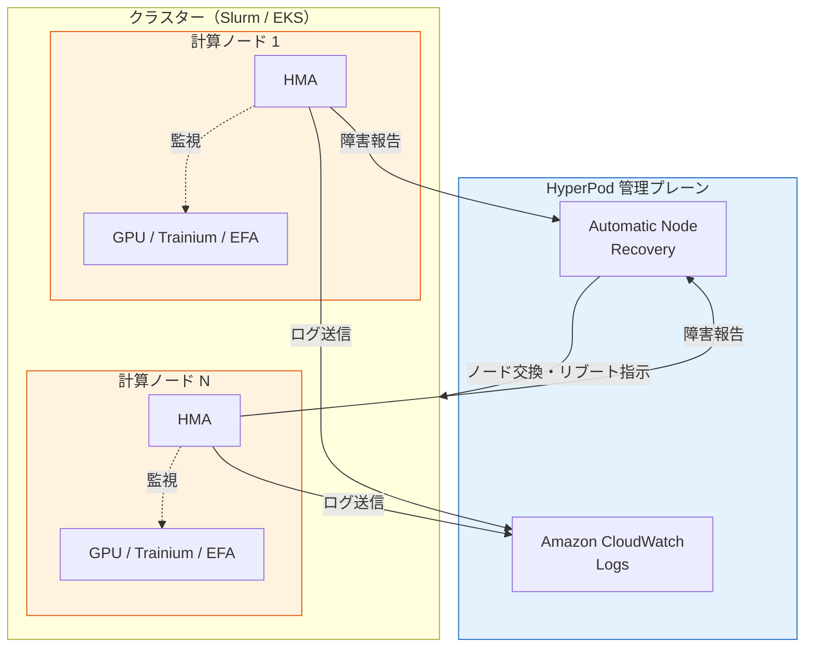
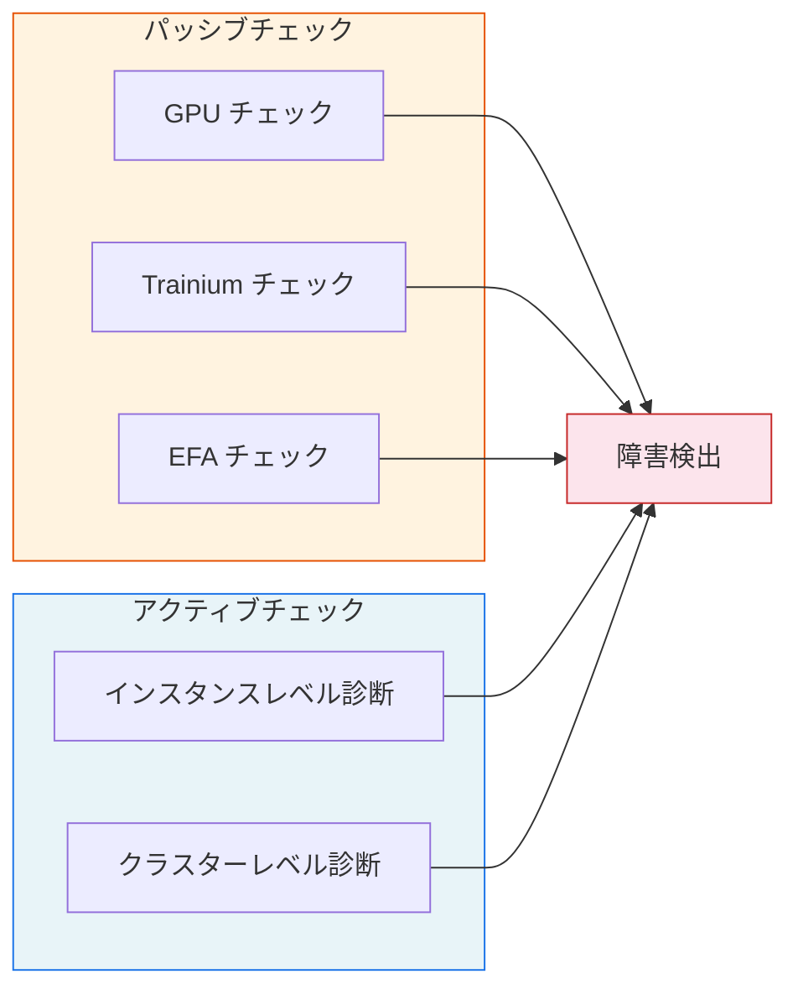
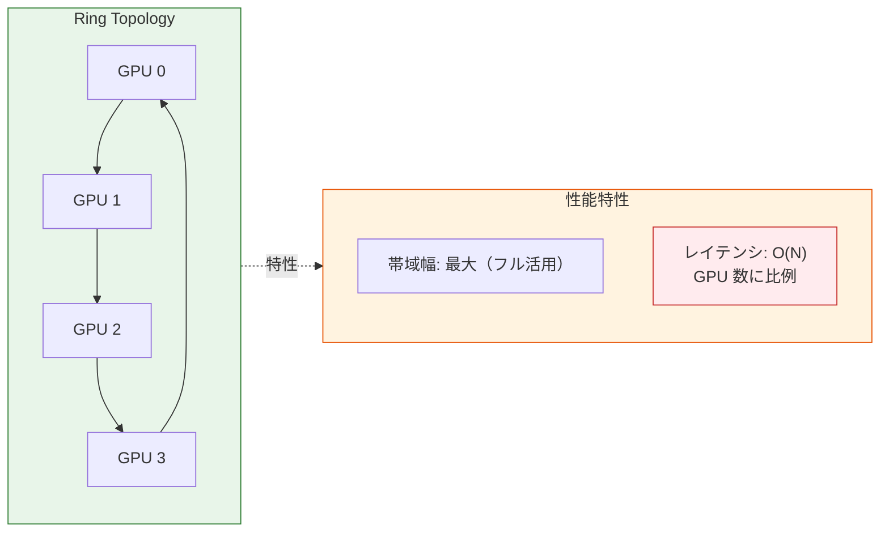
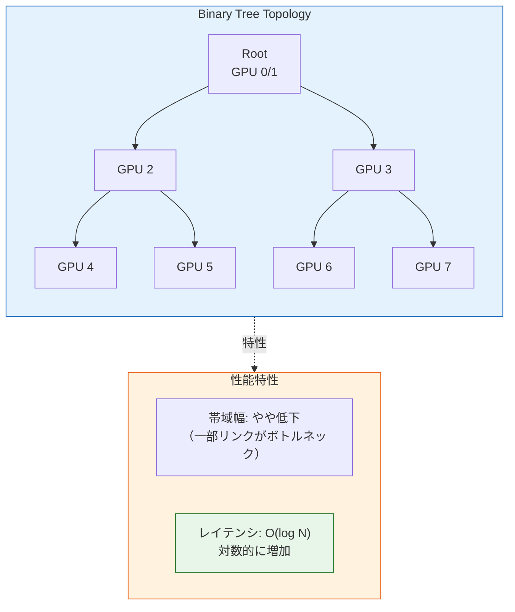
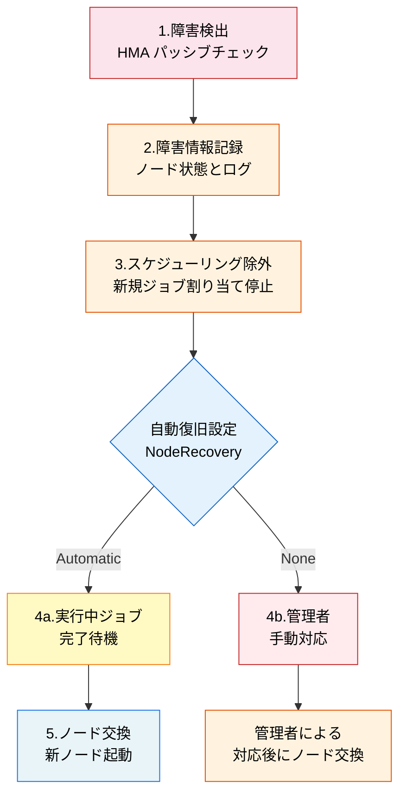
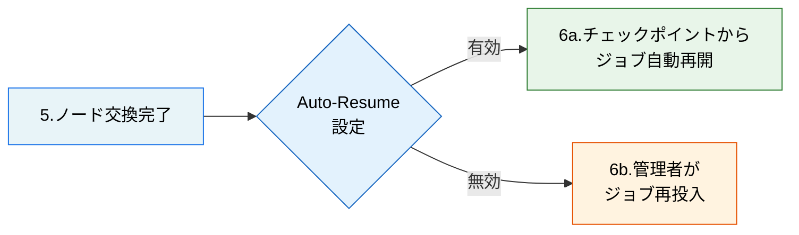

## はじめに

本記事は SageMaker HyperPod 機能解説シリーズの一部です。以下の関連記事も公開済みですので、あわせて参照してください。

- [Checkpointless Training による GPU メモリからの障害復旧](https://zenn.dev/yunokiisshin/articles/45a746434b2090)
- [Elastic Training によるノード数の動的調整](https://zenn.dev/yunokiisshin/articles/be0db364a7f8e2)
- [Managed Tiered Checkpointing による効率的なチェックポイント保存](https://zenn.dev/yunokiisshin/articles/98e6a7acbac32e)

:::message alert
本記事は 2026 年 2 月時点の公式ドキュメント、オープンソースコードなどに基づく調査記事です。内容に誤りがある可能性もあるため、必ず最新の公式ドキュメントを正として確認してください。誤りを発見された場合はコメントでお知らせください。
:::

Amazon SageMaker HyperPod は、大規模な機械学習の訓練ワークロードを実行するためのマネージドインフラストラクチャです。数百～数千ノードを長時間稼働させる訓練では、GPU や Trainium などのアクセラレータ、EFA（Elastic Fabric Adapter）といったハードウェアに障害が発生することは避けられません。

本記事では、HyperPod の中核コンポーネントである **Health Monitoring Agent（HMA）** を解説します。HMA は各ノード上で動作する常駐エージェントで、ハードウェアの健全性を継続的に監視し、障害検出時にはノードの交換やリブートを自動実行します。HMA は 2026 年 1 月に v3.6.0 として正式リリースされ、Enhanced Nvidia timeout analysis 機能（GPU の応答停止やタイムアウトの根本原因を詳細に分析する機能）が搭載されました（[GitHub Release v3.6.0](https://github.com/aws/sagemaker-hyperpod-cli/releases/tag/v3.6.0)参照）。

まず HMA のアーキテクチャを Slurm 環境と EKS 環境の両方で概観し、次にヘルスチェックの分類（パッシブチェックとアクティブチェック）を詳述します。その後、診断技術の内部構造（DCGM（Data Center GPU Manager）Level 4 診断と NCCL（NVIDIA Collective Communications Library）集団通信アルゴリズム）、障害検出から復旧までの対応フロー、Slurm 環境での統合方法、Auto-Resume によるジョブの自動再開、EKS 環境での統合方法、ログとモニタリングの順に解説します。

## アーキテクチャ

HMA は各計算ノードに常駐するエージェントで、ハードウェアの健全性を監視し、障害を検出すると HyperPod 管理プレーンに報告します。



Slurm 環境ではシステムデーモンとして、EKS 環境では DaemonSet として各ノードにデプロイされます。いずれの環境でも、HMA はハードウェア監視、障害報告、ログ送信の役割を担います。

## ヘルスチェックの分類

HMA のヘルスチェックは、パッシブチェック（常時監視）とアクティブチェック（Deep Health Checks）の 2 種類に分類されます（[公式ドキュメント](https://docs.aws.amazon.com/sagemaker/latest/dg/sagemaker-hyperpod-eks-resiliency-health-monitoring-agent.html)参照）。



### パッシブチェック（HMA による常時監視）

各ノード上でバックグラウンドで継続的に実行される軽量な監視です。訓練ジョブの実行中も常時動作し、障害を即座に検出します。

**GPU (NVIDIA) チェック**

| チェック項目 | 説明 |
|---|---|
| [DCGM（Data Center GPU Manager）](https://developer.nvidia.com/dcgm) ポリシー違反通知 | NVIDIA DCGM が報告するポリシー違反イベント（ECC（Error Correcting Code）エラー等）を監視 |
| [`nvidia-smi`](https://docs.nvidia.com/deploy/nvml-api/group__nvmlDeviceQueries.html) 出力エラー | `nvidia-smi` の出力を解析し、GPU の動作状態を判定 |
| EC2 プラットフォームログ | インスタンスレベルのハードウェアエラーを検出 |
| GPU 数の検証 | 認識される GPU 数とインスタンスタイプの期待値を比較（例: ml.p5.48xlarge は 8 GPU） |

**Trainium ([AWS Neuron](https://awsdocs-neuron.readthedocs-hosted.com/en/latest/)) チェック**

| チェック項目 | 説明 |
|---|---|
| [Neuron Monitor](https://awsdocs-neuron.readthedocs-hosted.com/en/latest/tools/neuron-sys-tools/neuron-monitor-user-guide.html#cmdoption-neuron-monitor-arg-neuron-monitor) 出力 | AWS Neuron Monitor が報告するハードウェアエラーを監視 |
| Neuron node problem detector 出力 | Neuron node problem detector が検出した異常を監視 |
| EC2 プラットフォームログ | インスタンスレベルのハードウェアエラーを検出 |
| Neuron デバイス数の検証 | `neuron-ls` の出力とインスタンスタイプの期待デバイス数を比較 |

**ネットワーク ([EFA](https://aws.amazon.com/hpc/efa/)) チェック**

:::message
EKS 環境の公式ドキュメント（[Health Monitoring Agent](https://docs.aws.amazon.com/sagemaker/latest/dg/sagemaker-hyperpod-eks-resiliency-health-monitoring-agent.html)）では、EFA のパッシブチェック項目は明示されていません。EFA は Deep Health Check（アクティブチェック）のインスタンスレベルテストとして記載されています（[Deep Health Checks](https://docs.aws.amazon.com/sagemaker/latest/dg/sagemaker-hyperpod-eks-resiliency-deep-health-checks.html)参照）。
:::

### アクティブチェック（Deep Health Checks）

クラスターの**作成時**および**更新時**に自動実行される包括的なハードウェア診断です（[公式ドキュメント](https://docs.aws.amazon.com/sagemaker/latest/dg/sagemaker-hyperpod-eks-resiliency-deep-health-checks.html)参照）。パッシブチェックでは検出できない潜在的な問題を、負荷テストや通信性能テストによって洗い出します。

:::message
Deep Health Check はクラスター作成・更新時に自動実行されるほか、[`UpdateClusterSoftware` API](https://docs.aws.amazon.com/sagemaker/latest/APIReference/API_UpdateClusterSoftware.html) によるソフトウェア更新時にも実行されます。DCGM 診断やストレステストを含むため、クラスター更新時のダウンタイムを計画する際に考慮してください。
:::

**インスタンスレベル**（[公式ドキュメント](https://docs.aws.amazon.com/sagemaker/latest/dg/sagemaker-hyperpod-eks-resiliency-deep-health-checks.html#sagemaker-hyperpod-eks-resiliency-deep-health-checks-instance)参照）

| テスト | 対象 | 説明 |
|---|---|---|
| [DCGM](https://docs.nvidia.com/datacenter/dcgm/latest/user-guide/index.html) Diagnostics | GPU | メモリテストを含む包括的な GPU 診断（DCGM の Level 4 診断を使用） |
| GPU/NVLink Count | GPU | GPU 数と NVLink 接続数がインスタンスタイプの期待値と一致するか検証 |
| Neuron sysfs | Trainium | Neuron ドライバーが公開する sysfs カウンターを読み取り、ハードウェアエラーを検出 |
| Neuron Hardware Check | Trainium | 実際の訓練ワークロードを実行し、Neuron デバイスの動作を検証 |
| NCCOM Local Test | Trainium | 単一ノード内の NeuronCore 間の集約通信性能を評価 |
| [EFA](https://aws.amazon.com/hpc/efa/) Test | GPU/Trainium | EFA のレイテンシと帯域幅をベンチマーク |

**クラスターレベル**（[公式ドキュメント](https://docs.aws.amazon.com/sagemaker/latest/dg/sagemaker-hyperpod-eks-resiliency-deep-health-checks.html#sagemaker-hyperpod-eks-resiliency-deep-health-checks-cluster)参照）

| テスト | 対象 | 説明 |
|---|---|---|
| [NCCL（NVIDIA Collective Communications Library）](https://developer.nvidia.com/nccl) Test | GPU | [`all_reduce_perf`](https://github.com/NVIDIA/nccl-tests) を用いた複数ノード間の GPU 集約通信性能検証 |
| NCCOM Cluster Test | Trainium | 複数ノード間の NeuronCore 集約通信性能検証 |

**NCCL テストの閾値判定例**

Deep Health Check のクラスターレベル診断で実行される NCCL テストの結果例を示します（[公式ドキュメント](https://docs.aws.amazon.com/sagemaker/latest/dg/sagemaker-hyperpod-eks-resiliency-deep-health-checks.html#sagemaker-hyperpod-eks-resiliency-deep-health-checks-logs)参照）。

:::message
以下は公式ドキュメントのログ出力のフィールドを JSON 形式で整理した例です。実際のログはテキスト形式で出力されます。
:::

```json
{
  "NcclMaxAlgoBw": 1.190000,
  "NcclAvgAlgoBw": 0.488398,
  "NcclThresholdAlgoBw": 1.180000,
  "NcclOutOfBoundError": "OK",
  "NcclOperations": "all_reduce_perf",
  "NcclTotalDevices": 2,
  "NcclNodes": 2
}
```

帯域幅の値は NCCL テストの出力フィールド（`algbw`）から取得され、単位は GB/s と推測されます。閾値はインスタンスタイプに応じて HyperPod が自動設定します。

公式ドキュメントには合格条件が明示されていませんが、ログ出力のフィールドから推測される合格条件は `NcclMaxAlgoBw >= NcclThresholdAlgoBw` かつ `NcclOutOfBoundError == "OK"` の両方を満たすことです。上記の例では、`NcclMaxAlgoBw`（1.19 GB/s）が閾値（1.18 GB/s）を上回り、エラーもないため合格と判定されると考えられます。

## 診断技術の内部構造

HyperPod の Health Monitoring Agent は、NVIDIA DCGM と NCCL という 2 つの OSS 技術を活用して GPU クラスターの健全性を診断します。このセクションでは、それらの内部アーキテクチャを解説します。

### DCGM Level 4 診断のプラグインアーキテクチャ

**NVIDIA Data Center GPU Manager（DCGM）** は、GPU の健全性診断を提供するデーモンです。HyperPod では特に **Level 4 診断**（包括的な診断レベル）を使用しています（[DCGM ユーザーガイド](https://docs.nvidia.com/datacenter/dcgm/latest/user-guide/index.html)、[DCGM GitHub](https://github.com/NVIDIA/DCGM)参照）。

Level 4 診断は、複数の**プラグイン**を組み合わせて GPU のハードウェア・ソフトウェア全体を検証します。


各プラグインは独立して実行可能で、以下の役割を持ちます。

| プラグイン | 検証対象 | 検出する障害例 |
|----------|---------|--------------|
| **PCIe Plugin** | PCIe バス帯域幅 | PCIe レーン縮退、帯域幅低下 |
| **Memory Plugin** | GPU メモリ帯域幅 | メモリコントローラ障害、帯域幅低下 |
| **Stress Plugin** | 電力・温度管理 | 冷却不良、電源供給異常 |
| **Diagnostic Plugin** | Streaming Multiprocessor 演算精度 | 演算エラー、ハードウェア劣化 |
| **Memtest Plugin** | メモリビットレベル整合性 | VRAM ビットエラー、ECC 訂正不能エラー |
| **Pulse Plugin** | GPU 応答性 | GPU ハング、応答遅延 |

HyperPod の Deep Health Check は、これらのプラグインを組み合わせて包括的な診断を実行し、障害の早期発見を実現しています。

### NCCL 集団通信アルゴリズム: Ring vs Tree

**NVIDIA Collective Communications Library（NCCL）** は、分散学習における GPU 間の集団通信（AllReduce、AllGather など）を最適化するライブラリです（[NCCL ドキュメント](https://docs.nvidia.com/deeplearning/nccl/user-guide/docs/usage/collectives.html)、[NCCL GitHub](https://github.com/NVIDIA/nccl)参照）。

HyperPod の NCCL テストでは、特に **AllReduce** 操作（`all_reduce_perf`）の性能を検証します（[公式ドキュメント](https://docs.aws.amazon.com/sagemaker/latest/dg/sagemaker-hyperpod-eks-resiliency-deep-health-checks.html#sagemaker-hyperpod-eks-resiliency-deep-health-checks-cluster)参照）。NCCL は、ネットワーク特性に応じて最大帯域幅を達成できるよう、**Ring アルゴリズム**と **Tree アルゴリズム**を自動的に切り替えます。NVIDIA の技術ブログでは "NCCL automatically switches back to rings when that pattern results in greater bandwidth" と記載されています（[NCCL 2.4 アルゴリズム詳解](https://developer.nvidia.com/blog/massively-scale-deep-learning-training-nccl-2-4/)参照）。

#### Ring AllReduce

Ring アルゴリズムは、GPU をリング状に接続し、データを順次転送します。



このアルゴリズムの利点として、すべてのリンクを同時に使用するため、ネットワーク帯域幅を最大限活用できます。一方で欠点として、レイテンシが GPU 数 N に比例して増加（O(N)）するため、数百台以上のスケールではボトルネックになります。

#### Tree AllReduce（大規模スケール最適化）

Tree アルゴリズムは、GPU を二分木（またはより高次の木）構造で接続し、階層的にデータを集約します。



このアルゴリズムの利点として、レイテンシが O(log N) に抑えられ、大規模クラスター（数千 GPU）でもスケールします。一方で欠点として、ルート付近のノードに通信が集中するため、帯域幅の利用効率がやや低下します。

NCCL は、クラスタートポロジーと通信パターンに応じて、最大帯域幅を達成できるアルゴリズムを自動的に選択します（[NCCL 2.4 アルゴリズム詳解](https://developer.nvidia.com/blog/massively-scale-deep-learning-training-nccl-2-4/)参照）。特に大規模クラスター（数千 GPU 規模）では、Tree アルゴリズムが低レイテンシを実現します。

HyperPod の NCCL テストでは、選択されたアルゴリズムが期待される帯域幅（`NcclThresholdAlgoBw`）を達成できるかを検証します。テストが失敗する場合、ネットワークトポロジーの問題（スイッチ障害、ケーブル不良など）が疑われます。

:::message
**実環境での効果**: NVIDIA の検証では、24k GPU 規模のクラスターにおいて、Tree アルゴリズムが Ring に比べて最大 180 倍のレイテンシ改善を達成しました（[NCCL 2.4 アルゴリズム詳解](https://developer.nvidia.com/blog/massively-scale-deep-learning-training-nccl-2-4/)参照）。この改善は、ResNet-50 などの実際の訓練ワークロードにおいても、スケール時の訓練スループット向上として観測されています。
:::

::::details マルチレール環境での NCCL の挙動は？

:::message
P5 インスタンスのように複数の EFA インターフェース（ネットワークレール）を持つ環境で、NCCL はどのように動作するのでしょうか？
:::

**NCCL の環境変数**

NCCL は `NCCL_CROSS_NIC` 環境変数で複数 NIC の使用方法を制御します（[NCCL 環境変数ドキュメント](https://docs.nvidia.com/deeplearning/nccl/user-guide/docs/env.html)参照）。

| 設定値 | 動作 |
|-------|------|
| `NCCL_CROSS_NIC=0` | 同じリング/ツリーで同じ NIC を使用（レール交差を避ける） |
| `NCCL_CROSS_NIC=1` | 異なる NIC の使用を許可（全 NIC が同じスイッチに接続されている場合に最適） |
| `NCCL_CROSS_NIC=2`（デフォルト） | 同じ NIC を優先しつつ、より良いパフォーマンスが得られる場合は異なる NIC を使用 |

**P5 インスタンスでの可能性**

P5 インスタンスは最大 3,200 Gbps のネットワーク帯域幅を提供します（[Amazon EC2 P5 インスタンス](https://aws.amazon.com/ec2/instance-types/p5/)参照）。特に p5.48xlarge は最大 32 個のネットワークインターフェースをサポートしています（[Amazon EC2 アクセラレーテッドコンピューティングインスタンス仕様](https://docs.aws.amazon.com/ec2/latest/instancetypes/ac.html)参照）。

EFA ドキュメントでは "Instance types that support multiple network cards can be configured with one EFA per network card" と記載されています（[EFA ドキュメント](https://docs.aws.amazon.com/AWSEC2/latest/UserGuide/efa.html)参照）。複数のネットワークインターフェースを持つインスタンスでは、理論上、各 GPU が複数の EFA を利用することで、通信帯域幅を向上させることができます。

:::message alert
**結論として、現時点では不明です**

HyperPod 環境における具体的な rail-optimized 設定や、NCCL テストが複数 EFA をどのように活用しているかは、調べましたが AWS 公式ドキュメントに記載されていませんでした。今後実験にチャレンジしてみたいと思います。
:::

::::

## 障害検出と対応フロー

HMA が障害を検出すると、以下のステップで自動的に対応が進みます。

フロー図の「自動復旧設定」は、[`CreateCluster` API](https://docs.aws.amazon.com/sagemaker/latest/APIReference/API_CreateCluster.html) のクラスターレベルの `NodeRecovery` パラメータに対応します。`Automatic` を指定すると、障害検出時に HyperPod が自動的にノードの交換・リブートを実行します。`None` を指定すると、管理者が手動で対応する必要があります。この設定は Slurm と EKS いずれの環境でも共通です。



:::message
上記フローの Step 1-5 は Slurm と EKS で共通ですが、Step 2-3 の実装方法が異なります。

- **EKS 環境**: 障害情報はノードラベル・アノテーション・ノード条件として Kubernetes API に反映され、`NoSchedule` テイントが付与されます
- **Slurm 環境**: `scontrol show node` の State / Reason フィールドおよび HMA ログに記録され、ノードが `drain` 状態に遷移します

ノード交換後のジョブ復旧については、オーケストレーター別に後述します。
:::

### 閾値ベースの判定

HMA は閾値ベースの判定を使用して、一時的な変動と永続的な障害を区別します。例えば、Deep Health Check の NCCL テストでは、測定された帯域幅（`NcclMaxAlgoBw`）が事前定義された閾値（`NcclThresholdAlgoBw`）以上で、かつ外れ値エラー（`NcclOutOfBoundError`）がない場合に合格と判定されます。

## Slurm 環境での統合

HMA は [Slurm](https://slurm.schedmd.com/documentation.html) 標準の `HealthCheckProgram` とは独立して動作します。ノードの健全性は HyperPod 管理プレーンが管理し、Slurm のノード状態と連携して障害対応を実行します。

### ジョブ復旧（Step 6）

Slurm 環境では、ノード交換後のジョブ復旧に **Auto-Resume** 機能を使用します。`srun` コマンドに `--auto-resume` フラグを付けてジョブを起動すると、ノード障害が発生した際に、新しいノードでチェックポイントから自動的にジョブを再開します。



Auto-Resume の詳細な実装については、後述の「Auto-Resume の実装」セクションを参照してください。

### 手動操作（Slurm コマンド）

HyperPod は `scontrol` の `reason` フィールドに含まれる `Action:` プレフィックスを解析してアクションを決定します（[公式ドキュメント](https://docs.aws.amazon.com/sagemaker/latest/dg/sagemaker-hyperpod-resiliency-slurm-replace-faulty-instance.html)参照）。

```bash
# リブート
scontrol update node=<ip-address> state=fail reason="Action: Reboot"

# 交換
scontrol update node=<ip-address> state=fail reason="Action: Replace"

# 強制交換（state=down は実行中のジョブを強制終了する。管理者権限が必要）
sudo scontrol update node=<ip-address> state=down reason="Action: Replace"
```

:::message alert
**警告**: `state=down` を使用すると、ノード上で実行中のすべてのジョブが強制終了されます（[公式ドキュメント](https://docs.aws.amazon.com/sagemaker/latest/dg/sagemaker-hyperpod-resiliency-slurm-replace-faulty-instance.html)参照）。保存されていない作業はすべて失われる可能性があるため、最終手段としてのみ使用してください。通常は `state=fail` を使用し、実行中のジョブが完了するのを待つべきです。
:::

:::message
この方法は Slurm コントローラーへの直接アクセスが必要です。AWS API（次項）の方が高速で、すべてのオーケストレーターで動作するため推奨されます。
:::

### API ベースの操作（推奨）

ノードのリブートや交換は、AWS API を使用して実行します（[BatchRebootClusterNodes API](https://docs.aws.amazon.com/sagemaker/latest/APIReference/API_BatchRebootClusterNodes.html)、[BatchReplaceClusterNodes API](https://docs.aws.amazon.com/sagemaker/latest/APIReference/API_BatchReplaceClusterNodes.html)参照）。この方法は Slurm と EKS の両方で使用でき、公式に推奨されています。

```bash
# リブート
aws sagemaker batch-reboot-cluster-nodes \
    --cluster-name "arn: aws: sagemaker: us-west-2:123456789012: cluster/my-cluster" \
    --node-ids i-0123456789abcdef0

# 交換
aws sagemaker batch-replace-cluster-nodes \
    --cluster-name "arn: aws: sagemaker: us-west-2:123456789012: cluster/my-cluster" \
    --node-ids i-0123456789abcdef0
```

### Slurm コマンドと API の比較

| 操作 | Slurm コマンド | ジョブへの影響 | API |
|---|---|---|---|
| リブート | `scontrol update ... state=fail reason="Action: Reboot"` | 実行中のジョブ完了後に実行 | `batch-reboot-cluster-nodes` |
| 交換 | `scontrol update ... state=fail reason="Action: Replace"` | 実行中のジョブ完了後に実行 | `batch-replace-cluster-nodes` |
| 強制交換 | `sudo scontrol update ... state=down reason="Action: Replace"` | 実行中のジョブを強制終了 | 該当なし |

## Auto-Resume の実装

`srun --auto-resume` は HyperPod が独自に拡張したフラグで、障害によるノード交換後にジョブを自動的に再開します（[公式ドキュメント](https://docs.aws.amazon.com/sagemaker/latest/dg/sagemaker-hyperpod-resiliency-slurm-auto-resume.html)参照）。

```bash
#!/bin/bash
#SBATCH --nodes 2
#SBATCH --ntasks-per-node=1
#SBATCH --exclusive

srun --auto-resume=1 train_auto_resume.sh
```

**Auto-Resume 対応の訓練スクリプト例**

以下のスクリプトは公式ドキュメントの例に基づいています（[公式ドキュメント](https://docs.aws.amazon.com/sagemaker/latest/dg/sagemaker-hyperpod-resiliency-slurm-auto-resume.html)参照）。

```bash
#!/bin/bash
# train_auto_resume.sh

# $SLURM_JOB_NODELIST は Auto-Resume 後に古い値が残るため使用しない
# scontrol から動的にノードリストを取得する
NODE_LIST=$(scontrol show jobid=$SLURM_JOBID | \
            awk -F= '/NodeList=/{print $2}' | \
            grep -v Exc)

MASTER_NODE=$(scontrol show hostname $NODE_LIST | head -n 1)

MASTER_ADDR=$(scontrol show node=$MASTER_NODE | \
              awk -F= '/NodeAddr=/{print $2}' | \
              awk '{print $1}')

torchrun --nnodes=$SLURM_NNODES \
         --nproc_per_node=8 \
         --node_rank=$SLURM_NODEID \
         --master_addr=$MASTER_ADDR \
         --master_port=29500 \
         your_training_script.py
```

:::message alert
`--auto-resume=1` 使用の場合は `--exclusive` 指定が必須です。`$SLURM_JOB_NODELIST` は Auto-Resume 後に更新されないため、上記スクリプトのように `scontrol` で動的にノードリストを取得してください。
:::

:::message
GRES（Generic Resource Scheduling）が有効な環境では、Slurm がノード割り当ての変更を許可しないため、Auto-Resume によるチェックポイントからのジョブ再開ができません（[公式ドキュメント](https://docs.aws.amazon.com/sagemaker/latest/dg/sagemaker-hyperpod-resiliency-slurm-auto-resume.html)参照）。この場合、HyperPod はジョブを自動的にキューに再投入し、最初から再実行します。ただし、訓練スクリプトにチェックポイントのロードロジックが実装されていれば、訓練自体は保存済みのチェックポイントから再開可能です。
:::

## EKS 環境での統合

EKS 環境では、ノード交換後のジョブ復旧に **Checkpointless Training** と **Elastic Training** を使用します。これらは Slurm の Auto-Resume とは異なるアプローチで、障害からの自動復旧を実現します。

### ジョブ復旧

EKS 環境では、以下のような復旧メカニズムを利用できます。

**Checkpointless Training（In-Process Recovery）**

GPU メモリ内にレプリカを保持することで、チェックポイント I/O なしで障害から復旧します。詳細は [Checkpointless Training の解説記事](https://zenn.dev/yunokiisshin/articles/45a746434b2090)を参照してください。

**Elastic Training**

PyTorch Elastic の Rendezvous メカニズムを利用して、ノード数を動的に調整しながらジョブを継続します。詳細は [Elastic Training の解説記事](https://zenn.dev/yunokiisshin/articles/be0db364a7f8e2)を参照してください。

:::message
これらの復旧メカニズムは異なる目的を持つ機能です。Checkpointless Training は障害発生時の状態復旧に焦点を当て、Elastic Training はノード数の動的調整によるジョブの継続に焦点を当てています。公式ドキュメントでは、これらが相互排他的か併用可能かは明示されていません。
:::

### 手動操作

EKS 環境では、`kubectl` コマンドでノード状態を確認し、AWS API でノードの交換・リブートを実行します。

```bash
# ノード状態の確認
kubectl get nodes
kubectl describe node <node-name>

# ノードラベルの確認
kubectl get node <node-name> -o jsonpath='{.metadata.labels.sagemaker\.amazonaws\.com/node-health-status}'
```

HyperPod は `sagemaker.amazonaws.com/node-health-status` ラベルでノードの健全性を管理します（[ノードラベルのドキュメント](https://docs.aws.amazon.com/sagemaker/latest/dg/sagemaker-hyperpod-eks-resiliency-node-labels.html)参照）。ノードのリブートや交換は、ラベルを変更することで実行できます（[手動操作のドキュメント](https://docs.aws.amazon.com/sagemaker/latest/dg/sagemaker-hyperpod-eks-resiliency-manual.html)参照）。また、Slurm 環境と同じ AWS API も使用できます。詳細は「Slurm 環境での統合」セクションの「API ベースの操作（推奨）」を参照してください。

## ログとモニタリング

### Amazon CloudWatch ログ

HMA のログは自動的に Amazon CloudWatch Logs に送信されます（[Health Monitoring Agent のドキュメント](https://docs.aws.amazon.com/sagemaker/latest/dg/sagemaker-hyperpod-eks-resiliency-health-monitoring-agent.html)参照）。

```text
ロググループ: /aws/sagemaker/Clusters/<cluster_name>/<cluster_id>
ログストリーム: SagemakerHealthMonitoringAgent (ノードごとに 1 つ)
```

### ノードローカルログ

Deep Health Check の結果はノードローカルにも保存されるため、CloudWatch にアクセスできない場合でも確認可能です（[Deep Health Checks のドキュメント](https://docs.aws.amazon.com/sagemaker/latest/dg/sagemaker-hyperpod-eks-resiliency-deep-health-checks.html)参照）。

```text
/var/log/aws/clusters/sagemaker-deep-health-check.log
```

## まとめ

本記事では、SageMaker HyperPod の Health Monitoring Agent（HMA）について、アーキテクチャからヘルスチェックの仕組み、障害対応フロー、運用方法までを解説しました。

## 参考資料

- [Amazon SageMaker HyperPod Health Monitoring ドキュメント](https://docs.aws.amazon.com/sagemaker/latest/dg/sagemaker-hyperpod-operate-health-monitor.html)
- [SageMaker HyperPod ワークショップ](https://catalog.workshops.aws/sagemaker-hyperpod/en-US)
- [SageMaker HyperPod 開発者ガイド](https://docs.aws.amazon.com/sagemaker/latest/dg/sagemaker-hyperpod.html)
- [NVIDIA DCGM](https://developer.nvidia.com/dcgm)
- [NVIDIA DCGM User Guide](https://docs.nvidia.com/datacenter/dcgm/latest/user-guide/index.html) -- Level 4 診断とプラグインアーキテクチャの詳細
- [NVIDIA DCGM GitHub](https://github.com/NVIDIA/DCGM)
- [NVIDIA NVML API Reference](https://docs.nvidia.com/deploy/nvml-api/group__nvmlDeviceQueries.html)
- [NVIDIA NCCL](https://developer.nvidia.com/nccl)
- [NVIDIA NCCL User Guide - Collectives](https://docs.nvidia.com/deeplearning/nccl/user-guide/docs/usage/collectives.html) -- AllReduce 等の集団通信操作
- [NVIDIA NCCL 2.4 Algorithm Deep Dive](https://developer.nvidia.com/blog/massively-scale-deep-learning-training-nccl-2-4/) -- Ring vs Tree アルゴリズムの詳細解説
- [NVIDIA NCCL Tests](https://github.com/NVIDIA/nccl-tests)
- [NVIDIA NCCL GitHub](https://github.com/NVIDIA/nccl)
- [AWS Neuron SDK Documentation](https://awsdocs-neuron.readthedocs-hosted.com/en/latest/)
- [AWS Elastic Fabric Adapter (EFA)](https://aws.amazon.com/hpc/efa/)
- [Slurm Workload Manager Documentation](https://slurm.schedmd.com/documentation.html)