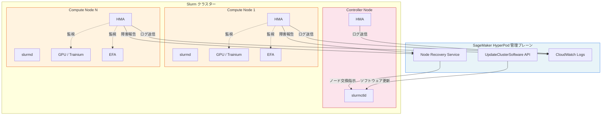
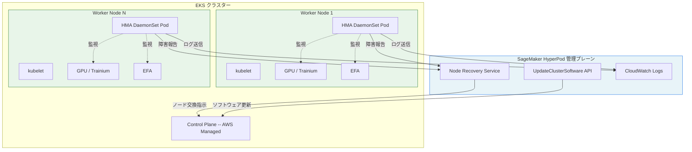
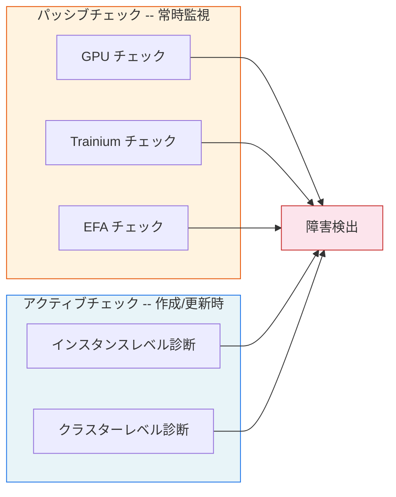
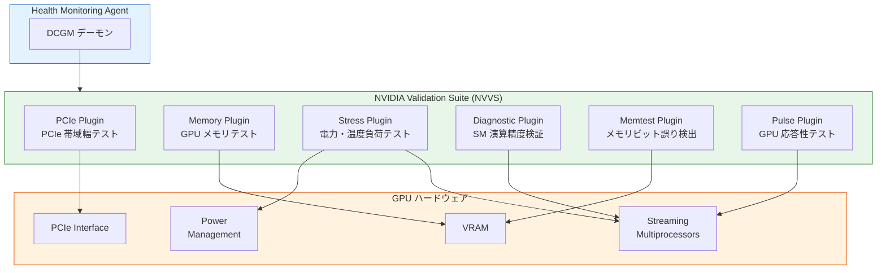
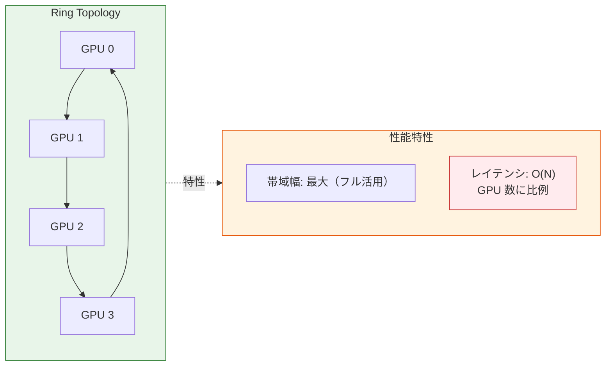
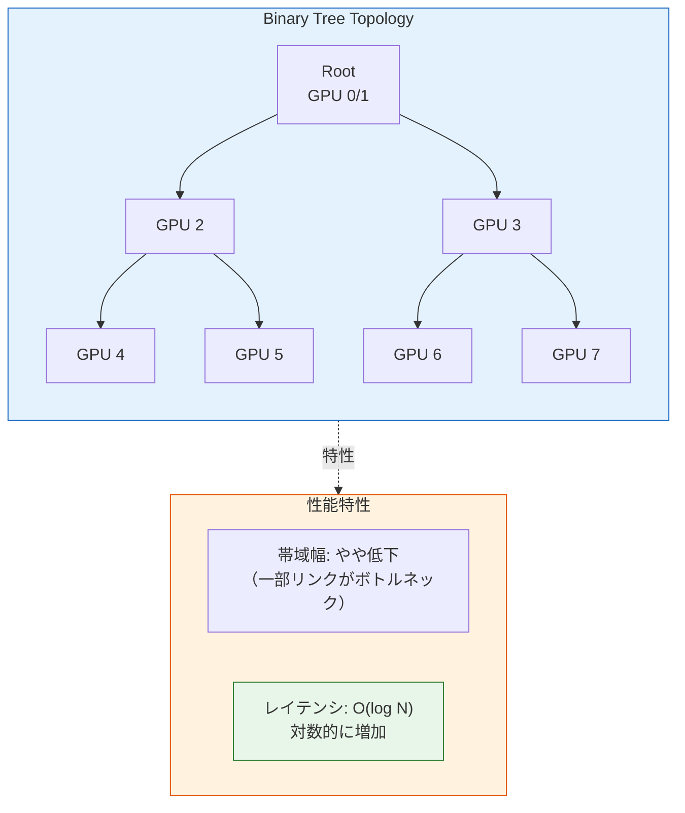
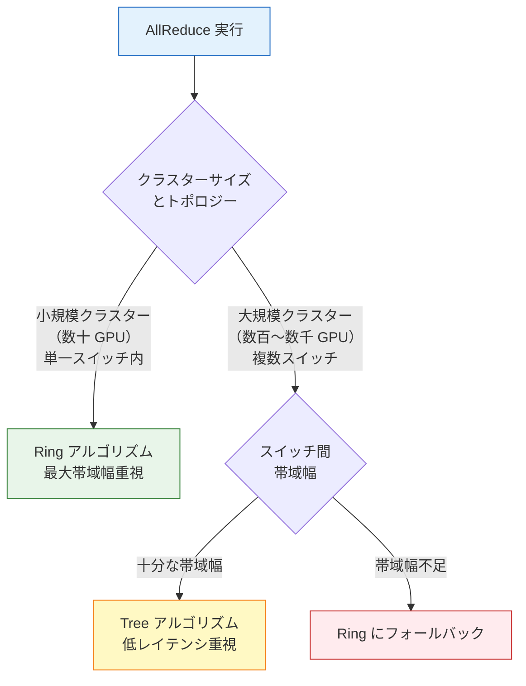
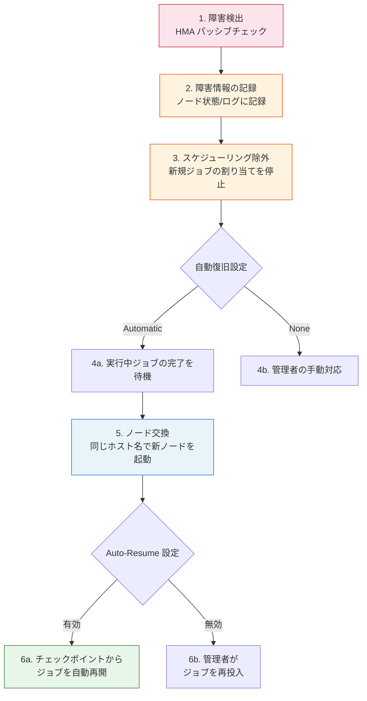

## はじめに

本記事は SageMaker HyperPod 機能解説シリーズの一部です。以下の記事も公開済みですので、あわせて参照してください。

https://zenn.dev/yunokiisshin/articles/45a746434b2090

https://zenn.dev/yunokiisshin/articles/be0db364a7f8e2

https://zenn.dev/yunokiisshin/articles/98e6a7acbac32e

:::message alert
本記事は 2026 年 2 月時点の公式ドキュメント、オープンソースコードなどに基づく調査記事です。内容に誤りがある可能性もあるため、必ず最新の公式ドキュメントを正として確認してください。誤りを発見された場合はコメントでお知らせください。
:::

Amazon SageMaker HyperPod は、大規模な機械学習の訓練ワークロードを実行するためのマネージドインフラストラクチャです。数百～数千ノードを長時間稼働させる訓練では、GPU や Trainium などのアクセラレータ、EFA（Elastic Fabric Adapter）といったハードウェアに障害が発生することは避けられません。

本記事では、HyperPod の中核コンポーネントである **Health Monitoring Agent（HMA）** を解説します。HMA は各ノード上で動作する常駐エージェントで、ハードウェアの健全性を継続的に監視し、障害検出時にはノードの交換やリブートを自動実行します。

まず HMA のアーキテクチャを Slurm 環境と EKS 環境の両方で概観し、次にヘルスチェックの分類（パッシブチェックとアクティブチェック）を詳述します。その後、障害検出から復旧までの対応フロー、Slurm との統合方法、Auto-Resume によるジョブの自動再開、ログとモニタリングの順に解説します。

## アーキテクチャ

デプロイ形態はオーケストレータによって異なります。

**Slurm 環境のアーキテクチャ**



**EKS 環境のアーキテクチャ**



Slurm 環境ではシステムデーモンとして各ノードにインストールされ、EKS 環境では DaemonSet として各 Worker Node にデプロイされます。いずれの環境でも、HMA は HyperPod 管理プレーンと連携して障害の検出・報告・復旧を行います。

## ヘルスチェックの分類

HMA のヘルスチェックは、**パッシブチェック（常時監視）**と**アクティブチェック（Deep Health Checks）**の 2 種類に分類されます（[公式ドキュメント](https://docs.aws.amazon.com/sagemaker/latest/dg/sagemaker-hyperpod-operate-health-monitor.html)参照）。



### パッシブチェック（HMA による常時監視）

各ノード上でバックグラウンドで継続的に実行される軽量な監視です。訓練ジョブの実行中も常時動作し、障害を即座に検出します。

**GPU (NVIDIA) チェック**

| チェック項目 | 説明 |
|---|---|
| [DCGM（Data Center GPU Manager）](https://developer.nvidia.com/dcgm) ポリシー違反通知 | NVIDIA DCGM が報告するポリシー違反イベント（ECC エラー等）を監視 |
| [`nvidia-smi`](https://docs.nvidia.com/deploy/nvml-api/group__nvmlDeviceQueries.html) 出力エラー | `nvidia-smi` の出力を解析し、GPU の動作状態を判定 |
| EC2 プラットフォームログ | インスタンスレベルのハードウェアエラーを検出 |
| GPU 数の検証 | 認識される GPU 数とインスタンスタイプの期待値を比較（例: ml.p5.48xlarge は 8 GPU） |

**Trainium ([AWS Neuron](https://awsdocs-neuron.readthedocs-hosted.com/en/latest/)) チェック**

| チェック項目 | 説明 |
|---|---|
| [Neuron Monitor](https://awsdocs-neuron.readthedocs-hosted.com/en/latest/) 出力 | AWS Neuron Monitor が報告するハードウェアエラーを監視 |
| Neuron NPD 出力 | Node Problem Detector が検出した異常を監視 |
| EC2 プラットフォームログ | インスタンスレベルのハードウェアエラーを検出 |
| Neuron デバイス数の検証 | `neuron-ls` の出力とインスタンスタイプの期待デバイス数を比較 |

**ネットワーク ([EFA](https://aws.amazon.com/hpc/efa/)) チェック**

| チェック項目 | 説明 |
|---|---|
| [EFA](https://aws.amazon.com/hpc/efa/) 接続テスト | EFA インターフェースの存在確認と接続性を検証 |

### アクティブチェック（Deep Health Checks）

クラスターの**作成時**および**更新時**に自動実行される包括的なハードウェア診断です。パッシブチェックでは検出できない潜在的な問題を、負荷テストや通信性能テストによって洗い出します。

:::message
Deep Health Check はクラスター作成・更新時に自動実行されるほか、`UpdateClusterSoftware` API によるソフトウェア更新時にも実行されます。DCGM 診断やストレステストを含むため、クラスター更新時のダウンタイムを計画する際に考慮してください。
:::

**インスタンスレベル**

| テスト | 対象 | 説明 |
|---|---|---|
| [DCGM](https://docs.nvidia.com/datacenter/dcgm/latest/user-guide/index.html) Diagnostics | GPU | メモリテストを含む包括的な GPU 診断（DCGM の Level 4 診断を使用） |
| GPU/NVLink Count | GPU | GPU 数と NVLink 接続数がインスタンスタイプの期待値と一致するか検証 |
| Neuron sysfs | Trainium | Neuron ドライバーが公開する sysfs カウンターを読み取り、ハードウェアエラーを検出 |
| Neuron Hardware Check | Trainium | 実際の訓練ワークロードを実行し、Neuron デバイスの動作を検証 |
| NCCOM Local Test | Trainium | 単一ノード内の NeuronCore 間の集約通信性能を評価 |
| [EFA](https://aws.amazon.com/hpc/efa/) Test | GPU/Trainium | EFA のレイテンシと帯域幅をベンチマーク |
| stress-ng | 全タイプ | CPU / メモリ / ディスクのストレステスト |

**クラスターレベル**

| テスト | 対象 | 説明 |
|---|---|---|
| [NCCL（NVIDIA Collective Communications Library）](https://developer.nvidia.com/nccl) Test | GPU | [`all_reduce_perf`](https://github.com/NVIDIA/nccl-tests) を用いた複数ノード間の GPU 集約通信性能検証 |
| NCCOM Cluster Test | Trainium | 複数ノード間の NeuronCore 集約通信性能検証 |

**NCCL テストの閾値判定例**

Deep Health Check のクラスターレベル診断で実行される NCCL テストの結果例を示します。

```json
{
  "NcclMaxAlgoBw": 1.190000,
  "NcclAvgAlgoBw": 0.488398,
  "NcclThresholdAlgoBw": 1.180000,
  "NcclOutOfBoundError": "OK",
  "NcclOperations": "all_reduce_perf",
  "NcclTotalDevices": 2,
  "NcclNodes": 2
}
```

帯域幅の単位は GB/s です。閾値はインスタンスタイプに応じて HyperPod が自動設定します。

**合格条件**: `NcclMaxAlgoBw >= NcclThresholdAlgoBw` かつ `NcclOutOfBoundError == "OK"` の両方を満たすこと。上記の例では、`NcclMaxAlgoBw`（1.19 GB/s）が閾値（1.18 GB/s）を上回り、エラーもないため合格と判定されます。

## 診断技術の内部構造

HyperPod の Health Monitoring Agent は、NVIDIA DCGM と NCCL という 2 つの OSS 技術を活用して GPU クラスターの健全性を診断します。このセクションでは、それらの内部アーキテクチャを解説します。

### DCGM Level 4 診断のプラグインアーキテクチャ

**NVIDIA Data Center GPU Manager（DCGM）** は、GPU の健全性診断を提供するデーモンです。HyperPod では特に **Level 4 診断**（包括的な診断レベル）を使用しています（[DCGM ユーザーガイド](https://docs.nvidia.com/datacenter/dcgm/latest/user-guide/index.html)、[DCGM GitHub](https://github.com/NVIDIA/DCGM)参照）。

Level 4 診断は、複数の**プラグイン**を組み合わせて GPU のハードウェア・ソフトウェア全体を検証します。



各プラグインは独立して実行可能で、以下の役割を持ちます。

| プラグイン | 検証対象 | 検出する障害例 |
|----------|---------|--------------|
| **PCIe Plugin** | PCIe バス帯域幅 | PCIe レーン縮退、帯域幅低下 |
| **Memory Plugin** | GPU メモリ帯域幅 | メモリコントローラ障害、帯域幅低下 |
| **Stress Plugin** | 電力・温度管理 | 冷却不良、電源供給異常 |
| **Diagnostic Plugin** | Streaming Multiprocessor 演算精度 | 演算エラー、ハードウェア劣化 |
| **Memtest Plugin** | メモリビットレベル整合性 | VRAM ビットエラー、ECC 訂正不能エラー |
| **Pulse Plugin** | GPU 応答性 | GPU ハング、応答遅延 |

HyperPod の Deep Health Check は、これらのプラグインを組み合わせて包括的な診断を実行し、障害の早期発見を実現しています。

### NCCL 集団通信アルゴリズム: Ring vs Tree

**NVIDIA Collective Communications Library（NCCL）** は、分散学習における GPU 間の集団通信（AllReduce、AllGather など）を最適化するライブラリです（[NCCL ドキュメント](https://docs.nvidia.com/deeplearning/nccl/user-guide/docs/usage/collectives.html)、[NCCL GitHub](https://github.com/NVIDIA/nccl)参照）。

HyperPod の NCCL テストでは、特に **AllReduce** 操作の性能を検証します。NCCL は、クラスタートポロジーに応じて **Ring アルゴリズム**と **Tree アルゴリズム**を自動選択します（[NCCL 2.4 アルゴリズム詳解](https://developer.nvidia.com/blog/massively-scale-deep-learning-training-nccl-2-4/)参照）。

#### Ring AllReduce

Ring アルゴリズムは、GPU をリング状に接続し、データを順次転送します。



**利点**: すべてのリンクを同時に使用するため、ネットワーク帯域幅を最大限活用できます。

**欠点**: レイテンシが GPU 数 N に比例して増加（O(N)）するため、数百台以上のスケールではボトルネックになります。

#### Tree AllReduce（大規模スケール最適化）

Tree アルゴリズムは、GPU を二分木（またはより高次の木）構造で接続し、階層的にデータを集約します。



**利点**: レイテンシが O(log N) に抑えられ、大規模クラスター（数千 GPU）でもスケールします。

**欠点**: ルート付近のノードに通信が集中するため、帯域幅の利用効率がやや低下します。

#### NCCL の自動選択戦略

NCCL は、以下の条件に基づいてアルゴリズムを自動選択します。



HyperPod の NCCL テストでは、この自動選択が正常に機能し、期待される帯域幅（`NcclThresholdAlgoBw`）を達成できるかを検証します。テストが失敗する場合、ネットワークトポロジーの問題（スイッチ障害、ケーブル不良など）が疑われます。

:::message
**実環境での効果**: NVIDIA の検証では、24k GPU 規模のクラスターにおいて、Tree アルゴリズムが Ring に比べて最大 180 倍のレイテンシ改善を達成しました。この改善は、ResNet-50 などの実際の訓練ワークロードにおいても、スケール時の訓練スループット向上として観測されています。
:::

## 障害検出と対応フロー

HMA が障害を検出すると、以下のステップで自動的に対応が進みます。



:::message
上記フローの各ステップはオーケストレータによって実装が異なります。**EKS 環境**では、Step 2 の障害情報はノードラベル・アノテーション・ノード条件として Kubernetes API に反映され、Step 3 では `NoSchedule` テイントが付与されます。**Slurm 環境**では、Step 2 の情報が `scontrol show node` の State / Reason フィールドおよび HMA ログに記録され、Step 3 ではノードが `drain` 状態に遷移します。
:::

### 誤検知の防止策

HMA は以下の手法で誤検知（false positive）を防止します。

| 手法 | 説明 | 具体例 |
|---|---|---|
| 段階的な対応 | 一時的障害と永続的障害を区別し、適切なアクションを選択 | GPU 数不一致 → まずリブート、再発 → ノード交換 |
| 複合的な診断 | 複数の情報ソースを統合して判定（単一指標のみでは障害と判定しない） | DCGM + `nvidia-smi` + プラットフォームログの組み合わせ |
| 閾値ベースの判定 | 事前定義された閾値と比較し、一時的な変動を無視 | NCCL 帯域幅が閾値以上かつ外れ値エラーなしで合格 |

## Slurm との統合

HMA は [Slurm](https://slurm.schedmd.com/documentation.html) 標準の `HealthCheckProgram` とは独立して動作します。ノードの健全性は HyperPod 管理プレーンが管理し、Slurm のノード状態と連携して障害対応を実行します。

### 手動操作（Slurm コマンド）

HyperPod は `scontrol` の `reason` フィールドに含まれる `Action: ` プレフィックスを解析してアクションを決定します。

```bash
# リブート
scontrol update node=<ip-address> state=fail reason="Action: Reboot"

# 交換
scontrol update node=<ip-address> state=fail reason="Action: Replace"

# 強制交換（最終手段: 実行中のジョブは強制終了される）
sudo scontrol update node=<ip-address> state=down reason="Action: Replace"
```

### API ベースの操作（推奨）

```bash
# リブート
aws sagemaker batch-reboot-cluster-nodes \
    --cluster-name "arn: aws: sagemaker: us-west-2:123456789012: cluster/my-cluster" \
    --node-ids i-0123456789abcdef0

# 交換
aws sagemaker batch-replace-cluster-nodes \
    --cluster-name "arn: aws: sagemaker: us-west-2:123456789012: cluster/my-cluster" \
    --node-ids i-0123456789abcdef0
```

### Slurm コマンドと API の比較

| 操作 | Slurm コマンド | AWS API |
|---|---|---|
| リブート | `scontrol update ... state=fail reason="Action: Reboot"` | `batch-reboot-cluster-nodes` |
| 交換 | `scontrol update ... state=fail reason="Action: Replace"` | `batch-replace-cluster-nodes` |
| 強制交換 | `scontrol update ... state=down reason="Action: Replace"` | 該当なし |
| ジョブへの影響 | 実行中のジョブ完了後に実行（強制交換を除く） | 実行中のジョブ完了後に実行 |
| 権限 | SSH アクセス（強制交換は sudo） | IAM 権限 |
| 推奨度 | デバッグ時 | 運用時（推奨） |

## Auto-Resume の実装

`srun --auto-resume` は HyperPod が独自に拡張したフラグで、障害によるノード交換後にジョブを自動的に再開します。

```bash
#!/bin/bash
#SBATCH --nodes 2
#SBATCH --ntasks-per-node=1
#SBATCH --exclusive

srun --auto-resume=1 train_auto_resume.sh
```

**Auto-Resume 対応の訓練スクリプト例**

```bash
#!/bin/bash
# train_auto_resume.sh

# $SLURM_JOB_NODELIST は Auto-Resume 後に古い値が残るため使用しない
# scontrol から動的にノードリストを取得する
NODE_LIST=$(scontrol show jobid=$SLURM_JOBID | \
            awk -F= '/NodeList=/{print $2}' | \
            grep -v Exc)

MASTER_NODE=$(scontrol show hostname $NODE_LIST | head -n 1)

MASTER_ADDR=$(scontrol show node=$MASTER_NODE | \
              awk -F= '/NodeAddr=/{print $2}' | \
              awk '{print $1}')

torchrun --nnodes=$SLURM_NNODES \
         --nproc_per_node=8 \
         --node_rank=$SLURM_NODEID \
         --master_addr=$MASTER_ADDR \
         --master_port=29500 \
         your_training_script.py
```

:::message alert
`--auto-resume=1` を使用する場合は `--exclusive` フラグの指定が必須です。また、`$SLURM_JOB_NODELIST` は Auto-Resume 後に更新されないため、上記スクリプトのように `scontrol` で動的にノードリストを取得してください。
:::

:::message
GRES（GPU リソース管理）が有効な環境では、Auto-Resume によるノード割り当て変更に制約が生じます。この場合、ジョブは一度停止されキューに再投入されるため、スクリプトは最初から再実行されます。ただし、訓練スクリプトにチェックポイントのロードロジックが実装されていれば、訓練自体は中断地点から再開可能です。

Auto-Resume と Checkpointless Training は、どちらも障害からの自動復旧を実現しますが、アプローチが異なります。Auto-Resume は定期的なチェックポイント保存を前提とし、その復旧プロセスを自動化します。一方、Checkpointless Training は GPU メモリ内のレプリカを利用して復旧するため、チェックポイント I/O が不要です。一般に、Slurm 環境では Auto-Resume + Tiered Checkpointing、EKS 環境では Checkpointless Training の組み合わせが推奨されます。
:::

## ログとモニタリング

### CloudWatch ログ

HMA のログは自動的に CloudWatch Logs に送信されます。

```text
ロググループ: /aws/sagemaker/Clusters/<cluster_name>/<cluster_id>
ログストリーム: SagemakerHealthMonitoringAgent (ノードごとに 1 つ)
```

CloudWatch Insights でのクエリ例を以下に示します。

```text
fields @timestamp, @message
| filter @message like /HealthMonitoringAgentDetectionEvent/
| sort @timestamp desc
| limit 50
```

### ノードローカルログ

Deep Health Check の結果はノードローカルにも保存されるため、CloudWatch にアクセスできない場合でも確認可能です。

```text
/var/log/aws/clusters/sagemaker-deep-health-check.log
```

## まとめ

本記事では、SageMaker HyperPod の Health Monitoring Agent（HMA）について、アーキテクチャからヘルスチェックの仕組み、障害対応フロー、運用方法までを解説しました。

HMA の設計で特に重要だと感じるのは、パッシブチェックとアクティブチェック（Deep Health Checks）という 2 段階の監視戦略です。常時稼働のパッシブチェックで日常的な障害を即座に検出しつつ、クラスター作成・更新時にのみ実行コストの高い包括的診断を走らせるという設計は、大規模クラスターの運用負荷とヘルスチェックの網羅性を現実的にバランスさせています。また、段階的な対応（drain → replace）や閾値ベースの判定による誤検知防止の仕組みも、本番運用を意識した堅実な設計です。

大規模訓練においてハードウェア障害は「起こるかどうか」ではなく「いつ起こるか」の問題です。HMA 単体の理解にとどまらず、Auto-Resume によるジョブの自動再開、Managed Tiered Checkpointing による効率的なチェックポイント保存、Checkpointless Training による in-memory 復旧といった HyperPod の各機能がどのように連携して耐障害性を実現しているかを俯瞰することが、実運用では重要になるでしょう。

:::message
**HyperPod 耐障害性の全体像**: HMA はハードウェア障害の「検出と対応」を担当しますが、訓練ジョブの「復旧」は Auto-Resume や Checkpointless Training が担います。[Checkpointless Training の解説記事](https://zenn.dev/yunokiisshin/articles/45a746434b2090)や [Managed Tiered Checkpointing の解説記事](https://zenn.dev/yunokiisshin/articles/98e6a7acbac32e) も合わせて参照してください。
:::

## 参考資料

- [Amazon SageMaker HyperPod Health Monitoring ドキュメント](https://docs.aws.amazon.com/sagemaker/latest/dg/sagemaker-hyperpod-operate-health-monitor.html)
- [SageMaker HyperPod ワークショップ](https://catalog.workshops.aws/sagemaker-hyperpod/en-US)
- [SageMaker HyperPod 開発者ガイド](https://docs.aws.amazon.com/sagemaker/latest/dg/sagemaker-hyperpod.html)
- [NVIDIA DCGM](https://developer.nvidia.com/dcgm)
- [NVIDIA DCGM User Guide](https://docs.nvidia.com/datacenter/dcgm/latest/user-guide/index.html) -- Level 4 診断とプラグインアーキテクチャの詳細
- [NVIDIA DCGM GitHub](https://github.com/NVIDIA/DCGM)
- [NVIDIA NVML API Reference](https://docs.nvidia.com/deploy/nvml-api/group__nvmlDeviceQueries.html)
- [NVIDIA NCCL](https://developer.nvidia.com/nccl)
- [NVIDIA NCCL User Guide - Collectives](https://docs.nvidia.com/deeplearning/nccl/user-guide/docs/usage/collectives.html) -- AllReduce 等の集団通信操作
- [NVIDIA NCCL 2.4 Algorithm Deep Dive](https://developer.nvidia.com/blog/massively-scale-deep-learning-training-nccl-2-4/) -- Ring vs Tree アルゴリズムの詳細解説
- [NVIDIA NCCL Tests](https://github.com/NVIDIA/nccl-tests)
- [NVIDIA NCCL GitHub](https://github.com/NVIDIA/nccl)
- [AWS Neuron SDK Documentation](https://awsdocs-neuron.readthedocs-hosted.com/en/latest/)
- [AWS Elastic Fabric Adapter (EFA)](https://aws.amazon.com/hpc/efa/)
- [Slurm Workload Manager Documentation](https://slurm.schedmd.com/documentation.html)