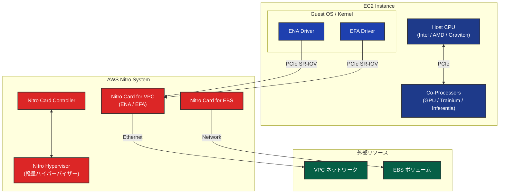
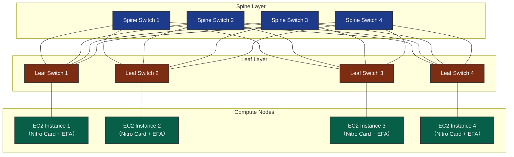
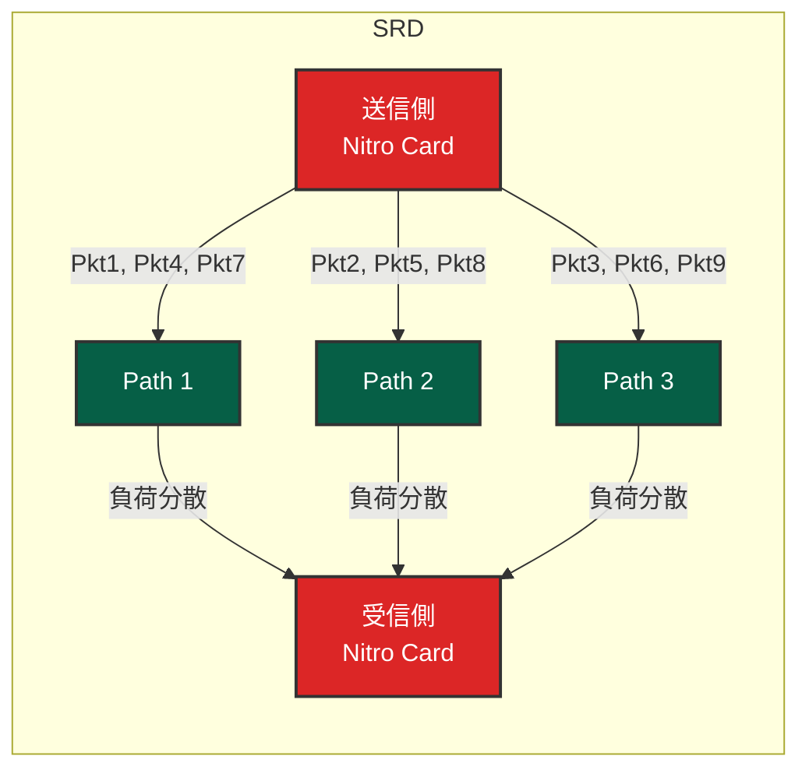
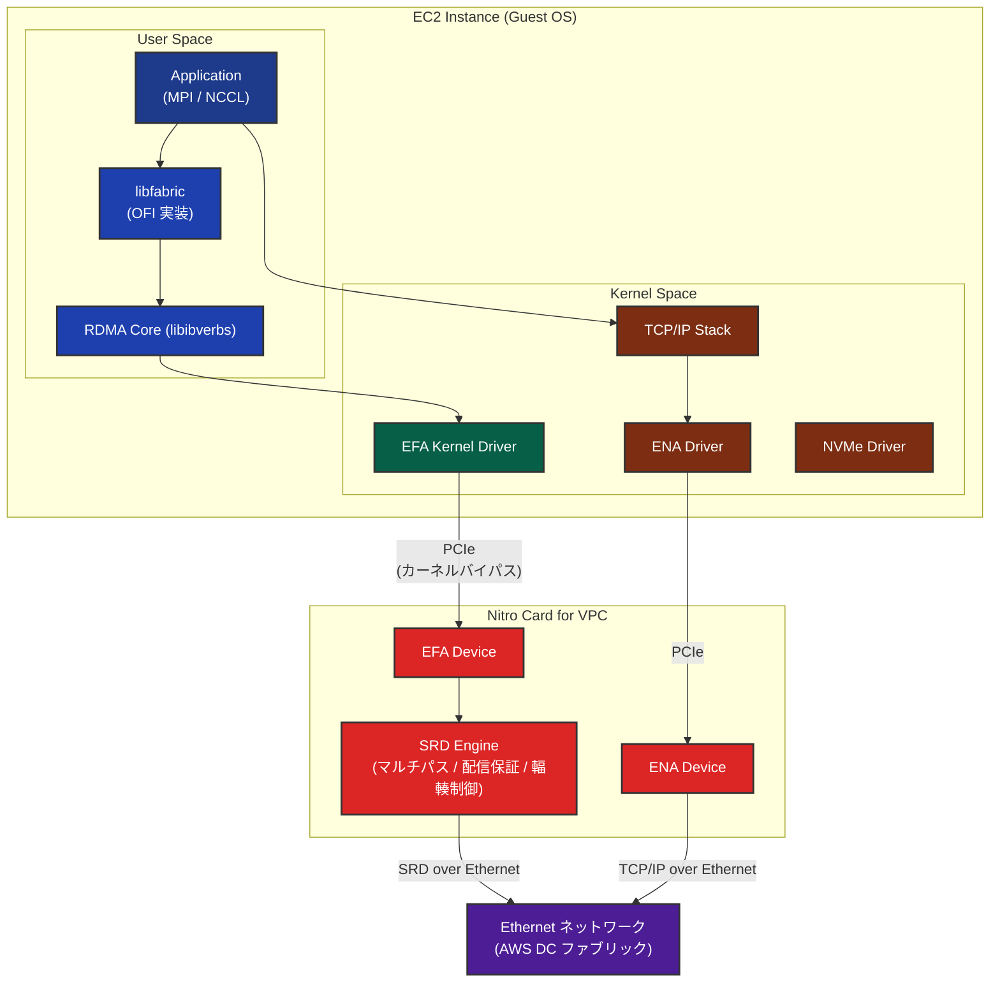
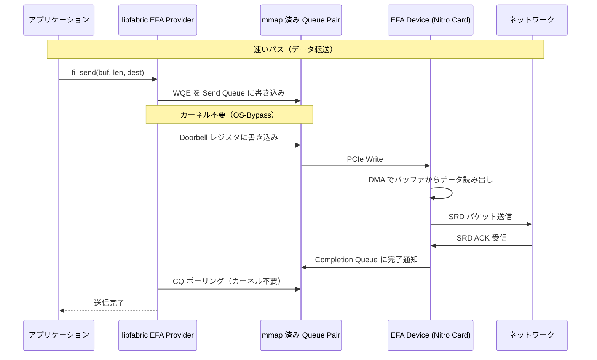
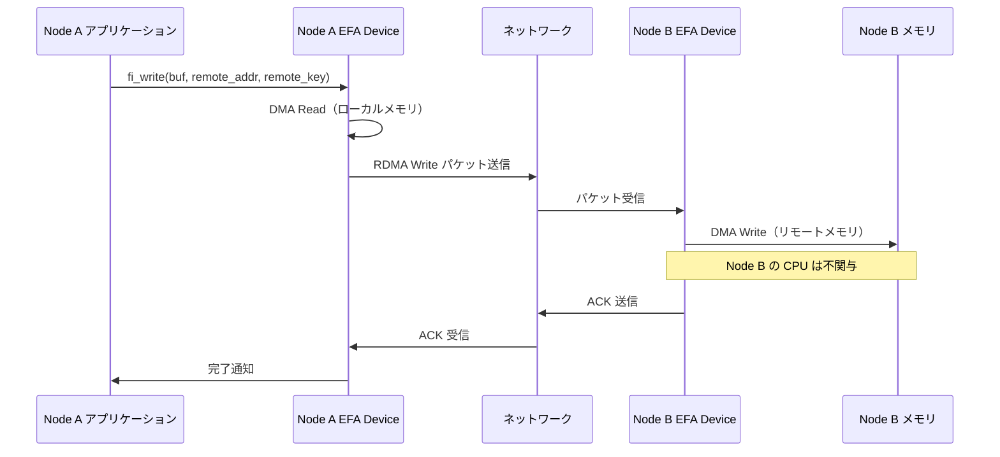
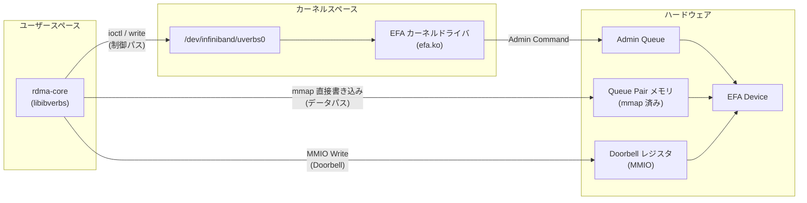
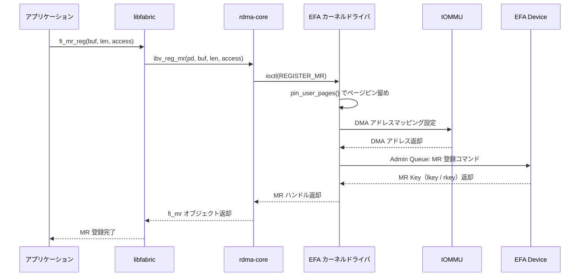
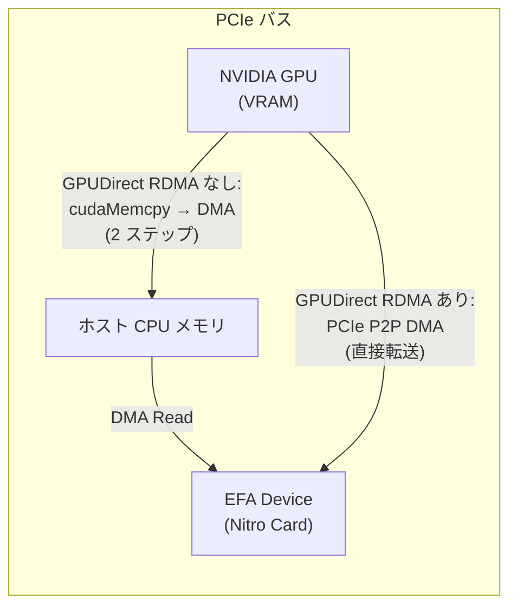
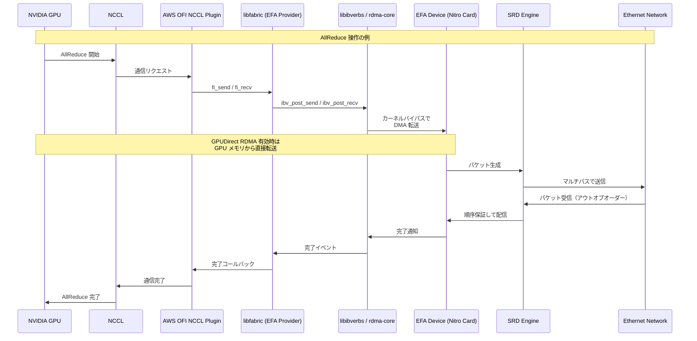

## はじめに

AWS で大規模な HPC（High Performance Computing）ワークロードや分散機械学習を実行する際、ノード間通信の性能がボトルネックになることがあります。従来の TCP/IP ベースのネットワーキングでは、レイテンシやジッターが大きく、大規模にスケールする計算では通信待ちの時間が全体の性能を左右します。

この課題を解決するために AWS が開発したのが **EFA（Elastic Fabric Adapter）** です。EFA は AWS の独自プロトコルである **SRD（Scalable Reliable Datagram）** を基盤とし、**Nitro System** のハードウェアオフロード機能を活用することで、従来の TCP と比較して大幅に低いレイテンシとジッターをクラウド上で実現します。

本記事では、まず Nitro System の全体像を理解し、その上で SRD プロトコルの仕組み、EFA の設計思想と実装、そして実際にインスタンスを起動して動作確認するまでの一連の流れを解説します。

**対象読者**: AWS 上で HPC / ML ワークロードを運用するエンジニア、ネットワーク技術に関心のあるインフラエンジニア向けの内容です。RDMA（Remote Direct Memory Access）、PCIe、IOMMU（Input-Output Memory Management Unit）等のネットワーク・ハードウェアの基礎知識があると理解が深まりますが、必須ではありません。

## Nitro System

[Nitro System](https://aws.amazon.com/jp/ec2/nitro/) は、AWS が独自に設計・開発したインフラストラクチャプラットフォームです。従来のハイパーバイザーが担っていたネットワーキング、ストレージ、セキュリティなどの機能を専用ハードウェア（Nitro Cards）にオフロードすることで、ホスト CPU のほぼすべてのリソースをワークロードに充てることを可能にしています。

参考: [A Cloud-Optimized Transport Protocol for Elastic and Scalable HPC (IEEE Micro, 2020)](https://ieeexplore.ieee.org/document/9167399) -- Leah Shalev 他著、SRD プロトコル設計とパケット順序を犠牲にしたマルチパス活用の技術的詳細。

### Nitro System のアーキテクチャ

Nitro System の主要な構成要素は **Nitro Cards** と **Nitro Hypervisor** です。他にもありますが割愛します。



Nitro System の主な価値は、**I/O 処理を専用ハードウェアにオフロード**することで、ホスト CPU のリソースを最大限にワークロードへ割り当てることです。スループットの向上とレイテンシ・ジッターの低減を同時に実現し、ベアメタルインスタンスの提供も可能にしています。

また、ストレージおよびネットワーク通信に対する透過的な暗号化をハードウェアレベルで提供し、セキュリティを確保しています。

参考: [Security Design of the AWS Nitro System (AWS Whitepaper)](https://docs.aws.amazon.com/whitepapers/latest/security-design-of-aws-nitro-system/)

### Nitro Cards のカスタム ASIC

Nitro Cards の心臓部は、AWS が買収した **Annapurna Labs** が設計するカスタム ASIC（Application-Specific Integrated Circuit）です。

https://perspectives.mvdirona.com/2019/02/aws-nitro-system/

Nitro Cards はホストサーバーと PCIe（Peripheral Component Interconnect Express）バスを介して接続されます。

Nitro Card と EC2 インスタンス間の仮想化には **SR-IOV（Single Root I/O Virtualization）** が採用されています。SR-IOV では、1 つの物理デバイス（Physical Function, PF）が複数の仮想デバイス（Virtual Function, VF）を PCIe レベルでハードウェア的に公開します。各 VM は VF に直接アクセスでき、従来の Xen ベースの仮想化で必要だった Dom0 や QEMU を経由するデバイスエミュレーションが不要になります。この結果、ベアメタルに近い性能が実現されています。

参考: [AWS EC2 Virtualization 2017: Introducing Nitro - Brendan Gregg](https://www.brendangregg.com/blog/2017-11-29/aws-ec2-virtualization-2017.html)
参考: [コンフィデンシャルコンピューティング： AWS の視点](https://aws.amazon.com/jp/blogs/news/confidential-computing-an-aws-perspective/)

### Nitro Cards の詳細

Nitro System の中核を担う Nitro Cards は、それぞれ専門の役割を持つカスタム ASIC ベースのハードウェアです。

#### Nitro Card for VPC

Nitro Card for VPC は EC2 インスタンスのネットワーキング機能の中枢を担います。PCIe 経由で ENA（Elastic Network Adapter）および EFA コントローラを OS に公開し、VPC データプレーンの処理をハードウェア上で実行します。透過的なエンドツーエンドの 256 ビット AEAD 暗号化をネットワークパフォーマンスへの影響なしに処理できます（参考: [Data protection in Amazon EC2](https://docs.aws.amazon.com/AWSEC2/latest/UserGuide/data-protection.html)）。

EFA（Elastic Fabric Adapter）は 後述する特定のインスタンスで提供される高性能ネットワーク機能であり、libfabric API を通じて OS カーネルをバイパスして EFA デバイスと直接通信する OS-bypass 機能を備えています（参考: [Elastic Fabric Adapter](https://docs.aws.amazon.com/AWSEC2/latest/UserGuide/efa.html)）。

#### Nitro Card for EBS

Nitro Card for EBS（Elastic Block Store）は NVMe PCIe コントローラとして OS に標準的な NVMe デバイスを公開します。EBS データプレーンの処理と暗号化をハードウェア上で実行します（スループットの上限はインスタンスタイプに依存）。OS 側は標準の NVMe ドライバを使用するため、特別なドライバのインストールは不要です。

#### Nitro Card Controller

Nitro Card Controller は他の Nitro Cards、Nitro Hypervisor、および Nitro Security Chip 間の連携を管理するコンポーネントです。コントローラ自体がハードウェアベースの Root of Trust、測定（Measurement）、および認証（Attestation）機能を備えています。

### Nitro Hypervisor の設計

AWS 公式ドキュメントによると、Nitro Hypervisor は「軽量のハイパーバイザーであり、メモリと CPU の割り当てを管理し、ベアメタルとも区別がつかないパフォーマンスを実現する」と記載されています（参考: [AWS Nitro System](https://aws.amazon.com/ec2/nitro/)）。

すべてのネットワーク、ストレージ、セキュリティの I/O 処理は Nitro Cards が担当するため、Hypervisor のアタックサーフェスが大幅に縮小されています。同ブログでは、Nitro のオーバーヘッドは極めて小さく、多くの場合 1% 未満であると報告されています（ただし正確な測定は困難とも述べています）。AWS 公式ドキュメントでは「ベアメタルと区別がつかないパフォーマンス」と表現されています。

Xen + QEMU との比較を以下に示します。

| 項目 | Xen + QEMU | Nitro Hypervisor |
|---|---|---|
| I/O パス | Dom0 / QEMU 経由 | Nitro Card への SR-IOV アクセス |
| デバイスエミュレーション | QEMU で実装 | None, Nitro Card |
| CPU/メモリ仮想化 | Xen Hypervisor | 最小化された Linux + KVM サブシステム |
| パフォーマンス | エミュレーション層のオーバーヘッドあり | ベアメタル相当 |

EC2 インスタンス内部から `lspci` コマンドを実行すると、Nitro Cards が提供するデバイスが PCIe デバイスとして直接見えます。ENA / EFA はネットワークコントローラとして、EBS と Instance Storage は NVMe デバイスとして認識され、いずれも標準のカーネルドライバで動作します。

```
# 実際に実行した例
lspci | grep -i "Amazon.*Elastic Fabric Adapter"
00:1a.0 Ethernet controller: Amazon.com, Inc. Elastic Fabric Adapter (EFA)
```

以下の表は主要な EFA 対応インスタンスにおける EFA 世代の進化を示しています。

| EFA 世代 | インスタンス | 最大ネットワーク帯域幅 | 主な特徴 |
|---|---|---|---|
| EFA | P4d.24xlarge | [400 Gbps](https://aws.amazon.com/ec2/instance-types/p4/) | RDMA read のみ対応 |
| **EFAv2** | P5.48xlarge | [**3,200 Gbps**](https://aws.amazon.com/ec2/instance-types/p5/) | **RDMA Read/Write 対応** |
| **EFAv2** | Trn1n.32xlarge | [**1,600 Gbps**](https://aws.amazon.com/ec2/instance-types/trn1/) | RDMA Read/Write 対応 |
| **EFAv3** | P5en.48xlarge | [**3,200 Gbps**](https://aws.amazon.com/ec2/instance-types/p5/) | P5 比レイテンシ 35% 改善 |
| **EFAv3** | Trn2.48xlarge | [**3,200 Gbps**](https://aws.amazon.com/ec2/instance-types/trn2/) | P5 比レイテンシ 35% 改善 |
| **EFAv4** | P6-B200 | [**3.2 Tbps**](https://aws.amazon.com/ec2/instance-types/p6/) | SRD 改善 |
| **EFAv4** | P6-B300 | [**6.4 Tbps**](https://aws.amazon.com/ec2/instance-types/p6/) | 単一サーバー最大帯域幅 |
| **EFAv4** | G7e | [**1,600 Gbps**](https://aws.amazon.com/ec2/instance-types/g7e/) | RTX PRO 6000 Blackwell 搭載 |

:::message
**同じ EFA 世代でも帯域幅が異なる理由**

同じ EFA 世代（例: EFAv2）でも、インスタンスによって帯域幅が異なります。これは **EFA デバイスの数**と**各デバイスの帯域幅**によって決まります。

例: EFAv2 の場合
- **P5.48xlarge**: 32 個の EFA デバイス × 100 Gbps = **3,200 Gbps**
- **Trn1n.32xlarge**: 16 個の EFA デバイス × 100 Gbps = **1,600 Gbps**

同じ `.32xlarge` サイズでも、インスタンスファミリーやバリエーション（`n` サフィックスの有無など）によって EFA デバイス数が異なり、結果として帯域幅も異なります。大規模分散学習や HPC ワークロードでは、この帯域幅の違いがスケーリング効率に大きく影響します。
:::

参考: [AWS EFA 公式ドキュメント](https://docs.aws.amazon.com/AWSEC2/latest/UserGuide/efa.html)

特筆すべきは **P6-B300 インスタンス**で、**6.4 Tbps** の EFA 帯域幅を実現しており、第 1 世代の P4d.24xlarge（400 Gbps）と比較して **16 倍**の帯域幅です。P5/P5en インスタンスは 3.2 Tbps（8 倍）、G7e は 1.6 Tbps（4 倍）を実現しています。

2019 年の EFA + SRD プロトコル対応が HPC / ML ワークロードにとって転換点となり、2021 年の RDMA Read/Write サポートによって OS-Bypass 通信の適用範囲がさらに拡大しました。2023-2024 年には **EFAv4**（第 4 世代 EFA）が導入され、P6-B300 では 6.4 Tbps を実現しています。

さらに、[AWS EC2 UltraClusters](https://aws.amazon.com/ec2/ultraclusters/) では、複数のインスタンスを超高速ネットワークで接続した大規模クラスターを構成できます。UltraClusters の構成要素となる [P6e-GB200 UltraServer](https://aws.amazon.com/ec2/instance-types/p6/) は、72 個の NVIDIA Blackwell GPU を単一サーバーに搭載した大型インスタンスで、**28.8 Tbps の EFA 帯域幅**（EFAv4）を実現しています。複数 UltraServer を接続することで、数千 GPU 規模での処理が可能になります。

## SRD（Scalable Reliable Datagram）

SRD は AWS が EFA のために独自に開発したトランスポートプロトコルです。TCP/IP の限界を克服し、データセンターネットワークの物理トポロジーを最大限に活用するために設計されました。SRD の設計と実装に関する詳細は、IEEE Micro（Vol. 40, No. 6, 2020 年 11-12 月号）に掲載された AWS 公式論文 "A Cloud-Optimized Transport Protocol for Elastic and Scalable HPC" に記載されています。

参考: [A Cloud-Optimized Transport Protocol for Elastic and Scalable HPC (IEEE Micro, 2020)](https://ieeexplore.ieee.org/document/9167399)

### AWS データセンターのネットワークトポロジー

AWS 公式論文によると、AWS のデータセンターネットワークは **コモディティ Ethernet スイッチを用いた High-radix Folded Clos トポロジー**で構成されています（参考: [A Cloud-Optimized Transport Protocol for Elastic and Scalable HPC (IEEE Micro, 2020)](https://ieeexplore.ieee.org/document/9167399)）。Clos トポロジー（Fat-Tree 構造）は、任意の 2 ノード間に多数の冗長経路（ECMP: Equal-Cost Multipath）を提供するスケーラブルなネットワーク設計です。



この構成では、例えば Instance 1 から Instance 2 への通信に、**複数の経路**が存在します（L1 → S1 → L2、L1 → S2 → L2、L1 → S3 → L2、L1 → S4 → L2 の 4 経路）。

### TCP/IP とマルチテナント環境の課題

しかし、TCP/IP プロトコルでは、この豊富な経路の多様性を十分に活用できません。

TCP/IP では、ECMP ロードバランシングが 5-tuple（送信元 IP、宛先 IP、送信元ポート、宛先ポート、プロトコル）のハッシュに基づいて**フロー単位**で経路を決定します。一度決定された経路はそのフローの全パケットで固定されるため、大きなフローが特定経路に集中し、**ホットスポット**が発生します。

さらに、クラウドのデータセンターでは多数のテナントが同じ物理ネットワークを共有しているため、他のテナントのトラフィックによる**予測不可能なネットワーク負荷の変動**が発生します。この結果、**レイテンシジッター**（レイテンシの不安定さ）が増大し、HPC / ML ワークロードでは全体性能を大きく低下させます。

障害時にも問題があります。経路上のリンクやスイッチに障害が発生すると、経路の再収束が完了するまで通信が中断され、大規模クラスターでは障害の影響がジョブ全体に波及します。

#### TCP の具体的な性能問題

IEEE Micro 2020 論文で報告された AWS データセンターにおける TCP の性能特性:

| 指標 | ベストケース | 輻輳時のアウトライア※ |
|------|------------|-------------------|
| Round-Trip Time (RTT) | 約 25µs | **50ms 〜 数秒** |

※ **アウトライア（outlier）**: 外れ値、すなわちテールレイテンシ（P99, P999 などの高パーセンタイル値）を指します。平均値や中央値からかけ離れた極端に遅いレスポンスタイムのことです。

**アウトライアの主な原因**: パケットロスの再送タイムアウト。TCP 実装では、OS 遅延を考慮して再送タイムアウトを高く設定する必要があるため（Linux カーネルのデフォルト最小 RTO は 200ms）、輻輳時やリンク障害時のテールレイテンシが大きくなります。代替パスが利用可能であっても、TCP はそれを活用できません。

参考: [A Cloud-Optimized Transport Protocol for Elastic and Scalable HPC (IEEE Micro, 2020)](https://ieeexplore.ieee.org/document/9167399)（論文中のマルチテナント環境における TCP 性能分析に基づく）

#### RoCE が大規模クラウドに不適な理由

AWS 公式論文によると、RDMA over Converged Ethernet（RoCE）も検討されましたが、AWS のマルチテナント大規模データセンター環境には適していませんでした。RoCE は RDMA の Verbs プログラミングモデルを Ethernet 上で提供する技術であり、専用ファブリック環境では有効に機能しますが、AWS のスケール要件では以下の課題がありました。

| 課題 | 問題点 | AWS 論文での指摘 |
|------|--------|-----------------|
| **Priority Flow Control (PFC) の必要性** | RoCEv2 は PFC を必要とするが、PFC は head-of-line blocking、輻輳の伝播、デッドロックを引き起こす | 「大規模ネットワークでは実行不可能（not feasible on large-scale networks）」と明記。PFC 問題の解決策（Guo et al., 2016）も「AWS データセンターよりも大幅に小さいデータセンター」に依存 |
| **ECMP 衝突問題** | 静的な Flow ハッシュによるパスマッピングは、現在のネットワーク使用率やフロー速度を考慮しない | PFC を使用しても、RoCE は TCP と同様に ECMP ハッシュ衝突による輻輳の影響を受け、ハッシュ衝突が「ホットスポット」を作り出す |
| **輻輳制御の最適性** | RoCE の輻輳制御は AWS データセンター規模のマルチテナント環境には最適化されていない | 「suboptimal congestion control」と明記。Mittal et al. (2018) の研究を引用し、RDMA の輻輳制御の課題を指摘 |

::::details フロー管理についての補足（初学者向け）

ロスレス通信を実現するには、送信側と受信側の間で適切なフロー制御が必要です。送信側は、パケットやデータフレームの ID を管理し、すべてのデータが受信側に到達したことを確認する必要があります。

同時に、受信側のバッファ管理も重要です。受信バッファがオーバーフローしそうになった場合、受信側は送信側に対して「これ以上データを送らないでください」というシグナルを送る必要があります。このような仕組みは**バックプレッシャー機構**と呼ばれ、ロスレス通信では必須の要素となります。

実装方法としては、データリンク層にクレジット管理のための情報を組み込むのが一般的です。送信側は受信側のバッファ状況を把握し、受信可能な量だけデータを送信することで、パケットロスを防止します。スーパーコンピューター富嶽の TofuD では Ethernet は使っていませんが同様のレイヤで同じようにフロー管理が行われています。

PFC は、この**バックプレッシャー機構を Ethernet レイヤーで実現したもの**です。受信バッファが満杯になりそうな際に、スイッチが送信側に PAUSE フレームを送信して一時停止を要求します。これにより、受信バッファ溢れによるパケットドロップを防ぎ、ロスレス通信を実現します。

RoCE は、RDMA がロスレス通信を前提とした設計であるため、PFC が必須となります。RDMA ではパケットロスが発生すると性能が大幅に低下するため、ロスを防ぐバックプレッシャー機構が必要です。PFC を使用することで、受信バッファ溢れによるパケットドロップを防止し、ロスレス通信を維持します。

しかし、PFC には大規模ネットワークにおいて深刻な問題があります。第一に、**Head-of-line blocking** により、1 つのフローが停止すると同じリンクを共有する無関係なフローもブロックされます。第二に、**輻輳の伝播**として、PAUSE フレームが連鎖的に上流スイッチに伝播し、輻輳がネットワーク全体に拡散します。第三に、**デッドロック**のリスクがあり、AWS 公式論文では既存の PFC デッドロック対策（Guo et al., 2016）が「AWS データセンターよりも大幅に小さいデータセンター」を前提としており、AWS スケールでは実用的でないと指摘されています。

SRD は、RoCE とは根本的に異なるアプローチを採用しています。SRD はパケットロスを許容する設計であり、信頼性は高速リトライで確保します。

輻輳制御については、SRD はエンドツーエンドの独自アルゴリズムを採用しています。AWS 公式論文によると、SRD の輻輳制御は「受信 ACK のタイミングに基づくレート推定」と「最近の送信レートと RTT の変化」を考慮します。接続ごとの動的レート制限とインフライト制限を組み合わせ、複数パスでの集約キューイングを最小限に保ちます。従来の TCP のようにパケットロスを輻輳のシグナルとして扱うのではなく、RTT ベースでネットワーク状態を監視し、パケットロスが発生する前に送信レートを制御できます。この設計により、PFC のようなリンクレベルのバックプレッシャーは不要となります。

AWS のような大規模マルチテナント環境では、PFC の問題が致命的になるため、SRD はこの異なるアプローチを採用しています。
::::

これらの理由から、AWS は独自の SRD プロトコルを設計し、Nitro Card にハードウェア実装する道を選択しました。論文では「TCP も他のトランスポートプロトコルも我々が必要とする性能レベルを提供しないため、独自のネットワークトランスポートを設計することを選択した」と明記されています。

### SRD の設計原則: パケット順序を犠牲にしたアプローチ

SRD プロトコルは、これらの課題を解決するために**パケット順序の保証を意図的に放棄**し、パケット単位でのマルチパス活用を実現する設計を採用しています。これは、スーパーコンピューティングをクラウド上で実現するためのアプローチ転換です。

:::message
**SRD 設計の背景**（AWS 公式論文より）

従来の TCP や InfiniBand RC（Reliable Connection）は厳密なパケット順序保証を提供しますが、論文では out-of-order delivery を選択した理由を明確に説明しています。

**In-order delivery の問題点**

In-order delivery を維持するには、大きなコストを伴います。第一に、**Head-of-line blocking** が発生します。1 つのパケットがロスすると、後続のすべてのパケットがブロックされてしまいます。第二に、**リオーダリングバッファの制約**があります。NIC はメモリ帯域幅、バッファ容量、並行コンテキスト数に限界があるため、大規模な並べ替えは困難です。第三に、**平均レイテンシが増加**します。大規模ネットワークでは out-of-order 到着が頻発し、ロストパケットと無関係な多数のパケットまで遅延してしまいます。
:::

参考: [A Cloud-Optimized Transport Protocol for Elastic and Scalable HPC (IEEE Micro, 2020)](https://ieeexplore.ieee.org/document/9167399)

SRD はこれらの課題に対して、以下のアプローチで解決策を提供します。

### マルチパスルーティング

AWS のデータセンターネットワークは Clos トポロジーで構成されており、Spine-Leaf 階層構造により任意の 2 ノード間に多数の冗長経路が存在します。**SRD はこの物理的な経路の多様性を活用し、1 つの通信フローのパケットを複数の経路に分散して送信します**。パケットごとに異なる経路を選択することで、特定経路への集中を回避し、利用可能な帯域幅を最大限に活用します。

ECMP と SRD のマルチパスルーティングの違いは以下の通りです。

| 項目 | ECMP（フロー単位） | SRD（パケット単位） |
|---|---|---|
| 分散単位 | フロー単位（5-tuple ハッシュ固定） | パケット単位（動的選択） |
| 経路選択 | ハッシュ値で静的に決定 | ネットワーク負荷を考慮して動的に決定 |
| 輻輳回避 | 特定経路にフローが偏る可能性あり | パケットレベルで負荷分散し輻輳を回避 |
| 障害時の挙動 | 経路再収束まで通信中断 | 障害経路を即座に回避、残りの経路で継続 |
| 順序保証 | フロー内で保証（単一経路） | Out-of-order delivery を許容、順序管理はアプリケーション層に委譲 |

ECMP はフロー単位でしか経路を分散できないため、大きなフロー（elephant flow）が特定のリンクに集中する「ホットスポット」問題が発生しがちです。SRD はパケット単位で**スプレイディング**を行うことで、この問題を解消しています。

::::details スプレイディングとは

**スプレイディング**は、1 つのフロー（通信セッション）のパケットを、水をスプレーで撒くように複数の経路に分散して送信する技術です。

**従来のアプローチ（ECMP）との違い**

従来の ECMP では、フロー単位（5-tuple のハッシュ値）で経路が固定されます。例えば、サーバー A からサーバー B への通信フローは常に Path 1 を使い、サーバー C からサーバー D への通信フローは常に Path 2 を使う、というように決まります。この方式では、以下の問題が発生します。第一に、**Elephant flow 問題**として、大量のデータを送信するフローが特定の経路に集中すると、その経路だけが輻輳します。第二に、**ハッシュ衝突**により、複数のフローが同じ経路にマッピングされると、その経路に負荷が集中します。第三に、**動的な調整が不可能**であり、一度決まった経路は輻輳状態になっても変更できません。

**SRD のスプレイディング**では同じフローのパケットであっても、パケットごとに異なる経路を選択します。

この方式により、以下の利点があります。第一に、**きめ細かい負荷分散**が実現されており、大きなフローでも複数経路に分散されるため、特定経路への集中を回避できます。第二に、**動的な経路選択**により、輻輳した経路を検出したら次のパケットから別の経路を使用することが可能です。第三に、**帯域幅の最大活用**として、利用可能なすべての経路を同時に活用し、ネットワークの集約帯域幅を最大限に引き出します。

**スプレイディングのトレードオフ**:

スプレイディングは、パケットが異なる経路を通るため、経路ごとの遅延差により out-of-order delivery が発生します。従来の TCP はこれを「パケットロス」と誤検知して性能低下を引き起こしますが、SRD は out-of-order を前提とした設計によりこの問題を回避しています。
::::


以下の図は、ECMP と SRD のパケット分散の違いを示します。



### スプレイディングのハードウェア実装

SRD のパケットスプレイは Nitro Card のカスタム ASIC（ハードウェア）上で実装されています。各パケットの送信時、Nitro Card は利用可能な複数の経路（複数の Spine スイッチへのパス）から最適な経路を選択し、輻輳している経路を回避しながら動的に負荷分散します。さらに、経路で障害が発生した場合でも、ルーティングプロトコルの経路再収束を待つことなく、即座に他の健全な経路へスイッチします。

ハードウェア実装により、パケットごとの経路選択がマイクロ秒オーダーの応答速度で実行されます。ソフトウェア実装と比較してカーネル処理やコンテキストスイッチのオーバーヘッドが最小化され、処理時間のばらつき（ジッター）も抑制されます。この予測可能な低レイテンシ特性により、マルチテナント環境の予測不可能なトラフィック変動に対しても、安定したスループットを維持できます。他のテナントのトラフィックバーストが発生した際でも、SRD は空いている経路にパケットを振り向けることで、影響を最小限に抑えます。

### アウトオブオーダー配信の特性

複数経路を使用すると、各経路の遅延差によりパケットの到着順序が送信順序と異なる場合があります。TCP/IP ではアウトオブオーダーのパケット到着を損失と誤検知し、不必要な再送や輻輳ウィンドウの縮小を引き起こします。

**SRD の設計原則**: SRD は意図的に out-of-order delivery を許容し、パケットをアプリケーション層に直接配信します。順序管理は MPI や NCCL などのアプリケーション層に委ねられます。

この設計により、第一に、パケットごとに最適な経路を選択することでネットワークの並列性を最大限に活用し、head-of-line blocking を回避できます。第二に、順序待ちでパケットを保留する必要がないため、不要なバッファリング遅延が排除されます。第三に、TCP/IP のようにアウトオブオーダーを「パケットロス」と誤検知した場合の不要な再送や輻輳制御の誤動作が回避されます。

### Nitro Card へのハードウェア実装の意義

SRD プロトコルが Nitro Card のカスタム ASIC に直接実装されていることは、重要な設計判断です。

:::message alert
**SRD をハードウェア実装した理由**: AWS の目標は、SRD を物理ネットワーク層にできるだけ近づけ、ホスト OS やハイパーバイザーが注入する性能ノイズを回避することでした。これにより、**高速な再送**と**ネットワーク輻輳の変動に対する即座のレート調整**が可能になります。
:::

ソフトウェア実装では、マルチテナント環境で常に発生する他テナントのトラフィック変動に対して、マイクロ秒単位で応答することは困難です。カーネル処理やスケジューラの遅延により、応答時間がミリ秒オーダーになってしまうためです。また、各パケットの送信時にリアルタイムで最適経路を決定するには、ハードウェアレベルの高速処理が不可欠です。

この結果、パケット処理がワイヤー速度（100 Gbps 以上）で実行され、ネットワーク状態の変化に対してマイクロ秒オーダーで応答できます。経路障害を検出してから迂回するまでの時間は極小であり、大規模クラスター（数千ノード）でも安定した低レイテンシを維持します。

この設計により、クラウド環境でも従来の TCP と比較して大幅に低いレイテンシとジッター、高スループット通信が実現されています。

### 独自の障害検出と輻輳制御

SRD は、ネットワークリンク障害から高速に回復する機能を持っています。再送パケットを送信する際、元の送信で使用したパスが利用できなくなった場合、ネットワーク全体のルーティング更新の収束を待つことなく、即座に別のパスに再ルーティングできます。これにより、障害発生時のレイテンシへの影響が最小限に抑えられます。

輻輳制御についても、SRD は AWS のデータセンターネットワークに最適化された独自のアルゴリズムを Nitro Card のハードウェアに実装しています。ネットワークの輻輳状態を検出してパケットの送信レートを動的に調整することで、高スループットと低レイテンシを両立します。

### 配信保証

SRD は信頼性のあるデータグラムプロトコルとして、パケットの配信保証を提供します。この保証は Nitro Card のハードウェア上で実現されるため、EC2 インスタンスの CPU リソースを消費しません。再送処理と重複排除がハードウェアオフロードされています。

### SRD の適用範囲の拡大

SRD はもともと EFA のために開発されましたが、その効果が認められ、現在では他の用途にも適用されています。

通常の ENA トラフィックにも SRD の恩恵を提供する [**ENA Express**](https://docs.aws.amazon.com/AWSEC2/latest/UserGuide/ena-express.html) があります。ENA Express は、アプリケーションに透過的に SRD プロトコルを適用する機能で、通常の TCP/UDP ソケット API を使用するアプリケーションを変更することなく、同一 Availability Zone（AZ）内の通信で SRD の高性能を享受できます。ENA Express を有効にすると、**対応インスタンスにより最大 5 Gbps または 25 Gbps のシングルフロースループット**と、TCP と比較して低い P99 レイテンシを実現します。AZ をまたぐ通信や SRD 非対応インスタンスとの通信では、自動的に従来の TCP/IP にフォールバックする設計になっています。

### SRD のアーキテクチャ構成



この図で重要なポイントは、EFA を使用する場合にアプリケーションから libfabric を経由して RDMA Core（libibverbs）に到達し、そこから EFA カーネルドライバを通じて Nitro Card 上の EFA デバイスにアクセスする点です。データ転送のホットパスではカーネルバイパスが行われ、ユーザースペースから直接 Nitro Card にアクセスすることで、カーネルのオーバーヘッドを排除しています。Nitro Card 上の SRD Engine がマルチパスルーティング、輻輳制御、配信保証などをすべてハードウェアで処理し、標準的な Ethernet ネットワーク上で SRD パケットを送受信します。

## EFA（Elastic Fabric Adapter）

EFA は HPC および機械学習ワークロード向けに AWS が開発した高性能ネットワークインターフェースです。ENA の機能をすべて含みつつ、OS カーネルバイパスによる低レイテンシ・高スループット通信をサポートします。

参考: [Elastic Fabric Adapter (EFA) for Tightly-Coupled HPC Workloads (AWS ブログ)](https://aws.amazon.com/jp/blogs/news/now-available-elastic-fabric-adapter-efa-for-tightly-coupled-hpc-workloads/)

:::message
**前提条件**: EFA は Nitro Card for VPC 上のハードウェア機能であるため、**EFA 対応インスタンスタイプ**でのみ利用できます（対応インスタンスの詳細は後述の「Nitro System と EFA の進化」の表を参照）。また、インスタンス起動時に EFA を明示的に有効化する必要があります。
:::

### EFA の設計思想

EFA の設計において最も重要な判断は、InfiniBand のような専用ファブリックを採用せず、既存の Ethernet インフラストラクチャ上で HPC グレードの通信を実現するというアプローチです。これにより、クラウドの弾力性（必要なときに必要な数のノードを起動・停止できる柔軟性）を維持しながら、低レイテンシ通信を実現しています。

EFA の主な特徴を以下の表に整理します。

| 特徴 | 説明 |
|---|---|
| OS カーネルバイパス | EFA はユーザースペースからハードウェアに直接アクセスする RDMA スタイルの通信をサポートします。アプリケーションは libfabric API を通じて、カーネルを介さずに Nitro Card 上の EFA デバイスと直接やり取りできます。これにより、従来のソケットベースの通信と比較してレイテンシが低減されます。 |
| SRD プロトコル | 前述の通り、EFA は TCP/IP ではなく SRD を使用します。SRD のマルチパスルーティングとハードウェアベースの信頼性保証により、大規模クラスターでも安定した低レイテンシ通信を実現します。 |
| libfabric 対応 | EFA は OpenFabrics Interfaces（OFI）の実装である libfabric を通じてアプリケーションに API を提供します。これにより、Open MPI、Intel MPI、MVAPICH2 などの MPI（Message Passing Interface）実装や NVIDIA NCCL（NVIDIA Collective Communications Library、集合通信ライブラリ）が EFA を透過的に利用できます。 |
| EFA 対応インスタンスでのみ利用可能 | EFA は Nitro Card for VPC 上のハードウェア機能であるため、EFA に対応したインスタンスタイプでのみ利用できます。対応するインスタンスは P6、P5、Trn2、G7e、hpc8a などです |
| **ネットワーク制限事項** | EFA トラフィックは **単一の Availability Zone（AZ）内に制限**されます |

:::message alert
**重要な制約**: EFA は同一 AZ 内の通信に限定されます。AZ をまたぐ通信や VPC 間のルーティングには使用できません。大規模な HPC / ML クラスターを構築する際は、全インスタンスを同一 AZ の Placement Group 内に配置する必要があります。複数 AZ にまたがるクラスター構成が必要な場合は、EFA ではなく ENA（通常のネットワーク）を使用してください。
:::

::::details libfabric とは何か

OpenFabrics Interfaces（OFI）は、高性能並列・分散アプリケーション向けの通信 API 仕様です。**libfabric** は OFI 仕様の実装であり、OpenFabrics Alliance 傘下の OFIWG（OFI Working Group）により開発されています。

libfabric は、多様なネットワーク技術（InfiniBand、RoCE、Omni-Path、AWS EFA、Intel PSM3、TCP/UDP など）を抽象化し、OFI で定義された統一された低レベル通信 API を提供します。これにより、アプリケーションコードを変更することなく、異なるネットワークハードウェア上で動作させることが可能になります。

### Provider モデル

libfabric は **Provider モデル** を採用しており、各ネットワーク技術に対応した Provider が実装されています。

- **efa** - AWS Elastic Fabric Adapter
- **verbs** - InfiniBand / iWARP / RoCE
- **tcp / udp** - 汎用的なソケットベース通信
- **shm** - 共有メモリ通信（同一ノード内）

アプリケーションは `fi_getinfo()` API を呼び出すことで、利用可能な Provider を列挙し、要件に合った Provider を選択します。EFA 環境では **EFA Provider** が選択され、内部的に rdma-core / libibverbs を通じて EFA カーネルドライバと通信します。

libfabric を使用することで、OS カーネルを経由せずに直接ハードウェアと通信する **OS-bypass** が実現され、レイテンシが大幅に削減されます。

### EFA と libfabric の統合

EFA は libfabric と統合されています。以下のアプリケーション・ライブラリが EFA を透過的に利用できます。

| アプリケーション / ライブラリ | サポートバージョン | 用途 |
|---|---|---|
| Open MPI | 4.1 以降 | HPC 並列計算 |
| Intel MPI | 2019 Update 5 以降 | HPC 並列計算 |
| NVIDIA NCCL | 2.4.2 以降 | AI/ML 集合通信 |
| AWS Neuron SDK | 2.3 以降 | AWS Trainium / Inferentia での推論・訓練 |

これらのライブラリは、libfabric の統一された API を通じて EFA にアクセスするため、**アプリケーションコードを変更することなく EFA の恩恵を受けられます**。
::::

NCCL は AWS OFI NCCL Plugin を介して libfabric に接続します。libfabric の EFA Provider が libibverbs / rdma-core を呼び出し、EFA カーネルドライバを経由して Nitro Card 上の EFA デバイスに到達します。データパスではカーネルバイパスが有効になるため、実際のデータ転送時にはカーネルのオーバーヘッドが発生しません。

## EFA ソフトウェアスタックの実装詳細

EFA のソフトウェアスタックは、カーネルドライバ、ユーザースペースライブラリ（rdma-core / libibverbs）、libfabric EFA Provider の 3 層で構成されています。ここではそれぞれの層の実装を掘り下げます。

### EFA カーネルドライバ（efa.ko）

EFA カーネルドライバのソースコードは GitHub で公開されています。

参考: [Amazon EFA Kernel Driver (GitHub)](https://github.com/amzn/amzn-drivers/tree/8a8b6f29ba67/kernel/linux/efa)（2025 年時点のコミット 8a8b6f29ba67）

ドライバは以下の主要モジュールで構成されています。

| モジュール | 主要ファイル | 役割 |
|---|---|---|
| コアモジュール | `efa_main.c`, `efa.h` | PCIe デバイスの検出・登録、ドライバのエントリーポイント |
| Verbs API 実装 | `efa_verbs.c`（制御パス）, `efa_data_verbs.c`（データパス） | InfiniBand Verbs API の EFA 向け実装 |
| 管理通信層 | `efa_com.c`, `efa_com_cmd.c` | Admin Queue を介したデバイスとの管理コマンド通信 |
| ハードウェア定義 | `efa_regs_defs.h`, `efa_io_defs.h`, `efa-abi.h` | PCIe MMIO レジスタ、データパス型、カーネル/ユーザースペース ABI |
| アクセラレータ連携 | `efa_p2p.c`, `efa_nvmem_*.c`, `efa_neuronmem.c` | GPUDirect RDMA（NVIDIA GPU）および Neuron Direct（AWS Trainium/Inferentia）の統合 |

ドライバの初期化は標準的な Linux PCI ドライバの構造に従います。カーネルの PCI サブシステムが EFA デバイスを検出すると `efa_probe()` が呼び出され、PCIe リソースの確保（`pci_enable_device_mem()`、`pci_request_regions()`）、MMIO 領域のマッピング（`ioremap()`）、Admin Queue の初期化、InfiniBand デバイスとしての登録（`ib_register_device()`）が順に実行されます。

EFA デバイスとの管理通信は **Admin Queue / Completion Queue** のペアを介して行われます。Protection Domain の割り当て、Queue Pair の作成、Memory Region の登録といったリソース管理操作はすべて Admin Queue 経由のコマンドとして EFA デバイスに送信され、デバイスが処理を完了すると Completion Queue に完了通知が書き込まれます。

### rdma-core と libfabric EFA Provider

ユーザースペース側では、rdma-core の EFA Provider と libfabric の EFA Provider が連携して動作します。

参考: [rdma-core EFA Provider (GitHub)](https://github.com/linux-rdma/rdma-core/tree/master/providers/efa)

参考: [libfabric EFA Provider (GitHub)](https://github.com/ofiwg/libfabric/tree/main/prov/efa)

libfabric は **Provider モデル** を採用しており、アプリケーションは `fi_getinfo()` を呼び出すことで利用可能な Provider（EFA、PSM3、TCP など）を列挙し、要件に合った Provider を選択します。EFA Provider が選択されると、内部的に rdma-core の libibverbs を通じて EFA カーネルドライバと通信します。

### OS-Bypass（カーネルバイパス）の実装

EFA の低レイテンシの核心は、データパスにおける OS-Bypass にあります。この仕組みは「遅いパス」と「速いパス」の 2 段階で実現されています。

**遅いパス（初期化）** では、`fi_endpoint()` の呼び出しを起点として、libibverbs が `ioctl()` / `write()` システムコールで `/dev/infiniband/uverbs0` デバイスファイルを経由し、カーネルドライバに Queue Pair の作成を要求します。カーネルドライバは Admin Queue 経由で EFA デバイスに Queue Pair を割り当て、その Queue Pair メモリの mmap オフセットをユーザースペースに返します。ユーザースペースは `mmap()` でこの Queue Pair メモリを自プロセスのアドレス空間にマッピングします。

**速いパス（データ転送）** では、`fi_send()` が呼び出されると、libfabric の EFA Provider は mmap 済みの Send Queue メモリに Work Queue Entry（WQE）を直接書き込み、Doorbell レジスタへの PCIe Write でデバイスに通知します。この経路ではシステムコールもカーネルへのコンテキストスイッチも発生しません。送信完了の確認も、mmap 済みの Completion Queue を直接ポーリングすることで行われます。



### RDMA（Remote Direct Memory Access）サポート

EFA は **RDMA Read / Write** 操作をサポートしています。RDMA Write では、送信側アプリケーションが `fi_write()` を呼び出すと、送信側の EFA デバイスがローカルメモリから DMA でデータを読み出してネットワークに送信し、受信側の EFA デバイスがリモートノードのメモリに直接 DMA Write を行います。この全プロセスにおいて受信側の CPU は関与しません。



### GPUDirect RDMA と Neuron Direct

EFA カーネルドライバでは、`efa_nvmem_*.c` が NVIDIA GPU との統合（**GPUDirect RDMA**）、`efa_neuronmem.c` が AWS Trainium / Inferentia との統合（**Neuron Direct**）を担当しています。これにより、GPU メモリから EFA デバイスへの直接 DMA 転送が可能となり、ホスト CPU メモリを経由するコピーが排除されます。

---

# 事例紹介: 第 2 世代 EFA

AWS は 2021 年に第 2 世代 EFA を発表し、HPC および機械学習アプリケーションの性能を向上させました。

参考: [Second Generation EFA: Improving HPC and ML Application Performance in the Cloud (AWS HPC ブログ)](https://aws.amazon.com/jp/blogs/hpc/second-generation-efa-improving-hpc-and-ml-application-performance-in-the-cloud/)

第 2 世代 EFA の主な改善点を以下にまとめます。

| 項目 | 第 1 世代 EFA | 第 2 世代 EFA | 改善率 |
|---|---|---|---|
| 最大帯域幅（単一インスタンス） | 100 Gbps | 400 Gbps (P4d) | 4 倍 |
| SRD パケット処理性能 | ベースライン | 向上 | - |
| テールレイテンシ（P99.9） | ベースライン | 改善 | - |
| NCCL AllReduce 性能 | ベースライン | 最大 2 倍以上改善 | 2 倍超 |

第 2 世代 EFA を搭載した P4d.24xlarge インスタンスでは、1 インスタンスあたり 4 つの EFA デバイスを搭載し、合計 400 Gbps のネットワーク帯域幅を利用できます。これにより、大規模な分散学習において GPU 間の勾配同期にかかる時間が短縮され、学習のスケーリング効率が向上しました。

実際のベンチマークでは、OpenFOAM（CFD シミュレーション）、LAMMPS（分子動力学）、GROMACS（分子動力学）などの代表的な HPC アプリケーションで、第 1 世代と比較して顕著な性能向上が報告されています。機械学習では、PyTorch や TensorFlow を用いた大規模言語モデルの分散学習で、NCCL の AllReduce 操作の性能が向上し、学習時間の短縮が確認されています。

---

## EFA エコシステムの最新バージョン (2026 年 2 月時点)

EFA を実践的に利用する前に、主要なライブラリとツールの最新バージョンを確認してください。

### コアライブラリ

| ライブラリ | 最新バージョン | リリース日 | 主な特徴 |
|-----------|--------------|----------|---------|
| **[libfabric](https://github.com/ofiwg/libfabric/releases/tag/v2.4.0)** | v2.4.0 | 2024-12-15 | RTW パケット送信最適化 |
| **[rdma-core](https://github.com/linux-rdma/rdma-core/releases/tag/v62.0)** | v62.0 | 2025-02-24 | EFA provider に新しい completion status、`ibv_query_port_speed()` 追加 |
| **[UCX](https://github.com/openucx/ucx/releases/tag/v1.20.0)**（Unified Communication X） | v1.20.0 | 2025-02-05 | **EFA SRD の RMA WRITE サポート**、GPU-to-GPU 直接通信 API |

### HPC/ML フレームワーク

| コンポーネント | 最新バージョン | リリース日 | 主な特徴 |
|--------------|--------------|----------|---------|
| **[NCCL](https://github.com/NVIDIA/nccl/releases/tag/v2.29.3-1)** | v2.29.3-1 | 2025-02-03 | v2.28.7-1 で導入された GPU-Initiated Networking (GIN) の改良（v2.29.2-1 でハイブリッドカーネル等）、NCCL4Py を含む |
| **[aws-ofi-nccl](https://github.com/aws/aws-ofi-nccl/releases/tag/v1.18.0)** | v1.18.0 | 2026-01-21 | **P6-B300 サポート**、Dynamic platform selection |
| **[Open MPI](https://github.com/open-mpi/ompi/releases/tag/v5.0.10)** | v5.0.10 | 2025-02-11 | ドメイン間スレッド共有リソース枯渇修正（AWS 同梱は v5.0.9amzn1） |
| **Intel MPI** | 2019 Update 5 以降 | - | Libfabric の EFA プロバイダー経由で連携（2019 Update 5 で EFA 対応追加） |

### AWS 提供ツール

| ツール | 最新バージョン | リリース日 | 同梱コンポーネント |
|-------|--------------|----------|-------------------|
| **EFA Installer** | v1.47.0 | 2026-01-29 | EFA ドライバー 3.0.0、Libfabric 2.4.0amzn1.0、rdma-core 60、aws-ofi-nccl 1.18.0、Open MPI 5.0.9amzn1 |

:::message
**バージョン注記**: EFA Installer v1.47.0 には rdma-core 60 が同梱されていますが、rdma-core の最新リリースは v62.0 です（2025-02-24 リリース）。EFA Installer の rdma-core は AWS によって検証済みの安定バージョンであり、最新の rdma-core リリースとは異なる場合があります。本番環境では EFA Installer 同梱のバージョンを使用することを推奨します。
:::

### 重要な変更点

:::message
**libfabric v2.3.0 以降**: EFA ダイレクトデータパスがデフォルトで有効になり、EFA の性能に大きな影響があります。

**UCX v1.20.0**: EFA SRD の RMA WRITE サポートが追加され、NIXL などの GPU メモリ転送ユースケースで重要な機能強化が行われました。

**NCCL v2.28+**: GPU-Initiated Networking (GIN) により、GPU から直接ネットワーク操作を発行でき、CPU 介入を削減します。

**aws-ofi-nccl v1.18.0**: P6-B300 (6.4 Tbps EFA) のサポートが追加され、Dynamic platform selection により単一バイナリで複数プラットフォームに対応します。
:::

---

# EFA の実践的な利用

EFA を実際に動かし、動作確認とパフォーマンス検証を行う手順を解説します。

## 基本的な動作確認

EFA 対応インスタンス（P5、Trn2、C6gn 等）を起動した後、以下のツールで EFA の動作を確認できます。

### fi_info によるデバイス確認

```bash
# EFA Provider が利用可能か確認
fi_info -p efa

# 出力例（抜粋）:
# provider: efa
#     fabric: EFA-fe80::211:22ff: fe33:4455
#     domain: efa_0-rdm
#     version: 121.10
#     type: FI_EP_RDM
#     protocol: FI_PROTO_EFA
```

### fi_pingpong による基本レイテンシ測定

```bash
# サーバー側
fi_pingpong -p efa

# クライアント側（別ノード）
fi_pingpong -p efa <server-ip>

# 出力例:
# bytes   #sent   #ack     total       time     MB/sec    usec/xfer
# 64      1000    1000     128000      0.01     9.76      6.56
# （注: usec/xfer は往復時間。片道レイテンシは約 3.3 us）
```

## 自動化された EFA 検証: NIXL の例

[NIXL（NVIDIA Inference Xfer Library）](https://github.com/ai-dynamo/nixl)は、AI 推論フレームワークにおける高性能通信ライブラリで、UCX をバックエンドとして EFA をサポートしています。NIXL リポジトリには、GitHub Actions による継続的な EFA 検証のワークフローが実装されています。

参考: [aws_efa_validation.yml](https://github.com/ai-dynamo/nixl/blob/main/.github/workflows/aws_efa_validation.yml)

このワークフローでは以下を実施しています。

| 項目 | 内容 |
|---|---|
| UCX v1.18.0 でテスト | EFA SRD の RMA WRITE サポート（v1.20.0 で追加済み、NIXL は v1.18.0 にピン留め）、GPU-to-GPU 直接通信 API |
| C++/Python/Rust の多言語テスト | `.gitlab/test_cpp.sh` 等のスクリプトでバックエンドテスト（注: `.gitlab/` ディレクトリは内部テストスクリプトを格納するディレクトリで、GitLab CI との関連はなし） |
| ハードウェア情報収集 | `nvidia-smi topo -m`、`ibv_devinfo` でトポロジー確認 |
| AWS Batch での実行 | 最大 180 分のタイムアウトで大規模テスト実行 |

NIXL のテストスクリプトは、EFA 検証の自動化を検討する際の参考実装として有用です。

---

## SRD の性能評価: TCP との比較

AWS データセンターにおける実測データにより、SRD プロトコルが TCP と比較して優れた性能を示すことが確認されています。

### 48-way Incast における Flow Completion Time (FCT)

**実験設定**（AWS 公式論文より）: この実験では、4 台のサーバー（各サーバーから 12 プロセス）から単一の宛先サーバーへ合計 48 個の独立したフローを送信することで、最終ネットワークホップ（last-hop switch）でボトルネックを意図的に作成しています。合計帯域幅は 100 Gbps であり、各フローの理想的な公平シェアは約 2 Gbps となります。

**測定結果**（IEEE Micro 2020 論文 Figure 2, 3 より）:

| メトリック | SRD | TCP | 改善率 |
|-----------|-----|-----|-------|
| **2MB 転送の最大 FCT** | 理想値に近い | **~50-150ms（再送タイムアウトにより最大 1000ms 以上のアウトライアあり）** | **3〜20 倍改善** |
| **FCT のジッター** | 極めて低い | 高い（ノイジー） | - |
| **理想値の 3 倍以上のサンプル** | ほぼゼロ | **50% 以上** | - |
| **タイムアウトによる遅延** | なし | 50ms 以上多数 | - |

:::message
**SRD の性能優位性**

AWS 公式論文（IEEE Micro 2020, Figure 2, 3）によると、48-way incast という厳しい条件下でも、SRD は優れた性能を実現しています。第一に、最大 FCT が TCP の 1/3 〜 1/20 となり、転送サイズにより大幅な改善を達成しています。第二に、FCT のばらつきが極めて小さく、予測可能な性能を提供します。第三に、タイムアウトによる遅延がゼロであり、TCP で頻発する最小 50ms の再送タイムアウトを完全に回避しています。

論文では「SRD FCT is close to the optimum with very low jitter, while TCP FCT is noisy, when maximal time is 3–20 times higher than the ideal」と明記されています。
:::

**TCP の問題点**（論文より）: TCP は FCT のばらつきが大きく、ノイジーな性能特性を示します。50ms 以上のテールレイテンシは再送タイムアウト（50ms）に起因し、タイムアウトに到達しないサンプルでも多数が理想値の 3 倍以上となります。パケットロスによる再送がボトルネックとなり、予測可能な性能を提供できません。

**SRD の利点**（論文より）: SRD は FCT がほぼ最適値に収まり、ジッターが低い安定した性能を実現します。すべてのフローで一貫した性能を提供し、高速再送により再送タイムアウトを完全に回避します。

### 個別フロースループットの安定性

継続的な輻輳下での各フローのスループットを 1 秒ごとにサンプリングした結果:

| プロトコル | スループット特性 | 公平性 |
|----------|----------------|-------|
| **SRD** | 全フローで一貫して理想値（約 2Gb/s）に近い | 高 |
| **TCP** | **激しく振動**、一部フローは平均スループットが低い | 低 |

TCP では、各フローのスループットが予測不可能に変動し、一部のフローが長時間にわたって帯域幅を獲得できない状態が発生します。SRD はすべてのフローに公平に帯域幅を分配します。

### マルチパス環境での ECMP 不均衡の影響

8 台のサーバー（各 16 MPI ランク）が異なるラック間で full-bisection ネットワークを介して通信する実験を実施しました。TOR スイッチのアップリンクは 50% 利用率、ダウンリンクには輻輳がない理想的な条件です。

**測定結果**（IEEE Micro 2020 論文 Figure 6 より）:

| プロトコル | 中央値 FCT | 平均 FCT | 最大 FCT |
|----------|-----------|---------|---------|
| **SRD** | 理想値 + 15% | - | 平均 TCP FCT 未満 |
| **TCP** | 変動大 | 理想値 + 50% | **理想値の 10〜100 倍** |

:::message
**ECMP ハッシュ衝突の影響**

AWS 公式論文（IEEE Micro 2020, Figure 6）によると、理想的な負荷分散が期待される条件下でも、TCP は深刻な問題を示しています。平均 FCT が理想値より 50% 高く、中央値も大きく変動し、ECMP の不均衡による輻輳が発生します。さらに、最大 FCT が理想値の 1〜2 桁（10〜100 倍）に達し、パケットドロップとタイムアウトが頻発します。

一方、SRD は優れた性能を実現しています。中央値 FCT が理想値 + 15% とほぼ最適な値に収まり、最大 FCT も平均 TCP FCT 未満に抑えられ、テールレイテンシが極めて低くなっています。

論文では「Even though with ideal load balancing there would be no congestion at all, TCP clearly experienced congestion and even packet drops, because of nonuniform ECMP balancing for inter-switch links」と明記されています。
:::

**原因分析**（論文より）: ECMP の静的フローハッシュは、インタースイッチリンクに均等に分散せず、ハッシュ衝突により一部のリンクに複数のフローが集中します。TCP は輻輳したパスを回避できないため、パケットドロップが発生します。対照的に、SRD はパケット単位でマルチパスを活用することで、輻輳したパスを動的に回避し、安定した性能を実現します。

参考: [A Cloud-Optimized Transport Protocol for Elastic and Scalable HPC (IEEE Micro, 2020)](https://ieeexplore.ieee.org/document/9167399) -- 性能評価の詳細データは論文の Figure 2, 3, 4, 5, 6 を参照

---

## EFA インスタンスの起動と詳細な検証手順

より詳細な手順や AWS ParallelCluster での設定方法については、以下の公式ドキュメントとサンプルリポジトリを参照してください。

**EFA インスタンスの起動と検証**

- [DLAMI EFA チュートリアル - インスタンスの起動](https://docs.aws.amazon.com/ja_jp/dlami/latest/devguide/tutorial-efa-launching.html)
- [DLAMI EFA チュートリアル - EFA の使用](https://docs.aws.amazon.com/ja_jp/dlami/latest/devguide/tutorial-efa-using.html)

**AWS ParallelCluster での EFA 設定**

- [awsome-distributed-training (GitHub)](https://github.com/awslabs/awsome-distributed-training/tree/v1.2.0) -- EFA 対応クラスターの設定例とベストプラクティス

---

# 関係性整理: EFA エコシステム

EFA 周辺の技術スタックは多くのコンポーネントが関連しているため、ここで整理します。前章までに個々のコンポーネントの実装詳細を解説しましたが、本章ではコンポーネント間の **インターフェース**、**メモリ管理**、**レイテンシ特性** という横断的な観点からエコシステム全体を俯瞰します。

## 技術コンポーネントの関係

| コンポーネント | 役割 | EFA との関係 |
|---|---|---|
| **ENA（Elastic Network Adapter）** | AWS の標準ネットワークアダプター。TCP/IP ベースの通常の通信を処理します。 | EFA は ENA の機能を包含しています。EFA 対応インスタンスでは、同一のネットワークインターフェースが ENA（TCP/IP 通信）と EFA（SRD 通信）の両方の機能を提供します。 |
| **SRD（Scalable Reliable Datagram）** | AWS 独自のトランスポートプロトコル。マルチパスルーティングとハードウェアベースの信頼性保証を提供します。 | EFA のデータプレーンで使用されるプロトコルです。EFA を通じた全ての通信は SRD 上で行われます。 |
| **libfabric** | OpenFabrics Interfaces（OFI）のリファレンス実装。ファブリック非依存の通信 API を提供します。 | EFA は libfabric の「EFA Provider」として実装されています。アプリケーションは libfabric API を通じて EFA にアクセスします。 |
| **libibverbs / rdma-core** | RDMA 通信のための標準的なユーザースペースライブラリです。 | libfabric の EFA Provider が内部的に使用します。EFA カーネルドライバとの通信を仲介します。 |
| **Open MPI / Intel MPI / MVAPICH2** | MPI（Message Passing Interface）の実装。ノード間並列計算の通信ライブラリです。 | libfabric を通じて EFA を利用します。MPI アプリケーションのコード変更なしに EFA の恩恵を受けられます。 |
| **NCCL（NVIDIA Collective Communications Library）** | NVIDIA GPU 間の集合通信（AllReduce、AllGather 等）を最適化するライブラリです。 | AWS OFI NCCL Plugin を介して libfabric に接続し、EFA を利用します。 |
| **AWS OFI NCCL Plugin** | NCCL と libfabric を接続するプラグインです。 | NCCL が EFA を利用するために必須のコンポーネントです。NCCL の通信バックエンドとして libfabric（EFA Provider）を選択可能にします。 |
| **GPUDirect RDMA** | NVIDIA GPU のメモリから RDMA 対応ネットワークデバイスに直接データ転送する技術です。CPU メモリを経由するコピーを排除します。 | EFA は GPUDirect RDMA をサポートしています。P4d、P5 などの GPU インスタンスで、GPU メモリから EFA デバイスへの直接データ転送が可能です。`Efa.GdrSupport: true` で有効化します。 |
| **InfiniBand** | オンプレミス HPC 環境で広く使われている高性能インターコネクト技術です。 | EFA は InfiniBand のような専用ファブリックとは異なり、Ethernet 上で同等の性能を実現するアプローチをとっています。API レベルでは RDMA Verbs に類似した操作モデルを提供しますが、物理層は Ethernet です。 |

## コンポーネント間インターフェースの詳細

前述のテーブルではコンポーネントの役割を概説しましたが、実際にはレイヤー間で明確に定義された API 境界が存在し、それぞれが異なる抽象化レベルで通信を処理しています。ここでは各レイヤー間で交わされる主要な API コールとデータ構造を整理します。

### NCCL -- AWS OFI NCCL Plugin 間

NCCL は集合通信の内部実装として「Net Plugin」インターフェースを定義しています。AWS OFI NCCL Plugin はこのインターフェースを実装し、NCCL の通信バックエンドとして libfabric を選択可能にします。

参考: [AWS OFI NCCL Plugin (GitHub)](https://github.com/aws/aws-ofi-nccl)

::::details NCCL Plugin API マッピングの詳細

Plugin は NCCL の起動時に動的にロードされ、`ncclNet_v*` 構造体を通じて以下のコールバックを NCCL に公開します。

| コールバック | 役割 | 内部で呼び出される libfabric API |
|---|---|---|
| `init` | Plugin の初期化、libfabric Provider の検出 | `fi_getinfo()`, `fi_fabric()`, `fi_domain()` |
| `listen` / `connect` / `accept` | ノード間の接続確立 | `fi_endpoint()`, `fi_ep_bind()`, `fi_enable()` |
| `isend` / `irecv` | 非同期のデータ送受信 | `fi_send()`, `fi_recv()`, `fi_sendmsg()` |
| `iflush` | GPUDirect RDMA バッファのフラッシュ | `fi_read()`（ローカル読み出しによるキャッシュ同期） |
| `test` | 非同期操作の完了確認 | `fi_cq_read()` |
| `regMr` / `deregMr` | メモリ領域の登録・解除 | `fi_mr_reg()`, `fi_close()` |

NCCL は集合通信（AllReduce、AllGather 等）を Ring / Tree / NVLink などのアルゴリズムに分解し、ノード間で転送が必要なチャンクごとに `isend` / `irecv` を発行します。Plugin はこれらのリクエストを libfabric の送受信操作に変換し、完了を Completion Queue から取得して NCCL に通知します。

::::

### libfabric EFA Provider -- rdma-core / libibverbs 間

libfabric の EFA Provider は、OFI（OpenFabrics Interfaces）の抽象 API を EFA 固有のハードウェア操作に変換する中間層です。EFA Provider の内部では、rdma-core の libibverbs API を呼び出してカーネルドライバおよびハードウェアと通信します。

参考: [libfabric EFA Provider (GitHub)](https://github.com/ofiwg/libfabric/tree/main/prov/efa)

参考: [rdma-core EFA Provider (GitHub)](https://github.com/linux-rdma/rdma-core/tree/master/providers/efa)

以下の表は、libfabric の OFI API が内部で呼び出す libibverbs API の対応関係を示します。

| OFI API（libfabric） | 内部で呼び出される Verbs API（rdma-core） | 操作内容 |
|---|---|---|
| `fi_getinfo()` | `ibv_query_device()`, `ibv_query_port()` | デバイス情報の取得、EFA の機能（最大 QP 数、最大 MR サイズ等）の確認 |
| `fi_domain()` | `ibv_alloc_pd()` | Protection Domain の割り当て。メモリ領域とキューペアのアクセス制御の単位 |
| `fi_endpoint()` | `ibv_create_qp()`, `ibv_create_cq()` | Queue Pair（Send Queue + Receive Queue）と Completion Queue の作成 |
| `fi_send()` / `fi_recv()` | `ibv_post_send()` / `ibv_post_recv()` | Work Queue Entry（WQE）をキューに投入。OS-Bypass パスでは mmap 済みメモリに直接書き込み |
| `fi_mr_reg()` | `ibv_reg_mr()` | Memory Region の登録。DMA アドレスのピン留めと IOMMU マッピング |
| `fi_cq_read()` | `ibv_poll_cq()` | Completion Queue のポーリング。mmap 済み CQ メモリを直接読み取り |
| `fi_write()` / `fi_read()` | `ibv_post_send()`（RDMA opcode） | RDMA Write / Read 操作。リモートノードの CPU を関与させずにメモリアクセス |

この変換において重要な点は、**制御パス**（リソースの作成・破棄）と**データパス**（実際のデータ送受信）が明確に分離されていることです。制御パスは `ioctl()` システムコールを経由してカーネルドライバと通信しますが、データパスでは mmap 済みの Queue Pair メモリに直接アクセスするため、システムコールのオーバーヘッドが排除されます。

### rdma-core -- EFA カーネルドライバ間

rdma-core の EFA Provider（ユーザースペース）と EFA カーネルドライバ（`efa.ko`）の間には、2 つの通信チャネルが存在します。

参考: [Amazon EFA Kernel Driver (GitHub)](https://github.com/amzn/amzn-drivers/tree/8a8b6f29ba67/kernel/linux/efa)

**制御チャネル**: `/dev/infiniband/uverbs0` デバイスファイルを介した `ioctl()` / `write()` システムコール。Queue Pair の作成（`ibv_create_qp` → `efa_create_qp`）、Memory Region の登録（`ibv_reg_mr` → `efa_reg_mr`）、Protection Domain の割り当て（`ibv_alloc_pd` → `efa_alloc_pd`）といったリソース管理操作がこのチャネルを通ります。カーネルドライバはこれらのリクエストを Admin Queue 経由で EFA デバイス（Nitro Card）に転送します。

**データチャネル**: `mmap()` によってユーザースペースに直接マッピングされた Queue Pair メモリと Doorbell レジスタ。データ転送時には、ユーザースペースのコードが mmap 済みの Send Queue に WQE を書き込み、Doorbell レジスタへの PCIe MMIO Write でデバイスに通知します。この経路ではカーネルを一切経由しません。



### RDMA データ構造: QP, CQ, WQE

OS-Bypass 通信の中核をなすデータ構造を整理します。これらは InfiniBand の RDMA Verbs モデルに由来する概念ですが、EFA では SRD プロトコル上で動作するよう適応されています。

::::details RDMA データ構造の詳細

| データ構造 | 正式名称 | 役割 | EFA での特徴 |
|---|---|---|---|
| **QP** | Queue Pair | Send Queue と Receive Queue のペア。通信のエンドポイント | EFA では SRD QP タイプを使用。mmap でユーザースペースにマッピングされ OS-Bypass を実現 |
| **CQ** | Completion Queue | 送受信操作の完了通知を格納するキュー | mmap 済みメモリをユーザースペースからポーリング。割り込みなしで完了を検出可能 |
| **WQE** | Work Queue Entry | 1 つの送受信操作を記述するエントリ | 送信先アドレス、データバッファのアドレス・長さ、操作タイプ（Send/RDMA Write 等）を含む |
| **CQE** | Completion Queue Entry | WQE の完了を通知するエントリ | 完了ステータス、転送バイト数、エラー情報を含む |
| **MR** | Memory Region | DMA 転送に使用可能な登録済みメモリ領域 | ページピン留めと IOMMU マッピングにより、デバイスが物理アドレスで直接アクセス可能 |
| **PD** | Protection Domain | MR と QP のアクセス制御を束ねるスコープ | 異なる PD に属する QP は互いの MR にアクセスできない |

データ転送の一連の流れは以下のようになります。アプリケーション（libfabric 経由）が WQE を Send Queue に書き込むと、EFA デバイスがその WQE を処理し、指定された MR 内のデータバッファから DMA でデータを読み出してネットワークに送信します。送信が完了すると、CQE が Completion Queue に書き込まれ、アプリケーションがポーリングで完了を検出します。

::::

## メモリ管理とゼロコピーの仕組み

EFA のデータパスにおける高性能の鍵は、ユーザースペースからハードウェアへの直接アクセスと、不要なデータコピーの排除です。ここでは Memory Region の登録からゼロコピー転送、GPUDirect RDMA によるアクセラレータメモリの扱いまで、メモリ管理の全体像を解説します。

### Memory Region 登録のメカニズム

EFA デバイスが DMA でホストメモリにアクセスするためには、対象のメモリ領域を事前に **Memory Region（MR）** として登録する必要があります。この登録プロセスは以下の処理を含みます。

まず、`fi_mr_reg()` → `ibv_reg_mr()` → `efa_reg_mr()`（カーネルドライバ）の呼び出しチェーンで、ユーザースペースの仮想アドレス範囲をカーネルに通知します。カーネルドライバは `pin_user_pages()` を使用して対象ページを物理メモリにピン留め（スワップアウトを防止）し、IOMMU（Input/Output Memory Management Unit）を通じて DMA アドレスへのマッピングを設定します。最後に、Admin Queue 経由で EFA デバイスにこの MR の情報（DMA アドレス、サイズ、アクセス権限）を登録し、デバイスが直接アクセスできるようにします。



MR 登録は制御パスの操作であり、データ転送のたびに実行するものではありません。一度登録した MR は、解除（`fi_close()` → `ibv_dereg_mr()`）されるまで繰り返し使用できます。MR 登録時に返却される **lkey**（ローカルキー）は送信側が WQE 内でバッファを指定する際に使用し、**rkey**（リモートキー）は RDMA Write / Read 操作でリモートノードがメモリにアクセスする際の認証に使用します。

### ゼロコピー転送の実現

EFA のデータパスでは、アプリケーションのバッファからネットワークまでの経路でデータのコピーが発生しない **ゼロコピー転送** が実現されています。従来のソケットベースの通信では、`send()` システムコールの際にデータがユーザースペースからカーネルのソケットバッファにコピーされ、さらにカーネルバッファからネットワークデバイスの DMA バッファにコピーされるため、最低 2 回のメモリコピーが発生します。

EFA では、事前に MR として登録されたバッファを WQE 内で直接指定するため、EFA デバイスがアプリケーションのバッファから DMA で直接データを読み出します。このプロセスにカーネルバッファへのコピーは介在しません。

| 通信方式 | メモリコピー回数 | 経路 |
|---|---|---|
| TCP/IP ソケット（通常） | 2 回以上 | アプリバッファ → カーネルソケットバッファ → NIC DMA バッファ |
| TCP/IP + sendfile / splice | 1 回 | ファイルキャッシュ → NIC DMA バッファ（ただし mmap 済みデータに限定） |
| EFA（OS-Bypass） | 0 回 | アプリバッファ（MR 登録済み）→ EFA デバイスが DMA で直接読み出し |
| EFA + GPUDirect RDMA | 0 回 | GPU メモリ（MR 登録済み）→ EFA デバイスが PCIe P2P DMA で直接読み出し |

ゼロコピーが成立するための前提条件は、対象バッファが MR として登録済みであることです。MR 登録によってページがピン留めされ、DMA アドレスが確定しているため、デバイスは仮想アドレス変換やページフォールトを心配することなく物理メモリに直接アクセスできます。

### GPUDirect RDMA のメモリマッピング

GPU を用いた分散学習では、勾配データは GPU メモリ（VRAM）上に存在します。GPUDirect RDMA を使用しない場合、このデータをネットワークに送信するには「GPU メモリ → ホスト CPU メモリ（`cudaMemcpy`）→ EFA デバイス（DMA）」という経路を辿り、ホスト CPU メモリを経由するコピーが発生します。

GPUDirect RDMA では、NVIDIA GPU ドライバが GPU メモリの物理アドレス（BAR 空間）を公開し、EFA カーネルドライバ（`efa_nvmem_*.c`）がこのアドレスを IOMMU にマッピングすることで、EFA デバイスが PCIe バス上のピアツーピア DMA で GPU メモリに直接アクセスできるようになります。



AWS Trainium / Inferentia デバイスに対しても同様のメカニズムが **Neuron Direct** として提供されています。`efa_neuronmem.c` が Neuron ドライバと連携し、Trainium / Inferentia のデバイスメモリを MR として登録可能にします。

### MR キャッシュによる登録コストの軽減

MR 登録はページピン留めや IOMMU マッピングを伴うため、数十から数百マイクロ秒のコストが発生します。NCCL のように頻繁に異なるバッファを送受信するワークロードでは、毎回 MR を登録・解除するとオーバーヘッドが無視できません。

libfabric の EFA Provider はこの問題に対処するため、**MR キャッシュ** 機構を実装しています。一度登録した MR を即座に解除せずキャッシュに保持し、同じアドレス範囲に対する再登録リクエストにはキャッシュ済みの MR を返却します。これにより、定常状態ではデータパスに MR 登録のオーバーヘッドがほぼ発生しなくなります。AWS OFI NCCL Plugin も `regMr` / `deregMr` コールバック内で libfabric の MR キャッシュを活用しています。

## レイテンシの内訳と最適化

EFA を用いた通信では、アプリケーションからネットワークまでの各レイヤーがレイテンシに寄与します。ここでは各段階の所要時間の目安と、レイテンシ最適化のポイントを整理します。

### 各レイヤーのレイテンシ寄与

:::message
**注意**: 以下の数値は概算の参考値であり、実際の値はインスタンスタイプ、libfabric バージョン、OS、カーネルバージョン、Placement Group の有無、メッセージサイズ、ネットワーク負荷により大きく変動します。本番環境では `fi_pingpong` などのツールで必ず実測してください。
:::

以下の表は、一般的な RDMA ハードウェアの特性から推定した EFA の小メッセージ（数 KB 以下）送信における各段階のレイテンシの概算です。各レイヤーの相対的な寄与を把握するための参考値としてご利用ください。

| 段階 | 処理内容 | レイテンシの目安 | 備考 |
|---|---|---|---|
| libfabric API オーバーヘッド | `fi_send()` の関数呼び出し、WQE の構築 | 数百ナノ秒以下 | ユーザースペース内の処理のみ |
| WQE 書き込み + Doorbell | mmap 済み SQ への WQE 書き込み、PCIe MMIO Write | 数百ナノ秒 | PCIe レイテンシに依存。Gen5 x16 で約 100-200 ns |
| デバイス処理 + DMA | EFA デバイスが WQE を読み取り、MR からデータを DMA Read | 数百ナノ秒〜数マイクロ秒 | メッセージサイズに依存。DMA 転送のセットアップコスト含む |
| SRD パケット処理 | SRD ヘッダ付与、暗号化、経路選択 | 数百ナノ秒 | Nitro Card 上のハードウェアパイプラインで処理 |
| ネットワーク伝搬 | スイッチホップ、物理伝搬 | 数マイクロ秒〜十数マイクロ秒 | AZ 内は通常 5-10 us 程度、AZ 間は 1 ms 以下 |
| 受信側 SRD 処理 | 復号化、順序保証、DMA Write | 数百ナノ秒〜数マイクロ秒 | アウトオブオーダーの場合は再構築バッファでの待機あり |
| CQ 通知 + ポーリング | CQE の書き込みとユーザースペースからのポーリング | 数百ナノ秒以下 | ポーリング頻度に依存。ビジーポーリングで最小化可能 |

エンドツーエンドの片道レイテンシは、同一 AZ 内の小メッセージで概ね **10-20 マイクロ秒** 程度です。AWS の公式ベンチマーク（Second Generation EFA ブログ）では、P99 レイテンシの改善が第 2 世代 EFA の主要な成果として報告されています。

参考: [Second Generation EFA (AWS HPC Blog)](https://aws.amazon.com/jp/blogs/hpc/second-generation-efa-improving-hpc-and-ml-application-performance-in-the-cloud/)

### TCP/IP との比較

EFA の OS-Bypass アーキテクチャがなぜ低レイテンシを実現できるのか、TCP/IP との対比で理解することが有用です。

| 比較項目 | TCP/IP ソケット | EFA (OS-Bypass) |
|---|---|---|
| システムコール | `send()` / `recv()` で毎回カーネルに遷移 | データパスではシステムコール不要 |
| コンテキストスイッチ | ユーザー → カーネル → ユーザーの往復 | ユーザースペース内で完結 |
| データコピー | ソケットバッファ経由で最低 1-2 回 | ゼロコピー（DMA 直接アクセス） |
| プロトコル処理 | CPU 上でソフトウェア処理（チェックサム、ACK、再送） | Nitro Card 上でハードウェア処理（SRD） |
| 完了通知 | 割り込みベース（IRQ + softirq） | ポーリングベース（mmap 済み CQ の直接読み取り） |
| 送信処理の合計レイテンシ | 数十マイクロ秒〜（カーネル処理 + コピー + 割り込みオーバーヘッド） | 数マイクロ秒〜（ユーザースペース処理 + PCIe Write のみ） |

TCP/IP ソケットでは、1 回のメッセージ送信に対してシステムコール、カーネル内のプロトコル処理、データコピー、割り込み処理が連鎖的に発生します。EFA ではこれらのオーバーヘッドがすべて排除または最小化されており、レイテンシの大部分は PCIe バスとネットワークの物理的な伝搬遅延で占められます。

### ポーリング vs 割り込みのトレードオフ

Completion Queue（CQ）からの完了通知の取得方法は、レイテンシに大きく影響します。EFA は **ポーリング（Busy-Wait）** と **割り込み（Interrupt-Driven）** の両方をサポートしており、ワークロードの特性に応じて選択します。

ポーリング方式では、アプリケーションが `fi_cq_read()`（Non-Blocking）を繰り返し呼び出して CQ を監視します。CQE が見つかるまで CPU がビジーループで待機するため CPU 使用率は 100% になりますが、割り込みのオーバーヘッドが皆無なため完了検出のレイテンシは低くなります（一般的な RDMA 実装では 1-2 マイクロ秒程度）。HPC や分散学習など低レイテンシが最優先のワークロードではこの方式が標準です。

割り込み方式では、アプリケーションが `fi_cq_sread()`（Blocking）を呼び出し、内部的には `epoll_wait()` で MSI-X 割り込みを待機します。待機中の CPU 使用率はほぼ 0% ですが、割り込み処理とコンテキストスイッチのオーバーヘッドにより完了検出のレイテンシは増加します（一般的な RDMA 実装では 5-10 マイクロ秒程度）。マルチテナント環境や CPU リソースを他のタスクと共有する場合に適しています。

:::message
以下の表のレイテンシ値は一般的な RDMA 実装の目安であり、AWS EFA の公式ベンチマーク値ではありません。実際の値は環境や設定により異なります。
:::

| 比較項目 | ポーリング（Busy-Wait） | 割り込み（Interrupt-Driven） |
|---|---|---|
| 完了検出レイテンシ | 1-2 us（低い） | 5-10 us（やや高い） |
| CPU 使用率 | 100%（Busy-Wait ループ） | 低い（待機中は 0%） |
| 実装 | `fi_cq_read()`（Non-Blocking） | `fi_cq_sread()`（Blocking、内部で `epoll_wait`） |
| 適用ケース | HPC、分散学習、低レイテンシ必須 | マルチテナント、バッチ処理、省電力 |

実運用では、まず短時間のポーリングを試み、CQE が見つからなければ割り込み待機に切り替える **ハイブリッド方式（Adaptive Polling）** も採用されます。これにより、メッセージが頻繁に到着する場面では低レイテンシを、アイドル時には CPU リソースの節約を両立できます。

### バッチ処理によるスループット最適化

複数のメッセージを連続して送信する場合、1 メッセージごとに Doorbell レジスタへの PCIe Write を発行するとオーバーヘッドが蓄積します。libfabric は `FI_MORE` フラグを提供しており、このフラグを設定した `fi_send()` は Doorbell の発行を保留し、フラグなしの最後の `fi_send()` で一括して Doorbell を発行します。バッチサイズを大きくするとスループットが向上する一方、バッチ内の先頭メッセージは後続メッセージの蓄積を待つことになるためレイテンシが増加します。ワークロードの特性（メッセージサイズ、通信パターン）に応じた適切なバッチサイズの選択が重要です。

### テールレイテンシと SRD の効果

大規模な分散学習では、**テールレイテンシ**（P99 / P99.9）が全体の学習スループットに大きく影響します。AllReduce のような集合通信では、全ノードの通信が完了するまで次のステップに進めないため、最も遅いノードの通信がボトルネックとなります。

前述の SRD プロトコルのパケットレベルマルチパスルーティングは、テールレイテンシの低減に特に効果的です。TCP/IP の ECMP と異なりパケット単位で経路を動的に選択するため、一部の経路で輻輳が発生しても影響が平均化され、テールレイテンシの悪化が抑制されます。この特性の詳細は「SRD（Scalable Reliable Datagram）」セクションを参照してください。

### メッセージサイズとレイテンシの関係

メッセージサイズはレイテンシに直接影響します。小メッセージではソフトウェアオーバーヘッドが支配的ですが、メッセージサイズが大きくなるにつれて DMA 転送時間とネットワーク伝送時間が支配的になります。一般的に、ENA（カーネルスタック経由）と比較して EFA（OS-Bypass）は特に小メッセージで大きなレイテンシ改善が見られます。これは OS-Bypass によるシステムコールやデータコピーの排除効果が、メッセージサイズが小さいほど相対的に大きいためです。具体的な性能特性は環境に依存するため、本番環境では `fi_pingpong` 等で必ず実測してください。

### 最適化のポイント

EFA を使用する際のレイテンシ最適化の主要なポイントを以下に整理します。

| 最適化項目 | 内容 | 効果 |
|---|---|---|
| GPUDirect RDMA の有効化 | `Efa.GdrSupport: true` で GPU メモリからの直接 DMA を有効化 | ホスト CPU メモリ経由のコピーを排除。GPU 間通信のレイテンシを数マイクロ秒短縮 |
| MR の事前登録 | データ転送開始前に必要なバッファを MR として一括登録 | データパスでの MR 登録オーバーヘッド（数十〜数百 us）を排除 |
| 適切な EFA デバイス数 | P5 インスタンスでは 32 デバイスを活用し、トラフィックを分散 | 単一デバイスのキュー飽和を回避、帯域幅を最大限に活用 |
| NCCL 環境変数のチューニング | `NCCL_PROTO`, `NCCL_ALGO`, `NCCL_MIN_NCHANNELS` 等の調整 | メッセージサイズやトポロジーに応じた最適なプロトコル・アルゴリズムの選択 |
| Placement Group の使用 | Cluster Placement Group でインスタンスを物理的に近接配置 | ネットワークホップ数の最小化、ネットワーク伝搬遅延の低減 |
| CPU Pinning と NUMA 配置 | `taskset` でプロセスを EFA デバイスと同一 NUMA ノードのコアに固定 | キャッシュヒット率の向上、NUMA をまたぐメモリアクセスの回避 |
| Huge Pages の有効化 | `FI_EFA_USE_HUGE_PAGE=1` で 2 MB / 1 GB のラージページを使用 | TLB（Translation Lookaside Buffer）ミスの削減、DMA マッピングの効率化 |
| CQ ポーリング方式の選択 | 低レイテンシが必要な場合は `fi_cq_read()`（Busy-Wait）を使用 | 割り込みオーバーヘッド（5-10 us）を排除 |

## データフローの全体像

GPU を使った分散学習のシナリオにおけるデータフローを整理します。



このフロー図が示すように、アプリケーション（NCCL）から物理ネットワークまでの間に複数のレイヤーが存在しますが、データパスのホットパスでは OS カーネルをバイパスし、ユーザースペースから直接 Nitro Card にアクセスするため、低レイテンシが実現されています。GPUDirect RDMA が有効な場合は、GPU メモリからホスト CPU メモリへのコピーも不要になり、さらにレイテンシが低減されます。

## EFA と InfiniBand の比較

EFA と InfiniBand はどちらも HPC 向けの高性能通信を提供しますが、そのアプローチは異なります。

| 比較項目 | EFA (AWS) | InfiniBand (オンプレミス) |
|---|---|---|
| 物理層 | Ethernet | 専用ファブリック |
| トランスポート | SRD（独自） | IB Transport |
| API | libfabric (OFI 実装) | libibverbs (Verbs API) |
| トポロジー | Clos (Spine-Leaf)、マルチパス | Fat-Tree 等 |
| スケーラビリティ | クラウドの弾力性あり | 固定構成 |
| 最大帯域幅（2026 年時点） | **6,400 Gbps (P6-B300, EFAv4、インスタンス全体の集約値)** | 400 Gbps (NDR、1 ポートあたり) |
| レイテンシ | マイクロ秒オーダー | サブマイクロ秒 |
| 運用コスト | 従量課金 | 設備投資 + 保守費 |

EFA は InfiniBand と比較してレイテンシがやや大きい傾向がありますが、マルチパスルーティングによるスループットの安定性、クラウドの弾力性、運用負荷の低さという利点があります。**P6-B300 インスタンスの 6.4 Tbps** は単一インスタンス全体の集約帯域幅（複数の EFA デバイスの合計）です。EFA は 1 インスタンスあたり複数のネットワークデバイスを統合的に使用することで、高い集約帯域幅を実現しています。

---

# まとめ

本記事では、AWS の EFA を中心に、Nitro System のハードウェアアーキテクチャ、SRD プロトコルの設計思想、EFA のソフトウェアスタック実装までを解説しました。


# 参考資料

- [A Cloud-Optimized Transport Protocol for Elastic and Scalable HPC (IEEE Micro, 2020)](https://ieeexplore.ieee.org/document/9167399) -- Leah Shalev, Hani Ayoub, Nafea Bshara, Erez Sabbag 他著。SRD プロトコルの設計原則、マルチパスロードバランシング、out-of-order delivery の詳細、性能評価データ（48-way incast での TCP 比 3〜20 倍の改善）。DOI: 10.1109/MM.2020.3016891
- [Scalable Reliable Datagram - Deep Dive (Semantic Scholar)](https://pdfs.semanticscholar.org/07f4/0e3f05b00225e51f5b8abcdf5260269d2df9.pdf)
- [Security Design of the AWS Nitro System (AWS Whitepaper)](https://docs.aws.amazon.com/whitepapers/latest/security-design-of-aws-nitro-system/)
- [EFA: Architecture and Design (OpenFabrics Workshop 2019)](https://www.openfabrics.org/wp-content/uploads/2019-workshop-presentations/205_RRaja.pdf)
- [MPI on AWS EFA (MVAPICH User Group Meeting 2020)](https://mug.mvapich.cse.ohio-state.edu/static/media/mug/presentations/20/rajachandrasekar-mug-20.pdf)
- [AWS Nitro System 公式ページ](https://aws.amazon.com/jp/ec2/nitro/)
- [Elastic Fabric Adapter (EFA) for Tightly-Coupled HPC Workloads (AWS ブログ)](https://aws.amazon.com/jp/blogs/news/now-available-elastic-fabric-adapter-efa-for-tightly-coupled-hpc-workloads/)
- [Second Generation EFA: Improving HPC and ML Application Performance in the Cloud (AWS HPC ブログ)](https://aws.amazon.com/jp/blogs/hpc/second-generation-efa-improving-hpc-and-ml-application-performance-in-the-cloud/)
- [Elastic Network Adapter: High Performance Network Interface for Amazon EC2 (AWS ブログ)](https://aws.amazon.com/jp/blogs/aws/elastic-network-adapter-high-performance-network-interface-for-amazon-ec2/)
- [AWS EFA ユーザーガイド](https://docs.aws.amazon.com/AWSEC2/latest/UserGuide/efa.html)
- [DLAMI EFA チュートリアル - インスタンスの起動](https://docs.aws.amazon.com/ja_jp/dlami/latest/devguide/tutorial-efa-launching.html)
- [DLAMI EFA チュートリアル - EFA の使用](https://docs.aws.amazon.com/ja_jp/dlami/latest/devguide/tutorial-efa-using.html)
- [AWS Nitro System - James Hamilton's Perspectives (2019)](https://perspectives.mvdirona.com/2019/02/aws-nitro-system/)
- [AWS EC2 Virtualization 2017: Introducing Nitro - Brendan Gregg](https://www.brendangregg.com/blog/2017-11-29/aws-ec2-virtualization-2017.html)
- [Amazon EFA Kernel Driver](https://github.com/amzn/amzn-drivers/tree/8a8b6f29ba67/kernel/linux/efa)
- [Amazon EFA Direct Data Placement](https://github.com/amzn/efa-dp-direct/tree/25967086c680)（RDMA Read/Write 実装、2025 年時点のコミット 25967086c680）
- [libfabric (OFI リファレンス実装)](https://github.com/ofiwg/libfabric)
- [libfabric EFA Provider](https://github.com/ofiwg/libfabric/tree/main/prov/efa)
- [rdma-core](https://github.com/linux-rdma/rdma-core)
- [rdma-core EFA Provider](https://github.com/linux-rdma/rdma-core/tree/master/providers/efa)
- [AWS OFI NCCL Plugin](https://github.com/aws/aws-ofi-nccl)
- [awsome-distributed-training](https://github.com/awslabs/awsome-distributed-training/tree/v1.2.0)
- [libfabric 公式ドキュメント](https://ofiwg.github.io/libfabric/)
- [Linux Kernel InfiniBand Verbs](https://www.kernel.org/doc/html/latest/infiniband/user_verbs.html)