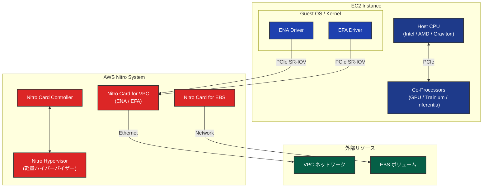
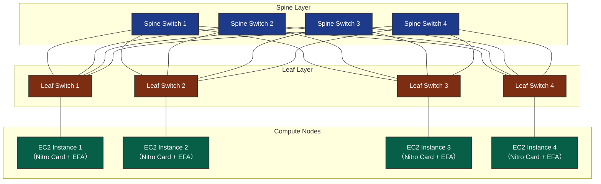
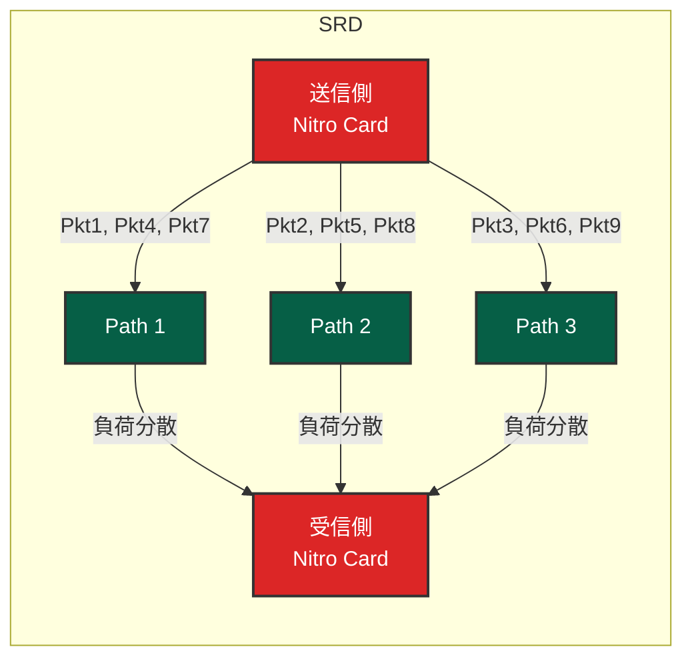
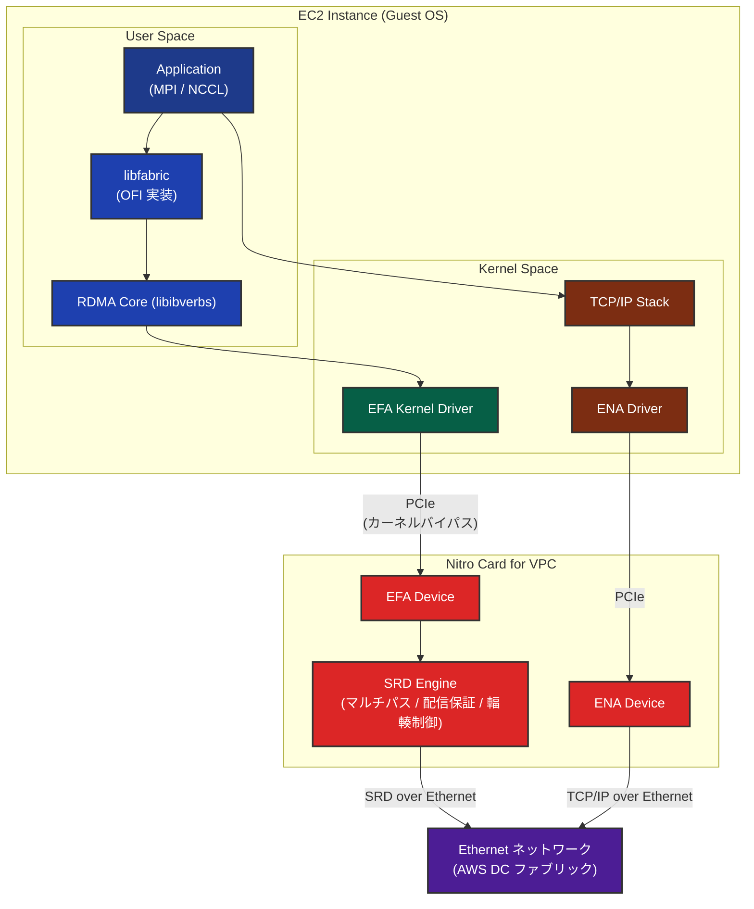

## はじめに

AWS で大規模な HPC（High Performance Computing）ワークロードや分散機械学習を実行する際、ノード間通信の性能がボトルネックになることがあります。TCP/IP ベースのネットワーキングでは、レイテンシやジッターが大きく、通信律速な大規模分散計算（AllReduce を多用する分散学習など）では、通信待ちの時間が全体の性能を左右する場合があります。

この課題を解決するために AWS が開発したのが **EFA（Elastic Fabric Adapter）** です。EFA は AWS の独自プロトコルである **SRD（Scalable Reliable Datagram）** を基盤とし、**Nitro System** のハードウェアオフロード機能を活用することで、TCP と比較して大幅に低いレイテンシとジッターをクラウド上で実現します。

本記事では、まず Nitro System の全体像を理解し、その上で SRD プロトコルの仕組み、EFA の設計思想と実装の詳細を解説します。

**対象読者**: AWS 上で HPC / ML ワークロードを運用するエンジニア、ネットワーク技術に関心のあるインフラエンジニア向けの内容です。RDMA（Remote Direct Memory Access）、PCIe、IOMMU（Input-Output Memory Management Unit）等のネットワーク・ハードウェアの基礎知識があると理解が深まりますが、必須ではありません。

:::message alert
**免責事項**: 本記事は主に 2020 年に発表された IEEE Micro 論文および AWS 公式ドキュメントに基づいて執筆されています。AWS の内部実装は公開されておらず、また継続的にアップデートされているため、本記事の内容が現時点（2026 年）の AWS の実際の実装や最新の動作を完全に反映しているとは限りません。記事の内容は技術的な理解を深めるための参考情報としてご利用ください。
:::

## Nitro System

[Nitro System](https://aws.amazon.com/jp/ec2/nitro/) は、AWS が独自に設計・開発したインフラストラクチャプラットフォームです。Xen ハイパーバイザーが担っていたネットワーキング、ストレージ、セキュリティなどの機能を専用ハードウェア（Nitro Cards）にオフロードすることで、ホスト CPU のほぼすべてのリソースをワークロードに充てることを可能にしています。

参考: [A Cloud-Optimized Transport Protocol for Elastic and Scalable HPC (IEEE Micro, 2020)](https://ieeexplore.ieee.org/document/9167399) -- Leah Shalev 他著、SRD プロトコル設計とパケット順序を犠牲にしたマルチパス活用の技術的詳細。

### Nitro System のアーキテクチャ

Nitro System の主要な構成要素は **Nitro Cards** と **Nitro Hypervisor** です。他にもありますが割愛します。



Nitro System の主な価値は、**I/O 処理を専用ハードウェアにオフロード**することで、ホスト CPU のリソースを最大限にワークロードへ割り当てることです。これによりスループットの向上が実現されます。さらに、SR-IOV による直接的なデバイスアクセスと専用 ASIC の高速処理により、レイテンシ・ジッターの低減も実現されています。この設計により、ベアメタルインスタンスの提供も可能になっています。

また、ストレージおよびネットワーク通信に対する透過的な暗号化をハードウェアレベルで提供し、セキュリティを確保しています。

参考: [Security Design of the AWS Nitro System (AWS Whitepaper)](https://docs.aws.amazon.com/whitepapers/latest/security-design-of-aws-nitro-system/)

### Nitro Cards のカスタム ASIC

Nitro Cards の心臓部は、AWS が買収した **Annapurna Labs** が設計するカスタム ASIC（Application-Specific Integrated Circuit）です。

https://perspectives.mvdirona.com/2019/02/aws-nitro-system/

Nitro Cards はホストサーバーと PCIe（Peripheral Component Interconnect Express）バスを介して接続されます。

Nitro Card と EC2 インスタンス間の仮想化には **SR-IOV（Single Root I/O Virtualization）** が採用されています。SR-IOV では、1 つの物理デバイス（Physical Function, PF）が複数の仮想デバイス（Virtual Function, VF）を PCIe レベルでハードウェア的に公開します。各 VM は VF に直接アクセスでき、Xen ベースの仮想化で必要だった Dom0（Domain 0: 特権ドメイン）や QEMU を経由するデバイスエミュレーションが不要になります。この結果、I/O パスにおいてベアメタルに近い性能が実現されています。Nitro Hypervisor の軽量設計（CPU/メモリの仮想化オーバーヘッドの最小化）と合わせて、全体としてベアメタル相当の性能が提供されています。

参考: [AWS EC2 Virtualization 2017: Introducing Nitro - Brendan Gregg](https://www.brendangregg.com/blog/2017-11-29/aws-ec2-virtualization-2017.html)
参考: [コンフィデンシャルコンピューティング： AWS の視点](https://aws.amazon.com/jp/blogs/news/confidential-computing-an-aws-perspective/)

### Nitro Cards の詳細

Nitro System の中核を担う Nitro Cards は、それぞれ専門の役割を持つカスタム ASIC ベースのハードウェアです。

#### Nitro Card for VPC

Nitro Card for VPC は EC2 インスタンスのネットワーキング機能の中枢を担います。PCIe 経由で ENA（Elastic Network Adapter）および EFA コントローラを OS に公開し、Amazon VPC データプレーンの処理をハードウェア上で実行します。透過的なエンドツーエンドの 256 ビット鍵の AEAD（Authenticated Encryption with Associated Data）暗号化をハードウェアオフロードにより処理し、暗号化処理のホスト CPU への影響を最小化します（参考: [Data protection in Amazon EC2](https://docs.aws.amazon.com/AWSEC2/latest/UserGuide/data-protection.html)）。

EFA（Elastic Fabric Adapter）は 後述する特定のインスタンスで提供される高性能ネットワーク機能であり、libfabric API を通じて OS カーネルをバイパスして EFA デバイスと直接通信する OS-bypass 機能を備えています（参考: [Elastic Fabric Adapter](https://docs.aws.amazon.com/AWSEC2/latest/UserGuide/efa.html)）。

#### Nitro Card for EBS

Nitro Card for EBS は NVMe（Non-Volatile Memory Express） PCIe コントローラとして OS に標準的な NVMe デバイスを公開します。EBS データプレーンの処理と暗号化をハードウェア上で実行します（スループットの上限はインスタンスタイプに依存）。OS 側は標準の NVMe ドライバを使用するため、特別なドライバのインストールは不要です。

#### Nitro Card Controller

Nitro Card Controller は他の Nitro Cards、Nitro Hypervisor、および Nitro Security Chip 間の連携を管理するコンポーネントです。コントローラ自体がハードウェアベースの Root of Trust、測定（Measurement）、および認証（Attestation）機能を備えています。

### Nitro Hypervisor の設計

AWS 公式ドキュメントによると、Nitro Hypervisor は「軽量のハイパーバイザーであり、メモリと CPU の割り当てを管理し、ベアメタルとも区別がつかないパフォーマンスを実現する」と記載されています（参考: [AWS Nitro System](https://aws.amazon.com/ec2/nitro/)）。

すべてのネットワーク、ストレージ、セキュリティの I/O 処理は Nitro Cards が担当するため、Hypervisor のアタックサーフェスが大幅に縮小されています。AWS 公式ドキュメントでは「ベアメタルと区別がつかないパフォーマンス」と表現されており、Nitro のオーバーヘッドは極めて小さいとされています。

EC2 インスタンス内部から `lspci` コマンドを実行すると、Nitro Cards が提供するデバイスが PCIe デバイスとして直接見えます。ENA / EFA はネットワークコントローラとして、EBS と Instance Storage は NVMe デバイスとして認識され、いずれも標準のカーネルドライバで動作します。

```
# 実際に実行した例
lspci | grep -i "Amazon.*Elastic Fabric Adapter"
00:1a.0 Ethernet controller: Amazon.com, Inc. Elastic Fabric Adapter (EFA)
```

以下の表は主要な EFA 対応インスタンスにおける EFA 世代の進化を示しています。

:::message
**EFA 世代の分類について**：本記事では便宜上、EFA の機能と性能の進化に基づいて「EFAv2」「EFAv3」「EFAv4」という名称を使用していますが、これらは AWS の公式な名称ではありません。AWS 公式ブログでは「Second Generation EFA」という表現が使われています（参考: [Second Generation EFA ブログ](https://aws.amazon.com/jp/blogs/hpc/second-generation-efa-improving-hpc-and-ml-application-performance-in-the-cloud/)）。
:::

| EFA 世代 | インスタンス | 最大ネットワーク帯域幅 | 主な特徴 |
|---|---|---|---|
| 第 1 世代 | P4d.24xlarge | [400 Gbps](https://aws.amazon.com/ec2/instance-types/p4/) | RDMA Read 対応（RDMA Write は非対応） |
| **第 2 世代（EFAv2）** | P5.48xlarge | [**3,200 Gbps**](https://aws.amazon.com/ec2/instance-types/p5/) | RDMA Read/Write 対応 |
| **第 2 世代（EFAv2）** | Trn1n.32xlarge | [**1,600 Gbps**](https://aws.amazon.com/ec2/instance-types/trn1/) | RDMA Read/Write 対応 |
| **第 3 世代（EFAv3）** | P5en.48xlarge | [**3,200 Gbps**](https://aws.amazon.com/ec2/instance-types/p5/) | 低レイテンシ（Nitro v5） |
| **第 3 世代（EFAv3）** | Trn2.48xlarge | [**3,200 Gbps**](https://aws.amazon.com/ec2/instance-types/trn2/) | 低レイテンシ（Nitro v5） |
| **第 4 世代（EFAv4）** | P6-B200 | [**3.2 Tbps**](https://aws.amazon.com/ec2/instance-types/p6/) | SRD 改善 |
| **第 4 世代（EFAv4）** | P6-B300 | [**6.4 Tbps**](https://aws.amazon.com/ec2/instance-types/p6/) | 単一サーバー最大帯域幅 |
| **第 4 世代（EFAv4）** | G7e | [**1,600 Gbps**](https://aws.amazon.com/ec2/instance-types/g7e/) | グラフィックスワークロード向け |

:::message
**同じ EFA 世代でも帯域幅が異なる理由**

同じ EFA 世代（例: 第 2 世代）でも、インスタンスによって帯域幅が異なります。これは **EFA デバイスの数**と**各デバイスの帯域幅**によって決まります。

例: 第 2 世代の場合（AWS 公式ページに記載の総帯域幅を `lspci` コマンドで確認したデバイス数で除算して算出）
- **P5.48xlarge**: 32 個の EFA デバイス × 100 Gbps = **3,200 Gbps**（参考: [P5 インスタンス](https://aws.amazon.com/ec2/instance-types/p5/) に総帯域幅 3,200 Gbps と記載、`lspci` で 32 個の EFA デバイスを確認）
- **Trn1n.32xlarge**: 16 個の EFA デバイス × 100 Gbps = **1,600 Gbps**（参考: [Trn1 インスタンス](https://aws.amazon.com/ec2/instance-types/trn1/) に総帯域幅 1,600 Gbps と記載、`lspci` で 16 個の EFA デバイスを確認、`n` サフィックスは EFA 対応を示す）

同じ `.32xlarge` サイズでも、インスタンスファミリーやバリエーション（`n` サフィックスの有無など）によって EFA デバイス数が異なり、結果として帯域幅も異なります。大規模分散学習や HPC ワークロードで通信がボトルネックとなる場合、この帯域幅の違いがスケーリング効率に影響する可能性があります。
:::

参考: [AWS EFA 公式ドキュメント](https://docs.aws.amazon.com/AWSEC2/latest/UserGuide/efa.html)

特筆すべきは **P6-B300 インスタンス**で、**6.4 Tbps** の EFA 帯域幅を実現しており、第 1 世代の P4d.24xlarge（400 Gbps）と比較して **16 倍**の帯域幅です。P5/P5en インスタンスは 3.2 Tbps（8 倍）、G7e は 1.6 Tbps（4 倍）を実現しています。

2019 年の EFA + SRD プロトコル対応が HPC / ML ワークロードにとって転換点となりました。その後、RDMA Read/Write サポートが追加され、OS-Bypass 通信の適用範囲がさらに拡大しました。最新の **EFAv4**（第 4 世代 EFA）では、P6-B300 で 6.4 Tbps を実現しています。

さらに、[AWS EC2 UltraClusters](https://aws.amazon.com/ec2/ultraclusters/) では、複数のインスタンスを超高速ネットワークで接続した大規模クラスターを構成できます。UltraClusters の構成要素となる [P6e-GB200 UltraServer](https://aws.amazon.com/ec2/instance-types/p6/) は、72 個の NVIDIA Blackwell GPU を単一サーバーに搭載した大型インスタンスで、**28.8 Tbps の EFA 帯域幅**（EFAv4、参考: [P6e インスタンス公式ページ](https://aws.amazon.com/ec2/instance-types/p6/)）を実現しています。複数 UltraServer を接続することで、数千 GPU 規模での処理が可能になります。

## SRD（Scalable Reliable Datagram）

SRD は AWS が EFA のために独自に開発したトランスポートプロトコルです。TCP/IP の限界を克服し、データセンターネットワークの物理トポロジーを最大限に活用するために設計されました。SRD の設計と実装に関する詳細は、IEEE Micro（Vol. 40, No. 6, 2020 年 11-12 月号）に掲載された AWS 論文 "A Cloud-Optimized Transport Protocol for Elastic and Scalable HPC" に記載されています。

参考: [A Cloud-Optimized Transport Protocol for Elastic and Scalable HPC (IEEE Micro, 2020)](https://ieeexplore.ieee.org/document/9167399)

### AWS データセンターのネットワークトポロジー

AWS 公式論文によると、AWS のデータセンターネットワークは **コモディティ Ethernet スイッチを用いた High-radix Folded Clos トポロジー**で構成されています（参考: [A Cloud-Optimized Transport Protocol for Elastic and Scalable HPC (IEEE Micro, 2020)](https://ieeexplore.ieee.org/document/9167399)）。Clos トポロジー（Fat-Tree 構造）は、任意の 2 ノード間に多数の冗長経路（ECMP: Equal-Cost Multipath）を提供するスケーラブルなネットワーク設計です。以下の図は理解を助けるため 2 層（Spine-Leaf）構成で簡略化して示していますが、実際の AWS データセンターでは 3 層以上の構成が採用されている場合もあります。



この構成では、例えば Instance 1 から Instance 2 への通信に、**複数の経路**が存在します（L1 → S1 → L2、L1 → S2 → L2、L1 → S3 → L2、L1 → S4 → L2 の 4 経路）。

### TCP/IP とマルチテナント環境の課題

しかし、TCP/IP プロトコルでは、この豊富な経路の多様性を十分に活用できません。

TCP/IP では、ECMP ロードバランシングが 5-tuple（送信元 IP、宛先 IP、送信元ポート、宛先ポート、プロトコル）のハッシュに基づいて**フロー単位**で経路を決定します。一度決定された経路はそのフローの全パケットで固定されるため、大きなフローが特定経路に集中し、**ホットスポット**が発生します。

さらに、クラウドのデータセンターでは多数のテナントが同じ物理ネットワークを共有しているため、他のテナントのトラフィックによる**予測不可能なネットワーク負荷の変動**が発生します。この結果、**レイテンシジッター**（レイテンシの不安定さ）が増大し、HPC / ML ワークロードでは全体性能を大きく低下させます。

障害時にも問題があります。経路上のリンクやスイッチに障害が発生すると、経路の再収束が完了するまで通信が中断され、大規模クラスターでは障害の影響がジョブ全体に波及します。

#### TCP の具体的な性能問題

IEEE Micro 2020 論文で報告された AWS データセンターにおける TCP の性能特性

| 指標 | ベストケース | 輻輳時のアウトライア※ |
|------|------------|-------------------|
| Round-Trip Time (RTT) | 約 25us | **50ms 〜 数秒** |

※ **アウトライア（outlier）**: 外れ値、すなわちテールレイテンシ（P99, P999 などの高パーセンタイル値）を指します。平均値や中央値からかけ離れた極端に遅いレスポンスタイムのことです。

**アウトライアの主な原因**: パケットロスによる再送タイムアウト（Retransmission Timeout, RTO）の待機時間です。通常時の RTT は約 25us（マイクロ秒）と非常に高速ですが、輻輳やリンク障害でパケットロスが発生すると状況が一変します。

論文のベンチマーク環境では、RTO は**50ms**に設定されています。通常時の RTT（25us）の**約 2,000 倍**です。つまり、パケットロスが 1 回発生しただけで、そのパケットのレイテンシは通常の 2,000 倍に跳ね上がります。これがテールレイテンシ（P99, P999）が悪化する基本的なメカニズムです。

さらに悪いことに、再送したパケットも輻輳によりロスする可能性があります。TCP の再送メカニズムは指数バックオフを採用しているため、RTO は倍々に増加します。1 回目の再送タイムアウトで**50ms**、2 回目で**100ms**、3 回目で**200ms**と増加し、複数回の再送が発生すると合計で**数秒**に達する可能性があります。代替パスが利用可能であっても、TCP は単一経路に固定されているため、それを活用できません。

#### RoCE が大規模クラウドに不適な理由

AWS 公式論文によると、RDMA over Converged Ethernet（RoCE）も検討されましたが、AWS のマルチテナント大規模データセンター環境には適していませんでした。RoCE は RDMA の Verbs プログラミングモデルを Ethernet 上で提供する技術であり、専用ファブリック環境では有効に機能しますが、AWS のスケール要件では以下の課題がありました。

| 課題 | 問題点 | AWS 論文での指摘 |
|------|--------|-----------------|
| **Priority Flow Control (PFC) の必要性** | RoCEv2 は PFC を必要とするが、PFC は head-of-line blocking、輻輳の伝播、デッドロックを引き起こす | 「大規模ネットワークでは実行不可能（not feasible on large-scale networks）」と明記。PFC 問題の解決策（Guo et al., 2016）も「AWS データセンターよりも大幅に小さいデータセンター」に依存 |
| **ECMP 衝突問題** | 静的な Flow ハッシュによるパスマッピングは、現在のネットワーク使用率やフロー速度を考慮しない | PFC を使用しても、RoCE は TCP と同様に ECMP ハッシュ衝突による輻輳の影響を受け、ハッシュ衝突が「ホットスポット」を作り出す |
| **輻輳制御の最適性** | RoCE の輻輳制御は AWS データセンター規模のマルチテナント環境には最適化されていない | 「suboptimal congestion control」と明記。Mittal et al. (2018) の研究を引用し、RDMA の輻輳制御の課題を指摘 |

::::details フロー管理についての補足（初学者向け）

ロスレス通信を実現するには、送信側と受信側の間で適切なフロー制御が必要です。送信側は、パケットやデータフレームの ID を管理し、すべてのデータが受信側に到達したことを確認する必要があります。

同時に、受信側のバッファ管理も重要です。受信バッファがオーバーフローしそうになった場合、受信側は送信側に対して「これ以上データを送らないでください」というシグナルを送る必要があります。このような仕組みは**バックプレッシャー機構**と呼ばれ、ロスレス通信では必須の要素となります。

実装方法としては、データリンク層にクレジット管理のための情報を組み込むのが一般的です。送信側は受信側のバッファ状況を把握し、受信可能な量だけデータを送信することで、パケットロスを防止します。スーパーコンピューター富嶽の TofuD では Ethernet は使っていませんが同様のレイヤで同じようにフロー管理が行われています。

PFC は、この**バックプレッシャー機構を Ethernet レイヤーで実現したもの**です。受信バッファが満杯になりそうな際に、スイッチが送信側に PAUSE フレームを送信して一時停止を要求します。これにより、受信バッファ溢れによるパケットドロップを防ぎ、ロスレス通信を実現します。

RoCE は、RDMA がロスレス通信を前提とした設計であるため、PFC が必須となります。RDMA ではパケットロスが発生すると性能が大幅に低下するため、ロスを防ぐバックプレッシャー機構が必要です。PFC を使用することで、受信バッファ溢れによるパケットドロップを防止し、ロスレス通信を維持します。

しかし、PFC には大規模ネットワークにおいて深刻な問題があります。第一に、**Head-of-line blocking** により、1 つのフローが停止すると同じリンクを共有する無関係なフローもブロックされます。第二に、**輻輳の伝播**として、PAUSE フレームが連鎖的に上流スイッチに伝播し、輻輳がネットワーク全体に拡散します。第三に、**デッドロック**のリスクがあり、AWS 公式論文では既存の PFC デッドロック対策（Guo et al., 2016）が「AWS データセンターよりも大幅に小さいデータセンター」を前提としており、AWS スケールでは実用的でないと指摘されています。

SRD は、RoCE とは根本的に異なるアプローチを採用しています。SRD はパケットロスを許容する設計であり、信頼性は高速リトライで確保します。

輻輳制御については、SRD はエンドツーエンドの独自アルゴリズムを採用しています。AWS 公式論文によると、SRD の輻輳制御は「受信 ACK のタイミングに基づくレート推定」と「最近の送信レートと RTT（Round-Trip Time: 往復遅延時間）の変化」を考慮します。接続ごとの動的レート制限とインフライト制限を組み合わせ、複数パスでの集約キューイングを最小限に保ちます。従来の TCP のようにパケットロスを輻輳のシグナルとして扱うのではなく、RTT ベースでネットワーク状態を監視し、パケットロスが発生する前に送信レートを制御できます。論文では、この設計が Google の BBR（Bottleneck Bandwidth and RTT）アルゴリズムと類似性があると述べられています（原文: "somewhat similar to Google's BBR algorithm"）。この設計により、PFC のようなリンクレベルのバックプレッシャーは不要となります。

AWS のような大規模マルチテナント環境では、PFC の問題が致命的になるため、SRD はこの異なるアプローチを採用しています。
::::

これらの理由から、AWS は独自の SRD プロトコルを設計し、Nitro Card にハードウェア実装する道を選択しました。論文では「TCP も他のトランスポートプロトコルも我々が必要とする性能レベルを提供しないため、独自のネットワークトランスポートを設計することを選択した」と明記されています。

### SRD の設計原則: パケット順序を犠牲にしたアプローチ

SRD プロトコルは、これらの課題を解決するために**パケット順序の保証を意図的に放棄**し、パケット単位でのマルチパス活用を実現する設計を採用しています。これは、スーパーコンピューティングをクラウド上で実現するためのアプローチ転換です。

:::message
**SRD 設計の背景**（AWS 公式論文より）

従来の TCP や InfiniBand RC（Reliable Connection）は厳密なパケット順序保証を提供しますが、論文では out-of-order delivery を選択した理由を明確に説明しています。

**In-order delivery の問題点**

In-order delivery を維持するには、大きなコストを伴います。第一に、**Head-of-line blocking** が発生します。1 つのパケットがロスすると、後続のすべてのパケットがブロックされてしまいます。第二に、**リオーダリングバッファの制約**があります。NIC はメモリ帯域幅、バッファ容量、並行コンテキスト数に限界があるため、大規模な並べ替えは困難です。第三に、**平均レイテンシが増加**します。大規模ネットワークでは out-of-order 到着が頻発し、ロストパケットと無関係な多数のパケットまで遅延してしまいます。
:::

参考: [A Cloud-Optimized Transport Protocol for Elastic and Scalable HPC (IEEE Micro, 2020)](https://ieeexplore.ieee.org/document/9167399)

SRD はこれらの課題に対して、以下のアプローチで解決策を提供します。

### マルチパスルーティング

AWS のデータセンターネットワークは Clos トポロジーで構成されており、Spine-Leaf 階層構造により任意の 2 ノード間に多数の冗長経路が存在します。**SRD はこの物理的な経路の多様性を活用し、1 つの通信フローのパケットを複数の経路に分散して送信します**。パケットごとに異なる経路を選択することで、特定経路への集中を回避し、利用可能な帯域幅を最大限に活用します。

ECMP と SRD のマルチパスルーティングの違いは以下の通りです。

| 項目 | ECMP（フロー単位） | SRD（パケット単位） |
|---|---|---|
| 分散単位 | フロー単位（5-tuple ハッシュ固定） | パケット単位（動的選択） |
| 経路選択 | ハッシュ値で静的に決定 | ネットワーク負荷を考慮して動的に決定 |
| 輻輳回避 | 特定経路にフローが偏る可能性あり | パケットレベルで負荷分散し輻輳を回避 |
| 障害時の挙動 | 経路再収束まで通信中断 | 障害経路を即座に回避、残りの経路で継続 |
| 順序保証 | フロー内で保証（単一経路） | Out-of-order delivery を許容、順序管理はアプリケーション層に委譲 |

ECMP はフロー単位でしか経路を分散できないため、大きなフロー（elephant flow）が特定のリンクに集中する「ホットスポット」問題が発生しがちです。SRD はパケット単位で**スプレイディング**を行うことで、この問題を解消しています。

::::details スプレイディングとは

**スプレイディング**は、1 つのフロー（通信セッション）のパケットを、水をスプレーで撒くように複数の経路に分散して送信する技術です。

**従来のアプローチ（ECMP）との違い**

従来の ECMP では、フロー単位（5-tuple のハッシュ値）で経路が固定されます。例えば、サーバー A からサーバー B への通信フローは常に Path 1 を使い、サーバー C からサーバー D への通信フローは常に Path 2 を使う、というように決まります。この方式では、以下の問題が発生します。第一に、**Elephant flow 問題**として、大量のデータを送信するフローが特定の経路に集中すると、その経路だけが輻輳します。第二に、**ハッシュ衝突**により、複数のフローが同じ経路にマッピングされると、その経路に負荷が集中します。第三に、**動的な調整が不可能**であり、一度決まった経路は輻輳状態になっても変更できません。

**SRD のスプレイディング**では同じフローのパケットであっても、パケットごとに異なる経路を選択します。

この方式により、以下の利点があります。第一に、**きめ細かい負荷分散**が実現されており、大きなフローでも複数経路に分散されるため、特定経路への集中を回避できます。第二に、**動的な経路選択**により、輻輳した経路を検出したら次のパケットから別の経路を使用することが可能です。第三に、**帯域幅の最大活用**として、利用可能なすべての経路を同時に活用し、ネットワークの集約帯域幅を最大限に引き出します。

**スプレイディングのトレードオフ**

スプレイディングは、パケットが異なる経路を通るため、経路ごとの遅延差により out-of-order delivery が発生します。従来の TCP はこれを「パケットロス」と誤検知して性能低下を引き起こしますが、SRD は out-of-order を前提とした設計によりこの問題を回避しています。
::::


以下の図は、SRD のパケット分散を概念的に示しています。



### スプレイディングのハードウェア実装

SRD のパケットスプレイは Nitro Card のカスタム ASIC（ハードウェア）上で実装されています。各パケットの送信時、Nitro Card は利用可能な複数の経路（複数の Spine スイッチへのパス）から最適な経路を選択し、輻輳している経路を回避しながら動的に負荷分散します。さらに、経路で障害が発生した場合でも、ルーティングプロトコルの経路再収束を待つことなく、即座に他の健全な経路へスイッチします。

ハードウェア実装により、パケットごとの経路選択がマイクロ秒オーダーの応答速度で実行されます。ソフトウェア実装と比較してカーネル処理やコンテキストスイッチのオーバーヘッドが最小化され、処理時間のばらつきも抑制されます。この予測可能な低レイテンシ特性は、マルチパスルーティングや輻輳制御と組み合わさることで、マルチテナント環境でも安定したスループットの維持に貢献します。他のテナントのトラフィックバーストが発生した際も、SRD は比較的空いている経路にパケットを振り向けることで、単一経路に依存する TCP と比較して影響を軽減できます。

### アウトオブオーダー配信の特性

複数経路を使用すると、各経路の遅延差によりパケットの到着順序が送信順序と異なる場合があります。TCP/IP ではアウトオブオーダーのパケット到着を損失と誤検知し、不必要な再送や輻輳ウィンドウの縮小を引き起こします。

**SRD の設計原則**: SRD は意図的に out-of-order delivery を許容し、パケットをアプリケーション層に直接配信します。順序管理は MPI や NCCL などのアプリケーション層に委ねられます。

この設計により、第一に、パケットごとに最適な経路を選択することでネットワークの並列性を最大限に活用し、head-of-line blocking を回避できます。第二に、順序待ちでパケットを保留する必要がないため、不要なバッファリング遅延が排除されます。第三に、TCP/IP のようにアウトオブオーダーを「パケットロス」と誤検知した場合の不要な再送や輻輳制御の誤動作が回避されます。

### Nitro Card へのハードウェア実装の意義

SRD プロトコルが Nitro Card のカスタム ASIC に直接実装されていることは、重要な設計判断です。

:::message alert
**SRD をハードウェア実装した理由**: AWS の目標は、SRD を物理ネットワーク層にできるだけ近づけ、ホスト OS やハイパーバイザーが注入する性能ノイズを回避することでした。これにより、**高速な再送**と**ネットワーク輻輳の変動に対する即座のレート調整**が可能になります。
:::

カーネルスタックを経由するソフトウェア実装では、マルチテナント環境で常に発生する他テナントのトラフィック変動に対して、マイクロ秒単位で応答することは困難です。カーネル処理やスケジューラの遅延により、応答時間がミリ秒オーダーになってしまうためです。また、各パケットの送信時にリアルタイムで最適経路を決定するには、ハードウェアレベルの高速処理が不可欠です。

この結果、パケット処理がワイヤー速度（100 Gbps 以上）で実行され、ネットワーク状態の変化に対してマイクロ秒オーダーで応答できます。経路障害を検出してから迂回するまでの時間は、ルーティングプロトコルの収束を待つ TCP と比較して大幅に短縮されます。これにより、ネットワーク障害時の影響が軽減されます。

SRD のマルチパスルーティング、ハードウェアベースの輻輳制御と経路選択、out-of-order delivery の許容といった設計の組み合わせにより、クラウド環境でも TCP と比較して大幅に低いレイテンシとジッター、高スループットが実現されています。

### 独自の障害検出と輻輳制御

SRD は、ネットワークリンク障害から高速に回復する機能を持っています。再送パケットを送信する際、元の送信で使用したパスが利用できなくなった場合、ネットワーク全体のルーティング更新の収束を待つことなく、即座に別のパスに再ルーティングできます。これにより、障害発生時のレイテンシへの影響が最小限に抑えられます。

輻輳制御についても、SRD は AWS のデータセンターネットワークに最適化された独自のアルゴリズムを Nitro Card のハードウェアに実装しています。ネットワークの輻輳状態を検出してパケットの送信レートを動的に調整することで、高スループットと低レイテンシを両立します。

### 配信保証

SRD は信頼性のあるデータグラムプロトコルとして、パケットの配信保証を提供します。この保証は Nitro Card のハードウェア上で実現されるため、EC2 インスタンスの CPU リソースを消費しません。再送処理と重複排除がハードウェアオフロードされています。

### SRD の適用範囲の拡大

SRD はもともと EFA のために開発されましたが、その効果が認められ、現在では他の用途にも適用されています。

通常の ENA トラフィックにも SRD の恩恵を提供する [**ENA Express**](https://docs.aws.amazon.com/AWSEC2/latest/UserGuide/ena-express.html) があります。ENA Express は、アプリケーションに透過的に SRD プロトコルを適用する機能で、通常の TCP/UDP ソケット API を使用するアプリケーションを変更することなく、同一 Availability Zone（AZ）内の通信で SRD の高性能を享受できます。ENA Express を有効にすると、シングルフロースループットが向上し（インスタンスタイプにより異なるが、例えば**通常の ENA では最大 5 Gbps から ENA Express では最大 25 Gbps への向上**が報告されている）、TCP と比較して低い P99 レイテンシを実現します。AZ をまたぐ通信や SRD 非対応インスタンスとの通信では、自動的に従来の TCP/IP にフォールバックする設計になっています。

### SRD のアーキテクチャ構成



この図で重要なポイントは、EFA を使用する場合にアプリケーションから libfabric を経由して RDMA Core（libibverbs）に到達し、そこから EFA カーネルドライバを通じて Nitro Card 上の EFA デバイスにアクセスする点です。データ転送のホットパスではカーネルバイパスが行われ、ユーザースペースから直接 Nitro Card にアクセスすることで、カーネルのオーバーヘッドを排除しています。Nitro Card 上の SRD Engine がマルチパスルーティング、輻輳制御、配信保証などをすべてハードウェアで処理し、標準的な Ethernet ネットワーク上で SRD パケットを送受信します。

:::message
**補足**: この図は EFA のデータパスを中心に描いています。EFA カーネルドライバから EFA デバイスへの矢印は制御パスを示しており、データパスではユーザースペースから mmap() でマップされたハードウェアレジスタに直接アクセスします（カーネルバイパス）。また、ENA デバイスは通常の TCP/IP 通信を行いますが、ENA Express を有効にした場合は同じ SRD Engine を経由して SRD プロトコルを使用します。
:::

## EFA（Elastic Fabric Adapter）

EFA は HPC および機械学習ワークロード向けに AWS が開発した高性能ネットワークインターフェースです。ENA 互換インターフェースと EFA 専用インターフェースの 2 種類があり、OS カーネルバイパスによる低レイテンシ・高スループット通信をサポートします。

参考: [Elastic Fabric Adapter (EFA) for Tightly-Coupled HPC Workloads (AWS ブログ)](https://aws.amazon.com/jp/blogs/news/now-available-elastic-fabric-adapter-efa-for-tightly-coupled-hpc-workloads/)

:::message
**前提条件**: EFA は Nitro Card for VPC 上のハードウェア機能であるため、**EFA 対応インスタンスタイプ**でのみ利用できます。また、インスタンス起動時に EFA を明示的に有効化する必要があります。
:::

### EFA の設計思想

EFA の設計において最も重要な判断は、InfiniBand のような専用ファブリックを採用せず、既存の Ethernet インフラストラクチャ上で HPC グレードの通信を実現するというアプローチです。これにより、クラウドの弾力性（必要なときに必要な数のノードを起動・停止できる柔軟性）を維持しながら、低レイテンシ通信を実現しています。

EFA の主な特徴を以下の表に整理します。

| 特徴 | 説明 |
|---|---|
| OS カーネルバイパス | libfabric API を通じて、カーネルを介さず Nitro Card 上の EFA デバイスに直接アクセス |
| SRD プロトコル | TCP/IP ではなく SRD を使用（マルチパスルーティングとハードウェアベースの信頼性保証） |
| libfabric 対応 | OFI API により Open MPI、Intel MPI、NCCL などが透過的に EFA を利用可能 |
| EFA 対応インスタンスのみ | P6、P5、Trn2、G7e、hpc8a などの EFA 対応インスタンスタイプで利用可能 |
| **ネットワーク制限事項** | EFA トラフィックは **単一の Availability Zone（AZ）内に制限** |

:::message alert
**重要な制約**: EFA は同一 AZ 内の通信に限定されます。AZ をまたぐ通信や VPC 間のルーティングには使用できません。大規模な HPC / ML クラスターを構築する際は、低レイテンシを最大化するため、全インスタンスを同一 AZ の Placement Group 内に配置することが推奨されます。複数 AZ にまたがるクラスター構成が必要な場合は、EFA ではなく ENA（通常のネットワーク）を使用してください。
:::

::::details libfabric とは何か

OpenFabrics Interfaces（OFI）は、高性能並列・分散アプリケーション向けの通信 API 仕様です。**libfabric** は OFI 仕様の実装であり、OpenFabrics Alliance 傘下の OFIWG（OFI Working Group）により開発されています。

libfabric は、多様なネットワーク技術（InfiniBand、RoCE、Omni-Path、AWS EFA、Intel PSM3、TCP/UDP など）を抽象化し、OFI で定義された統一された低レベル通信 API を提供します。これにより、アプリケーションコードを変更することなく、異なるネットワークハードウェア上で動作させることが可能になります。

### Provider モデル

libfabric は **Provider モデル** を採用しており、各ネットワーク技術に対応した Provider が実装されています。

- **efa** - AWS Elastic Fabric Adapter
- **verbs** - InfiniBand / iWARP / RoCE
- **tcp / udp** - 汎用的なソケットベース通信
- **shm** - 共有メモリ通信（同一ノード内）

アプリケーションは `fi_getinfo()` API を呼び出すことで、利用可能な Provider を列挙し、要件に合った Provider を選択します。EFA 環境では **EFA Provider** が選択され、内部的に rdma-core / libibverbs を通じて EFA カーネルドライバと通信します。

libfabric を使用することで、OS カーネルを経由せずに直接ハードウェアと通信する **OS-bypass** が実現され、特に小メッセージにおいてレイテンシが削減されます。

### EFA と libfabric の統合

EFA は libfabric と統合されています。以下のアプリケーション・ライブラリが EFA を透過的に利用できます。

| アプリケーション / ライブラリ | 用途 |
|---|---|
| Open MPI（Message Passing Interface） | HPC 並列計算 |
| Intel MPI（Message Passing Interface） | HPC 並列計算 |
| NVIDIA NCCL（NVIDIA Collective Communication Library） | AI/ML 集合通信 |
| AWS Neuron SDK | AWS Trainium / Inferentia での推論・訓練 |

これらのライブラリは、libfabric の統一された API を通じて EFA にアクセスするため、**アプリケーションコードを変更することなく EFA の恩恵を受けられます**。

参考: [Elastic Fabric Adapter - Supported applications](https://docs.aws.amazon.com/AWSEC2/latest/UserGuide/efa.html)
::::

NCCL は AWS OFI NCCL Plugin を介して libfabric に接続します。libfabric の EFA Provider が libibverbs / rdma-core を呼び出し、EFA カーネルドライバを経由して Nitro Card 上の EFA デバイスに到達します。データパスではカーネルバイパスが有効になるため、実際のデータ転送時にはカーネルのオーバーヘッドが発生しません。

### EFA ソフトウェアスタックの実装詳細

EFA のソフトウェアスタックは、カーネルドライバ、ユーザースペースライブラリ（rdma-core / libibverbs）、libfabric EFA Provider の 3 層で構成されています。ここではそれぞれの層の実装を掘り下げます。

#### EFA カーネルドライバ（efa.ko）

EFA カーネルドライバのソースコードは GitHub で公開されています。

参考: [Amazon EFA Kernel Driver (GitHub)](https://github.com/amzn/amzn-drivers/tree/8a8b6f29ba67/kernel/linux/efa)

ドライバは以下の主要モジュールで構成されています。

| モジュール | 主要ファイル | 役割 |
|---|---|---|
| コアモジュール | `efa_main.c`, `efa.h` | PCIe デバイスの検出・登録、ドライバのエントリーポイント |
| カーネル側 Verbs インターフェース実装 | `efa_verbs.c`（制御パス）, `efa_data_verbs.c`（データパス） | カーネル側 Verbs インターフェース（`ib_device_ops`）の EFA 向け実装 |
| 管理通信層 | `efa_com.c`, `efa_com_cmd.c` | Admin Queue を介したデバイスとの管理コマンド通信 |
| ハードウェア定義 | `efa_regs_defs.h`, `efa_io_defs.h`, `efa-abi.h` | PCIe MMIO（Memory-Mapped I/O）レジスタ、データパス型、カーネル/ユーザースペース ABI |
| アクセラレータ連携 | `efa_p2p.c`, `efa_nvmem_*.c`, `efa_neuronmem.c` | GPUDirect RDMA（NVIDIA GPU）、Neuron Direct（AWS Trainium/Inferentia）統合 |

:::message
カーネルドライバについては別のブログで詳細に調査と解説を行う予定のため今回は詳細を割愛します。
:::

::::details rdma-core / libibverbs / Verbs API とは何か

**rdma-core** は、Linux における RDMA 通信のためのユーザースペースコンポーネント群を提供するプロジェクトです。Linux カーネルの `drivers/infiniband` サブシステムに対応し、ユーザースペースから RDMA ハードウェアにアクセスするためのライブラリとツールを提供します。

**libibverbs** は、rdma-core プロジェクトの中核となるライブラリであり、**Verbs API** と呼ばれる標準的な RDMA 操作 API を提供します。

**Verbs API** は、InfiniBand Architecture 仕様で定義されており、以下の 2 つのカテゴリの操作を提供します。

1. **遅延パス（Slow Path）操作**
   - リソース管理（Protection Domain、Queue Pair、Memory Region の作成）
   - `/dev/infiniband/uverbsN` デバイスを通じてカーネルと通信
   - システムコールを伴う

2. **高速パス（Fast Path）操作**
   - データ転送操作（RDMA Read/Write、Send/Recv）
   - **mmap() でユーザースペースにマップされたハードウェアレジスタに直接書き込み、システムコールやコンテキストスイッチを伴わない**

libibverbs は、ハードウェア非依存な抽象化レイヤーを提供し、開発者はハードウェア固有の詳細を意識せずに Verbs API を使用できます。
::::


:::message
OS-Bypass の実装、RDMA サポート、GPUDirect RDMA、コンポーネント間インターフェース、メモリ管理の仕組みなど、カーネルレベルの実装詳細については、別記事で詳しく解説します。
:::

## SRD の性能評価

AWS データセンターにおける実測データにより、SRD プロトコルが TCP と比較して優れた性能を示すことが確認されています。

### 48-way Incast における Flow Completion Time (FCT)

**Flow Completion Time** とは、データ転送の開始から完了までにかかる時間のことであり、ネットワークの性能を評価する重要な指標です。FCT が小さいほど高性能なネットワークと言えます。

**実験設定**（AWS 公式論文より）: この実験では、4 台のサーバー（各サーバーから 12 プロセス）から単一の宛先サーバーへ合計 48 個の独立したフローを送信することで、最終ネットワークホップ（last-hop switch）でボトルネックを意図的に作成しています。受信側リンクの帯域幅は 100 Gbps であり、各フローの理想的な **fair share**（総帯域幅を全フロー数で均等に分配した場合の 1 フローあたりの理論帯域幅）は約 2 Gbps（100 Gbps ÷ 48）となります。

**測定結果**（IEEE Micro 2020 論文より）

| メトリック | SRD | TCP |
|-----------|-----|-----|
| **2MB 転送の最大 FCT** | 理想値に近い | **理想値の 3〜20 倍**（図から推定: ~50-150ms、再送タイムアウトにより最大 1000ms 以上のアウトライアあり） |
| **FCT のジッター** | 極めて低い | 高い（ノイジー） |
| **タイムアウトによる遅延** | 高速再送により事実上発生しない | 50ms 以上多数 |

:::message
**SRD の性能優位性**

AWS 公式論文（IEEE Micro 2020）によると、48-way incast という厳しい条件下でも、SRD は優れた性能を実現しています。第一に、SRD の FCT は理想値に近い一方、TCP の最大 FCT は理想値の 3〜20 倍に達しており、SRD が大幅に優れた性能を達成しています。第二に、FCT のばらつきが極めて小さく、予測可能な性能を提供します。第三に、高速再送によりタイムアウトによる遅延が事実上発生せず、TCP で頻発する最小 50ms の再送タイムアウトを回避しています。
:::

**TCP の問題点**: TCP は FCT のばらつきが大きく、ノイジーな性能特性を示します。50ms 以上のテールレイテンシは再送タイムアウト（50ms）に起因し、タイムアウトに到達しないサンプルでも多数が理想値の 3 倍以上となります。パケットロスによる再送がボトルネックとなり、予測可能な性能を提供できません。

**SRD の利点**: SRD は FCT がほぼ最適値に収まり、ジッターが低い安定した性能を実現します。すべてのフローで一貫した性能を提供し、高速再送により再送タイムアウトを回避します。

### 個別フロースループットの安定性

継続的な輻輳下での各フローのスループットを 1 秒ごとにサンプリングした結果は以下です。

| プロトコル | スループット特性 | 公平性 |
|----------|----------------|-------|
| **SRD** | 全フローで一貫して理想値（約 2 Gbps）に近い | 高 |
| **TCP** | **激しく振動**、一部フローは平均スループットが低い | 低 |

TCP では、各フローのスループットが予測不可能に変動し、一部のフローが長時間にわたって帯域幅を獲得できない状態が発生します。SRD は TCP と比較して、フロー間の帯域幅分配がより均等になる傾向を示します。

### マルチパス環境での ECMP 不均衡の影響

論文では、同一ラック内の 8 台のサーバー（送信側、各 16 MPI ランク）が別ラック内の 8 台のサーバー（受信側）と full-bisection ネットワークを介して通信する実験が行われました。TOR（Top of Rack）スイッチのアップリンクは 50% 利用率、ダウンリンクには輻輳がない理想的な条件です。

**測定結果**（IEEE Micro 2020 論文より）

| プロトコル | 中央値 FCT | 平均 FCT | 最大 FCT |
|----------|-----------|---------|---------|
| **SRD** | 理想値 + 15% | - | 平均 TCP FCT 未満 |
| **TCP** | 変動大 | 理想値 + 50% | **理想値の 10〜100 倍** |

## EFA と InfiniBand の比較

EFA と InfiniBand はどちらも HPC 向けの高性能通信を提供しますが、設計思想と適用環境が異なります。

| 観点 | クラウド環境（EFA） | オンプレミス HPC 環境（InfiniBand） |
|------|------------------|--------------------------|
| **テナント構成** | マルチテナント対応。多数のテナントが同じ物理ネットワークを共有するため、専用構成は採用できない | 専用ファブリック。計算ノード専用のネットワークを構築可能 |
| **ネットワークトポロジー** | 汎用的な Clos トポロジー（Fat-Tree に類似）を採用し、任意のノード間通信に対応 | ワークロードに応じた最適なトポロジーを事前設計し、物理的に配置 |
| **弾力性** | インスタンスの起動・停止、スケールアップ・ダウンに対応する必要があり、固定的な専用接続は困難 | 固定構成。物理的な配置を変更せずに最適化された構成を維持 |
| **ホップ数** | Leaf → Spine → Leaf と複数のスイッチを経由するため、各ホップでレイテンシが累積 | ノード配置とトポロジーを最適化し、直接接続や最小ホップ数の経路を設計可能（例: 同一スイッチ内のノード間は 1 ホップ） |
| **最適化手法** | SRD プロトコルによるマルチパスルーティングと輻輳制御により、制約の中で可能な限りレイテンシとジッターを低減 | 特定のアプリケーションに対してネットワークパラメータを専用チューニング |
| **レイテンシ** | マイクロ秒オーダー（具体値はワークロード依存） | サブマイクロ秒オーダーを達成しやすい |
| **独自の利点** | クラウドの弾力性、マルチパスルーティングによるスループットの安定性、運用負荷の低さ | 物理的な最適配置による極低レイテンシ |

レイテンシの違いは、技術そのものの優劣というよりも、**クラウド環境とオンプレミス HPC 環境の構成の違い**に起因します。

**P6-B300 インスタンスの 6.4 Tbps** は単一インスタンス全体の集約帯域幅（複数の EFA デバイスの合計）です。EFA は 1 インスタンスあたり複数のネットワークデバイスを統合的に使用することで、高い集約帯域幅を実現しています。

# まとめ

本記事では、AWS の EFA を中心に、Nitro System のハードウェアアーキテクチャ、SRD プロトコルの設計思想、EFA のソフトウェアスタック実装までを解説しました。

# 参考資料

- [A Cloud-Optimized Transport Protocol for Elastic and Scalable HPC (IEEE Micro, 2020)](https://ieeexplore.ieee.org/document/9167399) -- Leah Shalev, Hani Ayoub, Nafea Bshara, Erez Sabbag 他著。SRD プロトコルの設計原則、マルチパスロードバランシング、out-of-order delivery の詳細、性能評価データ（48-way incast での TCP 比 3〜20 倍の改善）。DOI: 10.1109/MM.2020.3016891
- [Scalable Reliable Datagram - Deep Dive (Semantic Scholar)](https://pdfs.semanticscholar.org/07f4/0e3f05b00225e51f5b8abcdf5260269d2df9.pdf)
- [Security Design of the AWS Nitro System (AWS Whitepaper)](https://docs.aws.amazon.com/whitepapers/latest/security-design-of-aws-nitro-system/)
- [EFA: Architecture and Design (OpenFabrics Workshop 2019)](https://www.openfabrics.org/wp-content/uploads/2019-workshop-presentations/205_RRaja.pdf)
- [MPI on AWS EFA (MVAPICH User Group Meeting 2020)](https://mug.mvapich.cse.ohio-state.edu/static/media/mug/presentations/20/rajachandrasekar-mug-20.pdf)
- [AWS Nitro System 公式ページ](https://aws.amazon.com/jp/ec2/nitro/)
- [Elastic Fabric Adapter (EFA) for Tightly-Coupled HPC Workloads (AWS ブログ)](https://aws.amazon.com/jp/blogs/news/now-available-elastic-fabric-adapter-efa-for-tightly-coupled-hpc-workloads/)
- [Second Generation EFA: Improving HPC and ML Application Performance in the Cloud (AWS HPC ブログ)](https://aws.amazon.com/jp/blogs/hpc/second-generation-efa-improving-hpc-and-ml-application-performance-in-the-cloud/)
- [Elastic Network Adapter: High Performance Network Interface for Amazon EC2 (AWS ブログ)](https://aws.amazon.com/jp/blogs/aws/elastic-network-adapter-high-performance-network-interface-for-amazon-ec2/)
- [AWS EFA ユーザーガイド](https://docs.aws.amazon.com/AWSEC2/latest/UserGuide/efa.html)
- [DLAMI EFA チュートリアル - インスタンスの起動](https://docs.aws.amazon.com/ja_jp/dlami/latest/devguide/tutorial-efa-launching.html)
- [DLAMI EFA チュートリアル - EFA の使用](https://docs.aws.amazon.com/ja_jp/dlami/latest/devguide/tutorial-efa-using.html)
- [AWS Nitro System - James Hamilton's Perspectives (2019)](https://perspectives.mvdirona.com/2019/02/aws-nitro-system/)
- [AWS EC2 Virtualization 2017: Introducing Nitro - Brendan Gregg](https://www.brendangregg.com/blog/2017-11-29/aws-ec2-virtualization-2017.html)
- [Amazon EFA Kernel Driver](https://github.com/amzn/amzn-drivers/tree/8a8b6f29ba67/kernel/linux/efa)
- [Amazon EFA Direct Data Placement](https://github.com/amzn/efa-dp-direct/tree/25967086c680)（RDMA Read/Write 実装、2025 年時点のコミット 25967086c680）
- [libfabric (OFI リファレンス実装)](https://github.com/ofiwg/libfabric)
- [libfabric EFA Provider](https://github.com/ofiwg/libfabric/tree/main/prov/efa)
- [rdma-core](https://github.com/linux-rdma/rdma-core)
- [rdma-core EFA Provider](https://github.com/linux-rdma/rdma-core/tree/master/providers/efa)
- [AWS OFI NCCL Plugin](https://github.com/aws/aws-ofi-nccl)
- [awsome-distributed-training](https://github.com/awslabs/awsome-distributed-training/tree/v1.2.0)
- [libfabric 公式ドキュメント](https://ofiwg.github.io/libfabric/)
- [Linux Kernel InfiniBand Verbs](https://www.kernel.org/doc/html/latest/infiniband/user_verbs.html)