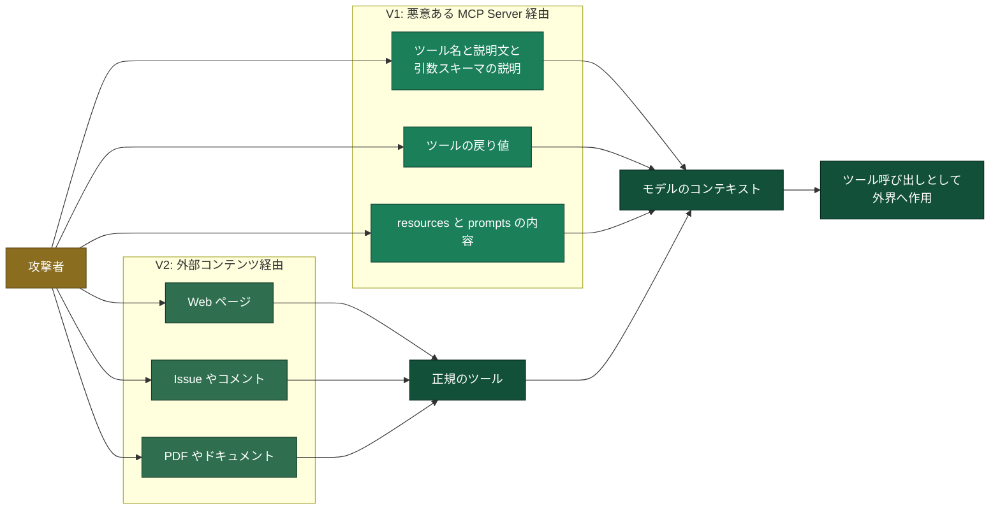

## はじめに

コーディングエージェントを組織に入れるとき、プロンプトインジェクションへの対策をどこに置くのかという問いが必ず出てきます。結論を先に書きます。

**入力に含まれた指示が悪意あるものかを判定する層は実在しますが、どれもセキュリティ境界として数えられるものではありません。** したがって守り方の重心は、指示が入ってこないようにすることではなく、入ってきた指示が何もできない状態を作ることに移ります。

この記事は前半でコーディングエージェント一般の攻撃面と責任分界を整理し、後半で具体例として Kiro を公開ドキュメントから検証します。MCP は攻撃面の一部にすぎないので、リポジトリやビルドや CI まで含めた範囲で見ます。

Kiro に関する記述は 2026 年 9 月 17 日時点の [Kiro 公式ドキュメント](https://kiro.dev/docs/)に基づきます。**本記事は一般的な考え方の整理と、その一例として Kiro を当てはめてみた内容です。Kiro について正式な回答が必要な場合は、サポートケースなどで確認してください。**

## 守りにくさの正体

プロンプトインジェクションが厄介なのは、個別の実装バグというよりも LLM の性質に根があるからです。LLM は自然言語の入力を受けて確率的に出力を作ります。「この指示には従うな」と書いても、従わないことをモデルの内部で保証する仕組みはありません。

LLM 単体であれば、これは出力品質の問題で済みます。ところがコーディングエージェントは、そのモデルの出力をそのままファイル書き込みやシェル実行やネットワークアクセスに変換します。つまり**不確実な出力を出す装置が、そのまま外界への操作権限を持ってしまう**わけです。Cloud Security Alliance の [MAESTRO](https://cloudsecurityalliance.org/blog/2025/02/06/agentic-ai-threat-modeling-framework-maestro) はこれを「自律性に関連するギャップ」と呼び、システムが予測可能な範囲で動くことを前提にした既存のセキュリティフレームワークでは捉えられない、と整理しています。この記事で扱う空白は、まさにこのギャップに当たります。エージェントの製品ごとに実装の差はありますが、この性質は共通です。

入力側の防御が何もないわけではありません。インジェクションを検出するガードレールの製品はありますし、信頼できないデータを指示から分離して扱う設計上の手法も研究されています。**ただしガードレールは確率的なので回避されますし、分離による手法も適用範囲の中でしか効きません。** どちらも方法論の 1 つであって、包括的な対策にはなりません。

そこで重心が移ります。判定の精度を上げても、外れたときに何が起きるかは変わりません。**判定は外れる前提に置いて、外れたときにできることを層ごとに絞る、という多層の視点で組むことになります。** 以降はその層を数えていきます。

## 攻撃面の数え方

前述のとおり MCP は攻撃面の一部にすぎないので、まずエージェントの製品を問わない形で全体を整理します。

### 入口

エージェントに届く文字列のうち、攻撃者が書ける場所を並べます。

| 入口 | 具体例 | 攻撃者が介入できる理由 |
|---|---|---|
| リポジトリのテキスト | README、コード中のコメント、テストデータ、コミットメッセージ | OSS への貢献、フォーク、依存先の乗っ取りで書き込める |
| エージェントの設定と仕様のファイル | 常時読み込まれる指示ファイル、イベントで自動実行されるフック、サブエージェントの定義、要件と設計のドキュメント | リポジトリに含めて配れる。開いた時点で効くものがある |
| ビルドとテストの出力 | エラーメッセージ、スタックトレース、ログ | 依存やテストコードを細工して出力に混ぜられる |
| 依存パッケージ | パッケージの説明、インストール時スクリプト、生成されるコード | 公開レジストリに自分のパッケージを置ける |
| Web の取得結果 | Web 取得や検索のツールが返す本文 | 検索に載るページを用意できる |
| 外部サービスの応答 | Issue、PR のコメント、チケット、通知 | 誰でも書き込める場所が多い |
| MCP Server | ツールの説明文、ツールの戻り値 | サードパーティの Server を使うと成立する |

**エージェントが読むものはすべて入口です。** そして「エージェントが読むもの」は、開発というタスクの性質上どんどん増えます。エラーを直すには失敗ログを読ませることになり、調べものをさせるには外部ページを読ませることになります。入口を閉じるだけで安全にする方針は、エージェントを使う価値とまっすぐ衝突します。

この表で見落とされやすいのが 2 行目です。いまのコーディングエージェントは、リポジトリの中に置かれた指示ファイルを毎回のやり取りに読み込み、イベントに応じてコマンドを自動実行するフックを備えているものが多いです。**つまり他人のリポジトリを clone して開くという普段の行為が、それ自体で指示の投入になります。** しかも書き込みと発火の間には時間差を置けるので、攻撃者はリポジトリに置いておいて誰かが開くのを待てます。

### MCP 経由の 2 系統

入口の一覧のうち、MCP に関わる部分は 2 系統に整理できます。



1 つ目は悪意ある MCP Server を経由する経路です。ツールの説明文そのものに隠し指示を書き込む [Tool Poisoning Attack](https://invariantlabs.ai/blog/mcp-security-notification-tool-poisoning-attacks) が代表例です。**多くの MCP Client は、モデルに渡すツール説明の全文を画面に出しません。** 人間には短いツール名しか見えないのにモデルは全文を読む、という差を悪用する手口です。なお MCP の仕様は説明文の表示方法もモデルへの渡し方も規定していないので、この非対称性は仕様の保証ではなく Client の実装によります。注入面はツールだけでなく、resources と prompts、そして引数スキーマの中の説明文字列にも広がります。

2 つ目は外部リソースを経由する間接的なプロンプトインジェクションです。Web ページや Issue や PDF のような外部コンテンツの中に指示を埋め込みます。この経路は MCP に限りません。エージェントが外部のコンテンツを取り込む経路すべてで成立するので、Web 取得のツールやファイル読み取りも対象です。指示を人間に見えない形で埋め込む技巧はよく使われますが、必須条件ではありません。誰もレビューしないのであれば、平文で書かれた指示でも成立します。

どちらの系統も、モデルのコンテキストに文字列を届けるところがゴールです。届いた文字列を指示として扱うかどうかはモデルの判断なので、経路を塞ぐか、届いた指示ができることを絞るかのどちらかになります。先に触れた分離による設計上の手法は前者と後者の中間を狙いますが、適用範囲の中でしか効きません。そして経路の数は、エージェントに任せる仕事が増えるほど増えます。

### 出口

コーディングエージェントに固有なのは、出口の側です。一般的なチャットの AI であれば、持ち出しの出口はネットワークへの送信に絞られます。ところがコーディングエージェントの出口には、開発そのものが含まれます。

| 出口 | 何が起きるか |
|---|---|
| ネットワークへの送信 | `curl` や Web 取得のツールで外部へ送る。URL のパラメータや DNS の問い合わせに載せる形もある |
| 応答のレンダリング | 応答に外部画像や自動プレビューされるリンクを埋め、表示のときに外部 URL へリクエストを起こす。クエリに秘密を載せられる |
| MCP ツールの呼び出し | 読み取った秘密をツールの引数に載せて外部の Server へ渡す |
| git の操作 | 秘密を含むコミットを作る。リモートへ push する。PR を作って外部から読める場所に出す |
| 生成したコードそのもの | 秘密を送信するコードや、脆弱性を残すコードを書き込む |
| ビルド成果物 | 公開されるパッケージやイメージに秘密や不正な処理を混ぜる |
| hooks と設定ファイル | 次回以降のセッションで自動実行される仕掛けを残す |

「応答のレンダリング」の行は、シェルの拒否ルールでは止まりません。ネットワークのツールを許可していなくても、外部画像を読み込むだけで通信が起きるからです。通常のハイパーリンクは、原則としてクリックされるまで通信しません。危ないのは外部画像と、製品が自動でプレビューを取りに行くリンクです。[GitHub Copilot Chat で報告され修正された事例](https://embracethered.com/blog/posts/2024/github-copilot-chat-prompt-injection-data-exfiltration/)があり、レンダラのサニタイズや画像プロキシの有無で成否が変わります。

もう 1 つ、「生成したコードそのもの」の行が重要なので、2 段に分けて説明します。まず**コマンド行のパターン照合は、スクリプトの中身に及びません。** セッションの中で `python script.py` のように実行する場合、判定されるのはコマンド行だけです。ただし OS レベルのサンドボックスを持つ製品では、生成したコードの実行も同じファイルシステムやネットワークの制限を受けます。効かないのは静的な内容検査であって、実行時の権限強制ではありません。後半で Kiro の拒否ルールの例を挙げるときに、この回避経路をもう一度扱います。次に、**コミットされたあとはエージェントの機構が一切及びません。** CI やデプロイのパイプラインが、CI の資格情報でそのコードを実行します。エージェント側でシェル実行をどれだけ絞っても、この経路は絞られません。したがってコーディングエージェントの対策には、**エージェントの出力を実行する側、つまり CI とデプロイの権限設計が必ず含まれます。**

出口の一部を製品側で塞いでいる例もあります。破壊的なコマンドや資格情報の読み出しを既定で拒否する仕組みを持つ製品はあります。ただし同じ製品でも利用形態によって効く範囲が変わるので、期待する前に必ず適用範囲を確認してください。

## 責任分界の型

クラウドの責任共有モデルは、提供者がクラウド「の」セキュリティを、利用者がクラウド「における」セキュリティを持つと整理します。同じ考え方をコーディングエージェントに当てはめれば、**エージェントの提供者と利用者の間にも責任共有モデルがあるはずです。** 提供者はエージェントという仕組みそのものの安全を持ち、利用者はその仕組みを使った開発の安全を持ちます。

境界は 2 つに引きます。曖昧な第 3 の帯は作りません。一例として、プロンプトインジェクションという文脈で範囲を整理し、Kiro の公開ドキュメントがそれぞれについて何を書いているかを並べます。

| 範囲 | 持つ側 | Kiro の公開ドキュメントの記述 |
|---|---|---|
| サービス基盤とネットワークの保護 | 提供者 | AWS のグローバルネットワークで保護すると明記 |
| 通信と保存時の暗号化 | 提供者 | TLS 1.2 以上、保存時は KMS。Enterprise は顧客管理キーを選べる |
| モデルの提供と規約上のデータ取り扱い | 提供者 | 認証経路によって学習利用とテレメトリの扱いが変わる |
| 遮断機構の実装 | 提供者 | capability 単位の権限モデル。拒否が許可に勝ち、設定ファイル自身も保護される |
| 組織統制の機構の提供 | 提供者 | モデル制限、MCP 許可リスト、監査ログの S3 出力 |
| 渡された機構を実際に設定すること | 利用者 | MCP は既定で無制限。絞る操作は利用者が行う |
| 外部ツールの評価と選別 | 利用者 | 「検証もサンドボックス化も制限もしない」と明記 |
| エージェントに読ませる入力の信頼判断 | 利用者 | 指示ファイルは既定で毎回読み込まれ、フックは承認なしで発火する |
| 資格情報の置き場と権限の広さ | 利用者 | 記述なし |
| 実行環境の隔離と egress の制御 | 利用者 | 隔離の適用範囲は確認できず。必要なドメインの許可は利用者の作業と明記 |
| 監査と検知と復旧の手順 | 利用者 | アクティビティレポートの有効化と出力先の指定は管理者が行う |
| 出力を実行する側の権限 | 利用者 | 記述なし |
| インジェクションが成功した場合の影響範囲の設計 | 利用者 | Supervised モードはセキュリティ制御ではないと明記 |

**目につくのは、利用者側が長いことです。** これは偏りではなく、そうならないとおかしい形です。提供者が渡せるのは機構であって、どこまで絞るかの判断は業務の内容と扱うデータの機密度で変わります。同じエージェントでも、公開リポジトリを触る開発と顧客データに触る開発で許してよい範囲は違います。**提供者に決められない判断が利用者に残る、という関係が責任分界の形を決めています。**

入力の判定はどちらにも入れていません。回避されうるので、どちらが持つかを議論する対象ではなく、成功する前提で扱う対象です。**投資先は 5 つの方向に分かれます。**

- 入口の統制と外部ツールの選別は、届く指示の量を減らす
- 権限の設定と実行環境の隔離は、届いた指示ができることを削る
- 資格情報の最小化は、持ち出せるものを減らす
- CI とデプロイの権限設計は、エージェントが書いたコードが後から実行されるときの被害を絞る
- 監査と検知は、すり抜けた場合の発見を担う

**この表はあくまで一例です。** 実際の責任範囲は製品ごとに違いますし、決めるのは記事ではなく提供者側の文書です。サービス規約、データの取り扱いに関する記述、セキュリティのドキュメントで、どこまでを提供者が引き受けると書いているかを確認してください。次節の評価項目は、その確認のための観点です。

## 評価の 7 項目

責任分界がこの形になるので、製品を評価するときに見るべき点も決まります。どのエージェントを検討する場合でも、次の 7 つを一次情報で確認してください。

| 確認する項目 | なぜ見るのか |
|---|---|
| 権限の粒度と優先順序 | ファイル読み書き、シェル、ネットワーク、外部ツールを別々に絞れるか。拒否が許可に必ず勝つか |
| 自動承認の既定 | 設定なしで何が確認なしに実行されるか。自律実行モードでどこまで広がるか |
| 設定自身の保護 | エージェントが自分の権限設定を書き換えられないか。リポジトリ内の設定が信頼を勝手に付与しないか |
| 実行の隔離 | プロセスやファイルシステムの隔離があるか。資格情報のディレクトリが既定で隠れるか |
| リポジトリ由来の入力 | どのファイルが自動で読み込まれ、どのイベントで何が自動実行されるか |
| 外部ツールの扱い | サードパーティのツールを製品側が検証するのか、しないと明言しているのか。組織で許可リストにできるか |
| 統制と監査 | 管理者が中央から強制できる項目は何か。ログをどこに出せるか。利用形態ごとに効く範囲が変わらないか |

見るべきなのは、セキュリティ機能があるかではなく**何を守らないと書いてあるか**です。守らないと明記されている箇所は、そのまま自組織のタスクになります。以降は Kiro を例に、この 7 項目を公開ドキュメントで確認していきます。

## Kiro の場合

ここからは具体例として Kiro を見ます。「対策がない」と言うと何もしていないように聞こえてしまいますが、実際の権限機構はかなり作り込まれています。

### 権限モデル

Kiro の[権限モデル](https://kiro.dev/docs/permissions/)は capability という単位で、操作の種別ごとに `deny` と `ask` と `allow` を割り当てます。入口と出口という分け方に当てはめると、次のように整理できます。

| 何を絞るか | capability |
|---|---|
| 読み込む口 | `fs_read`、`web_fetch`、`web_search` |
| 書き込みと実行 | `fs_write`、`shell` |
| 外部ツール。読み込みと送出を兼ねる | `mcp` |
| サンドボックス内の通信。`all` には含まれない | `sandbox_network` |
| 補助ツール。既定で許可される | `diagnostics` |
| ドキュメントに説明がないもの | `subagent`、`skill`、`power`、`context` |

**入口と出口を別々に絞れるところが効きどころです。** 秘密を読ませないこと (`fs_read` の拒否) と、読めても外に出せないこと (`shell` の拒否) は独立に設定できます。ルールは `capability` と `match` と `exclude` と `effect` の 4 つのキーで書き、置き場所はユーザー単位が `~/.kiro/settings/permissions.yaml`、ワークスペース単位が `~/.kiro/workspace-roots/<hash>/permissions.yaml` です。

```yaml
rules:
  - capability: fs_write
    match: ["src/**", "tests/**"]
    exclude: ["src/secrets/**"]
    effect: allow

  - capability: shell
    match: ["rm -rf*", "sudo*"]
    effect: deny
```

この機構で押さえておきたい性質が 4 つあります。

第 1 に、**deny が常に勝ちます**。どのスコープに書かれた `allow` も、どこかに書かれた `deny` を上書きできません。許可を緩く書きすぎても拒否が必ず優先されるので、この優先順序が実効的な上限を作ります。

第 2 に、**複合コマンドは分解して評価されます**。原文は「Compound commands (using `;`, `&&`, `||`, `|`) are split and each sub-command is evaluated independently」です。この 4 つの演算子で繋げて通すという回避は効きません。ただし分解の対象はこの 4 つなので、コマンド置換や改行区切り、`xargs` や `find -exec` や `env` のような間接実行、別のシェルの `-c` の内側といった埋め込みは残ります。

第 3 に、**Kiro 自身が変更を拒否する領域があります**。`~/.kiro/settings/`、`.kiro/settings/`、`~/.kiro/workspace-roots/` への書き込みは設定で許可できません。エージェントが自分の権限設定を書き換えて権限を広げる経路を塞ぐためです。ワークスペース単位の権限ファイルがリポジトリの外に置かれているのも同じ理由で、リポジトリに仕込まれた設定によって信頼が勝手に付与されることを防いでいます。`.git/**`、`.kiro/agents/**`、`.kiro/hooks/**`、`.kiroignore` への書き込みは、広い `allow` があっても必ず確認を挟みます。

第 4 に、**対話できない環境では `ask` が `deny` に落ちます**。原文は「When no interactive client is available, every `ask` is treated as a deny」です。CI で黙って通ってしまうことがない、という意味で安全側の挙動です。

設定なしの状態で自動的に許可されるのは、ワークスペース内のファイル読み取り、`git status` や `git log` のような読み取り専用の git コマンド、`pwd` や `whoami` のようなシステム情報の取得といった範囲です。それ以外は確認が入ります。

### 実行の隔離

評価の 7 項目のうち「実行の隔離」については、IDE と CLI でプロセスやファイルシステムの隔離が働くのかを公開ドキュメントから読み取れませんでした。`sandbox_network` という capability が存在することは隔離の仕組みがあることを示唆しますが、どの利用形態で有効になるのかは書かれていません。Web については、`permissions.yaml` と対話承認は適用されず、隔離されたクラウドサンドボックスで動くと明記されています。**手元で動かす IDE と CLI については、隔離を製品に期待せず実行環境の側で用意する前提で設計するのが安全です。**

### リポジトリ由来の入力

評価の 7 項目の「リポジトリ由来の入力」を Kiro で確認します。[steering](https://kiro.dev/docs/steering/) は `.kiro/steering/` に置かれ、`product.md` と `tech.md` と `structure.md` は既定で毎回のやり取りに読み込まれます。読み込み方は 4 通りあり、常時、ファイルのパターンに一致したとき、チャットから明示的に参照したとき、要求の内容が説明に合致したときです。ただし Kiro CLI は読み込みモードの指定に対応していないため、CLI では読み込む範囲を絞る手段が確認できません。

[hooks](https://kiro.dev/docs/hooks/) は 11 種類のイベントで発火します。ユーザーがメッセージを送ったとき、ツール呼び出しの前後、エージェントがファイルを作成や保存や削除したとき、エージェントが応答を終えたときなどです。**多くは明示的な承認なしに実行されます。** セッションの開始時に自動で有効になり、登録の操作は要りません。ファイル系のイベントに限っては、発火するのはエージェントによる作成と保存と削除だけで、エディタで人が手動で保存した場合は発火しません。

権限モデルの側では `.kiro/steering/**` は保護されていません。先に挙げた確認が入るパスのうちリポジトリ由来の入力に関わるのは `.kiro/agents/**` と `.kiro/hooks/**` への書き込みで、こちらは広い `allow` があっても確認が入ります。**つまりリポジトリに含まれた状態でやってくる分には、確認は入りません。** 差分をレビューする運用が必要になるのはこのためです。

### 組織で絞れる範囲

Enterprise の管理者は、Kiro のコンソールから[中央集中的に統制](https://kiro.dev/docs/enterprise/governance/)できます。統制できる項目は次のとおりです。

- 利用できるモデルの限定と既定モデルの指定
- MCP Server の扱い(無制限・全面禁止・許可リストの 3 択。許可リストは MCP レジストリで指定)
- CLI 用の API キー発行の可否
- `web_search` と `web_fetch` の可否
- クラウドセッションの可否
- アクティビティレポートの有効化と、ログの出力先とする S3 バケットの指定

ここは重要なので付言します。ポリシーは組織単位で適用され、アカウント単位で例外を設定できるという記述があります。ただし例外を設定できる主体が管理者に限られるのかどうかは公開情報からは読み取れないので、統制設計の前に確認してください。また、MCP 設定やモデルの可用性など一部の設定は、Kiro Web のセッションには適用されません。

### 利用形態ごとの適用範囲

ここまでの仕組みは、利用形態によって効く範囲が変わります。導入判断では「自社の使い方でどれが効くのか」が最初の問いになるので、公開ドキュメントで確認できた範囲を表にします。

| 統制手段 | IDE | CLI | Web |
|---|---|---|---|
| `permissions.yaml` による capability 制御 | 効く | 効く。非対話実行では `ask` が `deny` に落ちる | 適用されないと明記 |
| 実行の隔離 | 公開情報では未確認 | 公開情報では未確認 | 隔離されたクラウドサンドボックスで動くと明記 |
| `.kiroignore` | 対応ツール全体で読み取りを遮断 | 検索結果のフィルタのみ(ドキュメントの記述は CLI の V3 系) | 未対応と明記 |
| Enterprise 統制 | 効く | 効く | MCP 設定・モデル可用性など一部が適用外 |

**Web での利用を許すかどうかは、統制の穴を受け入れるかどうかの判断になります。** クラウドセッションは IAM Identity Center 経由の組織では既定で無効なので、有効化を要求されたときが判断のタイミングです。

### Kiro がやらないこと

Kiro のドキュメントは、やらないことをかなり率直に書いています。ここが本題の中心です。

**1 つ目は、サードパーティの MCP Server を検証しないことです。** [MCP のセキュリティのページ](https://kiro.dev/docs/mcp/)には「設定した MCP Server のセキュリティを評価する責任はあなたにあります。Kiro はサードパーティの MCP Server の振る舞いを検証もサンドボックス化も制限もしません」と書かれています。さらに stdio 形式の MCP Server については「エージェント自身と同じ権限とアクセス範囲で、あなたの環境の内部で任意のコマンドを実行します」と明示されています。stdio 形式の MCP Server は追加のユーザー確認なしにコードや資格情報を持ち出せる、という記述まであります。

**2 つ目は、Supervised モードがセキュリティ制御ではないことです。** [プライバシーとセキュリティのページ](https://kiro.dev/docs/privacy-and-security/)の表現をそのまま読むのが早いです。「Supervised モードはコードレビューのワークフローであり、セキュリティ制御ではありません。サンドボックスでも隔離境界でもアクセス制御機構でもありません」。Autopilot と Supervised でエージェントに与えられる能力は同じで、Supervised は変更が確定する前にレビューの一手を挟むだけです。「Supervised にしてあるから安全」という運用は、ドキュメントの意図から外れています。

**3 つ目は、入力を判定する層です。** プライバシーとセキュリティのページに、プロンプトインジェクションという語は出てきません。[利用できるモデルのページ](https://kiro.dev/docs/models/)にも、自前のモデルエンドポイントや自社の Amazon Bedrock アカウントを指定する手段は書かれていません。**組み合わせるものは Kiro の中ではなく外側に置くことになります。**

### データと機密ファイルの扱い

機密ファイルを守る目的で [`.kiroignore`](https://kiro.dev/docs/kiroignore/) を使う場合には範囲に注意が必要です。これはファイルの読み取り自体を止める仕組みですが、適用範囲は先の表のとおり利用形態でばらつきます。**全面的なセキュリティ境界としては使えないため、秘密情報をリポジトリに置かないという原則の代わりにはなりません。**

データの取り扱いについても、責任の所在が契約形態で変わります。[FAQ](https://kiro.dev/faq/) によれば、AWS IAM Identity Center または外部の ID プロバイダー経由で Kiro を使う有料プランのユーザーについては、コンテンツはサービス改善に使われず、テレメトリも収集されません。一方で無料枠やソーシャルログインや AWS Builder ID 経由の場合は、コンテンツがサービス改善に使われる可能性があり、オプトアウトは利用者側の操作になります。[データ保護のページ](https://kiro.dev/docs/privacy-and-security/data-protection/)によれば、無料枠のコンテンツは不正利用検知のために最大 60 日保持されます。**どの認証経路で使うかを決めるのは利用する組織側であり、ここは画面上の設定ではなく、どの契約形態で導入するかという会社としての判断になります。**

## 打ち手の順序

冒頭の方針を、実行の順序に落とします。先に方針を決め、次に一度で効く設定を入れ、そのあとで運用を作ります。項目そのものはどのエージェントでも同じなので、以下では具体を Kiro で埋めます。

### 3 つの方針

1 つ目は**自律実行モードを許すかどうか**です。Kiro では Autopilot がこれに当たり、許可済みの操作が確認なしで進みます。パターンベースの拒否リストは万能ではないので、許すなら次節の設定に加えて実行環境の隔離と egress を重ねることが前提になります。

2 つ目は**認証経路と契約形態**です。Kiro では IAM Identity Center または外部 ID プロバイダー経由にすると、コンテンツのサービス改善利用とテレメトリ収集が外れます。監査レポートについて Kiro のドキュメントは、AWS Builder ID または IAM Identity Center の資格情報を持つ利用者は AWS Artifact から取得でき、GitHub や Google のサインインでは取得できないと書いています。これは Kiro 側の導線の話です。[AWS Artifact 自体の認可](https://docs.aws.amazon.com/artifact/latest/ug/security-iam.html)は、対象の AWS アカウントにサインインしたうえで `artifact` の IAM 権限を持つかどうかで決まるので、2 つは分けて考えてください。

3 つ目は**統制が効かない利用形態を許すかどうか**です。Kiro では Web のセッションが該当します。統制が一部適用されないため、許すなら受容するリスクを明文化しておきます。

### 今日できる設定

以下は Kiro の設定名で書きますが、やることは「外部ツールを許可リストにする」「隔離を締める」「ログを出す」「拒否から書く」「CI では明示許可だけにする」「資格情報を短命にする」の 6 つで、製品が変わっても同じです。

**MCP Server を許可リスト方式に切り替えます。** 対象は Enterprise の管理者で、Kiro のコンソールの共有設定から操作します。既定は無制限なので、明示的に絞る操作が必要です。個人やチームのプランでは中央からの強制ができないため、後述の審査プロセスと設定ファイルの配布で代替します。

**実行環境の隔離を自分で用意します。** IDE と CLI で隔離が働くかは公開ドキュメントから読み取れないので、製品の側には期待しません。当日できる範囲としては、エージェントを走らせる端末やコンテナから資格情報のディレクトリを外し、作業用のユーザーやプロファイルを分けるところまでです。恒久的な形は後述するリモート開発環境への移行になります。

**監査ログを有効にします。** 検知はインシデント対応の前提なので、初日に入れる項目です。対象は Enterprise の管理者です。アクティビティレポートにオプトインすると、ログは自社で選んだ S3 バケットに保存されます。

**`permissions.yaml` に拒否ルールを配布します。** 許可を書き足す前に拒否から始めます。配布先はユーザー単位の `~/.kiro/settings/permissions.yaml` にしてください。ワークスペース単位のパスに含まれる `<hash>` はワークスペースごとに生成されるので、事前に配る用途には向きません。

```yaml
rules:
  - capability: fs_read
    match: ["**/.env", "*.env", "**/*.pem", "**/*.key", "**/id_rsa*"]
    effect: deny

  - capability: fs_write
    match: ["**/.env", "*.env", "**/*.pem", "**/*.key"]
    effect: deny

  - capability: shell
    match: ["curl*", "wget*", "nc*", "base64*", "bash -c*", "eval*"]
    effect: ask

  - capability: shell
    match: ["sudo*", "rm -rf*", "rm -fr*", "aws iam*", "aws sts assume-role*"]
    effect: deny
```

このルールが何を止めて何を止めないかを、はっきりさせておきます。止まるのは、事故や素朴な回避です。止まらないものを網羅はできませんが、少なくとも次の 5 種類が残ります。

- コマンドをいったんファイルに書いてから実行する
- `python -c` のようにインタプリタの引数として同等の処理を書く
- `cat .env` のように `shell` 経由でファイルを読む。`fs_read` の拒否がここに及ぶかは公開ドキュメントで確認できていない
- `/usr/bin/curl` のような絶対パス指定、変数展開、コマンド置換、`xargs` や `env` のような間接実行
- オプションの並び替えやロングオプション。`rm -rf*` は `rm -r -f /` や `rm --recursive --force /` に一致しない

グロブの意味も実装依存なので、`*` が引数のないコマンドに一致するかどうかを含めて、配布前に自分の環境で確認してください。**拒否リストは攻撃コストを上げる層であり、境界ではありません。** だからこそ資格情報の最小化と実行環境の隔離と egress が独立に必要になります。

**CI と headless では `allow` を列挙します。** `ask` が `deny` に落ちる挙動を利用して、必要な操作だけを許可し、それ以外は自動で止まる状態を既定にします。

**資格情報を短命にします。** 端末に長期のアクセスキーを置かず、IAM Identity Center と `aws sso login` に寄せます。GitHub のトークンは単一リポジトリに限定します。パブリックリポジトリの Issue を読むだけで、プライベートリポジトリのデータをパブリックな PR として出力させられる攻撃が [Invariant Labs から報告されています](https://invariantlabs.ai/blog/mcp-github-vulnerability)。この攻撃は、複数リポジトリを横断できるトークンが前提条件になります。横断作業が必要なときはセッションを分けてください。

### 今月作る運用

**MCP Server の審査を仕組みにします。** 担当はセキュリティチームが持ち、開発チームが申請する形が回りやすいでしょう。審査の観点は、隠し指示の有無、要求している権限が説明された機能に対して過剰でないか、外部への送信を行うかの 3 点です。特に説明文は必ず全文を読みます。前述の Tool Poisoning Attack が狙うのがここだからです。

**審査後に中身が変わっていないことを継続的に確認します。** 承認後に静かに差し替える Rug Pull Attack があるためです。最小構成は次のとおりです。

- 承認時に [`tools/list`](https://modelcontextprotocol.io/specification/2025-06-18/server/tools) を全ページ取得し、正規化した定義のハッシュ値を保存する
- `notifications/tools/list_changed` を受け取ったら、再取得して再審査する
- 変更通知に対応しない Server、あるいは通知を信用できない Server にはポーリングを併用する
- 承認済みの定義を Gateway 側で固定し、無承認の動的更新を通さない

**コード署名はこの代わりになりません。** 署名が保証するのは配布物の出所とバイト列の完全性なので、同じ署名済みプログラムが設定や外部 API の応答に応じて別のツール定義を返すことは、[MCP の仕様](https://modelcontextprotocol.io/specification/2025-06-18/server/tools)上そのまま成立します。署名はサプライチェーンの対策として別に必要なものであり、定義の固定と差分検知とは役割が違います。そして定義を固定しても、実装や戻り値だけが変わるケースまでは証明できません。

**リポジトリ由来の入力をレビュー対象にします。** 先に見たとおり、Kiro では `.kiro/steering/` と `.kiro/hooks/` と `.kiro/agents/` がリポジトリの中にあり、含まれた状態でやってくる分には確認が入りません。これらの差分はコードと同じではなく、自動で効く設定として扱います。手動確認は続かないので、clone 直後にこの 3 つのディレクトリの有無と内容を出力するスクリプトを配布し、開く前に走らせる形にしてください。

**egress を絞ります。** 順序を後ろにしたのは効果が低いからではなく、実装の難しさが利用形態に依存するからです。エージェントが動くのは VPC ではなく開発者の端末なので、環境変数によるプロキシ設定は強制になりません。`curl` の直叩きで迂回できるため、持ち出し対策としては期待できません。強制する方法は 3 つあります。

- OS のファイアウォールポリシーを端末に配布する
- SASE やセキュア Web ゲートウェイ経由を必須にする
- 開発環境そのものをリモートのコンテナや Cloud Development Environment に寄せ、ネットワーク層で絞る

3 つ目は、隔離と資格情報の問題も同時に軽くするので、統制を強めたい組織では検討する価値があります。[ファイアウォールとプロキシのページ](https://kiro.dev/docs/privacy-and-security/firewalls/)には、必要なドメインの許可がカスタマー側の作業として明記されています。AWS のデータ境界を使っている組織では、調整するものが 2 つあります。1 つはネットワークの到達性で、Kiro が必要とするドメインとポートとプロキシの経路を許可します。もう 1 つは IAM 側で、SCP やリソースコントロールポリシーや VPC エンドポイントポリシーが AWS サービス経由の呼び出しを止めている場合に、サービスプリンシパルや [`aws:PrincipalIsAWSService`](https://docs.aws.amazon.com/IAM/latest/UserGuide/reference_policies_condition-keys.html) のような条件キーを調整します。**この 2 つは別の制御なので、片方を直しても解決しないことがあります。**なお、サインイン処理は IDE のプロキシ設定に従いません。ここは把握しておくべき例外です。

**エージェントの出力を実行する側を絞ります。** エージェントが書いたコードは CI が CI の資格情報で実行するので、ここはエージェント側の設定では守れません。保護ブランチを設定して直接 push を止め、生成された変更は必ず人のレビューを通します。CI のロールは本番の変更権限から分離し、依存パッケージの追加は差分レビューの対象にします。パッケージやイメージを公開するパイプラインでは、公開の権限を別のロールに切り出します。

**復旧手順を書きます。** Kiro の[チェックポイントとリワインド](https://kiro.dev/docs/checkpoints/)のような巻き戻し機能はファイルの変更を戻せますが、外部に出たデータや外部システムへの副作用は戻せません。**手順書には鍵のローテーションと外部システム側の影響確認を必ず含めます。**

## 外側に当てるマネージドサービス

エージェントの内側に手を入れられなくても、外側の各層には当てるものがあります。ここでは AWS のサービスを例に挙げますが、層の並び自体はどのクラウドでも同じです。

| 守りたいもの | 当てるサービス | 位置 |
|---|---|---|
| 通信先の制御 | 既存のフォワードプロキシや SASE。VPC を経由させるなら AWS Network Firewall と Route 53 Resolver DNS Firewall | 端末から外へ出る通信の経路 |
| 実行環境の隔離 | リモート開発環境(コンテナや専用インスタンス) | エージェントを動かす場所そのもの |
| 資格情報の短命化 | IAM Identity Center と AWS STS | 端末に置く資格情報 |
| 秘密情報の排除 | AWS Secrets Manager、AWS Systems Manager Parameter Store | リポジトリと設定ファイル |
| 監査と検知 | エージェントの監査ログ出力先の S3、Amazon Athena、既存の SIEM | ログの保管と分析 |
| MCP の集約 | Amazon Bedrock AgentCore Gateway | 組織が提供する MCP Server の入口 |
| エージェントが書いたコードの実行 | IAM のロール分離、CodePipeline と CodeBuild の権限設計、保護ブランチ | CI とデプロイ |
| 依存関係と成果物 | [Amazon ECR のイメージスキャン](https://docs.aws.amazon.com/AmazonECR/latest/userguide/image-scanning.html)(拡張スキャンは Amazon Inspector を使う)。ソースの依存関係には別途 SCA や SBOM のスキャナ | ビルドと公開の経路 |

MCP Gateway について補足します。**Gateway を置くこと自体は、どの攻撃も防ぎません。** Gateway の機能はツールの公開と検出と呼び出しと認証認可であり、説明文の安全性を判定したり、承認後の定義の変更を検知したりする機能ではありません。効くのは、ターゲットを登録できる権限を管理者に限り、審査を通した Server だけを登録する運用にしたときで、そこで初めて未承認の Server への経路を集約して絞れます。Rug Pull への効果を持たせるには、承認済みスキーマの固定と差分の監視を Gateway の上に自分で載せる必要があります。Amazon Bedrock AgentCore Gateway では、MCP Server のターゲットに [`listingMode`](https://docs.aws.amazon.com/bedrock-agentcore-control/latest/APIReference/API_McpServerTargetConfiguration.html) があり、キャッシュを使う `DEFAULT` と一覧取得のたびに上流へ問い合わせる `DYNAMIC` を選べます。`mcpToolSchema` を明示すると動的なツールの発見と同期が止まります。**どのモードを選ぶかで Rug Pull への露出が変わります。** そしてこれらを整えても **Tool Shadowing は防げません。** Tool Shadowing は、悪意ある Server のツール説明文に埋め込んだ指示によって、正規 Server のツールの使われ方をモデルの側で書き換える攻撃です。メール送信ツールの宛先を攻撃者のアドレスに差し替えさせる例が知られています。Gateway に別の Server を追加接続できてしまえば成立するので、**Client 側の接続統制と併用することが条件になります。** Kiro であれば Enterprise 統制の MCP 許可リストがこの接続統制に当たるため、両方を入れれば未承認 Server の追加という経路は塞げます。残る余地は許可リスト内の Server が汚染される場合で、それは上に書いた定義の固定と差分監視の話に戻ります。

表のうち 2 つに条件が付きます。[AWS Network Firewall](https://docs.aws.amazon.com/network-firewall/latest/developerguide/what-is-aws-network-firewall.html) と [Route 53 Resolver DNS Firewall](https://docs.aws.amazon.com/Route53/latest/DeveloperGuide/resolver-dns-firewall.html) はどちらも VPC を通る通信に適用するサービスなので、開発者の端末にそのままポリシーを配れるわけではありません。端末の通信を VPN や専用線で VPC に強制的に通すか、開発環境そのものを VPC の中に置いたときに使えます。DNS Firewall を効かせるには、端末に VPC のリゾルバを使わせたうえで、外部 DNS や DoH や DoT や IP 直打ちの迂回も別に塞ぐ必要があります。[Amazon Inspector](https://docs.aws.amazon.com/inspector/latest/user/what-is-inspector.html) が継続的にスキャンする対象は Amazon EC2 と Amazon ECR のイメージと AWS Lambda で、任意のリポジトリやビルド依存関係を包括的に見るサービスではありません。

この表は、先の 5 つの方向に振り分けて空いている層を探すために使います。**どれか 1 つの方向に何も入っていなければ、そこが自組織の穴です。** どこまで投資するかは、インシデント時の事業継続性から逆算して決めてください。組織的な枠組みとしては NIST の [AI リスクマネジメントフレームワーク](https://airc.nist.gov/airmf-resources/)が出発点になります。

## 調達と契約の確認事項

公開ドキュメントで確認できたコンプライアンス関連は次の 2 点です。[コンプライアンス検証のページ](https://kiro.dev/docs/privacy-and-security/compliance-validation/)によれば、Kiro IDE と CLI は HIPAA 適格であり、Kiro は AWS の ISO/IEC 27001:2022 認証のスコープに含まれます。監査レポートは AWS Artifact から取得します。**HIPAA 適格は「使えば準拠になる」という意味ではありません。** 対象のワークロードでは AWS との BAA の締結、対象サービスの範囲の確認、利用者側の設定と運用が別に必要です。

一方で、次の 3 点は公開情報では確認できませんでした。セキュリティ部門とリーガルが稟議で必ず確認する項目です。**公開ドキュメントで確認できない事項について正式な回答を得るには、サポートケースを起票するか AWS の担当者に確認してください。この記事の整理は一次情報の読み方の一例であって、回答そのものではありません。**

- Kiro が AWS の SOC 2 報告書の対象範囲に含まれるかどうか。[SOC 2](https://aws.amazon.com/compliance/soc-faqs/) は ISO/IEC 27001 のような認証制度ではなく、独立監査人による保証業務とその報告書なので、確認するのは認証の有無ではなく報告書のスコープです
- プロンプトと出力がどのリージョンで処理され、どこに保存されるか。実験的な機能では複数リージョンにまたがる推論が行われるという記述があるため、データレジデンシーの要件がある場合は特に確認が必要です
- Kiro 側でセキュリティインシデントが起きた場合の通知の条件と経路

## まとめ

**インジェクションは防げないので、成功した状態から設計してください。** 守りの重心は検出の精度ではなく、届いた指示ができることを権限と隔離と資格情報と CI で削り、すり抜けを検知で拾う多層の側にあります。
