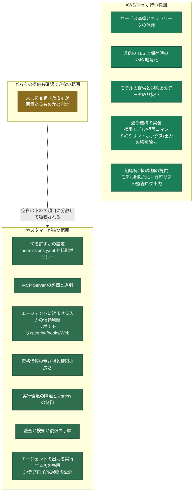

## はじめに

「Kiro はプロンプトインジェクション(外部から紛れ込ませた指示で AI を意図しない動作へ誘導する攻撃)にどう対応しているのか」という質問をいただきました。公式ドキュメントを読んで調べた結論を先に書きます。

**入力に含まれた指示が悪意あるものかどうかを判定する機構は、確認した範囲の公開ドキュメントには記載がありません。** 一方で、判定をすり抜けた指示が破壊的な操作や情報の持ち出しに変換されるところを止める機構は、かなり作り込まれています。ドキュメントの書き方からは、Kiro が投資先を後者に寄せていると読めます。これは筆者の解釈であり、AWS が設計意図としてそう述べている文章を見つけたわけではありません。

この記事では Kiro をコーディングエージェントとして捉え、公開ドキュメントに書かれている事実だけを根拠にして、AWS 側の責任範囲とカスタマー側の責任範囲を整理します。MCP は攻撃面の一部にすぎないので、リポジトリやビルドや CI まで含めた範囲で見ます。そのうえで、カスタマーが何を設定し、どのマネージドサービスをどこに組み合わせるべきかを具体化します。MCP(Model Context Protocol。AI エージェントと外部ツールをつなぐ共通規格)そのもののセキュリティについては [Model Context Protocol Security on AWS](https://zenn.dev/tosshi/books/security-of-the-mcp) という本にまとめてあるので、攻撃手法の詳細はそちらを参照してください。

本記事の Kiro に関する記述は 2026 年 9 月 17 日時点の [Kiro 公式ドキュメント](https://kiro.dev/docs/)に基づきます。ドキュメントは英語なので、鍵括弧で示した引用はすべて筆者による訳です。製品の進化が速い領域なので、導入判断の際は必ず一次情報を確認してください。

## なぜ「Kiro が防いでくれる」という形にならないのか

プロンプトインジェクションが厄介なのは、個別の実装バグというよりも LLM(大規模言語モデル)の性質に根があるからです。LLM は自然言語の入力を受けて確率的に出力を作ります。「この指示には従うな」と書いても、従わないことをモデルの内部で保証する仕組みはありません。

LLM 単体であれば、これは出力品質の問題で済みます。ところがコーディングエージェントは、そのモデルの出力をそのままファイル書き込みやシェル実行やネットワークアクセスに変換します。つまり**不確実な出力を出す装置が、そのまま外界への操作権限を持ってしまう**わけです。Cloud Security Alliance の [MAESTRO](https://cloudsecurityalliance.org/blog/2025/02/06/agentic-ai-threat-modeling-framework-maestro) はこれを「自律性に関連するギャップ」と呼び、システムが予測可能な範囲で動くことを前提にした既存のセキュリティフレームワークでは捉えられない、と整理しています。この記事で扱う空白は、まさにこのギャップに当たります。

## コーディングエージェントとしての攻撃面

質問は MCP のことだけを聞いているわけではないので、まず Kiro をコーディングエージェントとして見たときの攻撃面を整理します。MCP はそのうちの一部です。

### 入口はリポジトリと開発の流れ全体にある

エージェントに届く文字列のうち、攻撃者が書ける場所を並べます。

| 入口 | 具体例 | 攻撃者が介入できる理由 |
|---|---|---|
| リポジトリのテキスト | README、コード中のコメント、テストデータ、コミットメッセージ | OSS への貢献、フォーク、依存先の乗っ取りで書き込める |
| Kiro の設定と仕様のファイル | `.kiro/steering/`、`.kiro/hooks/`、`.kiro/agents/`、spec の `requirements.md` と `design.md` と `tasks.md` | リポジトリに含めて配れる。開いた時点で効くものがある |
| ビルドとテストの出力 | エラーメッセージ、スタックトレース、ログ | 依存やテストコードを細工して出力に混ぜられる |
| 依存パッケージ | パッケージの説明、インストール時スクリプト、生成されるコード | 公開レジストリに自分のパッケージを置ける |
| Web の取得結果 | `web_fetch` と `web_search` が返す本文 | 検索に載るページを用意できる |
| 外部サービスの応答 | Issue、PR のコメント、チケット、通知 | 誰でも書き込める場所が多い |
| MCP Server | ツールの説明文、ツールの戻り値 | サードパーティの Server を使うと成立する |

**エージェントが読むものはすべて入口です。** そして「エージェントが読むもの」は、開発というタスクの性質上どんどん増えます。エラーを直すには失敗ログを読ませることになり、調べものをさせるには外部ページを読ませることになります。入口を閉じるだけで安全にする方針は、エージェントを使う価値とまっすぐ衝突します。

この表で見落とされやすいのが 2 行目です。Kiro の [steering](https://kiro.dev/docs/steering/) は `.kiro/steering/` に置かれ、`product.md` と `tech.md` と `structure.md` は既定で毎回のやり取りに読み込まれます。ドキュメントによれば Kiro CLI は読み込みモードの指定に対応していないため、CLI では読み込む範囲を絞る手段が確認できません。[hooks](https://kiro.dev/docs/hooks/) はファイルの作成や保存やツール呼び出しの前後といったイベントで、シェルコマンドやエージェントのプロンプトを自動的に走らせます。その多くは明示的な承認を必要としません。`.kiro/hooks/**` への書き込みには確認が入りますが、すでにコミットされている hooks がセッション開始時に有効になる点は変わりません。

つまり**他人のリポジトリを clone して開くという普段の行為が、それ自体で指示の投入になります。** しかも書き込みと発火の間には時間差を置けるので、攻撃者はリポジトリに置いておいて誰かが開くのを待てます。

### MCP を経由する 2 系統

入口の一覧のうち、MCP に関わる部分は 2 系統に整理できます。


1 つ目は悪意ある MCP Server を経由する経路です。ツールの説明文そのものに隠し指示を書き込む Tool Poisoning Attack が代表例です。ユーザーが画面で見るのは短いツール名だけですが、モデルは説明文の全文を読みます。人間と AI で見えているものが違うという差を悪用する手口です。

2 つ目は外部リソースを経由する間接的なプロンプトインジェクションです。Web ページや Issue や PDF のような外部コンテンツの中に指示を埋め込みます。この経路は MCP に限りません。エージェントが外部のコンテンツを取り込む経路すべてで成立するので、Kiro であれば `web_fetch` やファイル読み取りも対象です。指示を人間に見えない形で埋め込む技巧はよく使われますが、必須条件ではありません。誰もレビューしないのであれば、平文で書かれた指示でも成立します。

2 系統がなぜ本質的に潰しきれないのかは、[§17 MCP 特有の攻撃手法](https://zenn.dev/tosshi/books/security-of-the-mcp/viewer/chapter17)に攻撃シーケンスとコード例を並べて書いてあります。

### 出口はコードとコミットにもある

コーディングエージェントに固有なのは、出口の側です。一般的なチャットの AI であれば、持ち出しの出口はネットワークへの送信に絞られます。ところがコーディングエージェントの出口には、開発そのものが含まれます。

| 出口 | 何が起きるか |
|---|---|
| ネットワークへの送信 | `curl` や `web_fetch` で外部へ送る。URL のパラメータや DNS の問い合わせに載せる形もある |
| MCP ツールの呼び出し | 読み取った秘密をツールの引数に載せて外部の Server へ渡す |
| git の操作 | 秘密を含むコミットを作る。リモートへ push する。PR を作って外部から読める場所に出す |
| 生成したコードそのもの | 秘密を送信するコードや、脆弱性を残すコードを書き込む |
| ビルド成果物 | 公開されるパッケージやイメージに秘密や不正な処理を混ぜる |
| hooks と設定ファイル | 次回以降のセッションで自動実行される仕掛けを残す |

3 番目が重要なので、2 段に分けて説明します。まず**エージェントが書いたコードの中身は、権限判定の対象になりません。** セッションの中で `python script.py` のように実行する場合、判定されるのはコマンド行だけで、スクリプトの内容には及びません。後述する拒否ルールの限界の 1 つ目がこれに当たります。次に、**コミットされたあとは Kiro の機構が一切及びません。** CI やデプロイのパイプラインが、CI の資格情報でそのコードを実行します。Kiro 側でシェル実行をどれだけ絞っても、この経路は絞られません。したがってコーディングエージェントの対策には、**エージェントの出力を実行する側、つまり CI とデプロイの権限設計が必ず含まれます。**

Kiro 自身も出口の一部は塞いでいます。後述する [Kiro Crew の拒否コマンド](https://kiro.dev/docs/crew/security/)には、保護ブランチへの push が含まれます。ただしこれは Crew の機構なので、他の利用形態で同じ保護があるかは公開情報では確認できません。

## Kiro が実際に持っている仕組み

「対策がない」と言うと何もしていないように聞こえてしまいますが、実際の権限機構はかなり作り込まれています。

### ツール呼び出しが通る門

Kiro の[権限モデル](https://kiro.dev/docs/permissions/)は capability という単位で組まれています。`fs_read`、`fs_write`、`shell`、`web_fetch`、`web_search`、`mcp`、`subagent`、`skill`、`power`、`context`、`diagnostics`、`sandbox_network` といった操作の種別に対して、`deny`、`ask`、`allow` の 3 つの効果を割り当てます。設定ファイルは YAML で、ユーザー単位が `~/.kiro/settings/permissions.yaml`、ワークスペース単位が `~/.kiro/workspace-roots/<hash>/permissions.yaml` です。ルールに書けるキーは `capability`、`match`、`exclude`、`effect` の 4 つです。なお `sandbox_network` という capability が一覧に含まれていますが、どの利用形態でサンドボックスが有効になるのかは公開情報からは読み取れませんでした。

```yaml
rules:
  - capability: fs_write
    match: ["src/**", "tests/**"]
    exclude: ["src/secrets/**"]
    effect: allow

  - capability: shell
    match: ["rm -rf*", "sudo*"]
    effect: deny
```

この機構で押さえておきたい性質が 4 つあります。

第 1 に、**deny が常に勝ちます**。どのスコープに書かれた `allow` も、どこかに書かれた `deny` を上書きできません。許可を緩く書きすぎても拒否が必ず優先されるので、この優先順序が実効的な上限を作ります。

第 2 に、**複合コマンドは分解して評価されます**。原文は「Compound commands (using `;`, `&&`, `||`, `|`) are split and each sub-command is evaluated independently」です。無害なコマンドの後ろに危険なコマンドを繋げて通すという素朴な回避は効きません。

第 3 に、**Kiro 自身が変更を拒否する領域があります**。`~/.kiro/settings/`、`.kiro/settings/`、`~/.kiro/workspace-roots/` への書き込みは設定で許可できません。エージェントが自分の権限設定を書き換えて権限を広げる経路を塞ぐためです。ワークスペース単位の権限ファイルがリポジトリの外に置かれているのも同じ理由で、リポジトリに仕込まれた設定によって信頼が勝手に付与されることを防いでいます。`.git/**`、`.kiro/agents/**`、`.kiro/hooks/**`、`.kiroignore` への書き込みは、広い `allow` があっても必ず確認を挟みます。

第 4 に、**対話できない環境では `ask` が `deny` に落ちます**。原文は「When no interactive client is available, every `ask` is treated as a deny」です。CI で黙って通ってしまうことがない、という意味で安全側の挙動です。

設定なしの状態で自動的に許可されるのは、ワークスペース内のファイル読み取り、`git status` や `git log` のような読み取り専用の git コマンド、`pwd` や `whoami` のようなシステム情報の取得といった範囲です。それ以外は確認が入ります。

### Kiro Crew の 8 層

より自律的に動く Kiro Crew では、すべてのツール呼び出しが[8 段の検査](https://kiro.dev/docs/crew/security/)を順に通ります。

1. Owner Lock によるユーザーの照合
2. 拒否コマンドのパターン照合
3. ポリシーとプロファイルを厳しい側に寄せて合成する Governance Ceiling
4. 機密パスの遮断とサンドボックスのマスク
5. ツール承認
6. 入力検証(MCP スキーマ、型、長さ、Unicode 正規化)
7. OS レベルのサンドボックス
8. 出力からの資格情報の除去

実効性の中心にあるのは、拒否パターン、OS サンドボックス、出力からの資格情報の除去です。OS サンドボックスは Linux の名前空間または macOS の Seatbelt を使って、プロセス単位でファイルシステムを隔離します。拒否コマンドには `rm -rf /` のような破壊的操作だけでなく、`cat ~/.aws/credentials` のような資格情報の読み出し、インスタンスメタデータ(クラウド上の仮想サーバーが自分自身の資格情報などを取得できる内部エンドポイント)へのアクセス、保護ブランチへの push も含まれます。出力側では、AWS のアクセスキー、秘密鍵のヘッダ、トークン、データベースの URI がパターンで除去されます。除去は切り詰めより先に走るので、切り詰めの境界で秘密が分断されて検出を逃れるという失敗モードは避けられます。ただしパターンに合致しない形式の秘密や、エンコードされた秘密は除去されません。

なお、6 番目の Unicode 正規化と 2 番目の拒否パターンは、インジェクションで生じた操作を実際に止める働きをします。冒頭で「記載がない」と書いたのは入力を判定する層のことで、**遮断側の部品はいくつも存在します**。この区別は、あとで責任分界を見るときに効いてきます。

サンドボックスには 3 つのモードがあります。**既定は `auto` で、このモードは `~/.aws` と `~/.ssh` と `~/.kube` へのアクセスを許可します。** マスクされるのは `.gnupg` や `.gcloud` や `.azure` や `.docker` です。全部を隠すのは `strict` モードで、こちらは明示的に選ぶ必要があります。既定のままだとクラウドの資格情報ディレクトリはエージェントのサブプロセスから見えている、という理解が正確です。

### 組織として絞れるところ

Enterprise の管理者は、Kiro のコンソールから[中央集中的に統制](https://kiro.dev/docs/enterprise/governance/)できます。統制できる項目は次のとおりです。

- 利用できるモデルの限定と既定モデルの指定
- MCP Server の扱い(無制限・全面禁止・許可リストの 3 択。許可リストは MCP レジストリで指定)
- CLI 用の API キー発行の可否
- `web_search` と `web_fetch` の可否
- クラウドセッションの可否

ここは重要なので付言します。ポリシーは組織単位で適用され、アカウント単位で例外を設定できるという記述があります。ただし例外を設定できる主体が管理者に限られるのかどうかは公開情報からは読み取れないので、統制設計の前に確認してください。また、MCP 設定やモデルの可用性など一部の設定は、Kiro Web のセッションには適用されません。

### 利用形態ごとに効く範囲が違う

ここまでの仕組みは、利用形態によって効く範囲が変わります。導入判断では「自社の使い方でどれが効くのか」が最初の問いになるので、公開ドキュメントで確認できた範囲を表にします。

| 統制手段 | IDE | CLI | Web | Crew |
|---|---|---|---|---|
| `permissions.yaml` による capability 制御 | 効く | 効く。`ask` は `deny` に落ちる | 公開情報では未確認 | 効く。Governance Ceiling で上限が合成される |
| OS サンドボックス | 公開情報では未確認 | 公開情報では未確認 | 公開情報では未確認 | 効く(`auto`/`strict`/`off`) |
| `.kiroignore` | 対応ツール全体で読み取りを遮断 | 検索結果のフィルタのみ(ドキュメントの記述は CLI の V3 系) | 未対応と明記 | 公開情報では未確認 |
| Enterprise 統制 | 効く | 効く | MCP 設定・モデル可用性など一部が適用外 | 効く |

**Web での利用を許すかどうかは、統制の穴を受け入れるかどうかの判断になります。** クラウドセッションは IAM Identity Center 経由の組織では既定で無効なので、有効化を要求されたときが判断のタイミングです。

## Kiro が「やっていない」と明言していること

ここが質問への直接の答えです。Kiro のドキュメントは、やらないことをかなり率直に書いています。

**1 つ目は、サードパーティの MCP Server を検証しないことです。** [MCP のセキュリティのページ](https://kiro.dev/docs/mcp/)には「設定した MCP Server のセキュリティを評価する責任はあなたにあります。Kiro はサードパーティの MCP Server の振る舞いを検証もサンドボックス化も制限もしません」と書かれています。さらに stdio 形式の MCP Server については「エージェント自身と同じ権限とアクセス範囲で、あなたの環境の内部で任意のコマンドを実行します」と明示されています。stdio 形式の MCP Server は追加のユーザー確認なしにコードや資格情報を持ち出せる、という記述まであります。

**2 つ目は、Supervised モードがセキュリティ制御ではないことです。** [プライバシーとセキュリティのページ](https://kiro.dev/docs/privacy-and-security/)の表現をそのまま読むのが早いです。「Supervised モードはコードレビューのワークフローであり、セキュリティ制御ではありません。サンドボックスでも隔離境界でもアクセス制御機構でもありません」。Autopilot と Supervised でエージェントに与えられる能力は同じで、Supervised は変更が確定する前にレビューの一手を挟むだけです。「Supervised にしてあるから安全」という運用は、ドキュメントの意図から外れています。

**3 つ目は、入力を判定する層です。** プライバシーとセキュリティのページにも Kiro Crew のセキュリティのページにも、プロンプトインジェクションという語は出てきません。議論されているのはファイルアクセス制御、コマンド承認ポリシー、ワークスペースの隔離、資格情報の保護です。ドキュメントに記載がないことは機能の不在の証明ではないので、ここは「入力段階で指示の悪意を判定・分類する機構は、確認した範囲の公開ドキュメントには記載がない」という事実として受け取ってください。

そして 3 つ目には続きがあります。**カスタマーが自分でその層を差し込む手段も、公開ドキュメントでは確認できませんでした。** [利用できるモデルのページ](https://kiro.dev/docs/models/)には、自前のモデルエンドポイントや自社の Amazon Bedrock アカウントを指定する手段が書かれていません。つまり、下の図で LLM の前段に置かれているガードレール(AI Guardrail)の位置に、カスタマーが自分のガードレールを置く方法が見つからないということです。


企業のプロキシで TLS を復号して通信を観測することは技術的には可能ですが、これはガードレールの代わりになりません。Kiro とサービス間のやり取りは公開された仕様ではないため、対話の 1 回ごとに意味を解釈して差し戻す介入点として使えないからです。プロキシに期待できるのは通信先の制御と記録であり、それは後述する egress(外向きの通信)の話に含めます。

上の図の構成は、自社でエージェントを組む場合には有効な打ち手です。設計としては 2 通りあります。Amazon Bedrock を組織として契約してユーザーに提供し、その API 呼び出しに Amazon Bedrock Guardrails を挟む方法です。あるいは、LiteLLM や Kong のような LLM API Proxy を通して、カスタマイズしたガードレールを入れる方法です。詳しくは [§19 MCP Security アーキテクチャ設計](https://zenn.dev/tosshi/books/security-of-the-mcp/viewer/chapter19)に書きました。ただし Kiro のような SaaS 型のエージェントには、この打ち手をそのまま当てられません。**マネージドサービスとの組み合わせ先は、Kiro の中ではなく Kiro の外側になります。**

## 責任分界点の整理

Kiro のドキュメントは AWS の責任共有モデルを引いて、AWS はクラウド「の」セキュリティを、カスタマーはクラウド「における」セキュリティを持つと述べています。抽象的なので、Kiro とプロンプトインジェクションという文脈に落として 3 つの帯に分けます。



真ん中の帯が、この記事で一番伝えたいところです。公開ドキュメントで確認できる範囲では、入力の判定を提供する機構も、カスタマーがそれを差し込む口も見当たりません。**したがってカスタマー側の投資先は「インジェクションを防ぐ」ではなく「インジェクションが成功しても効かない状態を作る」に寄せるのが合理的です。** 点線が示しているのは、真ん中の空白がカスタマー側の複数の箇所に分散して吸収されるという関係です。入力統制と MCP の選別は届く指示の量を減らし、権限設定と実行環境の隔離は届いた指示の効果を削り、資格情報の最小化は持ち出せるものを減らし、CI とデプロイの権限設計はエージェントが書いたコードが後から実行されるときの被害を絞り、検知はすり抜けた場合の発見を担います。

カスタマー側の帯のうち、見落とされやすいのが 3 番目の「エージェントに読ませる入力の信頼判断」です。攻撃面の節で見たとおり、steering や hooks はリポジトリに置かれて自動的に効くため、この判断を代わりに行ってくれる仕組みは Kiro の側にありません。

機密ファイルを守る目的で [`.kiroignore`](https://kiro.dev/docs/kiroignore/) を使う場合には範囲に注意が必要です。これはファイルの読み取り自体を止める仕組みですが、適用範囲は先の表のとおり利用形態でばらつきます。**全面的なセキュリティ境界としては使えないため、秘密情報をリポジトリに置かないという原則の代わりにはなりません。**

データの取り扱いについても、責任の所在が契約形態で変わります。[FAQ](https://kiro.dev/faq/) によれば、AWS IAM Identity Center または外部の ID プロバイダー経由で Kiro を使う有料プランのユーザーについては、コンテンツはサービス改善に使われず、テレメトリ(利用状況データ)も収集されません。一方で無料枠やソーシャルログインや AWS Builder ID 経由の場合は、コンテンツがサービス改善に使われる可能性があり、オプトアウトは利用者側の操作になります。[データ保護のページ](https://kiro.dev/docs/privacy-and-security/data-protection/)によれば、無料枠のコンテンツは不正利用検知のために最大 60 日保持されます。**どの認証経路で使うかを決めるのはカスタマー側であり、ここは画面上の設定ではなく、どの契約形態で導入するかという会社としての判断になります。**

## カスタマー側で実際にやること

投資先を「防ぐ」から「効かなくする」に寄せる方針を、実行の順序に落とします。先に方針を決め、次に一度で効く設定を入れ、そのあとで運用を作ります。

### 最初に決めるべき 3 つの方針

1 つ目は **Autopilot を許すかどうか**です。Autopilot では許可済みの操作が確認なしで進みます。パターンベースの拒否リストは万能ではないので、Autopilot を許すなら次節の設定に加えてサンドボックスと egress を重ねることが前提になります。

2 つ目は**認証経路**です。IAM Identity Center または外部 ID プロバイダー経由にすると、コンテンツのサービス改善利用とテレメトリ収集が外れます。監査レポートの取得も AWS Builder ID か IAM Identity Center の資格情報が必要で、GitHub や Google のサインインでは AWS Artifact にアクセスできません。

3 つ目は **Kiro Web の利用可否**です。統制が一部適用されないため、許すなら受容するリスクを明文化しておきます。

### 今日できる設定

**MCP Server を許可リスト方式に切り替えます。** 対象は Enterprise の管理者で、Kiro のコンソールの共有設定から操作します。既定は無制限なので、明示的に絞る操作が必要です。個人やチームのプランでは中央からの強制ができないため、後述の審査プロセスと設定ファイルの配布で代替します。

**サンドボックスのモードを選び直します。** これは Kiro Crew の設定項目です。既定の `auto` は `~/.aws` と `~/.ssh` と `~/.kube` を許可します。ここが開いていることを許容するかどうかは明示的な判断であるべきなので、`strict` に寄せるかを決めてください。指定方法は [Kiro Crew のセキュリティのページ](https://kiro.dev/docs/crew/security/)を確認してください。Crew 以外の利用形態でサンドボックスが効くかは公開情報では確認できないため、そちらは実行環境の隔離で代替します。

**監査ログを有効にします。** 検知はインシデント対応の前提なので、初日に入れる項目です。対象は Enterprise の管理者です。アクティビティレポートにオプトインすると、ログは自社で選んだ S3 バケットに保存されます。

**`permissions.yaml` に拒否ルールを配布します。** 許可を書き足す前に拒否から始めます。配布先はユーザー単位の `~/.kiro/settings/permissions.yaml` にしてください。ワークスペース単位のパスに含まれる `<hash>` はワークスペースごとに生成されるので、事前に配る用途には向きません。

```yaml
rules:
  - capability: fs_read
    match: ["**/.env", "*.env", "**/*.pem", "**/*.key", "**/id_rsa*"]
    effect: deny

  - capability: fs_write
    match: ["**/.env", "*.env", "**/*.pem", "**/*.key"]
    effect: deny

  - capability: shell
    match: ["curl*", "wget*", "nc*", "base64*", "bash -c*", "eval*"]
    effect: ask

  - capability: shell
    match: ["sudo*", "rm -rf*", "rm -fr*", "aws iam*", "aws sts assume-role*"]
    effect: deny
```

このルールが何を止めて何を止めないかを、はっきりさせておきます。止まるのは、事故や素朴な回避です。止まらないものが 4 種類あります。第 1 に、コマンドをいったんファイルに書いてから実行する経路です。第 2 に、`python -c` のようにインタプリタの引数として同等の処理を書く経路です。第 3 に、`cat .env` のように `shell` 経由でファイルを読む経路です。`fs_read` の拒否がここに及ぶかどうかは公開ドキュメントで確認できていません。第 4 に、`/usr/bin/curl` のような絶対パス指定や変数展開を使う経路です。グロブの意味も実装依存なので、`*` が引数のないコマンドに一致するかどうかを含めて、配布前に自分の環境で確認してください。**拒否リストは攻撃コストを上げる層であり、境界ではありません。** だからこそ資格情報の最小化とサンドボックスと egress が独立に必要になります。

**CI と headless では `allow` を列挙します。** `ask` が `deny` に落ちる挙動を利用して、必要な操作だけを許可し、それ以外は自動で止まる状態を既定にします。

**資格情報を短命にします。** 端末に長期のアクセスキーを置かず、IAM Identity Center と `aws sso login` に寄せます。GitHub のトークンは単一リポジトリに限定します。パブリックリポジトリの Issue を読むだけで、プライベートリポジトリのデータをパブリックな PR として出力させられる攻撃が [Invariant Labs から報告されています](https://invariantlabs.ai/blog/mcp-github-vulnerability)。この攻撃は、複数リポジトリを横断できるトークンが前提条件になります。横断作業が必要なときはセッションを分けてください。

### 今月作る運用

**MCP Server の審査を仕組みにします。** 担当はセキュリティチームが持ち、開発チームが申請する形が回りやすいでしょう。審査の観点は、隠し指示の有無、要求している権限が説明された機能に対して過剰でないか、外部への送信を行うかの 3 点です。特に説明文は必ず全文を読みます。前述の Tool Poisoning Attack が狙うのがここだからです。

**審査後に中身が変わっていないことを継続的に確認します。** 承認後に静かに差し替える Rug Pull Attack があるためです。実装としては、承認時のツール定義一覧を取得してハッシュ値を保存し、日次または週次のジョブで再取得して差分を検知する形が最小構成です。実行ファイルやコンテナイメージを自社で配布するなら、コード署名のほうが確実です。STDIO と Streamable HTTP のそれぞれでどう実現するかは [§18 MCP 特有の攻撃手法への対策](https://zenn.dev/tosshi/books/security-of-the-mcp/viewer/chapter18)に整理しました。

**リポジトリ由来の入力をレビュー対象にします。** `.kiro/steering/`、`.kiro/hooks/`、`.kiro/agents/` の差分は、コードと同じではなく自動で効く設定として扱います。手動確認は続かないので、clone 直後にこの 3 つのディレクトリの有無と内容を出力するスクリプトを配布し、開く前に走らせる形にしてください。

**egress を絞ります。** 順序を後ろにしたのは効果が低いからではなく、実装の難しさが利用形態に依存するからです。Kiro が動くのは VPC ではなく開発者の端末なので、環境変数によるプロキシ設定は強制になりません。`curl` の直叩きで迂回できるため、持ち出し対策としては期待できません。強制する方法は 3 つあります。

- OS のファイアウォールポリシーを端末に配布する
- SASE やセキュア Web ゲートウェイ経由を必須にする
- 開発環境そのものをリモートのコンテナや Cloud Development Environment に寄せ、ネットワーク層で絞る

3 つ目は、サンドボックスと資格情報の問題も同時に軽くするので、統制を強めたい組織では検討する価値があります。[ファイアウォールとプロキシのページ](https://kiro.dev/docs/privacy-and-security/firewalls/)には、必要なドメインの許可がカスタマー側の作業として明記されています。AWS のデータ境界を使っている組織では、Kiro のサービスプリンシパル(AWS のサービスを表す識別子)が必要なエンドポイントに到達できるようポリシーを調整します。なお、サインイン処理は IDE のプロキシ設定に従いません。ここは把握しておくべき例外です。

**エージェントの出力を実行する側を絞ります。** エージェントが書いたコードは CI が CI の資格情報で実行するので、ここは Kiro の設定では守れません。保護ブランチを設定して直接 push を止め、生成された変更は必ず人のレビューを通します。CI のロールは本番の変更権限から分離し、依存パッケージの追加は差分レビューの対象にします。パッケージやイメージを公開するパイプラインでは、公開の権限を別のロールに切り出します。

**復旧手順を書きます。** Kiro のチェックポイントとリワインドはファイルの変更を戻せますが、外部に出たデータや外部システムへの副作用は戻せません。**手順書には鍵のローテーションと外部システム側の影響確認を必ず含めます。**

## Kiro の外側に当てるマネージドサービス

Kiro のモデル呼び出しにガードレールを挟む方法は見当たりませんが、外側の各層には当てるものがあります。

| 守りたいもの | 当てるサービス | 位置 |
|---|---|---|
| 通信先の制御 | AWS Network Firewall、Route 53 Resolver DNS Firewall、既存のフォワードプロキシ | 端末から外へ出る通信の経路 |
| 実行環境の隔離 | リモート開発環境(コンテナや専用インスタンス) | Kiro を動かす場所そのもの |
| 資格情報の短命化 | IAM Identity Center と AWS STS | 端末に置く資格情報 |
| 秘密情報の排除 | AWS Secrets Manager、AWS Systems Manager Parameter Store | リポジトリと設定ファイル |
| 監査と検知 | Kiro の監査ログ出力先の S3、Amazon Athena、既存の SIEM | ログの保管と分析 |
| MCP の集約 | Amazon Bedrock AgentCore Gateway | 組織が提供する MCP Server の入口 |
| 自社エージェントの入出力検証 | Amazon Bedrock Guardrails | 自社で書く LLM 呼び出しの前段 |
| エージェントが書いたコードの実行 | IAM のロール分離、CodePipeline と CodeBuild の権限設計、保護ブランチ | CI とデプロイ |
| 依存関係と成果物 | Amazon Inspector、Amazon ECR のイメージスキャン | ビルドと公開の経路 |

MCP Gateway について 1 つ補足します。Gateway でレビュー済みの Server だけを一箇所から提供する構成は、Tool Poisoning と Rug Pull に効きます。一方で **Gateway 単体では Tool Shadowing を防げません。** Tool Shadowing は、悪意ある Server のツール説明文に埋め込んだ指示によって、正規 Server のツールの使われ方をモデルの側で書き換える攻撃です。メール送信ツールの宛先を攻撃者のアドレスに差し替えさせる例が知られています。Gateway に別の Server を追加接続できてしまえば成立するので、**Client 側の接続統制と併用することが条件になります。** Kiro の場合は Enterprise 統制の MCP 許可リストがこの接続統制に当たるため、両方を入れれば未承認 Server の追加という経路は塞げます。残る余地は許可リスト内の Server が汚染される場合で、それは Rug Pull への備えの話に戻ります。

投資の全体像を眺めるには、次の図のような緩和策の分類が役に立ちます。


この分類をもとに、どの脆弱性にどの対策が当たるかの対応表を作ること自体を目的にすると、新しい脆弱性が出るたびに作り直しになります。脅威が増えても対応できる状態、つまり多層になっているかどうかを見るために使うのが実用的です。組織としてどこまで投資するかは、インシデント時の事業継続性から逆算して決めてください。組織的なリスクマネジメントの枠組みについては NIST の [AI リスクマネジメントフレームワーク](https://airc.nist.gov/airmf-resources/)があり、日本語訳を [§A01 AI リスクマネジメント](https://zenn.dev/tosshi/books/security-of-the-mcp/viewer/appendix01)に置いてあります。

## 調達と契約で確認する事項

公開ドキュメントで確認できたコンプライアンス関連は次の 2 点です。[コンプライアンス検証のページ](https://kiro.dev/docs/privacy-and-security/compliance-validation/)によれば、Kiro IDE と CLI は HIPAA 適格であり、Kiro は AWS の ISO/IEC 27001:2022 認証のスコープに含まれます。監査レポートは AWS Artifact から取得します。

一方で、次の 3 点は公開情報では確認できませんでした。セキュリティ部門とリーガルが稟議で必ず確認する項目なので、AWS の担当者経由で確認してください。

- SOC 2 などの認証について Kiro が対象に含まれるかどうか
- プロンプトと出力がどのリージョンで処理され、どこに保存されるか。実験的な機能では複数リージョンにまたがる推論が行われるという記述があるため、データレジデンシーの要件がある場合は特に確認が必要です
- Kiro 側でセキュリティインシデントが起きた場合の通知の条件と経路

## まとめ

Kiro に、入力の指示が悪意あるものかを判定する機構は見つかりません。作り込まれているのは、判定をすり抜けた指示ができることを絞る側です。deny が常に勝つ権限モデル、複合コマンドの分解、設定ファイル自身の保護、対話できない環境で `ask` が `deny` に落ちる挙動、Kiro Crew の OS サンドボックスと出力からの資格情報の除去は、いずれもその方向の作り込みです。

一方で Kiro は、やらないことも明言しています。サードパーティの MCP Server を検証もサンドボックス化も制限もしないこと、そして Supervised モードはコードレビューのワークフローでありセキュリティ制御ではないことです。ここを読み違えると、実際には何も担保されていない状態を安全だと誤認します。

責任分界点として整理すると、AWS 側は基盤と暗号化とモデル提供、そして遮断機構と組織統制の機構の実装を持ちます。カスタマー側は、何を許すかの設定、MCP Server の評価、エージェントに読ませる入力の信頼判断、資格情報の範囲、実行環境の隔離と egress、監査と復旧を持ちます。コーディングエージェントに固有の出口として、エージェントが書いたコードを実行する CI とデプロイの権限設計もカスタマー側です。そして入力の判定については、公開ドキュメントで確認できる範囲ではどちらの提供も見当たりません。Kiro のモデル呼び出しにガードレールを差し込む口も見つからないので、この空白はカスタマー側の複数の層に分散して吸収することになります。

着手の順序をチェックリストにまとめます。

- **方針を決める**: Autopilot の可否、認証経路、Kiro Web の可否
- **今日やる設定**: MCP の許可リスト化、サンドボックスを `strict` にするかの判断、監査ログの有効化、拒否ルールの配布、CI での `allow` 列挙、資格情報の短命化とトークンの単一リポジトリ化
- **今月作る運用**: MCP Server の審査プロセス、ツール定義の差分検知、リポジトリ由来の設定ファイルのレビュー、保護ブランチと CI の権限分離、egress の強制手段の選定、復旧手順書
- **調達で確認する**: SOC 2 の対象範囲、データの処理と保存のリージョン、インシデント通知の条件と経路

完全な防御は存在しません。成功を前提に被害の大きさを設計するという発想に切り替えるのが出発点になります。
