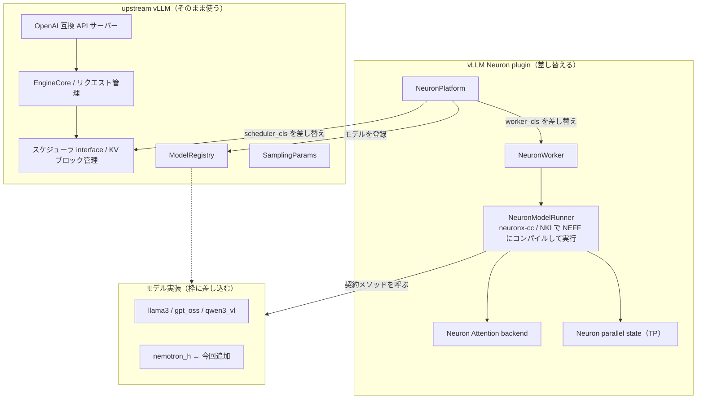
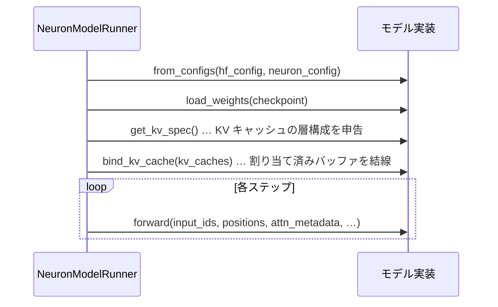

# はじめに

ハイブリッド構成（状態空間モデルの Mamba2、Mixture of Experts、Attention を層ごとに切り替える）の言語モデル NemotronH を、AWS Trainium（trn2）上で vLLM の Neuron plugin に載せてサービングするまでの取り組みをまとめます。この plugin にはモデルを差し込むための決まった枠が用意されていて、既存モデルと同じ作法でそこに実装すれば、推論エンジンの本体には手を入れずに新しいモデルを動かせます。NemotronH もその枠を踏襲して実装しました。

この記事では次の 3 つを扱います。

1. vLLM Neuron plugin（ベータ）の仕組みと、upstream の vLLM との関係、そして plugin がどこを差し替えているのか
2. NemotronH をその枠にどう実装したか。既存の仕組みを踏襲した部分と、NemotronH 固有の実装
3. 実際に動かす完全な手順。`up.sh` だけで起動できる aws-neuron-samples 側の実装

コードは vLLM Neuron plugin のフォーク（`littlemex/vllm-neuron` の `feat/nemotron-h` ブランチ）を参照します。

# 1. vLLM Neuron plugin の仕組み

vLLM の Neuron plugin は、vLLM 本体をフォークするのではなく、vLLM の **platform plugin** の仕組みを使って外側から機能を差し込むアーキテクチャです。つまり、リクエスト処理やスケジューリングといった vLLM の頭脳はそのまま使い、モデルを実際に計算する部分だけを Trainium 向けに差し替えます。

## plugin がどう vLLM に接続するか

接続点は Python のエントリーポイントです。plugin の `pyproject.toml` に次の宣言があり、vLLM は起動時にこれを見つけて `register` を呼びます。

```toml
[project.entry-points."vllm.platform_plugins"]
neuron = "vllm_neuron:register"
```

`register` は `NeuronPlatform`（vLLM の `Platform` を継承したクラス）を有効化し、plugin が持つモデル実装を vLLM の `ModelRegistry` に登録します。`NeuronPlatform` は vLLM の設定を書き換えて、実行系のクラスを Neuron 向けに差し替えます。

- ワーカーを差し替える（`parallel_config.worker_cls = "vllm_neuron.vllm.worker.neuron_worker.NeuronWorker"`）
- スケジューラを Neuron 向けに差し替える（`scheduler_config.scheduler_cls`）
- Attention バックエンドを Neuron 向けに指定する

ワーカーの中では `NeuronModelRunner` が動きます。これがモデルのグラフを Neuron のコンパイラ（neuronx-cc、必要に応じて NKI カーネル）で NEFF にコンパイルし、NeuronCore 上で実行する心臓部です。GPU 版でいう CUDA グラフや eager 実行に相当する部分を、Trainium 向けに置き換えていると考えるとわかりやすいです。

## 差し替えの境界



要するに、**何を実行するか（バッチング、KV キャッシュのブロック管理、サンプリングパラメータの解釈）は upstream vLLM が担い、それを Trainium 上でどう実行するか（グラフのコンパイル、NeuronCore での実行、テンソル並列、on-device サンプリング）を plugin が担う**、という分担です。新しいモデルを足すときに触るのは、この分担のうち「モデル実装」の部分だけで、ワーカーやスケジューラや KV 契約には手を入れません。

## モデルの枠（契約）

plugin のモデルは `vllm_neuron/model/<モデル名>/` に置き、決まったメソッドを実装します。`NeuronModelRunner` はモデルを次の順序で呼びます。



新しいモデルを足す手順は、(1) `model/<名前>/` にこの契約を実装する、(2) `model/registry.py` に import と登録の 2 行を足す、の 2 つだけです。既存の `llama3` / `gpt_oss` / `qwen3_vl` はすべてこの形で実装されています。

# 2. NemotronH をどう実装したか

## 既存の枠を踏襲した部分

NemotronH の実装は、既存モデルの作法をそのまま踏襲しています。

- **配置**: `model/nemotron_h/` を、既存の `model/llama3/` や `model/gpt_oss/` と同じ階層に置いています。
- **登録**: `model/registry.py` への追加は import と登録タプルの 2 行だけです。既存ファイルへの変更はこの 2 行のみで、ワーカーやランナー、KV 契約には一切触れていません。
- **ファクトリ**: エントリとなる `NemotronHForCausalLM` は `nn.Module` を継承し `from_configs` を持つファクトリで、実装（`model_bf16.py`）へ委譲します。この形は既存の GptOss のファクトリに倣ったものです。
- **契約メソッド**: `from_configs` / `load_weights` / `get_kv_spec` / `bind_kv_cache` / `forward` を、`llama3` や `gpt_oss` と同じ署名で実装しています。

ハイブリッドモデル特有の悩みは KV キャッシュの扱いですが、これも既存の枠の中で解いています。`get_kv_spec` は Attention 層（52 層のうち 6 層）だけを標準の `KVSpec` / `LayerSpec` で申告し、`bind_kv_cache` はその Attention 層にランナーが割り当てた KV を結線するだけです。

```python
def get_kv_spec(self):
    layers = []
    for i, layer in enumerate(self.model.layers):
        if layer.layer_type != ATTENTION:   # Mamba2 / MoE 層はスキップ
            continue
        a = layer.mixer
        layers.append(LayerSpec(name=f"layers.{i}.self_attn", ...))
    return KVSpec(layers=layers)
```

では Mamba2 層の状態（畳み込み状態と SSM 状態）はどう持ち越すのか。ここも plugin の既存の仕組みを使っています。状態をモジュールの `register_buffer` に置き、デコードステップごとにその場で `copy_` で更新すると、plugin の既存の FX パス `AliasingOutputRewritePass`（`vllm_neuron/fx_passes/aliasing_pass.py`）が、その `copy_` を HLO の `input_output_alias` に変換します。これにより、ステップごとに切り直されるグラフをまたいで状態が生き続けます。この「バッファ + aliasing で状態を持ち越す」やり方は `llama3` や `gpt_oss` も使っている既存のイディオムで、NemotronH のために新しい状態プールをランナー側に足す必要はありませんでした。

## NemotronH 固有の実装

ここからが NemotronH ならではの部分です。

**層ごとのディスパッチ**。52 層を `hybrid_override_pattern` に従って Mamba2（`M`）、MoE（`E`）、Attention（`*`）の 3 種のミキサーへ振り分けます。Attention と MoE は既存パターンの応用ですが、Mamba2 が新規実装の核心です。

**Mamba2 の prefill を Attention 形の行列演算で書く**。Mamba2 の逐次漸化式は、時間方向のループと「1 ステップ前の状態への依存」を持つため、そのままでは plugin の neuronx-cc コンパイル経路に載りません。そこで数学的に等価な閉じた形（累積和と因果マスクと減衰を使った、Attention と同じ演算形状）に書き換えました。これにより `torch_neuronx.trace` に委譲せずにコンパイルできます。ここで 1 つ罠があり、減衰の指数を計算するとき、因果マスクを `exp` の**前**に適用しないと、上三角が `+inf` に溢れて `inf * 0 = NaN` になります。小さな乱数重みでは `dt` が小さく溢れないため、実重みで初めて顕在化しました。

**DGE-free な MoE ルータ**。top-k のルーティングを `argmax` と `scatter` で素直に書くと、MoE 層が積み重なったときに neuronx-cc がデータ依存の scatter/gather（vector DGE）を誤コンパイルします。そこでルータを reduction と要素比較だけで組み直し、データ依存の間接メモリアクセスを排除しました。選択結果は `argmax` ベースと厳密に一致します。

**NoPE の Attention**。rotary embedding を持ちません。位置情報は Mamba2 層が運ぶ、というモデルの設計に合わせています。

これらの数値的な書き換え（ベクトル化 SSD スキャンと DGE-free ルータ）は、CPU 上の等価性テストで参照の逐次実装と一致することを固定しています。

# 3. 実際に動かす

サービングは aws-neuron-samples 側の `setup/multi-node/eks` に置いた `up.sh` で一発起動します。ここは Terraform で作った EKS クラスタ（Karpenter の Trainium ノードプール、Neuron デバイスプラグイン、共有ストレージが入っている）を前提に、vLLM のサービングワークロードを載せる部分です。

## up.sh の中身

`up.sh` は、`models/<プリセット>.yaml` を Helm チャートに渡してレンダリングし、クラスタへ適用するワンショットのスクリプトです。NemotronH 用のプリセット `models/nemotron-h.yaml` は次のようになっています。

```yaml
model: nvidia/NVIDIA-Nemotron-3-Nano-30B-A3B-BF16
servedModelName: nemotron-h
tpSize: 4
maxModelLen: 32
maxNumSeqs: 1
dtype: bfloat16
trustRemoteCode: true
plugin:
  install: true
  repo: littlemex/vllm-neuron
  ref: feat/nemotron-h
  modelDir: nemotron_h
  registerClass: NemotronHForCausalLM
```

ポイントは `plugin.install` です。NemotronH はまだ公開の vLLM Neuron イメージには入っていないため、公開イメージのまま起動しつつ、Pod の起動時にフォークの `feat/nemotron-h` から `nemotron_h` のモデルコードを取得して plugin に差し込み、`registry.py` に `NemotronHForCausalLM` を登録します。本番用にはこのモデルを焼き込んだイメージをビルドするのが本筋ですが、検証では起動時インストールで済ませています。

`maxModelLen` を 32 という小さな値にしているのは、前述のとおり Mamba2 の prefill が系列長に対して計算量が二乗で増える実装のため、動作確認としてコンテキスト長を絞っているからです。`maxNumSeqs` を 1 にしているのは、Mamba2 の状態が層ごとに 1 本のバッファのためです。いずれも検証用の割り切りです。

チャートがレンダリングする Deployment は、Trainium ノードに載せるための `nodeSelector` と Neuron の taint への toleration を持ち、コンテナの起動コマンドが「plugin にモデルを差し込む → vLLM を TP=4 で起動する」という流れになっています。

## 起動手順

```bash
# Trainium(trn2) プールに載せ、NEFF/重みのキャッシュは Lustre 静的 PV に置く
./up.sh nemotron-h --pool trn2 --namespace serving --volume fsx-training
kubectl -n serving rollout status deploy/nemotron-h --timeout=40m
```

Trainium のノードは Karpenter の予約ノードプールから起動します。初回はコンテナイメージの取得、モデルの取得、NEFF へのコンパイルが走るため、準備完了まで 20 分ほどかかりました。NemotronH の 30B-A3B（約 60 GB、bf16）を 1 チップに載せるためテンソル並列は 4 です。trn2.3xlarge は論理 NeuronCore 構成（LNC=2）で 1 チップが 4 論理コアに見えるため、TP=4 で 1 チップに収まります。

準備ができたら、貪欲デコード（`temperature=0`）で確認します。

```bash
kubectl -n serving port-forward svc/nemotron-h 8000:8000 &
curl -s localhost:8000/v1/completions \
  -d '{"model":"nemotron-h","prompt":"The capital of France is","max_tokens":8,"temperature":0}'
```

数例の生成は次のとおりで、いずれも期待どおりの短い事実回答が得られました。

```text
The capital of France is    -> " Paris"
2 + 2 =                      -> " 2 + 2 = 4"
The three primary colors are -> " red, blue, yellow."
日本の首都は                  -> "東京..."
```

TP=4 で動いていることは、サーバーの起動引数（`--tensor-parallel-size=4`）で確認しています。`/v1/models` は `nemotron-h` を返し、`root` に上記のモデル名が入っていました。

# まとめ

vLLM Neuron plugin は、upstream の vLLM をフォークせず、platform plugin として `NeuronPlatform` を差し込み、ワーカーとスケジューラとモデルランナーを Trainium 向けに差し替えるアーキテクチャでした。モデルは `from_configs` / `load_weights` / `get_kv_spec` / `bind_kv_cache` / `forward` という決まった契約を実装して差し込む枠になっており、NemotronH もこの枠を既存モデルと同じ作法で踏襲して実装しました。ハイブリッド構成の KV は Attention 層だけを標準の KV 契約に申告し、Mamba2 の状態は plugin の既存の aliasing の仕組みで持ち越すことで、ランナーには一切手を入れずに済んでいます。NemotronH 固有の難所（Mamba2 の prefill を Attention 形に書き換える、DGE-free なルータ、NoPE）を解いたうえで、`up.sh` だけで EKS 上の Trainium にサービングし、貪欲デコードの出力が期待どおりであることまで確認できました。
