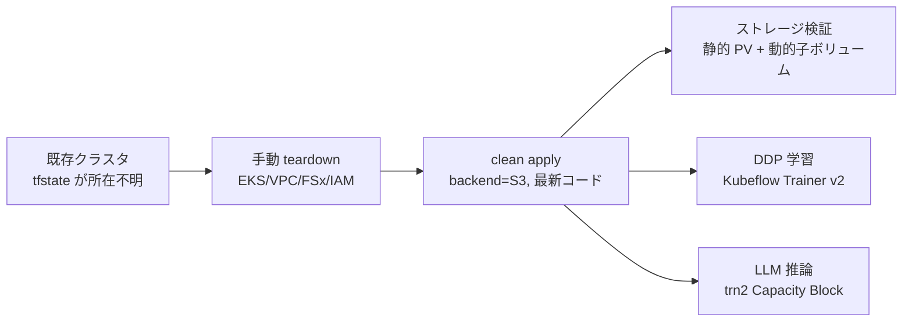

# はじめに

Amazon EKS 上に分散 AI 向けのクラスタ（VPC、EKS、Karpenter、FSx 共有ストレージ、Kubeflow Trainer、Trainium 推論）を組んで検証を続けていると、いつの間にか手で作った一時リソースがクラスタに残り、「本当に Terraform だけで再現できるのか、それとも手で作った何かにたまたま依存しているのか」が分からなくなります。

この記事では、実際に動いているクラスタを一度削除し、最新のコードから Terraform で作り直して、一連のワークロードがゼロから通ることを実出力付きで確認します。鍵になるのは Terraform の状態ファイル（tfstate）を Amazon S3 で集中管理することです。状態を手元だけに置くと、状態を失った瞬間に `terraform destroy` が使えなくなり、復旧が一気に難しくなります。今回はその落とし穴も含めて記録します。

検証対象は次の 4 つです。

- Terraform による VPC・EKS・FSx・Karpenter・CSI・共有ストレージのゼロからの構築
- 共有ストレージのマルチテナント（Amazon FSx for OpenZFS の動的子ボリューム）の払い出しと削除
- Kubeflow Trainer v2 による CPU 分散データ並列（DDP）学習
- Trainium（trn2）Capacity Block ノード上での vLLM による言語モデル推論

作業は次の運用ルールに沿っています。tfstate の散逸を防ぐためのルールです。

- クラスタ作成は `~/eks/<プロジェクト名>/` の下でリポジトリを clone し、その中で `terraform apply` する
- tfstate は必ず S3 で管理する（ローカルだけの状態ファイルは使わない）
- リポジトリの `infra/eks` に用意された S3 バックエンドの仕組みを使う

tfstate を S3 に集中させておくと、少なくとも「状態を失って `terraform destroy` 自体ができなくなる」事態は避けられます。ただし tfstate 管理が保証するのは Terraform 管理下のリソースの再現性であって、`kubectl apply` や `helm` で作った Terraform 管理外のものまで面倒を見てくれるわけではありません。この線引きは後半でも触れます。

# 全体の流れ



以降、アカウント ID や S3 バケット名などの環境固有値は伏せ字にしています。リソース ID（`fs-` や `vpc-` で始まるもの）とプライベート IP は、削除済みの検証環境のものなので実値に近い形のまま載せますが、こちらも一部は伏せています。リージョンは `ap-southeast-4`、クラスタ名は `distai-eks-melb` を例にします。

# Step 1: なぜ状態ファイルを S3 で管理するのか

今回の再構築は、既存クラスタの tfstate が手元にもチーム共有の S3 にも見つからない、という状況から始まりました。tfstate が無いと Terraform はリソースを把握できず、`terraform destroy` は使えません。

復旧の選択肢は 2 つあります。1 つは `terraform import`（または import ブロック）で既存リソースを state に取り込み直してから destroy する方法です。もう 1 つは、対象リソースを手で削除する方法です。今回はクラスタ全体という規模と、import の記述量を天秤にかけ、手動削除を選びました。EKS クラスタ、マネージドノードグループ、FSx ファイルシステム、IAM ロール、VPC を、依存関係の順序を守って 1 つずつ消していきます。

ここで手動削除の弱点が出ました。EKS・VPC・FSx・IAM をすべて消したつもりで再構築を始めたところ、次の 2 つが残っていて `terraform apply` が途中で止まりました。

```text
Error: creating KMS Alias (alias/eks/distai-eks-melb): AlreadyExistsException
Error: creating CloudWatch Logs Log Group (/aws/eks/distai-eks-melb/cluster): ResourceAlreadyExistsException
```

この 2 つは、前回の `terraform apply` が EKS モジュールの一部として作った Terraform 管理リソースです。手で作ったものではありません。tfstate を失ったために孤児化し、手動削除の対象一覧から漏れただけです。つまり「Terraform が作ったリソースでも、state を失うと安全に消せなくなる」という話で、これこそ tfstate を S3 で集中管理して `terraform destroy` を使える状態に保っておくべき理由そのものです。今回は残っていたエイリアスとロググループを手で削除してから `terraform apply` を再実行し、先へ進めました。

```bash
aws kms delete-alias --alias-name alias/eks/distai-eks-melb
aws logs delete-log-group --log-group-name /aws/eks/distai-eks-melb/cluster
```

なお `terraform destroy` を使えたとしても、KMS キー本体は即時削除ではなく削除待機期間（7 日から 30 日）を経て消えます。エイリアスは即時削除されるので今回の衝突の再現には影響しませんが、「destroy すればすべてが即消える」わけではない点は覚えておくとよいでしょう。

# Step 2: 最新コードから clean apply する

`infra/eks` には空の S3 バックエンド定義（`backend.tf`）があり、初期化時に `-backend-config` でバケットとキーを与えます。tfstate バケットは東京リージョンに集約しているため、クラスタのリージョン（`ap-southeast-4`）とバックエンドのリージョン（`ap-northeast-1`）は意図的に異なります。

```hcl
# backend.tf
terraform {
  backend "s3" {}
}
```

```bash
mkdir -p ~/eks/melb && cd ~/eks/melb
git clone <repo-url> && cd distributed-ai/infra/eks

terraform init -input=false \
  -backend-config="bucket=<tfstate-bucket>" \
  -backend-config="key=eks/distai-eks-melb/terraform.tfstate" \
  -backend-config="region=ap-northeast-1" \
  -backend-config="encrypt=true"
```

複数人や複数マシンで運用するなら、同時実行による state 破損を防ぐロックも設定します。Terraform 1.10 以降なら S3 ネイティブロック（`use_lockfile=true`）、それ以前なら DynamoDB テーブルを使います。今回は単独作業だったためロック無しで進めました。

クラスタ本体の設定は `terraform.tfvars`、アクセラレータプール（Capacity Block を含む）は `accelerator-pools.auto.tfvars` に分けて書きます。今回は共有ストレージを既定どおり有効化し、OpenZFS の動的プロビジョニングを opt-in で有効にしています。

```hcl
# terraform.tfvars（抜粋）
region                               = "ap-southeast-4"
cluster_name                         = "distai-eks-melb"
openzfs_dynamic_provisioning_enabled = true
```

```hcl
# accelerator-pools.auto.tfvars
accelerator_pools = {
  trn2 = {
    instance_types    = ["trn2.3xlarge"]
    device_plugin     = "neuron"
    capacity_type     = "reserved"
    cb_reservation_id = "cr-xxxxxxxxxxxxxxxxx"
    volume_size       = "500Gi"
  }
}
```

`terraform apply` を実行すると、ネットワーク（VPC・NAT・VPC エンドポイント）、EKS 本体と Karpenter、ストレージ（KMS・FSx・CSI ドライバ・静的 PV）が一気に作られます。

```bash
terraform apply -auto-approve
```

```text
Apply complete! Resources: 69 added, 0 changed, 0 destroyed.

Outputs:
fsx_lustre  = { id = "fs-xxxxxxxx", persistent_volume = "fsx-training",   storage_capacity = "4800" }
fsx_openzfs = { id = "fs-yyyyyyyy", persistent_volume = "openzfs-shared", storage_capacity = "256" }
vpc_id      = "vpc-zzzzzzzz"
```

kubeconfig を取得し、疎通を確認します。ノードと Karpenter のノードプール、そして共有ストレージの静的 PV がそろっています。

```bash
aws eks update-kubeconfig --name distai-eks-melb --region ap-southeast-4
```

```text
$ kubectl get nodes
NAME                                    STATUS   ROLES    AGE
ip-10-0-x-x.ap-southeast-4.compute...   Ready    <none>   6m
ip-10-0-y-y.ap-southeast-4.compute...   Ready    <none>   6m

$ kubectl get pv
NAME             CAPACITY   ACCESS MODES   RECLAIM POLICY   STATUS
fsx-training     4800Gi     RWX            Retain           Available
openzfs-shared   256Gi      RWX            Retain           Available
```

ここで見えている 2 つのノードは、システム系のマネージドノードグループ（`m5` 系）です。GPU も Trainium もまだ立っておらず、後続のワークロードを投げたときに Karpenter が必要なノードを追加で起こします。

# Step 3: 共有ストレージのマルチテナントを検証する

分散学習では、読み取り専用の共有データセットと、テナントごとの書き込み領域を組み合わせます。ここでは Amazon FSx for OpenZFS の動的プロビジョニングを使い、PersistentVolumeClaim（PVC）ごとに独立した子ボリュームを親ファイルシステムの配下へ払い出します。

動的プロビジョニングには CSI コントローラのロールに作成・削除権限が必要です。今回のコードでは、変更系のアクション（`CreateVolume` / `DeleteVolume` / `TagResource` / `ListTagsForResource`）を対象ファイルシステムの子ボリューム ARN だけに絞り込んでいます。一方、`DescribeVolumes` などの参照系は ARN で絞れないため、別ステートメントで `Resource: "*"` として付与しています。変更・削除という影響の大きい操作だけを最小限に閉じ込める設計です。次の出力は権限を要約したものです。

```text
$ aws iam get-role-policy --role-name distai-eks-melb-openzfs-csi \
    --policy-name openzfs-dynamic-provisioning   # PolicyDocument を要約
actions  : fsx:CreateVolume, fsx:DeleteVolume, fsx:TagResource, fsx:ListTagsForResource
resource : arn:aws:fsx:ap-southeast-4:<account-id>:volume/fs-yyyyyyyy/*
```

StorageClass は動的子ボリューム用で、`reclaimPolicy: Delete` にしています。この設定が、後で PVC を消したときに子ボリュームまで削除する挙動の前提です。

```yaml
apiVersion: storage.k8s.io/v1
kind: StorageClass
metadata:
  name: openzfs-sc
provisioner: fsx.openzfs.csi.aws.com
parameters:
  ResourceType: "volume"
  ParentVolumeId: '"fsvol-xxxxxxxx"'   # 親 FS のルートボリューム
  StorageCapacityQuotaGiB: "10"        # 子ボリュームごとのクォータ
reclaimPolicy: Delete
```

2 つの namespace（`tenant-a` と `tenant-b`）に、この StorageClass を指す PVC を作ると、親ファイルシステムの配下に子ボリュームが 2 つ払い出されます。

```yaml
apiVersion: v1
kind: PersistentVolumeClaim
metadata:
  name: cache
spec:
  accessModes: ["ReadWriteMany"]
  storageClassName: openzfs-sc
  resources: { requests: { storage: 1Gi } }
```

```text
$ kubectl get pvc -A
NAMESPACE   NAME    STATUS   VOLUME                                     STORAGECLASS
tenant-a    cache   Bound    pvc-723e2e60-...                           openzfs-sc
tenant-b    cache   Bound    pvc-35a8884a-...                           openzfs-sc

$ aws fsx describe-volumes --filters Name=file-system-id,Values=fs-yyyyyyyy \
    --query 'Volumes[?...ParentVolumeId==`fsvol-xxxxxxxx`].{name:Name,quota:...StorageCapacityQuotaGiB}'
name              quota(GiB)
pvc-723e2e60-...  10
pvc-35a8884a-...  10
```

テナントごとに、独立したパスと 10 GiB のクォータを持つ子ボリュームが作られました。namespace を削除すると、削除権限も ARN で絞られたロールが `DeleteVolume` を呼び、`reclaimPolicy: Delete` に従って子ボリュームも消えます。

```text
$ kubectl delete namespace tenant-a tenant-b
$ aws fsx describe-volumes ... --query '...[?...ParentVolumeId==`fsvol-xxxxxxxx`].Name'
[]        # 子ボリュームは残らない（孤児ゼロ）
```

払い出しから削除までが一周し、孤児リソースが残らないことまで実機で確認できました。絞り込んだ権限のままマルチテナントの動的プロビジョニングが動くことが、これで確定します。

# Step 4: Kubeflow Trainer v2 で CPU 分散学習を流す

学習イメージはクラスタ内で rootless BuildKit を使ってビルドし、Amazon ECR へ push します。ローカルに Docker や finch は要りません。ビルドは Helm チャートをレンダリングして適用します。

```bash
ECR_URL=<account-id>.dkr.ecr.ap-southeast-4.amazonaws.com/distai-eks-melb-ddp-sample
helm template exp charts/experiments -n distai \
    --set imageBuild.enabled=true \
    --set imageBuild.repository="$ECR_URL" --set imageBuild.tag=v1 \
    -s templates/image-build-ddp-sample.yaml | kubectl apply -f -
kubectl -n image-builder wait --for=condition=complete job/build-ddp-sample-v1 --timeout=30m
```

学習が書き込む共有ストレージは、静的 PV `openzfs-shared` に手で 1 度だけ結び付けた PVC `shared-claim` を使います。これは Step 3 の動的な子ボリューム（テナントごとに払い出して消したもの）とは別物で、基盤が続く限り残る静的な共有領域です。

```bash
kubectl apply -n distai -f - <<'YAML'
apiVersion: v1
kind: PersistentVolumeClaim
metadata: { name: shared-claim }
spec:
  accessModes: ["ReadWriteMany"]
  storageClassName: ""
  volumeName: openzfs-shared
  resources: { requests: { storage: 256Gi } }
YAML
```

ビルドが終わったら、Kubeflow Trainer v2 の TrainJob として 2 ノードの DDP 学習を投げます。

```bash
IMAGE=$ECR_URL:v1
helm template exp charts/experiments -n distai \
    --set trainjobTrain.enabled=true --set trainjobTrain.image="$IMAGE" \
    --set trainjobTrain.numNodes=2 --set trainjobTrain.totalEpochs=20 \
    --set sharedStorage.existingClaimName=shared-claim | kubectl apply -f -
```

TrainJob を投げると、内部で JobSet が展開され、ノード数だけの Pod が並びます。子 Job は `<TrainJob 名>-node-0`、Pod は `-node-0-0` と `-node-0-1` という名前になります。

```text
$ kubectl get trainjob,job -n distai
trainjob.trainer.kubeflow.org/ddp-trainjob   ...
job.batch/ddp-trainjob-node-0   Running   0/2

$ kubectl get pods -n distai
ddp-trainjob-node-0-0-bk5j7   Pending
ddp-trainjob-node-0-1-w6gwj   Pending
```

このワークロード用に本 book が用意した Runtime には Pod 同士を別ノードへ散らす podAntiAffinity（`topologyKey: kubernetes.io/hostname`）が入っているため、2 つの Pod は別ノードに配置されます。システムノードとは別に、Karpenter の CPU ノードプールが 2 台の CPU ノードを起こし、そこで学習が進みます。rank 0 のログには各エポックの損失とスナップショット保存が現れ、20 エポックで完走します。保存先は `shared-claim`（静的 PV `openzfs-shared`）です。

```text
$ kubectl logs -n distai ddp-trainjob-node-0-0-...
[rank 0/2] starting training: 20 epochs, batch_size 32
[rank 0/2] epoch 0  | steps 938 | loss 0.5312
...
[rank 0/2] epoch 19 | steps 938 | loss 0.0186
[rank 0/2] epoch 19 | snapshot saved to /shared/output/trainjob-cpu/snapshot.pt
[rank 0/2] done
```

TrainJob の完了は `Complete` 条件で判定できます。

```text
$ kubectl get trainjob ddp-trainjob -n distai -o jsonpath='{...conditions...}'
Complete=True
```

同じ Runtime は単一ノードでも動きます。`numNodes=1` かつ `nprocPerNode=2` にすると、子 Job は `ddp-trainjob-node-0`（completions は 1）、1 つの Pod の中で rank 0 と rank 1 の 2 プロセスが立ち上がり、同様に完走しました。

# Step 5: Trainium の Capacity Block 上で LLM を推論する

最後に、Trainium（trn2.3xlarge）の Capacity Block ノード上で vLLM の OpenAI 互換サーバーを立て、言語モデルを推論します。Capacity Block は Karpenter の予約ノードプールとして扱い、推論 Pod をスケジュールすると Capacity Block からノードが起動します。

```bash
# チャートを適用（trn2 プールに配置、キャッシュは Lustre 静的 PV に）
./up.sh nemotron-h --pool trn2 --namespace serving --volume fsx-training
kubectl -n serving rollout status deploy/nemotron-h --timeout=40m
```

Karpenter が Capacity Block からノードを起こします。予約ノードであることは、EC2NodeClass の `capacityReservationSelectorTerms` で対象の予約 ID を選んでいること、そして NodeClaim の Capacity 種別が `reserved` であることで確認できます。`reserved` は通常のオンデマンドキャパシティ予約（ODCR）でも付く値なので、Capacity Block であること自体は予約 ID の指定で担保しています。

```text
$ kubectl get nodeclaims
NAME         TYPE           CAPACITY   ZONE              READY
trn2-l26zs   trn2.3xlarge   reserved   ap-southeast-4c   True
```

今回serve したのは 52 層のハイブリッド構成（状態空間モデルと Mixture of Experts と Attention を層ごとに切り替える）の言語モデルです。trn2.3xlarge は論理 NeuronCore 構成（LNC=2）で 1 チップが 4 論理コアに見えるため、テンソル並列（TP）4 で 1 チップに載ります。初回はコンテナイメージの取得、モデルの取得、Neuron 向けのコンパイル（NEFF 生成）が走るため、準備完了まで 20 分ほどかかりました。

なお、この構成では `max_model_len` を 32 という小さな値に設定しています。このモデルの prefill は系列長に対して計算量が二乗で増える実装のため、動作確認としてコンテキスト長を最小限に絞っているためです。実運用ではチャンク化した実装で伸ばす前提の、検証用の設定です。

準備ができたら、貪欲デコード（`temperature=0`）で数例を生成しました。いずれも短い事実回答で期待どおりの出力が得られています。

```bash
kubectl -n serving port-forward svc/nemotron-h 8000:8000 &
curl -s localhost:8000/v1/completions \
  -d '{"model":"nemotron-h","prompt":"The capital of France is","max_tokens":8,"temperature":0}'
```

```text
The capital of France is   -> " Paris"
2 + 2 =                     -> " 2 + 2 = 4"
The three primary colors are-> " red, blue, yellow."
日本の首都は                 -> "東京..."
```

TP=4 で動いていることは、サーバーの起動引数（`--tensor-parallel-size=4`）で確認しています。`/v1/models` は `nemotron-h` を返し、`root` に実モデル名、`max_model_len` に上記の 32 が入っていました。

# まとめ

tfstate を S3 で管理した Terraform 構成から、EKS 分散 AI クラスタをゼロから再構築し、共有ストレージのマルチテナント、CPU 分散学習、Trainium 上の LLM 推論という一連の動作がすべて通ることを実出力で確認しました。

途中で `terraform apply` を止めた KMS エイリアスと CloudWatch ロググループは、手で作ったものではなく、前回の Terraform が作ったのに state 紛失で手動削除から漏れた孤児リソースでした。これは「Terraform が作ったリソースでも、state を失うと安全に消せなくなる」ことの実例で、tfstate を S3 で集中管理して `terraform destroy` を使える状態に保つ価値をそのまま裏づけます。tfstate 管理がカバーするのは Terraform 管理下のリソースであり、`kubectl` や `helm` で作るワークロードは別レイヤの後片付けが要る、という線引きも合わせて意識しておくと、分散 AI 基盤を安心して壊して作り直せます。
