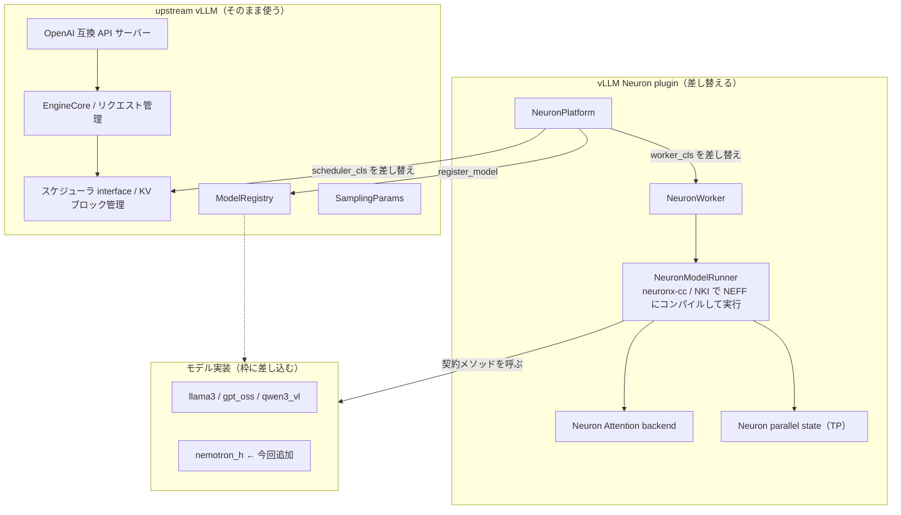
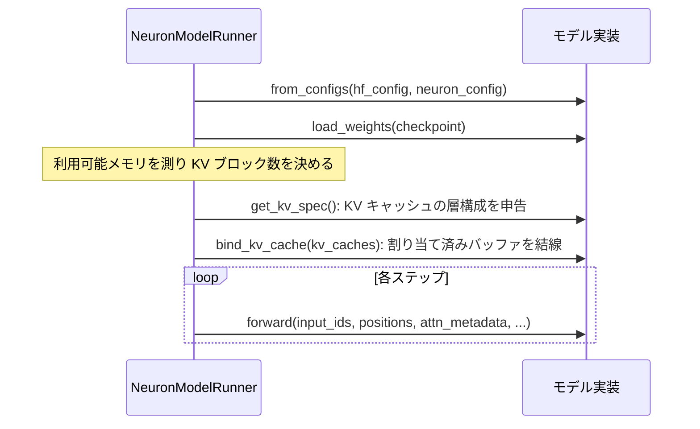

# はじめに

NemotronH は Mamba2、Mixture of Experts、Attention を層ごとに切り替えるハイブリッド構成の言語モデルです。この記事では、これを AWS Trainium（trn2）上で vLLM の Neuron plugin に載せて動かすまでの取り組みをまとめます。

先に scope を明確にします。ここで示すのは、モデルを plugin の枠に実装し、貪欲デコードで期待どおりの出力が出るところまでの動作確認（スモークテスト）です。`max_model_len=32`、`max_num_seqs=1` という最小構成で、スループットやレイテンシ、長文脈、連続バッチングといった serving の性能面は検証範囲外です。

扱う内容は次の 3 つです。

- vLLM Neuron plugin（ベータ）の仕組みと、upstream の vLLM との関係、そして plugin がどこを差し替えているのか
- NemotronH をその枠にどう実装したか。既存の仕組みを踏襲した部分と、NemotronH 固有の実装
- 実際に動かす手順。`up.sh` だけで起動できる aws-neuron-samples 側の実装

コードは vLLM Neuron plugin のフォーク [littlemex/vllm-neuron](https://github.com/littlemex/vllm-neuron) の `feat/nemotron-h` ブランチ（コミット `e57b8b8`）を参照します。plugin はベータであり、ここで説明する内部インターフェースは今後変わり得る点に注意してください。

# 1. vLLM Neuron plugin の仕組み

vLLM の Neuron plugin は、vLLM 本体をフォークするのではなく、vLLM の **platform plugin** の仕組みを使って外側から機能を差し込むアーキテクチャです。リクエスト処理やスケジューリングといった vLLM の頭脳はそのまま使い、モデルを実際に計算する部分だけを Trainium 向けに差し替えます。

## plugin がどう vLLM に接続するか

接続点は Python のエントリーポイントです。plugin の `pyproject.toml` に次の宣言があり、vLLM は起動時にこのグループを読み込みます。

```toml
[project.entry-points."vllm.platform_plugins"]
neuron = "vllm_neuron:register"
```

vLLM は `register` を呼びます。`register` は Neuron デバイスがあれば `NeuronPlatform` の完全修飾名を返し、無ければ `None` を返す関数です。vLLM は返ってきたクラスを現在のプラットフォームとして解決します。実際の差し替えは、`VllmConfig` が確定したときに vLLM から呼ばれる `NeuronPlatform.check_and_update_config(vllm_config)` の中で行われ、次の設定を書き換えます。

- ワーカーを差し替える（`parallel_config.worker_cls = "vllm_neuron.vllm.worker.neuron_worker.NeuronWorker"`）
- スケジューラを Neuron 向けに差し替える（`scheduler_config.scheduler_cls`）
- モデルを vLLM の `ModelRegistry` に登録する（`ModelRegistry.register_model(...)`）

Attention バックエンドはこの config 書き換えではなく、別フック `get_attn_backend_cls()` が返します。ワーカーの中では `NeuronModelRunner` が動き、これがモデルのグラフを Neuron のコンパイラ（neuronx-cc、必要に応じて NKI カーネル）で NEFF にコンパイルして NeuronCore 上で実行します。GPU 版でいう CUDA グラフや eager 実行に相当する部分を Trainium 向けに置き換えていると考えるとわかりやすいです。

## 差し替えの境界



要するに、何を実行するか（バッチング、KV キャッシュのブロック管理、サンプリングパラメータの解釈）は upstream vLLM が担い、それを Trainium 上でどう実行するか（グラフのコンパイル、NeuronCore での実行、テンソル並列、on-device サンプリング）を plugin が担う、という分担です。新しいモデルを足すときに触るのはモデル実装の部分だけで、ワーカーやスケジューラや KV 契約には手を入れません。

## モデルの枠（契約）

plugin のモデルは `vllm_neuron/model/<モデル名>/` に置き、決まったメソッドを実装します。[`NeuronModelRunner`](https://github.com/littlemex/vllm-neuron/blob/e57b8b8/vllm_neuron/vllm/worker/neuron_model_runner.py) はモデルを次の順序で呼びます。



新しいモデルを足す手順は、まず `model/<名前>/` にこの契約を実装し、次に `model/registry.py` に import と登録の 2 行を足す、の 2 つです。テキスト生成のコア契約（`from_configs` / `load_weights` / `get_kv_spec` / `bind_kv_cache` / `forward`）は `llama3` や `gpt_oss` と共通で、マルチモーダルの `qwen3_vl` はこれに画像入力用の追加インターフェース（`SupportsSpatialMerge` などの capability protocol）を重ねています。

# 2. NemotronH をどう実装したか

## 既存の枠を踏襲した部分

NemotronH の実装は、既存モデルの作法をそのまま踏襲しています。フォークの差分は `vllm_neuron/model/nemotron_h/` の新規追加と、`model/registry.py` への 2 行（import と登録タプル）に閉じており、ワーカーやランナー、KV 契約、fx パスといった既存ファイルには手を入れていません。

- **配置**: `model/nemotron_h/` を、既存の `model/llama3/` や `model/gpt_oss/` と同じ階層に置いています。
- **ファクトリ**: エントリの [`NemotronHForCausalLM`](https://github.com/littlemex/vllm-neuron/blob/e57b8b8/vllm_neuron/model/nemotron_h/factory.py) は `nn.Module` を継承し `from_configs` を持つファクトリで、実装（`model_bf16.py`）へ委譲します。この形は既存の GptOss のファクトリに倣ったものです。
- **契約メソッド**: `from_configs` / `load_weights` / `get_kv_spec` / `bind_kv_cache` / `forward` を、`llama3` の同名メソッドと同じ署名で実装しています。テキストのコア契約だけを使い、追加の capability protocol は使いません。

ハイブリッドモデルで悩ましいのは KV キャッシュの扱いですが、これも既存の枠の中で解いています。`get_kv_spec` は Attention 層（52 層のうち 6 層。層構成は config の `hybrid_override_pattern` で決まります）だけを標準の `KVSpec` / `LayerSpec` で申告し、`bind_kv_cache` はその Attention 層の mixer にランナーが割り当てた KV を結線するだけです。

```python
def get_kv_spec(self):
    layers = []
    for i, layer in enumerate(self.model.layers):
        if layer.layer_type != ATTENTION:   # Mamba2 / MoE 層はスキップ
            continue
        a = layer.mixer
        layers.append(LayerSpec(
            name=f"layers.{i}.self_attn",
            num_kv_heads=a.num_key_value_heads_per_rank,
            head_size=a.head_dim, dtype=a.dtype,
            sliding_window_size=a.window_size, chunk_size=None))
    return KVSpec(layers=layers)
```

では Mamba2 層の状態（畳み込み状態と SSM 状態）はどう持ち越すのか。ここは plugin の既存の FX パス `AliasingOutputRewritePass`（[`vllm_neuron/fx_passes/aliasing_pass.py`](https://github.com/littlemex/vllm-neuron/blob/e57b8b8/vllm_neuron/fx_passes/aliasing_pass.py)）を使います。状態をモジュールの `register_buffer` に置き、デコードステップごとにその場で `copy_` で更新すると、このパスが `copy_` を HLO の `input_output_alias` に変換し、ステップごとに切り直されるグラフをまたいで状態が生き続けます。ただし、`llama3` や `gpt_oss` は Attention だけのステートレスなモデルで、この aliasing を主に KV や量子化スケールに使っています。**再帰状態（SSM の状態）をランナーの KV 管理の外で持ち越すのは、既存の aliasing パスの新しい使い方**です。batch=1（`max_num_seqs=1`）に限っているのは、状態が層ごとに 1 本のバッファだからで、複数シーケンスを同時に流すと状態が混ざるためです。

## NemotronH 固有の実装

ここからが NemotronH ならではの部分です。

### 層ごとのディスパッチ

52 層を `hybrid_override_pattern` に従って Mamba2（`M`）、MoE（`E`）、Attention（`*`）の 3 種のミキサーへ振り分けます。Attention と MoE は既存パターンの応用で、Mamba2 が新規実装の核心です。

### Mamba2 の prefill を Attention 形の行列演算で書く

Mamba2 の逐次漸化式は、時間方向のループと 1 ステップ前の状態への依存を持ちます。そのままだと逐次ループを `torch_neuronx.trace` に丸投げする形になり、plugin の neuronx-cc コンパイル経路には載りません。そこで数学的に等価な閉じた形（累積和と因果マスクと減衰を使った、Attention と同じ演算形状。以下ではベクトル化 SSD スキャンと呼びます）に書き換えました。ここで 1 つ罠があり、減衰の指数を計算するとき、因果マスクを `exp` の**前**に適用しないと、上三角が `+inf` に溢れて `inf * 0 = NaN` になります。小さな乱数重みでは `dt` が小さく溢れないため、実重みで初めて顕在化しました。

この書き換えはトレードオフです。Mamba の売りである系列長に対して線形の計算量を捨て、Attention と同じ二乗の計算量にしています。`max_model_len` を 32 という小さな値に絞っているのはこのためで、長い文脈を扱うにはチャンク化した SSD スキャンが必要です（今後の課題）。

### DGE-free な MoE ルータ

top-k のルーティングを `argmax` と `scatter` で素直に書くと、MoE 層が積み重なったときに、特定バージョンの neuronx-cc がデータ依存の scatter/gather（vector DGE）で誤った結果を出すのを観測しました。そこでルータを reduction と要素比較だけで組み直し、データ依存の間接メモリアクセスを排除しました。選択結果は、同点時に最小インデックスを選ぶところまで含めて `argmax` ベースと一致するように作っています。

### NoPE の Attention

rotary embedding を持ちません。位置情報は Mamba2 層が運ぶ、というモデルの設計に合わせています。

これら 2 つの数値的な書き換え（ベクトル化 SSD スキャンと DGE-free ルータ）は、CPU 上の等価性テストで参照の逐次実装と一致することを固定しています。加えて、実機（trn2、TP=4）で貪欲デコードした先頭トークンが Hugging Face の CPU 参照と一致することを数例で確認しました。コンパイル後の全層一致まで取る網羅的なパリティ検証は今後の課題です。

# 3. 実際に動かす

サービングの起動は aws-neuron-samples 側（フォークの `feat/eks-serving-templates` ブランチ）の `setup/multi-node/eks` に置いた `up.sh` で一発です。前提として、Terraform で構築した EKS クラスタ（Karpenter の Trainium ノードプール、Neuron デバイスプラグイン、共有ストレージ）が要ります。`--volume` に渡す静的 PV 名や namespace、Capacity Block は各環境固有の値なので、自分の環境に読み替えてください。

## up.sh の中身

`up.sh` は、`models/<プリセット>.yaml` を Helm チャートに渡してレンダリングし、クラスタへ適用するワンショットのスクリプトです。NemotronH 用のプリセット `models/nemotron-h.yaml` は次のようになっています。

```yaml
model: nvidia/NVIDIA-Nemotron-3-Nano-30B-A3B-BF16
servedModelName: nemotron-h
tpSize: 4
maxModelLen: 32
maxNumSeqs: 1
dtype: bfloat16
trustRemoteCode: true
plugin:
  install: true
  repo: littlemex/vllm-neuron
  ref: feat/nemotron-h
  modelDir: nemotron_h
  registerClass: NemotronHForCausalLM
```

肝は `plugin.install` です。NemotronH はまだ公開の vLLM Neuron イメージには入っていないため、公開イメージのまま起動しつつ、Pod の起動時にフォークの `feat/nemotron-h` から `nemotron_h` のモデルコードを取得して plugin に差し込み、`registry.py` に `NemotronHForCausalLM` を登録します。

:::message alert
この起動時インストールは検証用の割り切りです。可変ブランチから起動のたびにコードを取得するため、ブランチが動くと挙動が変わり、サプライチェーン上のリスクもあります。実運用ではコミットハッシュで固定し、本番はモデルを焼き込んだイメージをビルドしてください。公開イメージ内の plugin バージョンとフォークの契約がずれると壊れるため、イメージタグと plugin のコミットは対で固定するのが安全です。
:::

チャートがレンダリングする Deployment は、Trainium ノードに載せるための `nodeSelector` と Neuron の taint への toleration を持ち、コンテナの起動コマンドが「plugin にモデルを差し込む → vLLM を TP=4 で起動する」という流れになっています。

## 起動手順

```bash
# Trainium(trn2) プールに載せ、NEFF/重みのキャッシュは共有ストレージの静的 PV に置く
./up.sh nemotron-h --pool trn2 --namespace serving --volume <静的PV名>
kubectl -n serving rollout status deploy/nemotron-h --timeout=40m
```

Trainium のノードは Karpenter の予約ノードプールから起動します。初回はコンテナイメージの取得、モデルの取得、NEFF へのコンパイルが走るため、キャッシュ無しの初回で準備完了まで 20 分ほどかかりました（1 回の実測。2 回目以降は NEFF キャッシュが効いて短くなります）。NemotronH の 30B-A3B（約 60 GB、bf16）を 1 チップに載せるためテンソル並列は 4 です。trn2.3xlarge は論理 NeuronCore 構成（LNC=2）で 1 チップが 4 論理コアに見えるため、TP=4 で 1 チップに収まります。

準備ができたら、貪欲デコード（`temperature=0`）で確認します。ここでの目的は正しさの網羅的な証明ではなく、モデルが破綻せず期待どおりに動くことのスモークテストです。

```bash
kubectl -n serving port-forward svc/nemotron-h 8000:8000 &
curl -s localhost:8000/v1/completions -H 'Content-Type: application/json' \
  -d '{"model":"nemotron-h","prompt":"The capital of France is","max_tokens":8,"temperature":0}'
```

数例の生成結果は次のとおりです。

```text
The capital of France is     -> " Paris"
2 + 2 =                       -> " 2 + 2 = 4"
The three primary colors are  -> " red, blue, yellow."
日本の首都は                   -> "東京の首都は東京です。"
```

`/v1/models` は `nemotron-h` を返し、`root` に上記のモデル名が入っていました。

# まとめ

vLLM Neuron plugin は、upstream の vLLM をフォークせず、platform plugin として `NeuronPlatform` を返し、`check_and_update_config` の中でワーカーとスケジューラを Trainium 向けに差し替え、モデルを `ModelRegistry` に登録するアーキテクチャでした。モデルは `from_configs` / `load_weights` / `get_kv_spec` / `bind_kv_cache` / `forward` という契約を実装して差し込む枠になっており、NemotronH もこの枠を既存モデルと同じ作法で踏襲して実装しました。ハイブリッド構成の KV は Attention 層だけを標準の KV 契約に申告し、Mamba2 の再帰状態は plugin の既存の aliasing パスを新しく応用して持ち越すことで、ランナーには手を入れずに済んでいます。NemotronH 固有の難所（Mamba2 の prefill を Attention 形に書き換える、DGE-free なルータ、NoPE）を解き、`up.sh` だけで EKS 上の Trainium に載せて、貪欲デコードの出力が期待どおりであることまで確認できました。性能面の serving 検証（スループット、長文脈、連続バッチング）と、線形計算量を取り戻すチャンク化 SSD スキャンは、今後の課題です。
