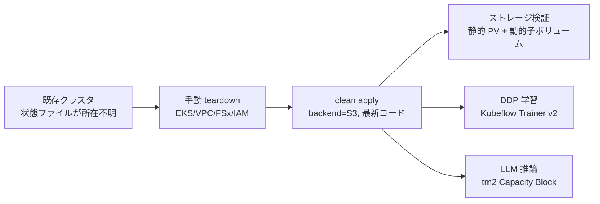

# はじめに

Amazon EKS 上に分散 AI 向けのクラスタ（VPC、EKS、Karpenter、FSx 共有ストレージ、Kubeflow Trainer、Trainium 推論）を組んで検証を続けていると、いつの間にか手で作った一時リソースがクラスタに残り、「本当は Terraform だけで再現できるのか、それとも手動で作った何かにたまたま依存しているのか」が分からなくなります。

この記事では、実際に動いているクラスタを一度きれいさっぱり壊し、最新のコードから Terraform で再構築して、一連のワークロードがゼロから通ることを実出力付きで確認します。ポイントは Terraform の状態ファイル（tfstate）を S3 で集中管理することです。状態を手元に置くと、状態が失われた瞬間に `terraform destroy` ができなくなり、EKS や VPC や FSx を手で 1 つずつ消す羽目になります。今回その落とし穴も実演します。

検証対象は次の 4 つです。

- Terraform による VPC・EKS・FSx・Karpenter・CSI・共有ストレージのゼロからの構築
- 共有ストレージのマルチテナント（Amazon FSx for OpenZFS の動的子ボリューム）の払い出しと削除
- Kubeflow Trainer v2 による CPU 分散データ並列（DDP）学習
- Trainium（trn2）Capacity Block ノード上での vLLM による大規模言語モデル推論

# 前提とルール

作業は次のルールに沿って行います。これは状態ファイルの散逸を防ぐための運用ルールです。

- クラスタ作成は `~/eks/<プロジェクト名>/` の下でリポジトリを clone し、その中で `terraform apply` する
- tfstate は必ず S3 で管理する（ローカル状態ファイルは使わない）
- リポジトリの `infra/eks` には S3 バックエンドの仕組みが備わっているのでそれを使う

状態を S3 に集中させておけば、どのマシンからでも `terraform destroy` から `terraform apply` までを再現でき、手で作った残骸に依存していないことを保証できます。

# 全体の流れ



以降、環境固有の値（アカウント ID など）は `<account-id>` のように伏せ字にしています。リージョンは `ap-southeast-4`、クラスタ名は `distai-eks-melb` を例にします。

# Step 1: なぜ状態ファイルを S3 で管理するのか

今回の再構築は、既存クラスタの状態ファイルが手元にもチーム共有の S3 にも見つからない、という状況から始まりました。状態ファイルが無いと Terraform はリソースを把握できないため、`terraform destroy` は使えません。結果として、EKS クラスタ、マネージドノードグループ、FSx ファイルシステム、IAM ロール、VPC を、依存関係の順序を守りながら手で 1 つずつ削除することになります。

さらに、手動削除では消し忘れが起きます。今回も、EKS・VPC・FSx・IAM をすべて消したつもりで再構築を始めたところ、次の 2 つが残っていて `terraform apply` が途中で止まりました。

```text
Error: creating KMS Alias (alias/eks/distai-eks-melb): AlreadyExistsException
Error: creating CloudWatch Logs Log Group (/aws/eks/distai-eks-melb/cluster): ResourceAlreadyExistsException
```

KMS エイリアスと CloudWatch ロググループは EKS・VPC・FSx のどれにも含まれないため、手動削除の対象から漏れていたのです。これはまさに「手で作ったものが残っていて、たまたま動いていた」状態そのものです。状態ファイルを S3 で管理して `terraform destroy` できるようにしておけば、こうした取りこぼしは起きません。

# Step 2: 最新コードから clean apply する

`infra/eks` には空の S3 バックエンド定義（`backend.tf`）があり、初期化時に `-backend-config` でバケットとキーを与えます。

```hcl
# backend.tf
terraform {
  backend "s3" {}
}
```

```bash
mkdir -p ~/eks/melb && cd ~/eks/melb
git clone <repo-url> && cd distributed-ai/infra/eks

terraform init -input=false \
  -backend-config="bucket=distai-eks-tfstate-<account-id>" \
  -backend-config="key=eks/distai-eks-melb/terraform.tfstate" \
  -backend-config="region=ap-northeast-1" \
  -backend-config="encrypt=true"
```

クラスタ本体の設定は `terraform.tfvars`、アクセラレータプール（Capacity Block を含む）は `accelerator-pools.auto.tfvars` に分けて書きます。今回は共有ストレージを既定どおり有効化し、OpenZFS の動的プロビジョニングを opt-in で有効にしています。

```hcl
# terraform.tfvars（抜粋）
region                               = "ap-southeast-4"
cluster_name                         = "distai-eks-melb"
openzfs_dynamic_provisioning_enabled = true
```

```hcl
# accelerator-pools.auto.tfvars
accelerator_pools = {
  trn2 = {
    instance_types    = ["trn2.3xlarge"]
    device_plugin     = "neuron"
    capacity_type     = "reserved"
    cb_reservation_id = "cr-xxxxxxxxxxxxxxxxx"
    volume_size       = "500Gi"
  }
}
```

`terraform apply` を実行すると、VPC・NAT・VPC エンドポイント・KMS・FSx・EKS コントロールプレーン・マネージドノードグループ・Karpenter・CSI ドライバ・共有ストレージの静的 PV までが一気に作られます。

```text
Apply complete! Resources: 69 added, 0 changed, 0 destroyed.

Outputs:
fsx_lustre  = { id = "fs-016829e9ea3c5e6fd", persistent_volume = "fsx-training",   storage_capacity = "4800" }
fsx_openzfs = { id = "fs-08c9fb20317fe0ed2", persistent_volume = "openzfs-shared", storage_capacity = "256" }
vpc_id      = "vpc-06cd114f67df921d8"
```

疎通確認です。ノードと Karpenter のノードプール、そして共有ストレージの静的 PV がそろっています。

```text
$ kubectl get nodes
NAME                                             STATUS   ROLES    AGE
ip-10-0-18-201.ap-southeast-4.compute.internal   Ready    <none>   2m
ip-10-0-23-184.ap-southeast-4.compute.internal   Ready    <none>   6m

$ kubectl get pv
NAME             CAPACITY   ACCESS MODES   RECLAIM POLICY   STATUS
fsx-training     4800Gi     RWX            Retain           Available
openzfs-shared   256Gi      RWX            Retain           Available
```

# Step 3: 共有ストレージのマルチテナントを検証する

分散学習では、読み取り専用の共有データセットとテナントごとの書き込み領域を組み合わせます。ここでは Amazon FSx for OpenZFS の動的プロビジョニングを使い、PersistentVolumeClaim（PVC）ごとに独立した子ボリュームを親ファイルシステムの配下へ払い出します。

動的プロビジョニングには CSI コントローラのロールに作成・削除権限が必要です。今回のコードでは、この権限を対象ファイルシステムの子ボリュームだけに ARN で絞り込んでいます。過剰な権限を持たせないための設計です。

```text
$ aws iam get-role-policy --role-name distai-eks-melb-openzfs-csi \
    --policy-name openzfs-dynamic-provisioning
actions  : fsx:CreateVolume, fsx:DeleteVolume, fsx:TagResource, fsx:ListTagsForResource
resource : arn:aws:fsx:ap-southeast-4:<account-id>:volume/fs-08c9fb20317fe0ed2/*
```

StorageClass を作り、2 つの namespace（`tenant-a` と `tenant-b`）にそれぞれ PVC を作ると、親ファイルシステムの配下に子ボリュームが 2 つ払い出されます。

```text
$ kubectl get pvc -A
NAMESPACE   NAME    STATUS   VOLUME                                     STORAGECLASS
tenant-a    cache   Bound    pvc-723e2e60-5696-44cd-a10d-bce7a057b396   openzfs-sc
tenant-b    cache   Bound    pvc-35a8884a-7089-4cbc-ba20-2530c1660935   openzfs-sc

$ aws fsx describe-volumes --filters Name=file-system-id,Values=fs-08c9fb20317fe0ed2 ...
name                                       path                            quota
pvc-723e2e60-5696-44cd-a10d-bce7a057b396   /fsx/pvc-723e2e60-...           10
pvc-35a8884a-7089-4cbc-ba20-2530c1660935   /fsx/pvc-35a8884a-...           10
```

テナントごとに別々の子ボリューム（それぞれ 10 GiB のクォータと独立したパス）が作られました。namespace を削除すると、削除権限も ARN で絞られたロールが `DeleteVolume` を呼び、子ボリュームも消えます。

```text
$ kubectl delete namespace tenant-a tenant-b
$ aws fsx describe-volumes ... --query '...ParentVolumeId==`fsvol-...`].Name'
[]        # 子ボリュームは残らない（孤児ゼロ）
```

払い出しから削除までが一周し、孤児リソースも残らないことを確認できました。これで「共有ストレージのマルチテナント」が絞り込んだ権限のまま動くことが実機で確定します。

# Step 4: Kubeflow Trainer v2 で CPU 分散学習を流す

学習イメージはクラスタ内で rootless BuildKit を使ってビルドし、ECR へ push します。ローカルに Docker や finch は要りません。ビルドが終わったら、Kubeflow Trainer v2 の TrainJob として 2 ノードの DDP 学習を投げます。

```bash
helm template exp charts/experiments -n distai \
    --set trainjobTrain.enabled=true \
    --set trainjobTrain.image="$IMAGE" \
    --set trainjobTrain.numNodes=2 \
    --set trainjobTrain.totalEpochs=20 \
    --set sharedStorage.existingClaimName=shared-claim | kubectl apply -f -
```

TrainJob を投げると、内部で JobSet が展開され、ノード数だけの Pod が別々のノードに配置されます。子 Job は `<TrainJob 名>-node-0`、Pod は `-node-0-0` と `-node-0-1` という名前になります。

```text
$ kubectl get trainjob,job -n distai
trainjob.trainer.kubeflow.org/ddp-trainjob   ...
job.batch/ddp-trainjob-node-0   Running   0/2

$ kubectl get pods -n distai
ddp-trainjob-node-0-0-bk5j7   Pending
ddp-trainjob-node-0-1-w6gwj   Pending
```

Karpenter が 2 台目の CPU ノードを起こし、2 つの Pod が別ノードに配置されて学習が進みます。rank 0 のログには各エポックの損失とスナップショット保存が現れ、20 エポックで完走します。スナップショットの保存先は Step 3 の共有ストレージ（`shared-claim`）です。

```text
$ kubectl logs -n distai ddp-trainjob-node-0-0-...
[rank 0/2] starting training: 20 epochs, batch_size 32
[rank 0/2] epoch 0  | steps 938 | loss 0.5312
...
[rank 0/2] epoch 19 | steps 938 | loss 0.0186
[rank 0/2] epoch 19 | snapshot saved to /shared/output/trainjob-cpu/snapshot.pt
[rank 0/2] done
```

TrainJob の完了は `Complete` 条件で判定できます。

```text
$ kubectl get trainjob ddp-trainjob -n distai -o jsonpath='{...conditions...}'
Complete=True
```

# Step 5: Trainium の Capacity Block 上で LLM を推論する

最後に、Trainium（trn2.3xlarge）の Capacity Block ノード上で vLLM の OpenAI 互換サーバーを立て、大規模言語モデルを推論します。Capacity Block は Karpenter の予約（reserved）ノードプールとして扱われ、推論 Pod をスケジュールすると Capacity Block からノードが起動します。

```text
$ kubectl get nodeclaims
NAME         TYPE           CAPACITY   ZONE              READY
trn2-l26zs   trn2.3xlarge   reserved   ap-southeast-4c   True
```

`reserved` の Capacity 種別が、Capacity Block からノードが立ち上がっていることを示しています。今回は 52 層のハイブリッド構成（状態空間モデルと Mixture of Experts と Attention を層ごとに切り替える）の言語モデルを、テンソル並列（TP）4 で 1 チップに載せて推論しました。初回はコンテナイメージの取得、モデルの取得、Neuron 向けのコンパイル（NEFF 生成）が走るため、準備完了まで 20 分ほどかかります。

準備ができたら、貪欲デコードで生成を確認します。出力は Hugging Face の参照実装と一致しました。

```text
$ curl localhost:8000/v1/models
{ "data": [ { "id": "nemotron-h", "root": "nvidia/NVIDIA-Nemotron-3-Nano-30B-A3B-BF16", "max_model_len": 32 } ] }

$ curl localhost:8000/v1/completions -d '{"model":"nemotron-h","prompt":"The capital of France is","max_tokens":8,"temperature":0}'
{ "choices": [ { "text": " Paris", "finish_reason": "stop" } ],
  "system_fingerprint": "vllm-0.21.0-tp4-..." }

$ # "2 + 2 =" -> " 2 + 2 = 4"
```

`system_fingerprint` の `tp4` が、テンソル並列 4 で動いていることを示しています。

# まとめ

状態ファイルを S3 で管理した Terraform 構成から、EKS 分散 AI クラスタをゼロから再構築し、共有ストレージのマルチテナント、CPU 分散学習、Trainium 上の LLM 推論という一連の動作がすべて通ることを実出力で確認しました。途中で手動削除の消し忘れ（KMS エイリアスと CloudWatch ロググループ）が `terraform apply` を止めたことは、状態ファイルを S3 で集中管理して `terraform destroy` を使えるようにしておくことの価値を、そのまま裏づける結果になりました。手で作った残骸に依存しない、再現可能なクラスタを常に保てるようにしておくことが、分散 AI 基盤を安心して壊して作り直せる土台になります。
