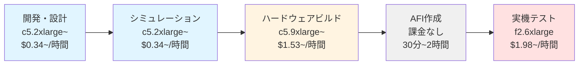
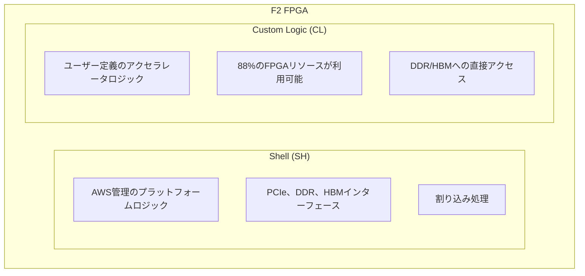

## はじめに

AWS F2 インスタンスは、Amazon が提供する第 2 世代の FPGA 搭載 Amazon EC2 インスタンスです。AMD UltraScale+ VU47P FPGA と High Bandwidth Memory (HBM) を搭載し、グラフデータベース解析で 95 倍、ゲノム解析で 10 倍の高速化を実現できます。

本記事（前編）では、最もシンプルな `hello_world_hlx` サンプルを使って、AWS F2 インスタンスでの FPGA 開発の基本を学びます。重要なポイントとして、この前編では F2 インスタンスは不要であり、通常の CPU インスタンス（c5 系）で開発とシミュレーションまで完結できます。これにより、開発初期段階でのコストを大幅に抑えることが可能です。

本記事を通じて、AWS F2 インスタンスの基本概念を理解し、AMD Xilinx Vivado IP Integrator (GUI) を使った簡単な FPGA 設計を習得できます。シミュレーションによる動作確認まで行い、後編ではハードウェアビルドと実機での動作確認を行います。

### 記事の構成

本記事は二部構成となっています。前編（本記事）では開発環境構築とシミュレーションを扱い、この段階では F2 インスタンスは不要です。後編ではハードウェアビルドと F2 インスタンスでの実機テストを扱います。

### 対象読者

本記事は、FPGA に興味があるが初めて触る方、AWS クラウドで FPGA 開発を始めたい方、実際に手を動かして学びたい方を対象としています。FPGA 開発の経験がなくても、Linux の基本的なコマンド操作ができれば問題ありません。

## FPGA 開発フローの概要

AWS F2 での FPGA 開発は、以下のフェーズに分かれます。各フェーズで必要なインスタンスタイプが異なり、コスト最適化のポイントとなります。

### 開発フェーズとインスタンスタイプ



前編（本記事）では A と B のフェーズのみを扱い、F2 インスタンスが必要になるのは後編からです。

### コスト最適化のポイント

開発フェーズごとに適切なインスタンスタイプを選択することで、コストを最適化できます。開発・シミュレーション（前編）では c5.2xlarge 以上（約 $0.34/時間〜）で十分な性能が得られます。ビルド（後編）では c5.9xlarge 以上（約 $1.53/時間〜）を推奨します。実機テスト（後編）では f2.6xlarge（約 $1.98/時間）が必要です。開発環境では Amazon EC2 Spot Instances の活用でさらにコスト削減が可能です。

このように、開発からシミュレーションまでは F2 インスタンスを使わずに済むため、大幅なコスト削減が可能です。この点は AWS F2 での FPGA 開発における重要な特徴です。

## AWS F2 インスタンスとは

### 第 2 世代 FPGA 搭載インスタンス

[F2 インスタンス](https://aws.amazon.com/ec2/instance-types/f2/)は、従来の F1 インスタンスと比較して大幅に性能が向上しています。プロセッサコアは 3 倍の 192 vCPU（AMD EPYC 7R13 Milan）となり、システムメモリも 2 倍の 2 TiB RAM に増強されています。さらに、ネットワーク帯域は 4 倍の 100 Gbps、NVMe SSD は 2 倍の 7.6 TiB と、あらゆる面で強化が図られています。

### インスタンスラインナップ

F2 インスタンスには 3 つのバリエーションが用意されています。f2.6xlarge は 1 つの FPGA と 24 vCPU、256 GiB メモリを搭載し、ネットワーク帯域は 12.5 Gbps です。f2.12xlarge は 2 つの FPGA と 48 vCPU、512 GiB メモリを搭載し、ネットワーク帯域は 25 Gbps となります。最上位の f2.48xlarge は 8 つの FPGA と 192 vCPU、2048 GiB メモリを搭載し、ネットワーク帯域は 100 Gbps に達します。

2025 年 11 月時点で、F2 インスタンスは世界 8 つのリージョンで利用可能です。具体的には、US East (N. Virginia)、US West (Oregon)、Canada (Central)、Europe (Frankfurt)、Europe (London)、Asia Pacific (Sydney)、Asia Pacific (Tokyo)、Asia Pacific (Seoul) で提供されています。詳細は [AWS の公式発表](https://aws.amazon.com/about-aws/whats-new/2025/11/amazon-ec2-f2-instances-four-additional-aws-regions/)をご参照ください。

### FPGA アーキテクチャ

F2 インスタンスの FPGA は 2 つのパーティションに分かれています。Shell (SH) は AWS 管理のプラットフォームロジックであり、PCIe、DDR、HBM インターフェースや割り込み処理を提供します。一方、Custom Logic (CL) はユーザー定義のアクセラレータロジックを実装する領域で、全体の 88% の FPGA リソースが利用可能です。CL から DDR や HBM への直接アクセスも可能となっています。



## 環境準備

### FPGA Developer AMI の起動

AWS FPGA 開発には専用の Amazon Machine Image (AMI) が用意されています。この AMI には、AMD Xilinx Vivado などの開発ツールがプリインストールされており、すぐに開発を始めることができます。

開発フェーズでは F2 インスタンスを使う必要はありません。シミュレーションには c5.2xlarge（8 vCPU、16 GiB）以上が推奨され、ビルドには c5.9xlarge（36 vCPU、72 GiB）以上、またはメモリ最適化インスタンスである r5 系が推奨されます。

最新の FPGA Developer AMI は以下で確認できます：
- AMI 1.18.0 (Rocky Linux 8.10): Vivado/Vitis 2025.1 - `ami-0cb1b6ae2ff99f8bf`
- AMI 1.18.0 (Ubuntu 24.04): Vivado/Vitis 2025.1 - `ami-098b2ed4c92602975`
- AMI 1.16.1 (Ubuntu 20.04): Vivado/Vitis 2024.1 - `ami-092fc5deb8f3c0f7d`

インスタンス起動時には、ビルド成果物が大きいため 200GB 以上の Amazon Elastic Block Store (EBS) ボリュームを推奨します。以下のコマンド例では、Ubuntu 24.04 AMI を使用して c5.4xlarge インスタンスを起動しています。

```bash
aws ec2 run-instances \
  --image-id ami-098b2ed4c92602975 \
  --instance-type c5.4xlarge \
  --key-name your-key-pair \
  --security-group-ids sg-xxxxxxxxx \
  --subnet-id subnet-xxxxxxxxx \
  --block-device-mappings '[{"DeviceName":"/dev/sda1","Ebs":{"VolumeSize":200}}]' \
  --tag-specifications 'ResourceType=instance,Tags=[{Key=Name,Value=FPGA-Dev-Instance}]'
```

### aws-fpga リポジトリのクローン

インスタンスに SSH 接続後、[AWS FPGA 開発キット](https://github.com/aws/aws-fpga)をクローンします。ここで重要なのは、F2 インスタンス用のドキュメントやサンプルは `f2` ブランチにあるという点です。`main` ブランチは F1 インスタンス用であるため、必ず `f2` ブランチに切り替える必要があります。

```bash
cd ~
git clone https://github.com/aws/aws-fpga.git
cd aws-fpga
git checkout f2
```

### Vivado 環境の確認

FPGA Developer AMI には Vivado がプリインストールされています。インストール場所を確認しましょう。

```bash
# Vivadoのインストールディレクトリを確認
ls -la /opt/Xilinx/Vivado/

# 利用可能なバージョンを確認
ls /opt/Xilinx/Vivado/
```

通常、`/opt/Xilinx/Vivado/` 配下に `2024.1`、`2024.2`、`2025.1` などのバージョンディレクトリがあります。

### HDK 環境のセットアップ

HDK (Hardware Development Kit) 環境をセットアップする前に、Vivado の環境変数を設定する必要があります。以下の手順で進めます。

**ステップ1: Git リポジトリの所有権問題を解決**

```bash
cd ~/aws-fpga
git config --global --add safe.directory /home/ssm-user/aws-fpga
# または Ubuntu ユーザーの場合
# git config --global --add safe.directory /home/ubuntu/aws-fpga
```

**ステップ2: サポートされている Vivado バージョンを確認**

```bash
cat ~/aws-fpga/supported_vivado_versions.txt
```

出力例：
```
vivado v2024.1 (64-bit)
vivado v2024.2 (64-bit)
vivado v2025.1 (64-bit)
```

**ステップ3: Vivado の環境変数を設定**

インストールされているバージョンに応じて、適切な `settings64.sh` を実行します。

```bash
# Vivado 2024.2 の場合
source /opt/Xilinx/Vivado/2024.2/settings64.sh

# または Vivado 2025.1 の場合
# source /opt/Xilinx/Vivado/2025.1/settings64.sh
```

Vivado のパスが通ったことを確認：

```bash
which vivado
# 出力例: /opt/Xilinx/Vivado/2024.2/bin/vivado
```

**ステップ4: HDK セットアップスクリプトを実行**

```bash
cd ~/aws-fpga
source hdk_setup.sh
```

初回実行時は 2〜3 分かかり、以下の処理が自動で実行されます：
- Vivado インストールの確認
- 環境変数の設定
- IP シミュレーションモデルの生成
- シェルファイルの S3 からのダウンロード

成功すると以下のようなメッセージが表示されます：

```
INFO: Setting up environment variables
INFO: Using vivado v2024.2 (64-bit)
INFO: VIVADO_TOOL_VERSION is 2024.2
INFO: Settting up CL_IP for Vivado version 2024.2
...
INFO: AWS HDK setup PASSED.
```

**⚠️ 重要な注意事項**

新しいターミナルセッションを開くたびに、以下の 2 つのコマンドを実行する必要があります：

```bash
# 1. Vivado環境変数の設定
source /opt/Xilinx/Vivado/2024.2/settings64.sh

# 2. HDK環境のセットアップ
cd ~/aws-fpga
source hdk_setup.sh
```

これらを自動化したい場合は、`~/.bashrc` に以下を追加できます：

```bash
# ~/.bashrc に追加
if [ -f /opt/Xilinx/Vivado/2024.2/settings64.sh ]; then
    source /opt/Xilinx/Vivado/2024.2/settings64.sh
fi

if [ -f ~/aws-fpga/hdk_setup.sh ]; then
    cd ~/aws-fpga
    source hdk_setup.sh
    cd ~
fi
```

### Vivado IP Integrator の設定

GUI ベースの開発には Vivado IP Integrator (IPI) の設定が必要です。まず、設定ファイルが存在しない場合は作成します。

```bash
mkdir -p ~/.Xilinx/Vivado
touch ~/.Xilinx/Vivado/Vivado_init.tcl
```

エディタで `~/.Xilinx/Vivado/Vivado_init.tcl` を開き、以下を追記します。ここで `small_shell` を指定することで、全体の 88% の FPGA リソースが利用可能になります。

```tcl
set shell small_shell
source $::env(HDK_SHELL_DIR)/hlx/hlx_setup.tcl
```

`vi` や `nano` などのエディタで編集できます：

```bash
# viの場合
vi ~/.Xilinx/Vivado/Vivado_init.tcl

# nanoの場合
nano ~/.Xilinx/Vivado/Vivado_init.tcl
```

## hello_world_hlx サンプルの概要

### アーキテクチャ

このサンプルは非常にシンプルな構成で、FPGA の基本的な動作を学ぶのに最適です。[AWS 公式ドキュメント](https://raw.githubusercontent.com/aws/aws-fpga/f2/docs-rtd/source/_static/hello_world_hlx_images/hello_world_hlx.png)にブロック図が掲載されています。

### 主要コンポーネント

設計の中心となるのは AWS IP です。OCL Interface は AXI4-Lite Master として動作し、ホストからのレジスタアクセスを提供します。PCIS Interface は AXI4 Master として動作し、メモリアクセスに使用されます。

AXI GPIO は Virtual LED (VLED) の制御を担当します。ここに `0xAAAA` を書き込むことで LED パターンを設定できます。また、AXI BRAM Controller と Block Memory の組み合わせにより、"Hello World!" 文字列を保存し、ホストからの読み書きテストを行うことができます。

### 動作概要

このサンプルは 2 つの主要な動作を実行します。まず、OCL 経由で AXI GPIO に `0xAAAA` を書き込み、VLED を点灯させます。次に、PCIS 経由で BRAM に "Hello World!" を書き込み、読み戻して確認します。

## Vivado GUI での設計作成

実際に Vivado GUI を使って設計を作成していきましょう。

### Vivado の起動

サンプルディレクトリに移動して Vivado を起動します。

```bash
cd $AWS_FPGA_REPO_DIR/hdk/cl/examples/hello_world_hlx
vivado
```

**⚠️ トラブルシューティング**

もし `vivado: command not found` というエラーが出た場合、Vivado の環境変数が設定されていません：

```bash
# Vivado環境変数を設定
source /opt/Xilinx/Vivado/2024.2/settings64.sh

# 再度Vivadoを起動
vivado
```

### IPI プロジェクトの生成

Vivado GUI の Tcl コンソール（下部）に以下のコマンドを入力します。ここで注意すべき点は、例名に `_hlx` を含めず、`hello_world` と指定することです。

```tcl
aws::make_ipi -examples hello_world
```

実行すると、プロジェクトディレクトリの作成、AWS IP の配置、サンプル回路の構築、接続の自動化が順次実行されます。プロジェクトは `hdk/cl/examples/hello_world_hlx/example_projects/hello_world_hlx.xpr` に作成されます。

### ブロックデザインの確認

自動的にブロックダイアグラムが開きます。AWS IP をダブルクリックして設定を確認すると、OCL Interface と PCIS Interface が有効化されていることがわかります。一方、DDR Interface と HBM Interface は、このサンプルでは使用しないため無効化されています。

接続関係を確認すると、OCL から AXI Interconnect を経由して AXI GPIO に接続され、PCIS から AXI BRAM Controller を経由して Block Memory に接続されています。[Vivado GUI のスクリーンショット](https://raw.githubusercontent.com/aws/aws-fpga/f2/docs-rtd/source/_static/hlx_images/vivado_gui.png)で視覚的に確認できます。

## シミュレーション実行（重要：ここまで F2 不要）

実機でのビルドには時間がかかるため、まずシミュレーションで動作を確認します。**このシミュレーションは c5 系インスタンスで実行可能で、F2 インスタンスは不要です。**

### シミュレーション設定の確認

Vivado GUI の左側にある Flow Navigator から SIMULATION セクションを探し、Simulation Settings を右クリックして設定画面を開きます。設定は自動で最適化されていますが、必要に応じて変更可能です。

### シミュレーション実行

Tcl コンソールで `launch_simulation` コマンドを実行するか、Flow Navigator から SIMULATION → Run Simulation → Run Behavioral Simulation を選択します。

```tcl
launch_simulation
```

シミュレーターが起動し、自動的にテストベンチが実行されます。

### 波形の確認

シミュレーターウィンドウで全実行コマンドを入力します。

```tcl
run -all
```

実行後、コンソールには VLED への書き込みと読み戻し、BRAM への "Hello World!" の書き込みと読み戻しの情報が表示され、最終的に TEST PASSED のメッセージが出力されます。このサンプルは数分で完了しますが、大規模な設計では数時間かかる場合があります。

## 前編のまとめと次のステップ

### 前編で学んだこと

本記事（前編）では、以下の内容を学びました：

1. **AWS F2 インスタンスの基本概念**
   - FPGA アーキテクチャ（Shell と Custom Logic）
   - インスタンスラインナップと仕様

2. **開発環境の構築**
   - FPGA Developer AMI の起動（c5 系インスタンスで十分）
   - aws-fpga リポジトリのセットアップ
   - Vivado 環境変数の設定（重要！）
   - HDK 環境のセットアップ
   - Vivado IP Integrator の設定

3. **hello_world_hlx サンプルでの設計**
   - Vivado GUI での IPI プロジェクト作成
   - ブロックデザインの確認と理解
   - AXI インターフェースの基本

4. **シミュレーションによる動作確認**
   - Vivado シミュレーターの実行
   - 波形確認と結果の検証

### 重要なポイント

- **F2 インスタンスは不要**：前編の全ての作業は c5 系インスタンスで完結
- **コスト効率**：c5.2xlarge なら約 $0.34/時間で開発可能
- **段階的な開発**：シミュレーションで動作確認してから実機テストへ進む
- **Vivado 環境変数の設定が必須**：`source /opt/Xilinx/Vivado/2024.2/settings64.sh` を忘れずに

### 次のステップ（後編で実施）

後編では、以下の内容を扱います：

1. **ハードウェアビルド**
   - DCP ファイルの生成（30〜90分）
   - タイミング制約の確認

2. **AFI（Amazon FPGA Image）の作成**
   - S3 バケットの準備
   - AFI 作成リクエストと状況確認

3. **F2 インスタンスでの実機テスト**
   - F2 インスタンスの起動（ここで初めて F2 が必要）
   - AFI のロードと実行
   - 実機での動作確認

4. **トラブルシューティング**

後編では、実際に F2 インスタンス（約 $1.98/時間）を使用するため、使用時間に注意しながら進めていきます。

## トラブルシューティング（前編）

### hdk_setup.sh 実行時のエラー

**エラー: "Please install/enable Vivado"**

このエラーは、Vivado の環境変数が設定されていない場合に発生します。

**解決方法:**

```bash
# ステップ1: Vivadoのインストール場所を確認
ls -la /opt/Xilinx/Vivado/

# ステップ2: 利用可能なバージョンを確認
ls /opt/Xilinx/Vivado/
# 出力例: 2024.1  2024.2  2025.1

# ステップ3: settings64.shを実行
source /opt/Xilinx/Vivado/2024.2/settings64.sh

# ステップ4: Vivadoのパスが通ったか確認
which vivado
# 出力例: /opt/Xilinx/Vivado/2024.2/bin/vivado

# ステップ5: 再度HDKセットアップを実行
cd ~/aws-fpga
source hdk_setup.sh
```

**エラー: "vivado v2024.2 (64-bit) is not supported"**

サポートされているバージョンを確認してください：

```bash
cat ~/aws-fpga/supported_vivado_versions.txt
```

もし使用中のバージョンがサポートされていない場合は、別のバージョンの Vivado を使用するか、aws-fpga リポジトリを最新版に更新してください。

**エラー: "detected dubious ownership in repository"**

Git のセキュリティ機能による警告です。以下で解決できます：

```bash
git config --global --add safe.directory /home/ssm-user/aws-fpga
# または Ubuntu ユーザーの場合
# git config --global --add safe.directory /home/ubuntu/aws-fpga
```

### シミュレーション実行時のエラー

シミュレーションが起動しない場合：

1. HDK 環境が正しくセットアップされているか確認
2. Vivado のライセンスが有効か確認
3. プロジェクトが正しく生成されているか確認

```bash
# HDK環境の再セットアップ
source /opt/Xilinx/Vivado/2024.2/settings64.sh
source $AWS_FPGA_REPO_DIR/hdk_setup.sh
```

### Vivado GUI の動作が遅い

X11 転送を使用している場合、GUI の応答が遅くなることがあります。解決方法：

1. VNC または Amazon DCV を使用する
2. ローカルの Vivado で作業する（プロジェクトファイルを同期）
3. より高スペックのインスタンスを使用する（c5.4xlarge 以上）

### 環境変数の永続化

毎回 `source` コマンドを実行するのが面倒な場合、`~/.bashrc` に追加できます：

```bash
# ~/.bashrc に追加
echo '# Vivado環境変数' >> ~/.bashrc
echo 'if [ -f /opt/Xilinx/Vivado/2024.2/settings64.sh ]; then' >> ~/.bashrc
echo '    source /opt/Xilinx/Vivado/2024.2/settings64.sh' >> ~/.bashrc
echo 'fi' >> ~/.bashrc

echo '# HDK環境' >> ~/.bashrc
echo 'if [ -f ~/aws-fpga/hdk_setup.sh ]; then' >> ~/.bashrc
echo '    cd ~/aws-fpga' >> ~/.bashrc
echo '    source hdk_setup.sh > /dev/null 2>&1' >> ~/.bashrc
echo '    cd ~' >> ~/.bashrc
echo 'fi' >> ~/.bashrc

# 設定を反映
source ~/.bashrc
```

## 開発環境のコスト管理

### 前編（開発・シミュレーション）のコスト

| インスタンスタイプ | vCPU | メモリ | 用途 | 時間単価（us-east-1） |
|---|---|---|---|---|
| c5.2xlarge | 8 | 16 GiB | 開発・シミュレーション | 約 $0.34 |
| c5.4xlarge | 16 | 32 GiB | より快適な開発 | 約 $0.68 |
| c5.9xlarge | 36 | 72 GiB | 大規模シミュレーション | 約 $1.53 |

**前編の想定コスト例：**
- 8時間の開発・シミュレーション作業
- c5.2xlarge 使用
- 合計：約 $2.72（$0.34 × 8時間）

### コスト削減のヒント

1. **Spot Instances の活用**：開発環境では最大 70% のコスト削減が可能
2. **作業時間の管理**：不要な時はインスタンスを停止
3. **EBS ボリュームの最適化**：使用後は削除またはスナップショット化
4. **リージョン選択**：us-east-1 が最も安価

### 料金の確認方法

最新の料金は以下で確認できます：
- [AWS EC2 料金ページ](https://aws.amazon.com/ec2/pricing/on-demand/)
- [AWS Pricing Calculator](https://calculator.aws/)

## 学習リソース

### AWS 公式ドキュメント

- [AWS F2 ReadTheDocs](https://awsdocs-fpga-f2.readthedocs-hosted.com/)：最新の F2 ドキュメント
- [AWS FPGA GitHub](https://github.com/aws/aws-fpga)：サンプルコードとスクリプト（f2 ブランチ使用）
- [HDK ユーザーガイド](https://awsdocs-fpga-f2.readthedocs-hosted.com/latest/hdk/README.html)：詳細な開発ガイド

### Vivado 学習リソース

- [Vivado Design Suite User Guide (UG892)](https://docs.amd.com/r/en-US/ug892-vivado-design-flows-overview)
- [IP Integrator User Guide (UG994)](https://docs.amd.com/r/en-US/ug994-vivado-ip-subsystems)
- [UltraFast Design Methodology (UG949)](https://docs.amd.com/r/en-US/ug949-vivado-design-methodology)

### FPGA 設計の基礎

- Verilog / VHDL の基本文法
- AXI バスプロトコルの理解
- タイミング制約の書き方
- デジタル回路設計の基礎

## 前編のまとめ

本記事（前編）では、AWS F2 インスタンスでの FPGA 開発の最初のステップを学びました。

### 学んだこと

1. **F2 インスタンスの基本概念**：FPGA アーキテクチャと開発フロー
2. **開発環境構築**：c5 系インスタンスでの環境セットアップ
3. **Vivado 環境の正しい設定方法**：`settings64.sh` の重要性
4. **Vivado での設計**：IP Integrator を使った GUI ベースの設計
5. **シミュレーション**：実機なしでの動作確認

### 重要なポイント

- **F2 インスタンス不要**：前編の全作業は c5 系で完結（約 $0.34/時間〜）
- **段階的な開発**：シミュレーション→ビルド→実機の順で確認
- **コスト効率**：開発段階では高額な F2 インスタンスを使用しない
- **Vivado 環境変数の設定は必須**：毎回のセッションで `source /opt/Xilinx/Vivado/2024.2/settings64.sh` を実行

### セットアップ手順の要点

```bash
# 毎回のセッションで必要な手順
# 1. Vivado環境変数の設定
source /opt/Xilinx/Vivado/2024.2/settings64.sh

# 2. HDK環境のセットアップ
cd ~/aws-fpga
source hdk_setup.sh

# 3. サンプルディレクトリに移動
cd $AWS_FPGA_REPO_DIR/hdk/cl/examples/hello_world_hlx

# 4. Vivado起動
vivado
```

### 後編の予告

後編では、以下の内容を扱います：

1. **ハードウェアビルド**：DCP ファイルの生成（30〜90分）
2. **AFI 作成**：Amazon FPGA Image の登録
3. **F2 インスタンスでの実機テスト**：実際の FPGA での動作確認

後編では初めて F2 インスタンス（約 $1.98/時間）を使用します。コストを抑えるため、必要な時だけ起動し、テスト完了後はすぐに停止することが重要です。

## 参考情報

- [AWS F2 インスタンス公式ページ](https://aws.amazon.com/ec2/instance-types/f2/)
- [AWS FPGA GitHub リポジトリ](https://github.com/aws/aws-fpga)（f2 ブランチ）
- [AWS F2 ReadTheDocs](https://awsdocs-fpga-f2.readthedocs-hosted.com/)
- [AMD Vivado Documentation](https://docs.amd.com/r/en-US/Vitis-Tutorials-Getting-Started)
- [AWS EC2 料金ページ](https://aws.amazon.com/ec2/pricing/on-demand/)

質問やフィードバックがあれば、コメント欄でお気軽にお知らせください。

**次回：「AWS F2インスタンス入門（後編）：ハードウェアビルドと実機テスト」をお楽しみに！**
