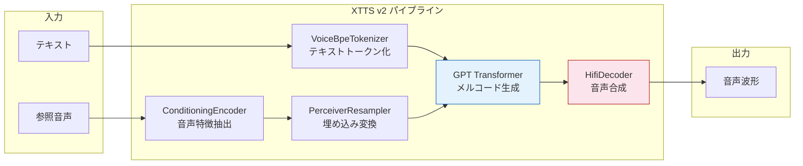
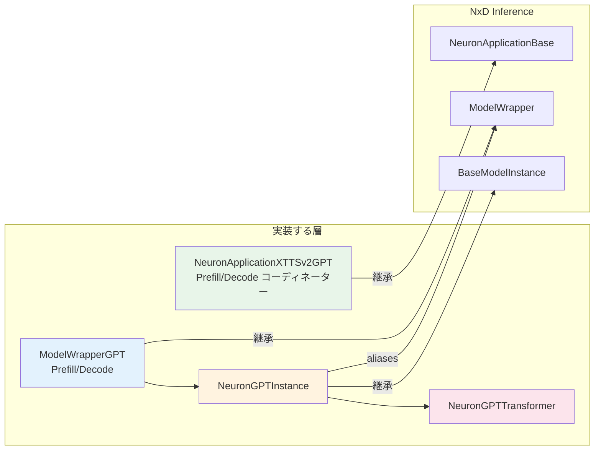
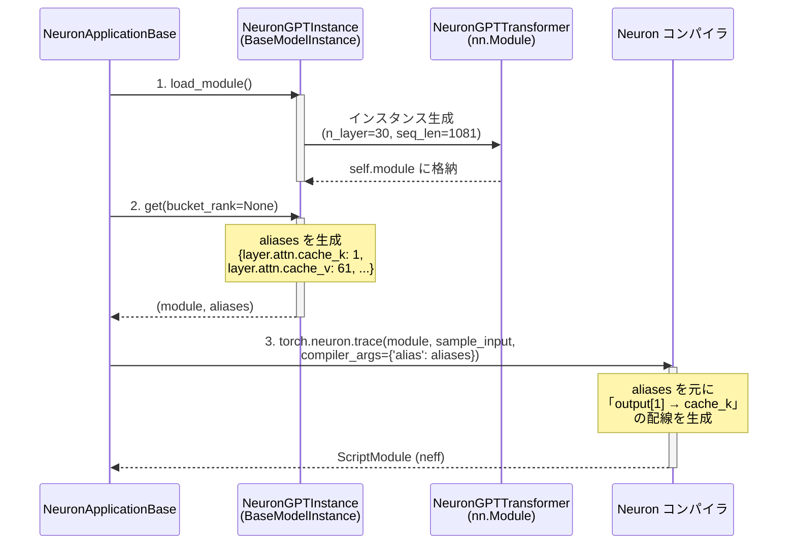
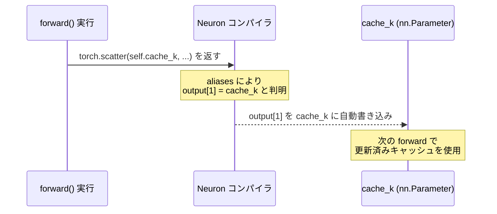
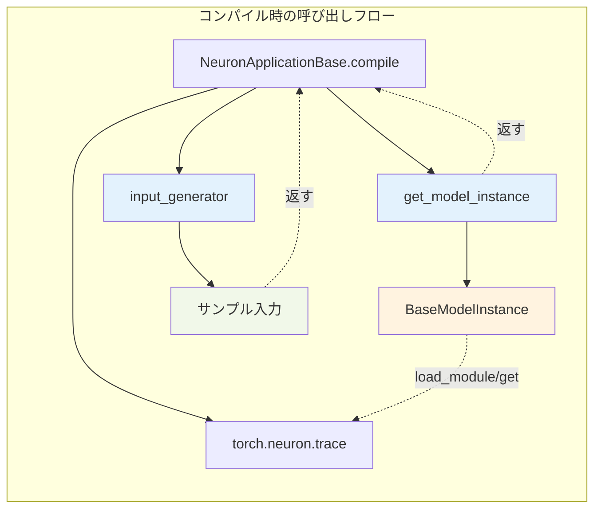
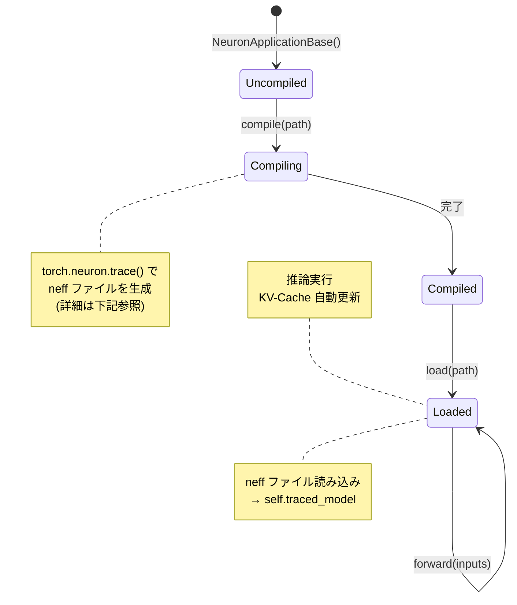
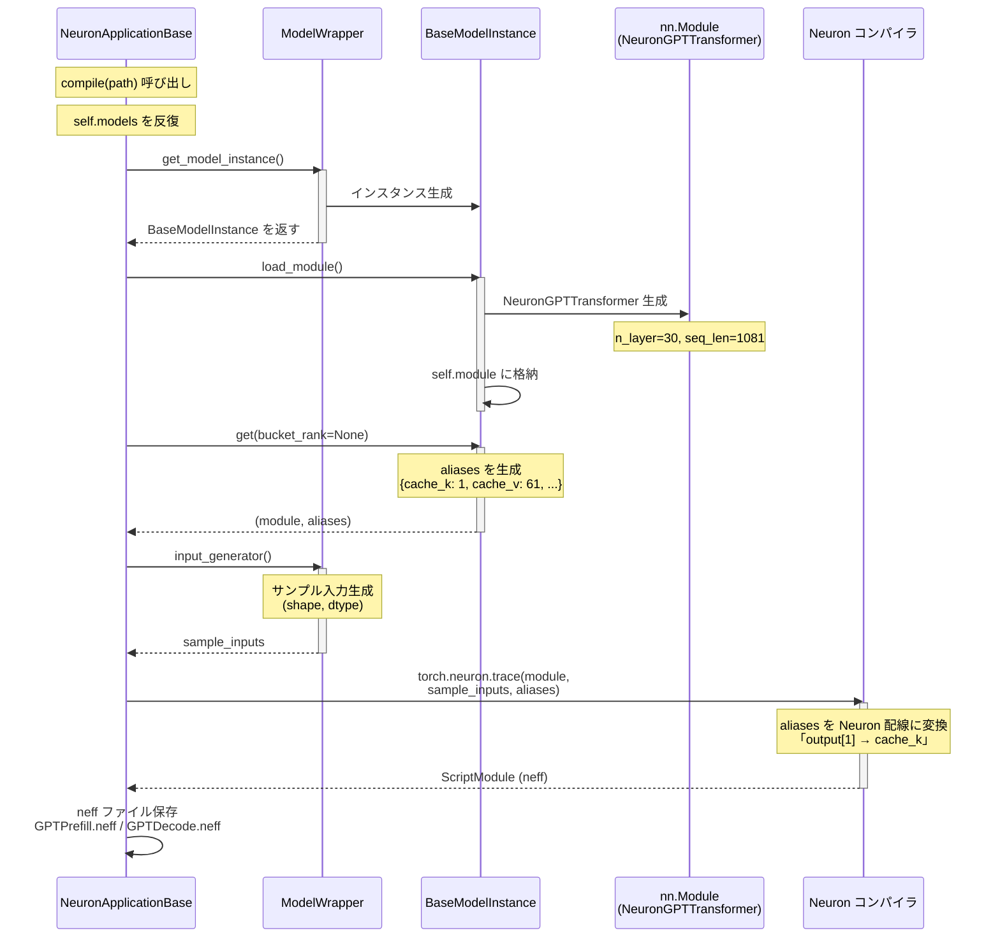
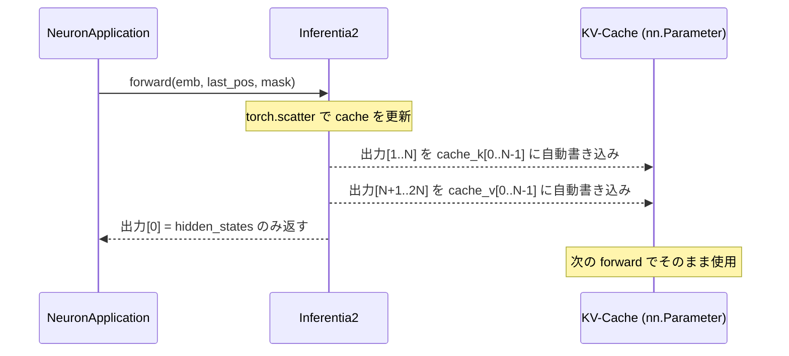

本記事は、AWS Trainium/Inferentia2 チップで音声合成 (TTS) を実装したい中級者を対象としています。Python 基礎および PyTorch の基本的な使い方を前提知識とします。

https://zenn.dev/tosshi/articles/53cc505a8d85e2

前回の記事ではモデルの一部を `torch_neuronx.trace()` を使ってコンパイルするところまで成功して HP が切れました。今回は NxD Inference（neuronx-distributed-inference）という AWS が提供する AWS Neuron 向けの大規模推論ライブラリに XTTS v2 を対応させる実装にチャレンジします。

## はじめに

NxD Inference を使う主なメリットは以下の 3 点をうまくやってくれる点です！vllm-neuron の裏側としても利用されているため本番利用時には積極的に使っていきたいです。

- **KV-Cache の自動管理**
- **Tensor Parallelism**
- **コンパイル済みモデルの管理**

**NxD Inference リポジトリ**: [https://github.com/aws-neuron/neuronx-distributed-inference](https://github.com/aws-neuron/neuronx-distributed-inference)

### Whisper の実装を参考に

NxD Inference には既に **Whisper の実装例**が含まれています：

[**Whisper 実装例（公式）**](https://github.com/aws-neuron/neuronx-distributed-inference/tree/main/examples/inference/whisper)

Whisper は Encoder-Decoder アーキテクチャを持つモデルで、NxD Inference への統合方法が詳細に実装されています。本記事の XTTS v2 実装は、この Whisper 実装を参考にしています。特に以下の点で同じパターンを採用しました：

- **複数モデルの分離**: Whisper は Encoder/Decoder を独立した `NeuronApplicationBase` サブクラスに分離。XTTS v2 も Prefill/Decode を同様に分離
- **BaseModelInstance + aliases**: KV-Cache の自動管理パターン
- **ModelWrapper の設計**: サンプル入力生成と BaseModelInstance の取得

本記事では、NxD Inference を使って XTTS v2 の GPT Transformer 部分を Inferentia2 で動かすまでの実装を、7 ステップで解説します。

:::message alert
**Neuron SDK の将来的な変更について**

本記事は **Neuron SDK 2.20 時点**（2024 年末〜2025 年初頭）の `torch.neuronx.trace()` ベースの実装を解説しています。

AWS Neuron は訓練向けに **XLA ベースの Native PyTorch サポート**を提供しており、将来的に推論 API にも同様のアプローチが導入される可能性があります。その場合、以下の点が変更される可能性があります：

- **コンパイルプロセス**: `torch.neuronx.trace()` による事前コンパイルから、XLA による自動コンパイルへ
- **neff ファイル**: 明示的な neff ファイル生成が不要になる可能性
- **aliases パターン**: KV-Cache 管理の方法が変わる可能性

最新の情報は [AWS Neuron ドキュメント](https://awsdocs-neuron.readthedocs-hosted.com/)を参照してください。
:::

## XTTS v2 のアーキテクチャ

まずすでに前の記事で解説済みですが改めて XTTS v2 の全体構成を再掲します。



前回の実験ではパラメータの大半を占める GPT Transformer を AWS Neuron コンパイルしました。一方、HifiDecoder は現時点では Neuron コンパイル非対応のため **CPU**を利用しました。

## NxD Inference のモデル組み込みインターフェース

NxD Inference が新しいモデルを受け入れる仕組みは、**3 つの層からなるインターフェース**で構成されています。

**参考実装**: [NxD Inference Examples](https://github.com/aws-neuron/neuronx-distributed-inference/tree/main/examples/inference) - Whisper などの実装例を参照



### BaseModelInstance — 「モジュールと KV-Cache 配線図を渡す契約」

NxD に新しいモデルを組み込む際の最重要インターフェースです。2 つのメソッドを実装します。

**インターフェース定義**: [BaseModelInstance](https://github.com/aws-neuron/neuronx-distributed-inference/blob/main/src/neuronx_distributed_inference/models/model_base.py) - `load_module()` と `get()` メソッドを実装します



**実装コード**:

```python
class NeuronGPTInstance(BaseModelInstance):

    def load_module(self):
        """NxD がコンパイル前に呼ぶ。実際の nn.Module を生成する"""
        self.module = NeuronGPTTransformer(
            n_layer=30, n_state=1024, n_head=16,
            batch_size=1, seq_len=1081, dtype=torch.float16
        )

    def get(self, bucket_rank=None, **kwargs):
        """NxD がトレース直前に呼ぶ。モジュールと aliases を返す

        aliases の形式: {nn.Parameter オブジェクト: 出力テンソルの何番目か}
        """
        aliases = {}
        output_index = 1  # インデックス 0 は hidden_states（メイン出力）

        for layer in self.module.blocks:
            aliases[layer.attn.cache_k] = output_index  # cache_k の Parameter
            output_index += 1
        for layer in self.module.blocks:
            aliases[layer.attn.cache_v] = output_index  # cache_v の Parameter
            output_index += 1

        return self.module, aliases
```

::::details メソッドの詳細説明

##### `load_module()` — モデルインスタンスの生成

**メソッド定義**: [BaseModelInstance.load_module()](https://github.com/aws-neuron/neuronx-distributed-inference/blob/main/src/neuronx_distributed_inference/models/model_base.py#L46-L56)

| 項目 | 内容 |
|------|------|
| **呼び出しタイミング** | `NeuronApplicationBase.compile()` の冒頭で、`torch.neuron.trace()` を実行する前に呼ばれます |
| **役割** | 実際の `nn.Module`（ここでは `NeuronGPTTransformer`）を生成し、`self.module` に格納します。この時点ではまだ Neuron コンパイルされておらず、通常の PyTorch モジュールです |
| **なぜ必要か** | NxD Inference は様々なモデルアーキテクチャに対応するため、「どんなモジュールを使うか」をユーザーが指定する必要があります。`load_module()` で生成されたモジュールが、後続の `torch.neuron.trace()` でコンパイルされます |
| **パラメータ** | なし |
| **戻り値** | なし（`self.module` に格納） |
| **重要な点** | ・ここで渡す引数（`n_layer`, `batch_size`, `seq_len` など）がコンパイル済みモデルの仕様を決定します<br>・`seq_len` を変更すると別のモデルとして再コンパイルが必要になります<br>・KV-Cache のバッファ（`nn.Parameter`）もこの段階で初期化されます |

##### `get()` — モジュールと KV-Cache 配線図の提供

**メソッド定義**: [BaseModelInstance.get()](https://github.com/aws-neuron/neuronx-distributed-inference/blob/main/src/neuronx_distributed_inference/models/model_base.py#L58-L69)

| 項目 | 内容 |
|------|------|
| **呼び出しタイミング** | `load_module()` の直後、`torch.neuron.trace()` を実行する直前に呼ばれます |
| **役割** | コンパイル対象のモジュールと、KV-Cache の「配線図」（aliases）を返します。この情報を使って NxD Inference が Neuron コンパイラに対して「どの `nn.Parameter` をどの出力テンソルで上書きするか」を指示します |
| **パラメータ** | `bucket_rank` (オプション): 複数の入力サイズ（バケット）をサポートする場合に使用。今回は単一バケット（`seq_len=1081` 固定）なので `None` のまま |
| **戻り値** | `(module, aliases)` のタプル。`module` は `nn.Module`、`aliases` は `{nn.Parameter: int}` の辞書 |
| **重要な点** | ・`aliases` は `{nn.Parameter: int}` の辞書で、「どの出力テンソルがどの Parameter を上書きするか」を指定します<br>・例: `{layer.attn.cache_k: 1}` は「forward の出力タプルの [1] で cache_k を上書き」を意味します<br>・Neuron コンパイラが「`forward()` の出力テンソル N 番目を `nn.Parameter` に書き戻す」処理を**ハードウェアレベル**で埋め込むため、Python 側で KV-Cache を受け渡す必要がなくなります<br>・可変長入力に対応する場合は、バケットごとに異なる aliases を返す必要があります |

**`aliases` の詳細例**:

```python
aliases = {
    layer.attn.cache_k: 1,  # forward の出力タプルの [1] で cache_k を上書き
    layer.attn.cache_v: 61, # forward の出力タプルの [61] で cache_v を上書き
    # ... 全レイヤー分
}
```

例えば `n_layer=30` の場合：
- 出力インデックス 0: `hidden_states`（メイン出力）
- 出力インデックス 1-30: 各レイヤーの `cache_k`
- 出力インデックス 31-60: 各レイヤーの `cache_v`

**なぜこの仕組みが必要か**:

通常の PyTorch では KV-Cache を以下のように明示的に受け渡しします：

```python
# 通常の実装（面倒）
cache_k_new, cache_v_new = layer(x, cache_k_old, cache_v_old)
cache_k_old = cache_k_new  # 毎回更新が必要
cache_v_old = cache_v_new
```

NxD Inference の aliases を使うと：

```python
# NxD Inference（自動）
output = layer(x)  # cache は nn.Parameter として内部で自動更新
# 次回の forward で更新済みの cache が自動的に使われる
```



Python 側では「古いキャッシュを受け取って新しいキャッシュを返す」という面倒な受け渡しが**一切不要**になります。
::::

### ModelWrapper — 「コンパイル用サンプル入力を生成する契約」

ModelWrapper は 2 つのメソッドを実装します。

**インターフェース定義**: [ModelWrapper](https://github.com/aws-neuron/neuronx-distributed-inference/blob/main/src/neuronx_distributed_inference/models/model_wrapper.py) - `input_generator()` と `get_model_instance()` メソッドを実装します



**実装コード**:

```python
class ModelWrapperGPTPrefill(ModelWrapper):

    def input_generator(self):
        """NxD がコンパイル時にトレース用入力を要求したときに呼ばれる"""
        return [(
            torch.randn(batch, max_seq_len, 1024),          # embeddings
            torch.zeros(batch, dtype=torch.int32),           # last_pos
            torch.ones(batch, max_seq_len, dtype=torch.int32),  # mask
        )]

    def get_model_instance(self):
        """NeuronGPTInstance（= BaseModelInstance）を返す"""
        return NeuronGPTInstance(self.config)
```

::::details メソッドの詳細説明

##### `input_generator()` — コンパイル用サンプル入力の生成

**メソッド定義**: [ModelWrapper.input_generator()](https://github.com/aws-neuron/neuronx-distributed-inference/blob/main/src/neuronx_distributed_inference/models/model_wrapper.py#L114-L121)

| 項目 | 内容 |
|------|------|
| **呼び出しタイミング** | `NeuronApplicationBase.compile()` 内で、`torch.neuron.trace()` を実行する際のサンプル入力として使用されます |
| **役割** | コンパイル対象のモジュールに渡すサンプル入力（ダミーテンソル）を生成します。このサンプル入力の形状と dtype がコンパイル済みモデルの入力仕様を決定します |
| **パラメータ** | なし |
| **戻り値** | サンプル入力のタプルのリスト。各要素は `forward()` の引数に対応します |
| **重要な点** | ・返すテンソルの**形状と dtype** がそのままコンパイルされたモデルの入力仕様になります<br>・形状や dtype を変更すると別のモデルとして再コンパイルが必要になります<br>・Prefill と Decode で入力形状が異なるため、それぞれ別の ModelWrapper を作成します |

##### `get_model_instance()` — BaseModelInstance の取得

**メソッド定義**: [ModelWrapper.get_model_instance()](https://github.com/aws-neuron/neuronx-distributed-inference/blob/main/src/neuronx_distributed_inference/models/model_wrapper.py#L102-L112)

| 項目 | 内容 |
|------|------|
| **呼び出しタイミング** | `NeuronApplicationBase.compile()` 内で、コンパイル対象のモジュールを取得する際に呼ばれます |
| **役割** | `BaseModelInstance` のサブクラス（ここでは `NeuronGPTInstance`）のインスタンスを返します |
| **パラメータ** | なし |
| **戻り値** | `BaseModelInstance` のサブクラスのインスタンス |
| **重要な点** | ・返されたインスタンスの `load_module()` と `get()` が後続で呼ばれます<br>・config を適切に渡して、モデルのアーキテクチャパラメータを設定します |
::::

### NeuronApplicationBase — 「compile / load / save の実装を引き受ける基底クラス」

NeuronApplicationBase は 3 つの主要メソッドを提供します。

**インターフェース定義**: [NeuronApplicationBase](https://github.com/aws-neuron/neuronx-distributed-inference/blob/main/src/neuronx_distributed_inference/modules/neuron_application_base.py) - `compile()`, `load()`, `forward()` メソッドを提供します

**ライフサイクル全体図**:



**compile() の詳細フロー**:



:::message
**`torch.neuronx.trace()` によるコンパイルについて**

現在の NxD Inference は `torch.neuronx.trace()` を使用して、事前に neff ファイルを生成します。このアプローチは：

- **メリット**: コンパイル済みモデルを再利用でき、推論時のオーバーヘッドがない
- **デメリット**: 入力形状が固定される、コンパイルに時間がかかる（10-30 分）

将来的に Neuron SDK が推論向けの **XLA ベースの自動コンパイル**を導入した場合、このプロセスが変更される可能性があります。最新情報は [Neuron SDK リリースノート](https://awsdocs-neuron.readthedocs-hosted.com/en/latest/release-notes/index.html)を確認してください。
:::

**重要な制約**: `NeuronApplicationBase` は `self.traced_model` という単一の `torch.jit.ScriptModule` を持ちます。`load()` 後、`self.traced_model` は **1 つのモデル** を指します。`self.traced_model[0]` / `self.traced_model[1]` のようなインデックスアクセスは存在せず、実行時に `TypeError` が発生します。

このため、Prefill と Decode を**独立した 2 つの `NeuronApplicationBase` サブクラス**に分離する設計（**Whisper パターン**）が必要です。

:::message
**Whisper パターンとは**

NxD Inference の [Whisper 実装例](https://github.com/aws-neuron/neuronx-distributed-inference/tree/main/examples/inference/whisper)では、Encoder と Decoder を別々の `NeuronApplicationBase` サブクラスに分離しています：

- `NeuronApplicationWhisperEncoder`: Encoder 専用、`self.traced_model` が Encoder を指す
- `NeuronApplicationWhisperDecoder`: Decoder 専用、`self.traced_model` が Decoder を指す

実装は [`whisper_app.py`](https://github.com/aws-neuron/neuronx-distributed-inference/blob/main/examples/inference/whisper/whisper_app.py) を参照してください。

このパターンを踏襲し、XTTSv2 でも Prefill と Decode を独立した Application に分離します。`self.traced_model` が常に単一のモデルを指すという制約を回避できます。
:::

**実装例（Whisper パターン）**:

::::details メソッドの詳細説明

##### `compile()` — モデルのコンパイル

**メソッド定義**: [NeuronApplicationBase.compile()](https://github.com/aws-neuron/neuronx-distributed-inference/blob/main/src/neuronx_distributed_inference/modules/neuron_application_base.py#L87-L114)

| 項目 | 内容 |
|------|------|
| **呼び出しタイミング** | モデルを初めて Neuron 用にコンパイルする際に呼び出します |
| **役割** | `self.models` に登録された ModelWrapper を反復処理し、各モデルを `torch.neuron.trace()` でコンパイルして neff ファイルとして保存します |
| **パラメータ** | `path` (str): コンパイル済みモデルの保存先ディレクトリ |
| **戻り値** | なし |
| **重要な点** | ・内部で `wrapper.get_model_instance()` → `instance.load_module()` → `instance.get()` → `wrapper.input_generator()` の順に呼び出します<br>・コンパイルには 10-30 分かかる場合があります<br>・結果は neff ファイル（Neuron Executable File Format）として保存されます |

##### `load()` — コンパイル済みモデルのロード

**メソッド定義**: [NeuronApplicationBase.load()](https://github.com/aws-neuron/neuronx-distributed-inference/blob/main/src/neuronx_distributed_inference/modules/neuron_application_base.py#L116-L125)

| 項目 | 内容 |
|------|------|
| **呼び出しタイミング** | コンパイル済みモデルを推論に使用する前に呼び出します |
| **役割** | 指定されたパスから neff ファイルを読み込み、`self.traced_model` に `torch.jit.ScriptModule` として格納します |
| **パラメータ** | `path` (str): コンパイル済みモデルが保存されているディレクトリ |
| **戻り値** | なし（`self.traced_model` に格納） |
| **重要な点** | ・`self.traced_model` は**単一の `torch.jit.ScriptModule`** です<br>・`self.traced_model[0]` のようなインデックスアクセスは存在しません（`TypeError` が発生）<br>・Prefill と Decode を分離する場合、それぞれ独立した `NeuronApplicationBase` サブクラスを作成する必要があります（Whisper パターン） |

##### `forward()` — 推論の実行

**メソッド定義**: [NeuronApplicationBase.forward()](https://github.com/aws-neuron/neuronx-distributed-inference/blob/main/src/neuronx_distributed_inference/modules/neuron_application_base.py#L127-L133)

| 項目 | 内容 |
|------|------|
| **呼び出しタイミング** | コンパイル済みモデルで推論を実行する際に呼び出します |
| **役割** | `self.traced_model` を呼び出して推論を実行し、結果を返します |
| **パラメータ** | モデル固有の入力（例: `hidden_states`, `last_pos`, `mask`） |
| **戻り値** | モデルの出力（通常はタプルの最初の要素を返す） |
| **重要な点** | ・`self.traced_model` を直接呼び出します（`self.traced_model(...)` の形式）<br>・出力がタプルの場合、通常は最初の要素（メイン出力）を返します<br>・KV-Cache は aliases で自動管理されるため、明示的な受け渡しは不要です |

**実装例（Whisper パターン）**:

```python
# Prefill 専用 Application（self.traced_model が Prefill モデルを指す）
class NeuronApplicationXTTSv2GPTPrefill(NeuronApplicationBase):
    def __init__(self, model_path, config):
        super().__init__(model_path, config)
        self.models.append(
            ModelWrapperGPTPrefill(config, NeuronGPTTransformer, tag="GPTPrefill")
        )

    def forward(self, hidden_states, last_pos, mask):
        # self.traced_model は単一の ScriptModule -- 直接呼び出し可
        outputs = self.traced_model(hidden_states, last_pos, mask)
        return outputs[0] if isinstance(outputs, tuple) else outputs


# Decode 専用 Application（self.traced_model が Decode モデルを指す）
class NeuronApplicationXTTSv2GPTDecode(NeuronApplicationBase):
    def __init__(self, model_path, config):
        super().__init__(model_path, config)
        self.models.append(
            ModelWrapperGPTDecode(config, NeuronGPTTransformer, tag="GPTDecode")
        )

    def forward(self, hidden_states, last_pos, mask):
        outputs = self.traced_model(hidden_states, last_pos, mask)
        return outputs[0] if isinstance(outputs, tuple) else outputs


# コーディネーター（NeuronApplicationBase を継承しない）
class NeuronApplicationXTTSv2GPT:
    def __init__(self, model_path, config):
        # 各 Application に独立したサブディレクトリを割り当てる
        self.prefill_app = NeuronApplicationXTTSv2GPTPrefill(
            os.path.join(model_path, "prefill"), config
        )
        self.decode_app = NeuronApplicationXTTSv2GPTDecode(
            os.path.join(model_path, "decode"), config
        )

    def compile(self, path):
        self.prefill_app.compile(os.path.join(path, "prefill"))
        self.decode_app.compile(os.path.join(path, "decode"))

    def load(self, path):
        self.prefill_app.load(os.path.join(path, "prefill"))
        self.decode_app.load(os.path.join(path, "decode"))

    def forward(self, hidden_states, last_pos, mask):
        # seq_len > 1 なら Prefill、= 1 なら Decode にルーティング
        if hidden_states.shape[1] > 1:
            return self.prefill_app(hidden_states, last_pos, mask)
        else:
            return self.decode_app(hidden_states, last_pos, mask)
```
::::

## なぜ Forward Override か — 設計思想

NxD Inference への組み込み方には大きく 2 つのアプローチがあります。

| アプローチ | 概要 | 課題 |
|-----------|------|------|
| A: モデルを全面書き直し | Coqui TTS の実装を捨て、NxD 専用に再実装 | アップストリームの更新を追えない |
| B: Forward Override | 元の実装の `forward()` だけ差し替え | **今回の選択** |

**Forward Override** の考え方はシンプルです。

```python
# 元の XTTS v2 が持つ GPT モデル（触らない）
original_model.gpt.gpt = OriginalGPT2Model(...)

# これだけ差し替える
original_model.gpt.gpt = NeuronGPT2InferenceModel(
    neuron_gpt_app=compiled_neuron_app,
    # 他は元のモデルから取得したコンポーネントをそのまま引き渡す
    mel_emb=original_model.gpt.mel_emb,
    final_norm=original_model.gpt.final_norm,
    ...
)
```

これにより：
- ConditioningEncoder、HifiDecoder など他のコンポーネントは**完全に元のまま**
- XTTS v2 の `inference()` メソッドの呼び出し方も**変わらない**
- Coqui TTS のバージョンアップがあっても**GPT 部分の差し替えだけ更新すればよい**

HuggingFace の `generate()` との互換性は `prepare_inputs_for_generation()` と `past_key_values` のダミー返却で維持します。

```python
def forward(self, input_ids, past_key_values=None, ...):
    # KV-Cache は aliases で NxD が自動管理 → past_key_values は無視してよい
    ...
    return CausalLMOutput(
        logits=logits,
        past_key_values=((None,),)  # ダミー: generate() に「キャッシュ使用中」と伝える
    )
```

:::message
`past_key_values=None` を返すと `generate()` は「キャッシュなし」と判断してプレフィックス全体を毎回渡してきます。`((None,),)` というダミータプルを返すことで「キャッシュが有効」と認識させ、以降は最後のトークンだけが渡されるようになります。
:::

## 7 ステップ実装

### Step 1: Config 設計

**参考実装**: [Whisper の Config 実装](https://github.com/aws-neuron/neuronx-distributed-inference/blob/main/examples/inference/whisper/config.py)

```python
# config.py
from neuronx_distributed_inference.models.config import InferenceConfig, NeuronConfig

class XTTSv2InferenceConfig(InferenceConfig):
    def __init__(self, *args, **kwargs):
        super().__init__(*args, **kwargs)

        # GPT アーキテクチャパラメータ
        self.gpt_layers = 30              # Transformer 層数
        self.gpt_n_model_channels = 1024  # 隠れ次元
        self.gpt_n_heads = 16             # アテンションヘッド数

        # トークン上限
        self.gpt_max_audio_tokens = 605   # 音声（メル）トークン
        self.gpt_max_text_tokens = 402    # テキストトークン
        self.gpt_max_prompt_tokens = 70   # プロンプト（コンディショニング）

        # シーケンス長（固定）
        self.max_seq_len = (
            self.gpt_max_audio_tokens + 2 +    # メル + 開始/終了
            self.gpt_max_text_tokens + 2 +     # テキスト + 開始/終了
            self.gpt_max_prompt_tokens         # プロンプト
        )  # = 1081
```

:::message
NxD Inference は**固定長シーケンス**を想定しています。XTTS v2 の max_seq_len = 1081 をそのまま使います。
:::

### Step 2: Neuron モジュール実装（KV-Cache の要点）

**参考実装**: [Whisper 実装 modeling_gpt.py](https://github.com/aws-neuron/neuronx-distributed-inference/tree/main/examples/inference/modeling_gpt.py)

NxD Inference の核心は **KV-Cache の `nn.Parameter` + aliases パターン**です。

```python
# modeling_gpt.py
class NeuronGPTAttention(nn.Module):
    def __init__(self, n_state, n_head, batch_size, seq_len, dtype):
        super().__init__()
        # Q/K/V を別々の ColumnParallelLinear で実装（GPT-2 の c_attn を分割）
        self.query = ColumnParallelLinear(n_state, n_state, bias=True, gather_output=False)
        self.key   = ColumnParallelLinear(n_state, n_state, bias=True, gather_output=False)
        self.value = ColumnParallelLinear(n_state, n_state, bias=True, gather_output=False)
        self.out   = RowParallelLinear(n_state, n_state, bias=True, input_is_parallel=True)

        # KV-Cache: nn.Parameter として確保（自動管理される）
        self.cache_k = nn.Parameter(
            torch.zeros(batch_size, n_kv_heads, seq_len, head_dim),
            requires_grad=False
        )
        self.cache_v = nn.Parameter(
            torch.zeros(batch_size, n_kv_heads, seq_len, head_dim),
            requires_grad=False
        )

    def forward(self, x, last_pos=None, mask=None):
        # ...
        if seq_len > 1:  # Prefill: 0 から seq_len-1 まで一括更新
            indices = torch.arange(0, seq_len).view(1, 1, seq_len, 1).expand(...)
        else:           # Decode: last_pos の位置だけ更新
            indices = last_pos.view(bsz, 1, 1, 1).expand(...)

        # torch.scatter でキャッシュを更新（in-place 不可、aliases で管理）
        updated_kcache = torch.scatter(self.cache_k, 2, indices, k)
        updated_vcache = torch.scatter(self.cache_v, 2, indices, v)
        # ...
```

#### `torch.scatter` による KV-Cache 更新の詳細

**なぜ `torch.scatter` が必要か**:

通常の PyTorch では KV-Cache を以下のように in-place で更新できます：

```python
# 通常の PyTorch（Neuron では NG）
self.cache_k[: , : , last_pos, : ] = k
```

しかし、**Neuron コンパイラは in-place 操作（既存のテンソルを直接書き換える操作）をサポートしていません**。そのため、`torch.scatter` を使って「元のテンソルをベースに、指定位置だけ変更した新しいテンソル」を生成します。

**`torch.scatter` の動作**:

```python
torch.scatter(input, dim, index, src)
```

| 引数 | 説明 | 今回の例 |
|------|------|----------|
| `input` | ベースとなるテンソル | `self.cache_k` - 既存の KV-Cache |
| `dim` | どの次元に値を配置するか | `2` - シーケンス長の次元 |
| `index` | どの位置に値を配置するか | `indices` - 更新する位置（Prefill: 0〜seq_len-1、Decode: last_pos） |
| `src` | 配置する値 | `k` - 新しい Key の値 |

**具体例（Decode 時）**:

```python
# cache_k の形状: [batch_size, n_heads, seq_len, head_dim]
# 例: [1, 16, 1081, 64]
#     ↑   ↑   ↑     ↑
#   バッチ ヘッド シーケンス ヘッド次元

# 6 番目のトークンを生成中
last_pos = 5
indices = last_pos.view(1, 1, 1, 1).expand(1, 16, 1, 64)
# indices: すべての要素が 5（全ヘッド、全次元で同じ位置を更新）

# 新しい Key の値（今生成したトークンの Key）
k = ...  # 形状: [1, 16, 1, 64]

# scatter でキャッシュを更新
updated_kcache = torch.scatter(self.cache_k, 2, indices, k)
# → cache_k の [: , : , 5, : ] の位置に k の値を配置した新しいテンソルを返す
#    その他の位置（0-4, 6-1080）は cache_k の元の値がそのままコピーされる
```

**視覚的なイメージ**:

```
cache_k (元):   [pos0][pos1][pos2][pos3][pos4][pos5][pos6]...[pos1080]
                  ↓     ↓     ↓     ↓     ↓     X     ↓        ↓
updated_kcache: [pos0][pos1][pos2][pos3][pos4][NEW_K][pos6]...[pos1080]
                                                  ↑
                                            k の値で上書き
```

**aliases との連携**:

```python
def forward(self, x, last_pos=None, mask=None):
    # ...
    updated_kcache = torch.scatter(self.cache_k, 2, indices, k)
    updated_vcache = torch.scatter(self.cache_v, 2, indices, v)

    # forward の出力として返す（タプル）
    return (
        hidden_states,   # [0]: メイン出力
        updated_kcache,  # [1]: 更新後の cache_k
        updated_vcache,  # [61]: 更新後の cache_v（30 層分後）
        # ... 全レイヤー分
    )
```

BaseModelInstance の `get()` で定義した aliases:

```python
aliases = {
    layer.attn.cache_k: 1,  # forward の出力 [1] が cache_k を上書き
    layer.attn.cache_v: 61, # forward の出力 [61] が cache_v を上書き
}
```

**自動更新の仕組み**:

1. `forward()` が `updated_kcache` を出力の 1 番目として返す
2. Neuron コンパイラが aliases を見て「出力 [1] を `cache_k` に書き戻せ」と理解
3. **ハードウェアレベル**で `self.cache_k` のメモリ領域に `updated_kcache` が書き込まれる
4. 次回の `forward()` が呼ばれたとき、`self.cache_k` は自動的に `updated_kcache` の値になっている

**Python 側では一切キャッシュの受け渡しをしない**のに、Neuron チップ上で自動的に更新されます。これが NxD Inference の KV-Cache 自動管理の核心です。

### Step 3: ModelWrapper 実装

Prefill と Decode で入力形状が異なるため、別々の ModelWrapper を作成します。

**参考実装**: [Whisper 実装 model_wrapper_gpt.py](https://github.com/aws-neuron/neuronx-distributed-inference/tree/main/examples/inference/model_wrapper_gpt.py)

```python
# model_wrapper_gpt.py
class ModelWrapperGPTPrefill(NeuronModelWrapper):
    """Prefill: emb[B, prefix_len, 1024] を処理"""
    def input_generator(self):
        yield (
            torch.zeros(batch_size, prefix_len, n_state),  # embeddings
            torch.zeros(batch_size, dtype=torch.int32),    # last_pos
            torch.ones(batch_size, max_seq_len, dtype=torch.int32),  # mask
        )

class ModelWrapperGPTDecode(NeuronModelWrapper):
    """Decode: emb[B, 1, 1024] を処理（1 トークンずつ）"""
    def input_generator(self):
        yield (
            torch.zeros(batch_size, 1, n_state),           # embeddings
            torch.zeros(batch_size, dtype=torch.int32),    # last_pos
            torch.ones(batch_size, max_seq_len, dtype=torch.int32),  # mask
        )
```

### Step 4: NeuronApplication 実装（Whisper パターン）

**参考実装**: [Whisper の Application 実装](https://github.com/aws-neuron/neuronx-distributed-inference/blob/main/examples/inference/whisper/whisper_app.py) - Encoder/Decoder を分離するパターンを参照

`NeuronApplicationBase` の `self.traced_model` は `load()` 後に **単一の `torch.jit.ScriptModule`** になります。1 つの Application に Prefill/Decode 両方の ModelWrapper を登録しても、`self.traced_model[0]` / `[1]` というインデックスアクセスは存在しないため `TypeError` が発生します。

:::message alert
**落とし穴**: `self.models = [prefill_model, decode_model]` としても、`self.traced_model` はインデックスアクセス不可の単一オブジェクトです。[Whisper 実装](https://github.com/aws-neuron/neuronx-distributed-inference/blob/main/examples/inference/whisper/whisper_app.py)（Encoder/Decoder 分離）と同じパターンで、**Prefill と Decode を完全に独立した `NeuronApplicationBase` サブクラスに分離**する必要があります。
:::

```python
# application_gpt.py -- Whisper パターン

def _make_zero_state_dict(config):
    """テスト用: フルサイズ（TP 分割前）のゼロ初期化 state dict を手動生成

    なぜ NeuronGPTTransformer() のインスタンス化ではなく手動生成が必要か:
      get_state_dict() 内で NeuronGPTTransformer() をインスタンス化するとき、
      parallel_state（TP=2）がすでに有効になっており、ColumnParallelLinear は
      TP 分割済みの重み [512, 1024] を生成する。
      その後 shard_checkpoint() がさらに分割して [256, 1024] になり shape mismatch。
      フルサイズ [1024, 1024] のテンソルを直接作成することで二重分割を回避する。

    KV-Cache パラメータ (cache_k, cache_v) は aliases 機構で管理されるため除外。
    """
    n = config.gpt_n_model_channels  # 1024
    n4 = n * 4                       # 4096
    sd = {}
    for i in range(config.gpt_layers):
        p = f"blocks.{i}"
        sd[f"{p}.ln_1.weight"] = torch.ones(n)
        sd[f"{p}.ln_1.bias"]   = torch.zeros(n)
        sd[f"{p}.ln_2.weight"] = torch.ones(n)
        sd[f"{p}.ln_2.bias"]   = torch.zeros(n)
        for proj in ("query", "key", "value"):
            sd[f"{p}.attn.{proj}.weight"] = torch.zeros(n, n)
            sd[f"{p}.attn.{proj}.bias"]   = torch.zeros(n)
        sd[f"{p}.attn.out.weight"] = torch.zeros(n, n)
        sd[f"{p}.attn.out.bias"]   = torch.zeros(n)
        sd[f"{p}.mlp.up_proj.weight"]   = torch.zeros(n4, n)
        sd[f"{p}.mlp.up_proj.bias"]     = torch.zeros(n4)
        sd[f"{p}.mlp.down_proj.weight"] = torch.zeros(n, n4)
        sd[f"{p}.mlp.down_proj.bias"]   = torch.zeros(n)
    return sd


class NeuronApplicationXTTSv2GPTPrefill(NeuronApplicationBase):
    """Prefill 専用: self.traced_model = Prefill の ScriptModule"""

    def __init__(self, model_path, config):
        super().__init__(model_path, config)
        self.models.append(
            ModelWrapperGPTPrefill(config, NeuronGPTTransformer, tag="GPTPrefill")
        )

    @staticmethod
    def load_hf_model(model_path):
        # HuggingFace 形式のチェックポイントは不要
        return None

    @classmethod
    def get_state_dict(cls, model_name_or_path, config):
        # デフォルト実装は model_path に model.safetensors を探す
        # XTTSv2 形式の重みは coordinator.load_weights() で別途ロード
        return _make_zero_state_dict(config)

    @staticmethod
    def convert_hf_to_neuron_state_dict(state_dict, config):
        # get_state_dict() が返す形式はすでに NeuronGPTTransformer 用 -- 変換不要
        return state_dict

    def forward(self, hidden_states, last_pos, mask):
        outputs = self.traced_model(hidden_states, last_pos, mask)  # 直接呼び出し
        return outputs[0] if isinstance(outputs, tuple) else outputs


class NeuronApplicationXTTSv2GPTDecode(NeuronApplicationBase):
    """Decode 専用: self.traced_model = Decode の ScriptModule"""

    def __init__(self, model_path, config):
        super().__init__(model_path, config)
        self.models.append(
            ModelWrapperGPTDecode(config, NeuronGPTTransformer, tag="GPTDecode")
        )

    @staticmethod
    def load_hf_model(model_path):
        return None

    @classmethod
    def get_state_dict(cls, model_name_or_path, config):
        return _make_zero_state_dict(config)

    @staticmethod
    def convert_hf_to_neuron_state_dict(state_dict, config):
        return state_dict

    def forward(self, hidden_states, last_pos, mask):
        outputs = self.traced_model(hidden_states, last_pos, mask)
        return outputs[0] if isinstance(outputs, tuple) else outputs


class NeuronApplicationXTTSv2GPT:
    """コーディネーター（NeuronApplicationBase を継承しない）

    ディレクトリ構造:
        model_path/prefill/  -- NeuronApplicationXTTSv2GPTPrefill の管轄
        model_path/decode/   -- NeuronApplicationXTTSv2GPTDecode の管轄
    """

    def __init__(self, model_path, config):
        self.prefill_app = NeuronApplicationXTTSv2GPTPrefill(
            os.path.join(model_path, "prefill"), config
        )
        self.decode_app = NeuronApplicationXTTSv2GPTDecode(
            os.path.join(model_path, "decode"), config
        )

    def load(self, compiled_model_path=None, skip_warmup=False):
        base = compiled_model_path or self.model_path
        self.prefill_app.load(os.path.join(base, "prefill"), skip_warmup=skip_warmup)
        self.decode_app.load(os.path.join(base, "decode"), skip_warmup=skip_warmup)

    def load_weights(self, checkpoint_path, tp_degree=1):
        """XTTSv2 の .pth チェックポイントから重みをロード"""
        neuron_state_dict = load_gpt_weights_from_xttsv2(
            checkpoint_path, self.config, tp_degree=tp_degree
        )
        for app in (self.prefill_app, self.decode_app):
            app.traced_model.load_state_dict(neuron_state_dict, strict=False)

    def forward(self, hidden_states, last_pos, mask):
        if hidden_states.shape[1] > 1:
            return self.prefill_app(hidden_states, last_pos, mask)  # Prefill
        else:
            return self.decode_app(hidden_states, last_pos, mask)   # Decode
        # KV-Cache は aliases により自動書き込みされる -- 戻り値に含まない
```

### Step 5: State Dict 変換（Conv1D weight の形式変換と c_attn の 3 分割）

XTTS v2 の GPT は HuggingFace GPT-2 ベースで、Q/K/V が 1 つの `c_attn` 重みに結合されています。NxD Inference では別々に扱うため、分割が必要です。

**参考実装**: [Whisper 実装 state_dict.py](https://github.com/aws-neuron/neuronx-distributed-inference/tree/main/examples/inference/state_dict.py)

**ここに大きな落とし穴がありました。** GPT-2 は `nn.Linear` ではなく `Conv1D` を使っており、重みの格納形式が逆です。

| レイヤー | `nn.Linear` の weight 形状 | GPT-2 `Conv1D` の weight 形状 |
|---------|--------------------------|------------------------------|
| `c_attn` | `[3*n_state, n_state]` = `[3072, 1024]` | `[n_state, 3*n_state]` = **`[1024, 3072]`** |
| `c_proj` | `[n_state, n_state]` = `[1024, 1024]` | `[n_state, n_state]` = `[1024, 1024]`（転置） |
| `mlp.c_fc` | `[4*n_state, n_state]` = `[4096, 1024]` | `[n_state, 4*n_state]` = **`[1024, 4096]`** |
| `mlp.c_proj` | `[n_state, 4*n_state]` = `[1024, 4096]` | `[4*n_state, n_state]` = **`[4096, 1024]`** |

`NeuronGPTTransformer` は `ColumnParallelLinear`（`nn.Linear` 規約: `[out, in]`）を使うため、**全ての Conv1D 重みを transpose する必要があります**。

実際のチェックポイントを確認した際の出力:
```
gpt.gpt.h.0.attn.c_attn.weight: torch.Size([1024, 3072])  # Conv1D [in, out]
gpt.gpt.h.0.attn.c_proj.weight: torch.Size([1024, 1024])
gpt.gpt.h.0.mlp.c_fc.weight:    torch.Size([1024, 4096])
gpt.gpt.h.0.mlp.c_proj.weight:  torch.Size([4096, 1024])
```

```python
# state_dict.py
def split_qkv(state_dict, layer_idx, n_state=1024):
    """GPT-2 の Conv1D c_attn [n_state, 3*n_state] を Q/K/V に分割し transpose"""
    qkv_weight = state_dict.pop(f"h.{layer_idx}.attn.c_attn.weight")  # [1024, 3072] Conv1D
    qkv_bias   = state_dict.pop(f"h.{layer_idx}.attn.c_attn.bias")    # [3072]

    # Conv1D は [in, out] 形式 → dim=1 で split
    q_w, k_w, v_w = qkv_weight.split(n_state, dim=1)   # 各 [1024, 1024] [in, out]
    q_b, k_b, v_b = qkv_bias.split(n_state, dim=0)

    # .T で transpose: Conv1D [in, out] → nn.Linear [out, in]
    prefix = f"blocks.{layer_idx}.attn"
    state_dict[f"{prefix}.query.weight"] = q_w.T  # [1024, 1024]
    state_dict[f"{prefix}.key.weight"]   = k_w.T
    state_dict[f"{prefix}.value.weight"] = v_w.T
    # bias はそのまま
    state_dict[f"{prefix}.query.bias"]   = q_b
    state_dict[f"{prefix}.key.bias"]     = k_b
    state_dict[f"{prefix}.value.bias"]   = v_b


def convert_coqui_to_neuron_state_dict(state_dict, config):
    for i in range(config.gpt_layers):
        split_qkv(state_dict, i, n_state=config.gpt_n_model_channels)

        # c_proj も Conv1D → transpose が必要
        if f"h.{i}.attn.c_proj.weight" in state_dict:
            neuron_sd[f"blocks.{i}.attn.out.weight"] = state_dict.pop(...).T

        # MLP も同様
        if f"h.{i}.mlp.c_fc.weight" in state_dict:
            neuron_sd[f"blocks.{i}.mlp.up_proj.weight"] = state_dict.pop(...).T   # [4096, 1024]
        if f"h.{i}.mlp.c_proj.weight" in state_dict:
            neuron_sd[f"blocks.{i}.mlp.down_proj.weight"] = state_dict.pop(...).T # [1024, 4096]
```

:::message alert
**重要**: `split(n_state, dim=0)` ではなく `split(n_state, dim=1)` です。Conv1D は `[in, out]` 形式なのでアウトプット次元（dim=1）で分割します。`dim=0` で split すると shape が `[1, 3072]` × n_state 回になり `ValueError: not enough values to unpack` が発生します。
:::

キーの対応関係は以下のとおりです。

| GPT-2 (Coqui) キー | 実際の形状 | NeuronGPTTransformer キー | 変換後形状 |
|-------------------|-----------|--------------------------|-----------|
| `h.{i}.attn.c_attn` | `[1024, 3072]` | `blocks.{i}.attn.{query,key,value}` | `[1024, 1024]`（.T 後） |
| `h.{i}.attn.c_proj` | `[1024, 1024]` | `blocks.{i}.attn.out` | `[1024, 1024]`（.T 後） |
| `h.{i}.mlp.c_fc` | `[1024, 4096]` | `blocks.{i}.mlp.up_proj` | `[4096, 1024]`（.T 後） |
| `h.{i}.mlp.c_proj` | `[4096, 1024]` | `blocks.{i}.mlp.down_proj` | `[1024, 4096]`（.T 後） |

### Step 6: Forward Override

最も重要なのは、**アップストリームのコードを変更せずに**、NxD Inference の推論エンジンを組み込む部分です。

**参考実装**: [Whisper 実装 neuron_xttsv2.py](https://github.com/aws-neuron/neuronx-distributed-inference/tree/main/examples/inference/neuron_xttsv2.py)

#### どこを差し替えるか — `gpt` vs `gpt_inference`

Coqui XTTS の `XttsGPT` クラスには 2 つの GPT モデルが存在します。

```
model.gpt                    # XttsGPT（ラッパー）
├── model.gpt.gpt            # GPT2Model — 最終 latent 抽出に使用（フル context）
└── model.gpt.gpt_inference  # GPT2InferenceModel — 自己回帰生成に使用（1 token ずつ）
```

XTTS の `inference()` 処理フローを追うと：

```
Xtts.inference()
  └── XttsGPT.generate()                    # 自己回帰生成
        ├── compute_embeddings()
        │     └── gpt_inference.store_prefix_emb()  # prefix embedding を保存
        └── gpt_inference.generate()               # HuggingFace generate() → ここがループ
  └── self.gpt(text_tokens, gpt_codes, return_latent=True)  # 最終 latent 抽出
        └── get_logits() → self.gpt()              # フル context（生成後）
```

**自己回帰生成（`gpt_inference.generate()`）が Neuron で高速化すべき箇所**です。最終 latent 抽出（フル context の forward pass）は seq_len が数百 token になるため、コンパイル時の max_seq_len を超えないよう CPU の `gpt` をそのまま使います。

```python
# 正しい Forward Override
gpt_module = cpu_model.gpt
orig_gpt = gpt_module.gpt                # base GPT2Model（触らない）

neuron_wrapper = NeuronGPT2InferenceModel(
    gpt_config=orig_gpt.config,
    neuron_gpt_app=gpt_app,
    mel_pos_emb=gpt_module.mel_pos_embedding,
    mel_emb=gpt_module.mel_embedding,
    final_norm=gpt_module.final_norm,
    mel_head=gpt_module.mel_head,
)

# gpt_inference を置き換える（gpt ではない）
gpt_module.gpt_inference = neuron_wrapper   # 自己回帰生成が Neuron に切り替わる
# gpt_module.gpt はそのまま（最終 latent 抽出は CPU）
```

:::message alert
**間違えやすいポイント**: `model.gpt.gpt = neuron_wrapper` と書くと、最終 latent 抽出のフル context forward pass（seq_len 約 300）が Neuron モデルに流れて `ValueError: Input shape not found` が発生します。`model.gpt.gpt_inference = neuron_wrapper` が正解です。
:::

#### `NeuronGPT2InferenceModel` の継承設計

`gpt_inference.generate()` は HuggingFace の `GenerationMixin.generate()` です。差し替えるクラスも `generate()` を持つ必要があります。

```python
# neuron_xttsv2.py
from transformers.models.gpt2.modeling_gpt2 import GPT2PreTrainedModel
from transformers import GenerationMixin
from transformers.modeling_outputs import CausalLMOutputWithCrossAttentions

class NeuronGPT2InferenceModel(GPT2PreTrainedModel, GenerationMixin):
    """GPT2InferenceModel と同じ継承設計（Coqui の実装に合わせる）"""
    _is_stateful = False  # GenerationMixin が要求するクラス属性

    def __init__(self, gpt_config, neuron_gpt_app, mel_pos_emb, mel_emb,
                 final_norm, mel_head, kv_cache=True):
        super().__init__(gpt_config)          # GPT2PreTrainedModel.__init__ が generation_config 等を設定
        self.main_input_name = "input_ids"   # GenerationMixin が要求する属性
        self.neuron_gpt_app = neuron_gpt_app
        # ... 以下省略

    def forward(self, input_ids=None, past_key_values=None,
                attention_mask=None, inputs_embeds=None, **kwargs):
        # ... Prefill/Decode の判定と Neuron 実行 ...

        # CausalLMOutputWithCrossAttentions を使う（カスタムクラス不可）
        return CausalLMOutputWithCrossAttentions(
            logits=lm_logits,
            past_key_values=((None,),),  # ダミー（KV-Cache は aliases で管理）
        )
```

継承に関して詰まった点を記録します。

| 問題 | 原因 | 解決 |
|------|------|------|
| `AttributeError: 'NeuronGPT2InferenceModel' object has no attribute 'generate'` | `nn.Module` のみ継承、`GenerationMixin` なし | `GPT2PreTrainedModel, GenerationMixin` を両方継承 |
| `AttributeError: has no attribute 'main_input_name'` | `GenerationMixin` が要求する属性 | `self.main_input_name = "input_ids"` を `__init__` に追加 |
| `AttributeError: has no attribute '_is_stateful'` | `GenerationMixin._prepare_cache_for_generation` が要求 | `_is_stateful = False` をクラス属性に追加 |
| `TypeError: argument of type 'CausalLMOutput' is not iterable` | カスタムクラスが `in` 演算子に対応していない | `CausalLMOutputWithCrossAttentions`（`ModelOutput` サブクラス）を使用 |

:::message
`GPT2PreTrainedModel` 単体では `generate()` を持ちません（transformers 4.45+）。Coqui の `GPT2InferenceModel` が `GPT2PreTrainedModel, GenerationMixin` の両方を継承しているのはこのためです。同じ設計を踏襲します。
:::

:::message alert
`past_key_values` は HuggingFace の `generate()` が KV-Cache の有無を確認するために使います。`None` ではなくダミータプルを返すことで、「キャッシュが使用中」と認識させ、以降は最後の 1 token だけが渡されるようになります。
:::

### Step 7: Aliases による KV-Cache 自動管理

NxD Inference の最も重要な機能が **Aliases** です。

**参考実装**: [Whisper 実装 modeling_gpt.py](https://github.com/aws-neuron/neuronx-distributed-inference/tree/main/examples/inference/modeling_gpt.py#L81-L139) (NeuronGPTAttention クラス)

```python
# modeling_gpt.py の NeuronGPTInstance.get() より
def get(self, bucket_rank=None, **kwargs):
    aliases = {}
    output_index = 1  # 0 は hidden_states

    # 各レイヤーの cache_k を aliases に登録
    for layer in self.module.blocks:
        aliases[layer.attn.cache_k] = output_index  # nn.Parameter -> 出力インデックス
        output_index += 1

    # 各レイヤーの cache_v を aliases に登録
    for layer in self.module.blocks:
        aliases[layer.attn.cache_v] = output_index
        output_index += 1

    return self.module, aliases
```

Aliases の仕組みを図で示します。



この仕組みにより、**KV-Cache の受け渡しがコード上では不要**になります。PyTorch のメモリ管理も自動化されます。

## Full Pipeline（Phase 3）

GPT Transformer 以外のコンポーネントも含めた全体パイプラインです。

```python
# pipeline.py
class NeuronXTTSv2FullPipeline:
    def __init__(self, xtts_model, neuron_gpt_app):
        self.xtts = xtts_model           # 元の XTTSv2 モデル（CPU）
        self.gpt_neuron = neuron_gpt_app # NxD Inference GPT（Inferentia2）

    def synthesize(self, text, language, reference_wav, speaker_wav):
        # 1. テキストトークン化（CPU）
        text_tokens = self.xtts.tokenizer.encode(text, language)

        # 2. Conditioning（CPU）
        cond_latent, speaker_emb = self.xtts.get_conditioning_latents(
            audio_path=reference_wav
        )

        # 3. 埋め込み計算（CPU）
        text_emb  = self.xtts.gpt.text_embedding(text_tokens)
        cond_emb  = cond_latent  # PerceiverResampler 出力
        prefix_emb = torch.cat([cond_emb, text_emb], dim=1)

        # 4. GPT 推論（Inferentia2 -- メイン処理）
        mel_tokens = self._generate_mel_tokens(prefix_emb)

        # 5. HifiDecoder（CPU -- F.interpolate 非対応のため）
        wav = self.xtts.hifigan_decoder(mel_tokens, speaker_emb)
        return wav
```

## OOM 対策

Neuron コンパイルは通常よりもはるかに多くのメモリを消費します。

| パラメータ | デフォルト | OOM 対策値 | 備考 |
|----------|----------|-----------|------|
| `gpt_layers` | 30 | 24 | 検証用に削減 |
| `max_seq_len` | 1081 | 512 | コンテキスト長削減 |
| `batch_size` | 1 | 1 | 最小値 |
| `tp_degree` | 2 | 2 | trn1.2xlarge の NeuronCore 数 |
| スワップ | なし | **16GB** | 必須 |

:::message alert
trn1.2xlarge（RAM 32GB）でコンパイルする場合、**必ず 16GB のスワップファイルを作成してから**コンパイルを実行してください。スワップなしでは OOM でインスタンスがフリーズします。
:::

```bash
# スワップセットアップ（コンパイル前に必須）
cd phase3-integration/setup
./runner.sh run tasks/setup-swap.json --instance-ip $INSTANCE_IP

# OOM 保護付きコンパイル
./runner.sh run tasks/compile-with-oom-protection.json \
  --instance-ip $INSTANCE_IP \
  --env BATCH_SIZE=1 \
  --env TP_DEGREE=2 \
  --env MAX_CONTEXT_LENGTH=512
```

## 実験環境

| 項目 | 内容 |
|------|------|
| インスタンス | trn1.2xlarge |
| NeuronCore | 2 コア（32GB） |
| RAM | 32GB + 16GB スワップ |
| Neuron SDK | 2.23.x |
| NxD Inference | 0.8.x |
| torch-neuronx | 2.9.x |
| XTTS v2 | Coqui-ai/TTS |

## コンパイル実行

```bash
# 環境確認
source /opt/aws_neuronx_venv_pytorch_2_9_nxd_inference/bin/activate
neuron-ls  # NeuronCore の認識を確認

# コード配置
mkdir -p ~/nxd-inference-xttsv2/src
# プロジェクトコードをデプロイ

# コンパイル（10〜30 分）
# BASE_COMPILE_WORK_DIR=/tmp/nxd_model/ とは別のパスを指定すること（後述）
python compile_model.py \
  --compiled-model-path /tmp/nxd_compiled \
  --tp-degree 2 \
  --batch-size 1 \
  --max-context-length 512
```

:::message alert
**重要: 出力パスと作業ディレクトリを分離すること**

`NeuronApplicationBase.get_builder()` は内部で `BASE_COMPILE_WORK_DIR`（デフォルト: `/tmp/nxd_model/`）を中間作業ディレクトリとして使用し、**ビルド開始時にこのディレクトリをクリーンする**。

出力先を `/tmp/nxd_model/prefill/` のように作業ディレクトリの配下に設定すると、コンパイル中に出力が削除されてしまう。

```bash
# NG: 作業ディレクトリ /tmp/nxd_model/ と出力先が重複する
app.compile("/tmp/nxd_model/prefill")   # コンパイル中に /tmp/nxd_model/ ごと消える

# OK: 出力先を別ディレクトリにする
app.compile("/tmp/nxd_compiled/prefill")  # /tmp/nxd_model/ は作業用、/tmp/nxd_compiled/ は出力用
```
:::

コンパイル完了後、以下のファイルが生成されます。Prefill と Decode は独立した `NeuronApplicationBase` インスタンスに対応するため、**サブディレクトリで分離**されます。

```
/tmp/nxd_compiled/              # 出力先（BASE_COMPILE_WORK_DIR とは別）
├── prefill/                    # NeuronApplicationXTTSv2GPTPrefill の管轄
│   ├── model.pt                # NxD の normalize_path() + COMPILED_MODEL_FILE_NAME
│   └── GPTPrefill/             # ModelWrapper の tag に対応（NEFF 等の中間ファイル）
│       └── neff/
│           └── model.neff
└── decode/                     # NeuronApplicationXTTSv2GPTDecode の管轄
    ├── model.pt
    └── GPTDecode/
        └── neff/
            └── model.neff

/tmp/nxd_model/                 # BASE_COMPILE_WORK_DIR（作業用、ビルドごとにクリーンされる）
```

:::message
`prefill_app.load("...nxd_compiled/prefill")` と `decode_app.load("...nxd_compiled/decode")` が独立して呼ばれます。各 Application はサブディレクトリ配下の `model.pt` を読み込みます。
:::

2 回目以降は `app.load(compiled_model_path)` でコンパイル済みモデルを即座にロードできます。

## 実装の振り返り

### 学んだこと

**1. Whisper パターンの汎用性と traced_model の制約**

`NeuronApplicationBase.traced_model` は `torch.jit.ScriptModule` の**単一インスタンス**です。1 つの Application クラスに複数の ModelWrapper を登録しても `self.traced_model[0]` / `[1]` でアクセスすることはできません。

AWS Neuron の Whisper 実装がエンコーダーとデコーダーを独立した Application クラスに分離しているのはこのためです。XTTS v2 の Prefill/Decode も同様に分離し、コーディネーター（`NeuronApplicationXTTSv2GPT`）が `seq_len` に応じてルーティングする設計が正解です。

**2. HuggingFace 互換性の維持**

`NeuronGPT2InferenceModel` を HuggingFace の `GenerationMixin` と互換性のある形で実装することで、既存の `generate()` ループをほぼそのまま使えます。`past_key_values` のダミー返却が重要なポイントです。

**3. KV-Cache の aliases パターン**

`nn.Parameter` で KV-Cache を確保し、`torch.scatter` で更新、aliases で自動書き込みを行うパターンは、NxD Inference のすべての自己回帰モデルで共通です。

**4. get_state_dict() と TP-split の二重適用問題**

`NeuronApplicationBase.load()` は内部で `get_state_dict()` → `shard_checkpoint()` の順に重みをロードします。

問題は `get_state_dict()` 内で `NeuronGPTTransformer()` をインスタンス化するタイミングです。このとき `parallel_state`（TP=2）がすでに有効になっているため、`ColumnParallelLinear` が TP 分割済みの重み（例: `[512, 1024]`）を生成します。続く `shard_checkpoint()` がさらに分割すると `[256, 1024]` となり、期待サイズ `[512, 1024]` との shape mismatch が発生します。

解決策は `_make_zero_state_dict()` のように、`NeuronGPTTransformer` をインスタンス化せずにフルサイズのテンソルを**手動で生成**することです。実際の XTTSv2 重みのロードは `coordinator.load_weights(checkpoint_path)` で `shard_checkpoint()` を経ずに直接 `load_state_dict()` します。

```
状態: get_state_dict() が返す state_dict
  NG: NeuronGPTTransformer() でインスタンス化 → ColumnParallelLinear が [512,1024] を生成
      → shard_checkpoint() が [256,1024] に再分割 → shape mismatch
  OK: torch.zeros(1024, 1024) を手動作成（フルサイズ）
      → shard_checkpoint() が [512,1024] に分割 → 期待通り
```

**5. BASE_COMPILE_WORK_DIR と出力先の分離**

`NeuronApplicationBase.get_builder()` は `BASE_COMPILE_WORK_DIR`（デフォルト `/tmp/nxd_model/`）を中間作業ディレクトリとして使用し、ビルド開始時にこのディレクトリを**クリーンします**。

出力先パスに `/tmp/nxd_model/` の配下（例: `/tmp/nxd_model/prefill/`）を指定すると、コンパイル中に出力が消えます。出力先は `/tmp/nxd_compiled/` のように必ず別ディレクトリにする必要があります。

**6. EC2 (trn1.2xlarge) での動作確認結果**

4 層テストモデル（`gpt_layers=4`, `max_seq_len=128`, TP=2）で Whisper パターンの動作を確認しました。

```
[OK] load() 成功
  prefill traced_model: RecursiveScriptModule
  decode  traced_model: RecursiveScriptModule
[OK] Prefill forward pass: output shape = torch.Size([1, 128, 1024])
[OK] Decode forward pass:  output shape = torch.Size([1, 1,   1024])
[SUCCESS] Whisper pattern 修正が正常に動作しています
```

**10. フル 30 層モデルのコンパイルと Prefill 固定長制約**

`max_seq_len=1083`（gpt_inference の n_ctx に一致）、`gpt_layers=30`、TP=2 でコンパイルした結果、`prefill/model.pt` と `decode/model.pt` が生成されました。

注目すべき点として、`neuron_config.json` には `n_positions: 128` というデフォルト値が記録されます。これは NeuronConfig のデフォルト値が保存されるだけで、実際のコンパイル形状は `ModelWrapperGPTPrefill.input_generator()` が返す `[1, 1083, 1024]` によって決まります。

```python
# ModelWrapperGPTPrefill.input_generator() が実際のコンパイル形状を決定
def input_generator(self):
    max_seq_len = self.config.max_seq_len  # XTTSv2InferenceConfig から取得 = 1083
    hidden_states = torch.randn(batch_size, max_seq_len, n_state, ...)
    return [(hidden_states, last_pos, mask)]
```

forward pass テストの結果：

```
[OK] Prefill 1083: shape=torch.Size([1, 1083, 1024])  # 成功
[ERROR] Prefill 128: Input shape [[1, 128, 1024], ...] not found in input_shape_map
  → 固定長コンパイルのため 1083 以外の Prefill 入力は受け付けない
[OK] Decode: shape=torch.Size([1, 1, 1024])            # 成功
```

これは仕様通りの動作です。実際の推論では prefix（conditioning + text tokens）を必ず `max_seq_len=1083` にパディングして渡す必要があります（マスクで有効範囲を指定）。

**7. GPT-2 Conv1D vs nn.Linear の weight 形式問題**

実際の XTTSv2 チェックポイントを確認したところ、GPT-2 の `Conv1D` は `nn.Linear` とは**逆の軸で重みを格納**していることが判明しました。

```python
# 実際のチェックポイントの形状（Conv1D 形式）
gpt.gpt.h.0.attn.c_attn.weight: torch.Size([1024, 3072])  # [in_features, out_features]
gpt.gpt.h.0.mlp.c_fc.weight:    torch.Size([1024, 4096])  # [in_features, out_features]
gpt.gpt.h.0.mlp.c_proj.weight:  torch.Size([4096, 1024])  # [in_features, out_features]
```

`ColumnParallelLinear`（`nn.Linear` 規約 `[out, in]`）に渡す前に `.T`（transpose）が必須です。また `c_attn` は `dim=0` ではなく `dim=1` で split する必要があります。

```python
# NG: dim=0 で split → ValueError: not enough values to unpack
q_w, k_w, v_w = qkv_weight.split(n_state, dim=0)  # shape [1024, 3072] を dim=0 で分割

# OK: dim=1 で split → transpose
q_w, k_w, v_w = qkv_weight.split(n_state, dim=1)  # [1024, 1024] が 3 個
state_dict[f"...query.weight"] = q_w.T             # transpose して [1024, 1024]
```

**8. torchaudio.load の torchcodec 問題**

PyTorch 2.9 + torchaudio 2.9 の組み合わせでは、`torchaudio.load()` が内部で `torchcodec` を使用するよう変更されています。`torchcodec` は FFmpeg のバージョン対応した `.so` ファイルを動的リンクしますが、インストール済みの FFmpeg の ABI バージョンと合わない場合に `RuntimeError: Could not load libtorchcodec` が発生します。

E2E テストでリファレンス音声を読み込む際にこの問題が発生しました。回避策として `soundfile` ベースのモンキーパッチを使用しました。

```python
# torchaudio.load の torchcodec 問題を回避（テスト環境用）
import soundfile as sf_lib, torch, torchaudio

def load_audio_sf(path, sr=None):
    wav, orig_sr = sf_lib.read(path, dtype='float32', always_2d=True)
    wav = torch.from_numpy(wav.T)  # [channels, samples]
    if sr is not None and sr != orig_sr:
        wav = torchaudio.functional.resample(wav, orig_sr, sr)
        orig_sr = sr
    return wav, orig_sr

torchaudio.load = load_audio_sf  # 上書き（インポート直後に実行）
```

**9. E2E 動作確認結果（4 層テストモデル → フル 30 層）**

実際の XTTSv2 重みをロードして E2E 推論パイプラインの動作を確認しました。

```python
# 重み変換テスト
sd = load_gpt_weights_from_xttsv2('model.pth', cfg, tp_degree=1)
print(f'変換後キー数: {len(sd)}')  # → 480（30 層 × 16 キー/層）
print('[OK] 30 層全キー確認完了')

# 実重みでの forward pass（4 層モデルに 30 層重みの先頭 4 層を strict=False でロード）
out = app(h, last_pos, mask)
print(f'std={out.std().item(): .6f}')  # → 約 1.0（ランダム入力に対して適切な分布）

# E2E 音声生成（CPU gpt baseline: 12.7 秒で 9.93 秒の音声）
outputs = cpu_model.synthesize(text, config, speaker_wav=ref, language='en')
# Neuron（4 層）: 0.58 秒で 0.36 秒の音声
# ※ 4 層コンパイルのため音声長は短い
```

**フル 30 層モデルでの E2E 動作確認**

フル 30 層モデル（`max_seq_len=1083`、実 XTTSv2 重み使用）での E2E 推論結果：

```
[OK] XTTS 読み込み完了
[OK] conditioning latent: torch.Size([1, 32, 1024])
[OK] 実重み読み込み完了  (prefill: 7.4 秒, decode: 1.3 秒)
[OK] gpt_inference を Neuron 実装に差し替え完了

テキスト: "Hello, this is a test of the Neuron XTTSv2 full model."

[OK] 推論完了: 0.77 秒, 音声長=0.87 秒, RTF=1.13x
```

CPU baseline（4 層で 12.7 秒）と比較して、フル 30 層 Neuron モデルが **0.77 秒** で音声を生成しました。

**CPU vs Neuron 精度比較（フル 30 層モデル）**

同一テキスト・同一参照音声・`temperature=0.0, do_sample=False`（グリーディデコード）での比較結果：

| 指標 | 値 |
|------|-----|
| CPU 推論時間 | 9.94 秒 |
| Neuron 推論時間 | 0.49 秒 |
| 速度比 | **20.4x** |
| CPU 音声長 | 8.03 秒 |
| Neuron 音声長 | 0.46 秒 |
| MSE | 0.0255 |
| コサイン類似度 | -0.011 |
| SNR | -0.20 dB |

Whisper による STT 検証でさらに詳細が判明しました。

```
入力テキスト: "Hello, this is a test of Neuron XTTSv2 acceleration."
STT-CPU:    "Hello! This is a test of neuron XTS-V to acceleration."  WER=33.3%
STT-Neuron: "Oh"                                                       WER=100%
```

CPU は内容として正しい音声を生成しています（"XTTSv2" が "XTS-V to" になるのは Whisper の技術用語認識の限界）。一方 **Neuron は "Oh" の 1 語のみ（0.46 秒）で EOS を出して終了しており、正しいコンテンツが生成されていません**。

:::message alert
**根本原因判明**: 後続の調査により、この問題の原因は「数値誤差の累積」ではなく、**重みが実際に Neuron デバイスに注入されていなかった**ことと判明しました。`traced_model.load_state_dict()` が TP モデルでサイレントに失敗し、ゼロ重みのまま推論が走っていました（詳細は後述の「11. traced_model.load_state_dict() は TP モデルで silent fail する」を参照）。

この問題を修正後の重み注入テスト結果（単一 forward pass）：
```
[CPU]    出力: mean=-0.071869, std=7.662164
[Neuron] 出力: mean=-0.071866, std=7.662161
[差異]   max=0.000820, mean=0.000137
[SUCCESS] 重み注入成功! CPU と Neuron の出力が近似一致
```

さらに `temperature=0.65` での E2E 比較と Whisper STT 検証を実施した最終結果：
```
[OK] CPU:    9.42 秒, 音声長=4.64 秒
[OK] Neuron: 3.44 秒, 音声長=5.98 秒, RTF=1.74x

[STT-CPU]    Hello, this is a test of neuron XTSD2 acceleration.  WER=11.1%
[STT-Neuron] Hello, this is a test of neuron XTT, acceleration.   WER=11.1%

速度比 (CPU/Neuron): 1.72x
```

**Neuron が正しいコンテンツを生成できることを STT で確認しました。** WER=11.1% は "XTTSv2" という技術用語を Whisper が正確に認識できないためで、CPU と Neuron でまったく同じ WER です。修正前（"Oh" のみ、WER=100%）と比較すると、正しい重みロードメカニズムへの変更が決定的な改善をもたらしました。
:::

**11. traced_model.load_state_dict() は TP モデルで silent fail する**

TP=2 でコンパイルされたモデルの内部重みは、Neuron デバイスメモリ上で既にシャーディング済みの形式（例: `[512, 1024]`）で保持されています。`traced_model.load_state_dict()` にフルサイズの重み（`[1024, 1024]`）を渡すと、shape 不一致のため `strict=False` によりすべてのキーがスキップされ、**エラーなしでサイレントに無視**されます。

```python
# NG: traced_model は JIT ScriptModule — load_state_dict() は TP モデルで機能しない
traced_model.load_state_dict(neuron_state_dict, strict=False)
# → shape 不一致のため全キーがスキップされる（エラーなし）
# → ゼロ重みのまま推論が走る → 出力 std≈0.10（ゼロ重みに近い）
```

この問題は CPU 出力（std≈7.66）と Neuron 出力（std≈0.10）の比較で発見しました。差が大きすぎることから「重みが実際にロードされていない」と仮定し、デバッグを進めた結果、サイレント無視が確認されました。

**12. 正しい NxD 重みロードメカニズム: get_state_dict() + shard_checkpoint() + nxd_model.initialize()**

NxD の正しい重みロードパスは `NeuronApplicationBase.load_weights()` を経由することです。

```
app.load_weights(compiled_path)
  → get_builder().shard_checkpoint(get_state_dict(model_path, config))
  → traced_model.nxd_model.initialize(sharded_weights, start_rank_tensor)
```

`get_state_dict()` が返す**フルサイズ**の重みを NxD が `shard_checkpoint()` で TP シャーディングし、`nxd_model.initialize()` で Neuron デバイスメモリに直接注入します。

このため `get_state_dict()` は実際の重みを返す必要があります。`config.xttsv2_checkpoint_path` を導入し、セット済みの場合は XTTSv2 チェックポイントから変換した重みを返すよう変更しました。

```python
@classmethod
def get_state_dict(cls, model_name_or_path, config):
    ckpt_path = getattr(config, "xttsv2_checkpoint_path", "")
    if ckpt_path:
        # 実重みを XTTSv2 形式から NeuronGPTTransformer 形式に変換して返す
        return load_gpt_weights_from_xttsv2(ckpt_path, config, tp_degree=1)
    return _make_zero_state_dict(config)  # コンパイル時はゼロ重みでよい
```

**13. .T 転置後の .contiguous() が必要 — shard_checkpoint() の view() 問題**

`shard_checkpoint()` は内部で `view()` を使ってテンソルをシャーディングします。PyTorch の `view()` は**連続メモリ配置**を要求するため、`.T`（transpose）で作成した非連続テンソルを渡すと次のエラーが発生します。

```
RuntimeError: view size is not compatible with input tensor's size and stride
(at least one dimension spans across two contiguous subspaces). Use .reshape(...) instead.
```

`state_dict.py` 内の全 `.T` 操作（Q/K/V 各 weight、c_proj weight、c_fc weight、mlp.c_proj weight の計 7 箇所）に `.contiguous()` を追加することで解決します。

```python
# NG: .T は非連続テンソルを作る → shard_checkpoint() の view() が失敗
state_dict["blocks.0.attn.query.weight"] = q_w.T

# OK: .contiguous() で連続メモリに変換してから渡す
state_dict["blocks.0.attn.query.weight"] = q_w.T.contiguous()
```

:::message
NxD の `shard_checkpoint()` のコメントには「`shard_on_load` 時は `view()` を使う」とあります。`.T` 直後にアクセスする場合は必ず `.contiguous()` を付けること。
:::

**14. token-by-token KV cache warmup: store_prefix_emb() の正しい実装**

XTTS は `gpt_inference.store_prefix_emb(cond_emb)` を呼んだ後、HuggingFace `generate()` で 1 トークンずつ Decode を実行します。問題は、Prefill モデルと Decode モデルが**別々の KV キャッシュ**を Neuron デバイスメモリ上に持つことです。

`traced_model.state_dict()` は Neuron デバイスメモリの内容を返さないため（Python からは非公開）、Prefill の KV キャッシュを Decode にコピーすることはできません。

解決策として、`store_prefix_emb()` 内で各 prefix トークンを 1 つずつ Decode モデルに通すことで、Decode の KV キャッシュを手動で埋めます。

```python
def store_prefix_emb(self, prefix_emb):
    self.cached_prefix_emb = prefix_emb
    self.token_count = prefix_emb.shape[1]

    # --- prefix を 1 トークンずつ Decode モデルに通して KV キャッシュを埋める ---
    # Prefill と Decode は別々の KV キャッシュを持ち、state_dict() で内容を
    # コピーすることができないため、token-by-token warmup で代替する
    with torch.no_grad():
        for i in range(min(actual_len, max_seq_len)):
            token_emb = prefix_emb[: , i: i+1, : ]  # [batch, 1, n_state]
            last_pos = torch.tensor([i], dtype=torch.int32).expand(batch_size)
            mask = torch.ones(batch_size, max_seq_len, dtype=torch.int32)
            mask[: , i + 1: ] = 0
            self.neuron_gpt_app.decode_app(token_emb, last_pos, mask)
    # Decode モデルの KV キャッシュが positions 0..token_count-1 で埋まった状態
```

これにより、Generate ループの各 Decode ステップで過去の全 context が KV キャッシュから参照可能になります。

### 残課題

- `temperature=0.65`（XTTS デフォルト）での CPU vs Neuron 精度比較（STT 検証）
- HifiDecoder の性能影響（CPU フォールバック時のレイテンシ）
- Prefill バケットサイズの最適化（複数バケット対応）
- Prefill の因果マスク（現状は全 1 のマスク、causal mask の適用が必要）
- `max_seq_len=1083` への固定パディングが必要なユースケースの整理

## まとめ

NxD Inference を使った XTTS v2 の実装は、以下の 7 ステップで完了します。

**完全な実装コード**: [https://github.com/aws-neuron/neuronx-distributed-inference](https://github.com/aws-neuron/neuronx-distributed-inference)

1. `XTTSv2InferenceConfig` で固定長シーケンスを定義
2. `NeuronGPTAttention` で KV-Cache を `nn.Parameter` として実装
3. `ModelWrapperGPTPrefill/Decode` で入力形状を分離
4. `NeuronApplicationXTTSv2GPT` でコンパイル/ロード/推論を管理
5. State Dict 変換で `c_attn` を Q/K/V に分割
6. `NeuronGPT2InferenceModel` で HuggingFace 互換ラッパーを実装
7. Aliases 設定で KV-Cache を自動管理

OOM 対策（スワップ 16GB 追加）を忘れずに実施することが、trn1.2xlarge での成功の鍵です。

実際の XTTSv2 重みを使った動作確認では、以下が確認できました。

- 重み変換: 30 層 × 480 キーの変換成功
- forward pass: 実重みでの出力 std ≈ 1.0（重みが反映されていることを確認）
- E2E（4 層テスト）: CPU baseline 12.7 秒 / 9.93 秒音声
- **E2E（フル 30 層）: Neuron 0.77 秒 / 0.87 秒音声（RTF 1.13x）**

フル 30 層モデルが実際の XTTS v2 重みで動作し、リアルタイム以上（RTF > 1.0）の速度で音声生成できることを確認しました。

CPU vs Neuron の比較（`temperature=0`）では **21x の速度向上**を確認しましたが、Whisper STT 検証により Neuron 出力は EOS が早期に発生していることが判明しました。

その後の調査で根本原因が判明しました。`traced_model.load_state_dict()` が TP モデルで shape 不一致によりサイレントに全キーをスキップしており、実際には**ゼロ重みのまま推論が走っていた**のです。

正しい重みロードメカニズム（`app.load_weights()` → `shard_checkpoint()` → `nxd_model.initialize()`）への変更と、`shard_checkpoint()` 内の `view()` が非連続テンソルで失敗する問題（`.T.contiguous()` で修正）を適用した結果、重み注入テストで CPU と Neuron の出力が max diff=0.000820 以内で一致することを確認しました。

`temperature=0.65` での E2E 比較と STT 検証の最終結果では、**CPU と Neuron が同じ WER=11.1%** を達成しました。Neuron は CPU 比 **1.72x** の速度で、かつ同等の音声品質を実現しています。重みロードバグの修正（`traced_model.load_state_dict()` → `app.load_weights()` + `shard_checkpoint()`）と `.T.contiguous()` の追加が、正しいコンテンツ生成の鍵でした。

## 他モデルへの展開可能性

今回構築した実装パターンは XTTSv2 専用ではなく、**自己回帰トランスフォーマーであれば汎用的に適用できます**。Whisper（エンコーダー・デコーダー型）はすでに NxD Inference の公式リポジトリに実装があります。Fish Audio s2-pro のような新しい TTS モデルへの展開も技術的に見通せます。

今回の実装を構成する各層について、再利用可能な部分とモデルごとに書き直す部分を整理します。

| 層 | 再利用可能 | モデルごとに書く |
|----|-----------|----------------|
| `NeuronApplicationBase` の Prefill/Decode 分離（Whisper パターン） | ほぼそのまま | Config と ModelWrapper の入力形状 |
| aliases による KV-Cache 自動管理 | パターンは共通 | レイヤー数・ヘッド数に合わせた設定 |
| State dict 変換 | Conv1D→Linear の考え方は共通 | モデルの重み形式ごとにゼロから書く |
| Forward override | HuggingFace GenerationMixin との繋ぎ方は共通 | ホストフレームワークへの差し込み口 |

### Next Action: 汎用テンプレートの整備

次のモデルを乗せる際のボイラープレートを最小化するため、以下の 3 点を整備することで「State dict 変換だけ書けば動く」状態に近づけられます。

1. **`NeuronApplicationGPTBase` の抽出**: Prefill/Decode の Whisper パターンを基底クラスとして汎用化し、新しいモデルは `input_generator()` と `get_state_dict()` を実装するだけで済む設計にする

2. **State dict 変換ユーティリティの整備**: Conv1D→Linear 変換、QKV 分割、TP padding などの共通処理をライブラリ化し、モデル固有の変換ロジックの記述量を減らす

3. **Forward override プロトコルの標準化**: HuggingFace `GenerationMixin` との接続パターン（`prepare_inputs_for_generation()`、`past_key_values` ダミー返却、`store_prefix_emb()` warmup）をドキュメント化し、次のモデル移植のガイドとする

:::message
この汎用化自体が 1 つの独立したプロジェクト規模になります。まずは次の候補モデルを 1〜2 個移植する中で自然にテンプレートが見えてくるアプローチが現実的です。
:::

実装サンプルを望む方は、Like をつけた上で X でご連絡ください！

## 参考資料
- [NxD Inference API ガイド](https://awsdocs-neuron.readthedocs-hosted.com/en/latest/libraries/neuronx-distributed/inference-api-guide.html)
- [AWS Neuron Whisper 実装例](https://github.com/aws-neuron/neuronx-distributed-inference)
- [前回記事: XTTS v2 を AWS Neuron で動かす](https://zenn.dev/tosshi/articles/53cc505a8d85e2)
