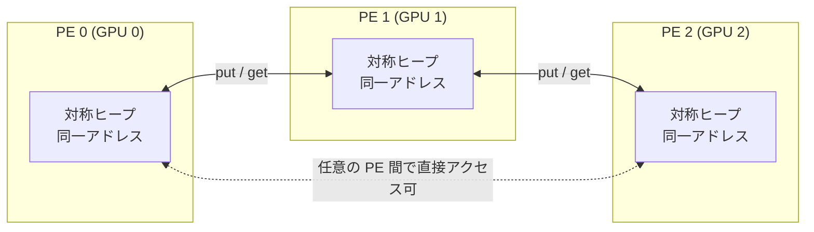
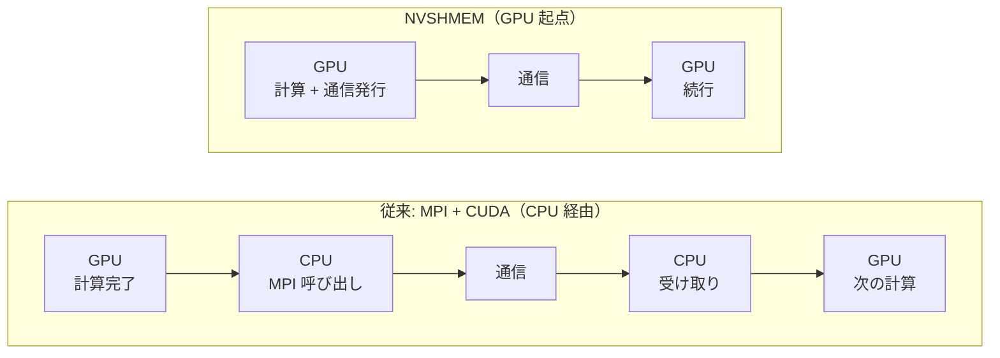
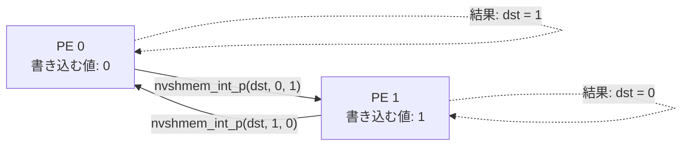

## はじめに

https://developer.nvidia.com/nvshmem

:::message
**この記事のゴール**: NVIDIA の GPU 間通信ライブラリ **NVSHMEM** について、

1. どういうものなのか（PGAS という考え方）
2. なぜ必要なのか
3. 競合となる技術
4. 実際にちょっと動かしてみる完全な手順

の 4 点を、初学者でも全体像がつかめるようにコンパクトにまとめます。深い API の網羅はせず、「概要を理解して、ちょっと動かして感覚を掴む」ことだけを目指します。
:::

複数 GPU を使った計算（大規模 LLM の学習・推論、科学技術計算など）では、**GPU 同士でどうやって速くデータをやり取りするか** が性能を大きく左右します。NVSHMEM はその通信を「GPU 自身が主導して」行うための仕組みです。まずはキーワードである PGAS から見ていきます。

## 1. NVSHMEM とはどういうものか

[NVSHMEM](https://developer.nvidia.com/nvshmem) は、NVIDIA GPU クラスタ向けの並列通信ライブラリです。CPU 向けの通信標準 **OpenSHMEM** の考え方を GPU 向けに実装したもので、複数 GPU のメモリを **1 つの大きなアドレス空間** にまとめて扱えるようにします。


### まず押さえる用語

コードを読む前に、最低限の語彙をそろえておきます。

| 用語 | 意味 |
|---|---|
| **PE（Processing Element）** | 並列実行の単位。NVSHMEM では基本的に 1 PE = 1 GPU。MPI の「ランク」に相当します |
| **put / get** | 通信の基本操作。`put` = 相手のメモリに**書き込む**、`get` = 相手のメモリから**読み出す** |
| **片側通信（One-sided / RMA）** | 送り手だけで通信が完結する方式。送り手が「相手・アドレス・データ」を指定すれば、相手の PE は受け取りの処理を何もしなくてよい。RMA は Remote Memory Access（遠隔メモリアクセス）の略。`MPI_Send`/`MPI_Recv` のように送受信が対になる「両方向（two-sided）通信」と対比される考え方です |
| **対称ヒープ（Symmetric Heap）** | 全 PE が `nvshmem_malloc()` で確保する特別なメモリ領域。**全 PE が同じ引数で確保すれば、同じ変数はどの GPU でも同じアドレスに並ぶ**ため、相手のアドレスを問い合わせずに通信できます |

### キーワード: PGAS（Partitioned Global Address Space）

PGAS（分割されたグローバルアドレス空間）は、NVSHMEM を理解するうえで最重要の概念です。

- **Global Address Space（グローバルアドレス空間）**: すべての GPU のメモリが、1 つの大きな共有メモリのように見える
- **Partitioned（分割された）**: ただし実体は各 GPU に分散しており、「どの領域がどの GPU のものか」は意識できる（自分のローカルは速く、遠くの GPU は通信が必要、という違いは残る）

つまり PGAS とは、**「みんなで共有している 1 枚のメモリに見えるが、実際は各 GPU に分割して置かれている」** というハイブリッドなメモリモデルです。普通の共有メモリのように手軽に書きつつ、分散の実体も意識できる、ちょうど良い抽象化を提供します。

下の図のように、各 PE（GPU）が同じアドレスに対称ヒープを持ち、`put` / `get` でどの PE のヒープへも直接アクセスできます。



実体は各 GPU に物理分割されていますが、プログラムからは「同じ住所の 1 枚のメモリ」のように扱える、という点がポイントです。

### NVSHMEM の特徴

- **GPU 起点の通信**: CUDA カーネルの中（GPU スレッド）から、直接 `nvshmem_put` などを呼んで通信できる。通信のたびに CPU へ制御を戻して同期する必要がない
- **片側通信**: 送り手が「相手・アドレス・データ」をすべて指定すれば、1 対 1 の put/get はそれだけで完結する
- **NVLink / InfiniBand / EFA 対応**: ノード内は NVLink（同一マシン内の GPU を直接つなぐ NVIDIA 専用バス）、ノード間は InfiniBand（HPC 向け高速ネットワーク）や AWS の EFA（低レイテンシネットワーク）など、下回りの高速インターコネクトを自動で使い分ける

## 2. なぜ NVSHMEM が必要なのか

GPU の通信といえば、これまでは **MPI + CUDA** や **NCCL** が主流でした。それらと比べたときの、NVSHMEM の存在意義はこうです。

### 課題: CPU がボトルネックになる

従来の MPI ベースの通信は、ざっくり言うとこういう流れです。

1. GPU カーネルが計算を終える
2. **CPU に制御が戻る**
3. CPU が「このデータを隣の GPU に送れ」と MPI に指示する
4. 通信が終わったら、また GPU カーネルを起動する



MPI では「GPU → CPU → 通信 → GPU」の往復が、通信のたびに発生します。GPU の台数を増やすほど通信回数も増え、この CPU との往復（同期待ち）の累積が支配的になります。その結果、通信回数が多い（＝細かい通信を頻繁に行う）アルゴリズムでは、GPU を増やしても処理速度がそれに比例して上がらなくなります。これを **strong scaling（問題サイズを固定して GPU 数を増やしたときの速度向上）が頭打ちになる**、と言います。

### NVSHMEM の解決策: GPU が自分で通信する

NVSHMEM では、CUDA カーネルの中から GPU スレッドが直接通信を発行できます。

- 通信のたびに CPU へ戻らないので、**起動・同期のオーバーヘッドが減る**
- 計算と通信を細かくオーバーラップさせやすい
- 1 対 1 の put/get は片側通信なので、相手の PE を同期に巻き込まない

結果として、**通信が多く・細かい** ワークロード（例: マルチ GPU の FFT、グラフ処理、分散 LLM の MoE 通信など）で、スケーラビリティが改善します。

:::message
ひとことで言うと、NCCL や MPI が「CPU が指揮する一括の集団通信」が得意なのに対し、NVSHMEM は **「GPU 自身が、細かく・好きなタイミングで通信する」** のが得意です。
:::

## 3. 競合・関連となる技術

NVSHMEM は他の通信技術と排他的ではなく、組み合わせて使うこともよくあります。ユーザーが選ぶ「通信ライブラリ」を 3 つ並べてみます。

| 技術 | 通信の主導 | 通信スタイル | 主な使いどころ |
|---|---|---|---|
| **NVSHMEM** | GPU | 片側（put/get）+ 集団通信 | 細かく頻繁な GPU 間通信、PGAS が活きる場面 |
| **NCCL** | 主に CPU が起動、GPU が実行 | 集団通信中心（all-reduce 等） | ディープラーニングの勾配集約。デファクト標準 |
| **MPI（+ CUDA / GPUDirect）** | CPU | 両方向（send/recv）+ 片側 + 集団通信 | HPC 全般。最も歴史があり汎用的 |

なお **GPUDirect RDMA** は、上記ライブラリの選択肢に並ぶものではなく、「GPU メモリを CPU 経由せずネットワーク越しに直接読み書きする」低レベルの土台技術です。NVSHMEM や NCCL の内部でも使われており、ユーザーが直接選ぶというより、これらのライブラリを支える仕組みだと理解してください（RDMA = Remote Direct Memory Access）。

ざっくりした使い分けの目安:

- ディープラーニングの分散学習（勾配の all-reduce が中心）→ **NCCL**
- 汎用的な HPC、既存の MPI 資産がある → **MPI**
- 細かい GPU 起点通信で strong scaling を伸ばしたい、PGAS で書きたい → **NVSHMEM**

なお NVSHMEM は CPU 向け標準 **OpenSHMEM** の GPU 版という位置づけで、NVIDIA HPC SDK などとも連携します。

## 4. 実際に動かしてみる

ここでは、最小の NVSHMEM プログラムを書いて、**隣の PE（GPU）に自分の番号を `put` で書き込むリング通信** を動かします。確認したいのはただ 1 点、**「CUDA カーネル（GPU の中）から `put` を呼ぶだけで、隣の GPU のメモリに直接書き込める」** という感覚です。

:::details 実行ログ
```bash
% aws ssm start-session --target i-073edb8320a20c07a --region us-west-2

Starting session with SessionId: xxxx-i6f8s6datvijrb8g7yfv6flt5e
$ sudo su -
root@ip-172-31-34-39:~# docker run --gpus all -it --rm --shm-size=8g --ipc=host \
    nvcr.io/nvidia/nvhpc:24.5-devel-cuda12.4-ubuntu22.04 bash

====================
== NVIDIA HPC SDK ==
====================
 
NVIDIA HPC SDK version 24.5
 
Copyright (c) 2024, NVIDIA CORPORATION & AFFILIATES.  All rights reserved.

root@febaf53965c7:/# HPCSDK=/opt/nvidia/hpc_sdk/Linux_x86_64
  VER=$(ls $HPCSDK | sort -V | tail -1)
  CUDAVER=$(ls $HPCSDK/$VER/comm_libs | grep -E '^[0-9]+\.[0-9]+$' | tail
  -1)
  export NVSHMEM_HOME=$HPCSDK/$VER/comm_libs/$CUDAVER/nvshmem
  echo "NVSHMEM_HOME=$NVSHMEM_HOME"
bash: -1: command not found
NVSHMEM_HOME=/opt/nvidia/hpc_sdk/Linux_x86_64/2024/comm_libs/12.4/nvshmem
root@febaf53965c7:/#   HPCSDK=/opt/nvidia/hpc_sdk/Linux_x86_64
  VER=$(ls $HPCSDK | sort -V | tail -1)
  CUDAVER=$(ls $HPCSDK/$VER/comm_libs | grep -E '^[0-9]+\.[0-9]+$' | tail-1)
  export NVSHMEM_HOME=$HPCSDK/$VER/comm_libs/$CUDAVER/nvshmem
  echo "NVSHMEM_HOME=$NVSHMEM_HOME"
bash: tail-1: command not found
NVSHMEM_HOME=/opt/nvidia/hpc_sdk/Linux_x86_64/2024/comm_libs//nvshmem
root@febaf53965c7:/#   HPCSDK=/opt/nvidia/hpc_sdk/Linux_x86_64
  VER=$(ls $HPCSDK | sort -V | tail -1)
  CUDAVER=$(ls $HPCSDK/$VER/comm_libs | grep -E '^[0-9]+\.[0-9]+$' | tail -1)
  export NVSHMEM_HOME=$HPCSDK/$VER/comm_libs/$CUDAVER/nvshmem
  echo "NVSHMEM_HOME=$NVSHMEM_HOME"
NVSHMEM_HOME=/opt/nvidia/hpc_sdk/Linux_x86_64/2024/comm_libs/12.4/nvshmem
root@febaf53965c7:/#   apt-get update && apt-get install -y libpciaccess0
  chmod +x $NVSHMEM_HOME/bin/nvshmrun.hydra $NVSHMEM_HOME/bin/hydra_*
  export PATH=$NVSHMEM_HOME/bin:$PATH
Ign:1 http://linux.mellanox.com/public/repo/mlnx_ofed/5.8-4.1.5.0/ubuntu22.04/amd64 ./ InRelease
Get:2 https://developer.download.nvidia.com/hpc-sdk/ubuntu/amd64  InRelease [2126 B]
Get:3 http://linux.mellanox.com/public/repo/mlnx_ofed/5.8-4.1.5.0/ubuntu22.04/amd64 ./ Release [1323 B]                           
Get:4 http://linux.mellanox.com/public/repo/mlnx_ofed/5.8-4.1.5.0/ubuntu22.04/amd64 ./ Release.gpg [516 B]
Get:5 http://archive.ubuntu.com/ubuntu jammy InRelease [270 kB]                                      
Get:6 http://security.ubuntu.com/ubuntu jammy-security InRelease [129 kB]    
Get:7 https://developer.download.nvidia.com/hpc-sdk/ubuntu/amd64  Packages [31.5 kB]  
Get:8 http://linux.mellanox.com/public/repo/mlnx_ofed/5.8-4.1.5.0/ubuntu22.04/amd64 ./ Packages [29.6 kB]
Get:9 http://security.ubuntu.com/ubuntu jammy-security/main amd64 Packages [4026 kB]      
Get:10 http://security.ubuntu.com/ubuntu jammy-security/restricted amd64 Packages [7221 kB]
Get:11 http://security.ubuntu.com/ubuntu jammy-security/multiverse amd64 Packages [77.8 kB]
Get:12 http://security.ubuntu.com/ubuntu jammy-security/universe amd64 Packages [1307 kB]
Get:13 http://archive.ubuntu.com/ubuntu jammy-updates InRelease [128 kB]        
Get:14 http://archive.ubuntu.com/ubuntu jammy-backports InRelease [127 kB]
Get:15 http://archive.ubuntu.com/ubuntu jammy/restricted amd64 Packages [164 kB]
Get:16 http://archive.ubuntu.com/ubuntu jammy/main amd64 Packages [1792 kB]
Get:17 http://archive.ubuntu.com/ubuntu jammy/multiverse amd64 Packages [266 kB]
Get:18 http://archive.ubuntu.com/ubuntu jammy/universe amd64 Packages [17.5 MB]
Get:19 http://archive.ubuntu.com/ubuntu jammy-updates/universe amd64 Packages [1612 kB]
Get:20 http://archive.ubuntu.com/ubuntu jammy-updates/main amd64 Packages [4361 kB]
Get:21 http://archive.ubuntu.com/ubuntu jammy-updates/multiverse amd64 Packages [86.4 kB]
Get:22 http://archive.ubuntu.com/ubuntu jammy-updates/restricted amd64 Packages [7495 kB]
Get:23 http://archive.ubuntu.com/ubuntu jammy-backports/main amd64 Packages [82.8 kB]
Get:24 http://archive.ubuntu.com/ubuntu jammy-backports/universe amd64 Packages [35.6 kB]
Fetched 46.7 MB in 3s (18.7 MB/s)                            
Reading package lists... Done
W: http://linux.mellanox.com/public/repo/mlnx_ofed/5.8-4.1.5.0/ubuntu22.04/amd64/./Release.gpg: Key is stored in legacy trusted.gpg keyring (/etc/apt/trusted.gpg), see the DEPRECATION section in apt-key(8) for details.
Reading package lists... Done
Building dependency tree... Done
Reading state information... Done
Suggested packages:
  pciutils
The following NEW packages will be installed:
  libpciaccess0
0 upgraded, 1 newly installed, 0 to remove and 113 not upgraded.
Need to get 19.1 kB of archives.
After this operation, 62.5 kB of additional disk space will be used.
Get:1 http://archive.ubuntu.com/ubuntu jammy/main amd64 libpciaccess0 amd64 0.16-3 [19.1 kB]
Fetched 19.1 kB in 0s (757 kB/s)          
debconf: delaying package configuration, since apt-utils is not installed
Selecting previously unselected package libpciaccess0:amd64.
(Reading database ... 40166 files and directories currently installed.)
Preparing to unpack .../libpciaccess0_0.16-3_amd64.deb ...
Unpacking libpciaccess0:amd64 (0.16-3) ...
Setting up libpciaccess0:amd64 (0.16-3) ...
Processing triggers for libc-bin (2.35-0ubuntu3.8) ...
root@febaf53965c7:/# cat > /tmp/ring.cu <<'EOF'
  #include <stdio.h>
  #include "nvshmem.h"
  #include "nvshmemx.h"

  __global__ void ring_put(int *dst) {
      int mype = nvshmem_my_pe();
      int npes = nvshmem_n_pes();
      int peer = (mype + 1) % npes;
      nvshmem_int_p(dst, mype, peer);
  }

  int main(void) {
      nvshmem_init();
      int mype      = nvshmem_my_pe();
      int mype_node = nvshmem_team_my_pe(NVSHMEMX_TEAM_NODE);
      cudaSetDevice(mype_node);
      int *dst = (int *)nvshmem_malloc(sizeof(int));
      ring_put<<<1, 1>>>(dst);
      cudaDeviceSynchronize();
      nvshmem_barrier_all();
      int value;
      cudaMemcpy(&value, dst, sizeof(int), cudaMemcpyDeviceToHost);
      printf("PE %d は、隣の PE から %d を受け取りました\n", mype, value);
      nvshmem_free(dst);
      nvshmem_finalize();
      return 0;
  }
EOF
  cd /tmp
root@febaf53965c7:/tmp# ls
ring.cu
root@febaf53965c7:/tmp#   nvcc -rdc=true -ccbin g++ -gencode=arch=compute_80,code=sm_80 \
    -I $NVSHMEM_HOME/include ring.cu -o ring \
    -L $NVSHMEM_HOME/lib -lnvshmem_host -lnvshmem_device
root@febaf53965c7:  nvshmrun -np 2 ./ring   # 2 GPU 2 GPU
  nvshmrun -np 8 ./ring   # 8 GPU 全部でリング
WARN: init failed for remote transport: ibrc
WARN: init failed for remote transport: ibrc
PE 0 は、隣の PE から 1 を受け取りました
PE 1 は、隣の PE から 0 を受け取りました
WARN: init failed for remote transport: ibrc
WARN: init failed for remote transport: ibrc
WARN: init failed for remote transport: ibrc
WARN: init failed for remote transport: ibrc
WARN: init failed for remote transport: ibrc
WARN: init failed for remote transport: ibrc
WARN: init failed for remote transport: ibrc
WARN: init failed for remote transport: ibrc
PE 0 は、隣の PE から 7 を受け取りました
PE 1 は、隣の PE から 0 を受け取りました
PE 2 は、隣の PE から 1 を受け取りました
PE 5 は、隣の PE から 4 を受け取りました
PE 7 は、隣の PE から 6 を受け取りました
PE 3 は、隣の PE から 2 を受け取りました
PE 4 は、隣の PE から 3 を受け取りました
PE 6 は、隣の PE から 5 を受け取りました
```
::::

:::message alert
**動作環境について（重要・実機で確認済み）**: NVSHMEM のノード内通信は GPU 同士の **P2P アクセス（NVLink もしくは PCIe P2P）** を必要とします。「マルチ GPU インスタンスならどれでも動く」わけではありません。筆者が AWS の 2 種類の GPU インスタンスで実機検証した結果がこちらです。

| 環境 | GPU 間接続 | P2P アクセス可能ペア | マルチ GPU デモ |
|---|---|---|---|
| `g4dn.12xlarge`（T4 ×4） | PCIe・NVLink なし | **0 / 12** | **動かない** |
| `p4d.24xlarge`（A100 ×8） | NVLink + NVSwitch | **56 / 56** | **動く** |

`g4dn` では `cudaDeviceCanAccessPeer` が全ペアで 0 を返し、NVSHMEM 初期化が `Peer GPU 1 is not accessible, exiting` で失敗しました。AWS の **g5 / g4dn のような仮想化された PCIe 接続 GPU では、GPU 間 P2P が無効化されているため複数 PE のデモは動きません**（GPU が 1 台 / P2P 不可の環境では `-np 1` で起動とビルドの確認のみ可能）。

手元でリング通信を体感したい場合は、**NVLink でつながった GPU を持つマシン**（NVIDIA HGX/DGX 系、`p4d` / `p5` などの NVLink 搭載インスタンス）を使ってください。以降のコマンドは p4d（A100 ×8）で実際に動作を確認したものです。

p4d 以外の環境では別の設定等が必要な可能性があります。
:::

### 環境の準備（NVIDIA HPC SDK コンテナが一番ラク）

NVSHMEM を個別にビルドするのは手間なので、**NVSHMEM 同梱の NVIDIA HPC SDK コンテナ** を使うのが初学者には一番簡単です（Docker と NVIDIA Container Toolkit がインストール済みの前提）。

```bash
# HPC SDK コンテナを起動（NVSHMEM・nvcc・ランチャがすべて入っている）
# タグは古くなることがあるので、最新は NGC (catalog.ngc.nvidia.com) で確認してください
# --shm-size と --ipc=host は、ノード内 GPU 間通信に共有メモリを使うため重要（後述）
docker run --gpus all -it --rm --shm-size=8g --ipc=host \
  nvcr.io/nvidia/nvhpc:24.5-devel-cuda12.4-ubuntu22.04 bash
```

:::message
`--shm-size=8g --ipc=host` を付けないと、PE 数が増えたとき（筆者の環境では `-np 4` 以上）に `Bus error (signal 7)` で落ちます。NVSHMEM は同一ノード内の GPU 間通信に共有メモリ（`/dev/shm`）を使うため、Docker デフォルトの 64MB では足りないのが原因です。
:::

コンテナ内で、NVSHMEM のパスを設定します。HPC SDK 24.5 では以下が NVSHMEM 本体です（`find` で探すと cuFFTMp 互換版など別のコピーを拾うことがあるため、パスを決め打ちするのが確実です）。

```bash
# HPC SDK のバージョンを自動取得して NVSHMEM_HOME を決める
HPCSDK=/opt/nvidia/hpc_sdk/Linux_x86_64
VER=$(ls $HPCSDK | sort -V | tail -1)               # 例: 24.5
CUDAVER=$(ls $HPCSDK/$VER/comm_libs | grep -E '^[0-9]+\.[0-9]+$' | tail -1)  # 例: 12.4
export NVSHMEM_HOME=$HPCSDK/$VER/comm_libs/$CUDAVER/nvshmem
ls $NVSHMEM_HOME/include/nvshmem.h && echo "NVSHMEM_HOME=$NVSHMEM_HOME"
```

### サンプルコードを書く

`ring.cu` という名前で、以下を作成します。

```cuda
#include <stdio.h>
#include "nvshmem.h"    // NVSHMEM 本体の API
#include "nvshmemx.h"   // NVSHMEMX_TEAM_NODE などの拡張 API

// 各 GPU（PE）が、自分の番号を「隣の PE」のメモリに put で書き込むカーネル
__global__ void ring_put(int *dst) {
    int mype = nvshmem_my_pe();        // 自分の PE 番号
    int npes = nvshmem_n_pes();        // PE の総数
    int peer = (mype + 1) % npes;      // 隣（次）の PE（最後は 0 に折り返す）

    // 自分の番号 mype を、隣の PE の dst に書き込む（片側通信の put）
    // _p は put の意味で、int 1 個を相手のメモリに書き込む
    nvshmem_int_p(dst, mype, peer);
}

int main(void) {
    nvshmem_init();                                  // 初期化

    int mype      = nvshmem_my_pe();                 // 全 GPU 通しの番号（グローバル PE 番号）
    int mype_node = nvshmem_team_my_pe(NVSHMEMX_TEAM_NODE);
                                                     // ノード内での番号（= 使う GPU の番号）
    cudaSetDevice(mype_node);                        // その番号の GPU を選ぶ

    // 対称ヒープ上にメモリを確保（全 PE が同じアドレスで持つ）
    int *dst = (int *)nvshmem_malloc(sizeof(int));

    ring_put<<<1, 1>>>(dst);                         // カーネル起動（put を発行）
    cudaDeviceSynchronize();                         // カーネル完了を待つ
    nvshmem_barrier_all();                           // 全 PE の put 完了を保証（ホスト側バリア）

    // 結果を CPU 側にコピーして表示
    int value;
    cudaMemcpy(&value, dst, sizeof(int), cudaMemcpyDeviceToHost);
    printf("PE %d は、隣の PE から %d を受け取りました\n", mype, value);

    nvshmem_free(dst);                               // 後片付け
    nvshmem_finalize();
    return 0;
}
```

注目してほしいのは、`ring_put` カーネルの中（＝ GPU の中）から `nvshmem_int_p`（put）を呼んでいる点です。GPU が、CPU に通信を依頼することなく、自分で隣の GPU のメモリに書き込みます。これが NVSHMEM の「GPU 起点の片側通信」です。

`dst` は対称ヒープ上にあるので、PE 0 でも PE 1 でも同じアドレス値を持ちます。だから相手の `dst` のアドレスを問い合わせる必要がなく、`peer` 番号だけ指定すれば書き込めます。put を発行したあとは `nvshmem_barrier_all()` で全 PE の書き込み完了をそろえてから、結果を確認しています（最後に CPU へコピーするのは、あくまで結果を `printf` で表示するためです）。

リング通信のイメージは次の通りです（PE が 2 個の場合）。



### コンパイル

`-rdc=true` は「GPU 側のコードを後からリンクできる形式でコンパイルする」オプションで、NVSHMEM のように複数ファイルにまたがる GPU コードを扱うために必要です。今は「NVSHMEM を使うときの定型オプション」として覚えておけば十分です。

```bash
# GPU の世代に合わせて compute capability を指定する（下記参照）
nvcc -rdc=true -ccbin g++ \
  -gencode=arch=compute_80,code=sm_80 \
  -I $NVSHMEM_HOME/include \
  ring.cu -o ring \
  -L $NVSHMEM_HOME/lib -lnvshmem_host -lnvshmem_device
```

:::message
`arch=compute_80,code=sm_80` は **GPU の世代（compute capability）に必ず合わせて**ください。例: A100 は `80`、H100 は `90`、L4/L40S は `89`、T4 は `75`。確認するには `nvidia-smi --query-gpu=compute_cap --format=csv` を実行します。世代が合っていないと実行時に動きません。
:::

### 実行

NVSHMEM 付属のランチャ `nvshmrun` で、PE 数（= 使う GPU 数）を `-np` で指定します。

:::message alert
HPC SDK コンテナの素の状態では、`nvshmrun` がそのまま動かないことがあります（筆者の検証環境では実行権限が無く、依存ライブラリ `libpciaccess0` も未インストールでした）。動かない場合は以下を一度だけ実行してください。
:::

```bash
# nvshmrun が動かない場合の準備（コンテナ内で一度だけ）
apt-get update && apt-get install -y libpciaccess0
chmod +x $NVSHMEM_HOME/bin/nvshmrun.hydra $NVSHMEM_HOME/bin/hydra_*
export PATH=$NVSHMEM_HOME/bin:$PATH

# 2 GPU でリング通信を実行（NVLink 環境が必要）
nvshmrun -np 2 ./ring
```

NVLink 環境（p4d, A100 ×8）での実際の出力（PE の順序は前後することがあります。`WARN: init failed for remote transport: ibrc` は、ノード内のみ使う今回は InfiniBand を使わないという通知なので無視して構いません）:

```text
PE 0 は、隣の PE から 1 を受け取りました
PE 1 は、隣の PE から 0 を受け取りました
```

PE 0 には隣（PE 1）が自分の番号 `1` を書き込み、PE 1 には PE 0 が `0` を書き込んだ、という結果です。GPU 同士が、データの書き込みを CPU に依頼することなく直接行ったことが確認できます。

PE 数を増やせば、リングがそのまま大きくなります。8 GPU で実行すると、各 PE が「自分の 1 つ前の PE の番号」を受け取り、きれいに循環します。

```bash
nvshmrun -np 8 ./ring
```

```text
PE 0 は、隣の PE から 7 を受け取りました
PE 1 は、隣の PE から 0 を受け取りました
PE 2 は、隣の PE から 1 を受け取りました
...
PE 7 は、隣の PE から 6 を受け取りました
```

一方、GPU が 1 台しかない、または P2P が使えない環境（前述の g5/g4dn など）では、単一 PE で起動の確認だけできます。

```bash
nvshmrun -np 1 ./ring
# => PE 0 は、隣の PE から 0 を受け取りました（隣 = 自分自身なので 0）
```

## まとめ

- **NVSHMEM** は、複数 GPU のメモリを 1 つの **PGAS（分割グローバルアドレス空間）** として扱い、GPU 自身が片側通信（put / get）でデータをやり取りできるライブラリ
- キーワードは **PGAS / 対称ヒープ / PE / 片側通信**。全 PE が同じ引数で確保した対称ヒープ上の変数は、どの GPU でも同じアドレスに並ぶため、相手のアドレスを問い合わせずに通信できる
- 通信のたびに **CPU へ戻って同期する必要がない GPU 起点の通信** により、通信が細かく頻繁なワークロードで strong scaling を伸ばせるのが存在意義
- 集団通信中心の **NCCL**、汎用 HPC の **MPI** とは得意分野が異なり、使い分け・併用する
- HPC SDK コンテナを使えば、最小サンプルを数分でビルドできる。ただし複数 GPU のデモには **NVLink（または PCIe P2P が有効な）環境** が必要で、AWS の g5/g4dn のような仮想化 PCIe 環境では動かない点に注意

### 参考リンク

- [NVSHMEM 製品ページ（NVIDIA Developer）](https://developer.nvidia.com/nvshmem)
- [NVSHMEM ドキュメント / API リファレンス](https://docs.nvidia.com/nvshmem/api/index.html)
- [OpenSHMEM 仕様（NVSHMEM の元になった CPU 向け標準）](http://www.openshmem.org/)