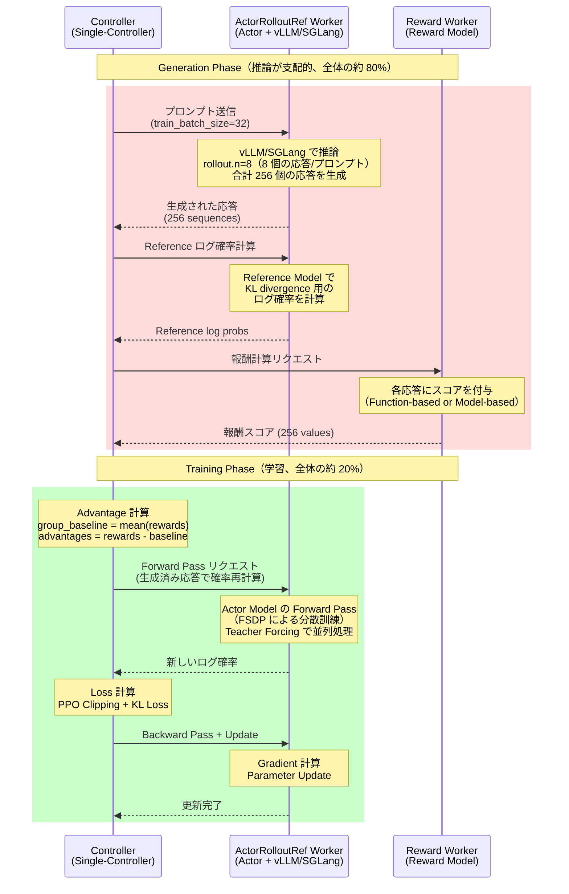
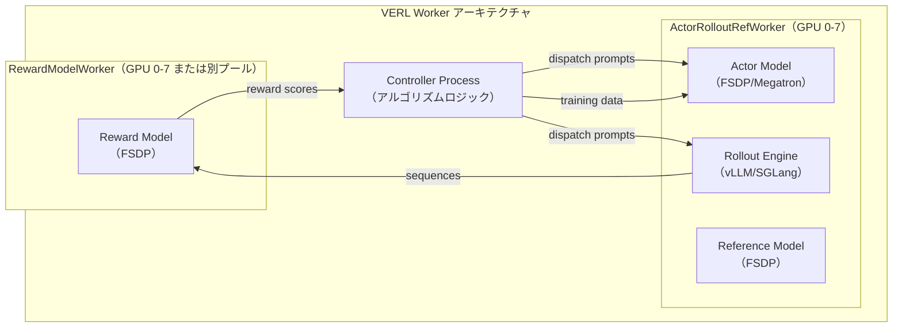
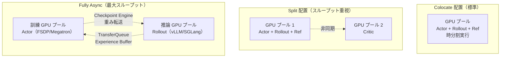

## はじめに

https://verl.readthedocs.io/en/latest/blog/v0.7.html

:::message
この記事は、Verl v0.7 のリリースノートブログを ML インフラストラクチャ視点で整理・解説したものです。重要なアップデートに焦点を当てて整理します。強化学習の理論面は専門外ですが、インフラ設計の観点から整理してみます。リリースノートのブログ自体が非常にわかりやすいのでそちらも併せて読むことをお勧めします。
:::

Verl は、GRPO、DPO、CISPO、SAPO などの強化学習ベースの LLM ポストトレーニング手法を大規模クラスタで実行するためのフレームワークです。本記事では v0.7 の重要なアップデートに絞って解説します。

前提知識として強化学習アルゴリズムの基礎は理解しているものとします。以下はこれまでの強化学習の背景や基礎的な内容を把握する上で非常にわかりやすかったです。

https://note.com/olachin/n/n9706c13c8678

リリースノートに登場する CISPO、SAPO は以下の論文で提案されています。

https://arxiv.org/html/2506.13585v1

https://arxiv.org/html/2511.20347v2

## Generation/Training フェーズ

全てのアルゴリズムに共通するかは把握できていませんが強化学習ベースのポストトレーニング手法には特徴があります。これらの手法では、**推論（Generation Phase）が訓練時間の約 80% を占める**ことです。つまり、コストにおいても Generation phase を無視することはできません。Generation/Training でリソースをうまくシェアする、フェーズに応じてアロケーションの仕方を変える、別の計算リソースを利用する、といった視点が重要になってくると認識しています。

::::details Genration phase のコスト

https://github.com/OpenRLHF/OpenRLHF

https://github.com/deepspeedai/DeepSpeed/blob/master/blogs/deepspeed-chat

:::message alert
[DeepSpeed-Chat の分析](https://github.com/deepspeedai/DeepSpeed/blob/master/blogs/deepspeed-chat/README.md)によると、**FLOPs** では Generation が 20%、Training が 80% ですが、**wall-clock time** では逆転します。Generation は各トークン生成ごとにモデル重み（例: 140 GB）をメモリから読み込む必要があり、**メモリバウンド**で GPU の計算性能を活かせません。一方、Training は Forward + Backward Pass で大量の演算を実行し、**計算バウンド**で GPU をフル活用できます。この違いにより、計算量は少ないが実時間では Generation が約 80% を占めるようです。
:::

**コストへの影響**

同じ GPU を使用する場合、実行時間がそのままコストに比例するため、**Generation Phase がコストの約 80% を占めます**。例えば 8 GPU で $100/h/GPU の場合、総コスト: $800/h、Generation Phase: $640/h（80%）、Training Phase: $160/h（20%）、になるということです。

これが、Verl v0.7 で推論エンジンの最適化（Rollout Engine の server mode 移行、vLLM/SGLang 統合）が重視される理由です。**推論の最適化こそが、RLHF/GRPO におけるコスト削減の本質**であり、Verl の設計思想もこの特性を深く理解した上で構築されています。
::::

### GRPO のフェーズ

GRPO の訓練プロセスは、**Generation Phase** と **Training Phase** の 2 つのフェーズから構成されます。[Verl の公式ドキュメント](https://verl.readthedocs.io/en/latest/algo/grpo.html)によると、GRPO は各プロンプトに対して複数の応答を生成し、それらの報酬を相対的に評価することで、Critic ネットワークなしでポリシーを更新します。

::::details GRPO の処理フロー

::::

**Generation Phase** では、各プロンプトに対して複数の応答を生成し、**ActorRolloutRefWorker** が Actor、Rollout（推論エンジン）、Reference Model を統合しており、以下の処理を実行します。1. 各プロンプトに対して `rollout.n` 個の応答を生成します。**v0.7 では server mode に移行**し、vLLM/SGLang などの最新の推論バックエンドと統合され、デフォルトでオフラインではなくオンラインサービスとして動作してマルチターンの会話のスループット効率が向上します。2. 訓練開始時の初期ポリシー（Reference Model）を使用して、生成された応答ログ確率を計算します。これは KL divergence 計算に使用され、ポリシーの急激な変化を防ぎます。3. RewardManager が各応答にスコアを付与します。Function-based（ルールベース）または Model-based（学習済みモデル）の報酬計算がサポートされています。

:::message
Generation Phase は自己回帰生成のため逐次処理が必要です。前述の通り、この Phase がメモリバウンドであるため訓練時間の大半を占めます。v0.7 の server mode 移行により vLLM などとの統合が図られました。
:::

:::message
**vLLM と統合されたことでコスト影響の大きい Generation phase が疎結合化され、vLLM 側の推論技術の重要性がポストトレーニング側でも重要になってきていると感じました。AWS Neuron 推しの私としては vLLM が AWS Neuron に対応していることから Trainium などを利用することで Generation フェーズをお安くできないか、今後調査してみたいです。**
:::

**Training Phase** では、生成された応答と報酬を使用して Actor モデルのポリシーを更新します。アルゴリズムの解説がメインではないので詳細は割愛します。Training Phase は Forward + Backward Pass を含みますが、生成済みの完全なシーケンスに対して並列処理が可能なため、Generation Phase より高速です。

:::message alert
このように、Generation Phase はメモリバウンド・逐次処理、Training Phase は計算バウンド・並列処理、であり、異なる特性を持ちます。これら 2 つのフェーズを効率的に管理するインフラが、GRPO のようなポストトレーニング手法では重要です。
:::

## Verl のアーキテクチャ概要

Verl の中心的な設計思想は **Hybrid-Controller アーキテクチャ（HybridFlow）** です。Single-Controller（オーケストレーション層）と Multi-Controller（分散計算層）の 2 層構造により、訓練全体の流れを制御しながら、各コンポーネント（Actor、Rollout、Reward）を独立して並列実行できます。


Verl は以下の 4 つのコア・コンポーネントで構成されています。

| コンポーネント | 役割 | v0.7 での主な変更 |
|---|---|---|
| Model Engine | 訓練バックボーン（FSDP/Megatron-Core/VeOmni） | FP8 訓練、VLM 対応、LoRA サポート |
| Rollout Engine | 推論エンジン（vLLM/SGLang/TensorRT-LLM） | SPMD → server mode 移行、FP8 量子化 |
| TransferQueue | ゼロコピーテンソル転送 | シリアライゼーション最適化、マルチパーティション対応 |
| Checkpoint Engine | 重み同期エンジン | NCCL/NIXL バックエンド統合、ストリーミング転送 |

v0.7 のリリースノートでは、これらのコンポーネントに対する多数の改良が報告されています。

### HybridFlow と Worker アーキテクチャ

VERL の核心的な設計原則は、**制御フロー（アルゴリズムロジック）と計算フロー（ニューラルネットワーク演算）の分離**です。Single-process controller がアルゴリズムロジックを実行し、Multi-process workers が GPU 上でニューラルネットワーク演算を並列実行します。

中核となるのは `ActorRolloutRefWorker` クラスで、`role` パラメータに応じて Actor（ポリシー訓練）、Rollout（推論エンジン）、Reference（KL 制約用ログ確率計算）の 3 つの役割を 1 つの GPU セット上で切り替えて実行できるハイブリッドエンジンとして機能します。



GPU リソースは `ResourcePoolManager` が管理します。`resource_pool_spec` で各プールのノード構成を定義し、Role（Actor, Critic, Reward Model 等）をプールにマッピングします。

```python
# Resource Pool 設定例
resource_pool_spec = {
    "global_pool": [8, 8, 8, 8],  # 4 ノード x 8 GPU: Actor/Rollout/Ref 共有
    "reward_pool": [8, 8],         # 2 ノード x 8 GPU: Reward Model 専用
}
```

`max_colocate_count` パラメータ（デフォルト 3）により、actor_critic_ref、rollout、reward model の 3 つの WorkerGroup を同一 GPU 上に共存させることができます。Reward Model を別プールで専用実行しながら、Actor/Rollout/Ref は同一 GPU セットで時分割実行するという柔軟な構成が可能です。

次のセクションでは、特に重要な 5 つのアップデートを詳しく解説します。

## v0.7 の重要なアップデート

v0.7 では 5 つの主要なアップデートが導入されました。これらは相互に関連しており、以下のような関係性があります：

1. **Rollout Engine の server mode 移行**が起点となり、推論エンジンを独立プロセスに分離
2. **Checkpoint Engine** と **TransferQueue** が、分離された訓練・推論プロセス間の効率的なデータ転送を支援
3. これらのインフラコンポーネントにより **Fully async パイプライン**として統合され、大規模クラスタでの並列性を最大化
4. 新しい RL アルゴリズム **CISPO** と **SAPO** が追加され、GRPO の課題を解決

以下では、各アップデートについて「実装の"なぜ"」を中心に解説します。

### 1. Rollout Engine の server mode 移行

前述の通り、これらの強化学習ベースのポストトレーニング手法では Generation Phase（推論）が訓練時間の大半を占めるため、推論エンジンの効率化がフレームワーク全体の性能に直結します。v0.6 以前の Rollout Engine は SPMD（Single Program Multiple Data）アーキテクチャを採用していました。SPMD では全プロセスが同じコードを実行し、静的バッチングによって推論を行います。

SPMD の本質的な問題は、全 GPU が同期的に同じバッチを処理する点にあります。バッチ内の最長シーケンスに合わせてパディングが必要になるため、短いシーケンスが多い場合に GPU 利用率が大きく低下します。これらのアルゴリズムでは 1 プロンプトから複数（例: 5-64 個）の応答を生成しますが、生成される応答のシーケンス長は大きくばらつきます。SPMD では最長の応答が完了するまで全 GPU が待機するため、短い応答を生成した GPU は遊休状態になります。さらに、バッチ全体が完了するまで結果を返せないため、リクエストの到着パターンに柔軟に対応できず、スループットも制限されます。

v0.7 では、Rollout Engine が server mode（オンラインサービングモード）に移行しました。server mode では、推論エンジンが独立したプロセスとして起動し、訓練プロセスからサンプル単位でリクエストを受け付けます。バックエンドとして vLLM、SGLang、TensorRT-LLM などの高性能推論エンジンを利用できるため、Continuous Batching（動的バッチング）による GPU 利用率の向上が実現します。


Continuous Batching では、推論エンジンが到着したリクエストを動的にバッチに詰め込みます。あるサンプルが完了したら即座に結果を返し、空いたスロットに新しいリクエストを追加します。これにより、パディングによる無駄が最小化され、GPU 利用率が大幅に向上します。これは Verl 独自のイノベーションというより、vLLM/SGLang のオンライン推論機能を訓練パイプラインに組み込んだ設計判断です。

また、v0.7 では `AgentLoopBase` 抽象化も導入されました。`SingleTurnAgentLoop` は従来の単一ターンの応答生成に対応し、`ToolAgentLoop` はツール呼び出しを含む複数ターンのエージェントタスクに対応します。これにより、SWEAgent や GUIAgent のような複雑なエージェント行動の学習が可能になりました。

設定は Hydra CLI で行います。`actor_rollout_ref.rollout.name=vllm` を指定することで vLLM バックエンドが有効化されます。Tensor Parallel サイズは `actor_rollout_ref.rollout.tensor_model_parallel_size=8` で制御できます。

::::details v0.6 以前の 3D-HybridEngine（時分割実行）からの進化

v0.6 以前の VERL は、3D-HybridEngine と呼ばれるアーキテクチャにより、同一 GPU セット上で Generation Phase と Training Phase を時分割で実行していました。これは GPU 数を 50% 削減できるメモリ効率の高い設計でした。

**時分割実行のフロー**:

1. **Generation Phase 開始**: FSDP モデルから state_dict を取得 → CPU にオフロード → vLLM/SGLang を Wake Up → CUDA IPC で重みを Zero-copy 転送 → KV Cache をリストア
2. **Generation 実行**: vLLM/SGLang で高速推論
3. **Training Phase 開始**: vLLM/SGLang を Sleep（KV Cache 解放） → FSDP モデルを GPU にロード → Optimizer をロード
4. **Training 実行**: PPO/GRPO 更新

切り替えコストは CUDA IPC（Inter-Process Communication）による Zero-copy 転送のため、モデルサイズに応じて異なります。大規模モデル（DeepSeek-V3 671B クラス）で約 5-10 秒、中規模モデル（Llama-3.1-70B クラス）で約 1-2 秒程度の切り替え時間が想定されます。

v0.7 の server mode は、この時分割実行の延長線上にあります。v0.6 以前は同一プロセス内での切り替えでしたが、v0.7 では推論エンジンを独立プロセスに分離することで、Continuous Batching の恩恵を受けられるようになりました。この分離に伴い、Checkpoint Engine による効率的な重み同期メカニズムが必要になった、という経緯です。

::::

### 2. Checkpoint Engine による重み同期の最適化

Checkpoint Engine が v0.7 で重要な理由は、Rollout Engine の server mode 移行と直結しています。v0.6 以前の SPMD モードでは、訓練と推論が同一プロセス内で時分割実行されていたため、重みはメモリ上で共有されており、転送は比較的単純でした。しかし server mode では推論エンジンが独立プロセスになったため、訓練で更新された Actor モデルの重みを別プロセスの推論サーバーに「送る」仕組みが必須になりました。これらのアルゴリズムでは各訓練ステップ後に重みを同期する必要があるため、この転送が効率化の鍵となります。

大規模モデル（例えば 70B パラメータ）では重みが 140GB 以上になるため、効率的な転送メカニズムが必要です。従来の方式では GPU → CPU → 中間ストレージ → CPU → GPU という多段コピーが発生し、転送時間が数分に及ぶこともあります。ノード数が増えるとこの転送がボトルネックになり、スケーラビリティに限界がありました。

v0.7 では、Checkpoint Engine が導入され、ノード間のパラメータ同期が統一抽象化されました。Checkpoint Engine は、訓練ノードと推論ノード間で NCCL または NIXL を使用して GPU メモリを直接転送します。これにより、ファイルシステムを経由せず、GPU → GPU のゼロコピー転送が実現します。


NCCL バックエンドは broadcast 方式で、1 つの訓練ノードから複数の推論ノードへ一斉に重みを配信します。同一ノード内や NVLink/NVSwitch で接続された環境では特に効率的です。一方、NIXL バックエンドはポイントツーポイント（P2P）方式で、より柔軟なノード間転送が可能です。NIXL は NVIDIA が開発したライブラリで、ノード間のストリーミング転送に向いています。

大規模モデルでは、重みをパーティション単位に分割してストリーミング転送する機能もサポートされています。例えば 140GB のモデルを 1GB ずつ分割して転送することで、メモリピーク使用量を抑えながら並列転送できます。

::::details Checkpoint Engine の内部アーキテクチャ

Checkpoint Engine は 4 つのバックエンドを提供しており、配置パターンに応じて使い分けます。

| バックエンド | トポロジー | 用途 | 特徴 |
|---|---|---|---|
| Naive（Colocate） | ローカルメモリ | On-policy 同居配置 | 最小オーバーヘッド |
| NCCL | Broadcast | 固定クラスタ Off-policy | 高帯域幅 |
| HCCL | Broadcast | Ascend NPU | NPU 対応 |
| NIXL | Ring P2P | Elastic rollout | 動的トポロジー |

NCCL バックエンドの内部では、**コントロールプレーンとデータプレーンが分離**されています。コントロールプレーンは ZeroMQ の PUB/SUB パターンで Bucket メタデータ（テンソル名、形状、dtype、オフセット）を配信し、データプレーンは NCCL Broadcast で実際のテンソルデータを転送します。受信側の Rollout Worker では、次の Bucket を受信しながら前の Bucket のテンソルを yield するパイプライン方式により、転送と処理をオーバーラップさせています。

**パフォーマンス**（公式リリースノートより引用）:

Qwen3-30B モデルでの測定結果：

| 構成 | スループット | 所要時間 |
|---|---|---|
| 32 H100 GPU（NCCL/NIXL） | 8.25 GB/s | 約 7 秒 |
| 32 Ascend 910C NPU（HCCL） | 5.3 GB/s | 約 11 秒 |

Bucket ベース転送は、per-tensor 方式と比較して **60% 以上のオーバーヘッド削減**を達成しています（7B, 30B, 235B モデルで検証）。

::::


### 3. TransferQueue のゼロコピー転送と RDMA 対応

Verl では、Ray Actor 間でテンソル（生成されたトークン、報酬値など）を頻繁に転送します。v0.6 以前は、Python の `ray.get()` と `ray.put()` を使用していました。Ray の `ray.put()` は Python pickle でオブジェクトをシリアライズし、Ray Object Store（共有メモリ）に格納します。PyTorch テンソル（数百 MB 〜数 GB）を pickle する場合、CPU でのシリアライズと Object Store へのコピーが大きなオーバーヘッドになります。さらに、GPU → CPU → Ray Object Store → CPU → GPU という多段コピーが発生し、メモリ帯域幅を無駄に消費していました。

大規模クラスタでは、このテンソル転送がボトルネックとなり、全体のスループットを制限します。特に Fully async パイプラインでは、訓練ノードと推論ノード間で Experience Buffer（生成されたトークン列と報酬のペア）を大量に転送するため、転送効率が重要になります。

v0.7 では、TransferQueue の最適化が進みました。TransferQueue は、制御フロー（コントローラ）とデータフロー（テンソル転送）を分離します。Ray のメッセージパッシング（`ray.get()`/`ray.put()`）は制御信号のみに使用し、実際のテンソルデータは別の経路で転送します。


TransferQueue は PyTorch テンソルに特化することで、pickle を回避しゼロコピー転送を実現します。バックエンドとして ZeroMQ、NIXL、Ray RDT をサポートしています。AWS 環境では EFA（Elastic Fabric Adapter）経由で RDMA を活用可能です。RDMA を使用すると、GPU メモリを直接ノード間で転送でき、CPU オーバーヘッドを最小化できます。

また、大規模テンソル（数 GB）を複数パーティションに分割して並列転送する機能もサポートされました。例えば 10GB のテンソルを 256MB ずつ分割して転送することで、ネットワーク帯域幅を最大限活用できます。TransferQueue はまだ実験的機能（experimental）であり、一部の構成では不安定な場合があります。本番環境では、まず小規模で検証することを推奨します。

### 4. Fully async パイプラインの実装

v0.6 以前の Verl では、On-policy パイプライン（Generation → Training をシリアル実行）と One-step-off-policy パイプライン（1 ステップずらして並列実行）の 2 つがサポートされていました。On-policy は実装がシンプルですが、訓練と推論を同じ GPU で時分割実行するため効率が低くなります。One-step-off-policy は Generation と Training を 1 ステップずらすことで並列化し、20-40% の効率向上を実現しますが、リソースは部分的にしか分離されていません。

大規模クラスタ（128+ GPU）では、これらのパイプラインに限界がありました。訓練と推論のリソース要件が異なるため、どちらかが遊休状態になりリソース利用率が低下します。ノード数が増えるにつれて同期待ちが増加し、特にマルチターンエージェントのような推論時間が長いタスクでは、一方のリソースが遊休状態になる時間が無視できなくなります。

v0.7 では、Fully async パイプラインが導入されました。これは、訓練と推論のリソースを完全に分離し、ストリーミングデータ転送によってパイプライン並列化を実現する設計です。訓練ノードと推論ノードが完全に独立しているため、訓練は p5.48xlarge（GPU）、推論は trn2.48xlarge（Trainium）のように異なるインスタンスタイプを使用できます。


Fully async パイプラインの鍵は Staleness 制御です。Verl の staleness パラメータ（`staleness_threshold`）は 0.0-1.0 のスケールで指定します。`staleness_threshold=0` は同期的（更新後の重みでのみ推論）を意味し、`staleness_threshold=0.5` は「最大 1.5 倍のサンプル生成を古い重みで許容」を意味します。推論側は最新の重みを待たず、少し古いモデルで Generation を続行することで、訓練と推論の同期待ちを最小化し、両方のリソースを常にフル稼働させられます。

TransferQueue と Checkpoint Engine を活用することで、訓練と推論の間でデータと重みを非同期に転送します。Experience Buffer（生成されたトークン列と報酬のペア）は TransferQueue でストリーミング転送され、更新された重みは Checkpoint Engine で GPU 間直接転送されます。

リリースノートによると、Fully async は On-policy と比較して大幅なスループット向上を達成しています。128 GPU での実験では 2.35x から 2.67x の速度向上が報告されています（測定環境: DAPO アルゴリズム、Qwen2.5-Math-7B, 128 H20 GPU）。設定は Hydra CLI で行い、`async_training.staleness_threshold=0.5` のように指定します。staleness を大きくしすぎると、古いポリシーで生成されたデータが訓練に使用され、学習の安定性が低下する可能性があります。

::::details GPU 数別スケーリング性能と Worker 配置パターン

**GPU 数別の Fully async 速度向上**:

| GPU 数 | 同期モード比 速度向上 |
|---|---|
| 32 GPU | 1.72x |
| 64 GPU | 2.09x |
| 128 GPU | 2.35x - 2.67x |

GPU 数が増えるほど速度向上の効果が大きくなります。これは、同期モードではノード間の同期待ちがスケールに比例して増加するのに対し、Fully async ではこの同期オーバーヘッドが排除されるためです。

**VERL の 3 つの Worker 配置パターン**:

Fully async は VERL が提供する 3 つの配置パターンの最も積極的な構成です。



- **Colocate 配置**: 全ロールを同一 GPU プールで時分割実行します。メモリ効率重視で GPU 数を 50% 削減可能です。v0.6 以前の標準構成です
- **Split 配置**: Actor/Rollout と Critic を別プールに分離し非同期実行します。スループットとメモリ効率のバランスが良い構成です
- **Fully Async**: Trainer と Rollouter を完全分離します。128 GPU で 2.67x の速度向上を達成しました。v0.7 の主要アップデートです

v0.7 の Fully async パイプラインは、Checkpoint Engine と TransferQueue という 2 つのインフラコンポーネントによって実現されています。Checkpoint Engine が重みの同期を、TransferQueue が Experience Buffer の転送をそれぞれ担当し、訓練と推論の完全な非同期実行を可能にしています。

::::

### 5. Algorithm: CISPO と SAPO の追加

v0.7 では、GRPO の課題を解決する 2 つの発展的アルゴリズムが追加されました。

**CISPO（Clipped IS-weight Policy Optimization）** は、Importance Sampling の重み自体をクリップします。従来の GRPO はトークンレベルでの更新値をクリップしていましたが、CISPO は重要度サンプリング重みをクリップすることで、より安定した学習を実現します。リリースノートによると、CISPO は他の競合 RL 手法を上回るパフォーマンスを示しています。

**SAPO（Soft Adaptive Policy Optimization）** は、GRPO の「ハードなトークンレベルクリッピング」を温度制御されたソフトゲーティングに置き換えます。ハードクリッピングでは、閾値を超えたトークンの勾配が完全に切り捨てられるため、学習効率が低下します。SAPO は連続的な信頼領域を形成し、高度にオフポリシーなトークンのみを選択的に下げ加重することで、より情報的で安定した更新を実現します。特に MoE（Mixture of Experts）モデルにおいて、トークンレベルの重要度比の高分散問題に効果的です。

これらのアルゴリズムは Verl に統合されており、Hydra CLI で `policy_loss=cispo` または `policy_loss=sapo` と指定することで利用できます。GRPO との比較実験も実施されており、同一の設定下（Qwen2.5-0.5B-Base、バッチサイズ 256、コンテキスト長 8192、gsm8k データセット）で性能が評価されています。

::::details GRPO 固有の効率化と v0.7 での改善

GRPO（Group Relative Policy Optimization）は PPO と比較して Critic モデルが不要という特徴がありますが、v0.7 の機能により さらなる効率化が可能になりました。

**GRPO の効率化機会**:

| 手法 | v0.7 での対応 | 効果 |
|------|-------------|------|
| **Prefix Caching** | `enable_prefix_caching: true` | 同一プロンプト KV-cache 再利用 |
| **Continuous Batching** | server mode デフォルト | group 内の異なる長さを効率処理 |
| **Critic 不要** | リソースプール簡素化 | GPU メモリ 30-40% 節約 |
| **async mode** | Fully async パイプライン | 2.67x スループット向上 |

**Prefix Caching の重要性**:

GRPO では同一プロンプトに対して複数の応答（例: `group_size=8`）を生成します。v0.7 の Prefix Caching により：

- 最初の応答生成時にプロンプトの KV-cache を計算
- 2 個目以降の応答生成では KV-cache を再利用
- `group_size=8` なら 7/8 = **87.5% のプロンプト処理を削減**

```yaml
rollout:
  name: vllm
  enable_prefix_caching: true  # GRPO では必須
  gpu_memory_utilization: 0.6  # KV-cache 用メモリを多めに確保
  mode: async
```

**リソースプールの簡素化**:

PPO では Actor と Critic の両方が必要ですが、GRPO は Critic 不要のため：

```python
# GRPO の場合: Actor/Rollout/Ref のみ
resource_pool_spec = {
    "global_pool": [8, 8, 8, 8],  # 4 ノード x 8 GPU
}
mapping = {
    Role.ActorRollout: "global_pool",
    Role.Ref: "global_pool",       # Critic 不要
    Role.RewardModel: "global_pool",
}
```

Critic 用 GPU が不要なため、全リソースを Actor/Rollout/Ref に集中でき、Split Placement の場合でも Actor 側により多くの GPU を割り当て可能です。

**v0.7 の Fully async との組み合わせ**:

```yaml
# GRPO + Fully async の推奨構成
async_training:
  staleness_threshold: 0.5  # 適度な非同期性
actor_rollout_ref:
  actor:
    strategy: fsdp2
  rollout:
    name: vllm
    enable_prefix_caching: true
    enable_chunked_prefill: true
    mode: async
```

GRPO の軽量な設計（Critic 不要）と v0.7 の Fully async パイプラインを組み合わせることで、大規模クラスタでの高効率訓練が実現します。

::::

## AWS での実践的活用

v0.7 の新機能、特に Fully async パイプラインは、AWS の異種インスタンス構成と組み合わせることでコスト最適化が可能です。

### Fully async + Trainium/GPU 混在構成

前述の通り、これらの強化学習ベースのポストトレーニング手法では推論が支配的なワークロードです。Verl の Fully async パイプラインは訓練と推論を完全に分離するため、それぞれに最適なインスタンスタイプを選択できます。

推奨構成:

```text
┌──────────────────────────────────────────────────────────┐
│  Amazon EKS / Amazon SageMaker HyperPod                  │
│                                                          │
│  [GPU Node Pool] p5.48xlarge x 8                         │
│  ├── Verl Model Engine（Actor 訓練）                      │
│  ├── FSDP/Megatron-Core                                  │
│  └── Checkpoint Engine（重み同期）                        │
│                                                          │
│  [Trainium Node Pool] trn2.48xlarge x 4-8                │
│  ├── Verl Rollout Engine（vLLM server mode）             │
│  ├── Reference Model 推論（重み固定）                     │
│  └── Reward Model 推論（重み固定）                        │
│                                                          │
│  [Storage] Amazon FSx for Lustre                         │
│  └── モデル重み、チェックポイント、Experience Buffer      │
└──────────────────────────────────────────────────────────┘
```

Actor Model の訓練は p5.48xlarge（GPU）で行います。訓練は GPU が最適です。Actor Model の推論も p5.48xlarge（GPU）を使用します。重みが頻繁に更新されるため、GPU で推論を続ける方が効率的です。一方、Reference Model と Reward Model は重みが固定されているため、trn2.48xlarge（Trainium）で推論を行います。Trainium は訓練と推論の両方に対応するアクセラレータであり、固定重みの推論では GPU と同等以上の性能を発揮します。

Reference/Reward を Trainium に移行することで、推論コスト 60-87% 削減（p5 比）が可能です。

### NxD Inference / Neuron vLLM との統合

Verl の Rollout Engine は vLLM バックエンドをサポートしており、**Neuron vLLM**（NxD Inference）と統合できます。

NxD Inference は Continuous Batching、KV-Cache 管理、Tensor Parallelism、Disaggregated Inference（trn1.32xlarge / trn2.48xlarge）に対応しています。vLLM と同等の機能を Trainium 上で実行できるため、Verl の Rollout Engine と統合可能です。

Neuron コンパイルの課題として、初回コンパイルが大規模モデルで数十分～数時間かかります。また、バッチサイズ、シーケンス長、Tensor Parallelism 数の変更時には再コンパイルが必要です。回避策として、コンパイルキャッシュを `NEURON_COMPILE_CACHE_URL=s3://bucket/cache` で共有する方法があります。また、頻繁に更新される Actor は GPU 維持し、Reference/Reward のみ Trainium に配置する構成も推奨されます。

### Elastic Training との組み合わせ

:::message
詳細は前回の記事を参照: [GRPO のための次世代インフラアーキテクチャ](/articles/54a29cb1388cd7)
:::

Verl の Fully async パイプラインは、Elastic Training 戦略と組み合わせることでさらなるコスト最適化が可能です。

訓練クラスタは固定（8 x p5.48xlarge）で運用し、推論プールは弾力的（2-16 x trn2.48xlarge）にスケールする構成が推奨されます。Kubernetes HPA または KubeRay Autoscaler を使用することで、推論の負荷に応じて動的にノード数を調整できます。

コスト削減効果（概算）:
```text
[ベースライン] GPU 統一構成
p5.48xlarge x 8（訓練） + p5.48xlarge x 16（推論） = $2,360/h

[最適化構成] Verl Fully async + Trn/GPU + Elastic
p5.48xlarge x 8（訓練、固定） + trn2.48xlarge x 2-16（推論、弾力的） = 削減可能

Trainium を活用することで、GPU 統一構成に比べてコスト削減が期待できます。
```

注: 上記は概算です。最新のオンデマンド価格で再計算してください。

## まとめ

### v0.7 の主要アップデートのおさらい

| アップデート | 重要度 | 主な効果 |
|---|---|---|
| Rollout Engine の server mode 移行 | 高 | 動的バッチング、vLLM/SGLang 統合、GPU 利用率向上 |
| Checkpoint Engine | 高 | GPU 間ゼロコピー転送、NCCL/NIXL バックエンド |
| TransferQueue 最適化 | 中 | ゼロコピー転送、RDMA 対応、シリアライゼーション最適化 |
| Fully async パイプライン | 高 | 2.35-2.67x スループット向上、リソース完全分離 |
| CISPO/SAPO アルゴリズム追加 | 中 | GRPO の課題解決、安定した学習、MoE 対応 |

その他にも、H100/H200 向け FP8 訓練/推論サポート、Llama 3.2 Multimodal や Pixtral の VLM 対応、AgentLoopBase 抽象化（SWEAgent、GUIAgent）が追加されています。

### RLHF/GRPO における重要な知見

v0.7 の設計思想を理解する上で重要なのは、**Generation Phase が訓練時間の約 80% を占める**という事実です。[OpenRLHF の公式データ](https://github.com/OpenRLHF/OpenRLHF)によると、RLHF 訓練では Generation（サンプル生成）が全体の 80% の時間を消費します。[DeepSpeed-Chat の分析](https://github.com/deepspeedai/DeepSpeed/blob/master/blogs/deepspeed-chat/README.md)でも、計算量は Generation 20%、Training 80% ですが、Generation がメモリバウンドのため実時間では大きな割合を占めることが示されています。

この特性が、v0.7 の主要アップデートの設計判断に影響を与えています：

- **Rollout Engine の server mode 移行**: Generation Phase（80%）の高速化が全体のスループット向上に直結するため、vLLM/SGLang の Continuous Batching を活用
- **Checkpoint Engine の最適化**: 各訓練ステップ後の重み同期が頻繁に発生するため、GPU 間ゼロコピー転送が重要
- **Fully async パイプライン**: Generation（80%）と Training（20%）を完全に分離し、並行実行することで 2.35-2.67x のスループット向上を実現

このように、VERL v0.7 は Generation Phase が支配的という RLHF/GRPO の本質的な特性を深く理解し、それに最適化された設計となっています。

### 今後のロードマップ

公式ドキュメントによると、v0.8 では DataProto を Tensordict に置換し、新しいモデルエンジンをデフォルト化する予定です。また、TensorRT-LLM 対応の Rollout Engine が実装され、VeOmni エンジンが本番環境対応になります。v0.9 では完全非同期トレーニングがメインに統合され、従来のモデルエンジン（SPMD ベース）が削除されます。さらに、Qwen3-Omni や BAGEL などのマルチモーダルモデル対応、SWEAgent や GUIAgent などのエージェントトレーニングレシピが追加される予定です。

### 参考リンク

公式ドキュメント:
- Verl 公式ドキュメント: https://verl.readthedocs.io/
- Verl GitHub: https://github.com/volcengine/verl
- v0.7 リリースノート: https://verl.readthedocs.io/en/latest/blog/v0.7.html

関連記事:
- [GRPO のための次世代インフラアーキテクチャ](/articles/54a29cb1388cd7)（前回記事）
- [LLM のための強化学習手法 2025](https://note.com/olachin/n/n9706c13c8678)（GRPO/DPO 基礎理論）

RLHF/GRPO のパフォーマンス特性:
- **OpenRLHF**: [Generation が 80% の時間を占める公式データ](https://github.com/OpenRLHF/OpenRLHF)
  - 引用: "RLHF training spends 80% of the time on sample generation"
- **DeepSpeed-Chat**: [計算量 vs 実時間の詳細分析](https://github.com/deepspeedai/DeepSpeed/blob/master/blogs/deepspeed-chat/README.md)
  - 計算量: Generation 20%、Training 80%
  - 実時間: Generation がメモリバウンドのため大きな割合を占める
- **TRL (Hugging Face)**: [Generation が主要なボトルネック](https://huggingface.co/docs/trl/main/en/grpo_trainer)
  - 引用: "Generation is often the main bottleneck when training with online methods"

論文:
- GRPO: [DeepSeekMath - GRPO 提案論文](https://arxiv.org/abs/2402.03300)
- CISPO: [MiniMax-M1 論文内で提案](https://arxiv.org/abs/2506.13585)
- SAPO: [Soft Adaptive Policy Optimization](https://arxiv.org/abs/2511.20347)

AWS リソース:
- NxD Inference: https://awsdocs-neuron.readthedocs-hosted.com/en/latest/libraries/nxd-inference/
- SageMaker HyperPod: https://docs.aws.amazon.com/sagemaker/latest/dg/sagemaker-hyperpod.html
