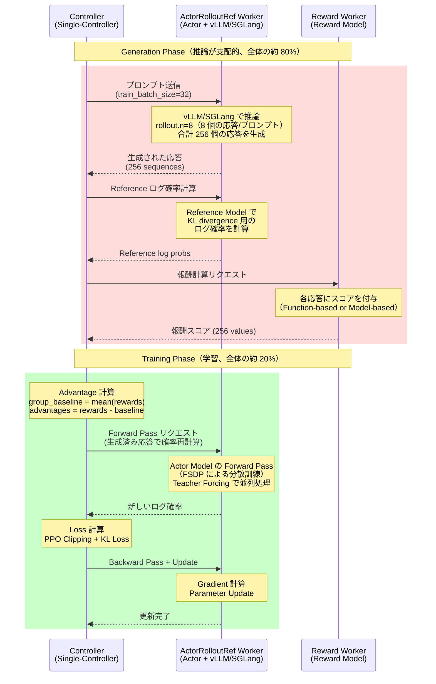
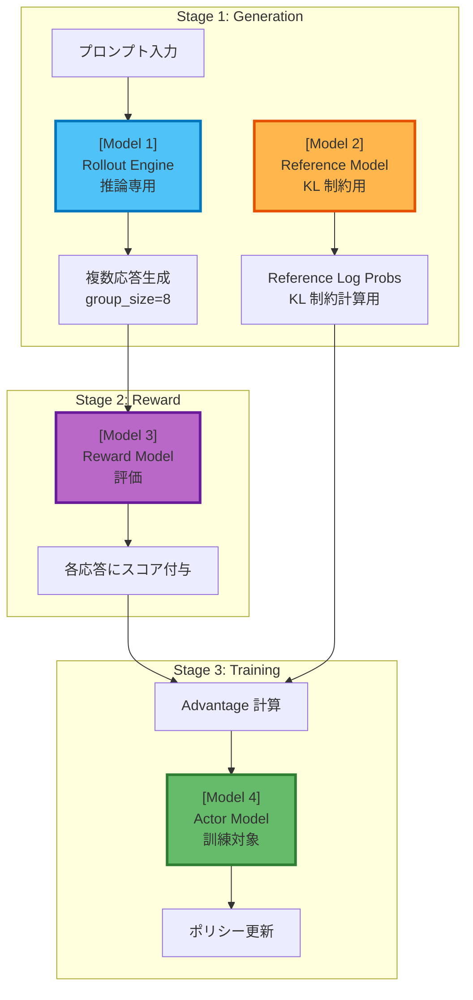
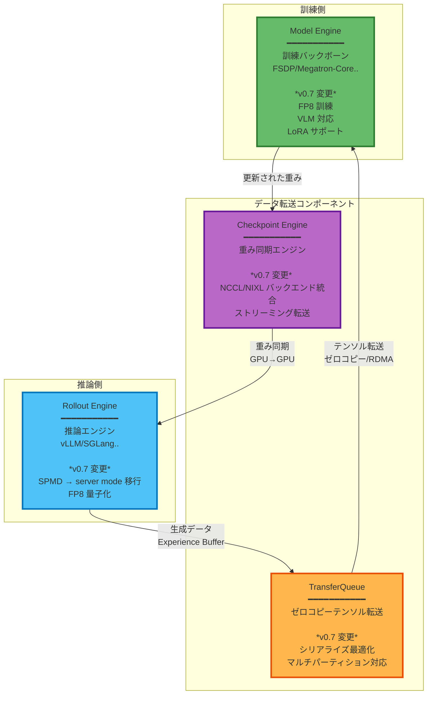

## はじめに

:::message
この記事は、Verl の概要と [v0.7 のリリースノート](https://verl.readthedocs.io/en/latest/blog/v0.7.html)を ML インフラストラクチャ視点で整理・解説したものです。重要なアップデートに焦点を当てて整理します。強化学習の理論面は専門外ですが、インフラ設計の観点から整理してみます。リリースノートのブログ自体が非常にわかりやすいのでそちらも併せて読むことをお勧めします。
:::

Verl は、GRPO、DPO、CISPO、SAPO などの強化学習ベースの LLM ポストトレーニング手法を大規模クラスタで実行するためのフレームワークです。本記事では v0.7 の重要なアップデートに絞って解説します。

前提知識として強化学習アルゴリズムの基礎は理解しているものとします。以下はこれまでの強化学習の背景や基礎的な内容を把握する上で非常にわかりやすかったです。

https://note.com/olachin/n/n9706c13c8678

## Generation/Training フェーズ

全てのアルゴリズムに共通するかは把握できていませんが強化学習ベースのポストトレーニング手法には特徴があります。これらの手法では、**推論（Generation Phase）が訓練時間の約 80% を占める**ことです。つまり、コストにおいても Generation phase を無視することはできません。Generation/Training でリソースをうまくシェアする、フェーズに応じてアロケーションの仕方を変える、別の計算リソースを利用する、といった視点が重要になってくると認識しています。

::::details Genration phase のコスト

https://github.com/OpenRLHF/OpenRLHF

https://github.com/deepspeedai/DeepSpeed/blob/master/blogs/deepspeed-chat

:::message alert
**パフォーマンス特性の分析**

[OpenRLHF の公式データ](https://github.com/OpenRLHF/OpenRLHF)によると、RLHF 訓練では Generation が**全体時間の約 80%** を占めます（"RLHF training spends 80% of the time on sample generation"）。

[DeepSpeed-Chat の分析](https://github.com/deepspeedai/DeepSpeed/blob/master/blogs/deepspeed-chat/README.md)も、**FLOPs** では Generation が 20%、Training が 80% ですが、Generation は各トークン生成ごとにモデル重み（例: 70B パラメータ × 2 bytes = 約 140 GB）をメモリから読み込む必要があり、**メモリバウンド**で GPU の計算性能を活かせません。一方、Training は Forward + Backward Pass で大量の演算を実行し、**計算バウンド**で GPU をフル活用できます。この違いにより、**実時間では Generation が大きな割合を占めます**（"can take a large portion of the e2e time"）。
:::

**コストへの影響**

同じ GPU を使用する場合、実行時間がそのままコストに比例するため、**Generation Phase がコストの大部分を占めます**。OpenRLHF のデータ（80%）を参考にすると、例えば 8 GPU で $100/h/GPU の場合、総コスト: $800/h、Generation Phase: 約 $640/h（80%）、Training Phase: 約 $160/h（20%）となります。

これが、Verl v0.7 で推論エンジンの最適化（Rollout Engine の server mode 移行、vLLM/SGLang 統合）が重視される理由です。**推論の最適化こそが、RLHF/GRPO におけるコスト削減の要点**であり、Verl の設計思想もこの特性を深く理解した上で構築されています。
::::

### GRPO のフェーズ

GRPO の訓練プロセスは、**Generation Phase** と **Training Phase** の 2 つのフェーズから構成されます。[Verl の公式ドキュメント](https://verl.readthedocs.io/en/latest/algo/grpo.html)によると、GRPO は各プロンプトに対して複数の応答を生成し、それらの報酬を相対的に評価することで、Critic ネットワークなしでポリシーを更新します。

::::details GRPO の処理フロー

::::

**Generation Phase** では、各プロンプトに対して複数の応答を生成し、**ActorRolloutRefWorker** が Actor、Rollout（推論エンジン）、Reference Model を統合しており、以下の処理を実行します。1. 各プロンプトに対して `rollout.n` 個の応答を生成します。**v0.7 では server mode に移行**し、vLLM/SGLang などの最新の推論バックエンドと統合され、デフォルトでオフラインではなくオンラインサービスとして動作してマルチターンの会話のスループット効率が向上します。2. 訓練開始時の初期ポリシー（Reference Model）を使用して、生成された応答ログ確率を計算します。これは KL divergence 計算に使用され、ポリシーの急激な変化を防ぎます。3. RewardManager が各応答にスコアを付与します。Function-based（ルールベース）または Model-based（学習済みモデル）の報酬計算がサポートされています。

:::message
Generation Phase は自己回帰生成のため逐次処理が必要です。前述の通り、この Phase が訓練時間の大半を占めるようです。v0.7 の server mode 移行により vLLM などとの統合が図られました。
:::

:::message
**vLLM と統合されたことでコスト影響の大きい Generation phase が疎結合化され、vLLM 側の推論技術の重要性がポストトレーニング側でも重要になってきていると感じました。AWS Neuron 推しの私としては vLLM が AWS Neuron に対応していることから Trainium などを利用することで Generation フェーズをお安くできないか、今後調査してみたいです。**
:::

**Training Phase** では、生成された応答と報酬を使用して Actor モデルのポリシーを更新します。アルゴリズムの解説がメインではないので詳細は割愛します。Training Phase は Forward + Backward Pass を含みますが、生成済みの完全なシーケンスに対して並列処理が可能なため、Generation Phase より高速です。

:::message alert
このように、Generation Phase はメモリバウンド・逐次処理、Training Phase は計算バウンド・並列処理、であり、異なる特性を持ちます。これら 2 つのフェーズを効率的に管理するインフラが、GRPO のようなポストトレーニング手法では重要です。
:::

## Verl のアーキテクチャ概要

> [公式ドキュメント](https://github.com/verl-project/verl?tab=readme-ov-file)より


### Hybrid-Controller アーキテクチャ -- HybridFlow

Verl は **Hybrid-Controller アーキテクチャ（HybridFlow）** を採用しています。このアーキテクチャは、Google Pathways などの非同期シャーディングデータフローシステムと設計原理を共有しており、PPO、GRPO、DAPO などの強化学習アルゴリズムを、**マルチステージ、マルチモデル、並列化可能なデータフローグラフ**としてモデル化します。

::::details GRPO のフローグラフ例

### マルチステージ（3 段階）
1. **Generation Stage**: Rollout Engine が複数の応答を生成
2. **Reward Stage**: Reward Model が各応答にスコアを付与
3. **Training Stage**: Actor Model がポリシーを更新

### マルチモデル（4 つのモデル）
- Actor Model（訓練対象）
- Rollout Engine（推論）
- Reference Model（KL 制約）
- Reward Model（評価）

### GRPO のデータフローグラフ

:::message
各ステージを独立した処理単位として扱うことで、複数バッチを同時処理できます。各ステージで異なる複数のモデルを処理することができます。
:::


::::

柔軟性とパフォーマンスのバランスをとるために、Verl は **2 つの異なる並列計算モデル**を統合しています。

**高レベル Single-Controller**（MPMD: Multiple Program Multiple Data）では、異なるコンポーネント（Actor、Rollout、Critic、Reward）が異なるプログラムを実行し、Controller が Ray のような分散フレームワークを介して協調動作を制御します。オーケストレーションレベルでは、**単一プロセスの `RLTrainer` がグローバル計算グラフを管理**して Rollout のスケジューリングやジョブディスパッチなどを実施します。

**内部 Multi-Controller**（SPMD: Single Program Multiple Data）では、各コンポーネント（Model Engine / Rollout Engine）は、**内部的に標準的な分散訓練/推論モードで動作**します。全 Worker が同一のプログラムを実行し、Collective Communication を介して同期しながら、大量の分散計算を実行します。


| 計算モデル | Controller | 具体の処理例 | エンジン | 説明 |
|----------|--------|------------|---------|------|
| MPMD | Single | Rollout スケジューリング | RLTrainer | 異なるコンポーネントが異なるプログラムを実行。Ray で協調動作を制御 |
| | | Reward スコアリング | | |
| | | 訓練ジョブディスパッチ | | |
| | | Experience Buffer 管理 | | |
| SPMD | Multi | Model Engine | FSDP、Megatron etc | 全 Worker が同一プログラムを実行し、Collective Communication で同期 |
| | | Rollout Engine | vLLM、SGLang | |

## Verl の 4 つの Core コンポーネント



この 4 つのコンポーネントは、Fully async パイプラインの中核を担っています。Model Engine（訓練側）と Rollout Engine（推論側）が完全に分離され、Checkpoint Engine が重みの同期を、TransferQueue が Experience Buffer の転送をそれぞれ効率的に処理します。v0.7 のリリースノートでは、これらのコンポーネントに対する多数の改良が報告されています。

### Model Engine の概要

Model Engine は、プラグイン可能なバックエンドをサポートする**抽象インターフェース**を定義しています。すべてのバックエンドは SPMD モードで動作し、以下の統一インターフェースを実装します。

```python
class BaseEngine:
    def initialize(self):
        """モデル、オプティマイザ、学習率スケジューラをインスタンス化または読み込み"""
        raise NotImplementedError

    def optimizer_zero_grad(self):
        """オプティマイザの勾配をゼロにリセット"""
        raise NotImplementedError

    def optimizer_step(self):
        """オプティマイザを使用して最適化ステップを実行"""
        raise NotImplementedError

    def lr_scheduler_step(self):
        """学習率スケジューラを 1 ステップ進める"""
        raise NotImplementedError

    def forward_backward_batch(self, data: TensorDict, loss_function: Callable, forward_only=False) -> Any:
        """データバッチに対して Forward Pass を実行し、オプションで Backward Pass も実行"""
        raise NotImplementedError

    def get_per_tensor_param(self) -> tuple[Generator[tuple[str, torch.Tensor], None, None], Optional[dict]]:
        """テンソル単位のパラメータを yield する Generator と、オプションの PEFT 設定を取得"""
        raise NotImplementedError

    def to(self, device: str, model: bool = True, optimizer: bool = True, grad: bool = True):
        """モデルパラメータ、オプティマイザ状態、勾配を指定デバイスに移動"""
        raise NotImplementedError
```

:::message
**重要な設計原則**: 新しい訓練エンジンを統合するには、これらのインターフェースを継承して実装するだけで済みます。**呼び出し側のコードは一切変更不要**です。
:::

**サポートされているバックエンド**

並列化戦略の記号の意味は[こちら](https://ailzhang.github.io/posts/distributed-compute-in-transformer/)を参照。

| バックエンド | 並列化戦略 | パフォーマンス | サポート範囲 | 統合時間 |
|------------|-----------|--------------|------------|----------|
| FSDP | FSDP+SP | Dense/MoE 低 | 全 Transformer | Day 0 |
| Megatron-Core | DP+TP+PP+EP+CP | 高 | 特定モデル | 数週間〜数ヶ月 |
| VeOmni | FSDP+SP+EP | 中 | VLM/MoE | 約 1 週間 |

この抽象化により、**ユーザーは RL アルゴリズムの実装に集中でき、分散訓練の詳細に煩わされることがありません**。

### Rollout Engine の概要

> リリースノートブログより


v0.7 では、レガシーの SPMD rollout モードが削除され、**server mode がデフォルト**になりました。server mode は、オフライン・バッチ推論ではなく、**オンライン・サービングとして動作**します。これによって、vLLM、SGLang などのバックエンドがサポートされ、動的バッチングやその他の推論エンジンの恩恵を受けることが可能になります。

:::message alert
Generation phase は基本的にはメモリバウンドな処理であり、メモリの集積度に対するコスト効率の良い trn2 インスタンスを vllm-neruon 経由で統合できるとコストを下げられる可能性があるため今後 Verl と vllm-neuron を組み合わせて利用する実験をしてみたいと思います。
:::

### TransferQueue の概要


TransferQueue は、**制御フローとデータフローを分離**し、大量データ転送時のボトルネックを解決します。

**なぜ必要か**: Ray の `ray.put()`/`ray.get()` は Python pickle でオブジェクトをシリアライズし、Ray Object Store（共有メモリ）に格納します。PyTorch テンソルを転送する場合、GPU → CPU → pickle シリアライズ → Object Store → pickle デシリアライズ → CPU → GPU という多段コピーが発生し、メモリ帯域幅を無駄に消費します。

**TransferQueue の解決策**: RLTrainer は指示とメタデータ（テンソルのサイズや型情報）のみを Ray 経由で送信し、実際のテンソルデータは別の専用経路で転送します。PyTorch テンソルのメモリバッファ（`torch.Tensor.data_ptr()` が指すメモリ領域）を直接扱うことで、pickle によるシリアライゼーションを完全に回避します。バックエンドとして ZeroMQ、NIXL、Ray RDT が利用可能で、RDMA を使用すると GPU メモリを CPU を介さずにノード間で直接転送できます（AWS EFA 経由など）。v0.8 ではデフォルトの転送メソッドになる予定のようです。

NIXL と Ray については以下で軽く解説しているので確認ください。

https://zenn.dev/tosshi/articles/940015c30b5558

https://zenn.dev/tosshi/articles/5a5139b6748b99

### Checkpoint Engine の詳細


Checkpoint は、訓練ノードと推論ノードが物理的に分離された環境において、**クロスノード・パラメータ同期**を効率的に行うための統一抽象化です。

**なぜ必要か**: v0.7 の server mode では、推論エンジンが独立プロセスになりました。訓練で更新された Actor モデルの重みを別プロセスの推論サーバーに転送する必要があります。大規模モデルでは、従来の GPU → CPU → 中間ストレージ → CPU → GPU という多段コピーでは転送時間が数分に及び、スケーラビリティに限界がありました。

**Checkpoint Engine の解決策**: GPU メモリを NCCL または NIXL を使用して直接転送します。ファイルシステムを経由せず、GPU → GPU のゼロコピー転送を実現します。大規模モデルでは、重みをパーティション単位に分割してストリーミング転送することで、メモリピーク使用量を抑えながら並列転送できます。

## 3 つのパイプライン戦略

Verl は、ユースケースに応じて 3 つの異なるパイプライン戦略を提供します。


**3 つのパイプライン戦略の比較**

| 特性 | 1. On-Policy | 2. One-Step-Off-Policy | 3. Fully Async |
|------|-------------------|---------------------------|----------------------|
| **実行方式** | Rollout と Training を順次実行 | Generation と Training をオーバーラップで並列化 | Trainer と Rollouter ノードを完全分離 |
| **リソース配置** | GPU を共有 | 前ステップのパラメータで rollout を実行 | 訓練・推論ノードを完全分離 |
| **データ転送** | メモリ共有 | メモリ共有 + 1 ステップ遅延 | Checkpoint Engine + TransferQueue |
| **スループット向上** | ベースライン | 20-40% | 大規模だと必須 |
| **アルゴリズム的正確性** | 厳密な on-policy | 厳密な on-policy からの最小限の乖離 | Staleness により制御 |
| **実装複雑度** | 低 | 中 | 高 |
| **推奨ユースケース** | ベースライン実験 | 中規模訓練 | 大規模クラスタ、長時間推論タスク |

## Worker の柔軟な配置管理

GPU リソースは **ResourcePoolManager** が管理します。`resource_pool_spec` で各プールのノード構成を定義し、Role をプールにマッピングします。中核となるのは `ActorRolloutRefWorker` クラスで、`role` パラメータに応じて Actor、Rollout、Reference の 3 つの役割を 1 つの GPU セット上で切り替えて実行できるハイブリッドエンジンとして機能します。

`max_colocate_count` パラメータ（デフォルト 3）により、actor_critic_ref、rollout、reward model の 3 つの WorkerGroup を同一ノード上に共存させることができます。Reward Model を別プールで専用実行しながら、Actor/Rollout/Ref は同一ノードセットで時分割実行するという柔軟な構成が可能です。

## v0.7 の重要なアップデート

:::message
ようやくアップデート解説！！
:::

v0.7 では 5 つの主要なアップデートが導入されました。前節で説明したアーキテクチャとコンポーネントの知識を踏まえ、これらのアップデートが相互にどう関連しているかを整理します。

| アップデート | 主な効果 |
|---|---|
| Rollout Engine の server mode 移行 | 動的バッチング、vLLM/SGLang 統合、GPU 利用率向上 |
| Checkpoint Engine | GPU 間ゼロコピー転送、NCCL/NIXL バックエンド |
| TransferQueue 最適化 | ゼロコピー転送、RDMA 対応、シリアライゼーション最適化 |
| Fully async パイプライン | 2.35-2.67x スループット向上、リソース完全分離 |
| CISPO/SAPO アルゴリズム追加 | GRPO の課題解決、安定した学習、MoE 対応 |

### 1. Rollout Engine の server mode 移行

v0.6 以前の SPMD モードでは、全 GPU が同期的に同じバッチを処理していました。バッチ内の最長シーケンスに合わせてパディングが必要になるため、短いシーケンスが多い場合に GPU 利用率が大きく低下します。v0.7 では推論エンジンを独立プロセスに分離し、vLLM、SGLang などの高性能推論エンジンを利用できるようになりました。Continuous Batching により、パディングによる無駄が最小化され、GPU 利用率が大幅に向上します。

また、`AgentLoopBase` 抽象化も導入されました。`SingleTurnAgentLoop`（従来の単一ターン応答）と `ToolAgentLoop`（ツール呼び出しを含む複数ターン対話）により、SWEAgent や GUIAgent のような複雑なエージェント行動の学習が可能になりました。

### 2. Checkpoint Engine による重み同期の最適化

server mode では推論エンジンが独立プロセスになったため、訓練で更新された Actor モデルの重みを別プロセスの推論サーバーに転送する仕組みが必須になりました。すでに解説した通り v0.7 の Checkpoint Engine は、NCCL または NIXL を使用して GPU メモリを直接転送します。NCCL は broadcast 方式で複数ノードへ一斉配信し、NVLink/NVSwitch 環境で特に効率的です。NIXL は P2P 方式で、より柔軟なノード間ストリーミング転送に向いています。

### 3. TransferQueue のゼロコピー転送と RDMA 対応

v0.7 の TransferQueue は、制御フローとデータフローを分離します。PyTorch テンソルのメモリバッファを直接扱うことで pickle を回避し、ZeroMQ、NIXL、Ray RDT をバックエンドとして利用できます。AWS EFA 経由で RDMA を活用すると、GPU メモリを CPU を介さずにノード間で直接転送できます。大規模テンソルを複数パーティションに分割して並列転送する機能もサポートされました。

### 4. Fully async パイプラインの実装

v0.7 で登場した Fully async パイプラインは、訓練と推論のリソースを完全に分離し、異なるインスタンスタイプを使用できます。

鍵となるのは Staleness 制御です。`staleness_threshold`（0.0-1.0）パラメータにより、推論側は最新の重みを待たず、少し古いモデルで Generation を続行できます。TransferQueue と Checkpoint Engine により、訓練と推論の両方のリソースを常にフル稼働させられます。

公式ベンチマークでは、128 GPU（H20）での DAPO 訓練において、Qwen2.5-Math-7B モデルで **2.67x の速度向上**（400 steps、64:64 GPU split）、および staleness threshold ablation study で **2.35x の速度向上**が報告されています。

参考: [Verl Fully Async Performance Benchmark](https://verl.readthedocs.io/en/latest/advance/fully_async.html)

### 5. CISPO と SAPO アルゴリズムの追加

v0.7 では、GRPO の課題を解決する 2 つの発展的アルゴリズムが追加されました。**CISPO（Clipped IS-weight Policy Optimization）**、**SAPO（Soft Adaptive Policy Optimization）** の詳細については論文等を参照ください。

### 6. その他の v0.7 機能追加

v0.7 では、上記の主要アップデート以外にも多数の機能が追加されました。

**Model Engine**: H100/H200 向け FP8 訓練、Vision Language Model（VLM）対応、Megatron-Bridge による LoRA/PEFT サポートと統合時間の大幅短縮（数週間 → 数日）、VeOmni エンジンによる VLM と MoE 最適化が追加されました。

**Rollout Engine**: vLLM と SGLang で blockwise FP8 サポート、torchao によるオンライン量子化、MoE モデルのルーター・リプレイ（実験的）、ビデオ入力サポート、vLLM 0.12.0 / SGLang 0.5.6 対応が追加されました。

**Reward System**: ハイブリッド報酬シナリオとして、Generative Reward（LLM-as-a-Judge）、Discriminative Reward（従来の報酬モデル）、Rule-based Reward（関数ベース）の 3 つを組み合わせて使用できます。Reward Model も server mode で独立デプロイ可能です。

**Recipes と新手法**: VLA 実験サポートによりロボティクス向け訓練に対応、rhymeRL による加速手法のレシピサポートが追加されました。これにより、v0.7 は従来の言語モデル訓練だけでなく、VLM、ロボティクス、複雑なエージェントタスクにも対応する包括的なフレームワークとなりました。

## まとめ

Verl についての概要を整理した上で v0.7 のリリースノートを解説しました。個人的には v0.7 で実用的なパフォーマンスが出るような改善が多数図られており、GPU 以外の計算リソースとの混在での強化学習の可能性に現実味が増していると感じました。今後は NIXL、vllm-neuron 側の実装も確認しながら GPU と AWS Neuron 混在での強化学習環境の実現を狙ってみたいと思います。

公式リリースノートによると、v0.8 と v0.9 では以下の大規模な変更が予定されています。

#### v0.8 の予定

| カテゴリー | 機能 | 詳細 |
|----------|------|------|
| コア・アーキテクチャの刷新 | DataProto → TensorDict への移行 | 現在の DataProto を PyTorch ネイティブの TensorDict に置換。より柔軟なデータ構造と PyTorch エコシステムとの統合性向上 |
| | 新しいモデルエンジンをデフォルト化 | VeOmni などの新バックエンドを標準に |
| 推論エンジンの拡張 | TensorRT-LLM Rollout Engine | NVIDIA TensorRT-LLM を Rollout Engine として正式サポート。vLLM、SGLang に次ぐ第三の推論バックエンドオプション |
| | VeOmni エンジンの本番化 | VLM と MoE に最適化されたバックエンドが安定版に |
| データ転送の最適化 | TransferQueue がデフォルトに | v0.7 では実験的だった TransferQueue が標準に。ゼロコピー転送がデフォルト動作、Ray Object Store の利用を最小化 |
| 新機能 | MTP（Multi-Turn Policy）RL 訓練 | 複数ターンにわたる対話型タスクでの RL 訓練に対応。エージェントが複数回のやり取りを通じて学習するシナリオをサポート |
| | DeepSeek V3.2 サポート | 最新の大規模モデルに対応 |

#### v0.9 の予定

| カテゴリー | 機能 | 詳細 |
|----------|------|------|
| 完全非同期訓練のメイン統合 | Fully async パイプラインがデフォルト | v0.7 で導入された Fully async が標準パイプラインに |
| | レガシーエンジンの削除 | 従来のモデルエンジン（SPMD ベース）を削除。コードベースの簡素化とメンテナンス負荷の軽減 |
| マルチモーダル・モデルの拡張 | Omni-model サポート | Qwen3-Omni、BAGEL などのオムニモーダルモデルに対応。テキスト、ビジョン、オーディオの統合、より複雑なマルチモーダル RL 訓練 |
| エージェント・トレーニング・レシピ | SWEAgent レシピ | コード編集エージェントの訓練レシピ |
| | GUIAgent レシピ | UI 操作エージェントの訓練レシピ |
| | カスタム AgentLoop ベストプラクティス | カスタム AgentLoop 実装のベストプラクティス |

このロードマップにより、Verl は言語モデルだけでなく、マルチモーダル、エージェント、ロボティクスなど、幅広い領域に対応する包括的な RL 訓練フレームワークへと進化していきます。

### 参考リンク

- [Verl 公式ドキュメント](https://verl.readthedocs.io/)
- [Verl GitHub](https://github.com/verl-project/verl)
- [v0.7 リリースノート](https://verl.readthedocs.io/en/latest/blog/v0.7.html)
- [GRPO のための次世代インフラアーキテクチャ](/articles/54a29cb1388cd7)
- [LLM のための強化学習手法 2025](https://note.com/olachin/n/n9706c13c8678)
- [OpenRLHF: Generation が 80% の時間を占める公式データ](https://github.com/OpenRLHF/OpenRLHF)
- [DeepSpeed-Chat: 計算量 vs 実時間の詳細分析](https://github.com/deepspeedai/DeepSpeed/blob/master/blogs/deepspeed-chat/README.md)
- [TRL (Hugging Face): Generation が主要なボトルネック](https://huggingface.co/docs/trl/main/en/grpo_trainer)
- [DeepSeekMath - GRPO 提案論文](https://arxiv.org/abs/2402.03300)
- [MiniMax-M1 論文内で提案](https://arxiv.org/abs/2506.13585)
- [Soft Adaptive Policy Optimization](https://arxiv.org/abs/2511.20347)
- [NxD Inference](https://awsdocs-neuron.readthedocs-hosted.com/en/latest/libraries/nxd-inference/)
- [SageMaker HyperPod](https://docs.aws.amazon.com/sagemaker/latest/dg/sagemaker-hyperpod.html)
