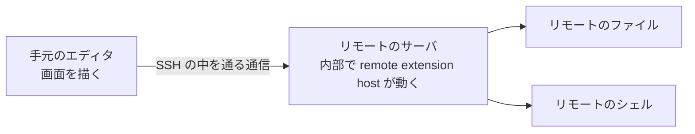

# はじめに

手元のノート PC でコードを書いているのに、実行するのは GPU の載った別のマシン、という状況はよくあります。素直に思いつくのは SSH でログインして `vim` を使うか、ファイルを転送するかですが、どちらも快適とは言いにくいです。

VS Code の Remote-SSH という拡張は、この問題に別の答えを出しました。画面を描くエディタ本体は手元で動かしたまま、ワークスペースのファイル操作、ターミナル、ワークスペース側の拡張機能をリモートで実行するというものです。テーマなど画面まわりの拡張は手元に残るので「全部が向こうに行く」わけではありませんが、作業の実体はリモートに移ります。

この記事は、その仕組みを [Kiro](https://kiro.dev) という VS Code 派生のエディタ向けに自分で実装した記録です。作ったものは [littlemex/kiro-remote-ssh](https://github.com/littlemex/kiro-remote-ssh) に置いてあります。Kiro や AWS の公式なものではなく、個人が書いた非公式の拡張です。

実装してみて意外だったのは、難しさが SSH の通信そのものではなく、**「誰が何の寿命を保証するのか」**という点に集まっていたことでした。設計に書いた保証が実測で二度破れています。

## この記事の前提

初学者向けに、必要な用語はその場で補いながら書きます。読むのに必要な知識は「SSH でリモートのマシンにログインしたことがある」くらいです。

設計と実装のレビューは AI に頼みました。この記事の書き直しもそうです。

記事に出てくる測定は、次の環境で行ったものです。`ssh` の挙動はバージョン差があるので、数字はこの環境に紐づいています。

| 項目 | 値 |
|---|---|
| 手元のマシン | macOS、OpenSSH 10.3 |
| リモート | Ubuntu 24.04、x86_64、glibc 2.39 |
| エディタ | Kiro 1.0.437 |

拡張がリモートのサーバをどう起動し、ポートや接続トークンをどう受け取るかは、記事が長くなりすぎるので扱いません。そこは repo の `docs/DESIGN.md` に書いてあります。この記事は寿命の設計に絞ります。

# 動いている様子

先に完成形を出します。`~/.ssh/config` に書いたホストが一覧に出ます。


ホストを選ぶと、そのマシンのフォルダを開いた状態で新しいウィンドウが開きます。左下に接続先が出ています。


ターミナルを開くと、シェルはリモートで動いています。`uname` が Linux を返しているのが証拠で、手元は macOS なのでこの出力はあり得ません。


# そもそも何が動いているのか

Remote-SSH を使うと、リモート側にサーバプログラムが置かれて動き出します。その中で拡張機能を実行する部分を **remote extension host** と呼びます。エディタ本体は手元にありますが、ファイルを開く、ターミナルを作る、ワークスペース側の拡張を動かすといった仕事は、このリモートのサーバが引き受けます。

関係を単純化すると、こうなります。



手元のエディタとリモートのサーバが主役で、ファイルとシェルはサーバが操作する対象です。

ここで最初の疑問が出ます。リモートのサーバは、どこから来るのでしょうか。

答えは、エディタの開発元が配布しています。Kiro をインストールしたフォルダには `product.json` という設定ファイルがあり、そこにダウンロード先が書かれています。次は Kiro 1.0.437 のもので、関係する部分だけを抜き出しています。キーの位置は派生エディタごとに違うので、自分の環境のものを見てください。

```json
{
  "serverApplicationName": "kiro-server",
  "serverDataFolderName": ".kiro-server",
  "remote": {
    "SSH": {
      "serverDownloadUrlTemplate": "https://…/kiro-reh-${os}-${arch}.tar.gz"
    }
  }
}
```

このサーバはエディタのコミットハッシュに紐づいています。エディタを更新すると、更新後のエディタは古いサーバを使えないので、新しいコミット用を取り直します。実装するときに必ず踏むところです。

サーバは配布されているのに、それに接続する拡張は Kiro に同梱されていません。つまり部品はあるのに、それを繋ぐ側が欠けている状態でした。作ったのはその繋ぐ側です。

# 最初の決定: SSH のプロトコルは実装しない

既存の似たような拡張がいくつかあるので、まず読みました。そのうちいくつかは、SSH の通信を JavaScript で自前実装していました。

自前実装で気になったのは 2 点です。ひとつは、接続先が本物かを確認する処理が見当たらなかったことです。SSH には `known_hosts` という仕組みがあり、一度繋いだ相手の鍵を覚えておいて、次からは同じ相手かを照合します。これが無いと、接続時に別のマシンへ誘導されても気づけません。もうひとつは、同梱している SSH ライブラリの更新が止まっていて、その後に公開された既知の弱点への対応が入っていないように見えたことです。

いずれも私が 2026 年 9 月に読んだ時点の話です。この記事では拡張の名前を書いていませんが、repo の `docs/SECURITY_AUDIT.md` には対象と該当バージョンと再現手順まで書いてあり、それは公開されています。つまり実質的には名前を出しているのと同じで、記事だけ伏せても意味がありません。しかも開発元にはまだ報告していません。順序としては報告を先にするべきで、そこは私の手順の不備です。これから報告します。

読んで思ったのは、これは個別のバグというより、SSH の実装を自分で持っていることの代償だということでした。持っている限り、追随し続ける義務が発生します。

そこで設計の中心をこう決めました。**SSH のプロトコルと暗号処理は一切実装せず、接続の判断は全部システムの `ssh` コマンドに任せる。**

「一切書かない」のはプロトコルと暗号の部分です。`ssh` の起動、引数の組み立て、パスフレーズを尋ねる画面の橋渡し、標準入出力の中継は拡張側で書いています。任せているのは、どの鍵を使うか、相手が本物か、どの暗号方式で話すか、といった判断です。

得られるものは大きいです。接続先の確認方法も暗号方式も、利用者が普段使っている OpenSSH の設定とポリシーがそのまま効きます。踏み台を経由する `ProxyCommand` の設定も効きます。パスフレーズ付きの鍵や `ssh-agent` は実機で動かしました。FIDO2 のセキュリティキーは、`ssh` 側で使える構成なら同じように動くはずですが、私は試していません。

委譲の効果がはっきり出た場面があります。私が使っているサーバのひとつは、AWS の Session Manager 経由でしか到達できません。`~/.ssh/config` はこうなっています。

```
Host my-host
  HostName i-0123456789abcdef0
  ProxyCommand sh -c "aws ssm start-session --target %h --document-name AWS-StartSSHSession --parameters 'portNumber=%p'"
```

`HostName` に書いてあるのは DNS 名ではなくインスタンス ID なので、名前解決しようとすると必ず失敗します。実際、SSH を自前実装している拡張は `getaddrinfo ENOTFOUND` で落ちました。`ProxyCommand` を解釈していないからです。

一方で `ssh` に任せている実装は、同じホストに何の追加設定もなく繋がります。委譲という判断が、そのまま利用者の環境の多様さに対応する力になりました。

# 二番目の決定: 待ち受けるソケットを誰が持つか

ここからが、この実装でいちばん頭を使った部分です。

まず用語を 3 つ置きます。ポートはプログラムが通信を受け付ける番号、待ち受けソケットはそのポートで接続を待つ OS 上の資源、カーネルはプロセスやソケットを管理する OS の中核です。

リモートで動く拡張が「ユーザーのブラウザでこの画面を開いてほしい」と言うことがあります。サインインの戻り先などです。しかしその画面はリモート側のポートで待っているので、手元のブラウザからは見えません。そこで、手元のあるポートをリモートのポートに繋ぐ「トンネル」が必要になります。

`ssh` にはこれを行う `-L` というオプションがあります。素直に使えば済む話に見えました。

## なぜ接続を多重化するのか

先に、この節の表を読むために必要な話をします。

`ssh` には多重化という機能があります。一度確立した接続を裏で保持しておき、以降の `ssh` はその接続に乗る、というものです。これを使うと認証が 1 回で済みます。使わないと、トンネルを 1 本作るたびに認証が走ります。パスフレーズやセキュリティキーを使っている人には毎回タッチを要求することになり、リモートに溜まるセッションも増えます。なので多重化は使いたい機能です。

保持している側のプロセスを、ここでは多重化の親と呼びます。

## 3 通り試して 3 通り残った

設計文書には当初こう書いていました。「多重化の親は、接続を破棄するときに閉じる」。実測はそうなりませんでした。

問題は、エディタが強制終了されたときに何が残るかでした。トンネルは手元のマシンでポートを待ち受けているので、残ってしまうと、そのポートを経由してリモート側の特定のサービスに接続できる状態が続きます。待ち受けは `127.0.0.1` に限っているので同じマシンの中からに限られますが、消えてほしいものが消えていないのは同じです。

`ssh` に待ち受けさせる書き方を 3 通り試して、3 通りとも残りました。`ssh -O forward` で既存の接続に追加する形、`-N -L` の形、`-L` にリモートコマンドを付ける形です。待ち受けているソケットの持ち主が、こちらが起動した子ではなく多重化の親なので、子を殺しても消えません。実際に多重化の親を 9 個残してしまい、それらが保持していたリモートのセッションが合計 19 まで増えたこともありました。破棄するときに閉じるつもりだったのに、破棄の処理そのものが走らなかったからです。

ここで当然「多重化をやめれば解決するのでは」と思います。試すと確かに待ち受けは自分の `ssh` と一緒に死にます。しかし前節の理由で、トンネルごとに認証が走るようになります。しかも手元のプロセスを強制終了したときに子が道連れになる保証はありません。macOS には Linux の `PR_SET_PDEATHSIG` のような、親の死を子に伝える仕組みがないので、孤児として生き残り得ます。

レビューを頼んだところ、こう指摘されました。

> `ssh` に待ち受けさせている限り、どんな工夫をしても「`ssh` が終了を決める」という話に戻る。答えは自分のプロセスが持つことしかない。

これが正しかったです。実装をこう変えました。エラー処理を省いた概念コードで、`spawnSsh` は自作の関数です。

```typescript
const server = net.createServer((socket) => {
    const child = spawnSsh(['-W', `127.0.0.1:${remotePort}`, host]);
    socket.pipe(child.stdin);
    child.stdout.pipe(socket);
});
server.listen(0, '127.0.0.1');
```

`-W host:port` は、`ssh` の標準入出力をそのままリモートの `host:port` への接続として扱うオプションです。`-L` と違って、どこにも待ち受けを作りません。手元のブラウザから来たバイト列を `ssh` の標準入力に流し込めば、それがそのままリモートのポートに届き、返りは標準出力から出てきます。**トンネルの中身を運ぶのは `ssh` だが、待ち受けは自分が持つ、という分担です。**

だから待ち受けは `net.createServer` が作ったものだけになり、その持ち主は拡張が動いているローカルのプロセスです。ここでいう `127.0.0.1` はループバックといって、そのマシン自身からしか接続できないアドレスです。

実物では、標準エラー出力を読み捨てるとパイプが詰まるので読んでいますし、`socket` のエラーと切断、子の終了をそれぞれ拾って相手側を閉じています。そのまま写して使う場合はそこを足してください。

こうすると、待ち受けの寿命はカーネルが決めます。プロセスが終われば、理由が何であれカーネルがソケットを閉じます。**こちらの後片付けのコードが 1 行も動かなくても消えます。強制終了でも、クラッシュでも同じです。** リモート側のセッションがいつ切断を認識するかは別の話で、それは後で書きます。

所有関係を並べると、変えたのはここだけです。


測ったのは、この拡張が開いた待ち受けの数です。拡張がログに出したポート番号を控えておき、強制終了の前後でそれらが待ち受けているかを調べました。一度の検証で、12 個あった待ち受けが強制終了後は 0 個になりました。孤児として残った `ssh` のプロセスも無いことを確認しています。孤児とは、親が終了した後も残ってしまう子プロセスのことです。

副産物もありました。ポート番号をカーネルに割り当てさせるので、「空いているポートを探して、実際に確保するまでの隙間」が消えます。この隙間は地味に危険で、前のセッションの残りが同じ番号を握っていると、新しいセッションの URL が古い接続先を指してしまう可能性がありました。

代償も書いておきます。この方式は接続が来るたびに `ssh` プロセスを起動します。サインインの戻り先のような単発の用途では気になりませんが、リモートの開発サーバをブラウザから頻繁に叩くような使い方では、起動のコストが乗ります。そこは測っていません。

# うまくいかなかったこと

「手元で 1 回サインインしたら、リモートでは聞かれないようにしたい」という機能を作ろうとして、3 案作って 3 案とも採用しませんでした。

リモートで動く AI エージェントは、自分の認証情報をリモートのホームディレクトリのファイルから読みます。だから手元でサインインしても、リモートには何もないので改めて聞かれます。

エディタには拡張同士で認証情報を受け渡す仕組みがあります。しかし使えませんでした。**どのホストにどう繋ぐかを決める処理は、認証情報を提供する側の拡張が使えるようになるより前に走ります。** 認証情報を渡せる唯一のタイミングでは、まだ渡してくれる相手が存在しないのです。存在するまで待つと、接続の準備そのものが進みません。実際に止めてしまい、エディタが接続処理の途中で永遠に待ち続けました。

そこで「認証情報のファイルをリモートに置く」方向に切り替えて、3 通り試しました。

| 案 | どう作ったか | 採用しなかった理由 |
|---|---|---|
| 終了時に削除 | 接続を終了するときにファイルを消す | 強制終了では削除のコードが動かず、認証情報がリモートのホームディレクトリに残ったことを実測で確認した |
| メモリとリンク | 認証情報をメモリだけに置き、そこを指すリンクをファイルの場所に置く | 寿命は保証できたが、読む側のプロセスがリンクを拒否した |
| 普通のファイル | 手元の認証情報をファイルとして書き、更新のたびに上書きする | 利用者がリモートでサインインした認証情報を上書きして消してしまった |

1 案目は、設計文書に「セッション限りで安全」と書いたのに実測で破れました。後の節で書くルールを、自分で破っていたわけです。

2 案目は、カーネルに守らせる形にしました。使ったのは Linux の 2 つの仕組みです。`memfd_create` はディスク上に実体を持たない、メモリだけのファイルを作るシステムコールです。`/proc/<pid>/fd/<番号>` は、そのプロセスが開いているファイルをファイルシステムから辿るための特別な場所です。認証情報をメモリだけのファイルに入れ、そこを指すシンボリックリンクを、認証情報のファイルがあるべき場所に置きました。シンボリックリンクは別の場所を指すファイルのことです。

リンクの先はプロセスが持っているメモリなので、そのプロセスが死ねばカーネルがメモリを解放し、リンクは何も指さなくなります。後片付けのコードは要りません。強制終了で消えることは実機で確認しました。電源断でも消えるはずですが、そちらは試していません。

ところが認証情報を読む側のプロセスに拒否されました。ログにこう出ていました。

```
Security: symbolic link detected at token storage path
```

認証情報の置き場所がリンクであることを検出して、読むのを拒んでいます。防御として正しい判断です。つまり、私が思いついた中で寿命を保証できる形は、受け取る側が受け付けない形だけでした。

3 案目は普通のファイルに戻しました。読む側は受け付け、AI も動きました。しかし別の壊れ方をしました。こちらが「自分のファイル」と見なした後は更新のたびに上書きするので、利用者がリモート側でサインインすると、その新しい認証情報をこちらの短命なコピーで上書きし、セッション終了時に削除してしまいます。結果、サインイン画面が何度も戻ってきます。書き直しの際に、以前のレビューで指摘されていた所有権の問題を再発させたものでした。

最終的に、この機能は入れないことにしました。ホストごとに 1 回サインインすれば、認証情報はそれを使う拡張と同じ場所に置かれ、その拡張が自分で更新します。複製も、寿命の保証も、上書きの事故も起きません。1 回のサインインを省くために、複製と寿命と所有権という 3 つの難問を自分で作っていた、というのが結論でした。

# 二つの失敗から作ったルール

待ち受けの件と認証情報の件で、どちらも同じ形で失敗しました。そこで設計文書にルールを書きました。

**寿命を保証すると書くなら、それを守る主体の名前を書くこと。そして認めるのはカーネル、期限、独立したプロセスの 3 つだけ。**

自分の後片付けコードを主体の欄に書いた行は不合格にします。強制終了やクラッシュや電源断では、そのコードは動かないからです。

実装は今こうなっています。

| 寿命を持つもの | 守る主体 | どうやって届くか |
|---|---|---|
| 手元の待ち受けソケット | カーネル | 自分のプロセスが持つので、終わればカーネルが閉じる |
| リモートのサーバへの通信 | 多重化した SSH 接続と同じ | 待ち受けを作らず標準入出力の上に載せているので、共有している接続が終わるときに一緒に終わる |
| 多重化した SSH 接続 | カーネルと期限 | 自分だけが書き込むパイプが閉じれば終わる。閉じたと気づけない場合に備えて、リモートで動かしている監視コマンド自体に無通信の期限を持たせている |

3 番目に「期限」を足したのには理由があります。パイプが閉じたことに気づけない場合、TCP の生存確認に頼ると、有効にしても Linux の既定値では検知の開始まで 2 時間ほどかかります。そこに頼ると寿命の保証になりません。

ここで注意したいのは、期限を持たせる主体を自分の側に置いたことです。リモートの `sshd` にも接続を切る設定はありますが、既定では無効なので、リモートの管理者が有効にしていることを前提にはできません。だから期限は、こちらが起動するリモートのコマンドに `read` の待ち時間として持たせ、加えて手元の `ssh` にも生存確認の間隔を自分で指定しています。どちらも自分の管理下にあるので、ルールと整合します。

# サプライチェーンについて考えたこと

ここからは実装ではなく、配布物をどう信頼してもらうかの話です。

この拡張は他人のマシンでコマンドを実行します。それだけの信頼を求めるので、「悪いことをしていない」を言葉ではなく検査で示す方法を考えました。ここでいうサプライチェーンは、依存パッケージから配布物までの作成経路のことです。

いちばん効いたのは実行時の依存関係をゼロにすることです。SSH を自分で書かないと決めたので、そもそもライブラリを抱える必要がありません。配布物には自分のコードだけが入っています。

そして、その状態を人間の記憶ではなく検査で守るようにしました。CI は push やリリースのときに自動で検査とビルドを回す仕組みです。

```
ok    the extension has no runtime dependencies
ok    this package defines no install-time scripts
ok    the bundle contains no hardcoded network endpoints
ok    the bundle contains no telemetry library
ok    the published archive contains exactly the expected files
```

検査の強さは正確に書いておきます。真ん中の 2 つは、配布物の中から URL らしい文字列と既知の計測ライブラリの名前を探しているだけです。難読化や独自実装まで否定できるものではありません。**言えるのは「既知の形のものが混入したら CI が落ちる」ということで、それ以上ではありません。** それでも、README に書くだけの主張より強度はあります。実際、最後の「配布物に入るファイルを固定する」という検査は、書いた直後から 3 回、入るべきでないファイルの混入を捕まえました。

ただしその検査自体に、この記事と同じ形の欠陥がありました。ファイル一覧を取る道具が動かなかったとき、検査は「取れませんでした」と書き残すだけで合格を出していました。**見えなかったときに合格を出す検査は、見ていないことを隠します。** 記事を書きながら気づいて、取れなかった場合は失敗にしました。

依存の数も減りました。この測定環境で `npm ls --all --parseable` で数えて、実際にインストールされるパッケージが 274 個から 6 個になりました。減ったのは、`.vsix` を作る道具を常設の依存から外し、リリースのときにだけ取得する形にしたからです。TypeScript とバンドル道具は開発用の依存として残っています。だから 6 個は日常の開発環境の数で、リリース時に走るものは別にあります。

そこも正直に書く必要があります。**リリースを作る機械で他人のコードは走っています。** 検査が保証しているのはもっと狭いことです。常設の依存をインストールするときは、パッケージが自分で走らせるスクリプトを無効にしています。ただしリリース時に取得する `.vsix` の道具はその経路の外にあるので、そこには同じ制約がかかっていません。CI のアクションはすべてコミットの digest で固定しています。digest はファイルの内容から計算する識別用の値です。

配布物の同一性についても区別しました。バンドルしたスクリプトについては、CI が同じ木から二度ビルドして一致することを検査しています。これが示すのは同じ環境での決定性までで、別の環境でも同じになることの証明ではありません。ただ公開した digest があるので、読者が自分で再ビルドして比べることはできます。一方 `.vsix` は zip なので作成時刻が埋まり、今の作り方では一致しません。そこは「再現する」と書かずに、識別のために digest を公開し、署名付きの由来証明で補う形にしました。

# 同じ失敗を、記事の画像でもした

この記事の画像を撮る作業でも同じ形の失敗をしたので、短く書きます。

画面にはユーザー名を含むパスや接続先の名前が写るので、隠す処理を書き、隠せたことを確認する検査も書きました。検査は「問題なし」と言い、画像には接続先の名前が 3 箇所残っていました。原因は、検査が隠す処理と同じ前提に立っていたことです。隠す処理が見ていない場所は、検査も見ていません。方式を変えても同じ形で漏れ、最後はターミナルでした。あれは文字を画像として描いているので、そもそも文字として存在せず、置き換えも検査も届きません。

**検査が対策と同じ前提を共有していると、対策の盲点をそのまま引き継ぎます。** そして確実に隠せないものは、隠すのではなく最初から写さないように内容を選ぶことにしました。この記事のターミナルの画像は、識別につながらないコマンドを選んで撮っています。

# まとめ

手元のエディタでリモートのマシンを触る仕組みを作ってみて、難しかったのは通信ではなく寿命の設計でした。

SSH のプロトコルを自分で持たないと決めたことが、いちばん効いた判断です。接続先の確認も暗号方式も踏み台の設定も、利用者の環境がすでに持っているものがそのまま効きます。おかげで実行時の依存が 0 になり、サプライチェーンの主張も検査に落とせました。

寿命の保証は思ったより難しく、書いた保証が二度破れました。どちらも「自分の後片付けコードが動くこと」を前提にしていたからです。守る主体をカーネルか期限か独立したプロセスに限る、というルールを作ってからは、少なくとも今のところ同じ形の失敗はしていません。サインインを 1 回省こうとした機能を捨てたのも同じ理由で、省いて得られるものと、複製と寿命と所有権を管理する手間が釣り合っていませんでした。捨てた理由は設計文書に残してあります。

作ったものは [littlemex/kiro-remote-ssh](https://github.com/littlemex/kiro-remote-ssh) にあります。設計の詳細と、何を検証して何を検証していないかは repo の `docs/DESIGN.md` に書いてあります。リモートでコードを実行する拡張は、それ自体が信頼を要求するものなので、入れる前に中身を読める大きさに保つことを意識しました。
