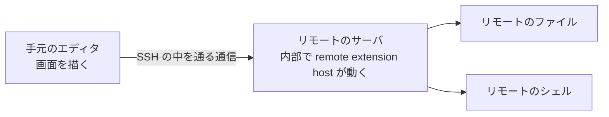

# はじめに

Kiro には Remote-SSH がありません。1.0.437 で確かめた話です。ここが少し変わっているのは、**リモート側で動かすサーバは配布されているのに、それに接続する拡張だけが同梱されていない**という状態だからです。だからリモートのホストを開こうとしても繋がらず、ターミナルもエージェントも手元で動き続けます。GPU の載ったマシンに繋いで `nvidia-smi` を叩きたいのに、手元の macOS で実行されて失敗する、というのが実際に困った形でした。

部品はあって、繋ぐ側だけが無い。それなら書けるはずだと思って作ったのが [littlemex/kiro-remote-ssh](https://github.com/littlemex/kiro-remote-ssh) です。[Kiro](https://kiro.dev) や AWS の公式なものではありません。

作ってみて意外だったのは、難しさが SSH の通信ではなく、**エディタを強制終了したときに何が残るか**に集まっていたことでした。

リモート接続を張ると、消えてほしいものが 2 種類できます。ひとつは手元のマシンで待ち受けているポートで、リモート側の画面をブラウザで開くために作るものです。残ると、そのポート経由でリモートのサービスに繋がる口が開いたままになります。もうひとつはリモートに置く Kiro のサインイン情報です。手元で 1 回サインインすれば向こうでは聞かれないようにしたくて、認証情報をリモートのファイルに置く実装を試しました。残ると、接続先のマシンに自分の認証情報を置いたままにすることになります。

どちらも「接続を終わるときに消す」処理を書いてありました。そして二度とも消えませんでした。エディタを強制終了すると、その処理自体が動かないからです。この記事はそこを中心に書きます。

## この記事の前提

記事に出てくる測定は、次の環境で行ったものです。`ssh` の挙動はバージョン差があるので、数字はこの環境に紐づいています。

| 項目 | 値 |
|---|---|
| 手元のマシン | macOS、OpenSSH 10.3 (他のクライアント OS は未検証) |
| リモート | Ubuntu 24.04、x86_64、glibc 2.39 |
| エディタ | Kiro 1.0.437 |

手元が Windows の場合は対応していません。この設計は接続の多重化を前提にしているのに、Windows の OpenSSH は `ControlMaster` を実装していないためです。パスフレーズを尋ねる経路も異なります。WSL のなかで動かすならクライアントは Linux になるので、そちらは動く可能性がありますが、試していません。

拡張がリモートのサーバをどう起動し、ポートや接続トークンをどう受け取るかは、記事が長くなりすぎるので扱いません。そこはリポジトリの `docs/DESIGN.md` に書いてあります。この記事は、終了時に何が残るかの設計に絞ります。

# 動いている様子

先に完成形を出します。`~/.ssh/config` に書いたホストが一覧に出ます。


ホストを選ぶと、そのマシンのフォルダを開いた状態で新しいウィンドウが開きます。左下に接続先が出ています。


ターミナルを開くと、シェルはリモートで動いています。手元は macOS なので、`uname` が Linux を返しているのは接続先で実行されている場合と整合します。


# そもそも何が動いているのか

Remote-SSH を使うと、リモート側にサーバプログラムが置かれて動き出します。その中で拡張機能を実行する部分を **remote extension host** と呼びます。どの拡張が手元で動きどれが向こうで動くかは、[拡張機能の作者向けの解説](https://code.visualstudio.com/api/advanced-topics/remote-extensions)にまとまっています。エディタ本体は手元にありますが、ファイルを開く、ターミナルを作る、ワークスペース側の拡張を動かすといった仕事は、このリモートのサーバが引き受けます。

関係を単純化すると、こうなります。



手元のエディタとリモートのサーバが主役で、ファイルとシェルはサーバが操作する対象です。

ここで最初の疑問が出ます。リモートのサーバは、どこから来るのでしょうか。

答えは、エディタの開発元が配布しています。Kiro をインストールしたフォルダには `product.json` という設定ファイルがあり、そこにダウンロード先が書かれています。実際にこの URL から取得してリモートで起動できたので、配布されていることは確認済みです。次は Kiro 1.0.437 のもので、関係する部分だけを抜き出しています。キーの位置は派生エディタごとに違うので、自分の環境のものを見てください。

```json
{
  "serverApplicationName": "kiro-server",
  "serverDataFolderName": ".kiro-server",
  "remote": {
    "SSH": {
      "serverDownloadUrlTemplate": "https://…/kiro-reh-${os}-${arch}.tar.gz"
    }
  }
}
```

このサーバはエディタのコミットハッシュに紐づいています。エディタを更新すると、更新後のエディタは古いサーバを使えないので、新しいコミット用を取り直すことになります。実装するなら考慮が必要なところです。

この URL から取ってきて起動するところまでを、欠けている拡張の側がやることになります。そしてダウンロードも起動も、リモートでコマンドを実行できて初めて可能になります。だから最初に決めるべきは、その SSH 接続を誰が作るかでした。

# 既存の選択肢に何があったか

自作する前に、入手できる拡張をいくつか読みました。名前は出しませんが、見つかった課題は次の 4 種類です。どれかに当たると、そのままでは使えません。

**そのエディタでは動かない。** VS Code 向けに書かれたものは、サーバの取得 URL を VS Code のコミットから組み立てます。派生エディタのコミットではその URL が存在しないので、取得の段階で失敗します。

**リモートウィンドウではない。** SFTP でリモートのファイルを開けるだけのものがあります。ファイルは見えるので一見それらしく動きますが、ターミナルもエージェントも手元で動き続けるので、最初に困っていたことは解決しません。

**SSH の実装を配布物に抱えている。** 同梱しているライブラリの更新が数年止まっていて、その間に出た対策が入っていないものがありました。接続先が本物かを確認する処理が見当たらないものもありました。これが何を意味するかは次の節に書きます。

**転送用の待ち受けが広く開く。** 転送のために待ち受けを作るとき、bind するアドレスを指定しないと、そのマシンのどのインターフェースからでも届く状態になります。認証のない SOCKS プロキシが既定で有効になっているものもありました。

前の 2 つは互換性の話で、書き直せば済みます。後ろの 2 つは設計の話で、こちらがこの記事で書く 2 つの判断をそのまま決めました。

# SSH のプロトコルは実装しない

SSH をどう扱うかには 3 つの道があります。プロトコルを自分で実装する、既存の JavaScript ライブラリに載せる、システムの `ssh` に委譲する。前の 2 つは、どちらも配布物のなかに SSH の実装を抱えることになります。

抱えるのをやめた理由は、**一度持つと降りられない**ことです。ホスト鍵の照合、鍵の種類ごとの扱い、暗号方式の選択と再交渉、`ssh-agent` や FIDO2 との連携、`ProxyCommand`、そして後から出てくる勧告への追随。たとえば [CVE-2023-48795](https://www.cve.org/CVERecord?id=CVE-2023-48795)、通称 [Terrapin](https://terrapin-attack.com/) は、通信を中継できる攻撃者がハンドシェイク直後のメッセージを削って機能の合意を弱められるというものです。成立するのは `chacha20-poly1305@openssh.com` や `-etm@openssh.com` 系の MAC を使っている場合で、OpenSSH は [9.6](https://www.openssh.com/txt/release-9.6) で strict KEX という対策を入れました。配布物のなかに SSH の実装を抱えていると、こうした勧告への追随は自分の責任になります。自分で書いた場合は対策そのものを実装することになり、ライブラリに載せた場合でも、対策が入った版に上げて配り直すまでは利用者が古いままです。

しかも追随を怠ったとき、それは利用者からは見えにくいままです。エディタが自分の代わりにどの検査をしているのかを確かめるには、ソースを読むか通信を観測するかしかありません。

そこで設計の中心をこう決めました。**SSH のプロトコルと暗号処理は一切実装せず、接続の判断は全部システムの `ssh` コマンドに任せる。**

「一切書かない」のはプロトコルと暗号の部分です。`ssh` の起動、引数の組み立て、パスフレーズを尋ねる画面の橋渡し、標準入出力の中継は拡張側で書いています。任せているのは、どの鍵を使うか、相手が本物か、どの暗号方式で話すか、といった判断です。

上書きしているオプションは書いておきます。転送とリモートコマンドに関わるもの (`ClearAllForwardings`、`PermitLocalCommand`、`RequestTTY`、`ExitOnForwardFailure`)、接続の共有に関わるもの (`ControlMaster`、`ControlPath`、`ControlPersist`)、生存確認の間隔 (`ServerAliveInterval`、`ServerAliveCountMax`) です。**ホスト鍵の扱いと暗号方式に関わるオプションは 1 つも指定していません。** `StrictHostKeyChecking` も `known_hosts` の場所も触らないので、初めて繋ぐホストの確認は利用者に出ます。自動で受け入れることはしません。

パスフレーズについては、拡張のプロセスを通ります。`ssh` が尋ねてきた文字列を受け取って入力欄に出し、入力された文字列を返す橋渡しをしているからです。橋渡しが扱うのは尋ねる文と答えの文字列だけで、鍵そのものは見ませんし、保存もログ出力もしません。

得られるものは大きいです。接続先の確認方法も暗号方式も、利用者が普段使っている OpenSSH の設定とポリシーがそのまま効きます。踏み台を経由する `ProxyCommand` の設定も効きます。パスフレーズ付きの鍵や `ssh-agent` は実機で動かしました。FIDO2 のセキュリティキーは、`ssh` 側で使える構成なら同じように動くはずですが、私は試していません。

委譲の効果がはっきり出た場面があります。私が使っているサーバのひとつは、AWS の Session Manager 経由でしか到達できません。`~/.ssh/config` はこうなっています。

```ssh-config
Host my-host
  HostName i-0123456789abcdef0
  ProxyCommand sh -c "aws ssm start-session --target %h --document-name AWS-StartSSHSession --parameters 'portNumber=%p'"
```

`HostName` に書いてあるのは DNS 名ではなくインスタンス ID なので、これを名前として解決しようとしても通常は失敗します。接続できるのは `ProxyCommand` を解釈する側だけです。

`ssh` に任せていると、少なくともこのホストには追加設定なしで接続できました。逆に自分で SSH を実装するなら、`ProxyCommand` の起動と標準入出力の受け渡しも自分で実装することになり、`ProxyJump` や `Match exec` も同じ話が続きます。委譲という判断が、そのまま利用者の環境の多様さに効いてきます。

# 待ち受けるソケットを誰が持つか

ここからが、この実装でいちばん頭を使った部分です。

リモートで動く拡張が「ユーザーのブラウザでこの画面を開いてほしい」と言うことがあります。サインインの戻り先などです。しかしその画面はリモート側のポートで待っているので、手元のブラウザからは見えません。そこで、手元のあるポートをリモートのポートに繋ぐ「トンネル」が必要になります。

`ssh` にはこれを行う `-L` というオプションがあります。素直に使えば済む話に見えました。

## なぜ接続を多重化するのか

先に、この節の表を読むために必要な話をします。

`ssh` には多重化という機能があります。一度確立した接続を裏で保持しておき、以降の `ssh` はその接続に乗る、というものです。設定名は `ControlMaster` と `ControlPath` で、[ssh_config の man](https://man.openbsd.org/ssh_config.5) には「以降のセッションはマスタの接続を再利用しようとする」と書かれています。これを使うと認証が 1 回で済みます。使わないと、トンネルを 1 本作るたびに認証が走ります。パスフレーズやセキュリティキーを使っている人には毎回タッチを要求することになり、リモートに溜まるセッションも増えます。なので多重化は使いたい機能です。

保持している側のプロセスを、ここでは多重化の親と呼びます。この拡張は共有用のパスを利用者の設定とは別に自分で決めているので、親も接続先ごとに拡張が持つことになります。

## 3 通り試して、いずれも待ち受けが残った

問題は、エディタが強制終了されたときに何が残るかでした。トンネルは手元のマシンでポートを待ち受けているので、残ってしまうと、そのポートを経由してリモート側の特定のサービスに接続できる状態が続きます。待ち受けは `127.0.0.1` に限っているので同じマシンの中からに限られますが、消えてほしいものが消えていないのは同じです。

`ssh` に待ち受けさせる書き方を 3 通り試して、いずれも待ち受けが残りました。`ssh -O forward` で既存の接続に追加する形、`-N -L` の形、`-L` にリモートコマンドを付ける形です。待ち受けているソケットの持ち主が、こちらが起動した子ではなく多重化の親なので、子を殺しても消えません。実際、`ps` に残った多重化の親が 9 個まで溜まり、それに応じてリモート側のセッションも増えていました。破棄するときに閉じるつもりだったのに、破棄の処理そのものが走らなかったからです。

ここで当然「多重化をやめれば解決するのでは」と思います。試すと確かに待ち受けは自分の `ssh` と一緒に死にます。しかし前節の理由で、トンネルごとに認証が走るようになります。しかも手元のプロセスを強制終了したときに子が道連れになる保証はありません。Linux の [`PR_SET_PDEATHSIG`](https://man7.org/linux/man-pages/man2/prctl.2.html) のように、親プロセスの終了をカーネルが自動で子に伝える仕組みが macOS にはないので、孤児として生き残り得ます。

試した 3 通りに共通しているのは、**`ssh` に待ち受けさせている限り「`ssh` が終了を決める」という同じ問題に戻る**ことです。だとすれば、待ち受けを自分のプロセスが持つしかありません。

実装をこう変えました。エラー処理を省いた概念コードで、`spawnSsh` は自作の関数です。

```typescript
const server = net.createServer((socket) => {
    const child = spawnSsh(['-W', `127.0.0.1:${remotePort}`, host]);
    socket.pipe(child.stdin);
    child.stdout.pipe(socket);
});
server.listen(0, '127.0.0.1');
```

`-W host:port` は、`ssh` の標準入出力をそのままリモートの `host:port` への接続として扱うオプションです ([ssh の man](https://man.openbsd.org/ssh.1))。`-L` と違って、どこにも待ち受けを作りません。手元のブラウザから来たバイト列を `ssh` の標準入力に流し込めば、それがそのままリモートのポートに届き、返りは標準出力から出てきます。**トンネルの中身を運ぶのは `ssh` だが、待ち受けは自分が持つ、という分担です。**

だから待ち受けは [`net.createServer`](https://nodejs.org/api/net.html#netcreateserveroptions-connectionlistener) が作ったものだけになり、その持ち主は拡張が動いている手元のプロセスです。

実物では、標準エラー出力を読み捨てるとパイプが詰まるので読んでいますし、`socket` のエラーと切断、子の終了をそれぞれ拾って相手側を閉じています。そのまま写して使う場合はそこを足してください。

こうすると、待ち受けの寿命はカーネルが決めます。プロセスが終わりさえすれば、理由を問わずカーネルがソケットを閉じます。逆に、止まっているだけで終了していない状態 (`SIGSTOP` やデッドロック) は対象外で、そこは待ち受けが残ります。**こちらの後片付けのコードが 1 行も動かなくても消えます。** 強制終了は実測しました。クラッシュも同じプロセス終了なので同じ経路になりますが、そちらは試していません。

リモート側がいつ切断に気づくかは別の話です。手元のプロセスが消えたことを相手が検知できない場合、TCP の生存確認に任せると Linux の既定値 (`tcp_keepalive_time` が 7200 秒、[tcp の man](https://man7.org/linux/man-pages/man7/tcp.7.html)) では 2 時間ほどかかります。そこに頼らないために、多重化した接続にはこちらから期限を持たせています。リモートで動かすコマンドに無通信の待ち時間を持たせ、手元の `ssh` にも生存確認の間隔を指定しています。リモートの `sshd` にも接続を切る設定はありますが、`ClientAliveInterval` の既定は 0 で無効です ([sshd_config の man](https://man.openbsd.org/sshd_config.5)、検証したホストでも `sshd -T` で 0 でした)。リモートの管理者が有効にしている前提は置けません。

所有関係を並べると、変えたのはここだけです。


測ったのは、この拡張が開いた待ち受けの数です。拡張がログに出したポート番号を控えておき、強制終了の前後でそれらが待ち受けているかを調べました。一度の検証で、12 個あった待ち受けが強制終了後は 0 個になりました。孤児として残った `ssh` のプロセスも無いことを確認しています。

副産物もありました。ポート番号をカーネルに割り当てさせるので、「空いているポートを探して、実際に確保するまでの隙間」が消えます。この隙間は地味に危険で、前のセッションの残りが同じ番号を握っていると、新しいセッションの URL が古い接続先を指してしまう可能性がありました。

代償も書いておきます。この方式は接続が来るたびに `ssh` プロセスを起動します。ただし `-S` で既存の接続に乗せているので、認証や鍵交換が毎回走るわけではありません。乗るのはプロセスを起こす分のコストだけです。逆に言えば**この設計は多重化が前提**で、多重化なしでやると接続ごとに認証が走って実用になりません。頻繁に接続する用途での起動コストは測っていません。

# うまくいかなかったこと

リモートで動く AI エージェントは、自分の認証情報をリモートのホームディレクトリのファイルから読みます。だから手元でサインインしても、リモートには何もないので改めて聞かれます。ホストごとに 1 回で済ませたい、というのが最初の動機でした。

結論を先に書くと、3 案作って 3 案とも採用しませんでした。

エディタには拡張同士で認証情報を受け渡す仕組みがあります。しかし使えませんでした。**どのホストにどう繋ぐかを決める処理は、認証情報を提供する側の拡張が使えるようになるより前に走ります。** 認証情報を渡せる唯一のタイミングでは、まだ渡してくれる相手が存在しないのです。存在するまで待つと、接続の準備そのものが進みません。実際に止めてしまい、エディタが接続処理の途中で永遠に待ち続けました。

そこで「認証情報のファイルをリモートに置く」方向に切り替えて、3 通り試しました。

| 案 | どう作ったか | 採用しなかった理由 |
|---|---|---|
| 終了時に削除 | 接続を終了するときにファイルを消す | 強制終了では削除のコードが動かず、認証情報がリモートのホームディレクトリに残ったことを実測で確認した |
| メモリとリンク | 認証情報をメモリだけに置き、そこを指すリンクをファイルの場所に置く | 寿命は保証できたが、読む側のプロセスがリンクを拒否した |
| 普通のファイル | 手元の認証情報をファイルとして書き、更新のたびに上書きする | 利用者がリモートでサインインした認証情報を上書きして消してしまった |

1 案目は「セッションの間だけ置いて、終わったら消す」つもりでした。消す処理を書いてあるので安全だと考えていましたが、実測すると残っていました。終了処理が動くことを前提にした寿命は、強制終了では保証できません。

2 案目は、カーネルに守らせる形にしました。使ったのは Linux の 2 つの仕組みです。[`memfd_create`](https://man7.org/linux/man-pages/man2/memfd_create.2.html) はディスク上に実体を持たない、メモリだけのファイルを作るシステムコールです。[`/proc/<pid>/fd/<番号>`](https://man7.org/linux/man-pages/man5/proc.5.html) は、そのプロセスが開いているファイルをファイルシステムから辿るための特別な場所です。認証情報をメモリだけのファイルに入れ、そこを指すシンボリックリンクを、認証情報のファイルがあるべき場所に置きました。

リンクの先はプロセスが持っているメモリなので、そのプロセスが死ねばカーネルがメモリを解放し、リンクは何も指さなくなります。後片付けのコードは要りません。強制終了で消えることは実機で確認しました。実体がメモリ上にしかなくディスクに書かれないので電源断でも消えるはずですが、そちらは試していません。

正確に言うと、消えるのは中身だけです。置いたリンク自体はファイルとして残り、指し先を失った状態になります。それに PID が再利用されると、リンクが別のプロセスの開いているファイルを指し得ます。「後片付けが要らない」と言えるのは中身についてだけでした。

ところが認証情報を読む側のプロセスに拒否されました。ログにこう出ていました。

```text
Security: symbolic link detected at token storage path
```

認証情報の置き場所がリンクであることを検出して、読むのを拒んでいます。防御として正しい判断です。つまり、私が思いついた中で寿命を保証できる形は、受け取る側が受け付けない形だけでした。

3 案目は普通のファイルに戻しました。読む側は受け付け、AI も動きました。しかし別の壊れ方をしました。こちらが「自分のファイル」と見なした後は更新のたびに上書きするので、利用者がリモート側でサインインすると、その新しい認証情報をこちらの短命なコピーで上書きし、セッション終了時に削除してしまいます。結果、サインイン画面が何度も戻ってきます。書き込む側が 2 つあるのに、どちらが持ち主かを決めていなかったのが原因です。

最終的に、この機能は入れないことにしました。ホストごとに 1 回サインインすれば、認証情報はそれを使う拡張と同じ場所に置かれ、その拡張が自分で更新します。複製も、寿命の保証も、上書きの事故も起きません。1 回のサインインを省くために、複製と寿命と所有権という 3 つの難問を自分で作っていた、というのが結論でした。

# サプライチェーンについて考えたこと

ここからは実装ではなく、配布物をどう信頼してもらうかの話です。

この拡張は利用者のマシンと、その接続先でコマンドを実行します。それだけの信頼を求めるので、「悪いことをしていない」を言葉ではなく検査で示す方法を考えました。

いちばん効いたのは npm の実行時依存をゼロにすることです。SSH を自分で書かないと決めたので、ライブラリを抱える必要がありません。もちろんシステムの `ssh` には全面的に依存していますが、それは配布物に他人のコードを同梱するのとは別の話です。配布物に入るのは、バンドルした自分のコードだけです。

そして、その状態を人間の記憶ではなく検査で守るようにしました。

```text
ok    the extension has no runtime dependencies
ok    this package defines no install-time scripts
ok    the bundle contains no hardcoded network endpoints
ok    the bundle contains no telemetry library
ok    the published archive contains exactly the expected files
```

検査の強さは正確に書いておきます。真ん中の 2 つは、配布物の中から URL らしい文字列と既知の計測ライブラリの名前を探しているだけです。難読化や独自実装まで否定できるものではありません。**言えるのは「既知の形のものが混入したら CI が落ちる」ということで、それ以上ではありません。** それでも、宣言だけの主張より強度はあります。最後の「配布物に入るファイルを固定する」という検査は、想定していないファイルが配布物に入ったときに落ちます。

ただしその検査自体に、ここまで書いた失敗と同じ形の欠陥がありました。ファイル一覧を取る道具が動かなかったとき、検査は「取れませんでした」と書き残すだけで合格を出していました。**見えなかったときに合格を出す検査は、見ていないことを隠します。** 取れなかった場合は失敗にしました。

依存の数も減りました。ただし**減ったのは日常の開発環境で入る数で、リリース経路で走る他人のコードは減っていません。** `.vsix` を作る道具を常設の依存から外し、リリースのときにだけ取得する形にしたので、リスクは移動しただけです。数字を出すと、この測定環境で [`npm ls`](https://docs.npmjs.com/cli/v10/commands/npm-ls) に `--all --parseable` を付けて数えた「日常の開発環境で入るパッケージ数」が 274 個から 6 個になりました。TypeScript とバンドル道具は開発用の依存として残っています。

そこも正直に書く必要があります。**リリースを作る機械で他人のコードは走っています。** 検査が保証しているのはもっと狭いことです。常設の依存をインストールするときは、パッケージが自分で走らせるスクリプトを無効にしています。ただしリリース時に取得する `.vsix` の道具はその経路の外にあるので、そこには同じ制約がかかっていません。CI のアクションはすべて 40 桁の commit SHA で固定しています。

配布物の同一性についても区別しました。バンドルしたスクリプトについては、CI が同じ木から二度ビルドして一致することを検査しています。これが示すのは同じ環境での決定性までで、別の環境でも同じになることの証明ではありません。ただ公開した digest があるので、読者が自分で再ビルドして比べることはできます。一方 `.vsix` は zip なので作成時刻が埋まり、今の作り方では一致しません。そこは「再現する」と書かずに、識別のために digest を公開し、[署名付きの由来証明](https://github.com/actions/attest-build-provenance)で補う形にしました。仕組みの背景は [SLSA](https://slsa.dev/) にまとまっています。

# まとめ

手元のエディタでリモートのマシンを触る仕組みを作ってみて、難しかったのは通信ではなく寿命の設計でした。

SSH のプロトコルを自分で持たないと決めたことが、いちばん効いた判断です。接続先の確認も暗号方式も踏み台の設定も、利用者の環境がすでに持っているものがそのまま効きます。おかげで npm の実行時依存が 0 になり、サプライチェーンの主張も検査に落とせました。

後片付けは思ったより難しく、二度失敗しました。どちらも「終わるときに自分のコードが動くこと」を前提にしていたからです。強制終了ではそれが動かないので、消えてほしいものは自分のプロセスに持たせてカーネルに閉じさせるか、そもそも作らないかのどちらかにしました。サインインを 1 回省こうとした機能を捨てたのも同じ理由で、省いて得られるものと、複製と寿命と所有権を管理する手間が釣り合っていませんでした。

作ったものは [littlemex/kiro-remote-ssh](https://github.com/littlemex/kiro-remote-ssh) にあります。設計の詳細と、何を検証して何を検証していないかはリポジトリの `docs/DESIGN.md` に書いてあります。リモートでコードを実行する拡張は、それ自体が信頼を要求するものなので、入れる前に中身を読める大きさに保つことを意識しました。
