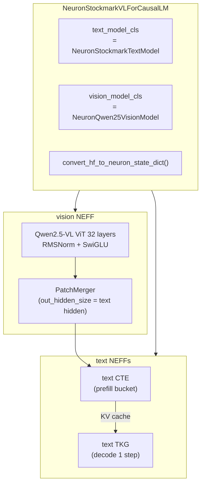

## 事前知識

NxD Inference にカスタムモデルを統合する設計判断の前提知識

https://zenn.dev/tosshi/articles/81840c7c10dddd

Trainium 系インスタンスを CB で確保する手順

https://zenn.dev/tosshi/articles/a18dce7d66424d

## はじめに

本記事では、画像 + テキストのマルチモーダルモデル **Qwen2.5-VL** を AWS Trainium2 上の **NxD Inference (NxDI)** で動かすサンプルを解説します。対象は次の 2 モデルです。

- `Qwen/Qwen2.5-VL-7B-Instruct`（公式 7B Instruct）
- `stockmark/Stockmark-DocReasoner-Qwen2.5-VL-32B`（DocReasoner 32B、Qwen2.5-VL 系）

サンプル一式は [`littlemex/aws-neuron-samples` の `samples/models/qwen2.5-vl-nxd/`](https://github.com/littlemex/aws-neuron-samples/tree/main/samples/models/qwen2.5-vl-nxd) に配置済みで、`trn2.3xlarge` で動作確認しています。

:::message alert
NxDI 0.10 / NxD 0.19 / torch 2.9.1 / transformers 4.57.6 時点のバージョンに基づいています。具体的なパッケージバージョンは §3.3 を参照してください。AWS Neuron SDK のアップデートや HuggingFace Transformers の更新で挙動が変わる可能性があるため、最新の実装を必ず確認してください。
:::

本サンプルは、**NxDI を直接叩き、HuggingFace の `GenerationMixin` 互換アダプタ (`HuggingFaceGenerationAdapter`) で `generate()` する**経路を採用します。


*図1: CPU → Neuron デバイス間のデータフロー。画像前処理 (AutoProcessor) と generate ループ (HuggingFaceGenerationAdapter) は CPU 側に留まり、3 NEFF は Neuron 上で実行される。*

NxDI は `compile()` 1 回でこの 3 NEFF（vision encoder / text CTE / text TKG）をまとめて生成し、`load()` で全てを Neuron デバイスに載せます。

### 動作確認済み構成

| モデル | HW | TP | LNC | 結果 |
|---|---|---|---|---|
| `Qwen/Qwen2.5-VL-7B-Instruct` | trn2.3xlarge | 2 | 2 | dummy gray + real 3 image いずれも coherent |
| `stockmark/Stockmark-DocReasoner-Qwen2.5-VL-32B` ※ | trn2.3xlarge | 8 | 1 | cos=0.999938 / 日英 sanity 6/6 / avg greedy 93.75% |

※ 32B の数値は EXP-1037 (旧コードベース) で確認済みの実績です。本記事のサンプル `compile_qwen25vl.py` での 32B 直接実行は本記事執筆時点で未検証ですが、コアロジック（M-RoPE / RMSNorm + SwiGLU / from_pretrained）は同一です。

7B Instruct は `compile 239 秒 + load 19 秒` で 3 NEFF が揃い、ダミーのグレー 448x448 画像 + `What do you see in this image?` プロンプトに対し coherent な英語応答 (degenerate=False, verdict=A) が得られました。

## §1 全体アーキテクチャ

### NxDI の Image-to-Text 三段構成

NxDI は VLM を 3 つの NEFF（vision encoder / text CTE / text TKG）に分解してコンパイルします。



*図2: `NeuronStockmarkVLForCausalLM` のクラス階層。`text_model_cls` と `vision_model_cls` のみを差し替えることで Qwen2-VL の既存コンパイルパスを再利用している。*

`NeuronStockmarkVLForCausalLM` は NxDI の `NeuronQwen2VLForCausalLM` をサブクラス化したコーディネータで、`text_model_cls` と `vision_model_cls` を **Qwen2.5-VL 用に差し替える**だけで残りは Qwen2-VL と同じ仕組みに乗せています。

| 役割 | クラス | 主な担当 |
|---|---|---|
| 上位 | `NeuronStockmarkVLForCausalLM` | text/vision クラス選択、`from_pretrained` での 7B/32B config 吸収、weight 変換ルート分割 |
| Text | `NeuronStockmarkTextModel` / `NeuronStockmarkTextForCausalLM` | M-RoPE 対応、cos_cache stale 回避、`vision_token_id` への vision embedding scatter |
| Vision | `NeuronQwen25VisionModel` / `NeuronQwen25VLForImageEncoding` | RMSNorm + SwiGLU の Qwen2.5-VL 互換 vision tower |

（クラス名は 32B 先行実装 (EXP-1037) の `Stockmark` プレフィックスを引き継いでいます。7B でも同一クラスを使用します。ファイル名 `modeling_qwen25vl.py` とのプレフィックス不一致はこのためです。）

### ファイル構成

```
samples/models/qwen2.5-vl-nxd/
├── README.md                       # セットアップ / 実行 / 落とし穴
├── modeling_qwen25vl.py            # top-level VLM orchestrator
├── modeling_qwen25vl_text.py       # M-RoPE 対応 text backbone
├── modeling_qwen25vl_vision.py     # Qwen2.5-VL vision tower (RMSNorm + SwiGLU)
├── compile_qwen25vl.py             # 3 NEFF compile + dummy gray smoke generate
└── sanity_qwen25vl.py              # text NEFF 用 6 prompt sanity
```

## §2 実装の重要ポイント (8 箇所、3 カテゴリ)

NxDI 上で Qwen2.5-VL を動かすには、大きく「実行環境設定」「config 解析」「アーキテクチャ差分」の 3 カテゴリ、合計 8 箇所に対処が必要です。順に解説します。

### 2A. 実行環境・設定

#### Point 1: `padding_side="right"` が NxDI の唯一の正解

NxDI の `ModelWrapper.pad_inputs()` は **hardcoded で right-pad を行い、`padding_side` を参照しません**。これに気づかず `padding_side="left"` + 事前 left-pad + masked_fill 補正で組むと、日本語 prompt の生成が 3 step で破綻します。

| 設定 | 英語 greedy match (16 tokens) | 日本語 |
|---|---|---|
| left-pad + padding_side=left（誤） | 2/16 | 3 step で破綻 |
| **right-pad + padding_side=right（正）** | **14-16/16** | HF と同等 |

サンプルでは `compile_qwen25vl.py` で次のように明示しています。

```python
text_nc = m_text.StockmarkTextNeuronConfig(
    tp_degree=TP_DEGREE,
    logical_nc_config=1,
    torch_dtype=torch.bfloat16,
    batch_size=BATCH,
    seq_len=SEQ_LEN,
    max_context_length=MAX_CONTEXT_LEN,
    n_positions=SEQ_LEN,
    max_new_tokens=MAX_NEW_TOKENS,
    max_length=SEQ_LEN,
    on_device_sampling_config=None,
    vocab_parallel=False,
    fused_qkv=False,
    padding_side="right",   # <-- これが必須
)
```

加えて `forward()` / `prepare_inputs_for_generation()` の override は **書かない**のが正解です。left-pad 用の masked_fill 補正は right-pad では不要かつ有害です。

#### Point 8: LNC2 は runtime と compiler の両方で指定する

trn2.3xlarge を LNC=2 で使う場合、**runtime 環境変数と compiler フラグの両方で同じ値を設定**します。片方だけだと load 時に LNC 不一致でエラーになります。

```bash
export NEURON_LOGICAL_NC_CONFIG=2          # runtime
export NEURON_RT_VISIBLE_CORES=0-1         # runtime
export NEURON_RT_NUM_CORES=2               # runtime
export NEURON_CC_FLAGS="--target=trn2 --auto-cast=none --lnc=2"   # compiler
```

### 2B. Config 解析・key remap

#### Point 2: `from_pretrained` 自前実装と 7B/32B の config layout 吸収

NxDI の `ImageToTextInferenceConfig` には `from_pretrained` がありません。HF の `config.json` を自分で読んで `text_config` / `vision_config` を組み立てる必要があります。

さらに Qwen2.5-VL は同じシリーズでも config layout が 2 通りあります。

- **32B (Stockmark-DocReasoner)**: `text_config` 配下に `hidden_size` などをネスト
- **7B (公式 Instruct)**: `text_config` が無く top-level に flat 配置

サンプルの `StockmarkVLInferenceConfig.from_pretrained` は両方を 1 関数で吸収します。

```python
text_dict = dict(cfg_dict.get("text_config", {}))
if not text_dict:
    # flat layout: extract text keys from the top level
    _text_top_keys = (
        "hidden_size", "num_hidden_layers", "num_attention_heads",
        "num_key_value_heads", "head_dim", "intermediate_size",
        "max_position_embeddings", "rms_norm_eps", "rope_theta",
        "rope_scaling", "hidden_act", "vocab_size",
        "tie_word_embeddings", "torch_dtype", "use_cache",
        "attention_dropout", "initializer_range",
        "max_window_layers", "sliding_window", "use_sliding_window",
    )
    text_dict = {k: cfg_dict[k] for k in _text_top_keys if k in cfg_dict}
```

`pad_token_id` は Qwen2.5-VL では `None` で出てくるので `eos_token_id` にフォールバックします（NxDI の `validate_config()` は `text_config.pad_token_id` の存在を要求するため）。

#### Point 3: vision_config の key remap 4 箇所

HF Qwen2.5-VL の `vision_config` と NxDI の Qwen2-VL ベースクラスで key 名が違います。

| HF 側 key | NxDI 側 key | 操作 |
|---|---|---|
| `in_chans` | `in_channels` | リネーム |
| `hidden_size` | `embed_dim` | 複製 |
| `intermediate_size / hidden_size` | `mlp_ratio` | 計算 |
| `out_hidden_size` | `hidden_size` (上書き) | merger 出力次元を text hidden に揃える |

特に最後の **`out_hidden_size` を `hidden_size` に上書き**しないと、PatchMerger の出力次元が `1280` のままになり、text 側の `3584`（7B）/`5120`（32B）への scatter で shape mismatch を起こします。

#### Point 7: `transformers >= 4.52` の `layer_types` 二重 truncate

`num_hidden_layers` を縮める場合、top-level と `text_config` の **両方の `layer_types` を truncate** する必要があります。片方だけだと validation error になります。

```python
def _truncate_layers(cfg, n):
    if hasattr(cfg, "num_hidden_layers"):
        cfg.num_hidden_layers = n
    if hasattr(cfg, "layer_types") and cfg.layer_types is not None:
        cfg.layer_types = list(cfg.layer_types)[:n]
    if hasattr(cfg, "text_config") and cfg.text_config is not None:
        tc = cfg.text_config
        if hasattr(tc, "num_hidden_layers"):
            tc.num_hidden_layers = n
        if hasattr(tc, "layer_types") and tc.layer_types is not None:
            tc.layer_types = list(tc.layer_types)[:n]
```

### 2C. アーキテクチャ差分

#### Point 4: M-RoPE の cos_cache stale 回避

NxDI の `NeuronAttentionBase` は CTE で計算した `cos_cache` / `sin_cache` を TKG ステップにそのまま引き継ぎます。Llama 系の RoPE では問題ありませんが、**M-RoPE は position-dependent なので毎ステップ再計算が必要**です。

引き継ぎが起きると、TKG ループが「prefill 末尾の position」での rotary を使い回し、`Paris.` の無限ループや日本語ひらがな繰り返しを生成します。

サンプルでは `apply_rotary_embedding` を以下のように override しています（コメントは要約。実ファイルには `Root cause of TKG divergence (Agent investigation 2026-05-07)` から始まる詳細な根本原因説明が付いています）。

```python
def apply_rotary_embedding(
    self, Q, K, V, position_ids, cos_cache, sin_cache, use_polar_compatible_rope
):
    if self.rotary_emb is not None:
        # Always recompute per step (XLA fusion absorbs the cost when
        # shapes are static within a NEFF).
        cos_cache, sin_cache = self.rotary_emb(V, position_ids)
        Q, K = apply_multimodal_rotary_pos_emb(
            Q, K, cos_cache, sin_cache, self.mrope_section
        )
    return Q, K, cos_cache, sin_cache
```

#### Point 5: Vision tower の RMSNorm + SwiGLU 刷新

Qwen2-VL → Qwen2.5-VL で vision encoder が以下のように変更されました。

| 項目 | Qwen2-VL | Qwen2.5-VL |
|---|---|---|
| `norm1`/`norm2`/`merger.ln_q` | LayerNorm（weight + bias） | **RMSNorm（weight only）** |
| VisionBlock MLP | `fc1 + GELU + fc2`（2-matrix） | **`gate_proj + up_proj + down_proj`（SwiGLU 3-matrix）** |

NxDI 公式の Qwen2-VL クラスをそのまま使うと、checkpoint ロード時に大量の `missing_keys`（`norm.bias`）と `unexpected_keys`（`gate_proj/up_proj/down_proj`）が出て、vision embedding が garbage になります。

サンプルでは `modeling_qwen25vl_vision.py` で Qwen2.5-VL 互換クラスを実装しています。SwiGLU MLP の Tensor Parallel は次のような形です。

```python
class Qwen25VLVisionMlp(nn.Module):
    def __init__(self, dim, hidden_dim, hidden_act, dtype=torch.bfloat16):
        super().__init__()
        self.gate_proj = ColumnParallelLinear(dim, hidden_dim, gather_output=False, dtype=dtype)
        self.up_proj   = ColumnParallelLinear(dim, hidden_dim, gather_output=False, dtype=dtype)
        self.down_proj = RowParallelLinear(
            hidden_dim, dim, input_is_parallel=True, dtype=dtype, reduce_dtype=dtype
        )
        self.act_fn = ACT2FN[hidden_act]

    def forward(self, x):
        return self.down_proj(self.act_fn(self.gate_proj(x)) * self.up_proj(x))
```

#### Point 6: `eos_token_id` は 2 値必要

`<|im_end|>=151645` だけだと `<|endoftext|>=151643` で止まらず、生成が `max_new_tokens` まで走り切ります。両方を `GenerationConfig` に渡します。

```python
gen_config = GenerationConfig(
    max_new_tokens=MAX_NEW_TOKENS,
    do_sample=False,
    repetition_penalty=1.05,
    pad_token_id=processor.tokenizer.pad_token_id,
    eos_token_id=[151645, 151643],
)
```

## §3 実機での動作確認手順（trn2.3xlarge / Qwen2.5-VL-7B-Instruct）

ここから実際に手を動かして再現する手順です。本記事の検証は `ap-southeast-4`（Melbourne）の Capacity Block で確保した `trn2.3xlarge` インスタンスで行いました。他リージョンでも動作しますが、`sa-east-1`（São Paulo）では HF Hub の xet バックエンドが遅い場合があります（§3.4 参照）。

:::message
trn2.3xlarge は 1 Neuron device（96 GB HBM、4 物理コア）を持つ最小構成です。Qwen2.5-VL-7B は LNC=2、TP=2 で 1 NeuronCore あたり ~9 GB に収まります。
:::

### 3.1 インスタンス起動

trn2.3xlarge は **オンデマンドでは多くのリージョンで常に空きがなく、起動しようとすると即座に `InsufficientInstanceCapacity` エラーになります**。Capacity Block (CB) なしでは事実上起動不可能です。CB の取り方は別記事を参照してください。

https://zenn.dev/tosshi/articles/a18dce7d66424d

起動時の AMI は **AWS Neuron DLAMI**（Ubuntu 24.04 ベース）を選びます。本記事執筆時点では NxDI 0.10 / NxD 0.19 / torch 2.9.1 / transformers 4.57.6 / torchvision 0.24.1 が同梱されています。

```bash
# 起動後の確認
$ /opt/aws/neuron/bin/neuron-ls
+--------+--------+----------+--------+--------------+----------+------+
| NEURON | NEURON |  NEURON  | NEURON |     PCI      |   CPU    | NUMA |
| DEVICE | CORES  | CORE IDS | MEMORY |     BDF      | AFFINITY | NODE |
+--------+--------+----------+--------+--------------+----------+------+
| 0      | 4      | 0-3      | 96 GB  | 0000:33:00.0 | 0-11     | 0    |
+--------+--------+----------+--------+--------------+----------+------+
```

### 3.2 リポジトリの取得

```bash
cd ~
git clone https://github.com/littlemex/aws-neuron-samples.git
cd aws-neuron-samples/samples/models/qwen2.5-vl-nxd
ls
# README.md  compile_qwen25vl.py  modeling_qwen25vl.py
# modeling_qwen25vl_text.py  modeling_qwen25vl_vision.py  sanity_qwen25vl.py
```

### 3.3 venv の有効化と依存確認

NxDI 用の venv を有効化します。**vLLM 用 venv ではなく `_nxd_inference` の方を使う**点に注意してください（torch のバージョンが違うため両者は併用できません）。

```bash
# DLAMI によってパスが異なります。次のコマンドで venv 名を確認してから activate してください。
ls /opt/aws_neuronx_venv_*nxd_inference*/bin/activate

source /opt/aws_neuronx_venv_pytorch_2_9_nxd_inference/bin/activate

python -c "
import importlib.metadata as m
for p in ['neuronx_distributed_inference','neuronx_distributed','torch','transformers','torchvision','torch_neuronx']:
    print(p, m.version(p))
from transformers import Qwen2_5_VLForConditionalGeneration; print('Qwen2_5_VL OK')
from neuronx_distributed_inference.models.qwen2_vl.modeling_qwen2_vl import NeuronQwen2VLForCausalLM; print('Qwen2VL adapter OK')
from neuronx_distributed_inference.utils.hf_adapter import HuggingFaceGenerationAdapter; print('HFGenerationAdapter OK')
"
```

期待出力:

```text
neuronx_distributed_inference 0.10.17970+8548ba25
neuronx_distributed 0.19.28093+fc70b593
torch 2.9.1                  # 2.9.x 系であれば OK（2.9.1 以外でも動作します）
transformers 4.57.6          # README の "< 4.53" 制約は古い。4.57.6 で動作確認済み
torchvision 0.24.1
torch_neuronx 2.9.0.2.14.27725+e2ff0410
Qwen2_5_VL OK
Qwen2VL adapter OK
HFGenerationAdapter OK
```

### 3.4 Hugging Face checkpoint のダウンロード

`Qwen/Qwen2.5-VL-7B-Instruct` は約 16 GB です。本ステップ以降を含めて **合計 40 GB 程度のディスク空き容量**が必要です（HF ckpt 16 GB + `compile_qwen25vl.py` が保存する safetensors 16 GB + NEFF 約 5 GB + compile cache）。事前に `df -h` で確認してください。

公開モデル (`Qwen/Qwen2.5-VL-7B-Instruct`) には HF_TOKEN は不要ですが、 後続の `compile_qwen25vl.py` がローカル checkpoint 不在時に runtime download を試みます。 念のため事前に export しておくと安全です。

```bash
export HF_TOKEN=<your_hf_token>   # 7B Instruct は public なので空でも可。32B など gated model では必須。
export HF_HUB_DISABLE_XET=1       # 一部リージョンで HF Hub の xet が遅いため一律無効化推奨
```

ダウンロード本体。 `$HOME` を Python 側で正しく展開するため `os.path.expanduser` を使います（**python -c の単引用符内で `$HOME` を書くと shell 展開されないので注意**）。

```bash
mkdir -p $HOME/qwen25vl-nxd/hf-ckpt-28l

python - <<"PYEOF"
import os
from huggingface_hub import snapshot_download
snapshot_download(
    repo_id='Qwen/Qwen2.5-VL-7B-Instruct',
    local_dir=os.path.expanduser('~/qwen25vl-nxd/hf-ckpt-28l'),
    ignore_patterns=['*.gguf','*.ggml','*.bin'],
    max_workers=8,
)
PYEOF

du -sh $HOME/qwen25vl-nxd/hf-ckpt-28l
# 16G  /home/ubuntu/qwen25vl-nxd/hf-ckpt-28l
```

### 3.5 環境変数の集約 (compile 直前にここを 1 回流す)

LNC=2 設定 + compile cache + HF token / xet 抑止を 1 ブロックにまとめます。 新しいシェルを開き直したら、 §3.7 の前にこのブロックを再度実行してください。

```bash
# Compile cache (DLAMI 既定の /var/tmp/neuron-compile-cache が他ユーザー所有のことがあるため自前 dir を使う)
mkdir -p $HOME/qwen25vl-nxd/.compile-cache
export NEURON_COMPILE_CACHE_URL=$HOME/qwen25vl-nxd/.compile-cache

# Runtime (LNC=2)
export NEURON_LOGICAL_NC_CONFIG=2
export NEURON_RT_VISIBLE_CORES=0-1
export NEURON_RT_NUM_CORES=2

# Compiler (LNC=2)
export NEURON_CC_FLAGS="--target=trn2 --auto-cast=none --lnc=2"

# HF (gated 用、 7B では空でも可)
export HF_TOKEN=${HF_TOKEN:-}
export HF_HUB_DISABLE_XET=1
```

### 3.6 compile + smoke generate の実行

ここまで揃ったら compile スクリプトを叩きます。NEURON_COMPILE_CACHE_URL も念のため inline で再指定して、 シェルを開き直したケースでも動くようにしています。

```bash
cd $HOME/aws-neuron-samples/samples/models/qwen2.5-vl-nxd

NEURON_COMPILE_CACHE_URL=$HOME/qwen25vl-nxd/.compile-cache \
WORK_DIR=$HOME/qwen25vl-nxd \
HF_CKPT_DIR=$HOME/qwen25vl-nxd/hf-ckpt-28l \
TP_DEGREE=2 NUM_LAYERS=28 \
MAX_CONTEXT_LEN=1024 MAX_NEW_TOKENS=64 \
MODEL_ID=Qwen/Qwen2.5-VL-7B-Instruct \
python compile_qwen25vl.py 2>&1 | tee compile.log
```

:::message
`HF_CKPT_DIR` のデフォルトは `WORK_DIR/hf-ckpt-{NUM_LAYERS}l` です。§3.4 で同じパスにダウンロード済みであれば明示指定は省略可能ですが、`WORK_DIR` を変更した場合は `HF_CKPT_DIR` も合わせて変更してください。
:::

実機で取れたタイムラインの抜粋:

```text
============================================================
Qwen2.5-VL: compile 3 NEFFs (vision encoder + text CTE + text TKG)
  MODEL_ID=Qwen/Qwen2.5-VL-7B-Instruct  TP_DEGREE=2
  NUM_LAYERS=28  MAX_CONTEXT_LEN=1024  MAX_NEW_TOKENS=64  SEQ_LEN=1088
  VISION_BUCKET=1  IMAGE=448x448
============================================================
[HF] reusing checkpoint at /home/ubuntu/qwen25vl-nxd/hf-ckpt-28l
[NxD] building StockmarkVL configs...
[NxD] hidden=3584 text_layers=28 vision_depth=32 vision_embed_dim=1280 patch_size=14
[NxD] constructed, models count=2, vision_models count=1
[NxD] compile -> /home/ubuntu/qwen25vl-nxd/traces/vl-28l (3 NEFFs: vision + text CTE + text TKG)
INFO:Neuron:Done compilation for the priority HLO in 101.00s
INFO:Neuron:Compilation complete for E2E model!
[NxD] compile PASS 239.0s (3.98 min)
[NxD] load PASS 19.0s
[GEN] full: 'system\nYou are a helpful assistant.\nuser\nWhat do you see in this image?\nassistant\nThe image appears to be a blank, solid gray color with no discernible features, objects, or text. It looks like a uniform gray background without any variation or content.'
[GEN] tail: 'The image appears to be a blank, solid gray color with no discernible features, objects, or text. ...'
[METRICS] /home/ubuntu/qwen25vl-nxd/results/metrics-vl.json
[VERDICT] A: VLM generates coherent text for dummy image
```

### 3.7 結果の確認

成果物は次のように残ります。

```bash
$ ls $HOME/qwen25vl-nxd/traces/vl-28l/
neuron_config.json  text_model/  vision_model/

$ cat $HOME/qwen25vl-nxd/results/metrics-vl.json | python -m json.tool | head -20
{
    "model": "Qwen/Qwen2.5-VL-7B-Instruct",
    "num_layers": 28,
    "tp_degree": 2,
    "max_context_len": 1024,
    "max_new_tokens": 64,
    "vision_bucket": 1,
    "image_w": 448,
    "image_h": 448,
    "compile_time_sec": 238.99,
    "status": "pass",
    ...
    "degenerate": false,
    "verdict": "A: VLM generates coherent text for dummy image"
}
```

コンパイル失敗時も同ファイルに `{"status": "compile_fail", "error": "..."}` が出力されます。詰まったら `cat` で先に確認してください。

加えて、 別途 sanity 画像（赤単色 / 左右 2 色 / "HELLO" 文字）を投げる手順が `samples/models/qwen2.5-vl-nxd/README.md` 末尾に整理されています。 dummy gray のみで coherent な応答が得られていれば実画像でも degenerate しないことを EXP-1037 で確認済みです。

生成品質を定量確認したい場合は §5 の sanity スクリプトも参照してください（text NEFF のみを叩くリグレッション確認ツールです）。

### 3.8 GQA 警告について

ログ中に次のような警告が大量に出ますが、本サンプルの設定では実害はありません。

```text
WARNING:Neuron:TP degree (2) and KV heads (4) are not divisible.
Overriding attention sharding strategy to GQA.CONVERT_TO_MHA!
```

この WARNING は TP=2, kv_heads=4 という設定でも出力されました（NxDI の内部 head-sharding 判定は単純な mod 演算とは異なる可能性があります）。verdict が A かつ coherent な出力が得られているため correctness への影響は確認されていません。TP=8 では GQA→MHA 変換が発生し correctness drift が生じます（README 参照）。

TP=4（LNC=1）での throughput 比較は未取得のため今後の課題とします。

## §4 32B (Stockmark-DocReasoner-Qwen2.5-VL-32B) を動かす場合

7B と同じコードベースで 32B も動かせます。設定だけ変えれば OK ですが、 ディスクと RAM の要件が増えるので事前確認が必要です。

:::message alert
32B モデルのダウンロード + 保存には約 60 GB のディスク空き容量、`from_pretrained` 時の bf16 ロードに 64 GB 以上のシステム RAM が必要です。事前に `df -h` / `free -h` で確認してください。
:::

```bash
# 1. 事前ダウンロード
mkdir -p $HOME/qwen25vl-nxd-32b/hf-ckpt-64l
export HF_TOKEN=<your_hf_token>   # 32B は gated なので必須

python - <<"PYEOF"
import os
from huggingface_hub import snapshot_download
snapshot_download(
    repo_id='stockmark/Stockmark-DocReasoner-Qwen2.5-VL-32B',
    local_dir=os.path.expanduser('~/qwen25vl-nxd-32b/hf-ckpt-64l'),
    ignore_patterns=['*.gguf','*.ggml','*.bin'],
    max_workers=8,
)
PYEOF

# 2. 環境変数 (LNC=1)
mkdir -p $HOME/qwen25vl-nxd-32b/.compile-cache
export NEURON_COMPILE_CACHE_URL=$HOME/qwen25vl-nxd-32b/.compile-cache
export NEURON_LOGICAL_NC_CONFIG=1
export NEURON_RT_VISIBLE_CORES=0-7
export NEURON_RT_NUM_CORES=8
export NEURON_CC_FLAGS="--target=trn2 --auto-cast=none --lnc=1"

# 3. compile + smoke
WORK_DIR=$HOME/qwen25vl-nxd-32b \
HF_CKPT_DIR=$HOME/qwen25vl-nxd-32b/hf-ckpt-64l \
TP_DEGREE=8 NUM_LAYERS=64 \
MAX_CONTEXT_LEN=512 MAX_NEW_TOKENS=64 \
MODEL_ID=stockmark/Stockmark-DocReasoner-Qwen2.5-VL-32B \
python compile_qwen25vl.py
```

`num_kv_heads=8` なので TP=8 で割り切れます。EXP-1037（旧コードベース）の検証では full 64-layer で `compile 4.64 min`、HF CPU との probe cos=`0.999938`、日英 6 prompt sanity が `6/6 non-degenerate / avg greedy 93.75%` という結果を得ています。**なお `compile_qwen25vl.py` での 32B 直接実行は本記事執筆時点で未検証です。EXP-1037 では同等ロジックの旧ファイルで動作確認済みです。**

### 7B と 32B の差分は本当に小さい

32B → 7B にコードを移植する際の差分は実質 4 箇所だけです。

| 差分 | 32B (Stockmark-DocReasoner) | 7B (Instruct) |
|---|---|---|
| HF config layout | `text_config` 配下にネスト | top-level に flat |
| `num_kv_heads` | 8 | 4 |
| `num_hidden_layers` | 64 | 28 |
| Module rename | `modeling_stockmark_*.py` | `modeling_qwen25vl_*.py` |

vision tower（RMSNorm + SwiGLU）と M-RoPE 関連の実装はどちらも完全に共通です。

## §5 6 prompt sanity (text NEFF だけを叩く)

`sanity_qwen25vl.py` は text 専用 NEFF を再ロードして 6 prompt（en/ja 各 3）を投げ、HF CPU と比較するスクリプトです。VLM 全体ではなく text 経路だけのリグレッション確認に使います。

:::message alert
`sanity_qwen25vl.py` は **VLM compile (`compile_qwen25vl.py`) が出力する `traces/vl-{N}l/` をそのまま流用できません**（VLM の `text_model` は VLM Application に組み込まれていて単体ロードできないため）。 sanity 用には **別途 text-only な NEFF を `traces/text-{N}l/` などに用意**する必要があります。 現状のサンプルは EXP-1037 の text-only コンパイル成果物 (`traces/text-28l/`) を再利用するシナリオを想定しており、 7B 単体での text-only compile スクリプトは未同梱です。
:::

VLM 経路の動作確認だけが目的であれば §3 で十分です。 §5 は EXP-1037 の text-only NEFF を持っている場合の参考としてご覧ください。

```bash
WORK_DIR=$HOME/qwen25vl-nxd \
NEFF_DIR=$HOME/qwen25vl-nxd/traces/text-28l \
NUM_LAYERS=28 TP_DEGREE=2 \
MAX_CONTEXT_LEN=128 MAX_NEW_TOKENS=16 \
MODEL_ID=Qwen/Qwen2.5-VL-7B-Instruct \
HF_TOKEN=${HF_TOKEN:-} \
python sanity_qwen25vl.py
```

`MAX_CONTEXT_LEN` / `MAX_NEW_TOKENS` は text-only compile 時と同じ値にしてください。NEFF を流用する以上、これを変えると再 compile が必要です。 また `sanity_qwen25vl.py` は HF Hub からトークナイザーを取得するためネットワークアクセスが必要です。 gated モデル (32B) では `HF_TOKEN` が必須です。

参考: 32B (Stockmark-DocReasoner) での実行結果（7B での同等評価は未実施。 7B では一部 token が異なる場合があります）:

```text
[en-short]  CPU: <think> The question asks for the capital of France. ...
            NxD: 完全一致 (16/16)

[ja-short]  CPU: <think>質問は「日本の首都はどこですか。」です。
            NxD: 完全一致 (16/16)
```

## §6 トラブルシューティング

実機で踏みやすい順に並べます。

### 6.1 `libneuronpjrt-path` not found

```text
FileNotFoundError: [Errno 2] No such file or directory: 'libneuronpjrt-path'
```

vLLM 用ではなく NxDI 用の venv を activate してください: `source /opt/aws_neuronx_venv_pytorch_2_9_nxd_inference/bin/activate`。 すでに別の venv を activate している場合は `deactivate` してから再実行してください（§3.3 参照）。

### 6.2 `PermissionError: /var/tmp/neuron-compile-cache/...`

DLAMI で `/var/tmp/neuron-compile-cache` の所有者が別ユーザーになっているケースです。`NEURON_COMPILE_CACHE_URL` をユーザー所有のパスに切り替えます（§3.5 参照）。

### 6.3 vLLM 経由で起動して `Model Qwen2_5_VLForConditionalGeneration is not supported`

```text
ValueError: Model Qwen2_5_VLForConditionalGeneration is not supported on Neuron for now.
Supported models: ['gpt_oss', 'llama', ..., 'qwen2_vl', ..., 'qwen3_vl']
```

vLLM Neuron plugin v0.16 は `qwen2_5_vl` 未対応です。本サンプルの NxDI 直叩き経路を使ってください。

### 6.4 日本語が 3 step で破綻する

`padding_side="left"` 系の設定が残っています。Point 1 を再確認してください。

### 6.5 Decode が `Paris.` / ひらがな繰り返しでループする

cos_cache stale の典型症状です。`apply_rotary_embedding` の override が外れているか、`rotary_emb` を毎ステップ呼んでいるかを確認してください（Point 4）。

### 6.6 `python -c` 内で `$HOME` などのパス変数が展開されない

`python -c '...'` の単引用符は shell 展開を抑止するため、 `'$HOME/...'` は文字列 `$HOME/...` のままで Python に渡されます。 §3.4 の例のように `python - <<"PYEOF"` ヒアドキュメント + `os.path.expanduser('~/...')` を使うか、 単引用符を二重引用符に変えてください。

### 6.7 32B が CPU メモリで OOM する

`Qwen2_5_VLForConditionalGeneration.from_pretrained` で bf16 model 全体を一旦 CPU にロードします。 32B の場合 64 GB RAM が必要で、 trn2.3xlarge は 64 GB RAM のため余裕がありません。 `low_cpu_mem_usage=True`（サンプル既定）でも OOM したら、 swap を有効化するか、 RAM の大きいインスタンスで checkpoint 変換だけ先に行ってから `HF_CKPT_DIR` 経由で持ち込むのが確実です。

## §7 関連リンクとまとめ

### サンプルへのリンク

- [`samples/models/qwen2.5-vl-nxd/`](https://github.com/littlemex/aws-neuron-samples/tree/main/samples/models/qwen2.5-vl-nxd)
- 姉妹サンプル: [`samples/models/qwen3-vl/`](https://github.com/littlemex/aws-neuron-samples/tree/main/samples/models/qwen3-vl)（vLLM Neuron 経由の Qwen3-VL）

### 参考記事


### まとめ

Qwen2.5-VL を AWS Trainium2 上で動かす経路として、本記事では NxD Inference 直叩き経路を選択し、`padding_side="right"` / LNC2 の runtime/compiler 両指定の 2 点（実行環境）、`from_pretrained` 自前実装 / vision_config の key remap / `layer_types` 二重 truncate の 3 点（config 解析）、M-RoPE の cos_cache 再計算 / vision tower の RMSNorm + SwiGLU 化 / `eos_token_id` の 2 値指定の 3 点（アーキテクチャ差分）、計 8 箇所に対処することで、7B Instruct で coherent な生成を確認できました（32B は EXP-1037 旧コードでの実績）。trn2.3xlarge 1 台で 7B を 4 分で compile し、ダミー画像を含む複数の sanity 画像で coherent な応答が得られています（詳細は §3.6）。
