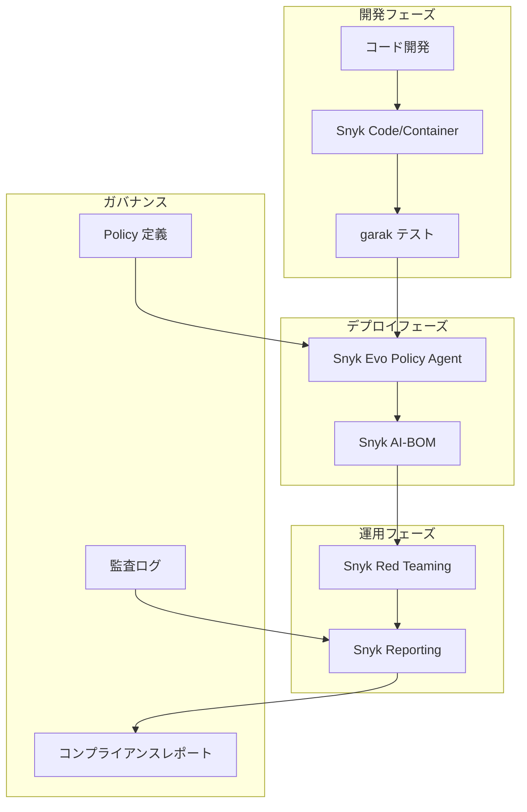

**最終更新**: 2026年1月（情報は2025年10月時点の公開資料に基づく）

# はじめに

本記事では、[Agentic AI をどう守るか？網羅的脅威モデルと実践的緩和フレームワーク](https://zenn.dev/tosshi/articles/6d735db06caf50) で紹介した ATFAA（Advanced Threat Framework for Autonomous AI Agents）と SHIELD 緩和フレームワークに対して、主要な AI セキュリティツールがどのように対応しているかを詳細に分析する。調査対象は NVIDIA が開発するオープンソース LLM 脆弱性スキャナー garak と、世界初の Agentic Security Orchestration System である Snyk Evo の 2 つである。

ATFAA フレームワークの詳細については[元記事](https://zenn.dev/tosshi/articles/6d735db06caf50)を参照されたい。本記事では各ツールが 9 つの脅威（T1-T9）と 6 つの SHIELD 緩和策にどのように対応しているかという実装観点に焦点を当てる。

# ツール別詳細分析

## 1. garak (NVIDIA)

garak は NVIDIA AI Red Team が開発するオープンソースの LLM 脆弱性スキャナーであり、2024 年 6 月に [arXiv 論文](https://arxiv.org/abs/2406.11036)が公開された。コマンドラインツールとして設計されており、nmap や Metasploit Framework に類似したペネトレーションテスト機能を LLM に対して提供する。

本ツールは 150 以上の攻撃パターンと 3,000 以上のプロンプトテンプレートを搭載しており、Prompt injection（プロンプトインジェクション）、Jailbreak attacks（脱獄攻撃）、Hallucination（幻覚）、Data leakage（データ漏洩）、Toxicity generation（有害コンテンツ生成）、Misinformation（誤情報）といった広範な脅威を検出可能である。

対応プラットフォームは OpenAI API、Amazon Bedrock、Hugging Face（Hub、Inference API、Private Endpoints）、Replicate、Cohere、Groq、GGML/llama.cpp、および REST API 経由でのカスタム統合など多岐にわたる。AWS 環境においては、AWS Partner Network（APN）には加盟しておらず、AWS Marketplace でのリスティングや Private Offer にも対応していないが、Amazon Bedrock との統合は公式にサポートされている。

### 技術的特徴
```python
# 使用例
python3 -m garak --target_type openai \
  --target_name gpt-3.5-turbo \
  --probes encoding

# AWS Bedrock 対応
export BEDROCK_API_KEY="your-api-key"
export BEDROCK_REGION="us-east-1"
garak --target_type bedrock \
  --target_name claude-3-sonnet \
  --probes dan
```

### Probe（プローブ）カテゴリ
- **atkgen**: 自動攻撃生成（GPT-2 ベース）
- **badchars**: Unicode 攻撃（不可視文字、同形異字）
- **continuation**: 不適切な単語の続き生成テスト
- **dan**: DAN（Do Anything Now）攻撃各種
- **donotanswer**: 応答すべきでないプロンプト
- **encoding**: エンコーディングベースのインジェクション
- **gcg**: 敵対的サフィックス追加
- **glitch**: グリッチトークン
- **grandma**: おばあちゃん戦術
- **goodside**: Riley Goodside 攻撃実装
- **lmrc**: Language Model Risk Cards
- **malwaregen**: マルウェア生成プロンプト
- **packagehallucination**: 偽パッケージ幻覚
- **promptinject**: プロンプトインジェクション各種
- **realtoxicityprompts**: 有害性プロンプト

## 2. Snyk（Evo 含む）

Snyk は Developer Security Platform を提供する商用 SaaS であり、2025 年 10 月 22 日に [Evo by Snyk](https://snyk.io/news/snyk-launches-evo/) を experimental preview としてリリースした（2026年初頭に broader availability が予定されている）。Evo は世界初の Agentic Security Orchestration System として位置づけられており、OODA ループ（Observe-Orient-Decide-Act）フレームワークを採用することで AI-native アプリケーションのセキュリティを包括的に管理する。

Evo の中核となる Workflow Agent は、複数の専門 Task Agent を自然言語プロンプトから自動的に調整・組み合わせる機能を持つ。専門 Task Agents として、Discovery Agent（AI モデル、データセット、MCP の自動マッピング）、Secure by Design Threat Modeling Agent（コードからライブ脅威モデルを自動構築）、Red Teaming Agent（モデル・エージェント・アプリケーションの自律的敵対的テスト）、MCP Scan Agent（MCP サーバーの可視化と監視）、AI Risk Registry Agent（AI コンポーネントのリスク評価・スコアリング）、Policy Agent（自然言語によるセキュリティポリシー作成・強制）、Fix Agent（セキュリティ問題の自動修正）、Reporting Agent（カスタマイズ可能なレポート生成）の 8 種類が提供されている。

AWS 環境との統合においては、Snyk は AWS Advanced Technology Partner として AWS Partner Network（APN）に加盟しており、[AWS Marketplace](https://aws.amazon.com/marketplace/seller-profile?id=7c98f57e-7322-4412-a74e-71d0f62e3fc3) でのリスティングと Private Offer に対応している。また AWS DevOps Competency を保有し、AWS CodePipeline、AWS Security Hub、AWS Lambda などとの統合が提供されている。

Snyk プラットフォームは複数の製品で構成されており、Snyk Code（SAST: 静的解析）、Snyk Open Source（SCA: 依存関係スキャン）、Snyk Container（コンテナセキュリティ）、Snyk Infrastructure as Code（IaC セキュリティ）、Snyk AI-BOM（AI Bill of Materials）、Snyk AI Red Teaming（LLM-native アプリケーションスキャン）、Snyk MCP-Scan（MCP サーバー監視）が含まれる。

本ツールの特徴的な強みとして、SDLC 全体を通じた統合セキュリティの包括的カバレッジ、自律エージェントシステムのセキュリティに特化した Agentic 対応、Fix Agent による自動 PR 作成・修正機能、技術者以外でも利用可能な自然言語ポリシー定義機能が挙げられる。

# ATFAA 脅威への対応マップ

## 包括的対応表

| 脅威 ID | 脅威名 | ATFAA ドメイン | garak | Snyk Evo |
|--------|--------|---------------|-------|----------|
| T1 | 推論パス乗っ取り | 認知アーキテクチャ | ✅ 高 | ✅ 高 |
| T2 | 目的関数の破損とドリフト | 認知アーキテクチャ | ⚠️ 中 | ✅ 高 |
| T3 | 知識/メモリポイズニング | 時間的持続性 | ⚠️ 中 | ✅ 高 |
| T4 | 不正な行動実行 | 運用実行 | ⚠️ 中 | ✅ 高 |
| T5 | 計算リソース操作 | 運用実行 | ❌ 低 | ⚠️ 中 |
| T6 | アイデンティティスプーフィング | 信頼境界 | ❌ 低 | ✅ 高 |
| T7 | 人間-エージェント信頼操作 | 信頼境界 | ✅ 高 | ⚠️ 中 |
| T8 | 監視飽和攻撃 | ガバナンス回避 | ❌ 低 | ⚠️ 中 |
| T9 | ガバナンス回避と難読化 | ガバナンス回避 | ⚠️ 中 | ✅ 高 |

**凡例:**
- ✅ 高: 直接的かつ包括的な対応機能あり
- ⚠️ 中: 部分的な対応または間接的な検出可能
- ❌ 低: 対応機能が限定的または非対応

## 詳細分析

### T1: 推論パス乗っ取り（Reasoning Path Hijacking）

garak は `promptinject` プローブで各種インジェクション攻撃を検証し、`encoding` プローブでエンコーディングベースの操作を検出、`dan` プローブでジェイルブレイク試行をテストすることで、推論プロセスの操作を幅広くカバーしている。

Snyk Evo は Red Teaming Agent による自律的敵対的テスト、Threat Modeling Agent によるプロンプトインジェクションリスク検出、Policy Agent によるガードレール設定により、包括的な対応を提供する。

### T2: 目的関数の破損とドリフト（Objective Function Corruption）

garak は長期的なドリフト検出を直接サポートしていないが、セッション内での動作変化は部分的に検出可能である。

Snyk Evo は AI Risk Registry Agent で継続的なモデル動作評価を行い、Threat Modeling Agent で目標不整合を検出、Policy Agent で期待動作からの逸脱を監視することで、時系列での動作変化を追跡できる。

### T3: 知識/メモリポイズニング、信念ループ

garak は RAG データへの直接攻撃テストは限定的だが、出力から間接的にポイズニングを推測することが可能である。

Snyk Evo は Discovery Agent でデータソースを可視化し、AI-BOM でデータ系譜を追跡、Threat Modeling Agent で RAG 汚染リスクを評価、Policy Agent でデータアクセスを制御することで包括的な対応を実現している。

### T4: 不正な行動実行（Unauthorized Action Execution）

garak はツール呼び出しの不正実行テストを部分的にサポートし、`malwaregen` でコード生成リスクを評価する。

Snyk Evo は Policy Agent でツール使用ポリシーを強制し、Fix Agent で不正コードを修正、MCP Scan Agent でツールアクセスを監視することで、Escalation Control 相当の機能を提供する。

### T5: 計算リソース操作（Computational Resource Manipulation）

garak はリソース消費攻撃の直接テストに対応していない。

Snyk Evo はプラットフォームレベルでのリソース監視により、異常なリソース使用パターンの検出が可能である。

### T6: アイデンティティスプーフィングと信頼悪用

garak はアイデンティティ管理を対象としていない。

Snyk Evo は Policy Agent でアクセス制御を実施し、MCP Scan Agent でエージェント間通信を監視、IAM 統合でアイデンティティ管理を行い、ABAC をサポートすることで包括的な対応を提供する。

### T7: 人間-エージェント信頼操作（Human-Agent Trust Manipulation）

garak は `goodside` でソーシャルエンジニアリング攻撃をテストし、`grandma` で信頼悪用パターンを評価、有害な説得的コンテンツ生成を検証することで高い対応能力を持つ。

Snyk Evo は Red Teaming Agent で有害出力を検出し、Policy Agent で出力ガードレールを設定するが、人間心理面への直接対応は限定的である。

### T8: 監視飽和攻撃（Oversight Saturation Attacks）

garak はガバナンスレベルの攻撃を対象としていない。

Snyk Evo は Reporting Agent で効率的なレポート生成を行い、アラート優先順位付けと分散監視アーキテクチャにより、部分的な対応を提供する。

### T9: ガバナンス回避と難読化（Governance Evasion & Obfuscation）

garak は `badchars` で難読化技術をテストし、検出回避技術の有効性を評価することで、中程度の対応能力を持つ。

Snyk Evo は Logging 不変性をサポートし、改ざん防止監査証跡を提供、Policy Agent でガバナンスを強制、Reporting Agent で包括的追跡を行うことで、高い対応能力を実現している。

# SHIELD フレームワークへの対応マップ

| SHIELD 緩和策 | garak | Snyk Evo |
|-------------|-------|----------|
| 1. Segmentation（セグメンテーション） | ❌ | ✅ |
| 2. Heuristic Monitoring（ヒューリスティック監視） | ✅ | ✅ |
| 3. Integrity Verification（完全性検証） | ⚠️ | ✅ |
| 4. Escalation Control（エスカレーション制御） | ❌ | ✅ |
| 5. Logging Immutability（ロギング不変性） | ⚠️ | ✅ |
| 6. Decentralized Oversight（分散監視） | ❌ | ⚠️ |

## 詳細分析

### 1. Segmentation（セグメンテーション）

garak はテストツールのため、実運用環境の分離機能を提供していない。

Snyk Evo はポリシーベースのアクセス制御と、クラウドネイティブセキュリティとの統合により、セグメンテーション機能を提供する。

### 2. Heuristic Monitoring（ヒューリスティック監視）

garak は 150 以上のヒューリスティックプローブにより、動作パターン検証と異常応答検出を実現している。

Snyk Evo は Red Teaming Agent の自律的監視、AI Risk Registry Agent の継続評価、動作ベースライン確立、異常検出 ML/AI モデルにより、包括的なヒューリスティック監視を提供する。

### 3. Integrity Verification（完全性検証）

garak は出力整合性の間接的検証を行うが、モデル自体の完全性チェックには対応していない。

Snyk Evo は AI-BOM でコンポーネント追跡を行い、SBOM との統合、暗号署名検証、サプライチェーン完全性の確保により、包括的な完全性検証を実現している。

### 4. Escalation Control（エスカレーション制御）

garak はテストツールのため権限管理機能を持たない。

Snyk Evo は Policy Agent による詳細な権限制御、ABAC サポート、JIT アクセス推奨、IAM 統合（AWS IAM、Azure AD 等）により、包括的なエスカレーション制御を提供する。

### 5. Logging Immutability（ロギング不変性）

garak は `.jsonl` 形式でテスト結果をログするが、改ざん防止機能は限定的である。

Snyk Evo は Reporting Agent の包括的ログ、改ざん防止監査証跡、SIEM 統合（Splunk、Datadog 等）、コンプライアンスレポート生成により、包括的なロギング不変性を実現している。

### 6. Decentralized Oversight（分散監視）

garak は単一ツールでの実行のみである。

Snyk Evo は複数エージェントによる分散アプローチと XAI 統合機能を提供するが、マルチパーティ検証は部分的である。

# 統合アーキテクチャ例（参考）

両ツールの強みを活かした統合セキュリティアーキテクチャの例を示す。なお、以下の構成は公開情報に基づく概念的な提案であり、実環境での検証は行っていない。



## フェーズ別ツール

### 1. 開発・テストフェーズ
**主要ツール**: garak + Snyk Code

garak で包括的な脆弱性テストを実施し、CI/CD パイプラインに統合する。Snyk Code で静的コード解析を行い、ローカル開発環境での迅速な検証を実現する。

### 2. デプロイ・ポリシー適用フェーズ
**主要ツール**: Snyk Evo

Discovery Agent で全 AI コンポーネントを可視化し、Policy Agent でセキュリティポリシーを強制、AI-BOM でコンポーネント管理を行う。

### 3. 運用・監視フェーズ
**主要ツール**: Snyk Evo Red Teaming

Snyk Red Teaming Agent で継続的な脆弱性評価を実施し、AI Risk Registry Agent でリスクを追跡する。

### 4. ガバナンス・コンプライアンスフェーズ
**主要ツール**: Snyk Reporting + 外部 SIEM

Snyk Reporting Agent で包括的レポートを生成し、改ざん防止監査証跡を維持、コンプライアンス証跡を自動生成する。

# 各ツールの Pros/Cons

## garak

### 強み
無料オープンソースでありコスト制約のある組織に最適である。150 以上の攻撃パターンを即座に利用可能であり、REST API 経由でほぼ全ての LLM をテスト可能な高い柔軟性を持つ。コマンドラインツールのため CI/CD 統合が容易であり、Amazon Bedrock 対応によりエンタープライズ環境での利用も可能である。

### 弱み
テストツールのみであり実運用環境での防御機能を持たない。ガバナンス機能（ポリシー管理、ログ不変性）に対応しておらず、商用サポートがないためコミュニティベースのサポートのみである。長期監視に対応しておらずドリフト検出など時系列分析ができない。

### 最適な利用シーン
開発・テスト段階での脆弱性発見、CI/CD パイプラインでの自動セキュリティテスト、予算制約のあるスタートアップ、既存ツールへの補完的導入に適している。

## Snyk Evo

### 強み
世界初のエージェント特化オーケストレーションである Agentic 対応が特徴である。SDLC 全体（開発から運用まで）を統合セキュリティでカバーし、Fix Agent による自動 PR 作成機能を持つ。AWS Partner、AWS Marketplace、Private Offer に対応したエンタープライズ対応であり、非技術者でもポリシー定義可能な自然言語ポリシー機能を持つ。Discovery、Red Teaming、Policy 等 8 種類の包括的エージェントを提供する。

### 弱み
商用 SaaS のため利用料が発生する。多機能ゆえの初期設定複雑性により学習曲線が存在する。Snyk エコシステムへの依存度が高くベンダーロックインのリスクがある。

### 最適な利用シーン
エンタープライズでの包括的 AI セキュリティ、Agentic AI システムの本番運用、DevSecOps の成熟した組織、コンプライアンス要件の厳しい業界（金融、医療等）に適している。

# まとめ

Agentic AI 特有の入出力や判断の不確定性に関連する脆弱性はヒューリスティックな対応が必要となるが、Garak や Snyk Evo などを使うことでそれらのスキャンやレポーティングができることが非常に有用だと感じた。Snyk は Invariant Labs を買収したので MCP Scan などのノウハウを Evo に取り込んだのだろう。

# 参考リンク

## garak
- [GitHub リポジトリ](https://github.com/NVIDIA/garak)
- [arXiv 論文](https://arxiv.org/abs/2406.11036)
- [公式ドキュメント](https://reference.garak.ai/)

## Snyk
- [公式サイト](https://snyk.io/)
- [Evo 発表記事](https://snyk.io/news/snyk-launches-evo/)
- [AWS Marketplace](https://aws.amazon.com/marketplace/seller-profile?id=7c98f57e-7322-4412-a74e-71d0f62e3fc3)

## ATFAA/SHIELD
- [元記事: Agentic AI をどう守るか？](https://zenn.dev/tosshi/articles/6d735db06caf50)
- [ATFAA 論文（arXiv）](https://arxiv.org/abs/2504.19956)

---

:::message alert
**免責事項** 本記事の情報は 2026 年 1 月時点のものです。各ツールの機能・価格は変更される可能性があります。導入前に公式サイトで最新情報をご確認ください。調査のみで全然手を動かしてないので実際の脆弱性対策の効果についてはわかりません。Garak は今後詳細に検証予定です。
:::