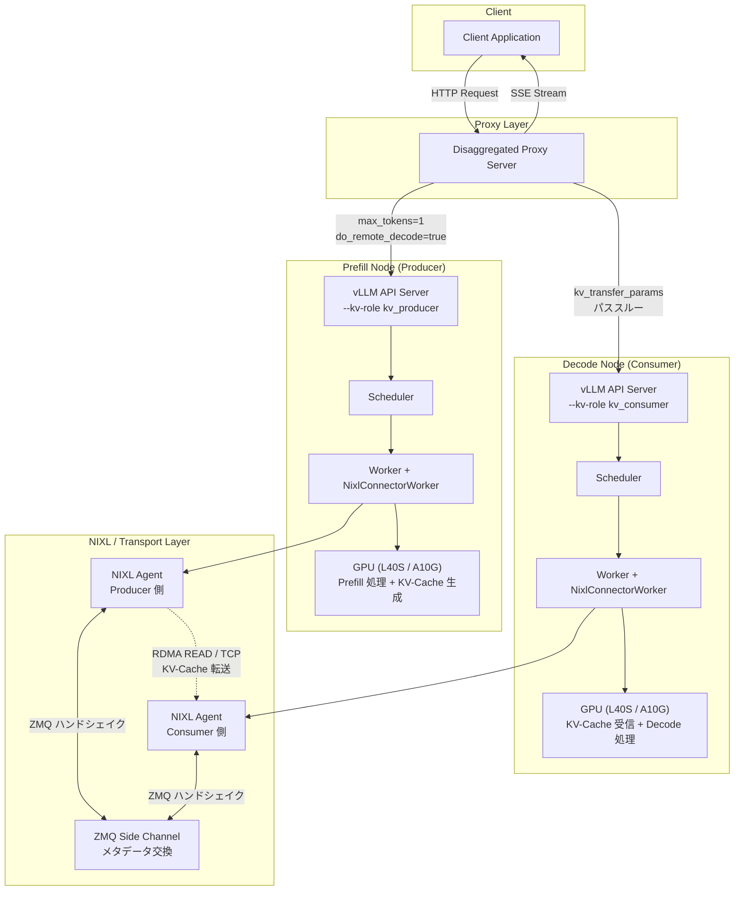
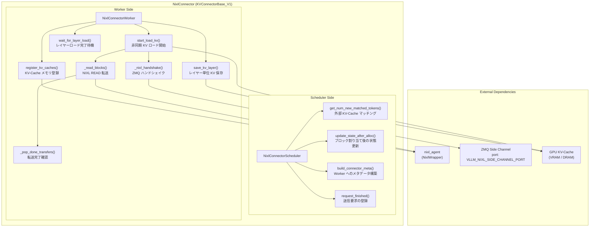
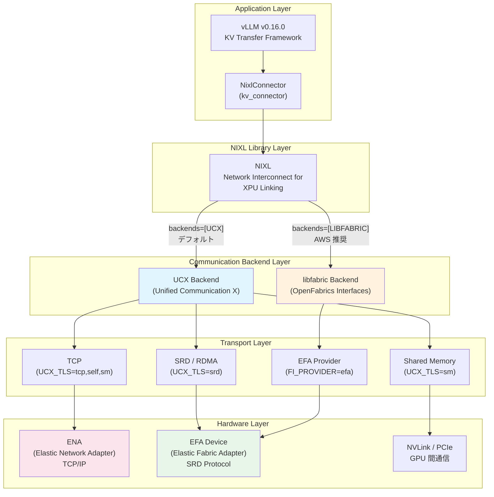
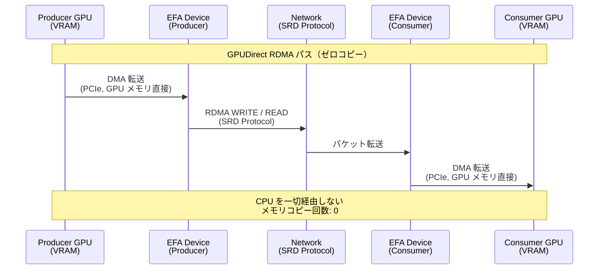
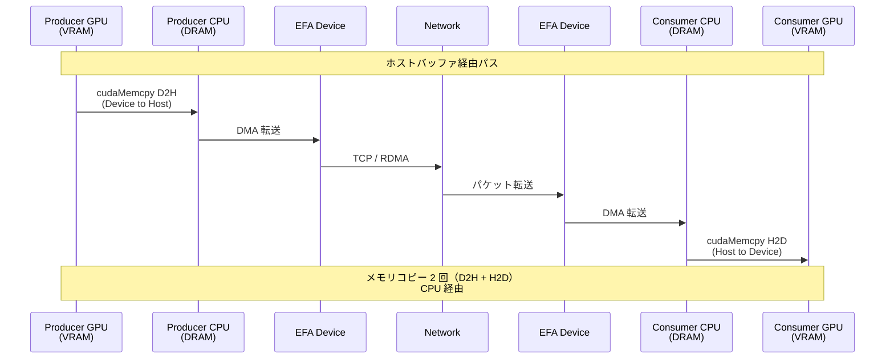
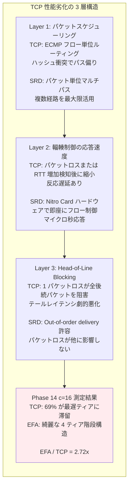
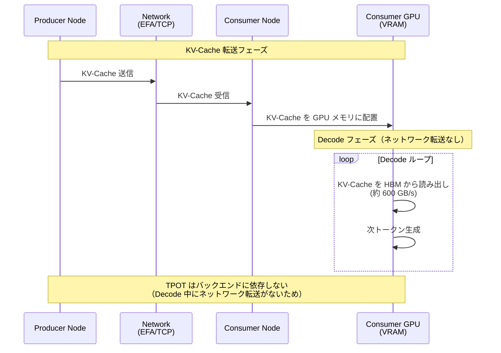

# はじめに

本記事は、AWS EFA（Elastic Fabric Adapter）と vLLM Disaggregated Inference に関する連載の理論編です。前回の[環境構築編](https://zenn.dev/tosshi/articles/009bb138491dd1)で実装手順を解説しましたが、今回はその技術的背景を深掘りします。本記事では、vLLM v0.16.0 における NixlConnector の実装詳細、UCX・NIXL・libfabric の 3 層アーキテクチャ、EFA vs TCP の性能差の物理的メカニズム、そして測定上の罠について解説します。vLLM Disaggregated Inference の基本概念（Prefill/Decode 分離）、AWS EFA および SRD プロトコルの基礎（[EFA/Nitro System 解説編](https://zenn.dev/tosshi/articles/0eeb53ca63f8b2)参照）の理解を前提とします。

## 本記事の位置づけ

| 観点 | 環境構築編 | 理論編（本記事） |
|------|----------|---------------|
| 目的 | AWS 環境で vLLM Disaggregated Inference を動かす | 技術的背景を深く理解する |
| 対象読者 | インフラエンジニア、実装を試したい人 | 技術的背景を理解したい人、研究者 |
| 内容の深さ | 設定手順、ベンチマーク結果 | 実装詳細、性能劣化の原因、理論値との比較 |
| 扱うトピック | インスタンス選定、EFA 設定、MLflow 統合 | NixlConnector 実装、UCX/libfabric 関係、GPUDirect RDMA |

環境構築編では g6e.12xlarge インスタンスの選定、EFA 設定（カーネルバイパス、Placement Group、Security Group）、MLflow 統合、NCCL 通信ベンチマーク（All-Reduce: 37188 GB/s、All-Gather: 20678.8 GB/s）を扱いました。理論編では、NixlConnector のクラス構造、ZMQ ハンドシェイク、request_id 管理、UCX_TLS 環境変数による TCP/EFA 切り替え、GPUDirect RDMA の 2 パス、KV-Cache サイズの計算式、TCP 性能劣化の 3 層構造、Prefix Caching の影響を扱います。

---

# vLLM Disaggregated Inference の実装概要

vLLM Disaggregated Inference は、Prefill フェーズと Decode フェーズを異なるノードに分離し、KV-Cache をネットワーク経由で転送するアーキテクチャです。Client から Proxy を経由して Prefill Node（Producer）と Decode Node（Consumer）に処理が分散されます。Proxy は Prefill ノードに`max_tokens=1` + `do_remote_decode=true`でリクエストを送信し、返却された`kv_transfer_params`を Decode ノードへパススルーします。Prefill ノードは Scheduler がリクエストをスケジューリングし、Worker が NixlConnector を通じて KV-Cache を生成します。Decode ノードは Scheduler が`kv_transfer_params`を解析し、Worker が Nixl 経由で KV-Cache を受信して Decode 処理を実行します。NIXL Agent は ZMQ Side Channel でメタデータ交換を行い、`VLLM_NIXL_SIDE_CHANNEL_HOST`環境変数で各ノードの Private IP を指定します（マルチノードでは必須）。

---

# NixlConnector の実装詳細

vLLM v0.16.0 の NixlConnector は`KVConnectorBase_V1`を継承し、`role`パラメータで Scheduler/Worker を切り替えます。NixlConnectorScheduler は Scheduler 側で、`get_num_new_matched_tokens()`で外部 KV-Cache マッチング（Prefix Caching との統合ポイント）、`update_state_after_alloc()`でブロック割り当て後の状態更新、`build_connector_meta()`で Worker へのメタデータ構築、`request_finished()`で送信要求の登録を担当します。NixlConnectorWorker は Worker 側で、`register_kv_caches()`で KV-Cache メモリを NIXL に登録（`nixl_memory_type` = "VRAM" or "DRAM"）、`save_kv_layer()`でレイヤー単位の KV 保存、`start_load_kv()`で非同期 KV ロード開始、`wait_for_layer_load()`でレイヤーロード完了待機、`_read_blocks()`で NIXL READ 転送、`_nixl_handshake()`で ZMQ ハンドシェイク、`_pop_done_transfers()`で転送完了確認を実行します。

## request_id 管理の設計

NixlConnector の設計で重要なのが request_id 管理です。vLLM の`InputProcessor.assign_request_id()`は各インスタンスで独立にランダムサフィックスを追加するため、Prefill ノードは`"cmpl-abc123_a1b2c3d4"`、Decode ノードは`"cmpl-abc123_e5f6g7h8"`と異なる ID を生成します。NixlConnector は`kv_transfer_params`に`remote_request_id`を含めることでこの問題を解決し、Prefill レスポンスに Producer 側の内部 request_id を含め、Decode リクエストでその ID を使用して KV-Cache を参照します。この設計により、各インスタンスが独立したプロセスであることを前提としつつ、正しく KV-Cache を紐付けできます。

## ZMQ ハンドシェイク

NIXL Agent 間のメタデータ交換は ZMQ Side Channel で行われます。`NixlAgentMetadata`は engine_id、agent_metadata、kv_caches_base_addr、device_id、num_blocks、block_lens、kv_cache_layout、block_size を含みます。互換性ハッシュは vLLM バージョン、モデル名、dtype、num_kv_heads、head_size、num_hidden_layers、attn_backend_name、cache_dtype から計算され、一致しない場合はハンドシェイクが失敗します。ハンドシェイクはバックグラウンドスレッドで実行され、`_background_nixl_handshake()`が ZMQ 経由でリモート NIXL Agent のメタデータを取得し、互換性ハッシュを検証後、NIXL Agent に登録して完了通知を`_ready_requests`キューに追加します。

## NIXL READ 転送の 8 ステップ

KV-Cache 転送は以下の 8 ステップで実行されます。(1) Heterogeneous TP サポートのため、TP 比率に応じてブロックサイズを調整。(2) Producer 側がブロック解放前に転送完了を待つため、通知 ID を生成。(3) 全ブロックがローカルにキャッシュされている場合、データ転送をスキップして通知のみ送信。(4) NIXL に登録されたメモリ領域のデスクリプタ ID を取得。(5) `make_prepped_xfer()`で転送オブジェクトを準備。(6) `transfer()`で非同期転送を開始。(7) `check_xfer_state()`で転送状態を確認（DONE/PROC/FAIL）。(8) 転送完了後、テレメトリ情報（転送時間、帯域幅）を取得してハンドルを解放。

---

# 通信スタックの階層構造

## CRITICAL 発見: TcpConnector は存在しない

vLLM v0.16.0 の KV Connector レジストリを調査した結果、TcpConnector は登録されていません。利用可能なのは、NixlConnector、P2pNcclConnector、LMCacheConnectorV1、LMCacheMPConnector、MultiConnector、MoRIIOConnector、OffloadingConnector、DecodeBenchConnector、MooncakeConnector、ExampleConnector です。TCP 通信は`NixlConnector + UCX_TLS=tcp,self,sm`環境変数で実現します。`kv_connector`の設定は変更せず、UCX 層の環境変数のみを変更します。

## 各コンポーネントと依存関係

| 技術要素 | 正式名称 | 役割 | レイヤー |
|---------|---------|------|---------|
| NixlConnector | NIXL KV Connector for vLLM | vLLM の KV-Cache 転送実装 | Application |
| NIXL | Network Interconnect for XPU Linking | NVIDIA の GPU 間通信ライブラリ | Library |
| UCX | Unified Communication X | 汎用通信ライブラリ | Communication Backend |
| libfabric | OpenFabrics Interfaces (OFI) | 高性能ファブリック通信の標準 API | Communication Backend |
| EFA | Elastic Fabric Adapter | AWS の高性能ネットワークアダプター | Hardware |
| SRD | Scalable Reliable Datagram | AWS Nitro Card に実装された独自プロトコル | Transport Protocol |
| GPUDirect RDMA | GPU Direct Remote Direct Memory Access | GPU メモリからの直接 DMA 転送 | Transfer Mechanism |
| ENA | Elastic Network Adapter | AWS の標準ネットワークアダプター | Hardware |

依存関係は、NixlConnector→NIXL（`nixl_agent` API 使用）→UCX/libfabric（`backends`パラメータで選択、デフォルト: `["UCX"]`）→トランスポート（UCX は`UCX_TLS`環境変数で制御、libfabric は`FI_PROVIDER=efa`で選択、`FI_EFA_USE_DEVICE_RDMA=1`で GPUDirect 有効化）→EFA→SRD→Nitro Card（EFA は SRD プロトコルを使用し、Nitro Card のハードウェアで処理）という順序です。

## 設定例とトランスポート確認

EFA モードでは環境変数なし、またはオプションで`FI_PROVIDER=efa`と`FI_EFA_USE_DEVICE_RDMA=1`を設定します。TCP モードでは`UCX_TLS=tcp,self,sm`と`UCX_NET_DEVICES=all`を設定し、起動コマンドは同一です。UCX_TLS が効かない場合は`"backends": ["UCX"]`を`kv_transfer_config`に明示的に指定します。トランスポート確認は`UCX_LOG_LEVEL=info`を設定し、ログで"using transport: tcp"（TCP 使用）、"using transport: rc" or "ib"（RDMA 使用）、"efa" or "libfabric"（EFA 使用）を確認します。

---

# GPUDirect RDMA とホストバッファ経由の 2 パス

NixlConnector は KV-Cache 転送に 2 つのデータパスをサポートします。GPUDirect RDMA パス（`kv_buffer_device="cuda"`）は GPU VRAM から直接ネットワークへ転送するゼロコピーパスで、メモリコピー回数は 0、CPU 関与なし、`nixl_memory_type`は"VRAM"、対応インスタンスは P5/P5en です。ホストバッファ経由パス（`kv_buffer_device="cpu"`）は CPU メモリ（DRAM）を経由する従来型パスで、メモリコピー回数は 2（D2H + H2D）、CPU 関与は cudaMemcpy 呼び出し、`nixl_memory_type`は"DRAM"、全インスタンス（G6e、G5、TPU、XPU を含む）で利用可能です。

実装上の対応箇所は、Producer 側の`save_kv_to_host()`がデバイスからホストバッファへコピー（ホストバッファ経由パスのみ）、Consumer 側の`sync_recved_kv_to_device()`がホストバッファからデバイスへコピー（ホストバッファ経由パスのみ）です。`_NIXL_SUPPORTED_DEVICE`マップでは、cuda は(cuda, cpu)、tpu は(cpu)、xpu は(cpu)、cpu は(cpu)をサポートします。

| インスタンスタイプ | EFA | GPUDirect RDMA | 推奨パス | 設定 |
|------------------|-----|---------------|---------|------|
| P5 / P5en | あり | あり | GPUDirect RDMA | `kv_buffer_device="cuda"` + `FI_EFA_USE_DEVICE_RDMA=1` |
| g6e.12xlarge | あり | なし | ホストバッファ経由（EFA） | `kv_buffer_device="cpu"` |
| g5.48xlarge | あり | なし | ホストバッファ経由（EFA） | `kv_buffer_device="cpu"` |
| g5.8xlarge | なし | なし | ホストバッファ経由（TCP） | `kv_buffer_device="cpu"` + `UCX_TLS=tcp,self,sm` |

g6e.12xlarge では GPUDirect RDMA は利用できず、ホストバッファ経由（`kv_buffer_device="cpu"`）を使用します。P5/P5en インスタンスでは GPUDirect RDMA が利用可能で、最高の性能が得られます。

---

# KV-Cache 転送のオーバーヘッド分析

## KV-Cache サイズの計算

KV-Cache サイズは Qwen2.5-7B-Instruct（num_layers: 28、num_kv_heads: 4（GQA）、head_dim: 128、bytes_per_element: 2（BF16））の場合、1 トークンあたり`2 × 28 × 4 × 128 × 2 = 57,344 bytes = 56 KB/token`です。Qwen2.5-32B-Instruct（num_layers: 64、num_kv_heads: 8、head_dim: 128、bytes_per_element: 2（BF16））の場合、1 トークンあたり`2 × 64 × 8 × 128 × 2 = 262,144 bytes = 256 KB/token`、TP=4 での 1 GPU あたり`256 KB ÷ 4 = 64 KB/token/GPU`です。

| プロンプト長 | Total KV-Cache | Per GPU (TP=4) | + Model Weights | L40S 48GB 使用率 |
|------------|---------------|----------------|-----------------|----------------|
| 1K | 256 MB | 64 MB | ~19.3 GB | 40% |
| 4K | 1.0 GB | 256 MB | ~19.5 GB | 41% |
| 12K | 3.0 GB | 768 MB | ~20.0 GB | 42% |
| 32K | 8.0 GB | 2.0 GB | ~21.3 GB | 44% |
| 64K | 16.0 GB | 4.0 GB | ~24.3 GB | 51% |
| 100K | 25.0 GB | 6.25 GB | ~27.5 GB | 57% |

## 実測値と理論値の乖離

理論転送時間は 1K（56 MB）で EFA ~5.6 ms、TCP ~7.5 ms、理論差 ~1.9 ms、4K（224 MB）で EFA ~22.4 ms、TCP ~30.0 ms、理論差 ~7.6 ms、12K（672 MB）で EFA ~67.2 ms、TCP ~90.0 ms、理論差 ~22.8 ms です。実測値と理論値の乖離は 1K で+12（TCP 優位、逆転）、4K で-197（比率 25.9x）、12K で-1,119（比率 49.1x）です。実測値と理論値の乖離が最大 49.1 倍に達しており、理論値は「帯域幅差のみ」で計算していますが、実際には TCP の slow start 問題（672 MB のバルク転送で数百 ms のペナルティ）、二峰性分布による mean 値の歪み（TCP の stdev が 2 倍以上大きい）、TTFT 二峰性分布（RDMA Memory Region 登録コストとキャッシュウォームアップ）、単純すぎる理論モデル（帯域幅差のみで計算し、プロトコルオーバーヘッドを無視）が影響します。

---

# 設定パラメータの詳細

| 環境変数 | 設定値 | 用途 | 必須度 |
|---------|--------|------|--------|
| `UCX_TLS` | `tcp,self,sm` | UCX バックエンドで TCP 強制 | TCP 使用時は必須 |
| `UCX_TLS` | `srd` | UCX バックエンドで SRD/RDMA 使用 | EFA + UCX 使用時 |
| `UCX_NET_DEVICES` | `all` | 全ネットワークデバイスを使用 | TCP 使用時は推奨 |
| `FI_PROVIDER` | `efa` | libfabric で EFA Provider を指定 | libfabric 使用時 |
| `FI_EFA_USE_DEVICE_RDMA` | `1` | GPUDirect RDMA を有効化 | P5 で GDR 使用時 |
| `NIXL_BACKEND` | `UCX` or `LIBFABRIC` | NIXL のバックエンド選択 | 明示的な選択時 |
| `VLLM_NIXL_SIDE_CHANNEL_HOST` | 各ノードの Private IP | ZMQ サイドチャネルのバインドアドレス | マルチノードでは必須 |
| `LD_LIBRARY_PATH` | `/opt/amazon/efa/lib: ...` | EFA installer のライブラリを優先 | EFA 使用時は必須 |
| `UCX_RCACHE_MAX_UNRELEASED` | `1024` | UCX メモリリーク回避 | vLLM が自動設定 |

| パラメータ | 値 | 説明 |
|-----------|-----|------|
| `kv_connector` | `NixlConnector` | KV Connector の種類（唯一の推奨選択肢） |
| `kv_role` | `kv_producer` / `kv_consumer` / `kv_both` | ノードの役割 |
| `kv_buffer_device` | `cuda` / `cpu` | KV バッファの配置先 |
| `backends` | `["UCX"]` / `["LIBFABRIC"]` | NIXL バックエンド選択 |
| `num_threads` | `4`（デフォルト） | UCX スレッド数（UAR 枯渇回避） |
| `enforce_handshake_compat` | `true`（デフォルト） | ハンドシェイク互換性チェック |

NIXL wheel が独自の libfabric/libefa/libibverbs を含んでおり、EFA installer のライブラリと衝突して Segmentation Fault が発生します。解決策は`export LD_LIBRARY_PATH=/opt/amazon/efa/lib: $LD_LIBRARY_PATH`で EFA installer のライブラリを優先するか、wheel ビルド時に`--exclude 'libefa*' --exclude 'libibverbs*' --exclude 'libfabric*'`で除外します。

---

# 測定上の注意点

## CRITICAL

`disagg_proxy_server_v2.py`がリクエストごとに`aiohttp.ClientSession()`を新規作成し、TTFT に約 436ms の追加遅延（EFA-TCP 差の 33 倍）を発生させます。Proxy オーバーヘッドの構成要素は、Client→Proxy（1 回目の HTTP ラウンドトリップ）、Proxy→Producer（2 回目、max_tokens=1、do_remote_decode=true）、Proxy→Consumer（3 回目、kv_transfer_params パススルー）、Proxy→Client（4 回目、SSE ストリーム）で合計約 436ms（1000 トークンでの実測値）です。対策は ClientSession を再利用、または Proxy なし直接測定です。`benchmark_phase14.py:424`の計算式が不正確で、スループットが約 30 倍過大に報告されます。対策はシリアル測定のスループット値をレポートに使用しないことです。

## HIGH

RDMA Memory Region 登録コストとキャッシュウォームアップにより、mean 値がどちらのフェーズも代表しません。Phase A（iter 1-11）: 3,583ms（安定）、Phase B（iter 12-30）: 2,664ms（安定）、mean: 3,016ms（どちらも代表しない値）です。対策は dip test で二峰性を検出し、KMeans で Phase A/B に分離し、Phase B の mean 値を採用します。Proxy の 4 回の HTTP ラウンドトリップが EFA-TCP の純粋な差を不明瞭にします。対策は Producer 直接接続での測定です。

## MEDIUM

vLLM スケジューラのバッチ処理遅延により、c>=2 で TPOT が 3 クラスタに分裂します。EFA c=4 で mean: 44.92ms（c=1 では 33.27ms）、stdev: 22.0ms（非常に大きい）、raw データが約 34ms、約 80ms、約 104ms の 3 クラスタに分裂します。原因は vLLM スケジューラの Continuous Batching により一部リクエストの待機時間が混入することです。対策は c=1 でのみバックエンド比較します。TPOT（Time Per Output Token）は`(E2E - TTFT) / (tokens - 1)`（平均値）、ITL（Inter-Token Latency）は個々のトークン間の実際の遅延（分布）です。TPOT は全体傾向、ITL は詳細分析に使い分けます。

---

# TCP vs EFA の性能差の本質

並行度別の性能比較では、c=1 で EFA-TCP 差はほぼなし、c=4 で EFA が TCP を約 2.3 倍上回り、c=16 で EFA が TCP の 2.72 倍優位（TTFT ベース）です。TCP c=16 の TTFT 分布では、最初に処理された 2 リクエストが 1307-1308 ms、待機後に処理された 2 リクエストが 3370 ms、次の 2 リクエストが 4768 ms、残り 11 リクエスト（69%）が 6485-6832 ms に集中しています。EFA c=16 の TTFT 分布では、Tier 0（0-3）が 898-899 ms（4 リクエスト）、Tier 1（4-7）が 1770 ms（4 リクエスト）、Tier 2（8-11）が 2643 ms（4 リクエスト）、Tier 3（12-15）が 3482 ms（4 リクエスト）とティア間ステップが約 871ms（均等）の綺麗な 4 ティア階段構造です。

TCP 性能劣化の 3 層構造は、Layer 1（パケットスケジューリング）で TCP は ECMP によるフロー単位ルーティングでハッシュ衝突が発生するとパス偏りが生じるのに対し、SRD は各パケットを独立に最適パスへ分散し Clos ネットワーク内の複数の等価パスを最大限活用します。Layer 2（輻輳制御の応答速度）で TCP はパケットロスまたは RTT 増加を検知してからウィンドウを縮小（反応遅延あり）するのに対し、SRD は Nitro Card のハードウェアで即座にフロー制御（マイクロ秒応答）します。Layer 3（Head-of-Line Blocking）で TCP は 1 パケットのロスが後続の全パケットの配信を阻害しテールレイテンシが劇的に悪化するのに対し、SRD は out-of-order delivery を許容しパケットロスが他のパケットに影響しません。

AWS の論文"A Cloud-Optimized Transport Protocol for Elastic and Scalable HPC"（IEEE Micro、2020）では、48 台のノードが同時に 1 台のノードに送信する incast テストで、TCP がテールレイテンシの劇的な悪化を示す一方、SRD は安定したレイテンシを維持することが報告されています。Phase 14 の c=16 測定は規模は小さいものの、本質的に同じ現象を観察しており、TCP c=16 の 69%最遅ティア滞留は incast による輻輳崩壊の典型的症状です。

---

# Prefix Caching の影響

Prefix Caching の 3 段階は、第 1 段階（Prefix Cache ミス、初回リクエスト）で Decode ノードのローカルキャッシュが空で NIXL 経由で KV-Cache を全量受信し TTFT が高く（プロンプト長に依存）実測 690.51ms（1000 tokens）、第 2 段階（部分ヒット）で共通プレフィックス部分をローカルに保持し差分ブロックのみ NIXL 転送し TTFT が改善、第 3 段階（完全ヒット）で全てローカルキャッシュに存在し`send_notif()`のみ（データ転送なし）で TTFT が固定コスト（約 50ms）のみで実測 96.84ms（1000 tokens）です。

性能因子の影響度比較では、Prefix Cache ヒット vs ミスが約 7 倍の差（98ms vs 700ms）、Disagg vs Unified が約 2.3 倍の差（93ms vs 41ms）、EFA vs TCP が 10ms 以内、gpu_memory_utilization 0.8 vs 0.9 が 1ms 以内、max_num_batched_tokens が 35ms 以内です。Prefix Caching が最も重要な性能因子で、EFA vs TCP の差（10ms 以内）より遥かに大きい影響（約 7 倍）があります。

TPOT がバックエンドに依存しない理由は、KV-Cache が Decode 開始前に Consumer の GPU メモリに完全に配置されるためです。RDMA ゼロコピー転送（GPUDirect RDMA）または cudaMemcpy（ホストバッファ経由）のいずれでも、Decode 開始時点では KV-Cache は GPU VRAM 上にあり、Decode ループ中にネットワーク転送は発生しません。HBM 帯域幅（A10G: ~600 GB/s）で KV-Cache を読み出し、12K トークンの KV-Cache（656 MB）の読み出しは約 1.1ms です。実測データでは EFA TPOT ~ TCP TPOT（差 < 0.03ms/token、全 concurrency、全プロンプト長で一定）です。

---

# まとめ

理論編の主要な発見を 10 項目にまとめます。(1) TcpConnector は存在せず、vLLM v0.16.0 に TcpConnector は登録されておらず、TCP 通信は`NixlConnector + UCX_TLS=tcp,self,sm`で実現します。(2) TPOT はバックエンドに依存せず、EFA でも TCP でも TPOT は 33.0-35.0ms の範囲で一定で、KV-Cache は Decode 開始前に Consumer の GPU メモリに配置され、Decode ループ中にネットワーク転送は発生しません。(3) Prefix Caching が最も重要な性能因子で、Cache ヒット vs ミスで TTFT が約 7 倍の差があり、EFA vs TCP の差（10ms 以内）より遥かに大きい影響があります。(4) EFA の効果は並行度に依存し、c=1 では差はほぼなく、c=16 で EFA が TCP の 2.72 倍優位で、SRD のパケット単位マルチパスルーティングが TCP の Head-of-Line Blocking と Incast 問題を回避します。(5) NIXL wheel のパッケージング問題があり、NIXL wheel が独自の libfabric/libefa/libibverbs を含み、EFA installer のライブラリと衝突して Segmentation Fault が発生し、`LD_LIBRARY_PATH`で EFA installer のライブラリを優先する必要があります。(6) TTFT 二峰性分布があり、Phase A（初回）と Phase B（安定状態）で平均約 900ms の差があり、RDMA Memory Region 登録コストとキャッシュウォームアップが原因です。(7) Proxy オーバーヘッドがあり、`disagg_proxy_server_v2.py`がリクエストごとに`aiohttp.ClientSession()`を作成し、約 436ms のオーバーヘッド（EFA-TCP 差の 33 倍）があります。(8) 実測値と理論値の乖離があり、12K トークンでの EFA-TCP 差が理論値の 49.1 倍で、原因は TCP の slow start、二峰性分布、MR キャッシュです。(9) GPUDirect RDMA の条件があり、`kv_buffer_device="cuda"` + P5/P5en インスタンスで利用可能で、G6e は GDR 非対応です。(10) IEEE Micro 2020 論文との対応があり、Phase 14 の c=16 測定は、規模は小さいものの、48-way Incast と本質的に同じ現象を観察しています。

Disaggregated Inference のスケーリングボトルネックは、KV-Cache 転送時間が並列化できない逐次部分です。Prefix Caching により逐次部分を大幅に削減可能（全量転送→差分転送→転送なし）で、EFA は並行度が高い場合に TCP に対して明確な優位性を持ちます。最適なスケーリングには、Prefix Caching + EFA の組み合わせが推奨されます。

---

# 次回予告

Phase 18 では、Phase 17A（EFA のみ）の成果を拡張し、TCP トランスポートを追加測定して EFA vs TCP の性能差を定量化します。測定範囲は 1K-100K tokens、測定方法は Proxy なし直接測定（Proxy オーバーヘッドを排除）です。主要変更点は、TCP 実装方法が NixlConnector + UCX_TLS=tcp,self,sm、測定スクリプトが Phase 17A スクリプトを流用、モデルが Qwen2.5-32B-Instruct、インスタンスが g6e.12xlarge（4x L40S）、TP=4 です。測定対象は Transport（EFA、TCP）、Prompt Length（1K、4K、12K、32K、64K、100K）、Metric（TPOT、TTFT）、Throughput（c=1、c=4、c=8、c=16）です。期待される結果は、TPOT で EFA ~ TCP（差 < 1 ms/token、理論編の知見「TPOT はバックエンドに依存しない」が確認されるはず）、TTFT で長プロンプトほど EFA 優位（TCP の slow start 影響）、Throughput で TPOT で EFA ~ TCP（差 < 1 ms/token、理論編の知見「TPOT はバックエンドに依存しない」が確認されるはず）、TTFT で長プロンプトほど EFA 優位（TCP の slow start 影響）、Throughput で c=16 で EFA >> TCP（Phase 14 の 2.72x の再現を期待）です。100K tokens は 6.25 GB/GPU + 16.25 GB（モデルウェイト）= 約 27.5 GB/GPU、L40S 48GB の 57%で、注意点は c=16 で 100K tokens は危険（推奨: 100K では c=8 以下）です。

---

# 参考文献

AWS 公式論文 "A Cloud-Optimized Transport Protocol for Elastic and Scalable HPC" (IEEE Micro, 2020)、[vLLM GitHub リポジトリ](https://github.com/vllm-project/vllm)の NixlConnector 実装（v0.16.0）、[NIXL GitHub リポジトリ](https://github.com/NVIDIA/NIXL)、本連載の既存記事（[AWS EFA と Nitro System 解説編](https://zenn.dev/tosshi/articles/0eeb53ca63f8b2)、[環境構築編](https://zenn.dev/tosshi/articles/009bb138491dd1)）、[OpenUCX プロジェクト](https://www.openucx.org/)、[OpenFabrics Interfaces (OFI) / libfabric](https://ofiwg.github.io/libfabric/)を参照しました。

---

# おわりに

本記事では、vLLM Disaggregated Inference の実装詳細と、EFA vs TCP の性能差の本質について解説しました。最重要の発見は、Prefix Caching が最も重要（約 7 倍の TTFT 改善）、TPOT はバックエンドに依存しない（Decode 中にネットワーク転送がないため）、EFA の効果は並行度に依存（c=16 で 2.72 倍優位）の 3 点です。次回の Phase 18 では、これらの知見を踏まえて、1K-100K tokens の広範囲で EFA vs TCP の性能差を定量化します。本記事が、vLLM Disaggregated Inference を理解する助けになれば幸いです。

（執筆: 2026-02-28）
