## はじめに

本記事は、AWS EFA（Elastic Fabric Adapter）と P/D Disaggregated Inference に関する連載の理論編です。前回の[環境構築編](https://zenn.dev/tosshi/articles/009bb138491dd1)で環境構築について解説しましたが、今回は vLLM の NixlConnector を用いた Disaggregated Infrence の実装を整理します。

Time To First Token (TTFT) は最初のトークン生成までの遅延、Time Per Output Token (TPOT) は各トークンの平均生成時間を指します。本記事では以降、TTFT と TPOT の略語を使用します。vLLM Disaggregated Inference の基本概念（Prefill/Decode 分離）、AWS EFA および SRD プロトコルの基礎（[EFA/Nitro System 解説編](https://zenn.dev/tosshi/articles/0eeb53ca63f8b2)参照）の理解を前提とします。

## vLLM Disaggregated Inference の実装概要

vLLM Disaggregated Inference は、Prefill フェーズと Decode フェーズを異なるノードに分離し、KV-Cache をネットワーク経由で転送するアーキテクチャです。このセクションでは、システムを 4 つの階層に分けて説明します。

### レイヤ 1: システム全体のアーキテクチャ

Client から Proxy を経由して Prefill Node（Producer）と Decode Node（Consumer）に処理が分散されます。Proxy は Prefill ノードに`max_tokens=1` + `do_remote_decode=true`でリクエストを送信し、返却された`kv_transfer_params`を Decode ノードへパススルーします。

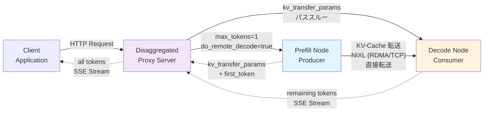

**リクエストの流れとデータ転送**:

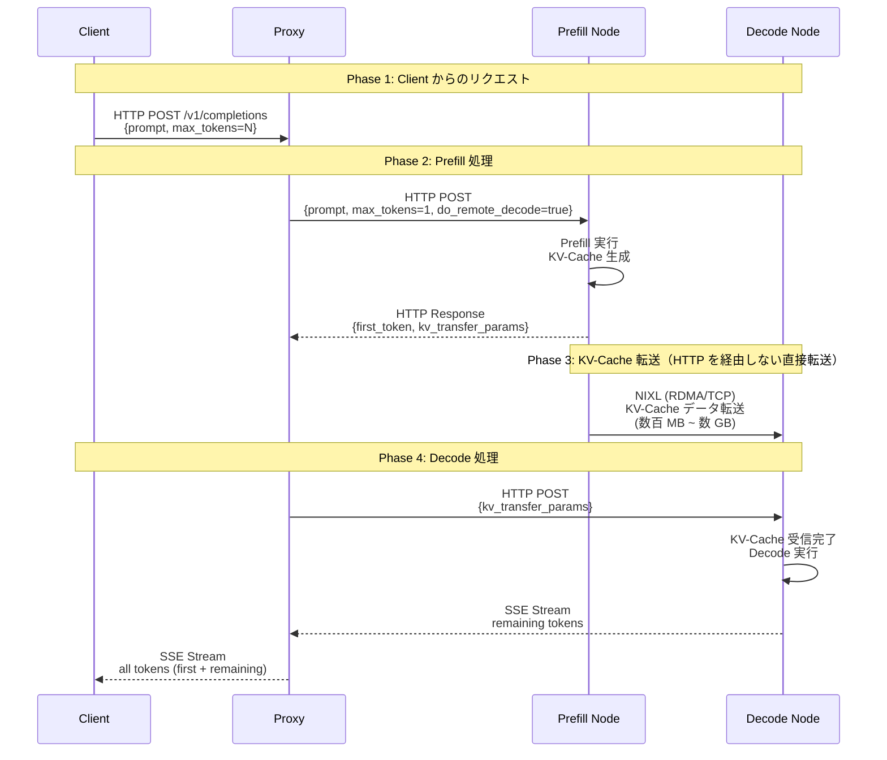

**接続関係の詳細**:

Disaggregated Inference のデータフローは 4 つの Phase で構成されます。**Phase 1** では、Client が Proxy に HTTP POST リクエストを送信します。このリクエストには元のプロンプトと`max_tokens=N`などのパラメータが含まれます。**Phase 2** で、Proxy は Prefill Node にリクエストを転送しますが、この際に重要な変換を行います。`max_tokens`を 1 に上書きし、`do_remote_decode=true`フラグを追加することで、Prefill ノードに「最初のトークンだけを生成し、残りは Decode ノードに任せる」ことを指示します。Prefill ノードは Prefill 処理を実行して KV-Cache を生成し、最初のトークンと`kv_transfer_params`（KV-Cache 転送のメタデータ）を Proxy に返却します。

**Phase 3** が Disaggregated Inference の核心です。Prefill ノードから Decode ノードへ、**NIXL ライブラリを使用して KV-Cache を直接転送**します。この転送は HTTP を経由せず、RDMA または TCP で GPU 間を直接接続します。転送されるデータサイズは数百 MB から数 GB に及び、例えば Qwen2.5-32B-Instruct (TP=4) の 12K トークンでは約 3 GB の KV-Cache が転送されます。重要な点は、**Proxy はこの大容量データを中継しない**ことです。Proxy が扱うのは`kv_transfer_params`という小さなメタデータのみで、実際の KV-Cache は Prefill と Decode の間で直接やり取りされます。

**Phase 4** では、Proxy が Decode ノードに`kv_transfer_params`をパススルーします。Decode ノードはこのメタデータを元に NIXL 経由で KV-Cache を受信し、Decode 処理を開始します。生成された残りのトークンは SSE (Server-Sent Events) ストリーム形式で Proxy に返却され、Proxy は最初のトークンと結合して全トークンを Client に返します。

この設計の利点は、**並行処理**にあります。Prefill が first_token を返却した時点で、Proxy はすぐに Decode ノードにリクエストを送信できます。KV-Cache の転送と Decode 処理の準備が並行して進行するため、レイテンシを最小化できます。また、Proxy が大容量の KV-Cache を中継しないことで、Proxy のネットワーク帯域幅とメモリ使用量を大幅に削減できます。

### レイヤ 2: Prefill Node（Producer）の内部構造

Prefill ノードは vLLM API Server、Scheduler、Worker、GPU の 4 層構造です。NixlConnectorScheduler が KV-Cache のメタデータ管理を担当し、NixlConnectorWorker が実際の KV-Cache 生成と NIXL 連携を実行します。

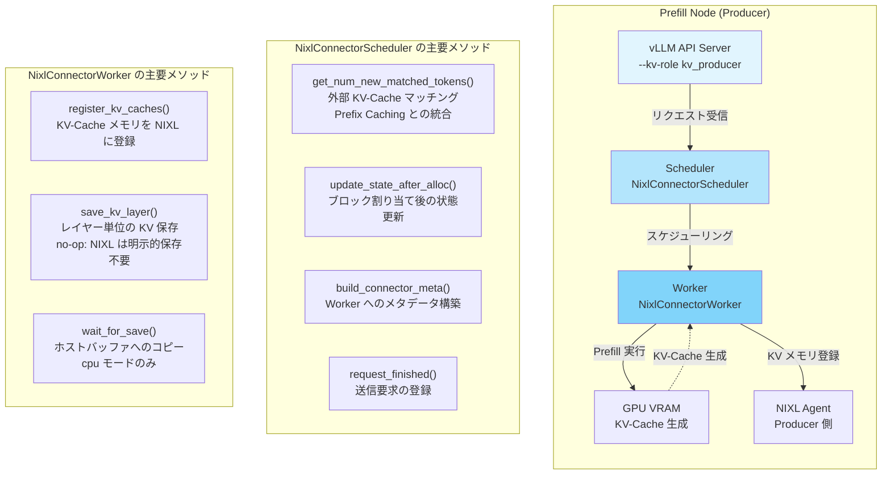

**Prefill Node の処理フロー**:
1. vLLM API Server がリクエストを受信
2. NixlConnectorScheduler がリクエストをスケジューリング
   - `get_num_new_matched_tokens()` で Prefix Caching のヒット判定
   - `update_state_after_alloc()` でブロック割り当て
   - `build_connector_meta()` で Worker へのメタデータ構築
3. NixlConnectorWorker が Prefill 処理を実行
   - `register_kv_caches()` で GPU VRAM を NIXL に登録
   - GPU で KV-Cache を生成
   - `wait_for_save()` でホストバッファへコピー（cpu モードのみ）
4. NIXL Agent が Consumer からの転送要求を待機

### レイヤ 3: Decode Node（Consumer）の内部構造

Decode ノードは Prefill ノードと類似の 4 層構造ですが、KV-Cache を受信して Decode 処理を実行します。NixlConnectorScheduler が`kv_transfer_params`を解析し、NixlConnectorWorker が NIXL 経由で KV-Cache を受信します。

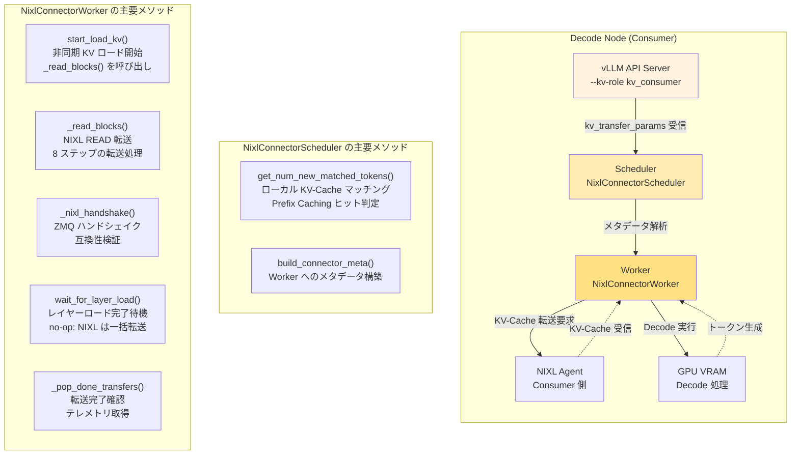

**Decode Node の処理フロー**:
1. vLLM API Server が`kv_transfer_params`を受信
2. NixlConnectorScheduler がメタデータを解析
   - `get_num_new_matched_tokens()` でローカル Prefix Caching のヒット判定
   - `build_connector_meta()` で Worker へのメタデータ構築
3. NixlConnectorWorker が KV-Cache 転送を開始
   - `start_load_kv()` で非同期 KV ロード開始
   - `_nixl_handshake()` で Producer との ZMQ ハンドシェイク
   - `_read_blocks()` で NIXL READ 転送（8 ステップ）
   - `_pop_done_transfers()` で転送完了確認
4. GPU で Decode 処理を実行
5. 生成されたトークンを Proxy に返却

### レイヤ 4: NIXL 通信レイヤ

NIXL Agent は Producer と Consumer の間で KV-Cache を転送します。ZMQ Side Channel でメタデータ交換を行い、RDMA READ または TCP で実際の KV-Cache を転送します。

```mermaid
graph TB
    subgraph "Producer Worker"
        P_W[NixlConnectorWorker<br/>Producer]
    end
    subgraph "Producer NIXL Layer"
        P_NIXL[NIXL Agent<br/>Producer]
        P_MEM[GPU VRAM<br/>KV-Cache]
        P_W -->|"register_kv_caches()"| P_NIXL
        P_NIXL -.->|"メモリ登録"| P_MEM
    end
    subgraph "ZMQ Side Channel"
        ZMQ[ZMQ Socket<br/>VLLM_NIXL_SIDE_CHANNEL_HOST]
    end
    subgraph "Consumer NIXL Layer"
        C_NIXL[NIXL Agent<br/>Consumer]
        C_MEM[GPU VRAM<br/>KV-Cache]
        C_NIXL -.->|"データ書き込み"| C_MEM
    end
    subgraph "Consumer Worker"
        C_W[NixlConnectorWorker<br/>Consumer]
        C_W -->|"start_load_kv()"| C_NIXL
    end

    P_NIXL <-->|"NixlAgentMetadata<br/>ハンドシェイク<br/>互換性検証"| ZMQ
    C_NIXL <-->|"NixlAgentMetadata<br/>ハンドシェイク<br/>互換性検証"| ZMQ
    P_NIXL -->|"RDMA READ / TCP<br/>KV-Cache 転送<br/>VRAM → VRAM<br/>GPUDirect RDMA"| C_NIXL

    style P_NIXL fill:#e1f5fe
    style C_NIXL fill:#fff3e0
    style ZMQ fill:#f3e5f5
```

**NIXL 通信レイヤの詳細**:
- **ZMQ Side Channel**: メタデータ交換用の制御チャネル
  - `VLLM_NIXL_SIDE_CHANNEL_HOST` 環境変数で各ノードの Private IP を指定（マルチノードでは必須）
  - `NixlAgentMetadata` を交換（engine_id、kv_caches_base_addr、block_size など）
  - 互換性ハッシュを検証（vLLM バージョン、モデル、dtype、KV heads など）
- **RDMA READ / TCP 転送**: 実際の KV-Cache データ転送
  - GPUDirect RDMA モード（`kv_buffer_device="cuda"`）: GPU VRAM → GPU VRAM のゼロコピー転送
  - ホストバッファ経由モード（`kv_buffer_device="cpu"`）: GPU → CPU → Network → CPU → GPU の 2 パスコピー
  - 転送プロトコルは UCX/libfabric バックエンドと環境変数で制御

## Proxy のリクエストフロー

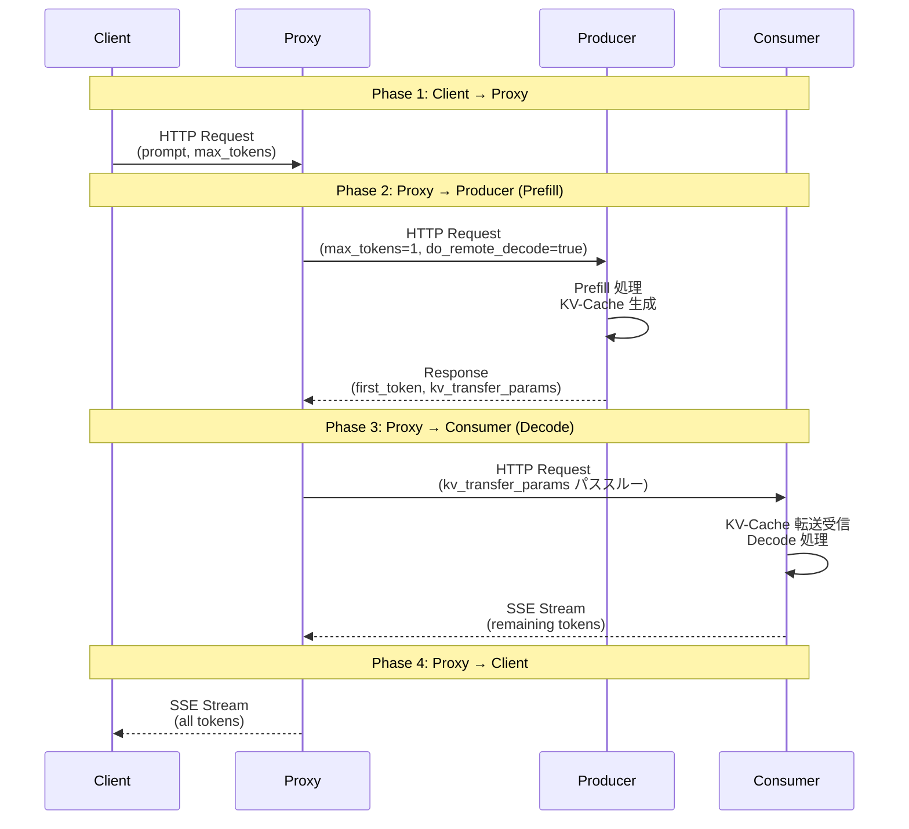

---

# NixlConnector の実装詳細

vLLM v0.16.0 の NixlConnector は`KVConnectorBase_V1`を継承し、`role`パラメータで Scheduler/Worker を切り替えます。各 vLLM ノードは Scheduler インスタンスと Worker インスタンスの両方を持ち、Producer ロール（`kv_producer`）と Consumer ロール（`kv_consumer`）で異なるメソッドセットを使用します。

**設計思想の要点**:
- **役割の分離**: Scheduler は KV-Cache のメタデータ管理とスケジューリングを担当し、Worker は実際のメモリ操作と NIXL 通信を担当
- **Producer/Consumer の非対称性**: Producer は KV-Cache を生成して NIXL に登録（パッシブ）、Consumer は NIXL 経由で KV-Cache を受信（アクティブ）
- **Prefix Caching との統合**: `get_num_new_matched_tokens()` メソッドでローカルとリモートの KV-Cache マッチングを統合
- **非同期転送**: KV-Cache 転送はバックグラウンドスレッドで実行され、GPU 処理と並行

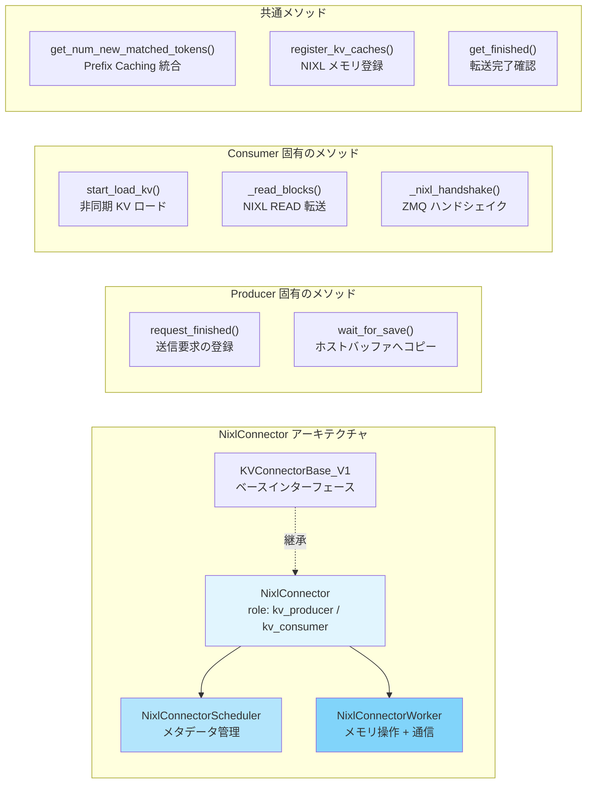

**主要なメソッドの役割**:

| メソッド | Scheduler / Worker | Producer / Consumer | 役割 |
|---------|-------------------|---------------------|------|
| `get_num_new_matched_tokens()` | Scheduler | 両方 | Prefix Caching のヒット判定 |
| `update_state_after_alloc()` | Scheduler | Producer | ブロック割り当て後の状態更新 |
| `build_connector_meta()` | Scheduler | 両方 | Worker へのメタデータ構築 |
| `request_finished()` | Scheduler | Producer | 送信要求の登録 |
| `register_kv_caches()` | Worker | 両方 | KV-Cache メモリを NIXL に登録 |
| `save_kv_layer()` | Worker | Producer | レイヤー単位の KV 保存（no-op） |
| `wait_for_save()` | Worker | Producer | ホストバッファへコピー（cpu モードのみ） |
| `start_load_kv()` | Worker | Consumer | 非同期 KV ロード開始 |
| `_read_blocks()` | Worker | Consumer | NIXL READ 転送（8 ステップ） |
| `_nixl_handshake()` | Worker | Consumer | ZMQ ハンドシェイク |
| `_pop_done_transfers()` | Worker | Consumer | 転送完了確認 |

## request_id 管理の設計

NixlConnector の設計で重要なのが request_id 管理です。vLLM の`InputProcessor.assign_request_id()`は各インスタンスで独立にランダムサフィックスを追加するため、Prefill ノードは`"cmpl-abc123_a1b2c3d4"`、Decode ノードは`"cmpl-abc123_e5f6g7h8"`と異なる ID を生成します。NixlConnector は`kv_transfer_params`に`remote_request_id`を含めることでこの問題を解決し、Prefill レスポンスに Producer 側の内部 request_id を含め、Decode リクエストでその ID を使用して KV-Cache を参照します。この設計により、各インスタンスが独立したプロセスであることを前提としつつ、正しく KV-Cache を紐付けできます。

## ZMQ ハンドシェイク

NIXL Agent 間のメタデータ交換は ZMQ Side Channel で行われます。`NixlAgentMetadata`は engine_id、agent_metadata、kv_caches_base_addr、device_id、num_blocks、block_lens、kv_cache_layout、block_size を含みます。互換性ハッシュは vLLM バージョン、モデル名、dtype、num_kv_heads、head_size、num_hidden_layers、attn_backend_name、cache_dtype から計算され、一致しない場合はハンドシェイクが失敗します。ハンドシェイクはバックグラウンドスレッドで実行され、`_background_nixl_handshake()`が ZMQ 経由でリモート NIXL Agent のメタデータを取得し、互換性ハッシュを検証後、NIXL Agent に登録して完了通知を`_ready_requests`キューに追加します。

## NIXL READ 転送の 8 ステップ

KV-Cache 転送は以下の 8 ステップで実行されます:

1. **Heterogeneous TP サポート**: TP 比率に応じてブロックサイズを調整
2. **通知 ID 生成**: Producer 側がブロック解放前に転送完了を待つため、通知 ID を生成
3. **キャッシュヒット判定**: 全ブロックがローカルにキャッシュされている場合、データ転送をスキップして通知のみ送信
4. **デスクリプタ ID 取得**: NIXL に登録されたメモリ領域のデスクリプタ ID を取得
5. **転送オブジェクト準備**: `make_prepped_xfer()`で転送オブジェクトを準備
6. **非同期転送開始**: `transfer()`で非同期転送を開始
7. **転送状態確認**: `check_xfer_state()`で転送状態を確認（DONE/PROC/FAIL）
8. **テレメトリ取得とハンドル解放**: 転送完了後、テレメトリ情報（転送時間、帯域幅）を取得してハンドルを解放

## KV-Cache 転送の完全フロー

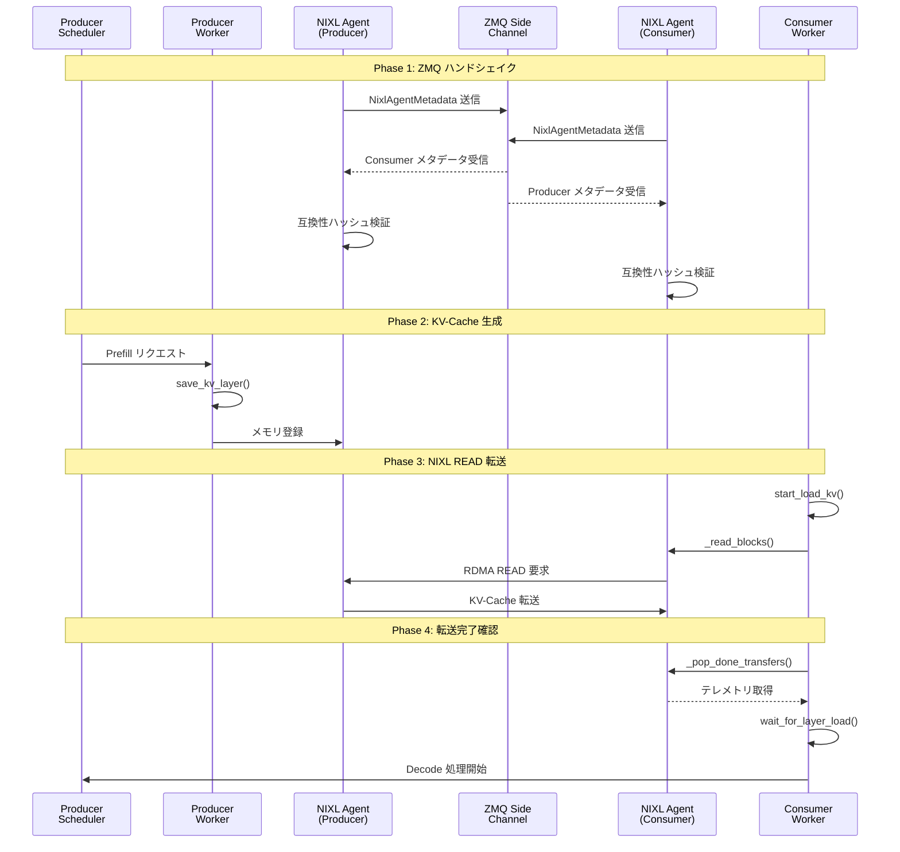

---

# 通信スタックの階層構造

## CRITICAL 発見: TcpConnector は存在しない

vLLM v0.16.0 の KV Connector レジストリを調査した結果、TcpConnector は登録されていません。利用可能なのは、NixlConnector、P2pNcclConnector、LMCacheConnectorV1、LMCacheMPConnector、MultiConnector、MoRIIOConnector、OffloadingConnector、DecodeBenchConnector、MooncakeConnector、ExampleConnector です。TCP 通信は`NixlConnector + UCX_TLS=tcp,self,sm`環境変数で実現します。`kv_connector`の設定は変更せず、UCX 層の環境変数のみを変更します。

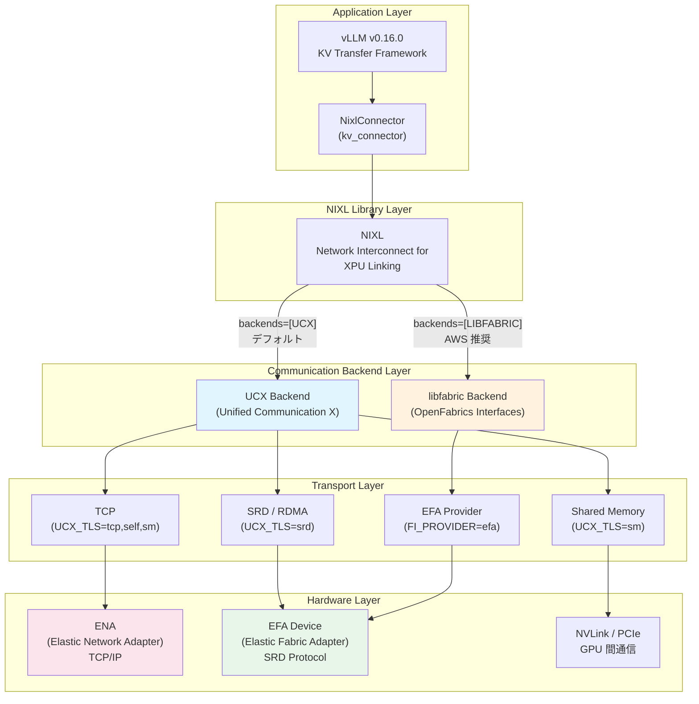

## 各コンポーネントと依存関係

| 技術要素 | 正式名称 | 役割 | レイヤー |
|---------|---------|------|---------|
| NixlConnector | NIXL KV Connector for vLLM | vLLM の KV-Cache 転送実装 | Application |
| NIXL | Network Interconnect for XPU Linking | NVIDIA の GPU 間通信ライブラリ | Library |
| UCX | Unified Communication X | 汎用通信ライブラリ | Communication Backend |
| libfabric | OpenFabrics Interfaces (OFI) | 高性能ファブリック通信の標準 API | Communication Backend |
| EFA | Elastic Fabric Adapter | AWS の高性能ネットワークアダプター | Hardware |
| SRD | Scalable Reliable Datagram | AWS Nitro Card に実装された独自プロトコル | Transport Protocol |
| GPUDirect RDMA | GPU Direct Remote Direct Memory Access | GPU メモリからの直接 DMA 転送 | Transfer Mechanism |
| ENA | Elastic Network Adapter | AWS の標準ネットワークアダプター | Hardware |

依存関係は、NixlConnector→NIXL（`nixl_agent` API 使用）→UCX/libfabric（`backends`パラメータで選択、デフォルト: `["UCX"]`）→トランスポート（UCX は`UCX_TLS`環境変数で制御、libfabric は`FI_PROVIDER=efa`で選択、`FI_EFA_USE_DEVICE_RDMA=1`で GPUDirect 有効化）→EFA→SRD→Nitro Card（EFA は SRD プロトコルを使用し、Nitro Card のハードウェアで処理）という順序です。

## 設定例とトランスポート確認

EFA モードでは環境変数なし、またはオプションで`FI_PROVIDER=efa`と`FI_EFA_USE_DEVICE_RDMA=1`を設定します。TCP モードでは`UCX_TLS=tcp,self,sm`と`UCX_NET_DEVICES=all`を設定し、起動コマンドは同一です。UCX_TLS が効かない場合は`"backends": ["UCX"]`を`kv_transfer_config`に明示的に指定します。トランスポート確認は`UCX_LOG_LEVEL=info`を設定し、ログで"using transport: tcp"（TCP 使用）、"using transport: rc" or "ib"（RDMA 使用）、"efa" or "libfabric"（EFA 使用）を確認します。

---

# GPUDirect RDMA とホストバッファ経由の 2 パス

NixlConnector は KV-Cache 転送に 2 つのデータパスをサポートします。GPUDirect RDMA パス（`kv_buffer_device="cuda"`）は GPU VRAM から直接ネットワークへ転送するゼロコピーパスで、メモリコピー回数は 0、CPU 関与なし、`nixl_memory_type`は"VRAM"、対応インスタンスは P5/P5en です。ホストバッファ経由パス（`kv_buffer_device="cpu"`）は CPU メモリ（DRAM）を経由する従来型パスで、メモリコピー回数は 2（D2H + H2D）、CPU 関与は cudaMemcpy 呼び出し、`nixl_memory_type`は"DRAM"、全インスタンス（G6e、G5、TPU、XPU を含む）で利用可能です。

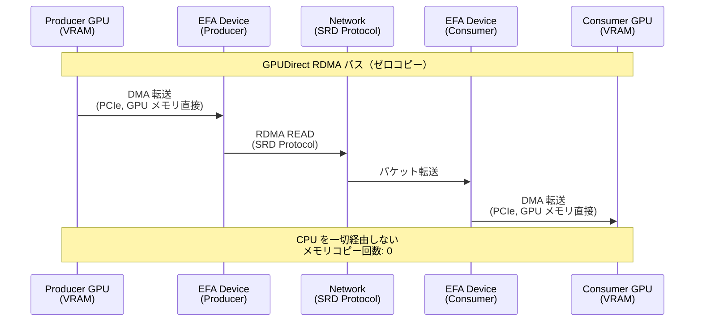

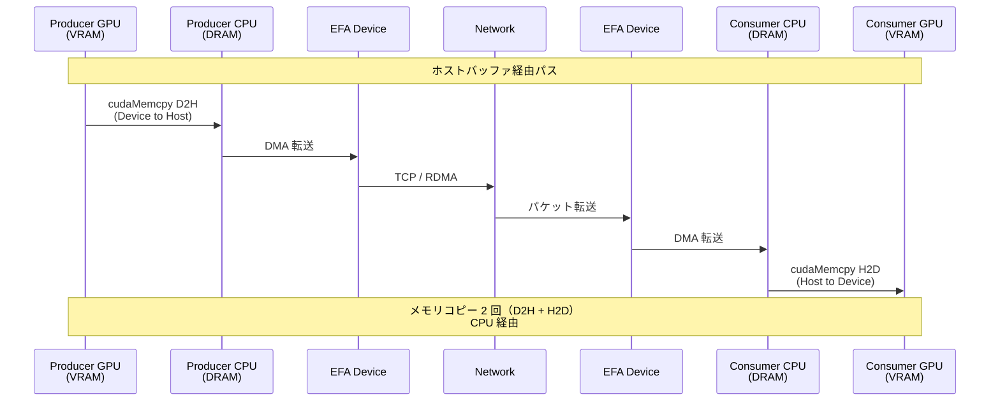

実装上の対応箇所は、Producer 側の`save_kv_to_host()`がデバイスからホストバッファへコピー（ホストバッファ経由パスのみ）、Consumer 側の`sync_recved_kv_to_device()`がホストバッファからデバイスへコピー（ホストバッファ経由パスのみ）です。`_NIXL_SUPPORTED_DEVICE`マップでは、cuda は(cuda, cpu)、tpu は(cpu)、xpu は(cpu)、cpu は(cpu)をサポートします。

| インスタンスタイプ | EFA | GPUDirect RDMA | 推奨パス | 設定 |
|------------------|-----|---------------|---------|------|
| P5 / P5en | あり | あり | GPUDirect RDMA | `kv_buffer_device="cuda"` + `FI_EFA_USE_DEVICE_RDMA=1` |
| g6e.12xlarge | あり | なし | ホストバッファ経由（EFA） | `kv_buffer_device="cpu"` |
| g5.48xlarge | あり | なし | ホストバッファ経由（EFA） | `kv_buffer_device="cpu"` |
| g5.8xlarge | なし | なし | ホストバッファ経由（TCP） | `kv_buffer_device="cpu"` + `UCX_TLS=tcp,self,sm` |

g6e.12xlarge では GPUDirect RDMA は利用できず、ホストバッファ経由（`kv_buffer_device="cpu"`）を使用します。P5/P5en インスタンスでは GPUDirect RDMA が利用可能で、最高の性能が得られます。

---

# Disaggregated Inference のスケーリング理論

## Amdahl の法則による分析

Disaggregated Inference のスケーリングボトルネックは、KV-Cache 転送時間が並列化できない逐次部分であることです。Amdahl の法則により、スピードアップは逐次部分に制約されます:

$$
\text{Speedup} = \frac{1}{(1-p) + \frac{p}{n}}
$$

ここで、$p$ は並列化可能な部分の割合、$n$ は並列度です。

**逐次部分と並列部分の分解**:
- **並列部分**: Prefill 処理（複数リクエストを並行処理可能）、Decode 処理（同上）
- **逐次部分**: KV-Cache 転送（1 リクエストあたり、ネットワーク帯域幅に制約）

**理論的スケーリング限界**: 12K トークンの KV-Cache 転送（672 MB）が EFA で約 67ms かかる場合、1 秒あたり最大約 15 リクエストが理論限界です。Prefix Caching により逐次部分を削減（全量転送→差分転送→転送なし）することで、スケーリング限界を大幅に改善できます。

---

# KV-Cache 転送のオーバーヘッド分析

## KV-Cache サイズの計算

KV-Cache サイズは Qwen2.5-7B-Instruct（num_layers: 28、num_kv_heads: 4（Grouped Query Attention: GQA）、head_dim: 128、bytes_per_element: 2（BF16））の場合、1 トークンあたり`2 × 28 × 4 × 128 × 2 = 57,344 bytes = 56 KB/token`です。Qwen2.5-32B-Instruct（num_layers: 64、num_kv_heads: 8（GQA）、head_dim: 128、bytes_per_element: 2（BF16））の場合、1 トークンあたり`2 × 64 × 8 × 128 × 2 = 262,144 bytes = 256 KB/token`、TP=4 での 1 GPU あたり`256 KB ÷ 4 = 64 KB/token/GPU`です。

**Qwen2.5-32B-Instruct (TP=4) での GPU メモリ使用量: **

| プロンプト長 | Total KV-Cache | Per GPU (TP=4) | + Model Weights | L40S 48GB 使用率 |
|------------|---------------|----------------|-----------------|----------------|
| 1K | 256 MB | 64 MB | ~19.3 GB | 40% |
| 4K | 1.0 GB | 256 MB | ~19.5 GB | 41% |
| 12K | 3.0 GB | 768 MB | ~20.0 GB | 42% |
| 32K | 8.0 GB | 2.0 GB | ~21.3 GB | 44% |
| 64K | 16.0 GB | 4.0 GB | ~24.3 GB | 51% |
| 100K | 25.0 GB | 6.25 GB | ~27.5 GB | 57% |

## 実測値と理論値の乖離

理論転送時間は 1K（56 MB）で EFA ~5.6 ms、TCP ~7.5 ms、理論差 ~1.9 ms、4K（224 MB）で EFA ~22.4 ms、TCP ~30.0 ms、理論差 ~7.6 ms、12K（672 MB）で EFA ~67.2 ms、TCP ~90.0 ms、理論差 ~22.8 ms です。実測値と理論値の乖離は 1K で+12（TCP 優位、逆転）、4K で-197（比率 25.9x）、12K で-1,119（比率 49.1x）です。実測値と理論値の乖離が最大 49.1 倍に達しており、理論値は「帯域幅差のみ」で計算していますが、実際には TCP の slow start 問題（672 MB のバルク転送で数百 ms のペナルティ）、二峰性分布による mean 値の歪み（TCP の stdev が 2 倍以上大きい）、TTFT 二峰性分布（RDMA Memory Region 登録コストとキャッシュウォームアップ）、単純すぎる理論モデル（帯域幅差のみで計算し、プロトコルオーバーヘッドを無視）が影響します。

---

# 設定パラメータの詳細

| 環境変数 | 設定値 | 用途 | 必須度 |
|---------|--------|------|--------|
| `UCX_TLS` | `tcp,self,sm` | UCX バックエンドで TCP 強制 | TCP 使用時は必須 |
| `UCX_TLS` | `srd` | UCX バックエンドで SRD/RDMA 使用 | EFA + UCX 使用時 |
| `UCX_NET_DEVICES` | `all` | 全ネットワークデバイスを使用 | TCP 使用時は推奨 |
| `FI_PROVIDER` | `efa` | libfabric で EFA Provider を指定 | libfabric 使用時 |
| `FI_EFA_USE_DEVICE_RDMA` | `1` | GPUDirect RDMA を有効化 | P5 で GDR 使用時 |
| `NIXL_BACKEND` | `UCX` or `LIBFABRIC` | NIXL のバックエンド選択 | 明示的な選択時 |
| `VLLM_NIXL_SIDE_CHANNEL_HOST` | 各ノードの Private IP | ZMQ サイドチャネルのバインドアドレス | マルチノードでは必須 |
| `LD_LIBRARY_PATH` | `/opt/amazon/efa/lib: ...` | EFA installer のライブラリを優先 | EFA 使用時は必須 |
| `UCX_RCACHE_MAX_UNRELEASED` | `1024` | UCX メモリリーク回避 | vLLM が自動設定 |

| パラメータ | 値 | 説明 |
|-----------|-----|------|
| `kv_connector` | `NixlConnector` | KV Connector の種類（唯一の推奨選択肢） |
| `kv_role` | `kv_producer` / `kv_consumer` / `kv_both` | ノードの役割 |
| `kv_buffer_device` | `cuda` / `cpu` | KV バッファの配置先 |
| `backends` | `["UCX"]` / `["LIBFABRIC"]` | NIXL バックエンド選択 |
| `num_threads` | `4`（デフォルト） | UCX スレッド数（UAR 枯渇回避） |
| `enforce_handshake_compat` | `true`（デフォルト） | ハンドシェイク互換性チェック |

---

# 測定上の注意点

## CRITICAL

**max_tokens=10 の落とし穴**: `benchmark_phase14.py`は`max_tokens=10`で測定していますが、実用的ではありません。実測時は`max_tokens=100`以上を推奨します。

**Proxy 実装の選択が重要**: vLLM リポジトリには複数の Proxy 実装が存在し、実装によって性能が大きく異なります。

- **toy_proxy_server.py**（公式推奨、現在使用中）
  - パス: `tests/v1/kv_connector/nixl_integration/toy_proxy_server.py`
  - 公式ドキュメント（`docs/features/nixl_connector_usage.md`）で推奨される参照実装
  - FastAPI + httpx.AsyncClient を使用
  - **lifespan で Client を初期化して再利用**（効率的）
  - 複数の Prefill/Decode インスタンスをサポート（ラウンドロビン）
  - オーバーヘッド: 最小限

- **disagg_prefill_proxy_server.py**（ベンチマーク用、非推奨）
  - パス: `benchmarks/disagg_benchmarks/disagg_prefill_proxy_server.py`
  - Quart + aiohttp を使用
  - **リクエストごとに aiohttp.ClientSession を作成**（非効率）
  - オーバーヘッド: TTFT に約 436ms の追加遅延（EFA-TCP 差の 33 倍）

::::details toy_proxy_server.py の実装例（Client 再利用）
```python
@asynccontextmanager
async def lifespan(app: FastAPI):
    # Startup: Initialize client pools
    app.state.prefill_clients = []
    app.state.decode_clients = []

    for i, (host, port) in enumerate(global_args.prefiller_instances):
        prefiller_base_url = f"http://{host}:{port}/v1"
        app.state.prefill_clients.append({
            "client": httpx.AsyncClient(
                timeout=None,
                base_url=prefiller_base_url,
                limits=httpx.Limits(
                    max_connections=None,
                    max_keepalive_connections=None,
                ),
            ),
            "host": host,
            "port": port,
            "id": i,
        })

    # ... decode_clients も同様

    yield

    # Shutdown: Close all clients
    for client_info in app.state.prefill_clients:
        await client_info["client"].aclose()
```

httpx.AsyncClient を lifespan で初期化し、全リクエストで再利用することで、接続確立のオーバーヘッドを排除しています。
::::

::::details disagg_prefill_proxy_server.py の実装例（リクエストごとに作成）
```python
async def handle_request():
    # Prefill リクエスト
    async with aiohttp.ClientSession(timeout=AIOHTTP_TIMEOUT) as session:
        async with session.post(url=url, json=payload, headers=headers) as resp:
            # ... 処理

    # Decode リクエスト
    async with aiohttp.ClientSession(timeout=AIOHTTP_TIMEOUT) as session:
        async with session.post(url=url, json=payload, headers=headers) as resp:
            # ... 処理
```

リクエストごとに ClientSession を作成・破棄するため、TCP ハンドシェイク、TLS ハンドシェイク、コネクションプールの初期化が毎回発生し、約 436ms のオーバーヘッドが追加されます。
::::

**推奨事項**:
- プロダクション環境では `toy_proxy_server.py` を使用（または参考に独自実装）
- ベンチマーク測定では Proxy なし直接測定を推奨（Proxy オーバーヘッドを排除）
- `disagg_prefill_proxy_server.py` は参考にしない（ベンチマーク用の意図的に簡易化された実装）

**スループット計算の誤り**: `benchmark_phase14.py:424`の計算式が不正確で、スループットが約 30 倍過大に報告されます。

**NIXL wheel パッケージング問題**: NIXL wheel が独自の libfabric/libefa/libibverbs を含み、EFA installer のライブラリと衝突して **Segmentation Fault** が発生します。EFA 環境で vLLM 起動時にほぼ確実に遭遇します。解決策は`export LD_LIBRARY_PATH=/opt/amazon/efa/lib: $LD_LIBRARY_PATH`で EFA installer のライブラリを優先します。

## HIGH

RDMA Memory Region 登録コストとキャッシュウォームアップにより、mean 値がどちらのフェーズも代表しません。Phase A（iter 1-11）: 3,583ms（安定）、Phase B（iter 12-30）: 2,664ms（安定）、mean: 3,016ms（どちらも代表しない値）です。Phase 14 の 2048 トークン測定では、TCP/EFA 両方で正確に **iter 18** で急変が発生（TCP: -23.1%、EFA: -27.7%）し、NIXL 内部の最適化が同時に発動することが確認されました。対策は dip test で二峰性を検出し、KMeans で Phase A/B に分離し、Phase B の mean 値を採用します。Proxy の 4 回の HTTP ラウンドトリップが EFA-TCP の純粋な差を不明瞭にします。対策は Producer 直接接続での測定です。

## MEDIUM

**バッチ処理中断問題**: vLLM スケジューラの Continuous Batching により、c>=2 で TPOT が 3 クラスタに分裂します。EFA c=4 で mean: 44.92ms（c=1 では 33.27ms）、stdev: 22.0ms。raw データが約 34ms、約 80ms、約 104ms の 3 クラスタに分裂する原因は、batch size 8 環境では各リクエストが平均 7 回中断され、一部リクエストの待機時間が混入するためです。PagedAttention のメモリブロック再配置と Continuous Batching のスケジューリング遅延が組み合わさることで発生します。対策は c=1 でのみバックエンド比較します。

**TPOT vs ITL**: TPOT は`(E2E - TTFT) / (tokens - 1)`（平均値）、ITL は個々のトークン間の実際の遅延（分布）です。TPOT は全体傾向、ITL は詳細分析に使い分けます。

---

# TCP vs EFA の性能差の本質

## KV-Cache サイズによる閾値

EFA の効果は **KV-Cache サイズ（プロンプト長）** に強く依存します。Phase 14 の測定により閾値が判明しました：

| KV-Cache サイズ | プロンプト長 | 推奨 | Phase 14 実測差分 |
|----------------|------------|------|----------------|
| < 200 MB | ~2000 tokens 未満 | **TCP** | +11ms（TCP 優位） |
| 200-400 MB | 2000-4000 tokens | **EFA** | -71ms（EFA 優位） |
| > 400 MB | 4000+ tokens | **EFA** | -103ms 以上（EFA 優位） |

閾値は約 **200MB（~2000 トークン）** です。これ以下では TCP の接続確立コストの低さが優位で、これ以上では EFA の帯域幅優位性が発揮されます。

## 並行度による性能差

並行度別の性能比較では、c=1 で EFA-TCP 差はほぼなし、c=4 で EFA が TCP を約 2.3 倍上回り、c=16 で EFA が TCP の 2.72 倍優位（TTFT ベース）です。TCP c=16 の TTFT 分布では、最初に処理された 2 リクエストが 1307-1308 ms、待機後に処理された 2 リクエストが 3370 ms、次の 2 リクエストが 4768 ms、残り 11 リクエスト（69%）が 6485-6832 ms に集中しています。EFA c=16 の TTFT 分布では、Tier 0（0-3）が 898-899 ms（4 リクエスト）、Tier 1（4-7）が 1770 ms（4 リクエスト）、Tier 2（8-11）が 2643 ms（4 リクエスト）、Tier 3（12-15）が 3482 ms（4 リクエスト）とティア間ステップが約 871ms（均等）の綺麗な 4 ティア階段構造です。

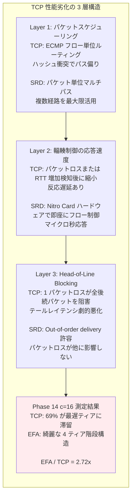

TCP 性能劣化の 3 層構造は、Layer 1（パケットスケジューリング）で TCP は Equal-Cost Multi-Path (ECMP) によるフロー単位ルーティングでハッシュ衝突が発生するとパス偏りが生じるのに対し、SRD は各パケットを独立に最適パスへ分散し Clos ネットワーク内の複数の等価パスを最大限活用します。Layer 2（輻輳制御の応答速度）で TCP はパケットロスまたは RTT 増加を検知してからウィンドウを縮小（反応遅延あり）するのに対し、SRD は Nitro Card のハードウェアで即座にフロー制御（マイクロ秒応答）します。Layer 3（Head-of-Line Blocking）で TCP は 1 パケットのロスが後続の全パケットの配信を阻害しテールレイテンシが劇的に悪化するのに対し、SRD は out-of-order delivery を許容しパケットロスが他のパケットに影響しません。

AWS の論文"A Cloud-Optimized Transport Protocol for Elastic and Scalable HPC"（IEEE Micro、2020）では、48 台のノードが同時に 1 台のノードに送信する Incast（多対一通信パターンで発生する輻輳崩壊）テストで、TCP がテールレイテンシの劇的な悪化を示す一方、SRD は安定したレイテンシを維持することが報告されています。Phase 14 の c=16 測定は規模は小さいものの、本質的に同じ現象を観察しており、TCP c=16 の 69%最遅ティア滞留は Incast による輻輳崩壊の典型的症状です。

---

# Prefix Caching の影響

Prefix Caching の 3 段階は、第 1 段階（Prefix Cache ミス、初回リクエスト）で Decode ノードのローカルキャッシュが空で NIXL 経由で KV-Cache を全量受信し TTFT が高く（プロンプト長に依存）実測 690.51ms（1000 tokens）、第 2 段階（部分ヒット）で共通プレフィックス部分をローカルに保持し差分ブロックのみ NIXL 転送し TTFT が改善、第 3 段階（完全ヒット）で全てローカルキャッシュに存在し`send_notif()`のみ（データ転送なし）で TTFT が固定コスト（約 50ms）のみで実測 96.84ms（1000 tokens）です。

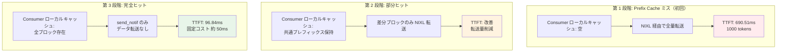

性能因子の影響度比較では、Prefix Cache ヒット vs ミスが約 7 倍の差（98ms vs 700ms）、Disagg vs Unified が約 2.3 倍の差（93ms vs 41ms）、EFA vs TCP が 10ms 以内です。Prefix Caching が最も重要な性能因子です。

---

# Prefill/Decode ノード比率の最適化

**ワークロード別の推奨比率**:
- **長プロンプト中心** (平均 10K+ tokens): Prefill 重視（Prefill: Decode = 2:1）。Prefill 処理の演算負荷が高く、Decode ノードはキャッシュヒットで軽量。
- **短プロンプト・長生成** (平均 1K tokens、生成 500+ tokens): Decode 重視（Prefill: Decode = 1:2）。Decode 処理の連続生成が支配的。
- **混合ワークロード**: バランス型（Prefill: Decode = 1:1）。Prefix Caching により Prefill 負荷が軽減されるため、Decode ノードを増やすことでスループット向上。

**リクエスト特性による調整**: プロンプト長が 4K 未満の場合、Prefill ノードの GPU 利用率が低下するため、Decode ノードを増やすことを推奨します。

---

# コスト効率の定量的分析

**インスタンスタイプ別のコスト比較** (us-east-1、オンデマンド価格):
- g6e.12xlarge (4x L40S): $7.02/時間
- g5.12xlarge (4x A10G): $5.672/時間
- P5 (8x H100): $98.32/時間（GPUDirect RDMA 対応）

**GPU 利用率改善によるコスト削減**: モノリシック構成では Decode フェーズで GPU 演算ユニット利用率が約 20-30% に低下しますが、Disaggregated 構成では Prefill ノードで 80%+、Decode ノードで 60%+ を維持できます。結果として、同一スループットを約 40% 少ない GPU 数で実現可能です。

**ネットワーク帯域幅のコスト**: EFA 自体に追加コストはありませんが、g6e.12xlarge（100 Gbps EFA）と g5.8xlarge（25 Gbps ENA）では約 1.5 倍の価格差があります。KV-Cache 転送が頻繁な場合（Prefix Caching ミス率が高い）、EFA の性能向上がコスト差を正当化します。

---

# TPOT がバックエンドに依存しない理由

KV-Cache が Decode 開始前に Consumer の GPU メモリに完全に配置されるため、Decode ループ中にネットワーク転送は発生しません。RDMA ゼロコピー転送でも cudaMemcpy でも、Decode 開始時点では KV-Cache は GPU VRAM 上にあります。HBM 帯域幅（A10G: ~600 GB/s）で KV-Cache を読み出すため、12K トークンの KV-Cache（656 MB）の読み出しは約 1.1ms です。実測データでは EFA TPOT ~ TCP TPOT（差 < 0.03ms/token、全 concurrency、全プロンプト長で一定）です。

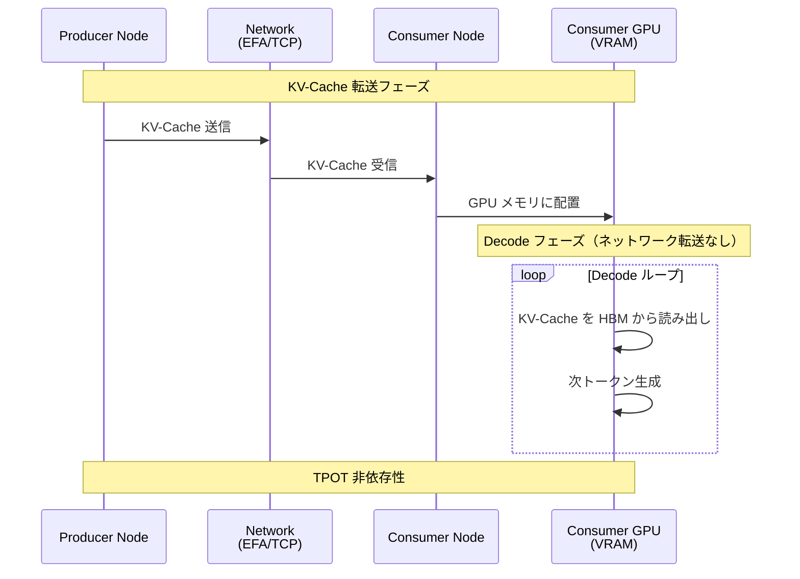

---

# まとめ

理論編の主要な発見を 10 項目にまとめます:

1. **TcpConnector は存在しない**: vLLM v0.16.0 に TcpConnector は登録されておらず、TCP 通信は`NixlConnector + UCX_TLS=tcp,self,sm`で実現
2. **TPOT はバックエンドに依存しない**: EFA でも TCP でも TPOT は 33.0-35.0ms の範囲で一定。KV-Cache は Decode 開始前に Consumer の GPU メモリに配置され、Decode ループ中にネットワーク転送は発生しない
3. **Prefix Caching が最も重要な性能因子**: Cache ヒット vs ミスで TTFT が約 7 倍の差。EFA vs TCP の差（10ms 以内）より遥かに大きい影響
4. **EFA の効果は KV-Cache サイズと並行度に依存**: KV-Cache 200MB（~2000 トークン）が閾値で、それ以下では TCP 優位、それ以上では EFA 優位。並行度では c=1 で差はほぼなく、c=16 で EFA が TCP の 2.72 倍優位。SRD のパケット単位マルチパスルーティングが TCP の Head-of-Line Blocking と Incast 問題を回避
5. **NIXL wheel のパッケージング問題**: NIXL wheel が独自の libfabric/libefa/libibverbs を含み、EFA installer のライブラリと衝突して Segmentation Fault が発生。`LD_LIBRARY_PATH`で EFA installer のライブラリを優先する必要あり
6. **TTFT 二峰性分布**: Phase A（初回）と Phase B（安定状態）で平均約 900ms の差。RDMA Memory Region 登録コストとキャッシュウォームアップが原因
7. **Proxy 実装の選択が重要**: vLLM 公式推奨の `toy_proxy_server.py` は httpx.AsyncClient を再利用して効率的。`disagg_prefill_proxy_server.py`（ベンチマーク用）はリクエストごとに ClientSession を作成し約 436ms のオーバーヘッド
8. **実測値と理論値の乖離**: 12K トークンでの EFA-TCP 差が理論値の 49.1 倍。原因は TCP の slow start、二峰性分布、MR キャッシュ
9. **GPUDirect RDMA の条件**: `kv_buffer_device="cuda"` + P5/P5en インスタンスで利用可能。G6e は GDR 非対応
10. **IEEE Micro 2020 論文との対応**: Phase 14 の c=16 測定は、規模は小さいものの、48-way Incast と本質的に同じ現象を観察

Disaggregated Inference のスケーリングボトルネックは、KV-Cache 転送時間が並列化できない逐次部分です。Prefix Caching により逐次部分を大幅に削減可能（全量転送→差分転送→転送なし）で、EFA は並行度が高い場合に TCP に対して明確な優位性を持ちます。最適なスケーリングには、Prefix Caching + EFA の組み合わせが推奨されます。

---

# 次回予告

Phase 18 では、Phase 17A（EFA のみ）の成果を拡張し、TCP トランスポートを追加測定して EFA vs TCP の性能差を定量化します。測定範囲は 1K-100K tokens、測定方法は Proxy なし直接測定（Proxy オーバーヘッドを排除）です。主要変更点は、TCP 実装方法が NixlConnector + UCX_TLS=tcp,self,sm、測定スクリプトが Phase 17A スクリプトを流用、モデルが Qwen2.5-32B-Instruct、インスタンスが g6e.12xlarge（4x L40S）、TP=4 です。

測定対象は Transport（EFA、TCP）、Prompt Length（1K、4K、12K、32K、64K、100K）、Metric（TPOT、TTFT）、Throughput（c=1、c=4、c=8、c=16）です。

期待される結果:

- **TPOT**: EFA ~ TCP（差 < 1 ms/token、理論編の知見「TPOT はバックエンドに依存しない」が確認されるはず）
- **TTFT**: 長プロンプトほど EFA 優位（TCP の slow start 影響）
- **Throughput**: c=16 で EFA >> TCP（Phase 14 の 2.72x の再現を期待）

100K tokens は 6.25 GB/GPU + 16.25 GB（モデルウェイト）= 約 27.5 GB/GPU、L40S 48GB の 57%で、注意点は c=16 で 100K tokens は危険（推奨: 100K では c=8 以下）です。

---

# 参考文献

AWS 公式論文 "A Cloud-Optimized Transport Protocol for Elastic and Scalable HPC" (IEEE Micro, 2020)、[vLLM GitHub リポジトリ](https://github.com/vllm-project/vllm)の NixlConnector 実装（v0.16.0）、[NIXL GitHub リポジトリ](https://github.com/NVIDIA/NIXL)、本連載の既存記事（[AWS EFA と Nitro System 解説編](https://zenn.dev/tosshi/articles/0eeb53ca63f8b2)、[環境構築編](https://zenn.dev/tosshi/articles/009bb138491dd1)）、[OpenUCX プロジェクト](https://www.openucx.org/)、[OpenFabrics Interfaces (OFI) / libfabric](https://ofiwg.github.io/libfabric/)を参照しました。

---

# おわりに

本記事では、vLLM Disaggregated Inference の実装詳細と、EFA vs TCP の性能差の本質について解説しました。最重要の発見は、Prefix Caching が最も重要（約 7 倍の TTFT 改善）、TPOT はバックエンドに依存しない（Decode 中にネットワーク転送がないため）、EFA の効果は KV-Cache サイズと並行度に依存（閾値 200MB、c=16 で 2.72 倍優位）の 3 点です。次回の Phase 18 では、これらの知見を踏まえて、1K-100K tokens の広範囲で EFA vs TCP の性能差を定量化します。本記事が、vLLM Disaggregated Inference を理解する助けになれば幸いです。

（執筆: 2026-02-28）
