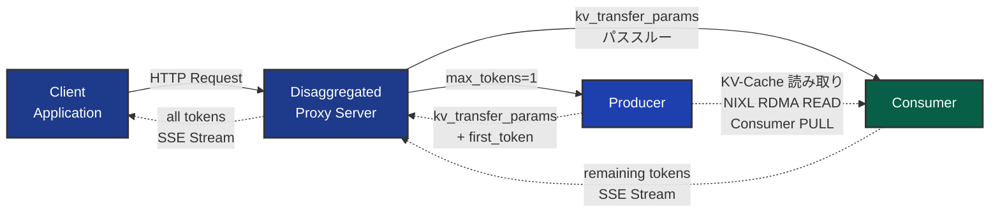
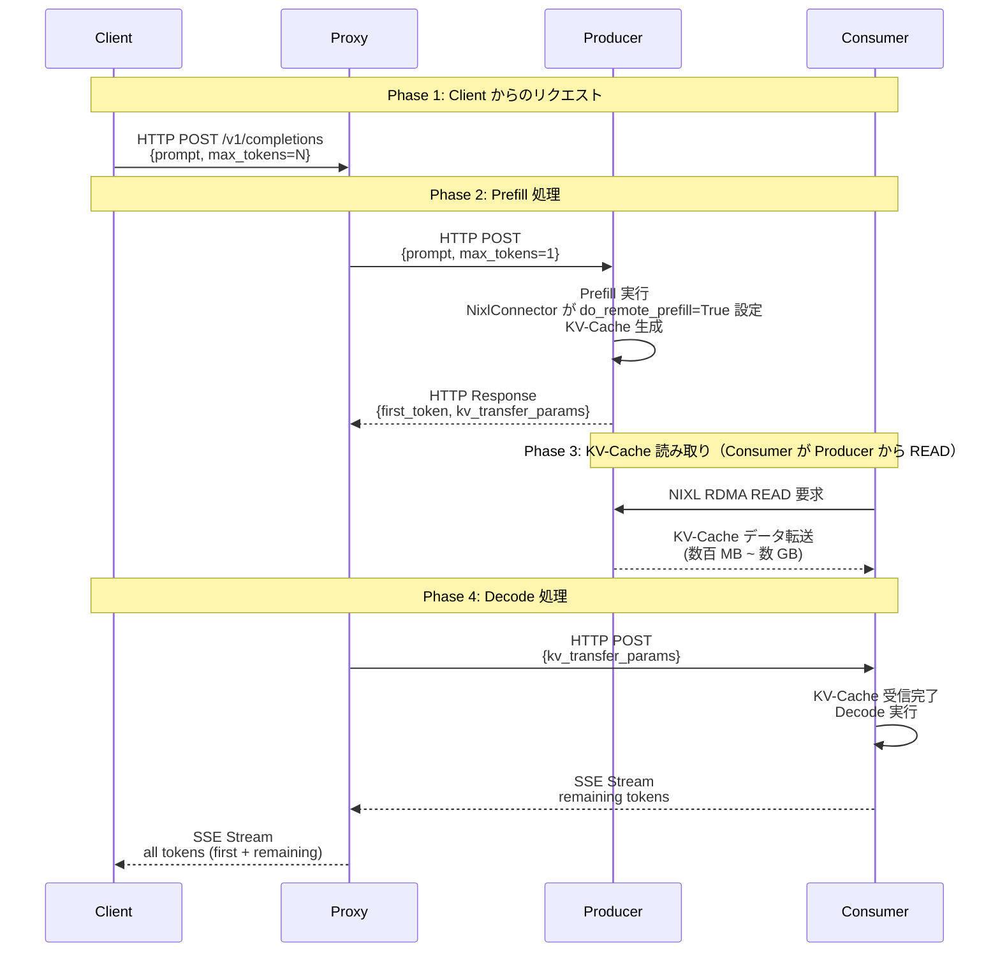
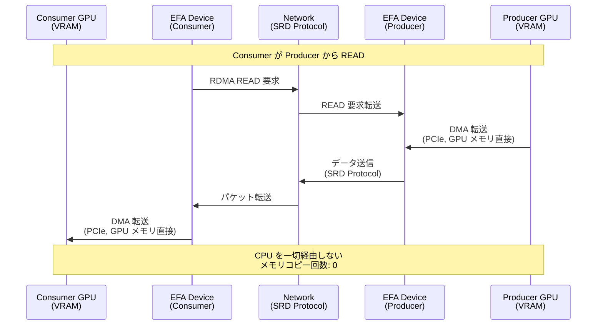
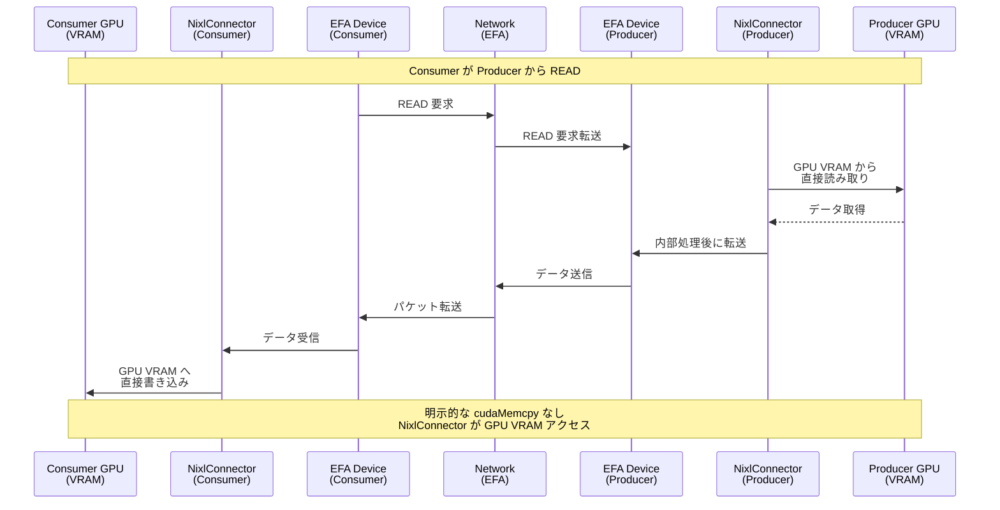
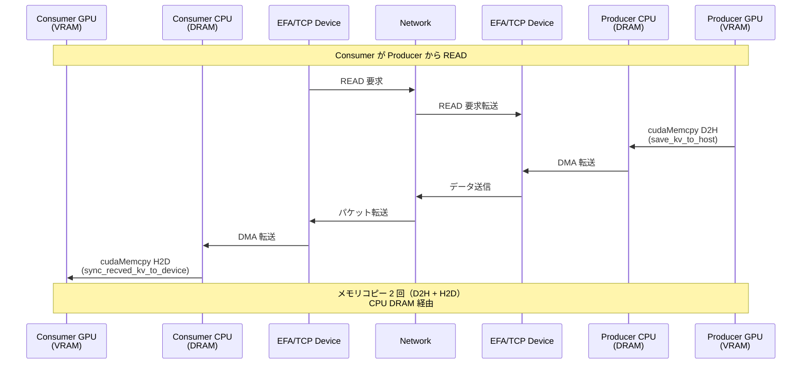
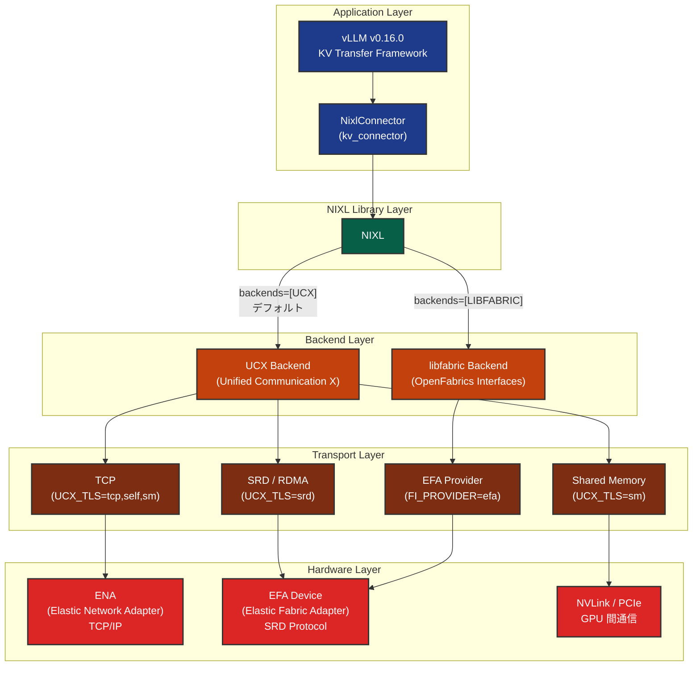
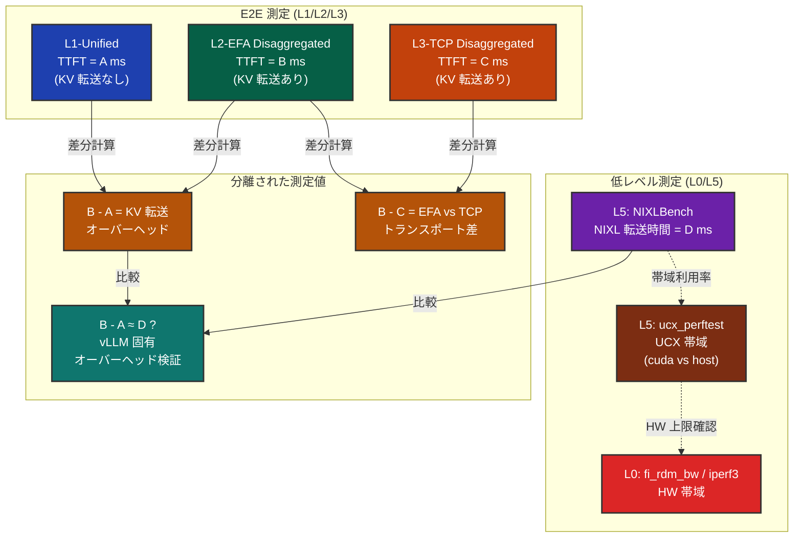
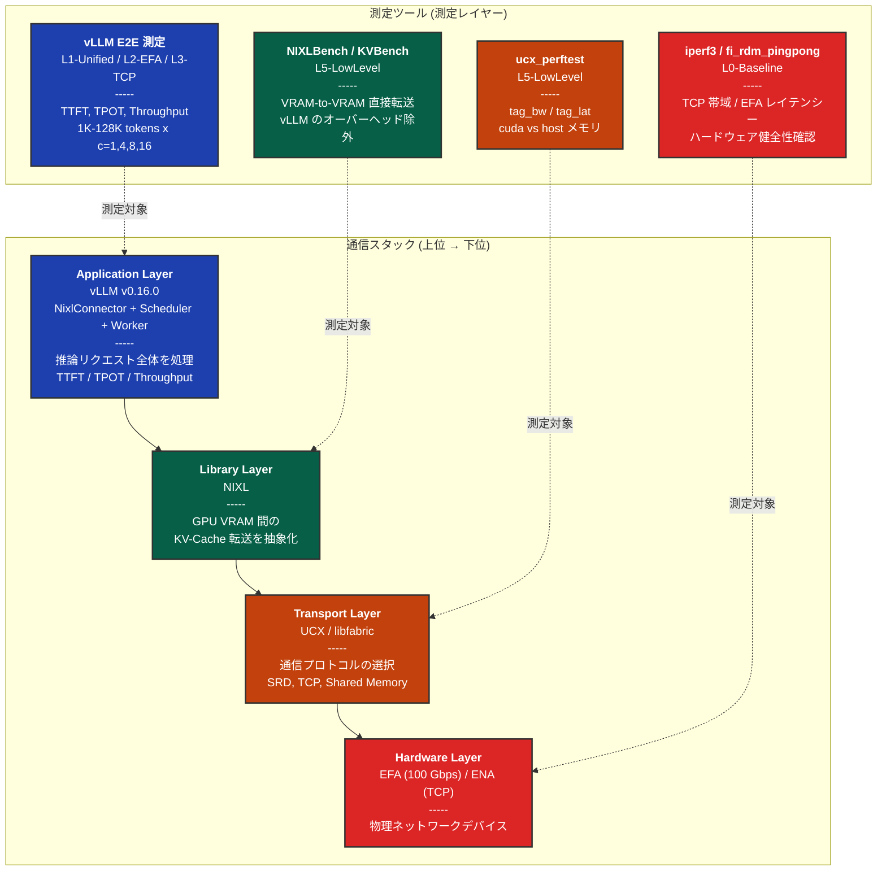
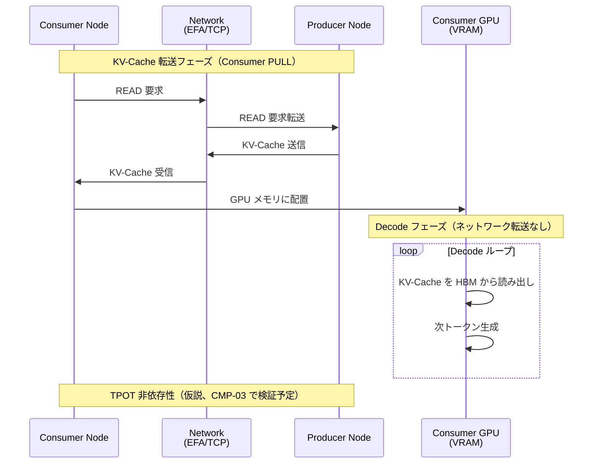
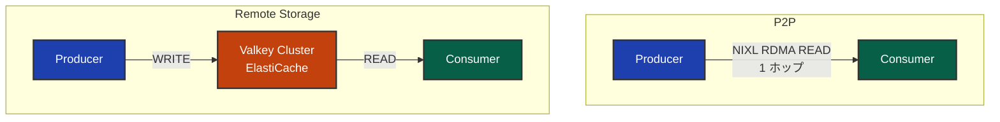

## はじめに

本記事は、AWS Elastic Fabric Adapter (EFA) と Prefill/Decode Disaggregated Inference (DI) に関する連載の実装理解編です。前回の[環境構築編](https://zenn.dev/tosshi/articles/009bb138491dd1)で環境構築について解説しましたが、今回は **vLLM の実装に基づいて、通信スタックのどこを何で測定するか**を体系的に整理します。

### 本記事の目的

vLLM DI の実装は、NixlConnector、NIXL、UCX/libfabric、EFA という複数のレイヤーで構成されます。本記事では、各コンポーネントの役割、測定ツールと実装の対応関係、および通信スタック全体をカバーする測定アーキテクチャを解説します。

:::message
完全な測定環境を作りきれている自信はないので今後さらに測定知識を向上させて精度の高い測定を行っていこうと考えています。にゃ。。ん。。。
:::

### 用語

Time To First Token (TTFT, 最初のトークン生成までの遅延) と Time Per Output Token (TPOT, 各トークンの平均生成時間) を使用します。vLLM DI の基本概念（Prefill/Decode 分離）、AWS EFA および SRD (Scalable Reliable Datagram) プロトコルの基礎（[EFA/Nitro System 解説編](https://zenn.dev/tosshi/articles/0eeb53ca63f8b2)参照）の理解を前提とします。

## vLLM Disaggregated Inference の実装概要

vLLM DI は、Prefill と Decode を異なるノードに分離し、KV-Cache をネットワーク経由で転送するアーキテクチャです。

### システムアーキテクチャ

:::message
**Proxy 実装について**: vLLM リポジトリには複数インスタンス対応の [Toy Proxy Server](https://github.com/vllm-project/vllm/blob/v0.16.0/tests/v1/kv_connector/nixl_integration/toy_proxy_server.py) が参考実装として提供されています。本測定では、**1 Prefiller + 1 Decoder 構成に特化した独自実装** `disagg_proxy_server.py` を使用しています（今後複数台構成への実装拡張を検討しています）。この実装には以下の測定最適化が含まれます。

- **タイムスタンプ測定機能**: Prefill/Decode 各フェーズの時間を `X-Proxy-*` ヘッダーで記録
- **接続プーリング最適化**: `aiohttp.ClientSession` の再利用により TCP handshake を削減

本セクションで説明する Proxy の動作フローは両実装で共通です。
:::

Client から Proxy を経由して Prefill ノード (Producer) と Decode ノード (Consumer) に処理が分散されます。Proxy は Producer に `max_tokens=1` でリクエストを送信します。Producer の NixlConnector が内部で `do_remote_prefill=True` を設定し、返却された `kv_transfer_params` を Proxy が Consumer へパススルーします。

**Fig 1: システム構成図（Client - Proxy - Producer - Consumer）**

リクエストの流れとデータ転送を以下のシーケンス図で示します。

**Fig 2: Disaggregated Inference のシーケンス図（Phase 1-4）**

接続関係の詳細を説明します。DI のデータフローは 4 つの Phase で構成されます。**Phase 1** では、Client が Proxy に HTTP POST リクエストを送信します。このリクエストには元のプロンプトと `max_tokens=N` などのパラメータが含まれます。**Phase 2** で、Proxy は Producer にリクエストを転送しますが、この際に `max_tokens` を 1 に上書きします。Producer の NixlConnector が [内部で `do_remote_prefill=True` を設定](https://github.com/vllm-project/vllm/blob/v0.16.0/vllm/distributed/kv_transfer/kv_connector/v1/nixl_connector.py#L842-L844)し、「この Prefill はリモート（Producer）で実行された」ことを示すフラグを Consumer に渡します。Producer は Prefill 処理を実行して KV-Cache を生成し、最初のトークンと `kv_transfer_params` （KV-Cache 転送のメタデータ）を Proxy に返却します。

**Phase 3** が DI の要点です。Consumer が Producer から、**NIXL ライブラリを使用して KV-Cache を直接 READ/PULL** します。

:::message alert
この転送は **Consumer が能動的に Producer から READ/PULL する**仕組みです。Producer が Consumer に PUSH するのではありません。これは RDMA READ 操作の特性で、Consumer が `kv_transfer_params` に含まれるメモリアドレスとサイズ情報を元に、Producer の GPU VRAM から直接データを読み取ります。NIXL の実装では、[Consumer が `operation = "READ"` を指定](https://github.com/vllm-project/vllm/blob/v0.16.0/vllm/distributed/kv_transfer/kv_connector/v1/nixl_connector.py#L2348-L2349)して `nixl_wrapper.make_prepped_xfer()` を呼び出します。
:::

この転送は HTTP を経由せず、RDMA READ または TCP で GPU 間を直接接続します。転送されるデータサイズはプロンプト長に応じて数百 MB から数十 GB に及びます。重要な点は、**Proxy はこの大容量データを中継しない**ことです。Proxy が扱うのは `kv_transfer_params` という小さなメタデータのみで、実際の KV-Cache は Consumer が Producer から直接読み取ります。

**Phase 4** では、Proxy が Consumer に `kv_transfer_params` をパススルーします。Consumer はこのメタデータを元に NIXL 経由で KV-Cache を受信し、Decode 処理を開始します。生成された残りのトークンは SSE (Server-Sent Events) ストリーム形式で Proxy に返却され、Proxy は最初のトークンと結合して全トークンを Client に返します。

この設計の利点は、**並行処理**にあります。Producer が first_token を返却した時点で、Proxy はすぐに Consumer にリクエストを送信できます。KV-Cache の転送と Decode 処理の準備が並行して進行するため、レイテンシーを最小化できます。また、Proxy が大容量の KV-Cache を中継しないことで、Proxy のネットワーク帯域幅とメモリ使用量を大幅に削減できます。

### KV-Cache 転送の 3 つのパターン

:::message
次回の実験結果考察編はインスタンス確保の都合上 g6e.12xlarge を利用していますが、このインスタンスは GPUDirect RDMA (GPUDirect Remote Direct Memory Access) に対応していないためゼロコピーの恩恵は受けられません。[g7e](https://aws.amazon.com/jp/blogs/news/announcing-amazon-ec2-g7e-instances-accelerated-by-nvidia-rtx-pro-6000-blackwell-server-edition-gpus/) は対応しています。今後 g7e で GPUDirect RDMA の効果を確認してみたいです。
:::

:::message alert
**重要**: GPUDirect RDMA と `kv_buffer_device="cuda"` は別の概念です。GPUDirect RDMA は P5/P5en など特定のインスタンスでのみ利用可能なハードウェア機能ですが、`kv_buffer_device="cuda"` 設定自体は g6e.12xlarge でも使用できます。NixlConnector は実装上 3 つの異なるパターンをサポートしています。
:::

| 項目 | パターン 1: GPUDirect RDMA | パターン 2: cuda buffer | パターン 3: cpu buffer |
|------|---------------------------|------------------------|---------------------|
| **GPUDirect RDMA 対応** | あり（ハードウェア要件） | なし | なし |
| **対象インスタンス** | P5/P5en/g7e など GPUDirect RDMA 対応 | g6e.12xlarge など（GPUDirect RDMA 非対応でも可） | 全インスタンス（g6e、g5、TPU、XPU を含む） |
| **トランスポート** | EFA 必須 | EFA 推奨 | TCP または EFA |
| **メモリコピー回数** | 0 回 | NixlConnector 内部処理（明示的な cudaMemcpy なし） | 2 回（D2H + H2D） |
| **CPU 経由** | なし | あり（内部処理） | あり（DRAM バッファ使用） |
| **nixl_memory_type** | "VRAM" | （内部処理） | "DRAM" |
| **kv_buffer_device** | `"cuda"` | `"cuda"` | `"cpu"` |
| **環境変数** | `FI_EFA_USE_DEVICE_RDMA=1` | - | `UCX_TLS=tcp,self,sm`（TCP 使用時） |
| **設定例** | `kv_buffer_device="cuda"` + `FI_EFA_USE_DEVICE_RDMA=1` + `backends=["LIBFABRIC"]` | `kv_buffer_device="cuda"` + `backends=["LIBFABRIC"]` | `kv_buffer_device="cpu"` + `backends=["UCX"]` + `UCX_TLS=tcp,self,sm` または `backends=["LIBFABRIC"]` |
| **vLLM 関数** | cudaMemcpy 関数は実行されない | [`save_kv_to_host()`](https://github.com/vllm-project/vllm/blob/v0.16.0/vllm/distributed/kv_transfer/kv_connector/v1/nixl_connector.py#L1836) と [`sync_recved_kv_to_device()`](https://github.com/vllm-project/vllm/blob/v0.16.0/vllm/distributed/kv_transfer/kv_connector/v1/nixl_connector.py#L1815) はスキップ | [`save_kv_to_host()`](https://github.com/vllm-project/vllm/blob/v0.16.0/vllm/distributed/kv_transfer/kv_connector/v1/nixl_connector.py#L1836) と [`sync_recved_kv_to_device()`](https://github.com/vllm-project/vllm/blob/v0.16.0/vllm/distributed/kv_transfer/kv_connector/v1/nixl_connector.py#L1815) が実行される |
| **対応図** | Fig 3 | Fig 4 | Fig 5 |
| **性能** | 最高 | 中 | 最低 |

:::message
[`_NIXL_SUPPORTED_DEVICE` マップ](https://github.com/vllm-project/vllm/blob/v0.16.0/vllm/distributed/kv_transfer/kv_connector/v1/nixl_connector.py#L131-L137)では、cuda デバイスは (cuda, cpu) 両方のバッファをサポートし、tpu/xpu/cpu デバイスは (cpu) バッファのみをサポートします。

次回の Phase 1 実験結果考察編では、g6e.12xlarge で EFA 使用時（パターン 2）と TCP 使用時（パターン 3）の性能差を測定します。パターン 2 では明示的な cudaMemcpy が不要なため、パターン 3 よりも転送効率の結果が良いと予想されます。
:::

### 各パターンのシーケンス図

パターン 1 は GPU VRAM から直接ネットワークへ転送するゼロコピーパスです。CPU を一切経由せず、PCIe と EFA Device を介して GPU 間で直接データ転送が行われます。Producer GPU VRAM から PCIe DMA を経由して EFA Device へ、そこから Consumer 側の EFA Device から再び PCIe DMA を経由して Consumer GPU VRAM へと、メモリコピーを一切挟まずにデータが移動します。

**Fig 3: パターン 1 - GPUDirect RDMA パス（ゼロコピー）**

パターン 2 は NixlConnector が GPU VRAM から直接データを読み取り、内部処理後に EFA 経由で転送するパスです。GPUDirect RDMA ではありませんが、明示的な cudaMemcpy 呼び出しは不要です。NixlConnector が Producer の GPU VRAM から直接読み取り、EFA 経由で Consumer に転送し、Consumer 側の NixlConnector が GPU VRAM へ直接書き込みます。

**Fig 4: パターン 2 - cuda buffer パス（明示的な cudaMemcpy なし）**

パターン 3 は CPU メモリ（DRAM）を経由する汎用型パスです。

vLLM の [`save_kv_to_host()`](https://github.com/vllm-project/vllm/blob/v0.16.0/vllm/distributed/kv_transfer/kv_connector/v1/nixl_connector.py#L1836) が Producer 側で GPU VRAM から CPU DRAM へ cudaMemcpy D2H を実行し、[`sync_recved_kv_to_device()`](https://github.com/vllm-project/vllm/blob/v0.16.0/vllm/distributed/kv_transfer/kv_connector/v1/nixl_connector.py#L1815) が Consumer 側で CPU DRAM から GPU VRAM へ cudaMemcpy H2D を実行します。Producer GPU VRAM から cudaMemcpy で Producer CPU DRAM へコピーし、Network を経由して Consumer CPU DRAM へ転送され、再び cudaMemcpy で Consumer GPU VRAM へコピーされます。

**Fig 5: パターン 3 - cpu buffer パス（明示的な cudaMemcpy 2 回）**

## 通信スタックの階層構造

前セクションでは Prefill/Decode の分離とデータフローを説明しました。ここからは、その実装が利用する**通信スタック全体**のレイヤ構造を体系化します。

### 5 レイヤアーキテクチャ

vLLM DI の KV-Cache 転送は 5 つのレイヤで構成されています。最上位の **Application Layer** では、vLLM v0.16.0 の KV Transfer Framework が動作し、NixlConnector が KV-Cache 転送を担当します。このレイヤのコードは変更不要で、環境変数だけで下位レイヤの動作を制御できます。

その下の **NIXL Library Layer** では、NIXL (Network Interconnect for XPU Linking) がデータ転送を抽象化しています。NixlConnector は内部で `nixl_agent` API を使用して NIXL を呼び出します。NIXL は複数のバックエンド（UCX、libfabric）をサポートしており、`backends` パラメータで選択できます（デフォルト: `["UCX"]`）。これにより、アプリケーションレイヤのコードを変更せずに、異なる通信方式を試すことができます。

さらに下の **Backend Layer** では、UCX (Unified Communication X) または libfabric (OpenFabrics Interfaces) がトランスポートプロトコルを選択する役割を担います。UCX の場合は `UCX_TLS` 環境変数（`tcp,self,sm` または `srd`）で、libfabric の場合は `FI_PROVIDER=efa` 環境変数でトランスポートを指定します。GPUDirect RDMA を有効化するには `FI_EFA_USE_DEVICE_RDMA=1` を設定します。

その下の **Transport Layer** では、実際の通信プロトコルが動作します。TCP（標準的な TCP/IP スタック）、RDMA（Remote Direct Memory Access）、SRD のいずれかが使用されます。このレイヤがネットワークを介したデータ転送の方式を決定します。

最下位の **Hardware Layer** では、物理的なネットワークハードウェアが動作します。EFA の場合は SRD Protocol を使用して Nitro Card のハードウェアで処理され、TCP の場合は ENA を使用します。

**Fig 6: 通信スタックの階層構造（Application → NIXL → UCX/libfabric → EFA/ENA）**

| 技術要素 | 役割 | レイヤー |
|---------|------|---------|
| [NixlConnector](https://github.com/vllm-project/vllm/blob/v0.16.0/vllm/distributed/kv_transfer/kv_connector/v1/nixl_connector.py) | vLLM の KV-Cache 転送実装 | Application Layer |
| NIXL | NVIDIA の GPU 間通信ライブラリ | NIXL Library Layer |
| [UCX](https://www.openucx.org/) | 汎用通信ライブラリ | Communication Backend Layer |
| [libfabric](https://ofiwg.github.io/libfabric/) | 高性能ファブリック通信の標準 API | Communication Backend Layer |
| [EFA](https://docs.aws.amazon.com/AWSEC2/latest/UserGuide/efa.html) | AWS の高性能ネットワークアダプター | Hardware Layer |
| [SRD](https://aws.amazon.com/jp/blogs/hpc/in-the-search-for-performance-theres-more-than-one-way-to-build-a-network/) | AWS Nitro Card に実装された独自プロトコル | Transport Layer |
| [GPUDirect RDMA](https://docs.nvidia.com/cuda/gpudirect-rdma/) | GPU メモリからの直接 DMA 転送 | Transport Layer |
| [ENA](https://docs.aws.amazon.com/AWSEC2/latest/UserGuide/enhanced-networking-ena.html) | AWS の標準ネットワークアダプター | Hardware Layer |

## 測定アーキテクチャ: vLLM 実装のどこを何で測るか

### 測定の考え方: E2E ファーストで段階的に要因分離

vLLM DI のパフォーマンスを理解するには、「E2E の数字だけ見る」のでは不十分です。TTFT が遅いとき、それが「ネットワークハードウェアの問題なのか」「NIXL ライブラリのオーバーヘッドなのか」「vLLM のスケジューラの問題なのか」を切り分ける必要があります。

そこで、事前のハードウェア故障等のハードウェア状態を確認した後に、**E2E 測定で全体像を把握し、その結果を踏まえて低レベルツールで各レイヤを独立に測定**します。通信スタックの各レイヤに対応する測定ツールを用意し、E2E の性能差がどのレイヤーに起因するかを段階的に特定します。

本セクションでは、各レイヤに対応する測定ツールと、それらを組み合わせて実装全体をカバーするアーキテクチャを説明します。

:::message alert
実験を試行錯誤しながら現状の測定アーキテクチャとなったため、今後のバージョンで変更する可能性があります。あくまでこのような測定をしているんだという参考情報として活用し、ご自身で測定される際にはご自身の環境に合わせて測定を実施して下さい。
:::

### 測定レイヤーと vLLM 実装の対応

vLLM 実装を測定するために、6 つのレイヤーに分けてアプローチします。

:::message
**測定レイヤーの命名規則について**: レイヤー番号は通信スタックの深さではなく、**測定の実行フェーズ**を示します。L0 はハードウェア基盤の確認（Step 1）、L1-L3 は vLLM E2E 測定（Step 2-3）、L4 は自動分析フェーズ（Step 4）、L5 は低レベルツールによる詳細測定（Step 5）に対応します。
:::

| レイヤー | 名称 | パターン数 | 内容 | 測定ツール |
|---------|------|-----------|------|-----------|
| **L0-Baseline** | Baseline Measurements | 8 | ネットワーク・GPU 環境の健全性確認 | iperf3, fi_rdm_pingpong, fi_rdm_bw, fi_info, nvidia-smi, nccl-test |
| **L1-Unified** | Unified Mode | 25 | 単一ノードベースライン（KV 転送なし） | vLLM E2E 測定 (7 種類のプロンプト長 x 複数並行度) |
| **L2-EFA** | EFA Disaggregated | 24 | EFA DI E2E 測定 | vLLM E2E 測定 (7 種類のプロンプト長 x 複数並行度) |
| **L3-TCP** | TCP Disaggregated | 24 | TCP DI E2E 測定 | vLLM E2E 測定 (7 種類のプロンプト長 x 複数並行度) |
| **L4-Analysis** | Cross-validation | 3+10 | 自動分析 (3 パターン) + 手動比較 | 統計分析 |
| **L5-LowLevel** | Low-Level Tools | 44 | 低レベル転送性能の直接測定 | fi_pingpong (4), fi_rdm_pingpong (2), NIXLBench (22), KVBench (6), ucx_perftest (10) |

> 実際には実験計画法によってパターン数を減らす可能性があります。

### 測定の実行順序

測定は L0 から L5 へ番号順に実行します。通信スタックの最下レイヤーであるハードウェアの健全性をまず確認し、そのうえでアプリケーションレイヤーの E2E 測定を行い、最後に低レベルツールで詳細検証を実施するという段階的なアプローチです。ハードウェアに問題がある状態で上位レイヤーを測定しても結果の解釈が困難になるため、この順序を守ることが重要です。

**Fig 7: 測定レイヤー間の分離と依存関係（各レイヤーの測定結果から何がわかるか）**

上図は、各レイヤーの測定結果を組み合わせることで vLLM DI の性能を段階的に分離して分析できることを示しています。以下、この図の意味を測定手順に沿って説明します。

第一に、L0-Baseline でハードウェアレイヤーの帯域幅とレイテンシーを確認します。iperf3 で TCP の帯域が十分か、fi_rdm_bw で EFA デバイスが正常に動作しているかを検証し、問題が検出された場合は先にインフラを修正します。

第二に、L1-Unified から L3-TCP までの E2E 測定を実施します。L1-Unified は単一ノード上で Prefill と Decode を実行するため、KV-Cache のネットワーク転送が発生しません。ここで得られる TTFT が、ネットワーク転送を含まない基準値（図中の A ms）になります。次に L2-EFA Disaggregated で 2 ノード構成の TTFT（B ms）を測定し、さらに L3-TCP Disaggregated でも同様に TTFT（C ms）を測定します。この 3 つの値を比較すると、差分 B - A が EFA 経由の KV-Cache 転送によって追加されたオーバーヘッドに相当し、B - C を計算すればトランスポートレイヤーの違い（EFA と TCP）がどの程度の性能差を生むかがわかります。たとえば A = 200 ms、B = 250 ms、C = 320 ms であれば、EFA 経由の KV-Cache 転送オーバーヘッドは 50 ms、TCP では 120 ms となり、EFA は TCP に比べて 70 ms の改善をもたらしていると評価できます。

:::message alert
**単純な引き算では不十分**

上記の例では説明のために単純な引き算（B - A）を使用していますが、実際の測定では**統計的な処理が必須**です。本測定では以下の対策を実施しています。

- **ウォームアップ処理**: 10 回のウォームアップ反復で GPU のキャッシュ、スケジューラの初期化、JIT コンパイルなどを完了させる
- **複数回測定**: 30 回の反復測定で統計的な信頼性を向上
- **統計処理**: 平均値、中央値、標準偏差、P50/P95/P99 パーセンタイル値を算出

したがって、実際の比較では「B の平均 250 ms ± 15 ms（標準偏差）」と「A の平均 200 ms ± 10 ms」を統計的に比較し、差分が有意であることを確認してから KV-Cache 転送オーバーヘッドを推定します。
:::

第三に、L4-Analysis で E2E 測定結果の統計分析とクロスバリデーションを実施します。L4-Analysis の 3 つの自動分析パターン（bimodality-detection, proxy-overhead, tpot-separation）は、測定実行時に自動的に実施されます。

第四に、L5-LowLevel の低レベルツールで各レイヤーを独立に検証します。L5 を最後に実施するのは、E2E 測定の結果を踏まえて「どこを深掘りすべきか」を判断してから詳細測定に入るためです。L5 では NIXLBench を使って NIXL ライブラリの VRAM-to-VRAM 転送時間（図中の D ms）を直接測定します。この D を先ほどの差分 B - A と比較することが、測定アーキテクチャにおける重要な検証ポイントです。B - A と D がほぼ等しければ、vLLM は KV-Cache 転送において NIXL ライブラリの性能を効率的に引き出していると判断できます。逆に B - A が D より明らかに大きければ、vLLM 固有のオーバーヘッド（スケジューラ遅延やメモリ管理など）が存在しており、アプリケーションレイヤーに最適化の余地があることを示唆します。先ほどの例で B - A = 50 ms に対して D = 35 ms であれば、vLLM 固有のオーバーヘッドは約 15 ms と推定でき、スケジューラの待ち時間やメモリコピーの非効率性などが検討の出発点となります。

さらに L5 の ucx_perftest で UCX トランスポートレイヤーの帯域幅を CUDA メモリと Host メモリで比較測定し、L0 の fi_rdm_bw や iperf3 で確認したハードウェア上限帯域幅と突き合わせることで、各ソフトウェアレイヤーがハードウェア性能をどの程度活用できているかを定量化します。

階層的測定の利点は、各レイヤを独立に測定することで上位レイヤの複雑さを排除し、純粋な性能を測定できる点です。たとえば ucx_perftest は vLLM のスケジューリングオーバーヘッドを含まず UCX レイヤの性能のみを測定します。これにより、ボトルネックがどのレイヤーに存在するかを正確に特定できます。

このように、L0 で土台の健全性を確認し、L1-L3 の E2E 測定で全体像を把握してから差分計算で各要因を分離し、L5 の低レベル測定で分離した値の妥当性を裏付けるという流れが、この測定アーキテクチャの基本構造です。

:::message
今後ツールをたくさん併用せずともうまく測定できる方法を検討したいです。
:::

**Fig 8: 測定レイヤーと通信スタックの対応関係**

Fig 8 は各測定ツールが通信スタックのどのレイヤを測定するかを示しています。vLLM E2E 測定は Application Layer 全体を、NIXLBench は Library Layer を、ucx_perftest は Transport Layer を、iperf3/fi_rdm_pingpong は Hardware Layer を測定します。

## 各測定ツールの役割と測定ポイント

以下の表は、Phase 1 で使用する全測定ツールの一覧です。

| レイヤー | 測定ツール | 概要 |
|---------|----------|------|
| **L0-Baseline** | iperf3 | TCP/IP ネットワークの帯域幅を測定し、ENA 経由の物理的な上限を確認 |
| **L0-Baseline** | fi_rdm_pingpong / fi_rdm_bw | EFA デバイスのレイテンシーと帯域幅を測定し、SRD プロトコルの健全性を確認 |
| **L5-LowLevel** | ucx_perftest | UCX トランスポートレイヤの帯域幅を測定し、cuda vs host メモリの性能差を確認 |
| **L5-LowLevel** | NIXLBench | NIXL ライブラリの VRAM-to-VRAM 転送時間を測定し、vLLM のオーバーヘッドを除外 |
| **L5-LowLevel** | KVBench | LLM 固有の KV-Cache 構造を再現した転送時間を測定し、データレイアウトの影響を評価 |
| **L1-L3** | vLLM E2E | vLLM 全体の推論性能（TTFT/TPOT/Throughput）を測定し、実ユーザー体験を評価 |

### 各ツールの詳細

::::details iperf3 - TCP/IP ネットワークの帯域幅確認 (L0-Baseline)

**何を測定するツールか**: iperf3 は、2 台のサーバー間で TCP/IP ネットワーク接続を使って大量のデータを送受信し、実効帯域幅（bps）を測定するツールです。ネットワーク環境が期待通りの性能を発揮しているかを確認する際の基本的なツールであり、物理ネットワークの健全性をチェックします。

**なぜ必要か**: vLLM が TCP モード（`UCX_TLS=tcp,self,sm`）で動作する場合、KV-Cache は最終的に TCP/IP スタックを経由して ENA を通過します。iperf3 はこの **TCP/IP スタック経由の実効帯域幅** を測定します。もし iperf3 で期待する帯域が出ていなければ、上位レイヤでどれだけ最適化しても TCP モードの性能は改善しません。

**どうやって**: iperf3 コマンドで 2 ノード間の TCP 帯域幅を測定します。iperf3 は TCP ソケットを使って大量のデータを送受信し、実効帯域幅を計算します。

**通信スタック上の位置**: Hardware Layer（ENA）とカーネル TCP/IP スタック。iperf3 は TCP ソケットを使用するため、カーネルの TCP/IP スタックを経由して ENA デバイスにアクセスします。これは TCP モードのすべての通信が通過するパスであり、物理的な上限を決定します。
::::

::::details fi_rdm_pingpong / fi_rdm_bw - EFA ハードウェアの健全性とレイテンシー (L0-Baseline)

**何を測定するツールか**: fi_rdm_pingpong と fi_rdm_bw は、libfabric ライブラリが提供するベンチマークツールで、EFA デバイスを直接使用してメッセージの往復時間（レイテンシー）と帯域幅を測定します。様々なメッセージサイズで測定することで、EFA デバイスの性能プロファイルを取得できます。

**なぜ必要か**: vLLM が EFA モード（libfabric 経由）で動作する場合、KV-Cache は SRD プロトコルを使って EFA デバイスを通過します。fi_rdm_pingpong は **EFA デバイスの往復レイテンシー** を、fi_rdm_bw は **EFA の帯域幅** を測定します。これが EFA モードの物理的な上限となります。

**どうやって**: libfabric の fi_rdm_pingpong コマンドで複数のメッセージサイズで往復時間を測定します。fi_rdm_bw は一方向の帯域幅を測定します。これらは libfabric API を直接使用するため、UCX や NIXL のオーバーヘッドを含みません。

**通信スタック上の位置**: Hardware Layer（EFA Device）。EFA モードの通信の物理的な上限を決定します。
::::

::::details ucx_perftest - UCX トランスポートレイヤの性能と GPUDirect RDMA 効果 (L5-LowLevel)

**何を測定するツールか**: ucx_perftest は、UCX ライブラリの性能を測定するツールで、tag_bw（帯域幅）と tag_lat（レイテンシー）を測定します。特に重要なのは、CPU メモリ（host）と GPU メモリ（cuda）のそれぞれで測定できる点です。これにより、GPUDirect RDMA による GPU VRAM 間の直接転送性能を、CPU メモリ経由の転送と比較できます。

**なぜ必要か**: vLLM の NIXL ライブラリは、デフォルトで UCX をバックエンドとして使用します。ucx_perftest は **UCX レイヤの帯域幅とレイテンシー** を測定しますが、特に重要なのは `cuda` メモリと `host` メモリの帯域差の測定です。vLLM の `kv_buffer_device` 設定（cuda vs cpu）が、トランスポートレイヤにどう影響するかを直接確認できます。

**どうやって**: ucx_perftest コマンドで `tag_bw`（帯域幅）と `tag_lat`（レイテンシー）を測定します。`-m cuda` オプションで GPU VRAM 間転送を、デフォルト（host）で CPU メモリ間転送を測定します。

**通信スタック上の位置**: Transport Layer（UCX）。Hardware Layer の上、NIXL Library Layer の下に位置します。ハードウェアの能力が UCX レイヤでどの程度活用されているかを確認できます。
::::

::::details NIXLBench - NIXL ライブラリの VRAM-to-VRAM 転送性能 (L5-LowLevel)

**何を測定するツールか**: NIXLBench は、NIXL ライブラリの `nixl_agent` API を直接呼び出して、GPU VRAM 間でデータを転送する時間を測定するベンチマークツールです。vLLM のアプリケーションロジック（スケジューラ、メモリ管理など）を一切含まず、純粋に NIXL ライブラリ自体の転送性能を測定します。

**なぜ必要か**: vLLM の NixlConnector は NIXL ライブラリの `nixl_agent` API を呼び出して KV-Cache を転送します。NIXLBench は **NIXL ライブラリの転送性能を直接測定** し、vLLM のスケジューラやメモリ管理のオーバーヘッドを除外した「純粋な NIXL 転送時間」を得ます。L5-LowLevel を最後に実施することで、E2E 測定（L1-L3）で観測された TTFT の差分が NIXL 転送時間と一致するかを検証し、vLLM 固有のオーバーヘッドを分離できます。

**どうやって**: NIXLBench コマンドで、様々なトークン数のデータを GPU VRAM 間で転送します。バックエンドとして Libfabric（EFA）と UCX（TCP）の両方を測定し、転送方式として one_to_one（1 対 1）と many_to_one（多対 1）をテストします。

**通信スタック上の位置**: Library Layer（NIXL）。Transport Layer の上、Application Layer の下に位置します。NIXL ライブラリ自体の効率性を、上位（vLLM）と下位（UCX/libfabric）から独立して評価できます。
::::

::::details KVBench - LLM 固有の KV-Cache 構造を考慮した転送測定 (L5-LowLevel)

**何を測定するツールか**: KVBench は、NIXLBench をベースにした上位ラッパーツールで、LLM の実際の KV-Cache データ構造（layers, kv_heads, head_dim, dtype）を再現して NIXL 経由で転送する時間を測定します。NIXLBench が汎用的なバイト列を転送するのに対し、KVBench は Qwen2.5-32B のような実際のモデルの KV-Cache 構造（64 layers, 8 kv_heads, 128 head_dim, bf16）を再現し、メモリレイアウトやアクセスパターンが転送性能に与える影響を測定します。

**なぜ必要か**: NIXLBench は汎用的なデータ転送を測定しますが、実際の KV-Cache は LLM のモデル構造に依存した特殊な形状を持ちます。KVBench は **Qwen2.5-32B の実際の KV-Cache 構造（64 layers, 8 kv_heads, 128 head_dim, bf16）** を再現して転送を測定します。これにより、「KV-Cache の構造がメモリレイアウトやアクセスパターンに与える影響」を評価できます（CMP-10）。

**どうやって**: KVBench コマンドで、モデル構成を指定し（例: `--num_layers 64 --num_kv_heads 8 --head_dim 128 --cache_dtype bf16`）、KV-Cache 転送を測定します。バックエンドとして Libfabric（EFA）と UCX（TCP）の両方を測定します。

**通信スタック上の位置**: Library Layer（NIXL）。NIXLBench と同じレイヤですが、LLM 固有のデータ構造を考慮する点で、より Application Layer に近い測定です。理論的な転送時間（`KV-Cache サイズ / ハードウェア帯域幅`）と実測値を比較することで、プロトコルオーバーヘッドを定量化できます。

:::message
**NIXLBench と KVBench の使い分け**: NIXLBench は汎用的なバイト列を連続したメモリ領域として転送するため、ネットワーク帯域幅の最大値を測定できます。一方、KVBench は実際の LLM の KV-Cache 構造（多次元テンソル、layer ごとに分割）を再現するため、メモリアクセスパターンやキャッシュミスの影響を含んだ「実際の vLLM に近い転送性能」を測定します。両者の差分（KVBench が NIXLBench より遅い場合）は、LLM 特有のデータレイアウトによるオーバーヘッドを示します。
:::
::::

::::details vLLM E2E - アプリケーション全体の推論性能 (L1-L3)

**何を測定するツールか**: vLLM E2E 測定は、vLLM API Server に対して HTTP POST リクエスト（`/v1/completions`）を送信し、実際の推論を実行して TTFT、TPOT、Throughput を測定します。これは、通信スタック全体（Application + Library + Transport + Hardware）を含む実際のユーザー体験に最も近い測定です。様々なプロンプト長（1K-128K tokens）と並行度（c=1,4,8,16）で測定します。

**なぜ必要か**: 最終的にユーザが体験する性能は、通信スタックのすべてのレイヤを含む E2E メトリクスです。L0 と L5 の測定で各レイヤの性能を理解した上で、vLLM 全体としてどのような性能が出るかを測定します。特に重要なのは 3 つのモードの比較です。

**L1-Unified**（単一ノード、KV 転送なし）では、Prefill と Decode が同一ノードで実行されるため、KV-Cache のネットワーク転送が発生しません。これが「KV-Cache 転送オーバーヘッドゼロ」の基準値となります。**L2-EFA**（EFA Disaggregated）では、EFA 経由で KV-Cache を転送する分散推論の性能を測定します。**L3-TCP**（TCP Disaggregated）では、TCP 経由で KV-Cache を転送する分散推論の性能を測定します。

L1 と L2/L3 の TTFT 差分が「KV-Cache 転送のオーバーヘッド」に対応し、この値が L5 の NIXLBench で直接測定した転送時間と整合していれば、測定の妥当性が検証されます。

**どうやって**: vLLM API Server を起動し、HTTP POST リクエスト（`/v1/completions`）で推論を実行します。1K から 128K tokens の 7 種類のプロンプト長に対して、並行度 c=1, 4, 8, 16 で 30 回反復測定（ウォームアップ 10 回除外）を行い、TTFT、TPOT、Throughput を記録します。

:::message alert
**128K tokens の測定制限**: Consumer ノードの KV-Cache が GPU VRAM に収まらず OOM (Out Of Memory) が発生するケースは除外して測定します。
:::

**通信スタック上の位置**: Application Layer（vLLM + NixlConnector + Scheduler + Worker）。通信スタックの最上位レイヤであり、下位のすべてのレイヤの影響を含みます。
::::

## 測定における性能予測

全体の実装解説を踏まえて、Phase 1 で測定する各メトリクスがどのように振る舞うかを理論的に予測します。これらは仮説であり、測定編で実測により検証する予定です。

### TPOT について

vLLM の DI の実装では、KV-Cache は Decode 開始**前**に Consumer の GPU メモリに完全に配置される設計になっています。この設計に基づけば、Decode ループ中にネットワーク転送は発生しないはずです。

実装上の根拠を説明します。RDMA ゼロコピー or ホストバッファどちらでも NixlConnector の実装上、Decode 開始時点では KV-Cache は GPU VRAM 上に配置されています。Decode ループ中は、GPU HBM 帯域幅で KV-Cache を読み出すため、理論的にはネットワークの影響を受けません。したがって、EFA/TCP や `kv_buffer_device` 設定の違いは、KV-Cache 転送フェーズ（Prefill 後）のみに影響し、Decode フェーズには影響しないと考えられます。つまり TPOT の変動はプロトコルによらず安定するはずです。

:::message
次回の測定実行・結果考察編で実測検証する予定です。
:::

**Fig 9: TPOT がバックエンドに依存しないと考えられる理論的根拠**

### TTFT について

TTFT は Prefill 処理時間と KV-Cache 転送時間の合計です。KV-Cache 転送は、バックエンド（トランスポートレイヤと `kv_buffer_device` 設定）に大きく依存します。

KV-Cache 転送のパターンは 3 つあり、それぞれ性能特性が異なります。第一に、パターン 1（GPUDirect RDMA）は、ネットワーク帯域幅とゼロコピー転送により最速の性能を実現します。次に、パターン 2（`kv_buffer_device="cuda"`）は、ネットワーク帯域幅と NixlConnector の内部処理により高速な転送を提供します。最後に、パターン 3（`kv_buffer_device="cpu"`）は、ネットワーク帯域幅に加えて cudaMemcpy D2H と H2D のオーバーヘッドが追加されるため、最も低速となります。

トランスポートレイヤの選択も TTFT に大きく影響します。EFA は高帯域と低レイテンシ（SRD Protocol）を提供する一方、TCP はそれと比較すると低帯域で高レイテンシとなります。特に長いプロンプト（64K-128K tokens）では、KV-Cache サイズが数 GB に達するため、EFA と TCP の差、パターン 2 とパターン 3 の差が顕著になると予想されます。

:::message
**Phase 1 測定のハードウェア制約**: 本測定は g6e.12xlarge で実施します。このインスタンスは **GPUDirect RDMA に対応していない**ため、パターン 1（ゼロコピー）は測定できません。
:::

### クロスバリデーション

複数の測定ツールを組み合わせて性能差の因果関係を段階的に検証するクロスバリデーション比較を実施します。これらの詳細については測定編で解説します。

## まとめ

本記事では、vLLM Disaggregated Inference の性能を理解するために、**レイヤードアプローチ**による体系的な独自の測定手法を提案しました。通信スタックを Application、Library、Backend、Transport、Hardware の 5 レイヤーに分離し、**各レイヤーの性能を独立に測定し、依存関係を分離**できます。さらに、詳細は次回解説しますが複数の測定ツールを組み合わせたクロスバリデーション比較により、ハードウェアレイヤーの帯域差が上位レイヤーに伝播し、最終的に vLLM の TTFT に影響することを段階的に検証します。このアプローチにより、E2E のメトリクスだけでは見えない性能差の因果関係を明確にし、ボトルネックの特定を試みます。

以下に `v0.2.0` の実装があります。まだ環境再現性に問題がありインストールなどを一部手動で実施しなければなりませんが実装の参考としてご覧ください。`v0.3.0` で再現性について対応予定です。

https://github.com/littlemex/disaggregated-inference-with-nixl-over-aws-efa/tree/v0.2.0

**将来の展望: Valkey による N: M スケーリング**

現在は P2P (NIXL + EFA) アーキテクチャに焦点を当てていますが、将来的には **Valkey を用いた Remote Storage アーキテクチャ**の測定も実施したいです。

**Fig 10: P2P vs Valkey**

P2P は低レイテンシーですが 1:1 の固定ペアに制限されます。一方、Valkey は 2 ホップのレイテンシーと引き換えに、N: M の動的スケーリングと Prefix Caching による KV-Cache 再利用が可能になります。

## 参考文献

本記事で解説した vLLM DI の実装は、[vLLM NixlConnector 実装](https://github.com/vllm-project/vllm/blob/v0.16.0/vllm/distributed/kv_transfer/kv_connector/v1/nixl_connector.py)（vLLM v0.16.0）を参照しています。Disaggregated Proxy の参考実装として [vLLM Toy Proxy Server](https://github.com/vllm-project/vllm/blob/v0.16.0/tests/v1/kv_connector/nixl_integration/toy_proxy_server.py)（複数インスタンス対応）が用意されていますが、**本測定では 1 Prefiller + 1 Decoder 構成に特化し、タイムスタンプ測定機能と接続プーリング最適化を含む独自実装 `disagg_proxy_server.py` を使用**しています。利用可能な KV Connector の一覧は [KV Connector レジストリ](https://github.com/vllm-project/vllm/blob/v0.16.0/vllm/distributed/kv_transfer/kv_connector/factory.py#L146-L203)で確認できます。