## はじめに

本記事は、AWS EFA（Elastic Fabric Adapter）と P/D Disaggregated Inference に関する連載の実装理解編です。前回の[環境構築編](https://zenn.dev/tosshi/articles/009bb138491dd1)で環境構築について解説しましたが、今回は **vLLM の実装に基づいて、通信スタックのどこを何で測定するか**を体系的に整理します。

### 本記事の目的

vLLM Disaggregated Inference の実装を理解する際、NixlConnector、NIXL Library、UCX/libfabric、EFA Device という複数のレイヤーが関係します。本記事では、以下を明らかにします:

- vLLM の実装における各コンポーネント（NixlConnector、NIXL、UCX、EFA）の役割
- 各測定ツール（iperf3, fi_rdm_pingpong, ucx_perftest, NIXLBench, KVBench, vLLM E2E）が**実装のどの部分を測定するのか**
- 通信スタックの各層（Hardware → Transport → NIXL → vLLM）と測定ツールの対応関係
- 複数レイヤの測定を組み合わせて、vLLM 実装全体をどうカバーするか

### 対象読者

- vLLM Disaggregated Inference の実装を理解したいエンジニア
- E2E メトリクス（TTFT/TPOT）が実装のどの部分を反映しているか知りたい方
- 測定設計や測定ツールの選定に関心がある方

### 用語

Time To First Token (TTFT) は最初のトークン生成までの遅延、Time Per Output Token (TPOT) は各トークンの平均生成時間を指します。本記事では以降、TTFT と TPOT の略語を使用します。vLLM Disaggregated Inference の基本概念（Prefill/Decode 分離）、AWS EFA および SRD プロトコルの基礎（[EFA/Nitro System 解説編](https://zenn.dev/tosshi/articles/0eeb53ca63f8b2)参照）の理解を前提とします。

https://knowledge.sakura.ad.jp/48065/

## vLLM Disaggregated Inference の実装概要

vLLM Disaggregated Inference は、Prefill フェーズと Decode フェーズを異なるノードに分離し、KV-Cache をネットワーク経由で転送するアーキテクチャです。このセクションでは、システムを 4 つの階層に分けて説明します。

### レイヤ 1: システム全体のアーキテクチャ

:::message
本セクションの Proxy の動作は、vLLM リポジトリの Toy Proxy Server ([`tests/v1/kv_connector/nixl_integration/toy_proxy_server.py`](https://github.com/vllm-project/vllm/blob/v0.14.0rc2/tests/v1/kv_connector/nixl_integration/toy_proxy_server.py)) の実装に基づいています。実運用環境では、この実装を参考に要件に応じてカスタマイズすることが推奨されます。
:::

Client から Proxy を経由して Prefill Node（Producer）と Decode Node（Consumer）に処理が分散されます。Proxy は Prefill ノードに`max_tokens=1`でリクエストを送信します。Prefill ノードの NixlConnector が内部で`do_remote_decode=true`を設定し、返却された`kv_transfer_params`を Proxy が Decode ノードへパススルーします。

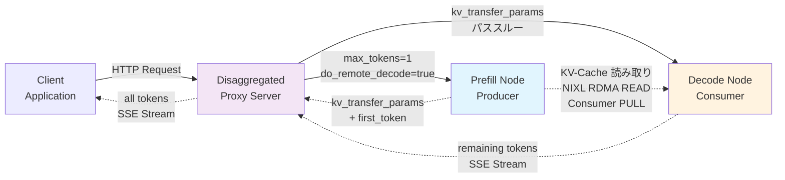

**リクエストの流れとデータ転送**:


**接続関係の詳細**:

Disaggregated Inference のデータフローは 4 つの Phase で構成されます。**Phase 1** では、Client が Proxy に HTTP POST リクエストを送信します。このリクエストには元のプロンプトと`max_tokens=N`などのパラメータが含まれます。**Phase 2** で、Proxy は Prefill Node にリクエストを転送しますが、この際に`max_tokens`を 1 に上書きします。Prefill ノードの NixlConnector が [内部で `do_remote_decode=true` を設定](https://github.com/vllm-project/vllm/blob/v0.14.0rc2/vllm/distributed/kv_transfer/kv_connector/v1/nixl_connector.py#L843-L844)し、「最初のトークンだけを生成し、残りは Decode ノードに任せる」ことを指示します。Prefill ノードは Prefill 処理を実行して KV-Cache を生成し、最初のトークンと`kv_transfer_params`（KV-Cache 転送のメタデータ）を Proxy に返却します。

**Phase 3** が Disaggregated Inference の核心です。Decode ノード (Consumer) が Prefill ノード (Producer) から、**NIXL ライブラリを使用して KV-Cache を直接 READ/PULL** します。

:::message
**重要**: この転送は **Consumer (Decode Node) が能動的に Producer (Prefill Node) から READ/PULL する**仕組みです。Producer が Consumer に PUSH するのではありません。これは RDMA READ 操作の特性で、Consumer が `kv_transfer_params` に含まれるメモリアドレスとサイズ情報を元に、Producer の GPU VRAM から直接データを読み取ります。NIXL の実装では、[Consumer が `operation = "READ"` を指定](https://github.com/vllm-project/vllm/blob/v0.14.0rc2/vllm/distributed/kv_transfer/kv_connector/v1/nixl_connector.py#L2304-L2305)して `nixl_agent.read()` を呼び出します。
:::

この転送は HTTP を経由せず、RDMA READ または TCP で GPU 間を直接接続します。転送されるデータサイズは数百 MB から数 GB に及び、例えば Qwen2.5-32B-Instruct (TP=4) の 12K トークンでは約 3 GB の KV-Cache が転送されます。重要な点は、**Proxy はこの大容量データを中継しない**ことです。Proxy が扱うのは`kv_transfer_params`という小さなメタデータのみで、実際の KV-Cache は Consumer が Producer から直接読み取ります。

**Phase 4** では、Proxy が Decode ノードに`kv_transfer_params`をパススルーします。Decode ノードはこのメタデータを元に NIXL 経由で KV-Cache を受信し、Decode 処理を開始します。生成された残りのトークンは SSE (Server-Sent Events) ストリーム形式で Proxy に返却され、Proxy は最初のトークンと結合して全トークンを Client に返します。

この設計の利点は、**並行処理**にあります。Prefill が first_token を返却した時点で、Proxy はすぐに Decode ノードにリクエストを送信できます。KV-Cache の転送と Decode 処理の準備が並行して進行するため、レイテンシを最小化できます。また、Proxy が大容量の KV-Cache を中継しないことで、Proxy のネットワーク帯域幅とメモリ使用量を大幅に削減できます。

### レイヤ 2: Prefill/Decode Node と NIXL の役割

Disaggregated Inference の内部実装は、以下の 3 つの主要コンポーネントで構成されます:

- **Prefill Node (Producer)**: Prefill 処理を実行し、生成した KV-Cache を GPU VRAM 上に保持します。[NixlConnector](https://github.com/vllm-project/vllm/blob/v0.14.0rc2/vllm/distributed/kv_transfer/kv_connector/v1/nixl_connector.py) を通じて KV-Cache を NIXL Agent に登録し、**Consumer からの READ 要求を待機**します。
- **Decode Node (Consumer)**: Proxy から受信した`kv_transfer_params`を解析し、**NIXL 経由で Producer から KV-Cache を READ/PULL** します。受信完了後、Decode 処理を開始してトークンを生成します。
- **NIXL Agent**: Producer と Consumer の間で KV-Cache 転送を仲介します。メタデータ交換チャネル（制御プレーン）でメタデータ（`NixlAgentMetadata`）を交換し、**Consumer が RDMA READ または TCP で Producer の KV-Cache を直接読み取り**ます（数百 MB ~ 数 GB を GPU VRAM 間で転送、データプレーン）。実装では [Consumer が `operation = "READ"` を指定](https://github.com/vllm-project/vllm/blob/v0.14.0rc2/vllm/distributed/kv_transfer/kv_connector/v1/nixl_connector.py#L2304-L2305)して Producer から KV-Cache を取得します。


### GPUDirect RDMA とホストバッファ経由の 2 パス

NixlConnector は KV-Cache 転送に 2 つのデータパスをサポートします。GPUDirect RDMA パス（`kv_buffer_device="cuda"`）は GPU VRAM から直接ネットワークへ転送するゼロコピーパスで、メモリコピー回数は 0、CPU 関与なし、`nixl_memory_type`は"VRAM"、対応インスタンスは P5/P5en です。ホストバッファ経由パス（`kv_buffer_device="cpu"`）は CPU メモリ（DRAM）を経由する従来型パスで、メモリコピー回数は 2（D2H + H2D）、CPU 関与は cudaMemcpy 呼び出し、`nixl_memory_type`は"DRAM"、全インスタンス（G6e、G5、TPU、XPU を含む）で利用可能です。

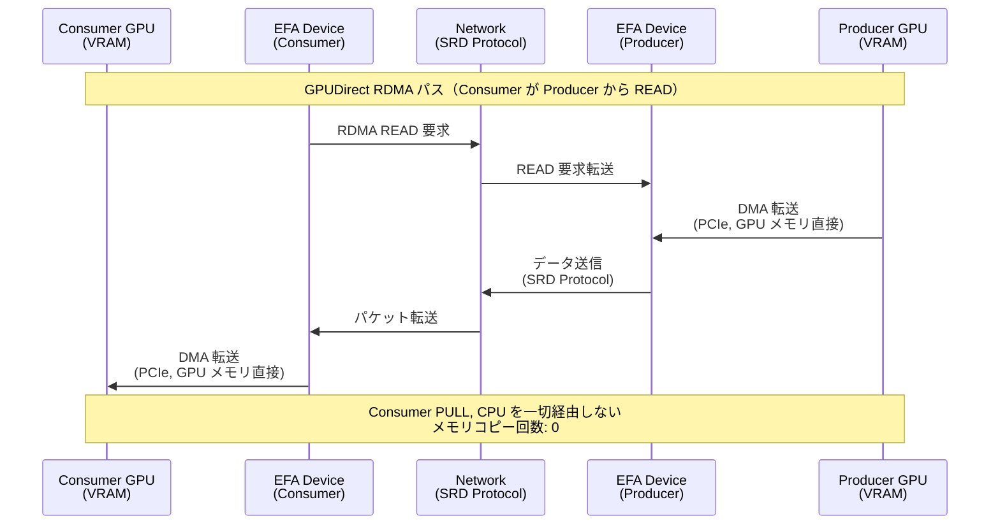

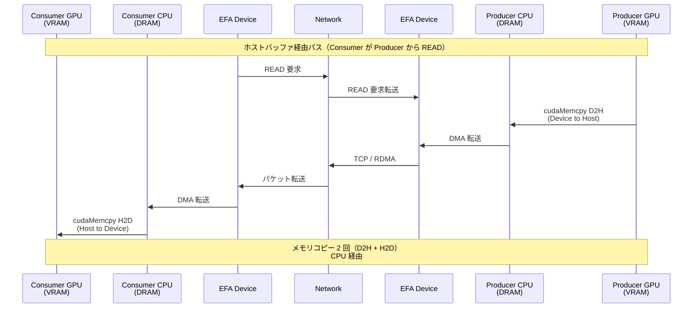

実装上の対応箇所は、Producer 側の [`save_kv_to_host()`](https://github.com/vllm-project/vllm/blob/v0.14.0rc2/vllm/distributed/kv_transfer/kv_connector/v1/nixl_connector.py#L1836) がデバイスからホストバッファへコピー（ホストバッファ経由パスのみ）、Consumer 側の [`sync_recved_kv_to_device()`](https://github.com/vllm-project/vllm/blob/v0.14.0rc2/vllm/distributed/kv_transfer/kv_connector/v1/nixl_connector.py#L1815) がホストバッファからデバイスへコピー（ホストバッファ経由パスのみ）です。[`_NIXL_SUPPORTED_DEVICE` マップ](https://github.com/vllm-project/vllm/blob/v0.14.0rc2/vllm/distributed/kv_transfer/kv_connector/v1/nixl_connector.py#L131-L137)では、cuda は(cuda, cpu)、tpu は(cpu)、xpu は(cpu)、cpu は(cpu)をサポートします。

| インスタンスタイプ | EFA | GPUDirect RDMA | 推奨パス | 設定 |
|------------------|-----|---------------|---------|------|
| P5 / P5en | あり | あり | GPUDirect RDMA | `kv_buffer_device="cuda"` + `FI_EFA_USE_DEVICE_RDMA=1` |
| g6e.12xlarge | あり | なし | ホストバッファ経由（EFA） | `kv_buffer_device="cpu"` |
| g5.48xlarge | あり | なし | ホストバッファ経由（EFA） | `kv_buffer_device="cpu"` |
| g5.8xlarge | なし | なし | ホストバッファ経由（TCP） | `kv_buffer_device="cpu"` + `UCX_TLS=tcp,self,sm` |

g6e.12xlarge では GPUDirect RDMA は利用できず、ホストバッファ経由（`kv_buffer_device="cpu"`）を使用します。P5/P5en インスタンスでは GPUDirect RDMA が利用可能で、最高の性能が得られます。

---

### TPOT がバックエンドに依存しない理由

vLLM の Disaggregated Inference では、KV-Cache が Decode 開始**前**に Consumer の GPU メモリに完全に配置されます。そのため、Decode ループ中にネットワーク転送は発生しません。

**実装上の理由**:
- RDMA ゼロコピー転送（`kv_buffer_device="cuda"`）でも、ホストバッファ経由（`kv_buffer_device="cpu"` + cudaMemcpy）でも、Decode 開始時点では KV-Cache は GPU VRAM 上に存在
- Decode ループ中は、GPU HBM 帯域幅で KV-Cache を読み出すため、ネットワークの影響を受けない
- トランスポート層（EFA/TCP）の違いは、KV-Cache 転送フェーズ（Prefill 後）のみに影響し、Decode フェーズには影響しない

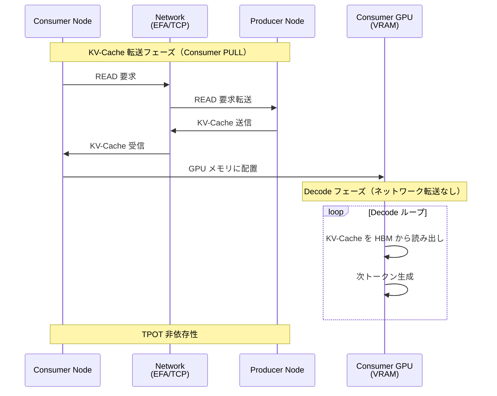

---

## 通信スタックの階層構造

## 重要な発見: TcpConnector は存在しない

vLLM v0.14.0rc2 の [KV Connector レジストリ](https://github.com/vllm-project/vllm/blob/v0.14.0rc2/vllm/distributed/kv_transfer/kv_connector/factory.py#L146-L203)を調査した結果、TcpConnector は登録されていません。利用可能なのは、NixlConnector、P2pNcclConnector、LMCacheConnectorV1、LMCacheMPConnector、MultiConnector、MoRIIOConnector、OffloadingConnector、DecodeBenchConnector、MooncakeConnector、ExampleConnector です。TCP 通信は`NixlConnector + UCX_TLS=tcp,self,sm`環境変数で実現します。`kv_connector`の設定は変更せず、UCX 層の環境変数のみを変更します。

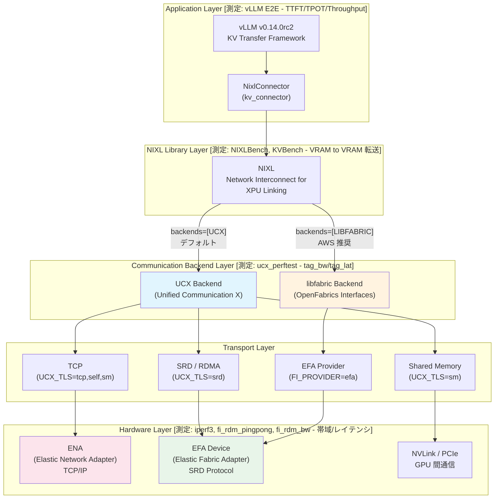

## 各コンポーネントと依存関係

| 技術要素 | 正式名称 | 役割 | レイヤー |
|---------|---------|------|---------|
| [NixlConnector](https://github.com/vllm-project/vllm/blob/v0.14.0rc2/vllm/distributed/kv_transfer/kv_connector/v1/nixl_connector.py) | NIXL KV Connector for vLLM | vLLM の KV-Cache 転送実装 | Application |
| [NIXL](https://github.com/NVIDIA/NIXL) | Network Interconnect for XPU Linking | NVIDIA の GPU 間通信ライブラリ | Library |
| [UCX](https://www.openucx.org/) | Unified Communication X | 汎用通信ライブラリ | Communication Backend |
| [libfabric](https://ofiwg.github.io/libfabric/) | OpenFabrics Interfaces (OFI) | 高性能ファブリック通信の標準 API | Communication Backend |
| EFA | Elastic Fabric Adapter | AWS の高性能ネットワークアダプター | Hardware |
| SRD | Scalable Reliable Datagram | AWS Nitro Card に実装された独自プロトコル | Transport Protocol |
| GPUDirect RDMA | GPU Direct Remote Direct Memory Access | GPU メモリからの直接 DMA 転送 | Transfer Mechanism |
| ENA | Elastic Network Adapter | AWS の標準ネットワークアダプター | Hardware |

依存関係は、NixlConnector→NIXL（`nixl_agent` API 使用）→UCX/libfabric（`backends`パラメータで選択、デフォルト: `["UCX"]`）→トランスポート（UCX は`UCX_TLS`環境変数で制御、libfabric は`FI_PROVIDER=efa`で選択、`FI_EFA_USE_DEVICE_RDMA=1`で GPUDirect 有効化）→EFA→SRD→Nitro Card（EFA は SRD プロトコルを使用し、Nitro Card のハードウェアで処理）という順序です。

## 設定例とトランスポート確認

EFA モードでは環境変数なし、またはオプションで`FI_PROVIDER=efa`と`FI_EFA_USE_DEVICE_RDMA=1`を設定します。TCP モードでは`UCX_TLS=tcp,self,sm`と`UCX_NET_DEVICES=all`を設定し、起動コマンドは同一です。UCX_TLS が効かない場合は`"backends": ["UCX"]`を`kv_transfer_config`に明示的に指定します。トランスポート確認は`UCX_LOG_LEVEL=info`を設定し、ログで"using transport: tcp"（TCP 使用）、"using transport: rc" or "ib"（RDMA 使用）、"efa" or "libfabric"（EFA 使用）を確認します。

---

## 測定アーキテクチャ: vLLM 実装のどこを何で測るか

## 測定の基本的な考え方: 「下から積み上げる」

vLLM Disaggregated Inference のパフォーマンスを理解するには、「E2E の数字だけ見る」のでは不十分です。TTFT が遅いとき、それが「ネットワークハードウェアの問題なのか」「NIXL ライブラリのオーバーヘッドなのか」「vLLM のスケジューラの問題なのか」を切り分ける必要があります。

そこで、通信スタックの最下層（Hardware Layer）から最上層（Application Layer）まで、**各層を独立に測定するツールを用意**します。下の層が正常であることを確認してから上の層を測定することで、問題の原因を論理的に特定できます。

vLLM Disaggregated Inference は、Application Layer（vLLM/NixlConnector）、Library Layer（NIXL）、Transport Layer（UCX/libfabric）、Hardware Layer（EFA/ENA）の 4 層で構成されます。本セクションでは、各層に対応する測定ツールと、それらを組み合わせて実装全体をカバーする方法を説明します。

## 測定レイヤーと vLLM 実装の対応

vLLM 実装を測定するために、以下の 6 つのレイヤーに分けてアプローチします:

:::message
**測定レイヤーの命名規則について**: レイヤー番号（L0, L5, L1, L2, L3, L4）は通信スタックの深さではなく、**測定の実行フェーズ**を示します。L0 はハードウェア基盤の確認（Step 1）、L5 は低レベルツールによる基準値取得（Step 2）、L1-L3 は vLLM E2E 測定（Step 3-4）、L4 は分析フェーズ（Step 5）に対応します。実行順序は **L0 → L5 → L1 → L2 → L3 → L4** です。
:::

| レイヤー | 名称 | パターン数 | 内容 | 測定ツール |
|---------|------|-----------|------|-----------|
| **L0-Baseline** | Baseline Measurements | 8 | ネットワーク・GPU 環境の健全性確認 | iperf3, fi_rdm_pingpong, fi_rdm_bw, fi_info, nvidia-smi, nccl-test |
| **L5-LowLevel** | Low-Level Tools | 44 | 低レベル転送性能の直接測定 | fi_pingpong (6), NIXLBench (18), KVBench (6), ucx_perftest (10), 他 (4) |
| **L1-Unified** | Unified Mode | 25 | 単一ノードベースライン（KV 転送なし） | vLLM E2E 測定 (7 prompt × c=1,4,8,16) |
| **L2-EFA** | EFA Disaggregated | 24 | EFA 分散推論 E2E 測定 | vLLM E2E 測定 (7 prompt × c=1,4,8,16) |
| **L3-TCP** | TCP Disaggregated | 24 | TCP 分散推論 E2E 測定 | vLLM E2E 測定 (7 prompt × c=1,4,8,16) |
| **L4-Analysis** | Cross-validation | 10 | クロスバリデーション (CMP-01~CMP-10) | 統計分析 |

### 測定の実行順序: なぜこの順番なのか

測定は「下から上へ」の順序で実行します。この順番には明確な理由があります。

```mermaid
flowchart LR
    subgraph STEP1["Step 1: 環境確認 (60 分)"]
        L0["<b>L0-Baseline</b><br/>iperf3<br/>fi_rdm_pingpong<br/>fi_rdm_bw<br/>nvidia-smi<br/>nccl-test"]
    end

    subgraph STEP2["Step 2: 低レベル直接測定 (240 分)"]
        L5["<b>L5-LowLevel</b><br/>fi_pingpong (6)<br/>NIXLBench (18)<br/>KVBench (6)<br/>ucx_perftest (10)"]
    end

    subgraph STEP3["Step 3: ベースライン (180 分)"]
        L1["<b>L1-Unified</b><br/>単一ノード E2E<br/>KV 転送なし<br/>7 prompt x c=1,4,8,16"]
    end

    subgraph STEP4["Step 4: 分散推論 (840 分)"]
        L2["<b>L2-EFA</b><br/>EFA Disaggregated<br/>7 prompt x c=1,4,8,16"]
        L3["<b>L3-TCP</b><br/>TCP Disaggregated<br/>7 prompt x c=1,4,8,16"]
    end

    subgraph STEP5["Step 5: 検証 (180 分)"]
        L4["<b>L4-Analysis</b><br/>CMP-01 ~ CMP-10<br/>クロスバリデーション<br/>統計分析"]
    end

    STEP1 -->|"HW 正常確認後"| STEP2
    STEP2 -->|"低レベル基準値確定後"| STEP3
    STEP3 -->|"KV 転送なし基準確定後"| STEP4
    STEP4 -->|"全 E2E 測定完了後"| STEP5

    style L0 fill: #fce4ec,stroke: #c62828
    style L5 fill: #f3e5f5,stroke: #6a1b9a
    style L1 fill: #e3f2fd,stroke: #1565c0
    style L2 fill: #e8f5e9,stroke: #2e7d32
    style L3 fill: #fff3e0,stroke: #e65100
    style L4 fill: #f5f5f5,stroke: #424242
```

**Step 1: L0-Baseline（60 分）-- まず土台を確認する**

最初にハードウェア層の健全性を確認します。EFA デバイスが正常に動作していなければ、上位層の測定はすべて無意味です。iperf3 で TCP 帯域が期待値（9-10 Gbps）を満たしているか、fi_rdm_pingpong で EFA のレイテンシーが正常か、nvidia-smi で GPU の温度やメモリに異常がないかを確認します。この段階で問題が見つかれば、測定を開始する前にハードウェアの問題を解決できます。

**Step 2: L5-LowLevel（240 分）-- 各層の「基準値」を取得する**

ハードウェアが正常であることを確認した上で、Transport Layer と Library Layer の基準値を取得します。fi_pingpong で EFA のレイテンシープロファイル（64B-100MB）を取得し、ucx_perftest で UCX 層の帯域幅（cuda vs host）を測定し、NIXLBench と KVBench で NIXL ライブラリの転送性能を測定します。これらの基準値は、後の Step 4 で E2E 測定の結果を解釈する際の「参照点」となります。

**Step 3: L1-Unified（180 分）-- KV 転送なしの基準値を取得する**

単一ノードで KV-Cache 転送のない状態の TTFT/TPOT を測定します。この値は「KV-Cache 転送が存在しない場合の理想値」であり、Step 4 の分散推論測定との差分が「KV-Cache 転送のオーバーヘッド」に対応します。

**Step 4: L2-EFA + L3-TCP（840 分）-- 分散推論の E2E 測定**

EFA と TCP の両方で分散推論の E2E 測定を実施します。Step 2 と Step 3 の基準値があるため、結果の解釈が容易になります。

**Step 5: L4-Analysis（180 分）-- クロスバリデーション**

すべての測定データが揃った段階で、10 個のクロスバリデーション比較（CMP-01 から CMP-10）を実施します。各層の測定結果が整合しているかを検証し、測定の信頼性を確保します。

#### 測定時間の見積もり

上記の時間見積もりは、各測定ツールの反復回数と並行度から算出しています：

- **L0-Baseline (60 分)**: iperf3, fi_rdm_pingpong など 8 パターン、各 5-10 分
- **L5-LowLevel (240 分)**: NIXLBench 18 パターン + KVBench 6 パターン + ucx_perftest 10 パターン + 他 10 パターン、各 3-8 分
- **L1-Unified (180 分)**: 7 prompt x 4 concurrency (28 パターン)、各 5-10 分
- **L2/L3 (840 分)**: EFA + TCP で 48 パターン、各 15-20 分（KV-Cache 転送を含むため長い）
- **L4-Analysis (180 分)**: 統計分析とレポート作成

**合計約 25 時間**（1500 分）の測定時間が必要です。

### 測定ツールと通信スタックの対応

各測定ツールは、通信スタックの特定の層を測定します。下位層（L0, L5）の測定結果が、上位層（L1-L3）の E2E メトリクスをどう裏付けるかを理解することが重要です。

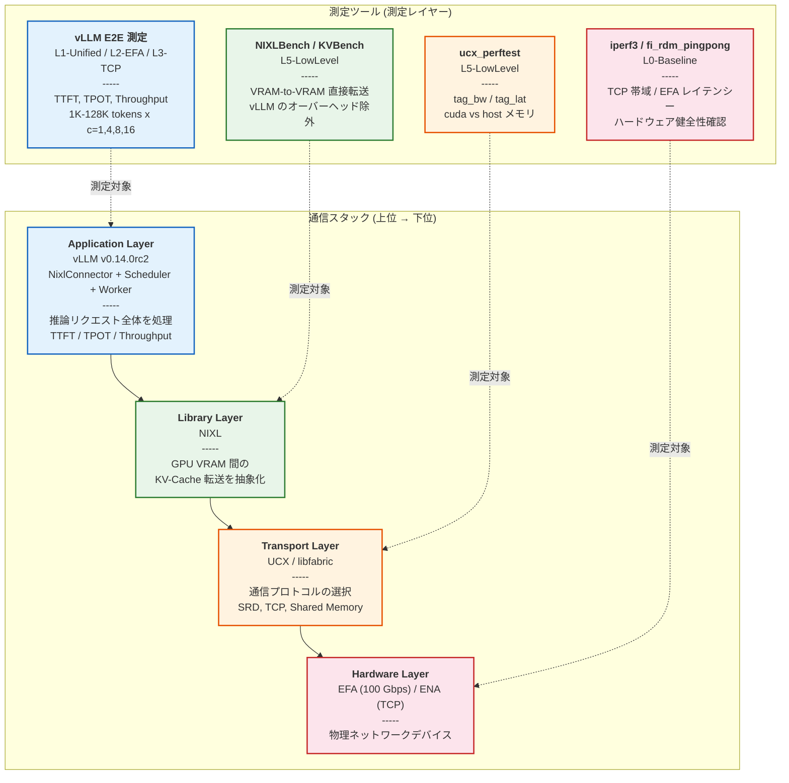

### なぜ階層的測定が必要なのか

1. **因果関係の特定**: E2E メトリクスの変動が、どの層のボトルネックに起因するかを特定できます
   - 例: TTFT が遅い → NIXLBench で KV-Cache 転送時間を測定 → fi_rdm_bw で EFA 帯域を確認

2. **測定の独立性**: 各層を独立に測定することで、上位層の複雑さを排除し、純粋な性能を測定できます
   - 例: ucx_perftest は vLLM のスケジューリングオーバーヘッドを含まず、UCX 層の性能のみを測定

3. **再現性の確保**: 下位層の測定が安定していることを確認することで、E2E 測定の信頼性を担保できます
   - 例: iperf3 で TCP 帯域が 9 Gbps 未満 → ネットワーク問題を疑う

4. **Cross-validation**: 複数の測定ツールの結果が整合していることを確認し、測定の妥当性を検証できます
   - 例: NIXLBench の転送時間と TTFT の差分を比較し、vLLM 固有のオーバーヘッドを特定

---

## 各測定ツールの役割と測定ポイント

各測定ツールが「vLLM 実装のどの部分を測定するか」を、「なぜ必要か」「どうやって測定するか」「通信スタック上のどこを測定するか」の 3 つの観点で体系的に説明します。

## Hardware Layer の測定 (L0-Baseline)

### iperf3 -- TCP/IP ネットワークの帯域幅確認

**なぜ必要か**: vLLM が TCP モード（`UCX_TLS=tcp,self,sm`）で動作する場合、KV-Cache は最終的に TCP/IP スタックを経由して ENA（Elastic Network Adapter）を通過します。iperf3 はこの **TCP/IP スタックの理論上限帯域幅** を測定します。もし iperf3 で期待する帯域（例: 9-10 Gbps）が出ていなければ、上位層でどれだけ最適化しても TCP モードの性能は改善しません。

**どうやって**: iperf3 コマンドで 2 ノード間の TCP 帯域幅を測定します。iperf3 は TCP ソケットを使って大量のデータを送受信し、実効帯域幅を計算します。

**通信スタック上の位置**: Hardware Layer（ENA）。通信スタックの最下層であり、TCP モードのすべての通信の物理的な上限を決定します。

### fi_rdm_pingpong / fi_rdm_bw -- EFA ハードウェアの健全性とレイテンシー

**なぜ必要か**: vLLM が EFA モード（libfabric 経由）で動作する場合、KV-Cache は SRD プロトコルを使って EFA デバイスを通過します。fi_rdm_pingpong は **EFA デバイスの往復レイテンシー** を、fi_rdm_bw は **EFA の帯域幅** を測定します。これが EFA モードの物理的な上限となります。

**どうやって**: libfabric の fi_rdm_pingpong コマンドで 64B から 100MB までのメッセージサイズで往復時間を測定します。fi_rdm_bw は一方向の帯域幅を測定します。これらは libfabric API を直接使用するため、UCX や NIXL のオーバーヘッドを含みません。

**通信スタック上の位置**: Hardware Layer（EFA Device）。EFA モードの通信の物理的な上限を決定します。

---

## Transport Layer の測定 (L5-LowLevel)

### ucx_perftest -- UCX トランスポート層の性能と GPUDirect RDMA 効果

**なぜ必要か**: vLLM の NIXL ライブラリは、デフォルトで UCX（Unified Communication X）をバックエンドとして使用します。ucx_perftest は **UCX 層の帯域幅とレイテンシー** を測定しますが、特に重要なのは `cuda` メモリと `host` メモリの帯域差の測定です。vLLM の `kv_buffer_device` 設定（cuda vs cpu）が、トランスポート層にどう影響するかを直接確認できます。

**どうやって**: ucx_perftest コマンドで `tag_bw`（帯域幅）と `tag_lat`（レイテンシー）を測定します。`-m cuda` オプションで GPU VRAM 間転送を、デフォルト（host）で CPU メモリ間転送を測定します。メッセージサイズは 1MB, 10MB, 100MB, 1GB で、KV-Cache 転送に近いサイズをカバーします。

**通信スタック上の位置**: Transport Layer（UCX）。Hardware Layer の上、NIXL Library Layer の下に位置します。ハードウェアの能力が UCX 層でどの程度活用されているかを確認できます。

---

## Library Layer の測定 (L5-LowLevel)

### NIXLBench -- NIXL ライブラリの VRAM-to-VRAM 転送性能

**なぜ必要か**: vLLM の NixlConnector は NIXL ライブラリの `nixl_agent` API を呼び出して KV-Cache を転送します。NIXLBench は **NIXL ライブラリの転送性能を直接測定** し、vLLM のスケジューラやメモリ管理のオーバーヘッドを除外した「純粋な NIXL 転送時間」を得ます。この値と vLLM の TTFT を比較することで、vLLM 固有のオーバーヘッドを分離できます（CMP-08）。

**どうやって**: NIXLBench コマンドで、1K tokens (268MB) から 128K tokens (32GB 相当) のデータを GPU VRAM 間で転送します。バックエンドとして Libfabric（EFA）と UCX（TCP）の両方を測定し、転送方式として one_to_one（1 対 1）と many_to_one（多対 1）をテストします。

**通信スタック上の位置**: Library Layer（NIXL）。Transport Layer の上、Application Layer の下に位置します。NIXL ライブラリ自体の効率性を、上位（vLLM）と下位（UCX/libfabric）から独立して評価できます。

### KVBench -- LLM 固有の KV-Cache 構造を考慮した転送測定

**なぜ必要か**: NIXLBench は汎用的なデータ転送を測定しますが、実際の KV-Cache は LLM のモデル構造に依存した特殊な形状を持ちます。KVBench は **Qwen2.5-32B の実際の KV-Cache 構造（64 layers, 8 kv_heads, 128 head_dim, bf16）** を再現して転送を測定します。これにより、「KV-Cache の構造がメモリレイアウトやアクセスパターンに与える影響」を評価できます（CMP-10）。

**どうやって**: KVBench コマンドで、モデル構成（`--num_layers 64 --num_kv_heads 8 --head_dim 128 --cache_dtype bf16`）を指定し、1K, 4K, 12K, 32K, 64K, 100K, 128K tokens の KV-Cache 転送を測定します。バックエンドとして Libfabric（EFA）と UCX（TCP）の両方を測定します。

**通信スタック上の位置**: Library Layer（NIXL）。NIXLBench と同じ層ですが、LLM 固有のデータ構造を考慮する点で、より Application Layer に近い測定です。理論的な転送時間（`KV-Cache サイズ / ハードウェア帯域幅`）と実測値を比較することで、プロトコルオーバーヘッドを定量化できます。

---

## Application Layer の測定 (L1, L2, L3)

### vLLM E2E -- アプリケーション全体の推論性能

**なぜ必要か**: 最終的にユーザが体験する性能は、通信スタックのすべての層を含む E2E（End-to-End）メトリクスです。L0 と L5 の測定で各層の性能を理解した上で、vLLM 全体としてどのような性能が出るかを測定します。特に重要なのは以下の 3 つのモードの比較です。

- **L1-Unified**（単一ノード、KV 転送なし）: Prefill と Decode が同一ノードで実行されるため、KV-Cache のネットワーク転送が発生しません。これが「KV-Cache 転送オーバーヘッドゼロ」の基準値となります。
- **L2-EFA**（EFA Disaggregated）: EFA 経由で KV-Cache を転送する分散推論の性能。
- **L3-TCP**（TCP Disaggregated）: TCP 経由で KV-Cache を転送する分散推論の性能。

L1 と L2/L3 の TTFT 差分が「KV-Cache 転送のオーバーヘッド」に対応し、この値が L5 の NIXLBench で直接測定した転送時間と整合していれば、測定の妥当性が検証されます（CMP-04, CMP-08）。

**どうやって**: vLLM API Server を起動し、HTTP POST リクエスト（`/v1/completions`）で推論を実行します。1K から 128K tokens の 7 種類のプロンプト長に対して、並行度 c=1, 4, 8, 16 で 30 回反復測定（ウォームアップ 5 回除外）を行い、TTFT、TPOT、Throughput を記録します。

**通信スタック上の位置**: Application Layer（vLLM + NixlConnector + Scheduler + Worker）。通信スタックの最上位層であり、下位のすべての層の影響を含みます。

---


## Cross-validation: 低レベルから E2E への因果チェーン

複数の測定ツールを組み合わせることで、性能差の因果関係を段階的に検証できます。クロスバリデーションとは、**複数の異なる測定ツールの結果が互いに矛盾していないことを確認する**作業です。

### 10 個のクロスバリデーション一覧

Phase 1 では以下の 10 個のクロスバリデーション比較（CMP-01 ~ CMP-10）を実施します。各 CMP の詳細は、後続のセクションで具体例とともに解説します。

| ID | 比較内容 | 検証すること | 使用レイヤー |
|----|---------|------------|------------|
| CMP-01 | EFA vs TCP (1K-32K) | 短いプロンプトでのトランスポート差 | L2, L3 |
| CMP-02 | EFA vs TCP (64K-128K) | 長いプロンプトでのトランスポート差 | L2, L3 |
| CMP-03 | Unified vs Disaggregated TPOT | TPOT がトランスポートに非依存か | L1, L2, L3 |
| CMP-04 | Unified vs Disaggregated TTFT | KV-Cache 転送オーバーヘッドの分離 | L1, L2 |
| CMP-05 | L0 帯域 vs 実 KV-Cache 転送 | ハードウェア帯域の利用率 | L0, L2 |
| CMP-06 | TPOT 分解 | TPOT の内訳分析 | L1, L2 |
| CMP-07 | NIXLBench EFA vs UCX | NIXL 層での EFA 優位性 | L5 |
| CMP-08 | NIXLBench vs E2E KV 転送 | vLLM 固有オーバーヘッドの特定 | L5, L2, L3 |
| CMP-09 | ucx_perftest cuda vs host | GPUDirect RDMA の帯域効果 | L5 |
| CMP-10 | KVBench vs 理論転送時間 | プロトコルオーバーヘッドの定量化 | L5, L0 |

## クロスバリデーションの意義: 具体例で理解する

### CMP-08: NIXLBench 直接転送 vs E2E KV-Cache 転送

最も直感的な例です。NIXLBench で 12K tokens の NIXL 転送時間が 50ms と測定されたとします。一方、L1-Unified の 12K tokens TTFT が 80ms、L2-EFA の 12K tokens TTFT が 130ms だったとします。

```
KV-Cache 転送オーバーヘッド = L2-EFA TTFT - L1-Unified TTFT
                            = 130ms - 80ms = 50ms
```

この 50ms が NIXLBench の直接測定（50ms）と一致していれば、以下のことが言えます：

1. NIXLBench の測定は正確である（E2E 結果と整合している）
2. L2-EFA の TTFT 増加は、KV-Cache 転送が原因である（他のオーバーヘッドは無視可能）
3. vLLM の NixlConnector は、NIXL ライブラリを効率的に利用している

逆に大きな乖離があれば、vLLM 固有のオーバーヘッド（スケジューリング遅延、メモリ管理など）が存在することを示唆します。

### CMP-10: KVBench vs 理論的 KV-Cache 転送時間

理論的な転送時間は `KV-Cache サイズ / ハードウェア帯域幅` で計算できます。例えば、12K tokens の KV-Cache サイズは約 3.0GB、EFA の帯域幅が 100 Gbps (= 12.5 GB/s) の場合：

```
理論転送時間 = 3.0 GB / 12.5 GB/s = 240 ms
```

KVBench の実測値がこの 2-5 倍であることが仮説です。乖離の原因（プロトコルオーバーヘッド、GPU メモリアクセスパターン、SRD のパケット再構成など）を特定することで、最適化の方向性が見えてきます。

---

## 因果チェーン 1: EFA の帯域優位性

EFA が TCP より高速である理由を、各層の測定で段階的に検証します。

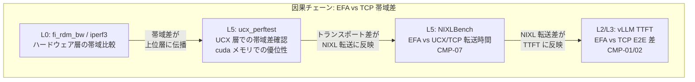

**検証方法**:
1. L0 で EFA と TCP のハードウェア層帯域を比較
2. L5 ucx_perftest で UCX 層でも同様の帯域差があることを確認
3. L5 NIXLBench で KV-Cache 転送時間の差を測定
4. L2/L3 vLLM E2E で TTFT 差が NIXLBench の転送時間差と整合していることを確認

**検証できること**: 各層の測定が整合し、ハードウェア層の帯域差が E2E の TTFT 差に伝播していることを確認

## 因果チェーン 2: GPUDirect RDMA の効果

GPUDirect RDMA の効果を、メモリタイプ別の測定で検証します。

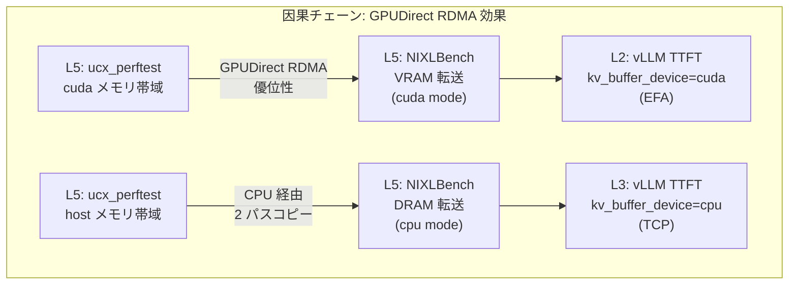

**検証方法** (CMP-09):
1. L5 ucx_perftest で cuda メモリと host メモリの帯域を比較
2. L5 NIXLBench で VRAM 転送（cuda mode）と DRAM 転送（cpu mode）の差を測定
3. L2/L3 vLLM E2E で EFA (cuda) と TCP (cpu) の TTFT を比較
4. 各層のメモリタイプによる差が整合していることを検証

**検証できること**: GPUDirect RDMA によるメモリコピー削減が、E2E の TTFT に影響していることを確認

## 因果チェーン 3: KV-Cache 転送と TTFT の関係

KV-Cache 転送が TTFT の主要な構成要素であることを、Unified vs Disaggregated 比較で検証します。

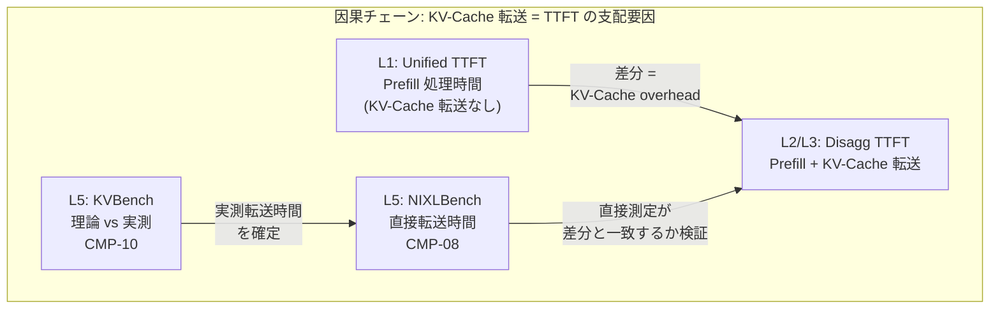

**検証方法** (CMP-04, CMP-08, CMP-10):
1. L1 Unified モードで TTFT を測定（KV-Cache 転送なしのベースライン）
2. L2/L3 Disaggregated モードで TTFT を測定
3. 差分を算出 → KV-Cache 転送オーバーヘッドを分離
4. L5 NIXLBench で測定した直接転送時間と差分が整合していることを確認
5. L5 KVBench で理論的転送時間と実測値を比較し、プロトコルオーバーヘッドを特定

**検証できること**: KV-Cache 転送が TTFT の主要構成要素であり、NIXLBench で測定した転送時間が E2E の TTFT 差を説明できることを確認

---

## クロスバリデーションの全体構造

Phase 1 では 10 個のクロスバリデーション比較（CMP-01 ~ CMP-10）を実施します。以下の図は、3 つの主要な因果チェーンがどのように全体を構成しているかを示しています。

```mermaid
graph TB
    subgraph CV["クロスバリデーション: 複数のツールの結果が整合しているか検証"]
        direction TB

        subgraph CHAIN1["因果チェーン 1: EFA vs TCP の帯域差はどこから来るか"]
            C1_L0["L0: fi_rdm_bw vs iperf3<br/>HW 帯域の差を確認"]
            C1_L5a["L5: ucx_perftest<br/>UCX 層でも同じ差が存在?"]
            C1_L5b["L5: NIXLBench<br/>NIXL 転送時間の差は?<br/>(CMP-07)"]
            C1_E2E["L2/L3: vLLM TTFT<br/>E2E でも差が反映?<br/>(CMP-01, CMP-02)"]
            C1_L0 --> C1_L5a --> C1_L5b --> C1_E2E
        end

        subgraph CHAIN2["因果チェーン 2: GPUDirect RDMA の効果"]
            C2_L5a["L5: ucx_perftest<br/>cuda vs host メモリ<br/>(CMP-09)"]
            C2_L5b["L5: NIXLBench<br/>VRAM vs DRAM 転送"]
            C2_E2E["L2/L3: vLLM TTFT<br/>kv_buffer_device の影響"]
            C2_L5a --> C2_L5b --> C2_E2E
        end

        subgraph CHAIN3["因果チェーン 3: KV-Cache 転送 = TTFT の主要因か"]
            C3_L5["L5: KVBench<br/>理論 vs 実測<br/>(CMP-10)"]
            C3_NIX["L5: NIXLBench<br/>直接転送時間<br/>(CMP-08)"]
            C3_DIFF["L1 vs L2/L3: TTFT 差分<br/>= KV-Cache 転送時間?<br/>(CMP-04)"]
            C3_L5 --> C3_NIX --> C3_DIFF
        end
    end

    style CHAIN1 fill: #e3f2fd,stroke: #1565c0
    style CHAIN2 fill: #e8f5e9,stroke: #2e7d32
    style CHAIN3 fill: #fff3e0,stroke: #e65100
```

---


# まとめ

本記事では、vLLM Disaggregated Inference の実装を理解するための「測定アーキテクチャ」について解説しました。主要なポイントは以下の 3 点です。

## 1. 測定の階層構造: vLLM 実装のどこを測るか

**3 階層の測定アプローチ**:
- **L0-Baseline 層**: ネットワーク・GPU 環境の健全性確認（iperf3, fi_rdm_pingpong, fi_rdm_bw）
- **L5-LowLevel 層**: 低レベルツールによる直接測定（NIXLBench, KVBench, ucx_perftest）
- **L1-L3-E2E 層**: アプリケーション層の総合評価（vLLM TTFT/TPOT/Throughput）

この階層構造により、**vLLM の E2E メトリクスの変動が、通信スタックのどの層に起因するかを特定できます**。例えば、TTFT が期待と異なる場合、まず L0 でハードウェア層を確認し、次に L5 で NIXL ライブラリ層を測定し、最後に L2 で vLLM 全体を評価します。

## 2. Cross-validation: 複数ツールで vLLM 実装を検証

単一の測定ツールではなく、**複数のツールを組み合わせることで、vLLM 実装の動作を検証**できます。

**3 つの主要な因果チェーン**:
1. **EFA の帯域優位性**: L0 fi_rdm_bw/iperf3 → L5 ucx_perftest → L5 NIXLBench → L2/L3 vLLM TTFT
2. **GPUDirect RDMA の効果**: L5 ucx_perftest (cuda/host) → L5 NIXLBench (VRAM/DRAM) → L2/L3 vLLM TTFT
3. **KV-Cache 転送と TTFT**: L5 KVBench → L5 NIXLBench → L1 Unified vs L2/L3 Disaggregated TTFT 差

これらの因果チェーンにより、**vLLM の NixlConnector が通信スタックをどう利用しているかを、各層の測定で段階的に検証**できます。

## 3. vLLM 実装の重要な仕組み

本記事で解説した vLLM Disaggregated Inference の実装上の重要なポイント：

1. **TPOT はバックエンドに依存しない**: KV-Cache は Decode 開始前に GPU メモリに配置済みのため、トランスポート層（EFA/TCP）は Decode フェーズに影響しない

2. **kv_buffer_device 設定の 2 パス**: cuda（GPUDirect RDMA、ゼロコピー）vs cpu（ホストバッファ経由、2 パスコピー）

3. **通信スタックの階層**: vLLM Application → NIXL Library → Transport (UCX/libfabric) → Hardware (EFA/ENA)

4. **測定で検証すべき仮説**: ハードウェア層の帯域差が上位層に伝播し、最終的に vLLM の TTFT に影響するか

## 4. 将来の展望: Remote Storage (Valkey) によるスケーラビリティ向上

本記事では P2P (NIXL + EFA) アーキテクチャによる測定を中心に解説しましたが、**Remote Storage（Valkey）を使った代替アーキテクチャ**も検討に値します。

### P2P vs Remote Storage の比較

現在の P2P アーキテクチャは、Prefill Node (Producer) と Decode Node (Consumer) が直接接続し、Consumer が Producer の GPU VRAM から RDMA READ で KV-Cache を取得します。一方、Valkey（Redis 互換の高性能 KV ストア）を中間ストレージとして使用すると、異なるトレードオフが生まれます。

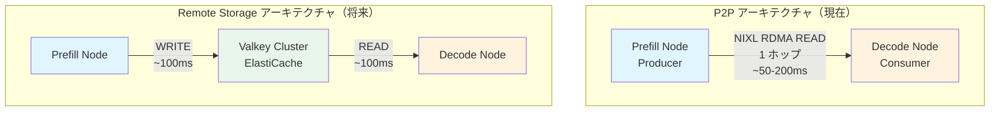

### トレードオフ分析

| 観点 | P2P (NIXL + EFA) | Remote Storage (Valkey) |
|------|------------------|-------------------------|
| **レイテンシー** | 低い（1 ホップ、50-200ms） | 高い（2 ホップ、100-400ms） |
| **スケーラビリティ** | 1:1 の固定ペア | N: M の動的ペア |
| **GPU メモリ効率** | Producer が VRAM 占有 | Valkey に offload 後解放 |
| **KV-Cache 再利用** | 不可 | 可能（Prefix Caching 対応） |
| **障害耐性** | Producer ダウンで喪失 | Valkey に永続化 |
| **セットアップ複雑性** | 高い（EFA, NIXL 設定） | 低い（ElastiCache マネージド） |

### Valkey が有利なシナリオ

以下のユースケースでは、Valkey の利点がレイテンシーのオーバーヘッドを上回る可能性があります：

1. **Prefix Caching**: 共通 Prefix の KV-Cache を複数リクエストで共有
2. **N: M スケーリング**: Prefill と Decode の独立スケーリング
3. **GPU メモリ効率**: Producer の VRAM を早期解放し、スループット向上
4. **運用のシンプルさ**: ElastiCache マネージドサービスで運用負荷軽減

### ハイブリッドアーキテクチャの可能性

最適解は「P2P か Valkey か」の二者択一ではなく、**ユースケースに応じた使い分け**です：

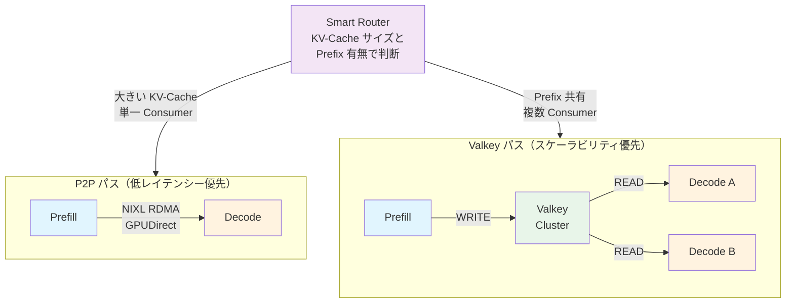

### 将来の測定計画

Valkey 統合を測定フレームワークに組み込む場合、以下のレイヤーとクロスバリデーションを追加します：

- **L6-Valkey**: Valkey 経由の KV-Cache 転送性能（単体ベンチマーク + vLLM E2E）
- **CMP-11**: P2P (EFA) vs Valkey TTFT 比較
- **CMP-12**: P2P (TCP) vs Valkey TTFT 比較
- **CMP-13**: NIXLBench 直接転送 vs Valkey 経由転送
- **CMP-14**: Valkey Multi-Consumer スケーラビリティ測定

**注**: 本記事の Phase 1 測定は P2P アーキテクチャに焦点を当てており、Valkey 統合は将来の Phase（Phase 2 以降）で実施予定です。また、GPUDirect RDMA 対応インスタンス（P5/P5en）への切り替えにより、P2P のゼロコピーの恩恵を最大限に活用し、Valkey との性能差をより明確に測定できます。

---

# 参考文献

## 主要な実装

- [vLLM NixlConnector 実装](https://github.com/vllm-project/vllm/blob/v0.14.0rc2/vllm/distributed/kv_transfer/kv_connector/v1/nixl_connector.py) - vLLM v0.14.0rc2 の Disaggregated Inference 実装
- [vLLM Toy Proxy Server](https://github.com/vllm-project/vllm/blob/v0.14.0rc2/tests/v1/kv_connector/nixl_integration/toy_proxy_server.py) - Disaggregated Proxy の参考実装
- [KV Connector レジストリ](https://github.com/vllm-project/vllm/blob/v0.14.0rc2/vllm/distributed/kv_transfer/kv_connector/factory.py#L146-L203) - 利用可能な KV Connector の一覧

## ライブラリとプロトコル

- [NIXL (Network Interconnect for XPU Linking)](https://github.com/NVIDIA/NIXL) - NVIDIA の GPU 間通信ライブラリ
- [OpenUCX プロジェクト](https://www.openucx.org/) - Unified Communication X
- [OpenFabrics Interfaces (OFI) / libfabric](https://ofiwg.github.io/libfabric/) - 高性能ファブリック通信の標準 API

## 論文と解説

- AWS 公式論文 "A Cloud-Optimized Transport Protocol for Elastic and Scalable HPC" (IEEE Micro, 2020)
- 本連載の既存記事
  - [AWS EFA と Nitro System 解説編](https://zenn.dev/tosshi/articles/0eeb53ca63f8b2)
  - [環境構築編](https://zenn.dev/tosshi/articles/009bb138491dd1)

---

# おわりに

本記事では、vLLM Disaggregated Inference の実装を理解するための測定アーキテクチャについて解説しました。**各測定ツールが通信スタックのどこを測定し、vLLM の実装とどう対応するか**を体系的に整理することで、実装の動作を検証できます。

**測定アプローチの 3 つの柱**:
1. **階層的測定**: L0-Baseline → L5-LowLevel → L1-L3-E2E の 3 階層で測定
2. **Cross-validation**: 複数ツールの結果が整合していることを確認
3. **因果関係の検証**: 低レベルツールが vLLM の E2E メトリクスをどう裏付けるか

このアプローチにより、vLLM の NixlConnector が通信スタックをどう利用しているかを、単なる E2E 結果だけでなく、各層の測定で段階的に理解できます。本記事が、Disaggregated Inference の実装理解や測定設計の参考になれば幸いです。

（執筆: 2026-02-28）
