## はじめに

本記事は、AWS Elastic Fabric Adapter (EFA) と Prefill/Decode Disaggregated Inference (DI) に関する連載の実装理解編です。前回の[環境構築編](https://zenn.dev/tosshi/articles/009bb138491dd1)で環境構築について解説しましたが、今回は **vLLM の実装に基づいて、通信スタックのどこを何で測定するか**を体系的に整理します。

### 本記事の目的

vLLM DI の実装は、NixlConnector、NIXL、UCX/libfabric、EFA という複数のレイヤーで構成されます。本記事では、各コンポーネントの役割、測定ツールと実装の対応関係、および通信スタック全体をカバーする測定アーキテクチャを解説します。

:::message
完全な測定環境を作りきれている自信はないので今後さらに測定知識を向上させて精度の高い測定を行っていこうと考えています。
:::

### 用語

Time To First Token (TTFT, 最初のトークン生成までの遅延) と Time Per Output Token (TPOT, 各トークンの平均生成時間) を使用します。vLLM DI の基本概念（Prefill/Decode 分離）、AWS EFA および SRD (Scalable Reliable Datagram) プロトコルの基礎（[EFA/Nitro System 解説編](https://zenn.dev/tosshi/articles/0eeb53ca63f8b2)参照）の理解を前提とします。

## vLLM Disaggregated Inference の実装概要

vLLM DI は、Prefill と Decode を異なるノードに分離し、KV-Cache をネットワーク経由で転送するアーキテクチャです。

### システムアーキテクチャ

:::message
**Proxy 実装について**: vLLM リポジトリには複数インスタンス対応の [Toy Proxy Server](https://github.com/vllm-project/vllm/blob/v0.16.0/tests/v1/kv_connector/nixl_integration/toy_proxy_server.py) が参考実装として提供されています。本測定では、**1 Prefiller + 1 Decoder 構成に特化した独自実装** `disagg_proxy_server.py` を使用しています（今後複数台構成への実装拡張を検討しています）。この実装には以下の測定最適化が含まれます。

- **タイムスタンプ測定機能**: Prefill/Decode 各フェーズの時間を `X-Proxy-*` ヘッダーで記録
- **接続プーリング最適化**: TCP handshake 削減で 50ms 以上の Proxy オーバーヘッド削減

本セクションで説明する Proxy の動作フローは両実装で共通です。
:::

Client から Proxy を経由して Prefill ノード (Producer) と Decode ノード (Consumer) に処理が分散されます。Proxy は Producer に `max_tokens=1` でリクエストを送信します。Producer の NixlConnector が内部で `do_remote_decode=true` を設定し、返却された `kv_transfer_params` を Proxy が Consumer へパススルーします。

**Fig 1: システム構成図（Client - Proxy - Producer - Consumer）**

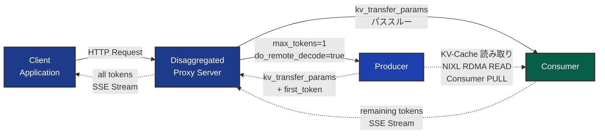

リクエストの流れとデータ転送を以下のシーケンス図で示します。

**Fig 2: Disaggregated Inference のシーケンス図（Phase 1-4）**


接続関係の詳細を説明します。DI のデータフローは 4 つの Phase で構成されます。**Phase 1** では、Client が Proxy に HTTP POST リクエストを送信します。このリクエストには元のプロンプトと `max_tokens=N` などのパラメータが含まれます。**Phase 2** で、Proxy は Producer にリクエストを転送しますが、この際に `max_tokens` を 1 に上書きします。Producer の NixlConnector が [内部で `do_remote_decode=true` を設定](https://github.com/vllm-project/vllm/blob/v0.16.0/vllm/distributed/kv_transfer/kv_connector/v1/nixl_connector.py#L843-L844)し、「最初のトークンだけを生成し、残りは Consumer に任せる」ことを指示します。Producer は Prefill 処理を実行して KV-Cache を生成し、最初のトークンと `kv_transfer_params` （KV-Cache 転送のメタデータ）を Proxy に返却します。

**Phase 3** が DI の要点です。Consumer が Producer から、**NIXL ライブラリを使用して KV-Cache を直接 READ/PULL** します。

:::message alert
この転送は **Consumer が能動的に Producer から READ/PULL する**仕組みです。Producer が Consumer に PUSH するのではありません。これは RDMA READ 操作の特性で、Consumer が `kv_transfer_params` に含まれるメモリアドレスとサイズ情報を元に、Producer の GPU VRAM から直接データを読み取ります。NIXL の実装では、[Consumer が `operation = "READ"` を指定](https://github.com/vllm-project/vllm/blob/v0.16.0/vllm/distributed/kv_transfer/kv_connector/v1/nixl_connector.py#L2304-L2305)して `nixl_agent.read()` を呼び出します。
:::

この転送は HTTP を経由せず、RDMA READ または TCP で GPU 間を直接接続します。転送されるデータサイズは数百 MB から数 GB に及び、例えば Qwen2.5-32B-Instruct (TP=4, Tensor Parallelism) の 12K トークンでは約 3 GB の KV-Cache が転送されます。重要な点は、**Proxy はこの大容量データを中継しない**ことです。Proxy が扱うのは `kv_transfer_params` という小さなメタデータのみで、実際の KV-Cache は Consumer が Producer から直接読み取ります。

**Phase 4** では、Proxy が Consumer に `kv_transfer_params` をパススルーします。Consumer はこのメタデータを元に NIXL 経由で KV-Cache を受信し、Decode 処理を開始します。生成された残りのトークンは SSE (Server-Sent Events) ストリーム形式で Proxy に返却され、Proxy は最初のトークンと結合して全トークンを Client に返します。

この設計の利点は、**並行処理**にあります。Producer が first_token を返却した時点で、Proxy はすぐに Consumer にリクエストを送信できます。KV-Cache の転送と Decode 処理の準備が並行して進行するため、レイテンシーを最小化できます。また、Proxy が大容量の KV-Cache を中継しないことで、Proxy のネットワーク帯域幅とメモリ使用量を大幅に削減できます。

### KV-Cache 転送の 3 つのパターン

:::message
次回の実験結果考察編はインスタンス確保の都合上 g6e.12xlarge を利用していますが、このインスタンスは GPUDirect RDMA (GPU Direct Remote Direct Memory Access) に対応していないためゼロコピーの恩恵は受けられません。[g7e](https://aws.amazon.com/jp/blogs/news/announcing-amazon-ec2-g7e-instances-accelerated-by-nvidia-rtx-pro-6000-blackwell-server-edition-gpus/) は対応しています。今後 g7e で GPUDirect RDMA の効果を確認してみたいです。
:::

:::message alert
**重要**: GPUDirect RDMA と `kv_buffer_device="cuda"` は別の概念です。GPUDirect RDMA は P5/P5en など特定のインスタンスでのみ利用可能なハードウェア機能ですが、`kv_buffer_device="cuda"` 設定自体は g6e.12xlarge でも使用できます。NixlConnector は実装上 3 つの異なるパターンをサポートしています。
:::

| 項目 | パターン 1: GPUDirect RDMA | パターン 2: cuda buffer | パターン 3: cpu buffer |
|------|---------------------------|------------------------|---------------------|
| **GPUDirect RDMA 対応** | あり（ハードウェア要件） | なし | なし |
| **対象インスタンス** | P5/P5en/g7e など GPUDirect RDMA 対応 | g6e.12xlarge など（GPUDirect RDMA 非対応でも可） | 全インスタンス（g6e、g5、TPU、XPU を含む） |
| **トランスポート** | EFA 必須 | EFA 推奨 | TCP または EFA |
| **メモリコピー回数** | 0 回 | NixlConnector 内部処理（明示的な cudaMemcpy なし） | 2 回（D2H + H2D） |
| **CPU 経由** | なし | あり（内部処理） | あり（DRAM バッファ使用） |
| **nixl_memory_type** | "VRAM" | （内部処理） | "DRAM" |
| **kv_buffer_device** | `"cuda"` | `"cuda"` | `"cpu"` |
| **環境変数** | `FI_EFA_USE_DEVICE_RDMA=1` | - | `UCX_TLS=tcp,self,sm`（TCP 使用時） |
| **設定例** | `kv_buffer_device="cuda"` + `FI_EFA_USE_DEVICE_RDMA=1` + `backends=["LIBFABRIC"]` | `kv_buffer_device="cuda"` + `backends=["LIBFABRIC"]` | `kv_buffer_device="cpu"` + `backends=["TCP"]` または `backends=["LIBFABRIC"]` |
| **vLLM 関数** | cudaMemcpy 関数は実行されない | [`save_kv_to_host()`](https://github.com/vllm-project/vllm/blob/v0.16.0/vllm/distributed/kv_transfer/kv_connector/v1/nixl_connector.py#L1836) と [`sync_recved_kv_to_device()`](https://github.com/vllm-project/vllm/blob/v0.16.0/vllm/distributed/kv_transfer/kv_connector/v1/nixl_connector.py#L1815) はスキップ | [`save_kv_to_host()`](https://github.com/vllm-project/vllm/blob/v0.16.0/vllm/distributed/kv_transfer/kv_connector/v1/nixl_connector.py#L1836) と [`sync_recved_kv_to_device()`](https://github.com/vllm-project/vllm/blob/v0.16.0/vllm/distributed/kv_transfer/kv_connector/v1/nixl_connector.py#L1815) が実行される |
| **対応図** | Fig 3 | Fig 4 | Fig 5 |
| **性能** | 最高 | 中 | 最低 |

:::message
[`_NIXL_SUPPORTED_DEVICE` マップ](https://github.com/vllm-project/vllm/blob/v0.16.0/vllm/distributed/kv_transfer/kv_connector/v1/nixl_connector.py#L131-L137)では、cuda デバイスは (cuda, cpu) 両方のバッファをサポートし、tpu/xpu/cpu デバイスは (cpu) バッファのみをサポートします。

次回の Phase 1 実験結果考察編では、g6e.12xlarge で EFA 使用時（パターン 2）と TCP 使用時（パターン 3）の性能差を測定します。パターン 2 では明示的な cudaMemcpy が不要なため、パターン 3 よりも転送効率の結果が良いと予想されます。
:::

### 各パターンのシーケンス図

パターン 1 は GPU VRAM から直接ネットワークへ転送するゼロコピーパスです。CPU を一切経由せず、PCIe と EFA Device を介して GPU 間で直接データ転送が行われます。Producer GPU VRAM から PCIe DMA を経由して EFA Device へ、そこから Consumer 側の EFA Device から再び PCIe DMA を経由して Consumer GPU VRAM へと、メモリコピーを一切挟まずにデータが移動します。

**Fig 3: パターン 1 - GPUDirect RDMA パス（ゼロコピー）**

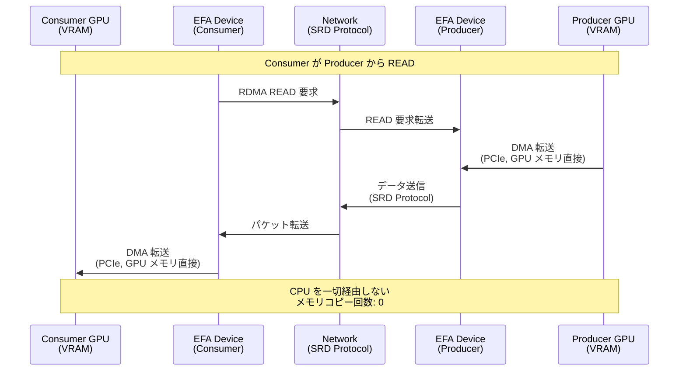

パターン 2 は NixlConnector が GPU VRAM から直接データを読み取り、内部処理後に EFA 経由で転送するパスです。GPUDirect RDMA ではありませんが、明示的な cudaMemcpy 呼び出しは不要です。NixlConnector が Producer の GPU VRAM から直接読み取り、EFA 経由で Consumer に転送し、Consumer 側の NixlConnector が GPU VRAM へ直接書き込みます。

**Fig 4: パターン 2 - cuda buffer パス（明示的な cudaMemcpy なし）**

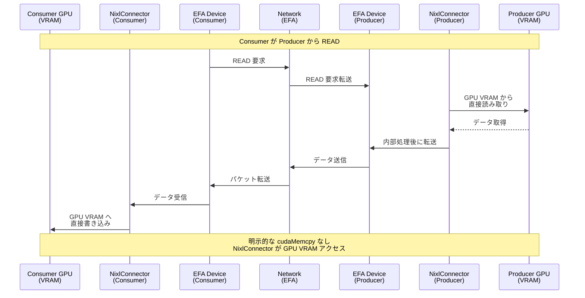

パターン 3 は CPU メモリ（DRAM）を経由する汎用型パスです。

vLLM の [`save_kv_to_host()`](https://github.com/vllm-project/vllm/blob/v0.16.0/vllm/distributed/kv_transfer/kv_connector/v1/nixl_connector.py#L1836) が Producer 側で GPU VRAM から CPU DRAM へ cudaMemcpy D2H を実行し、[`sync_recved_kv_to_device()`](https://github.com/vllm-project/vllm/blob/v0.16.0/vllm/distributed/kv_transfer/kv_connector/v1/nixl_connector.py#L1815) が Consumer 側で CPU DRAM から GPU VRAM へ cudaMemcpy H2D を実行します。Producer GPU VRAM から cudaMemcpy で Producer CPU DRAM へコピーし、Network を経由して Consumer CPU DRAM へ転送され、再び cudaMemcpy で Consumer GPU VRAM へコピーされます。

**Fig 5: パターン 3 - cpu buffer パス（明示的な cudaMemcpy 2 回）**

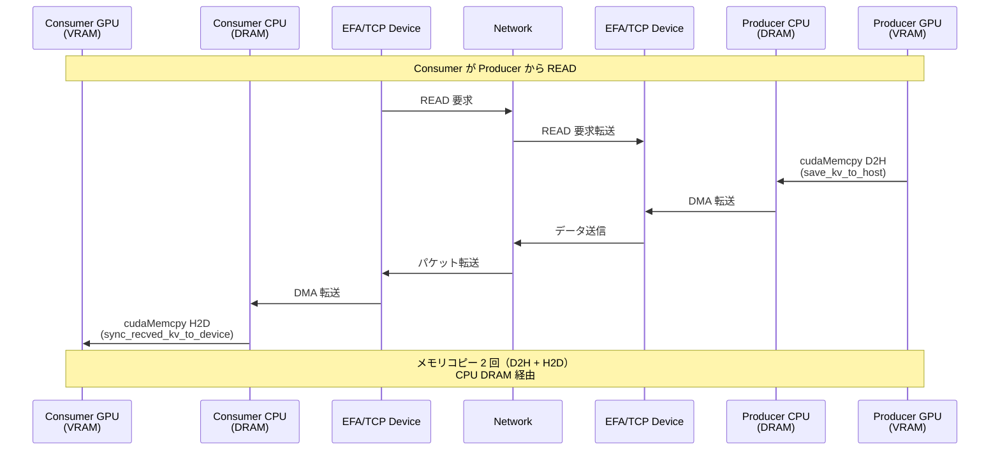

## 通信スタックの階層構造

前セクションでは Prefill/Decode の分離とデータフローを説明しました。ここからは、その実装が利用する**通信スタック全体**のレイヤ構造を体系化します。

### 5 レイヤアーキテクチャ

vLLM DI の KV-Cache 転送は 5 つのレイヤで構成されています。最上位の **Application Layer** では、vLLM v0.16.0 の KV Transfer Framework が動作し、NixlConnector が KV-Cache 転送を担当します。このレイヤのコードは変更不要で、環境変数だけで下位レイヤの動作を制御できます。

その下の **NIXL Library Layer** では、NIXL (Network Interconnect for XPU Linking) がデータ転送を抽象化しています。NixlConnector は内部で `nixl_agent` API を使用して NIXL を呼び出します。NIXL は複数のバックエンド（UCX、libfabric）をサポートしており、`backends` パラメータで選択できます（デフォルト: `["UCX"]`）。これにより、アプリケーションレイヤのコードを変更せずに、異なる通信方式を試すことができます。

さらに下の **Backend Layer** では、UCX (Unified Communication X) または libfabric (OpenFabrics Interfaces) がトランスポートプロトコルを選択する役割を担います。UCX の場合は `UCX_TLS` 環境変数（`tcp,self,sm` または `srd`）で、libfabric の場合は `FI_PROVIDER=efa` 環境変数でトランスポートを指定します。GPUDirect RDMA を有効化するには `FI_EFA_USE_DEVICE_RDMA=1` を設定します。

その下の **Transport Layer** では、実際の通信プロトコルが動作します。TCP（標準的な TCP/IP スタック）、RDMA（Remote Direct Memory Access）、SRD のいずれかが使用されます。このレイヤがネットワークを介したデータ転送の方式を決定します。

最下位の **Hardware Layer** では、物理的なネットワークハードウェアが動作します。EFA の場合は SRD Protocol を使用して Nitro Card のハードウェアで処理され、TCP の場合は ENA を使用します。

**Fig 7: 通信スタックの階層構造（Application → NIXL → UCX/libfabric → EFA/ENA）**

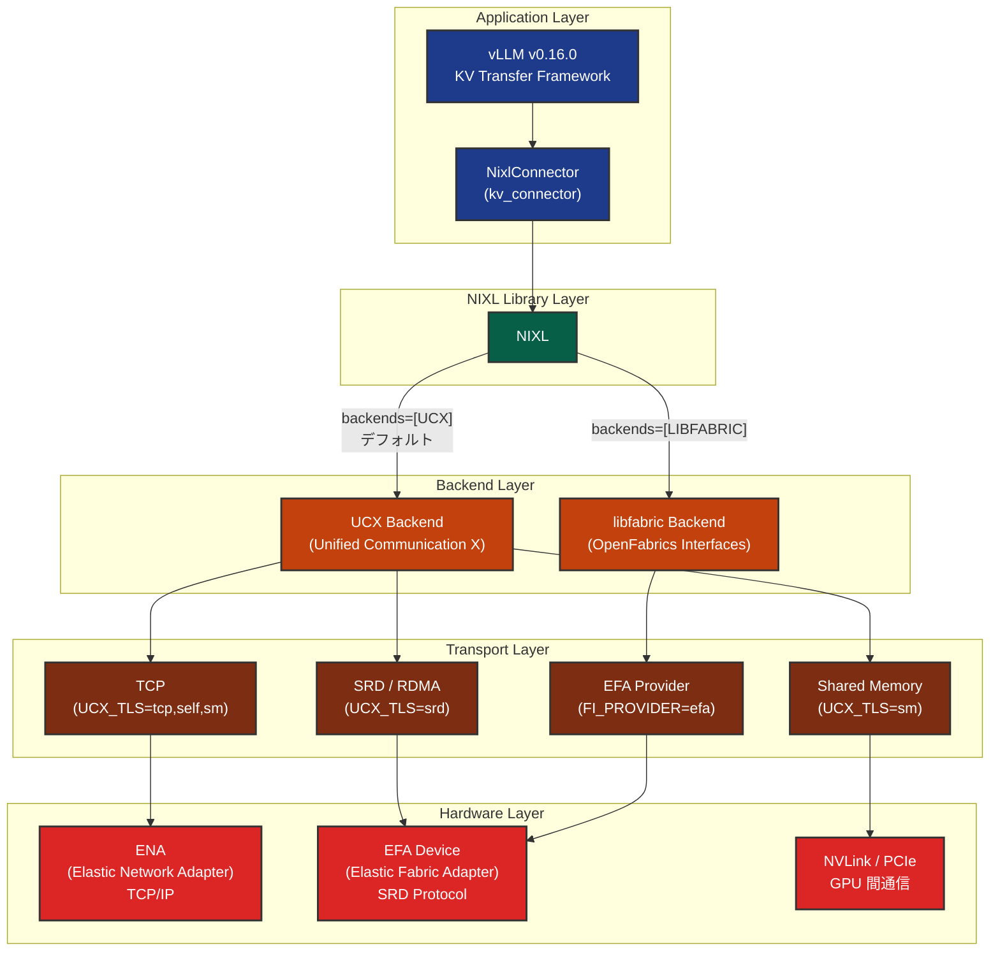

| 技術要素 | 役割 | レイヤー |
|---------|------|---------|
| [NixlConnector](https://github.com/vllm-project/vllm/blob/v0.16.0/vllm/distributed/kv_transfer/kv_connector/v1/nixl_connector.py) | vLLM の KV-Cache 転送実装 | Application Layer |
| NIXL | NVIDIA の GPU 間通信ライブラリ | NIXL Library Layer |
| [UCX](https://www.openucx.org/) | 汎用通信ライブラリ | Communication Backend Layer |
| [libfabric](https://ofiwg.github.io/libfabric/) | 高性能ファブリック通信の標準 API | Communication Backend Layer |
| [EFA](https://docs.aws.amazon.com/AWSEC2/latest/UserGuide/efa.html) | AWS の高性能ネットワークアダプター | Hardware Layer |
| [SRD](https://aws.amazon.com/jp/blogs/hpc/in-the-search-for-performance-theres-more-than-one-way-to-build-a-network/) | AWS Nitro Card に実装された独自プロトコル | Transport Layer |
| [GPUDirect RDMA](https://docs.nvidia.com/cuda/gpudirect-rdma/) | GPU メモリからの直接 DMA 転送 | Transport Layer |
| [ENA](https://docs.aws.amazon.com/AWSEC2/latest/UserGuide/enhanced-networking-ena.html) | AWS の標準ネットワークアダプター | Hardware Layer |

## 測定アーキテクチャ: vLLM 実装のどこを何で測るか

### 測定の考え方: 「下から積み上げる」

vLLM DI のパフォーマンスを理解するには、「E2E の数字だけ見る」のでは不十分です。TTFT が遅いとき、それが「ネットワークハードウェアの問題なのか」「NIXL ライブラリのオーバーヘッドなのか」「vLLM のスケジューラの問題なのか」を切り分ける必要があります。

そこで、通信スタックの最下レイヤ（Hardware Layer）から最上レイヤ（Application Layer）まで、**各レイヤを独立に測定するツールを用意**します。下のレイヤを測定してから上のレイヤを測定することで、ボトルネック等を特定しやすくなります。

本セクションでは、各レイヤに対応する測定ツールと、それらを組み合わせて実装全体をカバーするアーキテクチャを説明します。

:::message alert
実験を試行錯誤しながら現状の測定アーキテクチャとなったため、今後のバージョンで変更する可能性があります。あくまでこのような測定をしているんだという参考情報として活用し、ご自身で測定される際にはご自身の環境に合わせて測定を実施して下さい。
:::

### 測定レイヤーと vLLM 実装の対応

vLLM 実装を測定するために、6 つのレイヤーに分けてアプローチします。

:::message
**測定レイヤーの命名規則について**: レイヤー番号は通信スタックの深さではなく、**測定の実行フェーズ**を示します。L0 はハードウェア基盤の確認（Step 1）、L1-L3 は vLLM E2E 測定（Step 2-3）、L4 は自動分析フェーズ（Step 4）、L5 は低レベルツールによる詳細測定（Step 5）に対応します。実行順序は **L0 → L1 → L2 → L3 → L4 → L5** です。L5 を最後に実施することで、E2E 測定結果を踏まえた詳細な低レベル測定が可能になります。
:::

| レイヤー | 名称 | パターン数 | 内容 | 測定ツール |
|---------|------|-----------|------|-----------|
| **L0-Baseline** | Baseline Measurements | 8 | ネットワーク・GPU 環境の健全性確認 | iperf3, fi_rdm_pingpong, fi_rdm_bw, fi_info, nvidia-smi, nccl-test |
| **L5-LowLevel** | Low-Level Tools | 44 | 低レベル転送性能の直接測定 | fi_pingpong (4), fi_rdm_pingpong (2), NIXLBench (22), KVBench (6), ucx_perftest (10) |
| **L1-Unified** | Unified Mode | 25 | 単一ノードベースライン（KV 転送なし） | vLLM E2E 測定 (1K-32K: c=1,4,8,16 / 64K-100K: c=1,4,8 / 128K: c=1,4,8) |
| **L2-EFA** | EFA Disaggregated | 24 | EFA DI E2E 測定 | vLLM E2E 測定 (1K-32K: c=1,4,8,16 / 64K-100K: c=1,4,8 / 128K: c=1,4) |
| **L3-TCP** | TCP Disaggregated | 24 | TCP DI E2E 測定 | vLLM E2E 測定 (1K-32K: c=1,4,8,16 / 64K-100K: c=1,4,8 / 128K: c=1,4) |
| **L4-Analysis** | Cross-validation | 3+10 | 自動分析 (3 パターン) + 手動比較 (CMP-01~CMP-10) | 統計分析 |

### 測定の実行順序

測定は L0 から L5 へ番号順に実行します。通信スタックの最下層であるハードウェアの健全性をまず確認し、そのうえでアプリケーション層の E2E 測定を行い、最後に低レベルツールで詳細検証を実施するという段階的なアプローチです。ハードウェアに問題がある状態で上位層を測定しても結果の解釈が困難になるため、この順序を守ることが重要です。

**Fig 8: 測定レイヤー間の分離と依存関係（各レイヤーの測定結果から何がわかるか）**

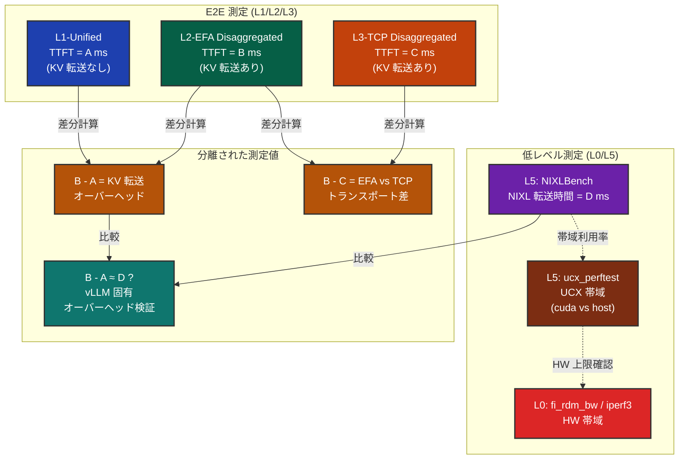

上図は、各レイヤーの測定結果を組み合わせることで vLLM DI の性能を段階的に分離して分析できることを示しています。以下、この図の意味を測定手順に沿って説明します。

第一に、L0-Baseline でハードウェア層の帯域幅とレイテンシーを確認します。iperf3 で TCP の帯域が十分か、fi_rdm_bw で EFA デバイスが正常に動作しているかを検証し、問題が検出された場合は先にインフラを修正します。

第二に、L1-Unified から L3-TCP までの E2E 測定を実施します。L1-Unified は単一ノード上で Prefill と Decode を実行するため、KV-Cache のネットワーク転送が発生しません。ここで得られる TTFT が、ネットワーク転送を含まない基準値（図中の A ms）になります。次に L2-EFA Disaggregated で 2 ノード構成の TTFT（B ms）を測定し、さらに L3-TCP Disaggregated でも同様に TTFT（C ms）を測定します。この 3 つの値を比較すると、差分 B - A が EFA 経由の KV-Cache 転送によって追加されたオーバーヘッドに相当し、B - C を計算すればトランスポート層の違い（EFA と TCP）がどの程度の性能差を生むかがわかります。たとえば A = 200 ms、B = 250 ms、C = 320 ms であれば、EFA 経由の KV-Cache 転送オーバーヘッドは 50 ms、TCP では 120 ms となり、EFA は TCP に比べて 70 ms の改善をもたらしていると評価できます。

第三に、L4-Analysis で E2E 測定結果の統計分析とクロスバリデーションを実施します（詳細は後述の「Cross-validation」セクションで解説します）。

第四に、L5-LowLevel の低レベルツールで各レイヤーを独立に検証します。L5 を最後に実施するのは、E2E 測定の結果を踏まえて「どこを深掘りすべきか」を判断してから詳細測定に入るためです。L5 では NIXLBench を使って NIXL ライブラリの VRAM-to-VRAM 転送時間（図中の D ms）を直接測定します。この D を先ほどの差分 B - A と比較することが、測定アーキテクチャにおける重要な検証ポイントです。B - A と D がほぼ等しければ、vLLM は KV-Cache 転送において NIXL ライブラリの性能を効率的に引き出していると判断できます。逆に B - A が D より明らかに大きければ、vLLM 固有のオーバーヘッド（スケジューラ遅延やメモリ管理など）が存在しており、アプリケーション層に最適化の余地があることを示唆します。先ほどの例で B - A = 50 ms に対して D = 35 ms であれば、vLLM 固有のオーバーヘッドは約 15 ms と推定でき、スケジューラの待ち時間やメモリコピーの非効率性などが検討の出発点となります。

さらに L5 の ucx_perftest で UCX トランスポート層の帯域幅を CUDA メモリと Host メモリで比較測定し、L0 の fi_rdm_bw や iperf3 で確認したハードウェア上限帯域幅と突き合わせることで、各ソフトウェア層がハードウェア性能をどの程度活用できているかを定量化します。

このように、L0 で土台の健全性を確認し、L1-L3 の E2E 測定で全体像を把握してから差分計算で各要因を分離し、L5 の低レベル測定で分離した値の妥当性を裏付けるという流れが、この測定アーキテクチャの基本構造です。

### 測定ツールと通信スタックの対応

各測定ツールは、通信スタックの特定のレイヤを測定します。下位レイヤ（L0, L5）の測定結果が、上位レイヤ（L1-L3）の E2E メトリクスをどう裏付けるかを理解することが重要です。

**Fig 9: 測定レイヤーと通信スタックの対応関係**

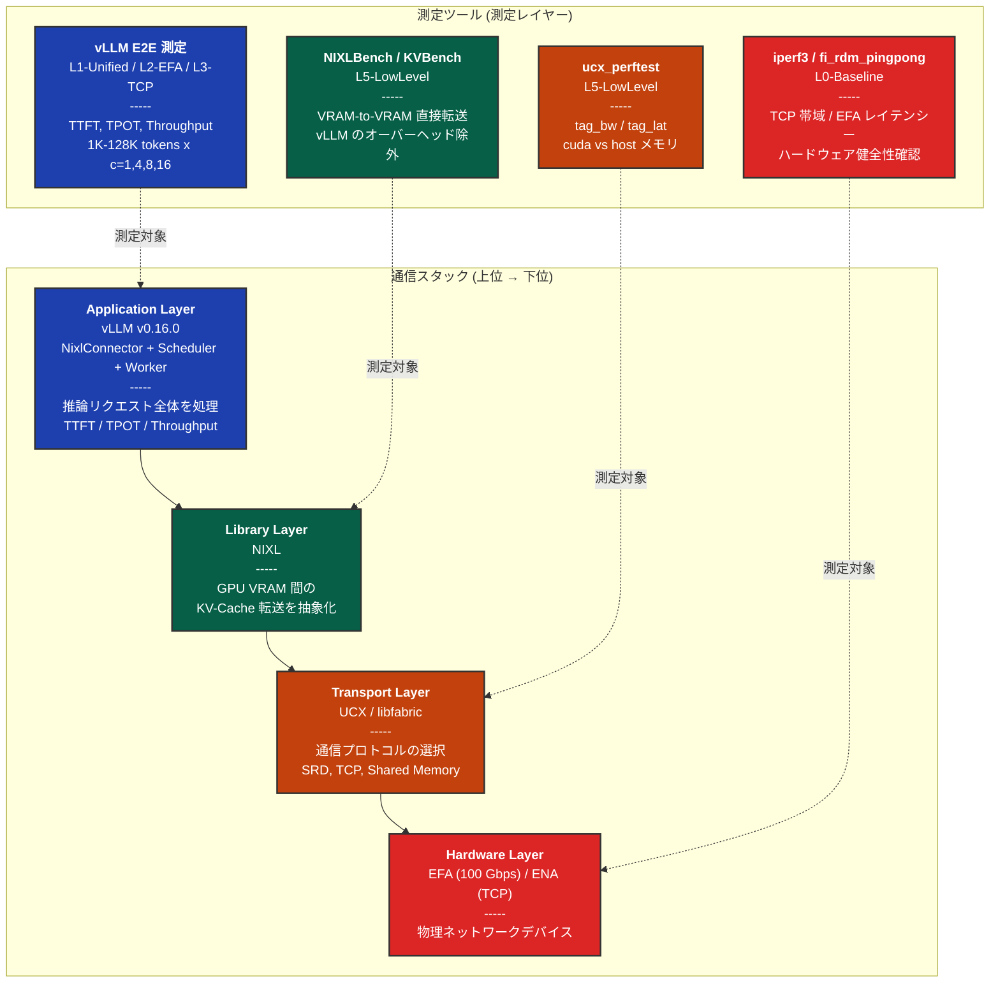

### なぜ階層的測定が必要なのか

階層的測定が必要な理由は 4 つあります。第一に **因果関係の特定** です。E2E メトリクスの変動が、どの層のボトルネックに起因するかを特定できます。たとえば TTFT が遅い場合、まず L1-Unified との差分で KV-Cache 転送が原因かを確認し、次に NIXLBench で転送時間を直接測定し、さらに fi_rdm_bw で EFA 帯域を確認することで、問題の原因を階層的に絞り込めます。

第二に **測定の独立性** です。各レイヤを独立に測定することで、上位レイヤの複雑さを排除し、純粋な性能を測定できます。たとえば ucx_perftest は vLLM のスケジューリングオーバーヘッドを含まず、UCX レイヤの性能のみを測定します。

第三に **再現性の確保** です。ハードウェアレイヤの測定が安定していることを確認することで、E2E 測定の信頼性を担保できます。たとえば iperf3 で TCP 帯域が 9 Gbps 未満の場合、ネットワーク問題を疑うことができます。

第四に **Cross-validation** です。複数の測定ツールの結果が整合していることを確認し、測定の妥当性を検証できます。たとえば L1-Unified と L2-EFA の TTFT 差分が、NIXLBench で測定した転送時間と一致すれば、KV-Cache 転送がボトルネックであることが検証されます。L5-LowLevel の測定を最後に実施することで、E2E 測定で観測された性能差を裏付ける詳細なデータを取得できます。

## 各測定ツールの役割と測定ポイント

各測定ツールが「vLLM 実装のどの部分を測定するか」を、「なぜ必要か」「どうやって測定するか」「通信スタック上のどこを測定するか」の 3 つの観点で体系的に説明します。

### Hardware Layer の測定 (L0-Baseline)

#### iperf3 -- TCP/IP ネットワークの帯域幅確認

**何を測定するツールか**: iperf3 は、2 台のサーバー間で TCP/IP ネットワーク接続を使って大量のデータを送受信し、実効帯域幅（bps）を測定するツールです。ネットワーク環境が期待通りの性能を発揮しているかを確認する際の基本的なツールであり、物理ネットワークの健全性をチェックします。

**なぜ必要か**: vLLM が TCP モード（`UCX_TLS=tcp,self,sm`）で動作する場合、KV-Cache は最終的に TCP/IP スタックを経由して ENA を通過します。iperf3 はこの **TCP/IP スタックの理論上限帯域幅** を測定します。もし iperf3 で期待する帯域（例: 9-10 Gbps）が出ていなければ、上位レイヤでどれだけ最適化しても TCP モードの性能は改善しません。

**どうやって**: iperf3 コマンドで 2 ノード間の TCP 帯域幅を測定します。iperf3 は TCP ソケットを使って大量のデータを送受信し、実効帯域幅を計算します。

**通信スタック上の位置**: Hardware Layer（ENA）。通信スタックの最下レイヤであり、TCP モードのすべての通信の物理的な上限を決定します。

#### fi_rdm_pingpong / fi_rdm_bw -- EFA ハードウェアの健全性とレイテンシー

**何を測定するツールか**: fi_rdm_pingpong と fi_rdm_bw は、libfabric ライブラリが提供するベンチマークツールで、EFA デバイスを直接使用してメッセージの往復時間（レイテンシー）と帯域幅を測定します。64B から 100MB までの様々なメッセージサイズで測定することで、EFA デバイスの性能プロファイルを取得できます。

**なぜ必要か**: vLLM が EFA モード（libfabric 経由）で動作する場合、KV-Cache は SRD プロトコルを使って EFA デバイスを通過します。fi_rdm_pingpong は **EFA デバイスの往復レイテンシー** を、fi_rdm_bw は **EFA の帯域幅** を測定します。これが EFA モードの物理的な上限となります。

**どうやって**: libfabric の fi_rdm_pingpong コマンドで 64B から 100MB までのメッセージサイズで往復時間を測定します。fi_rdm_bw は一方向の帯域幅を測定します。これらは libfabric API を直接使用するため、UCX や NIXL のオーバーヘッドを含みません。

**通信スタック上の位置**: Hardware Layer（EFA Device）。EFA モードの通信の物理的な上限を決定します。

### Transport Layer の測定 (L5-LowLevel)

#### ucx_perftest -- UCX トランスポートレイヤの性能と GPUDirect RDMA 効果

**何を測定するツールか**: ucx_perftest は、UCX ライブラリの性能を測定するツールで、tag_bw（帯域幅）と tag_lat（レイテンシー）を測定します。特に重要なのは、CPU メモリ（host）と GPU メモリ（cuda）のそれぞれで測定できる点です。これにより、GPUDirect RDMA による GPU VRAM 間の直接転送性能を、CPU メモリ経由の転送と比較できます。

**なぜ必要か**: vLLM の NIXL ライブラリは、デフォルトで UCX をバックエンドとして使用します。ucx_perftest は **UCX レイヤの帯域幅とレイテンシー** を測定しますが、特に重要なのは `cuda` メモリと `host` メモリの帯域差の測定です。vLLM の `kv_buffer_device` 設定（cuda vs cpu）が、トランスポートレイヤにどう影響するかを直接確認できます。

**どうやって**: ucx_perftest コマンドで `tag_bw`（帯域幅）と `tag_lat`（レイテンシー）を測定します。`-m cuda` オプションで GPU VRAM 間転送を、デフォルト（host）で CPU メモリ間転送を測定します。メッセージサイズは 1MB, 10MB, 100MB, 1GB で、KV-Cache 転送に近いサイズをカバーします。

**通信スタック上の位置**: Transport Layer（UCX）。Hardware Layer の上、NIXL Library Layer の下に位置します。ハードウェアの能力が UCX レイヤでどの程度活用されているかを確認できます。

### Library Layer の測定 (L5-LowLevel)

#### NIXLBench -- NIXL ライブラリの VRAM-to-VRAM 転送性能

**何を測定するツールか**: NIXLBench は、NIXL ライブラリの `nixl_agent` API を直接呼び出して、GPU VRAM 間でデータを転送する時間を測定するベンチマークツールです。vLLM のアプリケーションロジック（スケジューラ、メモリ管理など）を一切含まず、純粋に NIXL ライブラリ自体の転送性能を測定します。1K tokens（約 268MB）から 128K tokens（約 32GB）までの様々なサイズで測定できます。

:::message
**bytes_per_token の計算根拠**: これらのサイズは NIXLBench のデフォルト値 `bytes_per_token = 262144`（256KB/token）に基づきます。この値は Qwen2.5-32B-Instruct (TP=4) の KV-Cache サイズ `2 x 64 layers x 8 kv_heads x 128 head_dim x 2 bytes(bf16) / 4 TP = 262144 bytes/token` に相当します。
:::

**なぜ必要か**: vLLM の NixlConnector は NIXL ライブラリの `nixl_agent` API を呼び出して KV-Cache を転送します。NIXLBench は **NIXL ライブラリの転送性能を直接測定** し、vLLM のスケジューラやメモリ管理のオーバーヘッドを除外した「純粋な NIXL 転送時間」を得ます。L5-LowLevel を最後に実施することで、E2E 測定（L1-L3）で観測された TTFT の差分が NIXL 転送時間と一致するかを検証し、vLLM 固有のオーバーヘッドを分離できます（CMP-08）。

**どうやって**: NIXLBench コマンドで、1K tokens (268MB) から 128K tokens (32GB 相当) のデータを GPU VRAM 間で転送します。バックエンドとして Libfabric（EFA）と UCX（TCP）の両方を測定し、転送方式として one_to_one（1 対 1）と many_to_one（多対 1）をテストします。

**通信スタック上の位置**: Library Layer（NIXL）。Transport Layer の上、Application Layer の下に位置します。NIXL ライブラリ自体の効率性を、上位（vLLM）と下位（UCX/libfabric）から独立して評価できます。

#### KVBench -- LLM 固有の KV-Cache 構造を考慮した転送測定

**何を測定するツールか**: KVBench は、LLM の実際の KV-Cache データ構造（layers, kv_heads, head_dim, dtype）を再現して NIXL 経由で転送する時間を測定するベンチマークツールです。NIXLBench が汎用的なバイト列を転送するのに対し、KVBench は Qwen2.5-32B のような実際のモデルの KV-Cache 構造（64 layers, 8 kv_heads, 128 head_dim, bf16）を再現し、メモリレイアウトやアクセスパターンが転送性能に与える影響を測定します。

**なぜ必要か**: NIXLBench は汎用的なデータ転送を測定しますが、実際の KV-Cache は LLM のモデル構造に依存した特殊な形状を持ちます。KVBench は **Qwen2.5-32B の実際の KV-Cache 構造（64 layers, 8 kv_heads, 128 head_dim, bf16）** を再現して転送を測定します。これにより、「KV-Cache の構造がメモリレイアウトやアクセスパターンに与える影響」を評価できます（CMP-10）。

**どうやって**: KVBench コマンドで、モデル構成（`--num_layers 64 --num_kv_heads 8 --head_dim 128 --cache_dtype bf16`）を指定し、1K, 4K, 12K, 32K, 64K, 100K, 128K tokens の KV-Cache 転送を測定します。バックエンドとして Libfabric（EFA）と UCX（TCP）の両方を測定します。

**通信スタック上の位置**: Library Layer（NIXL）。NIXLBench と同じレイヤですが、LLM 固有のデータ構造を考慮する点で、より Application Layer に近い測定です。理論的な転送時間（`KV-Cache サイズ / ハードウェア帯域幅`）と実測値を比較することで、プロトコルオーバーヘッドを定量化できます。

### Application Layer の測定 (L1, L2, L3)

#### vLLM E2E -- アプリケーション全体の推論性能

**何を測定するツールか**: vLLM E2E 測定は、vLLM API Server に対して HTTP POST リクエスト（`/v1/completions`）を送信し、実際の推論を実行して TTFT、TPOT、Throughput を測定します。これは、通信スタック全体（Application + Library + Transport + Hardware）を含む実際のユーザー体験に最も近い測定です。様々なプロンプト長（1K-128K tokens）と並行度（c=1,4,8,16）で測定します。

**なぜ必要か**: 最終的にユーザが体験する性能は、通信スタックのすべてのレイヤを含む E2E メトリクスです。L0 と L5 の測定で各レイヤの性能を理解した上で、vLLM 全体としてどのような性能が出るかを測定します。特に重要なのは 3 つのモードの比較です。

**L1-Unified**（単一ノード、KV 転送なし）では、Prefill と Decode が同一ノードで実行されるため、KV-Cache のネットワーク転送が発生しません。これが「KV-Cache 転送オーバーヘッドゼロ」の基準値となります。**L2-EFA**（EFA Disaggregated）では、EFA 経由で KV-Cache を転送する分散推論の性能を測定します。**L3-TCP**（TCP Disaggregated）では、TCP 経由で KV-Cache を転送する分散推論の性能を測定します。

L1 と L2/L3 の TTFT 差分が「KV-Cache 転送のオーバーヘッド」に対応し、この値が L5 の NIXLBench で直接測定した転送時間と整合していれば、測定の妥当性が検証されます（CMP-04, CMP-08）。

**どうやって**: vLLM API Server を起動し、HTTP POST リクエスト（`/v1/completions`）で推論を実行します。1K から 128K tokens の 7 種類のプロンプト長に対して、並行度 c=1, 4, 8, 16 で 30 回反復測定（ウォームアップ 10 回除外）を行い、TTFT、TPOT、Throughput を記録します。

:::message alert
**128K tokens の測定制限**: 分散推論モード（L2-EFA, L3-TCP）では、128K tokens x c=8 以上で Consumer ノードの KV-Cache が GPU VRAM に収まらず OOM (Out Of Memory) が発生するため、c=1,4 のみ測定します（128K: 約 32GB/req x 8 並行 = 256GB > g6e.12xlarge の 96GB VRAM）。一方、単一ノードモード（L1-Unified）では Prefill と Decode が同一 GPU で実行されるため、c=8 まで測定可能です。
:::

**通信スタック上の位置**: Application Layer（vLLM + NixlConnector + Scheduler + Worker）。通信スタックの最上位レイヤであり、下位のすべてのレイヤの影響を含みます。

## Phase 1 測定における性能予測

全体の実装解説を踏まえて、Phase 1 で測定する各メトリクスがどのように振る舞うかを理論的に予測します。これらは仮説であり、次回の測定実行・結果考察編で実測により検証する予定です。

### TPOT がバックエンドに依存しないと考えられる理由

vLLM の DI の実装では、KV-Cache は Decode 開始**前**に Consumer の GPU メモリに完全に配置される設計になっています。この設計に基づけば、Decode ループ中にネットワーク転送は発生しないはずです。

実装上の根拠を説明します。RDMA ゼロコピー転送（`kv_buffer_device="cuda"`、パターン 1 または 2）でも、ホストバッファ経由（`kv_buffer_device="cpu"`、パターン 3）でも、NixlConnector の実装上、Decode 開始時点では KV-Cache は GPU VRAM 上に配置されています。Decode ループ中は、GPU HBM 帯域幅で KV-Cache を読み出すため、理論的にはネットワークの影響を受けません。したがって、トランスポートレイヤ（EFA/TCP）や `kv_buffer_device` 設定の違いは、KV-Cache 転送フェーズ（Prefill 後）のみに影響し、Decode フェーズには影響しないと考えられます。

:::message
**これは仮説です。** 次回の測定実行・結果考察編で CMP-03（Unified vs Disaggregated TPOT 比較）により実測検証する予定です。実測の結果、GPU Thermal Throttling、メモリ帯域の競合、スケジューラのオーバーヘッドなどの要因により、微小な差が観測される可能性もあります。
:::

**Fig 6: TPOT がバックエンドに依存しないと考えられる理論的根拠（KV-Cache 転送と Decode フェーズの分離）**

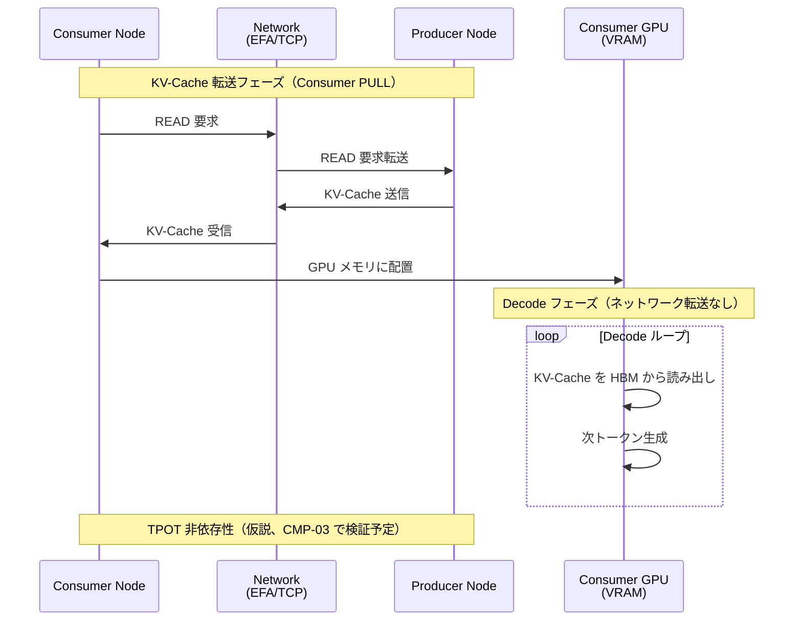

### TTFT がバックエンドに依存する理由

TTFT は Prefill 処理時間と KV-Cache 転送時間の合計です。KV-Cache 転送は以下の要因により、バックエンド（トランスポートレイヤと `kv_buffer_device` 設定）に大きく依存します。

**パターンごとの影響**:
- **パターン 1**（GPUDirect RDMA）: ネットワーク帯域幅とゼロコピー転送により最速
- **パターン 2**（cuda buffer）: ネットワーク帯域幅と NixlConnector の内部処理により高速
- **パターン 3**（cpu buffer）: ネットワーク帯域幅に加えて cudaMemcpy D2H + H2D のオーバーヘッドが追加

**トランスポートの影響**:
- **EFA**: 高帯域（100 Gbps）、低レイテンシ（SRD Protocol）
- **TCP**: 低帯域（~10-20 Gbps）、高レイテンシ

特に長いプロンプト（64K-128K tokens）では、KV-Cache サイズが数 GB に達するため、EFA と TCP、パターン 2 とパターン 3 の差が顕著になると予想されます。次回の CMP-02（EFA vs TCP TTFT）と CMP-07（EFA cuda vs TCP cpu）で検証します。

## Cross-validation: 低レベルから E2E への因果チェーン

複数の測定ツールを組み合わせることで、性能差の因果関係を段階的に検証できます。クロスバリデーションとは、**複数の異なる測定ツールの結果が互いに矛盾していないことを確認する**作業です。

### 10 個のクロスバリデーション一覧

Phase 1 では以下の 10 個のクロスバリデーション比較（CMP-01 ~ CMP-10）を実施します。これらは L4-Analysis の自動分析（3 パターン）と、L5-LowLevel の測定結果を用いた手動比較（7 項目）から構成されます。各 CMP の詳細は、後続のセクションで具体例とともに解説します。

:::message
L4-Analysis の自動分析パターンは以下の 3 つです:
- **bimodality-detection**: TTFT の二峰性検出（CMP-02, CMP-04 に対応）
- **proxy-overhead**: Proxy オーバーヘッド測定（独立した分析）
- **tpot-separation**: TPOT 分離分析（CMP-03, CMP-06 に対応）

残りの CMP-01, CMP-05, CMP-07, CMP-08, CMP-09, CMP-10 は、L5-LowLevel の測定結果と E2E メトリクスを用いた手動比較項目です。
:::

| ID | 比較内容 | 検証すること | 使用レイヤー |
|----|---------|------------|------------|
| CMP-01 | EFA vs TCP (1K-32K) | 短いプロンプトでのトランスポート差 | L2, L3 |
| CMP-02 | EFA vs TCP (64K-128K) | 長いプロンプトでのトランスポート差 | L2, L3 |
| CMP-03 | Unified vs Disaggregated TPOT | TPOT がトランスポートに非依存か | L1, L2, L3 |
| CMP-04 | Unified vs Disaggregated TTFT | KV-Cache 転送オーバーヘッドの分離 | L1, L2 |
| CMP-05 | L0 帯域 vs 実 KV-Cache 転送 | ハードウェア帯域の利用率 | L0, L2 |
| CMP-06 | TPOT 分解 | TPOT の内訳分析 | L1, L2 |
| CMP-07 | NIXLBench EFA vs UCX | NIXL レイヤでの EFA 優位性 | L5 |
| CMP-08 | NIXLBench vs E2E KV 転送 | vLLM 固有オーバーヘッドの特定 | L5, L2, L3 |
| CMP-09 | ucx_perftest cuda vs host | GPUDirect RDMA の帯域効果 | L5 |
| CMP-10 | KVBench vs 理論転送時間 | プロトコルオーバーヘッドの定量化 | L5, L0 |

### クロスバリデーションの意義: 具体例で理解する

#### CMP-08: NIXLBench 直接転送 vs E2E KV-Cache 転送

最も直感的な例です。NIXLBench で 12K tokens の NIXL 転送時間が 50ms と測定されたとします。一方、L1-Unified の 12K tokens TTFT が 80ms、L2-EFA の 12K tokens TTFT が 130ms だったとします。

```
KV-Cache 転送オーバーヘッド = L2-EFA TTFT - L1-Unified TTFT
                            = 130ms - 80ms = 50ms
```

この 50ms が NIXLBench の直接測定（50ms）と一致していれば、3 つのことが言えます。第一に、NIXLBench の測定は正確であり E2E 結果と整合しています。第二に、L2-EFA の TTFT 増加は KV-Cache 転送が原因であり、他のオーバーヘッドは無視可能です。第三に、vLLM の NixlConnector は NIXL ライブラリを効率的に利用しています。

逆に大きな乖離があれば、vLLM 固有のオーバーヘッド（スケジューリング遅延、メモリ管理など）が存在することを示唆します。

#### CMP-10: KVBench vs 理論的 KV-Cache 転送時間

理論的な転送時間は `KV-Cache サイズ / ハードウェア帯域幅` で計算できます。NIXLBench のセクションで示した `bytes_per_token = 262144`（256KB/token）を用いると、12K tokens の KV-Cache サイズは `12288 x 262144 = 3.0GB` です。EFA の帯域幅が 100 Gbps (= 12.5 GB/s) の場合は以下のようになります。

```
理論転送時間 = 3.0 GB / 12.5 GB/s = 240 ms
```

KVBench の実測値がこの理論値の 2-5 倍になることが仮説です。乖離の主な要因としては、SRD プロトコルのパケット再構成とフロー制御によるオーバーヘッド、GPU VRAM へのアクセスパターン（ストライドアクセス vs シーケンシャルアクセス）による帯域幅の低下、UCX/libfabric レイヤーのプロトコル処理コスト、および多数の小さな NIXL 転送記述子に分割されることによるディスパッチオーバーヘッドが考えられます。これらの要因を特定することで、最適化の方向性が見えてきます。

### 因果チェーン 1: EFA の帯域優位性

EFA が TCP より高速である理由を、各レイヤの測定で段階的に検証します。

**Fig 10: 因果チェーン 1 - EFA の帯域優位性（L0 → L5 → L2/L3 への伝播）**

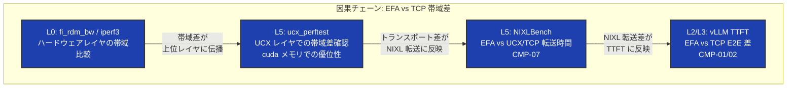

検証は 4 つのステップで実施します。まず L0 で EFA と TCP のハードウェアレイヤ帯域を比較します。次に L5 ucx_perftest で UCX レイヤでも同様の帯域差があることを確認します。さらに L5 NIXLBench で KV-Cache 転送時間の差を測定します。最後に L2/L3 vLLM E2E で TTFT 差が NIXLBench の転送時間差と整合していることを確認します。

これにより、各レイヤの測定が整合し、ハードウェアレイヤの帯域差が E2E の TTFT 差に伝播していることを検証できます。

### 因果チェーン 2: GPUDirect RDMA の効果

GPUDirect RDMA の効果を、メモリタイプ別の測定で検証します。

**Fig 11: 因果チェーン 2 - GPUDirect RDMA の効果（cuda vs host の性能差）**

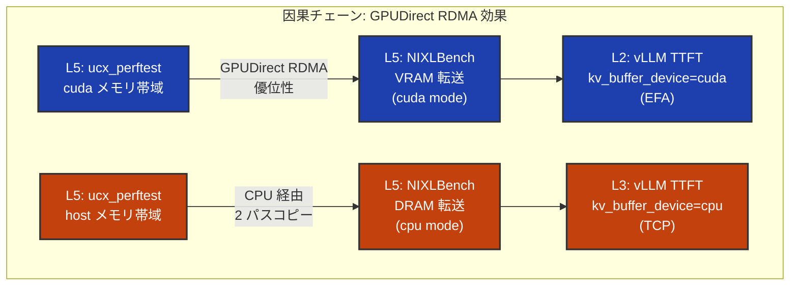

CMP-09 では 4 つのステップで検証します。まず L5 ucx_perftest で cuda メモリと host メモリの帯域を比較します。次に L5 NIXLBench で VRAM 転送（cuda mode）と DRAM 転送（cpu mode）の差を測定します。さらに L2/L3 vLLM E2E で EFA (cuda) と TCP (cpu) の TTFT を比較します。最後に各レイヤのメモリタイプによる差が整合していることを検証します。

これにより、GPUDirect RDMA によるメモリコピー削減が E2E の TTFT に影響していることを確認できます。

### 因果チェーン 3: KV-Cache 転送と TTFT の関係

KV-Cache 転送が TTFT の主要な構成要素であることを、Unified vs Disaggregated 比較で検証します。

**Fig 12: 因果チェーン 3 - KV-Cache 転送が TTFT の支配要因であることの検証**

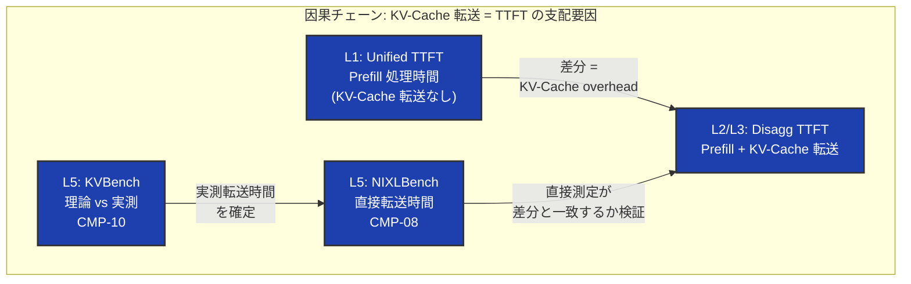

CMP-04, CMP-08, CMP-10 では 5 つのステップで検証します。まず L1 Unified モードで TTFT を測定し、KV-Cache 転送なしのベースラインを取得します。次に L2/L3 Disaggregated モードで TTFT を測定します。差分を算出することで KV-Cache 転送オーバーヘッドを分離します。さらに L5 NIXLBench で測定した直接転送時間と差分が整合していることを確認します。最後に L5 KVBench で理論的転送時間と実測値を比較し、プロトコルオーバーヘッドを特定します。

これにより、KV-Cache 転送が TTFT の主要構成要素であり、NIXLBench で測定した転送時間が E2E の TTFT 差を説明できることを確認します。

### クロスバリデーションの全体構造

Phase 1 では 10 個のクロスバリデーション比較（CMP-01 ~ CMP-10）を実施します。以下の図は、3 つの主要な因果チェーンがどのように全体を構成しているかを示しています。

**Fig 13: クロスバリデーション全体図（10 個の比較項目と 3 つの因果チェーン）**

```mermaid
graph TB
    subgraph CV["クロスバリデーション"]
        direction TB

        subgraph CHAIN1["因果チェーン 1: EFA vs TCP"]
            C1_L0["L0: fi_rdm_bw vs iperf3<br/>HW 帯域の差を確認"]
            C1_L5a["L5: ucx_perftest<br/>UCX レイヤでも同じ差が存在?"]
            C1_L5b["L5: NIXLBench<br/>NIXL 転送時間の差は?<br/>(CMP-07)"]
            C1_E2E["L2/L3: vLLM TTFT<br/>E2E でも差が反映?<br/>(CMP-01, CMP-02)"]
            C1_L0 --> C1_L5a --> C1_L5b --> C1_E2E
        end

        subgraph CHAIN2["因果チェーン 2: GPUDirect RDMA"]
            C2_L5a["L5: ucx_perftest<br/>cuda vs host メモリ<br/>(CMP-09)"]
            C2_L5b["L5: NIXLBench<br/>VRAM vs DRAM 転送"]
            C2_E2E["L2/L3: vLLM TTFT<br/>kv_buffer_device の影響"]
            C2_L5a --> C2_L5b --> C2_E2E
        end

        subgraph CHAIN3["因果チェーン 3: KV-Cache 転送"]
            C3_L5["L5: KVBench<br/>理論 vs 実測<br/>(CMP-10)"]
            C3_NIX["L5: NIXLBench<br/>直接転送時間<br/>(CMP-08)"]
            C3_DIFF["L1 vs L2/L3: TTFT 差分<br/>= KV-Cache 転送時間?<br/>(CMP-04)"]
            C3_L5 --> C3_NIX --> C3_DIFF
        end
    end

    style C1_L0 fill: #1e40af,stroke: #333,stroke-width:2px,color: #fff
    style C1_L5a fill: #1e40af,stroke: #333,stroke-width:2px,color: #fff
    style C1_L5b fill: #1e40af,stroke: #333,stroke-width:2px,color: #fff
    style C1_E2E fill: #1e40af,stroke: #333,stroke-width:2px,color: #fff
    style C2_L5a fill: #065f46,stroke: #333,stroke-width:2px,color: #fff
    style C2_L5b fill: #065f46,stroke: #333,stroke-width:2px,color: #fff
    style C2_E2E fill: #065f46,stroke: #333,stroke-width:2px,color: #fff
    style C3_L5 fill: #c2410c,stroke: #333,stroke-width:2px,color: #fff
    style C3_NIX fill: #c2410c,stroke: #333,stroke-width:2px,color: #fff
    style C3_DIFF fill: #c2410c,stroke: #333,stroke-width:2px,color: #fff
```

## まとめ

本記事では、vLLM DI の実装を理解するための「測定アーキテクチャ」について解説しました。主要なポイントは以下の 3 点です。

### 1. 測定の階層構造: vLLM 実装のどこを測るか

測定は 3 つの階層で実施します。**L0-Baseline 層**ではネットワーク・GPU 環境の健全性を確認します（iperf3, fi_rdm_pingpong, fi_rdm_bw）。**L5-LowLevel 層**では低レベルツールによる直接測定を実施します（NIXLBench, KVBench, ucx_perftest）。**L1-L3-E2E 層**ではアプリケーションレイヤの総合評価を行います（vLLM TTFT/TPOT/Throughput）。

この階層構造により、**vLLM の E2E メトリクスの変動が、通信スタックのどの層に起因するかを特定できます**。たとえば TTFT が期待と異なる場合、まず L0 でハードウェアレイヤを確認し、次に L5 で NIXL ライブラリ層を測定し、最後に L2 で vLLM 全体を評価します。

### 2. Cross-validation: 複数ツールで vLLM 実装を検証

単一の測定ツールではなく、**複数のツールを組み合わせることで、vLLM 実装の動作を検証**できます。

主要な因果チェーンは 3 つあります。第一の **EFA の帯域優位性**では、L0 fi_rdm_bw/iperf3 から L5 ucx_perftest、L5 NIXLBench、最終的に L2/L3 vLLM TTFT へと帯域差が伝播していることを検証します。第二の **GPUDirect RDMA の効果**では、L5 ucx_perftest (cuda/host) から L5 NIXLBench (VRAM/DRAM)、最終的に L2/L3 vLLM TTFT へとメモリタイプによる差が伝播していることを検証します。第三の **KV-Cache 転送と TTFT**では、L5 KVBench から L5 NIXLBench、最終的に L1 Unified vs L2/L3 Disaggregated TTFT 差として KV-Cache 転送の影響を測定します。

これらの因果チェーンにより、**vLLM の NixlConnector が通信スタックをどう利用しているかを、各レイヤの測定で段階的に検証**できます。

### 3. vLLM 実装の重要な仕組み

本記事で解説した vLLM DI の実装上の重要なポイントを説明します。第一に、**TPOT はバックエンドに依存しないと考えられます**（仮説）。KV-Cache は Decode 開始前に GPU メモリに配置される設計のため、理論的にはトランスポートレイヤ（EFA/TCP）は Decode フェーズに影響しないはずです。この仮説は次回の測定で CMP-03 により検証します。第二に、**kv_buffer_device 設定には 2 つのパスがあります**。cuda（GPUDirect RDMA、ゼロコピー）と cpu（ホストバッファ経由、2 パスコピー）です。第三に、**通信スタックは階層構造**になっています。vLLM Application から NIXL Library、Transport (UCX/libfabric)、Hardware (EFA/ENA) へと階層的に処理されます。第四に、**測定で検証すべき仮説**は、ハードウェアレイヤの帯域差が上位レイヤに伝播し最終的に vLLM の TTFT に影響するかどうか、および TPOT がトランスポートレイヤに依存しないかどうかです。

### 4. 将来の展望: Remote Storage (Valkey) によるスケーラビリティ向上

本記事では P2P (NIXL + EFA) アーキテクチャによる測定を中心に解説しましたが、**Remote Storage（Valkey）を使った代替アーキテクチャ**も検討に値します。

### P2P vs Remote Storage の比較

現在の P2P アーキテクチャは、Producer と Consumer が直接接続し、Consumer が Producer の GPU VRAM から RDMA READ で KV-Cache を取得します。一方、Valkey（Redis 互換の高性能 KV ストア）を中間ストレージとして使用すると、異なるトレードオフが生まれます。

**Fig 14: P2P アーキテクチャ vs Valkey アーキテクチャの比較**

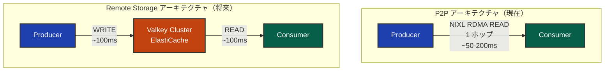

### トレードオフ分析

| 観点 | P2P (NIXL + EFA) | Remote Storage (Valkey) |
|------|------------------|-------------------------|
| **レイテンシー** | 低い（1 ホップ、50-200ms） | 高い（2 ホップ、100-400ms） |
| **スケーラビリティ** | 1:1 の固定ペア | N: M の動的ペア |
| **GPU メモリ効率** | Producer が VRAM 占有 | Valkey に offload 後解放 |
| **KV-Cache 再利用** | 不可 | 可能（Prefix Caching 対応） |
| **障害耐性** | Producer ダウンで喪失 | Valkey に永続化 |
| **セットアップ複雑性** | 高い（EFA, NIXL 設定） | 低い（ElastiCache マネージド） |

### Valkey が有利なシナリオ

以下のユースケースでは、Valkey の利点がレイテンシーのオーバーヘッドを上回る可能性があります。第一に **Prefix Caching** では、共通 Prefix の KV-Cache を複数リクエストで共有できます。第二に **N: M スケーリング**では、Prefill と Decode の独立スケーリングが可能です。第三に **GPU メモリ効率**では、Producer の VRAM を早期解放し、スループットを向上できます。第四に **運用のシンプルさ**では、ElastiCache マネージドサービスで運用負荷を軽減できます。

### ハイブリッドアーキテクチャの可能性

最適解は「P2P か Valkey か」の二者択一ではありません。**ユースケースに応じた使い分け**が重要です。

**Fig 15: ハイブリッドアーキテクチャ（Smart Router による使い分け）**

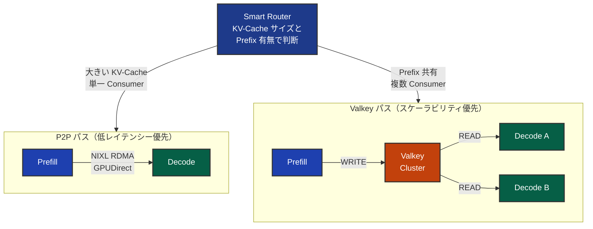

### 将来の測定計画

Valkey 統合を測定フレームワークに組み込む場合、新たなレイヤーとクロスバリデーションを追加します。**L6-Valkey** では、Valkey 経由の KV-Cache 転送性能を単体ベンチマークと vLLM E2E の両方で測定します。**CMP-11** では P2P (EFA) モードと Valkey モードの TTFT を比較し、**CMP-12** では P2P (TCP) モードと Valkey モードの TTFT を比較します。**CMP-13** では NIXLBench による直接転送と Valkey 経由転送の性能差を測定し、**CMP-14** では Valkey における Multi-Consumer のスケーラビリティを測定します。

**注**: 本記事の Phase 1 測定は P2P アーキテクチャに焦点を当てており、Valkey 統合は将来の Phase（Phase 2 以降）で実施予定です。また、GPUDirect RDMA 対応インスタンス（P5/P5en）への切り替えにより、P2P のゼロコピーの恩恵を最大限に活用し、Valkey との性能差をより明確に測定できます。

## 参考文献

### 主要な実装

本記事で解説した vLLM DI の実装は、[vLLM NixlConnector 実装](https://github.com/vllm-project/vllm/blob/v0.16.0/vllm/distributed/kv_transfer/kv_connector/v1/nixl_connector.py)（vLLM v0.16.0）を参照しています。Disaggregated Proxy の参考実装として [vLLM Toy Proxy Server](https://github.com/vllm-project/vllm/blob/v0.16.0/tests/v1/kv_connector/nixl_integration/toy_proxy_server.py)（複数インスタンス対応）が用意されていますが、**本測定では 1 Prefiller + 1 Decoder 構成に特化し、タイムスタンプ測定機能と接続プーリング最適化を含む独自実装 `disagg_proxy_server.py` を使用**しています。利用可能な KV Connector の一覧は [KV Connector レジストリ](https://github.com/vllm-project/vllm/blob/v0.16.0/vllm/distributed/kv_transfer/kv_connector/factory.py#L146-L203)で確認できます。

### ライブラリとプロトコル

本記事で扱った主要なライブラリは NIXL (Network Interconnect for XPU Linking)（NVIDIA の GPU 間通信ライブラリ）であり、その通信バックエンドとして [OpenUCX プロジェクト](https://www.openucx.org/)（Unified Communication X）と [OpenFabrics Interfaces (OFI) / libfabric](https://ofiwg.github.io/libfabric/)（高性能ファブリック通信の標準 API）を使用しています。

### 論文と解説

AWS EFA と SRD プロトコルの詳細は、AWS 公式論文 "A Cloud-Optimized Transport Protocol for Elastic and Scalable HPC" (IEEE Micro, 2020) で解説されています。また、本連載の既存記事として [AWS EFA と Nitro System 解説編](https://zenn.dev/tosshi/articles/0eeb53ca63f8b2)と[環境構築編](https://zenn.dev/tosshi/articles/009bb138491dd1)がありますので、あわせてご参照ください。

## おわりに

次の環境構築・測定実行編では、本記事で設計した測定アーキテクチャを実際に g6e.12xlarge インスタンス上で実行し、各レイヤの測定結果と Cross-validation の検証結果を報告します。本記事が、DI の実装理解や測定設計の参考になれば幸いです。

（執筆: 2026-02-28）
