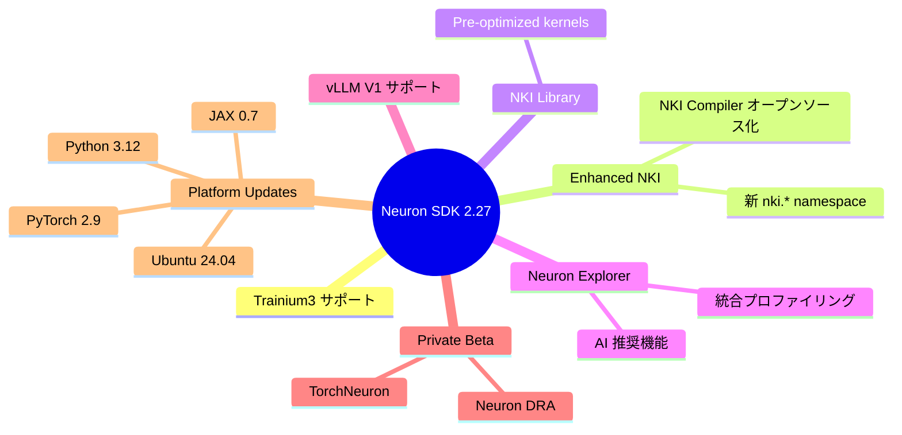

# はじめに

2025 年 12 月 19 日に AWS Neuron SDK 2.27.0 がリリースされました。このリリースでは、Trn3 インスタンスのサポート、Enhanced NKI、統合プロファイリングツール Neuron Explorer など、多数の新機能が追加されています。本記事では、主要なアップデート内容を整理します。

AWS re:Invent 2025 で発表された最新アップデートで今回のバージョンのアップデートを包含する発表が含まれており、以下の記事で詳しく解説されているのでまずはこちらを確認してから本書を読み進めてください。

https://zenn.dev/aws_japan/articles/06808526d5c75f

参照: [What's New in AWS Neuron SDK](https://awsdocs-neuron.readthedocs-hosted.com/en/latest/about-neuron/whats-new.html#whats-new-2025-12-19-v2-27)

# 主要アップデート概要



それぞれの詳細を見ていきましょう。

# Trainium3 (Trn3) サポート

Neuron SDK 2.27.0 では、第 4 世代となる Trainium3 インスタンスがサポートされました。Trainium3 は、前世代と比較してさらなる性能向上を実現しています。Runtime、Tools、Compiler の各コンポーネントが Trn3 に対応し、既存のワークロードをそのまま実行できます。

# Neuron Kernel Interface (NKI) の強化

## 新しい nki.* namespace

従来の `neuronxcc.nki.*` namespace から新しい `nki.*` namespace への移行が始まりました。Neuron 2.27 では両方の namespace がサポートされていますが、Neuron 2.28 で旧 namespace は削除される予定です。

参照: [Neuron Kernel Interface (NKI)](https://awsdocs-neuron.readthedocs-hosted.com/en/latest/nki/get-started/about/index.html)

**変更点:**

```python
# 旧 (Neuron 2.28 で削除予定)
from neuronxcc import nki

# 新 (推奨)
import nki
from nki import language as nl

@nki.jit
def my_kernel(x):
    ...
```

## NKI Compiler のオープンソース化

NKI Compiler が [GitHub でオープンソース](https://github.com/aws-neuron/nki)として公開されました。MLIR ベースのコンパイラ実装を確認でき、研究者やコンパイラ開発者がコントリビュートできるようになりました。（GitHub アクセスは 2026/01/07 時点でプライベートベータに申し込みが必要です。）

参照: [About NKI](https://awsdocs-neuron.readthedocs-hosted.com/en/latest/nki/get-started/about/index.html)

> "Using MLIR enables NKI integration with the LLVM ecosystem and compiler research community."

# NKI Library

[NKI Library](https://awsdocs-neuron.readthedocs-hosted.com/en/latest/release-notes/2.27.0/nki-lib.html) は、一般的なモデル操作に対して事前最適化されたカーネルを提供します。Attention CTE、Attention TKG、MLP、Output Projection CTE/TKG、QKV、RMSNorm-Quant など、高頻度で使用される演算がプリビルドカーネルとして提供されています。

これらのカーネルは `nkilib.*` namespace からアクセスできます。また、[GitHub リポジトリ](https://github.com/aws-neuron/nki-library)からソースコードを確認することも可能です。

# Neuron Explorer

[Neuron Explorer](https://awsdocs-neuron.readthedocs-hosted.com/en/latest/release-notes/2.27.0/tools.html) は、ML エンジニアの開発をサポートする統合プロファイリングツールスイートです。デバイスプロファイリングのパフォーマンスとユーザーエクスペリエンスが向上しました。

> これまでも存在していた Neuron Profiler がより機能拡充されてリネームされたものだと思います。

## 4 つのコアビューアー

Neuron Explorer は 4 つのビューアーで構成されています。Hierarchy Viewer はモデル構造とコンポーネント間の相互作用を可視化します。AI Recommendation Viewer は AI による最適化推奨を提供します。Source Code Viewer はプロファイリングデータをソースコードに直接リンクします。Summary Viewer はハイレベルなパフォーマンスメトリクスを表示します。

これらのビューアーは、UI、CLI、VSCode IDE 統合を通じて利用できます。

# vLLM V1 サポート

vLLM-Neuron Plugin により、vLLM V1 が推論ワークロードで利用可能になりました。vLLM V0 のサポートは Neuron 2.28 で終了する予定です。

新しい `pytorch-inference-vllm-neuronx` 0.11.0 Deep Learning Container が提供され、PyTorch 2.8 と必要な依存関係がすべて含まれています。

# 推論モデルの拡充

NxD Inference のモデルサポートが拡大し、以下のモデルがベータリリースされました：

- **Qwen3 MoE (Qwen3-235B-A22B)**: 多言語テキスト処理
- **Pixtral (Pixtral-Large-Instruct-2411)**: 画像理解

両モデルとも HuggingFace チェックポイントを使用し、Trn2 および Trn3 インスタンスでサポートされています。

参照: [NxD Inference Release Notes](https://awsdocs-neuron.readthedocs-hosted.com/en/latest/release-notes/2.27.0/nxd-inference.html)

# コンパイラの精度設定変更

Neuron Graph Compiler のデフォルト精度設定が最適化されました。これは**重要な変更**です。

**変更内容:**
- `--auto-cast` フラグのデフォルトが `matmul` から `none` に変更
- `--enable-mixed-precision-accumulation` がデフォルトで有効化

FP32 モデルではパフォーマンスに影響が出る可能性があります。以前の動作に戻すには、以下のフラグを指定してください：

```bash
--auto-cast=matmul --disable-mixed-precision-accumulation
```

また、Python 3.10 以上が必須になりました。

参照: [Neuron Compiler Release Notes](https://awsdocs-neuron.readthedocs-hosted.com/en/latest/release-notes/2.27.0/compiler.html)

# Runtime の改善

[Neuron Runtime Library 2.29](https://awsdocs-neuron.readthedocs-hosted.com/en/latest/release-notes/2.27.0/runtime.html) では、Trainium3 サポートに加えて、複数のパフォーマンス改善が実現されました。Collectives Engine のオーバーヘッド削減、NeuronCore ブランチオーバーヘッドの削減、NEFF プログラム起動の高速化、all-gather レイテンシの改善により、分散学習と推論の性能が向上しています。

# Platform アップデート

## Deep Learning Containers (DLC)

すべての Deep Learning Container が Ubuntu 24.04 と Python 3.12 にアップデートされました。

## Deep Learning AMIs (DLAMI)

[DLAMI](https://awsdocs-neuron.readthedocs-hosted.com/en/latest/release-notes/2.27.0/dlami.html) では Ubuntu 24.04 サポートが追加され、Base DLAMI、Single Framework DLAMI、Multi-Framework DLAMI の各構成で利用可能です。

新しい仮想環境として、vLLM V1、PyTorch 2.9（Amazon Linux 2023、Ubuntu 22.04、Ubuntu 24.04 で利用可能）、JAX 0.7 が追加されました。

# Private Beta: TorchNeuron (Native PyTorch)

## TorchNeuron とは

[TorchNeuron](https://awsdocs-neuron.readthedocs-hosted.com/en/latest/frameworks/torch/pytorch-native-overview.html) は、AWS Trainium 向けのネイティブ PyTorch バックエンドです。従来の PyTorch/XLA から、標準的な PyTorch API への移行を実現します。

主な特徴として、Eager Mode（PyTorch の標準的な実行モード）、torch.compile（JIT コンパイルサポート）、標準 API（DTensor、FSDP、DDP などの標準分散 API）、フレームワーク互換性（TorchTitan などが変更なしで動作）があります。

## リリース予定

PyTorch 2.9 が PyTorch/XLA ベースの最終バージョンとなり、PyTorch 2.10 以降で TorchNeuron に移行します。

## ベータアクセス

TorchNeuron の Private Beta にアクセスするには、[Neuron Private Beta signup form](https://pulse.aws/survey/NZU6MQGW?p=0) から申し込みが必要です。

:::message alert
**Ubuntu バージョンについて**

TorchNeuron (PyTorch 2.10) の OS 要件は、現時点では明示されていません。DLAMI の構成から、Ubuntu 24.04 が推奨される可能性が高いですが、Ubuntu 22.04 での動作可否は、ベータアクセス承認後のドキュメントで確認する必要があるかもしれません。
:::

# サポート終了のお知らせ

Neuron 2.27 から複数のコンポーネントのサポートが終了しました。Python 3.9、PyTorch 2.6、TensorFlow 2.10、Inf1 仮想環境と AMI、parallel_model_trace API、TensorBoard Plugin for Neuron Profiler が該当します。これらのバージョンやコンポーネントを使用している場合は、新しいバージョンへの移行が必要です。

参照: [End of Support Announcements](https://awsdocs-neuron.readthedocs-hosted.com/en/latest/about-neuron/announcements/)

# まとめ

Neuron SDK 2.27.0 は、Trainium3 サポート、Enhanced NKI、統合プロファイリングツール Neuron Explorer など、多数の重要なアップデートを含んでいます。特に注目すべきは、PyTorch 2.10 以降で利用可能になる TorchNeuron (Native PyTorch) の Private Beta です。

Trainium 検証環境の構築方法については、以下の記事をご覧ください：

https://zenn.dev/littlemex/articles/eb54037328d2ef

## 参考リンク

- [What's New in AWS Neuron SDK](https://awsdocs-neuron.readthedocs-hosted.com/en/latest/about-neuron/whats-new.html#whats-new-2025-12-19-v2-27)
- [Native PyTorch for Trainium](https://awsdocs-neuron.readthedocs-hosted.com/en/latest/frameworks/torch/pytorch-native-overview.html)
- [Neuron Private Beta Signup](https://pulse.aws/survey/NZU6MQGW?p=0)
- [Neuron SDK 2.27.0 Release Notes](https://awsdocs-neuron.readthedocs-hosted.com/en/latest/release-notes/2.27.0/)
- [Announcing Transition to PyTorch Native Support](https://awsdocs-neuron.readthedocs-hosted.com/en/latest/about-neuron/announcements/neuron2.x/announce-transition-pytorch-trainium.html)
