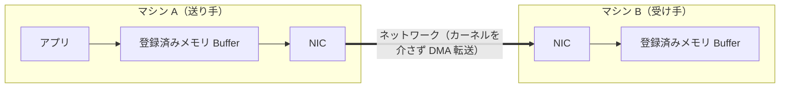
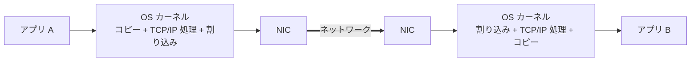
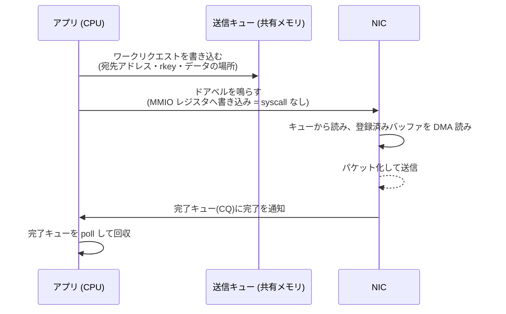
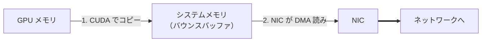
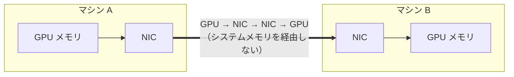

## はじめに

:::message
**この記事のゴール**: 「GPU 同士がネットワーク越しに、CPU をほとんど介さず直接データをやり取りする」仕組みである **GPUDirect RDMA** を、初学者向けに解説します。

1. そもそも RDMA とは何か（Buffer → NIC → NIC → Buffer）
2. TCP/IP と何が違うのか（RTT・カーネルバイパス）
3. RDMA の操作（RDMA Operations）と「メモリ登録」
4. GPUDirect RDMA — NIC が GPU メモリに直接アクセスする（2 つの実現方式）
5. AWS EFA はどうやって RDMA を実現しているか（SRD / Queue Pair）
6. 実際に動かす（疎通テストと確認ポイント）

絵で仕組みをイメージできることを最優先にしつつ、よくある誤解（「RDMA は CPU を一切使わない」等）には踏み込んで正確に解説します。
:::

この記事は単体で完結します。NVSHMEM など分散 GPU 通信ライブラリの「下回りの仕組みを知りたい」という動機があると読み進めやすいですが、前提知識は必須ではありません。

## 1. そもそも RDMA とは何か

**RDMA（Remote Direct Memory Access、遠隔直接メモリアクセス）** は、その名の通り「**相手マシンのメモリに、直接読み書きする**」通信方式です。

### データの通り道: Buffer → NIC → NIC → Buffer

ここで **NIC（Network Interface Card）** とは、マシンをネットワークにつなぐハードウェアのことです。RDMA 対応の NIC は、CPU の指示なしにメモリを直接読み書きする能力を持ちます。

RDMA のデータの流れは、突き詰めるとこれだけです。



- マシン A の NIC が、登録済みの送信 Buffer を **DMA で読み出し**、ネットワークへ送る
- マシン B の NIC が受け取り、登録済みの受信 Buffer に **DMA で直接書き込む**
- 片側操作（後述の Write/Read）では、**B の CPU はこの転送に関与しない**

ここで言う **DMA（Direct Memory Access）** とは、CPU を介さずにハードウェア（ここでは NIC）がメモリを直接読み書きする仕組みです。通常はメモリとデバイスの間で CPU がデータを中継しますが、DMA ではその役割をハードウェアが肩代わりします。これがあるから、NIC は CPU の手を借りずにデータを運べます。

この「相手の CPU を働かせずに、相手のメモリへ書き込める」性質が RDMA の本質です。NVSHMEM の片側通信（`put`/`get`）は、まさにこの能力に支えられています。

### なぜ速いのか: カーネルバイパスと Zero-copy

| 仕組み | 意味 |
|---|---|
| **カーネルバイパス（kernel bypass）** | データ転送のたびに OS カーネルを呼ばず、アプリが NIC のレジスタを直接叩く。OS 介在のオーバーヘッドを消す |
| **Zero-copy（ゼロコピー）** | 送受信のために中間バッファへコピーしない。NIC がアプリのメモリを直接 DMA する |

:::message alert
**よくある誤解: 「RDMA は CPU を一切使わない」は言い過ぎです。**
正確には「**データ転送のたびのカーネル介在とメモリコピーをなくす**」が正しい理解です。送信側の CPU は、後述する「ワークリクエスト（WR）をキューに書き込む」「完了キューを読む（poll）」処理を行います。CPU から消えるのは、(1) カーネルへの system call、(2) データのコピー、(3) プロトコル処理（ACK・再送など）です。**片側操作では相手側の CPU は確かに不関与**ですが、送信側 CPU はゼロにはなりません。

また「カーネルバイパス」が効くのは**データ転送（fast path）だけ**です。後述するメモリ登録や接続のセットアップ（slow path）は、ふつうにカーネルへの system call を伴います。
:::

## 2. TCP/IP と何が違うのか

### TCP/IP の場合



TCP/IP では、データは「アプリ → カーネル → NIC → … → NIC → カーネル → アプリ」と進みます。標準的な送受信では、送信時にユーザ空間からカーネルへ**コピー**が入り、受信時にもう一度カーネルからユーザ空間へ**コピー**が入り、さらにパケット受信のたびに割り込み処理が挟まります。これらが積み重なって、1 回のやり取りのレイテンシが大きくなります。

### RTT（Round-Trip Time）で見る違い

通信の速さを測る代表的な指標が **RTT（往復時間）** です。

おおまかな目安（**ハードウェア・構成に強く依存するので幅で捉えてください**）

| 方式 | アプリから見た往復レイテンシ（小メッセージ・同一データセンタ内の目安） |
|---|---|
| TCP/IP（クラウド同一 AZ） | おおむね数十〜百数十マイクロ秒 |
| RDMA（InfiniBand、同一ラック内） | おおむね一桁マイクロ秒（2〜5 µs 程度） |

:::message
**数値はあくまで目安**です。ベンダが公表する「アダプタ遅延 0.5 µs」のような数字は、多くが ping-pong テストの **往復時間を 2 で割って片道遅延として報告した値**で、両端の NIC 処理時間を含みます。アプリから実際に見えるのは往復遅延（RTT）なので、体感値はこれより大きくなります。重要なのは絶対値より、**TCP と RDMA の間に一桁以上の差が出うる**という構造です。
:::

なぜ下がるのか。RDMA は、(1) データ転送時の system call を消し、(2) コピーを消し、(3) トランスポート処理（順序制御・ACK・再送）を**NIC のハードウェアにオフロード**します。CPU とカーネルがクリティカルパスから外れる、これがレイテンシ低減の正体です。「速いハードだから」ではなく「**アーキテクチャ的にソフト処理を省いているから**」が本質です。

## 3. RDMA の操作（RDMA Operations）と「メモリ登録」

RDMA でできる操作は、大きく 2 系統・4 種類です。これは RDMA を理解する上で必ず押さえるべき分類です。

### 片側操作（One-sided） — 相手の CPU を使わない

| 操作 | 意味 |
|---|---|
| **RDMA Write** | 相手のメモリに**書き込む**。相手の CPU は不関与。完了通知は送信側にだけ届く（受信側は書かれたことに気づかない） |
| **RDMA Read** | 相手のメモリから**読み出す**。相手の CPU は不関与 |

:::message
**「相手の NIC も不関与」ではない点に注意。** RDMA Read では、相手側の **NIC は**動きます（読み出し要求を受け、自分のメモリを DMA 読みして送り返す）。不関与なのは相手側の **CPU** です。
:::

### 両側操作（Two-sided） — 送受信が対になる

| 操作 | 意味 |
|---|---|
| **Send** | データを送る。相手が事前に **Receive** を用意している必要がある |
| **Receive** | 受信バッファを用意して待つ。`Send` と対で動く |

TCP の send/recv に近く、送り手と受け手の両方が操作を発行します。NVSHMEM の `put`/`get` は前者の片側 Write/Read に対応します。

### 「ワークリクエストを積む」という動作モデル

RDMA の送信は「データを送る関数を呼ぶ」のではなく、**ワークリクエスト（Work Request）を NIC のキューに積む**という形を取ります。



流れは三段階です。(1) アプリが「宛先・データの場所」を書いた**記述子をキューに積む**、(2) NIC のレジスタに直接書き込んで「**ドアベル**を鳴らす」（処理を始めろと知らせる）、(3) NIC が非同期に送信し、終わると**完了キュー**に通知するので、アプリはそれを読み取る。

ポイントは、この (1)〜(3) が **OS への system call なしで完結する**ことです。アプリは NIC のレジスタ（**MMIO**: Memory-Mapped I/O＝メモリアドレスとして見えるハードウェア制御レジスタ）に直接書き込むので、カーネルを経由しません。これがカーネルバイパスの正体です。

なお、上の図の「送信キューと受信キューのペア」を **Queue Pair（QP）** と呼びます。RDMA の通信は QP を単位に管理され、QP ごとに識別番号（**QPN**: Queue Pair Number）が振られます。この QP は、5 章の EFA でも同じ概念として登場します。

::::details 実装詳細: verbs API（libibverbs）
RDMA デバイスは **verbs API（libibverbs）** という業界標準の C API（`ibv_` で始まる関数群、Linux では `rdma-core` パッケージ）で操作します。上の三段階は具体的には、送信記述子を積む `ibv_post_send()`、完了を読む `ibv_poll_cq()` で行います。`ibv_poll_cq()` はユーザ空間で完了キューを読むだけなので、低レイテンシを狙うならスピンさせます（その分 CPU を消費）。「記述子」は正確には WQE（Work Queue Element）と呼ばれ、キューに積む前のリクエストが WR（Work Request）です。
::::

### なぜ「メモリ登録（Memory Registration）」が要るのか

RDMA で「NIC が特定のメモリを DMA する」ためには、事前にそのメモリ領域を **登録（register）** する必要があります。登録は 2 つの仕事をします。

1. **ページのピン留め**: OS がそのページをスワップ・移動しないよう固定する。さもないと転送中に物理アドレスがずれて NIC が誤った場所を DMA してしまう
2. **鍵（key）の発行**: ローカル用の **lkey** と、リモートに渡す **rkey** が発行される。相手はこの rkey を提示して初めて、あなたのメモリにアクセスできる

::::details もう一歩踏み込みたい人向け: 登録の実装メモ
- 登録は**重い処理**（ミリ秒オーダー）です。データパスで毎回呼ぶのは厳禁で、起動時に大きな領域を一度登録して使い回すのが定石です（MPI/NCCL は登録キャッシュを持ちます）。
- `rkey` は暗号的な秘密ではなく、NIC ハードウェアがテーブル照合する 32 bit のトークンです。安全性は「接続が認証済みであること」と「保護ドメイン（PD）による分離」に依存します（PD は、メモリ登録（MR）や QP を論理的に束ね、別グループからのアクセスを NIC レベルで遮断する管理単位
- リモート書き込みを許すには登録時にアクセス権（`IBV_ACCESS_REMOTE_WRITE` 等）を明示的に付与する必要があります。鍵の値が正しくても、権限がなければ NIC が弾きます。
::::

## 4. GPUDirect RDMA — NIC が GPU メモリに直接アクセスする

ここまでの RDMA は「**システムメモリ（CPU 側の RAM）**」の話でした。データが **GPU メモリ** にある場合はどうなるでしょうか。

### GPUDirect RDMA がない場合（遠回り）



そもそも GPU メモリは、ふつうの仕組みでは NIC から直接 DMA できません（GPU の VRAM はホストの物理アドレス空間にそのままは見えないため）。だから GPU → いったんピン留めしたシステムメモリへコピー（**バウンスバッファ**）→ NIC が送る、という遠回りが必要でした。この余計なコピーがレイテンシと帯域を食います。

### GPUDirect RDMA がある場合（直通）

**GPUDirect RDMA** は、この遠回りをなくします。NIC が **GPU メモリを直接** DMA します。



冒頭の「Buffer → NIC → NIC → Buffer」の Buffer が、**GPU メモリそのもの**になったわけです。

### どうやって NIC が GPU メモリを触れるのか

鍵は **GPU の BAR1** という仕組みです。GPU は VRAM の一部を、PCIe バス上のアドレスに写し出す「窓」を持っています。この窓は **BAR1（Base Address Register 1）** と呼ばれる PCIe 標準の仕組みです。

なぜ窓が要るのか。通常、GPU の VRAM はシステムメモリ（CPU 側の RAM）とは独立した別空間にあり、NIC から見ると「GPU メモリがどこにあるか分からない」状態です。ここで、**PCIe につながった全デバイス（CPU・NIC・GPU）は 1 つの PCIe アドレス空間を共有して見ています**。BAR1 はその空間に VRAM を写し出す橋渡しで、NIC はこの「写し出されたアドレス」へ DMA を発行することで、システムメモリと同じように GPU メモリを直接読み書きできるようになります。

実現方式は**歴史的に 2 つ**あり、ここは初学者向け記事でも区別しておく価値があります。

| | 方式1: レガシー (peer-memory) | 方式2: モダン (dma-buf) |
|---|---|---|
| 仕組み | `nvidia-peermem`（旧 `nv_peer_mem`）カーネルモジュールが GPU を「peer memory クライアント」として登録。`ibv_reg_mr()` に GPU アドレスを渡すと、内部で `nvidia_p2p_get_pages()` がピン留めする | CUDA が GPU メモリを **dma-buf**（Linux 標準のバッファ共有 fd）として公開（`cuMemGetHandleForAddressRange`）し、`ibv_reg_dmabuf_mr()` で登録する |
| 依存 | NVIDIA OFED（MLNX_OFED）または相当のカーネルパッチが要る peer-memory API。**mainline Linux カーネルには無い** | Linux カーネル標準（おおむね 5.12+ で安定）。RDMA 側に NVIDIA 専用プラグイン不要 |
| 位置づけ | 古くからの方式。 | 新しく推奨される方向。クリーンで標準的（Blackwell 以降は dma-buf へ移行が進む） |

## 5. AWS EFA はどうやって RDMA を実現しているか

AWS の **EFA（Elastic Fabric Adapter）** は GPUDirect RDMA に対応しており、NVSHMEM や NCCL の下回りとして使われます。ここは仕組みが面白いので少し掘り下げます。

### まず大前提: EFA は InfiniBand ではない

:::message alert
**最大の誤解: 「EFA = InfiniBand」ではありません。** EFA は AWS 独自の **SRD** というトランスポートを、Ethernet ベースの Nitro ネットワーク上で動かしています。InfiniBand のファブリックもサブネットマネージャも使いません。ただし**ソフトウェアの API は InfiniBand 由来の verbs（libibverbs / rdma-core）互換**です。「API が verbs 互換」なだけで、プロトコルの正体は別物、というのが正確な理解です。
:::

### SRD（Scalable Reliable Datagram）

https://zenn.dev/tosshi/articles/0eeb53ca63f8b2

SRD の詳細はこちらの記事を見てください。EFA は **SRD（Scalable Reliable Datagram）** を使います。

- **信頼性は EFA デバイス（ハードウェア）が担保**（届くことは保証する）
- 複数経路にパケットをばらまく**マルチパス**で、巨大ネットワークでも詰まりにくい
- **データグラム型**なので、1 つの QP で全ピアと通信できる（接続を張らない＝スケールする）
- ただし **EFA デバイス層の SRD は順序を保証しない**（パケットは順不同で届く）。

「デバイス層では順序保証しない」のが SRD の割り切りです。では順序が必要な NCCL のようなアプリはどうするか。**順序の再構成は上位のソフトウェア（libfabric の efa provider）が担い**、アプリには **SAS（Send-After-Send）** 保証を提供します。これは TCP の recv と同じで「送った順にデータを受け取れる」という意味です。「ハードは順不同・速さ優先、ソフトが順序を後付け」という二層構造になっています。

### Queue Pair は使っているのか → 使っている

「EFA は Queue Pair を使うのか?」は気になるところです。**使っています。** ただし InfiniBand RC の QP が「接続済み・順序保証」なのに対し、**EFA の SRD QP は「信頼できるが順不同のデータグラム」** という違いがあります。「QP という器は使うが、その上のトランスポートが SRD」という関係です。エンドポイントのアドレスにも、QP の識別番号 **QPN** が含まれます。

### 全体像: ハードウェアからアプリまで


EFA デバイスがハードウェアで直接提供する操作は、突き詰めると 3 つです。**Send/Receive**（MTU サイズまで＝1 回の転送で送れる最大サイズまで、おおむね数 KB）、**RDMA Read**、**RDMA Write**。

アプリから見える「任意サイズの順序付き送受信」は、これらの上で **libfabric が再構成**しています。具体的には、ピアごとに **シーケンス番号（msg_id）と並べ替えバッファ（reorder buffer）** を持ち、順不同で届いたパケットを順序通りにアプリへ渡します（TCP の受信バッファと同じ発想を、ハードウェアの上のソフトウェアで実装している）。

GPU（CUDA）メモリを RDMA に使うときは、libfabric の efa provider は **dma-buf を優先**します（`ibv_reg_dmabuf_mr()` で登録 → 失敗したら `ibv_reg_mr()` にフォールバック → どちらも駄目なら CPU 経由）。この挙動を制御する環境変数は、実際に動かすセクション 6 で触れます。

### インスタンス選定・設定の注意点（実機で確認）

:::message alert
**「マルチ GPU の高性能インスタンスなら EFA が勝手に効く」わけではありません。** 起動時に EFA を有効化していなければ、`fi_info -p efa` は何も返さず、EFA は一切使えません（筆者の通常起動 p4d がまさにこれでした）。
:::

上記の大前提に加え、筆者が AWS の 2 種類で実機検証して分かった注意点を挙げます。

- **EFA 型の ENI（Elastic Network Interface＝AWS の仮想ネットワークカード。`InterfaceType=efa` と指定）を起動時にアタッチする必要がある**。カーネルモジュール `efa` / `efa_nv_peermem` がロード済みでも、デバイス（ENI）が無ければ無意味。
- **RDMA Read / Write の可否はインスタンス次第**。AWS ドキュメントの対応表を整理すると:
  - **Nitro v4 以降**: Read / Write とも可（`p5` / `p6` 系など）。ただし例外として **`c7gn` / `hpc7g`（Nitro v5）は Read 可・Write 不可**
  - **Nitro v3**: 大半（`c5n` / `m5n` / `g5` / `p3dn` など）は **Read / Write とも不可**。例外として **`p4d` / `p4de` だけは Read 可・Write 不可**
  - **「Nitro 世代」だけで判断せず、実行時に `efadv_query_device()` で capability を照会するのが確実**
- **EFA トラフィックは同一 AZ・同一 VPC 内に限られ、ルーティングされない**。AZ をまたぐ EFA 通信はできない。
- **ノード内（同一マシン内）の GPU 間は EFA ではなく NVLink/NVSwitch が使われる**。EFA が効くのは**ノードをまたぐ**通信。だから EFA のデモには最低 2 ノードが要る。
- セキュリティグループに **自分自身を許可する self-referential ルール**（全許可、source/destination = 自分の SG）が無いと、EFA 通信はブロックされる。

---

## 6. 実際に動かす（疎通テストと確認ポイント）

GPUDirect RDMA over EFA は、**EFA を有効化した 2 ノード以上**を同一 AZ・同一クラスタプレースメントグループで起動して初めて体験できます（ノード内は NVLink が使われるため）。EFA ソフトウェア一式は AWS の installer（`/opt/amazon/efa/`）で入ります。

### ステップ 0: EFA が見えているか確認（最重要スモークテスト）

```bash
# EFA provider が見えるか。何も返らなければ EFA ENI が無いか未インストール
# fi_info は PATH に無ければ /opt/amazon/efa/bin/fi_info にある
fi_info -p efa -t FI_EP_RDM
```

p4d なら `efa_0-rdm` 〜 `efa_3-rdm`（4 枚）が並びます。**ここで空なら、以降は動きません**（筆者の通常起動 p4d はここで空でした）。

### デモ 1: `fi_pingpong` で RTT を実測する（最も簡単）

libfabric 付属の疎通テストです。2 ノードで RDMA の往復レイテンシ（RTT）を測れます。「RDMA は速い」を数字で体感する最短ルートです。

```bash
# ノード A（サーバ側、アドレス引数なし）。-p efa で EFA provider を指定
fi_pingpong -p efa -e rdm

# ノード B（クライアント側、ノード A の IP を渡す）
fi_pingpong -p efa -e rdm <ノードAのIP>
```

出力の `usec/xfer` 列が 1 往復あたりのマイクロ秒（RTT 相当）です。`-S 4096`（メッセージサイズ）や `-I 1000`（反復回数）で条件を変えられます。（provider の指定は `-p efa` で足ります。環境変数 `FI_PROVIDER=efa` でも同じことができますが、両方付けるのは冗長です。）

### デモ 2: `nccl-tests` で GPUDirect RDMA over EFA を確認する

分散学習の本命 **all_reduce**（複数 GPU が持つ勾配を全台で集約・平均する集団通信。学習で最も多用される通信パターン）を、2 ノードで動かします。

```bash
mpirun -x FI_EFA_USE_DEVICE_RDMA=1 \
  -x LD_LIBRARY_PATH \
  -x NCCL_DEBUG=INFO \
  --hostfile my-hosts -n 16 -N 8 \
  $HOME/nccl-tests/build/all_reduce_perf -b 8 -e 1G -f 2 -g 1
```

確認ポイントは 2 つです。

1. ログに次の行が出れば、TCP ではなく **EFA 経由**で動いている決定的な証拠です（実機の出力は後述の「実機で動かした記録」を参照）:
   ```
   NCCL INFO NET/OFI Selected provider is efa
   ```
2. 出力の **`busbw`**（bus bandwidth＝集団通信のアルゴリズム効率を加味した実効帯域。生のバイト数だけを見る `algbw` より実態を反映する）列が、そのインスタンスの EFA 帯域に近づいていれば GPUDirect RDMA が効いています。

GPU メモリ転送まわりの主な環境変数（デモで効いてくるもの）:

| 環境変数 | 役割 |
|---|---|
| `FI_EFA_USE_DEVICE_RDMA` | EFA デバイスの RDMA 機能を使う（p4d では明示が必要） |
| `FI_HMEM_CUDA_USE_DMABUF` | dma-buf で GPU メモリを NIC と共有（既定 true） |
| `FI_HMEM_CUDA_USE_GDRCOPY` | 小さいコピーに gdrcopy を使う（既定 true） |
| `FI_HMEM_DISABLE_P2P` | GPU ピアツーピアを無効化し、ホスト経由に強制 |

::::details EKS（Kubernetes）で動かす場合
クラウドの本番では EKS 上で動かすことも多いので補足します。EKS では、EFA はノードの拡張リソース **`vpc.amazonaws.com/efa`** として見えます（筆者の p6-b300 ノードでは 1 ノード 16 枚を確認）。Pod は `resources.limits` で `vpc.amazonaws.com/efa` と `hugepages-2Mi`（Huge Pages＝通常 4KB より大きい 2MB 等のメモリページ。RDMA のピン留めバッファに使う）を要求し、コンテナイメージに aws-ofi-nccl を含める必要があります。Huge Pages を要求し忘れると、メモリ登録に失敗して初期化エラーになります。
::::

### 実機で動かした記録（EKS + B300 ×2 ノード）

ここまでの手順を、実際に EKS 上の **p6-b300.48xlarge（NVIDIA B300, sm_103, EFA 16/node）2 ノード**で動かした記録です。前編冒頭で「p4d は EFA ENI が無く動かなかった」と書きましたが、この環境は EFA がアタッチ済みで、全デモが通りました。

まず自分用の namespace を切り、2 ノードに pod を立てます（イメージは AWS 公式の `public.ecr.aws/hpc-cloud/nccl-tests`。EFA ツールと nccl-tests を同梱）。

```bash
kubectl create namespace akazawt-gpudirect-rdma
# Pod は hostNetwork: true / privileged / nodeSelector で GPU ノード固定 /
# resources.limits に nvidia.com/gpu, vpc.amazonaws.com/efa, hugepages-2Mi を要求 /
# /dev/gdrdrv を hostPath マウント / podAntiAffinity で 2 ノードに分散
kubectl apply -f two-nodes.yaml
```

**ステップ0（EFA provider 確認）** — p4d では空だったが、B300 では 16 NIC が見えた:

```text
$ fi_info -p efa -t FI_EP_RDM
provider: efa
    fabric: efa-direct
    domain: rdmap86s0-rdm
    type: FI_EP_RDM
    protocol: FI_PROTO_EFA
（... 計 16 NIC ...）
```

**デモ1（fi_pingpong、2 ノード間 RTT）** — 別々の物理ノード間で測定:

```text
bytes   MB/sec   usec/xfer
64       5.43     11.78
1K      97.21     10.53
4K     357.90     11.44
```

→ 2 ノード間で**往復約 10〜12 µs**。同一データセンタの TCP（数十〜百数十 µs）と一桁違うことが実機で確認できました。

**デモ2（nccl-tests、2 ノード × 8GPU = 16 GPU の all_reduce）** — mpirun で 2 ノードを束ねて実行。NCCL ログに、狙い通りの行が出ました:

```text
NCCL INFO NET/OFI Selected provider is efa, fabric is efa-direct (found 16 nics)
NCCL INFO NET/OFI Using transport protocol RDMA (platform set)
```

busbw（ノード間 EFA / GPUDirect RDMA 経由）:

```text
   size      busbw
   8 MB    100 GB/s
 128 MB    425 GB/s
   1 GB    514 GB/s
   2 GB    708 GB/s
```

小さいサイズはレイテンシ律速で、大きいサイズほど EFA の帯域に漸近します。**`Selected provider is efa` が出て、busbw が EFA 帯域に近づく** — これがハンズオンのゴール（GPUDirect RDMA over EFA が実際に効いている証拠）です。

:::message
2 ノードを mpirun で束ねるには、両 pod 間で SSH が通る必要があります（鍵を共有し、`sshd` を任意ポートで起動して `--mca plm_rsh_args '-p <port>'` で指定）。また `NCCL_SOCKET_IFNAME=^lo,docker,veth`（**除外指定**）を忘れると EFA が隠れて TCP にフォールバックし、桁違いに遅くなります（このクラスタでの定番の落とし穴）。
:::

## まとめ

- **RDMA** は「相手のメモリに直接読み書きする」通信方式。データの通り道は **Buffer → NIC → NIC → Buffer**。ただし「CPU を一切使わない」は言い過ぎで、正しくは「**データ転送のたびのカーネル介在とコピーを消す**」
- **TCP/IP との違い**は、カーネルバイパス・Zero-copy・トランスポートのハード offload により **RTT を一桁以上下げられる**こと。数値はハードウェア依存なので幅で捉える
- **RDMA Operations** は片側の **Write/Read**（相手 CPU 不要）と両側の **Send/Receive**。前提として **メモリ登録**（ピン留め＋lkey/rkey 発行）が要る
- **GPUDirect RDMA** は NIC が **GPU メモリ（BAR1 窓）を直接 DMA** する技術。実現方式は **レガシー（nvidia-peermem）** と **モダン（dma-buf）** の 2 つ。`gdrcopy` とは別物
- **AWS EFA** は InfiniBand ではなく、独自の **SRD**（信頼・マルチパス・**デバイス層では順不同**）を verbs 互換 API で公開。**QP は使う**（`IBV_QPT_DRIVER` 経由の SRD QP）。順序は **libfabric が再構成して SAS 保証を提供**。GPU メモリ登録は **dma-buf 優先**
- 実機の注意: **EFA ENI のアタッチが必須**、**RDMA Read/Write の可否はインスタンス次第**（Nitro v3 の大半は両不可・p4d は Read のみ可、capability は実行時照会）、**EFA は同一 AZ・ノード間のみ**、**ノード内は NVLink**
- 実機検証: EKS + B300 ×2 ノードで全デモが通り、**2 ノード間 RTT 約 10〜12 µs**、**16 GPU all_reduce で `Selected provider is efa` + busbw 708 GB/s（2GB）** を確認

### 参考リンク

- [AWS EFA ドキュメント](https://docs.aws.amazon.com/AWSEC2/latest/UserGuide/efa.html)
- [NVIDIA GPUDirect RDMA ドキュメント](https://docs.nvidia.com/cuda/gpudirect-rdma/index.html)
- [libfabric EFA provider (fi_efa)](https://ofiwg.github.io/libfabric/)
- [EFA RDM プロトコル仕様（libfabric / prov/efa/docs）](https://github.com/ofiwg/libfabric/tree/main/prov/efa/docs)
