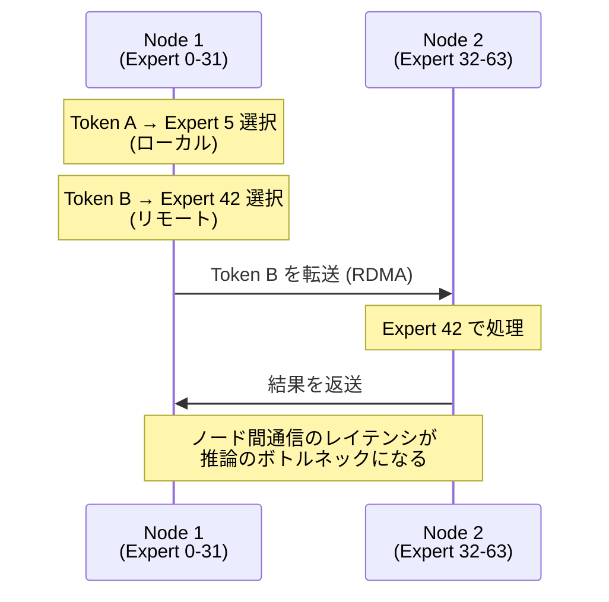

MoE の背景や詳細については割愛します。( ´･ω･)⊃ ｽｯ https://arxiv.org/html/2507.11181v2

:::message
大規模言語モデルの性能向上にはパラメータ数増加が必要であり MoE は総パラメータ数を増やしながら推論時には一部の Expert のみを選択的に利用することで計算コストを抑えます。

**本記事では、MoE の仕組みを理解し、PyTorch で SimpleMoE を実装して動作を確認します。**
:::

Large Scale MoE 推論の理解のための記事の第一弾です。以下の記事を読んでそっ閉じしたのが悲しいのでちゃんと学びます ﾟ(ﾟ`ω´ ﾟ)ﾟ

https://research.perplexity.ai/articles/enabling-trillion-parameter-models-on-aws-efa


## MoE の基本構造

### Dense FFN から MoE への変換

従来の Transformer では、各レイヤーに **Dense Feed-Forward Network (FFN)** が含まれます。MoE は、この Dense FFN を **複数の Expert FFN** に置き換えたものです。


*図: MoE Transformer Encoder の構造（出典: Hugging Face）*

**Dense FFN**:

$$y = W_2 \cdot \text{ReLU}(W_1 \cdot x)$$

すべての入力トークンが同じパラメータ $W_1$, $W_2$ を通過します。

**MoE FFN**:

$$y = \sum_{i=1}^{n} G(x)_i \cdot \text{Expert}_i(x)$$

各トークンは、Router `G(x)` が選択した一部の Expert のみを通過します。これを **Sparse Activation**（疎活性化）と呼びます。

## 3 つの主要コンポーネント

MoE レイヤーは以下の 3 つのコンポーネントで構成されます。


*図: Switch Transformer の MoE レイヤー（出典: Hugging Face）*

### 1. Router（ゲート関数）

Router は、各入力トークンに対して「どの Expert を使うべきか」を決定します。

#### 基本的な Gating 関数

$$G(x) = Softmax(x \cdot W_g)$$

- 入力: トークンの埋め込みベクトル $x$ (shape: `[hidden_dim]`)
- 出力: 各 Expert への確率分布 $G(x)$ (shape: `[num_experts]`)

#### Noisy Top-K Gating（Shazeer et al. 2017 で導入）

実際の実装では、ノイズを加えて Expert 選択を多様化します。Switch Transformers (2021) は、この手法を K=1 に簡略化した Router を採用しています。

**ステップ 1: ノイズを追加**

$$H(x)_i = (x \cdot W_g)_i + StandardNormal() \cdot Softplus((x \cdot W_{noise})_i)$$

**ステップ 2: Top-K を選択**

$$
\text{KeepTopK}(v, k)_i = \begin{cases}
v_i & \text{if } v_i \text{ is in the top } k \text{ elements of } v \\
-\infty & \text{otherwise}
\end{cases}
$$

**ステップ 3: Softmax で正規化**

$$
G(x) = \text{Softmax}(\text{KeepTopK}(H(x), k))
$$

ノイズにより、訓練中に Expert の選択が偏るのを防ぎ、すべての Expert が均等に学習されます。

### 2. Expert（専門家ネットワーク）

Expert は通常、Dense FFN と同じ構造の Feed-Forward Network です。

```python
class Expert(nn.Module):
    def __init__(self, input_dim, hidden_dim, output_dim):
        super().__init__()
        self.fc1 = nn.Linear(input_dim, hidden_dim)
        self.fc2 = nn.Linear(hidden_dim, output_dim)
    
    def forward(self, x):
        return self.fc2(F.relu(self.fc1(x)))
```

MoE レイヤーには N 個の Expert があり、それぞれ独立したパラメータを持ちます。訓練を通じて、各 Expert は異なる種類の入力パターンを専門化します。


*図: Expert の専門化の様子（出典: Hugging Face）*

### 3. Top-K 選択と Combine

Router の出力から上位 K 個の Expert を選択し、それらの出力を重み付き合成します。

$$
y = \sum_{i \in \text{Top-K}} G(x)_i \cdot \text{Expert}_i(x)
$$

### Dense モデルとの比較

| 項目 | Dense モデル | MoE モデル (K=2, E=8) |
|------|------------|-----------------|
| 総パラメータ数 | N | N × E（E = Expert 数）|
| Active パラメータ数 | N | N × K |
| 計算コスト（FLOPs）| O(N) | O(N × K) |
| パラメータ効率 | 1x | **E / K 倍 = 4.0x** |
| VRAM 要件（推論）| N | N × E（全 Expert を常時保持） |

**注** N は MoE レイヤーの FFN 部分のパラメータ数。Attention 層などの共有パラメータは含まない。

:::message
8 Expert あって 2 Expert 使う場合、並列にうまく Expert に振り分ければスループット上げられるし、単に FLOPs（理論計算量）だけでなく並列化効率も重要じゃね？と思った方 
**=> 鋭い、Yes！ Expert Parallelism は今後まとめるのでそこで整理します。**

$$
\text{MoE} \neq \text{Expert Parallelism}
$$
:::

## Load Balancing と Auxiliary Loss

### Expert の不均衡問題

MoE の課題の一つは、**Expert の選択が不均衡になること**です。一部の「人気 Expert」にすべてのトークンが集中し、他の Expert が使われなくなると、以下の問題が発生します。

- 未使用 Expert のパラメータが無駄になる
- 人気 Expert にトークンが集中し、計算が並列化できない
- モデル全体の表現力が低下

### Auxiliary Loss による Load Balancing

この問題を解決するため、Switch Transformers では **Auxiliary Loss**（補助損失）を導入しています。

この損失の捉え方

1. **Expert 使用頻度の分散を減らす**: 不均衡な分布を抑制
2. **エントロピーの最大化**: 均等分布に近づける（最大エントロピー状態）
3. **KL divergence の最小化**: 実際の分布と均等分布の差を小さくする

$$
\mathcal{L}_{\text{aux}} = E \sum_{i=1}^{E} P_i \cdot f_i
$$

- $P_i$: Expert $i$ への平均ルーティング確率
- $f_i$: Expert $i$ が選択された割合
- 両方が大きい（人気 Expert）にペナルティ
- 均等分布で値 1、不均衡で増加する傾向

これにより、Router は均等分布に近づくよう学習され、全 Expert が活用されるようになります。


```python
# 疑似コード: Auxiliary Loss の計算
def auxiliary_loss(routing_weights, num_experts):
    """
    routing_weights: (batch_size, seq_len, num_experts)
    """
    # 各 Expert への平均ルーティング確率
    mean_routing = routing_weights.mean(dim=[0, 1])  # (num_experts,)
    
    # 各 Expert が選択された割合
    selected_count = (routing_weights.argmax(dim=-1) == torch.arange(num_experts).view(1, 1, -1)).float()
    fraction_selected = selected_count.mean(dim=[0, 1])  # (num_experts,)
    
    # Auxiliary Loss: 均等に分散させるためのペナルティ
    aux_loss = num_experts * (mean_routing * fraction_selected).sum()
    
    return aux_loss

# 全体の損失に追加
total_loss = language_modeling_loss + lambda_aux * auxiliary_loss
```

**Auxiliary Loss の効果**
- 各 Expert への割り当てが均等になるように促す
- 未使用 Expert を減らし、モデル全体の容量を活用
- 通常、`lambda_aux = 0.01` 程度の小さな係数で追加

## Expert Capacity の概念

### Capacity Factor とは

MoE では、各 Expert が処理できるトークン数に上限（Capacity）を設定します。これにより、一部の Expert にトークンが集中しても、メモリ使用量を制御できます。

**Expert Capacity の計算式**
```
Expert Capacity = (tokens per batch / number of experts) × capacity factor
```

**例**
- バッチ内トークン数: 1024
- Expert 数: 8
- Capacity factor: 1.25

```
Expert Capacity = (1024 / 8) × 1.25 = 160 tokens
```

各 Expert は最大 160 トークンまで処理できます。Capacity を超えたトークンは、次に高い確率の Expert に送られるか、スキップされます。

## SimpleMoE の実装

ここでは、MoE の基本的な動作を理解するための教育用実装 **SimpleMoE** を PyTorch で実装します。

:::message alert
**注**: SimpleMoE は教育目的の簡略版です。以下の点で本番実装と異なります。
- **全 Expert の出力を計算**: Top-K で選択された Expert だけでなく全 Expert を計算するため、**計算コスト削減効果はありません**（Dense FFN の E 倍の計算コスト）
- Noisy Gating、Auxiliary Loss、Expert Capacity、未実装
- 分散推論未対応（すべての Expert を単一デバイスで計算）

EfficientMoE は Top-K で選択された Expert 計算を SimpleMoE に追加したものです。

実際の本番環境では、vLLM、DeepSpeed-MoE、Megatron-LM などのフレームワークを使用してください。
:::

### SimpleMoE クラスの実装

上で説明したものがコードになっているだけです。

```python
import torch
import torch.nn as nn
import torch.nn.functional as F

class Expert(nn.Module):
    """単一の Expert (Feed-Forward Network)"""
    def __init__(self, input_dim, hidden_dim, output_dim):
        super().__init__()
        self.fc1 = nn.Linear(input_dim, hidden_dim)
        self.fc2 = nn.Linear(hidden_dim, output_dim)
    
    def forward(self, x):
        return self.fc2(F.relu(self.fc1(x)))

class SimpleMoE(nn.Module):
    """Mixture-of-Experts レイヤー（教育用簡略版）"""
    def __init__(self, input_dim, hidden_dim, output_dim, num_experts=8, top_k=2):
        super().__init__()
        self.num_experts = num_experts
        self.top_k = top_k
        
        # Router (ゲート関数) - 基本的な線形変換のみ
        self.gate = nn.Linear(input_dim, num_experts)
        
        # Expert の配列
        self.experts = nn.ModuleList([
            Expert(input_dim, hidden_dim, output_dim)
            for _ in range(num_experts)
        ])
    
    def forward(self, x):
        """
        Args:
            x: 入力テンソル (batch_size, seq_len, input_dim)
        Returns:
            output: 出力テンソル (batch_size, seq_len, output_dim)
            routing_weights: ルーティング重み (batch_size, seq_len, num_experts)
            selected_experts: 選択された Expert のインデックス (batch_size, seq_len, top_k)
        """
        batch_size, seq_len, input_dim = x.shape
        
        # Router で各 Expert への重みを計算
        gate_logits = self.gate(x)  # (batch_size, seq_len, num_experts)
        routing_weights = F.softmax(gate_logits, dim=-1)
        
        # Top-K Expert を選択
        top_k_weights, top_k_indices = torch.topk(routing_weights, self.top_k, dim=-1)
        # 選択された Expert の重みを正規化
        top_k_weights = top_k_weights / top_k_weights.sum(dim=-1, keepdim=True)
        
        # 各 Expert の出力を計算
        # NOTE: 教育目的のため全 Expert の出力を計算しています。
        # 実際の MoE 実装（vLLM、DeepSpeed など）では、Top-K で選択された Expert のみを計算します。
        expert_outputs = torch.stack([expert(x) for expert in self.experts], dim=2)
        # (batch_size, seq_len, num_experts, output_dim)
        
        # Top-K Expert の出力を重み付き合算
        output = torch.zeros(batch_size, seq_len, expert_outputs.shape[-1], device=x.device)
        for k in range(self.top_k):
            expert_idx = top_k_indices[:, :, k]  # (batch_size, seq_len)
            weight = top_k_weights[:, :, k].unsqueeze(-1)  # (batch_size, seq_len, 1)
            
            # 選択された Expert の出力を取得
            selected_output = torch.gather(
                expert_outputs,
                2,
                expert_idx.unsqueeze(-1).unsqueeze(-1).expand(-1, -1, -1, expert_outputs.shape[-1])
            ).squeeze(2)
            
            output += weight * selected_output
        
        return output, routing_weights, top_k_indices
```

### デモコードの実行

完全なデモコード（パラメータ統計、計算効率比較、Top-K 比較を含む）は以下にあります。

:::message alert
以下を展開してコピペ・実行してください。
:::

::::details デモコード
```python
cat << 'EOF' > simple_moe.py
"""
SimpleMoE (Mixture-of-Experts) の実装と計算効率比較

このスクリプトは、PyTorch で MoE レイヤーを実装し、
SimpleMoE（全 Expert 計算）と EfficientMoE（Top-K のみ計算）の
計算効率の違いを実測します。

実行環境: Python 3.10+, PyTorch 2.x
GPU 不要（CPU のみで動作）

使い方:
    python simple_moe.py
"""

import torch
import torch.nn as nn
import torch.nn.functional as F
import time

class Expert(nn.Module):
    """単一の Expert (Feed-Forward Network)"""
    def __init__(self, input_dim, hidden_dim, output_dim):
        super().__init__()
        self.fc1 = nn.Linear(input_dim, hidden_dim)
        self.fc2 = nn.Linear(hidden_dim, output_dim)

    def forward(self, x):
        return self.fc2(F.relu(self.fc1(x)))

class SimpleMoE(nn.Module):
    """Mixture-of-Experts レイヤー"""
    def __init__(self, input_dim, hidden_dim, output_dim, num_experts=8, top_k=2):
        super().__init__()
        self.num_experts = num_experts
        self.top_k = top_k

        # Router (ゲート関数)
        self.gate = nn.Linear(input_dim, num_experts)

        # Expert の配列
        self.experts = nn.ModuleList([
            Expert(input_dim, hidden_dim, output_dim)
            for _ in range(num_experts)
        ])

    def forward(self, x):
        """
        Args:
            x: 入力テンソル (batch_size, seq_len, input_dim)
        Returns:
            output: 出力テンソル (batch_size, seq_len, output_dim)
            routing_weights: ルーティング重み (batch_size, seq_len, num_experts)
            selected_experts: 選択された Expert のインデックス (batch_size, seq_len, top_k)
        """
        batch_size, seq_len, input_dim = x.shape

        # Router で各 Expert への重みを計算
        gate_logits = self.gate(x)  # (batch_size, seq_len, num_experts)
        routing_weights = F.softmax(gate_logits, dim=-1)

        # Top-K Expert を選択
        top_k_weights, top_k_indices = torch.topk(routing_weights, self.top_k, dim=-1)
        # 選択された Expert の重みを正規化
        top_k_weights = top_k_weights / top_k_weights.sum(dim=-1, keepdim=True)

        # 各 Expert の出力を計算
        # NOTE: 本実装では教育目的のため全 Expert の出力を計算しています。
        # 実際の MoE 実装（vLLM、DeepSpeed など）では、Top-K で選択された Expert のみを計算します。
        # 本番実装では if-else や conditional execution を使って選択された Expert だけを実行することで、
        # 計算コストを削減します。
        expert_outputs = torch.stack([expert(x) for expert in self.experts], dim=2)
        # (batch_size, seq_len, num_experts, output_dim)

        # Top-K Expert の出力を重み付き合計
        output = torch.zeros(batch_size, seq_len, expert_outputs.shape[-1], device=x.device)
        for k in range(self.top_k):
            expert_idx = top_k_indices[:, :, k]  # (batch_size, seq_len)
            weight = top_k_weights[:, :, k].unsqueeze(-1)  # (batch_size, seq_len, 1)

            # 選択された Expert の出力を取得
            selected_output = torch.gather(
                expert_outputs,
                2,
                expert_idx.unsqueeze(-1).unsqueeze(-1).expand(-1, -1, -1, expert_outputs.shape[-1])
            ).squeeze(2)

            output += weight * selected_output

        return output, routing_weights, top_k_indices


class EfficientMoE(nn.Module):
    """Mixture-of-Experts レイヤー（本番相当: Top-K のみ計算）"""
    def __init__(self, input_dim, hidden_dim, output_dim, num_experts=8, top_k=2):
        super().__init__()
        self.num_experts = num_experts
        self.top_k = top_k
        self.input_dim = input_dim
        self.output_dim = output_dim
        self.gate = nn.Linear(input_dim, num_experts)
        self.experts = nn.ModuleList([
            Expert(input_dim, hidden_dim, output_dim)
            for _ in range(num_experts)
        ])

    def forward(self, x):
        batch_size, seq_len, input_dim = x.shape
        gate_logits = self.gate(x)
        routing_weights = F.softmax(gate_logits, dim=-1)
        top_k_weights, top_k_indices = torch.topk(routing_weights, self.top_k, dim=-1)
        top_k_weights = top_k_weights / top_k_weights.sum(dim=-1, keepdim=True)
        
        output = torch.zeros(batch_size, seq_len, self.output_dim, device=x.device)
        for k in range(self.top_k):
            expert_idx = top_k_indices[:, :, k]
            weight = top_k_weights[:, :, k].unsqueeze(-1)
            unique_experts = expert_idx.unique()
            
            for e_idx in unique_experts:
                mask = (expert_idx == e_idx)
                if mask.any():
                    batch_indices, seq_indices = torch.where(mask)
                    selected_tokens = x[batch_indices, seq_indices]
                    expert_output = self.experts[e_idx.item()](selected_tokens)
                    output[batch_indices, seq_indices] += weight[batch_indices, seq_indices] * expert_output
        
        return output, routing_weights, top_k_indices


class DenseFFN(nn.Module):
    """Dense Feed-Forward Network（ベースライン）"""
    def __init__(self, input_dim, hidden_dim, output_dim):
        super().__init__()
        self.fc1 = nn.Linear(input_dim, hidden_dim)
        self.fc2 = nn.Linear(hidden_dim, output_dim)

    def forward(self, x):
        return self.fc2(F.relu(self.fc1(x)))


def compare_implementations(input_dim, hidden_dim, output_dim, num_experts, top_k):
    """SimpleMoE vs EfficientMoE vs Dense FFN の比較"""
    print("\n[DEMO 2] 実装方式別の計算効率比較")
    print("=" * 60)

    batch_size = 4
    seq_len = 16
    x = torch.randn(batch_size, seq_len, input_dim)

    simple_moe = SimpleMoE(input_dim, hidden_dim, output_dim, num_experts, top_k)
    efficient_moe = EfficientMoE(input_dim, hidden_dim, output_dim, num_experts, top_k)
    dense_ffn = DenseFFN(input_dim, hidden_dim, output_dim)

    simple_params = sum(p.numel() for p in simple_moe.parameters())
    efficient_params = sum(p.numel() for p in efficient_moe.parameters())
    dense_params = sum(p.numel() for p in dense_ffn.parameters())

    print("\nパラメータ数:")
    print(f"  Dense FFN:       {dense_params:>12,}")
    print(f"  SimpleMoE:       {simple_params:>12,}  ({simple_params / dense_params:.2f}x)")
    print(f"  EfficientMoE:    {efficient_params:>12,}  ({efficient_params / dense_params:.2f}x)")

    print("\n推論時間（CPU、100回平均、ms）:")
    with torch.no_grad():
        start = time.time()
        for _ in range(100):
            _ = dense_ffn(x)
        dense_time = (time.time() - start) * 10

        start = time.time()
        for _ in range(100):
            _ = simple_moe(x)
        simple_time = (time.time() - start) * 10

        start = time.time()
        for _ in range(100):
            _ = efficient_moe(x)
        efficient_time = (time.time() - start) * 10

    print(f"  Dense FFN:       {dense_time:>8.2f} ms  (baseline)")
    print(f"  SimpleMoE:       {simple_time:>8.2f} ms  ({simple_time / dense_time:.2f}x)")
    print(f"  EfficientMoE:    {efficient_time:>8.2f} ms  ({efficient_time / dense_time:.2f}x)")

    print("\n[解説]")
    print("  - SimpleMoE は全 8 Expert を計算するため、Dense FFN の約 8 倍の計算コスト")
    print("  - EfficientMoE は Top-2 のみ計算するが、CPU ではループ/マスク処理のオーバーヘッドで遅い")
    print("  - GPU + Triton カーネル最適化により、EfficientMoE は理論値（2.0x）に近づきます")


def calculate_active_parameters(model):
    """Active Parameters の計算"""
    print("\n[DEMO 1] Active Parameters の計算")
    print("=" * 60)

    # 総パラメータ数
    total_params = sum(p.numel() for p in model.parameters())

    # Router のパラメータ数
    gate_params = sum(p.numel() for p in model.gate.parameters())

    # 単一 Expert のパラメータ数
    expert_params = sum(p.numel() for p in model.experts[0].parameters())

    # Active パラメータ数（Router + Top-K Expert）
    active_params = gate_params + expert_params * model.top_k

    # パラメータ効率
    efficiency = total_params / active_params

    print("\nパラメータ統計:")
    print(f"  総パラメータ数:         {total_params:>12,}")
    print(f"  Router パラメータ数:    {gate_params:>12,}")
    print(f"  単一 Expert パラメータ数: {expert_params:>12,}")
    print(f"  Active パラメータ数:    {active_params:>12,}")
    print(f"  パラメータ効率:         {efficiency:>12.2f}x")
    print(f"\n  → Dense モデルと同じ計算コストで {efficiency:.2f} 倍のパラメータを活用")


def compare_top_k_values(input_dim, hidden_dim, output_dim, num_experts):
    """Top-K 値を変えた比較実験"""
    print("\n[DEMO 3] Top-K 値を変えた比較")
    print("=" * 60)

    top_k_values = [1, 2, 4, 8]
    batch_size = 4
    seq_len = 16
    x = torch.randn(batch_size, seq_len, input_dim)

    print(f"\n{'Top-K':<10} {'Active Params':<18} {'効率':<10} {'推論時間(ms)':<15}")
    print("-" * 65)

    for k in top_k_values:
        model_k = SimpleMoE(input_dim, hidden_dim, output_dim, num_experts, top_k=k)

        # Active パラメータ数を計算
        gate_params = sum(p.numel() for p in model_k.gate.parameters())
        expert_params = sum(p.numel() for p in model_k.experts[0].parameters())
        active_params = gate_params + expert_params * k
        total_params = sum(p.numel() for p in model_k.parameters())
        efficiency = total_params / active_params

        # 推論時間を測定
        with torch.no_grad():
            start = time.time()
            for _ in range(100):
                _ = model_k(x)
            elapsed = (time.time() - start) * 10  # ms per inference

        print(f"{k:<10} {active_params:<18,} {efficiency:<10.2f}x {elapsed:<15.2f}")


def main():
    print("=" * 60)
    print("SimpleMoE (Mixture-of-Experts) デモ")
    print("=" * 60)

    # ハイパーパラメータ
    input_dim = 512
    hidden_dim = 2048
    output_dim = 512
    num_experts = 8
    top_k = 2

    # モデルのインスタンス化
    model = SimpleMoE(input_dim, hidden_dim, output_dim, num_experts, top_k)
    print(f"\nSimpleMoE モデルを作成しました")
    print(f"  - 入力次元:    {input_dim}")
    print(f"  - 隠れ層次元:  {hidden_dim}")
    print(f"  - 出力次元:    {output_dim}")
    print(f"  - Expert 数:   {num_experts}")
    print(f"  - Top-K:       {top_k}")

    # デモ 1: Active Parameters の計算
    calculate_active_parameters(model)

    # デモ 2: 実装方式別の計算効率比較
    compare_implementations(input_dim, hidden_dim, output_dim, num_experts, top_k)

    # デモ 3: EfficientMoE の Top-K 値別比較
    compare_top_k_values(input_dim, hidden_dim, output_dim, num_experts)

    print("\n" + "=" * 80)
    print("デモ完了！")
    print("=" * 60)


if __name__ == "__main__":
    main()

EOF
```
::::

### EfficientMoE の実装

SimpleMoE は全 Expert を計算するため、計算コストの削減を実現していません。EfficientMoE では、**選択された Expert のみを計算する EfficientMoE** を追加実装します。

```python
class EfficientMoE(nn.Module):
    """Mixture-of-Experts レイヤー（本番相当: 選択された Expert のみ計算）"""
    def __init__(self, input_dim, hidden_dim, output_dim, num_experts=8, top_k=2):
        super().__init__()
        self.num_experts = num_experts
        self.top_k = top_k
        self.input_dim = input_dim
        self.output_dim = output_dim
        self.gate = nn.Linear(input_dim, num_experts)
        self.experts = nn.ModuleList([
            Expert(input_dim, hidden_dim, output_dim)
            for _ in range(num_experts)
        ])

    def forward(self, x):
        batch_size, seq_len, input_dim = x.shape
        
        # Router で各 Expert への重みを計算
        gate_logits = self.gate(x)
        routing_weights = F.softmax(gate_logits, dim=-1)
        
        # Top-K Expert を選択
        top_k_weights, top_k_indices = torch.topk(routing_weights, self.top_k, dim=-1)
        top_k_weights = top_k_weights / top_k_weights.sum(dim=-1, keepdim=True)
        
        # 選択された Expert のみ計算（本番 MoE 相当）
        output = torch.zeros(batch_size, seq_len, self.output_dim, device=x.device)
        
        for k in range(self.top_k):
            expert_idx = top_k_indices[:, :, k]
            weight = top_k_weights[:, :, k].unsqueeze(-1)
            
            # この Top-K スロットで選択された Expert の unique なインデックス
            unique_experts = expert_idx.unique()
            
            for e_idx in unique_experts:
                # このバッチ内でこの Expert が選択されたトークンのマスク
                mask = (expert_idx == e_idx)
                if mask.any():
                    # マスクで選択されたトークンのみを抽出
                    batch_indices, seq_indices = torch.where(mask)
                    selected_tokens = x[batch_indices, seq_indices]
                    
                    # この Expert で計算（選択されたトークンのみ）
                    expert_output = self.experts[e_idx.item()](selected_tokens)
                    
                    # 結果を元の位置に書き戻す
                    output[batch_indices, seq_indices] += weight[batch_indices, seq_indices] * expert_output
        
        return output, routing_weights, top_k_indices
```

**SimpleMoE と EfficientMoE の違い**

| 実装 | Expert 計算回数 | 計算コスト FLOPs 理論値（Dense FFN=1.0x） | パラメータ効率 |
|------|---------------|--------------------------|-------------|
| SimpleMoE | 全 8 Expert | 8.0x | 4.0x (E/K) |
| EfficientMoE | Top-2 のみ | 2.0x | 4.0x (E/K) |

SimpleMoE は `torch.stack([expert(x) for expert in self.experts])` で全 Expert を一度に計算し、後から Top-K を選択します。EfficientMoE は Top-K で選択された Expert のみを実行します。

### デモコードの実行

```bash
# いい感じで環境構築してください。
python3 simple_moe.py
```

**実行結果の例**:

```
================================================================================
SimpleMoE (Mixture-of-Experts) デモ
================================================================================

SimpleMoE モデルを作成しました
  - 入力次元:    512
  - 隠れ層次元:  2048
  - 出力次元:    512
  - Expert 数:   8
  - Top-K:       2

[DEMO 1] Active Parameters の計算
============================================================

パラメータ統計:
  総パラメータ数:             16,801,800
  Router パラメータ数:             4,104
  単一 Expert パラメータ数:     2,099,712
  Active パラメータ数:         4,203,528
  パラメータ効率:                   4.00x

  [注意] 本実装は教育用のため全 8 Expert を計算しています（計算コスト 8.0x）
  本番 MoE 実装（Top-2 のみ計算）では計算コスト 2.0x で
  4.00 倍のパラメータを活用できます

[DEMO 2] 実装方式別の計算効率比較
================================================================================

SimpleMoE, EfficientMoE, Dense FFN の 3 方式で推論時間を比較します
SimpleMoE  : 全 Expert を計算（教育用実装）
EfficientMoE: Top-K Expert のみ計算（本番相当）
Dense FFN  : 単一 FFN（ベースライン）

実装方式            FFN計算回数    実測時間比(CPU)      推論時間(ms)       
--------------------------------------------------------------------------------
Dense FFN       1               1.0x            0.83           
SimpleMoE       8 (全Expert)     10.0x           8.30           
EfficientMoE    2 (Top-2)       22.5x           18.69

注: 実測時間比はCPU実装のオーバーヘッドを含む。理論的FLOPs比はSimpleMoE=8.0x、EfficientMoE=2.0x          

================================================================================
[重要な観察]
  - SimpleMoE は全 8 Expert を計算するため、Dense FFN の約 10.0 倍の時間
  - EfficientMoE は CPU 実装でループ・マスク処理のオーバーヘッドが大きく、約 22.5 倍
  - 本番環境（GPU + Triton カーネル）では EfficientMoE は Dense FFN の約 2 倍になる
  - MoE の計算効率は GPU での最適化された実装で初めて実現されます
================================================================================

[DEMO 3] EfficientMoE の Top-K 値別比較
================================================================================

Top-K      Active Params      効率           推論時間(ms)       
--------------------------------------------------------------------------------
1          2,103,816          7.99        x 7.84           
2          4,203,528          4.00        x 16.04          
4          8,402,952          2.00        x 54.33          
8          16,801,800         1.00        x 62.97          

================================================================================
[観察]
  - Top-K を増やすと Active パラメータ数が増加（パラメータ効率は低下）
  - Top-K を増やすと推論時間も増加（計算コストが増加）
  - Top-K=1 が最も効率的だが、精度とのトレードオフがある
================================================================================
```

:::message alert
**CPU 実装の制約**: 本デモは教育目的の CPU 実装です。EfficientMoE のループとマスク処理のオーバーヘッドが大きく、SimpleMoE より遅くなっています。

**本番環境での違い**: GPU + Triton カーネルでの本番実装では、以下のように最適化されます。

- Expert を条件付き実行（if-else ではなく GPU カーネルレベル）
- トークンを Expert ごとにグループ化してバッチ処理
- メモリアクセスパターンを最適化

本番環境では EfficientMoE は Dense FFN の約 K 倍（K=2 なら 2 倍）の計算コストになります。
:::

### 計算コスト分析

MoE の利点を正しく理解するため、「パラメータ効率」と「計算コスト」を区別して整理します。

#### FLOPs の比較

単一 Expert の FLOPs（1 トークンあたり）を計算します。

```
input_dim = 512, hidden_dim = 2048, output_dim = 512

Expert FFN の FLOPs（1 トークン）:
  fc1: 512 × 2048 × 2 = 2,097,152 FLOPs
  fc2: 2048 × 512 × 2 = 2,097,152 FLOPs
  合計: 4,194,304 FLOPs/token
```

各実装の計算コストを比較します。

| 実装 | Expert FFN 計算回数 | 計算コスト (FLOPs) | 相対コスト (Dense=1.0x) | パラメータ効率 | VRAM 要件 |
|------|-------------------|------------------|----------------------|-------------|----------|
| Dense FFN | 1 | 4,194,304 | 1.0x | 1.0x | N |
| SimpleMoE (教育用) | 8 | 33,554,432 | 8.0x | 4.0x | N × 8 |
| EfficientMoE (Top-2) | 2 | 8,388,608 | 2.0x | 4.0x | N × 8 |
| 理想的 MoE (Top-1) | 1 | 4,194,304 | 1.0x | 8.0x | N × 8 |

**重要なポイント**

1. **SimpleMoE は全 Expert を計算するため、計算コストは Dense の 8 倍**。MoE の計算効率の利点を実装していない
2. **EfficientMoE は Top-K Expert のみを計算するため、計算コストは Dense の K 倍**（K=2 なら 2 倍）
3. **パラメータ効率は E/K 倍**（E=8, K=2 なら 4 倍）。これは SimpleMoE と EfficientMoE で同じ
4. **VRAM は全 Expert を保持するため、Dense の E 倍必要**（SimpleMoE も EfficientMoE も同じ）

## 分散推論の課題

SimpleMoE をローカル環境で実行する場合は問題ありませんが、トリリオンパラメータ規模の MoE を推論する場合、以下の課題が発生します。

### 1. メモリ容量の制約

:::message
単一の GPU では全 Expert を保持できません。
:::

**具体例: DeepSeek V3 (671B)**

- 総 Expert 数: 257（256 Routed + 1 Shared）
- 総メモリ要件:
  - FP16: 671B × 2 bytes = 約 1,342GB
  - FP8（Mixed Precision）= 約 671GB

DeepSeek V3 は FP8 Mixed Precision トレーニングを採用しており、実際の推論では FP8 または量子化版が使用されます。

H100 GPU (80GB HBM) 1 枚では全パラメータを保持できないため、**複数ノードに Expert を分散配置**する必要があります。

### 2. ノード間通信のオーバーヘッド

:::message
入力トークンが別ノードの Expert にルーティングされる場合、ノード間通信が発生します。
:::



**課題**
- ネットワークレイテンシ（数十マイクロ秒）が累積
- トークン単位の小メッセージを大量に送信（従来の All-Reduce に不向き）

### 3. Expert の不均衡な負荷

:::message
Load Balancing が完璧でない場合、一部の Expert（人気 Expert）にトークンが集中し、並列化の効率が低下します。
:::

## まとめ

MoE 推論についてふんわり理解しました。今回の記事は「分散推論の課題」を今後深掘りするための背景的な解説記事です。次回以降の記事では、1. **TransferEngine**: EFA の制約を克服する RDMA 通信ライブラリ、**DeepEP**: Expert Parallelism の最適化、など初見でそっ閉じした内容を整理していきます。 ﾟ(ﾟ`ω´ ﾟ)ﾟ

**参考文献**

- [Mixture of Experts Explained - Hugging Face](https://huggingface.co/blog/moe)
- [Switch Transformers: Scaling to Trillion Parameter Models with Simple and Efficient Sparsity](https://arxiv.org/abs/2101.03961)
- [GShard: Scaling Giant Models with Conditional Computation and Automatic Sharding](https://arxiv.org/abs/2006.16668)
- [Mixtral of Experts](https://arxiv.org/abs/2401.04088)
- [DeepSeek V3 Technical Report](https://arxiv.org/abs/2412.19437)
- [Outrageously Large Neural Networks: The Sparsely-Gated Mixture-of-Experts Layer](https://arxiv.org/abs/1701.06538)