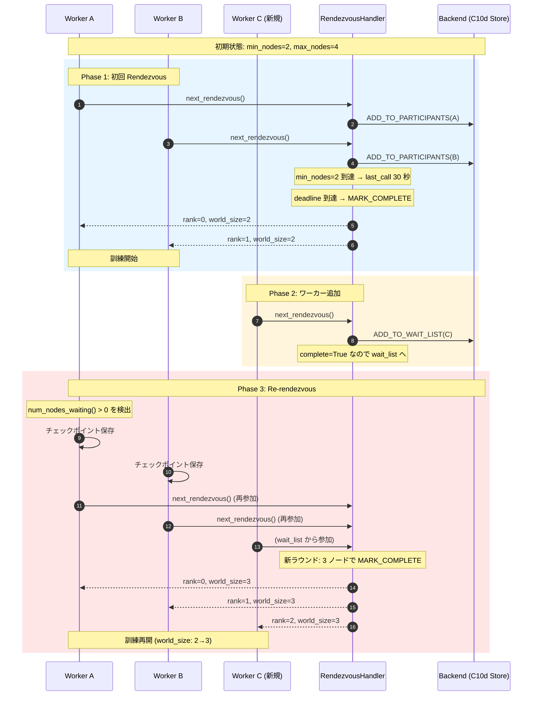
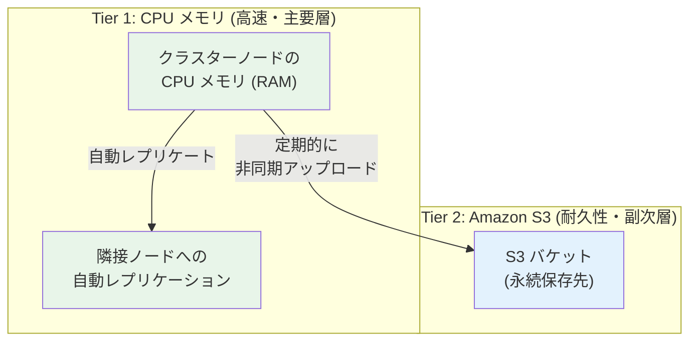
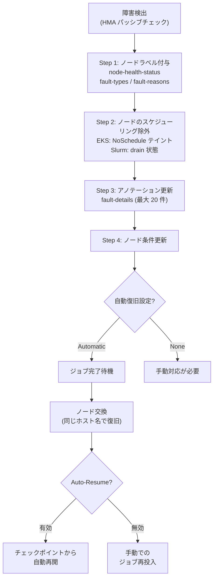
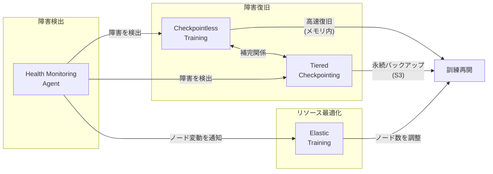

## はじめに

Amazon SageMaker HyperPod は、大規模分散訓練のためのマネージドコンピューティングクラスターサービスである。2024 年の re: Invent を含む一連のアップデートで、以下の 4 つの主要機能が発表された。

1. **Checkpointless Training** -- チェックポイントを書き込まずに障害から復旧する革新的な耐障害性メカニズム
2. **Elastic Training** -- クラスター容量に応じてノード数を動的に増減する弾力的訓練
3. **Managed Tiered Checkpointing** -- CPU メモリと S3 の 2 階層を活用した高速チェックポイント
4. **HyperPod Health Monitoring Agent** -- GPU/Trainium/EFA の常時監視と自動障害復旧

これらの機能は、大規模訓練における 3 つの課題を解決する。

| 課題 | 従来のアプローチ | HyperPod 2024 のソリューション |
|------|----------------|-------------------------------|
| ハードウェア障害による訓練中断 | 定期的なチェックポイント保存 + 手動復旧 | Checkpointless Training + Health Monitoring Agent |
| チェックポイントの I/O ボトルネック | S3 への同期書き込み | Managed Tiered Checkpointing |
| リソースの非効率な利用 | 固定ノード数での運用 | Elastic Training |

本記事では、各機能の実装メカニズムをソースコードレベルで分析し、実践的なコード例とともに解説する。

:::message
本記事は 2024 年末時点の情報に基づいています。AWS サービスは頻繁にアップデートされるため、最新の仕様は公式ドキュメントを参照してください。
:::

:::message alert
本記事は公式ドキュメント、オープンソースコード、AWS の発表資料に基づく調査記事です。各機能の実装の詳細や実環境での挙動検証については、今後別の記事で深掘りする予定です。実際の導入にあたっては、必ず公式ドキュメントと最新の仕様を確認してください。
:::

---

## 1. Checkpointless Training

### 1.1 概要

Checkpointless Training は、**チェックポイントをストレージに書き込むことなく、障害から復旧する**機能である。従来の分散訓練では、障害復旧のために定期的にモデルの状態をストレージ（S3 や FSx）に書き込む必要があり、これが大きなオーバーヘッドとなっていた。

2,000 GPU 以上のクラスターにおいて、従来は 30 分から 1 時間かかっていた障害復旧が**数分以内に短縮**され、**95% 以上の goodput**（実効訓練時間の割合）を実現する。

現時点では **HyperPod EKS 環境限定**の機能であり、内部的には **NeMo Framework**（NeMo Toolkit 2.6.0rc0 + Megatron-Core）に依存している。公式サンプルで動作確認されているモデルは GPT OSS および Llama3 である。

### 1.2 4 つのイノベーション

Checkpointless Training は、以下の 4 つの技術コンポーネントで構成される。


#### (1) Optimized Collective Communication Initialization

分散訓練の起動時に行われる NCCL 集団通信の初期化処理を最適化する。従来はノード数に比例して初期化時間が増大していたが、効率的なトポロジ検出と通信パス設定により、大規模クラスターでも高速に初期化が完了する。

#### (2) Memory-Mapped Data Loading

訓練データの読み込みにメモリマップド I/O（mmap）を使用する。従来のファイルシステム経由のデータ読み込みと比較して、障害復旧後のデータパイプライン再構築が高速化される。データセットのインデックスと状態をメモリマップとして管理することで、中断したバッチの正確な位置から訓練を再開できる。

#### (3) In-Process Recovery

プロセスを再起動せずに、プロセス内部で訓練状態を復旧する機構である。従来の障害復旧では以下のステップが必要だった。

```text
[従来の復旧フロー]
1. 全プロセスの停止
2. 新規プロセスの起動
3. NCCL 集団通信の再初期化（数分）
4. チェックポイントのロード（数分〜数十分）
5. データパイプラインの再構築
6. 訓練再開

[In-Process Recovery]
1. 障害検出
2. 通信グループの再構成（プロセス内で完了）
3. メモリ内の状態から訓練再開
```

#### (4) Checkpointless Recovery

GPU メモリ内にモデル状態のレプリカを保持し、ノード障害時に他のノードのレプリカから復旧する。ストレージへの書き込みが完全に不要になるため、訓練のスループットが向上する。

```text
[レプリカ配置の概念図]

Node 0: [Model Shard 0] [Replica of Shard 1]
Node 1: [Model Shard 1] [Replica of Shard 0]
Node 2: [Model Shard 2] [Replica of Shard 3]
Node 3: [Model Shard 3] [Replica of Shard 2]

Node 1 が障害 → Node 0 が Shard 1 のレプリカから復旧
```

### 1.3 対応環境と制約

Checkpointless Training は以下の環境制約がある。

| 項目 | 詳細 |
|------|------|
| オーケストレーター | **EKS のみ**（Slurm 環境は公式サポート外） |
| フレームワーク | NeMo Toolkit 2.6.0rc0 + Megatron-Core 0.13.1 が必須 |
| サポートモデル | GPT OSS、Llama3（公式サンプルで確認済み） |
| インスタンスタイプ | ml.p5.48xlarge（H100）が推奨 |
| Kubernetes CRD | `HyperPodPyTorchJob` を使用（EKS Training Operator 1.2.0+ が必要） |

:::message alert
Checkpointless Training は NeMo Framework に強く依存しており、純粋な PyTorch や他のフレームワークでの利用は現時点ではサポートされていない。また EKS 環境限定であり、Slurm 環境での動作保証はない。
:::

### 1.4 導入方法

Checkpointless Training の有効化は、NeMo の YAML 設定と `HyperPodPyTorchJob` の構成を組み合わせて行う。

#### NeMo YAML 設定での有効化

```yaml
# NeMo 訓練設定ファイル (例: gpt_config.yaml)
model:
  # 分散オプティマイザの冗長インスタンス数
  # 各 Data Parallel グループ内でモデル状態の冗長コピーを保持
  num_distributed_optimizer_instances: 2
```

`num_distributed_optimizer_instances: 2` は、各 Data Parallel グループ内でオプティマイザ状態の冗長コピーを 2 つ保持する設定である。これにより、1 つのノードが障害を起こしても、もう 1 つのコピーから状態を復元できる。GPU メモリ使用量が 20-30% 増加する点に注意が必要である。

#### HyperPodPyTorchJob の起動コマンド

```yaml
# HyperPodPyTorchJob spec 内の containers.command 例
command:
  - "python"
  - "-u"
  - "/workspace/nemo/scripts/nlp_language_modeling/megatron_gpt_pretraining.py"
args:
  - "--config-path=/workspace/configs"
  - "--config-name=gpt_config"
```

#### 訓練スクリプトでの NeMo Callback 設定

```python
from nemo.collections.nlp.parts.megatron_trainer_builder import MegatronTrainerBuilder
from nemo.utils.exp_manager import exp_manager

# NeMo の訓練では、Checkpointless 関連の Callback が
# HyperPod 環境で自動的にロードされる:
# - CheckpointlessCallback: ステップごとのライフサイクル管理
# - CheckpointlessMegatronStrategy: 復旧方法の選択
# - CheckpointlessAutoResume: 従来のチェックポイントロードを遅延
```

:::message
Checkpointless Training は HyperPod の Managed Tiered Checkpointing と併用することが推奨される。Checkpointless Recovery は高速な復旧を実現するが、全ノードが同時に障害となるカタストロフィックな障害には対応できないため、定期的な永続チェックポイントも別途保存するべきである。
:::

:::message
上記のコード例は AWS 公式ドキュメントおよび公開リポジトリの情報に基づく。Checkpointless Training の内部実装は AWS のプロプライエタリコンポーネントであり、実際の SDK インターフェースは予告なく変更される可能性がある。最新の仕様は公式ドキュメントを参照されたい。
:::

### 1.5 パフォーマンス

AWS の発表によるパフォーマンス数値:

| メトリクス | 従来方式 | Checkpointless Training |
|-----------|---------|----------------------|
| 障害復旧時間 | 30-60 分 | 数分以内 |
| Goodput（2,000+ GPU） | 80-85% | 95%以上 |
| チェックポイント I/O | 訓練時間の 5-15% | ほぼゼロ |
| メモリオーバーヘッド | なし | レプリカ分（GPU メモリの一部） |

---

## 2. Elastic Training

### 2.1 概要

Elastic Training は、クラスターの容量変化に応じて訓練ジョブのノード数を**動的に増減**する機能である。ハードウェア障害でノードが減少した場合は自動的に縮小運転を継続し、新しいノードが利用可能になれば自動的にスケールアップする。

### 2.2 PyTorch Elastic との関係

HyperPod Elastic Training は、PyTorch Elastic（`torch.distributed.elastic`）を基盤技術として採用している。以下のレイヤー構成で動作する。

```text
Layer 4: ユーザーインターフェース
  hyp CLI / Python SDK (HyperPodPytorchJob クラス)
     |
Layer 3: Kubernetes リソース管理
  HyperPod Training Operator (aws-hyperpod namespace)
  HyperPodPyTorchJob CRD (sagemaker.amazonaws.com/v1)
     |
Layer 2: Pod 内部の分散訓練制御
  torchrun / torch.distributed.elastic.agent
  SimpleElasticAgent._invoke_run() ループ
     |
Layer 1: Rendezvous メカニズム
  DynamicRendezvousHandler
  C10dRendezvousBackend (TCPStore ベース)
```

HyperPod は、Kubeflow の `PyTorchJob`（`kubeflow.org/v1`）ではなく、独自の CRD を使用する点に注意が必要である。

| 項目 | Kubeflow PyTorchJob | HyperPod PyTorchJob |
|------|---|---|
| apiVersion | `kubeflow.org/v1` | `sagemaker.amazonaws.com/v1` |
| kind | `PyTorchJob` | `HyperPodPyTorchJob` |
| ElasticPolicy | `rdzvBackend` 等を手動指定 | Operator が自動管理 |
| レプリカ種別 | Master/Worker 分離 | 単一 ReplicaSpec（"pod"） |
| スケーリング | ユーザー管理 | Operator による自動管理 |

### 2.3 HyperPodPyTorchJob CRD の仕様

HyperPod Elastic Training のジョブは、以下の CRD で定義される。

```yaml
apiVersion: sagemaker.amazonaws.com/v1
kind: HyperPodPyTorchJob
metadata:
  name: my-elastic-job
  namespace: my-namespace
spec:
  nprocPerNode: "8"
  replicaSpecs:
    - name: "pod"
      replicas: 4          # 初期ノード数
      maxReplicas: 8        # 最大ノード数
      template:
        spec:
          containers:
            - name: "pytorch-job-container"
              image: "my-registry/training: latest"
              resources:
                requests:
                  nvidia.com/gpu: 8
                limits:
                  nvidia.com/gpu: 8
          nodeSelector:
            node.kubernetes.io/instance-type: "ml.p5.48xlarge"
  elasticPolicy:
    minReplicas: 4
    maxReplicas: 8
    replicaIncrementStep: 2     # 2 ノード単位でスケーリング
    scalingTimeoutInSeconds: 300
    gracefulShutdownTimeoutInSeconds: 120
  runPolicy:
    cleanPodPolicy: "None"
    jobMaxRetryCount: 3
    restartPolicy:
      scaleUpSnoozeTimeInSeconds: 600  # 再起動後のスケールアップ抑止期間
```

#### ElasticPolicy の主要フィールド

| フィールド | 型 | 説明 |
|---|---|---|
| `minReplicas` | int | 最小レプリカ数（`node_count` と同値） |
| `maxReplicas` | int | 最大レプリカ数（`max_node_count` と同値） |
| `replicaIncrementStep` | int | ステップサイズ（例: 2 = 2 ノードずつ増減） |
| `replicaDiscreteValues` | list[int] | 離散的なレプリカ数（`replicaIncrementStep` と**相互排他**） |
| `scalingTimeoutInSeconds` | int | スケーリング操作のタイムアウト |
| `gracefulShutdownTimeoutInSeconds` | int | グレースフルシャットダウンのタイムアウト |
| `faultyScaleDownTimeoutInSeconds` | int | 障害 Pod のスケールダウンまでの待機時間 |

:::message alert
`replicaIncrementStep` と `replicaDiscreteValues` は同時に指定できない。バリデーションで明示的に排他チェックが行われる。
:::

### 2.4 Rendezvous メカニズム

Elastic Training の中核となる Rendezvous は、分散訓練に参加するワーカーの**合流・調整**メカニズムである。PyTorch Elastic の `DynamicRendezvousHandler` が以下のフローで動作する。



#### Rendezvous の状態管理

`_RendezvousState` が管理する主要なフィールド:

```python
class _RendezvousState:
    round: int                             # ラウンド番号
    complete: bool                         # Rendezvous 完了フラグ
    deadline: datetime | None              # last_call のデッドライン
    closed: bool                           # Rendezvous が閉じられたか
    participants: dict[_NodeDesc, int]      # 参加者 → rank マッピング
    wait_list: set[_NodeDesc]              # 次ラウンド待機リスト
    redundancy_list: set[_NodeDesc]        # max_nodes 超過時の冗長リスト
    last_heartbeats: dict[_NodeDesc, datetime]  # ハートビート時刻
```

状態管理は C10d Store（TCPStore）ベースのバックエンドで行われ、`compare_set()`（CAS: Compare-And-Swap）パターンによる楽観的ロックで一貫性が保証される。

#### ハートビートと死亡検出

| パラメータ | デフォルト値 | 説明 |
|---|---|---|
| `keep_alive_interval` | 5 秒 | ハートビート送信間隔 |
| `keep_alive_max_attempt` | 3 回 | 最大失敗回数 |
| **死亡検出までの最大遅延** | **15 秒** | 5 秒 x 3 回 |

### 2.5 Agent のメインループ

`SimpleElasticAgent._invoke_run()` が Elastic Training の中核ループとして動作する。

```python
# PyTorch Elastic: agent/server/api.py (簡略化)
def _invoke_run(self, role):
    self._initialize_workers(self._worker_group)  # 初回 Rendezvous + 起動

    while True:
        time.sleep(monitor_interval)
        run_result = self._monitor_workers(self._worker_group)
        state = run_result.state

        if state == WorkerState.SUCCEEDED:
            self._exit_barrier()
            return run_result

        elif state in {WorkerState.UNHEALTHY, WorkerState.FAILED}:
            if self._remaining_restarts > 0:
                self._remaining_restarts -= 1
                self._restart_workers(self._worker_group)  # Re-rendezvous
            else:
                self._stop_workers(self._worker_group)
                return run_result

        elif state == WorkerState.HEALTHY:
            # [重要] wait_list に新ノードがいるか確認
            num_nodes_waiting = rdzv_handler.num_nodes_waiting()
            if num_nodes_waiting > 0:
                self._restart_workers(self._worker_group)
```

このループにより、ワーカーの障害検出と新規ワーカーの参加検出の両方が自動的に処理される。

### 2.6 CLI によるジョブ作成

HyperPod CLI（`hyp`）を使用して Elastic Training ジョブを作成する。

```bash
hyp create hyp-pytorch-job \
  --job-name my-elastic-job \
  --image my-registry/training: latest \
  --node-count 4 \
  --max-node-count 8 \
  --instance-type ml.p5.48xlarge \
  --tasks-per-node 8 \
  --elastic-replica-increment-step 2 \
  --elastic-scaling-timeout-in-seconds 300 \
  --elastic-graceful-shutdown-timeout-in-seconds 120 \
  --elastic-scale-up-snooze-time-in-seconds 600
```

CLI は内部で以下の変換を行う。

```text
CLI パラメータ                     CRD フィールド
--node-count 4              →   replicaSpecs[0].replicas = 4
                                elasticPolicy.minReplicas = 4
--max-node-count 8          →   replicaSpecs[0].maxReplicas = 8
                                elasticPolicy.maxReplicas = 8
--elastic-replica-increment-step 2  →  elasticPolicy.replicaIncrementStep = 2
--instance-type ml.p5.48xlarge  →  nodeSelector + resources 自動計算
                                   (gpu:8, cpu:192, memory:2048Gi, efa:32)
```

::::details CLI の内部処理フロー（詳細）

CLI は以下の処理チェーンで CRD を生成する。

```text
1. Click コマンドパーサー (training.py)
   @generate_click_command デコレータが schema.json (v1.1) からオプションを動的生成

2. Pydantic バリデーション (v1_1/model.py)
   - validate_elastic_replica_config(): increment_step と discrete_values の排他チェック
   - validate_tasks_per_node(): "auto"/"cpu"/"gpu"/整数のみ許可

3. to_domain() 変換
   - node_count → replicas + minReplicas
   - max_node_count → maxReplicas (ReplicaSpec + ElasticPolicy 両方)
   - elastic_* パラメータ → ElasticPolicy オブジェクト

4. HyperPodPytorchJob.create()
   - allocate_quotas_if_applicable(): instance_type からリソース自動計算
   - CustomObjectsApi().create_namespaced_custom_object() で K8s API に送信
```

::::

### 2.7 スケーリング動作

#### スケールアップ（ノード追加）

```text
1. Operator が ElasticPolicy に基づき Pod を追加（step=2 なら 2 Pod ずつ）
2. 新 Pod で torchrun が起動 → next_rendezvous() を呼出
3. complete=True なので wait_list に追加
4. 既存 Agent が num_nodes_waiting() > 0 を検出
5. 全ワーカーが _restart_workers() → Re-rendezvous
6. 新しい world_size で訓練再開
```

#### スケールダウン（ノード離脱）

```text
1. ワーカー Pod が異常終了（ハードウェア障害等）
2. ハートビート送信が途絶
3. _sanitize() が 15 秒後に死亡ノードを検出
4. 残存ワーカーが NCCL 通信エラーを検出
5. チェックポイント保存
6. Re-rendezvous → 縮小した world_size で訓練再開
```

:::message alert
Re-rendezvous 時には**全ワーカープロセスが一時停止**する。これは数秒から数十秒の中断を伴うため、頻繁なスケーリングは訓練効率を低下させる。`scaleUpSnoozeTimeInSeconds` を適切に設定して、再起動直後のスケールアップを抑止することが重要である。
:::

---

## 3. Managed Tiered Checkpointing

### 3.1 概要

Managed Tiered Checkpointing は、チェックポイントの保存先を**階層化**することで、保存の高速化とコストの最適化を両立する機能である。

従来のチェックポイント保存では、全てのデータを直接 S3 に書き込んでいた。これは大規模モデル（数百 GB のパラメータ）では数分から数十分のブロッキング I/O を生じさせ、訓練のスループットを大幅に低下させていた。

### 3.2 階層化戦略

Managed Tiered Checkpointing は **2 つの階層**でチェックポイントを管理する。主要層としてクラスターノードの **CPU メモリ（RAM）**を使用し、副次層として **Amazon S3** に永続化する。



#### 各階層の特性

| 階層 | 保存先 | 速度 | 耐久性 | 用途 |
|------|--------|------|--------|------|
| Tier 1 | CPU メモリ（RAM） | 高速（GB/s） | ノード間レプリケーションで保護 | 高頻度保存・高速復旧 |
| Tier 2 | Amazon S3 | 低速（数百 MB/s） | 高耐久（99.999999999%） | 低頻度保存（永続バックアップ） |

#### レプリケーション戦略

Tier 1（CPU メモリ）に保存されたチェックポイントは、**隣接する計算ノード間で自動的にレプリケート**される。これにより、単一または複数のノード障害からデータを保護しながら、復旧操作のための高速アクセスを提供する。メモリ管理デーモン（Kubernetes DaemonSet として実装）がチェックポイント用の分散メモリを管理する。

:::message
`InstanceMemoryAllocationPercentage` パラメータで、チェックポイントストレージに割り当てるクラスターメモリの割合を設定できる（20-100% の範囲）。訓練に必要なメモリとのバランスを考慮して設定すること。
:::

### 3.3 非同期パイプライン

最大の特徴は、**訓練をブロックせずにチェックポイントを保存**できることである。PyTorch DCP（Distributed Checkpoint）の `async_save()` を使用して非同期保存を実現する。

```text
[従来方式: 同期チェックポイント]
訓練 ████████░░░░░░░░░░████████░░░░░░░░░░████████
チェック          ████████                ████████
                 (ブロック)              (ブロック)

[Tiered Checkpointing: 非同期パイプライン]
訓練 ████████████████████████████████████████████████
Tier1(RAM)  ▼(非同期メモリ保存)  ▼(非同期メモリ保存)
Tier2(S3)     ░░░░░░░░(S3 アップロード)
           ^^^^^^^^^^^^^^^^^^^^^^^^^^^^^^^^^^^^^^^^
           訓練は一切ブロックされない
```

### 3.4 実装と API

#### クラスターの構成

Managed Tiered Checkpointing を利用するには、クラスター作成時に `--tiered-storage-config` を有効化する必要がある。

```bash
aws sagemaker create-cluster \
    --cluster-name my-training-cluster \
    --orchestrator "Eks={ClusterArn=arn: aws: eks: us-west-2:123456789012: cluster/my-eks}" \
    --instance-groups '{
        "InstanceGroupName": "training-group",
        "InstanceType": "ml.p5.48xlarge",
        "InstanceCount": 4,
        "LifeCycleConfig": {
            "SourceS3Uri": "s3://my-bucket/lifecycle-scripts",
            "OnCreate": "on_create.sh"
        },
        "ExecutionRole": "arn: aws: iam::123456789012: role/MyRole",
        "InstanceStorageConfigs": [
            { "EbsVolumeConfig": {"VolumeSizeInGB": 500} }
        ]
    }' \
    --tiered-storage-config '{"Mode": "Enable"}'
```

無効化する場合:

```bash
aws sagemaker update-cluster \
    --cluster-name my-training-cluster \
    --tiered-storage-config '{"Mode": "Disable"}'
```

#### Python ライブラリ

専用の `amzn-sagemaker-checkpointing` ライブラリ（v1.1.2、Apache License 2.0）を使用する。`sagemaker` SDK とは別パッケージである点に注意。

```bash
pip install amzn-sagemaker-checkpointing s3torchconnector tenacity torch boto3
```

#### チェックポイント設定

```python
import os
import time
import torch.distributed as dist
from amzn_sagemaker_checkpointing.checkpointing.filesystem.filesystem import (
    SageMakerTieredStorageWriter,
    SageMakerTieredStorageReader,
)
from amzn_sagemaker_checkpointing import SageMakerCheckpointConfig

# チェックポイント設定
checkpoint_config = SageMakerCheckpointConfig(
    namespace=os.environ.get("TRAINING_JOB_NAME", f"job-{int(time.time())}"),
    world_size=dist.get_world_size(),
    s3_tier_base_path="s3://my-bucket/checkpoints",
)
```

`SageMakerCheckpointConfig` の主要パラメータ:

| パラメータ | 型 | 説明 |
|---|---|---|
| `namespace` | str | 訓練ジョブの一意な識別子（英数字・ハイフン・アンダースコアのみ） |
| `world_size` | int | 分散プロセス数（`dist.get_world_size()` から取得） |
| `s3_tier_base_path` | str | S3 保存先パス |
| `save_to_s3` | bool | S3 への保存を有効化（保存ごとに動的に切替可能） |

#### 訓練スクリプトへの統合

PyTorch DCP（Distributed Checkpoint）の `async_save()` / `load()` と組み合わせて使用する。

```python
from torch.distributed.checkpoint import async_save, load

future = None
in_memory_ckpt_freq = 10   # 10 ステップごとにメモリ保存
s3_ckpt_freq = 50           # 50 ステップごとに S3 永続化

for step, batch in enumerate(dataloader):
    # 通常の訓練ステップ
    loss = model(batch)
    loss.backward()
    optimizer.step()

    # Tiered Checkpointing: 非同期で保存
    if step % in_memory_ckpt_freq == 0 or step % s3_ckpt_freq == 0:
        state_dict = {
            "model": model.state_dict(),
            "optimizer": optimizer.state_dict(),
            "step": step,
        }

        # S3 への保存はより低い頻度で実行
        checkpoint_config.save_to_s3 = (step % s3_ckpt_freq == 0)

        storage_writer = SageMakerTieredStorageWriter(
            checkpoint_config=checkpoint_config,
            step=step,
        )

        # 前回の非同期保存の完了を確認
        if future is not None:
            exc = future.exception()
            if exc:
                print(f"Checkpoint save failed: {str(exc)}")

        future = async_save(state_dict=state_dict, storage_writer=storage_writer)
```

#### チェックポイントの読み込み

`SageMakerTieredStorageReader` は、メモリ層からの読み込みに失敗した場合、自動的に S3 層にフォールバックする。

```python
state_dict = {
    "model": model.state_dict(),
    "optimizer": optimizer.state_dict(),
    "step": 0,
}

# 最新のチェックポイントを自動検出して読み込み（step 省略時）
storage_reader = SageMakerTieredStorageReader(
    checkpoint_config=checkpoint_config,
)
load(state_dict, storage_reader=storage_reader)

# 特定のステップを指定して読み込み
storage_reader = SageMakerTieredStorageReader(
    checkpoint_config=checkpoint_config,
    step=500,
)
load(state_dict, storage_reader=storage_reader)
```

### 3.5 パフォーマンス比較

| メトリクス | 同期 S3 チェックポイント | Managed Tiered Checkpointing |
|-----------|----------------------|----------------------------|
| チェックポイント保存時間 | 5-30 分（モデルサイズ依存） | 数秒（Tier 1 メモリコピー） |
| 訓練ブロック時間 | 保存時間と同等 | ほぼゼロ（非同期） |
| 復旧元の選択 | S3 のみ | メモリ → S3 の順にフォールバック |
| ストレージコスト | S3 のみ | メモリ + S3（段階的） |
| 訓練スループット低下 | 5-15% | 1% 未満 |

:::message
Managed Tiered Checkpointing と Checkpointless Training は補完関係にある。Checkpointless Training が高速な in-memory 復旧を提供し、Tiered Checkpointing がカタストロフィックな障害に対する永続バックアップを提供する。両者を併用することで、あらゆる障害シナリオに対応できる。
:::

---

## 4. HyperPod Health Monitoring Agent

### 4.1 アーキテクチャ

Health Monitoring Agent（HMA）は、各ノード上で動作する常駐エージェントである。GPU/Trainium/EFA の健全性を継続的に監視し、障害を検出した場合は自動的にノードの交換を行う。

```text
+------------------------------------------------------------------+
|                    SageMaker HyperPod 管理プレーン                  |
|                                                                    |
|  +--------------------+  +--------------------+  +--------------+ |
|  | Node Recovery      |  | UpdateCluster      |  | CloudWatch   | |
|  | Service            |  | Software API       |  | Logs         | |
|  +--------+-----------+  +--------+-----------+  +------+-------+ |
+-----------+-----------------------+----------------------+---------+
            |                       |                      |
            v                       v                      v
+------------------------------------------------------------------+
|                    Slurm クラスター                                 |
|                                                                    |
|  +-------------------+                                             |
|  | Controller Node   |                                             |
|  | - slurmctld       |                                             |
|  | - HMA             |                                             |
|  +-------------------+                                             |
|                                                                    |
|  +-------------------+  +-------------------+  +----------------+  |
|  | Compute Node 1    |  | Compute Node 2    |  | Compute Node N |  |
|  | - slurmd          |  | - slurmd          |  | - slurmd       |  |
|  | - HMA             |  | - HMA             |  | - HMA          |  |
|  | - GPU/Trainium    |  | - GPU/Trainium    |  | - GPU/Trainium |  |
|  | - EFA             |  | - EFA             |  | - EFA          |  |
|  +-------------------+  +-------------------+  +----------------+  |
+------------------------------------------------------------------+
```

- **Slurm 環境**: HyperPod 管理プレーンがシステムデーモンとして各ノードにインストール
- **EKS 環境**: DaemonSet としてデプロイ

### 4.2 ヘルスチェックの分類

HMA は**パッシブチェック（常時監視）**と**アクティブチェック（Deep Health Checks）**の 2 種類の監視を行う。

#### パッシブチェック（HMA による常時監視）

各ノード上で継続的に実行される軽量な監視。

**GPU (NVIDIA) チェック: **

| チェック項目 | 説明 |
|---|---|
| DCGM ポリシー違反通知 | NVIDIA DCGM からのポリシー違反イベントを監視 |
| `nvidia-smi` 出力エラー | GPU の健全性を判定 |
| EC2 プラットフォームログ | プラットフォームレベルのエラーを検出 |
| GPU 数の検証 | 期待 GPU 数との差異を検出（例: ml.p5.48xlarge = 8 GPU） |

**Trainium (AWS Neuron) チェック: **

| チェック項目 | 説明 |
|---|---|
| Neuron Monitor 出力 | AWS Neuron Monitor からのエラーを監視 |
| Neuron NPD 出力 | Node Problem Detector のエラーを検出 |
| EC2 プラットフォームログ | プラットフォームレベルのエラーを検出 |
| Neuron デバイス数の検証 | `neuron-ls` の出力と期待デバイス数を比較 |

**ネットワーク (EFA) チェック: **

| チェック項目 | 説明 |
|---|---|
| EFA 接続テスト | Elastic Fabric Adapter の接続性を検証 |

#### アクティブチェック（Deep Health Checks）

クラスターの**作成時**と**更新時**に自動実行される包括的なハードウェア診断。

**インスタンスレベル: **

| テスト | 対象 | 説明 |
|---|---|---|
| DCGM Diagnostics Level 4 | GPU | メモリテストを含む包括的な GPU 診断 |
| GPU/NVLink Count | GPU | GPU 数および NVLink 接続数の検証 |
| Neuron sysfs | Trainium | Neuron ドライバーが伝播する sysfs カウンターの読み取り |
| Neuron Hardware Check | Trainium | 訓練ワークロードを実行して検証 |
| NCCOM Local Test | Trainium | 単一 Trainium ノード上の集約通信性能を評価 |
| EFA Test | GPU/Trainium | EFA の遅延・帯域幅ベンチマーク |
| stress-ng | 全タイプ | CPU/メモリ/ディスクのストレステスト |

**クラスターレベル: **

| テスト | 対象 | 説明 |
|---|---|---|
| NCCL Test | GPU | `all_reduce_perf` による複数 GPU 間の集約通信性能検証 |
| NCCOM Cluster Test | Trainium | 複数 Trainium ノード間の集約通信性能検証 |

### 4.3 障害検出と対応フロー

HMA が障害を検出した場合、以下の 4 ステップで対応する。



#### NCCL テストの閾値判定例

```json
{
  "NcclMaxAlgoBw": 1.190000,
  "NcclAvgAlgoBw": 0.488398,
  "NcclThresholdAlgoBw": 1.180000,
  "NcclOutOfBoundError": "OK",
  "NcclOperations": "all_reduce_perf",
  "NcclTotalDevices": 2,
  "NcclNodes": 2
}
```

**判定条件**: `NcclMaxAlgoBw >= NcclThresholdAlgoBw` かつ `NcclOutOfBoundError == "OK"` で合格。

#### 誤検知の防止策

HMA は以下の手法で誤検知を防止する。

- **段階的な対応**: リブートで解決可能な一時的障害（GPU 数不一致など）と、ノード交換が必要な永続的障害を区別
- **複合的な診断**: DCGM、`nvidia-smi`、プラットフォームログなど複数のソースを統合して判定（単一指標のみでは障害と判定しない）
- **閾値ベースの判定**: NCCL 帯域幅や EFA 遅延に対して事前定義された閾値を使用し、一時的な変動は無視

### 4.4 Slurm との統合

HMA は Slurm の `HealthCheckProgram` とは独立して動作し、HyperPod 管理プレーンが独自にノードの健全性を管理する。

#### 手動操作（Slurm コマンド）

```bash
# リブート
scontrol update node=<ip-address> state=fail reason="Action: Reboot"

# 交換
scontrol update node=<ip-address> state=fail reason="Action: Replace"

# 強制交換（最終手段: sudo 権限が必要、実行中のジョブを強制終了する）
scontrol update node=<ip-address> state=down reason="Action: Replace"
```

#### API ベースの操作（推奨）

```bash
# リブート
aws sagemaker batch-reboot-cluster-nodes \
    --cluster-name arn: aws: sagemaker: us-west-2:123456789012: cluster/my-cluster \
    --node-ids i-0123456789abcdef0

# 交換
aws sagemaker batch-replace-cluster-nodes \
    --cluster-name arn: aws: sagemaker: us-west-2:123456789012: cluster/my-cluster \
    --node-ids i-0123456789abcdef0
```

### 4.5 Auto-Resume の実装

`srun --auto-resume` は HyperPod 独自のカスタムフラグで、障害復旧後にジョブを自動的に再開する。

```bash
#!/bin/bash
#SBATCH --nodes 2
#SBATCH --exclusive

srun --auto-resume=1 train_auto_resume.sh
```

::::details Auto-Resume 対応の訓練スクリプト例

```bash
#!/bin/bash
# train_auto_resume.sh

# [重要] $SLURM_JOB_NODELIST は使用しない（Auto-Resume 後に古くなる）
# 動的にノードリストを取得する
NODE_LIST=$(scontrol show jobid=$SLURM_JOBID | \
            awk -F= '/NodeList=/{print $2}' | \
            grep -v Exc)

MASTER_NODE=$(scontrol show hostname $NODE_LIST | head -n 1)

MASTER_ADDR=$(scontrol show node=$MASTER_NODE | \
              awk -F= '/NodeAddr=/{print $2}' | \
              awk '{print $1}')

torchrun --nnodes=$SLURM_NNODES \
         --nproc_per_node=8 \
         --node_rank=$SLURM_NODEID \
         --master_addr=$MASTER_ADDR \
         --master_port=1234 \
         your_training_script.py
```

::::

:::message alert
`--auto-resume=1` を使用する場合、必ず `--exclusive` フラグも指定する必要がある。また、`$SLURM_JOB_NODELIST` は Auto-Resume 後に古い値が残るため、必ず `scontrol` コマンドで動的にノードリストを取得すること。
:::

:::message
Slurm の GRES（GPU など）が有効な場合、Auto-Resume によるノードの割り当て変更が制約される。この場合、ジョブは停止・キューへの再配置を経て最初から再開されるため、チェックポイントからの途中復旧ではなくジョブ全体の再実行となる点に注意が必要である。
:::

### 4.6 ログとモニタリング

#### CloudWatch ログ

HMA のログは CloudWatch に送信される。

```text
ロググループ: /aws/sagemaker/Clusters/<cluster_name>/<cluster_id>
ログストリーム: SagemakerHealthMonitoringAgent (ノードごとに 1 つ)
```

CloudWatch Insights でのクエリ例:

```text
fields @timestamp, @message
| filter @message like /HealthMonitoringAgentDetectionEvent/
| sort @timestamp desc
| limit 50
```

#### ノードローカルログ

Deep Health Check の結果は各ノード上のファイルにも保存される。

```text
/var/log/aws/clusters/sagemaker-deep-health-check.log
```

---

## 5. 4 つの機能の関係性と使い分け

### 5.1 機能間の補完関係

4 つの機能は独立して動作するが、組み合わせることで訓練の耐障害性とリソース効率を最大化できる。



### 5.2 機能対比表

| 観点 | Checkpointless Training | Elastic Training | Managed Tiered Checkpointing | Health Monitoring Agent |
|------|----------------------|-----------------|---------------------------|----------------------|
| 主な目的 | 高速障害復旧 | リソース効率化 | チェックポイント高速化 | 障害検出 |
| 動作レベル | GPU メモリ内 | Kubernetes CRD | CPU メモリ→S3 | ノードハードウェア |
| 復旧時間 | 数分 | Re-rendezvous に依存 | Tier に依存 | 検出のみ（15 秒以内） |
| 対応する障害 | 単一ノード障害 | ノード増減 | あらゆる障害 | GPU/Trainium/EFA 障害 |
| カタストロフィック障害 | 対応不可 | 対応不可 | S3 バックアップで対応 | 検出は可能 |
| オーケストレーター | EKS のみ | EKS のみ | EKS（公式サポート） | EKS / Slurm |

### 5.3 適用シナリオ

#### シナリオ 1: 大規模 LLM 事前訓練（2,000+ GPU）

推奨構成: **全 4 機能をフル活用**

```text
[Health Monitoring Agent]
  各ノードで GPU/EFA を常時監視
      |
      v 障害検出
[Checkpointless Training]
  メモリ内レプリカから数分で復旧
      |
      v 永続バックアップ
[Managed Tiered Checkpointing]
  非同期で S3 に永続化（ブロックなし）
      |
      v リソース調整
[Elastic Training]
  障害ノード離脱 → 縮小運転 → 復旧後スケールアップ
```

#### シナリオ 2: 中規模ファインチューニング（数十 GPU）

推奨構成: **Health Monitoring + Tiered Checkpointing**

Checkpointless Training のメモリオーバーヘッドが相対的に大きくなるため、Tiered Checkpointing による非同期チェックポイントで十分な耐障害性を確保できる。

#### シナリオ 3: Slurm クラスターでの訓練

推奨構成: **Health Monitoring + Tiered Checkpointing + Auto-Resume**

Elastic Training と Checkpointless Training は EKS オーケストレーターでのみ利用可能なため、Slurm 環境では `srun --auto-resume` と Tiered Checkpointing を組み合わせて耐障害性を確保する。

### 5.4 ベストプラクティス

1. **Health Monitoring Agent は常に有効化** -- 追加コストなしでハードウェア障害を早期検出できる
2. **Checkpointless Training + Tiered Checkpointing を併用** -- 高速復旧と永続バックアップの両方を確保
3. **Elastic Training は EKS 環境で大規模クラスター向け** -- 小規模クラスターではオーバーヘッドが相対的に大きい
4. **`replicaIncrementStep` は適切に設定** -- 小さすぎると頻繁な Re-rendezvous でオーバーヘッド増大、大きすぎるとリソースの粒度が粗くなる
5. **CloudWatch ログを定期的に監視** -- 障害パターンの分析と予防保守に活用

---

## まとめ

SageMaker HyperPod の 2024 年アップデートで追加された 4 つの機能は、大規模分散訓練の 3 大課題（ハードウェア障害、チェックポイント I/O、リソース効率）に対する包括的なソリューションを提供する。

| 機能 | 解決する課題 | 技術的アプローチ |
|------|------------|----------------|
| Checkpointless Training | 障害復旧の高速化 | GPU メモリ内レプリカ + In-Process Recovery |
| Elastic Training | リソースの動的調整 | PyTorch Elastic + HyperPodPyTorchJob CRD |
| Managed Tiered Checkpointing | チェックポイント I/O 最適化 | CPU メモリ→S3 の非同期パイプライン + ノード間レプリケーション |
| Health Monitoring Agent | 障害の早期検出と自動復旧 | パッシブ/アクティブチェック + 自動ノード交換 |

これらの機能を適切に組み合わせることで、2,000 GPU 以上の大規模クラスターにおいても 95% 以上の goodput を実現できる。特に Checkpointless Training と Managed Tiered Checkpointing の併用は、従来の「定期的なチェックポイント保存 + 手動復旧」というパラダイムを根本的に変革するものであり、大規模 LLM 訓練のコスト効率を大幅に改善する。

:::message
HyperPod Training Operator のソースコードは非公開である。本記事の Operator 内部に関する説明は、公開されている CLI コード（`aws/sagemaker-hyperpod-cli`）と PyTorch Elastic のソースコードの分析に基づく推測を含む。Managed Tiered Checkpointing の API（`SageMakerCheckpointConfig`、`SageMakerTieredStorageWriter`、`SageMakerTieredStorageReader`）は `amzn-sagemaker-checkpointing` ライブラリ（v1.1.2）の公式ドキュメントに基づく。Checkpointless Training は NeMo Framework に依存し、`HPWrapper` デコレータや `CheckpointlessCallback` 等の内部コンポーネントで実装されている。本記事のコード例は公式ドキュメントおよび公開リポジトリの情報に基づくものであり、実際の SDK インターフェースは予告なく変更される可能性がある。最新かつ正確な仕様は AWS 公式ドキュメントを参照されたい。
:::

## 参考資料

- [AWS SageMaker HyperPod 公式ドキュメント](https://docs.aws.amazon.com/sagemaker/latest/dg/sagemaker-hyperpod.html) -- 2024 年 12 月時点
- [AWS Blog: Introducing Checkpointless and Elastic Training on Amazon SageMaker HyperPod](https://aws.amazon.com/jp/blogs/news/introducing-checkpointless-and-elastic-training-on-amazon-sagemaker-hyperpod/) -- 公式発表ブログ
- [Checkpointless Training ドキュメント](https://docs.aws.amazon.com/sagemaker/latest/dg/sagemaker-hyperpod-checkpointless.html)
- [Managed Tiered Checkpointing ドキュメント](https://docs.aws.amazon.com/sagemaker/latest/dg/managed-tier-checkpointing.html)
- [aws/sagemaker-hyperpod-cli (GitHub)](https://github.com/aws/sagemaker-hyperpod-cli) -- v1.4.0 / sagemaker-hyperpod v3.6.0
- [aws-samples/awsome-distributed-training (GitHub)](https://github.com/aws-samples/awsome-distributed-training)
- [amzn-sagemaker-checkpointing (PyPI)](https://pypi.org/project/amzn-sagemaker-checkpointing/) -- v1.1.2
- [PyTorch Elastic (torch.distributed.elastic)](https://pytorch.org/docs/stable/distributed.elastic.html) -- PyTorch 2.10.0
