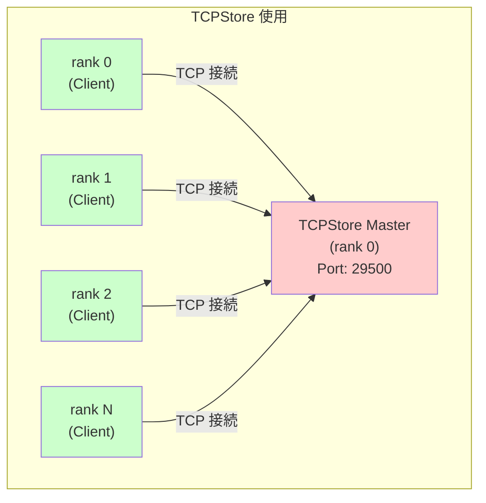
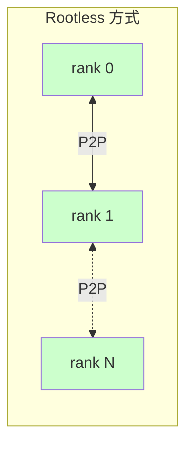
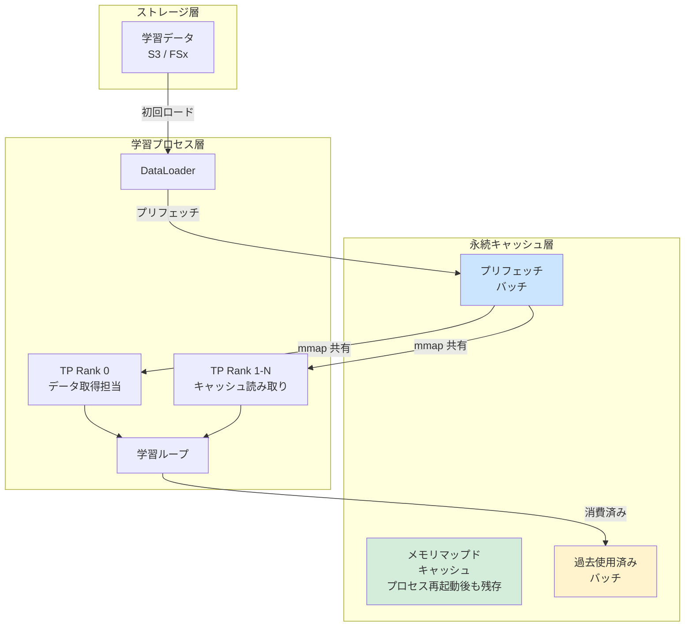
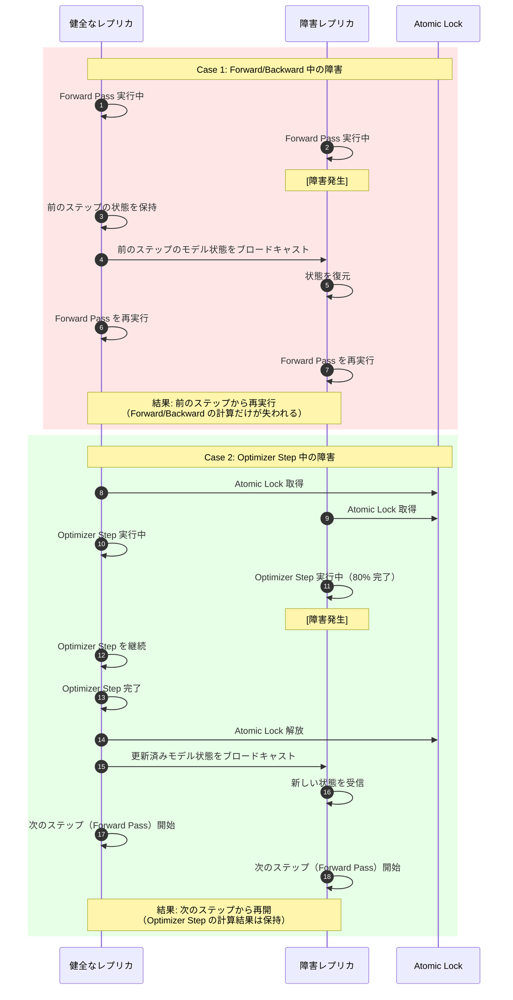
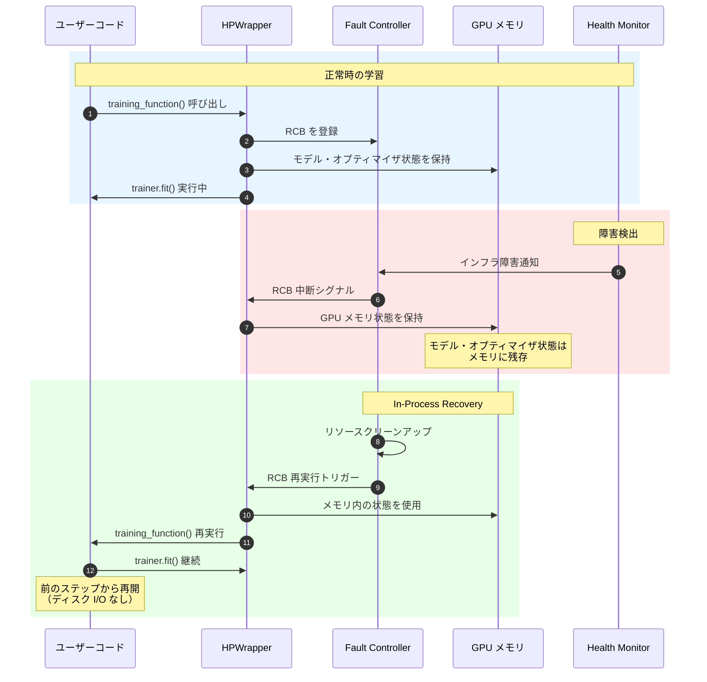
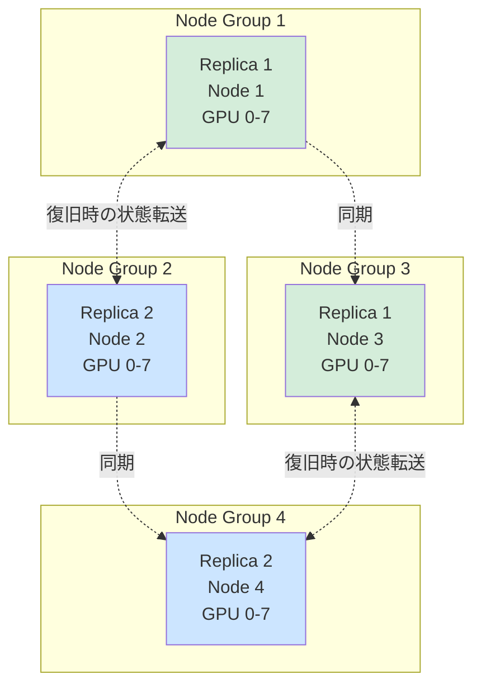

## はじめに

大規模分散学習において、ハードウェア障害は避けられない課題です。1000 GPU で学習中、たった 1 台の障害で全体が停止し、チェックポイントからの復旧に数十分を要し、その間、残り 999 台の GPU はアイドル状態となります。

Amazon SageMaker HyperPod の **Checkpointless Training** は、この問題を根本から解決します。チェックポイントをストレージに書き込むことなく、GPU メモリ内の冗長レプリカから数分以内に自動復旧し、95% 以上の goodput（障害やオーバーヘッドで失われない有効な学習時間の割合）を実現します。

本記事では、この革新的な技術の仕組み、3 つの最適化トラック、導入方法について、2026 年 2 月時点の情報をもとに詳しく解説します。

:::message
**実際に試す際の推奨リポジトリ**: Checkpointless Training を試す際は、AWS の GenAI Frameworks team が管理する [`awsome-distributed-training`](https://github.com/aws-samples/awsome-distributed-training) リポジトリおよび公式の [`sagemaker-hyperpod-checkpointless-training`](https://github.com/aws/sagemaker-hyperpod-checkpointless-training) リポジトリの利用を強く推奨します。これらには実績のあるコードとサンプルが含まれており、環境構築期間を大幅に短縮できます。チュートリアルとしては [AI on SageMaker HyperPod](https://awslabs.github.io/ai-on-sagemaker-hyperpod/) もおすすめです。
:::

:::message alert
本記事は 2026 年 2 月時点の公式ドキュメント、オープンソースコード、などに基づく調査記事です。間違っている可能性もあるため必ず最新の公式ドキュメントを正として確認してください。
:::


*Checkpointless Training の動作イメージ（出典: AWS 公式ブログ）*

## 概要

Checkpointless Training は、GPU メモリ内に保持された冗長レプリカを使って障害から復旧する技術です。従来のチェックポイントベースのアプローチとは異なり、ストレージへの書き込みをほぼ不要にすることで、学習のボトルネックを解消します。

### 主要な特徴

- **goodput（実効学習時間の割合）**: 数千台規模のクラスターで 95% 以上を達成[^1]
- **復旧時間**: 障害から数分以内に自動復旧[^1]
- **対応環境**: [HyperPod EKS 環境限定](https://docs.aws.amazon.com/sagemaker/latest/dg/sagemaker-eks-checkpointless.html)
- **フレームワーク要件**: NVIDIA NeMo Framework が必須（詳細は後述の details ブロック参照）

とはいえ、Llama、Qwen、DeepSeek のような標準的なアーキテクチャを使用している場合、すでに用意されているレシピを使えばコード変更ゼロで始めることができます。必要なのは、データを持ち込み、最小ノード数と最大ノード数を設定するだけなので、多くのケースでは特に裏側の実装を気にすることはないかもしれません。以下に Llama3 のサンプルがあります。

https://github.com/aws/sagemaker-hyperpod-checkpointless-training/tree/main/examples/llama3/launch

re: Invent 2024 で本機能に関するセッションがあり、具体的な Salesforce からの利用事例が紹介されていました。

https://youtu.be/r9J10L2K0F4

::::details フレームワーク要件

2026 年 2 月時点では、[**NVIDIA NeMo Framework が必須**](https://docs.aws.amazon.com/sagemaker/latest/dg/sagemaker-eks-checkpointless.html)です。これは以下の技術的階層による制約です。

```
[AWS 実装] Checkpointless Training
    ↓ (NeMo API に依存)
[ラッパー層] NeMo Framework
    ↓ (Megatron-Core をラップ)
[コア技術] Megatron-Core の num_distributed_optimizer_instances
    ↓ (実現手段)
[原理] GPU メモリ内冗長レプリカ
```

1. **Megatron-Core の冗長インスタンス機能がコア技術**: Checkpointless Training は Megatron-Core の `num_distributed_optimizer_instances >= 2` という機能に依存します。この機能により、オプティマイザ状態の冗長レプリカを GPU メモリ内に保持できます。
2. **AWS 実装の NeMo 依存**: AWS の実装は NeMo の PyTorch Lightning 統合、PEFT (LoRA) サポート、チェックポイント管理 API に依存しているため、現時点では NeMo が必須です。
3. **FSDP/DeepSpeed ZeRO が使えない理由**: これらのフレームワークでは、すべてのシャードが各ランクごとに一意に分割されるため、冗長インスタンスの概念が存在しません。1 ランクが失われると、そのシャードの状態は復旧不可能です。

> Checkpointless training on SageMaker HyperPod is built on top of the NVIDIA NeMo Framework User Guide. You can run checkpointless training with pre-created SageMaker HyperPod recipes. If you're familiar with NeMo, the process of using the checkpointless training recipes is similar. With minor changes, you can start training a model using checkpointless training features that enable you to recover quickly from training faults.

（出典: [AWS 公式ドキュメント](https://docs.aws.amazon.com/sagemaker/latest/dg/sagemaker-eks-checkpointless.html)）
::::

AWS 公式ドキュメントでは Checkpointless Training を [3 つの最適化トラック](https://docs.aws.amazon.com/sagemaker/latest/dg/sagemaker-eks-checkpointless-features.html) で説明しています。


## (1) Optimized Collective Communication(CC) Initialization

https://docs.aws.amazon.com/sagemaker/latest/dg/sagemaker-eks-checkpointless-features-communication.html


従来の NCCL/Gloo ではすべてのプロセスが TCPStore という集中ストアに接続する必要があり、障害復旧のたびに完全な初期化シーケンスを繰り返す必要がありました。そしてルートプロセスが SPOF でした。1 の最適化で CC の初期化ボトルネックを解消し、Rootless かつ TCPStoreless な初期化方式を実現します。これにより障害復旧時の通信オーバーヘッドが大幅に削減されます。

::::details 補足: TCPStore とは何か

### TCPStore の役割

**TCPStore** は PyTorch Distributed における**分散プロセス間の初期化・調整のための中央集約型キーバリューストア**です。分散学習の初期化フェーズで、各ランク（プロセス）が互いを認識し、必要なメタデータを共有するために使用されます。8,192 ランク規模の大規模学習では、Master への接続数が 8,191 に達し、初期化に数十分を要するようです。

**初期化コード例**

```python
import torch.distributed as dist

dist.init_process_group(
    backend="nccl",
    init_method="tcp://master:29500",  # ← TCPStore のエンドポイント
    rank=0,
    world_size=8
)
```

このコードは内部で TCPStore を作成し、以下のような中央集約型アーキテクチャで動作します。



### Rootless Configuration による改善

Rootless Configuration は TCPStore を完全に排除し、ピアツーピア接続に置き換えます。これによって、SPOF の排除、並列初期化による高速化、局所的な障害の影響を最小化、します。ただし TCP ポート消費増加などのトレードオフがあります。



**参考**
- [PyTorch Distributed TCPStore ドキュメント](https://pytorch.org/docs/stable/distributed.html#torch.distributed.TCPStore)
- [PyTorch ソースコード: rendezvous.py](https://github.com/pytorch/pytorch/blob/main/torch/distributed/rendezvous.py) - `_create_c10d_store()` 関数
- [PyTorch ソースコード: distributed_c10d.py](https://github.com/pytorch/pytorch/blob/main/torch/distributed/distributed_c10d.py) - `_store_based_barrier()` 関数

::::

### Rootless Configuration による解決策

HyperPod は **Rootless かつ TCPStoreless** な初期化方式を導入することで、これらの問題を解決しています。

**有効化方法**

```bash
export HPCT_USE_ROOTLESS=1 && \
sysctl -w net.ipv4.ip_local_port_range="20000 65535"
```

**設定パラメータ**
- `HPCT_USE_ROOTLESS`: 1 で有効化、0 で無効化
- `net.ipv4.ip_local_port_range`: 分散通信用にシステムポート範囲を拡張

### アーキテクチャの変更

| 層 | 主要コンポーネント | 修正内容 |
|---|---|---|
| **PyTorch Distributed API 層**<br/>(Python) | `torch.distributed.new_group()`<br/>`torch.distributed.init_process_group()` | TCPStore 作成をバイパス<br/>グローバルグループカウンターを通じて対称アドレスパターンを維持 |
| **PyTorch プロセスグループ層**<br/>(Python/C++) | `ProcessGroupNCCL`<br/>`ProcessGroupGloo` | ユーザー設定に基づいて最適化コードパスを条件付きで呼び出し<br/>In-Process Recovery メカニズムをサポート |
| **Third Party ライブラリ層**<br/>(C++) | NCCL<br/>Gloo | サードパーティライブラリの API を拡張し、Rootless および Storeless 最適化を実現<br/>オリジナルと最適化パスの柔軟な切り替えをサポートし後方互換性を維持 |

### 実装例

https://github.com/aws/sagemaker-hyperpod-checkpointless-training/blob/24520b41db0df3495b3946a7b74edaa70fbc339d/examples/llama3/launch/pretrain_llama3_70b_checkpointless_p5.yaml#L111-L113

## (2) Memory-Mapped Data Loading (MMAP)


従来の DataLoader では、プロセス再起動時にデータパイプライン全体を再構築する必要があり、最初のバッチ生成に数分かかっていました。また、各 GPU ランクがメモリ内に独立したデータコピーを保持するため、メモリ使用量が非効率でした。MMAP は学習データを永続的なメモリマップドキャッシュに保持することで、プロセス再起動時の最初のバッチ生成時間をゼロにし、GPU 8 台の p5 インスタンスではデータコピーを 8 個から 1 個に削減します。

**Memory-Mapped Data Loading の技術詳細**

https://docs.aws.amazon.com/sagemaker/latest/dg/sagemaker-eks-checkpointless-features-mmap.html

従来の DataLoader アプローチには、以下の 3 つの問題がありました。1. **プロセス再起動時のデータパイプライン再構築オーバーヘッド** - 障害復旧やスケーリング時に、データ前処理パイプライン全体を再初期化する必要があり、最初のバッチ生成に数分を要します。2. **メモリ使用の非効率性** - 各 GPU ランクが独立したデータコピーをメモリに保持するため、ノードあたりのメモリ使用量が GPU 数に比例して増加します。3. **データローディングの待機時間** - 学習ステップがデータ到着を待つボトルネックが発生し、GPU 利用率が低下します。

:::message
HyperPod は **メモリマップド I/O（mmap）と永続キャッシュ** を組み合わせることで、これらの問題を解決しています。
:::

### アーキテクチャとデータフロー

Memory-Mapped DataLoader は、以下の 3 層構造で動作します。



1. **初回ロード時**: DataLoader が S3/FSx から学習データを取得し、永続キャッシュに書き込み
2. **プリフェッチ**: 学習ループより先行して、次の `prefetch_length` 個バッチをキャッシュに準備
3. **メモリマップド共有**: 各 TP Rank 0 のみがデータを取得し、同じレプリケーショングループ内の他のランクは mmap で共有アクセス
4. **過去バッチの保持**: 消費済みバッチも `lookback_length` 数だけキャッシュに保持し、プロセス再起動時の即座の再開を可能に

### 実装例

https://github.com/aws/sagemaker-hyperpod-checkpointless-training/blob/24520b41db0df3495b3946a7b74edaa70fbc339d/examples/llama3/llama3_70b_pretrain_checkpointless.py#L101-L109

MMAP の有効化は、既存の PyTorch Lightning DataModule を `MMAPDataModule` でラップするだけで完了します。

## (3) Program Restart Overhead Reduction

https://docs.aws.amazon.com/sagemaker/latest/dg/sagemaker-eks-checkpointless-in-process-recovery.html


AWS 公式ドキュメントでは「Program restart overhead reduction」として説明されている最適化トラックです。これは **In-Process Recovery** と **Checkpointless Recovery** の 2 つの技術を組み合わせることで実現されます。

従来の障害復旧では、全プロセスを停止し、ディスクからチェックポイントをロードして再起動する必要があり、復旧に数分〜数十分を要していました。また、前回のチェックポイント以降の学習進行が失われるため、計算リソースが無駄になっていました。

HyperPod は以下の 2 つの技術でこれを解決します。

| 技術 | 責務 | 解決する問題 |
|------|------|-------------|
| **In-Process Recovery (IPR)** | **復旧メカニズム**<br/>プロセスを終了せずに障害から復旧する仕組み | プロセス再起動のオーバーヘッド、学習ステップの損失 |
| **Checkpointless Recovery** | **状態管理アーキテクチャ**<br/>GPU メモリ内にモデルの冗長レプリカを保持する設計 | ディスクチェックポイントの I/O ボトルネック、ストレージコスト |

1. **In-Process Recovery**: 「どうやって復旧するか」
   - 障害発生時に、プロセスを終了せずに RCB (Re-Executable Code Block: 障害復旧時に再実行可能なコードセグメント) を再実行することで、サブ秒レベルでの復旧を実現
   - 学習ステップの損失をゼロにする（前のステップから継続）

2. **Checkpointless Recovery**: 「どこから復旧するか」
   - 複数のノードグループ間でモデル・オプティマイザ状態を冗長化し、GPU メモリ内に保持
   - ディスクチェックポイントを使わずに、健全なレプリカから状態を取得

**2 つの技術の連携**: In-Process Recovery が「プロセスを継続しながら復旧する仕組み」を提供し、Checkpointless Recovery が「復旧に必要な状態を GPU メモリ内に保持する設計」を提供することで、ディスク I/O を完全に排除した高速障害復旧を実現します。

### In-Process Recovery


従来の障害復旧アプローチには、以下の 4 つの問題がありました。1. **プロセス再起動のオーバーヘッド** - 全ランクのプロセスを停止し、新規プロセスを起動する必要があり、NCCL 集団通信の再初期化に数分を要する、2. **ディスク I/O のボトルネック** - チェックポイントファイル（数十 GB〜数百 GB）をストレージ（S3 や FSx）からロードする必要があり、復旧に数分〜数十分かかる、3. **学習進行の損失** - 前回のチェックポイント以降の学習ステップが無駄になり、再計算が必要（例: チェックポイント間隔が 100 ステップの場合、最大 100 ステップ分の計算が失われる）、4. **データパイプライン再構築の遅延** - DataLoader を再初期化し、最初のバッチ生成を待つ必要がある

:::message
HyperPod は **GPU メモリ内のモデル冗長化とプロセス内復旧** を組み合わせることで、これらの問題を解決しています。
:::

| 観点 | In-Process Recovery | 既存アプローチ方式 |
|------|---------------------|----------------|
| **状態保存先** | GPU メモリ（プロセス内） | ディスクチェックポイント |
| **復旧速度** | サブ秒 | 数秒〜数分（ディスク I/O） |
| **学習進行の損失** | なし（前のステップから再開） | 前回チェックポイントから再開 |
| **プロセス継続性** | プロセスは継続 | プロセス再起動が必要な場合がある |
| **アーキテクチャ** | 複数ノードグループ間のモデル冗長化 | レプリカごとの単一コピー |

#### 障害タイプと復旧メカニズム

| 障害タイプ | 原因 | 復旧タイプ | メカニズム |
|-----------|------|-----------|-----------|
| **In-Process 障害** | コードレベルエラー、例外 | In-Process Recovery (IPR) | 既存プロセス内で RCB を再実行 |
| **Process Restart 障害** | CUDA コンテキスト破損、プロセス終了 | Process Level Restart (PLR) | SageMaker HyperPod がプロセスを再起動。K8s Pod 再起動はスキップ |
| **Node Replacement 障害** | 恒久的なハードウェア障害 | Job Level Restart (JLR) | 故障ノードを交換。ジョブ全体を再起動 |

#### Atomic Lock の役割

分散学習では、1 回の学習ステップは **Forward Pass、Backward Pass、Optimizer Step** の 3 つのフェーズで構成されます。実行時間の観点では Forward/Backward Pass が大半を占めると思われますが、**Optimizer Step は一度完了すると破棄できない重要な操作**です。

Optimizer Step が完了すると、新しいモデル状態（重み、オプティマイザ状態、学習率スケジューラの状態など）が確定します。この確定した状態は次のステップに必須であり、破棄すると再計算が必要になります。大規模モデルでは数百 GB のパラメータとオプティマイザ状態へのメモリアクセス、さらに分散環境での通信コスト（勾配の all-reduce、パラメータシャードの同期など）が発生するため、再計算のコストは無視できません。

従来の障害復旧では、どのフェーズで障害が発生しても、常に前のステップの開始地点までロールバックしていました。これは、Optimizer Step の途中で障害が発生した場合、健全なレプリカが既に完了した計算結果を破棄することを意味します。例えば、8 レプリカのうち 1 つが Optimizer Step の 90% 完了時点で障害を起こすと、残り 7 つの健全なレプリカが完了した Optimizer Step をすべて捨てて、前のステップから再計算する必要があります。

Atomic Lock は、この無駄を防ぐために導入された仕組みです。**Optimizer Step をアトミックな操作として保護**することで、健全なレプリカが完了した計算結果を失わずに済むようにします。

#### 学習ステップの 3 つのフェーズと障害時の動作


**Case 1: Forward/Backward Pass 中の障害（Optimizer Step 前）**

Forward Pass または Backward Pass の実行中に障害が発生した場合、まだ Atomic Lock は取得されていません。この時点ではモデルの重みはまだ更新されておらず、計算途中の中間結果（勾配など）のみが存在します。

障害が検出されると、システムは**前のステップの開始地点までロールバック**します。健全なレプリカは、前のステップで保存されたモデル状態（既に Optimizer Step で更新済みの重み）をブロードキャストし、すべてのレプリカがその状態から新たに Forward Pass を再実行します。この場合、失われるのは計算途中の中間結果だけなので、大きな損失にはなりません。

**Case 2: Optimizer Step 中の障害（Atomic Lock 取得後）**

学習バッチの開始時（`on_train_batch_start`）に、各レプリカは **Atomic Lock (`ParameterUpdateLock`)** を取得します。このロックはバッチ全体（Forward Pass、Backward Pass、Optimizer Step）を保護し、バッチ完了時（`on_train_batch_end`）に解放されます。ロックが保持されている間、Checkpointless Recovery は無効化されます。

:::message
以下の説明は、Optimizer Step のみに焦点を当てた概念的な説明です。実際には、ロックはバッチ開始時に取得されますが、Forward/Backward Pass 中の障害は前のステップからの再実行で対処できるため、Optimizer Step の保護が重要になります。
:::

Optimizer Step の実行中に一部のレプリカで障害が発生しても、健全なレプリカは**ロックに保護されたまま Optimizer Step を継続し、最後まで完了**します。障害が発生したレプリカは計算を中断しますが、プロセス自体は終了しません。

健全なレプリカが Optimizer Step を完了すると、**更新された新しいモデル状態**（重み、オプティマイザ状態、学習率スケジューラの状態など）を障害から復旧したレプリカにブロードキャストします。復旧したレプリカは、この更新済みの状態を受け取り、**次のステップから再開**します。

この仕組みにより、健全なレプリカが既に完了した Optimizer Step の計算結果を破棄することなく、そのまま次のステップに進むことができます。

**2 つのケースの比較**



### 実装例

https://github.com/aws/sagemaker-hyperpod-checkpointless-training/blob/24520b41db0df3495b3946a7b74edaa70fbc339d/src/hyperpod_checkpointless_training/nemo_plugins/checkpoint_manager.py#L381-L394

[`CheckpointManager.checkpointless_recovery_feasible()`](https://docs.aws.amazon.com/sagemaker/latest/dg/sagemaker-eks-checkpointless-in-process-recovery.html) メソッドは以下を検証します。

#### Re-Executable Code Block (RCB)

**RCB とは**: 障害復旧時に再実行されるコードセグメントです。従来の復旧方式ではプロセス全体を再起動する必要がありましたが、RCB を使用すると、GPU メモリ内のモデル・オプティマイザ状態を保持したまま、学習ループだけを再実行できます。

**RCB の定義方法**:

```python
from hyperpod_checkpointless_training.inprocess import HPWrapper

@HPWrapper(
    health_check=CudaHealthCheck(),
    hp_api_factory=HPAgentK8sAPIFactory(),
    abort_timeout=60.0,
)
def training_function():
    """
    この関数全体が RCB (Re-Executable Code Block) です。
    障害復旧時に、メモリ内のモデルとオプティマイザ状態を
    保持したまま、この関数が再実行されます。
    """
    trainer.fit(model, datamodule)
```

**RCB の動作フロー**:



**Fault Controller モジュールの役割**:

| モジュール | 役割 | 実行内容 |
|-----------|------|---------|
| 障害検出 | インフラ障害の監視 | Health Monitoring Agent から障害通知を受信 |
| RCB 定義 API | ユーザーコードの登録 | `@HPWrapper` で装飾された関数を RCB として登録 |
| 再起動モジュール | In-Process Recovery の実行 | RCB を中断、リソースをクリーンアップ、GPU メモリを保持したまま RCB を再実行 |

**RCB の利点**:

- **プロセス再起動不要**: プロセスは継続し、GPU メモリ内の状態が保持される
- **ディスク I/O ゼロ**: チェックポイントの読み書きが不要
- **高速復旧**: サブ秒レベルでの復旧を実現
- **学習進行の損失ゼロ**: 前のステップから正確に再開

:::message
In-Process Recovery は、Checkpointless Recovery と組み合わせることで最大の効果を発揮します。モデル冗長化のトレードオフや必須設定（`num_distributed_optimizer_instances ≥ 2`）については、後述の「Checkpointless Recovery」セクションで詳しく解説します。
:::

#### 学習進行の損失ゼロ

最後のチェックポイントから再開する従来のチェックポイント方式とは異なり、In-Process Recovery は以下を保証します。

```
従来方式: 最後の保存チェックポイント → 最後のチェックポイントから再開（ステップロス）
In-Process: 前の学習ステップ → 同じステップから再開（損失なし）
```

プロセスは継続し、最新のモデル・オプティマイザ状態を GPU メモリに保持するため、障害が発生した正確な時点からシームレスに継続できます。

### Checkpointless Recovery

In-Process Recovery に加えて、HyperPod は **Checkpointless Recovery** を提供します。これは、モデルレプリカを複数のノードグループに分散配置することで、ディスクチェックポイントを完全に排除した障害復旧を実現する技術です。

#### 解決する課題

従来のチェックポイントベースの障害復旧には、以下の 3 つの問題がありました。

1. **チェックポイント I/O のオーバーヘッド** - 大規模モデルのチェックポイント（数十 GB〜数百 GB）をディスクに定期的に保存する必要があり、学習がブロックされる（数秒〜数分）
2. **ストレージコストの増大** - チェックポイントを S3 や FSx に保存するため、ストレージコストが増加し、チェックポイント頻度とストレージコストのトレードオフが発生する
3. **単一ノード障害時のシャード損失** - FSDP のようなシャーディング方式では、各ノードが一意のモデルシャードを保持するため、1 ノードが故障するとそのシャードが失われ、ディスクからの復旧が必須となる

#### Checkpointless Recovery による解決策

HyperPod は **GPU メモリ内のモデル冗長化と In-Process Recovery** を組み合わせることで、ディスクチェックポイントを完全に排除します。

**基本原理**:

Checkpointless Recovery は、以下の 2 つの技術を組み合わせることで実現されます。

1. **In-Process Recovery**: プロセス内での高速復旧メカニズム
2. **Model Redundancy**: 複数ノードグループ間でのモデル・オプティマイザ状態の完全複製

この組み合わせにより、ディスクベースのチェックポイント保存・復元を完全にスキップし、メモリからメモリへの状態転送のみで復旧を実現します。

##### レプリカ配置戦略

HyperPod Checkpointless Training は、モデルレプリカを物理的に異なるノードグループに分散配置します。これにより、単一ノードまたは単一ノードグループの障害が発生しても、他のノードグループ上の健全なレプリカから状態を復旧できます。

**レプリカ配置の例（p5.48xlarge インスタンスの場合）**:



**配置の特徴**:
- 各レプリカは物理的に異なるノードに配置
- 同一レプリカ内（Replica 1 や Replica 2）では、重みの更新とオプティマイザ状態の変更を同期的に複製
- レプリカ間（Replica 1 ↔ Replica 2）では、障害発生時にのみ状態を転送
- 単一ノード障害が発生しても、他のノードグループ上の健全なレプリカから復旧可能

##### チェックポイントレス復旧のワークフロー

**正常時の動作**:

1. 学習ステップ実行
2. 各レプリカグループ内で重みとオプティマイザ状態を同期
3. 次のステップへ進行（ディスクへの保存なし）

**障害発生時の動作**:

1. 障害検出（例: Node 1 の GPU 故障）
2. 復旧実行可能性の評価
   - 健全なレプリカ（Node 2, 3, 4）の存在確認
   - グローバルステップの一貫性確認
   - モデル状態のチェックサム検証（オプション）
3. 健全なレプリカからの状態転送
   - Node 2 または Node 4 から最新のモデル・オプティマイザ状態を取得
   - Node 1 のプロセス内で状態を復元
4. 学習再開（同じステップから）

##### ディスクチェックポイントとの比較

| 観点 | Checkpointless Recovery | 従来のディスクチェックポイント |
|------|------------------------|---------------------------|
| **状態保存先** | GPU メモリ（複数ノードグループ） | ディスク（FSx Lustre など） |
| **保存頻度** | 毎ステップ（メモリ同期） | 定期的（例: 100 ステップごと） |
| **復旧速度** | サブ秒（メモリ転送） | 数秒〜数分（ディスク I/O） |
| **学習進行の損失** | なし（前のステップから再開） | あり（最後のチェックポイントから再開） |
| **ストレージ要件** | 不要（メモリのみ） | 必要（大容量ストレージ） |
| **I/O オーバーヘッド** | なし | あり（保存・読み込み時） |

##### 必須設定: Distributed Optimizer Instances

Checkpointless Recovery を有効化するには、`num_distributed_optimizer_instances` を **2 以上** に設定する必要があります。

```python
trainer = Trainer(
    strategy=CheckpointlessMegatronStrategy(
        num_distributed_optimizer_instances=2  # 最小値は 2
    ),
)
```

この設定により、オプティマイザが少なくとも 2 つのノードグループ間で複製され、単一ノードグループの障害に対するフォールトトレランスが確保されます。

##### メモリオーバーヘッド

モデルレプリカを追加すると、デバイスメモリ使用量が増加します。

- **1 つのレプリカ追加**: 約 1 DCP (Distributed Checkpoint) チェックポイントサイズ分のメモリ増加
- **例**: DCP チェックポイントが 50 GB の場合、追加で約 50 GB のデバイスメモリが必要

**トレードオフ**:
- **メリット**: ディスク I/O を完全に排除、復旧時間の大幅短縮
- **デメリット**: デバイスメモリ使用量の増加

##### 通信最適化

ハイブリッドシャーディングにより、Collective 通信を小さなグループに分割します。

**従来の Data Parallel (DP)**:
```
DP グループ全体（例: 32 GPU）での reduce-scatter と all-gather
→ 大きなグループサイズによる高遅延
```

**ハイブリッドシャーディング**:
```
1. Reduce-scatter: 各レプリカ内（例: 16 GPU）
2. All-reduce: レプリカグループ間（例: 2 グループ）
3. All-gather: 各レプリカ内（例: 16 GPU）
→ 小さなグループサイズによる低遅延
```

**結果**:
- 通信量は変わらない（同じデータ量を転送）
- グループサイズの縮小により、Collective 遅延が改善

:::message
実装例については、「In-Process Recovery」セクションの「コア設定」および「導入方法」セクションを参照してください。
:::

##### フォールバック戦略

Checkpointless Recovery が実行不可能な場合、自動的にディスクチェックポイントにフォールバックします。

**フォールバックが発生する場合**:
- すべてのレプリカグループが同時に障害を起こした場合
- モデル状態のチェックサムが不一致の場合
- グローバルステップの不一致が検出された場合

**推奨設定**:
- `checkpoint_frequency` を設定し、定期的にディスクチェックポイントを保存
- 深刻な障害に対する最終的な復旧手段として使用

##### まとめ

Checkpointless Recovery は、以下の技術を組み合わせることで、大規模分散学習における障害復旧を革新的に改善します。

- **In-Process Recovery**: プロセス内での高速復旧
- **Model Redundancy**: 複数ノードグループ間での状態複製
- **Optimized Communication**: ハイブリッドシャーディングによる通信最適化
- **Fallback Strategy**: ディスクチェックポイントへの自動フォールバック

これにより、ディスク I/O を排除し、サブ秒レベルでの障害復旧と学習進行の損失ゼロを実現します。

## 3 つの最適化トラックの連携

これら 3 つの最適化トラックは独立して動作するのではなく、相互に連携することで最大の効果を発揮します。

**連携の例**:

1. **Optimized Collective Communication Initialization** → **Program Restart Overhead Reduction** の高速化
   - Rootless/TCPStoreless 初期化により、障害復旧時の通信セットアップ時間を削減し、In-Process Recovery と Checkpointless Recovery をさらに高速化

2. **Memory-Mapped Data Loading** → **Program Restart Overhead Reduction** の実現
   - データローダーの再初期化時間を削減し、完全なチェックポイントレス復旧を可能に。ディスクからのデータ読み込みオーバーヘッドを排除

3. **In-Process Recovery** + **Checkpointless Recovery** の統合
   - プロセス内復旧メカニズムとモデルレプリカからの状態転送を組み合わせることで、ディスク I/O を完全に排除し、サブ秒レベルでの障害復旧を実現

この統合的なアプローチにより、HyperPod Checkpointless Training は従来のチェックポイントベースの復旧と比較して、**大幅な高速化と学習進行の損失ゼロ**を実現しています。

## 対応環境と制約

Checkpointless Training は以下の環境制約があります。

| 項目 | 詳細 |
|------|------|
| オーケストレーター | **EKS のみ**（Slurm 環境は公式サポート外）（[公式ドキュメント](https://docs.aws.amazon.com/sagemaker/latest/dg/sagemaker-hyperpod-eks-operate-training-checkpointless.html)参照） |
| フレームワーク | **NVIDIA NeMo Toolkit 2.6.0rc0 が必須**（[ソース](https://github.com/aws/sagemaker-hyperpod-recipes)）。PyTorch ≥ 2.6.0、PyTorch Lightning、Megatron-Core に依存（具体的なバージョンはリポジトリの pyproject.toml を参照） |
| 非対応フレームワーク | HuggingFace Transformers Trainer、DeepSpeed、純粋な PyTorch（公式サポート外。[公式レシピ](https://github.com/aws/sagemaker-hyperpod-recipes)で NeMo ベースのサンプルのみ提供） |
| サポートモデル | **Checkpointless Training 用公式レシピ**: GPT OSS、Llama 3。**HyperPod Recipes 全体**: Amazon Nova、DeepSeek R1、Qwen 等も含む（[公式レシピリポジトリ](https://github.com/aws/sagemaker-hyperpod-recipes)参照） |
| インスタンスタイプ | **ml.p5.48xlarge / ml.p5e.48xlarge 推奨**（H100 GPU）。ml.p4d.24xlarge（A100）は未検証（[公式レシピ](https://github.com/aws/sagemaker-hyperpod-recipes/blob/main/recipes_collection/recipes/fine-tuning/gpt_oss/checkpointless_gpt_oss_120b_full_fine_tuning.yaml)参照） |
| GPU 要件 | CUDA 12.5+、複数 GPU 必須（`num_distributed_optimizer_instances >= 2`）（[公式レシピ](https://github.com/aws/sagemaker-hyperpod-recipes)参照） |
| Kubernetes CRD | `HyperPodPyTorchJob` を使用（EKS Training Operator ≥ 1.2.0）（[HyperPod CLI](https://github.com/aws/sagemaker-hyperpod-cli)参照） |

:::message alert
**重要な制約**: Checkpointless Training は **NVIDIA NeMo Framework が必須**です。

フレームワーク要件の詳細（技術的理由、FSDP/DeepSpeed が使えない理由、将来の展望など）については、概要セクションの「フレームワーク要件」details ブロックを参照してください。

**使えないケース**: HuggingFace Transformers、DeepSpeed、PyTorch FSDP、AWS Trainium インスタンス（ml.trn1.*, ml.trn2.*）、Slurm オーケストレーター環境
:::

## 導入方法

Checkpointless Training の有効化は、学習設定ファイルと `HyperPodPyTorchJob` の構成を組み合わせて行います。

#### 学習設定での有効化

```yaml
# 学習設定ファイル (例: gpt_config.yaml)
model:
  # 分散オプティマイザの冗長インスタンス数
  # 各 Data Parallel グループ内でモデル状態の冗長コピーを保持
  num_distributed_optimizer_instances: 2
```

`num_distributed_optimizer_instances: 2` は、各 Data Parallel グループ内でオプティマイザ状態の冗長コピーを 2 つ保持する設定です。これにより、1 つのノードが障害を起こしても、もう 1 つのコピーから状態を復元できます。

**技術的背景**: この冗長インスタンス機能は **Megatron-Core の分散オプティマイザ固有の機能** です。PyTorch の標準 FSDP や DeepSpeed ZeRO では、すべてのシャードが一意であり、1 ランクの損失でその状態は復旧不可能です。Megatron-Core は `num_distributed_optimizer_instances` パラメータにより、オプティマイザ状態の冗長コピーを明示的に作成でき、この機能が Checkpointless Training の GPU メモリ内レプリカのコア技術となっています。これが、Checkpointless Training が Megatron-Core を必須とする最も根本的な技術的理由です。さらに、AWS の実装は NeMo の PyTorch Lightning 統合や PEFT サポートに強く依存しているため、現時点では **NeMo Framework が事実上必須**となっています。

この設定は DP グループサイズ以下の値を指定する必要があります。GPU メモリ使用量が増加する点に注意が必要です（冗長コピー数とモデルサイズに依存します）。

#### HyperPodPyTorchJob の起動コマンド

```yaml
# HyperPodPyTorchJob spec 内の containers.command 例
command:
  - "python"
  - "-u"
  - "training_script.py"
args:
  - "--config-path=/workspace/configs"
  - "--config-name=gpt_config"
```

#### コアライブラリの HPWrapper による統合

```python
from hyperpod_checkpointless_training.inprocess import HPWrapper

# HPWrapper はフレームワーク非依存のコア API である。
# 学習関数をラップすることで、In-Process Recovery を有効化する。
# 2026 年 2 月時点では、NeMo を使用する場合は nemo_plugins/ の Callback を通じて統合される。
```

:::message
**導入時の注意事項**:

- **NeMo 統合**: 2026 年 2 月時点では、公式サンプルで NeMo 統合プラグイン（`CheckpointlessCallback` 等）を通じた利用例が提供されています
- **Managed Tiered Checkpointing との併用を推奨**: Checkpointless Recovery は高速復旧を実現しますが、カタストロフィックな障害には対応できないため、定期的な永続チェックポイント（Managed Tiered Checkpointing）との併用が推奨されます（詳細は[関連記事](https://zenn.dev/yunokiisshin/articles/98e6a7acbac32e)を参照）
- **コード例について**: 上記のコード例は公式ドキュメントおよび公開リポジトリの情報に基づきますが、実際の SDK インターフェースは予告なく変更される可能性があります
:::

## パフォーマンス

AWS の公式発表[^1]および公式ブログ[^2]に基づくパフォーマンス数値:

| メトリクス | 従来方式 | Checkpointless Training |
|-----------|---------|----------------------|
| 障害復旧時間 | 数十分（推定値[^3]） | 数分以内[^1] |
| goodput（数千アクセラレータ規模） | -- | 95% 以上[^1] |
| チェックポイント I/O | 学習時間の数%〜十数%（推定値[^3]） | ほぼゼロ |
| メモリオーバーヘッド | なし | レプリカ分（GPU メモリの一部） |

---

## まとめ

Amazon SageMaker HyperPod の Checkpointless Training は、大規模分散学習における耐障害性の新しいパラダイムを提供します。本記事で解説した 4 つのコアコンポーネント（Optimized CC Initialization、MMAP、In-Process Recovery、Checkpointless Recovery）が相互に連携することで、従来は数十分かかっていた障害復旧を数分以内に短縮し、95% 以上の goodput を実現します。

**Checkpointless Training の主な特徴**:

1. **高速復旧**: GPU メモリ内の冗長レプリカにより、ストレージ I/O なしで障害復旧
2. **高い goodput**: 数千台規模のクラスターで 95% 以上の実効学習時間を達成
3. **自動化**: 障害検出から復旧まで完全に自動化され、人手介入不要
4. **簡単な導入**: 標準的なアーキテクチャ（Llama、Qwen 等）なら公式レシピでコード変更不要

**導入時の考慮事項**:

- **環境制約**: HyperPod EKS 環境限定（Slurm 環境は非対応）
- **フレームワーク要件**: NVIDIA NeMo Framework が必須（詳細は対応環境と制約セクション参照）
- **Managed Tiered Checkpointing との併用推奨**: カタストロフィックな障害に備えた永続バックアップ
- **メモリオーバーヘッド**: 冗長レプリカ保持のため、追加の GPU メモリが必要

Checkpointless Training は、既存の Managed Tiered Checkpointing（永続バックアップ）、Elastic Training（動的スケーリング）、Health Monitoring Agent（障害検出）と組み合わせることで、あらゆる障害シナリオに対応する包括的な耐障害性を実現できます。

詳細な技術仕様や最新情報については、AWS 公式ドキュメントおよび GitHub リポジトリを参照してください。

---

## 検証状況の開示

本記事の内容は以下の検証に基づいています:

**AWS 公式ドキュメントとの整合性確認済み (2026 年 2 月時点): **
- Checkpointless Training の 4 つの最適化トラック -- [公式ドキュメント](https://docs.aws.amazon.com/sagemaker/latest/dg/sagemaker-eks-checkpointless-features.html)
- NeMo Framework 要件 -- [公式ドキュメント](https://docs.aws.amazon.com/sagemaker/latest/dg/sagemaker-eks-checkpointless.html)
- EKS 環境限定であること -- [公式ドキュメント](https://docs.aws.amazon.com/sagemaker/latest/dg/sagemaker-eks-checkpointless.html)

**OSS ソースコード解析済み: **
- Megatron-Core の `num_distributed_optimizer_instances` パラメータ -- [NVIDIA/Megatron-LM リポジトリ](https://github.com/NVIDIA/Megatron-LM)
- NeMo Framework の統合 API -- [NVIDIA/NeMo リポジトリ](https://github.com/NVIDIA/NeMo)

**AWS 発表資料に基づく主張（実環境での独立検証は未実施）: **
- goodput 95% 以上、障害復旧時間数分以内 -- [HyperPod 機能ページ](https://aws.amazon.com/sagemaker/hyperpod/features/) および [AWS 公式ブログ](https://aws.amazon.com/blogs/aws/introducing-checkpointless-and-elastic-training-on-amazon-sagemaker-hyperpod/) に基づきます
- 従来方式の復旧時間の具体的な数値は公式ソースに記載がなく、大規模学習における一般的な知見に基づく推定値です

**推測を含む記述: **
- In-Process Recovery と Checkpointless Recovery の責務分担の詳細 -- 公式ドキュメントの記述と OSS コード分析に基づく推測を含みます

本記事のコード例は公式ドキュメントおよび公開リポジトリの情報に基づくものであり、実際の SDK インターフェースは予告なく変更される可能性があります。最新かつ正確な仕様は AWS 公式ドキュメントを参照してください。

---

## 参考資料

- [Amazon SageMaker HyperPod Features](https://aws.amazon.com/sagemaker/hyperpod/features/) -- 公式機能ページ（goodput 95%以上等の数値の出典）
- [AWS SageMaker HyperPod 公式ドキュメント](https://docs.aws.amazon.com/sagemaker/latest/dg/sagemaker-hyperpod.html) -- 2026 年 2 月時点
- [AWS Blog: Introducing Checkpointless and Elastic Training on Amazon SageMaker HyperPod](https://aws.amazon.com/jp/blogs/news/introducing-checkpointless-and-elastic-training-on-amazon-sagemaker-hyperpod/) -- re:Invent 2024 公式発表ブログ
- [Checkpointless Training ドキュメント](https://docs.aws.amazon.com/sagemaker/latest/dg/sagemaker-hyperpod-checkpointless.html)
- [Checkpointless Training 機能詳細](https://docs.aws.amazon.com/sagemaker/latest/dg/sagemaker-eks-checkpointless-features.html)
- [aws/sagemaker-hyperpod-checkpointless-training (GitHub)](https://github.com/aws/sagemaker-hyperpod-checkpointless-training) -- 公式サンプルとレシピ
- [aws-samples/awsome-distributed-training (GitHub)](https://github.com/aws-samples/awsome-distributed-training) -- 実践的な分散学習コード集
- [NVIDIA/NeMo (GitHub)](https://github.com/NVIDIA/NeMo) -- NeMo Framework
- [NVIDIA/Megatron-LM (GitHub)](https://github.com/NVIDIA/Megatron-LM) -- Megatron-Core

[^1]: [Amazon SageMaker HyperPod Features](https://aws.amazon.com/sagemaker/hyperpod/features/) -- 公式機能ページに「enables over 95% training goodput on clusters with thousands of AI accelerators」「automatic recovery from infrastructure faults in minutes」と記載されています。
[^2]: [AWS Blog: Introducing Checkpointless and Elastic Training on Amazon SageMaker HyperPod](https://aws.amazon.com/jp/blogs/news/introducing-checkpointless-and-elastic-training-on-amazon-sagemaker-hyperpod/) -- re:Invent 2024 で発表された公式ブログ記事です。
[^3]: 従来方式のパフォーマンス数値（復旧時間、チェックポイント I/O オーバーヘッド等）は、大規模分散学習における一般的な知見に基づく推定値であり、AWS の公式発表による数値ではありません。実際の値はクラスター構成、モデルサイズ、チェックポイント頻度等により大きく異なります。
[^4]: Checkpointless Training は EKS 環境でのみ利用可能です。[公式ドキュメント](https://docs.aws.amazon.com/sagemaker/latest/dg/sagemaker-hyperpod-eks-operate-training-checkpointless.html)を参照してください。

---

## 関連記事（HyperPod の他の耐障害性機能）

本記事で解説した Checkpointless Training は、HyperPod の耐障害性機能の 1 つです。他の機能についても別記事で詳しく解説しています。

- **[Elastic Training 徹底解説](https://zenn.dev/yunokiisshin/articles/be0db364a7f8e2)** - クラスター容量に応じた動的なノード数の増減
- **[Managed Tiered Checkpointing 徹底解説](https://zenn.dev/yunokiisshin/articles/98e6a7acbac32e)** - 2 階層の高速チェックポイント保存
- **[Health Monitoring Agent 徹底解説](https://zenn.dev/yunokiisshin/articles/0742d879958d3a)** - リソースの常時監視と自動障害復旧
