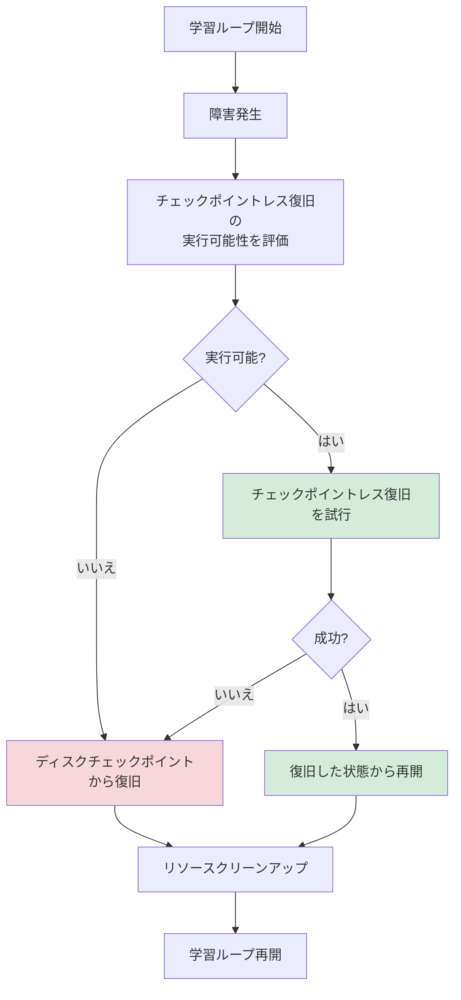
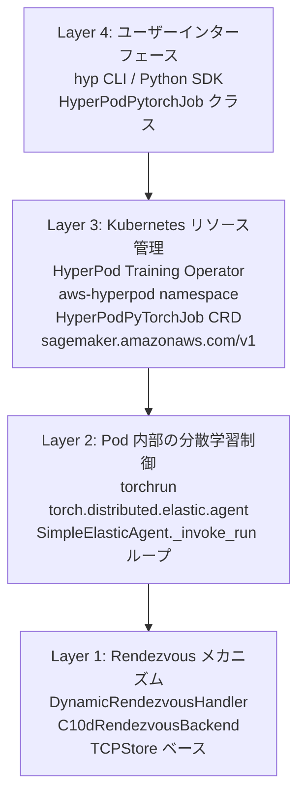
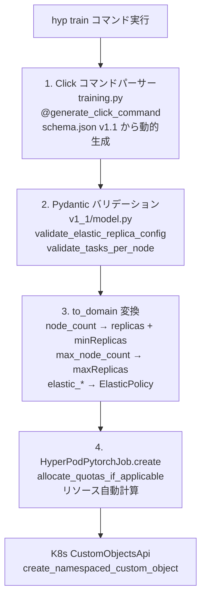
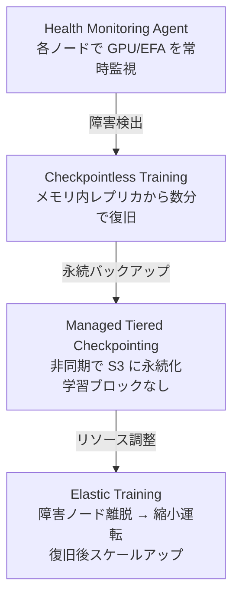

## はじめに

Amazon SageMaker HyperPod は、大規模モデルを扱うのための回復力のあるクラスターを提供するスーパー便利なマネージドサービスです。本記事では、比較的最近発表された以下の 4 つのアップデートを解説します。2026 年度中にアップデートがあれば更新したいと思っています。

| 機能 | 概要 | 対応環境 |
|------|------|---------|
| **[Checkpointless Training](https://aws.amazon.com/jp/blogs/news/introducing-checkpointless-and-elastic-training-on-amazon-sagemaker-hyperpod/)** | チェックポイントを書き込まずに障害から復旧する耐障害性メカニズム | EKS のみ |
| **[Elastic Training](https://aws.amazon.com/jp/blogs/news/introducing-checkpointless-and-elastic-training-on-amazon-sagemaker-hyperpod/)** | クラスター容量に応じてノード数を動的に増減 | EKS のみ |
| **[Managed Tiered Checkpointing](https://aws.amazon.com/jp/blogs/machine-learning/accelerate-your-model-training-with-managed-tiered-checkpointing-on-amazon-sagemaker-hyperpod/)** | 2 階層の高速チェックポイント | EKS / Slurm |
| **Health Monitoring Agent** | リソースの常時監視と自動障害復旧 | EKS / Slurm |

:::message
**実際に試す際の推奨リポジトリ**: これらを試す際は、AWS の GenAI Frameworks team が管理する [`awsome-distributed-training`](https://github.com/aws-samples/awsome-distributed-training) リポジトリの利用を強く推奨します。このリポジトリには、実際の分散学習・推論で使われてきた実績のある Slurm ベースの AWS Parallel Cluster や Sagemaker HyperPod 等のコードが含まれており、環境構築期間を大幅に短縮にできます。合わせてチュートリアルとしては [AI on SageMaker HyperPod](https://awslabs.github.io/ai-on-sagemaker-hyperpod/) もおすすめです。
:::

これらの機能は、大規模学習における 3 つの課題を解決します。

| 課題 | 従来のアプローチ | HyperPod のソリューション |
|------|----------------|-------------------------------|
| ハードウェア障害による学習中断 | 定期的なチェックポイント保存 + 手動復旧 | Checkpointless Training + Health Monitoring Agent |
| チェックポイントの I/O ボトルネック | S3 への同期書き込み | Managed Tiered Checkpointing |
| リソースの非効率な利用 | 固定ノード数での運用 | Elastic Training |

本記事では、各機能について整理していきたいと思います。

:::message alert
本記事は 2026 年 2 月時点の公式ドキュメント、オープンソースコード、などに基づく調査記事です。間違っている可能性もあるため必ず最新の公式ドキュメントを正として確認してください。
:::

## 1. Checkpointless Training


### 1.1 概要

Checkpointless Training は、**チェックポイントをストレージに書き込むことなく、障害から復旧する**機能です。従来の分散学習では、障害復旧のために定期的にモデルの状態をストレージ（S3 や FSx）に書き込む必要があり、これがオーバーヘッドとなっていました。

AWS の公式発表[^1]によれば、数千台の AI アクセラレータを持つクラスターにおいて **95% 以上の学習 goodput**（実効学習時間の割合）を実現し、障害からの自動復旧を**数分以内**に完了するとされています。現時点では [**HyperPod EKS 環境限定**](https://docs.aws.amazon.com/sagemaker/latest/dg/sagemaker-eks-checkpointless.html)、かつ、**NVIDIA NeMo Framework が必須**の機能です。

とはいえ、Llama、Qwen、DeepSeek のような標準的なアーキテクチャを使用している場合、すでに用意されているレシピを使えばコード変更ゼロで始めることができます。必要なのは、データを持ち込み、最小ノード数と最大ノード数を設定するだけなので、多くのケースでは特に裏側の実装を気にすることはないかもしれません。

re: Invent 2025 で本機能に関するセッションがあり、具体的な Salesforce からの利用事例が紹介されていました。

https://youtu.be/r9J10L2K0F4

::::details フレームワーク要件

2026 年 2 月時点では、[**NVIDIA NeMo Framework が必須**](https://docs.aws.amazon.com/sagemaker/latest/dg/sagemaker-eks-checkpointless.html)です。これは以下の技術的階層による制約です。

```
[AWS 実装] Checkpointless Training
    ↓ (NeMo API に依存)
[ラッパー層] NeMo Framework
    ↓ (Megatron-Core をラップ)
[コア技術] Megatron-Core の num_distributed_optimizer_instances
    ↓ (実現手段)
[原理] GPU メモリ内冗長レプリカ
```

1. **Megatron-Core の冗長インスタンス機能が核心**: Checkpointless Training は Megatron-Core の `num_distributed_optimizer_instances >= 2` という機能に依存します。この機能により、オプティマイザ状態の冗長コピーを GPU メモリ内に保持できます。
2. **AWS 実装の NeMo 依存**: AWS の実装は NeMo の PyTorch Lightning 統合、PEFT (LoRA) サポート、チェックポイント管理 API に依存しているため、現時点では NeMo が事実上必須です。
3. **FSDP/DeepSpeed が使えない理由**: PyTorch FSDP や DeepSpeed ZeRO では、すべてのシャードが一意であり、冗長インスタンスの概念が存在しないように見えます。1 ランクが失われると、そのシャードの状態は復旧不可能だと思われます。

現時点では **NeMo Framework が実質的に必須** だと思います。

> Checkpointless training on SageMaker HyperPod is built on top of the NVIDIA NeMo Framework User Guide. You can run checkpointless training with pre-created SageMaker HyperPod recipes. If you're familiar with NeMo, the process of using the checkpointless training recipes is similar. With minor changes, you can start training a model using checkpointless training features that enable you to recover quickly from training faults.

（出典: [AWS 公式ドキュメント](https://docs.aws.amazon.com/sagemaker/latest/dg/sagemaker-eks-checkpointless.html)）
::::

### 1.2 4 つの技術コンポーネント

AWS 公式ドキュメントでは Checkpointless Training を「[3 つの最適化トラック](https://docs.aws.amazon.com/sagemaker/latest/dg/sagemaker-eks-checkpointless-features.html)」として説明していますが、本記事では理解を深めるため、3 番目の最適化トラック（Program restart overhead reduction）を 2 つのコンポーネントに分けて説明します。この 4 つのコンポーネントによる整理は、[kiiwami 氏による Checkpointless Training パフォーマンス実証記事](https://zenn.dev/kiiwami/articles/e021261ab4431ed7#checkpointless-training%E3%81%AE%E3%83%91%E3%83%95%E3%82%A9%E3%83%BC%E3%83%9E%E3%83%B3%E3%82%B9%E5%AE%9F%E8%A8%BC)を参考にしています。


### (1) Optimized Collective Communication Initialization

**概要**: 従来の NCCL/Gloo における集約通信の初期化ボトルネックを解消し、Rootless かつ TCPStoreless な初期化方式を実現します。これにより、障害復旧時の通信オーバーヘッドが大幅に削減されます。

::::details 詳細: Optimized Collective Communication Initialization の技術仕様

#### 解決する課題

従来の NCCL および Gloo プロセスグループの初期化には、以下の 3 つの問題がありました。

1. **集中管理のオーバーヘッド** - すべてのプロセスが TCPStore という集中ストアに接続する必要がある
2. **復旧時の遅延** - 障害復旧のたびに完全な初期化シーケンスを繰り返す必要がある
3. **単一障害点** - ルートプロセスがボトルネックとなり、スケーラビリティを制限する

#### Rootless Configuration による解決策

HyperPod は **Rootless かつ TCPStoreless** な初期化方式を導入することで、これらの問題を解決しています。

**有効化方法**:

```bash
export HPCT_USE_ROOTLESS=1 && \
sysctl -w net.ipv4.ip_local_port_range="20000 65535"
```

**設定パラメータ**:
- `HPCT_USE_ROOTLESS`: 1 で有効化、0 で無効化
- `net.ipv4.ip_local_port_range`: 分散通信用にシステムポート範囲を拡張

#### 3 層アーキテクチャの変更

**1. NCCL/Gloo ライブラリ層**
- サードパーティライブラリの API を拡張し、Rootless および Storeless 最適化を実現
- TCPStore への高コストな接続をスキップ
- 元のコードパスとの後方互換性を維持
- オリジナルと最適化パスの柔軟な切り替えをサポート

**2. PyTorch プロセスグループバックエンド**
- `ProcessGroupNCCL` および `ProcessGroupGloo` バックエンドを変更
- ユーザー設定に基づいて最適化コードパスを条件付きで呼び出し
- In-Process Recovery メカニズムをサポート

**3. 分散学習層**
- PyTorch 分散層での TCPStore 作成をバイパス
- グローバルグループカウンターを通じて対称アドレスパターンを維持

#### 性能上のメリット

- **高速な障害復旧** - 集中管理の要件を排除
- **初期化オーバーヘッドの削減** - TCPStore への必須接続を削除
- **スケーラビリティの向上** - ルートプロセスの単一障害点を排除
- **シームレスな再起動** - 中断後の学習再開が高速化

#### 実装例

GitHub 上の実装例:
[launch/pretrain_llama3_70b_checkpointless_p5.yaml#L111-L113](https://github.com/aws/sagemaker-hyperpod-checkpointless-training/blob/main/examples/llama3/launch/pretrain_llama3_70b_checkpointless_p5.yaml#L111-L113)

::::

### (2) Memory-Mapped Data Loading (MMAP)

**概要**: 学習データを永続的なメモリマップドキャッシュに保持することで、プロセス再起動時の最初のバッチ生成時間をゼロにします。メモリマップド I/O により、GPU 8 台の p5 インスタンスでは、データコピーを 8 個から 1 個に削減できます。

::::details 詳細: Memory-Mapped Data Loading の技術仕様

#### アーキテクチャ

Memory-Mapped DataLoader (MMAP) は、プロセス再起動後も残存する永続メモリにプリフェッチされたバッチをキャッシュすることで、再起動オーバーヘッドを解消します。

**コアアーキテクチャ**:
- プロセス再起動後も残存する永続メモリにバッチをキャッシュ
- 各ランクごとに 2 種類のバッチを維持:
  - 最近消費されたバッチ（既に学習に使用済み）
  - プリフェッチされたバッチ（即座に使用可能）
- DataLoader の再初期化がバックグラウンドで進行する間、キャッシュされたバッチを使って学習を即座に再開

**データ配信戦略**:
- 各ノードの TP rank 0 のみがソースからデータを取得
- 同じデータレプリケーショングループ内の他のランクは、共有キャッシュから読み取り
- 冗長なデータ転送を排除

#### 主要機能

**1. データプリフェッチ**
- DataLoader によって生成されたデータを事前に取得してキャッシュ
- 学習と検証用に設定可能なプリフェッチ長

**2. 永続キャッシュ**
- 一時ファイルシステムにバッチを保存（デフォルト: `/dev/shm/pdl_cache`）
- プロセス再起動後も残存

#### 性能上のメリット

| メリット | 詳細 |
|---------|------|
| **メモリフットプリントの削減** | メモリマップド I/O により、ホスト CPU メモリ内の単一共有コピーを使用。GPU 8 台の p5 インスタンスでは、8 個のコピーを 1 個に削減 |
| **高速復旧** | キャッシュされたバッチから即座に再開することで、MTTR（平均復旧時間）を削減 |
| **待機時間の削減** | DataLoader の再初期化と最初のバッチ生成をスキップ |

#### 実装方法

**基本設定**:

```python
data_module = MMAPDataModule(
    data_module=MY_DATA_MODULE(...),
    mmap_config=CacheResumeMMAPConfig(
        cache_dir=self.cfg.mmap.cache_dir,
        checkpoint_frequency=self.cfg.mmap.checkpoint_frequency
    ),
)
```

**CacheResumeMMAPConfig API**:

```python
class CacheResumeMMAPConfig(
    cache_dir='/dev/shm/pdl_cache',           # キャッシュ保存ディレクトリ
    prefetch_length=10,                        # 学習時のプリフェッチバッチ数
    val_prefetch_length=10,                    # 検証時のプリフェッチバッチ数
    lookback_length=2,                         # 保持する過去使用済みバッチ数
    checkpoint_frequency=None,                 # モデルチェックポイント頻度
    model_parallel_group=None,                 # モデル並列化用プロセスグループ
    enable_batch_encryption=False              # オプションのバッチ暗号化
)
```

**主要パラメータ**:
- `cache_dir`: 高速 I/O ストレージ（例: インメモリの `/dev/shm`）
- `prefetch_length`: 先行プリフェッチするバッチ数
- `lookback_length`: 過去に消費したバッチの保持数
- `checkpoint_frequency`: キャッシュ管理とモデルチェックポイントの整合

**MMAPDataModule ラッパー**:

既存の PyTorch Lightning DataModule を MMAP 機能でラップします。

```python
from hyperpod_checkpointless_training.dataloader.mmap_data_module import MMAPDataModule
from hyperpod_checkpointless_training.dataloader.config import CacheResumeMMAPConfig

# 設定
mmap_config = CacheResumeMMAPConfig(
    cache_dir="/tmp/training_cache",
    prefetch_length=20,
    checkpoint_frequency=100
)

# 既存の DataModule をラップ
mmap_data_module = MMAPDataModule(
    data_module=original_data_module,
    mmap_config=mmap_config
)

# PyTorch Lightning で使用
trainer = pl.Trainer()
trainer.fit(model, data=mmap_data_module)

# チェックポイントから再開
checkpoint = {"global_step": 1000}
mmap_data_module.load_checkpoint(checkpoint)
```

#### メモリ管理アプローチ

- **メモリマップド I/O**: ホスト CPU メモリ内の単一共有コピーを維持
- **プロセスレベルキャッシュ**: 学習データを必要とする各ランクにデータキャッシュが存在
- **共有アクセス**: 複数の GPU プロセスが重複なしに単一のキャッシュコピーにアクセス
- **一時ファイルシステム**: キャッシュは再起動後も残存するが、一時ストレージを使用

#### API メソッド

**CacheResumeMMAPConfig.create()**
- 設定された MMAP DataLoader インスタンスを作成
- `CacheResumePrefetchedDataLoader` または `CacheResumeReadDataLoader` を返す

**MMAPDataModule メソッド**:
- `setup(stage)` - 基礎となる DataModule をセットアップ
- `train_dataloader()` - MMAP ラップされた学習 DataLoader
- `val_dataloader()` - MMAP ラップされた検証 DataLoader
- `load_checkpoint(checkpoint)` - 特定のステップから再開
- `state_dict()` / `load_state_dict()` - チェックポイント管理

#### 設定の推奨事項

- キャッシュのパフォーマンス最適化のため、`checkpoint_frequency` を設定
- `cache_dir` には `/dev/shm` などの高速 I/O パスを使用
- 利用可能なメモリに基づいて `prefetch_length` を調整
- セキュリティ要件が高い場合は `enable_batch_encryption` を有効化

::::

### (3) In-Process Recovery

**概要**: 障害発生時に健全なレプリカのモデル・オプティマイザ状態を、故障したレプリカに転送することで、プロセスを終了せずに復旧します。従来のチェックポイント復旧と比較して、ディスク I/O を完全に排除し、サブ秒レベルでの復旧を実現します。

::::details 詳細: In-Process Recovery の技術仕様と従来方式との比較

#### 従来の復旧方式との違い

| 観点 | In-Process Recovery | 従来の復旧方式 |
|------|---------------------|----------------|
| **状態保存先** | GPU メモリ（プロセス内） | ディスクチェックポイント |
| **復旧速度** | サブ秒（I/O なし） | 数秒〜数分（ディスク I/O） |
| **学習進行の損失** | なし（前のステップから再開） | 前回チェックポイントから再開（ステップロス） |
| **プロセス継続性** | プロセスは継続 | プロセス再起動が必要な場合がある |
| **アーキテクチャ** | 複数ノードグループ間のモデル冗長化 | レプリカごとの単一コピー |

#### コア原理

**モデル冗長化アーキテクチャ**:
- モデルとオプティマイザの状態を複数のノードグループ間で完全に複製
- 重みの更新とオプティマイザ状態の変更を各グループ内で同期的に複製
- 障害発生時、健全なレプリカがオプティマイザステップを完了し、更新された状態を復旧中のレプリカに送信

#### 障害検出と復旧メカニズム

**3 層復旧戦略**:

```
In-Process Recovery (IPR)
    ↓ (失敗した場合)
Process-Level Restart (PLR)
    ↓ (深刻な障害の場合)
Job-Level Restart (JLR)
```

**障害タイプと復旧メカニズム**:

| 障害タイプ | 原因 | 復旧タイプ | メカニズム |
|-----------|------|-----------|-----------|
| **In-Process 障害** | コードレベルエラー、例外 | In-Process Recovery (IPR) | 既存プロセス内で RCB を再実行 |
| **Process Restart 障害** | CUDA コンテキスト破損、プロセス終了 | Process Level Restart (PLR) | SageMaker HyperPod がプロセスを再起動。K8s Pod 再起動はスキップ |
| **Node Replacement 障害** | 恒久的なハードウェア障害 | Job Level Restart (JLR) | 故障ノードを交換。ジョブ全体を再起動 |

#### 障害検出と復旧フロー（従来方式との比較）



**従来方式との比較**:
- **従来方式**: 障害発生 → プロセス終了 → ディスクからチェックポイント読み込み → プロセス再起動 → 学習再開（数秒〜数分）
- **In-Process Recovery**: 障害発生 → 実行可能性評価 → 健全なレプリカから状態転送 → 学習再開（サブ秒）

#### Atomic Lock によるオプティマイザステップの保護

復旧動作は障害発生タイミングによって異なります。

```
学習ステップのフェーズ:

Forward Propagation → Backward Propagation → Optimizer Step
        ↓                      ↓                    ↓
   ステップ開始に          ステップ開始に        ロック保護下で完了し、
   ロールバック、          ロールバック、         更新されたモデル状態を
   モデル状態をブロードキャスト  モデル状態をブロードキャスト  ブロードキャスト
```

**主要戦略**: 健全なレプリカがロック保護下でオプティマイザステップを完了し、その後更新されたモデル状態をブロードキャストできるようにします。これにより、完了したオプティマイザ更新が破棄されることがなくなり、障害復旧時間が短縮されます。

#### 復旧実行可能性の検証

`CheckpointManager.checkpointless_recovery_feasible()` メソッドは以下を検証します。

```python
def checkpointless_recovery_feasible(trainer, include_checksum_verification=True):
    """
    検証基準:
    - 健全なランク全体でのグローバルステップの一貫性
    - 復旧に十分な健全なレプリカの存在
    - モデル状態チェックサムの整合性（有効化されている場合）
    """
```

#### 性能上のメリット

1. **学習進行の損失ゼロ** - プロセスは継続し、最新の値を持つモデル・オプティマイザ状態が GPU メモリに保持される
2. **サブ秒復旧** - ディスク I/O オーバーヘッドなし
3. **効率的な冗長性** - 従来のチェックポイント方式と比較して、モデル冗長化ベースのアプローチを採用
4. **Collective 遅延の改善** - ハイブリッドシャーディングにより Collective グループサイズが削減され、遅延が改善

#### 実装コンポーネント

**コア設定**:

```python
from hyperpod_checkpointless_training.inprocess.train_utils import wait_rank

wait_rank()  # HyperPod からランクを取得

def main():
    @HPWrapper(
        health_check=CudaHealthCheck(),
        hp_api_factory=HPAgentK8sAPIFactory(),
        abort_timeout=60.0,
        checkpoint_manager=PEFTCheckpointManager(enable_offload=True),
        abort=CheckpointlessAbortManager.get_default_checkpointless_abort(),
        finalize=CheckpointlessFinalizeCleanup(),
    )
    def run_main(cfg, caller: Optional[HPCallWrapper] = None):
        trainer = Trainer(
            strategy=CheckpointlessMegatronStrategy(
                num_distributed_optimizer_instances=2  # 冗長性のための最小値
            ),
            callbacks=[CheckpointlessCallback(...)],
        )
```

**Re-Executable Code Block (RCB)**:

RCB は、障害復旧時に再実行されるコードセグメントです。

```python
@HPWrapper(...)
def training_function():
    """
    この関数全体が RCB であり、障害復旧時に
    メモリ内のモデルとオプティマイザ状態を保持したまま再実行される
    """
    trainer.fit(model, datamodule)
```

#### Fault Controller モジュール

```
障害検出モジュール
        ↓
   インフラ障害通知を受信
        ↓
RCB 定義 API
        ↓
   ユーザーが再実行可能コードブロックを定義
        ↓
再起動モジュール
        ↓
   RCB を終了、リソースをクリーンアップ、RCB を再起動
```

#### モデル冗長化のトレードオフ

**メモリオーバーヘッド**: 冗長モデルレプリカを 1 つ追加すると、デバイスメモリ使用量が約 1 DCP チェックポイントサイズ分増加します。

**通信最適化**: ハイブリッドシャーディングは Collective を小さなグループに分割します。
- **以前**: DP グループ全体での単一の reduce-scatter と all-gather
- **変更後**: 各レプリカ内での reduce-scatter のみ、レプリカグループ間での all-reduce、レプリカ内での all-gather
- **結果**: 通信量は変わらないが、グループサイズの縮小により遅延が改善

#### 必須設定

**重要な要件**: `num_distributed_optimizer_instances ≥ 2`

これにより、少なくとも 2 つのノードグループ間でオプティマイザが複製され、フォールトトレランスが保証されます。

#### 学習進行の損失ゼロ

最後のチェックポイントから再開する従来のチェックポイント方式とは異なり、In-Process Recovery は以下を保証します。

```
従来方式: 最後の保存チェックポイント → 最後のチェックポイントから再開（ステップロス）
In-Process: 前の学習ステップ → 同じステップから再開（損失なし）
```

プロセスは継続し、最新のモデル・オプティマイザ状態を GPU メモリに保持するため、障害が発生した正確な時点からシームレスに継続できます。

::::

### (4) Checkpointless Recovery

**概要**: In-Process Recovery と組み合わせることで、ディスクチェックポイントを完全に排除した障害復旧を実現します。モデルレプリカを複数のノードグループに分散配置することで、ノード障害時でも健全なレプリカから状態を復旧できます。

::::details 詳細: Checkpointless Recovery のアーキテクチャとレプリカ配置戦略

#### 基本原理

Checkpointless Recovery は、以下の 2 つの技術を組み合わせることで実現されます。

1. **In-Process Recovery**: プロセス内での高速復旧メカニズム
2. **Model Redundancy**: 複数ノードグループ間でのモデル・オプティマイザ状態の完全複製

この組み合わせにより、ディスクベースのチェックポイント保存・復元を完全にスキップし、メモリからメモリへの状態転送のみで復旧を実現します。

#### レプリカ配置戦略

HyperPod Checkpointless Training は、モデルレプリカを物理的に異なるノードグループに分散配置します。これにより、単一ノードまたは単一ノードグループの障害が発生しても、他のノードグループ上の健全なレプリカから状態を復旧できます。

**レプリカ配置の例（p5.48xlarge インスタンスの場合）**:


**配置の特徴**:
- 各レプリカは物理的に異なるノードに配置
- 同一レプリカ内（Replica 1 や Replica 2）では、重みの更新とオプティマイザ状態の変更を同期的に複製
- レプリカ間（Replica 1 ↔ Replica 2）では、障害発生時にのみ状態を転送
- 単一ノード障害が発生しても、他のノードグループ上の健全なレプリカから復旧可能

#### チェックポイントレス復旧のワークフロー

**正常時の動作**:

1. 学習ステップ実行
2. 各レプリカグループ内で重みとオプティマイザ状態を同期
3. 次のステップへ進行（ディスクへの保存なし）

**障害発生時の動作**:

1. 障害検出（例: Node 1 の GPU 故障）
2. 復旧実行可能性の評価
   - 健全なレプリカ（Node 2, 3, 4）の存在確認
   - グローバルステップの一貫性確認
   - モデル状態のチェックサム検証（オプション）
3. 健全なレプリカからの状態転送
   - Node 2 または Node 4 から最新のモデル・オプティマイザ状態を取得
   - Node 1 のプロセス内で状態を復元
4. 学習再開（同じステップから）

#### ディスクチェックポイントとの比較

| 観点 | Checkpointless Recovery | 従来のディスクチェックポイント |
|------|------------------------|---------------------------|
| **状態保存先** | GPU メモリ（複数ノードグループ） | ディスク（FSx Lustre など） |
| **保存頻度** | 毎ステップ（メモリ同期） | 定期的（例: 100 ステップごと） |
| **復旧速度** | サブ秒（メモリ転送） | 数秒〜数分（ディスク I/O） |
| **学習進行の損失** | なし（前のステップから再開） | あり（最後のチェックポイントから再開） |
| **ストレージ要件** | 不要（メモリのみ） | 必要（大容量ストレージ） |
| **I/O オーバーヘッド** | なし | あり（保存・読み込み時） |

#### 必須設定: Distributed Optimizer Instances

Checkpointless Recovery を有効化するには、`num_distributed_optimizer_instances` を **2 以上** に設定する必要があります。

```python
trainer = Trainer(
    strategy=CheckpointlessMegatronStrategy(
        num_distributed_optimizer_instances=2  # 最小値は 2
    ),
)
```

この設定により、オプティマイザが少なくとも 2 つのノードグループ間で複製され、単一ノードグループの障害に対するフォールトトレランスが確保されます。

#### メモリオーバーヘッド

モデルレプリカを追加すると、デバイスメモリ使用量が増加します。

- **1 つのレプリカ追加**: 約 1 DCP チェックポイントサイズ分のメモリ増加
- **例**: DCP チェックポイントが 50 GB の場合、追加で約 50 GB のデバイスメモリが必要

**トレードオフ**:
- **メリット**: ディスク I/O を完全に排除、復旧時間の大幅短縮
- **デメリット**: デバイスメモリ使用量の増加

#### 通信最適化

ハイブリッドシャーディングにより、Collective 通信を小さなグループに分割します。

**従来の Data Parallel (DP)**:
```
DP グループ全体（例: 32 GPU）での reduce-scatter と all-gather
→ 大きなグループサイズによる高遅延
```

**ハイブリッドシャーディング**:
```
1. Reduce-scatter: 各レプリカ内（例: 16 GPU）
2. All-reduce: レプリカグループ間（例: 2 グループ）
3. All-gather: 各レプリカ内（例: 16 GPU）
→ 小さなグループサイズによる低遅延
```

**結果**:
- 通信量は変わらない（同じデータ量を転送）
- グループサイズの縮小により、Collective 遅延が改善

#### 実装例

```python
from hyperpod_checkpointless_training.inprocess.train_utils import wait_rank

wait_rank()  # HyperPod からランクを取得

@HPWrapper(
    health_check=CudaHealthCheck(),
    hp_api_factory=HPAgentK8sAPIFactory(),
    abort_timeout=60.0,
    checkpoint_manager=PEFTCheckpointManager(enable_offload=True),
    abort=CheckpointlessAbortManager.get_default_checkpointless_abort(),
    finalize=CheckpointlessFinalizeCleanup(),
)
def run_main(cfg, caller: Optional[HPCallWrapper] = None):
    trainer = Trainer(
        strategy=CheckpointlessMegatronStrategy(
            num_distributed_optimizer_instances=2  # レプリカ数
        ),
        callbacks=[CheckpointlessCallback(
            checkpoint_dir="/path/to/checkpoint",  # フォールバック用
            checkpoint_frequency=1000,              # 定期的なディスクチェックポイント
        )],
    )
    trainer.fit(model, datamodule)
```

#### フォールバック戦略

Checkpointless Recovery が実行不可能な場合、自動的にディスクチェックポイントにフォールバックします。

**フォールバックが発生する場合**:
- すべてのレプリカグループが同時に障害を起こした場合
- モデル状態のチェックサムが不一致の場合
- グローバルステップの不一致が検出された場合

**推奨設定**:
- `checkpoint_frequency` を設定し、定期的にディスクチェックポイントを保存
- 深刻な障害に対する最終的な復旧手段として使用

#### まとめ

Checkpointless Recovery は、以下の技術を組み合わせることで、大規模分散学習における障害復旧を革新的に改善します。

- **In-Process Recovery**: プロセス内での高速復旧
- **Model Redundancy**: 複数ノードグループ間での状態複製
- **Optimized Communication**: ハイブリッドシャーディングによる通信最適化
- **Fallback Strategy**: ディスクチェックポイントへの自動フォールバック

これにより、ディスク I/O を排除し、サブ秒レベルでの障害復旧と学習進行の損失ゼロを実現します。

::::

---

## 4 つのコンポーネントの連携

これら 4 つの技術コンポーネントは独立して動作するのではなく、相互に連携することで最大の効果を発揮します。

**連携の例**:

1. **通信初期化の最適化** → **In-Process Recovery** の高速化
   - Rootless/TCPStoreless 初期化により、復旧時の通信セットアップ時間を削減

2. **Memory-Mapped Data Loading** → **Checkpointless Recovery** の実現
   - データローダーの再初期化時間を削減し、完全なチェックポイントレス復旧を可能に

3. **In-Process Recovery** → **Checkpointless Recovery** の基盤
   - プロセス内復旧メカニズムが、モデルレプリカからの状態転送を可能に

この統合的なアプローチにより、HyperPod Checkpointless Training は従来のチェックポイントベースの復旧と比較して、**大幅な高速化と学習進行の損失ゼロ**を実現しています。

### 1.3 対応環境と制約

Checkpointless Training は以下の環境制約があります。

| 項目 | 詳細 |
|------|------|
| オーケストレーター | **EKS のみ**（Slurm 環境は公式サポート外）（[公式ドキュメント](https://docs.aws.amazon.com/sagemaker/latest/dg/sagemaker-hyperpod-eks-operate-training-checkpointless.html)参照） |
| フレームワーク | **NVIDIA NeMo Toolkit 2.0.0 が必須**（[ソース](https://github.com/aws/sagemaker-hyperpod-recipes)）。PyTorch ≥ 2.3.0、PyTorch Lightning 2.5.5、Megatron-Core 0.13.1 に依存 |
| 非対応フレームワーク | HuggingFace Transformers Trainer、DeepSpeed、純粋な PyTorch（公式サポート外。[公式レシピ](https://github.com/aws/sagemaker-hyperpod-recipes)で NeMo ベースのサンプルのみ提供） |
| サポートモデル | GPT OSS、Llama 3（[公式サンプル](https://github.com/aws/sagemaker-hyperpod-recipes)で確認済み、NeMo 対応モデルのみ） |
| インスタンスタイプ | **ml.p5.48xlarge / ml.p5e.48xlarge 推奨**（H100 GPU）。ml.p4d.24xlarge（A100）は未検証（[公式レシピ](https://github.com/aws/sagemaker-hyperpod-recipes/blob/main/recipes_collection/recipes/fine-tuning/gpt_oss/checkpointless_gpt_oss_120b_full_fine_tuning.yaml)参照） |
| GPU 要件 | CUDA 12.5+、複数 GPU 必須（`num_distributed_optimizer_instances >= 2`）（[公式レシピ](https://github.com/aws/sagemaker-hyperpod-recipes)参照） |
| Kubernetes CRD | `HyperPodPyTorchJob` を使用（EKS Training Operator ≥ 1.2.0）（[HyperPod CLI](https://github.com/aws/sagemaker-hyperpod-cli)参照） |

:::message alert
**重要な制約**: Checkpointless Training は **NVIDIA NeMo Framework が事実上必須**です。

**技術的理由**: Checkpointless Training の核心技術である GPU メモリ内レプリカの管理は、Megatron-Core の分散オプティマイザ冗長インスタンス（`num_distributed_optimizer_instances`）に依存しています。この機能は Megatron-Core 固有のもので、PyTorch の標準 FSDP や DeepSpeed ZeRO には存在しません。FSDP ではすべてのシャードが一意であり、1 ランクの損失でその状態は復旧不可能です。さらに、AWS の実装は NeMo の PyTorch Lightning 統合（`CheckpointlessCallback`、`CheckpointlessMegatronStrategy`）、PEFT (LoRA) サポート、チェックポイント管理 API に強く依存しているため、現時点では NeMo が事実上必須です。理論上は Megatron-Core を直接使用することも可能ですが、AWS の実装を NeMo なしで再実装する必要があり（推定 1-2 人月）、公式サポート外となります。

**使えないケース**:
- HuggingFace Transformers Trainer を使用する学習（冗長インスタンス機能なし）
- Microsoft DeepSpeed フレームワークを使用する学習（ZeRO に冗長コピーの概念なし）
- PyTorch FSDP を使用する純粋な PyTorch 学習ループ（シャードが一意で冗長性なし）
- **AWS Trainium インスタンス（ml.trn1.*, ml.trn2.*）での学習**
  - NeMo は NVIDIA GPU 専用フレームワーク（CUDA ベース）
  - Trainium は Neuron SDK を使用（CUDA 非対応）
  - Megatron-Core の冗長インスタンス機能が NCCL に依存（Trainium の NeuronX Collective Communications とは非互換）
  - 代替: Managed Tiered Checkpointing + Health Monitoring Agent（Trainium 対応）
- Slurm オーケストレーター環境

2026 年 2 月時点では、公式レシピリポジトリ（`sagemaker-hyperpod-recipes`）の全サンプルが NeMo ベースです。NeMo 以外のフレームワークでの利用は公式サポート外となります。

**将来の展望**: リポジトリの `pyproject.toml` 設計（コア依存に NeMo を含めない）は将来的なフレームワーク拡張の余地を残していますが、現時点では AWS から公式な対応計画の発表はありません。

注意: PyPI に `hyperpod-checkpointless-training`（v100.0.0）という同名のプレースホルダーパッケージが存在しますが、これは AWS 公式パッケージではありません。公式の `hyperpod_checkpointless_training` は `sagemaker-hyperpod-recipes` リポジトリ経由で利用してください。
:::

### 1.4 導入方法

Checkpointless Training の有効化は、学習設定ファイルと `HyperPodPyTorchJob` の構成を組み合わせて行います。

#### 学習設定での有効化

```yaml
# 学習設定ファイル (例: gpt_config.yaml)
model:
  # 分散オプティマイザの冗長インスタンス数
  # 各 Data Parallel グループ内でモデル状態の冗長コピーを保持
  num_distributed_optimizer_instances: 2
```

`num_distributed_optimizer_instances: 2` は、各 Data Parallel グループ内でオプティマイザ状態の冗長コピーを 2 つ保持する設定です。これにより、1 つのノードが障害を起こしても、もう 1 つのコピーから状態を復元できます。

**技術的背景**: この冗長インスタンス機能は **Megatron-Core の分散オプティマイザ固有の機能** です。PyTorch の標準 FSDP や DeepSpeed ZeRO では、すべてのシャードが一意であり、1 ランクの損失でその状態は復旧不可能です。Megatron-Core は `num_distributed_optimizer_instances` パラメータにより、オプティマイザ状態の冗長コピーを明示的に作成でき、この機能が Checkpointless Training の GPU メモリ内レプリカの核心技術となっています。これが、Checkpointless Training が Megatron-Core を必須とする最も根本的な技術的理由です。さらに、AWS の実装は NeMo の PyTorch Lightning 統合や PEFT サポートに強く依存しているため、現時点では **NeMo Framework が事実上必須**となっています。

この設定は DP グループサイズ以下の値を指定する必要があります。GPU メモリ使用量が増加する点に注意が必要です（冗長コピー数とモデルサイズに依存します）。

#### HyperPodPyTorchJob の起動コマンド

```yaml
# HyperPodPyTorchJob spec 内の containers.command 例
command:
  - "python"
  - "-u"
  - "training_script.py"
args:
  - "--config-path=/workspace/configs"
  - "--config-name=gpt_config"
```

#### コアライブラリの HPWrapper による統合

```python
from hyperpod_checkpointless_training.inprocess import HPWrapper

# HPWrapper はフレームワーク非依存のコア API である。
# 学習関数をラップすることで、In-Process Recovery を有効化する。
# 2026 年 2 月時点では、NeMo を使用する場合は nemo_plugins/ の Callback を通じて統合される。
```

:::message
**導入時の注意事項**:

- **NeMo 統合**: 2026 年 2 月時点では、公式サンプルで NeMo 統合プラグイン（`CheckpointlessCallback` 等）を通じた利用例が提供されています
- **Tiered Checkpointing との併用を推奨**: Checkpointless Recovery は高速復旧を実現しますが、カタストロフィックな障害には対応できないため、定期的な永続チェックポイント（Managed Tiered Checkpointing）との併用が推奨されます（詳細はセクション 5.1 参照）
- **コード例について**: 上記のコード例は公式ドキュメントおよび公開リポジトリの情報に基づきますが、実際の SDK インターフェースは予告なく変更される可能性があります
:::

### 1.5 パフォーマンス

AWS の公式発表[^1]および公式ブログ[^2]に基づくパフォーマンス数値:

| メトリクス | 従来方式 | Checkpointless Training |
|-----------|---------|----------------------|
| 障害復旧時間 | 数十分（推定値[^3]） | 数分以内[^1] |
| goodput（数千アクセラレータ規模） | -- | 95% 以上[^1] |
| チェックポイント I/O | 学習時間の数%〜十数%（推定値[^3]） | ほぼゼロ |
| メモリオーバーヘッド | なし | レプリカ分（GPU メモリの一部） |

---

## 2. Elastic Training


### 2.1 概要

:::message
本機能は EKS 環境でのみ利用可能です。Slurm 環境では利用できません（[公式ドキュメント](https://docs.aws.amazon.com/sagemaker/latest/dg/sagemaker-hyperpod-eks-operate-training-elastic.html)参照）。
:::

Elastic Training は、クラスターの容量変化に応じて学習ジョブのノード数を**動的に増減**する機能です。ハードウェア障害でノードが減少した場合は自動的に縮小運転を継続し、新しいノードが利用可能になれば自動的にスケールアップします。

### 2.2 PyTorch Elastic との関係

HyperPod Elastic Training は、PyTorch Elastic（`torch.distributed.elastic`）を基盤技術として採用しています。以下のレイヤー構成で動作します。



HyperPod は、Kubeflow の `PyTorchJob`（`kubeflow.org/v1`）ではなく、独自の CRD を使用する点に注意が必要です。

| 項目 | Kubeflow PyTorchJob | HyperPod PyTorchJob |
|------|---|---|
| apiVersion | `kubeflow.org/v1` | `sagemaker.amazonaws.com/v1` |
| kind | `PyTorchJob` | `HyperPodPyTorchJob` |
| ElasticPolicy | `rdzvBackend` 等を手動指定 | Operator が自動管理 |
| レプリカ種別 | Master/Worker 分離 | 単一 ReplicaSpec（"pod"） |
| スケーリング | ユーザー管理 | Operator による自動管理 |

### 2.3 HyperPodPyTorchJob CRD の仕様

HyperPod Elastic Training のジョブは、以下の CRD で定義されます。

```yaml
apiVersion: sagemaker.amazonaws.com/v1
kind: HyperPodPyTorchJob
metadata:
  name: my-elastic-job
  namespace: my-namespace
spec:
  nprocPerNode: "8"
  replicaSpecs:
    - name: "pod"        # HyperPod は単一 ReplicaSpec を採用（Rendezvous 管理を Operator に委任するため Master/Worker の区別が不要）
      replicas: 4          # 初期ノード数
      maxReplicas: 8        # 最大ノード数
      template:
        spec:
          containers:
            - name: "pytorch-job-container"
              image: "my-registry/training: latest"
              resources:
                requests:
                  nvidia.com/gpu: 8
                limits:
                  nvidia.com/gpu: 8
          nodeSelector:
            node.kubernetes.io/instance-type: "ml.p5.48xlarge"
  elasticPolicy:
    minReplicas: 4
    maxReplicas: 8
    replicaIncrementStep: 2     # 2 ノード単位でスケーリング
    scalingTimeoutInSeconds: 300
    gracefulShutdownTimeoutInSeconds: 120
  runPolicy:
    cleanPodPolicy: "None"
    jobMaxRetryCount: 3
    restartPolicy:
      scaleUpSnoozeTimeInSeconds: 600  # 再起動後のスケールアップ抑止期間
```

#### ElasticPolicy の主要フィールド

| フィールド | 型 | 説明 |
|---|---|---|
| `minReplicas` | int | 最小レプリカ数（`node_count` と同値） |
| `maxReplicas` | int | 最大レプリカ数（`max_node_count` と同値） |
| `replicaIncrementStep` | int | ステップサイズ（例: 2 = 2 ノードずつ増減） |
| `replicaDiscreteValues` | list[int] | 離散的なレプリカ数（`replicaIncrementStep` と**相互排他**） |
| `scalingTimeoutInSeconds` | int | スケーリング操作のタイムアウト |
| `gracefulShutdownTimeoutInSeconds` | int | グレースフルシャットダウンのタイムアウト |
| `faultyScaleDownTimeoutInSeconds` | int | 障害 Pod のスケールダウンまでの待機時間 |

:::message alert
`replicaIncrementStep` と `replicaDiscreteValues` は同時に指定できません。[HyperPod CLI のソースコード](https://github.com/aws/sagemaker-hyperpod-cli)（`validate_elastic_replica_config()`）で明示的に排他チェックが行われます。
:::

### 2.4 Rendezvous メカニズム

Elastic Training の中核となる Rendezvous は、分散学習に参加するワーカーの**合流・調整**メカニズムです。PyTorch Elastic の [`DynamicRendezvousHandler`](https://github.com/pytorch/pytorch/blob/main/torch/distributed/elastic/rendezvous/dynamic_rendezvous.py) が以下のフローで動作します。


#### Rendezvous の状態管理

[`_RendezvousState`](https://github.com/pytorch/pytorch/blob/main/torch/distributed/elastic/rendezvous/dynamic_rendezvous.py) が管理する主要なフィールド（PyTorch ソースコードで確認済み）:

```python
from typing import Optional

class _RendezvousState:
    round: int                             # ラウンド番号
    complete: bool                         # Rendezvous 完了フラグ
    deadline: Optional[datetime]           # last_call のデッドライン
    closed: bool                           # Rendezvous が閉じられたか
    participants: dict[_NodeDesc, int]      # 参加者 → rank マッピング
    wait_list: set[_NodeDesc]              # 次ラウンド待機リスト
    redundancy_list: set[_NodeDesc]        # max_nodes 超過時の冗長リスト
    last_heartbeats: dict[_NodeDesc, datetime]  # ハートビート時刻
```

状態管理は [`C10dRendezvousBackend`](https://github.com/pytorch/pytorch/blob/main/torch/distributed/elastic/rendezvous/c10d_rendezvous_backend.py)（Store ベース）のバックエンドで行われ、Store の `compare_set()` 操作（CAS: Compare-And-Swap パターン）による楽観的ロックで一貫性が保証されます。

#### ハートビートと死亡検出

| パラメータ | デフォルト値 | 説明 |
|---|---|---|
| `keep_alive_interval` | 5 秒 | ハートビート送信間隔（[ソースコード](https://github.com/pytorch/pytorch/blob/main/torch/distributed/elastic/rendezvous/dynamic_rendezvous.py)で確認） |
| `keep_alive_max_attempt` | 3 回 | 最大失敗回数（同上） |
| **死亡検出までの最大遅延** | **15 秒** | 5 秒 x 3 回（`_sanitize()` メソッドで実装） |

### 2.5 Agent のメインループ

[`SimpleElasticAgent._invoke_run()`](https://github.com/pytorch/pytorch/blob/main/torch/distributed/elastic/agent/server/api.py) が Elastic Training の中核ループとして動作します（PyTorch ソースコードで確認済み）。

```python
# PyTorch Elastic: agent/server/api.py (簡略化)
def _invoke_run(self, role):
    self._initialize_workers(self._worker_group)  # 初回 Rendezvous + 起動

    while True:
        time.sleep(monitor_interval)
        run_result = self._monitor_workers(self._worker_group)
        state = run_result.state

        if state == WorkerState.SUCCEEDED:
            self._exit_barrier()
            return run_result

        elif state in {WorkerState.UNHEALTHY, WorkerState.FAILED}:
            if self._remaining_restarts > 0:
                self._remaining_restarts -= 1
                self._restart_workers(self._worker_group)  # Re-rendezvous
            else:
                self._stop_workers(self._worker_group)
                return run_result

        elif state == WorkerState.HEALTHY:
            # [重要] wait_list に新ノードがいるか確認
            # 注: membership changes (ノード追加/削除) は remaining_restarts にカウントされない
            num_nodes_waiting = rdzv_handler.num_nodes_waiting()
            if num_nodes_waiting > 0:
                self._restart_workers(self._worker_group)
```

このループにより、ワーカーの障害検出と新規ワーカーの参加検出の両方が自動的に処理されます。

### 2.6 CLI によるジョブ作成

HyperPod CLI（[`hyp`](https://github.com/aws/sagemaker-hyperpod-cli)）を使用して Elastic Training ジョブを作成します。

```bash
hyp create hyp-pytorch-job \
  --job-name my-elastic-job \
  --image my-registry/training: latest \
  --node-count 4 \
  --max-node-count 8 \
  --instance-type ml.p5.48xlarge \
  --tasks-per-node 8 \
  --elastic-replica-increment-step 2 \
  --elastic-scaling-timeout-in-seconds 300 \
  --elastic-graceful-shutdown-timeout-in-seconds 120 \
  --elastic-scale-up-snooze-time-in-seconds 600
```

CLI は内部で以下の変換を行います。

```text
CLI パラメータ                     CRD フィールド
--node-count 4              →   replicaSpecs[0].replicas = 4
                                elasticPolicy.minReplicas = 4
--max-node-count 8          →   replicaSpecs[0].maxReplicas = 8
                                elasticPolicy.maxReplicas = 8
--elastic-replica-increment-step 2  →  elasticPolicy.replicaIncrementStep = 2
--instance-type ml.p5.48xlarge  →  nodeSelector + resources 自動計算
                                   (gpu:8, cpu:192, memory:2048Gi, efa:32)
```

::::details CLI の内部処理フロー（詳細）

CLI は以下の処理チェーンで CRD を生成します。



::::

### 2.7 スケーリング動作

#### スケールアップ（ノード追加）

```text
1. Operator が ElasticPolicy に基づき Pod を追加（step=2 なら 2 Pod ずつ）
2. 新 Pod で torchrun が起動 → next_rendezvous() を呼出
3. complete=True なので wait_list に追加
4. 既存 Agent が num_nodes_waiting() > 0 を検出
5. 全ワーカーが _restart_workers() → Re-rendezvous
6. 新しい world_size で学習再開
```

#### スケールダウン（ノード離脱）

```text
1. ワーカー Pod が異常終了（ハードウェア障害等）
2. ハートビート送信が途絶
3. _sanitize() が 15 秒後に死亡ノードを検出
4. 残存ワーカーが NCCL 通信エラーを検出
5. チェックポイント保存
6. Re-rendezvous → 縮小した world_size で学習再開
```

:::message alert
Re-rendezvous 時には**全ワーカープロセスが一時停止**します。これは数秒から数十秒の中断を伴うため、頻繁なスケーリングは学習効率を低下させます。`scaleUpSnoozeTimeInSeconds` を適切に設定して、再起動直後のスケールアップを抑止することが重要です。
:::

### 2.8 GRPO マルチフェーズ学習への適用可能性

::::details GRPO フェーズ連動型 Elastic Training の詳細分析

GRPO（Group Relative Policy Optimization）のようなマルチフェーズ学習では、Generation Phase（応答生成）と Training Phase（ポリシー更新）でリソース要件が大きく異なります。フェーズ比率はモデルサイズ、生成長、バッチサイズ等に依存しますが、一般的なベンチマークでは Generation Phase が全体の約 80%、Training Phase が約 20% を占めます。理論上、Elastic Training でフェーズに応じてノード数を動的に変更できれば、リソース利用率を大幅に改善できます。

しかし、**学習クラスタのノード数をフェーズ間で動的に変更することは、現時点では技術的に非常に困難**です。主な理由は以下の 3 点です。

1. **FSDP/DeepSpeed の再シャーディングの繰り返しコスト**: Actor モデルが FSDP で分散されている場合、ノード数変更時にパラメータ・勾配・オプティマイザ状態の再シャーディングが必要となり、大規模モデルでは数百 GB のデータ移動が発生します。再シャーディング自体は Elastic Training でも発生しますが、GRPO では**毎イテレーション**（1000 回以上）実行されるため、積算コストが膨大になります
2. **Re-rendezvous の繰り返しコスト**: フェーズ遷移は各イテレーションで発生するため、毎回 Re-rendezvous（全プロセス一時停止、数秒〜数十秒）+ チェックポイント I/O（数分）が発生すると学習効率が大幅に低下します
3. **TP/PP の固定構成**: Tensor Parallel / Pipeline Parallel はノード数に依存した固定構成が前提であり、動的な変更は事実上モデルの再構築を意味します

#### Elastic Training の有効なユースケース

**頻度が低い場合は Elastic Training が有効**です：

| ユースケース | 変更頻度 | 再シャーディング回数 | 判定 |
|-------------|---------|---------------------|------|
| **障害復旧** | 数日に 1 回 | 1〜数回 | [OK] 実用的 |
| **実験単位の変更**（事前学習→ファインチューニング等） | 実験の区切りで 1 回 | 1 回 | [OK] 実用的 |
| **GRPO フェーズ連動型**（毎イテレーション） | 1000 回以上 | 1000 回以上 | [NG] 非実用的 |

例えば、事前学習（128 ノード）からファインチューニング（16 ノード）への移行は、実験の区切りで 1 回のみノード数を変更するため、再シャーディングのコストは十分に許容できます。

#### Slurm と Elastic Training（EKS）の比較

実験単位のノード数変更は Slurm でも可能ですが、実現方法が異なります：

| 機能 | Slurm | Elastic Training（EKS） |
|------|-------|----------------------|
| 実験単位のノード数変更 | ✅ 可能（別ジョブ投入） | ✅ 可能（同一ジョブ内） |
| 障害時の自動縮小運転 | ❌ 不可 | ✅ 可能 |
| 同一ジョブ内での動的変更 | ❌ 不可 | ✅ 可能 |

**Slurm 環境**:
```bash
# 事前学習: 128 ノード
sbatch --nodes=128 --job-name=pretrain pretrain.sh

# ファインチューニング: 16 ノード（別ジョブとして投入）
sbatch --nodes=16 --job-name=finetune finetune.sh
```

**Elastic Training（EKS 環境）**:
```bash
# 同一ジョブ内でレプリカ数を変更
kubectl scale hyperpodjob/my-job --replicas=16
```

Slurm では異なるノード数で別々のジョブを投入しますが、Elastic Training では同一ジョブ内でノード数を動的に変更できます。

#### 推奨アプローチ

現実的なアプローチは、**学習クラスタは固定ノード数で運用し、推論プール（vLLM サーバー）のみを弾力的にスケーリング**する方式です。vLLM サーバーはステートレスに近く、Kubernetes HPA や KubeRay Autoscaler で制御できます。Generation Phase で推論ノードをスケールアップし、Training Phase で最小構成にスケールダウンすることで、10-14% 程度のコスト削減が見込めます[^grpo_cost]。

[^grpo_cost]: Generation Phase 80%、Training Phase 20% の比率を前提とし、推論プールを Training Phase で最小構成（1 ノード）にスケールダウンした場合の推定値。実際の削減率は、推論ノード数、インスタンスタイプ、スポット割引率等に依存します。

一方、Elastic Training は**障害復旧目的と実験単位のノード数変更**での活用に適しています。Health Monitoring Agent と組み合わせることで、ノード障害時の自動縮小運転と復旧後のスケールアップを実現し、学習の継続性を確保できます。

#### trn2 を推論フェーズに使用する構成

GRPO の Generation Phase に AWS Trainium2（trn2）を推論アクセラレータとして使用し、p5（H100 GPU）と混在させる構成も検討に値します。

**技術的な実現方法**:

HyperPodPyTorchJob の Elastic Training は単一インスタンスタイプのみサポートするため、GPU + trn2 の混在には使用できません（[HyperPod CLI のソースコード](https://github.com/aws/sagemaker-hyperpod-cli)で `--instance-type` パラメータが単一値のみを受け付けることを確認済み）。代わりに、以下の分離アーキテクチャが現実的です:

- **学習クラスタ**: p5.48xlarge（固定ノード数）で HyperPodPyTorchJob を使用
- **推論プール**: trn2.48xlarge 上の vLLM Server を弾力的に管理

vLLM on Neuron（NxD Inference ライブラリ）は Neuron SDK 2.27.1 時点で trn2 をサポートしており、Llama 3.x 等の主要モデルでの推論が可能です。推論サーバーはステートレスであるため、以下のいずれかの方法で弾力的にスケーリングできます：

**オプション A: Kubernetes Deployment + HPA**

```yaml
apiVersion: apps/v1
kind: Deployment
metadata:
  name: vllm-trn2-inference
spec:
  replicas: 2
  # ... (Pod template with trn2 nodeSelector)
---
apiVersion: autoscaling/v2
kind: HorizontalPodAutoscaler
metadata:
  name: vllm-trn2-hpa
spec:
  scaleTargetRef:
    kind: Deployment
    name: vllm-trn2-inference
  minReplicas: 2
  maxReplicas: 16
```

**オプション B: VERL + Ray Autoscaler**

VERL（Versatile RLHF Library）を使用する場合、vLLM を Ray Actor として管理し、Ray Autoscaler による弾力的スケーリングが可能です。ただし、VERL の `ResourcePoolManager` は現状では静的なリソース割り当てのため、動的スケーリングにはカスタマイズが必要です（研究課題レベル）。

**利点**:
- trn2 の推論コスト効率（GPU 比で価格性能優位性が期待される）
- 推論プールの独立したスケーリングにより、Generation Phase でのリソース効率を向上
- 学習クラスタの安定性を維持しつつ、推論リソースを弾力的に管理

**課題**:
- GPU で学習したモデルの trn2 推論サーバーへの配布と Neuron コンパイル
- Neuron コンパイルキャッシュの管理（初回コンパイルに 15 分〜数時間）
- 異種アクセラレータ間の数値精度の微小な差異

:::message
GRPO のフェーズ連動型 Elastic Training は、PyTorch の将来バージョンでの Elastic FSDP サポートに依存する研究課題です。一方、VERL（Versatile RLHF Library）の Colocate Placement（3D-HybridEngine による効率的なフェーズ切り替えを実装）は、同一 GPU セット上で Generation と Training を切り替えることで、フェーズ間のリソース非効率性を設計レベルで解消する別のアプローチを提供します。VERL を使用しても学習ノード数の動的変更は依然として困難ですが、そもそも Elastic Training の必要性自体が低下します。推論プールの弾力的スケーリングと VERL の Colocate Placement を組み合わせるアプローチが現時点では最も実用的です。
:::

::::

### 2.9 VERL の Slurm 環境対応状況

GRPO のようなマルチフェーズ RLHF 学習を実装する上で、VERL（Versatile RLHF Library）は有力な選択肢です。Section 2.8 の最後に VERL の Colocate Placement について言及しましたが、ここでは HyperPod 環境における VERL の Slurm 対応状況について整理します。

#### VERL とは

VERL は Volcano Engine が開発するオープンソースの RLHF 学習フレームワークで、以下の特徴を持ちます：

- **分散学習基盤**: PyTorch FSDP / Megatron-LM をサポート
- **オーケストレーション**: Ray を分散制御基盤として使用
- **推論エンジン**: vLLM / SGLang による高速ロールアウト生成
- **Colocate Placement**: Actor、Critic、Reference、Reward モデルを効率的に GPU に配置し、メモリ冗長性を削減

#### Slurm での動作可能性

VERL は **Ray on Slurm** の仕組みを利用して、Slurm クラスター上で動作可能です。公式ドキュメント（`docs/start/multinode.rst`）では、以下の 4 つの起動方法が記載されており、**Option 3 として Slurm が公式サポート**されています：

| 方法 | 概要 | Slurm 依存 |
|------|------|-----------|
| Option 1: Manual Ray Cluster | 手動で `ray start --head` でクラスタ起動 | なし |
| Option 2: SkyPilot | SkyPilot で Kubernetes / クラウド起動 | なし |
| **Option 3: Slurm** | **Slurm + Ray で起動** | **Slurm 使用** |
| Option 4: dstack | dstack オーケストレーター | なし |

公式リポジトリには `examples/slurm/ray_on_slurm.slurm` というサンプルスクリプトも提供されています。

#### HyperPod での制約（重要）

しかし、**AWS SageMaker HyperPod では VERL の Slurm 対応に制約**があります。`sagemaker-hyperpod-recipes` リポジトリの README に以下の明確な記述があります：

> "Only LLMFT recipes are supported on Slurm clusters. **VERL recipes are not supported on Slurm** but are available on EKS and SageMaker training jobs."

つまり、**HyperPod 上での VERL は EKS と SageMaker Training Job のみで公式サポート**されており、Slurm クラスターでは非サポートです。

| プラットフォーム | VERL サポート | コンテナイメージ |
|---------------|------------|----------------|
| **HyperPod EKS** | [OK] 公式サポート | `hyperpod-recipes: verl-v1.0.0-eks` |
| **SageMaker Training Job** | [OK] 公式サポート | `hyperpod-recipes: verl-v1.0.0-smtj` |
| **HyperPod Slurm** | [NG] 非サポート | 提供なし |

#### 既知の問題

コミュニティの GitHub Issues では、Slurm 環境での VERL 動作に関する複数の問題が報告されています：

1. **Ray CPU 割り当て問題（Issue #523）**: Slurm 環境では Ray が OS から認識する CPU 数と実際の割り当てが異なる場合があり、`ray.init(num_cpus=<固定値>)` で明示的に指定する必要があります（PR #1009 で修正済み）
2. **公式スクリプトのバグ（Issue #548）**: サンプルスクリプトのノード配列パースにバグがあり、マルチノード構成で失敗します（2026-02-18 時点で未修正）
3. **パフォーマンス低下（Issue #3406）**: Slurm + Ray 環境で DAPO 学習が極端に遅くなる事象が報告されています（3 ノード x 4 H100 構成、未解決）
4. **Ray の Slurm 対応の課題**: あるユーザーのコメントでは "Ray was always uncooperative on Slurm" との指摘もあります

#### 推奨事項

VERL を HyperPod で利用する場合の推奨事項：

| 環境 | 推奨度 | 理由 |
|------|-------|------|
| **HyperPod EKS** | [推奨] | AWS 公式レシピとコンテナイメージが利用可能 |
| **SageMaker Training Job** | [推奨] | AWS 公式レシピとコンテナイメージが利用可能 |
| **HyperPod Slurm** | [非推奨] | 非公式、既知の問題あり、自前での環境構築が必要 |
| **自前の Slurm クラスター** | [条件付き] | 技術的に可能だが、既知のバグと制約に対処が必要 |

:::message alert
HyperPod で VERL を使用する場合は、**EKS 環境を選択することを強く推奨**します。Slurm 環境では AWS 公式サポートがなく、Ray on Slurm の既知の問題（CPU 割り当て、パフォーマンス低下）に直面する可能性があります。VERL は Ray に強く依存しているため、Ray の Slurm サポートの成熟度が使用体験に直結します。
:::

---

## 3. Managed Tiered Checkpointing

### 3.1 概要

:::message
本機能は EKS および Slurm の両環境で利用可能です。

**FSx for Lustre との併用について**:
- Managed Tiered Checkpointing と FSx for Lustre + DRA は技術的に併用可能です
- ただし、どちらも S3 にチェックポイントを永続化するため、通常は併用不要です
- FSx が構築済みの場合: データセット保存は FSx、チェックポイント保存は Managed Tiered Checkpointing という使い分けを推奨（詳細はセクション 3.6 参照）
:::

Managed Tiered Checkpointing は、チェックポイントの保存先を**階層化**することで、保存の高速化とコストの最適化を両立する機能です。

#### 従来のアプローチ: FSx for Lustre + DRA

Managed Tiered Checkpointing が導入される以前、HyperPod では **FSx for Lustre + DRA（Data Repository Association）** を使用したチェックポイント保存が標準的でした。

**アーキテクチャ**:


処理フロー:
1. 学習スクリプトが `torch.save()` で FSx に書き込み（5-30 秒、学習ブロック）
2. DRA が変更を検知し、S3 へのエクスポートをスケジュール
3. バックグラウンドで S3 に永続化（数分）

**主な課題**:

- **学習のブロック時間**: FSx への書き込み完了まで学習が停止（5-30 秒、モデルサイズ依存）
- **高コスト**: FSx for Lustre のコスト（月額 $140-$500/TB）
- **エクスポート遅延**: S3 への永続化に数分の遅延が発生
- **容量管理**: FSx の容量不足時に学習が停止するリスク

#### Managed Tiered Checkpointing への移行メリット

Managed Tiered Checkpointing は、これらの課題を解決するために設計されました:

| 比較項目 | FSx + DRA（従来） | Managed Tiered Checkpointing |
|---------|------------------|----------------------------|
| 学習のブロック時間 | 5-30 秒（FSx 書き込み） | 1-2 秒（メモリコピー） |
| 月額コスト（1.2 TB 想定） | $180（FSx）+ $32（S3） | $32（S3 のみ） |
| ノード障害時の復旧 | 数分（FSx または S3 から復元） | 数秒（メモリレプリカから復旧） |
| スケーラビリティ | 数百ノード（FSx のクライアント数制限） | 数千ノード（各ノードのローカルメモリを使用） |
| S3 保存形式 | 単一の `.pt` ファイル | PyTorch DCP の sharded checkpoint（`.distcp`） |
| 推奨ケース | データセット共有が必須な既存構成 | 新規プロジェクトまたはコスト最適化 |

以降では、この新しい Managed Tiered Checkpointing の仕組みと実装方法を解説します。

### 3.2 階層化戦略

Managed Tiered Checkpointing は **2 つの階層**でチェックポイントを管理します。主要層としてクラスターノードの **CPU メモリ（RAM）**を使用し、副次層として **Amazon S3** に永続化します。


#### 各階層の特性

| 階層 | 保存先 | 速度 | 耐久性 | 用途 |
|------|--------|------|--------|------|
| Tier 1 | CPU メモリ（RAM） | 高速（GB/s） | ノード間レプリケーションで保護 | 高頻度保存・高速復旧 |
| Tier 2 | Amazon S3 | 低速（数百 MB/s） | 高耐久（99.999999999%） | 低頻度保存（永続バックアップ） |

#### レプリケーション戦略

Tier 1（CPU メモリ）に保存されたチェックポイントは、**隣接する計算ノード間で自動的にレプリケート**されます。これにより、単一または複数のノード障害からデータを保護しながら、復旧操作のための高速アクセスを提供します。メモリ管理デーモン（EKS 環境では Kubernetes DaemonSet として、Slurm 環境ではシステムデーモンとしてデプロイ）がチェックポイント用の分散メモリを管理します。

:::message
`InstanceMemoryAllocationPercentage` パラメータで、チェックポイントストレージに割り当てるクラスターメモリの割合を設定できます（20-100% の範囲）。学習に必要なメモリとのバランスを考慮して設定してください。

設定例（`--tiered-storage-config` 内に含める）:
```json
{
  "Mode": "Enable",
  "InstanceMemoryAllocationPercentage": 50
}
```
:::

### 3.3 非同期パイプライン

最大の特徴は、**学習をブロックせずにチェックポイントを保存**できることです。PyTorch DCP（Distributed Checkpoint）の `async_save()` を使用して非同期保存を実現します。

```mermaid
gantt
    title 従来方式 vs Tiered Checkpointing の学習タイムライン比較
    dateFormat X
    axisFormat %s

    section 従来方式（同期）
    学習実行       : active, 0, 8
    チェック保存（ブロック） : crit, 8, 6
    学習実行       : active, 14, 8
    チェック保存（ブロック） : crit, 22, 6
    学習実行       : active, 28, 8

    section Tiered（非同期）
    学習実行（ブロックなし） : active, 0, 36
    Tier1 コピー（1-2 秒） : milestone, 8, 0
    Tier2 S3 アップロード : done, 8, 12
    Tier1 コピー（1-2 秒） : milestone, 20, 0
    Tier2 S3 アップロード : done, 20, 12
```



**従来方式**: チェックポイント保存中は学習がブロックされる（赤色部分）
**Tiered Checkpointing**: Tier 1（RAM）へのステージング（1-2 秒）のみで学習を継続、S3 アップロードは非同期で実行

### 3.4 実装と API

#### クラスターの構成

Managed Tiered Checkpointing を利用するには、クラスター作成時に `--tiered-storage-config` を有効化する必要があります（[セットアップドキュメント](https://docs.aws.amazon.com/sagemaker/latest/dg/managed-tier-checkpointing-setup.html)参照、AWS 公式ドキュメントで確認済み）。

::::details EKS 環境のクラスター構成例

```bash
aws sagemaker create-cluster \
    --cluster-name my-training-cluster \
    --orchestrator "Eks={ClusterArn=arn: aws: eks: us-west-2:123456789012: cluster/my-eks}" \
    --instance-groups '[{
        "InstanceGroupName": "training-group",
        "InstanceType": "ml.p5.48xlarge",
        "InstanceCount": 4,
        "LifeCycleConfig": {
            "SourceS3Uri": "s3://my-bucket/lifecycle-scripts",
            "OnCreate": "on_create.sh"
        },
        "ExecutionRole": "arn: aws: iam::123456789012: role/MyRole",
        "InstanceStorageConfigs": [
            { "EbsVolumeConfig": {"VolumeSizeInGB": 500} }
        ]
    }]' \
    --tiered-storage-config '{"Mode": "Enable"}'
```

::::

::::details Slurm 環境のクラスター構成例

```bash
aws sagemaker create-cluster \
    --cluster-name my-training-cluster \
    --instance-groups '[
        {
            "InstanceGroupName": "controller-group",
            "InstanceType": "ml.m5.xlarge",
            "InstanceCount": 1,
            "ExecutionRole": "arn: aws: iam::123456789012: role/MyRole",
            "ThreadsPerCore": 1
        },
        {
            "InstanceGroupName": "worker-group",
            "InstanceType": "ml.p5.48xlarge",
            "InstanceCount": 4,
            "ExecutionRole": "arn: aws: iam::123456789012: role/MyRole",
            "ThreadsPerCore": 1
        }
    ]' \
    --tiered-storage-config '{"Mode": "Enable"}'
```

**無効化する場合**:

```bash
aws sagemaker update-cluster \
    --cluster-name my-training-cluster \
    --tiered-storage-config '{"Mode": "Disable"}'
    # 注: 実際の update-cluster API では --instance-groups パラメータも必須
```

::::

#### Python ライブラリ

専用の [`amzn-sagemaker-checkpointing`](https://pypi.org/project/amzn-sagemaker-checkpointing/) ライブラリ（v1.1.2、Apache License 2.0、PyPI で確認済み）を使用します。`sagemaker` SDK とは別パッケージである点に注意してください。

```bash
pip install amzn-sagemaker-checkpointing s3torchconnector tenacity torch boto3
```

#### チェックポイント設定

```python
import os
import time
import torch.distributed as dist
from amzn_sagemaker_checkpointing.checkpointing.filesystem.filesystem import (
    SageMakerTieredStorageWriter,
    SageMakerTieredStorageReader,
)
from amzn_sagemaker_checkpointing import SageMakerCheckpointConfig

# チェックポイント設定
checkpoint_config = SageMakerCheckpointConfig(
    namespace=os.environ.get("TRAINING_JOB_NAME", f"job-{int(time.time())}"),
    world_size=dist.get_world_size(),
    s3_tier_base_path="s3://my-bucket/checkpoints",
)
```

`SageMakerCheckpointConfig` の主要パラメータ:

| パラメータ | 型 | 説明 |
|---|---|---|
| `namespace` | str | 学習ジョブの一意な識別子（英数字・ハイフン・アンダースコアのみ） |
| `world_size` | int | 分散プロセス数（`dist.get_world_size()` から取得） |
| `s3_tier_base_path` | str | S3 保存先パス |
| `save_to_s3` | bool | S3 への保存を有効化（保存ごとに動的に切替可能） |

#### 学習スクリプトへの統合

PyTorch DCP（Distributed Checkpoint）の `async_save()` / `load()` と組み合わせて使用します。

```python
from torch.distributed.checkpoint import async_save, load

future = None
in_memory_ckpt_freq = 10   # 10 ステップごとにメモリ保存
s3_ckpt_freq = 50           # 50 ステップごとに S3 永続化

for step, batch in enumerate(dataloader):
    # 通常の学習ステップ
    loss = model(batch)
    loss.backward()
    optimizer.step()

    # Tiered Checkpointing: 非同期で保存
    if step % in_memory_ckpt_freq == 0 or step % s3_ckpt_freq == 0:
        state_dict = {
            "model": model.state_dict(),  # FSDP 使用時は SHARDED_STATE_DICT と組み合わせるのが標準
            "optimizer": optimizer.state_dict(),
            "step": step,
        }

        # S3 への保存はより低い頻度で実行
        checkpoint_config.save_to_s3 = (step % s3_ckpt_freq == 0)

        storage_writer = SageMakerTieredStorageWriter(
            checkpoint_config=checkpoint_config,
            step=step,
        )

        # 前回の非同期保存の完了を確認
        if future is not None:
            try:
                future.result()  # 完了を待機
            except Exception as exc:
                print(f"Checkpoint save failed: {str(exc)}")

        future = async_save(state_dict=state_dict, storage_writer=storage_writer)
```

#### チェックポイントの読み込み

`SageMakerTieredStorageReader` は、メモリ層からの読み込みに失敗した場合、自動的に S3 層にフォールバックします。

```python
state_dict = {
    "model": model.state_dict(),
    "optimizer": optimizer.state_dict(),
    "step": 0,  # 初期値。load() により実際の保存値で上書きされる
}

# 最新のチェックポイントを自動検出して読み込み（step 省略時）
storage_reader = SageMakerTieredStorageReader(
    checkpoint_config=checkpoint_config,
)
load(state_dict, storage_reader=storage_reader)

# 特定のステップを指定して読み込み
storage_reader = SageMakerTieredStorageReader(
    checkpoint_config=checkpoint_config,
    step=500,
)
load(state_dict, storage_reader=storage_reader)
```

### 3.5 パフォーマンス比較

| メトリクス | 同期 S3 チェックポイント | Managed Tiered Checkpointing |
|-----------|----------------------|----------------------------|
| チェックポイント保存時間 | 数分〜数十分（モデルサイズ依存、推定値[^3]） | 数秒（Tier 1 メモリコピー） |
| 学習ブロック時間 | 保存時間と同等 | ほぼゼロ（非同期） |
| 復旧元の選択 | S3 のみ | メモリ → S3 の順にフォールバック |
| ストレージコスト | S3 のみ | メモリ + S3（段階的） |
| 学習スループット低下 | 数%〜十数%（推定値[^3]） | 大幅に削減[^4] |

:::message
Managed Tiered Checkpointing と Checkpointless Training は補完関係にあります。Checkpointless Training が高速な in-memory 復旧を提供し、Tiered Checkpointing がカタストロフィックな障害に対する永続バックアップを提供します。両者を併用することで、あらゆる障害シナリオに対応できます。
:::

### 3.6 使い分けガイドライン

#### Managed Tiered Checkpointing を選ぶべき場合

- 新規プロジェクトで FSx for Lustre がまだ構築されていない
- コスト最適化を重視する（FSx の月額コストが不要）
- 学習のブロック時間を最小化したい（1-2 秒のステージングのみ）
- 数千ノード規模のスケーラビリティが必要
- PyTorch DCP を使用した分散チェックポイントを標準としたい

#### FSx + DRA を継続すべき場合

- FSx for Lustre が既に構築済みで、他のワークロードでも使用している
- 大規模データセット（数十 TB）を複数ノードで共有する必要がある
- POSIX ファイルシステムの互換性が必須（レガシーコードの移植）
- Managed Tiered Checkpointing が利用不可能な環境（リージョン、インスタンスタイプ制約。詳細は[公式セットアップガイド](https://docs.aws.amazon.com/sagemaker/latest/dg/managed-tier-checkpointing-setup.html)の前提条件を参照）

#### ハイブリッド構成（FSx + Managed Tiered）

データセット保存用に FSx を継続使用し、チェックポイント保存には Managed Tiered Checkpointing を使用する構成も可能です。ただし、データセットも S3 から直接読み込む（`s3torchconnector` など）ことでコストを削減できる場合が多いため、FSx が必須かどうかを検討することを推奨します。

---

## 4. HyperPod Health Monitoring Agent

### 4.1 アーキテクチャ

Health Monitoring Agent（HMA）は、各ノード上で動作する常駐エージェントです。GPU/Trainium/EFA の健全性を継続的に監視し、障害を検出した場合は自動的にノードの交換を行います。

::::details Slurm 環境のアーキテクチャ図


::::

::::details EKS 環境のアーキテクチャ図


::::

- **Slurm 環境**: HyperPod 管理プレーンがシステムデーモンとして各ノードにインストール
- **EKS 環境**: DaemonSet として Kubernetes クラスター内にデプロイ

### 4.2 ヘルスチェックの分類

HMA は**パッシブチェック（常時監視）**と**アクティブチェック（Deep Health Checks）**の 2 種類の監視を行います（[Health Monitoring ドキュメント](https://docs.aws.amazon.com/sagemaker/latest/dg/sagemaker-hyperpod-operate-health-monitor.html)参照）。

#### パッシブチェック（HMA による常時監視）

各ノード上で継続的に実行される軽量な監視です。

**GPU (NVIDIA) チェック: **

| チェック項目 | 説明 |
|---|---|
| DCGM ポリシー違反通知 | NVIDIA DCGM からのポリシー違反イベントを監視 |
| `nvidia-smi` 出力エラー | GPU の健全性を判定 |
| EC2 プラットフォームログ | プラットフォームレベルのエラーを検出 |
| GPU 数の検証 | 期待 GPU 数との差異を検出（例: ml.p5.48xlarge = 8 GPU） |

**Trainium (AWS Neuron) チェック: **

| チェック項目 | 説明 |
|---|---|
| Neuron Monitor 出力 | AWS Neuron Monitor からのエラーを監視 |
| Neuron NPD 出力 | Node Problem Detector のエラーを検出 |
| EC2 プラットフォームログ | プラットフォームレベルのエラーを検出 |
| Neuron デバイス数の検証 | `neuron-ls` の出力と期待デバイス数を比較 |

**ネットワーク (EFA) チェック: **

| チェック項目 | 説明 |
|---|---|
| EFA 接続テスト | Elastic Fabric Adapter の接続性を検証 |

#### アクティブチェック（Deep Health Checks）

クラスターの**作成時**と**更新時**に自動実行される包括的なハードウェア診断です。

**インスタンスレベル: **

| テスト | 対象 | 説明 |
|---|---|---|
| DCGM Diagnostics Level 4 | GPU | メモリテストを含む包括的な GPU 診断 |
| GPU/NVLink Count | GPU | GPU 数および NVLink 接続数の検証 |
| Neuron sysfs | Trainium | Neuron ドライバーが伝播する sysfs カウンターの読み取り |
| Neuron Hardware Check | Trainium | 学習ワークロードを実行して検証 |
| NCCOM Local Test | Trainium | 単一 Trainium ノード上の集約通信性能を評価 |
| EFA Test | GPU/Trainium | EFA の遅延・帯域幅ベンチマーク |
| stress-ng | 全タイプ | CPU/メモリ/ディスクのストレステスト |

**クラスターレベル: **

| テスト | 対象 | 説明 |
|---|---|---|
| NCCL Test | GPU | `all_reduce_perf` による複数 GPU 間の集約通信性能検証 |
| NCCOM Cluster Test | Trainium | 複数 Trainium ノード間の集約通信性能検証 |

### 4.3 障害検出と対応フロー

HMA が障害を検出した場合、以下の 4 ステップで対応します。


:::message
上記フロー図の Step 1（ラベル付与）、Step 3（アノテーション更新）、Step 4（ノード条件更新）は Kubernetes（EKS 環境）固有の用語です。Slurm 環境では、これらの情報は Slurm のノード状態管理およびログに記録されます。
:::

#### NCCL テストの閾値判定例

```json
{
  "NcclMaxAlgoBw": 1.190000,
  "NcclAvgAlgoBw": 0.488398,
  "NcclThresholdAlgoBw": 1.180000,
  "NcclOutOfBoundError": "OK",
  "NcclOperations": "all_reduce_perf",
  "NcclTotalDevices": 2,
  "NcclNodes": 2
}
```

**判定条件**: `NcclMaxAlgoBw >= NcclThresholdAlgoBw` かつ `NcclOutOfBoundError == "OK"` で合格。

#### 誤検知の防止策

HMA は以下の手法で誤検知を防止します。

- **段階的な対応**: リブートで解決可能な一時的障害（GPU 数不一致など）と、ノード交換が必要な永続的障害を区別します
- **複合的な診断**: DCGM、`nvidia-smi`、プラットフォームログなど複数のソースを統合して判定します（単一指標のみでは障害と判定しません）
- **閾値ベースの判定**: NCCL 帯域幅や EFA 遅延に対して事前定義された閾値を使用し、一時的な変動は無視します

### 4.4 Slurm との統合

HMA は Slurm の `HealthCheckProgram` とは独立して動作し、HyperPod 管理プレーンが独自にノードの健全性を管理します。

#### 手動操作（Slurm コマンド）

```bash
# リブート
scontrol update node=<ip-address> state=fail reason="Action: Reboot"

# 交換
scontrol update node=<ip-address> state=fail reason="Action: Replace"

# 強制交換（最終手段: sudo 権限が必要、実行中のジョブを強制終了する）
scontrol update node=<ip-address> state=down reason="Action: Replace"
```

#### API ベースの操作（推奨）

```bash
# リブート
aws sagemaker batch-reboot-cluster-nodes \
    --cluster-name arn: aws: sagemaker: us-west-2:123456789012: cluster/my-cluster \
    --node-ids i-0123456789abcdef0

# 交換
aws sagemaker batch-replace-cluster-nodes \
    --cluster-name arn: aws: sagemaker: us-west-2:123456789012: cluster/my-cluster \
    --node-ids i-0123456789abcdef0
```

### 4.5 Auto-Resume の実装

`srun --auto-resume` は HyperPod 独自のカスタムフラグで、障害復旧後にジョブを自動的に再開します。

```bash
#!/bin/bash
#SBATCH --nodes 2
#SBATCH --ntasks-per-node=1
#SBATCH --exclusive

srun --auto-resume=1 train_auto_resume.sh
```

::::details Auto-Resume 対応の学習スクリプト例

```bash
#!/bin/bash
# train_auto_resume.sh

# [重要] $SLURM_JOB_NODELIST は使用しない（Auto-Resume 後に古くなる）
# 動的にノードリストを取得する
NODE_LIST=$(scontrol show jobid=$SLURM_JOBID | \
            awk -F= '/NodeList=/{print $2}' | \
            grep -v Exc)

MASTER_NODE=$(scontrol show hostname $NODE_LIST | head -n 1)

MASTER_ADDR=$(scontrol show node=$MASTER_NODE | \
              awk -F= '/NodeAddr=/{print $2}' | \
              awk '{print $1}')

torchrun --nnodes=$SLURM_NNODES \
         --nproc_per_node=8 \
         --node_rank=$SLURM_NODEID \
         --master_addr=$MASTER_ADDR \
         --master_port=1234 \
         your_training_script.py
```

::::

:::message alert
`--auto-resume=1` を使用する場合、必ず `--exclusive` フラグも指定する必要があります。また、`$SLURM_JOB_NODELIST` は Auto-Resume 後に古い値が残るため、必ず `scontrol` コマンドで動的にノードリストを取得してください。
:::

:::message
Slurm の GRES（GPU など）が有効な場合、Auto-Resume によるノードの割り当て変更が制約されます。この場合、ジョブは停止・キューへの再配置を経て最初から再開されるため、チェックポイントからの途中復旧ではなくジョブ全体の再実行となる点に注意が必要です。
:::

:::message
Slurm Auto-Resume と Checkpointless Training（セクション 1 参照）は、どちらも障害からの自動復旧を実現しますが、復旧メカニズムが根本的に異なります。Auto-Resume はチェックポイントからの復旧を「自動化」するもので、定期的なチェックポイント保存が前提です。一方、Checkpointless Training は GPU メモリ内のレプリカから復旧するため、チェックポイント I/O 自体が不要です。Slurm 環境では Auto-Resume + Tiered Checkpointing、EKS 環境では Checkpointless Training が推奨されます。
:::

### 4.6 ログとモニタリング

#### CloudWatch ログ

HMA のログは CloudWatch に送信されます。

```text
ロググループ: /aws/sagemaker/Clusters/<cluster_name>/<cluster_id>
ログストリーム: SagemakerHealthMonitoringAgent (ノードごとに 1 つ)
```

CloudWatch Insights でのクエリ例:

```text
fields @timestamp, @message
| filter @message like /HealthMonitoringAgentDetectionEvent/
| sort @timestamp desc
| limit 50
```

#### ノードローカルログ

Deep Health Check の結果は各ノード上のファイルにも保存されます。

```text
/var/log/aws/clusters/sagemaker-deep-health-check.log
```

---

## 5. 4 つの機能の関係性と使い分け

### 5.1 機能間の補完関係

4 つの機能は独立して動作しますが、組み合わせることで学習の耐障害性とリソース効率を最大化できます。


:::message
上記の 4 機能は独立して動作しますが、組み合わせることであらゆる障害シナリオに対応する耐障害性を実現できます。Checkpointless Training と Tiered Checkpointing は並列に動作し、Elastic Training も独立してノード数を管理します。
:::

#### Elastic Training と Checkpointless Training の組み合わせ

Elastic Training と Checkpointless Training の組み合わせは、特に重要な相乗効果を生み出します。

**Elastic Training 単独の場合**:

Re-rendezvous（ノード数変更時の再同期）後、学習を再開するには**チェックポイントからの復旧が必要**です。これは通常、以下の責務をユーザーコード（torchrun で起動するスクリプト）に課します:

```python
# Elastic Training でのチェックポイント復旧（通常の実装）
def train():
    if dist.get_rank() == 0:
        # Re-rendezvous 後、最新チェックポイントをロード
        checkpoint = torch.load("checkpoint.pt")
        model.load_state_dict(checkpoint["model"])
        optimizer.load_state_dict(checkpoint["optimizer"])

    # 学習ループ
    for epoch in range(start_epoch, num_epochs):
        for batch in dataloader:
            # ...
            if should_checkpoint():
                torch.save({...}, "checkpoint.pt")  # チェックポイント保存
```

Re-rendezvous のたびに S3 や FSx からの checkpoint I/O が発生し、数分〜数十分のオーバーヘッドが生じます。

**Checkpointless Training との組み合わせ**:

Checkpointless Training を併用すると、**GPU メモリ内のレプリカから自動復旧**するため、チェックポイント I/O が不要になります:

```python
# Checkpointless Training との組み合わせ（概念的なコード例）
from hyperpod_checkpointless_training.inprocess import HPWrapper

# Checkpointless Training を有効化（実際は NeMo Framework のプラグインを通じて統合）
# HPWrapper は学習関数全体をラップし、In-Process Recovery を有効化します
# 2026 年 2 月時点では、公式レシピで NeMo の CheckpointlessCallback を使用

def train():
    # チェックポイントの明示的なロード/セーブ不要
    # Re-rendezvous 後、メモリ内レプリカから自動復旧

    for epoch in range(num_epochs):
        for batch in dataloader:
            # 通常の学習ループ
            loss.backward()
            optimizer.step()
```

:::message
上記は概念的なコード例です。実際の Checkpointless Training の統合は、NeMo Framework の `CheckpointlessCallback` を通じて行われます（2026 年 2 月時点）。詳細はセクション 1.4 および公式ドキュメントを参照してください。
:::

**トレードオフ**:

| 項目 | Elastic Training のみ | + Checkpointless Training |
|------|---------------------|--------------------------|
| Re-rendezvous コスト | 数秒〜数十秒 | 数秒〜数十秒（同じ） |
| 復旧後の checkpoint I/O | 数分〜数十分 | **不要** |
| GPU メモリオーバーヘッド | なし | レプリカ分（冗長コピー数とモデルサイズに依存） |
| ユーザーコードの責務 | checkpoint 実装必要 | **自動化** |
| 総復旧時間 | Re-rendezvous + I/O | Re-rendezvous のみ |

Re-rendezvous のオーバーヘッド（全プロセス一時停止）は残りますが、checkpoint I/O が不要になるため、**トータルの復旧時間が大幅に短縮**されます。

:::message
Elastic Training によるノード数変更は、頻繁に行うと Re-rendezvous のコストで学習効率が低下します。しかし Checkpointless Training と組み合わせることで、checkpoint I/O のボトルネックが解消され、より積極的なスケーリングが実用的になります。ただし、GPU メモリオーバーヘッド（レプリカ保存用）は避けられないため、メモリが制約となる大規模モデルでは注意が必要です。
:::

### 5.2 機能対比表

| 観点 | Checkpointless Training | Elastic Training | Managed Tiered Checkpointing | Health Monitoring Agent |
|------|----------------------|-----------------|---------------------------|----------------------|
| 主な目的 | 高速障害復旧 | リソース効率化 | チェックポイント高速化 | 障害検出 |
| 動作レベル | GPU メモリ内 | 分散プロセスグループ（Rendezvous） | CPU メモリ→S3 | ノードハードウェア |
| 復旧時間 | 数分以内 | Re-rendezvous に依存 | Tier に依存 | 検出のみ（15 秒以内） |
| 対応する障害 | 単一/少数ノード障害 | ノード増減 | あらゆる障害 | GPU/Trainium/EFA 障害 |
| カタストロフィック障害 | 対応不可 | 対応不可 | S3 バックアップで対応 | 検出は可能 |
| オーケストレーター | EKS のみ[^5] | EKS のみ[^6] | EKS / Slurm[^7] | EKS / Slurm[^8] |

### 5.3 適用シナリオ

#### シナリオ 1: 大規模 LLM 事前学習（数千 GPU 規模・EKS 環境）

推奨構成: **全 4 機能をフル活用**（本シナリオは EKS 環境を前提とします）



#### シナリオ 2: 中規模ファインチューニング（数十 GPU）

推奨構成: **Health Monitoring + Tiered Checkpointing**（EKS / Slurm いずれの環境でも適用可能です）

Checkpointless Training のメモリオーバーヘッドが相対的に大きくなるため、Tiered Checkpointing による非同期チェックポイントで十分な耐障害性を確保できます。

#### シナリオ 3: Slurm クラスターでの学習

推奨構成: **Health Monitoring + Tiered Checkpointing + Auto-Resume**

Elastic Training と Checkpointless Training は EKS オーケストレーターでのみ利用可能なため、Slurm 環境では `srun --auto-resume` と Tiered Checkpointing を組み合わせて耐障害性を確保します。

### 5.4 ベストプラクティス

1. **Health Monitoring Agent は常に有効化** -- 追加コストなしでハードウェア障害を早期検出できます
2. **Checkpointless Training + Tiered Checkpointing を併用** -- 高速復旧と永続バックアップの両方を確保できます
3. **Elastic Training は EKS 環境で大規模クラスター向け** -- 小規模クラスターではオーバーヘッドが相対的に大きくなります
4. **`replicaIncrementStep` は適切に設定** -- 小さすぎると頻繁な Re-rendezvous でオーバーヘッドが増大し、大きすぎるとリソースの粒度が粗くなります
5. **CloudWatch ログを定期的に監視** -- 障害パターンの分析と予防保守に活用できます

---

## まとめ

SageMaker HyperPod の re: Invent 2024 を含む一連のアップデートで追加された 4 つの機能は、大規模分散学習の 3 大課題（ハードウェア障害、チェックポイント I/O、リソース効率）に対する包括的なソリューションを提供します。

| 機能 | 解決する課題 | 技術的アプローチ |
|------|------------|----------------|
| Checkpointless Training | 障害復旧の高速化 | GPU メモリ内レプリカ + In-Process Recovery |
| Elastic Training | リソースの動的調整 | PyTorch Elastic + HyperPodPyTorchJob CRD |
| Managed Tiered Checkpointing | チェックポイント I/O 最適化 | CPU メモリ→S3 の非同期パイプライン + ノード間レプリケーション |
| Health Monitoring Agent | 障害の早期検出と自動復旧 | パッシブ/アクティブチェック + 自動ノード交換 |

AWS の公式発表[^1]によれば、これらの機能を適切に組み合わせることで、数千台の AI アクセラレータ規模の大規模クラスターにおいても 95% 以上の goodput を実現できるとされています。特に Checkpointless Training と Managed Tiered Checkpointing の併用は、従来の「定期的なチェックポイント保存 + 手動復旧」というパラダイムを根本的に変革するものであり、大規模 LLM 学習のコスト効率を大幅に改善します。

::::details 本記事の各主張の検証状況

**原典で確認済みの主張: **
- PyTorch Elastic の `_RendezvousState` フィールド構成、`DynamicRendezvousHandler`、`SimpleElasticAgent._invoke_run()` のフロー -- [PyTorch GitHub リポジトリ](https://github.com/pytorch/pytorch/tree/main/torch/distributed/elastic)のソースコードで確認しています
- `C10dRendezvousBackend` の存在と `compare_set()` による楽観的ロック -- [c10d_rendezvous_backend.py](https://github.com/pytorch/pytorch/blob/main/torch/distributed/elastic/rendezvous/c10d_rendezvous_backend.py) で確認しています
- `keep_alive_interval` = 5 秒、`keep_alive_max_attempt` = 3 のデフォルト値 -- [dynamic_rendezvous.py](https://github.com/pytorch/pytorch/blob/main/torch/distributed/elastic/rendezvous/dynamic_rendezvous.py) の `create_handler()` で確認しています
- `amzn-sagemaker-checkpointing` v1.1.2（Apache License 2.0）の API -- [PyPI](https://pypi.org/project/amzn-sagemaker-checkpointing/) で確認しています
- `SageMakerCheckpointConfig`、`SageMakerTieredStorageWriter`、`SageMakerTieredStorageReader` -- PyPI ドキュメントおよび [AWS 公式セットアップガイド](https://docs.aws.amazon.com/sagemaker/latest/dg/managed-tier-checkpointing-setup.html) で確認しています
- HyperPod CLI の Elastic Training パラメータ -- [aws/sagemaker-hyperpod-cli GitHub](https://github.com/aws/sagemaker-hyperpod-cli) README で確認しています
- `--tiered-storage-config` の API -- AWS 公式ドキュメントで確認しています

**AWS 発表資料に基づく主張（実環境での独立検証は未実施）: **
- goodput 95% 以上、障害復旧時間数分以内 -- [HyperPod 機能ページ](https://aws.amazon.com/sagemaker/hyperpod/features/)（「enables over 95% training goodput on clusters with thousands of AI accelerators」「automatic recovery from infrastructure faults in minutes」）および [AWS 公式ブログ](https://aws.amazon.com/blogs/aws/introducing-checkpointless-and-elastic-training-on-amazon-sagemaker-hyperpod/) に基づきます。なお「従来方式の復旧時間」の具体的な数値は公式ソースに記載がなく、大規模学習における一般的な知見に基づく推定値です
- Checkpointless Training の 4 つのイノベーション名と概要 -- [Checkpointless Training ドキュメント](https://docs.aws.amazon.com/sagemaker/latest/dg/sagemaker-hyperpod-eks-operate-training-checkpointless.html) に基づきます
- HMA のパッシブチェック/Deep Health Checks の詳細項目 -- [Health Monitoring ドキュメント](https://docs.aws.amazon.com/sagemaker/latest/dg/sagemaker-hyperpod-operate-health-monitor.html) に基づきます
- GPU メモリ使用量の増加 -- 冗長コピー数とモデルサイズに依存します。具体的な増加率の公式数値は確認できていません
- 従来方式のチェックポイント保存時間・スループット低下率 -- 大規模分散学習における一般的な知見に基づく推定値であり、AWS 公式の数値ではありません

**推測を含む記述: **
- HyperPod Training Operator の内部動作 -- ソースコードは非公開です。公開されている CLI コード（[aws/sagemaker-hyperpod-cli](https://github.com/aws/sagemaker-hyperpod-cli)）と PyTorch Elastic のソースコード分析に基づく推測を含みます

本記事のコード例は公式ドキュメントおよび公開リポジトリの情報に基づくものであり、実際の SDK インターフェースは予告なく変更される可能性があります。最新かつ正確な仕様は AWS 公式ドキュメントを参照してください。

::::

## 参考資料

- [Amazon SageMaker HyperPod Features](https://aws.amazon.com/sagemaker/hyperpod/features/) -- 公式機能ページ（goodput 95%以上等の数値の出典）
- [AWS SageMaker HyperPod 公式ドキュメント](https://docs.aws.amazon.com/sagemaker/latest/dg/sagemaker-hyperpod.html) -- 2025 年 12 月時点
- [AWS Blog: Introducing Checkpointless and Elastic Training on Amazon SageMaker HyperPod](https://aws.amazon.com/jp/blogs/news/introducing-checkpointless-and-elastic-training-on-amazon-sagemaker-hyperpod/) -- 公式発表ブログ
- [Checkpointless Training ドキュメント](https://docs.aws.amazon.com/sagemaker/latest/dg/sagemaker-hyperpod-checkpointless.html)
- [Managed Tiered Checkpointing ドキュメント](https://docs.aws.amazon.com/sagemaker/latest/dg/managed-tier-checkpointing.html)
- [aws/sagemaker-hyperpod-cli (GitHub)](https://github.com/aws/sagemaker-hyperpod-cli) -- v3.5.0 / sagemaker-hyperpod v3.6.0
- [aws-samples/awsome-distributed-training (GitHub)](https://github.com/aws-samples/awsome-distributed-training)
- [amzn-sagemaker-checkpointing (PyPI)](https://pypi.org/project/amzn-sagemaker-checkpointing/) -- v1.1.2
- [PyTorch Elastic (torch.distributed.elastic)](https://pytorch.org/docs/stable/distributed.elastic.html) -- PyTorch 2.10.0
- [PyTorch Elastic ソースコード: dynamic_rendezvous.py](https://github.com/pytorch/pytorch/blob/main/torch/distributed/elastic/rendezvous/dynamic_rendezvous.py) -- `_RendezvousState`、`DynamicRendezvousHandler` の実装
- [PyTorch Elastic ソースコード: c10d_rendezvous_backend.py](https://github.com/pytorch/pytorch/blob/main/torch/distributed/elastic/rendezvous/c10d_rendezvous_backend.py) -- `C10dRendezvousBackend` の実装
- [PyTorch Elastic ソースコード: agent/server/api.py](https://github.com/pytorch/pytorch/blob/main/torch/distributed/elastic/agent/server/api.py) -- `SimpleElasticAgent._invoke_run()` の実装
- [Managed Tiered Checkpointing セットアップガイド](https://docs.aws.amazon.com/sagemaker/latest/dg/managed-tier-checkpointing-setup.html)

[^1]: [Amazon SageMaker HyperPod Features](https://aws.amazon.com/sagemaker/hyperpod/features/) -- 公式機能ページに「enables over 95% training goodput on clusters with thousands of AI accelerators」「automatic recovery from infrastructure faults in minutes」と記載されています。
[^2]: [AWS Blog: Introducing Checkpointless and Elastic Training on Amazon SageMaker HyperPod](https://aws.amazon.com/jp/blogs/news/introducing-checkpointless-and-elastic-training-on-amazon-sagemaker-hyperpod/) -- re:Invent 2024 で発表された公式ブログ記事です。
[^3]: 従来方式のパフォーマンス数値（復旧時間、チェックポイント I/O オーバーヘッド等）は、大規模分散学習における一般的な知見に基づく推定値であり、AWS の公式発表による数値ではありません。実際の値はクラスター構成、モデルサイズ、チェックポイント頻度等により大きく異なります。
[^4]: Managed Tiered Checkpointing の公式ドキュメントでは「Reduced checkpoint overhead」「Improved training throughput」と定性的に記載されていますが、具体的な削減率は公開されていません。
[^5]: Checkpointless Training は EKS 環境でのみ利用可能です。[公式ドキュメント](https://docs.aws.amazon.com/sagemaker/latest/dg/sagemaker-hyperpod-eks-operate-training-checkpointless.html)を参照してください。
[^6]: Elastic Training は EKS 環境でのみ利用可能です。[公式ドキュメント](https://docs.aws.amazon.com/sagemaker/latest/dg/sagemaker-hyperpod-eks-operate-training-elastic.html)を参照してください。
[^7]: Managed Tiered Checkpointing は EKS と Slurm の両環境で利用可能です。[公式セットアップガイド](https://docs.aws.amazon.com/sagemaker/latest/dg/managed-tier-checkpointing-setup.html)を参照してください。
[^8]: Health Monitoring Agent は EKS と Slurm の両環境で利用可能です。[公式ドキュメント](https://docs.aws.amazon.com/sagemaker/latest/dg/sagemaker-hyperpod-operate-health-monitor.html)を参照してください。
