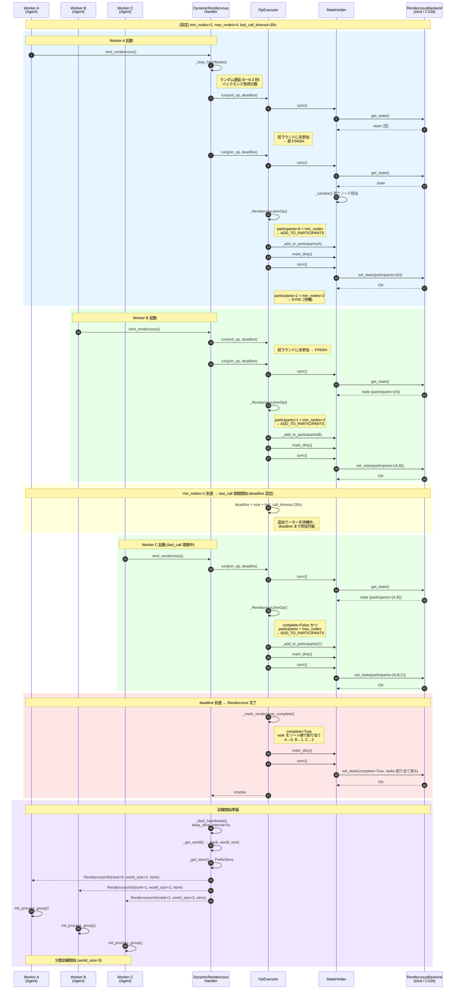
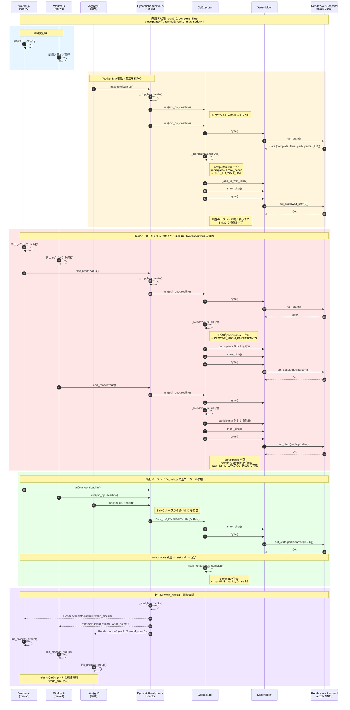
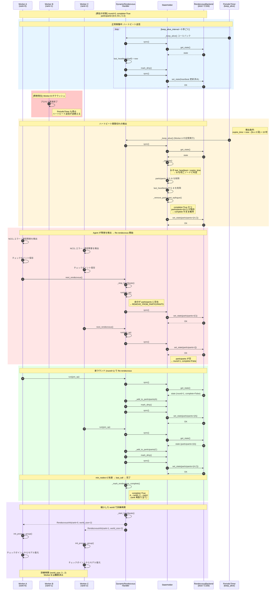
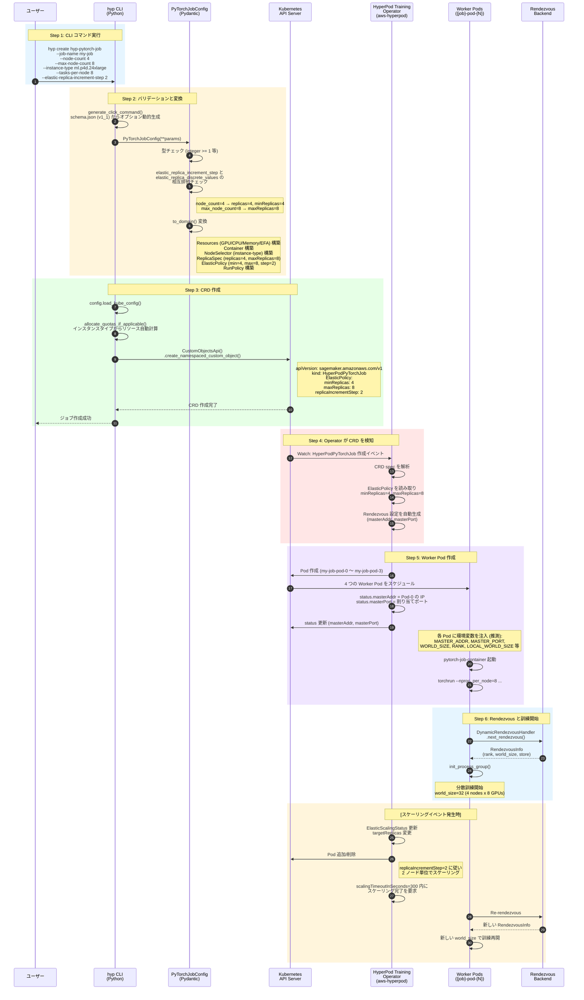

# はじめに

AWS SageMaker HyperPod は、大規模な機械学習モデルの訓練において、**障害からの自動回復**と**リソースの動的管理**を実現する統合的なレジリエンシー機能を提供しています。

本記事では、HyperPod の主要 4 機能（**Checkpointless Training**、**Elastic Training**、**Managed Tiered Checkpointing**、**Health Monitoring Agent**）の技術的な実装方法と相互関係について詳しく解説します。

## 本記事で扱う内容

1. HyperPod の 4 つの主要機能とその相互関係
2. Checkpointless Training と Elastic Training の実装詳細
3. Managed Tiered Checkpointing と Health Monitoring Agent の役割
4. 対応インスタンスタイプと OS（Trainium trn2 の対応状況を含む）
5. 従来手法との違いと分散訓練手法との互換性
6. PyTorch Elastic Rendezvous メカニズムと HyperPod CLI の実装レベル解析
7. Kubernetes での具体的な実装例と GRPO サンプルコード

## 前提条件

本記事では以下を前提としています：

- **SageMaker Pipelines や Training Job は使用しない**
- **Kubernetes (k8s) ネイティブなツールを使用**
- 対象プラットフォーム: **SageMaker HyperPod on EKS**

## 用語の明確化: "Elastic Training"

**重要**: AWS の公式ドキュメントでは「Elastic Training」という用語が環境によって異なる意味で使用されています。

### Slurm 環境での "Elastic Training"

Slurm ベースの HyperPod では、**Auto-Resume（障害時の自動再開）** を指します。

- ノード障害やプリエンプション時にジョブを自動的に再キューイング
- Slurm の `--requeue` オプションによる実装
- 訓練ジョブ全体の再起動が対象

### EKS 環境での "Elastic Training"（本記事の対象）

Kubernetes ベースの HyperPod では、**Elastic Scaling（動的なノード増減）** を指します。

- 訓練中にワーカーノード数を動的に増減
- PyTorch Elastic と Kubeflow Training Operator による実装
- `minReplicas` から `maxReplicas` の範囲で自動調整

**本記事では EKS 環境の Elastic Scaling（動的なノード増減）に焦点を当てます。**

---

# HyperPod の主要機能

SageMaker HyperPod は、大規模な機械学習訓練のレジリエンシー（resilience、回復力）を高めるため、複数の機能を統合的に提供しています。

## 4 つの主要機能

### 1. Checkpointless Training

**目的**: 障害復旧時間の劇的な短縮

- GPU メモリ内の冗長性を利用した高速復旧
- チェックポイント保存を不要にする
- **復旧時間**: 数分（AWS 公式では "minutes" と記載、従来は数時間）
- **追加コスト**: GPU メモリの追加使用あり（具体的な割合は公式未公表）
- **対応環境**: HyperPod EKS のみ
- **必須コンポーネント**: NeMo ベースのカスタム実装（hyperpod_checkpointless_nemo）

参照: https://aws.amazon.com/blogs/aws/introducing-checkpointless-and-elastic-training-on-amazon-sagemaker-hyperpod/

### 2. Elastic Training / Auto-Resume

**目的**: ノード障害時の自動再開

#### EKS 環境: Elastic Training
- 訓練中にワーカーノード数を動的に増減
- PyTorch Elastic の Rendezvous メカニズムを使用
- `minReplicas` から `maxReplicas` の範囲で自動調整

#### Slurm 環境: Auto-Resume
- ノード障害やプリエンプション時にジョブを自動再キューイング
- Slurm の `--requeue` オプションによる実装
- Health Monitoring Agent と連携して自動復旧

### 3. Managed Tiered Checkpointing

**目的**: ストレージ階層の最適化

[注意] この用語は AWS 公式ドキュメントに明示的な記載がなく、サンプルコードのコメントでのみ言及されています。推測される概念は以下の通りです。

- **Tier 1**: 高速ローカルストレージ（FSx for Lustre、ローカル NVMe）
- **Tier 2**: 永続的リモートストレージ（Amazon S3）
- 非同期保存により学習をブロックしない
- 定期的に S3 に自動同期

**SageMaker の標準機能との関連**:
- `/opt/ml/checkpoints` から S3 への自動同期
- この機能が "Managed Tiered checkpointing" の実態の可能性

参照: https://docs.aws.amazon.com/sagemaker/latest/dg/model-checkpoints.html

### 4. Health Monitoring Agent (HMA)

**目的**: ノード障害の早期検出と自動復旧

- すべての HyperPod EKS クラスターで自動的に有効化
- DaemonSet として各ノード上で動作
- GPU/Trainium デバイスの障害を継続的に監視
- **検出時間**: 迅速に検出（具体的な時間は公式未公表）
- **対応**: Node Label/Taint 設定、自動再起動または交換

**監視項目**:
- NVIDIA GPU: DCGM ポリシー違反、nvidia-smi エラー
- AWS Trainium: Neuron Monitor エラー、デバイスカウント検証
- EC2 Platform Log エラー

参照: https://docs.aws.amazon.com/sagemaker/latest/dg/sagemaker-hyperpod-eks-resiliency-health-monitoring-agent.html

## 機能の相互関係

これらの機能は独立して動作しますが、組み合わせることで最大の効果を発揮します。

### 統合された障害復旧フロー

```
[ノード障害発生]
        ↓
[Health Monitoring Agent が検出] (迅速に検出)
        ↓
[Node に Taint 設定、Pod Eviction]
        ↓
[Node Recovery System が自動復旧] (5-10 分)
        ↓
    ┌──────────────────┴──────────────────┐
    ↓                                     ↓
[Checkpointless Training]           [従来のチェックポイント]
GPU メモリから状態復元 (数分)         S3 からロード (60-120 分)
    ↓                                     ↓
[学習再開]                           [学習再開]

合計復旧時間: 数分～20 分程度        合計: 65-130 分程度
```

### 機能の組み合わせパターン

[注意] 以下は各機能の復旧時間の概算です。実際の復旧時間は環境やモデルサイズによって変動します。

| 機能の組み合わせ | 復旧時間（推定） | 用途 |
|----------------|-----------------|------|
| HMA のみ | 数十分 | 基本的な自動復旧 |
| HMA + Checkpointless | 数分～20 分 | 高速復旧が必要な本番環境 |
| HMA + Managed Tiered Checkpointing | 数十分 | 長期訓練でコスト最適化 |
| HMA + Checkpointless + Managed Tiered | 数分～20 分 | 最高レベルの可用性とコスト最適化 |
| HMA + Elastic Training | 可変 | 動的リソース調整が必要な環境 |

### Checkpointless vs Managed Tiered Checkpointing

| 項目 | Checkpointless Training | Managed Tiered Checkpointing |
|------|------------------------|------------------------------|
| **目的** | 障害復旧時間の短縮 | チェックポイント管理の効率化 |
| **復旧時間** | 数分 | 数時間（S3 からの取得が必要な場合） |
| **追加コスト** | GPU メモリの追加使用 | ストレージコスト |
| **ディスク I/O** | なし | 定期的な S3 アップロード |
| **同時使用** | 可能 | Checkpointless を補完 |
| **対応環境** | HyperPod EKS のみ | EKS、Slurm、通常の EC2 |

---

# Checkpointless Training とは（詳細）

## 概要

Checkpointless Training は、AWS SageMaker HyperPod に実装された機能で、**インフラストラクチャの障害から数分以内に自動回復**する仕組みです。

従来の訓練では、定期的にモデルの状態（チェックポイント）をディスクに保存し、障害発生時にはそこから復元する必要がありました。しかし、大規模モデルではチェックポイントの保存に数分かかり、ストレージも大量に消費します（例: Llama 3 70B で 100GB 以上）。

Checkpointless Training は、この**チェックポイント保存を不要にし**、メモリ効率とストレージ効率を両立させます。

参照：https://aws.amazon.com/sagemaker/hyperpod/

## 主な利点

1. **I/O オーバーヘッドの削減**: ディスクへの書き込みが不要
2. **ストレージコストの削減**: 大規模モデルのチェックポイント保存が不要
3. **復旧時間の短縮**: 障害から数分以内に自動回復
4. **トレーニング時間の削減**: Checkpointless Training を含む HyperPod のレジリエンシー機能全体で最大 40% のトレーニング時間削減（AWS 公式情報）
5. **市場投入時間の短縮**: 数週間の時間節約が可能

## 対象モデル

現時点で以下のモデルがサポートされています：

- **Llama 3 70B**（LoRA、事前学習）
- **GPT-OSS 120B**（完全微調整、LoRA）

参照：https://github.com/aws/sagemaker-hyperpod-recipes

---

# Elastic Training とは

## 概要

Elastic Training は、訓練ジョブ実行中に**ノード数を動的に増減できる**機能です。PyTorch Elastic と Kubeflow Training Operator の統合により、以下が可能になります：

- トレーニングフェーズに合わせた計算リソースの最適化
- コスト効率の向上（必要なときだけリソースを追加）
- ノード障害時の自動回復と再開

## 技術的基盤

Elastic Training は以下の技術スタックで実現されています：

### PyTorch Elastic

PyTorch の `torch.distributed.elastic` モジュールを使用し、**Rendezvous** と呼ばれるメカニズムでワーカーノードの動的な増減を管理します。

- **Rendezvous Backend**: etcd または c10d を使用
- **動的なワールドサイズ変更**: `WORLD_SIZE` と `RANK` を自動更新
- **Fault Tolerance**: ノード障害時の自動再起動

参照：https://pytorch.org/docs/stable/distributed.html

### Kubeflow Training Operator

Kubernetes カスタムリソース `PyTorchJob` を使用し、Kubernetes ネイティブな方法で分散訓練を管理します。

- **ElasticPolicy**: `minReplicas` と `maxReplicas` で動的スケーリングを定義
- **Auto-Resume**: Pod 障害時の自動再開
- **kubectl 統合**: 標準的な Kubernetes ツールで管理

参照：https://www.kubeflow.org/docs/components/training/pytorch/

---

# 対応インスタンスタイプと OS

## 対応インスタンスタイプ

SageMaker HyperPod では以下のインスタンスタイプで Checkpointless/Elastic Training が利用可能です。

### Trainium インスタンス（AWS Neuron）

| インスタンスタイプ | 世代 | チップ数 | HyperPod 対応 |
|-------------------|------|---------|--------------|
| ml.trn1.32xlarge | 第 1 世代 | 16 | 対応 |
| ml.trn1n.32xlarge | 第 1 世代拡張 | 16 | 対応 |
| **ml.trn2.3xlarge** | **第 2 世代** | **1** (推定) | **対応** |
| **ml.trn2.48xlarge** | **第 2 世代** | **16** | **対応** |

[重要] **trn2 インスタンスは SageMaker HyperPod でサポートされています**（API ドキュメントで確認済み）。ただし、Checkpointless Training 等の個別機能の trn2 での動作検証状況は公式に明示されていません。

参照：
- https://docs.aws.amazon.com/sagemaker/latest/APIReference/API_ClusterInstanceGroupSpecification.html
- https://aws.amazon.com/machine-learning/trainium/

### GPU インスタンス

| シリーズ | インスタンス例 | GPU | HyperPod 対応 |
|---------|--------------|-----|--------------|
| P5 | ml.p5.48xlarge | H100 x8 | 対応 |
| P4 | ml.p4d.24xlarge | A100 x8 | 対応 |
| P6 | ml.p6e-gb200.36xlarge | Blackwell GB200 | 対応 |

## 対応 OS

### Trainium インスタンス（Neuron SDK）

推奨 OS（2024 年 12 月以降）：

- **Ubuntu 22.04 LTS**（推奨）
- **Amazon Linux 2023**

注意: Neuron SDK 2.21.0 以降、すべての Deep Learning Container (DLC) が Ubuntu 22.04 に移行しました。

参照：https://awsdocs-neuron.readthedocs-hosted.com/en/latest/release-notes/containers/neuron-dlc.html

### GPU インスタンス（CUDA）

対応 OS：

- Ubuntu 24.04 LTS, 22.04 LTS（推奨）
- Amazon Linux 2023
- Red Hat Enterprise Linux 10, 9, 8
- Debian 12, 13

参照：https://docs.nvidia.com/cuda/cuda-installation-guide-linux/

## SDK/ドライバ要件

### Trainium（Neuron SDK）

- **Neuron SDK**: 2.27.1（2026 年 1 月リリース）
- **PyTorch NeuronX**: 2.5.1 推奨（2.9 が NxDT 最終サポート）
- **Python**: 3.11, 3.12
- **重要**: PyTorch 2.10 以降は native PyTorch + TorchTitan への移行が推奨

参照：https://github.com/aws-neuron/aws-neuron-sdk/releases

### GPU（CUDA）

- **CUDA**: 最新推奨（12.x 系または 13.x 系）
- **NVIDIA Driver**: 最新推奨
- **cuDNN/TensorRT**: CUDA 対応版

参照：https://docs.nvidia.com/cuda/cuda-installation-guide-linux/

---

# 従来手法との違い

## アプリケーション側でのチェックポイント保存との違い

### 従来の PyTorch チェックポイント

```python
# 従来の手法
torch.save({
    'epoch': epoch,
    'model_state_dict': model.state_dict(),
    'optimizer_state_dict': optimizer.state_dict(),
    'loss': loss,
}, checkpoint_path)
```

#### 従来手法の課題

| 項目 | 従来のチェックポイント保存 | Checkpointless Training |
|-----|-------------------------|------------------------|
| **I/O オーバーヘッド** | 大（モデルサイズに比例、数分） | なし（メモリ内保持） |
| **ストレージ使用量** | 大（70B モデルで 100GB+） | 最小 |
| **復旧時間** | 中（チェックポイントロード + 初期化） | 短（数分以内） |
| **保存頻度** | Epoch ごと、または数ステップごと | 不要 |

参照：https://docs.pytorch.org/tutorials/beginner/saving_loading_models.html

## Slurm Auto-Resume との違い

### Slurm の `--requeue` オプション

```bash
sbatch --requeue --time=48:00:00 train.sh
```

Slurm の auto-resume は**ジョブスケジューラレベル**での再起動です：

- ノード障害やプリエンプション時にジョブを再キューイング
- **バッチスクリプトを最初から実行**
- チェックポイントがない場合は訓練が最初からやり直し

| 項目 | Slurm Auto-Resume | HyperPod Checkpointless |
|-----|------------------|------------------------|
| **制御レベル** | ジョブスケジューラ | フレームワーク |
| **復旧粒度** | ジョブ全体 | ステート保持 |
| **訓練進捗** | 最初からやり直し | 継続実行 |
| **オーバーヘッド** | スケジューリング遅延 | 最小 |

参照：https://slurm.schedmd.com/sbatch.html

## Kubernetes Job の Restart Policy との違い

### Kubernetes Job

```yaml
apiVersion: batch/v1
kind: Job
metadata:
  name: training-job
spec:
  backoffLimit: 4
  template:
    spec:
      containers:
      - name: trainer
        image: training: latest
      restartPolicy: OnFailure
```

Kubernetes Job は**単純なリトライメカニズム**のみを提供：

- Pod 失敗時に新しい Pod を起動
- `backoffLimit` に達するまで再試行
- **ステート保持なし**（最初から実行）

| 項目 | K8s Job | K8s StatefulSet | HyperPod |
|-----|---------|----------------|----------|
| **自動再起動** | あり（OnFailure） | あり（Always） | あり（Auto-Resume） |
| **状態保持** | なし | PVC による永続化 | メモリ内保持 |
| **ノード障害対応** | 新 Pod 起動 | 新 Pod + PVC | 自動回復 |
| **復旧時間** | 遅い（初期化から） | 中程度（ロード時間） | 短い（数分以内） |

参照：https://kubernetes.io/docs/concepts/workloads/controllers/job/

---

# ノード増減のメカニズム

## 増減の単位

Elastic Training では**ノード単位**でスケーリングが行われます。

### Kubeflow PyTorchJob の ElasticPolicy

```yaml
apiVersion: kubeflow.org/v1
kind: PyTorchJob
metadata:
  name: elastic-training
spec:
  elasticPolicy:
    rdzvBackend: etcd
    rdzvHost: etcd
    rdzvPort: 2379
    minReplicas: 1      # 最小ワーカー数
    maxReplicas: 64     # 最大ワーカー数
    maxRestarts: 100    # 最大リスタート回数
```

- **minReplicas**: 訓練を開始するための最小ノード数
- **maxReplicas**: スケールアップ可能な最大ノード数
- **動的範囲**: `minReplicas` から `maxReplicas` の間で自動調整

参照：https://github.com/aws-samples/awsome-distributed-training/blob/main/3.test_cases/pytorch/neuronx-distributed/llama3/kubernetes/llama3_train.yaml-template

## トリガー方式

### 1. 手動トリガー

Kubernetes の標準コマンドでノード数を変更：

```bash
# PyTorchJob の Worker レプリカ数を変更
kubectl scale pytorchjob elastic-training --replicas=8
```

### 2. メトリクスベーストリガー（HPA）

Horizontal Pod Autoscaler (HPA) を使用：

```yaml
elasticPolicy:
  metrics:
    - type: Resource
      resource:
        name: cpu
        target:
          type: Utilization
          averageUtilization: 90
```

- CPU/GPU 使用率に基づいて自動スケーリング
- カスタムメトリクスも設定可能（例: スループット、loss 値）

### 3. 自動トリガー（Rendezvous）

PyTorch Elastic の Rendezvous メカニズム：

- 新規ノード参加を自動検出
- ノード障害を自動検出
- 検出後、自動的に再 rendezvous を実行

## 技術的な実現方法

### PyTorch Elastic の Rendezvous メカニズム

```bash
torchrun \
  --nnodes=2:8 \
  --nproc-per-node=8 \
  --rdzv-backend=c10d \
  --rdzv-endpoint=$MASTER_ADDR: $MASTER_PORT \
  --rdzv-id=$JOB_ID \
  --max-restarts=3 \
  train.py
```

#### Rendezvous の動作

1. **バリア機構（Barrier）**
   - 最小ノード数（`minReplicas`）に達するまでブロック
   - 最大ノード数（`maxReplicas`）到達で即座に完了

2. **排他性（Exclusivity）**
   - 複数のワーカーグループが並行形成されることを防止
   - 既存の rendezvous 完了時、新規ノードは待機

3. **一貫性（Consistency）**
   - 全メンバーが統一された `RANK` 割り当てに同意
   - 再 rendezvous 時に `RANK` が変更される可能性

4. **耐障害性（Fault Tolerance）**
   - ノード障害時に自動的に再 rendezvous 実行
   - クラッシュや接続喪失を許容

参照：
- PyTorch Elastic: https://pytorch.org/docs/stable/elastic/run.html
- Rendezvous 実装: https://github.com/pytorch/pytorch (torch/distributed/elastic/rendezvous/)

### etcd ベースの実装

```yaml
# etcd Service（クライアント通信用）
apiVersion: v1
kind: Service
metadata:
  name: etcd
spec:
  ports:
    - name: etcd-client-port
      port: 2379
      protocol: TCP
      targetPort: 2379
  selector:
    app: etcd
---
# etcd Deployment
apiVersion: apps/v1
kind: Deployment
metadata:
  name: etcd
spec:
  replicas: 1
  template:
    spec:
      containers:
        - name: etcd
          image: quay.io/coreos/etcd: v3.5.19
          command:
            - /usr/local/bin/etcd
          args:
            - "--enable-v2"
            - "--listen-client-urls=http://0.0.0.0:2379"
            - "--advertise-client-urls=http://etcd:2379"
      restartPolicy: Always
```

etcd は**分散合意アルゴリズム**（Raft）を使用し、以下を管理：

- ワーカーノードのメンバーシップ情報
- 現在のワールドサイズと各ノードのランク
- Rendezvous の状態（waiting, running, completed）

## スケーリングイベントの処理

### ノード増加時

1. 新しいノードが etcd に参加を登録
2. etcd が rendezvous 完了を通知
3. **既存ワーカーが一時停止**
4. 新しいワーカーグループが形成（`WORLD_SIZE` が増加）
5. 全ワーカーが新しい `RANK` と `WORLD_SIZE` で再起動

### ノード減少時

1. エージェントが離脱を検出（タイムアウトまたは明示的な離脱）
2. **既存ワーカーが一時停止**
3. 残りのノードで新しいワーカーグループ形成（`WORLD_SIZE` が減少）
4. 全ワーカーが更新された `RANK` と `WORLD_SIZE` で再起動

### トレーニングへの影響

- **一時停止の有無**: 現在の実装では一時停止が発生します（全プロセス再起動）
- **ダウンタイム**: 数秒～数十秒（rendezvous + プロセス起動時間）
- **状態復元**: Checkpointless Training の場合はメモリ内状態から復元
- **バッチサイズ調整**: `WORLD_SIZE` 変更により、グローバルバッチサイズが変わる可能性

---

# 分散訓練手法との互換性

Elastic Training（動的ノード増減）は、使用する分散訓練手法によって対応状況が異なります。

## 主要な分散訓練手法

### DDP (Distributed Data Parallel)

| 項目 | 対応状況 |
|------|---------|
| **Elastic Training** | ✅ 完全対応 |
| **Checkpointless Training** | ✅ 対応 |
| **備考** | PyTorch Elastic の標準サポート |

### FSDP (Fully Sharded Data Parallel)

| 項目 | 対応状況 |
|------|---------|
| **Elastic Training** | ✅ 対応 |
| **Checkpointless Training** | ✅ 対応 |
| **備考** | FSDP2 では制約あり（シャーディング戦略の再構成が必要） |

### DeepSpeed ZeRO

| 項目 | 対応状況 |
|------|---------|
| **Elastic Training** | △ 部分対応 |
| **Checkpointless Training** | ✅ 対応 |
| **備考** | ZeRO Stage 3 ではモデルの再シャーディングが必要 |

### NxD (NeuronX Distributed Training)

| 項目 | 対応状況 |
|------|---------|
| **Elastic Training** | ❌ 未対応 |
| **Checkpointless Training** | ✅ 対応 |
| **備考** | Neuron SDK は固定ノード数での訓練を前提 |

### GRPO (Group Relative Policy Optimization)

| 項目 | 対応状況 |
|------|---------|
| **Elastic Training** | ❌ 困難 |
| **Checkpointless Training** | △ 不明（公式の検証情報なし） |
| **備考** | 複数モデル（Actor, Ref, Reward）管理と生成フェーズ分離が課題 |

**GRPO 実装例**:
- **TRL 実装**: https://github.com/aws-samples/awsome-distributed-training/tree/main/3.test_cases/pytorch/trl/grpo
  - Slurm ベース、DeepSpeed ZeRO-3、Qwen2.5-72B モデルで検証済み
- **VERL 実装**: https://github.com/aws-samples/awsome-distributed-training/tree/main/3.test_cases/pytorch/verl/rlvr
  - EKS + Ray ベース、FSDP、p5en.48xlarge 4 ノード環境で検証

## Elastic Training の制約

ノード数の動的変更が困難な理由：

1. **モデルのシャーディング再構成**: ZeRO Stage 3 や FSDP でパラメータが分散されている場合、ノード数変更時に再シャーディングが必要
2. **固定的なアーキテクチャ**: Tensor Parallel や Pipeline Parallel は固定ノード数を前提
3. **生成フェーズとの依存**: GRPO のような RL 手法では、生成サーバー（vLLM）との密結合が課題
4. **オーケストレーションの制約**: Ray クラスタや Neuron Runtime は実行中のノード数変更に対応していない

---

# 実装レベルの詳細解析

## PyTorch Elastic Rendezvous メカニズムの実装

PyTorch Elastic の Rendezvous メカニズムは、分散訓練において複数のワーカーノードが「集合」し、互いを発見し、役割（rank）を合意するための仕組みです。内部実装には 2 つの方式があります。

### DynamicRendezvousHandler（推奨実装）

最新の推奨実装は `DynamicRendezvousHandler` で、状態機械パターンを使用しています。

ソースコード: https://github.com/pytorch/pytorch/blob/main/torch/distributed/elastic/rendezvous/dynamic_rendezvous.py

#### 状態モデル

Rendezvous の状態は `_RendezvousState` クラスで管理されます（272-316 行目）。

```python
class _RendezvousState:
    round: int              # Rendezvous のラウンド番号
    complete: bool          # 現在のラウンドが完了したか
    deadline: datetime | None  # last_call タイムアウトのデッドライン
    closed: bool            # Rendezvous が閉じられたか
    participants: dict[_NodeDesc, int]  # 参加者ノード → rank のマッピング
    wait_list: set[_NodeDesc]          # 次のラウンドの待機リスト
    redundancy_list: set[_NodeDesc]    # 冗長ノードリスト（max_nodes 超過時）
    last_heartbeats: dict[_NodeDesc, datetime]  # ノードごとの最終ハートビート時刻
```

#### アクション定義

13 種類のアクションで状態遷移を制御します（526-541 行目）：

- `ADD_TO_PARTICIPANTS`: 参加者リストへの追加
- `REMOVE_FROM_PARTICIPANTS`: 参加者リストからの削除
- `ADD_TO_WAIT_LIST`: 待機リストへの追加
- `MARK_RENDEZVOUS_COMPLETE`: Rendezvous 完了マーク
- `KEEP_ALIVE`: ハートビート送信
- `SYNC`: バックエンドとの同期待ち
- `FINISH`: 操作完了
- その他のアクション

#### ワーカー参加のロジック

`_RendezvousJoinOp.__call__` メソッド（870-971 行目）で参加判定を行います：

1. **Rendezvous が閉鎖されている場合**: `ERROR_CLOSED` を返す
2. **完了済み & 既に参加者の場合**: `FINISH` を返す
3. **未完了 & 未参加の場合**: `ADD_TO_PARTICIPANTS` を返す
4. **完了済み & 未参加の場合**:
   - 参加者数 < max_nodes なら `ADD_TO_WAIT_LIST`（次のラウンド待ち）
   - 参加者数 >= max_nodes なら `ADD_TO_REDUNDANCY_LIST`

#### minReplicas/maxReplicas の適用

`_add_to_participants` メソッド（722-749 行目）で以下のロジックが実装されています：

```python
def _add_to_participants(self) -> None:
    state.participants[self._node] = 0  # rank は後で設定

    # min_nodes に達したら last_call deadline を設定
    if len(state.participants) == self._settings.min_nodes:
        state.deadline = datetime.now(timezone.utc) + self._settings.timeout.last_call

    # max_nodes に達したら即座に Rendezvous 完了
    if len(state.participants) == self._settings.max_nodes:
        self._mark_rendezvous_complete()
```

**重要なポイント**: min_nodes に達すると `last_call` タイムアウト（デフォルト 30 秒）が開始され、この期間中に追加のワーカーが参加可能。max_nodes に達すると即座に完了。

#### ワーカー死亡検出

`_sanitize` メソッド（472-513 行目）で定期的にハートビートをチェック：

```python
def _sanitize(self) -> None:
    expire_time = datetime.now(timezone.utc) - (
        keep_alive_interval * keep_alive_max_attempt
    )

    # ハートビートが expire_time より古いノードを「死亡」と判定
    dead_nodes = [
        node for node, last_heartbeat in state.last_heartbeats.items()
        if last_heartbeat < expire_time
    ]

    for dead_node in dead_nodes:
        del state.participants[dead_node]  # 参加者から削除
```

- **ハートビート間隔**: 5 秒ごと（`keep_alive_interval`）
- **死亡判定**: 15 秒（5 秒 × 3 回）ハートビートがないノードを死亡と判定
- **Re-rendezvous トリガー**: 参加者が 0 になると `round++` で新ラウンド開始（318-337 行目）

参照: https://github.com/pytorch/pytorch/blob/main/torch/distributed/elastic/rendezvous/dynamic_rendezvous.py

### EtcdRendezvous（レガシー実装）

レガシー実装は etcd を直接使用した CAS（Compare-and-Swap）パターンです。

ソースコード: https://github.com/pytorch/pytorch/blob/main/torch/distributed/elastic/rendezvous/etcd_rendezvous.py

#### 状態遷移モデル

4 つの状態を遷移します（221-260 行目）：

```
[空] → setup → joinable → frozen → final
```

- **setup**: Rendezvous 初期化（TTL 5 秒）
- **joinable**: ワーカー参加受付中（TTL 10 秒、min_workers 到達後）
- **frozen**: 全員揃った状態（TTL 10 秒）
- **final**: 確認完了、訓練開始可能

#### CAS パターンによる参加

`join_rendezvous` メソッド（517-565 行目）で楽観的ロックを実現：

```python
def join_rendezvous(self, expected_version):
    while True:
        cas_delay()  # ランダム遅延
        active_version, state = self.get_rdzv_state()

        this_rank = len(state["participants"])
        state["participants"].append(this_rank)

        # CAS で書き込み
        active_version = self.client.test_and_set(
            key=..., value=json.dumps(state),
            prev_value=active_version.value, ttl=set_ttl
        )
```

#### ワーカー死亡検出

`wait_for_rendezvous_to_free` メソッド（680-745 行目）で keep-alive キーの存在を確認：

```python
# keep-alive キーの存在を確認
for key in state["keep_alives"]:
    if key not in keep_alive_keys:
        # このワーカーはリースを更新しなかった = 死亡
        # CAS で Rendezvous を破壊 → 新しい Rendezvous の作成を許可
        self.client.delete(
            key="/rdzv/active_version",
            prevValue=active_version.value,
        )
```

参照: https://github.com/pytorch/pytorch/blob/main/torch/distributed/elastic/rendezvous/etcd_rendezvous.py

---

## HyperPod CLI の elastic パラメータ実装

HyperPod CLI（`sagemaker-hyperpod` パッケージ）は `hyp` コマンドとして提供され、elastic training パラメータを処理します。

ソースコード: https://github.com/aws/sagemaker-hyperpod-cli

### CLI パラメータの定義

以下の 6 つの elastic パラメータが JSON Schema（v1_1）で定義されています：

| CLI パラメータ | 型 | デフォルト | 説明 |
|---|---|---|---|
| `--elastic-replica-increment-step` | INTEGER (>=1) | null | スケーリングのステップサイズ |
| `--max-node-count` | INTEGER (>=1) | null | elastic training の最大ノード数 |
| `--elastic-graceful-shutdown-timeout-in-seconds` | INTEGER (>=0) | null | グレースフルシャットダウンタイムアウト |
| `--elastic-scaling-timeout-in-seconds` | INTEGER (>=0) | null | スケーリング操作のタイムアウト |
| `--elastic-scale-up-snooze-time-in-seconds` | INTEGER (>=0) | null | 再起動後のスケールアップ禁止期間 |
| `--elastic-replica-discrete-values` | ARRAY[int] | null | レプリカ数の離散値リスト |

参照: https://github.com/aws/sagemaker-hyperpod-cli/blob/main/hyperpod-pytorch-job-template/hyperpod_pytorch_job_template/v1_1/schema.json

### JSON Schema からの動的生成

HyperPod CLI は JSON Schema から CLI オプションを動的に生成します（`training_utils.py: generate_click_command()`）：

```python
def wrapped_func(*args, **kwargs):
    Model = registry.get(version)       # PyTorchJobConfig クラスを取得
    flat = Model(**filtered_kwargs)      # フラットモデルでバリデーション
    domain = flat.to_domain()            # HyperPodPytorchJob に変換
    return func(version, debug, domain)  # ジョブ作成
```

参照: https://github.com/aws/sagemaker-hyperpod-cli/blob/main/src/sagemaker/hyperpod/cli/training_utils.py

### ElasticPolicy への変換

`to_domain()` メソッド（model.py:560-582 行目）で、フラットな CLI パラメータが ElasticPolicy に変換されます：

```python
elastic_policy = None
if any([
    self.elastic_replica_increment_step is not None,
    self.max_node_count is not None,
    ...
]):
    elastic_policy_kwargs = build_dict(
        min_replicas=self.node_count,           # node_count が min_replicas になる
        max_replicas=self.max_node_count,       # max_node_count が max_replicas になる
        ...
    )
    elastic_policy = ElasticPolicy(**elastic_policy_kwargs)
```

**重要なポイント**:
- `--node-count` が `ElasticPolicy.minReplicas` に自動マッピングされる
- `--max-node-count` が `ElasticPolicy.maxReplicas` に設定される

参照: https://github.com/aws/sagemaker-hyperpod-cli/blob/main/hyperpod-pytorch-job-template/hyperpod_pytorch_job_template/v1_1/model.py

### HyperPodPyTorchJob CRD の作成

`HyperPodPytorchJob.create()` メソッド（hyperpod_pytorch_job.py:228-287 行目）で Kubernetes CRD を作成：

```python
def create(self, debug=False):
    config = {
        "apiVersion": "sagemaker.amazonaws.com/v1",
        "kind": "HyperPodPyTorchJob",
        "spec": spec.model_dump(exclude_none=True),
    }

    custom_api = client.CustomObjectsApi()
    custom_api.create_namespaced_custom_object(
        group="sagemaker.amazonaws.com",
        version="v1",
        namespace=self.metadata.namespace,
        plural="hyperpodpytorchjobs",
        body=config,
    )
```

**重要な発見**: HyperPod CLI は Kubeflow の `PyTorchJob` (`kubeflow.org/v1`) ではなく、**SageMaker 独自の `HyperPodPyTorchJob` CRD**（`sagemaker.amazonaws.com/v1`）を生成します。

参照: https://github.com/aws/sagemaker-hyperpod-cli/blob/main/src/sagemaker/hyperpod/training/hyperpod_pytorch_job.py

### Rendezvous 設定の自動管理

`rdzvBackend`, `rdzvHost`, `rdzvPort` は HyperPod の ElasticPolicy には含まれず、**HyperPod Training Operator が自動設定**します。Operator は `masterAddr` と `masterPort` を status に設定し、各 Pod に環境変数として注入します（推測）。

---

## 実装詳細: シーケンス図

以下の 4 つのシーケンス図で、Rendezvous メカニズムと HyperPod CLI の処理フローを詳細に説明します。

### 1. Rendezvous 初期化シーケンス図

ワーカーノードが起動してから Rendezvous が完了し、分散訓練が開始されるまでのフロー。



**補足**:
- `min_nodes` 到達前は SYNC アクションで待機ループし、定期的にバックエンドと状態を同期
- `max_nodes` に到達した場合は deadline を待たず即座に `_mark_rendezvous_complete()` が実行される
- rank はノード ID のソート順で 0 から割り当てられる

---

### 2. ワーカー追加時のシーケンス図

Rendezvous 完了後に新しいワーカーが参加し、Re-rendezvous が発生するフロー。



**補足**:
- 新ワーカーは `complete=True` の状態では直接参加できず、`wait_list` に追加される
- `max_nodes` に達している場合は `redundancy_list` に追加され、空きが出るまで待機
- Re-rendezvous は既存ワーカーが `next_rendezvous()` を再呼び出しすることで発生
- Agent（elastic_agent）がワーカーの状態変化を検知し、チェックポイント保存後に Re-rendezvous をトリガー

---

### 3. ワーカー離脱時のシーケンス図

ワーカーノードの障害発生からハートビートのタイムアウト検出、Re-rendezvous、訓練再開までのフロー。



**補足**:
- ハートビートの期限切れ検出は `_sanitize()` で行われ、`keep_alive_interval(5s) x keep_alive_max_attempt(3) = 15 秒` がタイムアウト値
- 障害ノードの除去は他ワーカーの `sync()` 時に自動的に実行される
- `min_nodes` 未満に減少した場合は `deadline` がクリアされ、新しいワーカーの参加を待つ状態に戻る
- チェックポイントからの復元はアプリケーション側の責務であり、Rendezvous メカニズム自体は rank と world_size の再割り当てのみを行う

---

### 4. HyperPod CLI と HyperPodPyTorchJob の連携図

`hyp` CLI コマンドから HyperPod Training Operator を経由して分散訓練が開始されるまでの処理フロー。



**補足**:
- HyperPod は Kubeflow の PyTorchJob (`kubeflow.org/v1`) ではなく、SageMaker 独自の CRD (`sagemaker.amazonaws.com/v1` / `HyperPodPyTorchJob`) を使用
- `rdzvBackend`, `rdzvHost`, `rdzvPort` は HyperPod の ElasticPolicy には存在せず、Operator が自動的に管理
- `--node-count` は `ReplicaSpec.replicas`（初期レプリカ数）と `ElasticPolicy.minReplicas`（最小レプリカ数）の両方に設定される
- `--max-node-count` は `ReplicaSpec.maxReplicas` と `ElasticPolicy.maxReplicas` の両方に設定される
- HyperPod Training Operator のソースコードは非公開のため、Operator 内部の処理は CLI コードからの推測を含む

---

# Kubernetes での実装例

## SageMaker HyperPod on EKS の構成

### アーキテクチャ

```
┌─────────────────────┐
│  Amazon EKS         │
│  (Control Plane)    │
└──────────┬──────────┘
           │ 1:1 mapping
┌──────────▼──────────┐
│  SageMaker HyperPod │
│  (Worker Nodes)     │
│  - trn1/trn2        │
│  - p4/p5/p6         │
└─────────────────────┘
```

- EKS クラスタと HyperPod クラスタが 1 対 1 でマッピング
- `kubectl` で直接操作可能
- SSM/SSH でインスタンスアクセス可能

参照：https://docs.aws.amazon.com/sagemaker/latest/dg/sagemaker-hyperpod-eks.html

## PyTorchJob with ElasticPolicy の例

以下は、AWS Trainium (trn1) で Llama 3 を訓練する完全な YAML 例です。

```yaml
---
# etcd Service（Rendezvous 用）
apiVersion: v1
kind: Service
metadata:
  name: etcd
spec:
  ports:
    - name: etcd-client-port
      port: 2379
      protocol: TCP
      targetPort: 2379
  selector:
    app: etcd
---
# etcd Deployment
apiVersion: apps/v1
kind: Deployment
metadata:
  labels:
    app: etcd
  name: etcd
spec:
  replicas: 1
  selector:
    matchLabels:
      app: etcd
  template:
    metadata:
      creationTimestamp: null
      labels:
        app: etcd
    spec:
      containers:
        - command:
            - /usr/local/bin/etcd
          args:
            - "--enable-v2"
            - "--listen-client-urls=http://0.0.0.0:2379"
            - "--advertise-client-urls=http://etcd:2379"
          image: quay.io/coreos/etcd: v3.5.19
          name: etcd
          ports:
            - containerPort: 2379
              name: client
              protocol: TCP
            - containerPort: 2380
              name: server
              protocol: TCP
      restartPolicy: Always
---
# PyTorchJob（Elastic Training）
apiVersion: "kubeflow.org/v1"
kind: PyTorchJob
metadata:
  name: trn1-llama3-elastic
spec:
  elasticPolicy:
    rdzvBackend: etcd
    rdzvHost: etcd
    rdzvPort: 2379
    minReplicas: 1
    maxReplicas: 64
    maxRestarts: 100
    metrics:
      - type: Resource
        resource:
          name: cpu
          target:
            type: Utilization
            averageUtilization: 90
  pytorchReplicaSpecs:
    Worker:
      replicas: 4  # 初期ワーカー数
      restartPolicy: OnFailure
      template:
        metadata:
          labels:
            app: trn1-llama3
        spec:
          containers:
            - name: pytorch
              image: <AWS-ACCOUNT-ID>.dkr.ecr.<REGION>.amazonaws.com/neuron-training: latest
              imagePullPolicy: Always
              command:
                - torchrun
                - --nproc_per_node=32
                - --nnodes=$NUM_NODES
                - train.py
                - --checkpoint_freq=1000
                - --num_kept_checkpoint=5
                - --checkpoint_dir=/fsx/checkpoints
              env:
                - name: NEURON_RT_NUM_CORES
                  value: "32"
                - name: FI_PROVIDER
                  value: efa
                - name: FI_EFA_USE_DEVICE_RDMA
                  value: "1"
                - name: NEURON_CC_FLAGS
                  value: "--model-type transformer --distribution-strategy=llm-training"
              resources:
                requests:
                  aws.amazon.com/neuron: 16
                  vpc.amazonaws.com/efa: 8
                limits:
                  aws.amazon.com/neuron: 16
                  vpc.amazonaws.com/efa: 8
              volumeMounts:
                - name: persistent-storage
                  mountPath: /fsx
          volumes:
            - name: persistent-storage
              persistentVolumeClaim:
                claimName: fsx-claim
```

参照：https://github.com/aws-samples/awsome-distributed-training/blob/main/3.test_cases/pytorch/neuronx-distributed/llama3/kubernetes/llama3_train.yaml-template

## Helm Chart によるインストール

SageMaker HyperPod CLI は Helm Chart を提供しています：

```bash
# リポジトリのクローン
git clone https://github.com/aws/sagemaker-hyperpod-cli.git
cd sagemaker-hyperpod-cli/helm_chart

# 依存関係の更新
helm dependencies update HyperPodHelmChart

# インストール
helm install hyperpod-dependencies HyperPodHelmChart \
  --namespace kube-system \
  --set health-monitoring-agent.enabled=true \
  --set health-monitoring-agent.region=us-west-2 \
  --set deep-health-check.enabled=true \
  --set job-auto-restart.enabled=true
```

インストールされるコンポーネント：

- **Kubeflow Training Operator**: PyTorchJob の管理
- **MPI Operator**: MPI ベースの分散訓練
- **EFA Device Plugin**: Elastic Fabric Adapter の最適化
- **Neuron Device Plugin**: Trainium/Inferentia アクセス
- **Health Monitoring Agent**: ノードのヘルスチェック
- **Job Auto-Restart**: PyTorchJob の自動再開

参照：https://github.com/aws/sagemaker-hyperpod-cli/tree/main/helm_chart

## HyperPod CLI の使用

```bash
# インストール
pip install sagemaker-hyperpod

# クラスター接続
hyp set-cluster-context --cluster-name my-hyperpod-cluster

# PyTorchJob の作成
hyp create hyp-pytorch-job \
  --job-name llama3-training \
  --image <ECR-IMAGE> \
  --command '[python, train.py]' \
  --instance-type ml.trn2.48xlarge \
  --tasks-per-node 32

# ジョブの確認
kubectl get pytorchjobs -n hyperpod

# ログの確認
kubectl logs <pod-name> -n hyperpod
```

参照：https://github.com/aws/sagemaker-hyperpod-cli

## Resilience 機能の設定

```yaml
# values.yaml（Helm Chart）
health-monitoring-agent:
  enabled: true
  region: us-west-2

deep-health-check:
  enabled: true
  interval: 300  # 5 分ごと

job-auto-restart:
  enabled: true
  max-retry: 10
```

Resilience 機能により以下が提供されます：

- **Basic Health Checks**: 基本的なノードヘルスチェック
- **Deep Health Checks**: 詳細なハードウェアチェック（GPU/Neuron）
- **Automatic Node Recovery**: 障害ノードの自動交換
- **Job Auto-Restart**: PyTorchJob の自動再開

参照：https://docs.aws.amazon.com/sagemaker/latest/dg/sagemaker-hyperpod-eks-resiliency.html

---

# まとめ

## HyperPod の 4 つの主要機能

### 1. Checkpointless Training

| 項目 | 詳細 |
|-----|-----|
| **目的** | インフラ障害からの自動回復 |
| **復旧時間** | 数分（従来は数時間） |
| **対象** | 大規模モデル（Llama 3 70B、GPT-OSS 120B） |
| **削減効果** | HyperPod 全体でトレーニング時間最大 40%、ストレージコスト削減 |
| **対応環境** | HyperPod EKS のみ |

### 2. Elastic Training / Auto-Resume

| 項目 | 詳細 |
|-----|-----|
| **目的** | ノード障害時の自動再開・動的スケーリング |
| **EKS** | 動的なノード増減（minReplicas～maxReplicas） |
| **Slurm** | ジョブの自動再キューイング（--requeue） |
| **技術** | PyTorch Elastic + Kubeflow Training Operator |

### 3. Managed Tiered Checkpointing

| 項目 | 詳細 |
|-----|-----|
| **目的** | ストレージ階層の最適化 |
| **Tier 1** | 高速ローカルストレージ（FSx、NVMe） |
| **Tier 2** | 永続的リモートストレージ（S3） |
| **特徴** | 非同期保存、自動同期 |
| **注意** | 公式用語ではなく、実装状況不明確 |

### 4. Health Monitoring Agent

| 項目 | 詳細 |
|-----|-----|
| **目的** | ノード障害の早期検出と自動復旧 |
| **検出時間** | 迅速に検出 |
| **監視対象** | GPU/Trainium デバイス、EC2 Platform Log |
| **対応** | Node Label/Taint 設定、自動再起動または交換 |
| **対応環境** | HyperPod EKS（自動有効化） |

## 対応インスタンスと OS

### インスタンス

- **Trainium**: trn1, trn1n, **trn2**（ml.trn2.3xlarge, ml.trn2.48xlarge）
- **GPU**: p4d, p5, p6

### OS

- **推奨**: Ubuntu 22.04 LTS, Amazon Linux 2023
- **SDK**: Neuron SDK 2.27.1, PyTorch NeuronX 2.5.1+

## 従来手法との違い

| 手法 | 制御レベル | 復旧時間 | ストレージ |
|-----|-----------|---------|----------|
| **アプリ側 Checkpoint** | アプリケーション | 中（数分） | 大（100GB+） |
| **Slurm Auto-Resume** | ジョブスケジューラ | 遅い（初期化から） | 中 |
| **K8s Job Restart** | Kubernetes | 遅い（初期化から） | 最小 |
| **HyperPod Checkpointless** | フレームワーク | **短い（数分以内）** | **最小** |

## 技術スタック

```
┌─────────────────────────────────┐
│  kubectl, hyp CLI               │  操作ツール
├─────────────────────────────────┤
│  Kubeflow Training Operator     │  ジョブ管理
├─────────────────────────────────┤
│  PyTorch Elastic (Rendezvous)   │  動的スケーリング
├─────────────────────────────────┤
│  HyperPod Resilience            │  自動回復
├─────────────────────────────────┤
│  Amazon EKS                     │  Kubernetes
├─────────────────────────────────┤
│  SageMaker HyperPod             │  マネージドクラスタ
└─────────────────────────────────┘
```

## 参考 URL 一覧

### AWS 公式ドキュメント

- SageMaker HyperPod 製品ページ：https://aws.amazon.com/sagemaker/hyperpod/
- HyperPod on EKS：https://docs.aws.amazon.com/sagemaker/latest/dg/sagemaker-hyperpod-eks.html
- HyperPod Resilience：https://docs.aws.amazon.com/sagemaker/latest/dg/sagemaker-hyperpod-eks-resiliency.html
- ClusterInstanceGroupSpecification API：https://docs.aws.amazon.com/sagemaker/latest/APIReference/API_ClusterInstanceGroupSpecification.html

### GitHub リポジトリ

- HyperPod CLI：https://github.com/aws/sagemaker-hyperpod-cli
- HyperPod Recipes：https://github.com/aws/sagemaker-hyperpod-recipes
- awsome-distributed-training：https://github.com/aws-samples/awsome-distributed-training
- Llama 3 Kubernetes 実装例：https://github.com/aws-samples/awsome-distributed-training/blob/main/3.test_cases/pytorch/neuronx-distributed/llama3/kubernetes/llama3_train.yaml-template
- Kubeflow Training Operator：https://github.com/kubeflow/training-operator
- AWS Neuron SDK：https://github.com/aws-neuron/aws-neuron-sdk

### PyTorch/Kubernetes 公式

- PyTorch Distributed：https://pytorch.org/docs/stable/distributed.html
- PyTorch Elastic：https://pytorch.org/docs/stable/elastic/run.html
- Kubernetes Job：https://kubernetes.io/docs/concepts/workloads/controllers/job/
- Kubernetes StatefulSet：https://kubernetes.io/docs/concepts/workloads/controllers/statefulset/
- Kubeflow PyTorchJob：https://www.kubeflow.org/docs/components/training/pytorch/

### その他技術資料

- Neuron DLC リリースノート：https://awsdocs-neuron.readthedocs-hosted.com/en/latest/release-notes/containers/neuron-dlc.html
- PyTorch FSDP（Meta Engineering Blog）：https://engineering.fb.com/2021/07/15/open-source/fsdp/
- DeepSpeed ZeRO：https://www.microsoft.com/en-us/research/blog/zero-deepspeed-new-system-optimizations-enable-training-models-with-over-100-billion-parameters/
- NVIDIA CUDA Installation Guide：https://docs.nvidia.com/cuda/cuda-installation-guide-linux/
- Slurm sbatch：https://slurm.schedmd.com/sbatch.html

---

# おわりに

AWS SageMaker HyperPod は、大規模機械学習モデルの訓練において、**4 つの統合的なレジリエンシー機能**を提供しています。

## 主要な成果

1. **Checkpointless Training**: GPU メモリ内の冗長性を活用し、復旧時間を数時間から数分に短縮
2. **Elastic Training / Auto-Resume**: ノード障害時の自動再開と動的スケーリングを実現
3. **Managed Tiered Checkpointing**: FSx と S3 の階層的なストレージ管理でコスト最適化（ただし公式用語ではなく、実装状況は不明確）
4. **Health Monitoring Agent**: 障害を迅速に検出し、自動復旧を実現

## 特に注目すべき点

1. **統合された障害復旧**: 4 つの機能が連携し、従来手法と比較して大幅な復旧時間短縮を実現
2. **trn2 インスタンスのサポート**: 第 2 世代 Trainium でも利用可能
3. **Kubernetes ネイティブな実装**: 標準的な k8s ツールで管理可能
4. **実装例の充実**: aws-samples/awsome-distributed-training に TRL/VERL の GRPO サンプルを含む豊富な実装例

## 今後の展望

- さらに多くのモデルとフレームワークのサポート
- GRPO などの強化学習手法との統合
- Managed Tiered Checkpointing の公式サポート（現在は実装状況不明確）
- Checkpointless Training の Slurm 環境への対応

これらの機能により、従来は数週間かかっていた大規模モデルの訓練が、より短期間で、よりコスト効率良く実行できるようになります。実際の環境での検証と、具体的なベンチマーク結果の公開が待たれます。
