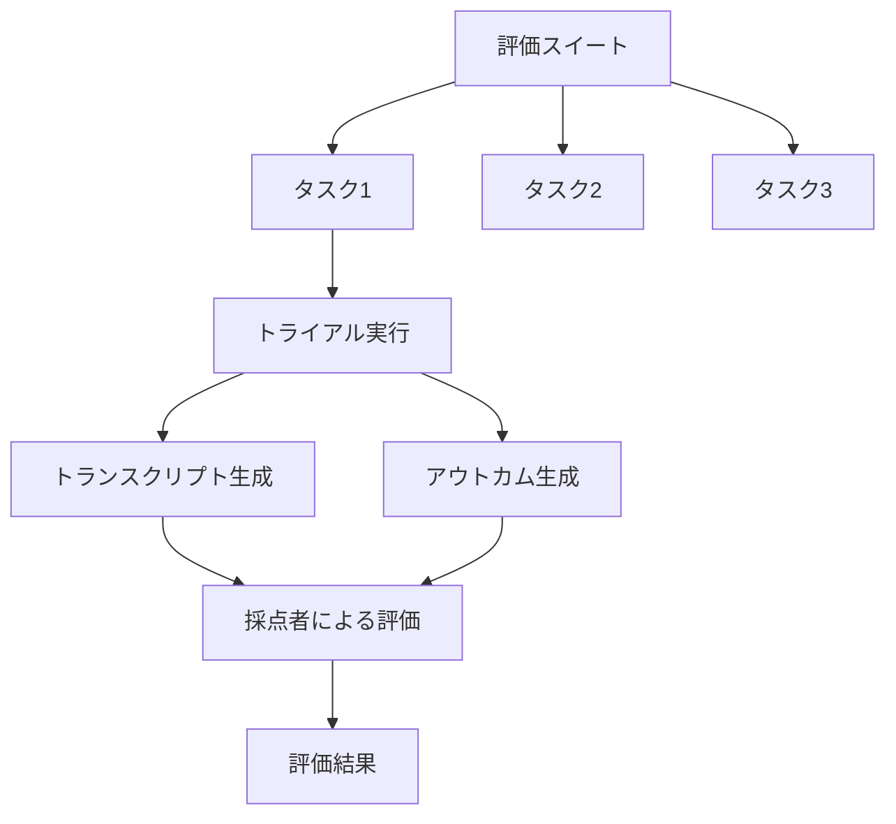
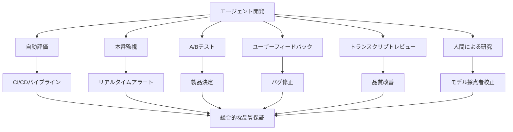

https://www.anthropic.com/engineering/demystifying-evals-for-ai-agents

エージェントを有用にする機能は、同時に評価を困難にします。デプロイメント全体で機能する戦略は、測定するシステムの複雑さに合わせた技術を組み合わせています。

## はじめに

優れた評価は、チームが AI エージェントをより自信を持って出荷するのに役立ちます。評価がなければ、反応的なループに陥りやすくなります。問題は本番環境でのみ検出され、1 つの失敗を修正すると別の失敗が発生します。評価は、ユーザーに影響を与える前に問題や動作の変化を可視化し、その価値はエージェントのライフサイクル全体で複利的に増大します。

[効果的なエージェントの構築](https://www.anthropic.com/engineering/building-effective-agents)で説明したように、エージェントは複数のターンにわたって動作します。ツールを呼び出し、状態を変更し、中間結果に基づいて適応します。AI エージェントを有用にするこれらの同じ機能（自律性、知性、柔軟性）が、評価を困難にします。

内部作業およびエージェント開発の最前線にいる顧客との協力を通じて、エージェントのためのより厳密で有用な評価を設計する方法を学びました。以下では、実際のデプロイメントにおいて、さまざまなエージェントアーキテクチャとユースケースで機能したものを紹介します。

## 評価の構造

評価（eval）は、AI システムのテストです。AI に入力を与え、その出力に採点ロジックを適用して成功を測定します。この投稿では、実際のユーザーなしで開発中に実行できる自動評価に焦点を当てます。

シングルターン評価は簡単です。プロンプト、レスポンス、採点ロジックがあります。初期の LLM では、シングルターンの非エージェント的な評価が主な評価方法でした。AI の機能が進歩するにつれて、マルチターン評価がますます一般的になってきました。


単純な評価では、エージェントがプロンプトを処理し、採点者が出力が期待に一致するかどうかを確認します。より複雑なマルチターン評価では、コーディングエージェントがツール、タスク（この場合は MCP サーバーの構築）、環境を受け取り、エージェントループ（ツール呼び出しと推論）を実行し、実装で環境を更新します。その後、採点は単体テストを使用して動作する MCP サーバーを検証します。

エージェント評価はさらに複雑です。エージェントは多くのターンにわたってツールを使用し、環境内の状態を変更し、進行しながら適応します。これは、ミスが伝播して複合化する可能性があることを意味します。フロンティアモデルは、静的な評価の限界を超える創造的なソリューションを見つけることもできます。例えば、Opus 4.5 は、フライトの予約に関する [τ2-bench](https://github.com/sierra-research/tau2-bench) の問題を、ポリシーの抜け穴を[発見](https://www.anthropic.com/news/claude-opus-4-5)することで解決しました。記述どおりの評価には失敗しましたが、実際にはユーザーにとってより良いソリューションを考え出しました。

エージェント評価を構築する際、以下の定義を使用します。

タスク（問題またはテストケースとも呼ばれる）は、定義された入力と成功基準を持つ単一のテストです。タスクへの各試行はトライアルです。モデルの出力は実行間で変動するため、より一貫した結果を生成するために複数のトライアルを実行します。採点者（grader）は、エージェントのパフォーマンスのある側面を採点するロジックです。タスクは複数の採点者を持つことができ、各採点者には複数のアサーション（チェックと呼ばれることもある）が含まれます。トランスクリプト（トレースまたはトラジェクトリとも呼ばれる）は、出力、ツール呼び出し、推論、中間結果、およびその他のやり取りを含む、トライアルの完全な記録です。Anthropic API の場合、これは評価実行の最後にある完全なメッセージ配列であり、評価中の API へのすべての呼び出しと返されたすべてのレスポンスが含まれます。アウトカムは、トライアルの終了時の環境内の最終状態です。フライト予約エージェントは、トランスクリプトの最後に「フライトが予約されました」と言うかもしれませんが、アウトカムは環境の SQL データベースに予約が存在するかどうかです。

評価ハーネスは、評価をエンドツーエンドで実行するインフラストラクチャです。指示とツールを提供し、タスクを並行して実行し、すべてのステップを記録し、出力を採点し、結果を集約します。エージェントハーネス（またはスキャフォールド）は、モデルがエージェントとして機能できるようにするシステムです。入力を処理し、ツール呼び出しを調整し、結果を返します。「エージェント」を評価する場合、ハーネスとモデルが協力して動作することを評価しています。例えば、[Claude Code](https://claude.com/product/claude-code) は柔軟なエージェントハーネスであり、[Agent SDK](https://platform.claude.com/docs/en/agent-sdk/overview) を通じてそのコアプリミティブを使用して、[長時間実行エージェントハーネス](https://www.anthropic.com/engineering/effective-harnesses-for-long-running-agents)を構築しました。

評価スイートは、特定の機能や動作を測定するために設計されたタスクのコレクションです。スイート内のタスクは通常、広範な目標を共有します。例えば、カスタマーサポート評価スイートは、返金、キャンセル、エスカレーションをテストする場合があります。


エージェントの評価のコンポーネントを示す図です。



## なぜ評価を構築するのか

チームがエージェントの構築を最初に開始するとき、手動テスト、[ドッグフーディング](https://en.wikipedia.org/wiki/Eating_your_own_dog_food)、直感の組み合わせを通じて驚くほど遠くまで進むことができます。より厳密な評価は、出荷を遅らせるオーバーヘッドのように見えるかもしれません。しかし、初期のプロトタイピング段階を過ぎて、エージェントが本番環境に入りスケーリングを開始すると、評価なしでの構築は破綻し始めます。

破綻点は多くの場合、ユーザーが変更後にエージェントが悪化したと報告し、チームが推測と確認以外に検証する方法がなく「目隠し飛行」している状態になったときに訪れます。評価がない場合、デバッグは反応的になります。苦情を待ち、手動で再現し、バグを修正し、他に何も退行していないことを願います。チームは、実際の退行とノイズを区別したり、出荷前に何百ものシナリオに対して変更を自動的にテストしたり、改善を測定したりすることができません。

この進行は何度も繰り返されてきました。例えば、Claude Code は Anthropic の従業員と外部ユーザーからのフィードバックに基づいた迅速な反復から始まりました。その後、評価を追加しました。最初は簡潔さやファイル編集などの狭い領域に対して、次に過剰エンジニアリングなどのより複雑な動作に対してです。これらの評価は、問題を特定し、改善を導き、研究と製品のコラボレーションに焦点を当てるのに役立ちました。本番監視、A/B テスト、ユーザーリサーチなどと組み合わせることで、評価は Claude Code がスケールするにつれて改善を続けるためのシグナルを提供します。

評価の作成は、エージェントのライフサイクルのどの段階でも有用です。初期段階では、評価は製品チームにエージェントの成功が何を意味するかを明確にすることを強制します。後の段階では、一貫した品質基準を維持するのに役立ちます。

[Descript](https://www.descript.com/) のエージェントはユーザーがビデオを編集するのを支援するため、成功する編集ワークフローの 3 つの次元を中心に評価を構築しました。物を壊さない、依頼されたことをする、それをうまくやる、という 3 つです。彼らは手動採点から、製品チームによって定義された基準を持つ LLM 採点者と定期的な人間による校正へと進化し、現在は品質ベンチマークと回帰テストのために 2 つの別々のスイートを定期的に実行しています。[Bolt](https://bolt.new/) AI チームは後で、すでに広く使用されているエージェントを持った後に評価の構築を開始しました。3 か月で、エージェントを実行し、静的分析で出力を採点し、ブラウザエージェントを使用してアプリをテストし、指示に従うなどの動作に LLM ジャッジを採用する評価システムを構築しました。

一部のチームは開発の開始時に評価を作成し、他のチームは評価がエージェントの改善のボトルネックになったときにスケールで追加します。評価は、期待される動作を明示的にエンコードするために、エージェント開発の開始時に特に有用です。同じ初期仕様を読んだ 2 人のエンジニアが、AI がエッジケースをどのように処理すべきかについて異なる解釈を持つ可能性があります。評価スイートはこの曖昧さを解決します。いつ作成されるかに関係なく、評価は開発を加速するのに役立ちます。

評価はまた、新しいモデルをどれだけ迅速に採用できるかを形作ります。より強力なモデルが登場したとき、評価のないチームは数週間のテストに直面しますが、評価を持つ競合他社は、モデルの強みを迅速に判断し、プロンプトを調整し、数日でアップグレードできます。

評価が存在すると、ベースラインと回帰テストが無料で得られます。レイテンシー、トークン使用量、タスクあたりのコスト、エラー率は、静的なタスクバンクで追跡できます。評価は、製品チームと研究チームの間の最も帯域幅の高い通信チャネルにもなり、研究者が最適化できるメトリクスを定義します。明らかに、評価は回帰と改善の追跡を超えて広範な利点があります。その複利効果は、コストが前もって見えるのに対し、利点が後で蓄積されるため、見逃しやすいです。

## AI エージェントの評価方法

今日大規模にデプロイされているエージェントには、コーディングエージェント、リサーチエージェント、コンピューター使用エージェント、会話エージェントなど、いくつかの一般的なタイプがあります。各タイプはさまざまな業界にデプロイされる可能性がありますが、類似の技術を使用して評価できます。評価をゼロから発明する必要はありません。以下のセクションでは、いくつかのエージェントタイプに対する実証済みの技術について説明します。これらの方法を基礎として使用し、ドメインに合わせて拡張してください。

### エージェントの採点者のタイプ

エージェント評価は通常、コードベース、モデルベース、人間という 3 つのタイプの採点者を組み合わせます。各採点者は、トランスクリプトまたはアウトカムの一部を評価します。効果的な評価設計の重要な要素は、仕事に適した採点者を選択することです。

**コードベース採点者**

方法として、文字列マッチチェック（完全一致、正規表現、ファジー一致など）、バイナリテスト（失敗から成功へ、成功から成功へ）、静的分析（リント、型、セキュリティ）、アウトカム検証、ツール呼び出し検証（使用されたツール、パラメータ）、トランスクリプト分析（実行されたターン、トークン使用量）があります。

強みとして、高速、安価、客観的、再現可能、デバッグが容易、特定の条件の検証が可能です。弱みとして、期待されるパターンに完全に一致しない有効なバリエーションに対して脆弱、ニュアンスの欠如、より主観的なタスクの評価には限定的です。

**モデルベース採点者**

方法として、ルーブリックベースのスコアリング、自然言語アサーション、ペアワイズ比較、参照ベースの評価、マルチジャッジコンセンサスがあります。

強みとして、柔軟性、スケーラブル、ニュアンスをキャプチャ、オープンエンドのタスクを処理、自由形式の出力を処理します。弱みとして、非決定的、コードよりも高価、精度のために人間の採点者との校正が必要です。

**人間の採点者**

方法として、専門家レビュー（SME レビュー）、クラウドソースされた判断、スポットチェックサンプリング、A/B テスト、評価者間一致があります。

強みとして、ゴールドスタンダードの品質、専門家ユーザーの判断に一致、モデルベースの採点者を校正するために使用されます。弱みとして、高価、遅い、多くの場合、大規模に人間の専門家へのアクセスが必要です。

各タスクについて、スコアリングは重み付け（組み合わされた採点者スコアがしきい値に達する必要がある）、バイナリ（すべての採点者が合格する必要がある）、またはハイブリッドにすることができます。

### 機能評価と回帰評価

機能評価または品質評価は、「このエージェントは何をうまくできるか」と問います。エージェントが苦戦しているタスクをターゲットにして、チームに登るべき丘を与えることで、低い合格率から始める必要があります。

回帰評価は、「エージェントは以前処理していたすべてのタスクをまだ処理しているか」と問い、ほぼ 100% の合格率を持つべきです。これらは後退を防ぎます。スコアの低下は、何かが壊れており、改善する必要があることを示すシグナルです。チームが機能評価で丘を登るとき、変更が他の場所で問題を引き起こさないことを確認するために回帰評価も実行することが重要です。

エージェントが起動され最適化された後、高い合格率を持つ機能評価は、ドリフトをキャッチするために継続的に実行される回帰スイートに「卒業」できます。「これをまったくできるか」を測定したタスクは、「これを確実にまだできるか」を測定します。

### コーディングエージェントの評価

コーディングエージェントは、コードを書き、テストし、デバッグし、コードベースをナビゲートし、人間の開発者と同じようにコマンドを実行します。最新のコーディングエージェントの効果的な評価は通常、明確に指定されたタスク、安定したテスト環境、生成されたコードの徹底的なテストに依存しています。

決定論的な採点者は、ソフトウェアが一般的に評価が簡単であるため、コーディングエージェントには自然です。コードは実行され、テストは合格しますか？広く使用されている 2 つのコーディングエージェントベンチマーク、[SWE-bench Verified](https://www.swebench.com/SWE-bench/) と [Terminal-Bench](https://www.tbench.ai/) は、このアプローチに従います。SWE-bench Verified は、人気のある Python リポジトリからの GitHub issues をエージェントに与え、テストスイートを実行してソリューションを採点します。ソリューションは、既存のテストを壊さずに失敗しているテストを修正した場合にのみ合格します。LLM は、わずか 1 年でこの評価で 40% から 80% 以上に進歩しました。Terminal-Bench は別のトラックを取ります。Linux カーネルをソースから構築したり、ML モデルをトレーニングしたりするなど、エンドツーエンドの技術的なタスクをテストします。

コーディングタスクの主要なアウトカムを検証するための合格または不合格のテストのセットを用意したら、トランスクリプトも採点することが有用な場合が多いです。例えば、ヒューリスティックベースのコード品質ルールは、テストの合格以上に基づいて生成されたコードを評価でき、明確なルーブリックを持つモデルベースの採点者は、エージェントがツールを呼び出す方法やユーザーとやり取りする方法などの動作を評価できます。

**例：コーディングエージェントの理論的評価**

エージェントが認証バイパスの脆弱性を修正する必要があるコーディングタスクを考えてみましょう。以下の例示的な YAML ファイルに示すように、採点者とメトリクスの両方を使用してこのエージェントを評価できます。

```yaml
task:
  id: "fix-auth-bypass_1"
  desc: "Fix authentication bypass when password field is empty and ..."
  graders:
    - type: deterministic_tests
      required: [test_empty_pw_rejected.py, test_null_pw_rejected.py]
    - type: llm_rubric
      rubric: prompts/code_quality.md
    - type: static_analysis
      commands: [ruff, mypy, bandit]
    - type: state_check
      expect:
        security_logs: {event_type: "auth_blocked"}
    - type: tool_calls
      required:
        - {tool: read_file, params: {path: "src/auth/*"}}
        - {tool: edit_file}
        - {tool: run_tests}
  tracked_metrics:
    - type: transcript
      metrics:
        - n_turns
        - n_toolcalls
        - n_total_tokens
    - type: latency
      metrics:
        - time_to_first_token
        - output_tokens_per_sec
        - time_to_last_token
```

この例は、説明のために利用可能な採点者の全範囲を示していることに注意してください。実際には、コーディング評価は通常、正確性検証のための単体テストと、全体的なコード品質を評価するための LLM ルーブリックに依存し、必要に応じて追加の採点者とメトリクスを追加します。

### 会話エージェントの評価

会話エージェントは、サポート、販売、コーチングなどのドメインでユーザーとやり取りします。従来のチャットボットとは異なり、状態を維持し、ツールを使用し、会話の途中でアクションを実行します。コーディングエージェントやリサーチエージェントもユーザーとの多くのターンのやり取りを含む可能性がありますが、会話エージェントは独特の課題を提示します。やり取りの質自体が評価の一部です。会話エージェントの効果的な評価は通常、検証可能な最終状態のアウトカムと、タスクの完了とやり取りの質の両方をキャプチャするルーブリックに依存しています。他のほとんどの評価とは異なり、多くの場合、ユーザーをシミュレートするために 2 番目の LLM が必要です。[アライメント監査エージェント](https://alignment.anthropic.com/2025/automated-auditing/)で、拡張された敵対的な会話を通じてモデルをストレステストするためにこのアプローチを使用しています。

会話エージェントの成功は多次元的です。チケットは解決されたか（状態チェック）、10 ターン未満で終了したか（トランスクリプト制約）、トーンは適切だったか（LLM ルーブリック）。多次元性を組み込んだ 2 つのベンチマークは、[τ-Bench](https://arxiv.org/abs/2406.12045) とその後継である [τ2-Bench](https://arxiv.org/abs/2506.07982) です。これらは、小売サポートや航空券予約などのドメイン全体でマルチターンインタラクションをシミュレートし、1 つのモデルがユーザーペルソナを演じ、エージェントが現実的なシナリオをナビゲートします。

**例：会話エージェントの理論的評価**

エージェントが不満を持つ顧客の返金を処理する必要があるサポートタスクを考えてみましょう。

```yaml
graders:
  - type: llm_rubric
    rubric: prompts/support_quality.md
    assertions:
      - "Agent showed empathy for customer's frustration"
      - "Resolution was clearly explained"
      - "Agent's response grounded in fetch_policy tool results"
  - type: state_check
    expect:
      tickets: {status: resolved}
      refunds: {status: processed}
  - type: tool_calls
    required:
      - {tool: verify_identity}
      - {tool: process_refund, params: {amount: "<=100"}}
      - {tool: send_confirmation}
  - type: transcript
    max_turns: 10
tracked_metrics:
  - type: transcript
    metrics:
      - n_turns
      - n_toolcalls
      - n_total_tokens
  - type: latency
    metrics:
      - time_to_first_token
      - output_tokens_per_sec
      - time_to_last_token
```

コーディングエージェントの例のように、このタスクは説明のために複数の採点者タイプを示しています。実際には、会話エージェント評価は通常、コミュニケーション品質と目標達成の両方を評価するためにモデルベースの採点者を使用します。なぜなら、質問に答えるなど、多くのタスクには複数の「正しい」ソリューションがある可能性があるためです。

### リサーチエージェントの評価

リサーチエージェントは、情報を収集、統合、分析し、回答またはレポートなどの出力を生成します。単体テストがバイナリの合格または不合格のシグナルを提供するコーディングエージェントとは異なり、リサーチの質はタスクに対してのみ判断できます。「包括的」、「十分に出典がある」、または「正しい」とみなされるものは、コンテキストに依存します。市場スキャン、買収のデューデリジェンス、科学レポートは、それぞれ異なる基準を必要とします。

リサーチ評価には独特の課題があります。専門家は、統合が包括的かどうかについて意見が分かれる可能性があり、参照コンテンツが絶えず変化するため、グラウンドトゥルースが変化し、より長く、よりオープンエンドな出力は、ミスの余地を増やします。例えば、[BrowseComp](http://arxiv.org/abs/2504.12516) のようなベンチマークは、AI エージェントがオープンウェブ全体で干し草の山の中から針を見つけることができるかどうかをテストします。検証は容易に設計された質問ですが、解決は困難です。

リサーチエージェント評価を構築する 1 つの戦略は、採点者タイプを組み合わせることです。グラウンデッドネスチェックは、主張が取得されたソースによってサポートされていることを検証し、カバレッジチェックは良い回答が含まなければならない重要な事実を定義し、ソース品質チェックは、単に最初に取得されたものではなく、参照されたソースが権威あるものであることを確認します。客観的に正しい答えがあるタスク（「X 社の第 3 四半期の収益はいくらでしたか」）の場合、完全一致が機能します。LLM は、サポートされていない主張とカバレッジのギャップにフラグを立てることができますが、一貫性と完全性についてオープンエンドな統合を検証することもできます。

リサーチ品質の主観的な性質を考えると、LLM ベースのルーブリックは、これらのエージェントを効果的に採点するために、専門家の人間の判断に対して頻繁に校正する必要があります。

### コンピューター使用エージェント

コンピューター使用エージェントは、API やコード実行を介してではなく、人間と同じインターフェース（スクリーンショット、マウスクリック、キーボード入力、スクロール）を通じてソフトウェアとやり取りします。これらは、デザインツールからレガシーエンタープライズソフトウェアまで、グラフィカルユーザーインターフェース（GUI）を持つあらゆるアプリケーションを使用できます。評価には、エージェントがソフトウェアアプリケーションを使用できる実際のまたはサンドボックス化された環境でエージェントを実行し、意図された結果を達成したかどうかを確認する必要があります。例えば、[WebArena](https://arxiv.org/abs/2307.13854) はブラウザベースのタスクをテストし、URL とページ状態チェックを使用してエージェントが正しくナビゲートしたことを検証し、データを変更するタスクのバックエンド状態検証も行います（確認ページが表示されただけでなく、注文が実際に行われたことを確認）。[OSWorld](https://os-world.github.io/) は、これを完全なオペレーティングシステム制御に拡張し、タスク完了後にさまざまなアーティファクトを検査する評価スクリプトを使用します。ファイルシステム状態、アプリケーション設定、データベースコンテンツ、UI 要素プロパティなどです。

ブラウザ使用エージェントは、トークン効率とレイテンシーのバランスを必要とします。DOM ベースのインタラクションは迅速に実行されますが、多くのトークンを消費します。一方、スクリーンショットベースのインタラクションは遅くなりますが、よりトークン効率的です。例えば、Claude に Wikipedia を要約するよう依頼する場合、DOM からテキストを抽出する方が効率的です。Amazon で新しいラップトップケースを見つける場合、スクリーンショットを撮る方が効率的です（DOM 全体を抽出するとトークン集約的になるため）。Claude for Chrome 製品では、エージェントが各コンテキストに適したツールを選択していることを確認するための評価を開発しました。これにより、ブラウザベースのタスクをより速く、より正確に完了できるようになりました。

### 評価におけるエージェントの非決定性についての考え方

エージェントのタイプに関係なく、エージェントの動作は実行間で変動するため、評価結果は最初に見えるよりも解釈が困難になります。各タスクには独自の成功率があります。あるタスクでは 90%、別のタスクでは 50% かもしれません。ある評価実行で合格したタスクが、次の実行では失敗する可能性があります。時には、測定したいのは、エージェントがタスクに成功する頻度（トライアルの割合）です。

この微妙さをキャプチャするのに役立つ 2 つのメトリクスがあります。

[pass@k](https://proceedings.neurips.cc/paper/2019/file/7298332f04ac004a0ca44cc69ecf6f6b-Paper.pdf) は、k 回の試行で少なくとも 1 つの正しいソリューションを得る可能性を測定します。k が増加すると、pass@k スコアが上昇します。より多くの「ゴールへのシュート」は、少なくとも 1 つの成功の確率が高いことを意味します。50% の pass@1 スコアは、モデルが最初の試行で評価のタスクの半分に成功することを意味します。コーディングでは、多くの場合、エージェントが最初の試行でソリューションを見つけること（pass@1）に最も関心があります。他のケースでは、1 つが機能する限り、多くのソリューションを提案することは有効です。

[pass^k](https://arxiv.org/abs/2406.12045) は、すべての k トライアルが成功する確率を測定します。k が増加すると、pass^k は低下します。より多くのトライアルにわたって一貫性を要求することは、クリアするのが難しいバーだからです。エージェントのトライアルあたりの成功率が 75% で、3 つのトライアルを実行する場合、3 つすべてに合格する確率は (0.75)³ ≈ 42% です。このメトリクスは、ユーザーが毎回信頼できる動作を期待する顧客向けエージェントに特に重要です。


pass@k と pass^k は、トライアルが増加するにつれて乖離します。k=1 では、これらは同一です（両方ともトライアルあたりの成功率に等しい）。k=10 までに、これらは反対のストーリーを語ります。pass@k は 100% に近づき、pass^k は 0 に低下します。

```mermaid
graph LR
    A[k=1] -->|両メトリクス同一| B[トライアルあたり成功率]
    C[k増加] -->|pass@k| D[100%に近づく]
    C -->|pass^k| E[0%に近づく]
    F[使用ケース] -->|1回成功すればOK| G[pass@k使用]
    F -->|一貫性必須| H[pass^k使用]
```

両方のメトリクスが有用であり、どちらを使用するかは製品要件に依存します。1 つの成功が重要なツールには pass@k を、一貫性が不可欠なエージェントには pass^k を使用します。

## ゼロからイチへ：優れたエージェント評価へのロードマップ

このセクションでは、評価なしの状態から信頼できる評価に移行するための、実践的でフィールドテスト済みのアドバイスを示します。これは、評価駆動型エージェント開発のロードマップと考えてください。早期に成功を定義し、明確に測定し、継続的に反復します。

### 初期評価データセットのタスクを収集する

**ステップ 0：早期に開始する**

チームは、何百ものタスクが必要だと考えて評価の構築を遅らせることがよくあります。実際には、実際の失敗から引き出された 20～50 の簡単なタスクで素晴らしいスタートを切ることができます。結局のところ、初期のエージェント開発では、システムへの各変更は明確で顕著な影響を持つことが多く、この大きな効果サイズは小さなサンプルサイズで十分であることを意味します。より成熟したエージェントは、より小さな効果を検出するために、より大きく、より困難な評価が必要になる場合がありますが、最初は 80/20 アプローチを取るのが最善です。待てば待つほど評価の構築が難しくなります。早期に、製品要件は自然にテストケースに変換されます。待ちすぎると、ライブシステムから成功基準を逆エンジニアリングすることになります。

**ステップ 1：すでに手動でテストしているものから始める**

開発中に実行する手動チェック（各リリース前に検証する動作やエンドユーザーが試す一般的なタスク）から始めます。すでに本番環境にいる場合は、バグトラッカーとサポートキューを確認してください。ユーザーが報告した失敗をテストケースに変換することで、スイートが実際の使用を反映することが保証されます。ユーザーへの影響によって優先順位を付けることで、重要な部分に労力を投資できます。

**ステップ 2：参照ソリューションを持つ明確なタスクを書く**

タスクの品質を正しく設定することは、見た目よりも困難です。良いタスクとは、2 人のドメイン専門家が独立して同じ合格または不合格の判定に達するものです。彼ら自身がタスクに合格できますか？そうでない場合、タスクには改善が必要です。タスク仕様の曖昧さはメトリクスのノイズになります。モデルベースの採点者の基準についても同様です。曖昧なルーブリックは一貫性のない判断を生み出します。

各タスクは、指示に正しく従うエージェントが合格できるものである必要があります。これは微妙な場合があります。例えば、Terminal-Bench を監査すると、タスクがエージェントにスクリプトを書くように依頼するが、ファイルパスを指定せず、テストがスクリプトの特定のファイルパスを想定している場合、エージェントは自分の落ち度なく失敗する可能性があることが明らかになりました。採点者がチェックするすべてがタスクの説明から明確である必要があります。エージェントは曖昧な仕様のために失敗すべきではありません。フロンティアモデルでは、多くのトライアルにわたって 0% の合格率（つまり、0% の pass@100）は、ほとんどの場合、能力のないエージェントではなく、壊れたタスクのシグナルであり、タスク仕様と採点者を再確認するサインです。

各タスクについて、参照ソリューションを作成することが有用です。すべての採点者に合格する既知の動作する出力です。これにより、タスクが解決可能であることが証明され、採点者が正しく構成されていることが検証されます。

**ステップ 3：バランスの取れた問題セットを構築する**

動作が発生すべき場合と、発生すべきでない場合の両方をテストします。一方的な評価は一方的な最適化を生み出します。例えば、エージェントが検索すべきときに検索するかどうかのみをテストする場合、ほとんどすべてを検索するエージェントになる可能性があります。[クラスの不均衡](https://developers.google.com/machine-learning/crash-course/overfitting/imbalanced-datasets)のある評価を避けるようにしてください。

[Claude.ai](http://claude.ai/) でウェブ検索の評価を構築したとき、この教訓を直接学びました。課題は、適切なときに広範な研究を行う能力を維持しながら、モデルが検索すべきでないときに検索しないようにすることでした。チームは両方向をカバーする評価を構築しました。モデルが検索すべきクエリ（天気を見つけるなど）と、既存の知識から答えるべきクエリ（「Apple を設立したのは誰ですか」など）です。アンダートリガー（検索すべきときに検索しない）またはオーバートリガー（検索すべきでないときに検索する）の適切なバランスを取ることは困難であり、プロンプトと評価の両方に多くのラウンドの改善が必要でした。より多くの問題例が発生するにつれて、カバレッジを改善するために評価に追加し続けています。

### 評価ハーネスと採点者を設計する

**ステップ 4：安定した環境で堅牢な評価ハーネスを構築する**

評価のエージェントが本番環境で使用されるエージェントとほぼ同じように機能し、環境自体がさらなるノイズを導入しないことが不可欠です。各トライアルは、クリーンな環境から開始することによって「分離」される必要があります。実行間の不要な共有状態（残ったファイル、キャッシュされたデータ、リソースの枯渇）は、エージェントのパフォーマンスではなく、インフラストラクチャの脆弱性による相関失敗を引き起こす可能性があります。共有状態はパフォーマンスを人為的に膨らませることもあります。例えば、一部の内部評価では、Claude が以前のトライアルからの git 履歴を調べることによって、一部のタスクで不当な利点を得ていることが観察されました。複数の異なるトライアルが環境の同じ制限（CPU メモリの制限など）のために失敗する場合、これらのトライアルは同じ要因の影響を受けているため独立していないため、評価結果はエージェントのパフォーマンスを測定するために信頼できなくなります。

**ステップ 5：採点者を慎重に設計する**

上記で説明したように、優れた評価設計には、エージェントとタスクに最適な採点者を選択することが含まれます。可能な限り決定論的な採点者を選択し、必要な場合または追加の柔軟性のために LLM 採点者を使用し、追加の検証のために人間の採点者を慎重に使用することをお勧めします。

エージェントが正しい順序でツール呼び出しのシーケンスなど、非常に特定のステップに従ったことを確認する一般的な本能があります。このアプローチは硬直しすぎており、評価設計者が予想しなかった有効なアプローチをエージェントが定期的に見つけるため、過度に脆弱なテストになることがわかっています。創造性を不必要に罰しないように、エージェントが辿った道ではなく、エージェントが生成したものを採点する方が良い場合が多いです。

複数のコンポーネントを持つタスクの場合、部分クレジットを組み込みます。問題を正しく識別し、顧客を検証するが、返金の処理に失敗するサポートエージェントは、すぐに失敗するものよりも意味のある意味で優れています。この成功の連続体を結果に表すことが重要です。

モデル採点は、精度を検証するために慎重な反復を必要とすることがよくあります。LLM-as-judge 採点者は、人間の採点とモデル採点の間にほとんど乖離がないという信頼を得るために、人間の専門家と密接に校正する必要があります。幻覚を避けるために、十分な情報がないときに「不明」を返すような LLM への抜け道を提供します。また、タスクの各次元を採点するための明確で構造化されたルーブリックを作成し、すべての次元を採点するために 1 つを使用するのではなく、分離された LLM-as-judge で各次元を採点することも役立ちます。システムが堅牢になったら、時折のみ人間のレビューを使用するだけで十分です。

一部の評価には、良好なエージェントパフォーマンスでも低いスコアをもたらす微妙な失敗モードがあり、エージェントが採点バグ、エージェントハーネスの制約、または曖昧さのためにタスクの解決に失敗します。洗練されたチームでさえ、これらの問題を見逃す可能性があります。例えば、[Opus 4.5 は当初 CORE-Bench で 42% を獲得しました](https://x.com/sayashk/status/1996334941832089732?s=46&t=c5pEvnVdVbMkcR_rcCHplg)。Anthropic の研究者が複数の問題を発見するまでです。「96.124991...」を期待しているときに「96.12」を罰する硬直した採点、曖昧なタスク仕様、正確に再現することが不可能な確率的タスクなどです。バグを修正し、より制約の少ないスキャフォールドを使用した後、Opus 4.5 のスコアは 95% に跳ね上がりました。同様に、[METR は発見しました](https://x.com/metr_evals/status/2001473506442375645?s=46)。タイムホライズンベンチマークで、エージェントに述べられたスコアしきい値に最適化するよう依頼するが、採点はそのしきい値を超えることを要求するという、いくつかの誤設定されたタスクです。これは、指示に従った Claude のようなモデルを罰しましたが、述べられた目標を無視したモデルはより良いスコアを受け取りました。タスクと採点者を慎重に再確認することで、これらの問題を回避できます。

採点者をバイパスやハックに対して抵抗力のあるものにします。エージェントは評価を簡単に「チート」できないようにする必要があります。タスクと採点者は、合格するために意図しない抜け穴を悪用するのではなく、問題を解決することを真に必要とするように設計する必要があります。

### 長期的に評価を維持および使用する

**ステップ 6：トランスクリプトを確認する**

多くのトライアルからのトランスクリプトとグレードを読まない限り、採点者が正しく機能しているかどうかはわかりません。Anthropic では、評価トランスクリプトを表示するためのツールに投資し、定期的にそれらを読む時間を取っています。タスクが失敗したとき、トランスクリプトは、エージェントが本当の間違いを犯したのか、採点者が有効なソリューションを拒否したのかを教えてくれます。また、エージェントと評価の動作に関する重要な詳細を浮き彫りにすることもよくあります。

失敗は公平に見えるはずです。エージェントが何を間違えたのか、なぜそうなったのかが明確です。スコアが上昇しないとき、評価ではなくエージェントのパフォーマンスが原因であるという確信が必要です。トランスクリプトを読むことは、評価が実際に重要なものを測定していることを確認する方法であり、エージェント開発の重要なスキルです。

**ステップ 7：機能評価の飽和を監視する**

100% の評価は回帰を追跡しますが、改善のシグナルを提供しません。評価飽和は、エージェントが解決可能なすべてのタスクに合格し、改善の余地がなくなったときに発生します。例えば、SWE-Bench Verified のスコアは今年 30% から始まり、フロンティアモデルは現在 80% 以上で飽和に近づいています。評価が飽和に近づくにつれて、最も困難なタスクのみが残るため、進捗も遅くなります。これにより、大きな機能改善がスコアの小さな増加として現れるため、結果が欺瞞的になる可能性があります。例えば、コードレビュースタートアップの [Qodo](https://www.qodo.ai/) は当初、Opus 4.5 に感銘を受けませんでした。彼らのワンショットコーディング評価は、より長く、より複雑なタスクでの利得をキャプチャしなかったためです。これに応じて、彼らは新しいエージェント評価フレームワークを開発し、進捗のはるかに明確な全体像を提供しました。

原則として、誰かが評価の詳細を掘り下げ、いくつかのトランスクリプトを読むまで、評価スコアを額面通りに受け取ることはありません。採点が不公平である場合、タスクが曖昧である場合、有効なソリューションが罰せられる場合、またはハーネスがモデルを制約する場合、評価を修正する必要があります。

**ステップ 8：オープンな貢献とメンテナンスを通じて、評価スイートを長期的に健全に保つ**

評価スイートは生きたアーティファクトであり、有用であり続けるために継続的な注意と明確な所有権を必要とします。

Anthropic では、評価メンテナンスへのさまざまなアプローチを試みました。最も効果的であることが証明されたのは、コアインフラストラクチャを所有する専用の評価チームを確立しながら、ドメイン専門家と製品チームがほとんどの評価タスクに貢献し、評価自体を実行することでした。

AI 製品チームにとって、評価の所有と反復は、単体テストの維持と同じくらいルーチンであるべきです。チームは、初期のテストで「機能する」が、明確に設計された評価が早期に浮き彫りにしたであろう暗黙の期待を満たさない AI 機能に何週間も無駄にする可能性があります。評価タスクを定義することは、製品要件が構築を開始するのに十分具体的かどうかをストレステストする最良の方法の 1 つです。

評価駆動型開発を実践することをお勧めします。エージェントがそれらを満たすことができる前に、計画された機能を定義するために評価を構築し、エージェントが良好に実行されるまで反復します。内部的には、今日は「十分に良好」に機能するが、モデルが数か月で何ができるかへの賭けである機能を構築することがよくあります。低い合格率から始まる機能評価は、これを可視化します。新しいモデルがドロップしたとき、スイートを実行すると、どの賭けが報われたかがすぐに明らかになります。

製品要件とユーザーに最も近い人々は、成功を定義するのに最適な位置にいます。現在のモデル機能により、製品マネージャー、カスタマーサクセスマネージャー、または営業担当者は、Claude Code を使用して PR として評価タスクに貢献できます。彼らに任せてください！さらに良いことに、積極的に彼らを有効にしてください。


効果的な評価を作成するプロセスを示す図です。

## エージェントの全体的な理解のための評価と他の方法の適合性

自動評価は、本番環境にデプロイしたり実際のユーザーに影響を与えたりすることなく、何千ものタスクに対してエージェントに対して実行できます。しかし、これはエージェントのパフォーマンスを理解する多くの方法の 1 つに過ぎません。完全な全体像には、本番監視、ユーザーフィードバック、A/B テスト、手動トランスクリプトレビュー、体系的な人間による評価が含まれます。

### AI エージェントのパフォーマンスを理解するためのアプローチの概要

**自動評価：実際のユーザーなしでプログラムでテストを実行する**

長所として、より速い反復、完全に再現可能、ユーザーへの影響なし、すべてのコミットで実行可能、本番デプロイを必要とせずに大規模にシナリオをテストします。短所として、構築に前もってより多くの投資が必要、製品とモデルが進化するにつれてドリフトを避けるために継続的なメンテナンスが必要、実際の使用パターンと一致しない場合、誤った信頼を生み出す可能性があります。

**本番監視：ライブシステムでメトリクスとエラーを追跡する**

長所として、実際のユーザー動作を大規模に明らかにする、合成評価が見逃す問題を捉える、エージェントが実際にどのように実行されるかについてのグラウンドトゥルースを提供します。短所として、反応的で、問題がユーザーに到達する前にそれらについて知ることができる、シグナルがノイズになる可能性がある、計測への投資が必要、採点のためのグラウンドトゥルースが欠けています。

**A/B テスト：実際のユーザートラフィックでバリアントを比較する**

長所として、実際のユーザーの結果を測定する（維持率、タスク完了）、交絡を制御、スケーラブルで体系的です。短所として、遅い、有意性に達するまで数日または数週間かかり、十分なトラフィックが必要、デプロイした変更のみをテスト、トランスクリプトを徹底的にレビューできないと、メトリクスの変化の根本的な「理由」についてのシグナルが少なくなります。

**ユーザーフィードバック：親指を下げるやバグレポートなどの明示的なシグナル**

長所として、予期しなかった問題を浮き彫りにする、実際の人間のユーザーからの実際の例が付属、フィードバックは製品目標と相関することが多いです。短所として、まばらで自己選択的、深刻な問題に偏る、ユーザーが何が失敗したかを説明することはめったにない、自動化されていない、ユーザーに主に問題を捉えさせることは、ユーザーへの悪影響を与える可能性があります。

**手動トランスクリプトレビュー：人間がエージェントの会話を読む**

長所として、失敗モードの直感を構築、自動化されたチェックが見逃す微妙な品質の問題を捉える、「良い」がどのようなものかを校正し、詳細を把握するのに役立ちます。短所として、時間集約的、スケールしない、カバレッジが一貫性がない、レビュアーの疲労や異なるレビュアーがシグナルの品質に影響を与える可能性がある、通常、明確な定量的採点ではなく定性的なシグナルのみを提供します。

**体系的な人間による研究：訓練された評価者によるエージェント出力の構造化された採点**

長所として、複数の人間評価者からのゴールドスタンダードの品質判断、主観的または曖昧なタスクを処理、モデルベースの採点者を改善するためのシグナルを提供します。短所として、比較的高価でターンアラウンドが遅い、頻繁に実行するのが難しい、評価者間の不一致には調停が必要、複雑なドメイン（法律、金融、医療）は、研究を実施するために人間の専門家を必要とします。



これらの方法は、エージェント開発のさまざまな段階にマッピングされます。自動評価は、起動前および CI/CD で特に有用であり、各エージェントの変更とモデルのアップグレードで実行され、品質問題に対する最初の防衛線として機能します。本番監視は、起動後に開始され、分布ドリフトと予期しない実世界の失敗を検出します。A/B テストは、十分なトラフィックがある場合に重要な変更を検証します。ユーザーフィードバックとトランスクリプトレビューは、ギャップを埋めるための継続的な実践です。フィードバックを常にトリアージし、毎週読むためにトランスクリプトをサンプリングし、必要に応じてより深く掘り下げます。LLM 採点者を校正するため、または人間のコンセンサスが参照標準として機能する主観的な出力を評価するために、体系的な人間による研究を予約します。


安全工学の[スイスチーズモデル](https://en.wikipedia.org/wiki/Swiss_cheese_model)のように、単一の評価レイヤーがすべての問題を捉えるわけではありません。複数の方法を組み合わせることで、1 つのレイヤーを通過する失敗が別のレイヤーで捕捉されます。

最も効果的なチームは、これらの方法を組み合わせます。迅速な反復のための自動評価、グラウンドトゥルースのための本番監視、校正のための定期的な人間によるレビューです。

## 結論

評価のないチームは反応的なループに行き詰まります。1 つの失敗を修正し、別の失敗を作成し、実際の退行とノイズを区別できません。早期に投資するチームは、その反対を発見します。失敗がテストケースになり、テストケースが退行を防ぎ、メトリクスが推測に取って代わるにつれて、開発が加速します。評価は、チーム全体に登るべき明確な丘を与え、「エージェントが悪化している」を実行可能なものに変えます。価値は複利的に増大しますが、評価を後付けではなく、コアコンポーネントとして扱う場合のみです。

パターンはエージェントのタイプによって異なりますが、ここで説明されている基礎は一定です。早期に開始し、完璧なスイートを待たないでください。あなたが見る失敗から現実的なタスクを調達してください。明確で堅牢な成功基準を定義してください。採点者を慎重に設計し、複数のタイプを組み合わせてください。問題がモデルに対して十分に困難であることを確認してください。シグナルとノイズの比を改善するために評価を反復してください。トランスクリプトを読んでください！

AI エージェント評価は、まだ初期の、急速に進化している分野です。エージェントがより長いタスクに取り組み、マルチエージェントシステムで協力し、ますます主観的な仕事を処理するにつれて、技術を適応させる必要があります。さらに学ぶにつれて、ベストプラクティスを共有し続けます。

### 謝辞

この記事は Mikaela Grace、Jeremy Hadfield、Rodrigo Olivares、Jiri De Jonghe によって執筆されました。David Hershey、Gian Segato、Mike Merrill、Alex Shaw、Nicholas Carlini、Ethan Dixon、Pedram Navid、Jake Eaton、Alyssa Baum、Lina Tawfik、Karen Zhou、Alexander Bricken、Sam Kennedy、Robert Ying、その他の貢献に感謝しています。評価に関するコラボレーションを通じて学んだ顧客とパートナー（iGent、Cognition、Bolt、Sierra、Vals.ai、Macroscope、PromptLayer、Stripe、Shopify、Terminal Bench チームなど）に特に感謝します。この作業は、Anthropic で評価の実践を開発するのを支援したいくつかのチームの集団的な努力を反映しています。

## 付録：評価フレームワーク

いくつかのオープンソースおよび商用フレームワークは、チームがインフラストラクチャをゼロから構築することなくエージェント評価を実装するのに役立ちます。適切な選択は、エージェントのタイプ、既存のスタック、オフライン評価、本番観測性、またはその両方が必要かどうかによって異なります。

[Harbor](https://harborframework.com/) は、コンテナ化された環境でエージェントを実行するように設計されており、クラウドプロバイダー全体で大規模にトライアルを実行するためのインフラストラクチャと、タスクと採点者を定義するための標準化された形式を備えています。Terminal-Bench 2.0 のような人気のあるベンチマークは Harbor レジストリを通じて出荷されているため、確立されたベンチマークとカスタム評価スイートを簡単に実行できます。

[Promptfoo](https://www.promptfoo.dev/) は、プロンプトテストのための宣言的な YAML 設定に焦点を当てた、軽量で柔軟性があり、オープンソースのフレームワークです。文字列マッチングから LLM-as-judge ルーブリックまで、さまざまなアサーションタイプがあります。多くの製品評価に Promptfoo のバージョンを使用しています。

[Braintrust](https://www.braintrust.dev/) は、オフライン評価と本番観測性および実験追跡を組み合わせたプラットフォームです。開発中に反復し、本番環境で品質を監視する必要があるチームに役立ちます。その autoevals ライブラリには、事実性、関連性、その他の一般的な次元のための事前構築されたスコアラーが含まれています。

[LangSmith](https://docs.langchain.com/langsmith/evaluation) は、LangChain エコシステムへの緊密な統合により、トレース、オフラインおよびオンライン評価、データセット管理を提供します。[Langfuse](https://langfuse.com/) は、データ居住要件を持つチームのために、セルフホスト型のオープンソース代替として同様の機能を提供します。

多くのチームは、複数のツールを組み合わせたり、独自の評価フレームワークを展開したり、単に開始点として簡単な評価スクリプトを使用したりしています。フレームワークは進捗を加速し、標準化する貴重な方法となり得ますが、それらを通じて実行する評価タスクと同じくらい良いだけであることがわかっています。ワークフローに合うフレームワークを迅速に選択し、高品質のテストケースと採点者を反復することで評価自体にエネルギーを投資するのが最善であることが多いです。

---

## 開発者ニュースレターを入手する

製品アップデート、ハウツー、コミュニティスポットライトなど。月に 1 回、受信トレイに配信されます。

月刊の開発者ニュースレターを受け取りたい場合は、メールアドレスを入力してください。いつでも配信を停止できます。

**元記事：** [Demystifying evals for AI agents](https://www.anthropic.com/engineering/demystifying-evals-for-ai-agents) - Anthropic
