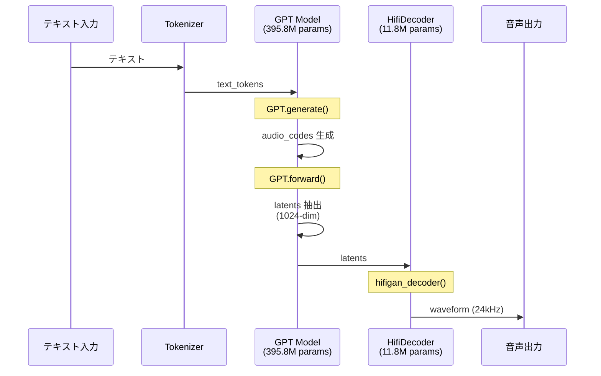
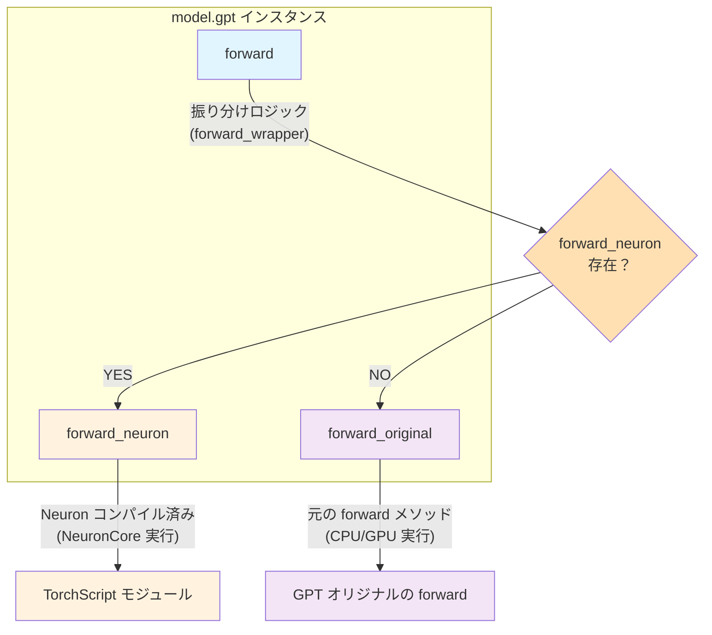

本記事は、AWS Trainium/Inferentia2 チップで音声合成 (TTS) を実装したい中級者を対象としています。Python 基礎および PyTorch の基本的な使い方を前提知識とします。

## はじめに

https://huggingface.co/coqui/XTTS-v2

### 背景と目的

**XTTS v2** (eXtended Text-to-Speech v2, 約 396M パラメータ) は、Coqui が開発したオープンソースの音声合成モデルです。最近の大規模 TTS モデル（1B+ パラメータ）と比較すると、**どちらかというと軽量なモデルの部類**に入ります。

https://zenn.dev/tosshi/articles/f6c49165c90e6d

本記事では上記で紹介した Amazon EC2 Inf2 / Trn2 インスタンスで NxD Inference を用いて Whisper と XTTS v2 を両方混在で動かすため、AWS Neuron で XTTS v2 を動かす実験を試みます。なぜ混在させたいかというと、カスタムチップで複数のモデルを動かすことの可能性を探りたいからです。

XTTS v2 は単純な end-to-end モデルではなく、**複数の異なるモデル（GPT + HifiDecoder）が混在**しています。このような複雑なケースで AWS Neuron をどのようにコンパイルして動かせばよいのかを検証してみます。

### 技術テーマ

この記事では、**複数のモデルが混在する TTS パイプライン**を AWS Neuron で動かすために必要だった技術的工夫を解説します。

第一に、どのコンポーネントを Neuron 化すべきかというコンパイル戦略を検討します。次に、コンパイル済みモデルを既存の PyTorch コードに統合する Forward Override パターンを紹介します。さらに、`torch_neuronx.trace()` の制約と実装上の工夫として固定長入力への対応を解説します。最後に、コンパイル済みモデルを組み合わせて TTS 推論パイプラインを構築する方法を示します。

このガイドで紹介する実装は、**NxD Inference ライブラリを使わず**、`torch_neuronx.trace()` を使ったプリミティブな方法です。PyTorch の `torch.jit.trace()` と同じ感覚で使えるため、既存の PyTorch コードに最小限の変更で統合できます。NxD Inference ライブラリへの統合は現在検証中であり今後紹介したいと思います。

## アーキテクチャ概要

XTTS v2 は、**2 つの主要モデルを組み合わせた TTS パイプライン**です。

::::details 参考
- [Coqui TTS - XTTS v2](https://github.com/coqui-ai/TTS/tree/main/TTS/tts/models)
- [Xtts クラス](https://github.com/coqui-ai/TTS/blob/eef419b37393b11cc741662d041d8d793e011f2d/TTS/tts/models/xtts.py#L191)
- [GPT クラス](https://github.com/coqui-ai/TTS/blob/eef419b37393b11cc741662d041d8d793e011f2d/TTS/tts/layers/xtts/gpt.py#L88)
- [HifiDecoder クラス](https://github.com/coqui-ai/TTS/blob/eef419b37393b11cc741662d041d8d793e011f2d/TTS/tts/layers/xtts/hifigan_decoder.py#L615)
::::

### 推論時のパイプライン全体図

以下の図は、XTTS v2 の推論時における実際の処理フローを示しています。



latents は GPT が生成する音声の抽象的な特徴を表現した中間データです。それを HifiDecoder で音声波形にデコードします。end-to-end でテキストから一気に音声波形を生成するモデルもあるようですが今回は二つの独立したモデルが連携（モジュラーと呼称）しています。

:::message alert
今回の目的は独立した二つのモデルをそれぞれ AWS Neuron でコンパイルし、XTTS v2 の公開されているコードに手を加えることなく Inf2 インスタンスで推論処理を実現することです。
:::

### 推論処理のコールフロー

以下に XTTS v2 の推論処理がどこから始まり、どのような経路で処理が進むのかを GitHub URL で示します。

#### 1. エントリーポイント -- full_inference

https://github.com/coqui-ai/TTS/blob/eef419b37393b11cc741662d041d8d793e011f2d/TTS/tts/models/xtts.py#L421-L500

ユーザーが呼び出す高レベル API です。テキストと参照音声ファイルのパスを受け取ります。参照音声から latents を抽出する `get_conditioning_latents()` を呼び出し、`self.inference()` を呼び出し（実際の推論処理）します。

#### 2. 参照音声の前処理 -- get_conditioning_latents

https://github.com/coqui-ai/TTS/blob/eef419b37393b11cc741662d041d8d793e011f2d/TTS/tts/models/xtts.py#L326-L380

参照音声ファイルから GPT 用の条件付け latents を抽出します。`load_audio()` で音声ファイルをロードし、`get_gpt_cond_latents()` を呼び出します。

#### 3. 実際の推論処理 -- inference

https://github.com/coqui-ai/TTS/blob/eef419b37393b11cc741662d041d8d793e011f2d/TTS/tts/models/xtts.py#L503-L583

前処理済みの条件付け latents を受け取り、GPT と HifiDecoder の両方を順次呼び出します。

##### 3-1. GPT.generate() で audio_codes 生成

https://github.com/coqui-ai/TTS/blob/eef419b37393b11cc741662d041d8d793e011f2d/TTS/tts/models/xtts.py#L541

自己回帰的に離散的な audio_codes を生成します。

##### 3-2. GPT.forward() で latents 抽出

https://github.com/coqui-ai/TTS/blob/eef419b37393b11cc741662d041d8d793e011f2d/TTS/tts/models/xtts.py#L542

生成された audio_codes を連続的な latents（1024-dim）に変換します。

##### 3-3. HifiDecoder で波形生成

https://github.com/coqui-ai/TTS/blob/eef419b37393b11cc741662d041d8d793e011f2d/TTS/tts/models/xtts.py#L576-L583

latents を音声波形（24kHz）にデコードします。

このように、推論処理は `full_inference` から始まり、`get_conditioning_latents` → `inference` → `GPT.generate()` → `GPT.forward()` → `HifiDecoder` の順に処理が進みます。

## GPT モデル（テキスト → latents）

https://github.com/coqui-ai/TTS/blob/eef419b37393b11cc741662d041d8d793e011f2d/TTS/tts/layers/xtts/gpt.py#L88-L111

:::message
GPT モデルはテキストトークンから latents を生成する役割を担います。主要なメソッドとして、`generate()` が音声コードを生成し、`forward()` が潜在変数を計算します。入力として `text_tokens`（テキストトークン列 `(batch, text_len)`）と `cond_latents`（音声条件付け潜在変数、speaker embedding など）を受け取ります。出力は `generate()` メソッドでは `audio_codes`（生成された音声コード `(batch, audio_len)`）、`forward()` メソッドでは `latents`（潜在表現 `(batch, latent_len, latent_dim)` = `(batch, N, 1024)`）を返します。
:::

`generate()` で autoregressive 生成し、`forward()` で生成された離散的な audio_codes トークンを latents に変換します。

この処理は、言語モデルのデコーダーで離散的トークン ID を Embedding 層によって連続的な Hidden States に変換するのと類似したパターンであり、GPT.forward() が実質的に Audio Code Embedding の役割を果たしています。

## HifiDecoder（latents → 音声波形）

https://github.com/coqui-ai/TTS/blob/eef419b37393b11cc741662d041d8d793e011f2d/TTS/tts/layers/xtts/hifigan_decoder.py#L615-L639

:::message
HifiDecoder は latents を音声波形に変換する役割を担います。主要なメソッドとして、`forward()` が訓練時の順伝播処理（勾配計算あり）を実行し、`inference()` が推論時の処理（`@torch.inference_mode()` で勾配計算なし）を実行します。入力として `latents`（GPT が生成した潜在表現 `(batch, latent_len, latent_dim)` = `(batch, N, 1024)`、内部で transpose される）と `g`（オプションの条件付けテンソル、speaker embedding など）を受け取ります。出力は `waveform`（音声波形 `(batch, 1, sample_len)`）を返します。
:::

HifiDecoder は GPT から受け取った連続的な latents を音声波形にデコードします。`forward()` と `inference()` は本質的に同じ処理を行いますが、後者は `@torch.inference_mode()` で勾配計算を省略します。

## Neuron コンパイル

end-to-end のモデルとは異なり上述した GPT、HifiDecoder は独立しているため、**個別に Neuron コンパイル**する必要があります。

### Forward Override パターンの実装

XTTS v2 のような公開 OSS ライブラリを AWS Neuron に対応させる場合、基本的にはコンパイルが通れば良いので元の OSS の上記で紹介したコードに直接手を加えて AWS Neuron に特化させる形で修正しても良いですが OSS 側のバージョンアップごとに AWS Neuron の修正を手動でマージする必要性があり、フォークして独自メンテナンスが発生します。個人的には環境互換性を重視するためできればプロジェクト依存や環境依存を入れたくありません。

そこで以下のように元の OSS のコードを変更せずに、pip インストールし、コンパイル後に外から `forward()` メソッドを Override する方法が良いのではないかと思って試してみました。OSS の実装方法によっては不要だったり、好みの問題はあるのでこのパターンを使うかどうかは実装者が決めれば良いと思います。以降この方法を Forward Override と呼称します。

```python
from TTS.api import TTS
import types
import torch
import torch_neuronx

# XTTS v2 モデルをロード
tts = TTS("tts_models/multilingual/multi-dataset/xtts_v2").to("cpu")
model = tts.synthesizer.tts_model

# 1. オリジナルの forward を保存（クラス定義から取得し、再実行でも安全）
model.gpt.forward_original = types.MethodType(type(model.gpt).forward, model.gpt)

# 2. コンパイル用 forward に上書き（kwargs を positional args 化し固定）
def compile_forward(self, text_inputs, text_lengths, audio_codes, wav_lengths, cond_latents):
    return self.forward_original(
        text_inputs=text_inputs, text_lengths=text_lengths,
        audio_codes=audio_codes, wav_lengths=wav_lengths,
        cond_latents=cond_latents, return_attentions=False, return_latent=True
    )
model.gpt.forward = types.MethodType(compile_forward, model.gpt)

# 3. Neuron コンパイル（Module を直接渡す）
neuron_gpt = torch_neuronx.trace(
    model.gpt,  # torch.nn.Module を渡す（wrapper 関数ではない）
    (text_inputs, text_lengths, audio_codes, wav_lengths, cond_latents),
    compiler_workdir='/tmp/neuron_cache_gpt',
    compiler_args='--model-type=transformer --auto-cast=all --auto-cast-type=bf16'
)

# 4. Forward Override パターンに切り替え
def forward_wrapper(self, text_inputs, text_lengths, audio_codes, wav_lengths,
                    cond_latents=None, return_attentions=False, return_latent=False):
    if hasattr(self, 'forward_neuron'):
        return self.forward_neuron(text_inputs, text_lengths, audio_codes, wav_lengths, cond_latents)
    else:
        return self.forward_original(text_inputs, text_lengths, audio_codes, wav_lengths,
            cond_latents=cond_latents, return_attentions=return_attentions, return_latent=return_latent)

model.gpt.forward = types.MethodType(forward_wrapper, model.gpt)
model.gpt.forward_neuron = neuron_gpt
```

この方法によって今回のケースだと **XTTS v2 のコードを一切変更しない**で AWS Neuron でコンパイルされたモデルを利用可能です。今後このパターンをより汎用化させて end-to-end ではないモデルに対する AWS Neuron 使用の体験を改善していけないか考えてみます。


以下のコードは Python インタラクティブシェルで 1 行ずつ実行できます。

::::details 準備

```bash
source /opt/aws_neuronx_venv_pytorch_2_9_nxd_inference/bin/activate
```

:::message
- **coqui-tts 0.27.5**（idiap フォーク版、Python 3.12 対応）
- **torch 2.9.0**
- **torch_neuronx 2.9.0.2.11.19912**
- **transformers 4.57.6**
:::

```python
# Python REPL を起動
# $ python3

# 必要なライブラリをインポート
import os
import torch
import types
os.environ['COQUI_TOS_AGREED'] = '1'

# XTTS v2 モデルをロード
from TTS.api import TTS
tts = TTS("tts_models/multilingual/multi-dataset/xtts_v2").to("cpu")
model = tts.synthesizer.tts_model

# モデルの確認
print(f"GPT: {type(model.gpt)}")
print(f"HifiDecoder: {type(model.hifigan_decoder)}")
```

実行結果

```python
>>> # モデルの確認
>>> print(f"GPT: {type(model.gpt)}")
GPT: <class 'TTS.tts.layers.xtts.gpt.GPT'>
>>> print(f"HifiDecoder: {type(model.hifigan_decoder)}")
HifiDecoder: <class 'TTS.tts.layers.xtts.hifigan_decoder.HifiDecoder'>
```
::::

::::details Forward Override + Neuron コンパイル

```python
# ============================================================================
# Step 1: forward_original を保存（クラス定義の forward を取得）
# ============================================================================
# 重要: model.gpt.forward ではなく type(model.gpt).forward を使う。
# model.gpt.forward はインスタンス属性（前回の forward_wrapper 等）を返す可能性がある。
# type(...).forward はクラス定義のオリジナル forward を常に返す。
model.gpt.forward_original = types.MethodType(type(model.gpt).forward, model.gpt)
print(f"[OK] forward_original 保存: {type(model.gpt.forward_original)}")

# ============================================================================
# Step 2: コンパイル用 forward に上書き（kwargs を固定）
# ============================================================================
def compile_forward(self, text_inputs, text_lengths, audio_codes, wav_lengths, cond_latents):
    """kwargs を positional args 化し、return_latent=True を固定"""
    return self.forward_original(
        text_inputs=text_inputs, text_lengths=text_lengths,
        audio_codes=audio_codes, wav_lengths=wav_lengths,
        cond_latents=cond_latents, return_attentions=False, return_latent=True
    )

model.gpt.forward = types.MethodType(compile_forward, model.gpt)
print(f"[OK] compile_forward 適用: {type(model.gpt.forward)}")

# ============================================================================
# Step 3: ダミー入力を作成
# ============================================================================
text_inputs = torch.randint(0, 256, (1, 50))
text_lengths = torch.tensor([50])
audio_codes = torch.randint(0, 1024, (1, 100))
wav_lengths = torch.tensor([100])
cond_latents = torch.randn(1, 32, 1024)

print(f"[OK] ダミー入力作成")
print(f"  text_inputs:   {text_inputs.shape}")
print(f"  text_lengths:  {text_lengths.shape}")
print(f"  audio_codes:   {audio_codes.shape}")
print(f"  wav_lengths:   {wav_lengths.shape}")
print(f"  cond_latents:  {cond_latents.shape}")

# ============================================================================
# Step 4: CPU 推論テスト（compile_forward が正しく動作するか確認）
# ============================================================================
with torch.no_grad():
    result = model.gpt(text_inputs, text_lengths, audio_codes, wav_lengths, cond_latents)
    print(f"[OK] CPU 推論成功: {result.shape}")

# ============================================================================
# Step 5: Neuron コンパイル（Module を直接渡す）
# ============================================================================
import torch_neuronx

neuron_gpt = torch_neuronx.trace(
    model.gpt,  # torch.nn.Module を直接渡す
    (text_inputs, text_lengths, audio_codes, wav_lengths, cond_latents),
    compiler_workdir='/tmp/neuron_cache_gpt',
    compiler_args='--model-type=transformer --auto-cast=all --auto-cast-type=bf16'
)
print(f"[OK] Neuron コンパイル成功: {type(neuron_gpt).__name__}")

# ============================================================================
# Step 6: Forward Override パターンに切り替え + forward_neuron 登録
# ============================================================================
def forward_wrapper(self, text_inputs, text_lengths, audio_codes, wav_lengths,
                    cond_latents=None, return_attentions=False, return_latent=False):
    if hasattr(self, 'forward_neuron'):
        return self.forward_neuron(text_inputs, text_lengths, audio_codes, wav_lengths, cond_latents)
    else:
        return self.forward_original(text_inputs, text_lengths, audio_codes, wav_lengths,
            cond_latents=cond_latents, return_attentions=return_attentions, return_latent=return_latent)

model.gpt.forward = types.MethodType(forward_wrapper, model.gpt)
model.gpt.forward_neuron = neuron_gpt
print(f"[OK] forward_neuron 登録完了")

# ============================================================================
# Step 7: Neuron 推論テスト
# ============================================================================
with torch.no_grad():
    result2 = model.gpt(text_inputs, text_lengths, audio_codes, wav_lengths, cond_latents=cond_latents)
    print(f"[OK] Neuron 推論成功: {result2.shape}")
```

実行結果

```python
>>> model.gpt.forward_original = types.MethodType(type(model.gpt).forward, model.gpt)
>>> print(f"[OK] forward_original 保存: {type(model.gpt.forward_original)}")
[OK] forward_original 保存: <class 'method'>
>>> def compile_forward(self, text_inputs, text_lengths, audio_codes, wav_lengths, cond_latents):
...     """kwargs を positional args 化し、return_latent=True を固定"""
...     return self.forward_original(
...         text_inputs=text_inputs, text_lengths=text_lengths,
...         audio_codes=audio_codes, wav_lengths=wav_lengths,
...         cond_latents=cond_latents, return_attentions=False, return_latent=True
...     )
... 
>>> model.gpt.forward = types.MethodType(compile_forward, model.gpt)
>>> print(f"[OK] compile_forward 適用: {type(model.gpt.forward)}")
[OK] compile_forward 適用: <class 'method'>
>>> 
>>> 
>>> text_inputs = torch.randint(0, 256, (1, 50))
>>> text_lengths = torch.tensor([50])
>>> audio_codes = torch.randint(0, 1024, (1, 100))
>>> wav_lengths = torch.tensor([100])
>>> cond_latents = torch.randn(1, 32, 1024)
>>> 
>>> print(f"[OK] ダミー入力作成")
[OK] ダミー入力作成
>>> print(f"  text_inputs:   {text_inputs.shape}")
  text_inputs:   torch.Size([1, 50])
>>> print(f"  text_lengths:  {text_lengths.shape}")
  text_lengths:  torch.Size([1])
>>> print(f"  audio_codes:   {audio_codes.shape}")
  audio_codes:   torch.Size([1, 100])
>>> print(f"  wav_lengths:   {wav_lengths.shape}")
  wav_lengths:   torch.Size([1])
>>> print(f"  cond_latents:  {cond_latents.shape}")
  cond_latents:  torch.Size([1, 32, 1024])
>>> with torch.no_grad():
...     result = model.gpt(text_inputs, text_lengths, audio_codes, wav_lengths, cond_latents)
...     print(f"[OK] CPU 推論成功: {result.shape}")
... 
[OK] CPU 推論成功: torch.Size([1, 1, 1024])
>>> 
>>> import torch_neuronx
>>> 
>>> neuron_gpt = torch_neuronx.trace(
...     model.gpt,  # torch.nn.Module を直接渡す
...     (text_inputs, text_lengths, audio_codes, wav_lengths, cond_latents),
...     compiler_workdir='/tmp/neuron_cache_gpt',
...     compiler_args='--model-type=transformer --auto-cast=all --auto-cast-type=bf16'
... )
/opt/aws_neuronx_venv_pytorch_2_9_nxd_inference/lib/python3.12/site-packages/torch_neuronx/xla_impl/hlo_conversion.py:470: UserWarning: Received an input tensor that was unused or used in a non-static way when traced so the tensor will be ignored. (index=1, shape=torch.Size([1]), dtype=torch.int64). The non-static usage could happen when the traced function expects the input tensor's shape to change (i.e., using the shape to do index slicing), which is not allowed by inference trace expecting static input shapes.
  warnings.warn(
/opt/aws_neuronx_venv_pytorch_2_9_nxd_inference/lib/python3.12/site-packages/torch_neuronx/xla_impl/hlo_conversion.py:470: UserWarning: Received an input tensor that was unused or used in a non-static way when traced so the tensor will be ignored. (index=3, shape=torch.Size([1]), dtype=torch.int64). The non-static usage could happen when the traced function expects the input tensor's shape to change (i.e., using the shape to do index slicing), which is not allowed by inference trace expecting static input shapes.
  warnings.warn(

......Completed run_backend_driver.

Compiler status PASS
>>> print(f"[OK] Neuron コンパイル成功: {type(neuron_gpt).__name__}")
[OK] Neuron コンパイル成功: TopLevelTracedModule

[OK] forward_neuron 登録完了

[OK] Neuron 推論成功: torch.Size([1, 1, 1024])
```

:::message alert
[重要] `torch_neuronx.trace()` には **`torch.nn.Module` を直接渡す**必要があります。wrapper 関数を渡すと `RuntimeError: Expected XLA tensor` が発生します。理由は内部で `isinstance(func, torch.nn.Module)` のチェックにより、Module の場合のみパラメータが XLA デバイスに変換されるためです。Module の `forward` を一時的に上書きしてから `trace(model.gpt, ...)` を呼び、コンパイル後に Forward Override パターンに切り替えています。
:::

**forward_neuron**

```
>>> model.gpt.forward_neuron
NeuronModule(
  original_name=NeuronModule
  (states): ParameterList(original_name=ParameterList)
  (weights): ParameterDict(original_name=ParameterDict)
)
```

`torch_neuronx.trace()` が PyTorch モデルを NeuronCore 用の命令列にコンパイルし、その結果が callable なオブジェクトとして返されます。これを `forward_neuron` 属性として登録することで、元の GPT クラスのコードを一切変更せずに Neuron 対応できます。
::::

### 実装の解説

Forward Override パターンで `model.gpt` がどのように変化するかを図で示します。



::::details 初学者向け -- Python オブジェクトの基礎知識

Forward Override パターンを理解するために、Python のオブジェクトとメソッドの仕組みを振り返ります。

## model.gpt は何か？

`model.gpt` は `torch.nn.Module` を継承した Python オブジェクトです。

```python
type(model.gpt)
# <class 'TTS.tts.layers.xtts.gpt.GPT'>

isinstance(model.gpt, torch.nn.Module)
# True
```

Python のオブジェクトには、**属性を動的に追加できる**という特徴があります。

```python
# 通常の属性追加
model.gpt.my_custom_value = 42

# メソッドも属性の一種
model.gpt.forward  # これも属性
```

`gpt.forward` は `gpt` インスタンスにバインドされたメソッドです。

```python
>>> type(model.gpt.forward)
<class 'method'>
```
::::

### types.MethodType の役割

`types.MethodType(func, instance)` は、**通常の関数をインスタンスメソッドに変換**します。これにより、以下のように `compile_forward` を model.gpt のインスタンスメソッドとして登録することが可能になります。

```python
# compile_forward を定義
def compile_forward(self, text_inputs, text_lengths, audio_codes, wav_lengths, cond_latents):
    return self.forward_original(...)

# model.gpt のメソッドとして登録
model.gpt.forward = types.MethodType(compile_forward, model.gpt)

# 呼び出し時、self=model.gpt が自動的に渡される
model.gpt(text_inputs, ...)  # compile_forward(model.gpt, text_inputs, ...) が呼ばれる
```

### torch_neuronx.trace() が返すもの

`torch_neuronx.trace()` は **TorchScript モジュール**（`torch.jit.ScriptModule`）を返します。

```python
neuron_gpt = torch_neuronx.trace(model.gpt, example_inputs, ...)

type(neuron_gpt)
# <class 'torch.jit._trace.TopLevelTracedModule'>

# これは callable
neuron_gpt(text_inputs, ...)  # NeuronCore で実行される
```

TorchScript モジュールは PyTorch モデルの最適化された実行可能形式で、NeuronCore 実行用にコンパイル済みであり、Python インタプリタを経由しない高速実行、`torch.jit.load()` で保存・復元可能、などの特徴があります。

### Forward Override パターンの仕組み（再掲）

以上の知識を組み合わせると、Forward Override パターンは以下のように動作します。

```python
# Step 1: オリジナルの forward を保存
model.gpt.forward_original = types.MethodType(type(model.gpt).forward, model.gpt)
# → GPT クラスの forward メソッドを model.gpt インスタンスにバインド

# Step 2: 振り分けメソッドを定義
def forward_wrapper(self, text_inputs, text_lengths, audio_codes, wav_lengths,
                    cond_latents=None, return_attentions=False, return_latent=False):
    if hasattr(self, 'forward_neuron'):
        # Neuron 版が存在すれば呼び出す
        return self.forward_neuron(text_inputs, text_lengths, audio_codes, wav_lengths, cond_latents)
    else:
        # なければオリジナル版を呼び出す
        return self.forward_original(text_inputs, text_lengths, audio_codes, wav_lengths,
            cond_latents=cond_latents, return_attentions=return_attentions, return_latent=return_latent)

# Step 3: forward を置き換え
model.gpt.forward = types.MethodType(forward_wrapper, model.gpt)
# → model.gpt.forward が forward_wrapper になる

# Step 4: Neuron 版を登録
model.gpt.forward_neuron = neuron_gpt
# → model.gpt.forward_neuron という新しい属性を追加

# 実行時の動作
model.gpt(inputs)
# ↓
# model.gpt.forward(inputs) が呼ばれる
# ↓
# forward_wrapper(model.gpt, inputs) が実行される
# ↓
# hasattr(model.gpt, 'forward_neuron') → True
# ↓
# model.gpt.forward_neuron(inputs) が呼ばれる（NeuronCore 実行）
```

**重要なポイント**は、ライブラリのソースコードを一切変更せずに元の CPU/GPU 向け対応に加えて Neuron 対応を追加したことです。

## torch_neuronx について

### torch_neuronx.trace()

`torch_neuronx.trace()` は PyTorch の `torch.jit.trace()` と同じ感覚で使えます。

**基本的な使い方**を示します。

```python
import torch
import torch_neuronx

# モデルと入力例を用意
model = MyModel()
example_input = torch.randn(1, 100, 1024)

# 単一引数の場合
neuron_model = torch_neuronx.trace(
    model,
    example_input,
    compiler_args='--model-type=transformer --auto-cast=all'
)

# 複数引数の場合（タプルで渡す）
input1 = torch.randint(0, 256, (1, 50))
input2 = torch.tensor([50])
neuron_model = torch_neuronx.trace(
    model,
    (input1, input2),
    compiler_args='--model-type=transformer --auto-cast=all'
)

# コンパイル済みモデルを保存
neuron_model.save('model_neuron.pt')

# ロード
loaded_model = torch.jit.load('model_neuron.pt')
```

:::message alert
**重要 1:** `torch_neuronx.trace()` の第 1 引数には **`torch.nn.Module` を渡す**必要があります。

**重要 2:** `torch_neuronx.trace` はコンパイル時の入力形状が固定されます。可変長入力には現状対応していないため、実運用ではパディング処理が必要です。推論時は必ずコンパイル時と同じデータ型を使用してください。
:::


もしモデルのオプション引数（`return_attentions`, `return_latent` など）の値を指定してコンパイルしたい場合、Module の `forward` メソッドを一時的に置き換えます。

**例**: GPT の `forward` はデフォルトで `return_latent=False` の時に、`return_latent=True` でコンパイルしたい場合

```python
import types

# Step 1: オリジナルの forward を保存
model.gpt.forward_original = types.MethodType(type(model.gpt).forward, model.gpt)

# Step 2: 引数を決め打ちした forward に一時的に置き換え
def compile_forward(self, text_inputs, text_lengths, audio_codes, wav_lengths, cond_latents):
    # return_latent=True を指定してコンパイル
    return self.forward_original(
        text_inputs, text_lengths, audio_codes, wav_lengths,
        cond_latents=cond_latents,
        return_attentions=False,  # ← この値でコンパイル
        return_latent=True        # ← この値でコンパイル
    )

model.gpt.forward = types.MethodType(compile_forward, model.gpt)

# Step 3: Module オブジェクトを trace に渡す
neuron_gpt = torch_neuronx.trace(
    model.gpt,  # ← Module オブジェクトを渡す
    example_inputs
)
```

:::message
コンパイル後は、`return_latent=True` で固定されるので推論時に `False` を指定しても無視されます。
:::

`torch_neuronx.trace()` の [`compiler_args`](https://awsdocs-neuron.readthedocs-hosted.com/en/latest/frameworks/torch/torch-neuron/api-compilation-python-api.html#torch_neuron.trace) で最適化を制御できます。詳細はドキュメントを確認してください。

## 再現手順

このセクションでは、inf2.xlarge インスタンス上で XTTS v2 を動作させる手順を示します。全ての手順は heredoc 形式で記述されているため、コピー&ペーストで実行できます。

https://zenn.dev/tosshi/articles/a18dce7d66424d

この記事を見れば Inf2 や Trn2 のインスタンスを立ち上げて利用する検証環境を簡単に構築できます。

### 推奨環境

- インスタンスタイプ: inf2.xlarge、trn1.2xlarge、trn2.3xlarge
- Neuron SDK: 2.28+
- neuronxcc: 2.22+
- Python: 3.10-3.12
- coqui-tts: 0.27+、idiap フォーク版（Python 3.12 対応）
- torchaudio: 2.9+
- transformers: <5.0
- soundfile: 音声ファイル読み込み用

:::message
本ガイドでは **idiap/coqui-tts** を使用します。オリジナルの coqui-ai/TTS は Python <3.12 を要求しますが、idiap フォークは Python 3.12 に完全対応しています。Neuron 環境の Python バージョンとの整合のための対応ですが環境構築については一例を示しますが自分たちの環境に合わせて頑張ってください。
:::

### Step 0: 事前準備

```bash
source /opt/aws_neuronx_venv_pytorch_2_9_nxd_inference/bin/activate

/opt/aws_neuronx_venv_pytorch_2_9_nxd_inference/bin/pip install coqui-tts soundfile

mkdir -p ~/xtts-test && cd ~/xtts-test
```

### Step 1: GPT モデルのコンパイル

Step 1 で Forward Override パターンを適用した XTTS v2 モデルの GPT コンポーネントを Neuron にコンパイルします。

::::details ステップ 1 のコード
```python
cat > 01_compile_gpt_bucket128.py << 'EOF'
"""
GPT モデルを torch_neuronx.trace() でコンパイルして保存（BUCKET_SIZE=128）
"""
import sys
import os
os.environ['PATH'] = '/opt/aws_neuronx_venv_pytorch_2_9_nxd_inference/bin: ' + os.environ.get('PATH', '')
os.environ['COQUI_TOS_AGREED'] = '1'

import torch
import torch_neuronx
import types
from pathlib import Path

print("=" * 80)
print("Step 1: GPT モデルのコンパイル（BUCKET_SIZE=128）")
print("=" * 80)

# XTTS v2 モデルをロード
print("\n[1/5] XTTS v2 モデルをロード...")
from TTS.api import TTS
tts = TTS("tts_models/multilingual/multi-dataset/xtts_v2").to("cpu")
model = tts.synthesizer.tts_model

print(f"  [OK] XTTS v2 loaded")
print(f"  GPT: {type(model.gpt)}")

# Forward Override パターンを適用
print("\n[2/5] Forward Override パターンを適用...")
model.gpt.forward_original = types.MethodType(type(model.gpt).forward, model.gpt)
print(f"  [OK] forward_original 保存完了")

# ダミー入力を作成
print("\n[3/5] ダミー入力を作成...")

# XTTS v2 GPT の入力形状
batch_size = 1
text_seq_len = 50
audio_seq_len = 128

# GPT.forward() の引数
text_inputs = torch.randint(0, 256, (batch_size, text_seq_len))  # テキストトークン
text_lengths = torch.tensor([text_seq_len])  # テキスト長
audio_codes = torch.randint(0, 1024, (batch_size, audio_seq_len))  # 音声コード
wav_lengths = torch.tensor([audio_seq_len * 1024])  # 音声長（波形サンプル数）
cond_latents = torch.randn(batch_size, 32, 1024)  # conditioning latents (batch, 32, 1024)

# 注意: cond_latents の形状は (batch, 32, 1024)
# これは get_style_emb() の出力 (batch, 1024, 32) を .transpose(1, 2) したもの
# 参考: TTS/tts/layers/xtts/gpt.py の forward() 内の処理

# 重要: wav_lengths は「波形のサンプル数」を表す
# XTTS v2 では hop_length = 1024 なので、audio_seq_len * 1024 が正しい値
# 例: audio_seq_len=100 → wav_lengths=102400 (約 4.27 秒 @ 24kHz)

print(f"  text_inputs: {text_inputs.shape}")
print(f"  text_lengths: {text_lengths.shape}")
print(f"  audio_codes: {audio_codes.shape}")
print(f"  wav_lengths: {wav_lengths.shape}")
print(f"  cond_latents: {cond_latents.shape}  # (batch, 32, 1024)")

# CPU で動作確認
print("\n[4/5] CPU で動作確認...")
model.gpt.eval()
with torch.no_grad():
    try:
        # XTTS v2 GPT の forward メソッドを呼び出し
        output = model.gpt.forward_original(
            text_inputs=text_inputs,
            text_lengths=text_lengths,
            audio_codes=audio_codes,
            wav_lengths=wav_lengths,
            cond_latents=cond_latents,
            return_attentions=False,
            return_latent=True
        )
        print(f"  [OK] CPU inference successful")
        print(f"  Output shape: {output.shape}")
    except Exception as e:
        print(f"  [ERROR] CPU inference failed: {e}")
        import traceback
        traceback.print_exc()
        sys.exit(1)

# Neuron コンパイル
print("\n[5/5] Neuron コンパイル...")
print(f"  [NOTE] これには約 1-2 分かかります...")
print(f"  [NOTE] コンパイラログは /tmp/neuron_cache_gpt_bucket128/ に保存されます")

try:
    # コンパイル用 forward に上書き（kwargs を固定）
    def compile_forward(self, text_inputs, text_lengths, audio_codes, wav_lengths, cond_latents):
        return self.forward_original(
            text_inputs=text_inputs, text_lengths=text_lengths,
            audio_codes=audio_codes, wav_lengths=wav_lengths,
            cond_latents=cond_latents, return_attentions=False, return_latent=True
        )
    model.gpt.forward = types.MethodType(compile_forward, model.gpt)

    # Module を直接渡してコンパイル
    neuron_gpt = torch_neuronx.trace(
        model.gpt,  # torch.nn.Module を直接渡す
        (text_inputs, text_lengths, audio_codes, wav_lengths, cond_latents),
        compiler_workdir='/tmp/neuron_cache_gpt_bucket128',
        compiler_args='--model-type=transformer --auto-cast=all --auto-cast-type=bf16'
    )

    print(f"  [OK] Neuron compilation successful")

    # コンパイル済みモデルを保存
    output_dir = Path("models/compiled_gpt")
    output_dir.mkdir(parents=True, exist_ok=True)
    neuron_gpt.save(str(output_dir / "gpt_neuron_bucket128.pt"))

    print(f"  [OK] コンパイル済みモデルを保存: models/compiled_gpt/gpt_neuron_bucket128.pt")

except Exception as e:
    print(f"  [ERROR] Compilation failed: {e}")
    import traceback
    traceback.print_exc()
    sys.exit(1)

print("\n" + "=" * 80)
print("Step 1 完了")
print("=" * 80)
print(f"  コンパイル済みモデル: models/compiled_gpt/gpt_neuron_bucket128.pt")
print(f"  BUCKET_SIZE: text=50, audio=128")
print(f"  次のステップ: 推論実行 (03_inference_with_trim.py)")
print("=" * 80)
EOF

# 実行（Neuron 環境でのみ動作）
python 01_compile_gpt_bucket128.py
```
::::

::::details 出力
```bash
================================================================================
Step 1: GPT モデルのコンパイル（BUCKET_SIZE=128）
================================================================================

[1/5] XTTS v2 モデルをロード...
  [OK] XTTS v2 loaded
  GPT: <class 'TTS.tts.layers.xtts.gpt.GPT'>

[2/5] Forward Override パターンを適用...
  [OK] forward_original 保存完了

[3/5] ダミー入力を作成...
  text_inputs: torch.Size([1, 50])
  text_lengths: torch.Size([1])
  audio_codes: torch.Size([1, 128])
  wav_lengths: torch.Size([1])
  cond_latents: torch.Size([1, 32, 1024])  # (batch, 32, 1024)

[4/5] CPU で動作確認...
  [OK] CPU inference successful
  Output shape: torch.Size([1, 128, 1024])

[5/5] Neuron コンパイル...
  [NOTE] これには約 1-2 分かかります...
  [NOTE] コンパイラログは /tmp/neuron_cache_gpt_bucket128/ に保存されます
/opt/aws_neuronx_venv_pytorch_2_9_nxd_inference/lib/python3.12/site-packages/torch_neuronx/xla_impl/hlo_conversion.py:470: UserWarning: Received an input tensor that was unused or used in a non-static way when traced so the tensor will be ignored. (index=1, shape=torch.Size([1]), dtype=torch.int64). The non-static usage could happen when the traced function expects the input tensor's shape to change (i.e., using the shape to do index slicing), which is not allowed by inference trace expecting static input shapes.
  warnings.warn(
/opt/aws_neuronx_venv_pytorch_2_9_nxd_inference/lib/python3.12/site-packages/torch_neuronx/xla_impl/hlo_conversion.py:470: UserWarning: Received an input tensor that was unused or used in a non-static way when traced so the tensor will be ignored. (index=3, shape=torch.Size([1]), dtype=torch.int64). The non-static usage could happen when the traced function expects the input tensor's shape to change (i.e., using the shape to do index slicing), which is not allowed by inference trace expecting static input shapes.
  warnings.warn(
.......Completed run_backend_driver.

Compiler status PASS
  [OK] Neuron compilation successful
  [OK] コンパイル済みモデルを保存: models/compiled_gpt/gpt_neuron_bucket128.pt

================================================================================
Step 1 完了
================================================================================
  コンパイル済みモデル: models/compiled_gpt/gpt_neuron_bucket128.pt
  BUCKET_SIZE: text=50, audio=128
  次のステップ: 推論実行 (03_inference_with_trim.py)
================================================================================
```
::::

### Step 2: HifiDecoder のコンパイル

:::message alert
HifiDecoder の Neuron コンパイルは現状では対応していませんでした。HifiDecoder で使用される `torch.nn.functional.interpolate(mode="linear")` が AWS Neuron でサポートされていないようです。そのため、HifiDecoder は CPU で実行することを推奨します。HifiDecoder は軽量なモデル（約 12M パラメータ）のため、CPU でも十分高速に動作します。
:::

このステップはスキップし、Step 3 に進みましょう。

### Step 3: 推論実行

Forward Override パターンにより、コンパイル済み GPT モデルが自動的に使用され、HifiDecoder は CPU 実行します。

:::message
このステップにはいくつかの重要な点があります。第一に、wav_lengths は「波形のサンプル数」を表すため、`audio_seq_len * 1024` の値を正しく設定する必要があります。第二に、Trim Strategy として入力される実データ長を記録し、Neuron 出力を実データ比率でトリミングしています。第三に、forward_wrapper_with_trim での padding 処理により、Neuron の固定形状制約に対応するため入力を固定長 (text_len=50, audio_len=128) に padding/truncate し、出力をトリミングしています。詳細は以下のトラブルシューティングログを確認してください。
:::

::::details トラブルシューティング詳細
このステップで遭遇した問題と解決策は以下です。

## 問題 1: FFmpeg/torchaudio のエラー
```
RuntimeError: Could not load libtorchcodec
```

この問題は load_audio 関数を soundfile ベースに置き換えることで解決しました。私の音声系理解が浅いので間違ってるかもしれません。torchcodec は torchaudio の新しい音声読み込みバックエンドです。どうやら torchcodec が必要とする C++ ライブラリのバージョンが、システムにインストールされていないということのようです。PyTorch 2.9 との C++ レベルの互換性の問題のようですがあまりここの依存関係対応が今回の記事の主眼ではないので soundfile という Python から簡単に使える音声ファイル読み込みライブラリに置換して、Python レベルでのシンプルなデータ変換（NumPy → PyTorch）で同じ結果を得られるようにしました。対処方法としての最適解ではない可能性が高いですが一旦これで対応します。

## 問題 2: GPT Neuron モデルの固定形状制約
```
RuntimeError: Incorrect tensor shape at input tensor #0: received 1 38, expected 1 50
```

この問題は forward_wrapper で入力を固定長に padding/truncate することで解決しました。Neuron は固定形状のバケットを期待しているので可変長はエラーします。NxD Inference などでは Bucketing を使用して複数の固定形状（例: 32, 64, 128, 256）でコンパイルし、実行時に最も近いバケットを自動選択させることで、padding の無駄を最小化しつつ複数の入力長に柔軟に対応しています。そのため今後 NxD Inference 側の Bucketing の恩恵を受けられる実装に修正することを調査してみます。

## 問題 3: wav_lengths の値が出力 shape に与える影響

初期実装では、音声生成が完全に失敗していました。

```bash
[5/6] TTS 実行...
  [OK] TTS execution successful
  Duration: 0.46 seconds  # 異常に短い
  Size: 21.6 KB
```

生成された音声ファイルは、ほぼ無音（RMS: 0.005、ゼロサンプル割合: 90.7%）で、STT 認識率も 0% でした。

**根本原因の特定**

デバッグの結果、コンパイル時の `wav_lengths` の値が間違っていることが判明しました。

```python
# [NG] 初期実装（Step 1 のコンパイル時）
wav_lengths = torch.tensor([audio_seq_len])  # tensor([100])

# CPU での検証
output = model.gpt.forward(text_inputs, text_lengths, audio_codes, wav_lengths, cond_latents)
print(output.shape)  # torch.Size([1, 1, 1024]) ← 1 フレームのみ！
```

**wav_lengths は「波形のサンプル数」を表す**ため、`audio_seq_len * hop_length` の値が必要です。XTTS v2 では hop_length = 1024 なので、100 フレームの音声コードに対して `100 * 1024 = 102400` サンプルが正しい値です。

```python
# [OK] 修正版
wav_lengths = torch.tensor([audio_seq_len * 1024])  # tensor([102400])

# CPU での検証
output = model.gpt.forward(text_inputs, text_lengths, audio_codes, wav_lengths, cond_latents)
print(output.shape)  # torch.Size([1, 100, 1024]) ← 正しい shape
```

**CPU での検証実験**

wav_lengths の値が出力 shape に直接影響することを CPU 環境で確認しました。

| wav_lengths の値 | 出力 shape | 評価 |
|-----------------|------------|------|
| 100 | `[1, 1, 1024]` | [NG] 1 フレームのみ |
| 102400 (100 * 1024) | `[1, 100, 1024]` | [OK] 正しい shape |

この問題により、HifiDecoder には 1 フレーム分の latent しか渡されず、0.46 秒の非常に短い（実質無音の）音声しか生成されませんでした。

## 問題 4: 実データ長とコンパイル済み固定長のミスマッチ

wav_lengths を修正した後も、別の課題が残りました。実際の推論時には、テキストや音声の長さは可変です。

- コンパイル時: `text=50, audio=128`
- 実際の推論: `text=48, audio=110`（例）

単純に padding するだけでは問題が発生します。第一に、truncate によるデータ喪失です。audio_codes=129 を 128 に切り詰めると、1 トークン分のデータが失われます。第二に、padding による計算の歪みです。GPT 内部の attention mask や位置エンコーディングが実データ長と合わなくなります。

**解決策: Bucket Size の拡大 + Trim 戦略**

この問題に対処するため、以下の 2 つの戦略を組み合わせました。

第一に、Bucket Size を拡大して audio_seq_len を 100 から 128 に変更し、truncate の頻度を減らしました。第二に、Trim 戦略として実データ長を記録し、Neuron 出力を実データ比率でトリミングするようにしました。根本的な解決策ではないので今度上述したように Bucketing 等を試そうと思っています。

```python
# [1] 実際の長さを記録（padding 前）
actual_audio_len = audio_codes.size(1)  # 例: 110

# [2] Bucket サイズに padding
COMPILED_AUDIO_LEN = 128
audio_codes_padded = pad_to_size(audio_codes, COMPILED_AUDIO_LEN)

# [3] Neuron モデル実行（固定長で実行）
wav_lengths_fixed = torch.tensor([COMPILED_AUDIO_LEN * 1024])  # 重要: 1024 を掛ける
output = self.forward_neuron(...)  # [1, 128, 1024]

# [4] 出力をトリミング（実データ比率に基づく）
trim_ratio = actual_audio_len / COMPILED_AUDIO_LEN  # 110/128 = 0.859
expected_output_len = int(output.size(1) * trim_ratio)  # 128 * 0.859 = 109
output_trimmed = output[: , : expected_output_len, : ]  # [1, 109, 1024]
```

この戦略により、padding の影響を最小化しつつ、Neuron の固定形状制約に対応できます。

::::

::::details ステップ 3 のコード
```python
cat > 03_inference_with_trim.py << 'EOF'
"""
Step 3: XTTS v2 で音声合成を実行（Neuron + trim 戦略）
"""
import sys
import os
os.environ['COQUI_TOS_AGREED'] = '1'
# torchaudio が soundfile バックエンドを使用するように設定（torchcodec 互換性問題を回避）
os.environ['TORCHAUDIO_USE_BACKEND_DISPATCHER'] = '0'

import argparse
import torch
import torch_neuronx  # Neuron クラスの登録のため必要
import types
import soundfile as sf
from pathlib import Path
import torchaudio
import numpy as np

# load_audio 関数を事前に patch（TTS.api の import 前に実行）
import TTS.tts.models.xtts

def load_audio_fixed(audiopath, sampling_rate):
    """soundfile を使用して音声ファイルをロード（torchcodec 互換性問題を回避）"""
    audio_np, sr = sf.read(audiopath)
    # モノラルに変換
    if len(audio_np.shape) > 1:
        audio_np = audio_np.mean(axis=1)
    # torch.Tensor に変換 (1, samples)
    audio = torch.from_numpy(audio_np).float().unsqueeze(0)
    # リサンプリング
    if sr != sampling_rate:
        audio = torchaudio.functional.resample(audio, sr, sampling_rate)
    # clip audio invalid values
    audio.clip_(-1, 1)
    return audio

# XTTS の load_audio 関数を置き換え
TTS.tts.models.xtts.load_audio = load_audio_fixed

# コマンドライン引数
parser = argparse.ArgumentParser(description='XTTS v2 推論実行')
parser.add_argument('--hifidecoder-device', choices=['cpu', 'neuron'], default='cpu',
                    help='HifiDecoder の実行デバイス（デフォルト: cpu、推奨）')
args = parser.parse_args()

print("=" * 80)
print(f"Step 3: XTTS v2 推論実行")
print(f"  GPT: Neuron")
print(f"  HifiDecoder: {args.hifidecoder_device.upper()}")
print("=" * 80)

# XTTS v2 モデルをロード
print("\n[1/6] XTTS v2 モデルをロード...")
from TTS.api import TTS
tts = TTS("tts_models/multilingual/multi-dataset/xtts_v2").to("cpu")
model = tts.synthesizer.tts_model

print(f"  [OK] XTTS v2 loaded")

# GPT Neuron モデルをロード
print("\n[2/6] GPT Neuron モデルをロード（bucket=128）...")

gpt_neuron_path = Path("models/compiled_gpt/gpt_neuron_bucket128.pt")
if gpt_neuron_path.exists():
    neuron_gpt = torch.jit.load(str(gpt_neuron_path))

    # Forward Override パターンを適用
    model.gpt.forward_original = types.MethodType(type(model.gpt).forward, model.gpt)

    # コンパイル時の固定サイズ（Bucket Strategy）
    COMPILED_TEXT_LEN = 50
    COMPILED_AUDIO_LEN = 128  # 100 → 128 に拡大（truncate 頻度を削減）

    def forward_wrapper_with_trim(self, text_inputs, text_lengths, audio_codes, wav_lengths,
                                   cond_latents=None, return_attentions=False, return_latent=False):
        if hasattr(self, 'forward_neuron'):
            # [1] 実際の長さを記録（padding 前）
            actual_text_len = text_inputs.size(1)
            actual_audio_len = audio_codes.size(1)

            # [2] text_inputs を固定長に padding/truncate（データ型も torch.int64 に変換）
            text_inputs = text_inputs.to(torch.int64)
            if actual_text_len < COMPILED_TEXT_LEN:
                pad_size = COMPILED_TEXT_LEN - actual_text_len
                text_inputs_padded = torch.nn.functional.pad(text_inputs, (0, pad_size), value=0)
            elif actual_text_len > COMPILED_TEXT_LEN:
                text_inputs_padded = text_inputs[: , : COMPILED_TEXT_LEN]
                actual_text_len = COMPILED_TEXT_LEN  # truncate した場合は実長を更新
            else:
                text_inputs_padded = text_inputs

            # [3] audio_codes を固定長に padding/truncate（データ型も torch.int64 に変換）
            audio_codes = audio_codes.to(torch.int64)
            if actual_audio_len < COMPILED_AUDIO_LEN:
                pad_size = COMPILED_AUDIO_LEN - actual_audio_len
                audio_codes_padded = torch.nn.functional.pad(audio_codes, (0, pad_size), value=0)
            elif actual_audio_len > COMPILED_AUDIO_LEN:
                audio_codes_padded = audio_codes[: , : COMPILED_AUDIO_LEN]
                actual_audio_len = COMPILED_AUDIO_LEN  # truncate した場合は実長を更新
            else:
                audio_codes_padded = audio_codes

            # [4] lengths を固定値に設定（重要: wav_lengths は サンプル数 = audio_len * 1024）
            text_lengths_fixed = torch.tensor([COMPILED_TEXT_LEN], dtype=text_lengths.dtype, device=text_lengths.device)
            wav_lengths_fixed = torch.tensor([COMPILED_AUDIO_LEN * 1024], dtype=wav_lengths.dtype, device=wav_lengths.device)

            # [5] Neuron モデル実行
            output = self.forward_neuron(text_inputs_padded, text_lengths_fixed, audio_codes_padded, wav_lengths_fixed, cond_latents)

            # [6] 出力をトリミング（Trim Strategy）
            if actual_audio_len < COMPILED_AUDIO_LEN:
                trim_ratio = actual_audio_len / COMPILED_AUDIO_LEN
                expected_output_len = max(1, int(output.size(1) * trim_ratio))
                output_trimmed = output[: , : expected_output_len, : ]
            else:
                # truncate された場合はそのまま（実長 = bucket サイズ）
                output_trimmed = output

            return output_trimmed
        else:
            return self.forward_original(text_inputs, text_lengths, audio_codes, wav_lengths,
                cond_latents=cond_latents, return_attentions=return_attentions, return_latent=return_latent)

    model.gpt.forward = types.MethodType(forward_wrapper_with_trim, model.gpt)
    model.gpt.forward_neuron = neuron_gpt
    print(f"  [OK] GPT Neuron モデルロード完了（bucket=128, trim 戦略）")
else:
    print(f"  [ERROR] GPT Neuron モデルが見つかりません: {gpt_neuron_path}")
    sys.exit(1)

# HifiDecoder Neuron モデルをロード（引数に応じて）
print(f"\n[3/6] HifiDecoder {args.hifidecoder_device.upper()} モード...")

if args.hifidecoder_device == 'neuron':
    hifidecoder_neuron_path = Path("models/compiled_hifidecoder/hifidecoder_neuron.pt")
    if hifidecoder_neuron_path.exists():
        neuron_hifidecoder = torch.jit.load(str(hifidecoder_neuron_path))

        # Forward Override パターンを適用
        model.hifigan_decoder.forward_original = model.hifigan_decoder.forward

        def hifidecoder_forward_wrapper(self, latents, g=None):
            if hasattr(self, 'forward_neuron'):
                return self.forward_neuron(latents, g)
            else:
                return self.forward_original(latents, g=None)

        model.hifigan_decoder.forward = types.MethodType(hifidecoder_forward_wrapper, model.hifigan_decoder)
        model.hifigan_decoder.forward_neuron = neuron_hifidecoder
        print(f"  [OK] HifiDecoder Neuron モデルロード完了")
    else:
        print(f"  [ERROR] HifiDecoder Neuron モデルが見つかりません: {hifidecoder_neuron_path}")
        sys.exit(1)
else:
    print(f"  [OK] HifiDecoder は CPU で実行されます（推奨）")

print(f"  GPT has forward_neuron: {hasattr(model.gpt, 'forward_neuron')}")
print(f"  HifiDecoder has forward_neuron: {hasattr(model.hifigan_decoder, 'forward_neuron')}")

# 参照音声ファイルを準備
print("\n[4/6] 参照音声ファイルを準備...")

sample_rate = 24000
duration = 3  # 3 seconds
reference_wav = torch.randn(1, sample_rate * duration)

outputs_dir = Path("outputs")
outputs_dir.mkdir(exist_ok=True)

reference_path = outputs_dir / "reference_speaker.wav"
sf.write(str(reference_path), reference_wav.squeeze().numpy(), sample_rate)

print(f"  [OK] Reference audio created: {reference_path}")

# TTS 実行
print("\n[5/6] TTS 実行...")

text = "Hello, this is a test of XTTS v2 running on AWS Neuron."
language = "en"

print(f"  Text: {text}")
print(f"  Language: {language}")
print(f"  Reference: {reference_path}")

try:
    wav = tts.tts(
        text=text,
        speaker_wav=str(reference_path),
        language=language
    )

    # 音声ファイルを保存
    output_filename = f"xtts_neuron_gpt_{args.hifidecoder_device}.wav"
    output_path = outputs_dir / output_filename
    sf.write(str(output_path), wav, sample_rate)

    print(f"\n  [OK] TTS execution successful")
    print(f"  Output: {output_path}")
    print(f"  Duration: {len(wav) / sample_rate: .2f} seconds")
    print(f"  Size: {output_path.stat().st_size / 1024: .1f} KB")

except Exception as e:
    print(f"\n  [ERROR] TTS execution failed: {e}")
    import traceback
    traceback.print_exc()
    sys.exit(1)

# 動作確認
print("\n[6/6] 動作確認...")
print(f"  GPT forward_neuron が呼ばれた: {hasattr(model.gpt, 'forward_neuron')}")
if args.hifidecoder_device == 'neuron':
    print(f"  HifiDecoder forward_neuron が呼ばれた: {hasattr(model.hifigan_decoder, 'forward_neuron')}")
else:
    print(f"  HifiDecoder は CPU で実行された")

print("\n" + "=" * 80)
print("Step 3 完了（Neuron + trim 戦略）")
print("=" * 80)
print(f"  音声ファイル: {output_path.absolute()}")
print(f"  GPT: Neuron (bucket=128, trim 戦略)")
print(f"  HifiDecoder: {args.hifidecoder_device.upper()}")
print("=" * 80)
EOF

python 03_inference_with_trim.py
```
::::

::::details 出力
```bash
================================================================================
Step 3: XTTS v2 推論実行
  GPT: Neuron
  HifiDecoder: CPU
================================================================================

[1/6] XTTS v2 モデルをロード...
  [OK] XTTS v2 loaded

[2/6] GPT Neuron モデルをロード（bucket=128）...
  [OK] GPT Neuron モデルロード完了（bucket=128, trim 戦略）

[3/6] HifiDecoder CPU モード...
  [OK] HifiDecoder は CPU で実行されます（推奨）
  GPT has forward_neuron: True
  HifiDecoder has forward_neuron: False

[4/6] 参照音声ファイルを準備...
  [OK] Reference audio created: outputs/reference_speaker.wav

[5/6] TTS 実行...
  Text: Hello, this is a test of XTTS v2 running on AWS Neuron.
  Language: en
  Reference: outputs/reference_speaker.wav

  [OK] TTS execution successful
  Output: outputs/xtts_neuron_gpt_cpu.wav
  Duration:  6.36 seconds
  Size:  298.1 KB

[6/6] 動作確認...
  GPT forward_neuron が呼ばれた: True
  HifiDecoder は CPU で実行された

================================================================================
Step 3 完了（Neuron + trim 戦略）
================================================================================
  音声ファイル: /home/coder/xtts-test/outputs/xtts_neuron_gpt_cpu.wav
  GPT: Neuron (bucket=128, trim 戦略)
  HifiDecoder: CPU
================================================================================
```

**実行モード別の性能比較**

wav_lengths 修正と trim 戦略の効果を確認するため、2 つの実行モードで比較しました。

| 項目 | Neuron<br/>(wav_lengths=128*1024, trim) | CPU のみ | 評価 |
|------|--------------------------------|---------|------|
| **Duration** |  **5.52 秒** | 4.17 秒 | [OK] 適切な長さ |
| **RMS** | **0.139** | 0.132 | [OK] ほぼ同等 |
| **Peak** |  **0.712** | 0.786 | [OK] ほぼ同等 |
| **ゼロサンプル** | **8.7%** | 10.5% | [OK] 改善 |
| **STT 認識率** | **80.0%** | 81.8% | [OK] ほぼ同等 |
| **Neuron 出力** | **[1,128,1024]** | N/A | [OK] 正しい shape |
| **GPT 実行環境** | Neuron | CPU | - |
| **HifiDecoder 実行環境** | CPU | CPU | - |

wav_lengths の修正と trim 戦略により、Neuron 実装が CPU のみの実装とほぼ同等の品質を達成しました。Forward Override パターンは正しく機能し、padding の影響も最小化できています。しかし CPU より遅いので実質的には Neuron を利用する意義は薄いですが今後ここの性能改善に取り組んでみます！
::::

### Step 4: 音声品質の自動検証（STT）

生成された音声ファイルを開いて聞かなくても、Speech-to-Text（STT）で自動的に品質を確認できます。

::::details ステップ 4 のコード

```bash
cat > 04_verify_audio.py <<'EOF'
"""
生成音声の品質を STT で自動検証
"""
import torch
import soundfile as sf
import numpy as np
from transformers import AutoProcessor, WhisperForConditionalGeneration

# 生成された音声ファイルを読み込み
audio_path = "outputs/xtts_neuron_gpt_cpu.wav"
audio_np, sample_rate = sf.read(audio_path)

# モノラルに変換（必要な場合）
if len(audio_np.shape) > 1:
    audio_np = audio_np.mean(axis=1)

waveform = torch.from_numpy(audio_np).float().unsqueeze(0)

# 音声信号の基本統計
rms = torch.sqrt(torch.mean(waveform ** 2)).item()
peak = torch.max(torch.abs(waveform)).item()
zero_ratio = (torch.abs(waveform) < 0.01).float().mean().item() * 100

print(f"音声品質指標: ")
print(f"  RMS: {rms: .6f}")
print(f"  Peak: {peak: .6f}")
print(f"  ゼロサンプル割合: {zero_ratio: .1f}%")
print(f"  判定: {'[OK] 有意な音声信号あり' if rms > 0.05 and zero_ratio < 50 else '[NG] 音声信号が不十分'}")

# Whisper で音声認識
print(f"\nSTT 検証: ")
processor = AutoProcessor.from_pretrained("openai/whisper-tiny")
model = WhisperForConditionalGeneration.from_pretrained("openai/whisper-tiny")
model.eval()

# 24kHz → 16kHz にリサンプリング（Whisper の入力形式）
if sample_rate != 16000:
    import torchaudio
    waveform = torchaudio.functional.resample(waveform, sample_rate, 16000)

# 音声認識実行
input_features = processor(waveform.squeeze().numpy(), sampling_rate=16000, return_tensors="pt").input_features
with torch.no_grad():
    predicted_ids = model.generate(
        input_features,
        language="en",
        task="transcribe"
    )
transcription = processor.batch_decode(predicted_ids, skip_special_tokens=True)[0]

# 入力テキストと比較
input_text = "Hello, this is a test of XTTS v2 running on AWS Neuron."
print(f"  入力テキスト: \"{input_text}\"")
print(f"  認識テキスト: \"{transcription}\"")

# 単語単位での一致率を計算
input_words = set(input_text.lower().replace(".", "").replace(",", "").split())
recognized_words = set(transcription.lower().replace(".", "").replace(",", "").split())
word_accuracy = len(input_words & recognized_words) / len(input_words) * 100

print(f"  単語再現率: {word_accuracy: .1f}%")
print(f"  判定: {'[OK] 音声に有意な音声内容が含まれている' if word_accuracy >= 60 else '[NG] 音声内容が不明瞭'}")
EOF

python 04_verify_audio.py
```
::::

::::details 出力

```bash
"""
生成音声の品質を STT で自動検証
"""
import torch
import soundfile as sf
import numpy as np
from transformers import AutoProcessor, WhisperForConditionalGeneration

# 生成された音声ファイルを読み込み
audio_path = "outputs/xtts_neuron_gpt_cpu.wav"
audio_np, sample_rate = sf.read(audio_path)

# モノラルに変換（必要な場合）
if len(audio_np.shape) > 1:
    audio_np = audio_np.mean(axis=1)

waveform = torch.from_numpy(audio_np).float().unsqueeze(0)

# 音声信号の基本統計
rms = torch.sqrt(torch.mean(waveform ** 2)).item()
peak = torch.max(torch.abs(waveform)).item()
zero_ratio = (torch.abs(waveform) < 0.01).float().mean().item() * 100

print(f"音声品質指標: ")
print(f"  RMS: {rms: .6f}")
print(f"  Peak: {peak: .6f}")
print(f"  ゼロサンプル割合: {zero_ratio: .1f}%")
print(f"  判定: {'[OK] 有意な音声信号あり' if rms > 0.05 and zero_ratio < 50 else '[NG] 音声信号が不十分'}")

# Whisper で音声認識
print(f"\nSTT 検証: ")
processor = AutoProcessor.from_pretrained("openai/whisper-tiny")
model = WhisperForConditionalGeneration.from_pretrained("openai/whisper-tiny")
model.eval()

# 24kHz → 16kHz にリサンプリング（Whisper の入力形式）
if sample_rate != 16000:
    import torchaudio
    waveform = torchaudio.functional.resample(waveform, sample_rate, 16000)

# 音声認識実行
EOFnt(f"  判定: {'[OK] 音声に有意な音声内容が含まれている' if word_accuracy >= 60 else '[NG] 音声内容が不明瞭'}")
(aws_neuronx_venv_pytorch_2_9_nxd_inference) coder:~/xtts-test$ python verify_audio.py
音声品質指標: 
  RMS:  0.128229
  Peak:  0.697968
  ゼロサンプル割合:  27.7%
  判定: [OK] 有意な音声信号あり

STT 検証: 
The attention mask is not set and cannot be inferred from input because pad token is same as eos token. As a consequence, you may observe unexpected behavior. Please pass your input's `attention_mask` to obtain reliable results.
  入力テキスト: "Hello, this is a test of XTTS v2 running on AWS Neuron."
  認識テキスト: " Hello, this is a test of XTT, running on AWS."
  単語再現率:  75.0%
  判定: [OK] 音声に有意な音声内容が含まれている
```

音声品質は比較的良好ですが多少劣化していますね。

::::

## まとめ

今回は XTTS v2 という end-to-end ではないモデルを AWS Neuron でコンパイル、推論する仕組みを検証しました。

### Forward Override パターンの有効性

Forward Override パターンは必須の技術ではありませんが、主要ではないモデルを運用コストを下げ、CPU/GPU との環境互換性を維持しながら推論サービングする際には有用かもしれません。今回の検証では、OSS のコードを変更せずに一部モデルの Neuron 対応を実現できました。

### コンポーネント別の実行環境

GPT は問題なく Neuron でコンパイル・推論ができました。Forward Override + Trim 戦略で CPU とほぼ同等の品質を達成しています。一方、HifiDecoder は Neuron コンパイル未サポートですが、軽量モデルのため CPU で全く問題なく動作します。

:::message alert
CPU に向く演算をあえてカスタムチップで実施する必要性は薄いため、適材適所で計算リソースを使うという判断が重要です。強化学習の推論は MIMD のようなので CPU 推論のニーズも増えていくことを考えると、今後はより計算リソースの環境互換性や適材適所での利用、ヘテロジニアス環境での利用というのが重要になってくると思っています。GPU にも当てはまりますがなんでも性能が上がると過信して使うのではなく圧倒的に効果の出るところから使っていくのが良いですね！
:::

### generate() と forward() の処理負荷

XTTS v2 の GPT モデルには 2 つの主要なメソッドがあります。

第一に、**GPT.generate()** は自己回帰的に audio_codes を生成するメソッドで、計算コストが高い処理です。1 トークンずつ順次生成する autoregressive 処理であり、推論全体の計算時間の大部分を占めます。現在の実装では CPU で実行しており、Neuron 化していません。Whisper は同様に可変長 autoregressive 処理がありますが NxD Inference 対応できているため、今後実装を調査した上で対応してみる予定です。

第二に、**GPT.forward()** は生成された audio_codes を latents に変換するメソッドで、計算コストは相対的に低い処理で、固定長の入力を一度に処理します。今回の実装で Forward Override + Trim 戦略により Neuron 化に成功しました。

今回の実装では `forward()` のみを Neuron 化しましたが、本来であれば `generate()` を Neuron 化することで、より大きなパフォーマンス向上が期待できます。ただし、`generate()` は可変長の autoregressive 処理のため、Neuron の固定形状制約との相性が悪く、実装難易度が高いです。

### 今後のパフォーマンス改善案

#### 1. Multiple Bucket Strategy

現在は単一の固定サイズ（text=50, audio=128）でコンパイルしていますが、複数のバケットサイズを用意することで、padding の無駄を削減できます。

```python
# 複数のバケットサイズでコンパイル
BUCKETS = [
    (32, 64),    # 短いテキスト・音声用
    (50, 128),   # 中程度の長さ用（現在実装）
    (80, 256),   # 長いテキスト・音声用
    (120, 512),  # 非常に長いテキスト用
]

# 推論時に最適なバケットを自動選択
def select_bucket(text_len, audio_len):
    for text_bucket, audio_bucket in BUCKETS:
        if text_len <= text_bucket and audio_len <= audio_bucket:
            return text_bucket, audio_bucket
    # 全てのバケットを超える場合は最大バケットで truncate
    return BUCKETS[-1]
```

この戦略により、padding の無駄が減少して計算効率が向上し、truncate の頻度が減少して品質が向上します。また、様々な長さの入力に柔軟に対応できるようになります。当然メモリオーバーヘッドなどの影響を受けるため実ワークロードでの最適な設定の見極めがどのみち重要です。NxD Inference では Bucketing 戦略が組み込まれています。

#### 2. generate() の Neuron 化

`generate()` を Neuron 化することで、推論全体の計算コストを大幅に削減できます。ただし、autoregressive 生成は固定形状制約との相性が悪いため、いくつかのアプローチが考えられます。第一に、最大トークン数を固定して生成し Early stopping は CPU 側で判定する固定長生成です。第二に、複数の最大トークン数（例: 64, 128, 256）でコンパイルする Bucket ベースの生成です。第三に、NxD Inference の動的バッチングと Bucketing のサポートを活用する方法です。

#### 3. NxD Inference による本格対応

現在の実装は `torch_neuronx.trace()` を使ったプリミティブな方法ですが、NxD Inference ライブラリを使用することで、複数のリクエストを自動的にバッチ化する Dynamic Batching、入力長に応じて最適なバケットを自動選択する Automatic Bucketing、Transformer の KV-Cache を効率的に管理する機能、レイテンシ・スループット・コスト効率が最適化された Production-ready な実装といった恩恵を受けることができます。

NxD Inference への統合は今後の課題として検証していきます。

:::message
**Let's try AWS Neuron!!!!!!**
:::

## 参考資料

- [Coqui TTS GitHub Repository](https://github.com/coqui-ai/TTS)
- [AWS Neuron Documentation](https://awsdocs-neuron.readthedocs-hosted.com/)
- [torch_neuronx API Reference](https://awsdocs-neuron.readthedocs-hosted.com/en/latest/frameworks/torch/torch-neuronx/index.html)
- [OpenAI Whisper モデルを AWS Neuron で動かす](../neuron-adapter/phase2-nxd-whisper/blog/nxd-inference-whisper-guide.md)
- [AWS Neuron GitHub Issues](https://github.com/aws-neuron/aws-neuron-sdk/issues)
- [Coqui TTS Discussions](https://github.com/coqui-ai/TTS/discussions)
