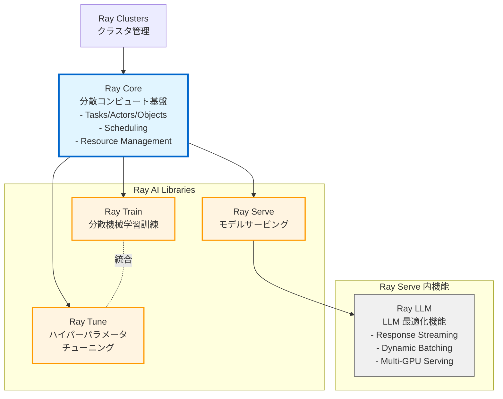

# はじめに

https://github.com/ray-project/ray/releases/tag/ray-2.53.0

Ray 2.53.0 は、モデルサービング、分散トレーニング、LLM 対応の各分野においてアップデートがありました。本リリースには 40 件を超える Pull Request が含まれており、パフォーマンスの最適化、新機能の追加、バグの修正が実施されています。本記事では、Ray Serve、Ray Train、Ray LLM、Ray Core の各コンポーネントにおける主要な変更点を確認します。なお、Ray Data については本記事では取り扱いません。

# Ray アーキテクチャ概要

Ray は階層的なアーキテクチャを持つ分散コンピューティングフレームワークです。最下層にクラスタ管理基盤である Ray Clusters が配置され、その上に汎用分散コンピューティングライブラリとしての Ray Core が構築されています。Ray Core は Tasks、Actors、Objects の 3 つのコア概念を提供し、分散実行とリソーススケジューリングを担当します。最上位の Ray AI Libraries 層は、Train、Tune、Serve といった専門的な AI ライブラリを統合したランタイムとして機能します。Ray LLM は独立したコンポーネントではなく、Ray Serve 内に実装された LLM 特化機能群であり、Response Streaming、Dynamic Request Batching、Multi-node/Multi-GPU Serving などの最適化を提供します。

参照: [Ray Overview](https://docs.ray.io/en/latest/ray-overview/index.html), [Ray AIR Getting Started](https://docs.ray.io/en/latest/ray-air/getting-started.html), [Ray Serve Documentation](https://docs.ray.io/en/latest/serve/index.html)

https://docs.ray.io/en/latest/ray-overview/getting-started.html

# 主要なアップデート

## Ray Serve

Ray Serve は Ray Core の上に構築されたモデルサービングフレームワークです。2.53.0 では可視化、スケーリング、バッチ処理の各分野において重要な改善が実施されています。

Deployment Topology Visibility は、デプロイメントの依存関係グラフを REST API 経由で公開する新機能です。これにより、複雑なマイクロサービスアーキテクチャにおけるデプロイメント間の関係性を動的に把握することが可能となり、デバッグや可視化ツールとの統合が大幅に容易化されます（PR #58355）。

External Autoscaler Integration は、Kubernetes HPA などの外部スケーリングシステムとの連携を可能にする機能です。アプリケーション設定に `external_scaler_enabled` フラグを追加することで、外部システムから Ray Serve デプロイメントのレプリカ数を制御できます。これにより、カスタムメトリクスに基づく高度なスケーリングポリシー実装が可能となります（PR #57727, #57698）。

この機能は「アプリケーションレベル」のオートスケーリング（Ray Serve のレプリカ数調整）を対象としており、Karpenter などの「インフラストラクチャレベル」のオートスケーラー（ノード数調整）と異なるレイヤーで動作します。Karpenter は Ray Autoscaler が作成した Unschedulable Pod を検出して自動的にノードをプロビジョニングするため、明示的な連携設定は不要です。Ray Serve の内部オートスケーラー、Ray Autoscaler、Karpenter の 3 つのレイヤーは、それぞれ独立して動作しながら協調的にスケーリングを実現します。

Custom Batch Size Function は、`@serve.batch` デコレータで可変重みアイテムのカスタムバッチサイズ関数をサポートする機能であり、柔軟なバッチ処理実装が可能となります（PR #59059）。

参照: [Ray 2.53.0 Release Notes](https://github.com/ray-project/ray/releases/tag/ray-2.53.0), [Ray Serve Documentation](https://docs.ray.io/en/latest/serve/index.html), [Ray Serve Configuration](https://docs.ray.io/en/latest/serve/production-guide/config.html), [Ray on Kubernetes Autoscaler](https://docs.ray.io/en/latest/cluster/kubernetes/user-guides/k8s-autoscaler.html), [Karpenter Concepts](https://karpenter.sh/docs/concepts/)

パフォーマンス面では、Autoscaling Performance Optimization が特に注目です。メトリック集約アルゴリズムが、単一タイムシリーズの場合において O(n log n) から O(1) に改善されており、大規模デプロイメントにおけるオートスケーリングの応答性が大幅に向上します（PR #58962, #58963）。Downscaling Behavior Optimization は、最近スケールアップされたレプリカを優先的にダウンスケールすることで、リソース使用の効率性を高めています（PR #52929）。

## Ray Train

Ray Train は分散機械学習トレーニングフレームワークです。2.53.0 ではワーカー配置、フレームワークサポート、チェックポイント管理の各分野において機能拡張が行われています。

Worker Placement with Label Selectors は、`ScalingConfig` に `label_selector` パラメータを追加する機能です。これにより、特定の GPU タイプや CPU アーキテクチャを持つノードへワーカーを明示的に配置することが可能となり、ヘテロジニアス環境における最適なリソース利用が実現されます（PR #58845, #59414）。Multihost JaxTrainer on GPU は、分散 JAX トレーニングの GPU サポートを拡張する機能であり、JAX における大規模モデルトレーニングの実用性が向上します（PR #58322）。Checkpoint Consistency Modes は、`CheckpointConsistencyMode` により使用ケースに応じた柔軟なチェックポイント取得戦略を提供する機能です（PR #58271）。

参照: [Ray Train Documentation](https://docs.ray.io/en/latest/train/train.html)

データ処理面では、Per-Dataset Execution Options により、`DataConfig` でデータセットごとの `execution_options` を設定可能となりました。これにより、異なる特性を持つデータセット（例えば、訓練データと検証データ）に対して最適化されたパイプライン設定を個別に適用できます（PR #58717）。Nested Metrics Support は、`Result.get_best_checkpoint` でネストされたメトリクス構造をサポートする機能であり、複雑なメトリクス階層を持つ実験においても最適チェックポイントの選択が容易になります（PR #58537）。Non-blocking Checkpoint Retrieval は、メトリクスのみを報告する際にチェックポイント取得をノンブロッキング化することで、トレーニングループのスループットを向上させています（PR #58870）。

## Ray LLM

Ray LLM は Ray Serve 内に実装された LLM 特化機能群です。2.53.0 ではクラウド統合、ライブラリ更新、設定の簡素化が実施されています。

Ray LLM は vLLM 推論エンジンを利用する統合レイヤー機能です。vLLM は PagedAttention による効率的なメモリ管理と Continuous Batching によるスループット最適化を提供する高性能な LLM 推論エンジンであり、Ray はその分散実行基盤として重要な役割を果たします。vLLM は `distributed_executor_backend` パラメータで分散実行バックエンドを選択可能であり、`ray` バックエンドを指定することで Ray Core の Actors を使用してマルチワーカーを管理します。これにより、複数ノード・複数 GPU にまたがる大規模な推論ワークロードを効率的に実行できます。

Ray の vLLM 統合は 2 つの形態で提供されます。Ray Serve LLM はリアルタイム推論サービングに特化しており、REST API エンドポイント、オートスケーリング、ロードバランシングなどの本番環境向け機能を提供します。一方、Ray Data LLM はバッチ推論処理に最適化されています。両者とも vLLM の `AsyncLLMEngine` を内部で使用しており、Ray Core の分散実行機能により非同期かつマルチワーカーでの処理を実現しています。

今回の 2.53.0 における改善は、この統合レイヤーの強化に焦点を当てています。

Cloud Filesystem Restructuring は、プロバイダー固有の実装によるクラウドファイルシステムの再構築です。Amazon Simple Storage Service、Google Cloud Storage、Azure Blob Storage などの各クラウドストレージに対する統合が改善され、モデルウェイトやチェックポイントの読み込み効率が向上します（PR #58469）。

Auto-inference of GPU Configuration は、配置グループから `VLLM_RAY_PER_WORKER_GPUS` を自動推論する機能であり、ユーザーが明示的に設定する必要がなくなることで、設定ミスによるパフォーマンス低下が防止されます（PR #58949）。

Transformers Version Update では、transformers ライブラリが 4.57.3 に更新されており、最新のモデルアーキテクチャとバグ修正がサポートされます（PR #58980）。

参照: [Ray AIR Getting Started](https://docs.ray.io/en/latest/ray-air/getting-started.html), [vLLM Documentation](https://docs.vllm.ai/en/latest/), [Ray Data Batch Inference](https://docs.ray.io/en/latest/data/batch_inference.html), [Issue #58360](https://github.com/ray-project/ray/issues/58360)

## Ray Core

Ray Core は全ての Ray コンポーネントが依存する分散コンピューティング基盤です。2.53.0 では特にメモリ効率、パフォーマンス、信頼性の分野において重要な改善が実施されています。

Zero-copy PyTorch Tensor Serialization は、本リリースにおける最も重要な最適化です。分散機械学習ワークロードにおいて、テンソルの転送は頻繁に発生する操作ですが、従来の実装では送信側でテンソルをシリアライズする際に必ずメモリコピーが発生していました。これは特に大規模なモデル（数十 GB のパラメータを持つ LLM など）において深刻なボトルネックとなっており、メモリ使用量の増大とレイテンシの悪化を引き起こしていました。

この最適化が対象とするのは、**CPU ノード間でのテンソル転送**です。具体的には、クラウドストレージからモデルウェイトをロードして複数の推論ノードに配布する場合や、訓練ノードで保存したチェックポイントを推論ノードで読み込む場合、データ並列訓練で各ワーカーノードに入力バッチを配布する場合などです。一方、GPU 間の NVLink 通信や GPU-CPU 間の cudaMemcpy といった転送は別レイヤーであり、今回の最適化の対象外です。つまり、この機能は分散推論や訓練の「準備段階」におけるノード間のモデル・データ共有を効率化するものです。

> どこからどこへのどのレイヤのデータ転送の話なのか分散処理界隈の情報はいつもこんがらがるので正しい理解を心がけたいです。。

PyTorch テンソルを NumPy 配列のメモリビューに変換し（[`zero_copy_tensors_reducer`](https://github.com/ray-project/ray/blob/master/python/ray/_private/tensor_serialization_utils.py)）、uint8 ビューでバイト列として直接参照することで、メモリコピーを完全に排除しています。

:::message
PyTorch テンソルを NumPy 配列のメモリビューに変換するとは、テンソルデータをコピーせずに、CPU 上にある PyTorch テンソルのメモリ領域を、NumPy 配列として直接共有・操作する変換のことです。`tensor.numpy()` メソッドを使用します。ただしテンソルが CPU 上にある必要があります。
:::

この最適化により、大規模モデルパラメータを複数ノード間で共有する際、メモリコピーを完全に排除し、ポインタのみを渡すため、メモリ使用量が大幅に削減されます。この機能は環境変数 `RAY_ENABLE_ZERO_COPY_TORCH_TENSORS=1` を Ray のインポート前に設定することで有効化されます（PR #57639）。

参照: [Ray Core Walkthrough](https://docs.ray.io/en/latest/ray-core/walkthrough.html)

Cloud Resource Availability Awareness は、オートスケーラーがクラウドプロバイダーのリソース可用性を認識し、利用不可能なリソースタイプへのスケーリングを回避します（PR #58623）。

# まとめ

個人的には Ray についてあまりわかっていなかったのでリリースノートを通じてアーキテクチャ構成、Kubernetes、クラウド側の機能との連携、メモリコピー、などの知見を得られたのでよかったです。古いので動くか不明ですが丁度別件で Whisper を触っているので Ray Serve on EKS で推論させて知見を得ようと思います。Ray Train と SageMaker HyperPod の連携も全くどうすべきかわかってないので調べたいです。

https://github.com/aws-samples/ray-serve-whisper-streaming-on-eks?tab=readme-ov-file

## 参考文献

[Ray 2.53.0 Release Notes](https://github.com/ray-project/ray/releases/tag/ray-2.53.0)
[Ray Overview](https://docs.ray.io/en/latest/ray-overview/index.html)
[Ray Core Walkthrough](https://docs.ray.io/en/latest/ray-core/walkthrough.html)
[Ray Train Documentation](https://docs.ray.io/en/latest/train/train.html)
[Ray Serve Documentation](https://docs.ray.io/en/latest/serve/index.html)
[Ray Serve Configuration](https://docs.ray.io/en/latest/serve/production-guide/config.html)
[Ray on Kubernetes Autoscaler](https://docs.ray.io/en/latest/cluster/kubernetes/user-guides/k8s-autoscaler.html)
[Karpenter Concepts](https://karpenter.sh/docs/concepts/)
[vLLM Documentation](https://docs.vllm.ai/en/latest/)
[Ray Data Batch Inference](https://docs.ray.io/en/latest/data/batch_inference.html)
