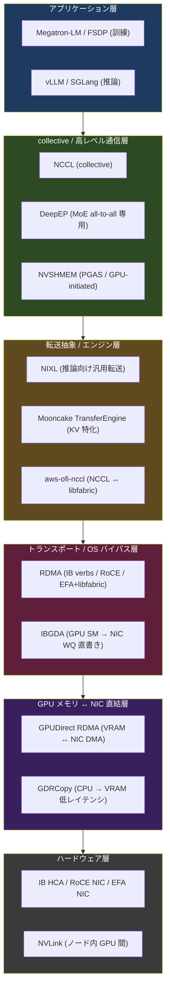
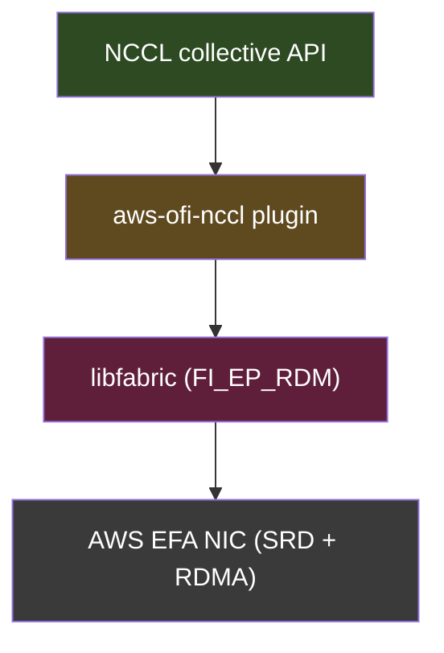

## はじめに

:::message
この記事の目的は、大規模 LLM の RL post-training (GRPO/PPO) で登場する通信プリミティブを、スタック上の位置関係とともに整理することです。RDMA、GPUDirect RDMA、GDRCopy、NVSHMEM、IBGDA、DeepEP、Mooncake TransferEngine、NIXL、NCCL の 9 つを対象とし、「何のレイヤか」「RL のどのフェーズで効くか」「依存関係」を一次情報ベースで明確にします。
:::

RL post-training のフレームワーク (slime / vime / verl など) を性能面で比較しようとすると、必ず「weight sync は CUDA IPC か NCCL か」「MoE の all-to-all は DeepEP か」「AWS なら EFA で何が動くのか」といった通信レイヤの話に行き当たります。ところが、この層は名前が似た略語が多く、どれがどのレイヤでどれに依存しているのかが見えにくいのが実情です。

本記事では個別のフレームワーク比較には踏み込まず、まず共通言語としての通信プリミティブを上級読者向けに棚卸しします。フレームワーク実装そのものの比較は別記事「slime / vime / verl を実装レベルで比較する」で扱います。

なお、本記事の数値・仕様はすべて各プロジェクトの公式ドキュメントや GitHub README を出典とし、確証が取れていない部分は「公称」「推定」と明示します。

## なぜ RL post-training で通信が支配的になるのか

RL post-training のループは、ざっくり 3 つの計算フェーズに分かれます。現在のポリシーで応答を生成する rollout (推論エンジンが担当)、報酬計算と advantage 推定、そしてポリシー勾配でモデルを更新する training (訓練バックエンドが担当) の 3 フェーズです。

教師ありの事前学習と決定的に異なるのは、rollout を担う推論エンジン (vLLM / SGLang) と training を担う訓練バックエンド (Megatron / FSDP) が別の重みコピーを持つ点です。1 ステップごとに訓練側で更新した重みを推論側へ配り直す weight sync が必要になり、ここが通信のホットスポットになります。さらに MoE モデルでは、各トークンを選択された expert GPU に送る all-to-all 通信が forward のたびに走ります。

つまり RL post-training の通信は、weight sync、MoE all-to-all、KV transfer、rollout データ移動という 4 つの場面に集約されます。以降のプリミティブは、このどれを高速化するものなのかという観点で読むと位置づけが掴みやすくなります。

## 通信スタックの全体像

個別解説の前に、各プリミティブがスタックのどこに位置するかを示します。下に行くほどハードウェアに近く、上に行くほどアプリケーションに近いレイヤです。

この図のポイントは、collective 層 (NCCL/DeepEP/NVSHMEM) と転送抽象層 (NIXL/Mooncake) が並列に存在し、いずれも最終的には RDMA トランスポートと GPUDirect RDMA を経由してハードウェアに到達する点です。縦の依存関係については各節を参照してください。

## ハードウェアの帯域差 — NVLink と RDMA のギャップ

通信プリミティブを理解する前提として、ノード内とノード間で帯域が 1 桁違うという物理的事実を押さえる必要があります。

| 経路 | 代表帯域 | 出典 |
|------|---------|------|
| NVLink 4 (H100 SXM, 1 GPU あたり合計) | 900 GB/s | NVIDIA H100 製品ページ (公称、H100 NVL は 600 GB/s) |
| NVLink 5 (B200, 1 GPU あたり合計) | 1,800 GB/s | NVIDIA B200 製品ページ (公称) |
| InfiniBand NDR (ConnectX-7, 1 ポート) | 400 Gb/s = 50 GB/s | NVIDIA ConnectX-7 (公称) |
| InfiniBand (ConnectX-8, 1 ポート) | 800 Gb/s = 100 GB/s | NVIDIA ConnectX-8 (公称) |
| AWS EFA (P5, 合計) | 3,200 Gb/s = 400 GB/s | AWS P5 製品ページ (公称、理論値) |

ノード内の NVLink/NVSwitch はノード間 RDMA より大幅に広帯域です。この帯域差が、後述する DeepEP の「ノード内 NVLink パスとノード間 RDMA パスを使い分ける」設計や、weight sync を colocated (同一ノード) で行うか disaggregated (別ノード) で行うかという設計判断の根底にあります。

## RDMA — すべての土台

RDMA (Remote Direct Memory Access) は、リモートマシンの CPU を介さずにネットワーク越しにメモリを直接読み書きする技術です。CPU 割り込みが発生しないため、InfiniBand では極めて低レイテンシ (片道 1 マイクロ秒未満のオーダーが公称値として HCA データシートに示されることが多い。ファブリック・距離・世代により異なります) が実現されます。スタック上はトランスポート層に位置し、アプリケーションは RDMA verbs API (ibverbs) を呼び出し、実際のメモリ操作は NIC が DMA で完結させます。

実装形態は 3 種類あり、それぞれ物理ネットワークが異なります。

| 種別 | 物理ネットワーク | 特徴 |
|------|----------------|------|
| InfiniBand | 専用スイッチファブリック | 最低レイテンシ、HPC で主流 |
| RoCE v2 | 標準 Ethernet (UDP/IP) | 既存 Ethernet を流用、ロスレス設定 (PFC/ECN) が必要 |
| AWS EFA | AWS 独自 NIC (SRD プロトコル) | OS バイパス + libfabric 経由、独自の信頼性 datagram |

3 つの実装のうち AWS EFA は後続の記事でも重要になるため、独立した節で詳述します。

## GPUDirect RDMA と GDRCopy — CPU バウンスの排除

### GPUDirect RDMA

GPUDirect RDMA は、GPU の VRAM と NIC の間で CPU システムメモリを経由せず直接 DMA 転送する NVIDIA の技術です。通常の転送では「GPU VRAM → CPU のバウンスバッファ → NIC」と 2 段コピーが発生しますが、GPUDirect RDMA はこの中間コピーを排除します。スタック上はドライバ層に位置し、NVIDIA カーネルドライバが PCIe BAR マッピングを通じて NIC に GPU ページへの直接アクセスを許可します。

NVIDIA のドキュメントは、メモリのピニング操作が最大ミリ秒オーダーのコストを持つため、同一メモリ領域を再利用する Lazy Unpinning 最適化を推奨しています。また PCIe スイッチを経由するパスが最適であり、QPI/HT 経由のパスは性能が著しく制限される場合があると警告しています。

https://docs.nvidia.com/cuda/gpudirect-rdma/index.html

### GDRCopy

GDRCopy は、GPUDirect RDMA と同じ仕組みを「NIC → VRAM」ではなく「CPU → VRAM」の低レイテンシコピーに転用したライブラリです。GPU VRAM をユーザー空間にマップし、CPU が通常のホストメモリのように小サイズデータを読み書きできるようにします。大容量転送ではなく、weight sync の制御シグナルのような小バッファのレイテンシ最適化に向きます。

ベンチマーク実測値 (gdrcopy_copylat) では 1 バイト転送時の API 呼び出しオーバーヘッドは約 0.09 マイクロ秒、ホスト→デバイス (H→D) 帯域は約 6 から 8 GB/s (Ivy Bridge Xeon 環境での実測値。現世代 GPU サーバーでは異なる可能性あり) と報告されています。比較として、`cudaMemcpy` が招く 6〜7 マイクロ秒のオーバーヘッドを回避できる参考値として README に示されています。大容量転送は GPUDirect RDMA、小サイズ制御パスは GDRCopy という役割分担になります。

https://github.com/NVIDIA/gdrcopy/blob/master/README.md

## NVSHMEM と IBGDA — GPU 主導の通信

### NVSHMEM

NVSHMEM は、複数 GPU のメモリを分割グローバルアドレス空間 (PGAS) として扱う NVIDIA の通信ライブラリです。最大の特徴は GPU-initiated communication で、CUDA カーネル内から GPU スレッドが直接リモート GPU メモリへの put/get/atomic 操作を発行できます。CPU を介した通信開始のオーバーヘッドとカーネル起動のオーバーヘッドを削減し、強スケーリングを改善します。

スタック上は図の collective 層に分類され、内部的には RDMA トランスポートを利用します。DeepSeek の DeepEP V1 のようなアプリケーションから直接呼び出されるほか、内部トランスポートとして次の IBGDA を利用できます (InfiniBand 環境でのオプション設定。デフォルトは IBRC)。

https://developer.nvidia.com/nvshmem

### IBGDA

IBGDA (InfiniBand GPUDirect Async) は、GPU の SM (Streaming Multiprocessor) が CPU を完全にバイパスして InfiniBand NIC のワークキューへ直接 work descriptor を書き込む技術です。NVSHMEM の内部トランスポート実装の 1 つで、NVSHMEM に組み込まれています (バージョン詳細は NVIDIA NVSHMEM リリースノートまたは前掲 Magnum IO ブログ参照)。

IBGDA を使わない IBRC (InfiniBand Reliable Connection) ベースの構成では CPU がネットワーク操作をトリガーする必要があり、GPU カーネルとの同期コストが発生していました。IBGDA では GPU SM が直接 NIC のワークキューへ書き込むため、この CPU-GPU ラウンドトリップが消滅します。依存関係としては InfiniBand HCA (ConnectX-6 以降での動作実績あり; NVIDIA 推奨ハードウェア要件については公式ドキュメントを参照) が必須で、GPUDirect RDMA を前提とします。

:::message alert
IBGDA は ibverbs (InfiniBand verbs) スタックの上に構築された InfiniBand 専用機能です。後続の記事で詳述しますが、AWS EFA は独自の SRD プロトコルを使い ibverbs スタックを公開しないため、IBGDA は EFA 上では動作しません。これは DeepEP を AWS で動かす際の重要な制約になります。
:::

https://developer.nvidia.com/blog/improving-network-performance-of-hpc-systems-using-nvidia-magnum-io-nvshmem-and-gpudirect-async/

## DeepEP — MoE all-to-all の専用ライブラリ

DeepEP は DeepSeek が公開した、MoE の expert-parallel all-to-all 通信に特化した高性能ライブラリです。トークンを各 expert GPU へ分配する dispatch と、計算後に集約する combine を GPU カーネルレベルで最適化します。RL post-training では、MoE モデルの forward で expert routing が発生するたびにこの dispatch/combine が走るため、DeepEP がここを最適化します。

設計上、興味深いのは V1 と V2 でバックエンドが変わった点です。V1 は NVSHMEM バックエンドを利用していましたが、README の New features セクション (https://github.com/deepseek-ai/DeepEP?tab=readme-ov-file#new-features) によると V2 の主要な新機能は次の通りです。第一に、Fully JIT に対応しインストール時の CUDA コンパイルが不要になりました。次に、NCCL Gin バックエンド (README 原文: "NCCL Gin backend") へ移行し、既存の NCCL communicator をヘッダーのみで再利用できます。第三に、ElasticBuffer インターフェースにより high-throughput/low-latency を EPv2 API として統一的に扱えるようになりました。加えて、Engram・パイプライン並列・コンテキスト並列でのゼロ SM オーバーヘッド (0 SM Engram/PP/CP) も追加されており、SM 消費を大きく削減できます。なお、README の Installation 節 (https://github.com/deepseek-ai/DeepEP?tab=readme-ov-file#installation) によると、NVSHMEM は V1 互換 (legacy methods) のためにインストール依存として維持されています。

README が公開している帯域数値を以下に示します。

| 構成 | Dispatch 帯域 | Combine 帯域 | 使用 SM 数 |
|------|-------------|-------------|-----------|
| SM90 (Hopper) + CX7, EP 8x2, RDMA | 90 GB/s | 81 GB/s | 12 |
| SM90 (Hopper) + CX7, EP 8x4, RDMA | 61 GB/s | 61 GB/s | 6 |
| SM100 (Blackwell) + CX7, EP 8x2, RDMA | 90 GB/s | 91 GB/s | 12 |
| SM100 (Blackwell), EP8, NVLink | 726 GB/s | 740 GB/s | 64 (最大性能) |
| SM100 (Blackwell), EP8, NVLink | 643 GB/s | 675 GB/s | 24 (最小 SM) |

https://github.com/deepseek-ai/DeepEP

## Mooncake TransferEngine と NIXL — 転送抽象層

### Mooncake TransferEngine

Mooncake TransferEngine は、KVCache の高速ノード間転送に特化したエンジンです。複数の RDMA NIC を束ねてゼロコピー転送を実現し、その下層で RDMA/EFA/TCP を統一インターフェースで抽象化します。上層には vLLM や SGLang などの推論フレームワークが乗ります。

Mooncake の README は具体的な実測値を報告しています。4x200 Gbps RoCE 環境で 40 GB 転送時に 87 GB/s、8x400 Gbps 環境で 190 GB/s、TCP 比で 2.4 から 4.6 倍の高速化が示されています (各測定条件の詳細は原文参照)。さらに README のアップデートノート (2026-04-29) によると、SGLang と TransferEngine を組み合わせることで Kimi-K2 (1T パラメータ) の重み更新が 53 秒から 7.2 秒に短縮されたと報告されています。

https://github.com/kvcache-ai/Mooncake

### NIXL

NIXL (NVIDIA Inference Xfer Library) は、推論フレームワーク向けのポイント・ツー・ポイント (点対点) 転送を加速する汎用転送抽象ライブラリです。UCX、GDS (GPU Direct Storage)、libfabric などのバックエンドをプラグインアーキテクチャで統一します。NCCL が collective 操作向けであるのに対し、NIXL は KVCache・weight・activation の非同期 P2P 転送に特化します。

GDRCopy を有効化することで最大性能が得られると README に記載されています。libfabric バックエンドプラグインを通じて EFA との統合が想定されます。NIXL 自体は UCX 1.21.x での動作を確認済みです (README より)。Libfabric の具体的なバージョン要件については NIXL の公式ドキュメントを参照してください。

https://github.com/ai-dynamo/nixl

## NCCL と aws-ofi-nccl — collective と EFA のブリッジ

NCCL は GPU 間の collective 通信 (AllReduce、AllGather、Broadcast、AlltoAll など) を提供する NVIDIA のライブラリです。トポロジ (NVLink/PCIe/ネットワーク) を自動検出し最適なアルゴリズムを選択します。RL post-training では weight sync の AllGather/Broadcast、MoE の AlltoAll、rollout データの Gather に使われます。下層のトランスポートとして RDMA や、AWS では次の aws-ofi-nccl を経由した EFA を利用します。

aws-ofi-nccl は、NCCL が AWS の EFA を使ってノード間通信できるようにするプラグインです。NCCL の接続指向 API を libfabric の接続レス信頼性インターフェース (EFA の SRD プロトコル) にマッピングします。スタック上は NCCL と libfabric の間のグルー層に位置します。

GPU メモリからの直接転送 (GPUDirect RDMA) には `FI_HMEM` と RDMA の両サポートが必要で、AWS では Nitro v4 以降の EFA で利用可能です (AWS EFA ドキュメント「Supported instance types」参照)。

https://github.com/aws/aws-ofi-nccl

## プリミティブと RL フェーズの対応

ここまでの 9 プリミティブが、RL post-training の 4 フェーズのどこで効くかを一覧にまとめます。

| プリミティブ | weight sync | MoE all-to-all | KV transfer | rollout データ移動 |
|------------|:-----------:|:--------------:|:-----------:|:-----------------:|
| RDMA (IB/RoCE/EFA) | 基盤 | 基盤 | 基盤 | 基盤 |
| GPUDirect RDMA | バウンス排除 | バウンス排除 | バウンス排除 | バウンス排除 |
| GDRCopy | 小バッファ制御 | (限定的) | (限定的) | (限定的) |
| NVSHMEM | GPU-initiated | GPU-initiated (V1) | (限定的) | (限定的) |
| IBGDA | GPU-initiated 実装 | GPU-initiated 実装 | (限定的) | (限定的) |
| DeepEP | (該当なし) | 主役 | (該当なし) | (該当なし) |
| Mooncake TE | 大規模 weight sync | (該当なし) | 主役 | サポート |
| NIXL | サポート | (該当なし) | 主役 | サポート |
| NCCL / aws-ofi-nccl | AllReduce/AllGather | AlltoAll | (該当なし) | Gather |

## まとめ

:::message
[再掲] この記事では、RL post-training で登場する 9 つの通信プリミティブを、スタック上の位置・RL フェーズでの役割・依存関係の観点から整理しました。
:::

通信スタックは、ハードウェア (NVLink / RDMA NIC) の上に GPUDirect RDMA・GDRCopy の直結層があり、その上に RDMA トランスポートと IBGDA、さらに NCCL・NVSHMEM・DeepEP の collective 層と NIXL・Mooncake の転送抽象層が乗る階層構造で理解できます。特に重要な依存関係として、DeepEP V1 が NVSHMEM 経由で IBGDA を使い、その IBGDA が InfiniBand 専用であるという縦のつながりがあります。この依存鎖が、AWS EFA 環境で DeepEP の InfiniBand ネイティブパスをそのまま使えないという制約を生みます。

各プリミティブのレイヤと役割を早見表にまとめます。

| プリミティブ | レイヤ | 一言で |
|------------|--------|--------|
| RDMA | トランスポート | CPU を介さないリモートメモリ直接アクセス |
| GPUDirect RDMA | 直結 | VRAM と NIC 間の DMA、バウンス排除 |
| GDRCopy | 直結 | CPU から VRAM への小サイズ低レイテンシコピー |
| NVSHMEM | collective | GPU 主導の PGAS 通信 |
| IBGDA | トランスポート | GPU SM が NIC ワークキューへ直接書き込み (InfiniBand 専用) |
| DeepEP | collective (MoE) | expert all-to-all 専用、NVLink/RDMA 使い分け |
| Mooncake TransferEngine | 転送抽象 | KVCache 中心の高速転送 |
| NIXL | 転送抽象 | 推論向け汎用 P2P 転送 |
| NCCL / aws-ofi-nccl | collective / グルー | collective 本体と EFA ブリッジ |

次記事では、これらのプリミティブを slime / vime / verl がどのフェーズでどう組み合わせるかを実装レベルで比較します。

**参考文献**

- [NVIDIA GPUDirect RDMA Documentation](https://docs.nvidia.com/cuda/gpudirect-rdma/index.html)
- [NVIDIA/gdrcopy README](https://github.com/NVIDIA/gdrcopy/blob/master/README.md)
- [NVIDIA NVSHMEM](https://developer.nvidia.com/nvshmem)
- [Improving Network Performance using NVIDIA Magnum IO NVSHMEM and GPUDirect Async](https://developer.nvidia.com/blog/improving-network-performance-of-hpc-systems-using-nvidia-magnum-io-nvshmem-and-gpudirect-async/)
- [deepseek-ai/DeepEP](https://github.com/deepseek-ai/DeepEP)
- [kvcache-ai/Mooncake](https://github.com/kvcache-ai/Mooncake)
- [ai-dynamo/nixl](https://github.com/ai-dynamo/nixl)
- [aws/aws-ofi-nccl](https://github.com/aws/aws-ofi-nccl)
- [AWS EFA Documentation](https://docs.aws.amazon.com/AWSEC2/latest/UserGuide/efa.html)
