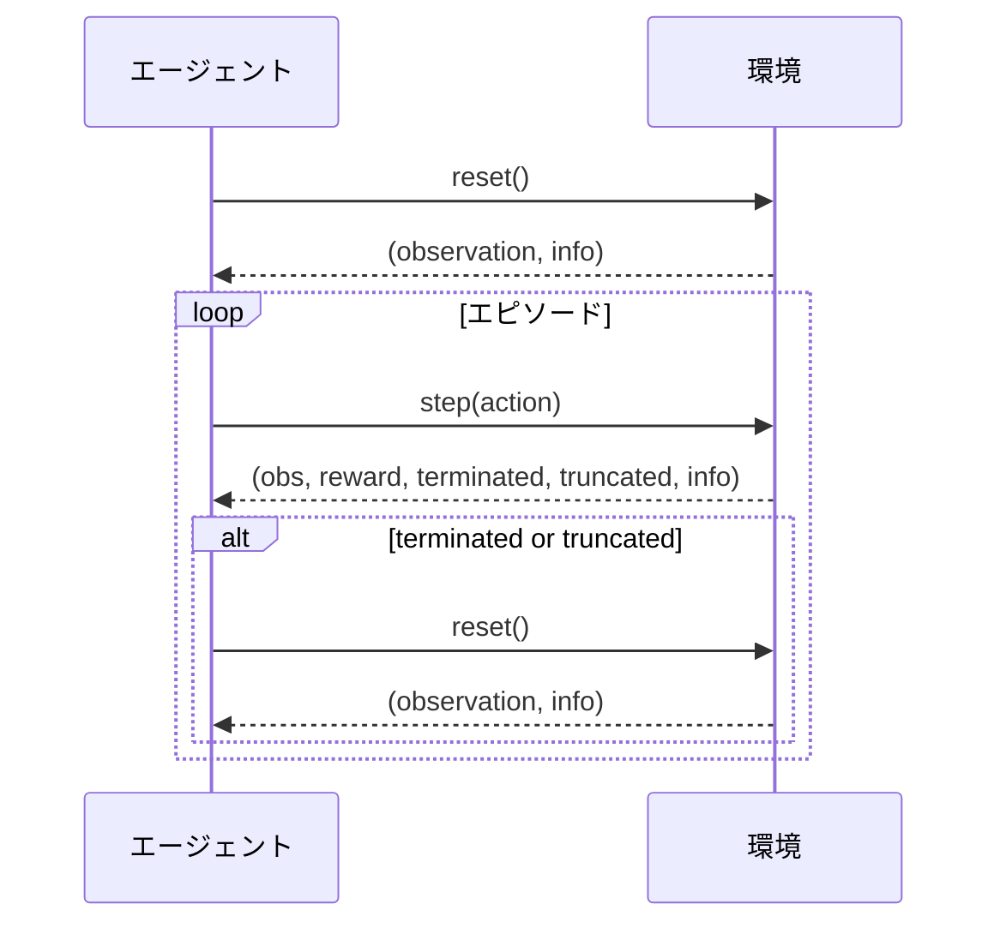
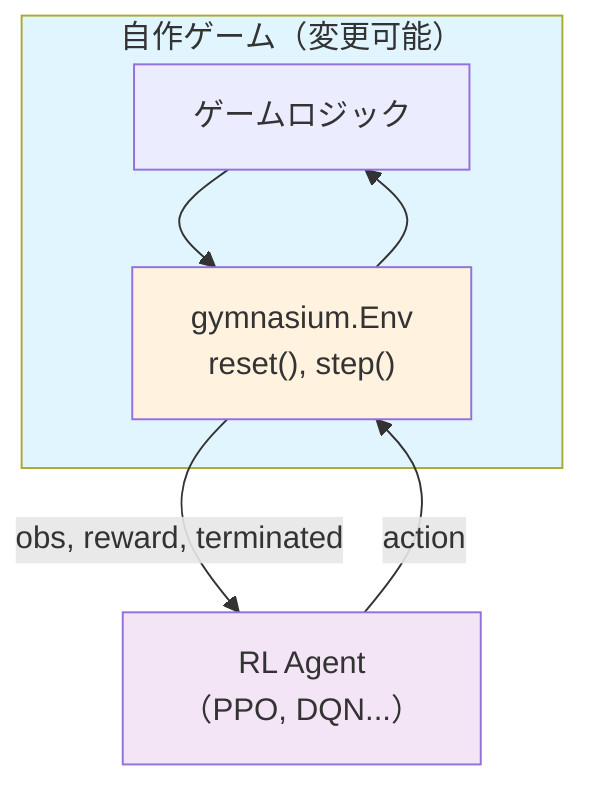
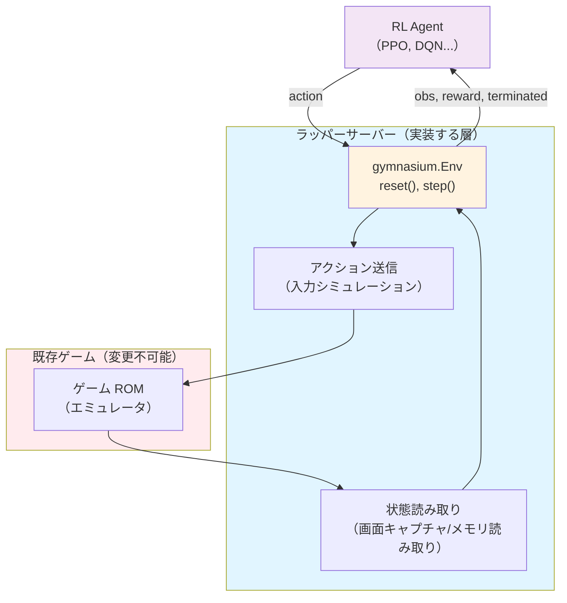

## はじめに

:::message
**記事の目的**: この記事では、強化学習で広く使われる 2 つの環境 API（Gymnasium と Ray RLlib）のフォーマットを解説します。
:::

強化学習（Reinforcement Learning）では、エージェントが「環境」と繰り返しやり取りしながら学習を進めます。エージェントが行動を選び、環境がその結果を返す -- このシンプルなループが強化学習の根幹です。ちなみに理論面は全くわかっていません、助けてください。

しかし、環境ごとにインターフェースがバラバラだと、学習アルゴリズムを使い回すことができません。そこで登場するのが **環境 API** です。統一されたインターフェースを定義することで、どんな環境に対しても同じアルゴリズムを適用できるようになります。

この記事では、強化学習で最も広く使われている 2 つの環境 API を解説します。

- **OpenAI Gym（Gymnasium）** -- 強化学習環境の事実上の標準
- **Ray RLlib** -- 分散学習とマルチエージェントに対応したフレームワーク

それぞれの API フォーマットを理解し、最終的には自分で強化学習用のゲーム環境を完成させることを目指しています。よくある準備されたゲームでの強化学習チュートリアルに乗っかるだけだと裏側の仕組みに目がいかないので全て確認しながら強化学習環境を作っていきます。

## 使用バージョン

この記事で調査したバージョン

- **Gymnasium**: 0.29.1
- **Ray RLlib**: 2.9.0
- **Python**: 3.10.x

バージョンによって API が異なる場合がありますのでご注意ください。

## OpenAI Gym（Gymnasium）の API フォーマット

### Gymnasium とは

[OpenAI Gym](https://github.com/openai/gym) は強化学習の標準的な環境インターフェースとして広く使われてきたライブラリです。[**Gymnasium**](https://github.com/Farama-Foundation/Gymnasium) が後継プロジェクトのようです。

:::message
本記事では Gymnasium API を扱います。
:::

### 基本的な考え方: エージェントと環境のループ

Gymnasium の API は、以下のやり取りを繰り返す構造になっています。



この一連の流れを支えるのが `reset()` と `step()` という 2 つのメソッドです。

### `reset()` -- エピソードの開始

`reset()` は環境を初期状態にリセットし、新しいエピソードを開始します。

```python
observation, info = env.reset(seed=42)
```

**引数:**

| 引数 | 型 | 説明 |
|------|------|------|
| `seed` | `int` or `None` | 乱数シード。再現性を確保したい場合に指定する |
| `options` | `dict` or `None` | 環境固有のリセットオプション |

**返り値:**

| 位置 | 名前 | 型 | 説明 |
|------|------|------|------|
| 0 | `observation` | `ObsType` | 環境の初期状態の観測値 |
| 1 | `info` | `dict` | 補助的な診断情報 |

`observation` は環境の「今の状態」を表すデータです。例えば CartPole 環境では、カートの位置・速度・棒の角度・角速度の 4 つの数値が返ってきます。

`info` は学習には直接使わないが、デバッグや分析に役立つ補助情報です。

### `step()` -- 1 ステップの実行

`step()` はエージェントの行動を環境に適用し、その結果を返します。

```python
observation, reward, terminated, truncated, info = env.step(action)
```

**返り値:**

| 位置 | 名前 | 型 | 説明 |
|------|------|------|------|
| 0 | `observation` | `ObsType` | 行動後の新しい観測値 |
| 1 | `reward` | `float` | この行動に対する報酬 |
| 2 | `terminated` | `bool` | タスクの終端状態に到達したか |
| 3 | `truncated` | `bool` | 外部条件でエピソードが打ち切られたか |
| 4 | `info` | `dict` | 補助的な診断情報 |

#### terminated と truncated の違い

この 2 つのフラグの違いは重要です。

- **`terminated`**: タスクの定義上の終了。MDP（マルコフ決定過程 -- 強化学習の数学的な枠組み）で定義された終端状態に到達した場合に `True` になります。
  - 例: CartPole で棒が倒れた（失敗）、迷路でゴールに到達した（成功）
- **`truncated`**: タスク外の制約による打ち切り。エージェントの成否とは無関係に、外部の条件でエピソードが終了した場合に `True` になります。
  - 例: 最大ステップ数に達した、制限時間を超過した

:::message
なぜこの区別が必要なのでしょうか。学習アルゴリズムは、エピソード終了時に「この先の報酬はもう得られない」のか「まだ得られる可能性があるが打ち切られた」のかを区別する必要があります。`terminated=True` の場合は将来の報酬はゼロですが、`truncated=True` の場合は価値関数で将来の報酬を推定すべきです。
:::

エピソードは `terminated or truncated` が `True` になったときに終了します。

### `observation_space` と `action_space` -- 空間の定義

すべての Gymnasium 環境は 2 つの **空間（Space）** を持ちます。

| 属性 | 役割 |
|------|------|
| `observation_space` | 環境が返す観測値の形式と範囲を定義する |
| `action_space` | エージェントが取れる行動の形式と範囲を定義する |

空間は 3 つの目的で使われます。

1. **バリデーション**: 観測値や行動が有効かを `contains()` で検証できる
2. **サンプリング**: `sample()` でランダムな値を生成できる（探索やデバッグに便利）
3. **情報提供**: 学習アルゴリズムに入出力の形状・範囲を伝える

#### 主要な空間の種類

```python
from gymnasium import spaces
import numpy as np

# 離散値: {0, 1, ..., n-1} から 1 つ選ぶ
spaces.Discrete(4)                # {0, 1, 2, 3}

# 連続値: 指定した範囲の多次元配列
spaces.Box(low=-1.0, high=1.0, shape=(4,), dtype=np.float32)

# 画像: 0-255 の RGB 配列
spaces.Box(low=0, high=255, shape=(64, 64, 3), dtype=np.uint8)

# 複数の離散値（独立した複数のカテゴリ選択）
spaces.MultiDiscrete([3, 4, 2])

# 辞書型（複数の異なる情報を組み合わせる）
spaces.Dict({
    "position": spaces.Box(0, 10, shape=(2,)),
    "velocity": spaces.Box(-1, 1, shape=(2,)),
    "inventory": spaces.Discrete(5),
})
```

空間の操作例

```python
# ランダムな行動をサンプリング
action = env.action_space.sample()

# 値が空間に含まれるか検証
is_valid = env.observation_space.contains(observation)
```

### CartPole でランダムエージェントを動かすケース


https://gymnasium.farama.org/environments/classic_control/cart_pole/

CartPole-v1 環境の例では、CartPole-v1 の観測値は 4 要素の配列です（[公式ドキュメント](https://gymnasium.farama.org/environments/classic_control/cart_pole/)）。行動空間は `Discrete(2)` で、`0` がカートを左に押す、`1` が右に押す操作に対応します。

| インデックス | 意味 | 範囲 |
|------------|------|------|
| 0 | カートの位置 | -4.8 ~ 4.8 |
| 1 | カートの速度 | -Inf ~ Inf |
| 2 | 棒の角度 | -0.418 rad ~ 0.418 rad |
| 3 | 棒の角速度 | -Inf ~ Inf |

強化学習実装を解説することが目的ではないため詳細は公式ドキュメントに譲ります。

## Ray RLlib の API フォーマット

### RLlib とは

[Ray RLlib](https://docs.ray.io/en/latest/rllib/index.html) は、Ray フレームワーク上に構築された強化学習ライブラリです。分散学習やマルチエージェント環境のサポートが特徴で、大規模な学習にも対応できます。

重要なポイントとして、RLlib は **Gymnasium の API を基盤として採用** しています（[RLlib Environments](https://docs.ray.io/en/latest/rllib/rllib-env.html#gymnasium)）。つまり、単一エージェント環境であれば Gymnasium とほぼ同じインターフェースで開発できます。

### 単一エージェント環境: Gymnasium との互換性

RLlib の単一エージェント環境は `gymnasium.Env` をそのまま継承します。`reset()` と `step()` の返り値は Gymnasium と同一フォーマットです。

#### RLlib 固有のポイント: `config` 引数

Gymnasium との違いは、コンストラクタで **`config` 引数** を受け取る点です。

```python
def __init__(self, config=None):  # config 引数が必要
    config = config or {}
    corridor_length = config.get("corridor_length", 10)
```

この `config` を通じて以下の情報にアクセスできます（[EnvContext API](https://docs.ray.io/en/latest/rllib/rllib-env.html#configuring-environments)）。

- `config["worker_index"]` -- ワーカーのインデックス（分散実行時）
- `config["num_workers"]` -- 総ワーカー数
- `config["vector_index"]` -- ベクトル化環境内のインデックス

#### RLlib での訓練実行

```python
from ray.rllib.algorithms.ppo import PPOConfig

config = PPOConfig().environment(
    SimpleCorridor,
    env_config={"corridor_length": 10},
)
algo = config.build()
result = algo.train()
```

### マルチエージェント環境: RLlib 独自の拡張

RLlib の真価が発揮されるのがマルチエージェント環境です（[Multi-Agent Environments](https://docs.ray.io/en/latest/rllib/rllib-env.html#multi-agent-and-hierarchical)）。複数のエージェントが同じ環境内で同時に行動する場面を扱えます。

#### `MultiAgentEnv` の基本構造

マルチエージェント環境は `MultiAgentEnv`（`gymnasium.Env` のサブクラス）を継承します。単一エージェント環境との最大の違いは、**すべてのデータがエージェント ID をキーとする辞書** になることです。

#### 単一エージェントとの比較

| 項目 | 単一エージェント | マルチエージェント |
|------|----------------|------------------|
| `step()` の入力 | `action`（単一値） | `action_dict: Dict[AgentID, action]` |
| `step()` の出力 | スカラー/配列 | `Dict[AgentID, value]` |
| 終了フラグ | `terminated`（bool） | `terminateds`（Dict + `__all__` キー） |
| 空間の定義 | `self.observation_space` | `self.observation_spaces`（辞書） |

#### 動的エージェント管理

observations 辞書に含まれるエージェント ID のみが、次の `step()` でアクションを求められます。これを利用するとターン制ゲームを実装できます。

```python
def step(self, action_dict):
    # action_dict には {"agent_0": action} のみ含まれる
    # ...処理...

    # agent_1 のターンにする（agent_1 の観測のみ返す）
    return {"agent_1": obs}, rewards, terminateds, truncateds, infos
```

#### コード例: じゃんけん環境

```python
import gymnasium as gym
from ray.rllib.env.multi_agent_env import MultiAgentEnv


class RockPaperScissors(MultiAgentEnv):
    ROCK = 0
    PAPER = 1
    SCISSORS = 2

    WIN_MATRIX = {
        (0, 0): (0, 0),  (0, 1): (-1, 1), (0, 2): (1, -1),
        (1, 0): (1, -1), (1, 1): (0, 0),  (1, 2): (-1, 1),
        (2, 0): (-1, 1), (2, 1): (1, -1), (2, 2): (0, 0),
    }

    def __init__(self, config=None):
        super().__init__()
        self.agents = self.possible_agents = ["player1", "player2"]
        self.observation_spaces = self.action_spaces = {
            "player1": gym.spaces.Discrete(3),
            "player2": gym.spaces.Discrete(3),
        }
        self.num_moves = 0

    def reset(self, *, seed=None, options=None):
        self.num_moves = 0
        return {"player1": 0, "player2": 0}, {}

    def step(self, action_dict):
        self.num_moves += 1
        move1 = action_dict["player1"]
        move2 = action_dict["player2"]

        observations = {"player1": move2, "player2": move1}
        r1, r2 = self.WIN_MATRIX[(move1, move2)]
        rewards = {"player1": r1, "player2": r2}
        terminateds = {"__all__": self.num_moves >= 10}
        truncateds = {"__all__": False}

        return observations, rewards, terminateds, truncateds, {}
```

この環境では 2 人のプレイヤーが同時にグー(0)・パー(1)・チョキ(2)を出し、10 ラウンドでエピソードが終了します。各プレイヤーの観測値は相手の前回の手です。

## 両者の比較

### 共通点

OpenAI Gym（Gymnasium）と Ray RLlib は多くの点で共通しています。

| 項目 | 説明 |
|------|------|
| 基底クラス | どちらも `gymnasium.Env` を使用 |
| `step()` の返り値 | `(obs, reward, terminated, truncated, info)` -- 同一フォーマット |
| `reset()` の返り値 | `(obs, info)` -- 同一フォーマット |
| 空間の定義 | `gymnasium.spaces` を使用 -- 同一 |
| Wrapper | `gymnasium.Wrapper` がどちらでも使用可能 |

つまり、**単一エージェント環境であれば Gymnasium で作った環境をそのまま RLlib に持ち込める** のが大きな利点です。

### 違い

| 項目 | Gymnasium | RLlib |
|------|-----------|-------|
| コンストラクタ | 任意の引数 | `config` 引数を受け取る |
| 環境の登録 | `gymnasium.register()` | `ray.tune.registry.register_env()` |
| マルチエージェント | 非対応 | `MultiAgentEnv` で対応 |
| 分散実行 | 非対応 | `EnvRunner` で分散実行 |
| ベクトル化 | `gymnasium.vector` | `num_envs_per_env_runner` で制御 |

## 自作ゲームへの Gymnasium 組み込み

実際に自作ゲームで強化学習環境を作る際、おそらく 2 つの実装パターンがあります。

### パターン 1: 自作ゲームに Gymnasium を直接組み込む

ゲームのコードを自由に変更できる場合、ゲーム本体が `gymnasium.Env` を継承して実装します。



この実装では、ゲームロジックと Gymnasium インターフェースが一体化しています。自由な強化学習環境を作れるため、私はこの方法で勉強のために以下のようなポ◯モンの実装を進めています。フルスクラッチなので大丈夫な気はしますがライセンスが気になるので完全クローズドで進めています。私のポケモン愛を詰め込んで自己満足できる強化学習環境を目指します（ハリボテではなくとてつもなく作り込んでいます）。今後 Ray RLLib と統合した実験に進む予定です。ポ◯モンは結構複雑なのでいきなりそれに取り組ませるのは計算リソースの都合上もハードルが高いので、マップ攻略、対戦攻略、ストーリー攻略（後回し）、をそれぞれ切り分けて学習できるようにしたいです。マップ攻略はスクリーンショットを理解して VLM の強化学習をとり入れていきたいです。


自作の利点は、実験単位で並列して複数のエージェントが並行で操作を進められるように Experiments という単位で並列実行できるようにしていたり、エージェントの行動の様子を Websocket 経由でリアルタイムに可視化できる、ゲーム自体のデバッグ（一気に Lv.100 にする、経験値を変える、マップを移動する、など）にも有用です。


ちなみに今は永久に一番道路に生息する例の鳥の進化ラインのみが登場します。ポー！[`poke-env`](https://github.com/hsahovic/poke-env)(MiT License) という技のダメージ、ポケモン情報などを提供してくれているツールを使っており、対戦は別途作り込む予定です。

### パターン 2: 既存ゲームに対するラッパーサーバー

既存のゲーム ROM や変更不可能な市販ゲームを使う場合、**ラッパーサーバー（アダプター層）** を作成してゲームの動作を解釈し、Gymnasium インターフェースを実装することになると思われます。この場合はマルチモーダルモデルが必要そうです。



PokeRL プロジェクトでは、実際のポケモン Game Boy ROM に対して PyBoy エミュレーターで操作、画像をキャプチャするなどをしているようです。この場合は、実操作時間やプレイの並列数が律速されそう、汎化性能が確保しづらそう（知らんけど）、といった辛みもありそうですね。

https://drubinstein.github.io/pokerl/

## まとめ

普段なら涙を流しながら検証や構築をしていますが今回は脳汁を流しながら作業をしていました。楽しく高速に学べる AI 時代最高ですね！自分のポンコツ脳を強化する報酬をくれる人が欲しいです！にゃーん。

:::message
**[再掲] 記事の目的**: 強化学習で広く使われる 2 つの環境 API（Gymnasium と Ray RLlib）のフォーマットを解説しました。
:::

**参考文献**

- [Gymnasium Documentation](https://gymnasium.farama.org/)
- [Gymnasium GitHub Repository](https://github.com/Farama-Foundation/Gymnasium)
- [Gymnasium Migration Guide](https://gymnasium.farama.org/content/migration-guide/)
- [Gymnasium v0.26.0 Release Notes](https://github.com/Farama-Foundation/Gymnasium/releases/tag/v0.26.0)
- [Gymnasium Environment Creation Tutorial](https://gymnasium.farama.org/tutorials/environment_creation/)
- [Ray RLlib Documentation](https://docs.ray.io/en/latest/rllib/index.html)
- [Ray RLlib Environments](https://docs.ray.io/en/latest/rllib/rllib-env.html)
- [Ray RLlib Multi-Agent Environments](https://docs.ray.io/en/latest/rllib/rllib-env.html#multi-agent-and-hierarchical)
- [OpenAI Gym (archived)](https://github.com/openai/gym)
