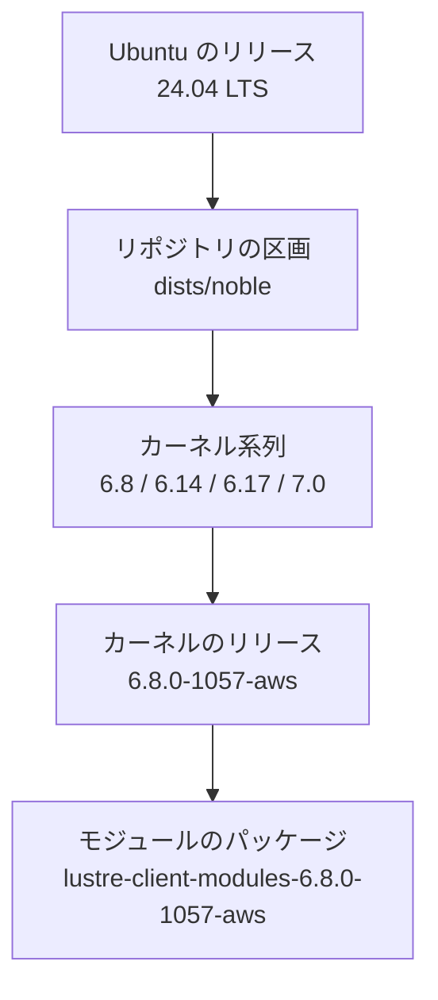
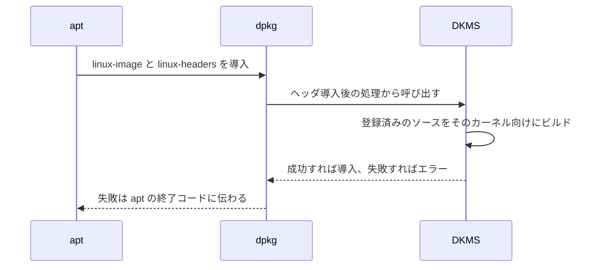
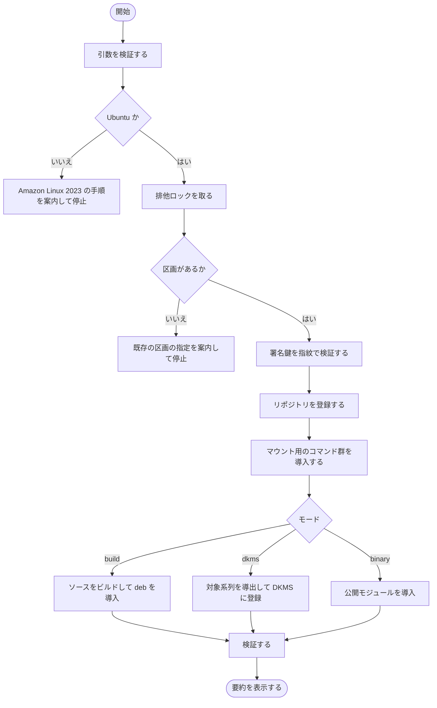
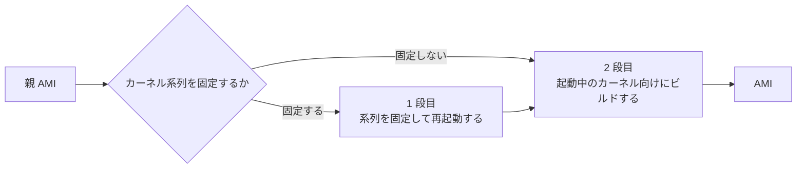

# はじめに

Amazon FSx for Lustre を Ubuntu からマウントする手順は、ドキュメントに従うと次の 1 行から始まります。

```bash
sudo apt install lustre-client-modules-$(uname -r)
```

このコマンドは、動かしているカーネルによっては失敗します。パッケージ名にカーネルのリリースが入っているため、そのリリース向けのパッケージがリポジトリに無ければ、名前の解決そのものができません。そして、どのリリースが公開されているかは時間とともに変わります。

この記事では、なぜカーネルのリリースに縛られるのかを、カーネルモジュールと DKMS の仕組みから順に説明します。そのうえで、クライアントの公開状況を一次情報から整理し、カーネル更新への追随とカスタム AMI への焼き込みを 1 本のスクリプトで扱えるようにした実装を紹介します。実装は [littlemex/distributed-ai のリファレンス実装](https://github.com/littlemex/distributed-ai/tree/main/2026-09-10-fsx-lustre-client-kernel-abi) に置いてあります。

# クライアントはカーネルモジュールなので、カーネルのリリースに縛られます

カーネルモジュールとは、カーネルに後から組み込むコードのことです。デバイスドライバやファイルシステムの実装がこの形で提供され、必要になった時点で読み込まれます。FSx for Lustre のクライアントもそのひとつで、マウントするときに読み込まれます。

モジュールはカーネル本体の内部構造を直接使うので、カーネル本体と同じ前提でコンパイルされている必要があります。前提が食い違うモジュールを読み込もうとすると、カーネルは既定では読み込みそのものを拒否します。

判定に使われる値のひとつが vermagic と呼ばれる文字列で、モジュールの中に埋め込まれています。実際に見ると、先頭にカーネルのリリースが入っています。

```bash
$ modinfo -F vermagic lustre
7.0.0-1012-aws SMP preempt mod_unload modversions
```

Ubuntu のカーネルは、リリースを上げるときに内部構造も更新します。そのため、実運用ではカーネルのリリースごとにモジュールをビルドし直す前提で考えることになり、配布されるパッケージもカーネルのリリースごとに分かれます。

::::details 厳密には、リリース文字列の一致は必須ではありません
末尾の `modversions` は、カーネルが `CONFIG_MODVERSIONS` という設定を有効にしてビルドされていることを示します。この設定が有効な場合、カーネルは vermagic の先頭にあるリリース文字列を比較の対象から外し、代わりに、モジュールが呼び出しているカーネル側の関数や変数について、その形から計算した値を照合します。つまり、呼び出している側の形が変わっていなければ、別のリリース向けにビルドされたモジュールでも読み込めます。実運用でリリースごとのビルドが必要になるのは、Ubuntu がリリースを上げるときにその形も一緒に変えるからです。
::::[リポジトリの索引](https://fsx-lustre-client-repo.s3.amazonaws.com/ubuntu/dists/noble/main/binary-amd64/Packages) を開くと、`lustre-client-modules-6.8.0-1057-aws` のように、ひとつひとつのカーネルリリースに対応するパッケージが並んでいます。裏を返せば、索引に無いリリースで動いているホストには、入れるものがありません。

# OS とカーネルとクライアントは 5 段の入れ子になっています

ここで登場する言葉が多いので、関係を整理します。上の段が下の段を選び、いちばん下でようやくモジュールのパッケージに行き着きます。図の矢印は「選ぶ」と読んでください。



それぞれの段が何を決めているかを言い換えると、次のようになります。

| 段 | 決めるもの | 誰が決めるか |
| --- | --- | --- |
| Ubuntu のリリース | 使えるパッケージの世界そのもの | 利用者が選ぶ |
| 区画 | FSx のリポジトリのどの区画を読むか | Ubuntu のコードネームから自動で決まる |
| カーネル系列 | ソースの互換性の単位 | Ubuntu のカーネル提供方針が決める |
| カーネルのリリース | モジュールの互換性 | 適用したカーネル更新が決める |
| モジュールのパッケージ | 導入できるかどうか | AWS が公開したかどうかで決まる |

区画という言葉は、apt のリポジトリが `dists/<コードネーム>` という単位で中身を分けている、その単位を指しています。Ubuntu 24.04 のコードネームは noble なので、24.04 のホストは `dists/noble` を読みます。

カーネル系列については、Ubuntu が 2 通りの提供の仕方をしている点を押さえてください。LTS のリリース時点の系列をそのまま維持する系統が `linux-aws-lts-24.04` のようなメタパッケージで、新しい系列へ順に上げていく系統が `linux-aws` です。どちらを使っているかで、動くカーネル系列が変わります。後半で「カーネル系列を固定する」と書くのは、前者を選ぶという意味です。

# DKMS はカーネルが入るたびにモジュールを作り直す仕組みです

カーネルのリリースごとにパッケージを探すやり方には限界があります。取り得る手は 3 つあり、そのうちのひとつが DKMS です。3 つの比較はこの節の最後に表で示すので、まず DKMS が何をするものかを見てください。

DKMS は Dynamic Kernel Module Support の略です。考え方は単純で、ビルド済みのモジュールを配るのではなく、**ソースをホストに置いたままにしておき、新しいカーネルが入った時点でそのカーネル向けにビルドする**という形にします。

ソースは `/usr/src/<名前>-<バージョン>/` に置き、同じディレクトリの `dkms.conf` が、何をどうビルドするかを DKMS に伝えます。登録すると、DKMS は自分の管理下にあるモジュールとして扱い、どのカーネル向けにビルド済みかを一覧できます。

```bash
$ dkms status
lustre-client-modules/2.15.6, 7.0.0-1012-aws, x86_64: installed
```

ひとつ制約を挙げておきます。Secure Boot を有効にしている場合、カーネルはモジュールの署名も検証します。Ubuntu の DKMS はビルドしたモジュールにホスト上で生成した鍵で署名しますが、その鍵をファームウェアに登録しなければ検証は通りません。Secure Boot を使う環境では、署名の運用を別途用意する必要があります。

## DKMS が動く瞬間はカーネルパッケージの導入処理の中です

肝心なのは、DKMS が動くタイミングです。カーネルのパッケージには導入後に走る処理が付いていて、その中から DKMS が呼ばれます。呼ばれる場所は 2 か所あり、カーネル本体側の `/etc/kernel/postinst.d/dkms` と、ヘッダ側の `/etc/kernel/header_postinst.d/dkms` です。ビルドには対象カーネルのヘッダが要るので、本体だけが先に入った時点ではビルドは走らず、ヘッダが入った時点で走ります。`linux-aws` のようなメタパッケージを使っていれば両方が一度に入るため、利用者が `apt install` を 1 回叩けば、その処理の内側でモジュールのビルドまで終わります。



この形にすると、利用者が書くコマンドからカーネルのリリースが消えます。`lustre-client-modules-6.8.0-1057-aws` のような名前を運用の中で管理する必要がなくなり、カーネルを更新しても追随します。

同じ AWS のコンポーネントである EFA は、この形で配られています。EFA は Elastic Fabric Adapter の略で、インスタンス間の通信を高速化するネットワークインターフェースであり、こちらもカーネルモジュールを必要とします。[EFA インストーラ](https://docs.aws.amazon.com/AWSEC2/latest/UserGuide/efa-start.html) の配布物に含まれる `efa` パッケージは、依存関係に `dkms` を持ち、モジュールのソースを `/usr/src/efa-<バージョン>/` に置きます。一方 FSx for Lustre のリポジトリは、カーネルリリースごとのモジュールパッケージとソースパッケージを配っていて、DKMS に登録済みのパッケージという形は取っていません。この記事の後半は、その差を利用者側で埋める話になります。

## DKMS の落とし穴は導入処理の中でビルドが失敗する場合です

利点の裏返しとして、注意すべき挙動があります。DKMS のビルドはカーネルパッケージの導入処理の内側で走るので、そこで失敗すると、失敗がカーネルパッケージ側に伝わります。実際に、ソースがコンパイルできないカーネルを導入すると次のようになります。

```
run-parts: /etc/kernel/postinst.d/dkms exited with return code 11
dpkg: error processing package linux-image-7.0.0-1012-aws (--configure)
```

このとき `apt` は終了コード 100 で終わり、カーネルパッケージは、導入はされたが設定処理が完了していないという中間状態で残ります。`dpkg` はこれを `half-configured` と呼び、`dpkg --audit` で一覧できます。以後のパッケージ操作では、そのパッケージの設定処理が毎回やり直され、そのたびに同じ失敗を繰り返します。`dpkg --configure -a` や当該パッケージの削除で回復できますが、放置すれば通常の更新作業が通らなくなります。ソースが対応していないカーネルを DKMS に渡すと、モジュールが手に入らないだけでは済まないということです。

なお、上の出力と以下の挙動は Ubuntu 24.04 の dkms 3.0.11 で確認したものです。終了コードや対象外カーネルの扱いは dkms のバージョンに依存します。

DKMS には、この事故を避けるための設定があります。`dkms.conf` の `BUILD_EXCLUSIVE_KERNEL` に正規表現を書くと、それに一致しないカーネルは、失敗ではなく対象外として飛ばされます。飛ばされた場合はエラーになりませんが、そのカーネルで起動したホストにはモジュールが存在しません。つまり、どちらを選んでも代償があります。

ここで、この設定で守れる範囲をはっきりさせておきます。絞り込みの単位はカーネル系列なので、防げるのは未対応の系列へ切り替わる事故です。同じ系列の中で新しいリリースが出て、そのリリースに対してソースがコンパイルできない場合は、正規表現に一致するのでビルドが走り、上と同じ失敗が起こります。系列を絞ることは、事故の確率を下げる措置であって、なくす措置ではありません。

対象を絞るなら、モジュールが無いことに気づく手段を別に用意する必要があります。何もしなければ、最初に気づくのはマウントの失敗です。

## DKMS が正しい選択になる条件は限られます

ここまで DKMS の話をしてきましたが、選択肢は 3 つあり、DKMS が最善なのはそのうち 1 つの条件だけです。

| やり方 | カーネル更新の扱い | 向く条件 |
| --- | --- | --- |
| カーネルを固定して公開モジュールを使う | `apt-mark hold` で止め、モジュールの公開を確認してから上げる | カーネル更新を統制できる環境に向きます。AWS が公開したパッケージだけを使うので、いちばん保守的な選択になります |
| カスタム AMI に焼き込む | ノードを入れ替えて上げる | ノードを使い捨てる運用に向きます。ビルド環境が本番ノードに残りません |
| DKMS でホスト上で追随する | 入った時点で自動ビルドする | カーネル更新を止められず、かつノードが長寿命な場合に向きます |

裏を返せば、ノードを入れ替えて更新する運用にとって、DKMS はビルド環境という不要な荷物を本番ノードに残すだけです。また、自分でビルドしたモジュールで起きた問題は、AWS が配布したパッケージでの再現を求められる可能性があります。サポート契約を前提とする環境では、1 段目の選択から検討してください。

無人更新を有効にしている場合も注意が要ります。DKMS のビルドはカーネル導入処理の内側で走るので、夜間の自動更新の中で重いコンパイルが走り、失敗しても誰も見ていません。

# クライアントの公開状況を一次情報から整理します

「対象を絞る」ためには、どのカーネル系列が対応済みなのかを知る必要があります。ここは推測ではなく、リポジトリに置かれているパッケージそのものから読み取れます。以下の日付は、2026 年 9 月 12 日に索引を取得し、パッケージの実ファイルに付いている Last-Modified の値を系列ごとに集めて、最も古いものを取ったものです。Last-Modified は再アップロードで更新され得るので、公開日そのものではなく、公開日の目安として読んでください。

まず、リポジトリが区画を持っている Ubuntu のリリースは次のとおりです。

| 区画 | Ubuntu | 有無 |
| --- | --- | --- |
| xenial | 16.04 LTS | あり |
| bionic | 18.04 LTS | あり |
| focal | 20.04 LTS | あり |
| jammy | 22.04 LTS | あり |
| noble | 24.04 LTS | あり |
| oracular | 24.10 | なし |
| plucky | 25.04 | なし |
| questing | 25.10 | なし |
| resolute | 26.04 LTS | なし |

16.04 以降の LTS がすべて揃っていて、中間リリース向けの区画はひとつもありません。区画は LTS に対してのみ作られていると読めます。26.04 の区画は、この記事を書いた時点ではまだありません。コードネームとリリース日は Canonical が公開している [meta-release-lts](https://changelogs.ubuntu.com/meta-release-lts) で確認できます。

次に、OS のリリースから最初のモジュールが公開されるまでの間隔です。リリース日は同じ meta-release-lts の値です。

| Ubuntu | リリース日 | 最初のモジュール公開 | 間隔 |
| --- | --- | --- | --- |
| 22.04 LTS | 2022 年 4 月 21 日 | 2023 年 2 月 14 日 | 約 9.8 か月 |
| 24.04 LTS | 2024 年 4 月 25 日 | 2025 年 3 月 18 日 | 約 10.7 か月 |
| 26.04 LTS | 2026 年 4 月 23 日 | 未公開 | 記事執筆時点で約 4.7 か月 |

そして、区画ごとのカーネル系列と、その系列で最初にモジュールが公開された日です。

| 区画 | カーネル系列 | 最初の公開 | 公開パッケージ数 |
| --- | --- | --- | --- |
| jammy | 5.15 | 2023 年 2 月 14 日 | 27 |
| jammy | 6.2 | 2023 年 12 月 15 日 | 3 |
| jammy | 6.5 | 2024 年 7 月 27 日 | 4 |
| jammy | 6.8 | 2024 年 10 月 31 日 | 54 |
| noble | 6.8 | 2025 年 3 月 18 日 | 11 |
| noble | 6.14 | 2025 年 9 月 22 日 | 10 |
| noble | 6.17 | 2026 年 2 月 23 日 | 14 |
| noble | 7.0 | 2026 年 9 月 10 日 | 1 |

この表から 3 つのことが読み取れます。

ひとつめは、対応する系列が時間とともに増えていくことです。noble の 7.0 系は 2026 年 9 月 10 日に現れました。つまり、対応系列を設定ファイルやスクリプトに書き込んでしまうと、その値は必ず古くなります。

ふたつめは、Ubuntu で利用できる系列がすべて対応されるわけではないことです。22.04 の 5.19 系と 24.04 の 6.11 系は、表に行がありません。執筆時点まで、その系列向けのモジュールは公開されていません。

みっつめは、系列に対応が入っても、その系列のすべてのリリースが対象になるわけではないことです。noble の 6.8 系で索引に並んでいるモジュールは `6.8.0-1024` から `6.8.0-1057` までで、それより前のリリース向けは存在せず、それより後も途切れています。系列としては対応済みでも、動かしているリリースが対象外という状態は起こります。

以上から、運用として置きたい前提は「対応系列は変わる」というものになります。であれば、対応系列を書き留めるのではなく、リポジトリに問い合わせて決めるのが素直です。

# 対応をスクリプト 1 本にまとめました

ここまでの内容を、[リファレンス実装](https://github.com/littlemex/distributed-ai/tree/main/2026-09-10-fsx-lustre-client-kernel-abi) として 1 本のスクリプトにまとめました。ソースからビルドすることでカーネルのリリースへの依存を外し、DKMS への登録とカスタム AMI への焼き込みの両方を同じ入口から扱えるようにしています。

取得元はコミットで固定してください。`main` を指すと内容が変わり、再現しません。取得したスクリプトの中身を読んでから実行することもおすすめします。

```bash
REF=52fff763c028710ab8f7eb0c4136a768930fda9f
curl -fsSLO "https://raw.githubusercontent.com/littlemex/distributed-ai/${REF}/2026-09-10-fsx-lustre-client-kernel-abi/ansible/roles/aws_lustre/files/lustre_installer.sh"
sha256sum lustre_installer.sh
chmod +x lustre_installer.sh
sudo ./lustre_installer.sh -y --mode dkms --install-check-unit
```

`--install-check-unit` は、起動時にモジュールの有無を確認して報告する仕組みを一緒に入れる指定です。後の節で説明します。

## 3 つのモードは置き場所の違いに対応します

同じソースを使いながら、モジュールをどこに置くかで 3 つのモードがあります。

| モード | 何をするか | 向く相手 |
| --- | --- | --- |
| `build` | 対象カーネル向けにビルドして deb として導入する | カスタム AMI を焼く構成に向きます。モジュールが成果物の一部になり、ビルドの失敗はイメージ作成の失敗になります |
| `dkms` | ソースを DKMS に登録し、以後のカーネル導入で自動再ビルドさせる | ノードを動かし続けてカーネルを入れ替える構成に向きます。ビルドがそのホスト上で走る点が代償です |
| `binary` | 公開済みのモジュールを導入する | 対応済みのリリースで動いている場合に向きます。無ければ理由を示して停止します |

イメージに焼くなら `build` が素直です。DKMS はカーネル更新への追随という利点のためにビルド環境をノードに残しますが、イメージにとってそれは不要な荷物です。

## スクリプトが中で何をしているかを追います

処理の流れは次のとおりです。停止する分岐では、何が起きたかと次に何をすればよいかを併せて表示します。



図の中で説明が要る箇所が 4 つあります。Amazon Linux 2023 で停止するのは、そちらではモジュールがカーネルパッケージに同梱されていて、`dnf install -y lustre-client` だけで済むからです。排他ロックを取るのは、同じホストで 2 回同時に走ったときに、ソースツリーや DKMS の登録を互いに壊さないためです。区画の有無を先に確認するのは、AWS がまだ対応していないリリースであることを、apt の設定に何も書かないうちに報告するためです。署名鍵を指紋で確認するのは、差し替えられた鍵を信頼せずに拒否するためです。

## ビルド対象のカーネル系列はリポジトリから導出します

前述のとおり、対応系列は変わります。そこでスクリプトは、リポジトリの索引を読んで公開されている系列を集め、1 本の正規表現にしてファイルに書き、それを DKMS の設定に反映します。

実際に生成される値は次のようになります。

```bash
$ cat /etc/lustre-installer/supported-kernels
^(6\.8|6\.14|6\.17|7\.0)\.
$ grep BUILD_EXCLUSIVE /usr/src/lustre-client-modules-2.15.6/dkms.conf
BUILD_EXCLUSIVE_KERNEL='^(6\.8|6\.14|6\.17|7\.0)\.'
```

AWS が新しい系列に対応したら、次のコマンドだけで反映されます。モジュールの再登録も再ビルドも起きないので、設定管理の定期実行から呼んでも安全です。索引の取得に失敗した場合は、現在のポリシーをそのまま維持します。

```bash
sudo ./lustre_installer.sh --refresh-policy
```

ただし、再ビルドが起きないということは、すでに新しい系列のカーネルで起動しているホストでは、ポリシーを広げてもモジュールが生えてこないということでもあります。追随が成立するのは、ポリシーを広げた後にそのカーネルが入る順序のときだけです。逆順のホストについては、スクリプトが対象のカーネルを名前で報告するので、`--kernel <リリース>` を指定して個別にビルドします。

`dkms.conf` はシェルとして読み込まれるので、そこにファイルを読む処理を書けば、ファイルの書き換えだけで反映される形にもできます。ただしその読み込みはカーネルパッケージの導入処理の中で毎回走るので、読み取りが途中で失敗した場合などに、静かに何にも一致しない値になり得ます。そのため設定には値そのものだけを書き、反映は上のコマンドで行う形にしました。

## クライアントとファイルシステムのバージョンの組み合わせは別の話です

ここまではカーネルとモジュールの互換性の話でした。もうひとつ、クライアントの Lustre バージョンと FSx for Lustre 側のバージョンの組み合わせという軸があります。AWS は [クライアントの互換性](https://docs.aws.amazon.com/fsx/latest/LustreGuide/lustre-client-matrix.html) を公開していて、公開バイナリはその範囲で試験されています。ソースからビルドしたモジュール自体は同じソースパッケージ由来ですが、公開バイナリと同じ試験を通ったものではありません。この点は、この手法を選ぶときの本質的なコストとして認識しておいてください。

## 起動時にモジュールの有無を報告します

対象外として飛ばされたカーネルで起動したホストには、モジュールがありません。そのことに最初に気づくのがマウントの失敗では遅いので、起動時に判定して報告する systemd のユニットを用意しています。

```bash
$ systemctl status lustre-client-check
$ sudo ./lustre_installer.sh --check
ok: 7.0.0-1012-aws SMP preempt mod_unload modversions  is loaded and mountable
```

このユニットは報告するだけで、起動そのものは止めません。起動しないノードは、異常を報告するノードよりも扱いにくいからです。判定結果を実際の割り当てに反映させる部分は、ノードを管理する仕組みに合わせて設計する必要があります。たとえば Kubernetes なら、この結果を見てノードに条件や taint を付ける役割を別に置くことになります。

ビルドが失敗したときの調査先も書いておきます。DKMS はビルドログを `/var/lib/dkms/lustre-client-modules/<バージョン>/build/make.log` に残すので、コンパイルエラーの内容はそこで読めます。カーネルパッケージが `half-configured` で残っている場合は `dpkg --configure -a` で回復し、登録を取り消すなら `dkms remove -m lustre-client-modules -v <バージョン> --all` を使います。

# AMI に焼く場合は 2 段構えになります

カスタム AMI に焼き込む場合、Packer の中で Ansible を 2 回走らせます。間に再起動を挟むのは、モジュールをイメージが実際に起動するカーネルに対してビルドする必要があるためです。



再起動が要るのは、カーネル系列を固定する場合だけです。親イメージが起動したカーネルをそのまま使うなら、1 段目と再起動は何もしません。そして固定する理由も、モジュールが公開されているかどうかではなく、カーネル自体のサポート期間をどう選ぶかという話になります。ソースからビルドすることで、公開状況への依存は先に外れているからです。

なお、忘れやすい点が 2 つあります。ひとつは、`lustre-source` パッケージが宣言している依存関係だけではビルドが完了せず、`flex` と `bison` と Python の開発用ヘッダが追加で必要になることです。もうひとつは、`lustre-client-utils` が必須で、モジュールだけではマウントできないことです。`mount` コマンドは、ファイルシステム専用の補助プログラムがあればそちらに処理を渡します。`/sbin/mount.lustre` はその補助プログラムで、接続先の指定などをカーネルが期待する形に組み立てる役割を持ちます。無い場合は `mount` が直接システムコールを呼び、カーネル側は必要な情報を受け取れずに失敗します。モジュール側の問題に見えて、原因はモジュールの外にあります。どちらもスクリプトの側で処理しています。

# まとめ

FSx for Lustre のクライアントがカーネルのリリースに縛られるのは、カーネルモジュールである以上避けられません。避けられるのは、そのリリース向けのパッケージが公開されていることに依存する部分です。ソースからビルドすれば依存は外れ、DKMS に登録すればカーネル更新にも追随します。

ただし DKMS は、対応していないカーネルを渡されると、カーネルパッケージの導入処理を巻き込んで失敗します。そこで対象を絞る必要があり、絞る範囲は時間とともに変わるので、書き留めるのではなくリポジトリから導出するのが素直だという結論になりました。そして絞った結果としてモジュールが無いホストが生まれるので、起動時にそれを報告する仕組みを併せて用意しています。

実装は [littlemex/distributed-ai](https://github.com/littlemex/distributed-ai/tree/main/2026-09-10-fsx-lustre-client-kernel-abi) に置いてあります。スクリプト単体でも動き、Ansible のロールと Packer のテンプレートも同じディレクトリにあります。AWS のサポート対象ではない参考実装として扱ってください。
