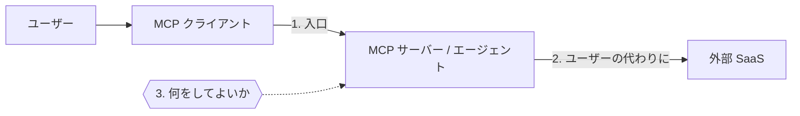
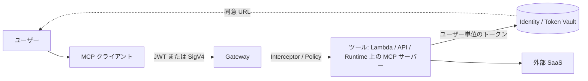

## はじめに

AI エージェントの認証の話は、つい「OAuth を入れれば終わり」と考えがちです。ところが実際に MCP サーバーを作ってみると、OAuth のフローを 1 本通しただけでは足りないことに気づきます。エージェントは、ユーザーの代わりに、ユーザーがまだ許可していない別の SaaS へ手を伸ばすからです。

2025 年 3 月に OAuth ベースの認可が入って以来、MCP の認可仕様は 3 回改訂されました。AWS の Amazon Bedrock AgentCore にも、認証まわりの機能が次々と入っています。個々の解説記事はたくさんありますが、追いかけていないと全体の地図が見えなくなります。この記事では、細かい手順ではなく大枠のエッセンスを 1 枚の地図にまとめます。細部は折りたたみの中に入れたので、必要なところだけ開いてください。

内容は 2026 年 10 月 5 日時点の公開情報にもとづいています。仕様もサービスも動きが速いので、実装する前に必ずリンク先の一次情報を確かめてください。

## 3 本の矢印

最初に、エージェントの認証・認可の話がどこで混線するのかを整理します。登場する矢印は 3 本です。

1 本目は入口の矢印で、「このリクエストは、どのクライアントが、誰の代わりに、どの権限で送ってきたか」を確かめます。MCP の仕様が正面から扱っているのはこの矢印です。

2 本目は、エージェントがユーザーの代わりに外部の SaaS を呼ぶ矢印です。GitHub や Salesforce のトークンは MCP サーバー自身のものではなく、ユーザーが個別に同意して初めて手に入ります。OAuth の authorization code grant でユーザーの同意を得る流れで、実務では 3LO（three-legged OAuth）という通称で呼ばれます。

3 本目は、入口を通った相手に「どのツールを、どの範囲で使わせるか」を決める矢印です。入口を通ったからといって、何でもしてよいわけではありません。

この 3 本は別々の問題です。それなのに「MCP の認証」と一言でまとめられてしまうことが、話をややこしくしています。用語にも注意が要ります。MCP 仕様の該当部分は「Authorization」という名前で、OAuth のアクセストークンを使います。これは 1 本目の矢印の話で、3 本目の「何を許すか」はコア仕様がほとんど扱っていません。

## MCP 認可仕様の変遷

1 本目の矢印について、MCP の認可仕様がどう変わってきたかを見ます。版ごとの細かい差分より、流れを 3 つ押さえるほうが役に立ちます。表の用語は、表の下で順に説明します。

| 版 | 大きな変化 |
|---|---|
| 2025-03-26 | OAuth 2.1 を導入。MCP サーバーが認可サーバーも兼ねる形が説明の中心 |
| 2025-06-18 | MCP サーバーはトークンを検証する側として、認可サーバーと役割を分離。トークンの横流しを禁止 |
| 2025-11-25 | 事前登録の要らないクライアント登録（CIMD）を推奨。外部サービスの同意 URL をユーザーに渡す仕組みを追加 |
| 2026-07-28 | 自動登録（DCR）を非推奨に。認可応答のすり替えへの対策を強化 |

1 つ目の流れは役割の分離です。最初の版では、MCP サーバー自身の URL を起点に認可のエンドポイントを探す設計で、MCP サーバーがログインとトークン発行まで持つ形が説明の中心でした。2025-06-18 版からは、MCP サーバーはトークンを受け取って検証する「リソースサーバー」と位置づけられ、トークンを発行する「認可サーバー」と役割が分かれました。認可サーバーは Okta や Entra ID、Cognito のような既存の IdP でも、自前でもかまいません。MCP サーバーは「自分の認可サーバーはどこか」を公開し、クライアントはそれをたどってログインします。

2 つ目の流れは、クライアント登録を軽くすることです。OAuth では、クライアントは事前に認可サーバーへ登録しておく必要があります。しかし MCP では、クライアントとサーバーの組み合わせが無数にあります。そこで当初は DCR（Dynamic Client Registration、その場でクライアントを自動登録する仕組み）が使われました。ところが DCR では、登録されたクライアントが増え続け、誰のクライアントなのかも確かめにくくなります。CIMD（Client ID Metadata Documents）では、クライアント ID そのものを、クライアントの情報を置いた URL（たとえば `https://app.example.com/oauth/client.json`）にします。認可サーバーはその URL を取りに行けば、事前登録なしで名前やリダイレクト先が分かり、ドメインを見てどこのクライアントかを判断できます。このため 2025-11-25 版で CIMD が推奨になり、2026-07-28 版では DCR が「後方互換のために残す非推奨の機能」になりました。

3 つ目の流れは、トークンの横流しを禁止することです。MCP サーバーが、クライアントから受け取ったトークンをそのまま下流の API に渡す実装を「token passthrough」と呼び、仕様で禁止しています。トークンには本来「どのサーバー向けか（audience）」が書かれていて、受け取る側はそれを確かめます。横流しを許すと、別のサーバー向けのトークンがそのまま通ってしまいます。下流からは誰が何をしたのかも追えなくなります。下流を呼ぶなら、MCP サーバーはユーザーの同意やトークン交換で、下流用のトークンを別に取ります。これが 2 本目の矢印につながります。

:::details 主な RFC と用語
- Protected Resource Metadata（RFC 9728）: MCP サーバーが「自分を守っている認可サーバーはここ」と公開するための文書です。クライアントは 401 応答をきっかけにこれを取りに行きます。
- Resource Indicators（RFC 8707）: トークンを要求するときに「どのサーバー向けのトークンか」を指定します。別のサーバー向けのトークンを使い回されるのを防ぎます。
- 権限の段階的な追加要求（step-up）: 最初は狭い権限でログインしておき、必要になった時点でサーバーが 403 と `insufficient_scope` を返して追加の同意を求めます（2025-11-25 版）。
- CIMD の注意点: CIMD で分かるのは「そのドメインの管理者が置いた情報だ」ということで、運営者が信頼できるかどうかではありません。どのドメインのクライアントを受け入れるかは、認可サーバー側が信頼ポリシーとして決めます。
- Confused deputy（混乱した代理人）: 権限を持つ仲介者が、だまされて攻撃者のために権限を使ってしまう問題です。Security Best Practices には、MCP サーバーが外部の認可サーバーに対して固定のクライアント ID で振る舞うプロキシの場合の例が載っています。攻撃者が DCR で悪意あるリダイレクト先を登録し、同意済みの cookie で同意画面が省かれることを利用して、被害者の認可コードを自分のもとへ送らせます。
- RFC 9207: 認可応答に発行元（`iss`）を含めて検証し、複数の認可サーバーを使うクライアントで応答をすり替えられる Mix-Up 攻撃を防ぎます（2026-07-28 版）。同じ版の Security Best Practices には、localhost のリダイレクト URI のなりすましや CIMD の信頼ポリシーなど、攻撃パターンごとの対策が追加されました。

一次情報: [Authorization（2026-07-28）](https://modelcontextprotocol.io/specification/2026-07-28/basic/authorization)、[Changelog（2026-07-28）](https://modelcontextprotocol.io/specification/2026-07-28/changelog)、[Changelog（2025-11-25）](https://modelcontextprotocol.io/specification/2025-11-25/changelog)、[Security Best Practices](https://modelcontextprotocol.io/specification/2026-07-28/basic/security_best_practices)
:::

## ユーザーの代わりに外部 SaaS を呼ぶ

2 本目の矢印は、実務でいちばん詰まりやすいところです。エージェントがユーザーの GitHub を読むには、ユーザー本人に GitHub の同意画面を見せる必要があります。ところが、ユーザーが向き合っているのはチャット画面やターミナルで、MCP サーバーはそこに直接画面を出せません。

この「同意画面の URL をどうやってユーザーに届けるか」に対する仕様側の答えが、2025-11-25 版で入った URL モードの elicitation です。elicitation は、MCP サーバーがクライアントを通じてユーザーに入力を求める機能です。従来のフォーム形式で外部サービスのパスワードやトークンを受け取ると、それが MCP クライアントを通り、LLM のコンテキストやログに残るおそれがあります。URL モードでは、サーバーが「この URL をブラウザで開いてほしい」と依頼し、クライアントは URL を見せてユーザーの承認を得るだけです。ユーザーはブラウザで外部サービスと直接やり取りするので、秘密の情報はクライアントを通りません。

混同しやすいのですが、URL モードの elicitation は 1 本目の矢印の仕組みではありません。MCP サーバーにログインする話は authorization の仕様が扱います。URL モードの elicitation は、その後で第三者のサービスに同意してもらうための通り道です。

仕様に入っても、クライアントが対応していなければ使えません。この機能はクライアントの対応がしばらく揃わず、未対応のクライアントでは、ツールの結果に認可 URL を文字列で埋め込んで返す回避策がよく使われてきました。たとえば Claude Code でも、対応はごく最近です。

どの方法で URL を届ける場合も、「同意したのは、エージェントにその操作を頼んだ本人か」を必ず確かめます。これを省くと、攻撃者が自分のセッションで発行させた同意 URL を他人に送って同意させ、その人の SaaS へのアクセスを手に入れられてしまいます。OAuth の `state` や PKCE は認可の要求と応答を結びつけますが、要求した人と同意した人が同じかまでは保証しません。この確認は別に必要です。

:::details URL を届ける方法の比較とクライアントの対応状況
| 方法 | 長所 | 短所 |
|---|---|---|
| ツールの結果に認可 URL を埋め込む | どのクライアントでも動く | 専用の確認ダイアログが出ない。URL が LLM のコンテキストを通るので、ツールの出力に紛れ込んだ指示で URL を差し替えられるおそれがあり、回避策としてだけ使う |
| URL モードの elicitation | 仕様に沿った専用ダイアログが出る | クライアントの対応が必要 |
| 事前に別の画面で同意を済ませる | エージェントの会話を止めない | ユーザーに別の操作を求める |

Claude Code の CHANGELOG によると、2.1.281 で 2026-07-28 版の接続に、2.1.287 で 2025-11-25 版の接続に URL モードの elicitation が入りました。CHANGELOG 上は対応済みですが、URL モードが未対応であることを報告した issue は 2026 年 10 月 5 日時点で open のままなので、使う前に手元のバージョンで動作を確かめてください。

一次情報: [Elicitation（2026-07-28）](https://modelcontextprotocol.io/specification/2026-07-28/client/elicitation)、[Claude Code CHANGELOG](https://github.com/anthropics/claude-code/blob/main/CHANGELOG.md)、[anthropics/claude-code#48164](https://github.com/anthropics/claude-code/issues/48164)
:::

## 企業の IdP にまとめる流れ

ユーザーが SaaS ごとに同意画面を踏むやり方は、企業では管理しきれません。社員が個別に同意した結果を、管理者は把握できないからです。そこで、2 本目の矢印の「ユーザーが SaaS ごとに同意する」部分を、「企業の IdP（Identity Provider、社員の ID を管理する仕組み）がポリシーで許可を出し、その証明を SaaS 側がトークンに交換する」形に置き換える標準化が進んでいます。どこまで許すかを企業が一元的に決めるので、3 本目の矢印の一部も IdP 側に寄ります。

名前が 3 つ出てくるので対応を整理します。IETF での標準の名前が ID-JAG（Identity Assertion JWT Authorization Grant）、Okta の呼び名が Cross App Access（XAA）、MCP 側の拡張の名前が Enterprise-Managed Authorization です。MCP の認可は、誰でも使う最小限の「コア仕様」と、企業向けの「拡張」の 2 層になってきたと捉えると分かりやすいです。なお、次の節で扱う AgentCore がこの方式に対応しているかは、公開ドキュメントからは確認できませんでした。

:::details ID-JAG の流れと前提
1. ユーザーは企業の IdP でクライアントにログインします。
2. クライアントは、IdP に対してトークン交換（RFC 8693）を行い、「この社員がこのリソースを使ってよい」という短命の JWT（ID-JAG）を受け取ります。
3. クライアントは、その JWT をリソース側の認可サーバーに渡し、JWT Bearer Grant（RFC 7523）でアクセストークンに交換します。

使うには、リソース側の認可サーバーが企業の IdP を信頼するよう設定され、この方式に対応している必要があります。利用者も企業の IdP が管理するユーザーであることが前提で、個人向けのサービスや未対応の SaaS には使えません。2026 年 10 月 5 日時点では IETF のドラフト（-04）の段階です。

一次情報: [IETF datatracker](https://datatracker.ietf.org/doc/draft-ietf-oauth-identity-assertion-authz-grant/)、[modelcontextprotocol/ext-auth](https://github.com/modelcontextprotocol/ext-auth)
:::

## AgentCore での 3 本の矢印

ここからは、Amazon Bedrock AgentCore が 3 本の矢印をそれぞれどの部品で受け持つかを見ます。登場する部品は次の 3 つです。

- **Runtime**: エージェントや MCP サーバーのコードを動かすマネージドの実行環境
- **Gateway**: API や Lambda、既存の MCP サーバーをツールとして束ね、1 つの MCP サーバーとして公開する入口
- **Identity**: エージェントが外部サービスを呼ぶための資格情報（OAuth アプリの設定とユーザーごとのトークン）を管理する部品

組み合わせ方は大きく 2 通りです。Claude Code のような外部の MCP クライアントにツールを提供するなら、クライアントは Gateway につなぎ、Gateway の後ろに Lambda や API、Runtime 上の MCP サーバーを置きます。エージェント自体を Runtime で動かすなら、ユーザーのアプリが Runtime を呼び、Runtime 上のエージェントが MCP クライアントとして Gateway を呼びます。下の図は前者の例です。

### 入口

1 本目の矢印は、Runtime と Gateway が受け持ちます。どちらも、IAM の署名（SigV4）か、外部 IdP が発行した JWT のどちらかで入口を守れます。JWT を選んだ場合は、IdP の OpenID Connect の discovery URL を設定すると、AgentCore が署名と有効期限を検証します。ただし、置き換え攻撃を防ぐ中心は署名ではなく、audience やクライアント ID の検証です。同じ IdP が別のアプリ向けに発行したトークンも、署名は正しいからです。受け入れる audience とクライアントは、必ず狭く設定します。

検証したユーザーの身元を、エージェントのコードやツールまで運ぶことも大事です。入口で検証して終わりにすると、奥で「誰の代わりに動いているか」が分からなくなります。Runtime は、受け取った JWT をエージェントのコードに渡せます。また、「このエージェントがこのユーザーの代わりに動いている」ことを表す workload access token に変換して渡すこともできます。workload access token は、次の節の Token Vault からトークンを取り出すときの引き換え券になります。

身元の運び方を決めるときは、1 本目の矢印のトークンを 2 本目に流用しないよう注意します。Runtime に渡された JWT は Runtime 宛てのトークンなので、クレームを読むために使い、そのまま Gateway や下流の API に転送しません。転送すると、前の節で禁止された token passthrough になります。後者の構成で Runtime 上のエージェントから Gateway を呼ぶ場合は、トークン交換などで Gateway 宛てのトークンを別に取るか、エージェント自身の資格情報で呼ぶかを決めます。1 枚のトークンに Runtime 宛てと Gateway 宛てを兼ねさせる方法もありますが、audience で境界を引く意味が薄れるので、IdP の制約でやむを得ない場合の妥協です。エージェント自身の資格情報で呼ぶと、Gateway から見えるのはエージェントの身元だけになり、ユーザー単位の認可は Gateway の手前で行うことになります。

:::details 身元を運ぶ仕組み
- `requestHeaderAllowlist` に Authorization ヘッダーを入れると、Runtime は JWT をエージェントのコードに渡します。これを許すのは、Runtime に JWT authorizer を設定した場合だけです。
- `GetWorkloadAccessTokenForJWT` は、受け取った JWT の署名と有効期限を確かめ、`iss` と `sub` の組でユーザーを特定します。Runtime に JWT の入口認証を設定している場合は、Runtime がこれを自動で呼び、workload access token をエージェントのコードに渡します。
- `GetWorkloadAccessTokenForUserId` は、呼び出し側がユーザー ID を文字列で渡します。この API を呼べるロールは、どのユーザーの分のトークンでも取り出せることになります。ユーザー ID は検証済みの JWT やセッションのような信頼できる経路からだけ取り、LLM の出力や会話の内容から決めてはいけません。
- JWT の discovery URL は `/.well-known/openid-configuration` で終わる形式に限られます。
- テナント ID のような独自のクレームを JWT に入れておけば、JWT authorizer のカスタムクレーム検証で入口の条件にできます。ただし、これは入口の条件で、3 本目の矢印の代わりにはなりません。

一次情報: [Inbound JWT authorizer](https://docs.aws.amazon.com/bedrock-agentcore/latest/devguide/inbound-jwt-authorizer.html)、[Header allowlist](https://docs.aws.amazon.com/bedrock-agentcore/latest/devguide/runtime-header-allowlist.html)、[Workload access token](https://docs.aws.amazon.com/bedrock-agentcore/latest/devguide/get-workload-access-token.html)
:::

### ユーザーの代わりに外部 SaaS を呼ぶ

2 本目の矢印は AgentCore Identity が受け持ちます。部品は 3 つです。

1. **workload identity**: エージェント自身の ID です。Token Vault からトークンを取り出すとき、どのエージェントかを示します。
2. **credential provider**: GitHub や Google などの OAuth アプリの設定（クライアント ID、シークレット、エンドポイント）を持ちます。
3. **Token Vault**: ユーザーが同意して得たトークンを、エージェント、credential provider、ユーザーの組ごとに保管します。エージェントのコードは、リフレッシュトークンや長期のシークレットに直接触れません。

ユーザーの同意が必要な場合（`USER_FEDERATION`）、Identity は同意画面の URL を返します。アプリはこの URL をユーザーに届け、ユーザーが同意すると、事前に登録した callback に戻ってきます。そこでアプリが `CompleteResourceTokenAuth` を呼ぶと、Identity がトークンを取得して保管します。アプリはその前に、「URL を要求したユーザー」と「いまログインしているユーザー」が同じかを確かめます。これを AgentCore では session binding と呼び、前の節で触れた「同意 URL を他人に送る」攻撃を防ぎます。アプリ側のログイン管理が正しくユーザーを特定していなければ、この確認は効きません。

この callback の画面を自前で用意するのが、これまでの手間でした。2026 年 9 月に、Gateway ごとにマネージドの同意ポータル（consent portal）が用意されるようになり、Gateway 経由でツールを提供する構成ではこの手間を省けます。ユーザーはポータルで各 SaaS への接続を自分で済ませられ、OAuth のやり取りはサーバー側で完結して、ブラウザがトークンを持つことはありません。

Gateway は、URL モードを含む MCP の elicitation も中継します。URL モードを使うには、2025-11-25 版以降のプロトコルで Gateway につなぎます。

Token Vault が守るのは、トークンの保管と更新です。取り出したアクセストークンをどう扱うかは利用者の責任です。トークンはツールの実装の中だけで使い、プロンプト、ツールの引数や戻り値、ログやトレースに載せないようにします。モデルの目に入ったトークンは、漏れたものとして扱うべきです。

:::details Identity の補足
- 同意が要らない machine-to-machine の呼び出し（`M2M`、client credentials grant）にも対応しています。コードでは `@requires_access_token` デコレーターの `auth_flow` に `USER_FEDERATION` か `M2M` を指定します。
- 認可 URL とセッションの有効期限は 10 分です。
- ローカル開発の `agentcore dev` では CLI が callback を肩代わりしますが、Runtime にデプロイした後は、アプリが公開 HTTPS の callback を持つ必要があります。Gateway 経由の構成では、consent portal がこの部分を置き換えます。
- consent portal の見た目を自社のブランドにどこまで合わせられるかは、公開ドキュメントからは確認できませんでした。見慣れない画面やドメインでの同意に慣れさせると、フィッシングを見分けにくくなります。外部の顧客に使ってもらうなら、正しい同意画面をどう案内するかを事前に決めておきます。

一次情報: [Authorization URL session binding](https://docs.aws.amazon.com/bedrock-agentcore/latest/devguide/oauth2-authorization-url-session-binding.html)、[Consent portal](https://docs.aws.amazon.com/bedrock-agentcore/latest/devguide/identity-consent-portal.html)、[What's New（2026-09）](https://aws.amazon.com/about-aws/whats-new/2026/09/amazon-bedrock-agentcore/)、[Gateway の elicitation](https://docs.aws.amazon.com/bedrock-agentcore/latest/devguide/gateway-mcp-elicitation.html)
:::

### 何をしてよいか

3 本目の矢印は Gateway の周りで決めます。手段は 2 つあります。

1 つ目は Interceptor です。Gateway がツールを呼ぶ前と、結果を返す前に Lambda 関数を差し込めます。JWT のクレームを見てツールを絞る、リクエストを書き換える、監査ログを書く、といった独自の処理を入れる場所です。

2 つ目は Policy in AgentCore です。Cedar というオープンソースのポリシー言語で「誰がどのツールを使えるか」を書くと、ポリシーを適用した Gateway は、通るツール呼び出しをすべて評価してから通します。2026 年 3 月に GA になりました。ツール名だけでなく、ツールに渡す引数や JWT のクレームも条件にできます。事故はたいてい「使えるツール」ではなく「ツールに渡す値」、たとえば他部署のリポジトリ名や他の顧客の ID で起きるので、引数まで条件に入れる価値があります。宣言的に書ける規則は Policy に、外部の情報を引く必要がある判断は Interceptor に、と分けるのが分かりやすいです。

ただし、どちらも Gateway を通る呼び出しにしか効きません。エージェントが Gateway を通さずに外部の API を直接呼ぶ経路があれば、そこは網の外です。認可を Gateway に任せるなら、ツールの呼び出しはすべて Gateway に集めます。また、最初に効くのは下流の SaaS に渡すスコープを必要最小限にすることです。読むだけで済む仕事に、書き込みのスコープを渡す必要はありません。

もう 1 つ、エージェントならではの前提があります。ツールの呼び出しを組み立てるのは LLM で、LLM はツールの結果や読み込んだ文書に紛れ込んだ指示に操られることがあります。そうなると、正しいユーザーの正しい権限で、攻撃者の望む操作が実行されます。3 本の矢印がすべて正しく設定されていても、この問題は防げません。削除や外部への送信のように取り返しのつかない操作は人の確認を挟み、ツールの出力から得た URL や ID をそのまま次の呼び出しに流さないようにします。

:::details 一次情報
[Gateway interceptors](https://docs.aws.amazon.com/bedrock-agentcore/latest/devguide/gateway-interceptors.html)、[Policy in AgentCore](https://docs.aws.amazon.com/bedrock-agentcore/latest/devguide/policy.html)、[What's New（Policy GA）](https://aws.amazon.com/about-aws/whats-new/2026/03/policy-amazon-bedrock-agentcore-generally-available/)
:::

## マルチテナントで効く考え方

AgentCore を SaaS の基盤にして、多くの企業顧客（テナント）に提供する場合に押さえておきたい点を 3 つ挙げます。どれも、AgentCore は仕組みを提供するが、テナントの分け方は利用者が設計する、という一点に帰着します。

1 つ目は、credential provider の数です。基本は「連携する SaaS の種類の数」で足ります。provider が持つのは OAuth アプリの設定で、ユーザーごとのトークンは Token Vault が分けて保管するからです。テナントごとに provider が必要になるのは、次の 2 つの場合です。

- 顧客が自分の OAuth アプリを持ち込む場合。顧客の管理者が、自社の IdP や SaaS の側でスコープや同意を管理したいときに当たります。
- SaaS の URL がテナントごとに違う場合。インスタンスごとにドメインが分かれる SaaS や、自社運用版の SaaS が当たります。

部門ごとのアクセス範囲は、provider を分けるのではなく、3 本目の矢印で制御します。

2 つ目は、ユーザー ID の設計です。Token Vault は、エージェント、credential provider、ユーザー ID の組でトークンを分けます。1 つのエージェントと provider を全テナントで共有する構成では、ユーザー ID が唯一のテナントの境界になります。ユーザー ID を自分で渡す方式で、テナントを含まない ID を使うと、別のテナントの同じ ID のトークンに届いてしまいます。JWT からユーザーを決める方式を使うか、ID にテナントを含めます。

3 つ目は、暗号鍵で守れる範囲を正しく見積もることです。Token Vault の暗号鍵はカスタマー管理キーに変えられますが、鍵は Token Vault 単位で設定します。テナントごとに Token Vault を分ける仕組みは公開ドキュメントでは確認できず、既定の Token Vault を全テナントで共有する構成では、鍵をテナントごとに分けられません。Token Vault のテナント分離の強さは、実行ロールの権限とユーザー ID の設計で決まります。もっと強い分離が要るなら、テナントごとに workload identity や実行ロール、さらには AWS アカウントを分けることを検討します。トークンを自前の保管庫に置く場合は、テナントごとの KMS 鍵で暗号化し、解約時に鍵を削除して読めなくする運用もできます。ただし、実行ロールが全テナントの鍵を使えるなら、鍵を分けただけではテナント同士の分離になりません。暗号化コンテキストにテナント ID を入れ、IAM の条件でリクエスト中のテナントと照合して初めて、鍵がテナントの境界になります。

:::details 関係するクォータと設定
| 項目 | 既定値 | 緩和 |
|---|---|---|
| OAuth2 credential provider | 50 / アカウント・リージョン | 可 |
| API key credential provider | 50 / アカウント・リージョン | 可 |
| workload identity | 11,000 / アカウント・リージョン | 可 |

2026 年 10 月 5 日時点の値です。Token Vault は既定で AWS 所有の鍵で暗号化され、カスタマー管理キーにも変更できます。KMS の鍵の削除には 7〜30 日の待機期間があるので、鍵の削除は即時の無効化にはなりません。

一次情報: [AgentCore のクォータ](https://docs.aws.amazon.com/bedrock-agentcore/latest/devguide/bedrock-agentcore-limits.html)、[Identity のデータ暗号化](https://docs.aws.amazon.com/bedrock-agentcore/latest/devguide/identity-data-encryption.html)
:::

## 読み進めるための記事

個別のテーマを深掘りした日本語の記事です。

- [MCP 認可の新仕様(2025-11-25)で登場の CIMD について](https://zenn.dev/kplusk/articles/d4c2ec231bbd46): CIMD の仕組みと、DCR の位置づけの変化
- [AI エージェント時代のリスク対策：認証・認可をあらためて学ぶ](https://zenn.dev/aws_japan/articles/f1a0549c8e533a): OAuth の基本から、AgentCore での代理アクセスの追跡まで
- [MCP の OAuth2 認可フローを Amazon Bedrock AgentCore Gateway で検証してみる](https://zenn.dev/aws_japan/articles/20373296118717): Gateway の RFC 9728 準拠の確認
- [AgentCore Gateway + Auth0 を利用して、DCR 可能なリモート MCP サーバーを構築してみた](https://zenn.dev/aws_japan/articles/agentcore-gateway-remote-mcp): Gateway と外部 IdP の組み合わせ
- [AgentCore Deep Dive ～Identity編～](https://zenn.dev/t_t238/articles/agentcore-deep-dive-identity): Token Vault と workload access token の詳細
- [業務アプリのエージェント認可を、AgentCore PolicyEngine と JWT で設計した](https://zenn.dev/ky_iwanami/articles/agentcore-policyengine-jwt-authorization): Cedar のポリシーでツール権限を制御する設計

## まとめ

エージェントの認証・認可は、入口、ユーザーの代わりに外部 SaaS を呼ぶこと、何をしてよいか、という 3 本の矢印に分けると見通しがよくなります。

MCP の仕様は、役割の分離、クライアント登録の簡素化、トークンの横流しの禁止という 3 つの方向に進み、2 本目の矢印には URL モードの elicitation という通り道ができました。AgentCore では、Runtime と Gateway が入口を、Identity が外部 SaaS のトークンと同意を、Interceptor と Policy が認可を受け持ちます。同意画面のマネージド化や Gateway の elicitation 対応で、少し前まで自前で作る必要があった部分は小さくなりました。

一方で、テナントをどう分けるか、ユーザー ID をどう決めるか、トークンをモデルから遠ざけるか、は今も利用者が設計する部分です。**仕組みはそろってきたので、どの矢印を誰が受け持つかを最初に決めておくことが、いちばん効く設計判断になります。**
