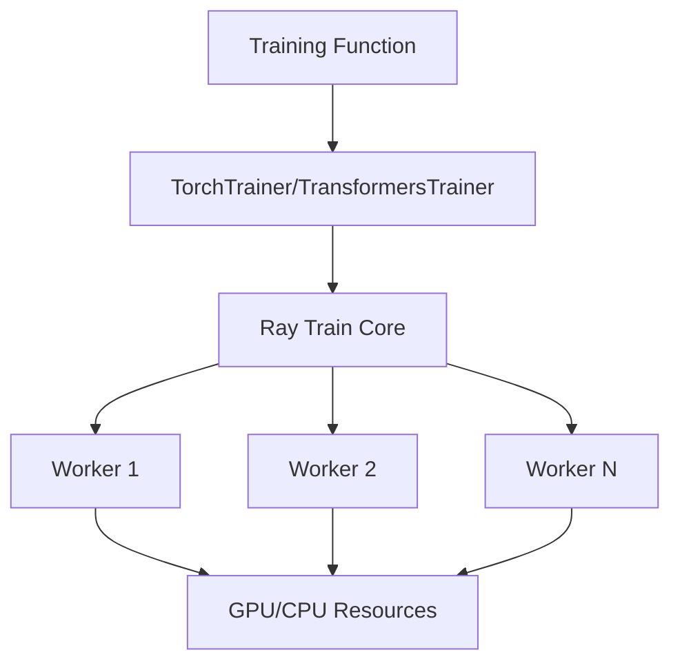

# Ray Core まとめ

## 1. Ray Coreとは

Ray Coreは、分散コンピューティングのための強力なフレームワークで、Pythonプログラムを簡単に並列化・分散化するための基本的なプリミティブ（タスク、アクター、オブジェクト）を提供します。これにより、単一のマシンから大規模なクラスターまで、シームレスにスケールアップできるアプリケーションを構築できます。

## 2. 主要な概念

### 2.1 タスク (Tasks)

タスクは、Ray Coreの最も基本的な機能です。Pythonの関数を非同期で実行するためのものです。

```python
# タスクの定義
@ray.remote
def f(x):
    return x * x

# タスクの実行
obj_ref = f.remote(4)
# 実際の結果を取得
assert ray.get(obj_ref) == 16
```

- `@ray.remote`デコレータは、関数をタスクとしてマークします
- `.remote()`を使って関数を呼び出すと、オブジェクトリファレンス（フューチャー）が即座に返されます
- `ray.get()`メソッドでオブジェクトリファレンスから実際の値を取得します

タスクは他のタスクの出力に依存することもできます。Rayは自動的に依存関係グラフを作成し、それに従ってタスクを実行します。

### 2.2 アクター (Actors)

アクターは、分散環境でクラスを作成・使用するための機能です。アクターは本質的に状態を持つワーカーです。

```python
@ray.remote
class Counter:
    def __init__(self):
        self.n = 0

    def increment(self):
        self.n += 1

    def read(self):
        return self.n

# アクターの作成
counter = Counter.remote()

# アクターの呼び出し
for _ in range(3):
    counter.increment.remote()

# アクターの内部状態を読み取る
assert ray.get(counter.read.remote()) == 3
```

- `@ray.remote`デコレータは、クラスをアクターとしてマークします
- 各アクターは独自のPythonプロセスで実行されます
- アクターのメソッドは、呼び出された順序で逐次的に実行されます

### 2.3 オブジェクト (Objects)

Rayでは、タスクとアクターがオブジェクトを作成し、それらを計算に使用します。これらのオブジェクトはリモートオブジェクトと呼ばれ、オブジェクトリファレンスを使って参照します。

```python
# オブジェクトリファレンスの作成
obj_ref = ray.put(12345)
# 実際の値を取得
assert ray.get(obj_ref) == 12345
```

オブジェクトリファレンスは以下の方法で作成できます：
1. リモート関数呼び出しの戻り値として
2. アクターメソッド呼び出しの戻り値として
3. `ray.put`を明示的に呼び出すことで

オブジェクトのライフサイクルはオブジェクトリファレンスのライフサイクルに紐づいています。すべてのオブジェクトリファレンスが削除されると、オブジェクトはオブジェクトストアから削除されます。

### 2.4 プレイスメントグループ (Placement Groups)

プレイスメントグループを使用すると、複数のノードにまたがるリソースのグループを原子的に予約できます。これにより、Rayタスクとアクターをできるだけ近くに配置したり（PACK）、または分散させたり（SPREAD）できます。

```python
# プレイスメントグループの作成
pg = ray.util.placement_group([{"CPU": 1}, {"CPU": 1}])
# プレイスメントグループの準備を待つ
ray.get(pg.ready())

# プレイスメントグループにスケジュールされるタスクを定義
@ray.remote
def f():
    return 1

# タスクをプレイスメントグループにスケジュール
obj_ref = f.options(placement_group=pg).remote()
```

### 2.5 環境依存関係 (Environment Dependencies)

Rayがリモートマシンでタスクとアクターを実行する際、それらの環境依存関係（Pythonパッケージ、ローカルファイル、環境変数など）がリモートマシンで利用可能である必要があります。これに対処するために、以下の方法があります：

1. Ray Cluster Launcherを使用して、クラスタ上で依存関係を事前に準備する
2. Rayのランタイム環境を使用して、オンザフライでインストールする

## 3. Ray APIの基本的な使い方

### 3.1 Rayの初期化

```python
import ray
ray.init()  # ローカルクラスタを起動
# または
ray.init(address="auto")  # 既存のクラスタに接続
```

### 3.2 タスクの実行

```python
@ray.remote
def slow_function(i):
    time.sleep(1)
    return i

# タスクを実行
results = []
for i in range(4):
    results.append(slow_function.remote(i))

# 結果を取得
ray.get(results)  # [0, 1, 2, 3]
```

### 3.3 オブジェクトストアの使用

```python
# オブジェクトをオブジェクトストアに配置
data = [1, 2, 3, 4, 5]
data_ref = ray.put(data)

@ray.remote
def process_data(data):
    return [x * 2 for x in data]

# オブジェクトリファレンスをタスクに渡す
result_ref = process_data.remote(data_ref)
result = ray.get(result_ref)  # [2, 4, 6, 8, 10]
```

### 3.4 非ブロッキング呼び出し

```python
object_refs = [slow_function.remote(i) for i in range(10)]
ready_refs, remaining_refs = ray.wait(object_refs, num_returns=2, timeout=None)
# ready_refsには完了した2つのタスクのリファレンスが含まれる
# remaining_refsには残りの未完了タスクのリファレンスが含まれる
```

### 3.5 アクターの使用

```python
@ray.remote
class DataTracker:
    def __init__(self):
        self._counts = 0

    def increment(self):
        self._counts += 1

    def counts(self):
        return self._counts

# アクターのインスタンスを作成
tracker = DataTracker.remote()

# アクターのメソッドを呼び出す
tracker.increment.remote()
tracker.increment.remote()
count = ray.get(tracker.counts.remote())  # 2
```

## 4. Ray Coreの利点

1. **シンプルなAPI**: Pythonの関数とクラスを少しの変更で分散実行できます
2. **スケーラビリティ**: 単一のマシンから数千のマシンまでシームレスにスケールします
3. **柔軟性**: タスク、アクター、オブジェクトを組み合わせて複雑な分散アプリケーションを構築できます
4. **効率性**: 低レイテンシのタスク実行と効率的なオブジェクト転送を提供します
5. **フォールトトレランス**: タスクとアクターの自動再試行と再起動をサポートします

## 5. ユースケース例

1. **並列データ処理**: 大規模なデータセットを複数のワーカーで並列処理
2. **分散機械学習**: モデルのトレーニングと推論を分散化
3. **シミュレーション**: 多数のシミュレーションを並列実行
4. **マイクロサービス**: アクターを使用した状態を持つサービスの実装
5. **バッチ処理**: 大量のタスクを効率的に処理

## 6. Ray APIの主要メソッド

1. `ray.init()`: Rayクラスタを初期化します
2. `@ray.remote`: 関数をタスクに、クラスをアクターに変換します
3. `ray.put()`: 値をRayのオブジェクトストアに配置します
4. `ray.get()`: オブジェクトストアから値を取得します
5. `.remote()`: アクターメソッドまたはタスクをRayクラスタで実行し、アクターをインスタンス化するために使用します
6. `ray.wait()`: 待機中のタスクの完了状態を確認します

Ray Coreは、これらの基本的なプリミティブを組み合わせることで、複雑な分散アプリケーションを構築するための強力な基盤を提供します。

---

# Ray Data の概要

Ray Data は、機械学習とAIワークロード向けの分散データ処理フレームワークです。以下にRay Dataの主要な特徴と概念をまとめました。

## Ray Data とは

Ray Data は、Ray上に構築された分散データ処理ライブラリで、以下の特徴を持っています：

- **シンプル**：パンダスに似た使いやすいAPIを提供
- **スケーラブル**：ラップトップからクラスタまでコード変更なしでスケール
- **高速**：高性能な分散実行フレームワークであるRay上に構築
- **相互運用性**：一般的なMLフレームワークやデータ形式と統合

## Ray Data の主な利点

- **深層学習向けの高速・低コスト処理**：CPUの前処理とGPUの推論/トレーニングタスク間でデータをストリーミングし、リソース利用率を最大化
- **フレームワークとの親和性**：vLLM、PyTorch、HuggingFace、TensorFlowなどのAIフレームワークと主要クラウドプロバイダー（AWS、GCP、Azure）との高性能な統合
- **マルチモーダルデータのサポート**：Apache ArrowとPandasを活用し、Parquet、Lance、画像、JSON、CSV、音声、ビデオなど多様なデータ形式をサポート
- **デフォルトでスケーラブル**：異なるCPUとGPUマシンを持つ異種クラスタ全体で自動的にスケーリング

## 主要概念

### 1. Dataset と Block

- **Dataset**：ユーザー向けの主要なPython API。分散データコレクションを表し、データ読み込みと処理操作を定義
- **Block**：データセットの連続した行のサブセット。クラスタ全体に分散され、並列に独立して処理される

### 2. ストリーミング実行モデル

Ray Dataは**ストリーミング実行モデル**を使用して大規模データセットを効率的に処理します：

- データセット全体をメモリに一度に具現化する代わりに、操作のパイプラインを通じてデータをストリーミング方式で処理
- メモリに収まらない大規模データセットの処理に有用
- 複数のステージを同時に実行し、全体的なパフォーマンスとリソース利用率を向上

### 3. 論理プランと物理プラン

Ray Dataは2段階の計画プロセスを使用して操作を効率的に実行します：

- **論理プラン**：実行する操作の高レベルな記述
- **物理プラン**：それらの操作をどのように実行するかを正確に指定

## 基本的な使用方法

```python
import ray

# S3からCSVデータセットを直接読み込む
ds = ray.data.read_csv("s3://anonymous@air-example-data/iris.csv")

# 最初のレコードをプレビュー
ds.show(limit=1)

# 変換を定義して「花弁面積」属性を計算
def transform_batch(batch):
    vec_a = batch["petal length (cm)"]
    vec_b = batch["petal width (cm)"]
    batch["petal area (cm^2)"] = vec_a * vec_b
    return batch

# 変換をデータセットに適用
transformed_ds = ds.map_batches(transform_batch)

# 新しい列を含む更新されたスキーマを表示
print(transformed_ds.materialize())

# 処理したデータセットをParquetファイルとして保存
transformed_ds.write_parquet("/tmp/iris")
```

## ユースケース

Ray Dataは以下のような用途に適しています：

1. **分散データ前処理**：フィルタリング、マッピング、グループ化などの一般的な操作をサポート
2. **分散ML訓練**：PyTorch、TensorFlow、scikit-learnなどの一般的なMLフレームワークと統合
3. **分散推論**：バッチおよびストリーミング推論のためのシンプルなAPIを提供

## 実際の活用事例

- **Pinterest**：モデルトレーニングのためのラストマイルデータ処理にRay Dataを使用
- **DoorDash**：Ray Dataでモデルトレーニングを強化
- **Instacart**：Ray Data上に分散機械学習モデルトレーニングを構築
- **ByteDance**：Ray DataでマルチモーダルなLLMを使用したオフライン推論を200TBまでスケール
- **Spotify**：バッチ推論のためにRay Data上に新しいMLプラットフォームを構築
- **Sewer AI**：Ray Dataを使用してビデオでのオブジェクト検出を3倍高速化

Ray Dataは、データ処理からモデルトレーニング、推論まで、機械学習ワークフローの各段階で効率的なスケーリングを可能にする強力なフレームワークです。

---

# Ray Train: 分散機械学習トレーニングフレームワーク

## 1. 概要

Ray Trainは、分散機械学習トレーニングを簡単に実装できるフレームワークです。以下の主要な特徴を持ちます：

- マルチノード・マルチGPUでの分散トレーニングをシンプルなAPIで実現
- PyTorch、PyTorch Lightning、Hugging Face Transformers、XGBoostなど主要なフレームワークをサポート
- DeepSpeedやHugging Face Accelerateとの統合による大規模モデルのトレーニング対応
- チェックポイントの自動保存と分散環境での管理機能
- 柔軟なスケーリング設定とリソース管理

## 2. インフラストラクチャアーキテクチャ

Ray Trainのアーキテクチャは以下の主要コンポーネントで構成されています：



- **Training Function**: ユーザーが定義するトレーニングロジック
- **Trainer**: フレームワーク固有の設定と分散トレーニングの管理
- **Ray Train Core**: 分散環境のセットアップと調整
- **Workers**: 実際のトレーニング処理を実行する分散ワーカー
- **Resources**: GPU/CPUなどの計算リソース

## 3. スケーリング機能

### 3.1 基本的なスケーリング設定

```python
scaling_config = ScalingConfig(
    num_workers=8,  # 分散ワーカー数
    use_gpu=True,   # GPU使用の有効化
    resources_per_worker={
        "CPU": 4,
        "GPU": 1,
    }
)
```

### 3.2 高度なスケーリング機能

- **マルチGPU対応**: 1ワーカーあたり複数GPUの割り当て
- **GPU種別指定**: 特定のGPUタイプ（例：A100）の指定が可能
- **通信バックエンド設定**: NCCLやGlooなどの選択が可能
- **ネットワークインターフェース設定**: 分散トレーニング時の通信経路の最適化

## 4. クラウドプラットフォームとの統合

### 4.1 Amazon EKS

- KubeRayを使用したKubernetes上での展開
- S3との統合によるチェックポイント保存
- Auto Scalingグループとの連携

### 4.2 Amazon SageMaker

- SageMaker管理のインフラストラクチャ上でのトレーニング実行
- SageMaker Metricsとの統合
- マネージドスポットトレーニングのサポート

### 4.3 Amazon ECS

- ECSタスク定義によるコンテナ化されたトレーニングジョブの実行
- ECSクラスター上でのリソース管理
- ECSサービスとの統合

## 5. 主要な機能と最適化

### 5.1 分散トレーニングの最適化

- データシャーディングの自動化
- 効率的なチェックポイント管理
- 分散バッチ処理の最適化

### 5.2 フレームワーク統合

```python
# PyTorch with DeepSpeed
def train_func():
    model = ...
    model = ray.train.torch.prepare_model(model)
    
    # DeepSpeed設定
    deepspeed_config = {
        "optimizer": {
            "type": "AdamW",
            "params": {"lr": 2e-5}
        },
        "scheduler": {
            "type": "WarmupLR",
            "params": {"warmup_num_steps": 100}
        },
        "fp16": {"enabled": True},
        "zero_optimization": {"stage": 3}
    }
```

### 5.3 モニタリングと可観測性

- メトリクスの自動収集と報告
- 分散トレーニングの進捗モニタリング
- エラーハンドリングとリカバリー

## 6. ベストプラクティス

1. **リソース設定の最適化**
   - ワーカーあたりの適切なリソース割り当て
   - GPUメモリの効率的な利用

2. **スケーラビリティの確保**
   - 適切なバッチサイズの選択
   - データローディングのボトルネック回避

3. **フォールトトレランス**
   - 定期的なチェックポイント保存
   - 分散環境での障害対策

4. **パフォーマンスチューニング**
   - 通信バックエンドの最適化
   - データ並列化の効率化

この包括的なフレームワークにより、Ray Trainは大規模な機械学習モデルのトレーニングを効率的に実行できる環境を提供します。特に、クラウドプラットフォームとの統合により、スケーラブルで管理しやすいMLOpsパイプラインの構築が可能となります。

---

Ray Serveの主要な特徴とアーキテクチャについて、以下のようにまとめました：

## アーキテクチャの概要

Ray Serveは以下の3種類のアクターで構成されています：

1. **Controller**: 
- グローバルなアクターで、各Serveインスタンスに1つ存在
- コントロールプレーンを管理し、他のアクターの作成・更新・削除を担当
- デプロイメントの作成や取得などのServe APIコールを処理

2. **HTTP/gRPCプロキシ**: 
- デフォルトでヘッドノードに1つのHTTPプロキシアクターが存在
- UvicornベースのHTTPサーバーを実行
- リクエストの受付、レプリカへの転送、レスポンス返却を担当
- スケーラビリティと高可用性のため、各ノードでプロキシを実行可能

3. **Replicas**:
- 実際のリクエスト処理を実行するアクター
- MLモデルのインスタンスなどを保持
- プロキシからのリクエストを処理
- @serve.batchによるバッチ処理が可能

## フォールトトレランス

1. **アクター障害時の挙動**:
- Replicaアクターが失敗した場合、Controllerが新しいものに置き換え
- プロキシアクターが失敗した場合、Controllerが再起動
- Controllerアクターが失敗した場合、Rayが再起動

2. **KubeRayを使用した場合**:
- KubeRayがクラッシュしたノードやクラスターを回復
- GCS FT機能を使用してクラスター障害を防止可能

## Kubernetes統合 (KubeRay)

1. **RayServiceの特徴**:
- マルチノードRayクラスターとServeアプリケーションを単一のKubernetesマニフェストにカプセル化
- 標準的なkubectlコマンドでデプロイ、アップグレード、ステータス確認が可能
- アプリケーションの状態監視とステータス更新を継続的に実行

2. **デプロイメントプロセス**:
- KubeRayコントローラーが設定に基づいてRayクラスターを作成
- クラスター起動後、REST APIを使用してServeアプリケーションをデプロイ
- トラフィックルーティング用のKubernetes Serviceを作成

3. **アップデート方法**:
- アプリケーションレベルの更新: Serve設定のみの変更で、同じRayクラスター上で実行
- クラスターレベルの更新: 新しいクラスターを起動し、アプリケーションを移行

4. **オートスケーリング**:
- Serveの設定でアプリケーションレベルのオートスケーリングを構成可能
- KubeRayクラスターで`enableInTreeAutoscaling`を有効化
- Kubernetesクラスターのオートスケーリング(GKE AutopilotやEKS Cluster Autoscaler)と組み合わせ可能

## Amazon EKS/SageMakerとの統合

1. **EKSでの展開**:
- KubeRayを使用してEKSクラスター上にRay Serveをデプロイ可能
- EKSのCluster Autoscalerと統合してリソースの効率的な利用が可能
- AWS ALBなどのロードバランサーと統合可能

2. **SageMakerとの統合**:
- SageMaker上でRay Serveを実行可能
- SageMakerのエンドポイント機能を活用したデプロイメントをサポート
- SageMakerのモニタリングやログ機能との統合

## モニタリングと可観測性

1. **Ray Dashboard**:
- アプリケーションの状態とメトリクスを可視化
- デプロイメントのステータスとヘルスチェック結果を表示
- パフォーマンスメトリクスとリソース使用率を監視

2. **ログ管理**:
- コントローラーログとデプロイメントログを`/tmp/ray/session_latest/logs/serve/`に保存
- Kubernetesでログの永続化が可能
- デプロイメント失敗やオートスケーリングイベントの詳細を記録

3. **メトリクス統合**:
- PrometheusとGrafanaによるメトリクス収集と可視化
- カスタムメトリクスの追加が可能
- アラートの設定とモニタリングダッシュボードの作成をサポート

この構成により、Ray Serveは高可用性とスケーラビリティを備えた本番環境向けのモデルサービングプラットフォームとして機能します。特にKubernetesとの統合により、運用管理の効率化とインフラストラクチャの最適化が可能になっています。
