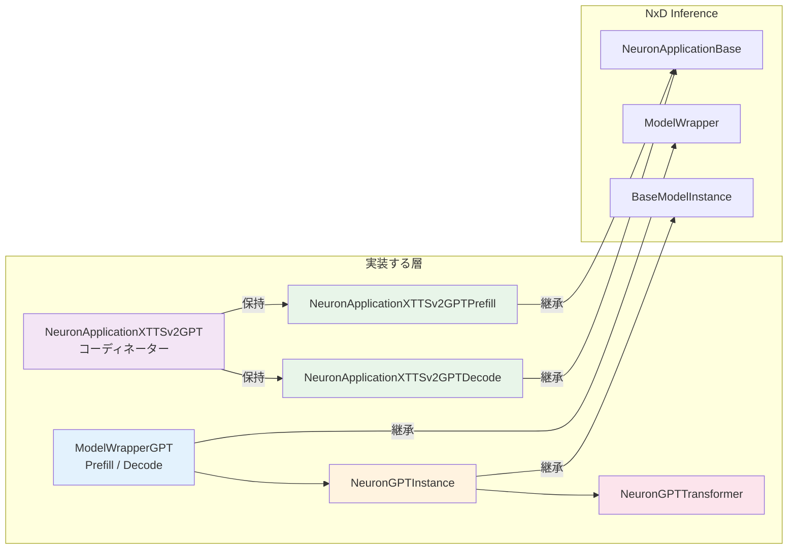
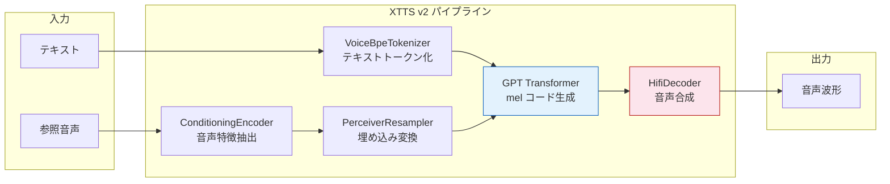
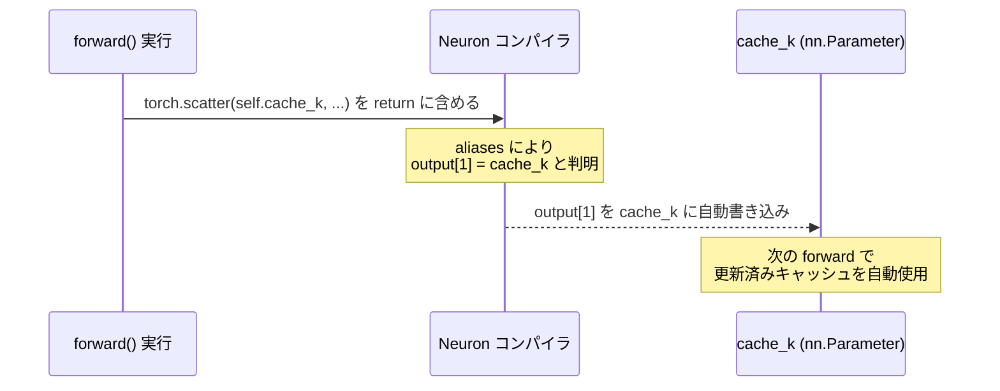
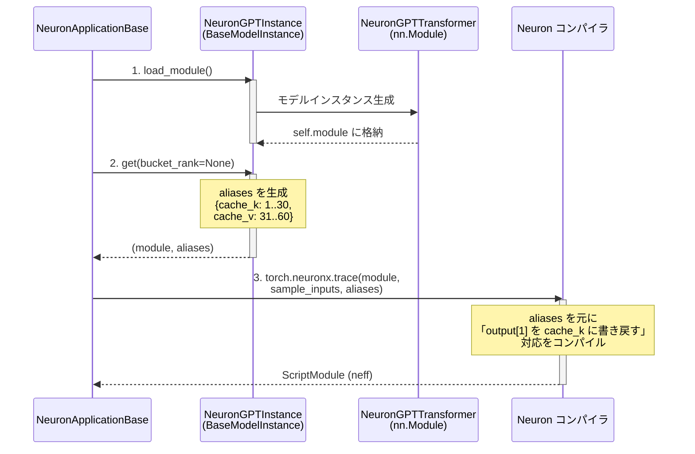
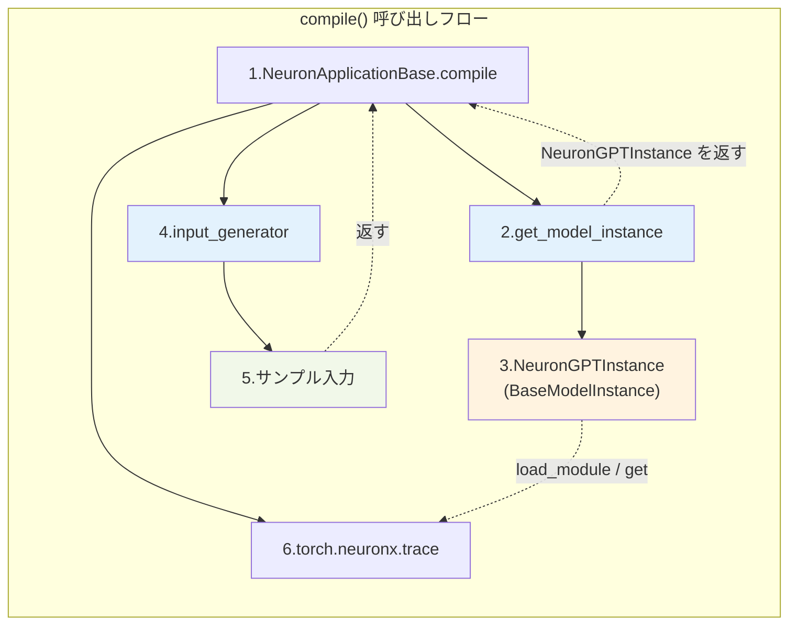
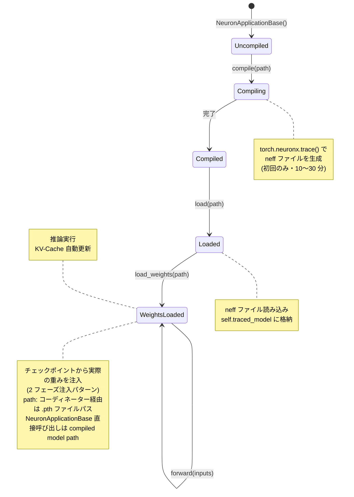

## はじめに

本記事では、XTTS v2 を NxD Inference に組み込む実装を題材に、カスタムモデルを統合する際に設計・実装すべき NxD Inference 側のインタフェースを体系的に整理します。**実際にこれらを実装する際に直面する設計上の判断と制約**に焦点を当てます。XTTS v2 固有の実装詳細は後続記事で扱います。

本記事は以下の記事の続きです。

https://zenn.dev/tosshi/articles/53cc505a8d85e2

:::message alert
2026/03 時点のバージョンに基づいているため AWS Neuron のアップデート、実装を必ず確認してください。
:::

### NxD Inference の 3 インタフェース

NxD Inference は「コンパイル・ロード・推論」の共通実装を提供するフレームワークですが、「どんな nn.Module を使うか・KV-Cache をどう管理するか・どんな入力形状でコンパイルするか」はモデルごとに異なります。これらモデル固有の情報をフレームワークに伝えるための仕組みが以下の 3 インタフェースです。

| インタフェース | 役割 |
|--------------|------|
| [`BaseModelInstance`](https://github.com/aws-neuron/neuronx-distributed-inference/blob/v0.7.14366/src/neuronx_distributed_inference/models/model_wrapper.py) | どの nn.Module を使い、forward の出力テンソルのどれが KV-Cache を上書きするか（aliases）を伝える |
| [`ModelWrapper`](https://github.com/aws-neuron/neuronx-distributed-inference/blob/v0.7.14366/src/neuronx_distributed_inference/models/model_wrapper.py) | どんな入力形状でコンパイルするかを伝える |
| [`NeuronApplicationBase`](https://github.com/aws-neuron/neuronx-distributed-inference/blob/v0.7.14366/src/neuronx_distributed_inference/models/application_base.py) | compile / load / load_weights の共通実装を提供する基底クラス（forward は実装必須） |

それぞれ **1〜2 メソッドを実装するだけ**でよい設計で、残りは NxD Inference が引き受けます。



図の見方: 右側「NxD Inference」がフレームワーク提供の基底クラス、左側「実装する層」がカスタムモデル側で実装するクラスです。`→|継承|` はサブクラス関係、`→|保持|` はインスタンスを属性として持つ関係を示します。コーディネーターは Prefill、Decode の 2 Application を保持するだけの薄い調整層です。

**「1〜2 メソッドを実装するだけ」の内訳**

| インタフェース | 実装が必要なメソッド | NxD Inference が自動で担う部分 |
|---|---|---|
| `BaseModelInstance` | `load_module()` — nn.Module をインスタンス化 | `get()` 戻り値を受取し、`torch.neuronx.trace()` へ渡す |
| | `get()` — aliases（KV-Cache の書き戻し対応表）を構築して返す | KV-Cache の自動書き戻し、TP シャーディング後のロード |
| `ModelWrapper` | `input_generator()` — compile 時のサンプル入力テンソルを返す | bucket 管理、`compile()` 呼び出しループ |
| `NeuronApplicationBase` | `forward()` — `self.traced_model()` を呼んで結果を返す | `compile()` / `load()` / `load_weights()` / `warmup()` の実装全体 |
| | `get_config_cls()` — 使用する Config クラスを返す（1 行）| TP 分割・neff 保存・ロード・エラーハンドリング |

3 インタフェースの各クラスの役割と実装方法の詳細は Section 4〜7 で解説します。ここでは実装すべき箇所と NxD Inference 側が担う箇所が少数のインタフェースで責務分担されていることを理解できれば良いです。

### サンプルコードの取得

本記事で解説する実装は GitHub で公開しています。Neuron 環境は不要で CPU があれば大丈夫です。

- [src/neuron_xttsv2/](https://github.com/littlemex/samples/tree/main/ml_distributed_experiment_collection/xttsv2-nxd-inference/src/neuron_xttsv2) — NxD Inference 統合の中核実装
- [examples/](https://github.com/littlemex/samples/tree/main/ml_distributed_experiment_collection/xttsv2-nxd-inference/examples) — コンパイル・推論・構造確認スクリプト

::::details 環境のセットアップ（CPU で動作確認する場合）

Neuron 環境は不要です。[uv](https://docs.astral.sh/uv/) と `stubs/` パッケージを使うことで、
Neuron SDK なしに実際のソースコードを動かして動作を確認できます。

```bash
# リポジトリの取得
git clone https://github.com/littlemex/samples.git
cd samples/ml_distributed_experiment_collection/xttsv2-nxd-inference

# uv のインストール（未インストールの場合）
curl -LsSf https://astral.sh/uv/install.sh | sh
```

`stubs/` は `neuronx_distributed` と `neuronx_distributed_inference` の CPU スタブです。
`ColumnParallelLinear` を `nn.Linear` に差し替え、`parallel_state` は TP degree=1 として動作します。
`PYTHONPATH=stubs:src` を指定するだけで本番コードをそのまま CPU 上で実行できます。

```bash
# 3 モジュール（modeling / model_wrapper / application）の統合スモークテスト
PYTHONPATH=stubs:src uv run python examples/smoke_test.py
```

個別ファイルを単体で実行する場合は以下のコマンドを使います。

```bash
# modeling_gpt.py: Prefill/Decode の forward と aliases を確認
PYTHONPATH=stubs uv run src/neuron_xttsv2/modeling_gpt.py

# model_wrapper_gpt.py: input_generator() の出力形状を確認
# （相対インポートがあるため -m で実行）
PYTHONPATH=stubs:src uv run python -m neuron_xttsv2.model_wrapper_gpt

# application_gpt.py: クラス階層・compile/load フロー・state_dict を確認
PYTHONPATH=stubs:src uv run python -m neuron_xttsv2.application_gpt
```

モデル構造（レイヤー数・パラメータ数・aliases インデックス一覧）だけを確認したい場合は `verify_structure.py` も利用できます。

```bash
uv run python examples/verify_structure.py
```

::::

::::details 環境のセットアップ（trn1 で本番実行する場合）

コンパイル・推論（`compile.py` / `run_inference.py`）は trn1 インスタンスと Neuron SDK が必要です。
DLAMI (Neuron) の venv を使います。

```bash
git clone https://github.com/littlemex/samples.git
cd samples/ml_distributed_experiment_collection/xttsv2-nxd-inference

# DLAMI の Neuron venv を有効化
source /opt/aws_neuronx_venv_pytorch_2_9_nxd_inference/bin/activate

# Coqui TTS のインストール（XTTS v2 チェックポイント取得用）
pip install TTS
```

::::

::::details 動作確認: 3 インタフェースの最小スタブで連携を確認する

**参照ファイル**
- [`src/neuron_xttsv2/modeling_gpt.py`](https://github.com/littlemex/samples/blob/main/ml_distributed_experiment_collection/xttsv2-nxd-inference/src/neuron_xttsv2/modeling_gpt.py) — `NeuronGPTTransformer`（nn.Module）
- [`src/neuron_xttsv2/model_wrapper_gpt.py`](https://github.com/littlemex/samples/blob/main/ml_distributed_experiment_collection/xttsv2-nxd-inference/src/neuron_xttsv2/model_wrapper_gpt.py) — `ModelWrapperGPTPrefill`（ModelWrapper）
- [`src/neuron_xttsv2/application_gpt.py`](https://github.com/littlemex/samples/blob/main/ml_distributed_experiment_collection/xttsv2-nxd-inference/src/neuron_xttsv2/application_gpt.py) — `NeuronApplicationXTTSv2GPTPrefill`（NeuronApplicationBase）

このコードが確認すること

Neuron ハードウェア不要の最小スタブで 3 インタフェースの連携を再現します。`load_module()` でモデルをインスタンス化し、`get()` で aliases を構築し、`forward()` の return タプルのインデックスが aliases と一致することを assert で検証します。

期待される結果と理由。

- `load_module()` → `get()` の順序でフレームワークが呼ぶことにより、`get()` 時点で `self.module` が初期化済みになります
- `aliases` の各エントリ（smoke_test は `gpt_layers=2` のため cache_k: 1..2、cache_v: 3..4。本番 30 層では cache_k: 1..30、cache_v: 31..60）が return タプルの範囲内に収まることが確認できます
- return タプルの長さが `1 + n_layer * 2`（hidden_states + cache_k 全層 + cache_v 全層）になります

実行コマンド。

```bash
PYTHONPATH=stubs:src uv run python examples/smoke_test.py
```

::::

## 1. 最初の設計判断: どこを Neuron でコンパイルするか

NxD Inference へのモデル組み込みを始める前に、「モデルのどの部分を Neuron でコンパイルし、どの部分を CPU に残すか」を明確にする必要があります。これがその後のインタフェース設計全体を規定します。これに関しては前回のブログで解説しました。

XTTS v2 は以下のコンポーネントで構成されています。

| コンポーネント | 処理内容 | Neuron コンパイル対象 |
|-------------|---------|---------------------|
| Conditioning Encoder | 参照音声から話者特徴量を抽出 | No |
| PerceiverResampler | 話者特徴量を GPT 入力の埋め込みに変換 | No |
| GPT Transformer (30層) | テキスト → mel トークンの自己回帰生成 | **Yes** |
| HifiDecoder | mel トークン → 音声波形 | No |



GPT Transformer が Neuron コンパイル対象、HifiDecoder が CPU 実行です。

GPT Transformer を選択した理由は 2 つあります。第一に、全実行時間の大部分を占める計算ボトルネックです。第二に、自己回帰生成ループを含む構造のため、KV-Cache 加速との相性が特に良いためです（詳細は後述の一般原則参照）。

**「コンパイル境界」がインタフェースを決める**

コンパイル境界を決めると、その境界面がそのまま NxD Inference に渡す入出力の仕様になります。XTTS v2 の GPT Transformer 周辺のデータフローを整理すると以下の通りです。

```
[CPU] PerceiverResampler
        ↓ 埋め込みベクトル [B, seq_len, 1024]   ← Neuron への入力（境界面 IN）
[Neuron] GPT Transformer（30 層）
        ↓ hidden states [B, seq_len, 1024]   ← Neuron からの出力（境界面 OUT）
[CPU] LM ヘッド（final_norm → mel_head）
        ↓ mel トークン logits → サンプリング → mel トークン列
[CPU] HifiDecoder
        ↓ 音声波形
```

「LM ヘッド」は mel トークンの確率分布を出力する予測ヘッド（`final_norm + mel_head`）であり、HifiDecoder の手前に位置します。GPT Transformer が出力する hidden states は LM ヘッドへ渡され、mel トークンに変換されてから HifiDecoder に入ります。HifiDecoder は Neuron コンパイル対象外（CPU 実行）です。

この境界面の形状を [`ModelWrapper.input_generator()`](https://github.com/aws-neuron/neuronx-distributed-inference/blob/cd3abf30558fe1a14dadfb1397c2118e3fcfcc11/src/neuronx_distributed_inference/models/model_wrapper.py#L205) と [`NeuronApplicationBase.forward()`](https://github.com/aws-neuron/neuronx-distributed-inference/blob/v0.7.14366/src/neuronx_distributed_inference/models/application_base.py) に反映させます。

**一般原則として**: 自己回帰 Decode ループを含むサブグラフは KV-Cache を活用した Neuron 加速の恩恵を最も受けやすく、Decoder-only LLM (Llama 等) も Encoder-Decoder モデル (Whisper 等) も、Decode ループを含むサブグラフをコンパイル対象とする判断が最初のステップになります。境界を決める際の実践的な判断基準は以下の通りです。

1. **レイテンシへの寄与**: 全実行時間のボトルネックとなるサブグラフを特定する
2. **形状の固定化可能性**: コンパイル時に入出力形状を固定できるか
3. **制御フロー**: Python-level の条件分岐・ループが集中する処理は CPU 側に残す
4. **オペレータ対応**: 使用する演算が Neuron コンパイラでサポートされているかを公式 Operator Support ドキュメントで事前確認する

::::details 動作確認: GPT Transformer が実行時間のボトルネックであることを計測する

:::message alert
**レイテンシへの寄与**
実際の計測を通じてコンパイル対象を決めてください。
:::

**参照ファイル**: [`examples/benchmark_timing.py`](https://github.com/littlemex/samples/blob/main/ml_distributed_experiment_collection/xttsv2-nxd-inference/examples/benchmark_timing.py)

:::message
このコードはあくまで今回の XTTS v2 の処理負荷がどこにあるかを例示するために作ったものであり、汎用的に使えるものではありません。
:::

XTTS v2 の 4 コンポーネントの CPU 上での実行時間をそれぞれ計測し、割合を出力します。実機の 1/4 スケールで測定しますが、層数 30 は維持しているためコンポーネント間の比率は実機と近い値になりますがあくまで目安です。

- 実際: d_model=1024, n_heads=16, seq_len=1081
- 擬似: d_model=256, n_heads=4, seq_len=270

GPT Transformer が全体の 85〜90% を占め、他のコンポーネントとは桁違いの差が出ます。30 層の Self-Attention + MLP は 1 Prefill ステップで全 seq_len を同時処理するため、計算量が他のコンポーネントを圧倒します。Neuron コンパイル対象として GPT Transformer を選択した数値的根拠がここにあります。Decode ループでは 1 ステップ（seq_len=1）を何百回も繰り返すため、KV-Cache による再計算削減との相乗効果でさらに加速できます。

実行コマンド

```bash
PYTHONPATH=stubs:src uv run python examples/benchmark_timing.py
```

```bash
Using CPython 3.13.9
Creating virtual environment at: .venv
Installed 52 packages in 115ms
============================================================
XTTS v2 コンポーネント別実行時間ベンチマーク（CPU）
  スケール: d_model=256, n_heads=4, seq_len=270, layers=30
  測定: warmup=2 + 5 runs の平均
============================================================

計測中...

コンポーネント                           時間 (ms)       割合
----------------------------------------------------
  ConditioningEncoder               2.1ms    5.8%  ##
  PerceiverResampler                1.0ms    2.7%  #
  GPT Transformer (30 層)           33.2ms   89.8%  ###################################
  HifiDecoder                       0.7ms    1.8%  
----------------------------------------------------
  合計                               37.0ms  100.0%

[OK] GPT Transformer が全体の 89.8% を占めています。
     Neuron コンパイル対象として GPT を選択した数値的根拠です。

注: 実機（trn1）では Neuron コンパイル後の GPT が大幅に高速化されるため、
    Prefill 1 ステップの比率はさらに GPT 側に偏ります。
```

::::

## 2. InferenceConfig: コンパイルとロードをつなぐ設定

[`InferenceConfig`](https://github.com/aws-neuron/neuronx-distributed-inference/blob/v0.7.14366/src/neuronx_distributed_inference/models/config.py) はコンパイル時とロード時の両方で参照されるコンテナです。以下の 2 種類の情報をまとめて持たせます。

### モデルアーキテクチャ定数

コンパイルとロードは別プロセス・別タイミングで実行されますが、両方で同じモデルアーキテクチャ情報が必要です。InferenceConfig を両方に渡すことで、「コンパイル時に seq_len=1081 で、ロード時に seq_len=512 のモデルとして読もうとした」といった不一致を防ぎます。

```python
class XTTSv2InferenceConfig(InferenceConfig):
    def __init__(self, neuron_config=None):
        super().__init__(neuron_config or NeuronConfig())
        self.gpt_layers = 30
        self.gpt_n_model_channels = 1024
        self.gpt_n_heads = 16
        self.max_seq_len = 1081  # compile 時の seq_len と必ず一致させる
```

`max_seq_len` は [`NeuronConfig(seq_len=1081)`](https://github.com/aws-neuron/neuronx-distributed-inference/blob/v0.7.14366/src/neuronx_distributed_inference/models/config.py)、`ModelWrapper.input_generator()` が生成するサンプル入力の形状と 3 つが完全に一致していなければなりません。いずれか 1 つでもずれるとコンパイル時に形状不一致エラーになります。

### チェックポイントパスの「2 フェーズ注入」

`get_state_dict()` は `NeuronApplicationBase` サブクラスに実装するクラスメソッドで（詳細は Section 6）、`compile()` と `load_weights()` の両方から呼ばれます。この 2 つのフェーズで返すべき内容が異なります。

- `compile()` 時 → 重みの形状プレースホルダー（ゼロ初期化で十分）
- `load_weights()` 時 → 実際の重み

この切り替えを `config` への属性注入で制御します。

```python
# compile 時: config.xttsv2_checkpoint_path は "" のまま -> ゼロ初期化 state dict を返す
app.compile("compiled_path")

# load_weights 時: load_weights() 内部でパスが config に注入される
app.load_weights("model.pth")
```

`get_state_dict()` の実装。

```python
@classmethod
def get_state_dict(cls, model_name_or_path, config):
    ckpt_path = getattr(config, "xttsv2_checkpoint_path", "")
    if ckpt_path:
        return load_actual_weights(ckpt_path, config)  # load_weights フェーズ（読者が実装する関数）
    return make_zero_state_dict(config)                # compile フェーズ（読者が実装する関数）
```

:::message
この 2 フェーズ注入パターンは独自チェックポイント形式（`.pth` 等）を使う場合に必要です。HuggingFace Hub 経由でロードできるモデルは `load_hf_model()` を実装する別ルートがあり、この切り替えパターンは不要になります（Section 6 参照）。
:::

::::details 動作確認: 2 フェーズ注入パターンと InferenceConfig の 3 値一致を確認する

**参照ファイル**: [`src/neuron_xttsv2/application_gpt.py`](https://github.com/littlemex/samples/blob/main/ml_distributed_experiment_collection/xttsv2-nxd-inference/src/neuron_xttsv2/application_gpt.py) / [`src/neuron_xttsv2/config.py`](https://github.com/littlemex/samples/blob/main/ml_distributed_experiment_collection/xttsv2-nxd-inference/src/neuron_xttsv2/config.py)

このコードが確認すること。

Section 2 で説明した 2 点を確認します。(1) `getattr(config, "xttsv2_checkpoint_path", "")` が `None` ではなく `""` を返すこと。(2) クラス階層（`NeuronApplicationXTTSv2GPT` → prefill/decode アプリ）が正しく組み上がり、`_make_zero_state_dict()` が compile フェーズ用のゼロ初期化 state dict を返すこと。

期待される結果と理由。

- compile 時は `xttsv2_checkpoint_path = ""` → `bool("")` が `False` → `get_state_dict()` はゼロ初期化の state dict を返す
- load_weights 時は `load_weights()` 内部で `config.xttsv2_checkpoint_path` にパスが注入され `bool(path)` が `True` → 実際の重みが読み込まれる
- `NeuronConfig.seq_len` / `InferenceConfig.max_seq_len` / `input_generator()` の 3 値一致は trn1 実機でのコンパイル時に検証されます。CPU 動作確認では値の確認のみ（`config.max_seq_len = 1081`）

実行コマンド。

```bash
PYTHONPATH=stubs:src uv run python -m neuron_xttsv2.application_gpt
```

期待される出力。

```
[TEST] NeuronApplicationXTTSv2GPT structure
  prefill_app : NeuronApplicationXTTSv2GPTPrefill
  decode_app  : NeuronApplicationXTTSv2GPTDecode
  prefill ModelWrapper tag : GPTPrefill
  decode  ModelWrapper tag : GPTDecode
[TEST] NeuronApplicationXTTSv2GPT.compile() / load() (stubs)
[INFO] Compiling Prefill model...
[STUB] compile() skipped (Neuron SDK not available) -> /tmp/test_model/prefill
[INFO] Compiling Decode model...
[STUB] compile() skipped (Neuron SDK not available) -> /tmp/test_model/decode
[INFO] Compilation complete. Models saved to /tmp/test_model
[INFO] Loading compiled models from /tmp/test_model...
[STUB] load() skipped (Neuron SDK not available) -> /tmp/test_model/prefill
[STUB] load() skipped (Neuron SDK not available) -> /tmp/test_model/decode
[INFO] Models loaded successfully.
[TEST] NeuronApplicationXTTSv2GPT._make_zero_state_dict()
  state_dict keys: 32
  first key: blocks.0.ln_1.weight  shape: torch.Size([64])
[OK] application_gpt.py smoke test passed
```

出力の見方。

- `prefill_app` / `decode_app` の型名と `ModelWrapper tag` — Section 1 のクラス階層（`NeuronApplicationXTTSv2GPT` が prefill/decode の 2 アプリを保持）が正しく組み上がっていることを確認
- `[STUB] compile() skipped` / `[STUB] load() skipped` — CPU 環境では Neuron SDK なしでスキップ。trn1 実機では実際のコンパイル・ロードが走ります
- `state_dict keys: 32` — `_make_zero_state_dict()` が `n_layers=2` × 16 キー = 32 エントリのゼロ初期化 state dict を返していることを確認。これが compile フェーズで NxD に渡す重みプレースホルダーです

::::

## 3. nn.Module: Neuron コンパイル対象の実装規則

`NeuronApplicationBase` の裏で `torch.jit.trace` / `torch.jit.script` を通してコンパイルされる `nn.Module` には、通常の PyTorch とは異なる制約があります。

### KV-Cache は `nn.Parameter(requires_grad=False)` として定義する

やりたいこととしては、Decode の各ステップで計算した新しい KV-Cache を、次のステップに引き継ぎたいです。**通常の PyTorch なら** `forward()` の外から `self.cache_k[...] = new_value` と直接書き換えればよいですが、**現状の Neuron ではそれはできません**。

Neuron コンパイラは `forward()` を静的グラフとして焼き固めるため、グラフの外側からテンソルを書き換える操作がコンパイル後は使えません。**そのため aliases というものを使います。**

`forward()` の return タプルに新しい KV-Cache を含めて出力し、「return タプルの何番目の値をどのパラメータに書き戻すか」をコンパイラに事前に伝えます。そしてコンパイラが `forward()` 実行後に自動で書き戻しを行います。

aliases のマッピングは辞書（`{parameter: output_index}`）で定義するため、キーにはハッシュ可能なオブジェクトが必要です。また aliases 機構は `nn.Module.named_parameters()` を走査して書き戻し先を特定するため、`nn.Module` に登録されている必要があります。`nn.Parameter` として定義するとその両方の要件が満たされます。通常の `torch.Tensor` 属性（`self.cache_k = torch.zeros(...)`）はハッシュ不可能かつ `named_parameters()` に現れないため不可です。


```python
self.cache_k = nn.Parameter(
    torch.zeros(
        (batch_size, n_kv_heads, seq_len, head_dim),
        dtype=dtype,
    ),
    requires_grad=False,  # 学習で最適化する対象ではないので False
)

p = nn.Parameter(torch.zeros(3))
d[p] = 1  # OK、ハッシュ可能
```

通常の `torch.Tensor` 属性（`self.cache_k = torch.zeros(...)`）では aliases のキーとして使えません。`nn.Parameter` でラップすることが必須です。

::::details [動作確認] nn.Parameter vs torch.Tensor 属性の違いを確認する（CPU 実行）

**参照ファイル**: [`src/neuron_xttsv2/modeling_gpt.py`](https://github.com/littlemex/samples/blob/main/ml_distributed_experiment_collection/xttsv2-nxd-inference/src/neuron_xttsv2/modeling_gpt.py)

このコードが確認すること。

`nn.Parameter` と通常の `torch.Tensor` 属性の違いを `state_dict()` / `named_parameters()` / aliases 辞書キーの 3 点で比較します。

期待される結果と理由。

- `state_dict()`: `nn.Parameter` のみ現れる（フレームワークがパラメータとして認識）。`torch.Tensor` は含まれない
- `named_parameters()`: `nn.Parameter` のみ列挙される。aliases 機構は `named_parameters()` を走査するため、`torch.Tensor` 属性は aliases のキーにできない
- 辞書キーのハッシュ可能性: `nn.Parameter` はハッシュ可能で辞書キーになれる。`torch.Tensor` は `TypeError: unhashable type` が発生する。これが aliases 機構で `nn.Parameter` が必須である根拠です

実行コマンド。

```bash
PYTHONPATH=stubs uv run src/neuron_xttsv2/modeling_gpt.py
```

```bash
[TEST] NeuronGPTTransformer - Prefill mode (seq_len > 1)
  hidden_states shape : torch.Size([1, 16, 64])
  total outputs       : 5 (1 + 2 * n_layer = 5)
  cache_k[0] shape    : torch.Size([1, 4, 16, 16])
[TEST] NeuronGPTTransformer - Decode mode (seq_len == 1)
  hidden_states shape : torch.Size([1, 1, 64])
  cache_k[0] shape    : torch.Size([1, 4, 16, 16])
[TEST] NeuronGPTInstance.get() - aliases for KV-Cache write-back
  num aliases: 4 (expected 4 = 2 x n_layer)
    output_index=1  param.shape=torch.Size([1, 4, 16, 16])
    output_index=2  param.shape=torch.Size([1, 4, 16, 16])
    output_index=3  param.shape=torch.Size([1, 4, 16, 16])
    output_index=4  param.shape=torch.Size([1, 4, 16, 16])
[OK] modeling_gpt.py smoke test passed
```

出力の見方。

- `total outputs: 5 (1 + 2 * n_layer = 5)` — `forward()` の return タプルは `hidden_states` 1 つ + `cache_k` × 2 層 + `cache_v` × 2 層 = 5 要素。return タプルにキャッシュ更新値を含めることで aliases による書き戻しが機能します
- `Prefill: hidden_states [1, 16, 64]` / `Decode: hidden_states [1, 1, 64]` — Prefill は seq_len=16 の全トークンを一括処理、Decode は seq_len=1 の 1 トークンずつ処理。同じモデルが両モードで動作することを確認
- `num aliases: 4 (= 2 x n_layer)` — `cache_k` と `cache_v` が各層 1 エントリ、計 4 エントリ。`output_index` が return タプルの何番目をどの `nn.Parameter` に書き戻すかを示しています

::::

### KV-Cache の更新は `torch.scatter` で行う

Neuron コンパイラは in-place 操作をサポートしません。`self.cache_k[:, :, pos, :] = k` のようなスライス代入はコンパイルエラーになります。代わりに「更新済みテンソルを新規生成して return に含める」パターンを使います。

```python
# NG: in-place
self.cache_k[:, :, last_pos, :] = k

# OK: 新規テンソルを生成
indices = last_pos.view(B,1,1,1).expand(B, H, 1, D).to(torch.int64).contiguous()
updated_kcache = torch.scatter(self.cache_k, 2, indices, k)
```

`indices` の生成チェーンの意味を示します。

`torch.scatter` は「`indices` の値が示す位置に `k` の値を書き込んだ新しいテンソルを返す」関数で、`indices`・書き込み先テンソル・`src` の 3 つが同じ次元数を持つことが必要です。

`last_pos` は `forward()` の引数として Prefill/Decode 共通で渡される `[B]` 形状のテンソルで、「今何トークン目を生成しているか（= キャッシュのどの位置に書き込むか）」を表します。Prefill では `last_pos` は無視され、`torch.arange(0, seq_len)` で 0〜N の全位置を生成して一括書き込みします。Decode では `last_pos` を使って現在の 1 位置だけに書き込みます。

```
Prefill:  [t_0, t_1, ..., t_N]  → torch.arange でキャッシュ位置 0〜N に一括書き込み（last_pos は使わない）
Decode:   [t_N+1]               → last_pos = N+1、その 1 位置だけ更新
          [t_N+2]               → last_pos = N+2
```

Decode では以下のように `last_pos` を `self.cache_k`（`[B, H, seq_len, D]`）の形状に合わせて変形します。

```
last_pos                          # [B]           バッチごとの書き込み位置（スカラー列）
  .view(B, 1, 1, 1)               # [B, 1, 1, 1]  次元を 4 次元に揃える
  .expand(B, H, 1, D)             # [B, H, 1, D]  H と D 方向に同じ値をブロードキャスト
  .to(torch.int64)                # インデックスは整数型が必須
  .contiguous()                   # expand() は非連続テンソルを返すため scatter に渡す前に連続化
```

結果として「バッチ × ヘッド × 位置 1 × head_dim」の shape を持つインデックステンソルになり、`self.cache_k` の seq_len 次元（dim=2）の `last_pos` 番目スライスに `k` を書き込む指示になります。

`expand()` はメモリをコピーせずに見かけ上の形状を大きく見せている状態のテンソルを返すため、メモリ上に連続配置された連続テンソルを期待する scatter の index に渡すとコンパイルエラーになるため `.contiguous()` は必須です。aliases が「この出力テンソルを `cache_k` パラメータに書き戻せ」とコンパイラに伝え、次ステップでは自動的に最新キャッシュ値が `self.cache_k` に入っています。

> **TP を使う場合**: KV-Cache の形状は `[B, n_kv_heads, seq_len, head_dim]` ではなく `[B, n_kv_heads/tp_degree, seq_len, head_dim]` になります。aliases の構築は同じパターンですが、`n_kv_heads` がシャードされている点に注意してください。

### return 文でのアンパック構文

30 層分の `cache_k` と `cache_v` をまとめてリストに溜めてから return するコードを書くと、自然に以下のような拡張アンパック構文を使いたくなります。

```python
# NG
return hidden_states, *all_cache_k, *all_cache_v
```

複数リストの `*` 展開（`*a, *b`）は CPython でも `SyntaxError` になります。単一リストの展開（`return x, *lst`）は CPython 3.5+ では動きますが、`torch.jit.script` はコンパイル時の静的型推論のため動的な展開を解釈できません。いずれの場合もタプルの結合演算子（`+`）で明示的に組み立てる必要があります。

```python
# OK
return (hidden_states,) + tuple(all_cache_k) + tuple(all_cache_v)
```

## 4. BaseModelInstance: aliases と forward の対応設計

[`BaseModelInstance`](https://github.com/aws-neuron/neuronx-distributed-inference/blob/v0.7.14366/src/neuronx_distributed_inference/models/model_wrapper.py) に対する aliases の設計は「`nn.Module.forward()` の return タプルの設計」に依存します。先に forward の return タプルを決めてから aliases を構築する順序が良いでしょう。

**Step 1: forward の return タプルを決める**

```
forward の return: (hidden_states, cache_k_0, cache_k_1, ..., cache_k_29, cache_v_0, ..., cache_v_29)
インデックス:              0              1         2                 30            31           60
```

**Step 2: aliases をその順序に合わせて構築する**

```python
def get(self, bucket_rank=None, **kwargs):
    aliases = {}
    output_index = 1          # index 0 は hidden_states（aliases 不要）

    for layer in self.module.blocks:       # cache_k: index 1..30
        aliases[layer.attn.cache_k] = output_index
        output_index += 1

    for layer in self.module.blocks:       # cache_v: index 31..60
        aliases[layer.attn.cache_v] = output_index
        output_index += 1

    return self.module, aliases
```

aliases のインデックスと return タプルが 1 つでもずれると、コンパイルは通りますが KV-Cache の書き戻し先が狂って推論結果が壊れます。

**aliases による KV-Cache 自動書き戻しの仕組み**



**`load_module()` → `get()` → compile の呼び出しフロー**



### `super().__init__()` を呼ばない理由

`BaseModelInstance.__init__` は `(module_cls, input_output_aliases)` を引数として要求しますが、この 2 つは `__init__` 時点では渡せません。`module_cls`（モデルインスタンス）は `load_module()` 内で生成し、`aliases` は `get()` 内で `self.module.blocks` を直接走査して構築するため、どちらも後のタイミングに依存しているからです。

そのため `super().__init__()` は呼ばず、属性を直接設定してモジュールの初期化を `load_module()` まで遅延させます。`load_module()` の実装は必須で、`get()` が呼ばれる時点では `self.module` が初期化済みであることが前提となります。

## 5. ModelWrapper: 入力形状の設計と Prefill/Decode の分離

### `input_generator()` の形状は compile の仕様書

[`ModelWrapper.input_generator()`](https://github.com/aws-neuron/neuronx-distributed-inference/blob/v0.7.14366/src/neuronx_distributed_inference/models/model_wrapper.py) は `NeuronApplicationBase.compile()` から呼ばれ、`torch.neuronx.trace()` に渡すサンプル入力を提供します。



`input_generator()` が返すサンプル入力の形状は、コンパイル時に生成される XLA グラフの入力形状として固定されます。推論時に異なる形状を渡すとランタイムエラーになります。

```python
# Prefill: seq_len = max_seq_len (固定)
hidden_states = torch.randn(batch_size, max_seq_len, n_state, dtype=...)

# Decode: seq_len = 1 (固定)
hidden_states = torch.randn(batch_size, 1, n_state, dtype=...)
```

**1 ステップで複数トークンを生成するモデルの場合**: Decode の `input_generator()` は `[B, 1, D]` である必要はありません。1 ステップで N トークンをまとめて生成するアーキテクチャ（複数コードブックを並列出力するモデル等）では `[B, N, D]` で設計します。コンパイル時に固定された形状が、推論時の 1 呼び出しあたりの出力トークン数になります。

### Prefill と Decode を別 ModelWrapper に分離する理由

1 つの `NeuronApplicationBase` が保持する `traced_model(ScriptModule)` は 1 つだけです。同一 Application の全 `ModelWrapper` が同じ `ScriptModule` を共有するため、`bucket_config` で複数形状をコンパイルしていない場合、同じ ScriptModule が Prefill (`[B, 1081, 1024]`) と Decode (`[B, 1, 1024]`) の両方を処理することはできません。

解決策は 2 通りあります。

**方法 A: 2 つの ModelWrapper を 1 つの Application に登録（nn.Module を共有する場合）**

Whisper の Decoder はこのパターンを使います（NxD Inference の [Whisper 実装](https://github.com/aws-neuron/neuronx-distributed-inference/blob/v0.7.14366/src/neuronx_distributed_inference/models/whisper/modeling_whisper.py) を参照）。同一の `nn.Module`（`NeuronTextDecoder`）を Prefill 形状と Decode 形状でそれぞれトレースし、2 つの ScriptModule を 1 つの Application の `models` リストに登録します。`nn.Module` 内部の `if seq_len > 1` 分岐でコンパイラが Prefill/Decode の 2 グラフを生成します。KV-Cache パラメータは同一 `nn.Module` インスタンス内で共有されるため、Prefill 実行後のキャッシュが Decode でそのまま参照でき、**Decode Application への明示的な KV 転送は不要**です。

**方法 B: 2 つの独立した Application に分離（ScriptModule を分ける場合）**

XTTS v2 の GPT はこのパターンを使います。Prefill と Decode でそれぞれ独立した Application（= 独立した `ScriptModule`）を持ち、KV-Cache も別々のデバイスメモリに保持します。

方法 A も原理的には適用可能です。方法 B を採用した理由は 2 点です。第一に、Prefill と Decode を独立した Application として分離することで、将来的に Prefill と Decode を別サーバーで実行する Disaggregated Inference への拡張が容易になります。方法 B では KV-Cache 転送が最初から明示的な設計になっているため、転送先をリモートに変えるだけで対応できる想定です。第二に、Whisper の実装が `self.models` リストへの `append` 順序（Prefill を先、Decode を後）に暗黙的に依存しているのに対し、方法 B は名前付きの独立した Application オブジェクトで管理するためフレームワーク内部の変更に影響されません。

```
YourNeuronApplicationPrefill  <- traced_model: Prefill ScriptModule
YourNeuronApplicationDecode   <- traced_model: Decode ScriptModule
```

2 Application に分離した場合、Prefill 後の KV-Cache を Decode Application に転送する仕組みが別途必要になります（Section 7 参照）。**KV-Cache を持たないモデル**（BERT 等の Encoder-only）は Decode ループ自体が不要なため、通常は単一の Application/ModelWrapper で構成できます。

### バケット設定

バケットとは、異なる入力長に対応するためにコンパイル時に生成する形状バリアントのことです。固定長のシーケンスを扱う場合は `bucket_config=None`（デフォルト: `[seq_len]` の 1 バケット）で十分です。`ModelWrapper.__init__` の引数には `bucket_config` が存在しないため、`super().__init__()` の後に属性として代入します。

```python
class ModelWrapperPrefill(ModelWrapper):
    def __init__(self, config, model_cls, **kwargs):
        super().__init__(config, model_cls, **kwargs)
        self.bucket_config = None  # 固定長シーケンスの場合は 1 バケットで十分
```

不要なバケットを定義するとコンパイル時間が乗算で増えるため、可変長入力が不要な場合は `bucket_config=None` を維持してください。

## 6. NeuronApplicationBase: 実装必須メソッドと設計判断

[`NeuronApplicationBase`](https://github.com/aws-neuron/neuronx-distributed-inference/blob/v0.7.14366/src/neuronx_distributed_inference/models/application_base.py) のサブクラスに実装が必要なメソッドは以下の通りです。

### 実装が必要なメソッド一覧

| メソッド | 必須度 | 役割 |
|---------|--------|------|
| `get_config_cls()` | 必須 | `config=None` 時にコンフィグクラスを返す |
| `load_hf_model()` | 条件付き（HF Hub 使用時） | HF Hub からモデルをロードする場合のみ実装 |
| `get_state_dict()` | 条件付き（独自 ckpt 形式） | 独自チェックポイント形式の場合はオーバーライド |
| `convert_hf_to_neuron_state_dict()` | 条件付き（キー名変換が必要な場合） | キー名変換が必要な場合のみ |
| `forward()` | 必須 | 推論エントリポイント |

`get_config_cls()` は基底クラスで `raise NotImplementedError` になっているため、サブクラスで必ずオーバーライドしてください。

### `get_state_dict()` の 2 つの制約

#### 制約 1: aliases に登録した KV-Cache パラメータを含めてはいけない

`cache_k` / `cache_v` はランタイムが管理します。これを `get_state_dict()` の戻り値に含めると、`shard_checkpoint()` が通常の重みとして扱い形状不一致エラーになります。

```python
# NG: state_dict() をそのまま返すと cache_k, cache_v が混入する
return model.state_dict()

# OK: KV-Cache を除外する
return {k: v for k, v in model.state_dict().items()
        if "cache_k" not in k and "cache_v" not in k}
```

#### 制約 2: TP 並列レイヤーを持つモデルで `model.state_dict()` を直接呼ぶと double-split になる

`ColumnParallelLinear` を使うモデルは、`parallel_state` がアクティブな状態で `state_dict()` を呼ぶと TP 分割済みの形状が返ります。`shard_checkpoint()` がこれをさらに分割しようとするため「double-split」が起きます。

```python
# NG: parallel_state アクティブ中に state_dict() を呼ぶ（ColumnParallelLinear が分割済み形状を返す）
with mock_distributed(tp_degree=2):
    model = MyModel(config)
    sd = model.state_dict()  # Q: [512, 1024] (TP 分割後) <- NG

# OK: full-shape で手動構築する
sd = {
    "blocks.0.attn.query.weight": torch.zeros(1024, 1024),  # full shape
    ...
}
```

### `forward()` のシグネチャと `outputs[0]` だけを返す理由

`forward()` の引数は通常の Python メソッドと同様に自由に定義できます。ただし `self.traced_model()` に渡す引数は `input_generator()` が生成するサンプル入力の形状・順序と一致させること（型・形状の不一致はランタイムエラーになります）。

```python
def forward(self, hidden_states, last_pos, mask):
    outputs = self.traced_model(hidden_states, last_pos, mask)
    return outputs[0] if isinstance(outputs, tuple) else outputs
```

`outputs[1:]` の KV-Cache は aliases 機構によってデバイス上のパラメータに自動書き戻しされます。呼び出し側はメイン出力 (`outputs[0]`) だけを受け取れば十分です。

### `convert_hf_to_neuron_state_dict()` の典型パターン

HuggingFace のモデルを使う場合、HF のレイヤー命名と NxD Inference 側の命名が一致しないことが多いです。このメソッドでキー名を変換します。

```python
@classmethod
def convert_hf_to_neuron_state_dict(cls, state_dict, config):
    # 例: HF の命名 → NxD Inference の命名
    # "model.layers.0.self_attn.q_proj.weight" → "blocks.0.attn.query.weight"
    new_sd = {}
    for k, v in state_dict.items():
        new_k = (k.replace("model.layers.", "blocks.")
                   .replace("self_attn.q_proj", "attn.query"))
                  # ... 必要な変換をすべて記述
        new_sd[new_k] = v
    return new_sd
```

HF Hub から直接ロードする場合は `load_hf_model()` と組み合わせて使います。`get_state_dict()` のオーバーライドが不要になるため、標準的な HF モデルへの組み込みではこちらが推奨ルートです。

::::details [動作確認] HF のキー名から NxD Inference のキー名への変換をテストする（CPU 実行）

**参照ファイル**: [`src/neuron_xttsv2/application_gpt.py`](https://github.com/littlemex/samples/blob/main/ml_distributed_experiment_collection/xttsv2-nxd-inference/src/neuron_xttsv2/application_gpt.py)

このコードが確認すること。

`convert_hf_to_neuron_state_dict()` のキー名変換ロジックをテストし、変換前後のキー対応と変換漏れの有無を確認します。XTTS v2 は HuggingFace 形式のキーを使わないため実際にはパススルーですが、他の HF モデルを組み込む際の参考パターンです。

期待される結果と理由。

- `model.layers.0.self_attn.q_proj.weight` → `blocks.0.attn.query.weight` などの変換が 2 層分全キーに適用されます
- 変換後のキー一覧に `model.layers.` や `self_attn` が残っていないことを確認（変換漏れゼロ）
- 変換漏れがある場合は `[WARNING]` として報告されます。移植時のデバッグ手段として、変換後に漏れキーを検出するチェックを追加しておくと早期発見につながります

実行コマンド。

```bash
PYTHONPATH=stubs:src uv run python -m neuron_xttsv2.application_gpt
```

::::

> 実装全体: [→ application_gpt.py](https://github.com/littlemex/samples/blob/main/ml_distributed_experiment_collection/xttsv2-nxd-inference/src/neuron_xttsv2/application_gpt.py)

## 7. コーディネーターパターン: 複数 Application の束ね方

> このセクションは **Section 5 の方法 B（2 Application 分離）を採用した場合のみ必要**。単一 Application 構成（方法 A、Decoder-only LLM の多数派）ではコーディネーター層は不要で、`NeuronApplicationBase` のサブクラスを直接使えばよいです。

コーディネーターパターンとは、複数の `NeuronApplicationBase` サブクラスを束ねる薄い調整層を設けるパターンです。

### コーディネーターは `NeuronApplicationBase` を継承しない

複数の Application を束ねるコーディネーター層は通常の Python クラスとして実装します。`NeuronApplicationBase` を継承すると `self.models`・`self.traced_model` などのフレームワーク状態が混入し、`compile()` や `load()` の挙動が想定外になります。

```python
class NeuronApplicationXTTSv2GPT:           # 継承なし
    def __init__(self, model_path, config):
        self.prefill_app = NeuronApplicationXTTSv2GPTPrefill(
            os.path.join(model_path, "prefill"), config
        )
        self.decode_app = NeuronApplicationXTTSv2GPTDecode(
            os.path.join(model_path, "decode"), config
        )
```

### Application 間のデータ受け渡し

Application 間のテンソルの受け渡しはフレームワークが自動化しません。Python レベルの変数として明示的に渡します。

**Decode ループ内で複数の Application を協調させる場合も同じパターンが使える。** 例えば「1 ステップ内で Model-A の出力を受け取り Model-B に渡す」構成は、コーディネーターの `forward()` 内で 2 つの Application を順番に呼ぶだけでよい。ただし各 Application 呼び出しは同期的であり、呼び出しのたびに Neuron デバイス→CPU→Neuron デバイスのラウンドトリップが発生します。生成ステップ数が多いモデルでは Application の分割粒度がレイテンシに直結するため注意が必要です。

```python
def forward(self, hidden_states, last_pos, mask):
    if hidden_states.shape[1] > 1:
        return self.prefill_app(hidden_states, last_pos, mask)   # Prefill
    else:
        return self.decode_app(hidden_states, last_pos, mask)    # Decode
```

### Prefill → Decode の KV-Cache 転送

2 Application に分離した場合、Prefill 実行後に KV-Cache を Decode Application に転送する必要があります。ここで注意が必要な制約があります。

**`traced_model.nxd_model` は TorchScript RecursiveScriptModule**

[`NeuronApplicationBase.load()`](https://github.com/aws-neuron/neuronx-distributed-inference/blob/v0.7.14366/src/neuronx_distributed_inference/models/application_base.py) が `torch.jit.load()` でコンパイル済みモデルをロードすると、`traced_model` は `RecursiveScriptModule` になります。このオブジェクトの `nxd_model` サブモジュールも同様に `RecursiveScriptModule` でラップされます。

TorchScript の `__getattr__` は `@torch.jit.export` されたメソッドしか解決しません。`NxDModel` の Python メソッドである `read_from_neuron_buffer` / `write_to_neuron_buffer` はこのデコレーターがないため、ロード後はアクセスできません。

```python
# NG: TorchScript RecursiveScriptModule 経由では @torch.jit.export のない Python メソッドにアクセス不可
nxd = traced_model.nxd_model
nxd.read_from_neuron_buffer(name, rank)   # AttributeError（@jit.export なし）
nxd.write_to_neuron_buffer(tensor, name, rank)  # AttributeError（同上）
# NxDModel Python クラスの属性名に関わらず、TorchScript 経由で公開されていない属性はすべて不可
```

どのメソッド・属性が TorchScript 経由でアクセス可能かを確認するには、ロード後に `dir(traced_model.nxd_model)` で一覧を取得するか、実際にアクセスして `AttributeError` の有無で判断します。

**TorchScript 属性として公開されている `.state`（単数）を使う**

TorchScript を通じて公開されている属性を確認すると、`.state`（単数）が `List[Dict[str, Tensor]]` 形式で使用可能。

```python
state_list = traced_model.nxd_model.state  # List[Dict[str, Tensor]]
# state_list[rank][buffer_key] でテンソルにアクセス
```

インデックスは TP rank に対応し、キーは `"blocks.0.attn.cache_k"` のような文字列。キー一覧は `list(state[0].keys())` で動的に取得できます（TP rank 0 のキーは全 rank 共通）。

::::details [動作確認] List[Dict[str, Tensor]] 形式の state を CPU で模擬してアクセスパターンを確認する

**参照ファイル**: [`src/neuron_xttsv2/application_gpt.py`](https://github.com/littlemex/samples/blob/main/ml_distributed_experiment_collection/xttsv2-nxd-inference/src/neuron_xttsv2/application_gpt.py)

このコードが確認すること。

`nxd_model.state` の `List[Dict[str, Tensor]]` 構造を CPU で模擬し、`state[rank][key]` の 2 次元アクセスパターンと、TP rank 0 のキー一覧が全 rank 共通であることを確認します。

期待される結果と理由。

- `state[0]` と `state[1]` は同じキー名を持つが異なる値（各 rank が独立したバッファを保持）
- TP rank 0 と rank 1 のキー一覧が完全一致することを確認。これにより `list(state[0].keys())` で全バッファのキー名を列挙できます
- キー名は `"blocks.N.attn.cache_k"` / `"blocks.N.attn.cache_v"` の形式。`sync_kv_cache_prefill_to_decode()` で明示的にキーを列挙する理由（フレームワークの追加バッファを巻き込まない安全策）がここにあります

実行コマンド。

```bash
PYTHONPATH=stubs:src uv run python -m neuron_xttsv2.application_gpt
```

::::

**対処: `.state` で読み出し、CPU でマスク処理してから書き戻す**

Neuron デバイステンソルへの非連続スライス代入は動作しない（XLA 制約）ため、CPU で処理してから `copy_()` で戻す。

```python
prefill_state = self.prefill_app.traced_model.nxd_model.state
decode_state  = self.decode_app.traced_model.nxd_model.state

# 対象キーを明示的に列挙する（フレームワークの追加バッファを巻き込まない安全策）
for rank in range(tp_degree):
    for i in range(n_layer):
        for name in (f"blocks.{i}.attn.cache_k", f"blocks.{i}.attn.cache_v"):
            src_cpu = prefill_state[rank][name].cpu()
            if prefix_len < max_seq:
                mask = torch.ones(max_seq, dtype=src_cpu.dtype)
                mask[prefix_len:] = 0.0
                src_cpu = src_cpu * mask.view(1, 1, -1, 1)
            decode_state[rank][name].copy_(src_cpu)
```

> **代替案（動的キー取得）**: `kv_cache_keys = list(prefill_state[0].keys())` でキー一覧を取得し `for name in kv_cache_keys:` でループする方法もあります。ただし、フレームワークが KV-Cache 以外のバッファを state に追加している場合に意図しないキーを上書きする可能性があるため、明示的なキー列挙を推奨します。

`.cpu()` で CPU に取り出してマスク処理し、`.copy_()` で Decode Application のデバイスバッファに書き戻します。

::::details [動作確認] prefix_len を超えた位置のキャッシュがゼロクリアされることを確認する

**参照ファイル**: [`src/neuron_xttsv2/application_gpt.py`](https://github.com/littlemex/samples/blob/main/ml_distributed_experiment_collection/xttsv2-nxd-inference/src/neuron_xttsv2/application_gpt.py)

このコードが確認すること。

`sync_kv_cache_prefill_to_decode()` の中核処理（`mask[prefix_len:] = 0.0` によるゼロクリア）を CPU で再現し、有効範囲の値保持と padding 位置のゼロクリアを assert で検証します。

期待される結果と理由。

- positions `0..PREFIX_LEN-1`: Prefill の有効値 `1.0` が保持されます
- positions `PREFIX_LEN..MAX_SEQ-1`: Prefill 後に残るノイズ値（バイアス由来の `99.9`）が `0.0` にゼロクリアされます
- `mask.view(1, 1, -1, 1)` が `[B, n_kv_heads, seq_len, head_dim]` の形状にブロードキャストされることで、全ヘッドに同じマスクが適用されます。padding 位置のノイズが Decode に混入すると attention が誤った位置を参照し、生成品質が劣化します

実行コマンド。

```bash
PYTHONPATH=stubs:src uv run python -m neuron_xttsv2.application_gpt
```

::::

> 実装全体: [→ application_gpt.py](https://github.com/littlemex/samples/blob/main/ml_distributed_experiment_collection/xttsv2-nxd-inference/src/neuron_xttsv2/application_gpt.py)

## 8. 数値精度: BF16 vs FP16 の選択

trn1/inf2 でカスタムモデルをコンパイルする際、dtype の選択が精度に大きく影響します。

### 判断基準

| dtype | exponent bits | 最大値 | 深い Transformer | 推奨度 |
|-------|--------------|--------|----------------|--------|
| FP16  | 5 bits | 6.5×10^4 | attention overflow/underflow が起きやすい | 注意 |
| BF16  | 8 bits | 3.4×10^38 | FP32 と同じ数値範囲 → 安定 | 推奨 |
| FP32  | 8 bits | 3.4×10^38 | 最も安全 | コンパイル時間が大幅増 |

深い Transformer（30 層以上が目安）では、FP16 の後半の層で attention スコアが overflow/underflow し、同じトークンを繰り返し生成する・出力品質が著しく低下するという問題が起きることがあります。実際に 30 層規模の GPT モデルでこの問題が再現し、BF16 への切り替えで品質が大幅に改善した実績があります（詳細は後続記事を参照）。

trn1 のネイティブ dtype は BF16 のため、特別な理由がなければ `NeuronConfig(torch_dtype=torch.bfloat16)` を選択してください。

::::details [動作確認] FP16 と BF16 の数値範囲の違い、および深い Transformer での attention overflow を確認する

**参照ファイル**: [`src/neuron_xttsv2/config.py`](https://github.com/littlemex/samples/blob/main/ml_distributed_experiment_collection/xttsv2-nxd-inference/src/neuron_xttsv2/config.py)

このコードが確認すること。

`torch.finfo` で FP16 / BF16 / FP32 の数値範囲を比較し、30 層の Transformer シミュレーションで FP16 の attention スコアが overflow する様子を層ごとに追跡します。

期待される結果と理由。

- FP16 の最大値は約 `6.55e+04`。BF16/FP32 は約 `3.39e+38`（FP32 と同じ指数部 8 bit）
- 30 層シミュレーションで FP16 は残差接続の積み上がりにより後半の層で attention スコアが FP16 の最大値を超え、NaN/Inf が発生します
- BF16 は同条件で全層安定します。XTTS v2 の 30 層 GPT Transformer で FP16 を使うと後半の層で同じ問題が発生し、繰り返しトークンが生成されました（WER 68.8% の原因）。BF16 への切り替えで WER 0%（正規化後）に改善しました

実行コマンド（`torch.finfo` による数値範囲の確認）。

```bash
PYTHONPATH=stubs:src uv run python examples/smoke_test.py
```

::::

### dtype 変換の境界

CPU（float32）と Neuron（bfloat16）の境界でテンソルの dtype 変換が必要。

```
CPU: float32
  ↓ .to(neuron_dtype)   ← Neuron に渡す直前に変換
Neuron: bfloat16
  ↓ .to(original_dtype) ← Neuron から受け取った直後に変換
CPU: float32
```

この変換を行わずに float32 のテンソルを Neuron Application に渡すと型不一致エラーになります。

## 9. ライフサイクルの完全なシーケンス

Prefill + Decode 分離構成を例に、compile から inference までの呼び出し順序を整理します。



```python
# [compile フェーズ（初回のみ）]
config = YourInferenceConfig(neuron_config=NeuronConfig(seq_len=N, torch_dtype=torch.bfloat16))
# この時点ではチェックポイントパス属性は未設定 → get_state_dict() がゼロ初期化を返す

coordinator = YourNeuronApplication(model_path, config)
coordinator.compile("compiled")   # 内部で prefill_app.compile() / decode_app.compile() を呼ぶ

# [load フェーズ（毎回）]
coordinator.load("compiled", skip_warmup=False)
# ここまで: traced_model に RecursiveScriptModule が設定される

# Section 2 の 2 フェーズ注入: coordinator.load_weights() が内部でチェックポイントパス属性を
# config に設定してから両 Application の load_weights() を呼ぶ
# （config 属性名は実装固有; 例: config.xttsv2_checkpoint_path）
coordinator.load_weights("model.pth")

# [inference フェーズ（Prefill + Decode 分離方式）]
# Prefill: コンテキスト埋め込みを Neuron に送り KV-Cache を構築
coordinator.prefill_app(context_emb.to(torch.bfloat16), last_pos, mask)
coordinator.sync_kv_cache_prefill_to_decode(prefix_len)  # Section 7 の .state アクセスパターンを使って転送

# Decode: 1 トークンずつ自己回帰生成
for step in range(max_new_tokens):
    h = coordinator.decode_app(token_emb.to(torch.bfloat16), last_pos, mask)
    logits = lm_head(h.to(torch.float32))
```

::::details [動作確認] load() より前に load_weights() を呼ぶと traced_model is None エラーになることを CPU モックで確認する

**参照ファイル**: [`src/neuron_xttsv2/application_gpt.py`](https://github.com/littlemex/samples/blob/main/ml_distributed_experiment_collection/xttsv2-nxd-inference/src/neuron_xttsv2/application_gpt.py)

このコードが確認すること。

`traced_model = None` の状態（`load()` を呼ぶ前）で `load_weights()` を呼んだ場合のエラーを CPU モックで再現します。

期待される結果と理由。

- NG パターン（`load()` 前に `load_weights()`）: `traced_model is None` のため `RuntimeError: traced_model is None: load() を先に呼んでください` が発生します
- OK パターン（`load()` → `load_weights()` の正しい順序）: `traced_model` が設定済みなので重み注入が成功し、`weights_injected=True` になります
- `NeuronApplicationBase.load_weights()` には同様のガード処理が実装されています。Section 9 のライフサイクル図でこの順序制約が明示されている理由です

実行コマンド。

```bash
PYTHONPATH=stubs:src uv run python -m neuron_xttsv2.application_gpt
```

::::

::::details [動作確認] Prefill と Decode の入力形状が異なるため同一 ScriptModule で対応できないことを torch.jit.trace のダミーで示す

**参照ファイル**: [`src/neuron_xttsv2/model_wrapper_gpt.py`](https://github.com/littlemex/samples/blob/main/ml_distributed_experiment_collection/xttsv2-nxd-inference/src/neuron_xttsv2/model_wrapper_gpt.py)

このコードが確認すること。

`torch.jit.trace` がトレース時の入力形状を XLA グラフに固定することを示します。Prefill 用にトレースしたモデルに Decode 形状を渡すとどうなるかを確認し、Section 5「方法 B: 別 Application 分離」の技術的根拠を示します。

期待される結果と理由。

- Prefill trace に対して Prefill 形状 → 成功（出力形状一致）
- Prefill trace に Decode 形状 `[B, 1, D]` を渡すと、形状不整合のグラフが実行されるか RuntimeError が発生します（`torch.jit.trace` は形状変化を検知できないため出力が不正になる）
- 正しい対処: Decode 形状で独立した trace を取得する。NxD Inference で「Prefill / Decode を別 Application に分離」するパターンがこれに相当します

実行コマンド。

```bash
PYTHONPATH=stubs:src uv run python -m neuron_xttsv2.model_wrapper_gpt
```

::::

### warmup の役割

`load()` 内で `skip_warmup=False` の場合、`warmup()` が `input_generator()` のダミー入力で 1 回 forward を実行します。これは Neuron ランタイムの内部初期化（ページングや DMA バッファの確保）を完了させるためのものであり、最初の実際の推論を遅くしないために必要です。`skip_warmup=True` にすると起動は高速になりますが、最初の実推論でウォームアップのコストが発生するため、本番環境では `False` を推奨します。

### ストリーミング出力との関係

`NeuronApplicationBase.forward()` は**同期呼び出し**です。ストリーミング（生成途中のトークンを逐次 CPU デコーダに渡す）は NxD Inference フレームワークが提供する機能ではなく、コーディネーター側のループで制御します。「何トークン生成ごとに CPU デコーダに渡すか」をコーディネーターの Decode ループに組み込むことで実現できます。

```python
# ストリーミングの例: 1 トークンごとに CPU デコーダに渡す
for step in range(max_new_tokens):
    h = coordinator.decode_app(token_emb, last_pos, mask)
    token = lm_head(h).argmax(-1)
    audio_chunk = cpu_decoder(token)   # 生成のたびに CPU デコーダを呼ぶ
    yield audio_chunk
```

First Token Time（TTFT）を短縮したい場合は、Prefill を先行実行して KV-Cache を構築した後、Decode の 1 ステップ目が完了した時点で最初のチャンクを emit する設計が基本になります。

## 10. 設計チェックリスト

### コンパイル時の形状一貫性

- [ ] `NeuronConfig.seq_len` と `InferenceConfig.max_seq_len` と `input_generator()` の形状が一致していること
- [ ] Prefill と Decode で別々の `ModelWrapper` を定義し、それぞれの形状 (`[B, max_seq_len, D]` vs `[B, 1, D]`) を `input_generator()` に反映していること

### aliases の正確性

- [ ] `nn.Module.forward()` の return タプルの順序を先に決めてから aliases を構築していること
- [ ] aliases のインデックスと return タプルの順序が完全一致していること
- [ ] `get_state_dict()` の戻り値から KV-Cache パラメータを除外していること

### TP double-split 回避

- [ ] TP モデルで `model.state_dict()` を直接呼ばずに full-shape の zero state dict を手動構築していること
- [ ] `convert_hf_to_neuron_state_dict()` の後の形状が full-shape であること

### Prefill + Decode 分離時の KV-Cache 転送

- [ ] KV-Cache 転送に `traced_model.nxd_model.state[rank][name]`（単数形）を使っていること（`states` 複数形は TorchScript 経由では不可）
- [ ] `read_from_neuron_buffer` / `write_to_neuron_buffer` を使っていないこと（TorchScript `RecursiveScriptModule` 経由では `@torch.jit.export` がないためアクセス不可）
- [ ] CPU に取り出してからマスク処理し（`.cpu()`）、`copy_()` で書き戻していること

### XLA 互換性

- [ ] `torch.scatter` の index テンソルに `.to(torch.int64).contiguous()` を付けていること
- [ ] `return a, *list_b` ではなく `(a,) + tuple(list_b)` を使っていること
- [ ] in-place 操作（`tensor[:, pos, :] = value` など）を使っていないこと

### 数値精度

- [ ] trn1/inf2 では `torch_dtype=torch.bfloat16` を選択していること
- [ ] CPU との境界で `.to(neuron_dtype)` / `.to(original_dtype)` を変換していること

### ライフサイクル順序

- [ ] `load()` の後に `load_weights()` を呼んでいること（逆順は `traced_model is None` エラー）
- [ ] `compile()` 時はチェックポイントパス属性が未設定（`get_state_dict()` がゼロ初期化を返す状態）であること（XTTS v2 では `config.xttsv2_checkpoint_path = ""`）
- [ ] `load_weights()` 前にチェックポイントパスを config に注入していること（XTTS v2 では `config.xttsv2_checkpoint_path = "..."` を設定してから呼ぶ）

### よくあるエラーと診断ポイント

| エラー・症状 | 確認箇所 |
|-------------|---------|
| `RuntimeError: shape mismatch` | `NeuronConfig.seq_len`・`InferenceConfig.max_seq_len`・`input_generator()` の 3 つが一致しているか |
| 推論結果が繰り返し生成または無音 | `aliases` のインデックスと `forward()` の return タプルの順序が一致しているか |
| `AttributeError` on `traced_model.nxd_model.*` | TorchScript 経由でアクセス可能な属性か（`@torch.jit.export` の有無を `dir(traced_model.nxd_model)` で確認） |
| `shard_checkpoint()` での形状不一致 | `get_state_dict()` の戻り値に KV-Cache パラメータが混入していないか |
| `traced_model is None` エラー | `load()` の後に `load_weights()` を呼んでいるか（逆順は不可） |
| TP 環境で重みの形状不一致 | `parallel_state` アクティブ中に `model.state_dict()` を呼んでいないか（double-split 問題） |

## 実装を動かす

サンプルコードを使って、記事で説明した各コンポーネントの動作を確認できます。

### 構造確認（CPU で実行可能）

`verify_structure.py` は Neuron SDK が不要で、任意の環境で実行できます。

```bash
uv run python examples/verify_structure.py
```

::::details 実行結果

```
[INFO] Neuron SDK が見つかりません。CPU モードで実行します。
============================================================
XTTSv2 Neuron モデル構造確認
============================================================

[OK] XTTSv2InferenceConfig
  gpt_layers:              30
  gpt_n_model_channels:    1024
  gpt_n_heads:             16
  gpt_max_audio_tokens:    605
  gpt_max_text_tokens:     402
  gpt_max_prompt_tokens:   70
  gpt_num_audio_tokens:    8194
  gpt_num_text_tokens:     256
  gpt_code_stride_len:     1024
  max_seq_len:             1081  (605+2 + 402+2 + 70)
  head_dim:                64  (1024 / 16)
  intermediate_size:       4096  (1024 * 4)

[OK] NeuronGPTTransformer (CPU mode)
  Layers (n_layer):        30
  Hidden size (n_state):   1024
  Attention heads:         16
  Total parameters:        444,303,360
  Non-KV parameters:       377,886,720  (Neuron で weight として読み込まれる)
  KV-Cache parameters:     66,416,640  (aliases 管理、state_dict から除外)
  KV-Cache excluded from state_dict: cache_k, cache_v

[OK] aliases mapping
  NeuronGPTInstance.get() が返す aliases 辞書の構造:

  output[0]                = hidden_states (no alias)
  output[1..30]        = cache_k (layers 0..29)
  output[31..60]      = cache_v (layers 0..29)

  詳細（先頭 3 レイヤー + 末尾 1 レイヤー）:
    output[ 1] = blocks.0.attn.cache_k
    output[ 2] = blocks.1.attn.cache_k
    output[ 3] = blocks.2.attn.cache_k
    output[30] = blocks.29.attn.cache_k
    output[60] = blocks.29.attn.cache_v

  [OK] aliases 総数: 60 (期待値: 60 = 30 layers × 2)

============================================================
[OK] 構造確認完了
============================================================
```

::::

**XTTSv2InferenceConfig の確認ポイント**

- `max_seq_len = 1081` は `605+2 + 402+2 + 70`（音声トークン上限 + 区切り 2 つ、テキストトークン上限 + 区切り 2 つ、プロンプトトークン上限）の合計です。KV キャッシュのサイズがこの値を基準に決まります。
- `head_dim = 64` は `1024 / 16`（モデル次元 / ヘッド数）で、各アテンションヘッドが扱うベクトルサイズです。
- `intermediate_size = 4096` は MLP の中間層サイズ（`1024 * 4`）です。

**パラメータ数の内訳**

- **Non-KV parameters（377,886,720）**: LayerNorm・アテンション重み・MLP 重みなど、`state_dict` 経由で Neuron デバイスにロードされる通常の重みです。
- **KV-Cache parameters（66,416,640）**: `cache_k` / `cache_v` は `nn.Parameter` として定義されていますが、Section 4 で説明した aliases 機構によって管理されるため `state_dict` からは除外されます。チェックポイントには含まれない点に注意が必要です。

**aliases マッピングの確認ポイント**

- `output[1..30] = cache_k`、`output[31..60] = cache_v` という割り当ては、Section 4 で示した `NeuronGPTInstance.get()` の実装（先に全レイヤーの `cache_k`、次に全レイヤーの `cache_v` を登録）と完全に一致しています。
- `aliases 総数 = 60 = 30 layers × 2`（cache_k + cache_v）であることが検証されています。この値が期待値と一致しない場合、レイヤー数や aliases の登録ロジックに問題があります。

### コンパイル（trn1 インスタンスが必要）

::::details コンパイルの実行手順

```bash
# XTTS v2 チェックポイントのダウンロード（初回のみ）
python -c "from TTS.api import TTS; TTS('tts_models/multilingual/multi-dataset/xtts_v2')"

# BF16 でコンパイル（初回のみ、約 15〜30 分）
python examples/compile.py \
  --model-path ~/.local/share/tts/tts_models--multilingual--multi-dataset--xtts_v2/model.pth \
  --output-dir ./compiled_bf16
```

::::

コンパイルが完了すると `compiled_bf16/prefill/` と `compiled_bf16/decode/` に neff ファイルが生成されます。これが Section 9 で説明したライフサイクルの「Compiled」状態です。

### 推論（trn1 インスタンスが必要）

::::details 推論の実行手順

```bash
python examples/run_inference.py \
  --compiled-dir ./compiled_bf16 \
  --checkpoint ~/.local/share/tts/tts_models--multilingual--multi-dataset--xtts_v2/model.pth
```

::::

BF16 モデルでの実測結果は以下の通りです（trn1.2xlarge、TP=2）。

| テスト | 単語数 | 生成時間 | RTF | CPU 比スピードアップ |
|--------|--------|---------|-----|-------------------|
| short  | 5      | 1.6s    | 2.09x | 2.8x |
| medium | 18     | 4.2s    | 2.62x | 4.0x |
| long   | 24     | 6.0s    | 2.68x | 3.3x |
| 平均   | -      | -       | 2.5x  | 3.4x |

RTF 2.x はリアルタイムより 2 倍以上速く音声を生成できることを意味します。medium の WER が高い理由は "Inferentia 2" などの OOV（語彙外）単語の読みの差異で、CPU と Neuron の出力は完全に一致しています。

## まとめ

:::message
**記事の目的**: カスタムモデルを NxD Inference に統合する際に設計・実装すべき 3 インタフェース（`BaseModelInstance` / `ModelWrapper` / `NeuronApplicationBase`）を体系的に整理し、各インタフェースの実装判断と制約を理解すること。
:::

:::message alert
**各インタフェースで押さえるべきポイント**

`BaseModelInstance`（Section 3〜4）: `nn.Parameter(requires_grad=False)` で KV-Cache を定義し、`aliases = {param: return_index}` の辞書を `get()` で返すことで KV-Cache の自動書き戻しが実現できます。return タプルの設計と aliases のインデックスは 1 対 1 で対応させる必要があります。

`ModelWrapper`（Section 5）: `input_generator()` でコンパイル時のサンプル入力形状を固定します。`NeuronConfig.seq_len` / `InferenceConfig.max_seq_len` / `input_generator()` の 3 値を一致させることがコンパイル成功の必須条件です。固定長シーケンスでは `bucket_config=None` で最小コンパイル回数になります。

`NeuronApplicationBase`（Section 6）: `get_state_dict()` では KV-Cache パラメータを除外して重みのみを返します。独自チェックポイント形式では 2 フェーズ注入パターン（compile 時は空パス、load_weights 時にパスを注入）で対応します。

コーディネーターパターン（Section 7）: Prefill と Decode を別 Application に分離する場合、KV-Cache の転送は `nxd_model.state[rank][key]` に直接アクセスして CPU 経由でコピーします。TorchScript の制約上 `@torch.jit.export` のないメソッドは ロード後にアクセスできない点に注意が必要です。
:::

### 3 インタフェース設計の知見

| インタフェース | 主な判断ポイント | 制約・落とし穴 |
|---|---|---|
| `BaseModelInstance` | `nn.Parameter` で KV-Cache を定義 | `torch.Tensor` では aliases のキーにできない |
| `BaseModelInstance` | `get()` で aliases を `{param: index}` で返す | return タプルのインデックスとの 1 対 1 対応が必須 |
| `ModelWrapper` | `input_generator()` でサンプル入力を返す | `NeuronConfig.seq_len` と `max_seq_len` の 3 値一致が必須 |
| `ModelWrapper` | `bucket_config=None` で固定長バケット | 不要なバケット追加はコンパイル時間が乗算増 |
| `NeuronApplicationBase` | `get_state_dict()` で KV-Cache を除外 | 混入すると double-split エラー |
| `NeuronApplicationBase` | 2 フェーズ注入パターン | `getattr(config, "xttsv2_checkpoint_path", "")` で空文字判定 |
| コーディネーター | 継承しない薄い調整層 | `NeuronApplicationBase` 継承すると compile/load が干渉 |

### BF16 の必要性

| dtype | exponent bits | 30 層 GPT での安定性 | XTTS v2 WER |
|-------|-------|-------|-------|
| FP16 | 5 bit | 後半の層で overflow | 68.8%（破綻） |
| BF16 | 8 bit | FP32 と同等の安定性 | 0%（正規化後） |

trn1 のネイティブ dtype は BF16 のため、特別な理由がなければ `NeuronConfig(torch_dtype=torch.bfloat16)` を選択してください。

**参照**
| ファイル / リソース | 役割 |
|-------------------|------|
| `src/neuron_xttsv2/config.py` | `XTTSv2InferenceConfig` の実装 |
| `src/neuron_xttsv2/modeling_gpt.py` | `NeuronGPTTransformer`, `NeuronGPTInstance` の実装 |
| `src/neuron_xttsv2/model_wrapper_gpt.py` | `ModelWrapperGPTPrefill/Decode` の実装 |
| `src/neuron_xttsv2/application_gpt.py` | `NeuronApplicationXTTSv2GPT*` の実装 |
| [NxD Inference Whisper 実装](https://github.com/aws-neuron/neuronx-distributed-inference/blob/v0.7.14366/src/neuronx_distributed_inference/models/whisper/modeling_whisper.py) | 方法 A（共通 ScriptModule）の参考実装 |
| [NxD Inference application_base.py](https://github.com/aws-neuron/neuronx-distributed-inference/blob/v0.7.14366/src/neuronx_distributed_inference/models/application_base.py) | `NeuronApplicationBase` の実装 |
| [NxD Inference model_wrapper.py](https://github.com/aws-neuron/neuronx-distributed-inference/blob/v0.7.14366/src/neuronx_distributed_inference/models/model_wrapper.py) | `ModelWrapper` / `BaseModelInstance` の実装 |
| [NxD Inference config.py](https://github.com/aws-neuron/neuronx-distributed-inference/blob/v0.7.14366/src/neuronx_distributed_inference/models/config.py) | `InferenceConfig` / `NeuronConfig` の実装 |
