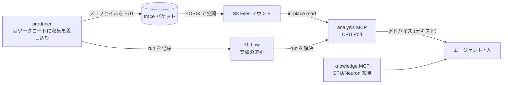

## はじめに

プロファイリングでいちばん時間を溶かすのは、少なくとも筆者の環境では、プロファイルを取ることそのものではありません。取ったあとに数 GB の `.nsys-rep` や `.neff` をどこかにコピーして、手元で開いて、前回の結果と見比べて、次に何を変えるかを決めるまでの往復です。GPU と Neuron の両方を触っていると、ツールもファイル形式も指標もばらばらで、この往復はさらに増えます。

そこで、プロファイルの収集から分析、次の実験までのループを Model Context Protocol (MCP) の上に載せてみました。エージェント (あるいは自分) が MCP のツールを呼ぶと、実験を特定し、そのプロファイルをその場で分析し、改善の手がかりをテキストで返す、という形です。本記事では手順ではなく、設計の全体像とその理由を解説します。実際に手を動かすワークショップは別の本にまとめました。

この設計には、副次的に確かめたかったことが 2 つ含まれています。1 つは Amazon SageMaker のマネージドな MLflow (実験の記録・比較を担うマネージドサービス) の使い勝手、もう 1 つは Amazon S3 Files (S3 バケットを POSIX ファイルシステムとして見せるサービス) で数 GB のプロファイルを Pod からダウンロードなしに読めるかです。以前、後者だけを単体で検証した記事を書いていましたが、本記事にその要点を統合し、単体記事は取り下げます。

## 全体設計

登場人物は 3 種類です。プロファイルを生む producer、それを溜める場所 (オブジェクトストレージと索引)、そして溜まったものを読んで分析する MCP サーバです。分析は GPU も Neuron も要らない CPU の Pod で動き、数 GB のプロファイルの生データはクライアントに転送せず、マウント越しにその場で読んで分析結果のテキストだけを返します。



この基盤で唯一固定しているのは、実験をどう指し、どこに置くか、つまり実験の「住所」だけです。run は少数の予約タグ (実験名の `alias`、`chip`、`region`、`workload_id` と、ストアが自動で付ける `artifacts_uri`、`schema_version`) で指され、`s3://<bucket>/<alias>/<run_id>/` という決まった prefix に置かれます。それ以外の中身 (メトリクス・パラメータ・成果物ファイル) には一切の制約を置きません。この「ID は固定、中身は自由」の一点だけを守るので、別々のツールで測った GPU の run と Neuron の run を、事前に「比較可能とは何か」を決めることなく同じ索引に並べられます。

## 2 つの pip ライブラリ

分析側の実体は 2 つの Python パッケージに切り出し、PyPI に公開しました。どちらも単体で `pip install` でき、アクセラレータもクラウドも Kubernetes も前提としません。

| パッケージ | 役割 | 中身 |
| --- | --- | --- |
| `accelprof` | 実験ストア + 分析 MCP | producer が `log()` で run を記録し、consumer が `resolve()` / `locate()` で見つける小さなライブラリ。`[mcp]` extra で分析 MCP サーバ (`accelprof-analysis-mcp`) が付く |
| `accelprof-knowledge` | 知識 MCP | GPU / Neuron / 共通のチューニング playbook を「症状 → 原因 → 確認点 → 次の一手」の形で配信する MCP |

`accelprof` の分析 MCP は 3 つのツールだけを持ちます。run を解決してマウント上の成果物を読める状態にする `stage_run` (仕組みは後述の S3 Files の節で触れます)、パターンでファイルパスを返す `resolve_artifacts`、そしてアナライザを走らせてアドバイスを返す `analyze` です。run の検索そのものは持ちません。検索は公式の MLflow MCP (`pip install "mlflow[mcp]"` で入る `mlflow mcp run`) に任せ、車輪の再発明を避けています。

`accelprof-knowledge` は埋め込み検索ではなく、透過的なキーワードランクです。playbook は手で書いた小さなコーパスなので、埋め込みインデックスを構築して調整するより、何が効いたかが見えるキーワード検索のほうが扱いやすいという判断です。

なぜ CLI やライブラリでなく MCP にしたのかも触れておきます。分析 MCP は S3 Files マウントにクラスタ内からアクセスする必要があり、クラスタ外の CLI では同じマウントに素直に触れないため、エージェントからは HTTP のツール呼び出しが扱いやすいという location 上の必然性があります。知識 MCP は単体なら CLI でも成り立ちますが、分析 MCP と同じホスティング機構 (後述の `mcp-host` チャート) に相乗りさせ、エージェント側の接続経路を 1 本に揃える狙いで MCP にしています。

## 責務をどう分けたか

設計でいちばん気を使ったのは、どこに何を置くかです。パッケージは分析の中身だけを持ち、デプロイの都合を一切知りません。逆にデプロイ側は、公開パッケージをどう固定して載せるかだけに責任を持ちます。

| 層 | 所有するもの | 置き場所 |
| --- | --- | --- |
| MCP 本体 | ライブラリ・分析 MCP・知識 MCP・参照用 Dockerfile | `accelprof` / `accelprof-knowledge` (PyPI) |
| デプロイ用イメージ | 公開パッケージをバージョン固定で入れる薄いイメージ・分析ツールの積層 | 基盤リポジトリの `infra/eks/images` |
| ホスティング | values 駆動の Helm チャート・PV・セキュリティ既定 | 基盤リポジトリの `mcp-host` チャート |
| 基盤 | バケット・S3 Files・IAM・マネージド MLflow・マウント | 基盤リポジトリの `infra/data-layer` と `infra/eks` |

この分け方の効き目は「MCP を足す = values にエントリを 1 つ増やすだけ」という形に表れます。チャートには accelprof 固有の知識が漏れておらず、MLflow の MCP でも自作の MCP でも同じ仕組みでホストできます。

## マネージド MLflow がもたらす利便性

run の索引には SageMaker のマネージドな MLflow を使いました。tracking サーバの ARN を渡すだけで、producer 側も分析側も追加のインフラなしに実験を記録・解決できます。自前で MLflow サーバを立てて永続化やバックアップを面倒みる必要がなく、認証は SigV4 に寄せられます。`accelprof` の `[sagemaker]` extra を入れると、`MLFLOW_TRACKING_URI` に ARN を渡すだけでこの経路に乗ります。

1 点だけ運用上の注意があります。アカウントによっては、組織ポリシーで MLflow のデータプレーンを管理者権限のプリンシパルに限定していることがあります。その場合、IAM を正しく与えていても、Pod Identity で紐付けた読み取り専用ロールからの呼び出しが拒否されます。分析 MCP の tracking URI はマネージド MLflow の ARN でも通常の MLflow の URI でも受けるので、この制約下では自前管理の MLflow の URI を指す逃げ道が残ります。ただしその MLflow の構築自体は本記事の範囲外です。

## S3 Files でプロファイルをその場で読む

trace バケットは [S3 Files](https://docs.aws.amazon.com/efs/latest/ug/s3-file-systems.html) でファイルシステムとして公開し、分析 Pod から読み取り専用でマウントしました。S3 Files は Amazon EFS をベースに S3 バケットを POSIX 互換のファイルシステムとして見せるサービスで、EKS からは Amazon EFS CSI driver (公式ドキュメント上 S3 Files 対応は v3.0.0 以降) でマウントします。ドキュメントによると、よく使うファイルは高性能層にキャッシュされ、大きな read は S3 から直接ストリーミングされます。この記事の検証では、この構成で数 GB 級のファイルをダウンロードなしに読み切れることまでを確認しています。なお、ローカルへダウンロードして開く場合とのレイテンシ比較は未計測です。往復が短くなる主因は転送速度ではなく、分析結果がテキストで返り、大きなファイルをコピーして持ち回る作業自体が要らなくなる点にあります。

ここでいちばんはまるのが PersistentVolume の `volumeHandle` の書式です。裸のファイルシステム ID を渡すと、driver はそれを EFS だと解釈して DNS 解決と `DescribeMountTargets` に進み、実体は S3 Files なので見つからず、NFS マウントがタイムアウトします。

```yaml
csi:
  driver: efs.csi.aws.com
  # 誤: 裸の ID -> EFS フローで解決されマウントがタイムアウトする
  # volumeHandle: "<FILE_SYSTEM_ID>"
  # 正: 先頭の s3files: が S3 Files フローへのスイッチ、中央の :: は subpath 省略
  volumeHandle: "s3files:<FILE_SYSTEM_ID>::<ACCESS_POINT_ID>"
```

access point (バケットへのアクセスの入口となる論理的なマウント点) は必須で、事前に `aws s3files create-access-point` で作ります。

権限の与え方にも 1 つ勘所があります。マウントを担うのは node 側のプラグインなので、S3 Files のクライアント権限は `efs-csi-node-sa` (EFS CSI driver の node 側 ServiceAccount) に Pod Identity (Pod にロールの資格情報を注入する EKS の仕組み) で与えます。ここを怠ると node のインスタンスロールにフォールバックし、Karpenter とマネージドノードグループでロールが異なるクラスタでは、載る node によって `mount.nfs4: access denied by server` になります。今回の検証では、この Pod Identity 経由の権限付与でマウントが通ることを実機で確認しています。

権限は意図的に読み取り専用に寄せました。CSI の node ロールに `s3files:ClientMount` は与えるが `ClientWrite` は与えないので、クラスタ上のどの Pod も書き込み可能なマウントを得られません。オブジェクトの削除 (`s3:DeleteObject`) を持つのは削除専用の janitor ロール (古い run を掃除する GC 用のロール) だけで、producer は run ごとに一意な `<run_id>` 入りの prefix に書くので上書きの衝突も起きません。この 2 つでデータを壊す経路を権限の側から塞いでいます。

もう 1 つの実運用の勘所として、S3 Files はアクセス時にメタデータを import するため、深いパスにいきなり `test -f` すると初回はネガティブキャッシュで見えないことがあります。分析 MCP の `stage_run` は対象ディレクトリを一度 walk してから読むので、この問題を踏みません。

## 使い方の全体像

細かい手順は本に譲り、ここでは「何ができるか」をコマンドの粒度で示します。producer 側は `accelprof` を `pip install` し、実ワークロードに数行を差し込むだけです。配布名は `accelprof` ですが、import するモジュール名は `experiment_store` です。

```python
from experiment_store import ExperimentStore
store = ExperimentStore.build(region=REGION, trace_bucket=TRACE_BUCKET, tracking_uri=MLFLOW_URI)
store.log("llama3-8b-parity", chip="gpu", region=REGION, workload_id="prefill-bs1",
          metrics={"cosine": 0.9997}, artifacts=["/tmp/run.nsys-rep"])
```

`log()` に渡す `alias` (ここでは `"llama3-8b-parity"`)・`chip`・`region`・`workload_id` が、先ほどの予約タグの前半 4 つにそのまま対応します。

分析側は MCP クライアント (Claude Code など) から接続します。

```bash
claude mcp add --transport http analysis http://127.0.0.1:8080/mcp
claude mcp add --transport http knowledge http://127.0.0.1:8081/mcp
```

あとは 3 つのツールを呼ぶだけです。`stage_run(run_id)` で run の成果物をマウント上で読める状態にし、`resolve_artifacts(run_id, pattern="*.nsys-rep")` でファイルパスを得て、`analyze(run_id, "nsys-stats")` で分析を走らせます。run の ID は MLflow の MCP で探します。

## 返ってきた結果をどう profiling に使うか

ここが設計の狙いどころです。使うツールは 2 つあり、それぞれ役割が違います。実際に `nsys profile` で取った `.nsys-rep` を S3 Files マウント越しに読み、組み込みの `nsys-stats` アナライザを走らせると、次のような実測サマリが返ります (これは検証で取った小さなトレースの OS ランタイム部分の抜粋で、アカウント固有値は伏せています)。

```text
 ** OS Runtime Summary (osrt_sum):
 Time (%)  Total Time (ns)  Num Calls  Avg (ns)  ...  Name
 --------  ---------------  ---------  --------  ...  ------------------
     57.4           355561         42    8465.7  ...  stat64
     10.7            66032          3   22010.7  ...  open64
      9.9            61382          5   12276.4  ...  fopen64
```

上の例は OS ランタイムの内訳という事実を示します (このトレースは小さいので上位はファイル I/O ですが、GPU の計算やメモリ帯域のボトルネックを見るときは、同じ `nsys-stats` の GPU カーネル集計やメモリ集計を使います)。ここから次の一手を出すのが、もう 1 つの知識 MCP の役割です。両者は別のツールなので、実運用では突き合わせて使います。別のケースの例として、GPU プロファイルで「メモリバウンドだが occupancy は高い」という症状が見えたとき、それを `search_knowledge` に投げると、関連する playbook がランク付きで返ります。

```jsonc
// search_knowledge("memory bound but occupancy is high", chip="gpu")
{ "count": 2, "results": [
  { "id": "gpu/roofline", "score": 12.0, "title": "Roofline diagnosis …" },
  { "id": "gpu/memory-and-fusion", "score": 7.0, "title": "…" } ]}
```

「テンソルコアが遊んでいて occupancy が低い」で引けば `gpu/tensor-cores-and-occupancy` が最上位に来ます。分析 MCP が返した事実と、知識 MCP が返した「次の一手」を突き合わせて次の実験のパラメータを決めます。この一往復を短くするのが、この基盤の目的です。返ってくるのは常にテキストなので、そのままエージェントの推論に載せられます。

## まとめ

やったことは、プロファイルの収集・分析・次の実験のループを MCP の上に載せ、GPU と Neuron を同じ土俵で扱えるようにしたことです。設計の芯は「ID は固定、中身は自由」という一点で、その上に 2 つの独立した pip パッケージ (実験ストア + 分析 MCP と、知識 MCP) を置き、デプロイの都合はチャートと Terraform に押し出しました。マネージド MLflow で索引を持つ手間を消し、S3 Files で数 GB のプロファイルをダウンロードなしに読み、分析 MCP はバイトでなくアドバイスを返します。この 3 つが揃うと、プロファイルを見てから次の一手を決めるまでの往復がぐっと短くなります。手を動かして確かめたい方は、ワークショップの本を参照してください。
