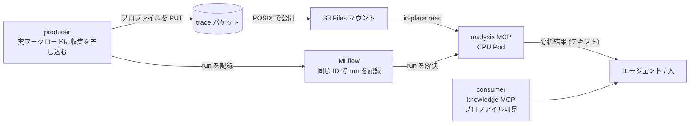

## はじめに

LLM 推論周りのプロファイリングをしたいのでそのための環境を作りました。プロファイルを取った後に数 GB の `.nsys-rep` などの解析バイナリをローカルにコピーして、手元で開いて、前回の結果と見比べて、次に何を変えるかを決める、などの一連の作業をしているといつ何をしたかぐちゃぐちゃになり散らかします（散らかしてます）。プロファイルが実験管理と紐づいていないと、それがどの条件で取ったものか、自分が何を試していたのかすら後から分からなくなります。AI 様のバフを得てプロファイリングする場合はさらに AI 様が勝手に謎ファイルを知らぬ間に量産して散らかされているのかももはやわかりません。

そこで、プロファイルの収集から分析、次の実験の一連のループを綺麗に回せるように、EKS 基盤を整えていきます。今回はとりあえず土台を作ってプロファイルを回して見るところまでやってみます。そして、基本的には AI アシストでプロファイルするのがもはや常識なので NVIDIA の Nsight AI など CUDA 開発向けのインテリジェントなアシスタントツールを MCP などでうまく AI 様が使えるようにしておきたいです。エージェント (あるいは自分) が MCP のツールを呼ぶと、実験を特定し、そのプロファイルをその場で分析し、改善の手がかりをテキストで返す、という形を模索します。本記事は手順ではなく、設計の全体像とその理由を解説します。実際に手を動かすワークショップは [Amazon EKS Distributed AI ワークショップの Advanced02](https://zenn.dev/littlemex/books/eks-distributed-ai/viewer/eks-profiling-mcp) にまとめました。

## 全体設計

登場人物は 3 種類です。プロファイルを生む producer、それを溜める store (オブジェクトストレージと run の記録)、そして溜まったものを読んで分析する consumer 側の MCP サーバです。分析は GPU が要らない CPU の Pod で動きます。プロファイルはクライアント側へコピーして持ち回るのではなく、マウント越しにファイルシステムとしてその場で読み、分析結果のテキストだけを返します。



この基盤で唯一固定しているのは、実験をどう指し、どこに置くか、つまり実験の「住所」だけです。run は少数の予約タグ (実験名を表す `exp.alias`、`workload_id`、`schema_version` など) で指され、成果物は `s3://<bucket>/<alias>/<run_id>/` という決まった prefix に置かれます。プロファイルを MLflow のアーティファクトとして上げるのではなく、この prefix に置いて `artifacts_uri` で指すのがポイントで、これによって分析側は MLflow から場所だけを受け取り、実体はマウント越しに読めます。それ以外の中身は分析基盤の側で固定しません。つまり、あらかじめ細かい分析の作り込みまでしておく必要はなく、実験単位でプロファイルを紐づけておくだけ、という設計です。

## 2 つの pip ライブラリ

分析側の実体は 2 つの Python パッケージに切り出し、PyPI に公開しました。どちらも単体で `pip install` でき、アクセラレータもクラウドも Kubernetes も前提としません。

| パッケージ | 役割 | 中身 |
| --- | --- | --- |
| `accelprof` | 実験ストア管理 + 分析 MCP | producer が `log()` で run を記録し、consumer が `resolve()` / `locate()` で見つける小さなライブラリ。`[mcp]` extra で分析 MCP サーバ (`accelprof-analysis-mcp`) が付く |
| `accelprof-knowledge` | 知識 MCP | Nsight AI などの知識をもとにチューニング playbook を「症状 → 原因 → 確認点 → 次の一手」の形で配信する MCP |

なお、どちらもまだ作ったばかりで、粗い部分や改善したい点が多く残っています。今後、実際に使いながらブラッシュアップしていく前提のものです。

`accelprof` の分析 MCP は 3 つのツールだけを持ちます。いずれも run を起点にします。ここでいう run とは、1 回のプロファイル取得に対応する MLflow 上の 1 レコードで、メトリクスと、成果物ファイル (`.nsys-rep` など) の置き場所を指すタグを持ったものです。`analyze` は「その run の成果物を読んで、指定したアナライザ (`nsys-stats` など) をかけ、結果をテキストで返す」ツールです。その前段として、`stage_run` が run を解決して成果物をマウント上で読める状態にし (仕組みは後述の S3 Files の節で触れます)、`resolve_artifacts` がその run の成果物パスをパターンで返します。つまり「run を指定する → 成果物をマウント上に用意する → アナライザをかけて集計が返る」という流れです。run の検索そのものは持ちません。検索は公式の MLflow MCP (`pip install "mlflow[mcp]"` で入る `mlflow mcp run`) に任せ、車輪の再発明を避けています。

`accelprof-knowledge` は埋め込み検索ではなく、透過的なキーワードランクです。playbook は手で書いた小さなコーパスなので、埋め込みインデックスを構築して調整するより、何が効いたかが見えるキーワード検索のほうが扱いやすいという判断です。

## 素の MLflow との違い

ここで「MLflow だけでは何が足りないのか」を明確にしておきます。MLflow SDK 自体も、記録する側 (`log_*`) と読み出す側 (`search_runs`) の両方を持っています。なので「記録と読み出しの両方があること」は accelprof の差ではありません。accelprof は MLflow を置き換えるものではなく、MLflow を run の記録と検索の基盤としてそのまま使ったうえで、プロファイリングに特化した薄い層を producer と consumer の両側に足したものです。差は次の 2 点に集約されます。

| 側 | 素の MLflow | accelprof が足すもの |
| --- | --- | --- |
| producer | run・メトリクス・任意の成果物 (`log_artifact`) を記録する。その成果物は中身を問わない不透明なファイルとして扱う | `experiment_store` が、成果物を S3 の決まった prefix に置き、予約タグを付け、あとで分析側が場所を解決できる形に整える。プロファイル収集の規約を与える |
| consumer | run を検索し、成果物をダウンロードできる。ただし `.nsys-rep` や `.neff` の中身を解析する概念はない | 分析 MCP が run を実プロファイルファイルに解決し (`stage_run` / `resolve_artifacts`)、`analyze` でチップ別のアナライザをかけてテキストで返す。 |

producer 側は「MLflow と S3 の上に敷いた書き方の規約」であり、consumer 側の解析こそが MLflow に無い部分です。run の検索そのものは自作せず公式の MLflow MCP に任せているので、実際の分析ループは「MLflow MCP で run を探す、accelprof の分析 MCP でその run を解決して分析する」という相補の形になります。まあ onAWS 固定でのプロファイリングに特化した薄い層を噛ませているだけです。

## 実装箇所

| 層 | 所有するもの | 置き場所 |
| --- | --- | --- |
| MCP 本体 | ライブラリ・分析 MCP・知識 MCP・参照用 Dockerfile | PyPI |
| デプロイ用イメージ | 公開パッケージをバージョン固定で入れる薄いイメージ・分析ツールの積層 | [`infra/eks/images`](https://github.com/littlemex/distributed-ai) |
| ホスティング | values 駆動の Helm チャート・PV・セキュリティ既定 | [`mcp-host` チャート](https://github.com/littlemex/distributed-ai) |
| 基盤 | バケット・S3 Files・IAM・マネージド MLflow・マウント | []`infra/data-layer` と `infra/eks`](https://github.com/littlemex/distributed-ai) |

## マネージド MLflow

run の記録には Amazon SageMaker のマネージド MLflow を使いました。tracking サーバの ARN を渡すだけで、producer 側も分析側も追加のインフラなしに実験を記録・解決できます。MLflow サーバの永続化やバックアップを自分で面倒みる必要がなく、認証は SigV4 に寄せられます。`accelprof` の `[sagemaker]` extra を入れると、`MLFLOW_TRACKING_URI` に ARN を渡すだけでこの経路に乗ります。

マネージド MLflow はインスタンスサイズを指定しない MLflow App という Serverless もあるのですが今回はすでにこれまでに構築して使っていた MLflow Tracking Server という仕組みの方を使いました。今後 App の方に対応予定ですが検証 HP が枯渇気味なので後回しです。

## S3 Files

trace バケットは [S3 Files](https://docs.aws.amazon.com/efs/latest/ug/s3-file-systems.html) でファイルシステムとして公開し、分析 Pod から読み取り専用でマウントしました。S3 Files は Amazon EFS をベースに S3 バケットを POSIX 互換のファイルシステムとして見せるサービスで、EKS からは Amazon EFS CSI driver (公式ドキュメント上 S3 Files 対応は v3.0.0 以降) でマウントします。ドキュメントによると、よく使うファイルは高性能層にキャッシュされ、大きな read は S3 から直接ストリーミングされます。

注意すべきなのが PersistentVolume の `volumeHandle` の書式です。裸のファイルシステム ID を渡すと、driver はそれを EFS だと解釈して DNS 解決と `DescribeMountTargets` に進み、実体は S3 Files なので見つからず、NFS マウントがタイムアウトします。

```yaml
csi:
  driver: efs.csi.aws.com
  # 誤: 裸の ID -> EFS フローで解決されマウントがタイムアウトする
  # volumeHandle: "<FILE_SYSTEM_ID>"
  # 正: 先頭の s3files: が S3 Files フローへのスイッチ、中央の :: は subpath 省略
  volumeHandle: "s3files:<FILE_SYSTEM_ID>::<ACCESS_POINT_ID>"
```

`volumeHandle` に含める access point (バケットへのアクセスの入口となる論理的なマウント点) は必須です。ただしこれは EFS CSI driver が動的に作るものではなく、ファイルシステムとあわせて事前に用意しておくものです。本基盤では Terraform で、S3 Files のファイルシステムとアクセスポイントの両方を AWS Cloud Control API 経由で宣言的に作成しています。CSI driver は、用意済みのファイルシステムとアクセスポイントを `volumeHandle` 経由でマウントするだけです。

権限の与え方にも 1 つ注意点があります。マウントを担うのは node 側のプラグインなので、S3 Files のクライアント権限は `efs-csi-node-sa` (EFS CSI driver の node 側 ServiceAccount) に Pod Identity (Pod にロールの資格情報を注入する EKS の仕組み) で与えます。

もう 1 つの操作していて気づいた点として、S3 Files はアクセス時にメタデータを import するため、深いパスにいきなり `test -f` すると初回はネガティブキャッシュで見えないことがあります。分析 MCP の `stage_run` は対象ディレクトリを一度 walk してから読むので、この問題を避けやすくしました。ただし walk が常に問題を防ぐとは限らず、ファイル数の多い大きなディレクトリでは walk 自体の時間がむしろリスクになる場合もあります。

## 使い方の全体像

細かい手順はワークショップに譲り、ここでは今回作った仕組みで「何ができるか」をコマンドの粒度で示します。

以下はプロファイリングのコマンドです。このコマンドを実行すると、kubectl プラグインが 3 コンテナの Job を組み立て、profiler と shim を共有ボリュームに配り、記録は基盤側のコンテナが行います。ジョブ実行のワークロード側が守るのは `/accelprof/out` にファイルを置くという規約だけで、ライブラリの import も Python の同居も要りません。

```bash
kubectl accelprof run --alias llama3-8b-parity --namespace team-a \
  --image <自分の学習イメージ> --gpu 1 --param seq_len=4096 -- python3 train.py
kubectl accelprof runs --alias llama3-8b-parity -n team-a   # workload_id と run_id の一覧
```

メトリクスを残したいときは、学習スクリプトの最後に `/accelprof/out/metrics.json` を書きます。この形にしたのは、書き捨ての実験スクリプトに基盤の作法を持ち込みたくなかったからです。必要なのはこのディレクトリへの書き込みだけで、基盤ライブラリの import もバージョンの整合も要りません。

一方でライブラリを直接使う道も残してあります。EKS の外や、自分でジョブ投入の仕組みを持っている場合はこちらです。配布名は `accelprof` ですが、import するモジュール名は `experiment_store` です。

```python
from experiment_store import ExperimentStore
store = ExperimentStore.build(region=REGION, trace_bucket=TRACE_BUCKET, tracking_uri=MLFLOW_URI)
store.log("llama3-8b-parity", chip="gpu", region=REGION, workload_id="prefill-bs1",
          metrics={"cosine": 0.9997}, artifacts=["/tmp/run.nsys-rep"])
```

この `store.log()` の一行が、producer 側での素の MLflow SDK との違いです。素の MLflow SDK なら run を作ってメトリクスを記録するところまでは同じですが、成果物ファイルを trace バケットの決まった prefix に上げ、前述の予約タグを付け、あとで分析 MCP が場所を解決できる形に整えるところまでを 1 回の呼び出しにまとめています。EKS 上の Job 経路では、この呼び出しをワークロードではなく基盤側の recorder コンテナが行います。

分析側は MCP クライアント (Claude Code など) から接続します。今のところローカルマシンで使う場合はポートフォワード前提です。

```bash
claude mcp add --transport http analysis  http://127.0.0.1:8080/mcp
claude mcp add --transport http knowledge http://127.0.0.1:8081/mcp
```

あとは run の ID を指定してツールを呼ぶだけです。run の ID は、直前に投入した実行なら `kubectl accelprof get <workload_id>` で引けます。過去の実行を条件で探すときは MLflow 側の検索を使います。

```text
stage_run(run_id="<RUN_ID>")                                 # 成果物をマウント上に用意
resolve_artifacts(run_id="<RUN_ID>", pattern="*.nsys-rep")   # ファイルパスを得る
analyze(run_id="<RUN_ID>", analyzer="nsys-stats")            # 分析を走らせる
```

## 返ってきた結果をどう profiling に使うか

使うツールは 2 つあり、それぞれ役割が違います。GPU ノードで `nsys` を含まない素の PyTorch イメージに profiler を注入してとった `.nsys-rep` を、S3 Files マウント越しに読んで `nsys-stats` アナライザを走らせると、次のような実測サマリが返ります。

```text
 ** CUDA GPU Kernel Summary (cuda_gpu_kern_sum):
 Time (%)  Total Time (ns)  Instances  Avg (ns)   ...  Name
 --------  ---------------  ---------  ---------  ...  -------------------------------------------
    100.0        704721548        320  2202254.8  ...  ampere_bf16_s16816gemm_bf16_256x128_ldg8_f2f
```

この出力は、どこに時間が溶けているかという事実を示します。ここでは bf16 の GEMM が 1 回 2.2 ミリ秒で 320 回、これが全体を占めています。あわせて返る NVTX の区間集計、CUDA API 集計、OS ランタイム集計を並べて読むと、GPU の計算で詰まっているのか投入待ちなのかが分かります。

事実が出たら、次の一手を出すのがもう 1 つの 知識 MCP の役割です。両者は別のツールなので、実運用では突き合わせて使います。たとえば GPU プロファイルで「メモリバウンドだが occupancy は高い」という症状が見えたとき、それを `search_knowledge` に投げると、関連する playbook がランク付きで返ります。こうした踏み込んだ分析ノウハウ自体は、NVIDIA の [nsight-ai](https://developer.nvidia.com/nsight-ai) と AWS の [neuron-agentic-development](https://github.com/aws-neuron/neuron-agentic-development) といった、エージェント向けにチューニング知見を配るスキル群を土台にしています。

```jsonc
// search_knowledge("memory bound but occupancy is high", chip="gpu")
{ "count": 2, "results": [
  { "id": "gpu/roofline", "score": 12.0, "title": "Roofline diagnosis" },
  { "id": "gpu/memory-and-fusion", "score": 7.0, "title": "Memory bound kernels and fusion" } ]}
```

「テンソルコアが遊んでいて occupancy が低い」で引けば `gpu/tensor-cores-and-occupancy` が最上位に来ます。分析 MCP が返した事実と、知識 MCP が返した「次の一手」を突き合わせて次の実験のパラメータを決めます。この一往復を短くするのが、この基盤の目的です。返ってくるのは常にテキストなので、そのままエージェントの推論に載せられます。

## まとめ

今回はぐちゃぐちゃになり散らかしていたローカルのディレクトリを見て発狂したことをきっかけにプロファイルの仕組みを作ってみました。まだ作ったばかりで穴だらけですが今後使いながら改良していきます。S3 Files とマネージド MLflow は採用の必然性は別にありませんがまあ使ってみたという感じです、好きなものを使えば良いと思います。