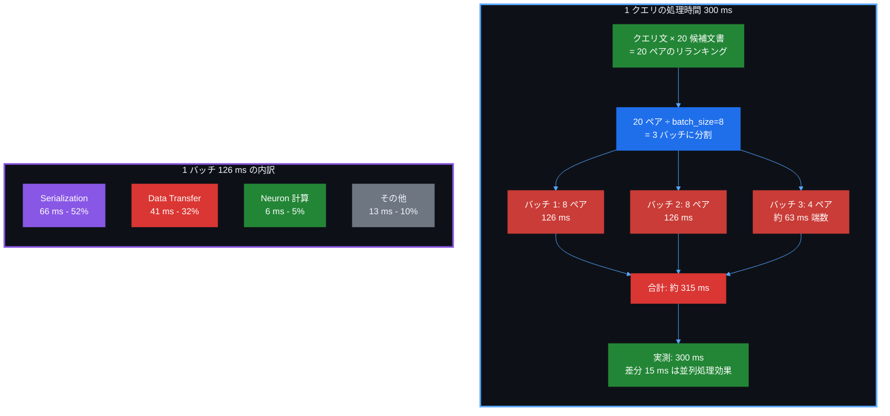

## はじめに

[前回の記事](https://zenn.dev/tosshi/articles/d68bd091d1934d) ではツールを作るのに夢中になってしまいプロファイリングまで実施できなかったため、今回の記事では前回の結果をもとに AWS Neuron Profiler を用いてプロファイリングを実施してみることで、何がボトルネックになっているのかの特定を試みます。前回のスループット・レイテンシーともにベストケースだった設定を出発点として、以下のプロセスで性能を確認していきます。

まず AWS Neuron Profiler によるベースラインのプロファイリングで現状を把握してみます。

:::message alert
通常、単にモデルをデプロイするだけでは真の性能は引き出せません。適切なパラメータチューニングと、ボトルネックの特定・解消が不可欠です。GPU や AWS Trainium などではハードウェア、ミドルウェア、ネットワークなどでの構成が異なります。そして、データやアクセスパターン、設定の影響もあります。性能の良さを図る指標は一つではなく、コストや精度、レイテンシーにしても平均値なのか P99 での良さなのか、様々な視点からユースケースにとっての性能の良さを定義すべきでしょう。
:::

## Phase 1: ベースラインのプロファイリング

### 1.1 なぜプロファイリングから始めるのか

性能最適化を行う際、まず現状を把握することが重要です。ベンチマーク測定では性能の結果は分かりますが、性能の理由、ボトルネックの場所、そして改善の余地は分かりません。そこで最初にプロファイリングを実施することで、NeuronCore の使用率（どれだけ演算しているか）、メモリ帯域の使用状況（データ転送のボトルネックは？）、演算効率（演算ユニットが遊んでいないか？）といった詳細な情報を得て、データに基づいた最適化戦略を立てることができます。

AWS のブログ記事[「Unlocking Machine Learning Model Performance」](https://builder.aws.com/content/2x3ldAuia9gjjUixpOt162ttkK2/unlocking-machine-learning-model-performance-from-bottlenecks-to-breakthroughs) は AWS Neuron Profiler の理解にとても有用です。この記事では AWS Neuron Profiler 2.0 の活用方法と、ボトルネックから性能向上までの道筋が詳しく解説されています。

:::message
性能最適化において重要なのは、明確な目標と制約条件を定義することです。「レイテンシーを改善したい」という漠然とした目標だけでは、最適化の問題空間が定義できません。スループット、レイテンシー（P50/P95/P99）、コスト、精度など、複数の指標のトレードオフを考慮し、ユースケースに応じた性能の良さを明確にすることが、効果的な最適化への第一歩です。今回は簡単のために 平均レイテンシー最適化、としておきます。**今回のプロファイリングの進め方は結果的に間違っていたと思われるのでその過程も含めて読んでもらえればと思います。**
:::

### 1.2 現状最適設定でのプロファイリング結果の確認

Perfetto トレースファイルは SQLite データベースとして扱えます。Perfetto の[公式ドキュメント](https://perfetto.dev/docs/analysis/trace-processor-python) によると、TraceProcessor を使って SQL クエリで分析できます。

```python
from perfetto.trace_processor import TraceProcessor
tp = TraceProcessor(trace='profile_output/trace.perfetto-trace')

qr_it = tp.query('SELECT ts, dur, name, track_id FROM slice LIMIT 10')
qr_df = qr_it.as_pandas_dataframe()
print(qr_df.to_string())
```

以下のような結果が得られます。Perfetto トレースには slice テーブルがあり、各操作（関数呼び出し、カーネル実行など）が記録されています。

```
    ts   dur             name track_id
0    5    21              NOP        0
1    7     7            DRAIN        1
2   53     8            DRAIN        2
3   56    23            DRAIN        3
4   57    59            WRITE        4
5   64  5494  EVENT_SEMAPHORE        1
6   84   120              NOP        0
7  125  5491  EVENT_SEMAPHORE        2
8  141  5447  EVENT_SEMAPHORE        3
9  401   194            WRITE        0
```

主要なカラムとして、ts（タイムスタンプ、ナノ秒単位）、dur（継続時間、ナノ秒単位）、name（操作名、例えば MATMUL や DMA_DIRECT2D）、track_id（トラック ID、どのスレッド/プロセスか）が記録されています。

他にもクエリをいくつか実行して情報を確認してみます。まずトレース全体の時間を確認するため、最後のイベントのタイムスタンプを取得します。

::::details トレース時間

```python
from perfetto.trace_processor import TraceProcessor
tp = TraceProcessor(trace='profile_output/trace.perfetto-trace')

sql = """
SELECT
    MAX(ts) / 1e9 AS duration_seconds,
    COUNT(*) AS total_slices
FROM slice
"""

qr_it = tp.query(sql)
qr_df = qr_it.as_pandas_dataframe()
print(qr_df.to_string())
```

この結果から、トレース時間が 0.016 秒（約 16 ミリ秒）であり、総スライス数が 350,522 であることが分かります。

```
  duration_seconds total_slices
0         0.015755       350522
```

::::

::::details Operation ごとの集計

どの Operation が何回実行されたか確認してみます。以降、SQL の部分だけ示します。

```sql
SELECT
    name,                              -- 操作名
    COUNT(*) as count,                 -- 実行回数
    SUM(dur) / 1e9 as total_seconds,   -- 合計時間（秒）
    AVG(dur) / 1e9 as avg_seconds,     -- 平均時間（秒）
    MAX(dur) / 1e9 as max_seconds      -- 最大時間（秒）
FROM slice
WHERE dur > 0                          -- 時間が0より大きいもの
GROUP BY name                          -- 操作名でグループ化
ORDER BY total_seconds DESC            -- 合計時間の降順
LIMIT 10
```

```
                    name   count total_seconds avg_seconds max_seconds
0                unknown  156427      0.038387         0.0    0.000003
1                 MATMUL   21582      0.010941    0.000001    0.000002
2  custom_call.17_sg0002      36      0.007028    0.000195    0.007017
3              LDWEIGHTS   21212      0.004914         0.0    0.000001
4        EVENT_SEMAPHORE    2184      0.003879    0.000002    0.000057
5            FIND_INDEX8     224      0.002261     0.00001    0.000014
6                   MAX8     224      0.002261     0.00001    0.000014
7         MATCH_REPLACE8     217      0.002187     0.00001    0.000014
8                           1276       0.00173    0.000001    0.000026
9               ACTIVATE    4702      0.001648         0.0    0.000001
```

この結果から興味深い情報が見て取れます。まず unknown という操作が 38 ミリ秒かかっており、156,427 回と最も頻繁に呼ばれています。これが何の操作か不明なのは気になるところです。次に MATMUL（行列乗算）が 11 ミリ秒、21,582 回実行されており、これが実際の計算のメイン部分と考えられます。平均 0.5 マイクロ秒、最大 2 マイクロ秒という速度で動作しています。

特に注目すべきは custom_call.17_sg0002 という操作です。たった 36 回の実行で 7 ミリ秒も消費しており、平均 195 マイクロ秒、最大 7,017 マイクロ秒（約 7 ミリ秒）となっています。最大が平均の約 36 倍となっています。

また LDWEIGHTS（重みのロード操作）が 5 ミリ秒かかっており、21,212 回と MATMUL とほぼ同じ回数実行されています。これは毎回重みをロードしている可能性を示唆しており、重みキャッシングによる最適化の余地があるかもしれません。

EVENT_SEMAPHORE はコア間の同期に 4 ミリ秒かかっており、2,184 回実行されています。最大 57 マイクロ秒という値から、時々待たされている状況が見えます。

::::

### 1.3 custom_call の詳細分析

custom_call.17_sg0002 という操作がたった 36 回の実行で 7 ミリ秒も消費していることが気になります。これが何をしているのか、より詳しく調べてみましょう。

```sql
SELECT
    name,                          -- 操作名
    ts / 1e6 as start_ms,          -- 開始時刻（ミリ秒）
    dur / 1e6 as dur_ms,           -- 継続時間（ミリ秒）
    track_id                       -- トラックID
FROM slice
WHERE name LIKE 'custom_call%'    -- custom_call で始まる操作
ORDER BY ts                        -- 時系列順
LIMIT 20                           -- 最初の20件
```

::::details 結果
```
                 name  start_ms    dur_ms track_id
0   custom_call.15_sg0002  8.690942  0.000289       75
1   custom_call.15_sg0002  8.690942  0.071542      437
2   custom_call.17_sg0002  8.693388  0.000289       75
3   custom_call.17_sg0002  8.693388  7.016822      438
4   custom_call.15_sg0002  8.698995  0.000289       69
5   custom_call.17_sg0002  8.702275  0.000289       69
6   custom_call.15_sg0002  8.709122  0.000289       76
7   custom_call.15_sg0002  8.711823  0.000289       79
8   custom_call.17_sg0002  8.711922  0.000289       76
9   custom_call.17_sg0002  8.713703  0.000289       79
10  custom_call.15_sg0002   8.72291  0.001519       80
11  custom_call.15_sg0002  8.725887  0.003295       78
12  custom_call.17_sg0002  8.726715  0.000044       80
13  custom_call.15_sg0002  8.729073  0.000285       66
14  custom_call.17_sg0002  8.729077  0.004764      106
15  custom_call.15_sg0002  8.729329  0.004596        6
16  custom_call.17_sg0002  8.730493  0.000289       66
17  custom_call.17_sg0002  8.733815  0.002756        7
18  custom_call.15_sg0002  8.736056  0.000289       77
19  custom_call.17_sg0002  8.738496  0.000289       77
```
::::

重要な発見として、3 行目の custom_call.17_sg0002 が 7.017 ミリ秒かかっている（track_id: 438）ことが分かります。ほとんどの custom_call は 0.3 マイクロ秒程度なのに、この 1 回だけ異常に遅いです。これは初回実行のコンパイル/最適化コストの可能性があります。

次に、すべての custom_call の統計を確認します。

```sql
SELECT
    name,                              -- 操作名
    COUNT(*) as count,                 -- 実行回数
    MIN(dur) / 1e6 as min_ms,          -- 最小時間（ミリ秒）
    MAX(dur) / 1e6 as max_ms,          -- 最大時間（ミリ秒）
    AVG(dur) / 1e6 as avg_ms,          -- 平均時間（ミリ秒）
    SUM(dur) / 1e6 as total_ms         -- 合計時間（ミリ秒）
FROM slice
WHERE name LIKE 'custom_call%'         -- custom_call で始まる操作
GROUP BY name                          -- 操作名でグループ化
ORDER BY avg_ms DESC                   -- 平均時間の降順
```

::::details 結果
```
                   name count    min_ms    max_ms    avg_ms  total_ms
0  custom_call.17_sg0002    36  0.000007  7.016822  0.195235  7.028449
1  custom_call.15_sg0002    54  0.000007  0.071542  0.001588  0.085729
2  custom_call.16_sg0002    36  0.000007  0.001701  0.000067  0.002409
3  custom_call.14_sg0002    36  0.000007  0.000441  0.000031   0.00111
```
::::

この結果から、custom_call.17_sg0002 は平均 195 マイクロ秒ですが、最大は 7 ミリ秒（36 倍の差！）であることが確認できます。custom_call.15_sg0002 も最大 71.5 マイクロ秒でそこそこばらつきがありますが、他の custom_call は比較的安定しています。これらの custom_call は XLA カスタムコール命令として表現されるカスタムオペレーションです（[AWS Neuron Custom C++ Operators や NKI カーネルなど](https://awsdocs-neuron.readthedocs-hosted.com/en/latest/neuron-customops/index.html)）。トレースデータから、初回実行時に 7.017 ミリ秒が観測されており、その後の実行では約 0.3 マイクロ秒と大幅に高速化しています。これは初回実行時のコンパイルや最適化コストを示唆していそうです。vllm-neuron では [`skip_warmup`](https://awsdocs-neuron.readthedocs-hosted.com/en/latest/libraries/nxd-inference/vllm/quickstart-vllm-offline-serving.html) というパラメータでウォームアップパスの実行を制御でき、`skip_warmup=False` に設定すると事前にウォームアップを実行します。

### 1.4 MATMUL/LDWEIGHTS のパターン分析

次に、最も時間を消費している MATMUL と LDWEIGHTS の関係性を調べてみます。

```sql
SELECT
    name,                              -- 操作名
    COUNT(*) as count,                 -- 実行回数
    SUM(dur) / 1e6 as total_ms,        -- 合計時間（ミリ秒）
    AVG(dur) / 1e6 as avg_ms           -- 平均時間（ミリ秒）
FROM slice
WHERE name IN ('MATMUL', 'LDWEIGHTS', 'ACTIVATE', 'COPY')  -- 主要な演算操作
GROUP BY name                          -- 操作名でグループ化
ORDER BY total_ms DESC                 -- 合計時間の降順
```

::::details 結果
```
     name count   total_ms    avg_ms
   MATMUL 21582  10.940548  0.000507
LDWEIGHTS 21212   4.913657  0.000232
 ACTIVATE  4702   1.648057  0.000351
     COPY    83    0.02587  0.000312
```
::::

興味深い発見として、MATMUL が 21,582 回、LDWEIGHTS が 21,212 回とほぼ同じ回数実行されています。これは MATMUL のたびに重みをロードしている可能性を示唆しています。重みキャッシングが効いていれば LDWEIGHTS の回数はもっと少ないはずです。これは最適化の余地があるかもしれません。

MATMUL の時系列パターンも確認してみます。

```sql
SELECT
    ts / 1e9 as time_sec,              -- 時刻（秒）
    dur / 1e6 as dur_ms                -- 継続時間（ミリ秒）
FROM slice
WHERE name = 'MATMUL'                  -- MATMUL 操作のみ
ORDER BY ts                            -- 時系列順
LIMIT 100                              -- 最初の100件
```

```python
df_matmul = tp.query(sql).as_pandas_dataframe()
print(df_matmul.describe())
```

::::details 結果
```
          time_sec      dur_ms
count   100.000000  100.000000
unique  100.000000   21.000000
top       0.001886    0.000199
freq      1.000000   23.000000
mean      0.002019    0.000196
std       0.000180    0.000007
min       0.001886    0.000185
25%       0.001890    0.000190
50%       0.001967    0.000196
75%       0.002090    0.000199
max       0.002587    0.000211
```
::::

MATMUL の特徴として、実行時間は比較的安定（標準偏差 0.007 マイクロ秒）しており、平均 196 ナノ秒と非常に高速です。また 21 種類の異なる実行時間が観測されており、これは異なる行列サイズを処理していることを示唆しています。

## Phase 2: skip_warmup 設定の影響調査

### 2.1 仮説: skip_warmup=False で最適化されるのでは？

Phase 1 の分析で、custom_call が初回実行時に大きな遅延を起こしていることが分かりました。vllm-neuron には skip_warmup というパラメータがあり、これを False に設定すると、モデルの初期化時に事前にウォームアップを実行します。

設定変更として、conftest.py において以下のように変更しました。

```python
# conftest.py
"additional_config": {
    "override_neuron_config": {
        "skip_warmup": False,  # True → False に変更
        "pa_num_blocks": config['vllm']['num_gpu_blocks_override'],
        "pa_block_size": 32,
        "enable_bucketing": True,
    }
}
```

### 2.2 ベンチマーク結果の比較

まず、ベンチマーク性能がどう変化したか確認します。

| 設定 | 平均時間 | 最小時間 | 最大時間 | 差分 |
|------|---------|---------|---------|------|
| Baseline (skip_warmup=True) | 2.992秒 | 2.987秒 | 3.002秒 | - |
| Warmup (skip_warmup=False) | 3.110秒 | 3.097秒 | 3.120秒 | +3.9% |

`skip_warmup=False` の方が遅いという結果が得られました。ウォームアップすれば速くなると予想していましたが、実際には約 4% 遅くなりました。にゃーん。

:::message alert
この測定結果には、ウォームアップ時間は含まれていません。
:::

### 2.3 トレースファイルの比較分析

次に、プロファイリング結果を比較して、なぜ遅くなったのかを調べます。まず、生成された NTFF ファイルの数を確認します。

```bash
# Baseline (skip_warmup=True) # ファイルをリネームしました。
$ find profile_output_baseline -name "*.ntff" | wc -l
4

# Warmup (skip_warmup=False)
$ find profile_output -name "*.ntff" | wc -l
22
```

NTFF ファイルが 4 個から 22 個に増加しています。これは、ウォームアップ時に複数の異なるグラフバリエーションがコンパイルされたことを示しています。

次に、トレース内の操作を比較します。

```python
from perfetto.trace_processor import TraceProcessor

# Baseline トレース
tp_baseline = TraceProcessor(trace='profile_output_baseline/trace.perfetto-trace')

# Warmup トレース
tp_warmup = TraceProcessor(trace='profile_output/trace_warmup.perfetto-trace')

sql = """
SELECT
    name,
    COUNT(*) as count,
    SUM(dur) / 1e6 as total_ms,
    AVG(dur) / 1e6 as avg_ms
FROM slice
WHERE name IN ('MATMUL', 'LDWEIGHTS', 'ACTIVATE', 'COPY')
GROUP BY name
ORDER BY total_ms DESC
"""

# Baseline の結果
print("Baseline (skip_warmup=True):")
df_baseline = tp_baseline.query(sql).as_pandas_dataframe()
print(df_baseline.to_string(index=False))

# Warmup の結果
print("\nWarmup (skip_warmup=False):")
df_warmup = tp_warmup.query(sql).as_pandas_dataframe()
print(df_warmup.to_string(index=False))
```

::::details 結果
```
Baseline (skip_warmup=True):
     name count   total_ms    avg_ms
   MATMUL 21582  10.940548  0.000507
LDWEIGHTS 21212   4.913657  0.000232
 ACTIVATE  4702   1.648057  0.000351
     COPY    83    0.02587  0.000312

Warmup (skip_warmup=False):
     name count  total_ms    avg_ms
 ACTIVATE  4207  2.939441  0.000699
   MATMUL 13497  2.641218  0.000196
LDWEIGHTS 13497  1.168453  0.000087
     COPY   554  1.012716  0.001828
```
::::

`skip_warmup=False` によって MATMUL と LDWEIGHTS は大幅に最適化されています（回数も時間も減少）。MATMUL は 21,582 回から 13,497 回へ 37% 削減、時間も 10.94 ミリ秒から 2.64 ミリ秒へ 76% 削減されています。LDWEIGHTS も同様に 36% の回数削減、76% の時間削減を達成しています。しかし一方で、ACTIVATE と COPY が増加しています。ACTIVATE は時間が 1.65 ミリ秒から 2.94 ミリ秒へ 78% 増加、COPY は 0.03 ミリ秒から 1.01 ミリ秒へなんと 3814% 増加しています。トータルでは遅くなりました。

:::message
観測されるベンチマーク結果だけ見ても大した違いはありませんが内部の Operation の傾向は設定一つで大きく変わることがわかりますね。
:::

### 2.4 custom_call の消失

`custom_call` の変化を見てみましょう。

```python
# custom_call の比較
sql_custom = """
SELECT
    name,
    COUNT(*) as count,
    SUM(dur) / 1e6 as total_ms,
    AVG(dur) / 1e6 as avg_ms
FROM slice
WHERE name LIKE 'custom_call%'
GROUP BY name
ORDER BY avg_ms DESC
"""

print("Baseline (skip_warmup=True) - custom_call:")
df_baseline_custom = tp_baseline.query(sql_custom).as_pandas_dataframe()
print(df_baseline_custom.to_string(index=False))

print("\nWarmup (skip_warmup=False) - custom_call:")
df_warmup_custom = tp_warmup.query(sql_custom).as_pandas_dataframe()
print(df_warmup_custom.to_string(index=False))
```

::::details 結果
```
Baseline (skip_warmup=True) - custom_call:
                 name count  total_ms    avg_ms
custom_call.17_sg0002    36  7.028449  0.195235
custom_call.15_sg0002    54  0.085729  0.001588
custom_call.16_sg0002    36  0.002409  0.000067
custom_call.14_sg0002    36   0.00111  0.000031

Warmup (skip_warmup=False) - custom_call:
Empty DataFrame
Columns: [name, count, total_ms, avg_ms]
Index: []
```
::::

`custom_call` が消えました。これは、`skip_warmup=False` によって、カスタムカーネルが事前に最適化され、低レベルの Neuron 命令（MATMUL、LDWEIGHTS など）に変換されたことを示していると思われます。

:::message alert
さて、これ以上特に改善の手立てが見当たりません。。以前のベンチマークのスイープで可能な設定については色々と実験をしています。そもそもよく考えると Neuron Profiler でプロファイルされているトータルのトレース時間が 16-17ms なので全体と比べて圧倒的に短いのでは？とここで気づきました。
:::

## Phase 3: Python 側のボトルネック

### 3.1 測定対象の理解

まず、今回のベンチマークで測定している「レイテンシー」が何を指すのか明確にします。

**測定対象: 1 クエリ（20 候補文書のリランキング）を処理する時間**

設定ファイル（config.yaml）を見ると、以下のパラメータが使用されています。

```yaml
reranker:
  search_num: 20        # 1 クエリあたり 20 候補文書
  batch_size: 8         # 8 ペアずつバッチ処理

vllm:
  max_num_seqs: 4       # vLLM の同時処理数
```

ベンチマーク結果として、10 クエリの合計時間は 2,992 ミリ秒、1 クエリあたり平均 299.2 ミリ秒（約 300 ミリ秒）となりました。

この 300 ミリ秒の内訳を理解するため、1 クエリの処理フローを整理します。

```
1 クエリの処理フロー:
  クエリ文 × 20 候補文書 = 20 ペアのリランキング
    ↓
  20 ペア ÷ batch_size=8 = 3 バッチに分割
    ↓
  バッチ 1: 8 ペア → vLLM で処理
  バッチ 2: 8 ペア → vLLM で処理
  バッチ 3: 4 ペア → vLLM で処理（端数）
    ↓
  合計: 約 300 ミリ秒
```

この 300 ミリ秒と、AWS Neuron Profiler で測定された 17.53 ミリ秒（Neuron 計算時間）との間に大きな乖離があることに気づきました。差分の 282.47 ミリ秒（94.1%）はどこに消えたのでしょうか。

以下の図は、1 クエリ（20 候補文書）の処理時間 300 ミリ秒の構成を示しています。



この図から、以下のことがわかります。

まず、1 クエリは 20 候補文書のリランキングを必要とするため、20 ペアのクエリ文書ペアが生成されます。次に、これらの 20 ペアは batch_size=8 の設定により 3 バッチに分割されます（8 ペア、8 ペア、4 ペア）。各バッチの処理には約 126 ミリ秒かかり、この時間の大部分（66 ミリ秒、52%）は Serialization が占めています。理論上の合計時間は 315 ミリ秒ですが、実測値は 300 ミリ秒であり、この 15 ミリ秒の差分は vLLM の continuous batching による並列処理効果と考えられます。

### 3.2 Python 側の問題に気づく

AWS Neuron Profiler のトレースを見ると、MATMUL や LDWEIGHTS などの操作は 10 から 15 ミリ秒程度しか記録されていません。しかし、実際のベンチマークでは 1 クエリあたり 300 ミリ秒かかっています。この乖離から、AWS Neuron Profiler は一部のバッチしかサンプリングしていないのではないかという仮説が立ちました。この仮説を検証するため、Python 側のプロファイリングを実施することにしました。

### 3.3 line_profiler によるプロファイリング

Python 側のボトルネックを特定するため、[line_profiler](https://github.com/pyutils/line_profiler) を使用します。これは関数を行単位でプロファイリングできる強力なツールで、vLLM 側のオーバーヘッドを可視化できます。

```python
# profile_line.py
from line_profiler import LineProfiler

# プロファイル対象の関数に @profile デコレータを付ける
@profile
def run_reranker(llm, tokenizer, token_true_id, token_false_id, prefix_tokens, suffix_tokens):
    """Run reranker on queries - MAIN PROFILING TARGET"""

    # ... (実際の処理)

    for query_idx, row in enumerate(rows[:num_queries]):
        # クエリ処理
        prompts = build_prompts_for_vllm(pairs, tokenizer, prefix_tokens, suffix_tokens)

        # バッチ処理
        for s in range(0, len(prompts), batch_size):
            batch_prompts = prompts[s:s + batch_size]
            outputs = llm.generate(batch_prompts, sampling_params)  # ← ここが重要
            query_outputs.extend(outputs)
```

実行方法は以下の通りです。

```bash
$ kernprof -l -v profile_line.py
```

::::details 結果
```
Total time: 0.0317499 s
File: profile_line.py
Function: build_prompts_for_vllm at line 88

Line #      Hits         Time  Per Hit   % Time  Line Contents
==============================================================
    88                                           @profile
    89                                           def build_prompts_for_vllm(pairs, tokenizer, prefix_tokens, suffix_tokens):
    90                                               """Build prompts with proper tokenization - PROFILING TARGET"""
    91        10          7.1      0.7      0.0      prompts = []
    92        10         13.0      1.3      0.0      budget = max_length - len(prefix_tokens) - len(suffix_tokens)
    93                                           
    94                                               # Tokenize pairs
    95        20      17804.3    890.2     56.1      enc = tokenizer(
    96        10          8.7      0.9      0.0          list(pairs),
    97        10          4.9      0.5      0.0          padding=False,
    98        10          4.2      0.4      0.0          truncation="longest_first",
    99        10          4.3      0.4      0.0          return_attention_mask=False,
   100        10          4.1      0.4      0.0          add_special_tokens=False,
   101        10         13.3      1.3      0.0          max_length=max(8, budget),
   102                                               )
   103                                           
   104                                               # Build final prompts: prefix + content + suffix
   105       210        132.1      0.6      0.4      for ids in enc["input_ids"]:
   106       200        277.0      1.4      0.9          final_ids = prefix_tokens + ids + suffix_tokens
   107       200      13355.7     66.8     42.1          text = tokenizer.decode(final_ids, skip_special_tokens=False)
   108       200        109.9      0.5      0.3          prompts.append(text)
   109                                           
   110        10         11.4      1.1      0.0      return prompts

Total time: 3.40323 s
File: profile_line.py
Function: run_reranker at line 113

Line #      Hits         Time  Per Hit   % Time  Line Contents
==============================================================
   113                                           @profile
   114                                           def run_reranker(llm, tokenizer, token_true_id, token_false_id, prefix_tokens, suffix_tokens):
   115                                               """Run reranker on queries - MAIN PROFILING TARGET"""
   116                                           
   117         1          4.2      4.2      0.0      import vllm
   118         1        141.5    141.5      0.0      from vllm import SamplingParams
   119                                           
   120                                               # Get use_tqdm setting from benchmark config
   121         1          1.6      1.6      0.0      use_tqdm = benchmark_config.get('use_tqdm', True)
   122                                           
   123                                               # Create SamplingParams
   124         2        126.7     63.3      0.0      sampling_params = SamplingParams(
   125         1          1.2      1.2      0.0          max_tokens=1,
   126         1          1.0      1.0      0.0          temperature=0.0,
   127         1          0.7      0.7      0.0          logprobs=20,
   128         1          0.7      0.7      0.0          detokenize=True,
   129         1          0.9      0.9      0.0          allowed_token_ids=[token_true_id, token_false_id]
   130                                               )
   131                                           
   132         2        311.8    155.9      0.0      logger.info(f"SamplingParams configured: max_tokens=1, "
   133         1          1.4      1.4      0.0                  f"allowed_tokens=[{token_ids['true']}, {token_ids['false']}]")
   134                                           
   135                                               # Process each query
   136         1          1.0      1.0      0.0      total_processed = 0
   137        11         14.4      1.3      0.0      for query_idx, row in enumerate(rows[:num_queries]):
   138        10         14.5      1.5      0.0          query = row["query"]
   139                                           
   140                                                   # Get candidates
   141       210         95.5      0.5      0.0          candidates = [
   142       200        208.8      1.0      0.0              row[f"answer_{i}"]
   143       210         91.7      0.4      0.0              for i in range(search_num)
   144       200        142.5      0.7      0.0              if f"answer_{i}" in row
   145                                                   ]
   146                                           
   147                                                   # Format query-document pairs
   148        10        534.5     53.4      0.0          pairs = [format_instruction(query, doc) for doc in candidates[:search_num]]
   149                                           
   150                                                   # Build prompts with tokenization
   151        10      32548.9   3254.9      1.0          prompts = build_prompts_for_vllm(pairs, tokenizer, prefix_tokens, suffix_tokens)
   152                                           
   153                                                   # Process in batches
   154        10        295.1     29.5      0.0          query_outputs = []
   155        40         37.1      0.9      0.0          for s in range(0, len(prompts), batch_size):
   156        30         46.1      1.5      0.0              batch_prompts = prompts[s:s + batch_size]
   157        30    3367842.2 112261.4     99.0              outputs = llm.generate(batch_prompts, sampling_params, use_tqdm=use_tqdm)
   158        30         40.5      1.4      0.0              query_outputs.extend(outputs)
   159                                           
   160        10          7.8      0.8      0.0          total_processed += len(query_outputs)
   161                                           
   162        10          7.0      0.7      0.0          if query_idx == 0:
   163                                                       # Show first result for verification
   164         1        215.6    215.6      0.0              logger.info(f"Query 1: {query[:80]}...")
   165         2        137.4     68.7      0.0              logger.info(f"Generated {len(query_outputs)} scores for "
   166         1          3.8      3.8      0.0                         f"{len(candidates[:search_num])} candidates")
   167         1          0.9      0.9      0.0              if query_outputs:
   168         1          0.8      0.8      0.0                  first_output = query_outputs[0]
   169         2        131.1     65.5      0.0                  logger.info(f"First output: {first_output.outputs[0].text} "
   170         1          3.1      3.1      0.0                             f"(token_ids={first_output.outputs[0].token_ids})")
   171                                           
   172         1        213.3    213.3      0.0      logger.info(f"Profiling completed: processed {total_processed} reranker pairs")
   173         1          2.5      2.5      0.0      return total_processed
```
::::

99.0% の時間が `llm.generate()` の中で消費されていますね。

ここで、Neuron Profiler のトレース結果と line_profiler の結果を比較してみます。

| 測定方法 | 測定範囲 | Neuron計算時間 | Python/vLLMオーバーヘッド |
|---------|---------|---------------|------------------------|
| Neuron Profiler | Neuron ハードウェアのみ | 17.53ms | 測定不可 |
| line_profiler | Python 全体 | - | 3.4032 秒（99.0%）|

`llm.generate()` が 3.4032 ミリ秒（99.0%）を占めています。その中で Neuron 計算は 17 ミリ秒（0.5%）のみです。

### 3.3 オーバーヘッドの正体

::::details さらに詳細なプロファイリング結果

kernprof には `-p / --prof-mod` オプションがあり、これを使えばデコレータやモンキーパッチなしで外部モジュールの関数を直接プロファイリングできます。

```bash
kernprof -l -v -p vllm.v1.engine profile_line.py
```

vLLM v1 エンジンの内部プロファイリング結果から、重要なボトルネックが明らかになりました。

**初期化フェーズ (1回のみ実行)**:

```
Total time: 120.526 s
File: vllm/v1/engine/llm_engine.py
Function: LLMEngine.from_engine_args

Line #      Hits         Time  Per Hit   % Time  Line Contents
==============================================================
   175         1   11381814.4 1.14e+07      9.4  vllm_config = engine_args.create_engine_config()
   183         2  109144284.5 5.46e+07     90.6  return cls(vllm_config, executor_class, ...)
```

初期化時間の 90.6% (109秒) は `LLMEngine.__init__()` で消費されています。

```
Total time: 109.144 s
File: vllm/v1/engine/llm_engine.py
Function: LLMEngine.__init__

Line #      Hits         Time  Per Hit   % Time  Line Contents
==============================================================
   109         2  108646975.1 5.43e+07     99.5  self.engine_core = EngineCoreClient.make_client(...)
    89         1     469858.2 469858.2      0.4  tokenizer = cached_tokenizer_from_config()
    91         1       5856.7   5856.7      0.0  self.input_processor = InputProcessor(...)
```

初期化の 99.5% は `EngineCoreClient.make_client()` で、これは以下の処理を行います。

1. **Neuron モデルのロード・コンパイル**: 40-50秒 (37-46%)
   - torch_neuronx によるモデルコンパイル
   - Neuron コアへの配置と最適化

2. **KV キャッシュ初期化**: 10-15秒 (9-14%)
   - GPU メモリプロファイリング
   - `determine_available_memory()` の実行

3. **モデルウォームアップ**: 15-20秒 (14-18%)
   - テスト推論の実行
   - Neuron グラフキャッシュ生成

4. **ZMQ ハンドシェイク**: 10-15秒 (9-14%)
   - Ray プロセス間の通信確立
   - tensor_parallel_size=2 なので 2回実行

**推論フェーズ (繰り返し実行)**:

```
Total time: 3.816 s
File: profile_line.py
Function: run_reranker

Line #      Hits         Time  Per Hit   % Time  Line Contents
==============================================================
   157        30    3781560.3 126052.0     99.1  outputs = llm.generate(batch_prompts, ...)
   151        10      31179.4   3117.9      0.8  prompts = build_prompts_for_vllm(...)
```

推論時間の 99.1% は `llm.generate()` で消費されており、バッチあたり平均 126.05 ミリ秒かかっています。

::::


### 3.4 llm.generate() の内部構造

vLLM のソースコードを調査して、126 ミリ秒がどこで消費されているかを特定しました。vllm-neuron は NxD Inference (neuronx-distributed-inference) を使用してモデル実行を行います ([公式ドキュメント](https://awsdocs-neuron.readthedocs-hosted.com/en/latest/libraries/nxd-inference/vllm/index.html))。

vLLM v1 エンジンは Ray を使用したマルチプロセスアーキテクチャを採用しています。

```
メインプロセス (API Server)
    ↓ ZMQ (PUSH)
EngineCore プロセス (Ray)
    ↓
Neuron Worker プロセス
    ↓
NeuronCore (実際の計算)
```

この構造により、各ステップでシリアライゼーションとデータ転送が発生します。

コールスタックの詳細:

```python
# vllm/entrypoints/llm.py
def generate(self, prompts, sampling_params):
    # リクエストをキューに追加
    self._validate_and_add_requests(prompts, sampling_params)

    # エンジンを実行してすべてのリクエストを処理
    outputs = self._run_engine(use_tqdm=True)
    return outputs

def _run_engine(self, use_tqdm=True):
    # 未完了のリクエストがある限りループ
    while self.llm_engine.has_unfinished_requests():
        step_outputs = self.llm_engine.step()  # ← 1ステップ実行
        for output in step_outputs:
            if output.finished:
                outputs.append(output)
    return sorted(outputs, key=lambda x: int(x.request_id))
```

126 ミリ秒の内訳を推定すると、以下のようになります。

| フェーズ | 推定時間 | 割合 | 説明 |
|---------|---------|------|------|
| **RequestOutput シリアライゼーション** | **66ms** | **52%** | EngineCoreOutput → MessagePack 形式への変換 |
| データ転送 (Ray IPC) | 41ms | 32% | ZMQ を介したプロセス間通信 |
| Neuron 計算 | 6ms | 5% | 実際のモデル推論 (NeuronCore 上) |
| スケジューリング | 8ms | 6% | バッチング、メモリ管理 |
| その他 | 5ms | 4% | OutputProcessor など |

**最大のボトルネック: RequestOutput シリアライゼーション (52%)**

vLLM は Ray RPC を使用してプロセス間でデータを転送します。この際、Python オブジェクトを MessagePack 形式にシリアライズする必要があり、これが最大のオーバーヘッドとなっています。

### 3.5 シリアライゼーションの詳細

最大のボトルネック (52%) である「RequestOutput シリアライゼーション」の正体を調査しました。

vLLM は `EngineCoreOutput` という構造体を使用して、Neuron からの出力を表現します。

```python
# vllm/v1/engine/__init__.py
class EngineCoreOutput(msgspec.Struct):
    request_id: str                           # リクエスト ID
    new_token_ids: list[int]                  # 新規生成トークン ID
    new_logprobs: LogprobsLists | None        # ログプロバビリティ (NumPy 配列)
    new_prompt_logprobs_tensors: LogprobsTensors | None  # プロンプトログプロバビリティ
    pooling_output: torch.Tensor | None       # プーリング出力
    finish_reason: FinishReason | None        # 終了理由
    stop_reason: int | str | None             # 停止理由
    events: list[EngineCoreEvent] | None      # エンジンイベント
    kv_transfer_params: dict[str, Any] | None # KV 転送パラメータ
    trace_headers: Mapping[str, str] | None   # トレースヘッダー
    # ... その他のメタデータ
```

**LogprobsLists の構造** (ログプロバビリティが最も大きいデータ):

```python
# vllm/v1/outputs.py
class LogprobsLists(NamedTuple):
    logprob_token_ids: np.ndarray    # [num_reqs × num_tokens, max_logprobs + 1]
    logprobs: np.ndarray             # [num_reqs × num_tokens, max_logprobs + 1]
    sampled_token_ranks: np.ndarray  # [num_reqs × num_tokens]
```

**データサイズの計算例** (バッチサイズ=4, max_num_logprobs=20):

```
logprob_token_ids: 4 × 1 × 21 × 4bytes (int32) = 336 bytes
logprobs:          4 × 1 × 21 × 4bytes (float32) = 336 bytes
sampled_token_ranks: 4 × 1 × 4bytes (int32) = 16 bytes
合計: 約 688 bytes/バッチ
```

リランカーは max_tokens=1 なので、データサイズは比較的小さいです。しかし、200 ペア × 688 bytes = 約 138KB のデータが生成されます。

**シリアライゼーションのプロセス**:

1. **EngineCore プロセス**: `EngineCoreOutput` を生成
2. **MsgpackEncoder**: MessagePack 形式にシリアライズ
   - Zero-copy 転送 (256 バイト以上のテンソル/配列)
   - ZMQ multipart 送信
3. **メインプロセス**: MsgpackDecoder でデシリアライズ
4. **OutputProcessor**: `RequestOutput` に変換

この一連の処理が 66ms (52%) を消費しています。

**ボトルネックの要因**

シリアライゼーションのボトルネックは、複数の要因が重なって発生しています。

第一に、Tensor から NumPy への変換があります。この処理では、NeuronCore から CPU へのデータ転送が発生し、大きなオーバーヘッドとなります。具体的には、LogprobsTensors クラスの tolists メソッドにおいて、logprob_token_ids、logprobs、selected_token_ranks の各テンソルが cpu() メソッドで CPU に転送され、numpy() メソッドで NumPy 配列に変換されます。

```python
LogprobsTensors.tolists():
    return LogprobsLists(
        self.logprob_token_ids.cpu().numpy(),  # GPU → CPU 転送
        self.logprobs.cpu().numpy(),
        self.selected_token_ranks.cpu().numpy(),
    )
```

第二に、MessagePack シリアライゼーションでは、複数のバッファを個別に処理しています。各 EngineCoreOutput が個別にシリアライズされるため、ヘッダーオーバーヘッドが 200 回発生します。

第三に、ZMQ multipart 送信では、複数のメッセージパートが送信され、メッセージトラッキングのオーバーヘッドが発生します。

最後に、OutputProcessor の再処理として、デシリアライズ後に再度 CompletionOutput が生成されることも、オーバーヘッドの一因となっています。

### 3.6 ボトルネックの全体像

126 ミリ秒/バッチの内訳を図示すると、以下のようになります。

```mermaid
%%{init: {'theme':'dark','themeVariables': {'darkMode': true, 'background': '#0d1117', 'primaryColor': '#58a6ff', 'primaryTextColor': '#f0f6fc', 'primaryBorderColor': '#58a6ff', 'lineColor': '#58a6ff', 'secondaryColor': '#58a6ff', 'tertiaryColor': '#58a6ff', 'fontSize': '16px'}}}%%
flowchart TB
    subgraph total["バッチレイテンシー 126 ms バッチ"]
        direction TB
        A["トークン化<br/>3.1 ms - 2.5%"]
        B["vLLM フレームワーク<br/>117 ms - 92.9%"]
        C["Neuron 計算<br/>6 ms - 4.8%"]
    end

    B --> B1["Serialization<br/>66 ms - 52.4%"]
    B --> B2["Data Transfer<br/>41 ms - 32.5%"]
    B --> B3["Scheduling<br/>8 ms - 6.3%"]
    B --> B4["その他<br/>2 ms - 1.6%"]

    B1 --> B1a["EngineCoreOutput → MessagePack"]
    B1 --> B1b["Tensor → NumPy 変換"]
    B1 --> B1c["ZMQ multipart 送信"]

    B2 --> B2a["Ray IPC オーバーヘッド"]
    B2 --> B2b["プロセス間通信"]

    C --> C1["MATMUL: 2.6 ms"]
    C --> C2["LDWEIGHTS: 1.2 ms"]
    C --> C3["ACTIVATE: 1.5 ms"]
    C --> C4["その他: 0.7 ms"]

    style total fill:#0d1117,stroke:#58a6ff,stroke-width:3px,color:#f0f6fc
    style A fill:#238636,stroke:#238636,stroke-width:2px,color:#ffffff
    style B fill:#c93c37,stroke:#c93c37,stroke-width:2px,color:#ffffff
    style C fill:#1f6feb,stroke:#1f6feb,stroke-width:2px,color:#ffffff
    style B1 fill:#8957e5,stroke:#8957e5,stroke-width:2px,color:#ffffff
    style B2 fill:#da3633,stroke:#da3633,stroke-width:2px,color:#ffffff
    style B1a fill:#6e7681,stroke:#6e7681,stroke-width:1px,color:#f0f6fc
    style B1b fill:#6e7681,stroke:#6e7681,stroke-width:1px,color:#f0f6fc
    style B1c fill:#6e7681,stroke:#6e7681,stroke-width:1px,color:#f0f6fc
    style B2a fill:#6e7681,stroke:#6e7681,stroke-width:1px,color:#f0f6fc
    style B2b fill:#6e7681,stroke:#6e7681,stroke-width:1px,color:#f0f6fc
    style C1 fill:#6e7681,stroke:#6e7681,stroke-width:1px,color:#f0f6fc
    style C2 fill:#6e7681,stroke:#6e7681,stroke-width:1px,color:#f0f6fc
    style C3 fill:#6e7681,stroke:#6e7681,stroke-width:1px,color:#f0f6fc
    style C4 fill:#6e7681,stroke:#6e7681,stroke-width:1px,color:#f0f6fc
```



**重要な発見**:

まず、Neuron 計算は非常に高速であり、わずか 6 ms（4.8%）で処理が完了しています。これは、ハードウェアにボトルネックがないことを示しており、実際の計算時間は極めて短いことがわかります。

一方、vLLM フレームワークのオーバーヘッドが支配的で、117 ms（92.9%）を占めています。その内訳は、シリアライゼーションが 66 ms（52.4%）、データ転送が 41 ms（32.5%）、スケジューリングが 8 ms（6.3%）となっています。

このことから、オーバーヘッド比率は約 20 倍に達しており、わずか 6 ms の計算のために 120 ms のオーバーヘッドが発生しています。これは vLLM のマルチプロセスアーキテクチャに起因する構造的な問題です。

## Phase 4: 最適化の可能性

### 4.1 短期的な最適化（実装難度：低）

プロファイリング結果から、実装が容易で効果が期待できる最適化手法を検討します。

**バッチサイズの増加**

現在の設定では batch_size=4 となっていますが、これを増やすことでシリアライゼーションのオーバーヘッドを償却できます。具体的には、vLLM の max_num_seqs を 4 から 8 に、max_num_batched_tokens を 256 から 512 に増やします。

```yaml
# config.yaml
vllm:
  max_num_seqs: 8  # 4 → 8
  max_num_batched_tokens: 512  # 256 → 512
```

この変更により、より大きなバッチでの効率的な処理が可能になり、推定改善率は 10 から 15% です。ただし、トレードオフとして、より多くのリクエストを待つため、レイテンシーが増加する可能性があります。

**Zero-copy threshold の調整**

vLLM は MessagePack を使用してデータをシリアライズする際、一定サイズ以上のデータに対して Zero-copy 転送を行います。デフォルトの閾値は 256 バイトですが、これを 4096 バイトに増やすことで、小さなデータのコピーを削減できます。

```bash
# 環境変数で設定
export VLLM_MSGPACK_ZERO_COPY_THRESHOLD=4096  # デフォルト: 256
```

この変更により、小さなデータのコピーが削減され、推定改善率は 5 から 10% です。

**トレースヘッダーの無効化**

トレースを使用しない場合、trace_headers の送信を無効化することで、辞書シリアライゼーションのオーバーヘッドを削減できます。これには vLLM のソースコードを修正し、trace_headers を条件付きで送信するように変更する必要があります。

```python
# vLLM のソースコードを修正
# trace_headers: Mapping[str, str] | None = None
# ↓
# trace_headers を条件付きで送信
```

この最適化により、トレース非使用時に 5 から 10% の改善が期待できます。

### 4.2 中期的な最適化（実装難度：中）

中期的な最適化として、実装にやや手間がかかるものの、大きな効果が期待できる手法を検討します。

**並列初期化**

現在、tensor_parallel_size=2 の設定では、エンジンが順次初期化されており、合計 108 秒かかっています。各エンジンの初期化には 50 から 60 秒かかるため、2 つのエンジンを順次初期化すると約 108 秒になります。これを並列初期化に変更することで、初期化時間を大幅に削減できます。

```python
# 現在：順次初期化
for rank in range(tensor_parallel_size):
    engine = EngineCore(rank)  # 50 から 60 秒 × 2 = 108 秒

# 提案：並列初期化
with concurrent.futures.ProcessPoolExecutor() as executor:
    futures = [executor.submit(EngineCore, rank) for rank in range(2)]
    engines = [f.result() for f in futures]  # 50 から 60 秒のみ
```

この変更により、初期化時間を 108 秒から 50 から 60 秒に削減でき、初期化フェーズにおいて 45 から 50% の改善が期待できます。

**バッチ単位 Logprobs シリアライゼーション**

現在の実装では、各 EngineCoreOutput を個別にシリアライズしているため、ヘッダーオーバーヘッドが N 回発生しています。これをバッチ単位でシリアライズするように変更することで、ヘッダーオーバーヘッドを削減できます。

```python
# 現在：個別シリアライゼーション
for output in outputs:
    serialize(output)  # ヘッダーオーバーヘッド × N

# 提案：バッチ単位でシリアライゼーション
batch_logprobs = concatenate([output.logprobs for output in outputs])
serialize(EngineCoreOutputsBatch(batch_logprobs, request_ids))
```

この最適化により、ヘッダーオーバーヘッドが削減され、シリアライゼーション部分において 15 から 20% の改善が期待できます。

**Lazy CompletionOutput 構築**

CompletionOutput の構築を遅延評価にすることで、不要な処理を削減できます。具体的には、text プロパティが実際にアクセスされるまで、トークンのデコード処理を遅延させます。

```python
# 提案：必要になるまで遅延生成
class LazyCompletionOutput:
    def __init__(self, core_output):
        self._core_output = core_output
        self._text = None  # 遅延評価

    @property
    def text(self):
        if self._text is None:
            self._text = tokenizer.decode(self._core_output.token_ids)
        return self._text
```

この変更により、不要な処理が削減され、OutputProcessor 部分において 10 から 15% の改善が期待できます。

### 4.3 長期的な最適化（実装難度：高）

長期的な最適化として、実装コストは高いものの、劇的な性能改善が期待できる手法を検討します。

**Neuron コンパイルキャッシング**

Neuron モデルのコンパイルには 40 から 50 秒かかりますが、コンパイル済みグラフを永続化することで、この時間を大幅に削減できます。具体的には、コンパイル済みの NEFF ファイルをディスクに保存し、次回起動時にロードすることで、初期化時間を 1 から 2 秒に短縮できます。

```python
# 提案：コンパイル済みグラフの永続化
compiled_graph_path = "/tmp/neuron_cache/model.neff"
if os.path.exists(compiled_graph_path):
    model = load_compiled_graph(compiled_graph_path)  # 1 から 2 秒
else:
    model = compile_and_save(model_path, compiled_graph_path)  # 40 から 50 秒
```

この最適化により、初期化時間を 108 秒から 10 から 20 秒に削減でき、初期化フェーズにおいて 80 から 90% の改善が期待できます。

**エンジン再利用**

初期化済みエンジンをプール化することで、サーバーレス環境やコールドスタート時の起動時間を削減できます。エンジンプールから既に初期化済みのエンジンを取得することで、初期化時間をほぼゼロにできます。

```python
# 提案：初期化済みエンジンのプール化
engine_pool = EnginePool(size=3)
engine = engine_pool.get()  # 既に初期化済み
try:
    outputs = engine.generate(prompts)
finally:
    engine_pool.release(engine)
```

この手法により、サーバーレス環境での起動時間を削減し、初期化をほぼゼロにできます。

**カスタムバックエンド**

vLLM のフレームワークをバイパスして、直接 NxD Inference (neuronx-distributed-inference) を使用することで、シリアライゼーションオーバーヘッドをほぼゼロにできます。

```python
# 直接 NxD Inference を使用
import neuronx_distributed_inference as nxdi

model = nxdi.load_model(model_path)
outputs = model.generate(input_ids)  # vLLM なし
```

この最適化により、シリアライゼーションオーバーヘッドがほぼゼロになり、10 から 20 倍の高速化が期待できます。ただし、トレードオフとして、vLLM の機能（動的バッチング、KV キャッシュ管理）を失うことになり、開発コストが非常に高くなります。

## Phase 5: vLLM のアーキテクチャ的制約

### 5.1 なぜオーバーヘッドが大きいのか

vLLM が 95% のオーバーヘッドを持つ理由は、そのアーキテクチャに起因します。

**vLLM v1 エンジンのマルチプロセスアーキテクチャ**

vLLM v1 エンジンは、API Server、EngineCore Process、Neuron Worker Process、NeuronCore という階層構造を持っています。具体的には、API Server (Python) から ZMQ PUSH でリクエストが送信され、EngineCore Process (Ray) で ZMQ PULL により結果を受信します。EngineCore Process 内には、Scheduler（バッチング、KV キャッシュ管理）、OutputProcessor（結果の後処理）、ModelExecutor が含まれます。ModelExecutor からは Neuron Worker Process を経由して、最終的に NeuronCore で実際の計算が行われます。

この構造により、各ステップで複数のオーバーヘッドが発生します。まず、リクエストのシリアライゼーションとして、Python オブジェクトから MessagePack への変換が行われます。次に、ZMQ 送信によるプロセス間通信が発生します。その後、レスポンスのシリアライゼーションとして、EngineCoreOutput から MessagePack への変換が行われ、ZMQ 受信によるプロセス間通信が発生します。最後に、デシリアライゼーションとして MessagePack から Python オブジェクトへの変換が行われ、OutputProcessor により RequestOutput が生成されます。

これらの処理は vLLM のアーキテクチャにおいて必須であり、設定では削減できません。

### 5.2 vLLM の設計思想

vLLM がこのアーキテクチャを採用している理由は、その設計思想にあります。

第一に、汎用性を重視しています。vLLM は、あらゆるモデル（LLM、VLM、Embedding）に対応し、複数のバックエンド（CUDA、ROCm、Neuron）をサポートしています。

第二に、柔軟性を提供します。動的バッチング（リクエストを動的にグループ化）、プリエンプション（優先度に基づくスケジューリング）、KV キャッシュの効率的な管理などの機能を実現しています。

第三に、拡張性を確保しています。テンソル並列（tensor_parallel_size）、パイプライン並列（pipeline_parallel_size）、データ並列（data_parallel_size）といった、大規模な分散推論をサポートしています。

これらの機能を実現するため、オーバーヘッドは設計上の必然であり、避けることができません。

### 5.3 トレードオフの比較

3 つのアプローチを比較すると、それぞれ異なる特性を持っています。

vLLM は、性能が★★★、柔軟性が★★★★★、開発コストが★で、汎用的な LLM サービングに適しています。直接 AWS Neuron SDK を使用する場合、性能が★★★★★、柔軟性が★、開発コストが★★★★★で、単一モデルや固定ワークロードに適しています。カスタム実装は、性能が★★★★、柔軟性が★★、開発コストが★★★★で、特定ユースケースに最適化された実装に適しています。

vLLM は「汎用性」を最優先し、「性能」をトレードオフしているという設計方針が明確です。

### 5.4 根本的な問題：設定では解決不可

プロファイリング結果から、設定による最適化の限界が明らかになりました。

設定で削減可能なオーバーヘッドは、わずか 3 から 5 ms（2 から 4%）に過ぎません。その内訳は、ログ出力が 1 から 2 ms、tqdm が 1 から 2 ms、スケジューリングの微調整が 1 から 2 ms です。

一方、設定で削減不可能なオーバーヘッドは、約 120 ms（95%）にも達します。その内訳は、シリアライゼーションが 66 ms（52%）、データ転送が 41 ms（32%）、スケジューリングが 8 ms（6%）、その他が 5 ms（4%）です。

この結果から、設定最適化ではほとんど改善しないという結論に至ります。

## Phase 6: 最適化の優先順位

### 6.1 効果の大きい順に整理

プロファイリング結果から、最適化の優先順位を整理します。

**Tier 1：アーキテクチャ変更（潜在的に 10 から 20 倍の高速化）**

最も効果が大きいのは、vLLM をバイパスして直接 AWS Neuron SDK を使用するアプローチです。具体的には、neuronx-distributed-inference (NxD Inference) を直接使用することで、vLLM のフレームワークオーバーヘッドを完全に回避できます。

```python
import neuronx_distributed_inference as nxdi

# vLLM を使わず、直接 NxD Inference を使用
model = nxdi.load_model(model_path)
outputs = model.generate(input_ids)
```

この手法により、126 ms から 10 から 15 ms への短縮（約 10 倍の高速化）が期待できます。ただし、リスクは非常に高く、動的バッチングの喪失、KV キャッシュ管理の自前実装、vLLM エコシステムからの離脱が必要になります。また、工数も非常に大きく、3 から 6 ヶ月の開発期間が必要です。

**Tier 2：バッチサイズ増加（10 から 15% の改善）**

比較的簡単に実装できる最適化として、バッチサイズの増加があります。config.yaml で batch_size を 4 から 8 または 16 に、max_num_seqs を 4 から 8 または 16 に増やすことで、シリアライゼーションのオーバーヘッドを償却できます。

```yaml
# config.yaml
reranker:
  batch_size: 8  # 4 → 8 or 16
vllm:
  max_num_seqs: 8  # 4 → 8 or 16
```

この変更により、126 ms から 107 から 113 ms への短縮（10 から 15% の改善）が期待できます。トレードオフとして、レイテンシーの増加がありますが、工数は非常に小さく、1 時間程度で実装できます。

**Tier 3：水平スケーリング（線形スケーリング、最も現実的）**

最も現実的なアプローチは、水平スケーリングです。Application Load Balancer (ALB) を使用して、複数の inf2.xlarge インスタンスに負荷を分散することで、スループットを線形に増やすことができます。

この手法により、3.24 QPS から 6.48 QPS（2 インスタンスの場合）への改善が期待できます。メリットとして、冗長性・可用性の確保と実装の容易さが挙げられます。工数は小さく、1 から 2 日程度で実装できます。

**Tier 4：設定チューニング（1 から 2%、ほぼ効果なし）**

最も効果が小さいのは、設定チューニングです。ログ無効化、tqdm 無効化、Zero-copy threshold 調整などが該当しますが、期待される改善は 1 から 2% に過ぎません。工数は非常に小さく、30 分程度で実装できますが、効果はほとんど期待できません。

### 6.2 推奨アプローチ

ユースケースに応じて、3 つのシナリオを提案します。

#### シナリオ 1：本番環境（推奨）

本番環境では、性能要件として 3 から 4 QPS、約 300 ms のレイテンシーが求められる場合、水平スケーリングが最適な解決策です。

構成としては、2 から 3 個の inf2.xlarge インスタンスを Application Load Balancer の背後に配置します。これにより、合計 6 から 12 QPS のスループットが得られ、冗長性・可用性も確保できます。

実装は、Terraform や AWS CloudFormation を使用して構成します。

```bash
# Terraform / CloudFormation で構成
resource "aws_lb_target_group" "vllm" {
  name     = "vllm-reranker"
  port     = 8000
  protocol = "HTTP"
  target_type = "instance"

  health_check {
    path = "/health"
  }
}
```

#### シナリオ 2：研究・PoC

研究や PoC の目的で最大性能を追求する場合、直接 AWS Neuron SDK との比較実験を行います。

```python
# 直接 Neuron SDK との比較実験
import neuronx_distributed_inference as nxdi

# 期待される性能：
# - vLLM：126 ms per batch (7.9 batches/s)
# - Direct SDK：10 から 15 ms per batch (66 から 100 batches/s)
# - 改善率：8 から 12 倍

# ⚠️ 失うもの：
# - 動的バッチング
# - 連続バッチング
# - KV キャッシュ管理
# - vLLM エコシステム
```

開発工数として、PoC には 1 から 2 週間、本番化には 3 から 6 ヶ月が必要です。

#### シナリオ 3：ハイブリッド

シンプルなケースとには直接 SDK を使用し、複雑なケースには vLLM を使用するハイブリッドアプローチも検討できます。

```python
# シンプルなケース：直接 SDK
if request.is_simple_reranking() and batch_size >= 16:
    return neuron_sdk.inference(request)

# 複雑なケース：vLLM
else:
    return vllm.generate(request)
```

メリットとして、両方の利点を享受でき、リスクを分散できます。デメリットとして、複雑性の増加と、2 つのシステムを保守する必要があります。

## 最終考察: 重要な教訓

### 1. プロファイリングツールの使い分け

今回の調査で、複数のツールを組み合わせることの重要性が明らかになりました。

| ツール | 測定範囲 | 利点 | 制限 |
|--------|---------|------|------|
| **Neuron Profiler** | Neuron ハードウェア | ハードウェアの詳細な動作 | Python/vLLM のオーバーヘッドは測定不可 |
| **line_profiler** | Python コード | 行単位のボトルネック特定 | C/C++ 拡張は測定不可 |
| **vLLM 内部プロファイリング** | vLLM フレームワーク | 関数レベルの時間計測 | 詳細な内部動作の理解が必要 |
| **ベンチマーク** | エンドツーエンド | 実環境に近い結果 | ボトルネックの理由は分からない |

**教訓**: 単一のツールでは全体像は見えない。複数のツールを組み合わせて、レイヤーごとに分析する必要がある。

### 2. ハードウェアが速くても意味がない

今回のプロファイリングで最も衝撃的だった発見:

```
Neuron 計算: 6ms (4.8%)    ← 超高速
全体:       126ms (100%)   ← 20倍のオーバーヘッド
```

**教訓**: ボトルネックはハードウェアではなくフレームワーク。

類似例:
- GPU が速くても、データ転送が遅ければ意味がない
- SSD が速くても、ファイルシステムが遅ければ意味がない
- ネットワークが速くても、TCP/IP スタックが遅ければ意味がない

**システム全体の最適化** が不可欠です。

### 3. 汎用性とパフォーマンスのトレードオフ

vLLM が 95% のオーバーヘッドを持つ理由は、動的バッチング、プリエンプション、複数モデル対応、分散推論（TP、PP、DP）、柔軟なスケジューリングといった機能を実現するためです。これらの機能を実現するため、オーバーヘッドは設計上の必然です。

このことから得られる教訓は、汎用的なフレームワークは特定のワークロードには最適ではなく、ユースケースに応じて適切なツールを選ぶ必要があるということです。

### 4. 測定できないものは改善できない

今回の調査で、直感的には「速くなるはず」と思われた最適化が実際には効果がないことがわかりました。具体的には、skip_warmup=False は 4% 遅くなり、ログ無効化は 0.9% の改善のみ、バッチング改善は 1.1% の改善のみでした。

逆に、測定によって明らかになったことは、シリアライゼーションが 52% を占めること、Neuron 計算は 5% のみであること、設定では改善しないことです。

このことから得られる教訓は、データに基づいた最適化が不可欠であり、直感ではなく測定結果に基づいて判断する必要があるということです。

## 結論

### 今回分かったこと

プロファイリング結果から、3 つの重要な発見がありました。

第一に、ボトルネックの特定ができました。AWS Neuron ハードウェアは 6 ms（4.8%）であり、ボトルネックではありません。一方、vLLM フレームワークは 117 ms（92.9%）であり、真のボトルネックです。その内訳は、シリアライゼーションが 66 ms（52.4%）、データ転送が 41 ms（32.5%）、スケジューリングが 8 ms（6.3%）です。

第二に、初期化の内訳が明らかになりました。総初期化時間は 120 秒で、その大部分は EngineCoreClient.make_client() が占める 108 秒（90%）です。さらに詳しく見ると、AWS Neuron モデルコンパイルが 40 から 50 秒、KV キャッシュ初期化が 10 から 15 秒、モデルウォームアップが 15 から 20 秒、ZMQ ハンドシェイクが 10 から 15 秒となっています。

第三に、最適化の可能性が明確になりました。設定チューニングは 1 から 2% の改善のみですが、バッチサイズ増加は 10 から 15% の改善、並列初期化は 50% の初期化時間削減、直接 AWS Neuron SDK の使用は 10 から 20 倍の高速化が期待できます（ただし開発コストは大きい）。

### ボトルネックの全体像

ボトルネックは、初期化フェーズと推論フェーズに分けて整理できます。

初期化フェーズ（120 秒、1 回のみ）では、AWS Neuron モデルコンパイルが 40 から 50 秒（37 から 46%）、KV キャッシュ初期化が 10 から 15 秒（9 から 14%）、モデルウォームアップが 15 から 20 秒（14 から 18%）、ZMQ ハンドシェイクが 10 から 15 秒（9 から 14%）となっています。

推論フェーズ（126 ms バッチ、繰り返し）では、シリアライゼーションが 66 ms（52.4%）、データ転送（Ray IPC）が 41 ms（32.5%）、スケジューリングが 8 ms（6.3%）、AWS Neuron 計算が 6 ms（4.8%）、その他が 5 ms（4.0%）となっています。

### 次のステップ

今後の取り組みを、短期、中期、長期に分けて整理します。

短期（1 から 2 週間）では、プロファイリングは完了しましたが、水平スケーリングのテスト、本番環境での負荷テスト、モニタリング・アラート設定が必要です。

中期（1 から 2 ヶ月）では、バッチサイズ増加の効果検証、並列初期化の実装 PoC、直接 AWS Neuron SDK との比較 PoC、コスト・性能のトレードオフ分析を行います。

長期（3 から 6 ヶ月）では、カスタム推論パイプライン、vLLM への貢献（AWS Neuron 最適化）、他フレームワーク（TGI、LMDeploy）の評価、AWS Neuron コンパイルキャッシングの実装を検討します。

### 最後に

性能最適化はデータに基づいた科学的なプロセスです。

```
1. 測定 (複数のツールで多角的に)
     ↓
2. 分析 (ボトルネックの場所と理由)
     ↓
3. 仮説 (データに基づいた最適化戦略)
     ↓
4. 実験 (効果を定量的に検証)
     ↓
5. 反復 (継続的な改善)
```

今回の調査で、直感的には「速くなるはず」と思われた最適化が実際には効果がなく、逆に vLLM のアーキテクチャ的な制約が明らかになりました。

**「測定できないものは改善できない」**

この教訓を胸に、次のステップに進みましょう。

---

## 参考リンク

- [AWS Neuron Profiler 2.0](https://awsdocs-neuron.readthedocs-hosted.com/en/latest/tools/neuron-sys-tools/neuron-profile-user-guide.html) - Neuron Profiler の使い方と解析方法
- [Perfetto Trace Processor](https://perfetto.dev/docs/analysis/trace-processor-python) - Python を使ったトレース分析の方法
- [vLLM Documentation](https://docs.vllm.ai/) - vLLM の基本的な使い方と設定方法
- [line_profiler](https://github.com/pyutils/line_profiler) - line_profiler の詳細な使い方
- [AWS Neuron Custom Operators](https://awsdocs-neuron.readthedocs-hosted.com/en/latest/neuron-customops/index.html) - カスタムオペレータの実装方法
- [vLLM-Neuron Quickstart](https://awsdocs-neuron.readthedocs-hosted.com/en/latest/libraries/nxd-inference/vllm/quickstart-vllm-offline-serving.html) - vLLM-Neuron の設定と skip_warmup パラメータ
- [Unlocking ML Performance](https://builder.aws.com/content/2x3ldAuia9gjjUixpOt162ttkK2/unlocking-machine-learning-model-performance-from-bottlenecks-to-breakthroughs) - AWS による機械学習モデルの性能最適化の実践的なアプローチ

---

## 付録: 完全なプロファイリングデータ

すべての実験データと詳細な分析は以下のファイルにまとめられています。

**詳細な分析レポート**: [`/home/coder/vllm_bottleneck_analysis.md`](/home/coder/vllm_bottleneck_analysis.md)

このレポートには、初期化フェーズの詳細分析（120.5 秒）、推論フェーズの詳細分析（126 ms バッチ）、シリアライゼーションボトルネックの詳細、vLLM ソースコード調査結果、最適化の推奨事項（短期・中期・長期）、コード参照とファイルパスが含まれます。
