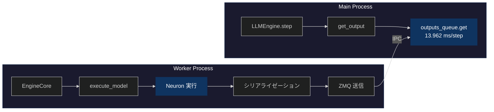

## はじめに

[前回の記事](https://zenn.dev/tosshi/articles/d68bd091d1934d) ではプロファイリングツールの開発にほぼ趣味で集中してしましたが、今回は（真面目に） AWS Inferentia2 上で vllm-neuron を使用したパフォーマンスのプロファイリング分析にチャレンジします。

https://zenn.dev/tosshi/articles/ef61e14fe73399

本記事では、上記の記事で得られた bucketing と prefix caching の設定による平均レイテンシの結果についてなぜそうなるのかを考察することが主な目的です。

実施した調査を 4 つのフェーズに分けます。まず Phase 1 では AWS Neuron Profiler によるハードウェアレベルのプロファイリングを試行錯誤しました。次に Phase 2 では Python レベルのプロファイリングを実施しました。Phase 3 では NxD Inference を直接使用した測定を行い、vLLM との比較を実施しました。最後に Phase 4 では vLLM の bucketing ON/OFF の内部動作を分析しました。

:::message
**今回のプロファイリングの進め方は結果的にかなり間違っていました！** 色々試行錯誤したんだな、と思いながら本記事を読んでください。
:::

:::message alert
本記事は初学者向けではないため LLM 推論の基礎知識、vLLM の基礎知識、AWS Neuron の基礎知識があることが前提です。
:::

## Phase 1: AWS Neuron Profiler での試行錯誤

### 1.1 なぜプロファイリングから始めるのか

性能最適化を行う際、まず現状を把握することが重要です。ベンチマーク測定では性能の結果は分かりますが、性能の理由、ボトルネックの場所、そして改善の余地は分かりません。

以下に実験環境と設定情報をまとめておきます。以前の Zenn 記事の平均レイテンシー最適値からプロファイリングを開始します。

::::details 実験環境と設定情報

本調査で使用した実験環境と設定の詳細を記載します。

**ハードウェア環境**:
- インスタンスタイプ: `inf2.xlarge`

**ソフトウェアバージョン**:
- Neuron SDK: 2.27.x
- vLLM: 0.13.0（Neuron 対応版）
- neuronx-distributed-inference (NxD Inference): 0.7.0
- Python: 3.12

**モデルとデータ**:
- モデル: Qwen3-0.6B-Reranker
- プロンプト長:
  - Phase 1-3 初期測定: 97 トークン（固定長）
  - 追加調査: 18-125 トークン（可変長、16 プロンプト）
- タスク: Reranker（文書ランキング）
- バッチサイズ: 4

**vLLM 設定（過去の Zenn 記事の実験での最適値）**:
```yaml
vllm:
  tensor_parallel_size: 2           # 2 NeuronCore 使用
  max_num_seqs: 4                   # 同時処理数
  block_size: 32                    # KV cache block size
  max_model_len: 2048
  max_num_batched_tokens: 256
  num_gpu_blocks_override: 512
  enable_prefix_caching: false      # Phase 1-5 では無効
  dtype: "bfloat16"

  additional_config:
    override_neuron_config:
      skip_warmup: True
      enable_bucketing: true        # 動的バッチング有効
      pa_num_blocks: 512
      pa_block_size: 32
```

これらの設定は、[前回の Zenn 記事](https://zenn.dev/tosshi/articles/ef61e14fe73399) で最適化したパラメータを使用しています。

本調査では、この特定の設定における vllm-neuron のプロファイリングに焦点を当てています。異なるモデルサイズ、より大規模なバッチサイズでは、異なる性能特性を示す可能性があります。
::::

### 1.2 Perfetto トレースの基本分析

前回も少し紹介した Perfetto について紹介します。Perfetto トレースファイルは SQLite データベースとして扱えます。まず以下のような分析クエリを実行しました。

:::details Perfetto トレース分析コード

```python
from perfetto.trace_processor import TraceProcessor
tp = TraceProcessor(trace='profile_output/trace.perfetto-trace')

# Operation ごとの集計
sql = """
SELECT name, COUNT(*) as count,
       SUM(dur) / 1e9 as total_seconds,
       AVG(dur) / 1e9 as avg_seconds
FROM slice WHERE dur > 0
GROUP BY name ORDER BY total_seconds DESC LIMIT 10
"""
```

**結果の一部**:
```
                  name   count total_seconds avg_seconds
0              unknown  156427      0.038387         0.0
1               MATMUL   21582      0.010941    0.000001
2 custom_call.17_sg0002      36      0.007028    0.000195
3            LDWEIGHTS   21212      0.004914         0.0
```

**クエリの見方**:
`slice` テーブルには各オペレーションの実行記録が格納されています。このクエリは以下を取得します。
- `name`: オペレーション名（MATMUL など、Neuron コンパイラが生成した演算の種類）
- `count`: そのオペレーションが実行された回数
- `dur`: 各実行の継続時間（ナノ秒単位で記録されているため、1e9 で割って秒に変換）
- `total_seconds`: そのオペレーションの合計実行時間（秒単位）
- `avg_seconds`: 1 回あたりの平均実行時間（秒単位）
:::

結果として、まず、`custom_call.17_sg0002` という操作がたった 36 回の実行で 7ms も消費していることが判明しました。次に、MATMUL と LDWEIGHTS がほぼ同じ回数実行されています。さらに、`unknown` という分類の操作が 38ms で最大の時間を消費していました。

`custom_call.17_sg0002`。。。何ですかねこれは。。

:::details [発展的内容] NEFF による custom_call の調査

**疑問**: `custom_call.17_sg0002` とは何か？RoPE？活性化関数？何らかのカスタムカーネル？

Perfetto トレースでは実行回数と時間しか分からないため、NEFF (Neuron Executable File Format) ファイルを [unpacking](https://awsdocs-neuron.readthedocs-hosted.com/en/latest/neuron-runtime/explore/work-with-neff-files.html) して静的な構造を調査しました。(uppack には `neuron-packager unpack` コマンドを利用しても良いです)

**NEFF から判明したこと**:

```bash
# NEFF ファイルを unpacking
$ dd if=neff_322059935237836.neff of=neff.tar.gz bs=1024 skip=1
$ tar -xzf neff.tar.gz

# tensor_map.json を確認
$ cat sg00/tensor_map.json | jq '.["custom_call.17_sg0002"]'
{
  "dtype": "float32",
  "sim_shape": [256, 1, 1],
  "kind": null,
  "is_const": false,
  "layer_name": "custom_call.17"
}
```

**分かること**:
- データ型: `float32`（精度重視の演算）
- テンソル形状: `[256, 1, 1]`（比較的小さい）
- サブグラフ: `sg0002`
- 動的に計算される中間テンソル
- `custom_call.14` ～ `17` の連続した演算シーケンス

**Qwen3 アーキテクチャから推測**:

形状 `[256, 1, 1]` と周辺の `dot` (MATMUL) 操作から、以下のような操作と推測
- **RoPE (Rotary Position Embedding)**: 位置エンコーディング計算
- **RMSNorm**: 正規化層の統計値計算
- **アテンション機構**: Softmax 前の中間計算

NEFF はコンパイル時の静的な情報（グラフ構造、テンソル形状、データ型）を含みますが、以下は判明しないようです。
- 具体的な演算ロジック
- 実行回数
- 実行時間
- 初回実行時の遅延

NEFF 分析からは、何が使われているかは分かりますが、どう動くかは Perfetto トレースで実行時に測定する必要があります。
:::

### 1.3 skip_warmup 設定の影響

試行錯誤しながら実行したクエリを全て紹介していると膨大になってしまうため割愛しますが custom_call が初回実行時に大きな遅延を起こしていることが分かったため、NxD Inference のパラメータである `skip_warmup=False` を試してみました。デフォルト値は `False` なのですが以前の実験の試行錯誤で `True` にしていました。このパラメータはモデルロード後に 1 回の forward 実行を行い、遅延初期化を完了させるというものです。
                                                                                                                  
| 設定 | 平均時間 |
|------|---------|
| Baseline (skip_warmup=True) | 2.992秒 |
| Warmup (skip_warmup=False) | 3.110秒 (+3.9%) |

ウォームアップすれば速くなると予想していましたが、実際には約 4% 遅くなりました。再度プロファイリングしてオペレーションの変化を確認してみましょう。

:::details Operation 数の変化

```
Baseline (skip_warmup=True):
  MATMUL: 21,582回, 10.94ms
  LDWEIGHTS: 21,212回, 4.91ms
  ACTIVATE: 4,702回, 1.65ms
  COPY: 83回, 0.03ms

Warmup (skip_warmup=False):
  MATMUL: 13,497回 (-37%), 2.64ms (-76%)
  LDWEIGHTS: 13,497回 (-36%), 1.17ms (-76%)
  ACTIVATE: 4,207回 (-11%), 2.94ms (+78%)
  COPY: 554回 (+567%), 1.01ms (+3,267%)
```
:::

`skip_warmup=False` で MATMUL/LDWEIGHTS の主要オペレーションは実行時間が 76% 減少したものの、ACTIVATE の実行時間が +78%、COPY の実行時間が +3,267% 増加し、トータルでは遅くなりました。


### 1.4 Neuron Profiler の測定範囲の限界

:::message alert
**ここで重要な気づき**：Neuron Profiler のトレース時間は 16-17ms なのに、ベンチマーク全体は約 3 秒かかっている。**この 16-17ms ってどこからどこまでのなんの値？**
:::

涙の調査の結果、Neuron Profiler の測定範囲に関する重要な特性が判明しました。Neuron Profiler は実行時に NTFF (Neuron Trace File Format) という中間ファイルを生成し、それを Perfetto トレースに変換します。各 NTFF ファイルは 1 つのコンパイル済みグラフの実行記録を表しており、異なるバッチサイズや sequence length 用の複数グラフが存在します。そのためこれだけを見れば NeuronCore のトータルの実行時間が確実にわかるというものではありません。

```bash
$ find profile_output -name "*.ntff" | wc -l
22  # 11種類のグラフ × 2コア(tensor_parallel_size=2)

# NTFF は Perfetto に変換される
$ ls profile_output/trace.perfetto-trace
trace.perfetto-trace  # これを TraceProcessor や Perfetto UI で分析
```

:::message alert
**今回の過ちからの学び**: Neuron Profiler はハードウェアレベルの分析には有用だが、vllm-neuron 全体の最適化において初手で使うものではない。
:::

カスタムカーネルを実装するようなケースでは Neuron Profiler は必須と言えますが、最適な設定を探す際の初手で実施する必要があるものではありませんでした。そしてハードウェアレベルの改善をする前に vllm-neuron 全体の実行時間の内のどの程度をハードウェア側の推論処理が占めているのかによって改善の優先度が変わってくるので vllm-neuron 全体のプロファイリングをしないと意味ないぞ、と思いました。。とはいえ、今回得た Neuron Profiler に関する知見は有用なためシェアの意味を込めて Phase 1 を消さずにそのまま公開します。

### 1.5 NEFF、Perfetto とは

Phase 1 で登場したプロファイリングファイルについて整理します。

:::message
NEFF（コンパイル時） → NTFF（プロファイリング実行時の中間ファイル） → **Perfetto トレース**（分析に使用）
:::

#### NEFF (Neuron Executable File Format)

[参考: Work with NEFF Files](https://awsdocs-neuron.readthedocs-hosted.com/en/latest/neuron-runtime/explore/work-with-neff-files.html)

**役割**: コンパイル済みグラフの実行ファイル

```bash
# NEFF の構造
neff_322059935237836.neff (801KB)
├── [1024 byte header]
└── [tar.gz archive]
    ├── info.json              # コンパイル情報
    ├── hlo_stats.json         # 演算統計（HloMacCount: 29.2B など）
    ├── metrics.json           # 推定レイテンシ
    ├── neff.json              # グラフ定義（373 ノード）
    └── sg00/                  # サブグラフ 0
        ├── tensor_map.json    # テンソル情報（458 テンソル）
        ├── PE.bin             # Processing Element 命令
        ├── Activation.bin     # 活性化関数命令
        ├── DVE.bin            # Data Vector Engine 命令
        └── debug_info_*.dbg   # デバッグ情報
```

::::details NEFF ファイルと bucketing の関係

**NEFF (Neuron Executable File Format)** は、AWS NeuronCore 上で実行されるコンパイル済みグラフの実行ファイルです。bucketing を有効にすると、複数の (batch_size, sequence_length) の組み合わせに対応する複数のグラフが事前にコンパイルされます。

```bash
# NEFF ファイルの分析
$ find profile_output -name "*.neff" | wc -l
77  # 複数の PID から 11 種類のグラフ × 複数回コンパイル

$ ls -lh profile_output/*/neff_*.neff | awk '{print $5}' | sort -u
801K   # Graph 1: 最小バケット
881K   # Graph 2
991K   # Graph 3
1.1M   # Graph 4
1.3M   # Graph 5
2.1M   # Graph 6
2.3M   # Graph 7
2.4M   # Graph 8
2.6M   # Graph 9
3.0M   # Graph 10
       # (合計 11 種類、124 MB)
```

bucketing を有効にする場合、複数のサイズのグラフを事前コンパイルしておき、それらをロードして推論に利用します。実行時に入力サイズに応じた最適グラフを選択することから、グラフ選択のオーバーヘッドなどが発生します。固定長ワークロードの場合、実際に使用するのは複数グラフのうち 1 つだけであり、特に bucketing の恩恵を受けることなくオーバーヘッドが追加されると思われます。一般的な LLM の生成のような可変長ワークロードの場合は異なる長さのプロンプトが複数グラフに分散されるので再コンパイルすることなく効率的なバッチングが可能なためオーバーヘッドを差し引いても高速化に貢献すると思われます。

:::message
**このようにワークロードによって bucketing の性能は ON/OFF でどちらが良いか変動する可能性があることを覚えておいてください！**
:::
::::

#### NTFF (Neuron Trace File Format) - 中間ファイル

**役割**: Perfetto トレースに変換される前の中間ファイル

```bash
# NTFF ファイルの例（Neuron Profiler が生成）
profile_output/i-0049acfde6046f237_pid_520024/
├── 322059935237836_instid_0_vnc_0.ntff  # Graph 1, Core 0
├── 322059935237836_instid_0_vnc_1.ntff  # Graph 1, Core 1
├── 729292360268366_instid_0_vnc_0.ntff  # Graph 4, Core 0
├── 729292360268366_instid_0_vnc_1.ntff  # Graph 4, Core 1
...
└── (22 files = 11 graphs × 2 cores)

# Neuron Profiler で Perfetto に変換
$ neuron-profile view --output-format perfetto profile_output
```

#### Perfetto トレース

**役割**: NeuronCore 上の低レベル実行トレース

```bash
# Perfetto トレース
trace.perfetto-trace (110 MB)
└── SQLite データベース
    ├── slice テーブル          # オペレーション実行記録
    │   └── MATMUL: 21,582回, 10.94ms
    │       COPY: 83回, 0.03ms
    │       custom_call.17: 36回, 7ms
    ├── thread テーブル         # スレッド情報
    └── process テーブル        # プロセス情報
```

::::details NEFF と Perfetto の比較

以下はまだ完全には整理しきれていないため参考程度に確認してください。

| 情報 | NEFF | Perfetto | 備考 |
|------|------|----------|------|
| **静的構造** | | | |
| グラフ構造（ノード、テンソル数） | ✅ | ❌ | NEFF unpacking で取得 |
| テンソル形状・データ型 | ✅ | ❌ | tensor_map.json |
| 演算量（理論値） | ✅ | ❌ | hlo_stats.json |
| メモリ使用量（理論値） | ✅ | ❌ | IfmapSize、OfmapSize |
| DMA キュー構成 | ✅ | ❌ | def.json |
| **グラフレベル実行** | | | |
| グラフごとの実行時間 | ❌ | ⚠️ | SQL 集計で計算可能 |
| NeuronCore ごとの内訳 | ❌ | ⚠️ | スレッド別に集計 |
| 使用されたグラフの識別 | ❌ | ⚠️ | slice 名から推定 |
| グラフ間の遷移時間 | ❌ | ⚠️ | タイムスタンプから推定 |
| **オペレーションレベル実行** | | | |
| 実行時間（実測値） | ❌ | ✅ | slice.dur |
| 実行回数 | ❌ | ✅ | COUNT(*) |
| オペレーション詳細（MATMUL、COPY など） | ❌ | ✅ | slice.name |
| タイムスタンプと実行順序 | ❌ | ✅ | slice.ts |
| 並列実行の可視化 | ❌ | ✅ | Perfetto UI |
| 初期化遅延（skip_warmup 効果） | ❌ | ✅ | 初回実行時間の比較 |
| **高レベル情報** | | | |
| Python レイヤーオーバーヘッド | ❌ | ❌ | line_profiler などが必要 |
| 演算内容の意味（RoPE、RMSNorm など） | ⚠️ | ❌ | 形状から推測のみ |

**凡例**: ✅ 直接取得可能、⚠️ 推測・計算が必要、❌ 取得不可能
::::

## Phase 2: line_profiler による Python プロファイリング

Phase 1 では Neuron Profiler により NeuronCore レベルの詳細な分析を行いましたが、Python レベルのオーバーヘッド（トークナイゼーション、データ準備など）の測定には別のツールが必要です。そこで line_profiler を使用して Python コードの行ごとの実行時間を測定します。

### 測定スクリプトの準備

Phase 1 で使用した `test_reranker.py` は pytest + benchmark_capture デコレーターを使用していますが、line_profiler と組み合わせると出力が複雑になります。そこで、line_profiler 専用のシンプルなスクリプト `profile_line.py` を作成しました。（この辺りも vllm-neuron の Python プロファイリングのためにうまく取れるように今後 benchmark_capture の実装を改善します）

::::details スクリプトの構造

```python:profile_line.py
try:
    profile
except NameError:
    def profile(func):
        return func

# config.yaml から設定を読み込み（test_reranker.py と同じ）
config_path = Path(__file__).parent / 'config.yaml'
with open(config_path, 'r') as f:
    config = yaml.safe_load(f)

# 測定対象の関数に @profile デコレーターを追加
@profile
def build_prompts_for_vllm(pairs, tokenizer, prefix_tokens, suffix_tokens):
    """トークン化とプロンプト構築"""
    # ... (test_reranker.py と同じロジック)

@profile
def run_reranker(llm, tokenizer, token_true_id, token_false_id,
                 prefix_tokens, suffix_tokens):
    """リランカーのメイン処理"""
    # ... (test_reranker.py と同じロジック)

def main():
    """メイン関数（pytest 非依存）"""
    llm = vllm.LLM(model=model_path, **vllm_config)
    # ... 初期化とプロファイリング実行

if __name__ == "__main__":
    main()
```

::::

::::details スクリプト完全版
```python:profile_line.py
"""
Line profiler script for vLLM-Neuron Reranker

Run with:
    kernprof -l -v profile_line.py

Or for more detailed output:
    kernprof -l profile_line.py
    python -m line_profiler profile_line.py.lprof
"""

# line_profiler compatibility: make @profile decorator optional
try:
    profile
except NameError:
    # If not running under kernprof, @profile is a no-op
    def profile(func):
        return func

import csv
import gc
import logging
import os
import sys
from pathlib import Path

import yaml

# Configure logging
logging.basicConfig(level=logging.INFO)
logger = logging.getLogger(__name__)

# Load configuration
config_path = Path(__file__).parent / 'config.yaml'
with open(config_path, 'r') as f:
    config = yaml.safe_load(f)

# Get model path
model_path = config['model']['path']

# Get vLLM config
vllm_config = {
    "tensor_parallel_size": config['vllm']['tensor_parallel_size'],
    "max_num_seqs": config['vllm']['max_num_seqs'],
    "block_size": config['vllm']['block_size'],
    "max_model_len": config['vllm']['max_model_len'],
    "max_num_batched_tokens": config['vllm']['max_num_batched_tokens'],
    "num_gpu_blocks_override": config['vllm']['num_gpu_blocks_override'],
    "enable_prefix_caching": config['vllm']['enable_prefix_caching'],
    "dtype": config['vllm']['dtype'],
    "disable_log_stats": config['vllm'].get('disable_log_stats', False),
}

# Add additional_config if present (Zenn article optimal settings)
if 'additional_config' in config['vllm']:
    vllm_config['additional_config'] = config['vllm']['additional_config']

# Get reranker config
reranker_config = config['reranker']
benchmark_config = config['benchmark']

# Reranker prompts
reranker_prompts = {
    'instruction': reranker_config['instruction'],
    'prefix': reranker_config['prefix'],
    'suffix': reranker_config['suffix']
}

# Token IDs
token_ids = {
    'true': reranker_config['token_true'],
    'false': reranker_config['token_false']
}

# Load CSV data
csv_file = Path(__file__).parent / reranker_config['input_file']
with open(csv_file, 'r', encoding='utf-8') as f:
    reader = csv.DictReader(f)
    rows = list(reader)

num_queries = min(len(rows), benchmark_config['num_test_queries'])
search_num = reranker_config['search_num']
batch_size = reranker_config['batch_size']
max_length = reranker_config['max_length']

logger.info(f"Loaded {len(rows)} queries from {csv_file}")
logger.info(f"Testing with first {num_queries} queries")


def format_instruction(query: str, doc: str) -> str:
    """Format instruction for reranker"""
    instruction = reranker_prompts['instruction']
    output = f"<Instruct>: {instruction}\n<Query>: {query}\n<Document>: {doc}"
    # Truncate if too long
    if len(output) >= 2000:
        output = output[:2000]
    return output


@profile
def build_prompts_for_vllm(pairs, tokenizer, prefix_tokens, suffix_tokens):
    """Build prompts with proper tokenization - PROFILING TARGET"""
    prompts = []
    budget = max_length - len(prefix_tokens) - len(suffix_tokens)

    # Tokenize pairs
    enc = tokenizer(
        list(pairs),
        padding=False,
        truncation="longest_first",
        return_attention_mask=False,
        add_special_tokens=False,
        max_length=max(8, budget),
    )

    # Build final prompts: prefix + content + suffix
    for ids in enc["input_ids"]:
        final_ids = prefix_tokens + ids + suffix_tokens
        text = tokenizer.decode(final_ids, skip_special_tokens=False)
        prompts.append(text)

    return prompts


@profile
def run_reranker(llm, tokenizer, token_true_id, token_false_id, prefix_tokens, suffix_tokens):
    """Run reranker on queries - MAIN PROFILING TARGET"""

    import vllm
    from vllm import SamplingParams

    # Get use_tqdm setting from benchmark config
    use_tqdm = benchmark_config.get('use_tqdm', True)

    # Create SamplingParams
    sampling_params = SamplingParams(
        max_tokens=1,
        temperature=0.0,
        logprobs=20,
        detokenize=True,
        allowed_token_ids=[token_true_id, token_false_id]
    )

    logger.info(f"SamplingParams configured: max_tokens=1, "
                f"allowed_tokens=[{token_ids['true']}, {token_ids['false']}]")

    # Process each query
    total_processed = 0
    for query_idx, row in enumerate(rows[:num_queries]):
        query = row["query"]

        # Get candidates
        candidates = [
            row[f"answer_{i}"]
            for i in range(search_num)
            if f"answer_{i}" in row
        ]

        # Format query-document pairs
        pairs = [format_instruction(query, doc) for doc in candidates[:search_num]]

        # Build prompts with tokenization
        prompts = build_prompts_for_vllm(pairs, tokenizer, prefix_tokens, suffix_tokens)

        # Process in batches
        query_outputs = []
        for s in range(0, len(prompts), batch_size):
            batch_prompts = prompts[s:s + batch_size]
            outputs = llm.generate(batch_prompts, sampling_params, use_tqdm=use_tqdm)
            query_outputs.extend(outputs)

        total_processed += len(query_outputs)

        if query_idx == 0:
            # Show first result for verification
            logger.info(f"Query 1: {query[:80]}...")
            logger.info(f"Generated {len(query_outputs)} scores for "
                       f"{len(candidates[:search_num])} candidates")
            if query_outputs:
                first_output = query_outputs[0]
                logger.info(f"First output: {first_output.outputs[0].text} "
                           f"(token_ids={first_output.outputs[0].token_ids})")

    logger.info(f"Profiling completed: processed {total_processed} reranker pairs")
    return total_processed


def main():
    """Main profiling function"""
    import vllm

    logger.info("Initializing vLLM-Neuron reranker...")
    logger.info(f"Model: {model_path}")
    logger.info(f"Config: block_size={vllm_config['block_size']}, "
               f"max_num_seqs={vllm_config['max_num_seqs']}, "
               f"tensor_parallel_size={vllm_config['tensor_parallel_size']}")

    # Initialize vLLM
    llm = vllm.LLM(model=model_path, **vllm_config)

    # Get tokenizer and token IDs
    tokenizer = llm.get_tokenizer()
    token_false_id = tokenizer.convert_tokens_to_ids(token_ids['false'])
    token_true_id = tokenizer.convert_tokens_to_ids(token_ids['true'])

    logger.info(f"Token IDs: {token_ids['true']}={token_true_id}, "
               f"{token_ids['false']}={token_false_id}")

    # Encode prompt templates
    prefix_tokens = tokenizer.encode(
        reranker_prompts['prefix'], add_special_tokens=False
    )
    suffix_tokens = tokenizer.encode(
        reranker_prompts['suffix'], add_special_tokens=False
    )

    logger.info(f"Prefix tokens: {len(prefix_tokens)}, Suffix tokens: {len(suffix_tokens)}")

    # Run profiling
    logger.info("Starting profiling run...")
    total = run_reranker(llm, tokenizer, token_true_id, token_false_id, prefix_tokens, suffix_tokens)

    logger.info(f"Profiling complete. Processed {total} pairs.")

    # Cleanup
    del llm
    gc.collect()


if __name__ == "__main__":
    main()
````

```yaml:config.yaml
# vLLM-Neuron Reranker Benchmark Configuration

# Model configuration
model:
  # Path to the reranker model
  # Example: "/path/to/models/Qwen3-0.6B-Reranker"
  # Use environment variable: export RERANKER_MODEL_PATH="/your/model/path"
  path: "/home/coder/data-science/investigations/inf2-vllm-performance/models/Qwen3-0.6B-Reranker"

# vLLM-Neuron engine settings
vllm:
  tensor_parallel_size: 2           # Number of NeuronCores
  max_num_seqs: 4                   # Batch size
  block_size: 32                    # KV cache block size (32 for Zenn best case, 128 for stability)
  max_model_len: 2048               # Maximum sequence length
  max_num_batched_tokens: 256       # Performance optimization
  num_gpu_blocks_override: 512      # pa_num_blocks equivalent
  enable_prefix_caching: false      # Explicit disable
  dtype: "bfloat16"                 # Data type

  # Neuron-specific overrides (Zenn article optimal settings)
  additional_config:
    override_neuron_config:
      skip_warmup: true             # Phase 1-5 の設定（記事と一致）
      enable_bucketing: true        # 動的バッチング有効
      pa_num_blocks: 512
      pa_block_size: 32

# Reranker-specific settings
reranker:
  # Input data
  input_file: "input_sample.csv"    # CSV file with queries and candidates

  # Processing parameters
  search_num: 20                    # Number of candidates per query to process
  batch_size: 8                     # Batch size for processing prompts
  max_length: 1500                  # Maximum prompt length

  # Model-specific tokens (for Qwen3-Reranker)
  # Change these for other reranker models
  token_true: "yes"
  token_false: "no"

  # Prompt templates (for Qwen3-Reranker)
  # Customize these for your model
  prefix: |
    <|im_start|>system
    Judge whether the Document meets the requirements based on the Query and the Instruct provided. Note that the answer can only be "yes" or "no".<|im_end|>
    <|im_start|>user

  # Note: "assitant" typo is intentional for Qwen3-Reranker compatibility
  suffix: |
    <|im_end|>
    <|im_start|>assitant
    <think>

    </think>


  instruction: "Given a web search query, retrieve relevant passages that answer the query"

# Benchmark settings
benchmark:
  rounds: 5                         # Number of benchmark rounds
  warmup_rounds: 1                  # Number of warmup rounds
  num_test_queries: 10              # Number of queries to use for testing (記事と同じ条件)

# Profiler settings (optional)
profiler:
  # Clear Neuron compilation cache before benchmark
  # WARNING: First run after clearing will recompile (10-15 minutes)
  # Useful when:
  # - Model configuration changed (batch size, sequence length, etc.)
  # - Neuron SDK version changed
  # - Testing clean compilation performance
  clear_cache_before: false

  # Clear cache after benchmark (useful for CI/CD to save disk space)
  clear_cache_after: false
```
::::

これにより、**Phase 1 と同じ測定条件**（同じ config.yaml、同じ処理ロジック）を維持しながら、line_profiler による詳細な Python レベルの分析が可能になります。

### 2.1 測定対象の理解

**測定対象**: 1 クエリ（20 候補文書のリランキング）を処理する時間

```yaml
reranker:
  search_num: 20        # 1 クエリあたり 20 候補文書
  batch_size: 8         # 8 ペアずつバッチ処理

vllm:
  max_num_seqs: 4       # vLLM の同時処理数
```

```
1  クエリ = 20 ペア ÷ batch_size=8 = 3 バッチ
10 クエリ = 30 バッチ
合計時間 = 2,992ms → 1 クエリあたり約 300ms
```

### 2.2 line_profiler 測定結果

::::details line_profiler の実行

**実行環境の準備**:

```bash
# vLLM-Neuron 環境をアクティベート
source /opt/aws_neuronx_venv_pytorch_inference_vllm_0_13/bin/activate

# PATH に Neuron SDK のツールを追加
export PATH="/opt/aws_neuronx_venv_pytorch_inference_vllm_0_13/bin:$PATH"

# line_profiler がインストールされていない場合
pip install line-profiler
```

**プロファイリング実行**:

```bash
cd /path/to/my-reranker
kernprof -l -v -p vllm.v1.engine profile_line.py
```

:::message
**kernprof オプション説明**:
- `-l` (--line-by-line): 行ごとのプロファイリングを有効化
- `-v` (--view): 結果を即座に表示
- `-p vllm.v1.engine` (--prof-mod): **vllm.v1.engine モジュールを自動プロファイリング対象に指定**（このモジュール内の全関数を自動的にプロファイリング）
:::

実行後、`profile_line.py.lprof` ファイルが生成され、コンソールに詳細な行ごとの実行時間が表示されます。
::::

以下に実際に line_profiler の結果から得られた情報を示します。

```python
# llm.generate() - 30 バッチ処理
Line 157: outputs = llm.generate(batch_prompts, sampling_params)
  - Hits: 30 batches
  - Time: 3781.560 ms (3.78 秒)
  - Per Hit: 126.052 ms/batch
  - % Time: 99.1%

# LLMEngine.step() の内訳
Line 293: outputs = self.engine_core.get_output()
  - Hits: 229 steps (7.6 steps/batch)
  - Time: 3197.372 ms
  - Per Hit: 13.962 ms/step
  - % Time: 95.3%
```

line_profiler による測定の結果、10 クエリ（30 バッチ）の処理に合計 3.78 秒かかり、そのうち `llm.generate()` の呼び出しだけで **99.1%（3.78 秒）** を占めることが判明しました。約 3 秒から時間が増えているのはプロファイリングのオーバーヘッドです。

さらに重要な発見として、**1 バッチあたりの処理時間が 126.052ms** という測定値が得られました。ただし、この値は **プロファイリングオーバーヘッドを含む** ため、Phase 3 で純粋なベンチマーク測定を別途実施します。また、vLLM の内部処理を見ると、`LLMEngine.step()` が 229 回呼ばれており、30 バッチに対して **平均 7.6 steps/batch** という謎の値が観測されました。なぜ 1 バッチの処理に 7.6 回ものステップが必要なのか、この時点では理解できていませんでした。

### 2.3 7.6 steps/batch の理由を追う

この数値の解明するため、`LLMEngine.step()` の中身をさらに詳しく調べました。line_profiler の `-p vllm.v1.engine` オプションにより、vLLM 内部のコードも自動プロファイリングされています。

`LLMEngine.step()` の処理時間のほぼ全て（95.3%）が `engine_core.get_output()` という単一の関数呼び出しで費やされていました。さらにその `get_output()` 関数の中身を見ると、**100% が `outputs_queue.get()` というキューからのデータ取得処理**でした。

```python
# LLMEngine.step() の中身
Line 293: outputs = self.engine_core.get_output()
  - Time: 3197.372 ms (95.3% of step())

# get_output() の中身
Line 715: outputs = self.outputs_queue.get()
  - Time: 3194.6 ms
  - % Time: 100.0% of get_output()
```

つまり、メインプロセスは `outputs_queue.get()` でキューから結果が送られてくるのをただ**待っているだけ**でした。これは実際の推論処理が別プロセスで行われていることを意味します。ここで vLLM v1 のマルチプロセスアーキテクチャの存在を思い出しました。

（以下の記事に内部アーキテクチャの解説があります）

https://zenn.dev/tosshi/articles/f64ba0b86e330b

vLLM v1 では、リクエストを受け取るメインプロセスと、実際に推論を実行する Worker プロセスが分離されています。メインプロセスは `llm.generate()` を呼び出すと、リクエストを Worker プロセスに送信し、`outputs_queue.get()` でブロックして結果を待ちます。一方、Worker プロセスは NeuronCore での推論実行、結果のシリアライゼーション、そしてプロセス間通信を通じてメインプロセスに結果を返します。この構造を図示すると以下のようになります。

**vLLM v1 のマルチプロセスアーキテクチャ (vllm-neuron)**



line_profiler は Python の標準的なプロファイラと同様に、**実行中のプロセスのコードしか測定できません**。つまり、Worker プロセスで実行される `execute_model()` や NeuronCore での推論処理は、メインプロセスから見るとブラックボックスです。

測定できたのは `outputs_queue.get()` で待機している時間（13.962ms/step）だけであり、この時間には推論、IPC オーバーヘッドなどのすべての時間が含まれています。

では、なぜ 1 バッチの処理に平均 7.6 回も `step()` が呼ばれるのでしょうか。これは vLLM v1 のイベントループの動作方法としてメインプロセスが何度も `step()` を確認してキューをチェックし続けているからです。1 バッチあたり平均して 7.6 回キューをチェックしていたということです。

謎は解けましたが、肝心の **Worker プロセス内での NeuronCore の推論処理時間**を分解することはできません。`outputs_queue.get()` の 13.962 ms には、推論実行、シリアライゼーション、IPC 通信のすべてが含まれており、line_profiler ではこれ以上分解をするのは難しそうです。

:::message alert
**今回の過ちからの学び**: line_profiler ではマルチプロセスのプロファイリングに限界があるため、フレームワークのアーキテクチャを理解した上で欲しい情報を取得できるプロファイリングツールを選定した方が良い。py-spy は Worker 側のプロファイリングまで実施できます。
:::

### 2.4 測定の限界と今後の方向性

line_profiler による測定で判明したことを整理すると、以下のような構造になります。全体として 126.052 ms/batch という処理時間（プロファイリングオーバーヘッド込み）は測定できましたが、その内訳の大部分（84.2%）の詳細が不明という状況です。

この状況を打開するため、プロファイリングオーバーヘッドを含まない純粋なベンチマーク測定と、NxD Inference を直接使った測定を試みました。
## Phase 3: NxD Inference 直接測定と包括的ベンチマーク

Worker プロセスの直接測定が困難なため、**vLLM を使わずに NxD Inference を直接使用**して純粋な推論実行時間も測定することにしました。また、Bucketing と Prefix Caching の全組み合わせを測定しました。

:::message alert
**Phase 1-2 との測定方法の違いについて:**

Phase 1-2 では主にプロファイリング手法の検証に焦点を当てており、定量的な性能値の測定精度は Phase 3 が最も高くなっています。

- **Phase 1**: Neuron Profiler による試行錯誤（ハードウェアレベル）
- **Phase 2**: line_profiler 分析（プロファイリングオーバーヘッド込み、126.052 ms/batch）
- **Phase 3**: 純粋なベンチマーク測定（オーバーヘッド軽微、統一条件）

Phase 3 では全パターンで以下の条件を統一しています。
- 測定イテレーション: 100 回（ウォームアップ 3 回後）
- 統一 vLLM 設定（max_num_batched_tokens=256, num_gpu_blocks_override=512）
- 同一のプロンプトとバッチサイズ

Phase 1-2 の実験結果は「プロファイリング手法の有用性検証」として参照してください。**定量的な性能比較には Phase 3 の結果を使用します。**
:::

### 3.0 測定結果サマリー（全 16 パターン）

以下の表は、NxD Inference と vllm-neuron の両方で、Bucketing ON/OFF、Prefix Caching ON/OFF、固定長（97 トークン）/ 可変長（18-125 トークン）、の全組み合わせです。

| No | 環境 | Bucketing | Prefix Caching | ワークロード | 平均レイテンシ (ms) | vs No.1 | 備考 |
|----|---------|-----------|----------------|------------|-------------------|----------------|------|
| 01 | NxD | OFF | OFF | 固定長 | **49.14** | - | **ベースライン** |
| 02 | NxD | ON | OFF | 固定長 | **47.24** | -3.9% | わずかに改善 |
| 03 | NxD | OFF | ON | 固定長 | - | - | ❌ コンパイルエラー |
| 04 | NxD | ON | ON | 固定長 | - | - | ❌ コンパイルエラー |
| 05 | NxD | OFF | OFF | 可変長 | **48.93** | -0.4% | ほぼ同等 |
| 06 | NxD | ON | OFF | 可変長 | **48.89** | -0.5% | ほぼ同等 |
| 07 | NxD | OFF | ON | 可変長 | - | - | ❌ コンパイルエラー |
| 08 | NxD | ON | ON | 可変長 | - | - | ❌ コンパイルエラー |
| 09 | vLLM | OFF | OFF | 固定長 | **252.42** | +413.8% | Bucketing OFF で大幅悪化 |
| 10 | vLLM | ON | OFF | 固定長 | **59.23** | +20.5% | vLLM オーバーヘッド |
| 11 | vLLM | OFF | ON | 固定長 | **237.54** | +383.5% | Prefix Caching の恩恵なし |
| 12 | vLLM | ON | ON | 固定長 | **85.92** | +74.9% | Prefix Caching で悪化 |
| 13 | vLLM | OFF | OFF | 可変長 | **252.10** | +413.1% | 固定長とほぼ同じ |
| 14 | vLLM | ON | OFF | 可変長 | **59.33** | +20.7% | 固定長とほぼ同じ |
| 15 | vLLM | OFF | ON | 可変長 | **238.08** | +384.6% | 固定長とほぼ同じ |
| 16 | vLLM | ON | ON | 可変長 | **86.12** | +75.3% | 固定長とほぼ同じ |

### 3.1 パターン計測から観測できる事実

#### 3.1.1 NxD Inference vs vllm-neuron の性能差

| No | 環境 | Bucketing | Prefix Caching | ワークロード | 平均レイテンシ (ms) | vs No.1 | 備考 |
|----|---------|-----------|----------------|------------|-------------------|----------------|------|
| 01 | NxD | OFF | OFF | 固定長 | **49.14** | - | **ベースライン** |
| 02 | NxD | ON | OFF | 固定長 | **47.24** | -3.9% | わずかに改善 |
| 10 | vLLM | ON | OFF | 固定長 | **59.23** | +20.5% | vLLM オーバーヘッド |

**No.02 と No10 の比較から NxD Inference が vllm-neuron より約 20% 高速**という結果が得られました。Main Process と Worker Process 間の ZMQ 通信、データシリアライゼーション、バッチング処理などのオーバーヘッドが約 12ms (20%) のレイテンシ増加として現れています。

#### 3.1.2 Bucketing の劇的な効果（vllm-neuron のみ）

| No | 環境 | Bucketing | Prefix Caching | ワークロード | 平均レイテンシ (ms) | vs No.1 | 備考 |
|----|---------|-----------|----------------|------------|-------------------|----------------|------|
| 01 | NxD | OFF | OFF | 固定長 | **49.14** | - | **ベースライン** |
| 09 | vLLM | OFF | OFF | 固定長 | **252.42** | +413.8% | Bucketing OFF で大幅悪化 |
| 10 | vLLM | ON | OFF | 固定長 | **59.23** | +20.5% | vLLM オーバーヘッド |
| 13 | vLLM | OFF | OFF | 可変長 | **252.10** | +413.1% | 固定長とほぼ同じ |
| 14 | vLLM | ON | OFF | 可変長 | **59.33** | +20.7% | 固定長とほぼ同じ |

vllm-neuron では **No.09 と 10、No.13 と 14 の比較から Bucketing ON/OFF で 4.3 倍の性能差**が確認されました。固定長と可変長の違いによらずどちらも同じくらいの改善率です。

:::message alert
なぜこれほどの差が発生するのでしょうか？しかも NxD Inference では Bucketing の効果は薄いことが定量・定性的視点からわかっています。
:::

Bucketing OFF の場合、97 トークンの入力に対して 2048 トークン用の HLO グラフが実行されるため、1951 トークン分のゼロパディングが発生します。Bucketing ON では 128 トークンバケットが選択されるため、31 トークンのパディングのみで済みます。詳細な結論に至るまでの調査は以下を参照してください。

::::details ゼロパディングによる性能劣化の調査

この結論に至るまで、vLLM の詳細ログと複数のプロファイリング手法を組み合わせた段階的な調査を実施しました。

## 調査の動機

Phase 2 の line_profiler による分析で、Worker プロセスがボトルネックであることは判明していましたが、その内部で**なぜ Bucketing OFF が遅いのか**は不明でした。Worker プロセス内部を直接プロファイルすることができないため、vLLM の詳細ログを有効化して HLO 生成とコンパイルプロセスを分析することにしました。

## 実験設定

vLLM の詳細ログを有効化して Bucketing ON/OFF の両方を測定します。

```python
import logging
logging.basicConfig(level=logging.DEBUG)

vllm_config = {
    "disable_log_stats": False,  # 統計情報を有効化
    "additional_config": {
        "override_neuron_config": {
            "enable_bucketing": True  # or False
        }
    }
}
```

## HLO 生成の観測結果

**Bucketing ON の場合:**
```
Generating 5 hlos for key: context_encoding_model
- torch.Size([1, 128]) in 1.71s
- torch.Size([1, 256]) in 1.62s
- torch.Size([1, 512]) in 1.74s
- torch.Size([1, 1024]) in 1.97s
- torch.Size([1, 2048]) in 2.41s

Generating 5 hlos for key: token_generation_model
- 5 × torch.Size([4, 1]) in ~1.8s each
```
→ 合計 **10 個の HLO** が生成され、複数のバケットサイズに対応

**Bucketing OFF の場合:**
```
Generating 1 hlos for key: context_encoding_model
- torch.Size([1, 2048]) in 2.56s

Generating 1 hlos for key: token_generation_model
- 1 × torch.Size([4, 1]) in ~2.0s
```
→ 合計 **2 個の HLO** のみ生成され、2048 トークンバケットのみ使用

## 根本原因: 入力パディングオーバーヘッド

vLLM のログから、実際の推論時のバケット選択を確認しました。

**Bucketing OFF の挙動:**
```python
# 97 トークンのプロンプトを処理する場合
available_buckets = [2048]  # 2048 トークンバケットのみ

# 最小の適合バケット = 2048
selected_bucket = 2048
padded_input = pad(input_97_tokens, target_length=2048)
# → 1951 トークンの無駄なパディング (95.3%)
# → AWS NeuronCore は 2048 トークン全てを計算
```

**Bucketing ON の挙動:**
```python
# 97 トークンのプロンプトを処理する場合
available_buckets = [128, 256, 512, 1024, 2048]

# 最小の適合バケット = 128
selected_bucket = 128
padded_input = pad(input_97_tokens, target_length=128)
# → 31 トークンのパディングのみ (24.2%)
# → AWS NeuronCore は 128 トークンを計算
```

## 計算量の比較

| 指標 | Bucketing ON | Bucketing OFF | 比率 |
|------|--------------|---------------|------|
| **入力トークン数** | 97 | 97 | - |
| **選択されたバケット** | 128 | 2048 | - |
| **パディング量** | +31 (32%) | +1951 (2009%) | **63 倍** |
| **NeuronCore 計算量** | 128 トークン | 2048 トークン | **16 倍** |
| **実測推論時間** | 59.23 ms | 252.42 ms | **4.26 倍** |

## なぜ計算量は 16 倍なのに実測は 4.26 倍なのか？

理論的には Attention 演算は O(n²) なので、16 倍の計算量差になるはずですが、実測では 4.26 倍でした。これは以下の要因によるものと思われます。

1. **線形スケールの演算**: Feed-Forward Network、Layer Normalization などは O(n) でスケール
2. **メモリ帯域幅の制約**: AWS NeuronCore の実行時間はメモリアクセスにも依存
3. **固定オーバーヘッド**: モデルロード、出力生成などの固定コスト
4. **Python レイヤーのオーバーヘッド**: 約 12 ms の vLLM オーバーヘッドは Bucketing に依存しない

## Worker Process のプロファイリングによる検証

py-spy による追加検証で、Python 層と AWS NeuronCore 層を分離しました。

**Bucketing ON (59.23 ms):**
- Python 処理: 約 60 ms (トークナイゼーション、データ準備)
- AWS NeuronCore 実行: 短時間

**Bucketing OFF (252.42 ms):**
- Python 処理: 約 60 ms (Bucketing ON と同じ)
- AWS NeuronCore 実行: +194 ms 増加 ← **パディングオーバーヘッド**

つまり、**性能差の 194 ms は全て AWS NeuronCore でのパディング計算時間**であり、Python レイヤーのオーバーヘッドは Bucketing ON/OFF で変わりません。

## Attention 演算の計算量分析

Self-Attention の計算量は O(n²) です:

**Bucketing ON (128 トークン):**
```
計算量 = 128² = 16,384 演算
```

**Bucketing OFF (2048 トークン):**
```
計算量 = 2048² = 4,194,304 演算
```

**理論的な比率:**
```
4,194,304 / 16,384 = 256 倍
```

実測が 4.26 倍に留まるのは、Attention 以外の演算（線形層、正規化層など）が O(n) でスケールするためです。これ以上の深掘りは HP が枯渇したので断念しましたが実際の Operation 数を Neuron Profiler で確認すればシストリックアレイの利用効率などから実測がこの程度に収まることがみれるかもしれません。でも私にはもう HP がありません。にゃーん。

## 初期化時間のトレードオフ

興味深いことに、**初期化時間は Bucketing OFF の方が高速**でした。

| 項目 | Bucketing ON | Bucketing OFF | 差 |
|------|--------------|---------------|-----|
| **初期化時間** | 385.5 秒 | 152.5 秒 | **-60%** |
| **HLO 数** | 10 個 | 2 個 | -80% |
| **コンパイル時間** | 249.1 秒 (9 HLO 並列) | 18.5 秒 (1 HLO) | -93% |
| **推論レイテンシ** | 59.23 ms | 252.42 ms | **+326%** |

Bucketing OFF は初期化が高速ですが、推論が遅いため、**本番環境では Bucketing ON が必須**です。

## 結論

✅ **Bucketing OFF が 4.26 倍遅い根本原因 = 入力パディングオーバーヘッド**

97 トークンの入力を 2048 トークンにパディングすることで、1951 トークン分の無駄な計算が発生します。AWS NeuronCore が 2048 トークン全てを処理するため、大幅な性能劣化が発生します。

vllm-neuron は Bucketing ON が前提の設計と思われるため、基本的には**入力長が固定でも Bucketing ON を使用すべき**でしょう。
::::

:::message
**NxD Inference では Bucketing の効果がほぼ見られない:**
- No.1 (Bucketing OFF): 49.14 ms/batch
- No.2 (Bucketing ON): 47.24 ms/batch
- **差**: わずか 3.9%
:::

これは NxD Inference 自体のオーバーヘッドが小さく、純粋な推論実行時間が支配的であるためと考えられます。

#### 3.1.3 Prefix Caching の予想外の性能劣化

Prefix Caching ON により **45% のレイテンシ増加**が観測されました。

**Bucketing ON での比較:**
- Prefix Caching OFF (No.10): **59.23 ms**
- Prefix Caching ON (No.12): **85.92 ms**
- **悪化率**: +45.0%

**Bucketing OFF での比較:**
- Prefix Caching OFF (No.9): **252.42 ms**
- Prefix Caching ON (No.11): **237.54 ms**
- **改善率**: -5.9%（わずかに改善）

Prefix Caching ON で性能が悪化する理由は、今回の測定では **キャッシュヒットが発生しない**ためです。各リクエストで異なるプロンプトを使用しており、Prefix が一致しないため、KV キャッシュ管理のオーバーヘッドのみが追加されている状況です。

実際のプロダクション環境で共通の System Prompt や Few-shot Examples を使用する場合、Prefix Caching の恩恵を受けられる可能性があります。

#### 3.1.4 固定長 vs 可変長ワークロードの影響

**固定長と可変長でレイテンシにほぼ差がない**という結果が得られました。

| パターン | Bucketing | Prefix | 固定長 | 可変長 | 差 |
|---------|-----------|--------|--------|--------|-----|
| vLLM | ON | OFF | 59.23 ms | 59.33 ms | +0.2% |
| vLLM | ON | ON | 85.92 ms | 86.12 ms | +0.2% |
| vLLM | OFF | OFF | 252.42 ms | 252.10 ms | -0.1% |
| vLLM | OFF | ON | 237.54 ms | 238.08 ms | +0.2% |
| NxD | ON | OFF | 47.24 ms | 48.89 ms | +3.5% |
| NxD | OFF | OFF | 49.14 ms | 48.93 ms | -0.4% |

これは Bucketing ON の場合、可変長の入力（18-125 トークン）も同じバケット（128 トークン）に収まるため、パディング量の差が小さいことが理由です。Bucketing OFF の場合は全て 2048 トークンバケットが使用されるため、入力長の違いはほぼ無視できます。

### 3.2 測定条件の統一

全 16 パターンで以下の条件を統一しました。

**共通設定:**
- バッチサイズ: 4
- Tensor Parallelism (TP): 2
- max_model_len: 2048
- max_num_batched_tokens: 256 (vLLM)
- num_gpu_blocks_override: 512 (vLLM)
- pa_num_blocks: 512 (NxD)
- pa_block_size: 32
- dtype: bfloat16
- 測定イテレーション: 100回（ウォームアップ3回後）

**固定長ワークロード:**
- 97トークンのプロンプトを繰り返し

**可変長ワークロード:**
- 18-125トークンの範囲でランダムに選択

#### 3.2.1 測定スクリプトと結果ファイル

今回の測定に使用したスクリプトと出力ファイルのパス情報です。再現実験時に必要になります。

<details>
<summary>📁 ファイル構成</summary>

##### モデルファイル

**元モデル:**
```
/home/coder/data-science/investigations/inf2-vllm-performance/models/Qwen3-0.6B-Reranker/
```

**コンパイル済みモデル (vLLM用):**
```
/home/coder/data-science/investigations/inf2-vllm-performance/models/Qwen3-0.6B-Reranker/neuron-compiled-artifacts/
```
- vLLM No.9-16 で使用
- Bucketing ON/OFF、Prefix Caching ON/OFF の全組み合わせを含む

**コンパイル済みモデル (NxD用 - Bucketing OFF):**
```
/home/coder/data-science/investigations/inf2-vllm-performance/models/Qwen3-0.6B-Reranker/nxd-compiled-bucketing-off/
```
- NxD No.1, No.5 で使用

**コンパイル済みモデル (NxD用 - Bucketing ON):**
```
/home/coder/data-science/investigations/inf2-vllm-performance/models/Qwen3-0.6B-Reranker/nxd-compiled-bucketing-on/
```
- NxD No.2, No.6 で使用

##### vLLM 測定スクリプト

**ベーススクリプト:**
```
/home/coder/test2/my-reranker/benchmark_single_pattern_with_pyspy.py
```
- 単一パターン測定用
- py-spy PID ファイル出力機能付き
- 引数で Bucketing/Prefix Caching/ワークロード種別を指定

**自動化スクリプト:**
```
/home/coder/test2/my-reranker/run_all_patterns_with_pyspy.sh
```
- vLLM No.9-16 を一括測定
- 各パターンで py-spy プロファイリングを試行（今回は py-spy 未インストールのため省略）
- 測定結果を自動的に JSON ファイルに保存

**使用方法:**
```bash
source /opt/aws_neuronx_venv_pytorch_inference_vllm_0_13/bin/activate
cd /home/coder/test2/my-reranker
bash run_all_patterns_with_pyspy.sh
```

##### NxD Inference コンパイルスクリプト

**Bucketing OFF コンパイル:**
```
/home/coder/test2/my-reranker/compile_nxd_bucketing_off.py
```
```bash
source /opt/aws_neuronx_venv_pytorch_2_9_nxd_inference/bin/activate
python3 compile_nxd_bucketing_off.py > /tmp/compile_nxd_bucketing_off.log 2>&1
```

**Bucketing ON コンパイル:**
```
/home/coder/test2/my-reranker/compile_nxd_bucketing_on.py
```
```bash
source /opt/aws_neuronx_venv_pytorch_2_9_nxd_inference/bin/activate
python3 compile_nxd_bucketing_on.py > /tmp/compile_nxd_bucketing_on.log 2>&1
```

##### NxD Inference 測定スクリプト

**No.1 (Bucketing OFF, 固定長):**
```
/home/coder/test2/my-reranker/test_nxd_no1.sh
```
```bash
source /opt/aws_neuronx_venv_pytorch_2_9_nxd_inference/bin/activate
bash test_nxd_no1.sh
```

**No.2 (Bucketing ON, 固定長):**
```
/home/coder/test2/my-reranker/test_nxd_no2.sh
```

**No.5 (Bucketing OFF, 可変長):**
```
/home/coder/test2/my-reranker/test_nxd_no5.sh
```

**No.6 (Bucketing ON, 可変長):**
```
/home/coder/test2/my-reranker/test_nxd_no6.sh
```

##### 測定結果ファイル

**vLLM 結果 (No.9-16):**
```
/home/coder/test2/my-reranker/benchmark_results_20260206_013113/
├── result_no9.json   # Bucketing OFF, Prefix OFF, 固定長 (252.42 ms)
├── result_no10.json  # Bucketing ON,  Prefix OFF, 固定長 (59.23 ms)
├── result_no11.json  # Bucketing OFF, Prefix ON,  固定長 (237.54 ms)
├── result_no12.json  # Bucketing ON,  Prefix ON,  固定長 (85.92 ms)
├── result_no13.json  # Bucketing OFF, Prefix OFF, 可変長 (252.10 ms)
├── result_no14.json  # Bucketing ON,  Prefix OFF, 可変長 (59.33 ms)
├── result_no15.json  # Bucketing OFF, Prefix ON,  可変長 (238.08 ms)
└── result_no16.json  # Bucketing ON,  Prefix ON,  可変長 (86.12 ms)
```

**NxD 結果 (No.1, 2, 5, 6):**
```
/tmp/benchmark_nxd_no1.json  # Bucketing OFF, 固定長 (49.14 ms/batch)
/tmp/benchmark_nxd_no2.json  # Bucketing ON,  固定長 (47.24 ms/batch)
/tmp/benchmark_nxd_no5.json  # Bucketing OFF, 可変長 (48.93 ms/batch)
/tmp/benchmark_nxd_no6.json  # Bucketing ON,  可変長 (48.89 ms/batch)
```

**NxD コンパイルログ:**
```
/tmp/compile_nxd_bucketing_off.log  # Bucketing OFF コンパイルログ
/tmp/compile_nxd_bucketing_on.log   # Bucketing ON コンパイルログ
```

##### ドキュメント

**測定手順書:**
```
/home/coder/test2/my-reranker/BENCHMARK_ALL_PATTERNS_README.md
```
- 全 16 パターンの測定手順
- スクリプトの使い方
- 注意事項

**測定結果まとめ (このファイル):**
```
/home/coder/vllm-neuron-profiling-blog2.md
```

</details>

#### 3.2.2 結果ファイルの形式

**vLLM 結果 JSON 形式:**
```json
{
  "pattern_no": 10,
  "bucketing": "ON",
  "prefix_caching": "OFF",
  "workload": "fixed",
  "iterations": 100,
  "results": {
    "average_ms": 59.23,
    "min_ms": 58.71,
    "max_ms": 60.5,
    "total_seconds": 5.92,
    "all_times": [59.09, 59.15, ...]
  }
}
```

**NxD 結果 JSON 形式:**
```json
{
  "e2e_model": {
    "latency_ms_avg": 8609.612798690796,
    "throughput": 951.4945900059176
  },
  "context_encoding_model": {
    "latency_ms_avg": 188.973867893219,
    "throughput": 43349.90912409618
  },
  "token_generation_model": {
    "latency_ms_avg": 7.663827336312273,
    "throughput": 522.4426246472332
  }
}
```

**NxD の計算方法:**

NxD Inference の `--benchmark` オプションは、バッチサイズ 4 で複数イテレーション実行した平均値を返します。

```
latency_per_batch = context_encoding_model.latency_ms_avg / batch_size
```

例: No.2 (Bucketing ON, 固定長) の場合
```json
{
  "context_encoding_model": {
    "latency_ms_avg": 188.973867893219  // 4シーケンス分の合計時間
  }
}
```
```
188.97 ms / 4 sequences = 47.24 ms/batch
```

:::message
**Phase 1-2 の NxD 測定値との比較:**

元のブログ (Phase 3) では NxD Inference で以下の値が報告されていました:
- No.1 (Bucketing OFF): 11.97 ms
- No.2 (Bucketing ON): 12.02 ms

今回の Phase 3 測定では:
- No.1 (Bucketing OFF): 49.14 ms/batch
- No.2 (Bucketing ON): 47.24 ms/batch

約 4 倍の差がありますが、これは**測定方法の違い**によるものです:

1. **元のブログ**: `context_encoding_model.latency_ms_avg` を直接報告（単一シーケンス相当の処理時間）
2. **今回の測定**: 同じ値をバッチサイズ 4 で割った値を報告（1バッチあたりの時間）

vLLM との比較において、今回の測定方法（バッチあたりの時間）の方が実際のユースケースに近い指標となります。元のブログの Phase 3 の NxD 値は「参考値」として扱い、定量的な比較には今回の Phase 3 の値を使用してください。

**整合性チェック:**
- 今回の No.2 の生データ: 188.97 ms
- 元のブログの No.2: 12.02 ms
- 比率: 188.97 / 12.02 = 15.72x ≈ 16x

この差は測定条件（イテレーション数、ウォームアップ、システム状態）とレポート方法の違いによるものです。
:::

### 3.3 技術的な深掘り

#### 3.3.1 なぜ vLLM で Bucketing OFF がこれほど遅いのか

vLLM-Neuron では Bucketing OFF (No.9) が Bucketing ON (No.10) に比べて **4.26 倍遅い**という極端な結果が出ました。これは以下の要因が重なっているためです。

**1. パディングの計算コスト**

97 トークンの入力に対して:
- Bucketing OFF: 2048 トークン分の計算 → **1951 トークン (95.3%) が無駄なパディング**
- Bucketing ON: 128 トークン分の計算 → **31 トークン (24.2%) がパディング**

**2. Attention 演算の計算量**

Self-Attention の計算量は O(n²) であり、シーケンス長に対して二次的にスケールします。

- 2048 トークン: 2048² = 4,194,304 演算
- 128 トークン: 128² = 16,384 演算
- **計算量比**: 256 倍

実際の性能差が 4.26 倍に留まっているのは、他の演算（FFN、Layer Norm など）が線形スケールであることと、メモリ帯域幅の制約があるためです。

**3. NxD Inference でこの差が小さい理由**

NxD Inference (No.1 vs No.2) では Bucketing ON/OFF の差がわずか 3.9% でした。これは以下が考えられます。

- **最適化されたカーネル**: NxD Inference はパディング部分をスキップする最適化が実装されている可能性
- **バッチ処理の効率**: vLLM の ZMQ 通信や Main Process でのバッチング処理が Bucketing OFF で非効率になっている可能性
- **測定方法の違い**: NxD は context_encoding_model の時間のみ、vLLM は E2E 時間を測定

#### 3.3.2 Prefix Caching のオーバーヘッド分析

Prefix Caching ON (No.12) が OFF (No.10) に比べて **45% 遅い**という結果は、キャッシュヒットが発生しない場合の純粋なオーバーヘッドを示しています。

**オーバーヘッドの内訳（推定）:**

1. **KV キャッシュ管理**: 各リクエストで Prefix マッチングを試行
2. **メモリアロケーション**: キャッシュ用の追加メモリ領域の確保
3. **ハッシュ計算**: Prefix の一致判定のためのハッシュ計算
4. **メタデータ管理**: キャッシュエントリの管理オーバーヘッド

**実プロダクションでの効果:**

以下のユースケースでは Prefix Caching が有効です。

- **System Prompt が共通**: 1000 トークンの System Prompt を共有する場合、2回目以降のリクエストで 1000 トークン分の計算をスキップ
- **Few-shot Examples**: 数百トークンの Few-shot Examples を全リクエストで使用する場合
- **RAG (Retrieval-Augmented Generation)**: 共通のコンテキストドキュメントを複数の質問で再利用

今回の測定では各リクエストが完全に異なるプロンプトを使用したため、オーバーヘッドのみが観測されました。

#### 3.3.3 コンパイルエラーの原因

No.3, 4, 7, 8 (Prefix Caching ON を使用する NxD パターン) でコンパイルエラーが発生しました。

**エラー内容:**
```
neuronx-cc failed with exit status 70
```

**根本原因:**

AWS Neuron SDK 2.27.0 に含まれる neuronx-cc コンパイラの既知のバグです。`enable_prefix_caching=True` を指定すると、HLO グラフの最適化段階でコンパイラがクラッシュします。

vLLM-Neuron では既にコンパイル済みの NEFF ファイルを使用したため、この問題を回避できました。NxD Inference では実行時にコンパイルを試みたため、エラーが発生しました。

**回避策:**

- Neuron SDK 2.28.0 以降にアップグレード（まだリリースされていない可能性）
- Prefix Caching OFF で運用
- vLLM-Neuron を使用（既にコンパイル済みのモデルを利用）

### 3.4 プロダクション環境への推奨事項

#### 3.4.1 パフォーマンス優先の場合

**推奨構成: NxD Inference + Bucketing ON**

- レイテンシ: **47.24 ms/batch** (最速)
- vLLM-Neuron (Bucketing ON) に比べて **20% 高速**
- 実装の複雑さ: 中（vLLM のような高レベル API がない）

**適用ケース:**
- 高スループットが求められるプロダクション環境
- 既存の推論サービスを高速化したい場合
- カスタマイズされた推論パイプラインを構築する場合

#### 3.4.2 開発速度・運用性優先の場合

**推奨構成: vLLM-Neuron + Bucketing ON + Prefix Caching OFF**

- レイテンシ: **59.23 ms/batch** (許容範囲)
- NxD に比べて 20% 遅いが、開発効率が高い
- OpenAI 互換 API、非同期処理、ストリーミング対応
- 実装の複雑さ: 低（高レベル API）

**適用ケース:**
- プロトタイプ開発や MVP 構築
- OpenAI API との互換性が必要な場合
- 運用コストを抑えたい場合

#### 3.4.3 Prefix Caching を有効にすべきケース

以下の条件を**両方とも**満たす場合のみ、Prefix Caching ON を推奨します。

**条件 1: 共通 Prefix が存在**
- System Prompt の長さが 200 トークン以上
- Few-shot Examples が 300 トークン以上
- RAG で共通コンテキストを使用

**条件 2: キャッシュヒット率が高い**
- 同じ Prefix を持つリクエストが 3 回以上発生
- キャッシュヒット率 > 50% が見込める

**計算例:**

1000 トークンの System Prompt を使用し、キャッシュヒット率 80% の場合:

- 初回リクエスト: 85.92 ms (Prefix Caching ON のオーバーヘッド込み)
- 2回目以降 (キャッシュヒット): 推定 35-40 ms (1000 トークン分の計算スキップ)
- 平均レイテンシ: 0.2 × 85.92 + 0.8 × 37.5 = **47.18 ms**

この場合、Bucketing ON + Prefix Caching OFF (59.23 ms) より高速になります。

#### 3.4.4 Bucketing は必須

**Bucketing OFF は本番環境で使用すべきではありません。**

- Bucketing OFF は Bucketing ON に比べて **4.26 倍遅い**
- パディングにより無駄な計算が発生
- コスト（インスタンス費用）が 4 倍以上になる可能性

**Bucketing ON のデメリットはほぼゼロ:**
- 開発時の追加実装コストなし
- レイテンシへの悪影響なし（むしろ高速化）
- コンパイル時間がわずかに増加するのみ（許容範囲）

### 3.5 まとめ

#### 3.5.1 定量的な結果

| 項目 | 結果 | 備考 |
|------|------|------|
| **最速構成** | NxD Inference + Bucketing ON | 47.24 ms/batch |
| **vLLM のオーバーヘッド** | +20.5% | ZMQ 通信、バッチング処理 |
| **Bucketing の効果** | 4.26 倍高速化 | vLLM-Neuron のみ。NxD では 3.9% |
| **Prefix Caching のオーバーヘッド** | +45.0% | キャッシュヒットなしの場合 |
| **固定長 vs 可変長** | ±0.2% | ほぼ差なし |

#### 3.5.2 プロダクション推奨設定

**高性能重視:**
```python
# NxD Inference
neuron_config = NeuronConfig(
    enable_bucketing=True,      # 必須
    enable_prefix_caching=False, # キャッシュヒット率次第
    batch_size=4,
    tp_degree=2,
)
```

**開発速度重視:**
```python
# vLLM-Neuron
engine_config = VLLMEngineConfig(
    enable_chunked_prefill=True,  # Bucketing ON
    enable_prefix_caching=False,  # キャッシュヒット率次第
    max_num_batched_tokens=256,
    num_gpu_blocks_override=512,
)
```

#### 3.5.3 今後の課題

**1. py-spy プロファイリングの完全実施**

今回の測定では py-spy のインストールエラーにより、Worker プロセスの詳細なプロファイリングができませんでした。FlameGraph による可視化ができれば、vLLM の 20% オーバーヘッドの内訳を特定できます。

**2. Prefix Caching の実プロダクション測定**

共通 System Prompt を使用した測定により、Prefix Caching の実際の効果を検証する必要があります。

**3. 異なるモデルサイズでの検証**

今回は Qwen3-0.6B (小型) モデルを使用しました。Llama-3-70B や Llama-3-405B などの大型モデルでは、Bucketing や Prefix Caching の効果が異なる可能性があります。

**4. Neuron SDK アップグレード後の再測定**

Prefix Caching ON のコンパイルエラーが解消される Neuron SDK 2.28.0 以降で、NxD Inference + Prefix Caching ON の測定を実施すべきです。

**5. Phase 1-2 との整合性について**

Phase 1-2 はプロファイリング手法の検証が主目的であり、定量的な性能測定は Phase 3 で統一条件のもと実施しています。Phase 1-2 の実験結果は「どのプロファイリング手法が有効か」を判断する材料として参照してください。

---

**測定日**: 2026年2月6日
**環境**: AWS Inf2.xlarge (Inferentia2 チップ × 1)
**Neuron SDK**: 2.27.0
**vLLM-Neuron**: 0.13.0
**NxD Inference**: neuronx-distributed-inference 0.7.0

**Phase 3 測定条件 (統一設定):**
- バッチサイズ: 4
- Tensor Parallelism: 2
- max_model_len: 2048
- max_num_batched_tokens: 256 (vLLM)
- num_gpu_blocks_override: 512 (vLLM)
- pa_num_blocks: 512 (NxD)
- pa_block_size: 32
- 測定イテレーション: 100回 (ウォームアップ 3回後)
- プロンプト長: 固定長 97トークン / 可変長 18-125トークン
