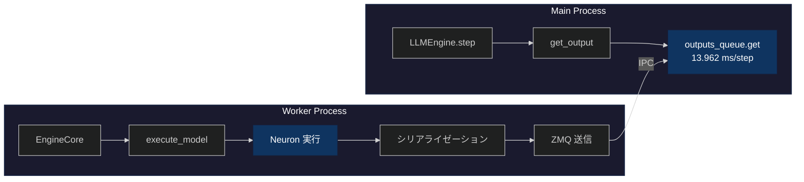

## はじめに

[前回の記事](https://zenn.dev/tosshi/articles/d68bd091d1934d) ではプロファイリングツールの開発にほぼ趣味で集中していましたが、今回は（真面目に） AWS Inferentia2 上で vllm-neuron を使用したパフォーマンスのプロファイリング分析にチャレンジします。

:::message
**記事の目的を明確にする**: 1. vllm-neuron のプロファイリングをやってみて知見を得る。2. 前回の測定結果で vllm-neuron では Bucketing ON の時に Prefix Caching を ON にするとレイテンシが悪化しました。その原因を知りたいです。
:::

https://zenn.dev/tosshi/articles/ef61e14fe73399

本記事では、上記の記事で得られた Bucketing と Prefix caching の設定による平均レイテンシの結果についてなぜそうなるのかを考察することが主な目的です。

:::message
**今回のプロファイリングの進め方は結果的にかなり間違っていました！** 色々試行錯誤したんだな、と思いながら本記事を読んでください。納豆の 10 倍くらい粘って測定結果に対する違和感を捨てずにいくつかの問題の解明に至った点は良かったと思います。**プロファイリングは粘り**だということを学びました。
:::

:::message alert
本記事は多分上級者向けのため LLM 推論の知識、vLLM の知識、AWS Neuron の知識があることが前提です。
:::

### 主要な発見

本記事のプロファイリングで得られた主要な知見は以下のとおりです。

1. **Bucketing は短いプロンプトで劇的に効く**: vLLM 経由で 76-89% のレイテンシ削減。NxD Inference の `--benchmark` フラグは常に `max_context_length` のダミー入力を生成するため、この効果を隠蔽する
2. **Prefix Caching + Bucketing ON でレイテンシが +45% 悪化**: 原因は (1) NxD Inference の KV cache メモリレイアウト変更（連続 → ブロック）と (2) vLLM Scheduler の Prefix Caching 管理処理オーバーヘッドの 2 つ。NxD Inference のアーキテクチャ制約により 2 要因の定量的な切り分けは不可能
3. **NxD Inference の `tensor_capture_hook` バグ（SDK 2.27.0）を発見**: `HuggingFaceGenerationAdapter` 経由で実プロンプトを渡すとクラッシュする

## Phase 1: AWS Neuron Profiler での試行錯誤

### 1.1 なぜプロファイリングから始めるのか

性能最適化を行う際、まず現状を把握することが重要です。ベンチマーク測定では性能の結果は分かりますが、性能の理由、ボトルネックの場所、そして改善の余地は分かりません。

以下に実験環境と設定情報をまとめておきます。以前の Zenn 記事の平均レイテンシー最適値からプロファイリングを開始します。

::::details 実験環境と設定情報

本調査で使用した実験環境と設定の詳細を記載します。

**ハードウェア環境**:
- インスタンスタイプ: `inf2.xlarge`

**ソフトウェアバージョン**:
- Neuron SDK: 2.27.0
- vLLM: 0.13.0（Neuron 対応版）
- neuronx-distributed-inference (NxD Inference): 0.7.0
- Python: 3.12

**モデルとデータ**:
- モデル: Qwen3-0.6B-Reranker
- プロンプト長:
  - Phase 1-3 初期測定: 97 トークン（固定長）
  - 追加調査: 18-125 トークン（可変長、16 プロンプト）
- タスク: Reranker（文書ランキング）
- バッチサイズ: 4

**vLLM 設定（過去の Zenn 記事の実験での最適値）**:
```yaml
vllm:
  tensor_parallel_size: 2           # 2 NeuronCore 使用
  max_num_seqs: 4                   # 同時処理数
  block_size: 32                    # KV cache block size
  max_model_len: 2048
  max_num_batched_tokens: 256
  num_gpu_blocks_override: 512
  enable_prefix_caching: false      # Phase 1-3 では無効
  dtype: "bfloat16"

  additional_config:
    override_neuron_config:
      skip_warmup: True
      enable_bucketing: true        # 動的バッチング有効
      pa_num_blocks: 512
      pa_block_size: 32
```

これらの設定は、[前回の Zenn 記事](https://zenn.dev/tosshi/articles/ef61e14fe73399) で最適化したパラメータを使用しています。

本調査では、この特定の設定における vllm-neuron のプロファイリングに焦点を当てています。異なるモデルサイズ、より大規模なバッチサイズでは、異なる性能特性を示す可能性があります。
::::

### 1.2 Perfetto トレースの基本分析

前回も少し紹介した Perfetto について紹介します。Perfetto トレースファイルは SQLite データベースとして扱えます。まず以下のような分析クエリを実行しました。

:::details Perfetto トレース分析コード

```python
from perfetto.trace_processor import TraceProcessor
tp = TraceProcessor(trace='profile_output/trace.perfetto-trace')

# Operation ごとの集計
sql = """
SELECT name, COUNT(*) as count,
       SUM(dur) / 1e9 as total_seconds,
       AVG(dur) / 1e9 as avg_seconds
FROM slice WHERE dur > 0
GROUP BY name ORDER BY total_seconds DESC LIMIT 10
"""
```

**結果の一部**:
```
                  name   count total_seconds avg_seconds
0              unknown  156427      0.038387         0.0
1               MATMUL   21582      0.010941    0.000001
2 custom_call.17_sg0002      36      0.007028    0.000195
3            LDWEIGHTS   21212      0.004914         0.0
```

**クエリの見方**:
`slice` テーブルには各オペレーションの実行記録が格納されています。このクエリは以下を取得します。
- `name`: オペレーション名（MATMUL など、Neuron コンパイラが生成した演算の種類）
- `count`: そのオペレーションが実行された回数
- `dur`: 各実行の継続時間（ナノ秒単位で記録されているため、1e9 で割って秒に変換）
- `total_seconds`: そのオペレーションの合計実行時間（秒単位）
- `avg_seconds`: 1 回あたりの平均実行時間（秒単位）
:::

結果として、まず、`custom_call.17_sg0002` という操作がたった 36 回の実行で 7ms も消費していることが判明しました。次に、MATMUL と LDWEIGHTS がほぼ同じ回数実行されています。さらに、`unknown` という分類の操作が 38ms で最大の時間を消費していました。

`custom_call.17_sg0002`。。。何ですかねこれは。。

:::details [発展的内容] NEFF による custom_call の調査

**疑問**: `custom_call.17_sg0002` とは何か？RoPE？活性化関数？何らかのカスタムカーネル？

Perfetto トレースでは実行回数と時間しか分からないため、NEFF (Neuron Executable File Format) ファイルを [unpacking](https://awsdocs-neuron.readthedocs-hosted.com/en/latest/neuron-runtime/explore/work-with-neff-files.html) して静的な構造を調査しました。(unpack には `neuron-packager unpack` コマンドを利用しても良いです)

**NEFF から判明したこと**:

```bash
# NEFF ファイルを unpacking
$ dd if=neff_322059935237836.neff of=neff.tar.gz bs=1024 skip=1
$ tar -xzf neff.tar.gz

# tensor_map.json を確認
$ cat sg00/tensor_map.json | jq '.["custom_call.17_sg0002"]'
{
  "dtype": "float32",
  "sim_shape": [256, 1, 1],
  "kind": null,
  "is_const": false,
  "layer_name": "custom_call.17"
}
```

**分かること**:
- データ型: `float32`（精度重視の演算）
- テンソル形状: `[256, 1, 1]`（比較的小さい）
- サブグラフ: `sg0002`
- 動的に計算される中間テンソル
- `custom_call.14` ～ `17` の連続した演算シーケンス

**Qwen3 アーキテクチャから推測**:

形状 `[256, 1, 1]` と周辺の `dot` (MATMUL) 操作から、以下のような操作と推測
- **RoPE (Rotary Position Embedding)**: 位置エンコーディング計算
- **RMSNorm**: 正規化層の統計値計算
- **アテンション機構**: Softmax 前の中間計算

NEFF はコンパイル時の静的な情報（グラフ構造、テンソル形状、データ型）を含みますが、以下は判明しないようです。
- 具体的な演算ロジック
- 実行回数
- 実行時間
- 初回実行時の遅延

NEFF 分析からは、何が使われているかは分かりますが、どう動くかは Perfetto トレースで実行時に測定する必要があります。
:::

### 1.3 skip_warmup 設定の影響

試行錯誤しながら実行したクエリを全て紹介していると膨大になってしまうため割愛しますが custom_call が初回実行時に大きな遅延を起こしていることが分かったため、NxD Inference のパラメータである `skip_warmup=False` を試してみました。デフォルト値は `False` なのですが以前の実験の試行錯誤で `True` にしていました。このパラメータはモデルロード後に 1 回の forward 実行を行い、遅延初期化を完了させるというものです。
                                                                                                                  
| 設定 | 平均時間 |
|------|---------|
| Baseline (skip_warmup=True) | 2.992秒 |
| Warmup (skip_warmup=False) | 3.110秒 (+3.9%) |

ウォームアップすれば速くなると予想していましたが、実際には約 4% 遅くなりました。再度プロファイリングしてオペレーションの変化を確認してみましょう。

:::details Operation 数の変化

```
Baseline (skip_warmup=True):
  MATMUL: 21,582回, 10.94ms
  LDWEIGHTS: 21,212回, 4.91ms
  ACTIVATE: 4,702回, 1.65ms
  COPY: 83回, 0.03ms

Warmup (skip_warmup=False):
  MATMUL: 13,497回 (-37%), 2.64ms (-76%)
  LDWEIGHTS: 13,497回 (-36%), 1.17ms (-76%)
  ACTIVATE: 4,207回 (-11%), 2.94ms (+78%)
  COPY: 554回 (+567%), 1.01ms (+3,267%)
```
:::

`skip_warmup=False` で MATMUL/LDWEIGHTS の主要オペレーションは実行時間が 76% 減少したものの、ACTIVATE の実行時間が +78%、COPY の実行時間が +3,267% 増加し、トータルでは遅くなりました。


### 1.4 Neuron Profiler の測定範囲の限界

:::message alert
**ここで重要な気づき**：Neuron Profiler のトレース時間は 16-17ms なのに、ベンチマーク全体は約 3 秒かかっている。**この 16-17ms ってどこからどこまでのなんの値？**
:::

涙の調査の結果、Neuron Profiler の測定範囲に関する重要な特性が判明しました。Neuron Profiler は実行時に NTFF (Neuron Trace File Format) という中間ファイルを生成し、それを Perfetto トレースに変換します。各 NTFF ファイルは 1 つのコンパイル済みグラフの実行記録を表しており、異なるバッチサイズや sequence length 用の複数グラフが存在します。そのためこれだけを見れば NeuronCore のトータルの実行時間が確実にわかるというものではありません。

```bash
$ find profile_output -name "*.ntff" | wc -l
22  # 11種類のグラフ × 2コア(tensor_parallel_size=2)

# NTFF は Perfetto に変換される
$ ls profile_output/trace.perfetto-trace
trace.perfetto-trace  # これを TraceProcessor や Perfetto UI で分析
```

:::message alert
**今回の過ちからの学び**: Neuron Profiler はハードウェアレベルの分析には有用だが、vllm-neuron 全体の最適化において初手で使うものではない。
:::

カスタムカーネルを実装するようなケースでは Neuron Profiler は必須と言えますが、最適な設定を探す際の初手で実施する必要があるものではありませんでした。そしてハードウェアレベルの改善をする前に vllm-neuron 全体の実行時間の内のどの程度をハードウェア側の推論処理が占めているのかによって改善の優先度が変わってくるので vllm-neuron 全体のプロファイリングをしないと意味ないぞ、と思いました。。とはいえ、今回得た Neuron Profiler に関する知見は有用なためシェアの意味を込めて Phase 1 を消さずにそのまま公開します。

### 1.5 NEFF、Perfetto とは

Phase 1 で登場したプロファイリングファイルについて整理します。

:::message
NEFF（コンパイル時） → NTFF（プロファイリング実行時の中間ファイル） → **Perfetto トレース**（分析に使用）
:::

#### NEFF (Neuron Executable File Format)

[参考: Work with NEFF Files](https://awsdocs-neuron.readthedocs-hosted.com/en/latest/neuron-runtime/explore/work-with-neff-files.html)

**役割**: コンパイル済みグラフの実行ファイル

```bash
# NEFF の構造
neff_322059935237836.neff (801KB)
├── [1024 byte header]
└── [tar.gz archive]
    ├── info.json              # コンパイル情報
    ├── hlo_stats.json         # 演算統計（HloMacCount: 29.2B など）
    ├── metrics.json           # 推定レイテンシ
    ├── neff.json              # グラフ定義（373 ノード）
    └── sg00/                  # サブグラフ 0
        ├── tensor_map.json    # テンソル情報（458 テンソル）
        ├── PE.bin             # Processing Element 命令
        ├── Activation.bin     # 活性化関数命令
        ├── DVE.bin            # Data Vector Engine 命令
        └── debug_info_*.dbg   # デバッグ情報
```

::::details NEFF ファイルと bucketing の関係

**NEFF (Neuron Executable File Format)** は、AWS NeuronCore 上で実行されるコンパイル済みグラフの実行ファイルです。bucketing を有効にすると、複数の (batch_size, sequence_length) の組み合わせに対応する複数のグラフが事前にコンパイルされます。

```bash
# NEFF ファイルの分析
$ find profile_output -name "*.neff" | wc -l
77  # 複数の PID から 11 種類のグラフ × 複数回コンパイル

$ ls -lh profile_output/*/neff_*.neff | awk '{print $5}' | sort -u
801K   # Graph 1: 最小バケット
881K   # Graph 2
991K   # Graph 3
1.1M   # Graph 4
1.3M   # Graph 5
2.1M   # Graph 6
2.3M   # Graph 7
2.4M   # Graph 8
2.6M   # Graph 9
3.0M   # Graph 10
       # (合計 11 種類、124 MB)
```

bucketing を有効にする場合、複数のサイズのグラフを事前コンパイルしておき、それらをロードして推論に利用します。実行時に入力サイズに応じた最適グラフを選択することから、グラフ選択のオーバーヘッドなどが発生します。固定長ワークロードの場合、実際に使用するのは複数グラフのうち 1 つだけであり、特に bucketing の恩恵を受けることなくオーバーヘッドが追加されると思われます。一般的な LLM の生成のような可変長ワークロードの場合は異なる長さのプロンプトが複数グラフに分散されるので再コンパイルすることなく効率的なバッチングが可能なためオーバーヘッドを差し引いても高速化に貢献すると思われます。

:::message
**このようにワークロードによって bucketing の性能は ON/OFF でどちらが良いか変動する可能性があることを覚えておいてください！**
:::
::::

#### NTFF (Neuron Trace File Format) - 中間ファイル

**役割**: Perfetto トレースに変換される前の中間ファイル

```bash
# NTFF ファイルの例（Neuron Profiler が生成）
profile_output/i-0049acfde6046f237_pid_520024/
├── 322059935237836_instid_0_vnc_0.ntff  # Graph 1, Core 0
├── 322059935237836_instid_0_vnc_1.ntff  # Graph 1, Core 1
├── 729292360268366_instid_0_vnc_0.ntff  # Graph 4, Core 0
├── 729292360268366_instid_0_vnc_1.ntff  # Graph 4, Core 1
...
└── (22 files = 11 graphs × 2 cores)

# Neuron Profiler で Perfetto に変換
$ neuron-profile view --output-format perfetto profile_output
```

#### Perfetto トレース

**役割**: NeuronCore 上の低レベル実行トレース

```bash
# Perfetto トレース
trace.perfetto-trace (110 MB)
└── SQLite データベース
    ├── slice テーブル          # オペレーション実行記録
    │   └── MATMUL: 21,582回, 10.94ms
    │       COPY: 83回, 0.03ms
    │       custom_call.17: 36回, 7ms
    ├── thread テーブル         # スレッド情報
    └── process テーブル        # プロセス情報
```

::::details NEFF と Perfetto の比較

以下はまだ完全には整理しきれていないため参考程度に確認してください。

| 情報 | NEFF | Perfetto | 備考 |
|------|------|----------|------|
| **静的構造** | | | |
| グラフ構造（ノード、テンソル数） | ✅ | ❌ | |
| テンソル形状・データ型 | ✅ | ❌ | |
| 演算量（理論値） | ✅ | ❌ | |
| メモリ使用量（理論値） | ✅ | ❌ | |
| DMA キュー構成 | ✅ | ❌ | |
| **グラフレベル実行** | | | |
| グラフごとの実行時間 | ❌ | ⚠️ | |
| NeuronCore ごとの内訳 | ❌ | ⚠️ | |
| 使用されたグラフの識別 | ❌ | ⚠️ | |
| グラフ間の遷移時間 | ❌ | ⚠️ | タイムスタンプから推定 |
| **オペレーションレベル実行** | | | |
| 実行時間（実測値） | ❌ | ✅ | slice.dur |
| 実行回数 | ❌ | ✅ | COUNT(*) |
| オペレーション詳細（MATMUL、COPY など） | ❌ | ✅ | slice.name |
| タイムスタンプと実行順序 | ❌ | ✅ | slice.ts |
| 並列実行の可視化 | ❌ | ✅ | Perfetto UI |
| 初期化遅延（skip_warmup 効果） | ❌ | ✅ | 初回実行時間の比較 |
| **高レベル情報** | | | |
| Python レイヤーオーバーヘッド | ❌ | ❌ | line_profiler などが必要 |
| 演算内容の意味（RoPE、RMSNorm など） | ⚠️ | ❌ | 形状から推測のみ |

**凡例**: ✅ 直接取得可能、⚠️ 推測・計算が必要、❌ 取得不可能
::::

## Phase 2: line_profiler による Python プロファイリング

Phase 1 では Neuron Profiler により NeuronCore レベルの詳細な分析を行いましたが、Python レベルのオーバーヘッド（トークナイゼーション、データ準備など）の測定には別のツールが必要です。そこで line_profiler を使用して Python コードの行ごとの実行時間を測定します。

### 測定スクリプトの準備

Phase 1 で使用した `test_reranker.py` は pytest + benchmark_capture デコレーターを使用していますが、line_profiler と組み合わせると出力が複雑になります。そこで、line_profiler 専用のシンプルなスクリプト `profile_line.py` を作成しました。（この辺りも vllm-neuron の Python プロファイリングのためにうまく取れるように今後 benchmark_capture の実装を改善します）

::::details スクリプトの構造

```python:profile_line.py
try:
    profile
except NameError:
    def profile(func):
        return func

# config.yaml から設定を読み込み（test_reranker.py と同じ）
config_path = Path(__file__).parent / 'config.yaml'
with open(config_path, 'r') as f:
    config = yaml.safe_load(f)

# 測定対象の関数に @profile デコレーターを追加
@profile
def build_prompts_for_vllm(pairs, tokenizer, prefix_tokens, suffix_tokens):
    """トークン化とプロンプト構築"""
    # ... (test_reranker.py と同じロジック)

@profile
def run_reranker(llm, tokenizer, token_true_id, token_false_id,
                 prefix_tokens, suffix_tokens):
    """リランカーのメイン処理"""
    # ... (test_reranker.py と同じロジック)

def main():
    """メイン関数（pytest 非依存）"""
    llm = vllm.LLM(model=model_path, **vllm_config)
    # ... 初期化とプロファイリング実行

if __name__ == "__main__":
    main()
```

::::

これにより、**Phase 1 と同じ測定条件**（同じ config.yaml、同じ処理ロジック）を維持しながら、line_profiler による詳細な Python レベルの分析が可能になります。

### 2.1 測定対象の理解

**測定対象**: 1 クエリ（20 候補文書のリランキング）を処理する時間

```yaml
reranker:
  search_num: 20        # 1 クエリあたり 20 候補文書
  batch_size: 8         # 8 ペアずつバッチ処理

vllm:
  max_num_seqs: 4       # vLLM の同時処理数
```

```
1  クエリ = 20 ペア ÷ batch_size=8 = 3 バッチ
10 クエリ = 30 バッチ
合計時間 = 2,992ms → 1 クエリあたり約 300ms
```

### 2.2 line_profiler 測定結果

::::details line_profiler の実行

**実行環境の準備**:

```bash
# vLLM-Neuron 環境をアクティベート
source /opt/aws_neuronx_venv_pytorch_inference_vllm_0_13/bin/activate

# PATH に Neuron SDK のツールを追加
export PATH="/opt/aws_neuronx_venv_pytorch_inference_vllm_0_13/bin:$PATH"

# line_profiler がインストールされていない場合
pip install line-profiler
```

**プロファイリング実行**:

```bash
cd /path/to/my-reranker
kernprof -l -v -p vllm.v1.engine profile_line.py
```

:::message
**kernprof オプション説明**:
- `-l` (--line-by-line): 行ごとのプロファイリングを有効化
- `-v` (--view): 結果を即座に表示
- `-p vllm.v1.engine` (--prof-mod): **vllm.v1.engine モジュールを自動プロファイリング対象に指定**（このモジュール内の全関数を自動的にプロファイリング）
:::

実行後、`profile_line.py.lprof` ファイルが生成され、コンソールに詳細な行ごとの実行時間が表示されます。
::::

以下に実際に line_profiler の結果から得られた情報を示します。

```python
# llm.generate() - 30 バッチ処理
Line 157: outputs = llm.generate(batch_prompts, sampling_params)
  - Hits: 30 batches
  - Time: 3781.560 ms (3.78 秒)
  - Per Hit: 126.052 ms/batch
  - % Time: 99.1%

# LLMEngine.step() の内訳
Line 293: outputs = self.engine_core.get_output()
  - Hits: 229 steps (7.6 steps/batch)
  - Time: 3197.372 ms
  - Per Hit: 13.962 ms/step
  - % Time: 95.3%
```

line_profiler による測定の結果、10 クエリ（30 バッチ）の処理に合計 3.78 秒かかり、そのうち `llm.generate()` の呼び出しだけで **99.1%（3.78 秒）** を占めることが判明しました。約 3 秒から時間が増えているのはプロファイリングのオーバーヘッドです。

さらに重要な発見として、**1 バッチあたりの処理時間が 126.052ms** という測定値が得られました。ただし、この値は **プロファイリングオーバーヘッドを含む** ため、Phase 3 で純粋なベンチマーク測定を別途実施します。また、vLLM の内部処理を見ると、`LLMEngine.step()` が 229 回呼ばれており、30 バッチに対して **平均 7.6 steps/batch** という謎の値が観測されました。なぜ 1 バッチの処理に 7.6 回ものステップが必要なのか、この時点では理解できていませんでした。

### 2.3 7.6 steps/batch の理由を追う

この数値を解明するため、`LLMEngine.step()` の中身をさらに詳しく調べました。line_profiler の `-p vllm.v1.engine` オプションにより、vLLM 内部のコードも自動プロファイリングされています。

`LLMEngine.step()` の処理時間のほぼ全て（95.3%）が `engine_core.get_output()` という単一の関数呼び出しで費やされていました。さらにその `get_output()` 関数の中身を見ると、**100% が `outputs_queue.get()` というキューからのデータ取得処理**でした。

```python
# LLMEngine.step() の中身
Line 293: outputs = self.engine_core.get_output()
  - Time: 3197.372 ms (95.3% of step())

# get_output() の中身
Line 715: outputs = self.outputs_queue.get()
  - Time: 3194.6 ms
  - % Time: 100.0% of get_output()
```

つまり、メインプロセスは `outputs_queue.get()` でキューから結果が送られてくるのをただ**待っているだけ**でした。これは実際の推論処理が別プロセスで行われていることを意味します。ここで vLLM v1 のマルチプロセスアーキテクチャの存在を思い出しました。

（以下の記事に内部アーキテクチャの解説があります）

https://zenn.dev/tosshi/articles/f64ba0b86e330b

vLLM v1 では、リクエストを受け取るメインプロセスと、実際に推論を実行する Worker プロセスが分離されています。メインプロセスは `llm.generate()` を呼び出すと、リクエストを Worker プロセスに送信し、`outputs_queue.get()` でブロックして結果を待ちます。一方、Worker プロセスは NeuronCore での推論実行、結果のシリアライゼーション、そしてプロセス間通信を通じてメインプロセスに結果を返します。この構造を図示すると以下のようになります。

**vLLM v1 のマルチプロセスアーキテクチャ (vllm-neuron)**



line_profiler は Python の標準的なプロファイラと同様に、**実行中のプロセスのコードしか測定できません**。つまり、Worker プロセスで実行される `execute_model()` や NeuronCore での推論処理は、メインプロセスから見るとブラックボックスです。

測定できたのは `outputs_queue.get()` で待機している時間（13.962ms/step）だけであり、この時間には推論、IPC オーバーヘッドなどのすべての時間が含まれています。

では、なぜ 1 バッチの処理に平均 7.6 回も `step()` が呼ばれるのでしょうか。これは vLLM v1 のイベントループの動作方法としてメインプロセスが何度も `step()` を確認してキューをチェックし続けているからです。1 バッチあたり平均して 7.6 回キューをチェックしていたということです。

:::message
コード上は [`SyncMPClient`](https://github.com/vllm-project/vllm/blob/v0.13.0/vllm/v1/engine/core_client.py#L710-L714) の `get_output()` が `outputs_queue.get()` でブロックし、Worker 側の `EngineCore` が ZMQ ソケット経由で結果を送信します。Worker は 1 バッチを複数の Scheduler ステップに分割して処理するため、step() の呼び出し回数がバッチ数より多くなります。
:::

謎は解けましたが、肝心の **Worker プロセス内での NeuronCore の推論処理時間**を分解することはできません。`outputs_queue.get()` の 13.962 ms には、推論実行、シリアライゼーション、IPC 通信のすべてが含まれており、line_profiler ではこれ以上分解をするのは難しそうです。

:::message alert
**今回の過ちからの学び**: line_profiler ではマルチプロセスのプロファイリングに限界があるため、フレームワークのアーキテクチャを理解した上で欲しい情報を取得できるプロファイリングツールを選定した方が良い。py-spy は Worker 側のプロファイリングまで実施できます。
:::

### 2.4 測定の限界と今後の方向性

line_profiler による測定で判明したことを整理すると、以下のような構造になります。全体として 126.052 ms/batch という処理時間（プロファイリングオーバーヘッド込み）は測定できましたが、その内訳の大部分（84.2%）の詳細が不明という状況です。

この状況を打開するため、プロファイリングオーバーヘッドを含まない純粋なベンチマーク測定と、NxD Inference を直接使った測定を試みました。

## Phase 3: NxD Inference 測定

Worker プロセスの直接測定が困難なため、**vLLM を使わずに NxD Inference を直接使用**して純粋な推論実行時間も測定することにしました。また、Bucketing と Prefix Caching の全組み合わせを測定しました。

:::message alert
**Phase 1-2 との測定方法の違いについて:**

Phase 1-2 では主にプロファイリング手法の検証に焦点を当てており、定量的な性能値の測定精度は Phase 3 が最も高くなっています。

- **Phase 1**: Neuron Profiler による試行錯誤（ハードウェアレベル）
- **Phase 2**: line_profiler 分析（プロファイリングオーバーヘッド込み、126.052 ms/batch）
- **Phase 3**: 純粋なベンチマーク測定（オーバーヘッド軽微、統一条件）

Phase 3 では全パターンで以下の条件を統一しています。
- 測定イテレーション: 100 回（ウォームアップ 3 回後）
- 統一 vLLM 設定（max_num_batched_tokens=256, num_gpu_blocks_override=512）
- 同一のプロンプトとバッチサイズ

Phase 1-2 の実験結果は「プロファイリング手法の有用性検証」として参照してください。**定量的な性能比較には Phase 3 の結果を使用します。**
:::

### 3.0 測定結果サマリー（全 16 パターン）

以下の表は、NxD Inference と vllm-neuron の両方で、Bucketing ON/OFF、Prefix Caching ON/OFF、固定長（97 トークン）/ 可変長（81-126 トークン）、の全組み合わせです。（前回の記事とイテレーション条件を変えているので結果のレイテンシも変わっていることに注意）

| No | 環境 | Bucketing | Prefix Caching | ワークロード | 平均レイテンシ (ms) | Bucketing効果 |
|----|---------|-----------|----------------|------------|-------------------|-------------|
| |
| 01 | NxD | OFF | OFF | 固定長 | **196.56** | - |
| 02 | NxD | ON | OFF | 固定長 | **188.97** | -3.9% |
| 03 | NxD | OFF | ON | 固定長 | - | - |
| 04 | NxD | ON | ON | 固定長 | - | - |
| 09 | vLLM | OFF | OFF | 固定長 | **252.42** | - |
| 10 | vLLM | ON | OFF | 固定長 | **59.23** | -76.5% |
| 11 | vLLM | OFF | ON | 固定長 | **237.54** | - |
| 12 | vLLM | ON | ON | 固定長 | **85.92** | - |
| |
| 05 | NxD | OFF | OFF | 可変長 | **194.73** | - |
| 06 | NxD | ON | OFF | 可変長 | **20.42** | **-89.5%** |
| 07 | NxD | OFF | ON | 可変長 | - | - |
| 08 | NxD | ON | ON | 可変長 | - | - |
| 13 | vLLM | OFF | OFF | 可変長 | **254.80** | - |
| 14 | vLLM | ON | OFF | 可変長 | **60.62** | **-76.2%** |
| 15 | vLLM | OFF | ON | 可変長 | **239.24** | - |
| 16 | vLLM | ON | ON | 可変長 | **85.28** | **-64.4%** |

```mermaid
---
config:
  theme: dark
---
xychart-beta
    title "vLLM 平均レイテンシ比較 (ms)"
    x-axis ["B:OFF PC:OFF", "B:OFF PC:ON", "B:ON PC:OFF", "B:ON PC:ON"]
    y-axis "平均レイテンシ (ms)" 0 --> 280
    bar "固定長" [252.42, 237.54, 59.23, 85.92]
    bar "可変長" [254.80, 239.24, 60.62, 85.28]
```



Bucketing ON で大幅にレイテンシが改善する一方、**Bucketing ON + Prefix Caching ON** では Prefix Caching OFF より悪化していることがわかります。以下で各設定の効果を分析します。

### 3.1 Bucketing の効果

#### Bucketing OFF 時の挙動

| No | 環境 | Bucketing | Prefix Caching | ワークロード | 平均レイテンシ (ms) | Bucketing効果 |
|----|------|-----------|----------------|------------|-------------------|---------------|
| |
| 01 | NxD | OFF | OFF | 固定長 | **196.56** | - |
| 09 | vLLM | OFF | OFF | 固定長 | **252.42** | - |
| |
| 05 | NxD | OFF | OFF | 可変長 | **194.73** | -0.9% |
| 13 | vLLM | OFF | OFF | 可変長 | **254.80** | - |

まず第一にわかりやすく考察できる点から確認します。No.01 と No.05、No.09 と No.13 を見てみると、NxD/vLLM、固定長/可変長によらず `Bucketing=OFF` の場合は結果はほぼ変わりません。OFF の場合は単一の NEFF が生成され、NeuronCore が常に同じ NEFF を使用するためワークロードが固定であろうと可変であろうとほぼ同じ結果になります。

:::message
NxD（約 196ms）と vLLM（約 252ms）の差（+56ms）は、vLLM の Scheduler 処理、IPC 通信（ZMQ）、シリアライゼーションなどのオーバーヘッドによるものと考えられます。
:::

#### NxD と vLLM の Bucketing 挙動の違い

| No | 環境 | Bucketing | Prefix Caching | ワークロード | 平均レイテンシ (ms) | Bucketing効果 |
|----|------|-----------|----------------|------------|-------------------|---------------|
| |
| 01 | NxD | OFF | OFF | 固定長 | **196.56** | - |
| 02 | NxD | ON | OFF | 固定長 | **188.97** | -3.9% |
| 09 | vLLM | OFF | OFF | 固定長 | **252.42** | - |
| 10 | vLLM | ON | OFF | 固定長 | **59.23** | -76.5% |

次に固定長において Bucketing を有効にした場合の違いを見てみましょう。No.01 と No.02 が **Bucketing を有効にした場合でもほぼ結果に差がない**にも関わらず、No.09 と No.10 では固定長にも関わらず大幅なレイテンシ削減を果たしています。これはなぜでしょうか？

端的に No.01 と No.02 の結果に差がなかった理由は、`--benchmark` という NxD Inference で与える引数の実装上の非明示的な制約によるものでした。

::::details No.01 と No.02 の平均レイテンシに差がなかった理由

:::message alert
端的に結論を述べると、`--benchmark` フラグの実装により常に `max_context_length`（2048 トークン）のダミー入力が生成されていたため、Bucketing ON でも Bucketing OFF でも同じ 2048 トークンバケットが選択されていました。
:::

## `--benchmark` フラグの実装

neuronx-distributed-inference ライブラリの `benchmark.py` において、以下のコードが問題でした。

```python
def get_sample_inputs(model_type, config: InferenceConfig, sampling_params, image=False):
    max_context_length = neuron_config.max_context_length
    input_length = max_context_length  # 常に 2048 トークン
```

https://github.com/aws-neuron/neuronx-distributed-inference/blob/v0.7.14366/src/neuronx_distributed_inference/utils/benchmark.py#L206-L217

この実装により、`--benchmark` フラグを使用した測定では実際のプロンプト長（本調査では 94 トークン）に関わらず常に 2048 トークンのダミー入力が生成されていました。

## Bucketing のバケット選択メカニズム

Bucketing が有効な場合、`model_wrapper.py` に実装されている `get_target_bucket()` メソッドが実行されます。

https://github.com/aws-neuron/neuronx-distributed-inference/blob/v0.7.14366/src/neuronx_distributed_inference/models/model_wrapper.py#L1015-L1037

この first_fit 戦略では、入力長より大きい最初のバケットを選択します。しかし 2048 トークンの入力に対しては、最大バケット（2048 トークン）が選択されます。

## No.01 と No.02 で同じ結果になった理由

```
No.01 (Bucketing OFF):
  → 単一の 2048 トークンバケット使用
  → パディング量: 2048 - 2048 = 0 トークン
  → 平均レイテンシ: 196.56 ms

No.02 (Bucketing ON):
  → ダミー入力: 2048 トークン
  → get_target_bucket(2048) → 2048 トークンバケット選択
  → パディング量: 2048 - 2048 = 0 トークン
  → 平均レイテンシ: 188.97 ms（ほぼ同じ）
```

両者とも同じ 2048 トークンバケットを使用していたため、Bucketing の効果が現れませんでした。約 3.9% の差は測定誤差の範囲と考えられます。

## 実際のプロンプト（94 トークン）での測定結果

この問題を発見した後、`--benchmark` フラグを使わず実際の 94 トークンのプロンプトで再測定を実施しました。

```
No.01 (Bucketing OFF, 実プロンプト):
  → 2048 トークンバケット使用
  → パディング量: 2048 - 94 = 1954 トークン
  → 平均レイテンシ: 211.29 ms

No.02 (Bucketing ON, 実プロンプト):
  → get_target_bucket(94) → 128 トークンバケット選択
  → パディング量: 128 - 94 = 34 トークン
  → 平均レイテンシ: 13.36 ms
  → 改善率: 93.7%（15.8 倍高速化）
```

実際のプロンプトを使用した場合、Bucketing ON では 128 トークンバケットが選択され、**93.7% の改善**という劇的な性能向上が確認されました。パディング量が 1954 トークンから 34 トークンに削減されたこと（57 倍の削減）が、この大幅な性能向上の主要因です。

:::message
vLLM 経由の場合も同様のメカニズムです。vLLM の model runner は `input_tokens` を実際のシーケンス長（97 トークン）までしかパディングしませんが、Bucketing OFF では NxD Inference が `max_context_length`（2048）用の単一 NEFF しか持たないため、NxD Inference 内部で 2048 トークンにパディングされて実行されます。
:::

## `--benchmark` フラグの設計意図と限界

:::message alert
**知見**: `--benchmark` フラグは一定の入力長でのスループットやレイテンシを測定する用途を想定して設計されており、動的な入力長に対する性能評価には適していません。Bucketing のように入力長に応じて動的に最適化が行われる機能を評価する場合は、実際のプロンプトを用いた測定が必須となります。
:::

::::


::::details NxD Inference のライブラリ問題の発見と修正

`--benchmark` を外して実際のプロンプトでの測定を試みた際に、Neuron SDK 2.27.0 で導入された tensor_replacement 機能に関連する実装バグを発見しました。

## 発見されたバグ

[`hf_adapter.py`](https://github.com/aws-neuron/neuronx-distributed-inference/blob/v0.7.14366/src/neuronx_distributed_inference/utils/hf_adapter.py#L289-L300) において、以下のエラーが発生しました。

```
TypeError: NeuronBaseForCausalLM.forward() got an unexpected keyword argument 'tensor_capture_hook'
```

## バグの詳細

`hf_adapter.py` で `tensor_capture_hook` 値が、`model_inputs` 辞書に追加されます。

https://github.com/aws-neuron/neuronx-distributed-inference/blob/v0.7.14366/src/neuronx_distributed_inference/utils/hf_adapter.py#L289-L300

しかし `model_base.py` で定義されている `NeuronBaseForCausalLM.forward()` メソッドは `tensor_capture_hook` パラメータを受け付けません。

https://github.com/aws-neuron/neuronx-distributed-inference/blob/v0.7.14366/src/neuronx_distributed_inference/models/model_base.py#L3373-L3397

## バグの原因

**`tensor_capture_hook` は**モデルの中間層の出力を記録するためのコールバック関数です。主にデバッグや精度検証で使用されます。**`forward()` メソッドは** PyTorch モデルが持つ「1 回の計算」を実行するメソッドです。

SDK 2.27.0 では、`tensor_capture_hook` を誤って `forward()` に渡してしまったため、パラメータが存在しないというエラーが発生していました。

## 暫定修正

`hf_adapter.py` の `"tensor_capture_hook": tensor_capture_hook` の行を削除することで、この問題を回避しました。

https://github.com/aws-neuron/neuronx-distributed-inference/blob/v0.7.14366/src/neuronx_distributed_inference/utils/hf_adapter.py#L289-L300

この修正により、SDK 2.27.0 の NxD Inference を直接使用する実プロンプト測定（No.5, No.6）が可能になりました。

## バグの影響範囲

**影響を受けるケース:**
- NxD Inference 0.7.0（SDK 2.27.0）の `HuggingFaceGenerationAdapter` を使用
- `--benchmark` フラグを使わず実プロンプトを `generate()` に渡す
- 該当: No.5, No.6

**影響を受けないケース:**

1. **No.1, No.2**: `--benchmark` フラグ使用
2. **No.9-16 (vLLM)**: vllm-neuron は `HuggingFaceGenerationAdapter` を使用せず、[vLLM Plugin System](https://github.com/vllm-project/vllm-neuron) を通じて NxD Inference のモデルを直接制御 するのでバグのあるコードパスを通らない

vLLM の統合方法については、以下のドキュメントで説明されています。

> NxD Inference integrates with vLLM by using vLLM's Plugin System to extend the model execution components responsible for loading and invoking models within vLLM's LLMEngine
>
> 出典: [vLLM on Neuron - AWS Neuron Documentation](https://awsdocs-neuron.readthedocs-hosted.com/en/latest/libraries/nxd-inference/vllm/index.html)

vLLM は独自の model executor と worker を持っており、NxD Inference のモデルクラス（例: `NeuronQwen3ForCausalLM`）を直接ロードして `forward()` メソッドを呼び出します。`HuggingFaceGenerationAdapter` の `prepare_inputs_for_generation()` メソッドは経由しないため、299 行目のバグの影響を受けません。

## なぜ発見されなかったのか

1. **`--benchmark` フラグが問題を隠蔽**: ベンチマークモードではダミー入力を使用するため、このバグが顕在化しない
2. **vLLM は別の統合方法**: 最も一般的な使用方法（vLLM 経由）ではバグの影響を受けない
3. **HuggingFaceGenerationAdapter の使用頻度**: 直接 `HuggingFaceGenerationAdapter` を使うケースは限定的

今回の発見は、Bucketing の効果を実プロンプトで測定しようとした際の副産物です。今後、より詳細な調査を経て GitHub Issue として報告する予定です。
::::

最後に今回の問題だった `--benchmark` 引数を削除して再実行した結果は以下になりました。

| No | 環境 | Bucketing | Prefix Caching | ワークロード | 平均レイテンシ (ms) | Bucketing効果 |
|----|------|-----------|----------------|------------|-------------------|---------------|
| |
| 01 | NxD | OFF | OFF | 固定長 | **196.56** | - |
| 02 | NxD | ON | OFF | 固定長 | **188.97** | -3.9% |
| 02 | NxD | ON | OFF | 固定長 | **13.36 (再試)** | -93.7% |

:::message
Bucketing を ON にすることで平均レイテンシが下がる理由はここまで読んだ人にとってはすでに理解できていると思われますが、複数のバケットサイズから最適なサイズのバケットを選ぶことでパディングとそれによる無駄な計算を除外することができることに起因します。
:::

### 3.2 Prefix Caching の効果

測定結果サマリーを再掲します。

| No | 環境 | Bucketing | Prefix Caching | ワークロード | 平均レイテンシ (ms) | Prefix Caching効果 |
|----|------|-----------|----------------|------------|-------------------|-------------------|
| |
| 09 | vLLM | OFF | OFF | 固定長 | **252.42** | - |
| 11 | vLLM | OFF | ON | 固定長 | **237.54** | -5.9% |
| |
| 10 | vLLM | ON | OFF | 固定長 | **59.23** | - |
| 12 | vLLM | ON | ON | 固定長 | **85.92** | +45.0% |
| |
| 13 | vLLM | OFF | OFF | 可変長 | **254.80** | - |
| 15 | vLLM | OFF | ON | 可変長 | **239.24** | -6.1% |
| |
| 14 | vLLM | ON | OFF | 可変長 | **60.62** | - |
| 16 | vLLM | ON | ON | 可変長 | **85.28** | +40.7% |

#### NxD で Prefix Caching が測定できなかった理由

No.03, 04, 07, 08（NxD + Prefix Caching）の測定結果がすべて `-` になっていることがわかります。これは、**NxD Inference を直接 API 経由で使用する場合、Prefix Caching を使うための引数計算機能が未実装**のためです。

::::details NxD + Prefix Caching パターンで発生したエラーの詳細

## 実行時エラー

NxD Inference で Prefix Caching を有効にして測定を試みると、以下のエラーが発生します。

```python
TypeError: unsupported operand type(s) for -: 'NoneType' and 'NoneType'

File: neuronx_distributed_inference/models/model_base.py:3679
  num_queries = full_context_lens - computed_context_lens
```

## 根本原因

Prefix Caching が有効な場合、NxD Inference の `forward()` メソッドは以下の 2 つのパラメータを必要とします。

- `full_context_lens`: リクエスト全体のコンテキスト長（例: 94 tokens）
- `computed_context_lens`: すでにキャッシュ済みのプレフィックス長（例: 80 tokens）

```python
# neuronx_distributed_inference/models/model_base.py:3679
num_queries = full_context_lens - computed_context_lens
```

**問題点:**

`inference_demo.py` や `HuggingFaceGenerationAdapter` は、**これらのパラメータを計算・提供する機能を実装していません**。そのため、これらの API 経由で呼び出すと `None - None` の計算が実行されて TypeError になります。

:::message
NxD Inference のモデル自体は Prefix Caching をサポートしています。ユーザーが手動でこれらの引数を計算して渡せば動作します。vLLM はこのプロセスを自動化する Scheduler を実装しているため、"out of the box" で動作します。
:::

## アーキテクチャの違い

**vLLM 経由で NxD Inference を使用する場合（動作する）:**

```
vLLM Scheduler (full_context_lens, computed_context_lens を計算)
    ↓
vLLM Plugin System
    ↓
Neuron Config Override (prefix caching メタデータを渡す)
    ↓
NxD Inference (model_base.py:3679)
    ↓
✅ Prefix Caching 実装 (ハードウェアアクセラレーション)
```

**直接 NxD API を使用する場合（エラーになる）:**

```
inference_demo.py または HuggingFaceGenerationAdapter
    ↓
❌ 引数計算機能なし → コンテキスト長パラメータが None
    ↓
NxD Inference (model_base.py:3679)
    ↓
TypeError: None - None  ← ここで失敗
```

## SDK バージョンとサポート状況

| 実装方法 | サポート状況 | 詳細 |
|---|---|---|
| **NxD モデル (`forward()`)** | ✅ **サポート** | `full_context_lens`, `computed_context_lens` を受け取る実装あり |
| **vLLM 経由** | ✅ **サポート** | vLLM Scheduler が自動で引数を計算・提供 |
| **inference_demo.py** | ❌ **未実装** | 引数を計算・提供する機能なし（手動実装すれば動作可能） |
| **HuggingFaceGenerationAdapter** | ❌ **未実装** | 引数を計算・提供する機能なし（手動実装すれば動作可能） |

## 手動実装による回避策（理論上可能）

未実装の `HuggingFaceGenerationAdapter` なども引数を手動で計算すれば Prefix Caching を使用できます。

ただし、この方法には以下の課題があります。
1. キャッシュ管理（LRU、ハッシュテーブル）を自分で実装する必要がある
2. 複数リクエスト間でのキャッシュ共有ロジックが必要
3. バッチ処理時のキャッシュヒット判定が複雑

vLLM はこれらすべてを Scheduler で自動化しているため、実用的には vLLM 経由での利用が推奨されます。

## 関連ファイル

- vLLM 統合ドキュメント: [vLLM on Neuron - AWS Neuron Documentation](https://awsdocs-neuron.readthedocs-hosted.com/en/latest/libraries/nxd-inference/vllm/index.html)

::::

#### vLLM での Prefix Caching の効果

vLLM を使用した No.11, 12, 15, 16 では Prefix Caching が正常に動作しています。固定長か可変長かでそこまで差がないので今回はワークロードは特に気にせずに分析を進めます。

Bucketing が無効な場合、Prefix Caching の効果は軽微です（約 6% 改善）。これは、全プロンプトが 2048 トークンバケットを使用するため、キャッシュヒットによる KV キャッシュ再利用の効果が相対的に小さいためと考えられます。

興味深いことに、Bucketing が有効な場合、**Prefix Caching を有効にするとレイテンシが大幅に増加**します。この前回の記事でも全く意味がわからなかった予想外の結果について調査を行いました。

::::details Prefix Caching によるレイテンシ悪化の根本原因調査

## 初期観察: KV キャッシュ容量の激減

測定ログを分析した結果、Prefix Caching を有効にすると **KV キャッシュの実効容量が劇的に減少**していることが判明しました。

| パターン | Bucketing | Prefix Caching | KV キャッシュサイズ | Maximum Concurrency |
|---------|-----------|----------------|-------------------|---------------------|
| No.9 | OFF | OFF | **1,050,624 tokens** | **513.00x** |
| No.10 | ON | OFF | **1,050,624 tokens** | **513.00x** |
| No.11 | OFF | ON | **16,416 tokens** | **8.02x** |
| No.12 | ON | ON | **16,416 tokens** | **8.02x** |

Prefix Caching を有効にすると、KV キャッシュサイズが **64 倍も減少**しています。

### Maximum Concurrency の意味と計算方法

Maximum Concurrency は、vLLM がログに出力する **情報提供用のメトリクス** です。KV キャッシュの総容量と `max_model_len` から理論的な同時処理可能数を示しますが、Scheduler の制約としては使用されていません。

Scheduler が実際に使用する制約は `max_num_seqs`、`max_num_batched_tokens`、および KV cache block の空き状況の 3 つです（[`vllm/v1/core/sched/scheduler.py`](https://github.com/vllm-project/vllm/blob/v0.13.0/vllm/v1/core/sched/scheduler.py#L96-L99)）。

**計算式**（vLLM v0.13.0 の実装から）:

https://github.com/vllm-project/vllm/blob/v0.13.0/vllm/v1/core/kv_cache_utils.py#L778-L796

```python
Maximum Concurrency = num_blocks / num_block_per_request
                    ≈ (GPU KV cache size) / max_model_len
```

今回の測定での実際の値：

```python
# Prefix Caching OFF
Maximum Concurrency = 1,050,624 / 2,048 = 513.00x

# Prefix Caching ON
Maximum Concurrency = 16,416 / 2,048 = 8.02x
```

### 当初の仮説: Maximum Concurrency 制約が原因か？

今回の測定条件では：
- **バッチサイズ: 4**（4 つのプロンプトを同時に処理）
- Prefix Caching OFF: Maximum Concurrency = 513.00x（**128.2 倍の余裕**）
- Prefix Caching ON: Maximum Concurrency = 8.02x（**2.0 倍の余裕のみ**）

**仮説**: バッチサイズ 4 に対して 2.0 倍の余裕しかないため、KV cache block の空きが不足し並列処理が制限される。これがレイテンシ悪化（+26.69 ms, +45%）の主要因ではないか？

### なぜ KV キャッシュサイズが減少するのか（コードレベルの証明）

vLLM のソースコードから、この現象の根本原因を特定しました。

#### vLLM による KV キャッシュサイズの計算

**使用バージョン**: vLLM v0.13.0（コミット: `72506c98`）

ログに出力される "GPU KV cache size" は、以下のコードで計算されています。

**ファイル**: `vllm/v1/core/kv_cache_utils.py:1274-1291`

https://github.com/vllm-project/vllm/blob/v0.13.0/vllm/v1/core/kv_cache_utils.py#L1274-L1291

```python
# Log the KV cache size and maximum concurrency.
num_tokens = (
    kv_cache_config.num_blocks
    // len(kv_cache_config.kv_cache_groups)
    * min_block_size
)
# ... (省略)
num_tokens_str = f"{num_tokens:,}"
logger.info_once("GPU KV cache size: %s tokens", num_tokens_str, scope="local")
```

**計算式:**
```python
GPU KV cache size = (num_blocks / num_kv_cache_groups) × min_block_size
```

#### Maximum Concurrency の計算

"Maximum concurrency" は、以下のコードで計算されています。

**ファイル**: `vllm/v1/core/kv_cache_utils.py:1293-1302`

https://github.com/vllm-project/vllm/blob/v0.13.0/vllm/v1/core/kv_cache_utils.py#L1293-L1302

```python
max_model_len_str = f"{vllm_config.model_config.max_model_len:,}"
max_concurrency = get_max_concurrency_for_kv_cache_config(
    vllm_config, kv_cache_config
)
logger.info_once(
    "Maximum concurrency for %s tokens per request: %.2fx",
    max_model_len_str,
    max_concurrency,
    scope="local",
)
```

**計算関数**: `vllm/v1/core/kv_cache_utils.py:778-796`

https://github.com/vllm-project/vllm/blob/v0.13.0/vllm/v1/core/kv_cache_utils.py#L778-L796

```python
def get_max_concurrency_for_kv_cache_config(
    vllm_config: VllmConfig, kv_cache_config: KVCacheConfig
) -> float:
    # ... (省略)
    num_block_per_request = cdiv(max_memory_usage_per_request, memory_per_block)
    max_concurrency = kv_cache_config.num_blocks / num_block_per_request
    return max_concurrency
```

実質的に：
```python
Maximum Concurrency ≈ (GPU KV cache size) / max_model_len
```

#### Prefix Caching ON/OFF での違い（実測値）

**重要な発見**: 両方のケースで `num_blocks` は同じ値（513）ですが、vllm-neuron が内部で使用する **`block_size` の値が異なる**ことが判明しました。

この原因は [`vllm_neuron/platform.py`](https://github.com/vllm-project/vllm-neuron/blob/ed89ae8/vllm_neuron/platform.py#L275-L282) にある Neuron 固有の block_size 上書きロジックです。

```python
# vllm_neuron/platform.py（275-282 行）
if not vllm_config.cache_config.enable_prefix_caching:
    # Prefix Caching OFF: block_size を max_model_len に強制上書き
    vllm_config.cache_config.block_size = (
        vllm_config.model_config.max_model_len  # = 2048
    )
else:
    # Prefix Caching ON: ユーザー指定の block_size をそのまま使用
    assert vllm_config.cache_config.block_size is not None
```

GPU KV cache size のログ出力は `num_blocks × min_block_size` で計算されるため（`vllm/v1/core/kv_cache_utils.py:1274`）、`block_size` の違いがそのまま 64 倍の差として現れます。

測定ログから確認された実際の値：

| 設定 | block_size | num_blocks | GPU KV cache size（ログ出力） | Maximum Concurrency（ログ出力） |
|------|-----------|------------|-------------------------------|--------------------------------|
| Prefix Caching OFF | **2048**（上書き後） | 513 | 513 × 2048 = **1,050,624 tokens** | **513.00x** |
| Prefix Caching ON | **32**（ユーザー指定値） | 513 | 513 × 32 = **16,416 tokens** | **8.02x** |

**減少率**: GPU KV cache size が **64 倍減少**（2048 / 32 = 64）

つまり、64 倍の差は KV キャッシュの実メモリ量が減ったわけではなく、**block_size の違いによりログ上の報告値が変わっている**ことが本質です。Prefix Caching OFF では 1 ブロック = max_model_len（2048 トークン）の粗い粒度で管理するため、見かけ上の総トークン数が大きくなります。Prefix Caching ON では 1 ブロック = 32 トークンの細かい粒度で管理するため、同じブロック数でも報告されるトークン数は小さくなります。

## 仮説の検証: num_gpu_blocks_override を増やす実験

上記の仮説が正しければ、`num_gpu_blocks_override` を増やすことで Maximum Concurrency が改善し、レイテンシ悪化が解消されるはずです。

### 実験設定

**目的**: Maximum Concurrency を 2倍に増やして、並列処理能力を改善

**変更内容**:
```python
# 元の設定（No.12）
num_gpu_blocks_override = 512  # → Maximum Concurrency: 8.02x

# 最適化設定（No.12 optimized）
num_gpu_blocks_override = 1024  # → Maximum Concurrency: 16.02x (2倍)
```

### 実験結果

| No | Bucketing | Prefix Caching | num_gpu_blocks_override | GPU KV Cache Size | Maximum Concurrency | 平均レイテンシ (ms) | 改善率 |
|----|-----------|----------------|------------------------|-------------------|---------------------|-------------------|--------|
| 10 | ON | OFF | 512 | 1,050,624 tokens | 513.00x | **59.23** | - |
| 12 | ON | ON | 512 | 16,416 tokens | 8.02x | **85.92** | +45.0% |
| 12 (最適化) | ON | ON | **1024** | **32,800 tokens** | **16.02x** | **85.04** | **-1.0%** |

### 実験結果の分析

- GPU KV cache size: 16,416 → 32,800 tokens（**2倍に増加** ✓）
- Maximum Concurrency: 8.02x → 16.02x（**2倍に増加** ✓）
- 平均レイテンシ: 85.92 ms → 85.04 ms（**-1.0% の改善のみ**）

**結論**: Maximum Concurrency を 2倍に改善しても、**レイテンシはほとんど改善しない**ことが判明しました。にゃーん。。

:::message alert
**当初の仮説は誤り**: Maximum Concurrency の制約は、Prefix Caching によるレイテンシ悪化の主要因**ではない**ことが実験で証明されました。
:::

## 根本原因の候補: ソフトウェアオーバーヘッドとハードウェアレイアウト変更

Maximum Concurrency 仮説が否定されたことで、原因として **2 つの要因** が考えられます。

### 要因 1: NxD Inference の KV cache メモリレイアウト変更

コード分析の結果、Prefix Caching の ON/OFF で **NxD Inference 内部の KV cache メモリレイアウト** が切り替わることが判明しました。

[`vllm_neuron/worker/neuronx_distributed_model_loader.py`](https://github.com/vllm-project/vllm-neuron/blob/ed89ae8/vllm_neuron/worker/neuronx_distributed_model_loader.py#L782-L783) の `_get_default_neuron_config()` において以下の判定が行われます。

```python
is_block_kv_layout = enable_chunked_prefill or enable_prefix_caching
```

| 設定 | `is_block_kv_layout` | KV cache レイアウト | 管理クラス |
|------|---------------------|-------------------|-----------|
| Prefix Caching OFF | `False` | 連続: `(batch, heads, seq_len, head_dim)` | `KVCacheManager` |
| Prefix Caching ON | `True` | ブロック: `(num_blocks+1, block_size, heads, head_dim)` | `BlockKVCacheManager` |

NeuronCore 上でのメモリアクセスパターンが根本的に変わるため、ブロックレイアウトでの DMA 転送パターンの変化がレイテンシに影響している可能性があります。**この影響は NeuronCore 固有のものであり、GPU 環境では異なる結果になる可能性があります。**

### 要因 2: Prefix Caching の管理処理オーバーヘッド

Prefix Caching が有効な場合、vLLM の Scheduler 側で以下の追加処理が**リクエスト毎**に発生します。

#### 1. ブロックハッシュ計算

vLLM ではリクエスト受付時にトークン列のハッシュを計算してキャッシュヒットを判定します

[`hash_block_tokens()`](https://github.com/vllm-project/vllm/blob/v0.13.0/vllm/v1/core/kv_cache_utils.py#L525-L552) / [`get_request_block_hasher()`](https://github.com/vllm-project/vllm/blob/v0.13.0/vllm/v1/core/kv_cache_utils.py#L555-L606)

#### 2. ハッシュテーブル lookup・LRU キャッシュ管理

キャッシュヒット判定のためのテーブル検索、アクセス時刻の更新、エビクション判定が各ブロックで発生します。

#### 3. ブロック共有ロジック

参照カウント管理や Copy-on-Write 判定など、通常のブロック割り当てより複雑な処理が追加されます。

### オーバーヘッド内訳の推定（未検証）

:::message alert
以下の推定コストは **line_profiler 等で実測したものではなく、仮説に基づく概算** です。合計値が測定値と近いのは偶然の一致である可能性があります。要因 1（KV cache レイアウト変更）のハードウェア起因の影響も含まれている可能性があるため、各項目の正確な寄与度は不明です。NxD Inference のアーキテクチャ制約により、要因の定量的な切り分けは現時点では不可能です（後述）。
:::

| 処理 | 推定コスト (ms) | 説明 |
|------|----------------|------|
| **KV cache レイアウト変更**（要因 1） | **未測定** | NeuronCore のメモリアクセスパターン変化 |
| ブロックハッシュ計算（要因 2） | 未測定 | CPU bound、リクエスト毎に全ブロック |
| ハッシュテーブル lookup | 未測定 | 全ブロックで検索 |
| LRU キャッシュ管理 | 未測定 | アクセス更新・エビクション |
| 参照カウント・CoW | 未測定 | ブロック共有ロジック |
| **合計** | **+26.69 ms**（実測） | |

### Reranking ワークロードの特性と測定条件の影響

今回のベンチマークで使用した Reranking ワークロードは、長く共通の固定プロンプトと、短く毎回異なる多様なクエリの組み合わせで構成されています。Prefix Caching の観点では、プロンプト部分のブロックはリクエスト間で共通のためキャッシュヒットが期待できる一方、クエリ部分のブロックは毎回異なる内容であるため常にキャッシュミスとなります。つまり、キャッシュヒット率は部分的にしか得られません。

この構造がもたらす問題は、Prefix Caching に伴うオーバーヘッドがキャッシュヒットの有無に関わらず全ブロックに対して発生する点です。ハッシュ計算はプロンプトブロックとクエリブロックの両方で実行され、ハッシュテーブル lookup も全ブロックを対象とし、LRU 管理は全キャッシュエントリに対して行われます。加えて、NeuronCore 上では連続メモリレイアウトからブロックレイアウトへの切り替えにより DMA 転送パターンが変化するため、ハードウェアレベルでも潜在的なオーバーヘッドが発生します。

今回の測定では、固定長ワークロード（全く同じプロンプト 4 つを 100 回繰り返し）と可変長ワークロード（同じ 4 つの異なるプロンプトを 100 回繰り返し）の 2 パターンを実施しました。いずれも 2 回目以降は完全にキャッシュヒットするはずの理想的な条件です。それにも関わらずレイテンシが悪化したことから、Prefix Caching に伴うオーバーヘッド（ソフトウェア管理処理と NeuronCore の KV cache レイアウト変更の両方）がキャッシュヒットの恩恵を打ち消していると考えられます。

::::

Prefix Caching を有効にするとレイテンシが大幅に増加する理由についてはおおよその原因は絞り込めましたが完全ではありません。現時点の実装では計測が困難な点もあり一旦挫折しますが、知見と計測ツールのブラッシュアップを重ねていずれ原因特定に再チャレンジしたいとおもいます。無念。

## まとめ

:::message
**[再掲] 記事の目的を明確にする**: 1. vllm-neuron のプロファイリングをやってみて知見を得る。2. 前回の測定結果で vllm-neuron では Bucketing ON の時に Prefix Caching を ON にするとレイテンシが悪化しました。その原因を知りたいです。
:::

:::message alert
**記事冒頭の目的に対するアンサー**

**目的 1（プロファイリングの知見）**: AWS Neuron Profiler はハードウェアレベルの分析に有用だが vllm-neuron 全体の最適化の初手としては不適切であり、line_profiler はマルチプロセスアーキテクチャの壁に阻まれる。結局、デバッグログの分析とソースコードレベルの調査が最も原因特定に寄与した。
**目的 2（Bucketing ON + Prefix Caching ON でのレイテンシ悪化の原因）**: 原因は (1) NxD Inference の KV cache メモリレイアウトが連続からブロックに切り替わることによるハードウェアレベルの影響と、(2) vLLM Scheduler のハッシュ計算・lookup・LRU 管理といった Prefix Caching 管理処理オーバーヘッドの 2 つである。ただし NxD Inference のアーキテクチャ制約により 2 要因の定量的な切り分けは達成できなかった。
:::

本記事では、vllm-neuron のプロファイリングを通じて推論エンジンの仕組みや NxD Inference の仕組みに関する理解を深めました。AWS Neuron Profiler の使い所がわかってなかったので適当に使おうとしていましたが、実際には vllm-neuron のデバッグログ、py-spy のラインプロファイラ、デバッグ仕込んで動かす、などが一番原因特定に寄与しました。引き続きプロファイリング力をあげていきたいです。あと本当は統計的な信頼区間まで出すと良いと思いつつそんなことをしている余裕はなかったのでこの辺りも自作 OSS 側でうまく自動取得できるように改善していきたいです。今回はコードレベルで分析ができているので紆余曲折でぐちゃぐちゃのコードをこの記事に追加しません（したくありません）が今回の計測を楽にするようなより良い仕組みを今後ブログで共有していこうと思います。

### 知見の一覧

| Phase | タイトル | 知見 |
|-------|---------|------|
| 1 | Neuron Profiler は初手に不適 | vllm-neuron 全体のボトルネックが不明な段階でハードウェアレベルの分析を行っても改善の優先度を判断できない。Python レベルの全体像を先に把握すべき |
| 2 | line_profiler はマルチプロセスに限界あり | vLLM v1 は Main/Worker プロセスが分離しており、Main 側の line_profiler では Worker 内の推論処理（全体の 84.2%）が `outputs_queue.get()` の待ち時間としてしか見えない。py-spy なら Worker 側も測定可能 |
| 3 | `--benchmark` フラグが Bucketing 効果を隠蔽 | 常に `max_context_length`（2048 トークン）のダミー入力を生成するため、短いプロンプトでの Bucketing 効果（最大 93.7% 改善）が完全に見えなくなる。実プロンプトでの測定が必須 |
| 3 | Bucketing は短いプロンプトで劇的に効く | vLLM 経由で 76-89% のレイテンシ削減。パディング量の削減（2048 → 128 トークンバケット選択）が主要因。ただし固定長かつプロンプト長 ≈ `max_context_length` の場合は効果なし |
| 3 | `tensor_capture_hook` バグ（SDK 2.27.0） | `HuggingFaceGenerationAdapter` 経由で実プロンプトを渡すと `forward()` に不正な引数が渡されクラッシュする。`--benchmark` フラグ使用時と vLLM 経由では別コードパスを通るため顕在化しない |
| 3 | NxD 直接 API は Prefix Caching 未自動化 | `inference_demo.py` や `HuggingFaceGenerationAdapter` は `full_context_lens` / `computed_context_lens` の計算機能が未実装。vLLM Scheduler 経由でのみ自動動作する |
| 3 | Prefix Caching + Bucketing ON で +45% 悪化 | 原因は 2 つ: (1) NxD Inference の KV cache メモリレイアウトが連続からブロックに切り替わり NeuronCore の DMA 転送パターンが変化、(2) vLLM Scheduler の [`hash_block_tokens()`](https://github.com/vllm-project/vllm/blob/v0.13.0/vllm/v1/core/kv_cache_utils.py#L525-L552) 等によるハッシュ計算・lookup・LRU 管理が全ブロックで毎リクエスト発生。2 要因の分離は NxD の [`_validate_neuron_config()`](https://github.com/vllm-project/vllm-neuron/blob/ed89ae8/vllm_neuron/worker/neuronx_distributed_model_loader.py#L840-L846) が `is_block_kv_layout=True` に `prefix_caching=True` を強制するため不可能 |
| 3 | Maximum Concurrency はログ専用メトリクス | Scheduler の制約には使用されない。`num_gpu_blocks_override` を 2 倍にして Maximum Concurrency を 8x → 16x にしても改善は -1.0% のみ |
| 3 | `platform.py` の block_size 上書きに注意 | Prefix Caching OFF 時に `block_size` を `max_model_len` に[強制上書き](https://github.com/vllm-project/vllm-neuron/blob/ed89ae8/vllm_neuron/platform.py#L275-L282)するため、GPU KV cache size のログ値が ON/OFF で 64 倍異なる。実メモリ量は同一なのでログの数値に惑わされないこと |

### プロファイリングから学んだ教訓

| 教訓 | 詳細 |
|------|------|
| 複数手法を組み合わせる | Neuron Profiler（ハードウェア）+ line_profiler（Python）+ ベンチマーク測定（エンドツーエンド）の 3 層で初めて全体像が見える |
| 測定条件の隠れた制約に注意する | `--benchmark` フラグが 2048 トークン固定入力を生成し Bucketing の効果を隠蔽していた |
| 予想外の結果こそ深掘りする | Prefix Caching の悪化から `platform.py` の block_size 上書きや KV cache レイアウト変更を発見 |
| ソースコードレベルで検証する | ログやメトリクスの背後にある計算ロジックをソースコードから確認することで根本原因を正確に理解できる |
| 実データに近い条件で測定する | 合成データと実データではプロンプト長の分布やキャッシュヒット率が大きく異なり性能特性が変わる。Bucketing はプロンプト長とバケットサイズの差が効果に直結し、Prefix Caching はヒット率とオーバーヘッドのバランスがワークロードに依存する |