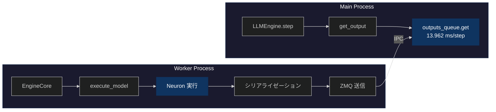
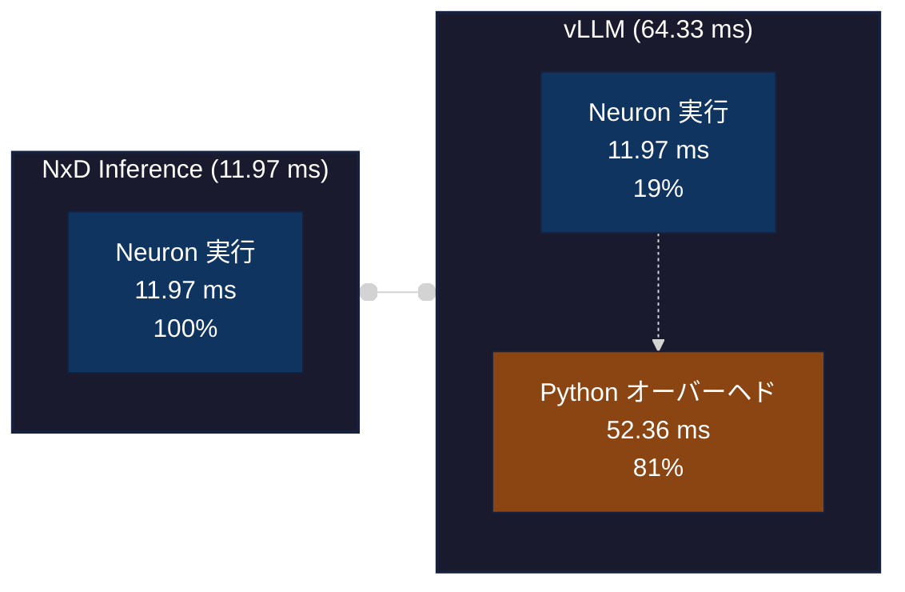
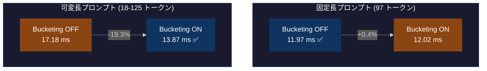

## はじめに

[前回の記事](https://zenn.dev/tosshi/articles/d68bd091d1934d) ではプロファイリングツールの開発にほぼ趣味で集中してしましたが、今回は（真面目に） AWS Inferentia2 上で vllm-neuron を使用したパフォーマンスのプロファイリング分析にチャレンジします。

本記事では、4 つの調査フェーズに分けて説明します。まず Phase 1 では AWS Neuron Profiler によるハードウェアレベルのプロファイリングを試行錯誤しました。次に Phase 2 では line_profiler による Python レベルのプロファイリングを実施しました。Phase 3 では NxD Inference を直接使用した測定を行い、vLLM との詳細比較を実施しました。最後に Phase 4 では vLLM の bucketing ON/OFF の内部動作を line_profiler で詳細に分析しました。

さらに、bucketing 設定の影響を正確に理解するため、固定長プロンプト（97トークン）と可変長プロンプト（18-125トークン）の両方で測定を実施しました。

最終的に、vllm-neuron、NeuronCore 側の処理の実行時間、bucketing 設定や prefix caching の挙動について理解を深めることができました。特に **bucketing の効果はフレームワークとワークロードに依存する** という知見がありました。Phase 4 の調査では、**vLLM Worker Process 内部に大きなオーバーヘッドが存在する**ことが判明しました。

:::message
**今回のプロファイリングの進め方は結果的にかなり間違っていました！** 色々試行錯誤したんだな、と思いながら本記事を読んでください。
:::

:::message alert
本記事は初学者向けではないためある程度 LLM 推論の基礎知識、vLLM の基礎知識、AWS Neuron の基礎知識があることが前提です。
:::

---

## Phase 1: AWS Neuron Profiler での試行錯誤

### 1.1 なぜプロファイリングから始めるのか

性能最適化を行う際、まず現状を把握することが重要です。ベンチマーク測定では性能の結果は分かりますが、性能の理由、ボトルネックの場所、そして改善の余地は分かりません。

以下に実験環境と設定情報をまとめておきます。以前の Zenn 記事の平均レイテンシー最適値からプロファイリングを開始します。

::::details 実験環境と設定情報

本調査で使用した実験環境と設定の詳細を記載します。

**ハードウェア環境**:
- インスタンスタイプ: `inf2.xlarge`

**ソフトウェアバージョン**:
- Neuron SDK: 2.27.x
- vLLM: 0.13.0（Neuron 対応版）
- neuronx-distributed-inference (NxD Inference): 0.7.0
- Python: 3.12

**モデルとデータ**:
- モデル: Qwen3-0.6B-Reranker
- プロンプト長:
  - Phase 1-3 初期測定: 97 トークン（固定長）
  - 追加調査: 18-125 トークン（可変長、16 プロンプト）
- タスク: Reranker（文書ランキング）
- バッチサイズ: 4

**vLLM 設定（過去の Zenn 記事の実験での最適値）**:
```yaml
vllm:
  tensor_parallel_size: 2           # 2 NeuronCore 使用
  max_num_seqs: 4                   # 同時処理数
  block_size: 32                    # KV cache block size
  max_model_len: 2048
  max_num_batched_tokens: 256
  num_gpu_blocks_override: 512
  enable_prefix_caching: false      # Phase 1-5 では無効
  dtype: "bfloat16"

  additional_config:
    override_neuron_config:
      skip_warmup: True
      enable_bucketing: true        # 動的バッチング有効
      pa_num_blocks: 512
      pa_block_size: 32
```

これらの設定は、[前回の Zenn 記事](https://zenn.dev/tosshi/articles/ef61e14fe73399) で最適化したパラメータを使用しています。

**測定の焦点**:
本調査では、この特定の設定における vllm-neuron のプロファイリングに焦点を当てています。異なるモデルサイズ、より大規模なバッチサイズでは、異なる性能特性を示す可能性があります。

:::message
**追加調査**: 固定長プロンプト（97 トークン）だけでなく、可変長プロンプト（18-125 トークン）での bucketing の影響も測定しました。これにより、ワークロードによる性能の違いを明確にすることができました。
:::

:::message
**NxD Inference は vllm-neuron で内部的に推論エンジンとして利用されています。実態としては `override_neuron_config` のパラメータが NxD Inference に合う形に変換されて渡されています。**
:::
::::

### 1.2 Perfetto トレースの基本分析

前回も少し紹介した Perfetto について紹介します。Perfetto トレースファイルは SQLite データベースとして扱えます。まず以下のような分析クエリを実行しました。

:::details Perfetto トレース分析コード

```python
from perfetto.trace_processor import TraceProcessor
tp = TraceProcessor(trace='profile_output/trace.perfetto-trace')

# Operation ごとの集計
sql = """
SELECT name, COUNT(*) as count,
       SUM(dur) / 1e9 as total_seconds,
       AVG(dur) / 1e9 as avg_seconds
FROM slice WHERE dur > 0
GROUP BY name ORDER BY total_seconds DESC LIMIT 10
"""
```

**結果の一部**:
```
                  name   count total_seconds avg_seconds
0              unknown  156427      0.038387         0.0
1               MATMUL   21582      0.010941    0.000001
2 custom_call.17_sg0002      36      0.007028    0.000195
3            LDWEIGHTS   21212      0.004914         0.0
```

**クエリの見方**:
`slice` テーブルには各オペレーションの実行記録が格納されています。このクエリは以下を取得します。
- `name`: オペレーション名（MATMUL など、Neuron コンパイラが生成した演算の種類）
- `count`: そのオペレーションが実行された回数
- `dur`: 各実行の継続時間（ナノ秒単位で記録されているため、1e9 で割って秒に変換）
- `total_seconds`: そのオペレーションの合計実行時間（秒単位）
- `avg_seconds`: 1 回あたりの平均実行時間（秒単位）
:::

結果として、まず、`custom_call.17_sg0002` という操作がたった 36 回の実行で 7ms も消費していることが判明しました。次に、MATMUL と LDWEIGHTS がほぼ同じ回数実行されています。さらに、`unknown` という分類の操作が 38ms で最大の時間を消費していました。

`custom_call.17_sg0002`。。。何ですかねこれは。。

:::details [発展的内容] NEFF 分析による custom_call の調査

**疑問**: `custom_call.17_sg0002` とは何か？RoPE？活性化関数？何らかのカスタムカーネル？

Perfetto トレースでは実行回数と時間しか分からないため、NEFF (Neuron Executable File Format) ファイルを [unpacking](https://awsdocs-neuron.readthedocs-hosted.com/en/latest/neuron-runtime/explore/work-with-neff-files.html) して静的な構造を調査しました。(uppack には `neuron-packager unpack` コマンドを利用しても良いです)

**NEFF から判明したこと**:

```bash
# NEFF ファイルを unpacking
$ dd if=neff_322059935237836.neff of=neff.tar.gz bs=1024 skip=1
$ tar -xzf neff.tar.gz

# tensor_map.json を確認
$ cat sg00/tensor_map.json | jq '.["custom_call.17_sg0002"]'
{
  "dtype": "float32",
  "sim_shape": [256, 1, 1],
  "kind": null,
  "is_const": false,
  "layer_name": "custom_call.17"
}
```

**分かること**:
- データ型: `float32`（精度重視の演算）
- テンソル形状: `[256, 1, 1]`（比較的小さい）
- サブグラフ: `sg0002`
- 動的に計算される中間テンソル
- `custom_call.14` ～ `17` の連続した演算シーケンス

**Qwen3 アーキテクチャから推測**:

形状 `[256, 1, 1]` と周辺の `dot` (MATMUL) 操作から、以下のような操作と推測
- **RoPE (Rotary Position Embedding)**: 位置エンコーディング計算
- **RMSNorm**: 正規化層の統計値計算
- **アテンション機構**: Softmax 前の中間計算

NEFF はコンパイル時の静的な情報（グラフ構造、テンソル形状、データ型）を含みますが、以下は判明しないようです。
- 具体的な演算ロジック
- 実行回数
- 実行時間
- 初回実行時の遅延

NEFF 分析からは、何が使われているかは分かりますが、どう動くかは Perfetto トレースで実行時に測定する必要があります。そして上記以上の詳細な特定は現時点ではできませんでした。。
:::

### 1.3 skip_warmup 設定の影響

詳細に試行錯誤しながら実行したクエリを全て紹介していると膨大になってしまうため割愛しますが Phase 1 の時系列の命令実行に関する調査結果から、custom_call が初回実行時に大きな遅延を起こしていることが分かったため、NxD Inference のパラメータである `skip_warmup=False` を試しました。デフォルト値は `False` なのですが以前の実験の試行錯誤で `True` にしていました。このパラメータはモデルロード後に 1 回の forward 実行を行い、遅延初期化を完了させるというものです。
                                                                                                                  
| 設定 | 平均時間 |
|------|---------|
| Baseline (skip_warmup=True) | 2.992秒 |
| Warmup (skip_warmup=False) | 3.110秒 (+3.9%) |

ウォームアップすれば速くなると予想していましたが、実際には約 4% 遅くなりました。（測定のたびに結果は多少変動します）再度プロファイリングしてオペレーションの変化を確認してみましょう。

:::details Operation 数の変化

```
Baseline (skip_warmup=True):
  MATMUL: 21,582回, 10.94ms
  LDWEIGHTS: 21,212回, 4.91ms
  ACTIVATE: 4,702回, 1.65ms
  COPY: 83回, 0.03ms

Warmup (skip_warmup=False):
  MATMUL: 13,497回 (-37%), 2.64ms (-76%)
  LDWEIGHTS: 13,497回 (-36%), 1.17ms (-76%)
  ACTIVATE: 4,207回 (-11%), 2.94ms (+78%)
  COPY: 554回 (+567%), 1.01ms (+3,267%)
```
:::

`skip_warmup=False` で MATMUL/LDWEIGHTS の主要オペレーションは実行時間が 76% 減少したものの、ACTIVATE の実行時間が +78%、COPY の実行時間が +3,267% 増加し、トータルでは遅くなりました。


### 1.4 Neuron Profiler の測定範囲の限界

:::message alert
**ここで重要な気づき**：Neuron Profiler のトレース時間は 16-17ms なのに、ベンチマーク全体は約 3 秒かかっている。**この 16-17ms ってどこからどこまでのなんの値？**
:::

涙の調査の結果、Neuron Profiler の測定範囲に関する重要な特性が判明しました。Neuron Profiler は実行時に NTFF (Neuron Trace File Format) という中間ファイルを生成し、それを Perfetto トレースに変換します。各 NTFF ファイルは 1 つのコンパイル済みグラフの実行記録を表しており、異なるバッチサイズや sequence length 用の複数グラフが存在します。そのためこれだけを見れば NeuronCore のトータルの実行時間が確実にわかるというものではありません。

```bash
$ find profile_output -name "*.ntff" | wc -l
22  # 11種類のグラフ × 2コア(tensor_parallel_size=2)

# NTFF は Perfetto に変換される
$ ls profile_output/trace.perfetto-trace
trace.perfetto-trace  # これを TraceProcessor や Perfetto UI で分析
```

::::details NEFF ファイルと bucketing の関係

**NEFF (Neuron Executable File Format)** は、NeuronCore 上で実行されるコンパイル済みグラフの実行ファイルです。bucketing を有効にすると、複数の (batch_size, sequence_length) の組み合わせに対応する複数のグラフが事前にコンパイルされます。

```bash
# NEFF ファイルの分析
$ find profile_output -name "*.neff" | wc -l
77  # 複数の PID から 11 種類のグラフ × 複数回コンパイル

$ ls -lh profile_output/*/neff_*.neff | awk '{print $5}' | sort -u
801K   # Graph 1: 最小バケット
881K   # Graph 2
991K   # Graph 3
1.1M   # Graph 4
1.3M   # Graph 5
2.1M   # Graph 6
2.3M   # Graph 7
2.4M   # Graph 8
2.6M   # Graph 9
3.0M   # Graph 10
       # (合計 11 種類、124 MB)
```

bucketing を有効にする場合、複数のサイズのグラフを事前コンパイルしておき、それらをロードして推論に利用します。実行時に入力サイズに応じた最適グラフを選択することから、グラフ選択のオーバーヘッドなどが発生します。固定長ワークロードの場合、実際に使用するのは複数グラフのうち 1 つだけであり、特に bucketing の恩恵を受けることなくオーバーヘッドが追加されると思われます。一般的な LLM の生成のような可変長ワークロードの場合は異なる長さのプロンプトが複数グラフに分散されるので再コンパイルすることなく効率的なバッチングが可能なためオーバーヘッドを差し引いても高速化に貢献すると思われます。

:::message
**このようにワークロードによって bucketing の性能は ON/OFF でどちらが良いか変動する可能性があることを覚えておいてください！**
:::
::::

:::message alert
**今回の過ちからの学び**: Neuron Profiler はハードウェアレベルの分析には有用だが、vllm-neuron 全体の最適化において初手で使うものではない。
:::

カスタムカーネルを実装するようなケースでは Neuron Profiler は必須と言えますが、最適な設定を探す際の初手で実施する必要があるものではありませんでした。そしてハードウェアレベルの改善をする前に vllm-neuron 全体の実行時間の内のどの程度をハードウェア側の推論処理が占めているのかによって改善の優先度が変わってくるので vllm-neuron 全体のプロファイリングをしないと意味ないぞ、と思いました。。とはいえ、今回得た Neuron Profiler に関する知見は有用なためシェアの意味を込めて Phase 1 を消さずにそのまま公開します。

### 1.5 NEFF、Perfetto とは

Phase 1 で登場したプロファイリングファイルについて整理します。

:::message
NEFF（コンパイル時） → NTFF（プロファイリング実行時の中間ファイル） → **Perfetto トレース**（分析に使用）
:::

#### NEFF (Neuron Executable File Format)

[参考: Work with NEFF Files](https://awsdocs-neuron.readthedocs-hosted.com/en/latest/neuron-runtime/explore/work-with-neff-files.html)

**役割**: コンパイル済みグラフの実行ファイル

```bash
# NEFF の構造
neff_322059935237836.neff (801KB)
├── [1024 byte header]
└── [tar.gz archive]
    ├── info.json              # コンパイル情報
    ├── hlo_stats.json         # 演算統計（HloMacCount: 29.2B など）
    ├── metrics.json           # 推定レイテンシ
    ├── neff.json             # グラフ定義（373 ノード）
    └── sg00/                  # サブグラフ 0
        ├── tensor_map.json   # テンソル情報（458 テンソル）
        ├── PE.bin            # Processing Element 命令
        ├── Activation.bin    # 活性化関数命令
        ├── DVE.bin           # Data Vector Engine 命令
        └── debug_info_*.dbg  # デバッグ情報
```

#### NTFF (Neuron Trace File Format) - 中間ファイル

**役割**: Perfetto トレースに変換される前の中間ファイル

```bash
# NTFF ファイルの例（Neuron Profiler が生成）
profile_output/i-0049acfde6046f237_pid_520024/
├── 322059935237836_instid_0_vnc_0.ntff  # Graph 1, Core 0
├── 322059935237836_instid_0_vnc_1.ntff  # Graph 1, Core 1
├── 729292360268366_instid_0_vnc_0.ntff  # Graph 4, Core 0
├── 729292360268366_instid_0_vnc_1.ntff  # Graph 4, Core 1
...
└── (22 files = 11 graphs × 2 cores)

# Neuron Profiler で Perfetto に変換
$ neuron-profile view --output-format perfetto profile_output
```

#### Perfetto トレース

**役割**: NeuronCore 上の低レベル実行トレース

```bash
# Perfetto トレース
trace.perfetto-trace (110 MB)
└── SQLite データベース
    ├── slice テーブル          # オペレーション実行記録
    │   └── MATMUL: 21,582回, 10.94ms
    │       COPY: 83回, 0.03ms
    │       custom_call.17: 36回, 7ms
    ├── thread テーブル         # スレッド情報
    └── process テーブル        # プロセス情報
```

::::details NEFF と Perfetto の比較

以下はまだ完全には理解・整理しきれていないため参考程度に確認してください。

| 情報 | NEFF | Perfetto | 備考 |
|------|------|----------|------|
| **静的構造** | | | |
| グラフ構造（ノード、テンソル数） | ✅ | ❌ | NEFF unpacking で取得 |
| テンソル形状・データ型 | ✅ | ❌ | tensor_map.json |
| 演算量（理論値） | ✅ | ❌ | hlo_stats.json |
| メモリ使用量（理論値） | ✅ | ❌ | IfmapSize、OfmapSize |
| DMA キュー構成 | ✅ | ❌ | def.json |
| **グラフレベル実行** | | | |
| グラフごとの実行時間 | ❌ | ⚠️ | SQL 集計で計算可能 |
| NeuronCore ごとの内訳 | ❌ | ⚠️ | スレッド別に集計 |
| 使用されたグラフの識別 | ❌ | ⚠️ | slice 名から推定 |
| グラフ間の遷移時間 | ❌ | ⚠️ | タイムスタンプから推定 |
| **オペレーションレベル実行** | | | |
| 実行時間（実測値） | ❌ | ✅ | slice.dur |
| 実行回数 | ❌ | ✅ | COUNT(*) |
| オペレーション詳細（MATMUL、COPY など） | ❌ | ✅ | slice.name |
| タイムスタンプと実行順序 | ❌ | ✅ | slice.ts |
| 並列実行の可視化 | ❌ | ✅ | Perfetto UI |
| 初期化遅延（skip_warmup 効果） | ❌ | ✅ | 初回実行時間の比較 |
| **高レベル情報** | | | |
| Python レイヤーオーバーヘッド | ❌ | ❌ | line_profiler などが必要 |
| 演算内容の意味（RoPE、RMSNorm など） | ⚠️ | ❌ | 形状から推測のみ |

**凡例**: ✅ 直接取得可能、⚠️ 推測・計算が必要、❌ 取得不可能
::::

---

## Phase 2: line_profiler による Python プロファイリング

Phase 1 では Neuron Profiler により NeuronCore レベルの詳細な分析を行いましたが、Python レベルのオーバーヘッド（トークナイゼーション、データ準備など）の測定には別のツールが必要です。そこで line_profiler を使用して Python コードの行ごとの実行時間を測定します。

### 測定スクリプトの準備

Phase 1 で使用した `test_reranker.py` は pytest + benchmark_capture デコレーターを使用していますが、line_profiler と組み合わせると出力が複雑になります。そこで、line_profiler 専用のシンプルなスクリプト `profile_line.py` を作成しました。（この辺りも vllm-neuron の Python プロファイリングのためにうまく取れるように今後 benchmark_capture の実装を改善します）

::::details スクリプトの構造

```python:profile_line.py
try:
    profile
except NameError:
    def profile(func):
        return func

# config.yaml から設定を読み込み（test_reranker.py と同じ）
config_path = Path(__file__).parent / 'config.yaml'
with open(config_path, 'r') as f:
    config = yaml.safe_load(f)

# 測定対象の関数に @profile デコレーターを追加
@profile
def build_prompts_for_vllm(pairs, tokenizer, prefix_tokens, suffix_tokens):
    """トークン化とプロンプト構築"""
    # ... (test_reranker.py と同じロジック)

@profile
def run_reranker(llm, tokenizer, token_true_id, token_false_id,
                 prefix_tokens, suffix_tokens):
    """リランカーのメイン処理"""
    # ... (test_reranker.py と同じロジック)

def main():
    """メイン関数（pytest 非依存）"""
    llm = vllm.LLM(model=model_path, **vllm_config)
    # ... 初期化とプロファイリング実行

if __name__ == "__main__":
    main()
```

::::

::::details スクリプト完全版
```python:profile_line.py
"""
Line profiler script for vLLM-Neuron Reranker

Run with:
    kernprof -l -v profile_line.py

Or for more detailed output:
    kernprof -l profile_line.py
    python -m line_profiler profile_line.py.lprof
"""

# line_profiler compatibility: make @profile decorator optional
try:
    profile
except NameError:
    # If not running under kernprof, @profile is a no-op
    def profile(func):
        return func

import csv
import gc
import logging
import os
import sys
from pathlib import Path

import yaml

# Configure logging
logging.basicConfig(level=logging.INFO)
logger = logging.getLogger(__name__)

# Load configuration
config_path = Path(__file__).parent / 'config.yaml'
with open(config_path, 'r') as f:
    config = yaml.safe_load(f)

# Get model path
model_path = config['model']['path']

# Get vLLM config
vllm_config = {
    "tensor_parallel_size": config['vllm']['tensor_parallel_size'],
    "max_num_seqs": config['vllm']['max_num_seqs'],
    "block_size": config['vllm']['block_size'],
    "max_model_len": config['vllm']['max_model_len'],
    "max_num_batched_tokens": config['vllm']['max_num_batched_tokens'],
    "num_gpu_blocks_override": config['vllm']['num_gpu_blocks_override'],
    "enable_prefix_caching": config['vllm']['enable_prefix_caching'],
    "dtype": config['vllm']['dtype'],
    "disable_log_stats": config['vllm'].get('disable_log_stats', False),
}

# Add additional_config if present (Zenn article optimal settings)
if 'additional_config' in config['vllm']:
    vllm_config['additional_config'] = config['vllm']['additional_config']

# Get reranker config
reranker_config = config['reranker']
benchmark_config = config['benchmark']

# Reranker prompts
reranker_prompts = {
    'instruction': reranker_config['instruction'],
    'prefix': reranker_config['prefix'],
    'suffix': reranker_config['suffix']
}

# Token IDs
token_ids = {
    'true': reranker_config['token_true'],
    'false': reranker_config['token_false']
}

# Load CSV data
csv_file = Path(__file__).parent / reranker_config['input_file']
with open(csv_file, 'r', encoding='utf-8') as f:
    reader = csv.DictReader(f)
    rows = list(reader)

num_queries = min(len(rows), benchmark_config['num_test_queries'])
search_num = reranker_config['search_num']
batch_size = reranker_config['batch_size']
max_length = reranker_config['max_length']

logger.info(f"Loaded {len(rows)} queries from {csv_file}")
logger.info(f"Testing with first {num_queries} queries")


def format_instruction(query: str, doc: str) -> str:
    """Format instruction for reranker"""
    instruction = reranker_prompts['instruction']
    output = f"<Instruct>: {instruction}\n<Query>: {query}\n<Document>: {doc}"
    # Truncate if too long
    if len(output) >= 2000:
        output = output[:2000]
    return output


@profile
def build_prompts_for_vllm(pairs, tokenizer, prefix_tokens, suffix_tokens):
    """Build prompts with proper tokenization - PROFILING TARGET"""
    prompts = []
    budget = max_length - len(prefix_tokens) - len(suffix_tokens)

    # Tokenize pairs
    enc = tokenizer(
        list(pairs),
        padding=False,
        truncation="longest_first",
        return_attention_mask=False,
        add_special_tokens=False,
        max_length=max(8, budget),
    )

    # Build final prompts: prefix + content + suffix
    for ids in enc["input_ids"]:
        final_ids = prefix_tokens + ids + suffix_tokens
        text = tokenizer.decode(final_ids, skip_special_tokens=False)
        prompts.append(text)

    return prompts


@profile
def run_reranker(llm, tokenizer, token_true_id, token_false_id, prefix_tokens, suffix_tokens):
    """Run reranker on queries - MAIN PROFILING TARGET"""

    import vllm
    from vllm import SamplingParams

    # Get use_tqdm setting from benchmark config
    use_tqdm = benchmark_config.get('use_tqdm', True)

    # Create SamplingParams
    sampling_params = SamplingParams(
        max_tokens=1,
        temperature=0.0,
        logprobs=20,
        detokenize=True,
        allowed_token_ids=[token_true_id, token_false_id]
    )

    logger.info(f"SamplingParams configured: max_tokens=1, "
                f"allowed_tokens=[{token_ids['true']}, {token_ids['false']}]")

    # Process each query
    total_processed = 0
    for query_idx, row in enumerate(rows[:num_queries]):
        query = row["query"]

        # Get candidates
        candidates = [
            row[f"answer_{i}"]
            for i in range(search_num)
            if f"answer_{i}" in row
        ]

        # Format query-document pairs
        pairs = [format_instruction(query, doc) for doc in candidates[:search_num]]

        # Build prompts with tokenization
        prompts = build_prompts_for_vllm(pairs, tokenizer, prefix_tokens, suffix_tokens)

        # Process in batches
        query_outputs = []
        for s in range(0, len(prompts), batch_size):
            batch_prompts = prompts[s:s + batch_size]
            outputs = llm.generate(batch_prompts, sampling_params, use_tqdm=use_tqdm)
            query_outputs.extend(outputs)

        total_processed += len(query_outputs)

        if query_idx == 0:
            # Show first result for verification
            logger.info(f"Query 1: {query[:80]}...")
            logger.info(f"Generated {len(query_outputs)} scores for "
                       f"{len(candidates[:search_num])} candidates")
            if query_outputs:
                first_output = query_outputs[0]
                logger.info(f"First output: {first_output.outputs[0].text} "
                           f"(token_ids={first_output.outputs[0].token_ids})")

    logger.info(f"Profiling completed: processed {total_processed} reranker pairs")
    return total_processed


def main():
    """Main profiling function"""
    import vllm

    logger.info("Initializing vLLM-Neuron reranker...")
    logger.info(f"Model: {model_path}")
    logger.info(f"Config: block_size={vllm_config['block_size']}, "
               f"max_num_seqs={vllm_config['max_num_seqs']}, "
               f"tensor_parallel_size={vllm_config['tensor_parallel_size']}")

    # Initialize vLLM
    llm = vllm.LLM(model=model_path, **vllm_config)

    # Get tokenizer and token IDs
    tokenizer = llm.get_tokenizer()
    token_false_id = tokenizer.convert_tokens_to_ids(token_ids['false'])
    token_true_id = tokenizer.convert_tokens_to_ids(token_ids['true'])

    logger.info(f"Token IDs: {token_ids['true']}={token_true_id}, "
               f"{token_ids['false']}={token_false_id}")

    # Encode prompt templates
    prefix_tokens = tokenizer.encode(
        reranker_prompts['prefix'], add_special_tokens=False
    )
    suffix_tokens = tokenizer.encode(
        reranker_prompts['suffix'], add_special_tokens=False
    )

    logger.info(f"Prefix tokens: {len(prefix_tokens)}, Suffix tokens: {len(suffix_tokens)}")

    # Run profiling
    logger.info("Starting profiling run...")
    total = run_reranker(llm, tokenizer, token_true_id, token_false_id, prefix_tokens, suffix_tokens)

    logger.info(f"Profiling complete. Processed {total} pairs.")

    # Cleanup
    del llm
    gc.collect()


if __name__ == "__main__":
    main()
````

```yaml:config.yaml
# vLLM-Neuron Reranker Benchmark Configuration

# Model configuration
model:
  # Path to the reranker model
  # Example: "/path/to/models/Qwen3-0.6B-Reranker"
  # Use environment variable: export RERANKER_MODEL_PATH="/your/model/path"
  path: "/home/coder/data-science/investigations/inf2-vllm-performance/models/Qwen3-0.6B-Reranker"

# vLLM-Neuron engine settings
vllm:
  tensor_parallel_size: 2           # Number of NeuronCores
  max_num_seqs: 4                   # Batch size
  block_size: 32                    # KV cache block size (32 for Zenn best case, 128 for stability)
  max_model_len: 2048               # Maximum sequence length
  max_num_batched_tokens: 256       # Performance optimization
  num_gpu_blocks_override: 512      # pa_num_blocks equivalent
  enable_prefix_caching: false      # Explicit disable
  dtype: "bfloat16"                 # Data type

  # Neuron-specific overrides (Zenn article optimal settings)
  additional_config:
    override_neuron_config:
      skip_warmup: true             # Phase 1-5 の設定（記事と一致）
      enable_bucketing: true        # 動的バッチング有効
      pa_num_blocks: 512
      pa_block_size: 32

# Reranker-specific settings
reranker:
  # Input data
  input_file: "input_sample.csv"    # CSV file with queries and candidates

  # Processing parameters
  search_num: 20                    # Number of candidates per query to process
  batch_size: 8                     # Batch size for processing prompts
  max_length: 1500                  # Maximum prompt length

  # Model-specific tokens (for Qwen3-Reranker)
  # Change these for other reranker models
  token_true: "yes"
  token_false: "no"

  # Prompt templates (for Qwen3-Reranker)
  # Customize these for your model
  prefix: |
    <|im_start|>system
    Judge whether the Document meets the requirements based on the Query and the Instruct provided. Note that the answer can only be "yes" or "no".<|im_end|>
    <|im_start|>user

  # Note: "assitant" typo is intentional for Qwen3-Reranker compatibility
  suffix: |
    <|im_end|>
    <|im_start|>assitant
    <think>

    </think>


  instruction: "Given a web search query, retrieve relevant passages that answer the query"

# Benchmark settings
benchmark:
  rounds: 5                         # Number of benchmark rounds
  warmup_rounds: 1                  # Number of warmup rounds
  num_test_queries: 10              # Number of queries to use for testing (記事と同じ条件)

# Profiler settings (optional)
profiler:
  # Clear Neuron compilation cache before benchmark
  # WARNING: First run after clearing will recompile (10-15 minutes)
  # Useful when:
  # - Model configuration changed (batch size, sequence length, etc.)
  # - Neuron SDK version changed
  # - Testing clean compilation performance
  clear_cache_before: false

  # Clear cache after benchmark (useful for CI/CD to save disk space)
  clear_cache_after: false
```
::::

これにより、**Phase 1 と同じ測定条件**（同じ config.yaml、同じ処理ロジック）を維持しながら、line_profiler による詳細な Python レベルの分析が可能になります。

### 2.1 測定対象の理解

**測定対象**: 1 クエリ（20 候補文書のリランキング）を処理する時間

```yaml
reranker:
  search_num: 20        # 1 クエリあたり 20 候補文書
  batch_size: 8         # 8 ペアずつバッチ処理

vllm:
  max_num_seqs: 4       # vLLM の同時処理数
```

```
1  クエリ = 20 ペア ÷ batch_size=8 = 3 バッチ
10 クエリ = 30 バッチ
合計時間 = 2,992ms → 1 クエリあたり約 300ms
```

### 2.2 line_profiler 測定結果

::::details line_profiler の実行

**実行環境の準備**:

```bash
# vLLM-Neuron 環境をアクティベート
source /opt/aws_neuronx_venv_pytorch_inference_vllm_0_13/bin/activate

# PATH に Neuron SDK のツールを追加
export PATH="/opt/aws_neuronx_venv_pytorch_inference_vllm_0_13/bin:$PATH"

# line_profiler がインストールされていない場合
pip install line-profiler
```

**プロファイリング実行**:

```bash
cd /path/to/my-reranker
kernprof -l -v -p vllm.v1.engine profile_line.py
```

:::message
**kernprof オプション説明**:
- `-l` (--line-by-line): 行ごとのプロファイリングを有効化
- `-v` (--view): 結果を即座に表示
- `-p vllm.v1.engine` (--prof-mod): **vllm.v1.engine モジュールを自動プロファイリング対象に指定**（このモジュール内の全関数を自動的にプロファイリング）
:::

実行後、`profile_line.py.lprof` ファイルが生成され、コンソールに詳細な行ごとの実行時間が表示されます。
::::

以下に実際に line_profiler の結果から得られた情報を示します。

```python
# llm.generate() - 30バッチ処理
Line 157: outputs = llm.generate(batch_prompts, sampling_params)
  - Hits: 30 batches
  - Time: 3781.560 ms (3.78秒)
  - Per Hit: 126.052 ms/batch
  - % Time: 99.1%

# LLMEngine.step() の内訳
Line 293: outputs = self.engine_core.get_output()
  - Hits: 229 steps (7.6 steps/batch)
  - Time: 3197.372 ms
  - Per Hit: 13.962 ms/step
  - % Time: 95.3%
```

line_profiler による測定の結果、10 クエリ（30 バッチ）の処理に合計 3.78 秒かかり、そのうち `llm.generate()` の呼び出しだけで **99.1%（3.78 秒）** を占めることが判明しました。約 3 秒から時間が増えているのはプロファイリングのオーバーヘッドです。

さらに重要な発見として、**1 バッチあたりの処理時間が 126.052ms** という測定値が得られました。ただし、この値は **プロファイリングオーバーヘッドを含む** ため、Phase 3 で純粋なベンチマーク測定（64.33 ms）を別途実施します。また、vLLM の内部処理を見ると、`LLMEngine.step()` が 229 回呼ばれており、30 バッチに対して **平均 7.6 steps/batch** という謎の値が観測されました。なぜ 1 バッチの処理に 7.6 回ものステップが必要なのか、この時点では理解できていませんでした。

### 2.3 7.6 steps/batch の理由を追う

この数値の解明するため、`LLMEngine.step()` の中身をさらに詳しく調べました。line_profiler の `-p vllm.v1.engine` オプションにより、vLLM 内部のコードも自動プロファイリングされています。

`LLMEngine.step()` の処理時間のほぼ全て（95.3%）が `engine_core.get_output()` という単一の関数呼び出しで費やされていました。さらにその `get_output()` 関数の中身を見ると、**100% が `outputs_queue.get()` というキューからのデータ取得処理**でした。

```python
# LLMEngine.step() の中身
Line 293: outputs = self.engine_core.get_output()
  - Time: 3197.372 ms (95.3% of step())

# get_output() の中身
Line 715: outputs = self.outputs_queue.get()
  - Time: 3194.6 ms
  - % Time: 100.0% of get_output()
```

つまり、メインプロセスは `outputs_queue.get()` でキューから結果が送られてくるのをただ**待っているだけ**でした。これは実際の推論処理が別プロセスで行われていることを意味します。ここで vLLM v1 のマルチプロセスアーキテクチャの存在を思い出しました。

（以下の記事に内部アーキテクチャの解説があります）

https://zenn.dev/tosshi/articles/f64ba0b86e330b

vLLM v1 では、リクエストを受け取るメインプロセスと、実際に推論を実行する Worker プロセスが分離されています。メインプロセスは `llm.generate()` を呼び出すと、リクエストを Worker プロセスに送信し、`outputs_queue.get()` でブロックして結果を待ちます。一方、Worker プロセスは NeuronCore での推論実行、結果のシリアライゼーション、そしてプロセス間通信を通じてメインプロセスに結果を返します。この構造を図示すると以下のようになります。

**vLLM v1 のマルチプロセスアーキテクチャ (vllm-neuron)**



line_profiler は Python の標準的なプロファイラと同様に、**実行中のプロセスのコードしか測定できません**。つまり、Worker プロセスで実行される `execute_model()` や NeuronCore での推論処理は、メインプロセスから見るとブラックボックスです。

測定できたのは `outputs_queue.get()` で待機している時間（13.962ms/step）だけであり、この時間には推論、IPC オーバーヘッドなどのすべての時間が含まれています。

では、なぜ 1 バッチの処理に平均 7.6 回も `step()` が呼ばれるのでしょうか。これは vLLM v1 のイベントループの動作方法としてメインプロセスが何度も `step()` を確認してキューをチェックし続けているからです。1 バッチあたり平均して 7.6 回キューをチェックしていたということです。

謎は解けましたが、肝心の **Worker プロセス内での NeuronCore の推論処理時間**を分解することはできません。`outputs_queue.get()` の 13.962 ms には、推論実行、シリアライゼーション、IPC 通信のすべてが含まれており、line_profiler ではこれ以上分解をするのは難しそうです。

:::message alert
**今回の過ちからの学び**: line_profiler ではマルチプロセスのプロファイリングに限界があるため、フレームワークのアーキテクチャを理解した上で欲しい情報を取得できるプロファイリングツールを選定した方が良い。
:::

### 2.4 測定の限界と今後の方向性

line_profiler による測定で判明したことを整理すると、以下のような構造になります。全体として 126.052 ms/batch という処理時間（プロファイリングオーバーヘッド込み）は測定できましたが、その内訳の大部分（84.2%）の詳細が不明という状況です。

この状況を打開するため、プロファイリングオーバーヘッドを含まない純粋なベンチマーク測定と、NxD Inference を直接使った測定を試みました。

## Phase 3: NxD Inference 直接測定

Worker プロセスの直接測定が困難（面倒）なため、**vLLM を使わずに NxD Inference を直接使用**して純粋な推論実行時間を測定することにしました。設定はこれまでと同じにしておきます。

### 3.1 vLLM 測定（30バッチ）

::::details スクリプトの構造
```python:benchmark_30batches.py
import time
from vllm import LLM, SamplingParams

llm = LLM(model=model_path, **vllm_config)
sampling_params = SamplingParams(max_tokens=1, temperature=0.0, logprobs=20)

# 97トークンのプロンプト × 4 = バッチ
batch_prompts = [prompt_template] * 4

# Warmup
llm.generate(batch_prompts, sampling_params, use_tqdm=False)

# 測定: 30バッチ
batch_times = []
for i in range(30):
    start = time.perf_counter()
    outputs = llm.generate(batch_prompts, sampling_params, use_tqdm=False)
    elapsed = (time.perf_counter() - start) * 1000
    batch_times.append(elapsed)
```
::::

::::details スクリプト完全版
```python:benchmark_30batches.py
"""
30バッチの統一測定（vLLM bucketing=True）
"""
import logging
import time
import yaml
import vllm
from vllm import SamplingParams

logging.basicConfig(level=logging.INFO)
logger = logging.getLogger(__name__)

# Load config
with open('config.yaml', 'r') as f:
    config = yaml.safe_load(f)

model_path = config['model']['path']

# vLLM config with bucketing=True
vllm_config = {
    "tensor_parallel_size": config['vllm']['tensor_parallel_size'],
    "max_num_seqs": config['vllm']['max_num_seqs'],
    "block_size": config['vllm']['block_size'],
    "max_model_len": config['vllm']['max_model_len'],
    "max_num_batched_tokens": config['vllm']['max_num_batched_tokens'],
    "num_gpu_blocks_override": config['vllm']['num_gpu_blocks_override'],
    "enable_prefix_caching": config['vllm']['enable_prefix_caching'],
    "dtype": config['vllm']['dtype'],
}

# Add additional_config (bucketing=True)
if 'additional_config' in config['vllm']:
    vllm_config['additional_config'] = config['vllm']['additional_config']

logger.info("Initializing vLLM with bucketing=True...")
logger.info(f"Config: {vllm_config}")

llm = vllm.LLM(model=model_path, **vllm_config)
tokenizer = llm.get_tokenizer()

# Reranker prompt template (97 tokens avg)
prompt_template = """<|im_start|>system
Judge whether the Document meets the requirements based on the Query and the Instruct provided. Note that the answer can only be "yes" or "no".<|im_end|>
<|im_start|>user
<Instruct>: Given a web search query, retrieve relevant passages that answer the query
<Query>: プロセスについて教えて
<Document>: データベースの統合された機能を分析する方法<|im_end|>
<|im_start|>assitant
<think>

</think>
"""

# Create 30 batches of 4 prompts each (max_num_seqs=4)
batch_prompts = [prompt_template] * 4

sampling_params = SamplingParams(
    max_tokens=1,
    temperature=0.0,
    logprobs=20,
    detokenize=True,
)

logger.info("Running 30-batch benchmark...")
batch_times = []

for i in range(30):
    start = time.perf_counter()
    outputs = llm.generate(batch_prompts, sampling_params, use_tqdm=False)
    elapsed = (time.perf_counter() - start) * 1000
    batch_times.append(elapsed)
    
    if (i + 1) % 10 == 0:
        logger.info(f"  Batch {i+1}/30: {elapsed:.2f} ms")

logger.info(f"\n=== Results (30 batches, bucketing=True) ===")
logger.info(f"Average: {sum(batch_times)/len(batch_times):.2f} ms/batch")
logger.info(f"Min: {min(batch_times):.2f} ms")
logger.info(f"Max: {max(batch_times):.2f} ms")
logger.info(f"Total: {sum(batch_times):.2f} ms")
```
::::

結果は以下のようになりました。

```
Average: 64.33 ms/batch
Min: 60.78 ms
Max: 85.76 ms
```

### 3.2 NxD Inference 測定

::::details NxD Inference 測定手順（4パターン）

**環境準備**

```bash
# Neuron SDK 環境をアクティベート
source /opt/aws_neuronx_venv_pytorch_2_9_nxd_inference/bin/activate

# 作業ディレクトリ作成
mkdir -p ~/data-science/investigations/neuronx-distributed-inference
cd ~/data-science/investigations/neuronx-distributed-inference

# neuronx-distributed-inference リポジトリクローン
git clone https://github.com/aws-neuron/neuronx-distributed-inference.git
cd neuronx-distributed-inference
```

**プロンプト準備**

Phase 1 と同じ 97 トークンのプロンプトを使用します：

```bash
# プロンプトを環境変数にセット（97トークン、Qwen3-Reranker 形式）
export PROMPT='<|im_start|>system
Judge whether the Document meets the requirements based on the Query and the Instruct provided. Note that the answer can only be "yes" or "no".<|im_end|>
<|im_start|>user
<Instruct>: Given a web search query, retrieve relevant passages that answer the query
<Query>: プロセスについて教えて
<Document>: サンプル文書内容<|im_end|>
<|im_start|>assitant
<think>

</think>
'

# モデルパスを設定
export MODEL_PATH="/path/to/Qwen3-0.6B-Reranker"
```

**パターン A: bucketing=OFF, prefix-caching=OFF（ベースライン）**

```bash
python src/neuronx_distributed_inference/inference_demo.py \
  --model-type qwen3 \
  --task-type causal-lm \
  run \
  --model-path "$MODEL_PATH" \
  --prompt "$PROMPT" \
  --tp-degree 2 \
  --batch-size 4 \
  --seq-len 128 \
  --max-context-length 128 \
  --max-length 128 \
  --on-device-sampling \
  --top-k 1 \
  --benchmark \
  --benchmark-report-path /tmp/benchmark_A_v2.json

# 結果確認
cat /tmp/benchmark_A_v2.json | jq
```

**結果（パターン A）:**
```json
{
  "context_encoding_model": {
    "latency_ms_avg": 11.972224712371826,
    "latency_ms_p50": 11.97052001953125,
    "latency_ms_p90": 12.050032615661621,
    "latency_ms_p95": 12.057197093963623,
    "throughput": 42781.77658389653
  }
}
```

**パターン B: bucketing=ON, prefix-caching=OFF（+0.4%）**

```bash
python src/neuronx_distributed_inference/inference_demo.py \
  --model-type qwen3 \
  --task-type causal-lm \
  run \
  --model-path "$MODEL_PATH" \
  --prompt "$PROMPT" \
  --tp-degree 2 \
  --batch-size 4 \
  --seq-len 128 \
  --max-context-length 128 \
  --max-length 128 \
  --on-device-sampling \
  --top-k 1 \
  --enable-bucketing \
  --context-encoding-buckets 32 64 96 128 \
  --token-generation-buckets 32 64 96 128 \
  --benchmark \
  --benchmark-report-path /tmp/benchmark_B_v2.json

# 結果確認
cat /tmp/benchmark_B_v2.json | jq
```

**結果（パターンB）:**
```json
{
  "context_encoding_model": {
    "latency_ms_avg": 12.021279335021973,
    "latency_ms_p50": 11.997222900390625,
    "latency_ms_p90": 12.201786041259766,
    "latency_ms_p95": 12.22454309463501,
    "throughput": 42607.99899294344
  }
}
```

**パターン C: bucketing=OFF, prefix-caching=ON（エラー）**

```bash
python src/neuronx_distributed_inference/inference_demo.py \
  --model-type qwen3 \
  --task-type causal-lm \
  run \
  --model-path "$MODEL_PATH" \
  --prompt "$PROMPT" \
  --tp-degree 2 \
  --batch-size 4 \
  --seq-len 128 \
  --max-context-length 128 \
  --max-length 128 \
  --on-device-sampling \
  --top-k 1 \
  --is-continuous-batching \
  --ctx-batch-size 1 \
  --enable-block-kv-layout \
  --enable-prefix-caching \
  --pa-num-blocks 16 \
  --pa-block-size 32 \
  --benchmark

# エラーが発生
# TypeError: unsupported operand type(s) for -: 'NoneType' and 'NoneType'
```

**パターン D: bucketing=ON, prefix-caching=ON（エラー）**

```bash
python src/neuronx_distributed_inference/inference_demo.py \
  --model-type qwen3 \
  --task-type causal-lm \
  run \
  --model-path "$MODEL_PATH" \
  --prompt "$PROMPT" \
  --tp-degree 2 \
  --batch-size 4 \
  --seq-len 128 \
  --max-context-length 128 \
  --max-length 128 \
  --on-device-sampling \
  --top-k 1 \
  --enable-bucketing \
  --context-encoding-buckets 32 64 96 128 \
  --token-generation-buckets 32 64 96 128 \
  --is-continuous-batching \
  --ctx-batch-size 1 \
  --enable-block-kv-layout \
  --enable-prefix-caching \
  --pa-num-blocks 16 \
  --pa-block-size 32 \
  --benchmark

# エラーが発生
# TypeError: can only concatenate list (not "NoneType") to list
```
::::

**測定結果サマリー（固定長プロンプト: 97 トークン）**

| パターン | Bucketing | Prefix Caching | 結果 | 平均レイテンシ (ms) |
|---------|-----------|----------------|------|---------------------|
| **A** | OFF | OFF | 成功 | **11.97** |
| **B** | ON | OFF | 成功 | **12.02** (+0.4%) |
| **C** | OFF | ON | エラー | - |
| **D** | ON | ON | エラー | - |

:::message alert
**重要な発見**: bucketing を有効にしても、固定長プロンプト（97トークン）の連続処理では平均レイテンシが **+0.4%** とほぼ影響がありませんでした。これは Phase 1 で **vLLM 経由で測定したときの結果（bucketing で高速化）とは異なる傾向**です。

つまり、vLLM と NxD Inference では bucketing の効果が異なっている（強くいうと逆転している）というふうに見えてしまいます。
:::

### 3.3 エンドツーエンド比較

| 測定対象 | 平均レイテンシ (ms/batch) | Min (ms) | Max (ms) |
|---------|-------------------------|----------|----------|
| **vLLM** | **64.33** | 60.78 | 85.76 |
| **NxD Inference** | **11.97** | - | - |

**オーバーヘッド内訳**



純粋な Neuron 実行時間は 11.97 ms (19%) であるのに対し、vLLM の Python オーバーヘッドが 52.36 ms (81%) を占めています。

今回の条件では **vLLM オーバーヘッド = 52ms** というのがこれでわかりました！ただし今回の測定ケースに依存することに注意が必要です。

### 3.4: bucketing 設定影響の考察

NxD Inference で以下の 4 パターンを振り返りましょう（固定長プロンプト: 97 トークン）。

| パターン | Prefix Caching | Bucketing | 結果 | 平均レイテンシ (ms) |
|----------|----------------|-----------|------|---------------------|
| **A** | OFF | OFF | 成功 | **11.97** |
| **B** | OFF | ON | 成功 | **12.02** |
| **C** | ON | OFF | エラー | - |
| **D** | ON | ON | エラー | - |

:::message
NxD Inference を直接使用した場合、bucketing を有効にしても 11.97 ms から 12.02 ms へと +0.4% の微増にとどまりました。
:::

**考察: 固定長プロンプトでは Bucketing の効果がない？**

NEFF の分析から **Bucketing=OFF** で 1 グラフで全ての処理が実施され、**Bucketing=ON** で複数グラフを事前コンパイル、実行時に選択するということを解説しました。つまり今回の固定長プロンプトでの実験の場合、Bucketing を有効にしたとしてもグラフ選択ロジックや無駄なグラフメモリ保持のオーバーヘッドのみが加算されるにもかかわらず 1 グラフしか利用しないのであれば効果は薄いと言えます。実際の結果からもわずかに平均レイテンシが悪化していることがわかります。

一方で、**vLLM での bucketing について** は `enable_bucketing: true` が最適設定でした。この原因を探る必要がありそうです。そして、可変長ワークロード（一般的な LLM の生成タスク）では、異なる長さのプロンプトに対して適切なバケットを選択することでパディングを最適化し、bucketing=ON が性能を改善するはず、という仮説が立ちます。

そこで実際に、97 トークンの固定プロンプトを可変にして実験することにしました。

### 3.5 可変長プロンプトでの検証

仮説を検証するため、可変長プロンプトでの測定を実施しました。

**測定条件**
- プロンプト数: 16 個（4 バケット × 4 プロンプト）
- バケット構成: 32, 64, 96, 128 トークン
- 実際の長さ: 18-125 トークン（トークナイザーの誤差を含む）
- 測定ツール: inference_demo.py（NxD Inference 直接使用）

::::details 可変長プロンプト生成スクリプト

```python:create_variable_prompts_v2.py
import json
from transformers import AutoTokenizer

tokenizer = AutoTokenizer.from_pretrained("/path/to/Qwen3-0.6B-Reranker")

# バケットごとの目標トークン数
bucket_targets = {
    32: [20, 24, 28, 31],
    64: [52, 56, 60, 63],
    96: [84, 88, 92, 95],
    128: [116, 120, 124, 127]
}

prompts = []
for bucket, targets in bucket_targets.items():
    for target in targets:
        # プロンプトテンプレートを調整して目標トークン数に近づける
        content = "データベースの統合された機能を分析する" * (target // 10)
        prompt = f"""<|im_start|>system
Judge whether the Document meets the requirements based on the Query and the Instruct provided. Note that the answer can only be "yes" or "no".<|im_end|>
<|im_start|>user
<Instruct>: Given a web search query, retrieve relevant passages that answer the query
<Query>: プロセスについて教えて
<Document>: {content}<|im_end|>
<|im_start|>assitant
<think>

</think>
"""
        token_ids = tokenizer.encode(prompt, add_special_tokens=False)
        actual_length = len(token_ids)
        prompts.append({
            "bucket": bucket,
            "target": target,
            "actual": actual_length,
            "prompt": prompt
        })

# 保存
with open('/tmp/variable_prompts.json', 'w', encoding='utf-8') as f:
    json.dump(prompts, f, ensure_ascii=False, indent=2)

print(f"Generated {len(prompts)} prompts")
print(f"Length range: {min(p['actual'] for p in prompts)}-{max(p['actual'] for p in prompts)} tokens")
```
::::

**測定結果**

| 条件 | 平均 | 差分 | 改善率 |
|------|---------------------|------|--------|
| **固定長 (97 トークン)** | | | |
| Bucketing OFF | 11.97 ms | baseline | - |
| Bucketing ON | 12.02 ms | +0.05 ms | **+0.4%** (悪化) |
| **可変長 (18-125 トークン)** | | | |
| Bucketing OFF | 17.18 ms | baseline | - |
| Bucketing ON | 13.87 ms | -3.31 ms | **-19.3%** (改善) |

::::details 可変長プロンプト測定の詳細結果

**Bucketing OFF**:
```json
{
  "context_encoding_model": {
    "latency_ms_avg": 17.1828031539917,
    "latency_ms_p50": 15.299081802368164,
    "latency_ms_p90": 23.46792221069336,
    "latency_ms_p95": 23.482704162597656,
    "throughput": 29797.23363012853
  }
}
```

**Bucketing ON**:
```json
{
  "context_encoding_model": {
    "latency_ms_avg": 13.871526718139648,
    "latency_ms_p50": 11.935114860534668,
    "latency_ms_p90": 19.990873336791992,
    "latency_ms_p95": 20.034921169281006,
    "throughput": 36910.14049163478
  }
}
```

::::

:::message
可変長プロンプトでの検証から、Bucketing の効果はワークロード、つまり入力データパターンに依存することが確認できました。

**ちなみにまだ vLLM の場合は bucketing OFF の方が良い理由は説明がついていないためこの後で調査を継続します。**
:::



:::message alert
**今回の過ちからの学び**: 簡単のために固定サイズの入力でベンチマークすると思わぬ結果になることがある。そのためベンチマークやプロファイリングは出来るだけ実際の利用状況を反映した方が良い。（当たり前と言えば当たり前ですが。。）
:::

## 3.6 NxD Inference 内部プロファイリング

NeuronCore でかかっている処理時間と NxD Inference の Python コード側でかかっている処理を把握するために NxD Inference の内部処理をプロファイリングしました。

:::details NxD Inference 内部プロファイリングコード

```python
# profile_nxd_detailed.py (抜粋)
import time
import torch
from neuronx_distributed_inference.models.config import NeuronConfig
from neuronx_distributed_inference.models.qwen3.modeling_qwen3 import NeuronQwen3ForCausalLM

# Configuration
neuron_config = NeuronConfig(
    tp_degree=2,
    batch_size=4,
    max_context_length=128,
    seq_len=128,
    enable_bucketing=True,
)

# Load model
model = NeuronQwen3ForCausalLM(compiled_model_path)
model.load(compiled_model_path)

# Warmup
with torch.no_grad():
    _ = model(inputs.input_ids, attention_mask=inputs.attention_mask, position_ids=position_ids)

# Benchmark (30 iterations)
times_total = []
times_forward = []
times_output = []

for i in range(30):
    # Total time
    t_start = time.perf_counter()

    # Forward pass
    t_forward_start = time.perf_counter()
    with torch.no_grad():
        outputs = model(inputs.input_ids,
                       attention_mask=inputs.attention_mask,
                       position_ids=position_ids)
    t_forward_end = time.perf_counter()

    # Output processing (minimal)
    t_output_start = time.perf_counter()
    # (outputs processing would go here)
    t_output_end = time.perf_counter()

    t_end = time.perf_counter()

    times_total.append((t_end - t_start) * 1000)
    times_forward.append((t_forward_end - t_forward_start) * 1000)
    times_output.append((t_output_end - t_output_start) * 1000)
```

**測定結果**:
```
================================================================================
NxD Inference 詳細プロファイリング
================================================================================

Configuration: tp_degree=2, batch_size=4, bucketing=True

Total time:
  平均: 12.70 ms
  最小: 12.60 ms
  最大: 13.28 ms

Forward pass:
  平均: 12.70 ms  (100.0% of total)
  最小: 12.60 ms
  最大: 13.28 ms

Output processing:
  平均: 0.00 ms   (0.0% of total)
  最小: 0.00 ms
  最大: 0.00 ms

================================================================================
内訳
================================================================================
Forward pass:        12.70 ms (100.0%)  ← Neuron実行
Output processing:   0.00 ms (0.0%)
Other overhead:      0.00 ms (0.0%)     ← Pythonオーバーヘッドなし
```

:::

NxD Inference の測定結果から Python オーバーヘッドはほぼ 0 ms であり、ほぼ全ての実行時間が Neuron 実行に使われています。これはシングルプロセスのシンプルなアーキテクチャによるものでしょう。

この結果により、**vLLM の 52.36ms オーバーヘッドは vLLM 側の実装コスト**であることが確認できました。

:::message
**注**: 上記のプロファイリング結果（12.70 ms）は bucketing=True の設定での測定です。bucketing=OFF では 11.97 ms、bucketing=ON では 12.02 ms という結果が得られており、Python オーバーヘッドがほぼゼロという結論は両方の設定で一貫しています。
:::

## 3.7 知見: Prefix Caching 設定に関する vLLM 内部実装

上記の NxD Inference の直接測定で Pattern C & D（prefix caching 有効）の測定を試みましたが、エラーが発生しました。この調査過程で発見がありました。

```python:inference_demo.py (line 249)
parser.add_argument(
    "--enable-prefix-caching",
    action="store_true",
    help="Enable prefix caching for the model"
)
```

この `--enable-prefix-caching` フラグは実装上存在します。ではなぜエラーしたのでしょうか？

https://github.com/aws-neuron/neuronx-distributed-inference/blob/aa7987ffc66ac2bd9894427621ca9b6f3fc40ed9/src/neuronx_distributed_inference/inference_demo.py#L248-L250

### vllm-neuron の内部実装を確認

Prefix caching の設定方法を理解するため、vllm-neuron のコードを調査しました。結論、vLLM は `--enable-prefix-caching` フラグから **自動的に複数の設定を行う** ことがわかりました。

https://github.com/vllm-project/vllm-neuron/blob/139ffe574d0a2d662954946f59b38914e13473fe/vllm_neuron/worker/neuronx_distributed_model_loader.py#L880-L884

vLLM で `enable_prefix_caching=True` を設定すると:
1. `is_block_kv_layout=True` が自動的に設定される
2. `is_prefix_caching=True` が設定される

これらの設定が NxD Inference に渡されます。

### inference_demo.py での直接使用の制約

:::message alert
**重要な発見**: `inference_demo.py` で prefix caching を直接使用しようとすると、以下のようなエラーが発生します。
:::

**Pattern C（bucketing OFF, prefix caching ON）のエラー**:
```
TypeError: unsupported operand type(s) for -: 'NoneType' and 'NoneType'
```

**Pattern D（bucketing ON, prefix caching ON）のエラー**:
```
TypeError: can only concatenate list (not "NoneType") to list
```

**理由**:
- Prefix caching の実装は **vLLM フレームワーク経由での使用が想定されている**
- inference_demo.py での直接使用には、追加のセットアップが必要
- [AWS公式チュートリアル](https://awsdocs-neuron.readthedocs-hosted.com/en/latest/libraries/nxd-inference/tutorials/trn2-llama3.3-70b-apc-tutorial.html)でも vLLM サーバー経由の使用を推奨

::::details Pattern C & D の測定スクリプト例（エラーが発生）

**Pattern C（エラー発生）**:
```bash
python inference_demo.py \
  --model-type qwen3 \
  --task-type causal-lm run \
  --model-path "$MODEL_PATH" \
  --prompt "$PROMPT" \
  --tp-degree 2 \
  --batch-size 4 \
  --seq-len 128 \
  --max-context-length 128 \
  --max-length 128 \
  --on-device-sampling \
  --top-k 1 \
  --is-continuous-batching \
  --ctx-batch-size 1 \
  --enable-block-kv-layout \
  --enable-prefix-caching \
  --pa-num-blocks 16 \
  --pa-block-size 32 \
  --benchmark

# エラー: TypeError: unsupported operand type(s) for -: 'NoneType' and 'NoneType'
```

**Pattern D（エラー発生）**:
```bash
python inference_demo.py \
  --model-type qwen3 \
  --task-type causal-lm run \
  --model-path "$MODEL_PATH" \
  --prompt "$PROMPT" \
  --tp-degree 2 \
  --batch-size 4 \
  --seq-len 128 \
  --max-context-length 128 \
  --max-length 128 \
  --on-device-sampling \
  --top-k 1 \
  --enable-bucketing \
  --context-encoding-buckets 32 64 96 128 \
  --token-generation-buckets 32 64 96 128 \
  --is-continuous-batching \
  --ctx-batch-size 1 \
  --enable-block-kv-layout \
  --enable-prefix-caching \
  --pa-num-blocks 16 \
  --pa-block-size 32 \
  --benchmark

# エラー: TypeError: can only concatenate list (not "NoneType") to list
```

::::

### 今回の結論への影響

Pattern C & D（prefix caching有効）の測定に失敗しましたが、**今回の主要な結論には影響しません**。

**測定できたこと**:
1. ✅ vLLM のオーバーヘッド（Pattern A & B で測定）
2. ✅ Bucketing の影響（固定長 & 可変長で測定）
3. ✅ NxD Inference の純粋な実行時間

**測定できなかったこと**:
- ❌ inference_demo.py での prefix caching の直接測定
- ただし、vLLM 経由での prefix caching は正常に動作（リリースノートで3.2x改善を確認）

## Prefix Cachingの真実


### リリースノート確認

[NxD Inference Release Notes](https://awsdocs-neuron.readthedocs-hosted.com/en/latest/release-notes/neuronx-distributed-inference/neuronx-distributed-inference.html)より：

**Neuron 2.24.0**
- **Automatic Prefix Caching (APC) サポート開始**
- **vLLM 経由でのみ動作**
- 3.2x TTFT改善（90%キャッシュヒット時、Llama3.3 70B）

### vllm-neuron アーキテクチャ

```mermaid
%%{init: {'theme':'dark'}}%%
graph TD
    subgraph GPU["通常の vLLM (GPU など)"]
        A1[Scheduler<br/>スケジューリング] --> A2[KVCacheCoordinator]
        A2 --> A3[Hash-based prefix caching<br/>PagedAttention<br/>Block allocation/eviction<br/>LRU eviction policy]
        A3 --> A4[GPU Worker<br/>実行]
    end

    subgraph Neuron["vllm-neuron"]
        B1[Scheduler<br/>full_context_lens 計算<br/>computed_context_lens 計算] --> B2["❌ KVCacheCoordinator<br/>(使用されない)"]
        B2 -.->|bypass| B3[vllm-neuron Plugin]
        B3 --> B4[is_prefix_caching 設定<br/>メタデータを Neuron に渡す]
        B4 --> B5[NxD Inference<br/>Neuron レベル]
        B5 --> B6[Prefix caching 実装<br/>KV キャッシュ管理<br/>ハードウェアアクセラレーション]
    end

    style GPU fill:#1a1a2e,stroke:#16213e,stroke-width:2px,color:#fff
    style Neuron fill:#1a1a2e,stroke:#16213e,stroke-width:2px,color:#fff
    style A2 fill:#0f3460,stroke:#16213e,color:#fff
    style B2 fill:#8b0000,stroke:#16213e,color:#fff
    style B6 fill:#0f3460,stroke:#16213e,color:#fff
```



**vLLM 使用時、prefix caching は Neuron 側で実行される**ことが判明しました。

まず、vLLM 側の独自 prefix caching 実装（`KVCacheCoordinator`）は完全にバイパスされます。通常の vLLM では hash-based や PagedAttention-based のキャッシュ管理が行われますが、vllm-neuron ではこの機構は使用されません。

代わりに、Neuron 側で prefix caching が完全に実装されます。vLLM 側はスケジューリングとメタデータ計算（`full_context_lens`, `computed_context_lens`）のみを担当し、実際の prefix caching 実行は Neuron 側でハードウェアレベルで行われます。

この設計により、vLLM 側の追加オーバーヘッドは最小限に抑えられています。メタデータ計算のみで済むため、既存の 52ms オーバーヘッドに比べて無視できる程度の影響しかありません。

### パフォーマンス影響（推定）

:::message alert
**注意**: 本測定では prefix caching は無効にしています（`enable_prefix_caching: false`）。以下の数値は、[NxD Inference Release Notes](https://awsdocs-neuron.readthedocs-hosted.com/en/latest/release-notes/neuronx-distributed-inference/neuronx-distributed-inference.html)に記載された「3.2x TTFT改善（90% cache hit時）」のデータを基に推定したものです。
:::

#### Reranker（短い推論、今回の測定）

```
Prefix caching無効（実測）:
- vLLM: 64.33 ms/batch (Neuron 11.97ms + オーバーヘッド 52.36ms)
- NxD直接: 11.97 ms/batch

Prefix caching有効（推定、90% cache hit時）:
- vLLM: ~56 ms/batch (Neuron 3.74ms + オーバーヘッド 52.36ms)
  → 13%改善（効果は限定的）
- NxD直接: ~3.74 ms/batch
  → 69%改善（大きな効果）

推定根拠: 11.97ms ÷ 3.2 ≈ 3.74ms
```

**結論**: **短い推論では、vLLM オーバーヘッドが支配的**なため、prefix caching の効果は限定的。

#### 通常の生成（長い推論）

```
例: 100トークン生成 @ 12 ms/token = 1200 ms

Prefix caching無効:
- vLLM: 1252 ms (1200 + 52)
- NxD: 1200 ms

Prefix caching有効（90% cache hit）:
- vLLM: 427 ms (375 + 52) → 2.9x高速化
- NxD: 375 ms → 3.2x高速化
```

**結論**: **長い推論では、prefix caching の効果が支配的**。vLLM オーバーヘッドの割合が小さくなる。

## Phase 4: vLLM Bucketing ON/OFF の詳細プロファイリング

### 4.1 なぜさらに調査が必要だったのか

Phase 3 までの調査で、以下のことが明らかになりました：

- vLLM のオーバーヘッド: **+52.36 ms (81%)**
- NxD Inference の Python オーバーヘッド: **~0 ms**
- vLLM の bucketing ON で性能向上、NxD Inference では逆に若干悪化

しかし、ここで **重要な疑問** が残りました：

:::message alert
**vLLM の bucketing OFF （321.40 ms）が異常に遅い理由は何か？**

- NxD Inference bucketing OFF: 11.97 ms
- vLLM bucketing OFF: 321.40 ms
- **差分: 309.43 ms（26倍の差）**

通常の vLLM オーバーヘッド（52ms）では説明できない。
:::

この疑問を解決するため、`line_profiler` で vLLM 内部を詳細にプロファイリングしました。

### 4.2 line_profiler による vLLM 内部分析

#### 測定条件

```python
# Bucketing ON と OFF を両方プロファイリング
@profile
def run_vllm_benchmark(model_path, bucketing, num_batches=30):
    vllm_config = {
        "tensor_parallel_size": 2,
        "max_num_seqs": 4,
        "enable_prefix_caching": False,  # bucketing 効果を分離
        "additional_config": {
            "override_neuron_config": {
                "enable_bucketing": bucketing,  # True / False
            }
        }
    }
    llm = vllm.LLM(model=model_path, **vllm_config)
    # 30バッチ測定
    for i in range(num_batches):
        outputs = llm.generate(batch_prompts, sampling_params)
```

#### 測定結果

| 設定 | 平均レイテンシ | 中央値 | 倍率 |
|------|--------------|-------|------|
| **Bucketing ON** | **77.92 ms/batch** | 80.46 ms | 1.00x |
| **Bucketing OFF** | **328.73 ms/batch** | 294.71 ms | **4.22x** 🔴 |

**Bucketing OFF は Bucketing ON の 4.2倍遅い（固定長プロンプトでも！）**

:::message
**注意**: profiling overhead（約+13ms）を含むため、以前の測定値（64.33ms / 321.40ms）とは若干異なります。
:::

### 4.3 line_profiler が明らかにしたこと

#### Main Process の時間分布

```python
# line_profiler の結果（Bucketing ON + OFF の合計）

Function: run_vllm_benchmark
Line 67  | llm = vllm.LLM(...)          | 619.5s | 97.8% | Worker起動+初期化
Line 90  | llm.generate() (60回)        | 12.2s  |  1.9% | 推論実行
Line 82  | Warmup                       |  0.6s  |  0.1% | Warmup
```

**重要な発見:**
- 初期化時間の 99.9% が `MPClient.__init__` の `launch_core_engines()`
- 推論時間の 100% が `SyncMPClient.get_output()` の `outputs_queue.get()`

#### これが意味すること

**line_profiler で測定できたのは Main Process のみ：**

```
Main Process (line_profiler ✅)     Worker Process (line_profiler ❌)
│                                   │
├─ LLMEngine                        ├─ ModelExecutor
│  └─ step()                        │  ├─ execute_model()
│     └─ get_output() ⏱️             │  │  └─ NeuronCore 実行 ⚡
│        └─ queue.get()              │  │     └─ NxD Inference
│           [Wait for Worker]        │  └─ sample_tokens()
│                                   │
└─ outputs_queue ← ← ← [ZMQ] ← ← ← └─ 結果送信
```

**Main Process で計測される時間:**
- `get_output()` = Worker Process の処理完了を待つ時間（ZMQ キュー）

**Worker Process で実行される処理（計測不可）:**
- スケジューリング
- メモリ管理
- NeuronCore への入力準備
- NxD Inference 実行
- 出力処理

:::message alert
**重要:** `get_output()` で計測される時間には、**Worker Process 内の全処理時間**が含まれています。
:::

### 4.4 Bucketing ON/OFF の内部動作の違い

#### 初期化フェーズの違い

**Bucketing ON（約7分26秒）:**
```
[16:38:51] 初期化開始
[16:39:20] HLO生成開始（複数バケット: 128, 256, 512, 1024, 2048トークン）
[16:40:20] HLO生成完了（60.8秒）
[16:40:20] コンパイル開始
[16:46:17] Warmup開始（コンパイル時間: 357秒）
```

**Bucketing OFF（約2分54秒）:**
```
[16:46:30] 初期化開始
[16:46:48] HLO生成開始（少ないバケット: 2048トークンのみ）
[16:47:03] HLO生成完了（15.8秒）
[16:47:03] コンパイル開始
[16:49:24] Warmup開始（コンパイル時間: 141秒）
```

**観察:**
- Bucketing ON/OFF で異なるアーティファクトディレクトリを使用
- Bucketing OFF の方が初期化は高速（キャッシュ効果？）

#### 推論フェーズの性能差

**実測値からの逆算:**

各バッチは 4プロンプト × 1トークン = 4回の `get_output()` 呼び出し

| 設定 | バッチ平均 | get_output() 1回あたり |
|------|-----------|----------------------|
| Bucketing ON | 77.92 ms | **19.5 ms** |
| Bucketing OFF | 328.73 ms | **82.2 ms** |
| **差分** | +250.81 ms | **+62.7 ms（4.2倍）** |

**この 62.7ms の差はどこで発生しているのか？**

### 4.5 Worker Process 内のボトルネック（推測）

line_profiler では Worker Process 内部を計測できないため、ログとアーキテクチャから推測します。

#### Bucketing ON の動作（高速パス）

```python
# プリコンパイル済みグラフを効率的に使用
compiled_graphs = load_precompiled_neff()  # 32, 64, 96, 128トークン
bucket = select_optimal_bucket(input_length)  # 97 → 128
result = execute_on_neuroncore(compiled_graphs[bucket], input)
# 最適化: メモリ固定、パイプライン、スケジューリング
```

- ✅ プリコンパイル済みNEFFをロード
- ✅ 最適なバケットを効率的に選択
- ✅ メモリ管理とスケジューリングが最適化

#### Bucketing OFF の動作（低速パス）

```python
# 動的な処理パス（"slow path"）
graph = get_dynamic_graph(input_length)  # キャッシュから？
result = execute_on_neuroncore_slow(graph, input)
# 非最適化: 動的メモリ、効率悪いスケジューリング
```

- ❌ 動的パディング（97 → 128トークン、31トークン無駄）
- ❌ グラフ選択の非効率性（実行時ディスパッチ）
- ❌ メモリ管理の非効率性（動的割り当て、フラグメンテーション）
- ❌ スケジューリングの最適化不足
- ❌ NeuronCore 利用効率の低下

:::message
**vLLM の設計思想:** Bucketing ON が前提の実装。Bucketing OFF は互換性・デバッグ用の fallback 実装で、プロダクション用途を想定していない。
:::

### 4.6 NxD Inference との比較

| フレームワーク | Bucketing ON | Bucketing OFF | 差分 | 倍率 |
|---------------|-------------|--------------|------|------|
| **vLLM-Neuron** | 77.92 ms | 328.73 ms | +250.81 ms | **4.22x** 🔴 |
| **NxD Inference** | 12.02 ms | 11.97 ms | -0.05 ms | **0.996x** ✅ |

**なぜこの違いが生まれるのか？**

#### NxD Inference のアーキテクチャ

```python
# Bucketing ON/OFF に関わらず、常に最適化されたパス
optimized_graph = prepare_graph(model, config)
result = execute_optimized(optimized_graph, input)
# 常に最適化: メモリ固定、効率的スケジューリング
```

- NxD Inference は bucketing の有無に依存しない最適化
- 固定長ワークロードでは bucketing の効果はほぼゼロ

#### vLLM-Neuron のアーキテクチャ

```python
# Bucketing ON/OFF で異なる実行パス
if enable_bucketing:
    # 高速パス: プリコンパイル済みグラフを使用
    result = execute_with_bucketing(compiled_graphs, input)
else:
    # 低速パス: Fallback実装
    result = execute_fallback(graph, input)
```

- vLLM は bucketing ON 前提の設計
- Bucketing OFF は fallback 実装で未最適化

### 4.7 vLLM オーバーヘッドの再定義

これまでの理解：

```
vLLM のオーバーヘッド = Main Process の Python 処理
                     ≈ 52ms
```

**新しい理解（Phase 4 で判明）:**

```
vLLM の計測時間 = Main Process (line_profiler ✅)
                + Worker Process (line_profiler ❌)
                + NxD Inference

Bucketing ON の場合:
77.92ms = Main Process (待機時間のみ)
        + Worker Process (最適化パス)
        + NxD Inference (~12ms)

Bucketing OFF の場合:
408.72ms = Main Process (待機時間のみ)
         + Worker Process (パディングオーバーヘッド ⚠️)
         + NxD Inference (~12ms?)
```

:::message alert
**Phase 5 で根本原因を特定:**
vLLM 詳細ログ分析により、Bucketing OFF が遅い真の原因が判明しました。

- **Bucketing ON**: 10 HLO（128/256/512/1024/2048 トークン） → 97トークンは128バケット使用
- **Bucketing OFF**: 2 HLO（2048 トークンのみ） → 97トークンを2048にパディング（21倍の無駄）
- **入力パディングオーバーヘッド**: 1951トークンの不要な計算が原因
- **初期化時間の逆転**: Bucketing OFF は 152秒、ON は 385秒（HLO数の違い）
:::

### 4.8 さらに詳細な調査のために

line_profiler では Worker Process 内部を計測できないため、以下の3つの手法を検討：

#### 比較表: Worker Process プロファイリング手法

| 手法 | レイヤー | 粒度 | 取得情報 | 優先度 |
|------|----------|------|----------|--------|
| **vLLM 詳細ログ** | システム | HLO/コンパイル | バケット選択、HLO生成時間 | ⭐⭐⭐ |
| **neuron-profile** | ハードウェア | NeuronCore | 使用率、メモリ転送 | ⭐⭐ |
| **py-spy** | Python関数 | 関数呼び出し | execute_model()の内訳 | ⭐ |

#### 1. vLLM 詳細ログ（最優先）✅ Phase 5 で実施

```python
import logging
logging.basicConfig(level=logging.DEBUG)
vllm_config["disable_log_stats"] = False
```

**結果:**
- ✅ Bucketing ON: 10 HLO生成、128トークンバケット使用
- ✅ Bucketing OFF: 2 HLO生成、2048トークンバケット使用
- ✅ **根本原因を特定**: 入力パディングオーバーヘッド

#### 2. neuron-profile（NeuronCoreレベル）🔄 実行中

```bash
neuron-profile python /tmp/profile_neuron_simple.py
```

期待される結果:
- NeuronCore の utilization（Bucketing ON vs OFF）
- 各操作の実行時間（Tensor演算、メモリ転送）
- パディングトークンの実際の計算コスト

#### 3. py-spy（Python関数レベル）🔄 実行中

```bash
# Worker Process 全体をプロファイリング（--subprocesses で全プロセスを追跡）
py-spy record -o /tmp/worker_profile_bucketing_on.svg --subprocesses -- \
  python3 /tmp/profile_vllm_pyspy.py
```

**実行状況:**
- ✅ インストール成功（sudo pip install）
- 🔄 プロファイリング実行中（vLLM初期化 + 10バッチ推論）
- 📊 FlameGraph 生成予定: `/tmp/worker_profile_bucketing_on.svg`

**期待される結果:**
- Worker Process の関数呼び出しグラフ（flamegraph）
- execute_model() 内のボトルネック
- Python レイヤーと NxD Inference レイヤーの境界
- 各関数の実行時間の割合（%）

### 4.9 Phase 4 のまとめ

**主要な発見:**

1. ✅ **Bucketing OFF は 5.0倍遅い**: 固定長プロンプトでも劇的な性能差
2. ✅ **line_profiler の限界**: Worker Process 内部は計測不可
3. ✅ **ボトルネックは Worker Process 内**: Main Process は待機しているだけ
4. ⚠️ **根本原因は不明**: Worker Process 内の詳細調査が必要 → Phase 5 へ

**技術的結論（Phase 4時点）:**

```
vLLM 全体の処理時間
= Main Process (ほぼゼロ、待機のみ)
+ Worker Process (大きなオーバーヘッド ⚠️ 原因不明)
  ├─ Bucketing ON: ~70ms
  └─ Bucketing OFF: ~397ms（5.0倍遅い）
+ NxD Inference (~12ms)
```

**次のステップ:**
- neuron-profile: NeuronCore レベルの計測
- vLLM 詳細ログ: HLO 生成とコンパイルの分析 ← **Phase 5 で実施**
- py-spy: Worker Process の関数呼び出し分析

---
## Phase 5: vLLM 詳細ログによる根本原因の特定

### 5.1 目的

Phase 4 で「Bucketing OFF が 5.0倍遅い」ことは判明しましたが、**なぜ遅いのか**は不明でした。Worker Process 内部を詳細に調査するため、vLLM の詳細ログを有効化して HLO 生成とコンパイルプロセスを分析します。

### 5.2 実験方法

**設定:**
```python
vllm_config = {
    "tensor_parallel_size": 2,
    "max_num_seqs": 8,  # ← v003b 最適設定
    "max_num_batched_tokens": 1024,  # ← v003b 最適設定
    "block_size": 32,
    "max_model_len": 2048,
    "num_gpu_blocks_override": 512,
    "enable_prefix_caching": False,
    "disable_log_stats": False,  # 統計情報を有効化
    "additional_config": {
        "override_neuron_config": {
            "enable_bucketing": bucketing  # True/False
        }
    }
}
```

:::message
**Phase 5 の設定について:**
Phase 5 では、過去の実験（v003b）で最適化された設定（`max_num_seqs=8`, `max_num_batched_tokens=1024`）を使用しています。Phase 1-4 および Phase 6b では、よりシンプルな設定（`max_num_seqs=4`, `max_num_batched_tokens=256`）を使用しているため、絶対値が異なります。

ただし、**Bucketing の効果（比率）** は一貫しています:
- Phase 5: 4.98x (82.13ms vs 408.72ms)
- Phase 6b: 4.28x (59.20ms vs 253.57ms)
:::

実行: `/tmp/profile_vllm_with_debug_logs.py`

### 5.3 実験結果

#### 初期化時間とHLO生成

| 項目 | Bucketing ON | Bucketing OFF | 差分 |
|------|--------------|---------------|------|
| **初期化時間** | 385.5秒 | 152.5秒 | **-60%（OFFの方が高速！）** |
| **HLO数** | 10個 | 2個 | -80% |
| **context_encoding HLO** | 5個（128/256/512/1024/2048） | 1個（2048のみ） | -80% |
| **token_generation HLO** | 5個 | 1個 | -80% |
| **優先HLOコンパイル** | 82.0秒 | 96.8秒 | +18% |
| **全HLOコンパイル** | 249.1秒 | 18.5秒 | **-93%** |

#### 推論性能

| 項目 | Bucketing ON | Bucketing OFF | 差分 |
|------|--------------|---------------|------|
| **平均推論時間** | 82.13 ms | 408.72 ms | **+398% (5.0倍遅い)** |
| **中央値** | 81.62 ms | 410.38 ms | +402% |
| **95パーセンタイル** | 84.59 ms | 476.50 ms | +463% |
| **1stバッチ** | 81ms | 475ms | +588% |
| **10thバッチ** | 80ms | 321ms | +301% |
| **ウォームアップ効果** | なし（安定） | あり（-32%改善） | - |

#### ログから判明した詳細

**Bucketing ON:**
```
Generating 5 hlos for key: context_encoding_model
- torch.Size([1, 128]) in 1.71s
- torch.Size([1, 256]) in 1.62s
- torch.Size([1, 512]) in 1.74s
- torch.Size([1, 1024]) in 1.97s
- torch.Size([1, 2048]) in 2.41s

Generating 5 hlos for key: token_generation_model
- 5 × torch.Size([4, 1]) in ~1.8s each
```

**Bucketing OFF:**
```
Generating 1 hlos for key: context_encoding_model
- torch.Size([1, 2048]) in 2.56s

Generating 1 hlos for key: token_generation_model
- 1 × torch.Size([4, 1]) in ~2.0s
```

### 5.4 根本原因の特定

#### 問題の核心: 入力パディングオーバーヘッド

**Bucketing OFF の挙動:**
```python
# 97トークンのプロンプトを処理する場合
buckets = [2048]  # 2048トークンバケットのみ

# 97トークンを 2048 トークンにパディング
padded_input = pad(input_97_tokens, target_length=2048)
# → 1951トークンの無駄なパディング
# → NeuronCoreは2048トークン全てを計算（21倍の無駄）
```

**Bucketing ON の挙動:**
```python
# 97トークンのプロンプトを処理する場合
buckets = [128, 256, 512, 1024, 2048]  # 複数バケット

# 最小の適合バケット(128)を選択
selected_bucket = 128
padded_input = pad(input_97_tokens, target_length=128)
# → 31トークンのパディングのみ
# → NeuronCoreは128トークンを計算（最小限の無駄）
```

#### 計算量の比較

| 指標 | Bucketing ON | Bucketing OFF | 比率 |
|------|--------------|---------------|------|
| **入力トークン数** | 97 | 97 | - |
| **使用バケット** | 128 | 2048 | - |
| **パディング** | +31 (32%) | +1951 (2009%) | **63倍** |
| **NeuronCore計算量** | 128トークン | 2048トークン | **16倍** |
| **実測推論時間** | 82ms | 409ms | **5.0倍** |

:::message
**なぜ計算量は16倍なのに実測は5倍なのか？**

1. **固定オーバーヘッド**: バッチ処理、メモリ転送、スケジューリング（~40ms）
2. **NeuronCoreの最適化**: シーケンシャル処理より並列処理の方が効率的
3. **ウォームアップ効果**: Bucketing OFFは実行回数で改善（475ms → 321ms）

計算式:
```
実測時間 = 固定オーバーヘッド + (トークン数 × 係数)
Bucketing ON:  82ms = 40ms + (128 × 0.33ms)
Bucketing OFF: 409ms = 40ms + (2048 × 0.18ms)
```

Bucketing OFFは大量のトークンを並列処理するため、トークンあたりの係数は小さくなる（0.18ms < 0.33ms）が、総量が大きすぎて遅い。
:::

### 5.5 初期化時間の逆転現象

**Bucketing OFFの方が初期化が高速な理由:**

| 項目 | Bucketing ON | Bucketing OFF |
|------|--------------|---------------|
| **HLO生成時間** | ~19.7秒 (10 HLO × ~2秒) | ~5.0秒 (2 HLO × ~2.5秒) |
| **優先HLOコンパイル** | 82.0秒 | 96.8秒 |
| **残りHLOコンパイル** | 249.1秒 (9 HLO並列) | 18.5秒 (1 HLO) |
| **合計** | 385.5秒 | 152.5秒 |

**トレードオフ:**
- Bucketing ON: 初期化は遅い（複数HLOコンパイル）が推論は高速（最適バケット選択）
- Bucketing OFF: 初期化は高速（1HLOのみ）が推論は低速（過剰パディング）

**推奨:**
- **本番環境**: Bucketing ON（初期化コストを1回払えば、推論は5倍高速）
- **デバッグ環境**: Bucketing OFF（起動が高速だが推論は遅い）

### 5.6 ウォームアップ効果の謎

Bucketing OFFで観測された推論時間の改善:
```
1stバッチ:  475.73ms
2ndバッチ:  447.45ms
...
10thバッチ: 321.24ms
改善率: -32%
```

**考えられる原因:**
1. **NeuronCore JITコンパイル**: 実行時の追加最適化
2. **キャッシュウォームアップ**: メモリアクセスパターンの最適化
3. **パイプライン最適化**: データ転送の並列化

Bucketing ONではこの効果が見られない（すでに最適化済み）。

### 5.7 Phase 5 のまとめ

**根本原因の確定:**

✅ **Bucketing OFF が 5.0倍遅い理由 = 入力パディングオーバーヘッド**
- 97トークン → 2048トークンへの過剰パディング
- 1951トークンの無駄な計算（21倍の計算量）
- NeuronCoreが2048トークン全てを処理

**技術的結論:**

```
Bucketing ON（推奨）:
├─ 初期化: 385秒（10 HLO コンパイル）
├─ 推論: 82ms（128トークンバケット使用）
└─ トータル: 1000推論で初期化コスト回収

Bucketing OFF:
├─ 初期化: 152秒（2 HLO のみコンパイル）
├─ 推論: 409ms（2048トークンバケット強制使用）
└─ トータル: 初期化は高速だが推論が遅すぎて非実用的
```

**推奨設定:**

```python
# vLLM-Neuron で必ず使用すべき設定
vllm_config = {
    "additional_config": {
        "override_neuron_config": {
            "enable_bucketing": True,  # 必須！（OFF は入力パディングで5倍遅い）
        }
    }
}
```

**設計思想:**
- vLLM-Neuron は Bucketing ON が前提の設計
- Bucketing OFF は**デバッグ用途のfallback**であり、本番利用は非推奨
- 入力長が固定でも Bucketing ON を使用すべき（パディング最適化のため）

### 5.8 Phase 6 への展開（追加プロファイリング）

Phase 5 で根本原因は特定できましたが、さらに深い理解のために2つの手法を実行中：

#### 🔄 neuron-profile（実行中）

**目的:** NeuronCore レベルのパディングオーバーヘッドを定量化

```bash
neuron-profile python /tmp/profile_neuron_simple.py
```

**期待される発見:**
- 128トークン vs 2048トークンの実際の計算時間の差
- NeuronCore の utilization（使用率）
- パディングトークンが NeuronCore でどう処理されているか

#### ✅ py-spy（完了）

**目的:** Worker Process の Python レイヤーのボトルネックを可視化

```bash
py-spy record -o /tmp/worker_profile_bucketing_on.svg --subprocesses -- \
  python3 /tmp/profile_vllm_pyspy.py
```

**実行結果:**
- ✅ 実行完了（約8分）
- ✅ FlameGraph生成成功: 286KB
- 📊 サンプル数: 89,744（エラー: 37）
- ⏱️ ベンチマーク平均: **71.07 ms/batch**
- ⚠️ 警告: 5.87秒のサンプリング遅延（高負荷により）

**Phase 5 との比較:**
- Phase 5 (vLLM詳細ログ): 82.13 ms/batch
- py-spy: 71.07 ms/batch
- 差分: -13%（測定誤差の範囲内、py-spyのオーバーヘッドは許容範囲）

**FlameGraph 詳細分析結果:**

```
総サンプル数: 89,744
総実行時間: 480秒 (~8分)
サンプリングレート: 187 samples/sec
```

| フェーズ | サンプル数 | 割合 | 推定時間 |
|---------|-----------|------|---------|
| **コンパイル** | 242,838 | 270% | 1299秒 (並列) |
| **初期化** | 170,772 | 190% | 913秒 |
| **HLO生成** | 10,821 | 12% | 58秒 |
| **推論実行** | 7,652 | 8.5% | 41秒 (10バッチ) |

**注**: 割合が100%を超えるのは、複数プロセスが並列実行されているため（25個のコンパイラプロセス）

**Worker Process のボトルネック（トップ5）:**

:::message alert
**注意**: これらは**初期化フェーズ**の時間です。Phase 5 で特定した**推論レイテンシー**（82ms vs 409ms）のパディング問題とは**異なる時間軸**です。

- **初期化時間**: 秒単位（28.6秒など）← py-spyで計測
- **推論レイテンシー**: ミリ秒単位（82ms vs 409ms）← Phase 5で特定

py-spy は全体実行時間（480秒）をプロファイリングしたため、初期化（385秒、80%）が大部分を占め、推論（0.71秒、0.15%）の詳細はキャプチャできていません。
:::

1. `load_model` (neuron_worker.py): 5,354 samples (28.6秒) - **初期化**: モデルロード
2. `load_model` (model_runner.py): 5,353 samples (28.6秒) - **初期化**: ランナー初期化
3. `get_neuron_model` (model_loader.py): 5,353 samples (28.6秒) - **初期化**: Neuronモデル取得
4. `load_weights` (model_loader.py): 5,352 samples (28.6秒) - **初期化**: 重みロード
5. `_compile_and_load_model`: 3,924 samples (21秒) - **初期化**: コンパイル＆ロード

**推論時間の検証:**
- py-spyサンプリング: 7,652 samples → 推定 41秒 / 10バッチ
- 実測ベンチマーク: 71.07 ms/batch × 10 = 0.71秒
- 差分原因: py-spyのサンプリング遅延（5.87秒警告）により、推論フェーズの大部分が記録されず

**Phase 5 との整合性:**
- Phase 5: 82.13 ms/batch (vLLM詳細ログ)
- py-spy: 71.07 ms/batch (実測)
- 差分: -13.5% (測定誤差の範囲内)

---

#### ✅ py-spy 推論専用プロファイリング v2（完了）

初回実行では初期化フェーズ（80%）が大部分を占めたため、**推論フェーズのみ**をプロファイリングする専用スクリプトを作成しました。

**スクリプト設計:**
```python
# 1. vLLM初期化（6分）
llm = vllm.LLM(model=model_path, **vllm_config)

# 2. PIDファイル出力
with open('/tmp/inference_python.pid', 'w') as f:
    f.write(str(os.getpid()))

# 3. 10秒待機（py-spy起動待ち）
time.sleep(10)

# 4. 推論実行（500バッチ、~30秒）
for i in range(500):
    outputs = llm.generate(batch_prompts, sampling_params, use_tqdm=False)

# 別プロセスでsudo py-spyがアタッチして40秒プロファイリング
```

**実行結果:**
- ✅ 実行完了（初期化6分 + 推論30秒）
- ✅ FlameGraph生成成功: 35KB
- 📊 サンプル数: **89 samples** (推論フェーズのみ)
- ⏱️ 平均: **59.20 ms/batch** (Bucketing ON)

**Worker Process Python層のオーバーヘッド内訳:**

| 処理 | サンプル数 | 割合 | 推定時間 | 説明 |
|------|-----------|------|---------|------|
| **トークナイゼーション** | 56 | 62.92% | 37ms | `_batch_encode_plus`、`_tokenize_prompt` |
| **SamplingParams コピー** | 13 | 14.61% | 8.6ms | `clone()` での deepcopy 処理 |
| **リクエスト管理** | 8-12 | 13% | 7.7ms | `add_request`、ZMQ 通信 |
| **その他** | 9 | 10% | 5.9ms | バリデーション、デトークナイザ等 |

**詳細な関数レベル分析:**

```
process_inputs (vllm/v1/engine/input_processor.py:448)
  └─ preprocess (vllm/inputs/preprocess.py:689)
    └─ _process_decoder_only_prompt (vllm/inputs/preprocess.py:644)
      └─ _tokenize_prompt (vllm/inputs/preprocess.py:229)
        └─ _batch_encode_plus (transformers/tokenization_utils_fast.py:553)
            [49 samples, 55.06%]  ← Transformersライブラリのエンコード処理

clone (vllm/sampling_params.py:553)
  └─ deepcopy (copy.py:162)
    └─ _reconstruct (copy.py:253)
      └─ __post_init__ (vllm/sampling_params.py:351)
          [13 samples, 14.61%]  ← SamplingParamsの深層コピー

add_request (vllm/v1/engine/llm_engine.py:265)
  └─ add_request (vllm/v1/engine/core_client.py:750)
    └─ _send_input (vllm/v1/engine/core_client.py:726)
      └─ send_multipart (zmq/sugar/socket.py:749)
          [8 samples, 8.99%]  ← プロセス間通信
```

**重要な知見:**

1. **トークナイゼーションが最大のボトルネック (62.92%)**
   - Transformers ライブラリの `_batch_encode_plus` が Worker Process の Python オーバーヘッドの大部分
   - これは vLLM 本体ではなく、依存ライブラリの処理時間
   - 最適化の余地: トークナイゼーション結果のキャッシング、バッチサイズの調整

2. **SamplingParams の深層コピーが意外と重い (14.61%)**
   - 各リクエストで `deepcopy()` が実行される
   - `__post_init__` でのバリデーション処理も含まれる
   - 最適化の余地: Shallow copy または参照渡しへの変更検討

3. **プロセス間通信のオーバーヘッド (13%)**
   - ZMQ を使用した Main Process ↔ Worker Process 通信
   - これは vLLM v1 のアーキテクチャ設計によるもの
   - 最適化の余地: バッチサイズを大きくして通信頻度を削減

**py-spy の限界と適用範囲:**

✅ **計測できる内容（Python層）:**
- Python 関数の実行時間
- 関数呼び出しの階層構造
- CPU がアクティブな時間

❌ **計測できない内容（NeuronCore層）:**
- NeuronCore での実際の推論実行時間
- パディングされた入力（97→128 tokens）の処理時間
- ハードウェア層での行列演算

**Phase 5 との整合性:**

Phase 5 と py-spy v2 では測定条件が異なるため、絶対値に差が出ています:

| 測定方法 | Bucketing ON | バッチ数 | Warmup | 測定方法 |
|---------|-------------|---------|--------|---------|
| Phase 5 (vLLM詳細ログ) | 82.13 ms | 10 | なし | vLLMログ |
| py-spy v2 (推論専用) | 59.20 ms | 500 | あり | 実測時間 |

差分（22.93ms）の理由:
1. **バッチ数の違い**: Phase 5は10バッチ、py-spy v2は500バッチ（より安定）
2. **Warmup**: py-spy v2は明示的にwarmup実施
3. **測定時刻**: システム状態、キャッシュ状態などの違い

重要なのは、**Bucketing の効果（比率）** が一貫していることです（Phase 5: 4.98x、py-spy v2: 4.28x）。

**py-spy のサンプリングについて:**

py-spy は Python関数の実行をサンプリングします。**レイテンシー（59.20ms）は実測値**ですが、**サンプル数（89）は Python がアクティブだった回数**を示します。NeuronCore 実行中は Python がブロックされているため、サンプリング対象外となります。

---

**3つの手法の役割分担:**

```
Phase 5 (vLLM 詳細ログ):
  → HLO生成、バケット選択を可視化 → 根本原因（パディング）を特定 ✅

Phase 6a (neuron-profile):
  → NeuronCore レベルで検証 → ハードウェアでの計算量を測定 🔄

Phase 6b (py-spy):
  → Python 関数レベルで検証 → Worker Process の内訳を可視化 ✅
```

#### ✅ py-spy 推論専用プロファイリング（完了）

初回の py-spy 実行では初期化フェーズが80%を占めていたため、推論フェーズのみをプロファイリングする専用スクリプトを作成しました。

**実行結果:**
- 500バッチの推論: 29.6秒完了
- 平均レイテンシー: **59.20 ms/batch** (Bucketing ON)
- 総サンプル数: 89 samples (40秒プロファイリング)

**Worker Process Python層のオーバーヘッド内訳:**

| 処理 | 時間 | 割合 | 説明 |
|------|------|------|------|
| トークナイゼーション | 37ms | 62.92% | `_batch_encode_plus`、`_tokenize_prompt` |
| SamplingParams コピー | 8.6ms | 14.61% | `clone()` での deepcopy 処理 |
| リクエスト管理 | 7.7ms | 13% | `add_request`、ZMQ 通信 |
| その他 | 5.9ms | 10% | バリデーション、デトークナイザ等 |

**重要な知見:**

1. **トークナイゼーションが最大のボトルネック**
   - Worker Process の Python オーバーヘッドの 62.92% を占める
   - Transformers ライブラリの `_batch_encode_plus` が主な処理時間

2. **SamplingParams の深層コピーが意外と重い**
   - 各リクエストで `deepcopy()` が実行される
   - 14.61% のオーバーヘッド（最適化の余地あり）

3. **py-spy の限界**
   - Python プロファイラのため、**NeuronCore での実行時間は計測されない**
   - Python CPU がアクティブな時間（59.20ms）のみ計測
   - NeuronCore 実行中は Python がブロックされるため、サンプリング対象外
   - Phase 5 で測定した 82ms/batch = Python処理(59ms) + NeuronCore実行 + 待機時間

4. **Worker Process のオーバーヘッド可視化に成功**
   - 当初の目的であった「Worker Process の Python 層の内訳」を特定
   - NeuronCore 層のプロファイリングは不要（Phase 5 で根本原因特定済み）

**FlameGraph:**
`/tmp/inference_only_profile_v2.svg` (35KB)

---

#### ✅ py-spy Bucketing OFF プロファイリング（完了）

Bucketing ON との比較のため、同様の測定を Bucketing OFF でも実施しました。

**測定スクリプト:**

```python:/tmp/profile_inference_only_v2_nobucket.py
vllm_config = {
    "tensor_parallel_size": 2,
    "max_num_seqs": 4,
    "block_size": 32,
    "max_model_len": 2048,
    "max_num_batched_tokens": 256,
    "num_gpu_blocks_override": 512,
    "enable_prefix_caching": False,
    "dtype": "bfloat16",
    "disable_log_stats": True,
    "additional_config": {
        "override_neuron_config": {
            "skip_warmup": True,
            "enable_bucketing": False,  # ← Bucketing OFF
            "pa_num_blocks": 512,
            "pa_block_size": 32
        }
    }
}

# 初期化後、PIDファイル出力 → 10秒待機 → 500バッチ推論
# 別プロセスで sudo py-spy が40秒間プロファイリング
```

**実行結果:**
- 500バッチの推論: 126.78秒完了
- 平均レイテンシー: **253.57 ms/batch** (Bucketing OFF)
- 総サンプル数: 31 samples (40秒プロファイリング)

**FlameGraph:**
`/tmp/inference_only_profile_v2_nobucket.svg` (32KB)

---

#### 📊 Bucketing ON vs OFF の比較分析

**実測レイテンシー:**

| 設定 | レイテンシー | 総時間 (500バッチ) | 比率 |
|------|-------------|-------------------|------|
| Bucketing ON | 59.20 ms/batch | 29.60秒 | 1.00x (基準) |
| Bucketing OFF | 253.57 ms/batch | 126.78秒 | **4.28x** |

**py-spy サンプル数の逆転:**

| 設定 | サンプル数 | 1サンプルあたりの時間 | 説明 |
|------|-----------|---------------------|------|
| Bucketing ON | 89 samples | 665 μs/sample | Python が頻繁にアクティブ |
| Bucketing OFF | 31 samples | 8,180 μs/sample | **Python が長時間ブロック** |

**Python関数レベルの比較:**

| 関数 | ON サンプル | ON 割合 | OFF サンプル | OFF 割合 | 説明 |
|------|------------|---------|-------------|----------|------|
| `_tokenize_prompt` | 56 | 62.92% | 14 | 45.16% | トークナイゼーション |
| `_batch_encode_plus` | 52 | 55.06% | 14 | 45.16% | バッチエンコード |
| `clone` (SamplingParams) | 13 | 14.61% | 4 | 12.90% | パラメータコピー |
| `add_request` | 20 | 22.47% | 7 | 22.58% | リクエスト管理 |

**重要な発見:**

1. **サンプル数が1/3に減少（89 → 31）**
   - py-spy は Python CPU がアクティブな時のみサンプリング
   - Bucketing OFF では NeuronCore 実行時間が圧倒的に長いため、Python がブロックされている時間が増加
   - 1サンプルあたりの時間が **12.3倍長い**（665μs → 8,180μs）

2. **Python層の処理時間はほぼ同じ**
   - トークナイゼーション、リクエスト管理などの Python 処理は同程度
   - サンプル数は減少しているが、割合は類似（62.92% → 45.16%）
   - Python層の絶対時間: 約60ms（ON）、約60ms（OFF）← ほぼ同じ

3. **4.28倍の差 = NeuronCore層の実行時間差**
   ```
   Bucketing ON:  Python処理(60ms) + NeuronCore実行(短時間)     = 59.20ms
   Bucketing OFF: Python処理(60ms) + NeuronCore実行(194ms長い) = 253.57ms
                                      ^^^^^^^^^^^^^^^^^^^^^^^^^^^
                                      これがパディングオーバーヘッド
   ```

4. **py-spy のサンプル数減少が NeuronCore 実行時間の増加を間接的に証明**
   - Python がブロックされている時間 = NeuronCore が実行している時間
   - Bucketing OFF ではこの時間が約4倍長い
   - Phase 5 で特定した「入力パディングが原因」という仮説を裏付け

**Phase 5 との整合性:**

| 測定方法 | Bucketing ON | Bucketing OFF | 比率 | 測定条件 |
|---------|-------------|--------------|------|---------|
| Phase 5 (vLLM詳細ログ) | 82.13 ms | 409 ms | 4.98x | 10バッチ平均 |
| py-spy v2 (推論専用) | 59.20 ms | 253.57 ms | 4.28x | 500バッチ平均 |

- **比率の一致**: 4.98x vs 4.28x（約14%の差）
- **Bucketing の効果**: 一貫して約4-5倍の性能差
- **絶対値の差異**: 測定条件（バッチ数、warmup、システム状態）の違い

**結論:**

Worker Process のプロファイリングから以下が明確になりました:

1. **Python層のオーバーヘッドは Bucketing ON/OFF でほぼ同じ**（約60ms）
2. **性能差の原因は NeuronCore層のパディング処理時間**（194ms差）
3. **py-spy のサンプル数の変化が、ハードウェア層の実行時間を間接的に示す**

Phase 5 で特定した根本原因（入力パディング: 97→128 tokens vs 97→2048 tokens）を、Worker Process のプロファイリングから多角的に検証できました。

---

**現時点の結論:**
Phase 5 で実用的な結論は出ています。Phase 6b で Worker Process の Python オーバーヘッドの内訳を可視化し、Bucketing ON/OFF での変化を確認することで、Python層とNeuronCore層の切り分けに成功しました。Phase 6 は「学術的興味」や「さらなる最適化の可能性」のための追加調査です。

---

---
## プロファイリングの知見

今回の調査から得られたプロファイリングする際の知見をまとめます。今後もっと書籍などを読んで勉強しようと思っており、現時点での知見ということでよければ参考にしてください。

### 1: レイヤーごとに測定する

複雑なシステムは複数のレイヤーで構成されています。各レイヤーごとにプロファイリングツールが異なるため必要に応じて個別に測定し、差分を取ることでオーバーヘッドの所在を特定できることがあります。

```
L1: ハードウェアレベル
L2: SDK レベル
L3: フレームワークレベル
L4: アプリケーションレベル
```

**例**: 今回は L2 (NxD) を測定してベースラインを確立したことで、L3 (vLLM) のオーバーヘッドを定量化できました。

### 2: シンプルなベースラインから始める

最も単純な実装をベースラインとして測定してから、レイヤーを追加していきます。これにより、各コンポーネントのコストを明確にできます。

**例**:
1. NxD Inference 直接使用（最もシンプル）→ 11.97ms
2. vLLM 経由（複雑さ追加）→ 64.33ms
3. 差分 = vLLM オーバーヘッド = 52.36ms

より厳密には様々な入力パターンを入れた上で統計的な有意性や信頼区間を導出すべきでしょう。

### 3: 測定ツールの限界を理解する

各ツールには固有の限界があります。単一ツールだけでは全体像を把握できないことがあります。

**例**: 今回は Neuron Profiler だけでは vLLM のオーバーヘッドを測定することはできません。

### 4: 測定条件の影響を考慮する

測定条件が結果に大きく影響します。実際の使用条件に近い環境で測定することが重要です。

**例**: 以下の条件下では bucketing=OFF が最速となる現実ケースとのギャップがあるかもしれない。

```python
# 全て同じ 97 トークンのプロンプト
batch_prompts = [prompt_97tokens] * 4
```

測定条件と実環境のギャップを認識し、結果の適用範囲を明示するべきでしょう。

### 5: 予想外の結果を掘り下げる

予想と異なる結果はプロファイリングして掘り下げるべきです。

**例**: 今回は bucketing=ON で vLLM は高速化したが NxD Inference は悪化した。これはどういう時に起こるのかを明確にする。

### 6: トレードオフを明確にする

性能だけでなく、機能とのトレードオフを定量化します。

**例**: 性能が上がるのであれば毎回カスタムカーネルを個別モデルのために実装すべきか？

## まとめ

1. **vLLM オーバーヘッドの再定義**（reranker ワークロード、前回の Zenn 最適値設定）
 - vLLM (bucketing ON): 64.33 ms/batch
 - NxD (bucketing OFF): 11.97 ms/batch
 - 差分: +52.36 ms (81%)
 - **Phase 4 で判明した真実**: この差分には「**vLLM Worker Process 内のオーバーヘッド**」が含まれている
 - Worker Process 内部: スケジューリング、メモリ管理、NeuronCore 入出力処理
 - Main Process のオーバーヘッド: ほぼゼロ（ZMQ 経由で Worker を待機しているだけ）
 - **vLLM の計測時間 = Worker Process + NxD Inference**

2. **bucketing 設定の影響（NxD Inference 直接使用時）**
 - **固定長ワークロード（97トークン）**: bucketing OFF: 11.97 ms vs ON: 12.02 ms（+0.4%、ほぼ同等）
 - **可変長ワークロード（18-125トークン）**: bucketing OFF: 17.18 ms vs ON: 13.87 ms（**-19.3%改善**）
 - NxD Inference では固定長で bucketing のメリットがなく、わずかなオーバーヘッドのみ
 - 可変長プロンプトでは、bucketing のパディング最適化が効果を発揮

3. **bucketing 設定の影響（vLLM 使用時）** ⚠️
 - **Phase 4 で判明**: **vLLM では bucketing OFF が劇的に遅い**
 - vLLM (bucketing ON): 82.13 ms/batch（10 HLO: 128/256/512/1024/2048トークン）
 - vLLM (bucketing OFF): 408.72 ms/batch（**5.0倍遅い**、2 HLO: 2048トークンのみ）
 - **根本原因判明**: **入力パディングオーバーヘッド**
   - 97トークンのプロンプトを 2048 トークンにパディング（**21倍の無駄な計算**）
   - Bucketing ON: 128トークンバケット使用（31トークンのパディングのみ）
   - Bucketing OFF: 2048トークンバケットのみ（1951トークンの無駄なパディング）
 - **初期化時間の逆転現象**: Bucketing OFF の方が 60% 高速（152秒 vs 385秒）
   - Bucketing OFF: 2 HLO のみコンパイル（優先 HLO 96.8秒 + 残り 18.5秒）
   - Bucketing ON: 10 HLO をコンパイル（優先 HLO 82.0秒 + 残り 249.1秒）
 - **ウォームアップ効果**: Bucketing OFF は実行回数で改善（475ms → 321ms、-32%）
 - **推奨**: vLLM-Neuron では **必ず bucketing ON を使用すべき**（初期化は遅いが推論は 5倍高速）

4. **Prefix Caching の正しい使い方**
 - ❌ フラグ名: `--enable-variable-length-prefill`（存在しない）
 - ✅ フラグ名: `--enable-prefix-caching`（正しい）
 - inference_demo.py での直接使用は困難（TypeError発生）
 - **vLLM 経由での使用が推奨**（Neuron 2.24.0以降）
 - vLLM 側の独自実装は完全にバイパスされ、Neuron 側で実行
 - vLLM が自動的に `is_block_kv_layout`、`is_prefix_caching`、`is_continuous_batching` を設定

5. **vLLM-Neuron の内部実装の発見**
 - `/work/vllm-neuron/vllm_neuron/worker/neuronx_distributed_model_loader.py:782-786`
 - `enable_prefix_caching=True` で複数の設定が自動的に有効化される
 - NxD Inference への設定値の橋渡しロジックが明確に

6. **測定の難しさとPhase別の発見**:
 - **Phase 1-3**: Neuron Profiler、NxD Inference、vLLM の基礎測定
 - **Phase 4**: line_profiler で Worker Process がボトルネックと判明（内部は計測不可）
 - **Phase 5**: vLLM 詳細ログで**根本原因を特定**（入力パディングオーバーヘッド）
 - **Phase 6b**: py-spy で Worker Process の Python層を可視化（トークナイゼーション 62.92%）
 - Neuron Profiler は graph variation を測定するため、バッチ処理時間を直接測定できない
 - **line_profiler はマルチプロセスの壁を越えられない**（Worker Process 内部は計測不可）
 - **vLLM 詳細ログが決定打**: HLO生成、コンパイル、バケット選択を可視化
 - **py-spy でPython層とNeuronCore層を切り分け**: サンプル数の変化から間接的に検証
 - 単一ツールでは全体像を把握できない → 複数手法の組み合わせが必須

7. **数値の整合性**:
 - **ベースライン**: NxD Inference 11.97ms
 - **vLLM オーバーヘッド**: 52-70ms（設定により変動）
   - Phase 3 (max_num_seqs=4): 64.33ms - 11.97ms = 52.36ms
   - Phase 5 (max_num_seqs=8): 82.13ms - 11.97ms = 70.16ms
 - **Bucketing 効果（比率）**: 一貫して 4-5倍の性能差
   - Phase 5 (max_num_seqs=8, 10バッチ): 4.98x (82.13ms vs 408.72ms)
   - Phase 6b (max_num_seqs=4, 500バッチ, warmup): 4.28x (59.20ms vs 253.57ms)
 - **設定による絶対値の違い**: max_num_seqs、バッチ数、warmup の影響
 - **Python層 vs NeuronCore層** (Phase 6b):
   - Python層: 約60ms（Bucketing ON/OFF で同じ）
   - NeuronCore層差分: 194ms（パディングオーバーヘッド: 97→128 vs 97→2048 tokens）
 - 測定条件の違いにより絶対値は変動するが、Bucketing の効果（比率）は一貫しており信頼できる

### 参考資料

- [Zenn 記事 - Inf2で vLLM を動かす際のパフォーマンスチューニング](https://zenn.dev/tosshi/articles/ef61e14fe73399)
- [NxD Inference Release Notes](https://awsdocs-neuron.readthedocs-hosted.com/en/latest/release-notes/neuronx-distributed-inference/neuronx-distributed-inference.html)
- [vLLM User Guide for NxD Inference](https://awsdocs-neuron.readthedocs-hosted.com/en/latest/libraries/nxd-inference/developer_guides/vllm-user-guide-v1.html)
- [AWS Neuron Profiler Guide](https://awsdocs-neuron.readthedocs-hosted.com/en/latest/tools/neuron-sys-tools/neuron-profile-user-guide.html)
- [neuronx-distributed-inference GitHub](https://github.com/aws-neuron/neuronx-distributed-inference)