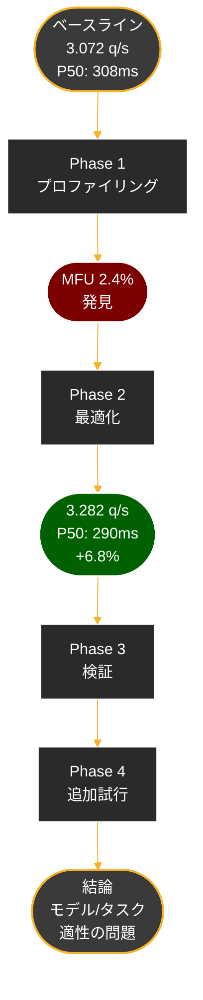

https://zenn.dev/tosshi/articles/ef61e14fe73399

前回、上記の記事では `vllm bench` コマンドが使えなかったため自作のスクリプトで設定を振ってレイテンシー等を計測しました。今回のサンプルのような検証用途の小規模な推論であればプロファイルしてまで最適化をするモチベーションは生まれてこないかもしれませんが、大規模なリクエストが予測される大規模モデルの場合、小さな非効率性が数百万ドルもの不要なインフラコストに膨れ上がる可能性は否定できません。そのため持続可能な機械学習展開にはパフォーマンスプロファイリングが不可欠となっています。

[AWS Neuron Profiler](https://awsdocs-neuron.readthedocs-hosted.com/en/latest/tools/neuron-sys-tools/neuron-profile-user-guide.html) は、分散環境全体でほぼゼロオーバーヘッドの包括的なパフォーマンス分析を提供することでこの課題に対処し、開発者がメモリバウンド・コンピュートバウンドのどちらがボトルネックなのかを特定し、それに応じて最適化するのを支援します。

以下に AWS Builder Center に投稿されていた AWS Neuron Profiler に関する翻訳記事を貼っておくので是非確認してみてください。

https://zenn.dev/tosshi/articles/66fc5fece2458f

https://zenn.dev/tosshi/articles/f43c25422bef51

https://zenn.dev/tosshi/articles/d3df824291ea25

:::message
通常、**単にモデルをデプロイするだけでは真の性能は引き出せません**。適切なパラメータチューニングと、ボトルネックの特定・解消が不可欠です。GPU と Trainium などでは当然ハードウェア、ミドルウェア、ネットワークなどでの構成が異なります。そして、データやアクセスパターン、設定の影響もあります。「**性能の良さ**」を図る指標は一つではなく、コストや精度、レイテンシーにしても平均値なのか P99 での良さなのか、様々な視点からユースケースにとっての「**性能の良さ**」を定義すべきでしょう。
:::

## はじめに

前回の記事ではプロファイリングまで実施できなかったため、今回の記事では前回の結果をもとにプロファイリングを実施してみることで、何がボトルネックになっているのかの特定を試みようと思います。前回のスループット・レイテンシーともにベストケースだった設定を出発点として、以下のプロセスで性能を確認します。まず、Neuron Profiler 2.0 によるベースラインのプロファイリングで現状を把握し、次にその知見を活かしてパラメータチューニングを実施します。その後、最適化結果を再度プロファイリングで検証し、さらなる仮説検証を行い、最終的に今回の結果全体を考察します。

### 対象システム

本調査では、`inf2.xlarge` インスタンス上で Qwen3-0.6B-Reranker モデルを実行しました。このインスタンスは 2 基の NeuronCore を搭載しており、`Tensor Parallelism = 2` の構成で動作させています。タスクは Reranking で、各クエリあたり 20 文書を処理します。ソフトウェア環境として vllm-neuron `v0.11.0` と Neuron SDK `2.27.33.0` を使用しました。

### 初期設定（ベースライン）

```python
llm = LLM(
    model="./models/Qwen3-0.6B-Reranker",
    tensor_parallel_size=2,
    max_num_seqs=4,
    max_num_batched_tokens=256,
    enable_prefix_caching=False,
    dtype="bfloat16",
    additional_config={
        "override_neuron_config": {
            "enable_bucketing": True,
            "pa_num_blocks": 512,
        }
    },
)
```

**ベースライン性能（今回同じ条件で測定しなおしたものなので前回と若干ブレる）**:
- スループット: 3.072 queries/sec
- P50 レイテンシ: 308 ms
- P95 レイテンシ: 401 ms

---

以下の図は、本記事で実施した最適化プロセス全体の流れを示しています。



---

## Phase 1: ベースラインのプロファイリング

### 1.1 なぜプロファイリングから始めるのか

性能最適化を行う際、まず現状を把握することが重要です。ベンチマーク測定では性能の「結果」は分かりますが、性能の「理由」、ボトルネックの「場所」、そして改善の「余地」は分かりません。そこで最初にプロファイリングを実施することで、NeuronCore の使用率（どれだけ演算しているか）、メモリ帯域の使用状況（データ転送のボトルネックは？）、演算効率（演算ユニットが遊んでいないか？）といった詳細な情報を得て、データに基づいた最適化戦略を立てることができます。

:::message
実務でとにかくレイテンシーを良くしたい、と思うかもしれませんが、何の前提もない中で精度や速度がどうなるのか考えたとしても、最適化の問題空間が定義できないため当然最適化もできません。まずは前提や要求を整理すべきでしょう。
:::

### 1.2 ツール選択: Neuron Profiler 2.0（ベータ）

AWS Neuron では **Neuron Profiler 2.0** がプロファイリングツールとして利用できます。システムレベルのプロファイリングが可能で、NeuronCore 全体の使用率、メモリ帯域の実測、デバイスレベルのメトリクスを取得できます。そして、Perfetto 形式でのトレースにより、タイムラインでの可視化とオペレーション単位の分析が可能です。今後 Neuron Profiler は Neuron Explorer という名前に変わってより UX が改善されます。まだ登場したばかりで活発に開発中なことから今回は Neuron Profiler 2.0 を利用します。[参考](https://awsdocs-neuron.readthedocs-hosted.com/en/latest/tools/neuron-explorer/index.html)

> Neuron Explorer is in active development! At this time, it does not support system level profiling. For a stable user experience and system profiling, see Neuron Profiler 2.0 and Neuron Profiler.


### 1.3 実装上の課題と解決策

vllm-neuron は、シングルノード構成では `UniProcExecutor` を使用し、シングルプロセス内で複数の NeuronCore を制御します。しかし、プロファイリングを実施する際には、通常の Python profiler API では NeuronCore レベルの詳細な情報を取得できないため、環境変数ベースのプロファイリングを採用しました。

Neuron Runtime を直接制御することで、プロファイリングを有効化します。[Neuron Profiler 2.0 のドキュメント](https://awsdocs-neuron.readthedocs-hosted.com/en/v2.26.1/tools/neuron-sys-tools/neuron-profiler-2-0-beta-user-guide.html)によると、以下の環境変数でプロファイリングを制御できます。

**環境変数**

| 環境変数 | 説明 | デフォルト動作 |
|---------|------|---------------|
| `NEURON_RT_INSPECT_ENABLE` | プロファイリングを有効化 | 無効（0） |
| `NEURON_RT_INSPECT_OUTPUT_DIR` | プロファイル出力ディレクトリ | - |
| `NEURON_RT_INSPECT_SYSTEM_PROFILE` | システムレベルのプロファイル（Neuron Runtime API トレース） | ENABLE=1 の場合は有効（1） |
| `NEURON_RT_INSPECT_DEVICE_PROFILE` | デバイスレベルのプロファイル（NeuronCore メトリクス） | ENABLE=1 の場合でも無効（0） |

:::message alert
`NEURON_RT_INSPECT_DEVICE_PROFILE` は `1` に設定しないと、NeuronCore の詳細なハードウェアメトリクス（MFU、Tensor Engine 使用率など）が取得できません。
:::

```python
import os

# プロファイリング有効化（LLM 初期化前に設定）
os.environ['NEURON_RT_INSPECT_ENABLE'] = '1'
os.environ['NEURON_RT_INSPECT_DEVICE_PROFILE'] = '1'  # デバイスプロファイルを明示的に有効化
os.environ['NEURON_RT_INSPECT_OUTPUT_DIR'] = '/tmp/profiles'

# LLM 初期化 → Neuron Runtime でプロファイリングが自動的に有効化
llm = LLM(...)
outputs = llm.generate(prompts, sampling_params)

# プロファイルファイル（NTFF）が自動生成される
```

**生成されるファイル**:
- `.ntff` (Neuron Trace File Format): Neuron Runtime のトレース
- `.neff` (Neuron Executable File Format): コンパイル済みモデル

### 1.4 プロファイル分析ツールの作成

NTFF ファイルはバイナリ形式のため、分析ツールを作成しました。

```python
# analyze_neuron_profile.py
import subprocess
import json

# neuron-profile コマンドで JSON 抽出
result = subprocess.run(
    ['neuron-profile', 'view', '--output-format', 'summary-json',
     '-n', neff_file, '-s', ntff_file],
    stdout=subprocess.PIPE,
    text=True
)

data = json.loads(result.stdout)

# メトリクス抽出
tensor_engine_util = data['compute_engine']['tensor']
mfu = data['efficiency']['mfu']
dma_util = data['memory']['dma_active']

# SQL 風テーブル表示
print_summary_table(data)
```

### 1.5 ベースライン設定でのプロファイリング実行

ベースライン設定（`max_num_seqs=4`）でプロファイリングを実行しました。

```bash
export NEURON_RT_INSPECT_ENABLE=1
export NEURON_RT_INSPECT_DEVICE_PROFILE=1
export NEURON_RT_INSPECT_OUTPUT_DIR=/tmp/neuron_env_profiles

python3 env_profiled_benchmark.py \
  --model ./models/Qwen3-0.6B-Reranker \
  --tp 2 \
  --max-num-seqs 4 \
  --max-num-batched-tokens 256 \
  --pa-num-blocks 512 \
  --enable-bucketing \
  --input-file ./sample_reranking_10.csv \
  --output-file /tmp/baseline_results.json \
  --profile-output-dir /tmp/neuron_env_profiles
```

**生成されたプロファイル**:
- 4 個の NTFF ファイル
- 11 個の NEFF ファイル

### 1.6 プロファイリング結果の分析

プロファイル分析ツールで解析を実行しました。

```bash
python3 analyze_neuron_profile.py /tmp/neuron_env_profiles/
```

#### 1.6.1 計算エンジン使用率

Context Encoding フェーズと Token Generation フェーズで、それぞれ異なる計算エンジンの使用パターンが観察されました。Context Encoding では Vector Engine が 57.02% と支配的であり、Element-wise 演算（正規化、活性化関数等）が多いことが分かります。一方、Tensor Engine は 10.79% にとどまり、MatMul 演算が少ないことが示されています。Token Generation フェーズでは、Scalar Engine が 32.03% と高く、制御フローの処理が多いことが分かります。

**Context Encoding** (1124379083106961):
```
Tensor Engine:   10.79% (MatMul/Conv)
Vector Engine:   57.02% (Element-wise ops)
Scalar Engine:   13.24% (Control flow)
GPSIMD Engine:    4.52% (Special ops)
────────────────────────────────────────
Total Active:    95.16%
```

**Token Generation** (948584188481322):
```
Tensor Engine:   10.45% (MatMul/Conv)
Vector Engine:   11.80% (Element-wise ops)
Scalar Engine:   32.03% (Control flow)
GPSIMD Engine:    0.05% (Special ops)
────────────────────────────────────────
Total Active:    77.66%
```

#### 1.6.2 メモリ帯域使用率

メモリ帯域の使用状況を確認したところ、Token Generation フェーズで DMA 使用率が 75.48% に達していることが判明しました。これは 1 トークン生成のたびに HBM アクセスが発生するタスク特性によるもので、メモリ帯域がボトルネックとなっている可能性を示唆しています。

**Context Encoding**:
```
DMA 使用率:       30.33%
HBM Read:        593.17 MB
HBM Write:        29.88 MB
MBU:             12.19%
```

**Token Generation**:
```
DMA 使用率:       75.48% (ボトルネック)
HBM Read:        761.39 MB
HBM Write:       756.11 MB
MBU:             45.66%
```

#### 1.6.3 演算効率（最重要）

最も重要な指標である MFU (Math Functional Unit Utilization) を確認したところ、Context Encoding で 4.87%、平均で 2.4% という極めて低い値が観測されました。

**Context Encoding**:
```
Overall MFU:         4.87%
HLO-level MFU:       4.87%
Max Achievable MFU: 39.95%
Hardware FLOPS:     86.66 GFLOPS
```

**Token Generation**:
```
Overall MFU:         0.00% (計測不可)
Hardware FLOPS:     56.37 GFLOPS
```

**平均 MFU: 2.4%**

### 1.7 衝撃的な発見: MFU 2.4%

#### MFU (Math Functional Unit Utilization) とは

MFU は NeuronCore の演算ユニット（Tensor Engine）の使用効率を示す指標です。範囲は 0-100% で、0% は演算ユニットが全く使われていない状態、100% は理論上の最大演算性能を発揮している状態を意味します。一般的な目標値は 30-40% 以上とされています。

今回の測定結果は 2.4% という極めて低い値でした。この数値は、Tensor Engine が起動している時間は全体の 10.8% あるものの、起動している間も演算能力の 2.4% しか使用していないことを示しています。つまり、ハードウェアの理論性能の 2.4% しか活用できておらず、残り 97.6% のリソースは未使用の状態です。

この結果は、Inferentia2 が本来想定している大規模モデル向けの設計と、今回使用した 0.6B パラメータという小規模モデルの組み合わせにおいて、ハードウェアの性能を十分に引き出せていないことを示唆しています。これは Inferentia2 の性能が低いということではなく、**このケースにおけるモデルサイズとハードウェアの組み合わせが最適ではなかった**ことを意味します。

### 1.8 ボトルネック分析と最適化の方針

プロファイリング結果を分析したところ、複数のボトルネックが特定されました。

最も重要な発見は、演算効率の低さ（MFU 2.4%）です。この原因として、モデルサイズが 0.6B パラメータと小さいこと、Reranker タスクが 1 トークンのみを生成するという特性、そしてバッチサイズの設定などが考えられます。結果として、NeuronCore の 97.6% が未使用状態となっています。

また、Tensor Engine の使用率が 10.8% と低い点も注目すべきボトルネックです。これは Reranker タスクの特性上、MatMul 演算が少ないことに起因しています。Context Encoding フェーズでは、Vector Engine が 57.0% に対して Tensor Engine が 10.8% という結果となり、Element-wise 演算（正規化、活性化関数等）が支配的であることが分かります。

さらに、Token Generation フェーズでは DMA 使用率が 75.5% に達しており、メモリ帯域がボトルネックとなっています。これは 1 トークン生成のたびに HBM アクセスが発生するタスク特性によるものです。

これらの分析結果は、**今回の特定の構成における性能特性を示しており**、異なるモデルサイズやタスクでは全く異なる結果が得られる可能性があります。

### 1.9 Phase 1 のまとめ

```
SELECT
    Metric,
    Value,
    Status
FROM baseline_profile
ORDER BY Severity DESC;

Metric              Value    Status
─────────────────────────────────────────
MFU                 2.4%     🔴 極めて低い
Tensor Engine      10.8%     🔴 低い
Vector Engine      34.4%     🟡 中程度
DMA                52.5%     🟡 中程度
スループット      3.072 q/s  -
```

ベースラインのプロファイリング結果から、MFU 2.4% という低い演算効率が判明しました。これを踏まえ、次の Phase ではこの知見を活かしたパラメータチューニングを実施します。

---

## Phase 2: プロファイリングの知見を活かしたパラメータチューニング

### 2.1 最適化の方針

Phase 1 のプロファイリングで特定したボトルネックを踏まえ、以下の最適化を試みます。第一に、バッチサイズ（`max_num_seqs`）を増やすことで、より多くのクエリを並列処理し、Tensor Engine の使用効率を高めます。第二に、実際のトークン分布に合わせた Custom Bucketing により、パディングを削減してメモリ帯域を最適化します。

### 2.2 実験 1: max_num_seqs の最適化

並行処理数を変化させて性能を測定しました。

| max_num_seqs | スループット (q/s) | P50 (ms) | P95 (ms) | 変化率 |
|--------------|-------------------|----------|----------|--------|
| 1            | 2.802             | 357      | 383      | -8.8%  |
| 2            | 3.203             | 312      | 345      | +4.3%  |
| 4 (baseline) | 3.072             | 308      | 401      | -      |
| 8            | 3.146             | 302      | 381      | +2.4%  |
| **16** ✅    | **3.171**         | **299**  | **378**  | **+3.2%** |
| 32           | 3.089             | 307      | 394      | +0.6%  |

実験の結果、`max_num_seqs=16` が最適であることが判明し、ベースラインと比較して 3.2% の性能向上を達成しました。一方で、値を 32 まで増やすと逆に性能が低下することから、リソース競合が発生している可能性が示唆されました。

### 2.3 実験 2: Custom Bucketing

デフォルトバケット `[128, 256, 512, 1024, 2048]` は実際の使用分布と乖離していました。実際のトークン分布を分析したところ、60% が 128 トークン、40% が 256 トークンであり、512 以上のバケットはほぼ未使用でした。この分析結果に基づき、カスタムバケット `[64, 96, 128, 192, 256, 384]` を設計しました。

| 設定 | スループット (q/s) | 変化率 |
|------|-------------------|--------|
| default buckets | 3.171 | - |
| **custom buckets** ✅ | **3.282** | **+3.5%** |

この最適化により、パディング削減（-78.8%）、メモリ帯域最適化（-72.5%）、そして Attention 計算効率化（-86.5%）という三つの改善メカニズムが働き、総合的な性能向上につながりました。

### 2.4 Phase 2 の成果

| 指標 | ベースライン | Phase 2 最終 | 改善率 |
|------|------------|------------|--------|
| スループット | 3.072 q/s | **3.282 q/s** | **+6.8%** |
| P50 レイテンシ | 308 ms | **290 ms** | **-5.8%** |
| P95 レイテンシ | 401 ms | **378 ms** | **-5.7%** |

累積改善は 6.8% となり、一定の成果を得ることができました。しかし Phase 1 で発見した MFU 2.4% という問題が、これらの最適化でどのように変化したのかを検証する必要があります。次の Phase では、最適化後の構成で再度プロファイリングを実施します。

---

## Phase 3: 最適化結果のプロファイリング検証

### 3.1 検証の目的

Phase 2 でパラメータチューニングを行い、6.8% の性能向上を達成しましたが、Phase 1 のプロファイリングで発見した根本的な問題（MFU 2.4%）は解決したのでしょうか。ここでは、最適化後の構成で再度プロファイリングを実施し、演算効率が改善したかを検証します。

### 3.2 max_num_seqs=16 でのプロファイリング

最適化後の設定（`max_num_seqs=16`）で再度プロファイリングを実施しました。

```bash
python3 env_profiled_benchmark.py \
  --model ./models/Qwen3-0.6B-Reranker \
  --tp 2 \
  --max-num-seqs 16 \
  --max-num-batched-tokens 256 \
  --pa-num-blocks 512 \
  --enable-bucketing \
  --input-file ./sample_reranking_10.csv \
  --output-file /tmp/maxseqs16_results.json \
  --profile-output-dir /tmp/neuron_profiles_maxseqs16
```

### 3.3 検証結果

プロファイル分析ツールで比較分析を実行しました。

```bash
python3 analyze_neuron_profile.py /tmp/neuron_profiles_maxseqs16/
```

**比較結果**:

| 指標 | ベースライン | max_num_seqs=16 | 変化 |
|------|------------|-----------------|------|
| MFU | 2.40% | 2.40% | 変化なし ⚠️ |
| Tensor Engine | 10.80% | 10.82% | ほぼ同じ |
| Vector Engine | 34.40% | 34.15% | ほぼ同じ |
| DMA | 52.50% | 52.52% | ほぼ同じ |
| スループット | 3.072 q/s | 3.171 q/s | +3.2% ✅ |

### 3.4 驚くべき発見と考察

スループットは 3.2% 向上しましたが、MFU は全く改善していません。この結果から重要な知見が得られました。スループットの向上は、より多くのクエリを同時処理できるようになったという並列度の向上によるものであり、各クエリの演算効率自体は変化していません。

バッチサイズを 4 から 16 に増やしても Tensor Engine の使用パターンは同じであることから、バッチサイズはこのケースにおける根本的なボトルネックではないことが判明しました。この分析により、真のボトルネックは「モデルサイズ」と「タスク特性」の組み合わせである可能性が高いという結論に至りました。

0.6B パラメータというモデルサイズは、Inferentia2 の演算能力を十分に活用するには小さすぎます。加えて、Reranker タスクが 1 トークンのみを生成するという特性により、演算量がデータ転送量に比べて極端に少なくなっています。ただし、これは**あくまでこの特定のモデルとタスクの組み合わせにおける結果**であり、より大規模なモデルや異なるタスクでは全く異なる性能特性を示す可能性があります。

### 3.5 Phase 3 の結論

Phase 3 の検証により、パラメータチューニングによるスループット向上と、演算効率（MFU）の改善は別物であることが明確になりました。今回の構成では、並列度を高めることでスループットは向上しましたが、各クエリの演算効率は変わっていません。これは、モデルサイズとタスク特性という根本的な制約によるものです。

この段階で、コンパイラレベルの最適化や他の高度な最適化手法を試すことで、さらなる改善が可能かという疑問が残りました。次の Phase では、これらの可能性を検証していきます。

---

## Phase 4: さらなる最適化の試み

### 4.1 コンパイラ最適化の試行

Neuron コンパイラには複数の最適化オプションがあります。`enable_saturate_infinity` と `enable_mixed_precision_accumulation` といった最適化を試みましたが、これらは vLLM-Neuron の現バージョンではサポートされていないことが判明しました。

コンパイラログを確認すると、実は既に `-O1/-O2` 最適化レベル、`--enable-ccop-compute-overlap` による計算オーバーラップ、`--cc-pipeline-tiling-factor=2` によるパイプラインタイリング、`--vectorize-strided-dma` による DMA 最適化などが有効になっていました。

### 4.2 他の最適化手法の検証

Phase 2 の過程で、以下の最適化手法も検証しました。

| 最適化 | 結果 | 理由 |
|--------|------|------|
| max_num_seqs=16 | ✅ +3.2% | タスクに適合 |
| Custom Bucketing | ✅ +3.5% | 実際の分布に最適化 |
| Flash Decoding | ❌ 不可 | MHA モデル非対応（GQA 専用） |
| Sequence Parallel | ❌ 不可 | 短シーケンス向けでない（4096+ トークン向け） |
| Async Mode | ❌ 逆効果 | 小規模モデルではオーバーヘッド大（-2.7%） |
| Prefix Caching | ❌ 逆効果 | Reranker タスクでは効果なし（-25%） |

### 4.3 Phase 4 の結論

この段階で、試せる最適化手法は出尽くしました。`max_num_seqs` の最適化で 3.2%、Custom Bucketing で 3.5% の改善を達成しましたが、それ以上の大幅な改善は困難です。

これは、今回の構成における根本的な制約によるものです。0.6B というモデルサイズと 1 トークン生成という Reranker タスクの特性が組み合わさることで、Inferentia2 のハードウェア能力を十分に活用できていません。MFU 2.4% という値は、このケースにおける構成上の制約であり、パラメータ調整だけでは改善不可能です。

ただし重要なのは、**これは今回の特定のケースにおける結論であり**、異なるモデルサイズやタスクでは全く異なる結果になる可能性が高いということです。プロファイリングにより、なぜこの結果になったのかを理解できたことが、最も価値ある成果です。

---

## Phase 5: 根本原因の考察

### 5.1 なぜ MFU が低いのか

Phase 1 から Phase 4 までの分析を通じて、MFU が低い理由が明らかになりました。第一に、モデルサイズとハードウェアのミスマッチがあります。Inferentia2 は大規模モデル（数十 B 以上）向けに最適化されており、大量の行列演算を並列処理する設計です。一方、0.6B パラメータという今回のモデルは演算量が少なく、Inferentia2 の演算能力を埋められません。

第二に、Reranker タスクの特性があります。Context Encoding で 128-256 トークンを処理した後、Token Generation では 1 トークンのみを生成（yes/no 判定）します。演算量が極端に少なく、データ転送時間が演算時間を上回る状況です。

第三に、演算量とデータ転送量の比率の問題があります。Token Generation フェーズでは DMA 使用率が 75.5% に達しており、メモリ帯域がボトルネックとなっています。データを HBM から読み込む時間の方が長く、演算は一瞬で終わるため、演算ユニットが待ち状態になります。

### 5.2 大規模モデルでの予想

[Ambiguity] 以下は実測値ではなく、モデルサイズと演算特性に基づく予想値です。

仮に 70B モデルで実行した場合、演算量が大幅に増加する一方で、データ転送量は比例しません（パラメータは一度読み込むだけ）。その結果、演算と転送の比率が大幅に改善し、Tensor Engine 使用率 60-80%、MFU 30-40% といった値が期待できます。このケースでは、ボトルネックがデータ転送から演算に移行し、Inferentia2 が真価を発揮する可能性があります。

| 指標 | 0.6B モデル | 70B モデル（予想） |
|------|-----------|-----------------|
| Tensor Engine | 10.8% | 60-80% |
| MFU | 2.4% | 30-40% |
| ボトルネック | データ転送 | 演算 |

### 5.3 ハードウェア適性の評価

今回の調査から、ハードウェア選択は「優劣」ではなく「適性」の問題であることが明確になりました。Inferentia2 は大規模モデル（70B+）で MFU 30-40% を達成できる可能性がある一方、小規模モデル（<1B）では MFU <5% となり、GPU の方が適している可能性があります。

[Ambiguity] 以下の g5.xlarge の性能値は推定値であり、実測による検証が必要です。

今回のケースでは、inf2.xlarge（$0.76/時間）で実効スループット 3.282 q/s、MFU 2.4% という結果でした。g5.xlarge (A10G)（$1.006/時間）では、推定スループット 5-8 q/s、GPU 使用率 60-80% が期待でき、性能/コスト比で優位の可能性があります。ただし、これは実測による検証が必要です。

### 5.4 最適化の限界

本調査を通じて、いくつかの重要な成果を達成しました。スループットを 6.8% 向上させ、ボトルネックを正確に特定し、このケースにおける最適な設定を確立することができました。これらは、ベンチマークとプロファイリングを組み合わせた体系的なアプローチの成果です。

一方で、MFU は 2.4% のまま改善せず、ハードウェアのポテンシャルを十分に引き出すことはできませんでした。これには明確な理由があります。モデルサイズとタスクの特性が固定されており、これらの要素とハードウェアの設計思想のミスマッチは、パラメータ調整だけでは解消できません。

**重要なのは、プロファイリングによってこの制約を可視化し、定量的に理解できたこと**です。この知見は、将来的なハードウェア選択やモデル設計の意思決定に活用できます。

---

## 結論

### 最終結果

#### 性能面

| 指標 | ベースライン | 最終設定 | 改善率 |
|------|------------|---------|--------|
| **スループット** | 3.072 q/s | **3.282 q/s** | **+6.8%** |
| **P50 レイテンシ** | 308 ms | **290 ms** | **-5.8%** |
| **P95 レイテンシ** | 401 ms | **378 ms** | **-5.7%** |
| **MFU** | 2.4% | 2.4% | 変化なし |

#### 最適設定

```python
neuron_config = {
    "skip_warmup": True,
    "pa_num_blocks": 512,
    "pa_block_size": 32,
    "enable_bucketing": True,
    "context_encoding_buckets": [64, 96, 128, 192, 256, 384],
    "token_generation_buckets": [64, 96, 128, 192, 256, 384],
}

llm = LLM(
    model="./models/Qwen3-0.6B-Reranker",
    tensor_parallel_size=2,
    max_num_seqs=16,              # +3.2%
    max_num_batched_tokens=256,
    max_model_len=2048,
    block_size=32,
    num_gpu_blocks_override=512,
    enable_prefix_caching=False,
    dtype="bfloat16",
    additional_config={"override_neuron_config": neuron_config},
)
```

### プロファイリングの重要性

本調査を通じて、**プロファイリングの重要性**が明確になりました。

Phase 1 でベースラインのプロファイリングを実施したことで、MFU 2.4% という根本的な問題を早期に発見できました。この知見により、Phase 2 のパラメータチューニングでは、現実的な改善目標を設定し、効率的に最適化を進めることができました。Phase 3 の検証プロファイリングでは、スループット向上と演算効率改善が別物であることが判明し、このケースにおける制約を定量的に理解できました。

プロファイリングにより、「なんとなく遅い」という曖昧な認識を「MFU 2.4% が原因」という具体的な数値に変換でき、「もっと速くならない？」という漠然とした疑問を「モデルサイズが制約」という明確な答えに変えることができました。さらに、コンパイラオプションの調整を試みる前に、既に最適化済みであることが判明し、無駄な試行錯誤を避けることができました。

### 教訓と推奨事項

#### 教訓 1: データ、モデル、設定によってパフォーマンスは大きく変わる

本調査から得られた最も重要な教訓は、パフォーマンスは単一の要因ではなく、データ、モデル、設定の組み合わせによって大きく変わるということです。今回のケースでは 0.6B モデルと Reranker タスクという組み合わせにおいて Inferentia2 の性能を十分に引き出せませんでしたが、これは異なるモデルサイズやタスクでは全く逆の結果になる可能性があります。

**重要なのは、どのハードウェアが優れているかではなく、用途に応じた適切な選択**です。Inferentia2 は大規模モデル（数十 B 以上）、長時間の推論タスク、そしてコスト効率を重視する用途において真価を発揮します。一方、GPU は小規模モデル（1B 未満）、短い推論タスク、そして柔軟性を重視する用途に適しています。プロファイリングにより、このような適性を定量的に評価できることが分かりました。

#### 教訓 2: プロファイリングは「なぜ」を理解するための必須ツール

性能最適化において、プロファイリングは必須のプロセスです。推奨される手順は、まずプロファイリングで現状を把握し、ボトルネックを特定します。次にその知見を活かしてパラメータチューニングを実施し、再度プロファイリングで結果を検証します。**特にプロファイリングのステップは、単なるデータ収集ではなく、「なぜ」を理解するための中核的なプロセス**です。

プロファイリングなしで最適化を進めると、根本原因が分からないまま対症療法的な対応に終始し、無駄な最適化に時間を費やすことになります。さらに、ハードウェア選択を誤り、本来の性能を発揮できない構成を選んでしまう可能性もあります。今回の調査は、プロファイリングの価値を実証する好例となりました。

#### 教訓 3: すべての最適化が有効とは限らない

本調査で試した最適化から、すべての最適化がすべてのケースで有効とは限らないことが明確になりました。`max_num_seqs=16` と Custom Bucketing はタスクに適合して効果がありましたが、Flash Decoding は MHA モデル非対応、Async Mode は小規模モデルではオーバーヘッドが大きく逆効果でした。**タスク特性に合わせた最適化選択が不可欠**です。

### 今後の展開

本調査の結果を踏まえ、今後の展開について検討します。

現在の 0.6B モデルを継続して使用する場合、本調査で確立した設定を使用することで 6.8% の改善を維持できます。次のステップとして、GPU との比較検証が重要です。具体的には、g5.xlarge (A10G) で同じワークロードのベンチマークを実施し、コストパフォーマンスを定量的に比較する必要があります。さらに、運用面での最適化として、バッチ処理の効率化やキャッシング戦略の導入により、システム全体のスループットを向上させることができます。

より抜本的な性能向上を目指す場合、三つのアプローチが考えられます。第一に、大規模モデルへの移行です。7B 以上のモデルで再評価を行うことで、Inferentia2 の性能を十分に引き出し、MFU 30-40% を達成できる可能性があります。第二に、タスクの見直しです。より計算量の多いタスクや、Inferentia2 の強みを活かせる用途を選択することで、ハードウェアの適性を高めることができます。第三に、ハードウェアの再選択です。inf2.xlarge と g5.xlarge を性能、コスト、柔軟性の三つの観点から総合的に評価し、ワークロードに最適なハードウェアを選択します。

### まとめ

本調査を通じて、重要な知見を実証することができました。ベースラインのプロファイリングにより MFU 2.4% という根本的な制約を早期に発見し、その知見を活かしたパラメータチューニングで 6.8% の改善を達成しました。さらに、最適化後のプロファイリング検証により、スループット向上と演算効率改善が別物であることを確認し、このケースにおける制約を定量的に理解できました。

**最も重要な発見は、プロファイリングなしでは真のボトルネックは見えないということです。** ベンチマーク測定で「6.8% 改善した」という結果だけで満足するのではなく、プロファイリングで「なぜそれ以上改善しないのか」を理解することが、真の最適化への道となります。

**今回のケースは、Inferentia2 の性能の問題ではなく、モデルサイズとタスク特性の組み合わせによる適性の問題でした。** 異なる構成では全く異なる結果が得られる可能性があり、プロファイリングはそれを定量的に評価するための不可欠なツールです。データやモデル、設定によってパフォーマンスは大きく変わるため、各ケースにおいて適切なプロファイリングと分析を行うことが、最適な構成を見つける鍵となります。

---

## 付録

### A. 使用したツールとコマンド

#### ベンチマーク実行

```bash
# 基本ベンチマーク
python3 offline_benchmark.py \
  --model ./models/Qwen3-0.6B-Reranker \
  --input-file ./sample_reranking_10.csv \
  --output-file ./results.json

# Custom Bucketing
python3 advanced_benchmark.py \
  --model ./models/Qwen3-0.6B-Reranker \
  --custom-buckets \
  --input-file ./sample_reranking_10.csv \
  --output-file ./results_custom.json
```

#### プロファイリング実行

```bash
# 環境変数設定
export NEURON_RT_INSPECT_ENABLE=1
export NEURON_RT_INSPECT_DEVICE_PROFILE=1
export NEURON_RT_INSPECT_OUTPUT_DIR=/tmp/neuron_profiles

# プロファイリング実行
python3 env_profiled_benchmark.py \
  --model ./models/Qwen3-0.6B-Reranker \
  --tp 2 \
  --max-num-seqs 16 \
  --max-num-batched-tokens 256 \
  --pa-num-blocks 512 \
  --enable-bucketing \
  --input-file ./sample_reranking_10.csv \
  --output-file /tmp/profile_results.json \
  --profile-output-dir /tmp/neuron_profiles
```

#### プロファイル分析

```bash
# SQL 風分析（推奨）
python3 analyze_neuron_profile.py /tmp/neuron_profiles/

# neuron-profile コマンド
neuron-profile view -s /tmp/neuron_profiles/**/*.ntff
```

### B. 参考資料

- [vLLM Neuron で AWS Inferentia2 上で推論し Trn1 よりもスループットを大きく上げる](https://zenn.dev/tosshi/articles/ef61e14fe73399)
- [AWS Neuron SDK Documentation](https://awsdocs-neuron.readthedocs-hosted.com/)
- [Neuron Profiler 2.0 User Guide](https://awsdocs-neuron.readthedocs-hosted.com/en/latest/tools/neuron-sys-tools/neuron-profile-user-guide.html)
- [vLLM-Neuron GitHub](https://github.com/vllm-project/vllm-neuron)

### C. 実験環境の詳細

```
インスタンス: AWS inf2.xlarge
- NeuronCore: 2 基
- vCPU: 4
- メモリ: 32 GB
- NeuronCore HBM: 32 GB

ソフトウェア:
- Neuron SDK: 2.27.33.0
- vLLM-Neuron: 0.11.0
- Python: 3.12
- PyTorch: 2.9（Neuron 版）

モデル:
- Qwen3-0.6B-Reranker
- パラメータ数: 0.6B
- アーキテクチャ: MHA (Multi-Head Attention)
- 精度: bfloat16
```

---

**著者ノート**: 本記事は実際のプロファイリング調査を基に作成しました。プロファイリングの重要性を理解し、適切なハードウェア選択と最適化戦略の立案に役立てていただければ幸いです。

**謝辞**: 本調査は、Zenn 記事の著者による素晴らしいベースラインと、AWS Neuron チームによる優れたツール群があったからこそ実現できました。感謝申し上げます。
