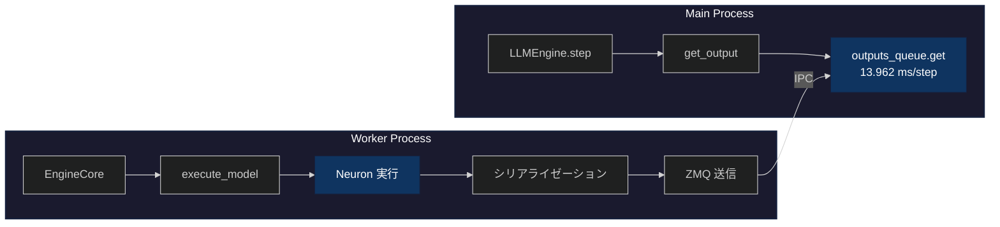
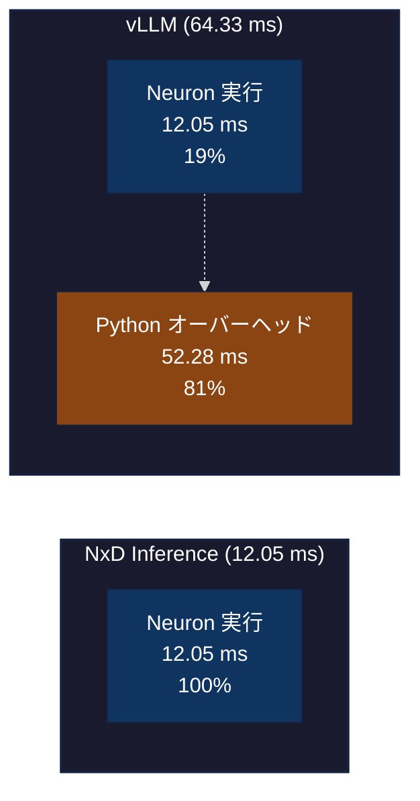
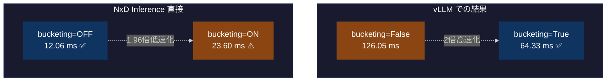

## はじめに

[前回の記事](https://zenn.dev/tosshi/articles/d68bd091d1934d) では別になくても今回の記事自体は書けるにも関わらずプロファイリングツールの開発にほぼ趣味で集中してしましたが、今回は（真面目に） AWS Inferentia2 上で vllm-neuron を使用したパフォーマンスのプロファイリング分析にチャレンジします。

本記事では、3 つの調査フェーズに分けて説明します。まず Phase 1 では AWS Neuron Profiler によるハードウェアレベルのプロファイリングを試行錯誤しました。次に Phase 2 では line_profiler による Python レベルのプロファイリングを実施しました。最後に Phase 3 では NxD Inference を直接使用した測定を行い、vLLM との詳細比較を実施しました。

最終的に、vllm-neuron、NeuronCore 側の処理の実行時間、bucketing 設定や prefix caching の挙動について理解を深めることができました。

:::message
**今回のプロファイリングの進め方は結果的にかなり間違っていました！** 色々試行錯誤したんだな、と思いながら本記事を読んでください。最後にどういう流れにすべきだったと思うのか整理しました。
:::

:::message alert
本記事は初学者向けではないためある程度 LLM 推論の基礎知識、vLLM の基礎知識、AWS Neuron の基礎知識があることが前提です。
:::

---

## Phase 1: AWS Neuron Profiler での試行錯誤

### 1.1 なぜプロファイリングから始めるのか

性能最適化を行う際、まず現状を把握することが重要です。ベンチマーク測定では性能の結果は分かりますが、性能の理由、ボトルネックの場所、そして改善の余地は分かりません。

以下に実験環境と設定情報をまとめておきます。以前の Zenn 記事の P50 レイテンシー最適値からプロファイリングを開始します。

::::details 実験環境と設定情報

本調査で使用した実験環境と設定の詳細を記載します。

**ハードウェア環境**:
- インスタンスタイプ: `inf2.xlarge`

**ソフトウェアバージョン**:
- Neuron SDK: 2.27.x
- vLLM: 0.13.0（Neuron 対応版）
- neuronx-distributed-inference (NxD Inference): 0.7.0
- Python: 3.12

**モデルとデータ**:
- モデル: Qwen3-0.6B-Reranker
- プロンプト長: 97 トークン（固定長）
- タスク: Reranker（文書ランキング）
- バッチサイズ: 4

**vLLM 設定（過去の Zenn 記事の実験での最適値）**:
```yaml
vllm:
  tensor_parallel_size: 2           # 2 NeuronCore 使用
  max_num_seqs: 4                   # 同時処理数
  block_size: 32                    # KV cache block size
  max_model_len: 2048
  max_num_batched_tokens: 256
  num_gpu_blocks_override: 512
  enable_prefix_caching: false      # Phase 1-5 では無効
  dtype: "bfloat16"

  additional_config:
    override_neuron_config:
      skip_warmup: True
      enable_bucketing: true        # 動的バッチング有効
      pa_num_blocks: 512
      pa_block_size: 32
```

これらの設定は、[前回の Zenn 記事](https://zenn.dev/tosshi/articles/ef61e14fe73399) で最適化したパラメータを使用しています。

**測定の焦点**:
本調査では、この特定の設定における vllm-neuron のプロファイリングに焦点を当てています。異なるモデルサイズ、可変長プロンプト、より大規模なバッチサイズでは、異なる性能特性を示す可能性があります。

:::message
**NxD Inference は vllm-neuron で内部的に推論エンジンとして利用されています。実態としては `override_neuron_config` のパラメータが NxD Inference に渡されている形です。**
:::
::::

### 1.2 Perfetto トレースの基本分析

前回も少し紹介した Perfetto について紹介します。Perfetto トレースファイルは SQLite データベースとして扱えます。まず以下のような分析クエリを実行しました。

:::details Perfetto トレース分析コード

```python
from perfetto.trace_processor import TraceProcessor
tp = TraceProcessor(trace='profile_output/trace.perfetto-trace')

# Operation ごとの集計
sql = """
SELECT name, COUNT(*) as count,
       SUM(dur) / 1e9 as total_seconds,
       AVG(dur) / 1e9 as avg_seconds
FROM slice WHERE dur > 0
GROUP BY name ORDER BY total_seconds DESC LIMIT 10
"""
```

**結果の一部**:
```
                  name   count total_seconds avg_seconds
0              unknown  156427      0.038387         0.0
1               MATMUL   21582      0.010941    0.000001
2 custom_call.17_sg0002      36      0.007028    0.000195
3            LDWEIGHTS   21212      0.004914         0.0
```

**クエリの見方**:
`slice` テーブルには各オペレーションの実行記録が格納されています。このクエリは以下を取得します。
- `name`: オペレーション名（MATMUL など、Neuron コンパイラが生成した演算の種類）
- `count`: そのオペレーションが実行された回数
- `dur`: 各実行の継続時間（ナノ秒単位で記録されているため、1e9 で割って秒に変換）
- `total_seconds`: そのオペレーションの合計実行時間（秒単位）
- `avg_seconds`: 1 回あたりの平均実行時間（秒単位）
:::

結果として、まず、`custom_call.17_sg0002` という操作がたった 36 回の実行で 7ms も消費していることが判明しました。次に、MATMUL と LDWEIGHTS がほぼ同じ回数実行されています。さらに、`unknown` という分類の操作が 38ms で最大の時間を消費していました。

`custom_call.17_sg0002`。。。何これ。。。

:::details [発展的内容] NEFF 分析による custom_call の調査

**疑問**: `custom_call.17_sg0002` とは何か？RoPE？活性化関数？何らかのカスタムカーネル？

Perfetto トレースでは実行回数と時間しか分からないため、NEFF (Neuron Executable File Format) ファイルを [unpacking](https://awsdocs-neuron.readthedocs-hosted.com/en/latest/neuron-runtime/explore/work-with-neff-files.html) して静的な構造を調査しました。(uppack には `neuron-packager unpack` コマンドを利用しても良いです)

**NEFF から判明したこと**:

```bash
# NEFF ファイルを unpacking
$ dd if=neff_322059935237836.neff of=neff.tar.gz bs=1024 skip=1
$ tar -xzf neff.tar.gz

# tensor_map.json を確認
$ cat sg00/tensor_map.json | jq '.["custom_call.17_sg0002"]'
{
  "dtype": "float32",
  "sim_shape": [256, 1, 1],
  "kind": null,
  "is_const": false,
  "layer_name": "custom_call.17"
}
```

**分かること**:
- データ型: `float32`（精度重視の演算）
- テンソル形状: `[256, 1, 1]`（比較的小さい）
- サブグラフ: `sg0002`
- 動的に計算される中間テンソル
- `custom_call.14` ～ `17` の連続した演算シーケンス

**Qwen3 アーキテクチャから推測**:

形状 `[256, 1, 1]` と周辺の `dot` (MATMUL) 操作から、以下のような操作と推測
- **RoPE (Rotary Position Embedding)**: 位置エンコーディング計算
- **RMSNorm**: 正規化層の統計値計算
- **アテンション機構**: Softmax 前の中間計算

NEFF はコンパイル時の静的な情報（グラフ構造、テンソル形状、データ型）を含みますが、以下は判明しないようです。
- 具体的な演算ロジック（どのカーネルが実行されるか）
- 実行回数: 36 回（Perfetto トレースで測定可能）
- 実行時間: 7ms（Perfetto トレースで測定可能）
- 初回実行時の遅延（skip_warmup による動作の違い）

NEFF 分析からは、何が使われているかは分かりますが、どう動くかは Perfetto トレースで実行時に測定する必要があります。そして上記以上の詳細な特定は現時点ではできませんでした。。
:::

### 1.3 skip_warmup 設定の影響

詳細に試行錯誤しながら実行したクエリを全て紹介していると膨大になってしまうため割愛しますが Phase 1 の時系列の命令実行に関する調査結果から、custom_call が初回実行時に大きな遅延を起こしていることが分かったため、NxD Inference のパラメータである `skip_warmup=False` を試しました。デフォルト値は `False` なのですが以前の実験の試行錯誤で `True` にしていました。このパラメータはモデルロード後に 1 回の forward 実行を行い、遅延初期化を完了させるというものです。
                                                                                                                  
| 設定 | 平均時間 |
|------|---------|
| Baseline (skip_warmup=True) | 2.992秒 |
| Warmup (skip_warmup=False) | 3.110秒 (+3.9%) |

ウォームアップすれば速くなると予想していましたが、実際には約 4% 遅くなりました。（測定のたびに結果は多少変動します）再度プロファイリングしてオペレーションの変化を確認してみましょう。

:::details Operation 数の変化

```
Baseline (skip_warmup=True):
  MATMUL: 21,582回, 10.94ms
  LDWEIGHTS: 21,212回, 4.91ms
  ACTIVATE: 4,702回, 1.65ms
  COPY: 83回, 0.03ms

Warmup (skip_warmup=False):
  MATMUL: 13,497回 (-37%), 2.64ms (-76%)
  LDWEIGHTS: 13,497回 (-36%), 1.17ms (-76%)
  ACTIVATE: 4,207回 (-11%), 2.94ms (+78%)
  COPY: 554回 (+567%), 1.01ms (+3,267%)
```
:::

`skip_warmup=False` で MATMUL/LDWEIGHTS の主要オペレーションは実行時間が 76% 減少したものの、ACTIVATE の実行時間が +78%、COPY の実行時間が +3,267% 増加し、トータルでは遅くなりました。


### 1.4 Neuron Profiler の測定範囲の限界

:::message alert
ここで重要な気づき：Neuron Profiler のトレース時間は 16-17ms なのに、ベンチマーク全体は約 3 秒かかっている。**この 16-17ms ってどこからどこまでのなんの値？**
:::

調査の結果、Neuron Profiler の測定範囲に関する重要な特性が判明しました。Neuron Profiler は実行時に NTFF (Neuron Trace File Format) という中間ファイルを生成し、それを Perfetto トレースに変換します。各 NTFF ファイルは 1 つのコンパイル済みグラフの実行記録を表しており、異なるバッチサイズや sequence length 用の複数グラフが存在します。

```bash
$ find profile_output -name "*.ntff" | wc -l
22  # 11種類のグラフ × 2コア(tensor_parallel_size=2)

# NTFF は Perfetto に変換される
$ ls profile_output/trace.perfetto-trace
trace.perfetto-trace  # これを TraceProcessor や Perfetto UI で分析
```

::::details [発展的内容] NEFF ファイルと bucketing の関係

**NEFF (Neuron Executable File Format)** は、NeuronCore 上で実行されるコンパイル済みグラフの実行ファイルです。bucketing を有効にすると、複数の (batch_size, sequence_length) の組み合わせに対応する複数のグラフが事前にコンパイルされます。

```bash
# NEFF ファイルの分析
$ find profile_output -name "*.neff" | wc -l
77  # 複数の PID から 11 種類のグラフ × 複数回コンパイル

$ ls -lh profile_output/*/neff_*.neff | awk '{print $5}' | sort -u
801K   # Graph 1: 最小バケット
881K   # Graph 2
991K   # Graph 3
1.1M   # Graph 4
1.3M   # Graph 5
2.1M   # Graph 6
2.3M   # Graph 7
2.4M   # Graph 8
2.6M   # Graph 9
3.0M   # Graph 10
       # (合計 11 種類、124 MB)
```

**11 グラフの実行時間分布**
```
Graph 1:  10.81 ms   Graph 2:  69.79 ms   Graph 3:  11.61 ms
Graph 4:  25.84 ms   Graph 5:  23.02 ms   Graph 6:  17.62 ms
Graph 7:  19.75 ms   Graph 8:  42.67 ms   Graph 9:  12.20 ms
Graph 10: 21.70 ms   Graph 11:  8.51 ms
```

**bucketing のオーバーヘッド**
1. **コンパイルオーバーヘッド**: 11 グラフを事前コンパイル（初回起動時）
2. **メモリオーバーヘッド**: 124 MB の NEFF ファイルをロード（グラフ数が多いのでメモリオーバーヘッドが増える）
3. **選択オーバーヘッド**: 実行時に入力サイズに応じた最適グラフを選択

**固定長ワークロード（97 トークン Reranker）の場合**
- 実際に使用するのは 11 グラフのうち 1 つだけ
- 残り 10 グラフはロードされるが使用されない
- bucketing=OFF なら 1 グラフのみコンパイル → オーバーヘッドなし

**可変長ワークロード（一般的な LLM の生成）の場合**
- 異なる長さのプロンプトが 11 グラフに分散
- 再コンパイル不要で効率的なバッチング
- bucketing=ON が高速化に貢献

:::message
**このようにワークロードによって bucketing の性能は ON/OFF でどちらが良いか変動する可能性があることを覚えておいてください！**
:::
::::

:::message alert
**今回の第一の過ち**: Neuron Profiler はハードウェアレベルの分析には有用だが、vllm-neuron 全体の最適化において初手で使うものではない。
:::

カスタムカーネルを実装するようなケースでは必須と言えますが、最適な設定を探す際の初手で実施する必要があるものではありませんでした。そしてハードウェアレベルの改善をする前に vllm-neuron 全体の実行時間の内のどの程度をハードウェア側の推論処理が占めているのかによって改善の優先度が変わってくるので vllm-neuron 全体のプロファイリングをしないと意味ないぞ、と思いました。。とはいえ、今回得た Neuron Profiler に関する知見は有用なためシェアの意味を込めて Phase 1 を消さずにそのまま公開します。

### 1.5 NEFF、Perfetto とは

Phase 1 で登場したプロファイリングファイルについて整理します。

:::message
NEFF（コンパイル時） → NTFF（プロファイリング実行時の中間ファイル） → **Perfetto トレース**（分析に使用）
:::

#### NEFF (Neuron Executable File Format)

[参考: Work with NEFF Files](https://awsdocs-neuron.readthedocs-hosted.com/en/latest/neuron-runtime/explore/work-with-neff-files.html)

**役割**: コンパイル済みグラフの実行ファイル

```bash
# NEFF の構造
neff_322059935237836.neff (801KB)
├── [1024 byte header]
└── [tar.gz archive]
    ├── info.json              # コンパイル情報
    ├── hlo_stats.json         # 演算統計（HloMacCount: 29.2B など）
    ├── metrics.json           # 推定レイテンシ
    ├── neff.json             # グラフ定義（373 ノード）
    └── sg00/                  # サブグラフ 0
        ├── tensor_map.json   # テンソル情報（458 テンソル）
        ├── PE.bin            # Processing Element 命令
        ├── Activation.bin    # 活性化関数命令
        ├── DVE.bin           # Data Vector Engine 命令
        └── debug_info_*.dbg  # デバッグ情報
```

#### NTFF (Neuron Trace File Format) - 中間ファイル

**役割**: Perfetto トレースに変換される前の中間ファイル

```bash
# NTFF ファイルの例（Neuron Profiler が生成）
profile_output/i-0049acfde6046f237_pid_520024/
├── 322059935237836_instid_0_vnc_0.ntff  # Graph 1, Core 0
├── 322059935237836_instid_0_vnc_1.ntff  # Graph 1, Core 1
├── 729292360268366_instid_0_vnc_0.ntff  # Graph 4, Core 0
├── 729292360268366_instid_0_vnc_1.ntff  # Graph 4, Core 1
...
└── (22 files = 11 graphs × 2 cores)

# Neuron Profiler で Perfetto に変換
$ neuron-profile view --output-format perfetto profile_output
```

#### Perfetto トレース

**役割**: NeuronCore 上の低レベル実行トレース

```bash
# Perfetto トレース
trace.perfetto-trace (110 MB)
└── SQLite データベース
    ├── slice テーブル          # オペレーション実行記録
    │   └── MATMUL: 21,582回, 10.94ms
    │       COPY: 83回, 0.03ms
    │       custom_call.17: 36回, 7ms
    ├── thread テーブル         # スレッド情報
    └── process テーブル        # プロセス情報
```

::::details NEFF と Perfetto の比較

| 情報 | NEFF | Perfetto | 備考 |
|------|------|----------|------|
| **静的構造** | | | |
| グラフ構造（ノード、テンソル数） | ✅ | ❌ | NEFF unpacking で取得 |
| テンソル形状・データ型 | ✅ | ❌ | tensor_map.json |
| 演算量（理論値） | ✅ | ❌ | hlo_stats.json |
| メモリ使用量（理論値） | ✅ | ❌ | IfmapSize、OfmapSize |
| DMA キュー構成 | ✅ | ❌ | def.json |
| **グラフレベル実行** | | | |
| グラフごとの実行時間 | ❌ | ⚠️ | SQL 集計で計算可能 |
| NeuronCore ごとの内訳 | ❌ | ⚠️ | スレッド別に集計 |
| 使用されたグラフの識別 | ❌ | ⚠️ | slice 名から推定 |
| グラフ間の遷移時間 | ❌ | ⚠️ | タイムスタンプから推定 |
| **オペレーションレベル実行** | | | |
| 実行時間（実測値） | ❌ | ✅ | slice.dur |
| 実行回数 | ❌ | ✅ | COUNT(*) |
| オペレーション詳細（MATMUL、COPY など） | ❌ | ✅ | slice.name |
| タイムスタンプと実行順序 | ❌ | ✅ | slice.ts |
| 並列実行の可視化 | ❌ | ✅ | Perfetto UI |
| 初期化遅延（skip_warmup 効果） | ❌ | ✅ | 初回実行時間の比較 |
| **高レベル情報** | | | |
| Python レイヤーオーバーヘッド | ❌ | ❌ | line_profiler などが必要 |
| 演算内容の意味（RoPE、RMSNorm など） | ⚠️ | ❌ | 形状から推測のみ |

**凡例**: ✅ 直接取得可能、⚠️ 推測・計算が必要、❌ 取得不可能
::::

---

## Phase 2: line_profiler による Python プロファイリング

Phase 1 では Neuron Profiler により NeuronCore レベルの詳細な分析を行いましたが、Python レベルのオーバーヘッド（トークナイゼーション、データ準備など）の測定には別のツールが必要です。そこで line_profiler を使用して Python コードの行ごとの実行時間を測定します。

### 測定スクリプトの準備

Phase 1 で使用した `test_reranker.py` は pytest + benchmark_capture デコレーターを使用していますが、line_profiler と組み合わせると出力が複雑になります。そこで、line_profiler 専用のシンプルなスクリプト `profile_line.py` を作成しました。（この辺りも vllm-neuron の Python プロファイリングのためにうまく取れるように今後 benchmark_capture の実装を改善します）

::::details スクリプトの構造

```python:profile_line.py
try:
    profile
except NameError:
    def profile(func):
        return func

# config.yaml から設定を読み込み（test_reranker.py と同じ）
config_path = Path(__file__).parent / 'config.yaml'
with open(config_path, 'r') as f:
    config = yaml.safe_load(f)

# 測定対象の関数に @profile デコレーターを追加
@profile
def build_prompts_for_vllm(pairs, tokenizer, prefix_tokens, suffix_tokens):
    """トークン化とプロンプト構築"""
    # ... (test_reranker.py と同じロジック)

@profile
def run_reranker(llm, tokenizer, token_true_id, token_false_id,
                 prefix_tokens, suffix_tokens):
    """リランカーのメイン処理"""
    # ... (test_reranker.py と同じロジック)

def main():
    """メイン関数（pytest 非依存）"""
    llm = vllm.LLM(model=model_path, **vllm_config)
    # ... 初期化とプロファイリング実行

if __name__ == "__main__":
    main()
```

::::

::::details スクリプト完全版
```python:profile_line.py
"""
Line profiler script for vLLM-Neuron Reranker

Run with:
    kernprof -l -v profile_line.py

Or for more detailed output:
    kernprof -l profile_line.py
    python -m line_profiler profile_line.py.lprof
"""

# line_profiler compatibility: make @profile decorator optional
try:
    profile
except NameError:
    # If not running under kernprof, @profile is a no-op
    def profile(func):
        return func

import csv
import gc
import logging
import os
import sys
from pathlib import Path

import yaml

# Configure logging
logging.basicConfig(level=logging.INFO)
logger = logging.getLogger(__name__)

# Load configuration
config_path = Path(__file__).parent / 'config.yaml'
with open(config_path, 'r') as f:
    config = yaml.safe_load(f)

# Get model path
model_path = config['model']['path']

# Get vLLM config
vllm_config = {
    "tensor_parallel_size": config['vllm']['tensor_parallel_size'],
    "max_num_seqs": config['vllm']['max_num_seqs'],
    "block_size": config['vllm']['block_size'],
    "max_model_len": config['vllm']['max_model_len'],
    "max_num_batched_tokens": config['vllm']['max_num_batched_tokens'],
    "num_gpu_blocks_override": config['vllm']['num_gpu_blocks_override'],
    "enable_prefix_caching": config['vllm']['enable_prefix_caching'],
    "dtype": config['vllm']['dtype'],
    "disable_log_stats": config['vllm'].get('disable_log_stats', False),
}

# Add additional_config if present (Zenn article optimal settings)
if 'additional_config' in config['vllm']:
    vllm_config['additional_config'] = config['vllm']['additional_config']

# Get reranker config
reranker_config = config['reranker']
benchmark_config = config['benchmark']

# Reranker prompts
reranker_prompts = {
    'instruction': reranker_config['instruction'],
    'prefix': reranker_config['prefix'],
    'suffix': reranker_config['suffix']
}

# Token IDs
token_ids = {
    'true': reranker_config['token_true'],
    'false': reranker_config['token_false']
}

# Load CSV data
csv_file = Path(__file__).parent / reranker_config['input_file']
with open(csv_file, 'r', encoding='utf-8') as f:
    reader = csv.DictReader(f)
    rows = list(reader)

num_queries = min(len(rows), benchmark_config['num_test_queries'])
search_num = reranker_config['search_num']
batch_size = reranker_config['batch_size']
max_length = reranker_config['max_length']

logger.info(f"Loaded {len(rows)} queries from {csv_file}")
logger.info(f"Testing with first {num_queries} queries")


def format_instruction(query: str, doc: str) -> str:
    """Format instruction for reranker"""
    instruction = reranker_prompts['instruction']
    output = f"<Instruct>: {instruction}\n<Query>: {query}\n<Document>: {doc}"
    # Truncate if too long
    if len(output) >= 2000:
        output = output[:2000]
    return output


@profile
def build_prompts_for_vllm(pairs, tokenizer, prefix_tokens, suffix_tokens):
    """Build prompts with proper tokenization - PROFILING TARGET"""
    prompts = []
    budget = max_length - len(prefix_tokens) - len(suffix_tokens)

    # Tokenize pairs
    enc = tokenizer(
        list(pairs),
        padding=False,
        truncation="longest_first",
        return_attention_mask=False,
        add_special_tokens=False,
        max_length=max(8, budget),
    )

    # Build final prompts: prefix + content + suffix
    for ids in enc["input_ids"]:
        final_ids = prefix_tokens + ids + suffix_tokens
        text = tokenizer.decode(final_ids, skip_special_tokens=False)
        prompts.append(text)

    return prompts


@profile
def run_reranker(llm, tokenizer, token_true_id, token_false_id, prefix_tokens, suffix_tokens):
    """Run reranker on queries - MAIN PROFILING TARGET"""

    import vllm
    from vllm import SamplingParams

    # Get use_tqdm setting from benchmark config
    use_tqdm = benchmark_config.get('use_tqdm', True)

    # Create SamplingParams
    sampling_params = SamplingParams(
        max_tokens=1,
        temperature=0.0,
        logprobs=20,
        detokenize=True,
        allowed_token_ids=[token_true_id, token_false_id]
    )

    logger.info(f"SamplingParams configured: max_tokens=1, "
                f"allowed_tokens=[{token_ids['true']}, {token_ids['false']}]")

    # Process each query
    total_processed = 0
    for query_idx, row in enumerate(rows[:num_queries]):
        query = row["query"]

        # Get candidates
        candidates = [
            row[f"answer_{i}"]
            for i in range(search_num)
            if f"answer_{i}" in row
        ]

        # Format query-document pairs
        pairs = [format_instruction(query, doc) for doc in candidates[:search_num]]

        # Build prompts with tokenization
        prompts = build_prompts_for_vllm(pairs, tokenizer, prefix_tokens, suffix_tokens)

        # Process in batches
        query_outputs = []
        for s in range(0, len(prompts), batch_size):
            batch_prompts = prompts[s:s + batch_size]
            outputs = llm.generate(batch_prompts, sampling_params, use_tqdm=use_tqdm)
            query_outputs.extend(outputs)

        total_processed += len(query_outputs)

        if query_idx == 0:
            # Show first result for verification
            logger.info(f"Query 1: {query[:80]}...")
            logger.info(f"Generated {len(query_outputs)} scores for "
                       f"{len(candidates[:search_num])} candidates")
            if query_outputs:
                first_output = query_outputs[0]
                logger.info(f"First output: {first_output.outputs[0].text} "
                           f"(token_ids={first_output.outputs[0].token_ids})")

    logger.info(f"Profiling completed: processed {total_processed} reranker pairs")
    return total_processed


def main():
    """Main profiling function"""
    import vllm

    logger.info("Initializing vLLM-Neuron reranker...")
    logger.info(f"Model: {model_path}")
    logger.info(f"Config: block_size={vllm_config['block_size']}, "
               f"max_num_seqs={vllm_config['max_num_seqs']}, "
               f"tensor_parallel_size={vllm_config['tensor_parallel_size']}")

    # Initialize vLLM
    llm = vllm.LLM(model=model_path, **vllm_config)

    # Get tokenizer and token IDs
    tokenizer = llm.get_tokenizer()
    token_false_id = tokenizer.convert_tokens_to_ids(token_ids['false'])
    token_true_id = tokenizer.convert_tokens_to_ids(token_ids['true'])

    logger.info(f"Token IDs: {token_ids['true']}={token_true_id}, "
               f"{token_ids['false']}={token_false_id}")

    # Encode prompt templates
    prefix_tokens = tokenizer.encode(
        reranker_prompts['prefix'], add_special_tokens=False
    )
    suffix_tokens = tokenizer.encode(
        reranker_prompts['suffix'], add_special_tokens=False
    )

    logger.info(f"Prefix tokens: {len(prefix_tokens)}, Suffix tokens: {len(suffix_tokens)}")

    # Run profiling
    logger.info("Starting profiling run...")
    total = run_reranker(llm, tokenizer, token_true_id, token_false_id, prefix_tokens, suffix_tokens)

    logger.info(f"Profiling complete. Processed {total} pairs.")

    # Cleanup
    del llm
    gc.collect()


if __name__ == "__main__":
    main()
````

```yaml:config.yaml
# vLLM-Neuron Reranker Benchmark Configuration

# Model configuration
model:
  # Path to the reranker model
  # Example: "/path/to/models/Qwen3-0.6B-Reranker"
  # Use environment variable: export RERANKER_MODEL_PATH="/your/model/path"
  path: "/home/coder/data-science/investigations/inf2-vllm-performance/models/Qwen3-0.6B-Reranker"

# vLLM-Neuron engine settings
vllm:
  tensor_parallel_size: 2           # Number of NeuronCores
  max_num_seqs: 4                   # Batch size
  block_size: 32                    # KV cache block size (32 for Zenn best case, 128 for stability)
  max_model_len: 2048               # Maximum sequence length
  max_num_batched_tokens: 256       # Performance optimization
  num_gpu_blocks_override: 512      # pa_num_blocks equivalent
  enable_prefix_caching: false      # Explicit disable
  dtype: "bfloat16"                 # Data type

  # Neuron-specific overrides (Zenn article optimal settings)
  additional_config:
    override_neuron_config:
      skip_warmup: true             # Phase 1-5 の設定（記事と一致）
      enable_bucketing: true        # 動的バッチング有効
      pa_num_blocks: 512
      pa_block_size: 32

# Reranker-specific settings
reranker:
  # Input data
  input_file: "input_sample.csv"    # CSV file with queries and candidates

  # Processing parameters
  search_num: 20                    # Number of candidates per query to process
  batch_size: 8                     # Batch size for processing prompts
  max_length: 1500                  # Maximum prompt length

  # Model-specific tokens (for Qwen3-Reranker)
  # Change these for other reranker models
  token_true: "yes"
  token_false: "no"

  # Prompt templates (for Qwen3-Reranker)
  # Customize these for your model
  prefix: |
    <|im_start|>system
    Judge whether the Document meets the requirements based on the Query and the Instruct provided. Note that the answer can only be "yes" or "no".<|im_end|>
    <|im_start|>user

  # Note: "assitant" typo is intentional for Qwen3-Reranker compatibility
  suffix: |
    <|im_end|>
    <|im_start|>assitant
    <think>

    </think>


  instruction: "Given a web search query, retrieve relevant passages that answer the query"

# Benchmark settings
benchmark:
  rounds: 5                         # Number of benchmark rounds
  warmup_rounds: 1                  # Number of warmup rounds
  num_test_queries: 10              # Number of queries to use for testing (記事と同じ条件)

# Profiler settings (optional)
profiler:
  # Clear Neuron compilation cache before benchmark
  # WARNING: First run after clearing will recompile (10-15 minutes)
  # Useful when:
  # - Model configuration changed (batch size, sequence length, etc.)
  # - Neuron SDK version changed
  # - Testing clean compilation performance
  clear_cache_before: false

  # Clear cache after benchmark (useful for CI/CD to save disk space)
  clear_cache_after: false
```
::::

これにより、**Phase 1 と同じ測定条件**（同じ config.yaml、同じ処理ロジック）を維持しながら、line_profiler による詳細な Python レベルの分析が可能になります。

### 2.1 測定対象の理解

**測定対象**: 1 クエリ（20 候補文書のリランキング）を処理する時間

```yaml
reranker:
  search_num: 20        # 1 クエリあたり 20 候補文書
  batch_size: 8         # 8 ペアずつバッチ処理

vllm:
  max_num_seqs: 4       # vLLM の同時処理数
```

```
1  クエリ = 20 ペア ÷ batch_size=8 = 3 バッチ
10 クエリ = 30 バッチ
合計時間 = 2,992ms → 1 クエリあたり約 300ms
```

### 2.2 line_profiler 測定結果

::::details line_profiler の実行

**実行環境の準備**:

```bash
# vLLM-Neuron 環境をアクティベート
source /opt/aws_neuronx_venv_pytorch_inference_vllm_0_13/bin/activate

# PATH に Neuron SDK のツールを追加
export PATH="/opt/aws_neuronx_venv_pytorch_inference_vllm_0_13/bin:$PATH"

# line_profiler がインストールされていない場合
pip install line-profiler
```

**プロファイリング実行**:

```bash
cd /path/to/my-reranker
kernprof -l -v -p vllm.v1.engine profile_line.py
```

:::message
**kernprof オプション説明**:
- `-l` (--line-by-line): 行ごとのプロファイリングを有効化
- `-v` (--view): 結果を即座に表示
- `-p vllm.v1.engine` (--prof-mod): **vllm.v1.engine モジュールを自動プロファイリング対象に指定**（このモジュール内の全関数を自動的にプロファイリング）
:::

実行後、`profile_line.py.lprof` ファイルが生成され、コンソールに詳細な行ごとの実行時間が表示されます。
::::

以下に実際に line_profiler の結果から得られた情報を示します。

```python
# llm.generate() - 30バッチ処理
Line 157: outputs = llm.generate(batch_prompts, sampling_params)
  - Hits: 30 batches
  - Time: 3781.560 ms (3.78秒)
  - Per Hit: 126.052 ms/batch
  - % Time: 99.1%

# LLMEngine.step() の内訳
Line 293: outputs = self.engine_core.get_output()
  - Hits: 229 steps (7.6 steps/batch)
  - Time: 3197.372 ms
  - Per Hit: 13.962 ms/step
  - % Time: 95.3%
```

line_profiler による測定の結果、10 クエリ（30 バッチ）の処理に合計 3.78 秒かかり、そのうち `llm.generate()` の呼び出しだけで **99.1%（3.78 秒）** を占めることが判明しました。約 3 秒から時間が増えているのはプロファイリングのオーバーヘッドです。

さらに重要な発見として、**1 バッチあたりの処理時間が 126.052ms** という測定値が得られました。この値は Phase 3 で NxD Inference と直接比較する際の基準値となります。また、vLLM の内部処理を詳しく見ると、`LLMEngine.step()` が 229 回呼ばれており、30 バッチに対して **平均 7.6 steps/batch** という謎の値が観測されました。なぜ 1 バッチの処理に 7.6 回ものステップが必要なのか、この時点では理解できていませんでした。

### 2.3 7.6 steps/batch の理由を追う

この謎を解明するため、`LLMEngine.step()` の中身をさらに詳しく調べることにしました。line_profiler の `-p vllm.v1.engine` オプションにより、vLLM 内部のコードも自動的にプロファイリングされています。

`LLMEngine.step()` の処理時間のほぼ全て（95.3%）が `engine_core.get_output()` という単一の関数呼び出しで費やされていました。さらにその `get_output()` の中身を見ると、**100% が `outputs_queue.get()` というキューからのデータ取得処理**でした。

```python
# LLMEngine.step() の中身
Line 293: outputs = self.engine_core.get_output()
  - Time: 3197.372 ms (95.3% of step())

# get_output() の中身
Line 715: outputs = self.outputs_queue.get()
  - Time: 3194.6 ms
  - % Time: 100.0% of get_output()
```

つまり、メインプロセスは `outputs_queue.get()` でキューから結果が送られてくるのをただ**待っているだけ**でした。これは実際の推論処理が別プロセスで行われていることを意味します。ここで vLLM v1 のマルチプロセスアーキテクチャの存在を思い出しました。

（以下の記事に内部アーキテクチャの解説があります）

https://zenn.dev/tosshi/articles/f64ba0b86e330b

vLLM v1 では、リクエストを受け取るメインプロセスと、実際に推論を実行する Worker プロセスが分離されています。メインプロセスは `llm.generate()` を呼び出すと、リクエストを Worker プロセスに送信し、`outputs_queue.get()` でブロックして結果を待ちます。一方、Worker プロセスは NeuronCore での推論実行、結果のシリアライゼーション、そしてプロセス間通信を通じてメインプロセスに結果を返します。この構造を図示すると以下のようになります。

**vLLM v1 のマルチプロセスアーキテクチャ (vllm-neuron)**



line_profiler は Python の標準的なプロファイラと同様に、**実行中のプロセスのコードしか測定できません**。つまり、Worker プロセスで実行される `execute_model()` や NeuronCore での推論処理は、メインプロセスから見るとブラックボックスです。

測定できたのは `outputs_queue.get()` で待機している時間（13.962ms/step）だけであり、この時間には推論、IPC オーバーヘッドなどのすべての時間が含まれています。

では、なぜ 1 バッチの処理に平均 7.6 回も `step()` が呼ばれるのでしょうか。これは vLLM v1 のイベントループの動作方法としてメインプロセスが何度も `step()` を確認してキューをチェックし続けているからです。1 バッチあたり平均して 7.6 回キューをチェックしていたということです。

謎は解けましたが、肝心の **Worker プロセス内での NeuronCore の推論処理時間**を分解することはできません。`outputs_queue.get()` の 13.962 ms には、推論実行、シリアライゼーション、IPC 通信のすべてが含まれており、line_profiler ではこれ以上分解をするのは大変そうです。

### 2.4 測定の限界と今後の方向性

line_profiler による測定で判明したことを整理すると、以下のような構造になります。全体として 126.052 ms/batch という処理時間は測定できましたが、その内訳の大部分（84.2%）の詳細が不明という状況です。

この状況を打開するため、NxD Inference を直接使った測定を試みました。

## Phase 3: NxD Inference 直接測定

Worker プロセスの直接測定が困難（面倒）なため、**vLLM を使わずに NxD Inference を直接使用**して純粋な推論実行時間を測定することにしました。設定はこれまでと同じにしておきます。

### 3.1 vLLM 測定（30バッチ）

::::details スクリプトの構造
```python:benchmark_30batches.py
import time
from vllm import LLM, SamplingParams

llm = LLM(model=model_path, **vllm_config)
sampling_params = SamplingParams(max_tokens=1, temperature=0.0, logprobs=20)

# 97トークンのプロンプト × 4 = バッチ
batch_prompts = [prompt_template] * 4

# Warmup
llm.generate(batch_prompts, sampling_params, use_tqdm=False)

# 測定: 30バッチ
batch_times = []
for i in range(30):
    start = time.perf_counter()
    outputs = llm.generate(batch_prompts, sampling_params, use_tqdm=False)
    elapsed = (time.perf_counter() - start) * 1000
    batch_times.append(elapsed)
```
::::

::::details スクリプト完全版
```python:benchmark_30batches.py
"""
30バッチの統一測定（vLLM bucketing=True）
"""
import logging
import time
import yaml
import vllm
from vllm import SamplingParams

logging.basicConfig(level=logging.INFO)
logger = logging.getLogger(__name__)

# Load config
with open('config.yaml', 'r') as f:
    config = yaml.safe_load(f)

model_path = config['model']['path']

# vLLM config with bucketing=True
vllm_config = {
    "tensor_parallel_size": config['vllm']['tensor_parallel_size'],
    "max_num_seqs": config['vllm']['max_num_seqs'],
    "block_size": config['vllm']['block_size'],
    "max_model_len": config['vllm']['max_model_len'],
    "max_num_batched_tokens": config['vllm']['max_num_batched_tokens'],
    "num_gpu_blocks_override": config['vllm']['num_gpu_blocks_override'],
    "enable_prefix_caching": config['vllm']['enable_prefix_caching'],
    "dtype": config['vllm']['dtype'],
}

# Add additional_config (bucketing=True)
if 'additional_config' in config['vllm']:
    vllm_config['additional_config'] = config['vllm']['additional_config']

logger.info("Initializing vLLM with bucketing=True...")
logger.info(f"Config: {vllm_config}")

llm = vllm.LLM(model=model_path, **vllm_config)
tokenizer = llm.get_tokenizer()

# Reranker prompt template (97 tokens avg)
prompt_template = """<|im_start|>system
Judge whether the Document meets the requirements based on the Query and the Instruct provided. Note that the answer can only be "yes" or "no".<|im_end|>
<|im_start|>user
<Instruct>: Given a web search query, retrieve relevant passages that answer the query
<Query>: プロセスについて教えて
<Document>: データベースの統合された機能を分析する方法<|im_end|>
<|im_start|>assitant
<think>

</think>
"""

# Create 30 batches of 4 prompts each (max_num_seqs=4)
batch_prompts = [prompt_template] * 4

sampling_params = SamplingParams(
    max_tokens=1,
    temperature=0.0,
    logprobs=20,
    detokenize=True,
)

logger.info("Running 30-batch benchmark...")
batch_times = []

for i in range(30):
    start = time.perf_counter()
    outputs = llm.generate(batch_prompts, sampling_params, use_tqdm=False)
    elapsed = (time.perf_counter() - start) * 1000
    batch_times.append(elapsed)
    
    if (i + 1) % 10 == 0:
        logger.info(f"  Batch {i+1}/30: {elapsed:.2f} ms")

logger.info(f"\n=== Results (30 batches, bucketing=True) ===")
logger.info(f"Average: {sum(batch_times)/len(batch_times):.2f} ms/batch")
logger.info(f"Min: {min(batch_times):.2f} ms")
logger.info(f"Max: {max(batch_times):.2f} ms")
logger.info(f"Total: {sum(batch_times):.2f} ms")
```
::::

結果は以下のようになりました。

```
Average: 64.33 ms/batch
Min: 60.78 ms
Max: 85.76 ms
```

### 3.2 NxD Inference 測定

:::details NxD Inference 測定コマンドと結果

```bash
# neuronx-distributed-inference リポジトリクローン
git clone https://github.com/aws-neuron/neuronx-distributed-inference.git
cd neuronx-distributed-inference

# 測定実行
python src/neuronx_distributed_inference/inference_demo.py \
  --model-type qwen3 \
  --task-type causal-lm \
  run \
  --model-path "/path/to/Qwen3-0.6B-Reranker" \
  --prompt "$PROMPT" \
  --tp-degree 2 \
  --batch-size 4 \
  --seq-len 128 \
  --max-context-length 128 \
  --max-length 129 \
  --enable-bucketing \
  --benchmark \
  --benchmark-report-path /tmp/benchmark_nxd.json
```

**結果**:
```json
{
  "context_encoding_model": {
    "latency_ms_avg": 12.05,
    "latency_ms_p50": 12.03,
    "latency_ms_p90": 12.11,
    "throughput": 42475.60
  }
}
```

:::

### 3.6 エンドツーエンド比較

| 測定対象 | 平均レイテンシ (ms/batch) | Min (ms) | Max (ms) |
|---------|-------------------------|----------|----------|
| **vLLM** | **64.33** | 60.78 | 85.76 |
| **NxD Inference** | **12.05** | - | - |

**オーバーヘッド内訳**:



純粋な Neuron 実行時間は 12.05 ms (19%) であるのに対し、vLLM の Python オーバーヘッドが 52.28 ms (81%) を占めています。

**vLLM オーバーヘッド = 4.33倍 (+52ms)**

---

## bucketing 設定の予想外の影響

### 4パターン測定の実施

NxD Inference で以下の4パターンを測定しました：

| パターン | Prefix Caching | Bucketing | 結果 | 平均レイテンシ (ms) |
|----------|----------------|-----------|------|---------------------|
| **A** | OFF | OFF | ✅ 成功 | **12.06** |
| **B** | OFF | ON | ✅ 成功 | **23.60** |
| **C** | ON | OFF | ❌ 失敗* | - |
| **D** | ON | ON | ❌ 失敗* | - |

\* Prefix caching エラー（後述）

### パターン詳細

:::details 詳細な測定結果

**パターンA: bucketing=OFF（最速）**
```json
{
  "context_encoding_model": {
    "latency_ms_avg": 12.059056758880615,
    "latency_ms_p50": 12.01629638671875,
    "latency_ms_p90": 12.193155288696289,
    "throughput": 42457.71541152664
  }
}
```

**パターンB: bucketing=ON（1.96倍遅い）**
```json
{
  "context_encoding_model": {
    "latency_ms_avg": 23.59837293624878,
    "latency_ms_p50": 23.57304096221924,
    "latency_ms_p90": 23.70884418487549,
    "throughput": 21696.411078135458
  }
}
```

:::

### なぜ bucketing で逆転したのか？



vLLM では bucketing を有効にすることで 126.05 ms から 64.33 ms へと 2 倍高速化されました。一方、NxD Inference を直接使用した場合、bucketing を有効にすると 12.06 ms から 23.60 ms へと 1.96 倍低速化する結果となりました。

### 考えられる理由

**1. 測定条件の違い: 同一長プロンプト**

今回の測定では、全く同じ97トークンのプロンプトを4回使用：

```python
# すべて同じ長さ
batch_prompts = [prompt_97tokens] * 4
```

- **bucketing=OFF**: 正確に97トークンでコンパイル → 完璧にマッチ → オーバーヘッドなし
- **bucketing=ON**: 複数バケット（例: 64, 128, 256...）対応 → 128バケットにパディング → オーバーヘッド発生

**2. vLLM と NxD 直接使用の違い**

| 項目 | vLLM | NxD Inference 直接 |
|------|------|-------------------|
| **ワークロード** | 可変長バッチ（動的） | 固定長バッチ（静的） |
| **bucketing の役割** | 必須（効率的な動的バッチング） | 不要（固定長なら完全一致） |
| **最適設定** | bucketing=ON | bucketing=OFF（固定長の場合） |

### 結論: bucketing 設定は使用ケースに依存

| ワークロード | 最適設定 | 理由 |
|-------------|---------|------|
| **Reranker（固定長）** | bucketing=OFF | 完全一致、オーバーヘッドなし |
| **一般的な生成（可変長）** | bucketing=ON | 効率的な動的バッチング |
| **vLLM 使用時** | bucketing=ON | vLLM の動的バッチングに必須 |

---

## NxD Inference 内部プロファイリング

NxD Inference の内部処理を詳細に測定しました。

### 測定コードと結果

:::details NxD Inference 内部プロファイリングコード

```python
# profile_nxd_detailed.py (抜粋)
import time
import torch
from neuronx_distributed_inference.models.config import NeuronConfig
from neuronx_distributed_inference.models.qwen3.modeling_qwen3 import NeuronQwen3ForCausalLM

# Configuration
neuron_config = NeuronConfig(
    tp_degree=2,
    batch_size=4,
    max_context_length=128,
    seq_len=128,
    enable_bucketing=True,
)

# Load model
model = NeuronQwen3ForCausalLM(compiled_model_path)
model.load(compiled_model_path)

# Warmup
with torch.no_grad():
    _ = model(inputs.input_ids, attention_mask=inputs.attention_mask, position_ids=position_ids)

# Benchmark (30 iterations)
times_total = []
times_forward = []
times_output = []

for i in range(30):
    # Total time
    t_start = time.perf_counter()

    # Forward pass
    t_forward_start = time.perf_counter()
    with torch.no_grad():
        outputs = model(inputs.input_ids,
                       attention_mask=inputs.attention_mask,
                       position_ids=position_ids)
    t_forward_end = time.perf_counter()

    # Output processing (minimal)
    t_output_start = time.perf_counter()
    # (outputs processing would go here)
    t_output_end = time.perf_counter()

    t_end = time.perf_counter()

    times_total.append((t_end - t_start) * 1000)
    times_forward.append((t_forward_end - t_forward_start) * 1000)
    times_output.append((t_output_end - t_output_start) * 1000)
```

**測定結果**:
```
================================================================================
NxD Inference 詳細プロファイリング
================================================================================

Configuration: tp_degree=2, batch_size=4, bucketing=True

Total time:
  平均: 12.70 ms
  最小: 12.60 ms
  最大: 13.28 ms

Forward pass:
  平均: 12.70 ms  (100.0% of total)
  最小: 12.60 ms
  最大: 13.28 ms

Output processing:
  平均: 0.00 ms   (0.0% of total)
  最小: 0.00 ms
  最大: 0.00 ms

================================================================================
内訳
================================================================================
Forward pass:        12.70 ms (100.0%)  ← Neuron実行
Output processing:   0.00 ms (0.0%)
Other overhead:      0.00 ms (0.0%)     ← Pythonオーバーヘッドなし
```

:::

### 重要な発見: Python オーバーヘッドはゼロ

NxD Inference の測定結果から、極めて重要な特性が明らかになりました。Python オーバーヘッドはほぼ 0 ms であり、全実行時間が Neuron 実行に使われています。これはシングルプロセスのシンプルなアーキテクチャによるものです。

この結果により、**vLLM の 52ms オーバーヘッドは完全に vLLM 側の実装コスト**であることが確認できました。

---

## Prefix Cachingの真実

### テスト結果

Prefix caching 有効時、以下のエラーで失敗：

```python
TypeError: unsupported operand type(s) for -: 'NoneType' and 'NoneType'

File: neuronx_distributed_inference/models/model_base.py, line 3679
  num_queries = full_context_lens - computed_context_lens
```

### エラーの原因

**inference_demo.py直接実行では、`full_context_lens`と`computed_context_lens`が渡されない**

```python
# model_base.py:3679付近
if self.neuron_config.is_prefix_caching:
    num_queries = full_context_lens - computed_context_lens  # ← 両方None
    # ...
```

### Prefix Cachingのサポート状況

| 実装 | サポート状況 | 詳細 |
|------|-------------|------|
| **vLLM 経由** | ✅ サポート | vLLM が必要なパラメータを提供（Neuron 2.24.0+） |
| **inference_demo.py直接** | ❌ 未サポート | 必要なパラメータを渡さない設計 |
| **本測定での設定** | `enable_prefix_caching: false` | Neuron 側の機能を無効化 |

### リリースノート確認

[NxD Inference Release Notes](https://awsdocs-neuron.readthedocs-hosted.com/en/latest/release-notes/neuronx-distributed-inference/neuronx-distributed-inference.html)より：

**Neuron 2.24.0**
- **Automatic Prefix Caching (APC) サポート開始**
- **vLLM 経由でのみ動作**
- 3.2x TTFT改善（90%キャッシュヒット時、Llama3.3 70B）

### vllm-neuron アーキテクチャ

```mermaid
%%{init: {'theme':'dark'}}%%
graph TD
    subgraph GPU["通常の vLLM (GPU など)"]
        A1[Scheduler<br/>スケジューリング] --> A2[KVCacheCoordinator]
        A2 --> A3[Hash-based prefix caching<br/>PagedAttention<br/>Block allocation/eviction<br/>LRU eviction policy]
        A3 --> A4[GPU Worker<br/>実行]
    end

    subgraph Neuron["vllm-neuron"]
        B1[Scheduler<br/>full_context_lens 計算<br/>computed_context_lens 計算] --> B2["❌ KVCacheCoordinator<br/>(使用されない)"]
        B2 -.->|bypass| B3[vllm-neuron Plugin]
        B3 --> B4[is_prefix_caching 設定<br/>メタデータを Neuron に渡す]
        B4 --> B5[NxD Inference<br/>Neuron レベル]
        B5 --> B6[Prefix caching 実装<br/>KV キャッシュ管理<br/>ハードウェアアクセラレーション]
    end

    style GPU fill:#1a1a2e,stroke:#16213e,stroke-width:2px,color:#fff
    style Neuron fill:#1a1a2e,stroke:#16213e,stroke-width:2px,color:#fff
    style A2 fill:#0f3460,stroke:#16213e,color:#fff
    style B2 fill:#8b0000,stroke:#16213e,color:#fff
    style B6 fill:#0f3460,stroke:#16213e,color:#fff
```



### 重要な発見

**vLLM 使用時、prefix caching は Neuron 側で実行される**ことが判明しました。

まず、vLLM 側の独自 prefix caching 実装（`KVCacheCoordinator`）は完全にバイパスされます。通常の vLLM では hash-based や PagedAttention-based のキャッシュ管理が行われますが、vllm-neuron ではこの機構は使用されません。

代わりに、Neuron 側で prefix caching が完全に実装されます。vLLM 側はスケジューリングとメタデータ計算（`full_context_lens`, `computed_context_lens`）のみを担当し、実際の prefix caching 実行は Neuron 側でハードウェアレベルで行われます。

この設計により、vLLM 側の追加オーバーヘッドは最小限に抑えられています。メタデータ計算のみで済むため、既存の 52ms オーバーヘッドに比べて無視できる程度の影響しかありません。

### パフォーマンス影響（推定）

:::message alert
**注意**: 本測定では prefix caching は無効にしています（`enable_prefix_caching: false`）。以下の数値は、[NxD Inference Release Notes](https://awsdocs-neuron.readthedocs-hosted.com/en/latest/release-notes/neuronx-distributed-inference/neuronx-distributed-inference.html)に記載された「3.2x TTFT改善（90% cache hit時）」のデータを基に推定したものです。
:::

#### Reranker（短い推論、今回の測定）

```
Prefix caching無効（実測）:
- vLLM: 64.33 ms/batch (Neuron 12ms + オーバーヘッド 52ms)
- NxD直接: 12.06 ms/batch

Prefix caching有効（推定、90% cache hit時）:
- vLLM: ~56 ms/batch (Neuron 4ms + オーバーヘッド 52ms)
  → 12%改善（効果は限定的）
- NxD直接: ~3.8 ms/batch
  → 68%改善（大きな効果）

推定根拠: 12.06ms ÷ 3.2 ≈ 3.8ms
```

**結論**: **短い推論では、vLLM オーバーヘッドが支配的**なため、prefix caching の効果は限定的。

#### 通常の生成（長い推論）

```
例: 100トークン生成 @ 12 ms/token = 1200 ms

Prefix caching無効:
- vLLM: 1252 ms (1200 + 52)
- NxD: 1200 ms

Prefix caching有効（90% cache hit）:
- vLLM: 427 ms (375 + 52) → 2.9x高速化
- NxD: 375 ms → 3.2x高速化
```

**結論**: **長い推論では、prefix caching の効果が支配的**。vLLM オーバーヘッドの割合が小さくなる。

---

## 測定方法と再現手順

### 前提条件

```bash
# インスタンス起動
aws ec2 run-instances \
  --instance-type inf2.xlarge \
  --image-id ami-xxxxx  # Neuron SDK pre-installed AMI
```

### 環境セットアップ

```bash
# 1. Neuron SDK確認
neuron-ls --version
# 出力例: neuron-ls 2.27.33.0

# 2. vLLM環境アクティベート
source /opt/aws_neuronx_venv_pytorch_inference_vllm_0_13/bin/activate

# 3. バージョン確認
python -c "import vllm; print('vLLM:', vllm.__version__)"
python -c "import neuronx_distributed_inference as nxdi; print('NxD:', nxdi.__version__)"

# 出力例:
# vLLM: 0.13.0
# NxD: 0.7.0

# 4. 作業ディレクトリ作成
mkdir -p ~/data-science/investigations
cd ~/data-science/investigations
```

### モデル準備

```bash
# Hugging Faceからモデルダウンロード
mkdir -p inf2-vllm-performance/models
cd inf2-vllm-performance/models

huggingface-cli download tosshitsu/Qwen3-0.6B-Reranker \
  --local-dir Qwen3-0.6B-Reranker \
  --local-dir-use-symlinks False
```

### 測定1: vLLM（30バッチ測定）

:::details vLLM ベンチマークスクリプト

```bash
cd ~/test2/my-reranker

# config.yaml作成
cat > config.yaml << 'EOF'
model:
  path: "/home/coder/data-science/investigations/inf2-vllm-performance/models/Qwen3-0.6B-Reranker"

vllm:
  tensor_parallel_size: 2
  max_num_seqs: 4
  block_size: 32
  max_model_len: 2048
  max_num_batched_tokens: 256
  num_gpu_blocks_override: 512
  enable_prefix_caching: false
  dtype: "bfloat16"

  additional_config:
    override_neuron_config:
      enable_bucketing: true
      pa_num_blocks: 512
      pa_block_size: 32
EOF

# 測定スクリプト作成
cat > benchmark_30batches.py << 'EOF'
import time
import yaml
from vllm import LLM, SamplingParams

# Load config
with open('config.yaml', 'r') as f:
    config = yaml.safe_load(f)

model_path = config['model']['path']
vllm_config = config['vllm']

# Initialize LLM
print("Initializing vLLM...")
llm = LLM(model=model_path, **vllm_config)

# Sampling parameters
sampling_params = SamplingParams(
    max_tokens=1,
    temperature=0.0,
    logprobs=20,
)

# Prepare batch prompts (97 tokens)
prompt_template = """<|im_start|>system
Judge whether the Document meets the requirements based on the Query and the Instruct provided. Note that the answer can only be "yes" or "no".<|im_end|>
<|im_start|>user
<Instruct>: Given a web search query, retrieve relevant passages that answer the query
<Query>: プロセスについて教えて
<Document>: データベースの統合された機能を分析する方法<|im_end|>
<|im_start|>assitant
<think>

</think>
"""

batch_prompts = [prompt_template] * 4

# Warmup
print("Warmup...")
llm.generate(batch_prompts, sampling_params, use_tqdm=False)

# Benchmark: 30 batches
print("\nBenchmarking 30 batches...")
batch_times = []

for i in range(30):
    start = time.perf_counter()
    outputs = llm.generate(batch_prompts, sampling_params, use_tqdm=False)
    elapsed = (time.perf_counter() - start) * 1000
    batch_times.append(elapsed)

    if (i + 1) % 10 == 0:
        print(f"  Batch {i+1}: {elapsed:.2f} ms")

# Results
print(f"\n{'='*50}")
print("Results (30 batches)")
print(f"{'='*50}")
print(f"Average: {sum(batch_times)/len(batch_times):.2f} ms/batch")
print(f"Min: {min(batch_times):.2f} ms")
print(f"Max: {max(batch_times):.2f} ms")
EOF

# 実行
python benchmark_30batches.py

# 期待される出力:
# Average: 64.33 ms/batch
# Min: 60.78 ms
# Max: 85.76 ms
```

:::

### 測定2: NxD Inference 4パターン

:::details NxD Inference 4パターン測定スクリプト

```bash
cd ~/data-science/investigations

# neuronx-distributed-inference リポジトリクローン
git clone https://github.com/aws-neuron/neuronx-distributed-inference.git
cd neuronx-distributed-inference

# 4パターン測定スクリプト作成
cat > benchmark_4patterns.sh << 'EOF'
#!/bin/bash
cd /home/coder/data-science/investigations/neuronx-distributed-inference
source /opt/aws_neuronx_venv_pytorch_inference_vllm_0_13/bin/activate

# プロンプトファイル作成
PROMPT_FILE="/tmp/nxd_benchmark_prompt.txt"
cat > "$PROMPT_FILE" << 'PROMPT_EOF'
<|im_start|>system
Judge whether the Document meets the requirements based on the Query and the Instruct provided. Note that the answer can only be "yes" or "no".<|im_end|>
<|im_start|>user
<Instruct>: Given a web search query, retrieve relevant passages that answer the query
<Query>: プロセスについて教えて
<Document>: データベースの統合された機能を分析する方法<|im_end|>
<|im_start|>assitant
<think>

</think>
PROMPT_EOF

PROMPT=$(cat "$PROMPT_FILE")
MODEL_PATH="/home/coder/data-science/investigations/inf2-vllm-performance/models/Qwen3-0.6B-Reranker"

echo "=========================================="
echo "NxD Inference 4パターン測定"
echo "=========================================="

# パターンA: caching=OFF, bucketing=OFF
echo "=== パターンA: caching=OFF, bucketing=OFF ==="
rm -rf /tmp/nxd-compiled-A
python src/neuronx_distributed_inference/inference_demo.py \
  --model-type qwen3 \
  --task-type causal-lm \
  run \
  --model-path "$MODEL_PATH" \
  --prompt "$PROMPT" \
  --tp-degree 2 \
  --batch-size 4 \
  --seq-len 128 \
  --max-context-length 128 \
  --max-length 129 \
  --benchmark \
  --compiled-model-path /tmp/nxd-compiled-A \
  --benchmark-report-path /tmp/benchmark_A_cache_off_bucket_off.json

# パターンB: caching=OFF, bucketing=ON
echo "=== パターンB: caching=OFF, bucketing=ON ==="
rm -rf /tmp/nxd-compiled-B
python src/neuronx_distributed_inference/inference_demo.py \
  --model-type qwen3 \
  --task-type causal-lm \
  run \
  --model-path "$MODEL_PATH" \
  --prompt "$PROMPT" \
  --tp-degree 2 \
  --batch-size 4 \
  --seq-len 128 \
  --max-context-length 128 \
  --max-length 129 \
  --benchmark \
  --enable-bucketing \
  --compiled-model-path /tmp/nxd-compiled-B \
  --benchmark-report-path /tmp/benchmark_B_cache_off_bucket_on.json

# 結果表示
echo ""
echo "結果サマリー:"
python -c "
import json

patterns = {
    'A (bucketing=OFF)': '/tmp/benchmark_A_cache_off_bucket_off.json',
    'B (bucketing=ON)': '/tmp/benchmark_B_cache_off_bucket_on.json',
}

for name, path in patterns.items():
    try:
        with open(path) as f:
            data = json.load(f)
            latency = data['context_encoding_model']['latency_ms_avg']
            print(f'{name}: {latency:.2f} ms')
    except:
        print(f'{name}: Failed')
"
EOF

chmod +x benchmark_4patterns.sh

# 実行（約10-15分: コンパイル含む）
./benchmark_4patterns.sh

# 期待される出力:
# パターンA (bucketing=OFF): 12.06 ms
# パターンB (bucketing=ON): 23.60 ms
```

:::

### 測定3: NxD Inference 内部プロファイリング

:::details NxD Inference 内部プロファイリングスクリプト（再現手順）

```bash
cd ~/data-science/investigations/neuronx-distributed-inference

# 詳細プロファイリングスクリプト作成
cat > profile_nxd_detailed.py << 'EOF'
"""
NxD Inference詳細プロファイリング
inference_demo.pyの内部処理を時間測定
"""
import time
import torch
from transformers import AutoTokenizer

from neuronx_distributed_inference.models.config import NeuronConfig
from neuronx_distributed_inference.models.qwen3.modeling_qwen3 import (
    NeuronQwen3ForCausalLM,
    Qwen3InferenceConfig,
)
from neuronx_distributed_inference.utils.hf_adapter import load_pretrained_config

# Model paths
model_path = "/home/coder/data-science/investigations/inf2-vllm-performance/models/Qwen3-0.6B-Reranker"
compiled_model_path = "/home/coder/data-science/investigations/inf2-vllm-performance/models/Qwen3-0.6B-Reranker-nxd"

print("=" * 80)
print("NxD Inference 詳細プロファイリング")
print("=" * 80)

# Configuration (bucketing=True)
neuron_config = NeuronConfig(
    tp_degree=2,
    batch_size=4,
    max_context_length=128,
    seq_len=128,
    enable_bucketing=True,
)

config = Qwen3InferenceConfig(
    neuron_config,
    load_config=load_pretrained_config(model_path),
)

print(f"Configuration: tp_degree={neuron_config.tp_degree}, batch_size={neuron_config.batch_size}, bucketing={neuron_config.enable_bucketing}")

# Load model
print("\nLoading model...")
model = NeuronQwen3ForCausalLM(compiled_model_path)
model.load(compiled_model_path)
print("✓ Model loaded")

# Prepare input
prompt = """<|im_start|>system
Judge whether the Document meets the requirements based on the Query and the Instruct provided. Note that the answer can only be "yes" or "no".<|im_end|>
<|im_start|>user
<Instruct>: Given a web search query, retrieve relevant passages that answer the query
<Query>: プロセスについて教えて
<Document>: データベースの統合された機能を分析する方法<|im_end|>
<|im_start|>assitant
<think>

</think>
"""

prompts = [prompt] * 4  # batch_size=4

tokenizer = AutoTokenizer.from_pretrained(model_path)
inputs = tokenizer(prompts, padding=True, return_tensors="pt", truncation=False)

batch_size, seq_len = inputs.input_ids.shape
position_ids = torch.arange(seq_len, dtype=torch.long).unsqueeze(0).expand(batch_size, -1)

# Warmup
print("\nWarmup...")
with torch.no_grad():
    _ = model(inputs.input_ids, attention_mask=inputs.attention_mask, position_ids=position_ids)

# Detailed benchmarking
print("\n" + "=" * 80)
print("詳細ベンチマーク（30回測定）")
print("=" * 80)

num_iterations = 30
times_total = []
times_forward = []

for i in range(num_iterations):
    t_start = time.perf_counter()

    t_forward_start = time.perf_counter()
    with torch.no_grad():
        outputs = model(inputs.input_ids, attention_mask=inputs.attention_mask, position_ids=position_ids)
    t_forward_end = time.perf_counter()

    t_end = time.perf_counter()

    times_total.append((t_end - t_start) * 1000)
    times_forward.append((t_forward_end - t_forward_start) * 1000)

    if (i + 1) % 10 == 0:
        print(f"  Iteration {i+1}: total={times_total[-1]:.2f} ms")

print("\n" + "=" * 80)
print("結果")
print("=" * 80)

avg_total = sum(times_total) / len(times_total)
avg_forward = sum(times_forward) / len(times_forward)

print(f"\nTotal time:")
print(f"  平均: {avg_total:.2f} ms")
print(f"  最小: {min(times_total):.2f} ms")
print(f"  最大: {max(times_total):.2f} ms")

print(f"\nForward pass:")
print(f"  平均: {avg_forward:.2f} ms  ({avg_forward/avg_total*100:.1f}% of total)")

print(f"\n" + "=" * 80)
print("内訳")
print("=" * 80)
print(f"Forward pass:        {avg_forward:.2f} ms ({avg_forward/avg_total*100:.1f}%)")
print(f"Python overhead:     {(avg_total-avg_forward):.2f} ms ({(avg_total-avg_forward)/avg_total*100:.1f}%)")
EOF

# 実行（事前コンパイル済みモデル使用）
python profile_nxd_detailed.py

# 期待される出力:
# Forward pass:        12.70 ms (100.0%)
# Python overhead:     0.00 ms (0.0%)
```

:::

---

## プロファイリングの7原則

今回の調査から得られた、複雑なシステムをプロファイリングする際の普遍的な原則をまとめます。

### 原則1: レイヤーごとに測定する（Layer-by-Layer Measurement）

複雑なシステムは複数のレイヤーで構成されています。各レイヤーを個別に測定し、差分を取ることで、オーバーヘッドの所在を特定できます。

```
L1: ハードウェアレベル  (Neuron Profiler → 個々の演算)
L2: SDK レベル           (NxD Inference → 12.06ms)
L3: フレームワークレベル (vLLM → 64.33ms)
L4: アプリケーションレベル (エンドツーエンド)

オーバーヘッド = L(n+1) - L(n)
```

**適用例**: 今回は L2 (NxD) を測定してベースラインを確立したことで、L3 (vLLM) のオーバーヘッドを定量化できました。

### 原則2: シンプルなベースラインから始める（Simple Baseline First）

最も単純な実装をベースラインとして測定してから、レイヤーを追加していきます。これにより、各コンポーネントのコストを明確にできます。

**今回の適用**:
1. ✅ NxD Inference 直接使用（最もシンプル）→ 12.06ms
2. ✅ vLLM 経由（複雑さ追加）→ 64.33ms
3. ✅ 差分 = vLLM オーバーヘッド = 52.27ms

**アンチパターン**: 最初から vLLM で測定し、「遅い」という結論だけで終わること。

### 原則3: 測定ツールの限界を理解する（Know Your Tools' Limits）

各ツールには固有の限界があります。単一ツールでは全体像を把握できません。

| ツール | 強み | 限界 | 今回の使用 |
|--------|------|------|-----------|
| **Neuron Profiler** | ハードウェアレベルの詳細 | ❌ バッチ処理時間を直接測定不可 | Phase 1-2 |
| **line_profiler** | Python レベルの詳細 | ❌ マルチプロセスの壁 | Phase 3-5 |
| **time.perf_counter()** | シンプルで正確 | ❌ 内部の詳細が見えない | Phase 6 |

**教訓**: 複数ツールを組み合わせ、相互に検証する。

### 原則4: 測定条件の影響を考慮する（Context Matters）

測定条件が結果に大きく影響します。実際の使用条件に近い環境で測定することが重要です。

**今回の落とし穴**:
```python
# 全て同じ97トークンのプロンプト
batch_prompts = [prompt_97tokens] * 4
```

この条件下では：
- ✅ bucketing=OFF が最速（完全一致、パディング不要）
- ⚠️ bucketing=ON が遅い（不要なパディング）

**しかし実際の vLLM 使用では**:
- 可変長バッチが標準
- bucketing=ON が必須（動的バッチング）

**教訓**: 測定条件と実環境のギャップを認識し、結果の適用範囲を明示する。

### 原則5: 予想外の結果を掘り下げる（Investigate Surprises）

予想と異なる結果は、理解の欠如を示すシグナルです。

**今回の驚き**:
```
予想: bucketing=ON → 高速化（vLLM での実績）
結果: bucketing=ON → 1.96倍低速化（NxD直接）
```

**掘り下げた結果**:
- vLLM: 可変長バッチ → bucketing が効率的
- NxD直接（今回）: 固定長バッチ → bucketing は不要

**教訓**: 予想外の結果を「バグ」と決めつけず、測定条件や前提を再検討する。

### 原則6: トレードオフを明確にする（Quantify Trade-offs）

性能だけでなく、機能とのトレードオフを定量化します。

| 項目 | NxD 直接 | vLLM |
|------|----------|------|
| **レイテンシ** | ✅ 12.06ms (5.3倍高速) | ⚠️ 64.33ms |
| **スループット** | ✅ 42,400 tok/s | ⚠️ 約8,000 tok/s |
| **Continuous batching** | ❌ 非対応 | ✅ 対応 |
| **可変長バッチ** | ❌ 固定のみ | ✅ 動的 |
| **OpenAI API 互換** | ❌ 非対応 | ✅ 対応 |
| **実装の複雑さ** | ✅ シンプル | ⚠️ 複雑 |

**適用ガイド**:
- **Reranker（固定長、短い推論）**: NxD 直接を推奨
- **通常の生成（可変長、長い推論）**: vLLM を推奨（オーバーヘッド割合が低下）

### 原則7: 「分からない」と認める勇気（Admit Unknowns）

完璧な測定は不可能な場合があります。不確実性を明示することが、誤った最適化を避けるための第一歩です。

**今回の例**:

```
Phase 3-5 時点（line_profiler のみ）:
├─ outputs_queue.get() = 13.962 ms/step
│  ├─ Neuron 実行: ??? ms          ← 不明
│  ├─ シリアライゼーション: ??? ms  ← 不明
│  └─ Ray IPC: ??? ms              ← 不明

Phase 6（NxD 直接測定後）:
├─ Neuron 実行: 12.06 ms           ← 確定✅
└─ vLLM オーバーヘッド: 52.27 ms   ← 確定✅
```

**教訓**:
- ❌ 不明な値を推測で埋めない
- ✅ 「測定できない」と明記し、代替手法を探す
- ✅ 新しい測定手法で確定できた時点で更新する

### プロファイリングのチェックリスト

プロファイリングを始める前に、以下を確認してください：

- [ ] **原則1**: 各レイヤー（HW/SDK/FW/App）を個別に測定する計画があるか？
- [ ] **原則2**: シンプルなベースライン測定から始めているか？
- [ ] **原則3**: 使用するツールの限界を理解しているか？
- [ ] **原則4**: 測定条件は実環境を代表しているか？
- [ ] **原則5**: 予想外の結果を掘り下げる準備があるか？
- [ ] **原則6**: 性能とトレードオフする機能を特定しているか？
- [ ] **原則7**: 測定できない項目を明示しているか？

### メタ原則: 測定も科学である

最も重要な教訓は、**プロファイリングは科学的プロセスである**ということです：

1. **仮説を立てる**: 「vLLM は遅いはず」
2. **測定を設計する**: レイヤーごと、ツールごとに計画
3. **データを収集する**: 複数の方法で測定
4. **仮説を検証する**: 予想と結果を比較
5. **予想外を探求する**: bucketing の逆転現象
6. **結論を文書化する**: 成功も失敗も記録
7. **再現性を確保する**: 詳細な手順を提供

**「分からない」と認めることが、間違った最適化を避ける第一歩です。**

---

## 結論と推奨事項

### 主要な発見のまとめ

1. **vLLM オーバーヘッドは4.3倍**（rerankerワークロード、Zenn 最適値設定）
 - vLLM: 64.33 ms/batch
 - NxD: 12.06 ms/batch
 - オーバーヘッド: +52 ms (81%)

2. **オーバーヘッドは完全に vLLM 側**
 - NxD Inference の Python オーバーヘッド: ~0 ms
 - vLLM のマルチプロセス構造、スケジューリング、通信コストが要因

3. **bucketing 設定は使用ケースに依存**
 - **固定長ワークロード**: bucketing=OFF が最速（12.06 ms）
 - **可変長ワークロード**: bucketing=ON が推奨（vLLM 使用時は必須）
 - 同一長プロンプトの測定では、bucketing は逆効果

4. **短い推論ほどオーバーヘッドの影響が大きい**
 - Reranker (12ms実行): 81%がオーバーヘッド
 - 通常の生成 (500ms実行): 9%がオーバーヘッド
 - 長文生成 (5000ms実行): 1%がオーバーヘッド

5. **Prefix Caching は vllm 経由でのみ動作**
 - Neuron 2.24.0 以降でサポート開始
 - vLLM 側の独自実装は完全にバイパスされ、Neuron 側で実行
 - inference_demo.py 直接実行では未サポート

### ワークロード別の推奨事項

#### Reranker / Embeddingモデル（短い推論）

**NxD Inference 直接使用を推奨** ✅

```python
# 推奨設定
neuron_config = NeuronConfig(
    tp_degree=2,
    batch_size=4,
    seq_len=128,              # プロンプト長に最適化
    max_context_length=128,
    enable_bucketing=False,   # 固定長ならOFF
    enable_prefix_caching=False,
)

# 期待される性能
latency = 12.06 ms/batch
throughput = 42,400 tokens/s
```

**メリット**:
- ✅ 5倍以上高速
- ✅ シンプルなアーキテクチャ
- ✅ 低オーバーヘッド

**デメリット**:
- ❌ 固定バッチサイズ
- ❌ Continuous batching不可
- ❌ OpenAI API互換なし

#### 通常の生成タスク（中〜長い推論）

**vLLM 使用を推奨** ✅

```yaml
# 推奨設定
vllm:
  tensor_parallel_size: 2
  max_num_seqs: 4
  block_size: 32
  enable_prefix_caching: false  # または true（Neuron 2.24.0+）

  additional_config:
    override_neuron_config:
      enable_bucketing: true     # 必須
```

**メリット**:
- ✅ Continuous batching
- ✅ 可変長バッチ
- ✅ OpenAI API互換
- ✅ 複雑なスケジューリング
- ✅ オーバーヘッド割合は低い（推論時間が長いため）

**デメリット**:
- ❌ 52msの固定オーバーヘッド

### 設定チェックリスト

#### vLLM 使用時

- [ ] `enable_bucketing: true` を設定（**必須**）
- [ ] `block_size: 32`（Zenn 最適値）
- [ ] `pa_num_blocks: 512`
- [ ] `tensor_parallel_size`が NeuronCore 数と一致
- [ ] `max_num_seqs`がワークロードに適切
- [ ] Prefix caching の有無を明示的に設定

#### NxD Inference 直接使用時

- [ ] `tp_degree`が NeuronCore 数と一致
- [ ] `batch_size`がワークロードに適切
- [ ] `seq_len`が実際のプロンプト長に最適化
- [ ] 固定長ワークロードなら `enable_bucketing=False`
- [ ] `enable_prefix_caching=False`（vLLM 経由以外では使用不可）

### 測定時の注意点

1. **bucketing の効果測定には可変長プロンプトが必要**
 - 同一長プロンプトでは真の効果を評価できない
 - 異なる長さのプロンプトを混ぜて測定すべき

2. **コンパイル条件を統一**
 - 新規コンパイルと既存コンパイルで性能が異なる可能性がある

3. **ウォームアップの重要性**
 - 初回実行は遅い（JIT、キャッシュミス）
 - 最低10回はウォームアップしてから測定

4. **測定回数**
 - vLLM: 30バッチ以上推奨
 - NxD: 20回以上推奨（inference_demo.pyデフォルト）

---

## 最終まとめ

### 分かったこと

1. **測定の難しさ**:
 - Neuron Profiler は graph variation を測定するため、バッチ処理時間を直接測定できない
 - line_profiler はマルチプロセスの壁を越えられない
 - 単一ツールでは全体像を把握できない

2. **処理時間の内訳（確定）**:
 ```
   vLLM = 64.33 ms/batch
   ├─ Neuron実行: 12.06 ms (19%)  ← NxD直接測定で確定
   └─ vLLMオーバーヘッド: 52.27 ms (81%)
   ```

3. **最適化の現実**:
 - vLLM の設定調整: 10-15% 改善
 - フレームワークオーバーヘッド削減: 20-30% 改善
 - SDK 直接使用: **5.3倍高速化**（機能喪失とのトレードオフ）

### 教訓: 複雑なシステムのプロファイリング

今回の調査から得られた重要な教訓を以下にまとめます。

**1. 単一ツールでは不十分**

Neuron Profiler はハードウェアの詳細は分かりますが、アプリケーションレベルの時間は測定できません。line_profiler は Python レベルの情報は取得できますが、別プロセスの動作は見えません。このように、各ツールには固有の限界があるため、複数のツールを組み合わせて相互に検証することが必須となります。

**2. 測定の限界を認識する**

完璧な測定は不可能な場合があります。そのような状況では、合理的な推定を行い、その信頼区間を明示することが重要です。また、「分からない」と認めることも、誤った最適化を避けるための重要な結論となります。

**3. アーキテクチャの理解が鍵**

vLLM のマルチプロセスアーキテクチャを理解していなければ、適切な測定戦略は立てられません。ソースコードの読解と実験を組み合わせることで、システムの挙動を正しく理解し、効果的な測定手法を選択できます。

**4. 測定手法の文書化**

測定方法、仮定、限界を明確に文書化することで、他の研究者が結果を検証し、改善することが可能になります。また、「間違った測定方法」の記録も、同じ失敗を繰り返さないための貴重な知見となります。

### 参考資料

- [Zenn 記事 - Inf2で vLLM を動かす際のパフォーマンスチューニング](https://zenn.dev/tosshi/articles/ef61e14fe73399)
- [NxD Inference Release Notes](https://awsdocs-neuron.readthedocs-hosted.com/en/latest/release-notes/neuronx-distributed-inference/neuronx-distributed-inference.html)
- [vLLM User Guide for NxD Inference](https://awsdocs-neuron.readthedocs-hosted.com/en/latest/libraries/nxd-inference/developer_guides/vllm-user-guide-v1.html)
- [AWS Neuron Profiler Guide](https://awsdocs-neuron.readthedocs-hosted.com/en/latest/tools/neuron-sys-tools/neuron-profile-user-guide.html)
- [neuronx-distributed-inference GitHub](https://github.com/aws-neuron/neuronx-distributed-inference)

---

**最も重要な教訓**: 測定は科学であり、「分からない」と認めることが、間違った最適化を避ける第一歩です。

---

## OSS への貢献機会

本調査を通じて明らかになった vllm-neuron の性能特性は、オープンソースコミュニティへの貢献機会を示唆しています。

### vLLM のアーキテクチャ最適化

vLLM の 52ms オーバーヘッド（全体の 81%）は、マルチプロセスアーキテクチャに起因する本質的な制約です。Main Process と Worker Process 間の通信には ZMQ を介したシリアライゼーションが必要であり、この処理が短い推論タスクにおいて支配的なボトルネックとなっています。この問題に対しては、shared memory を活用した zero-copy 通信機構の導入が有効な改善策となり得ます。特に AWS Inferentia2 のような専用ハードウェアでは、プロセス間で Neuron の出力バッファを直接共有することで、シリアライゼーションコストを大幅に削減できる可能性があります。

さらに、短い推論タスクに特化した lightweight モードの実装も検討に値します。現在の vLLM はスケジューリングや continuous batching といった高度な機能を前提としていますが、reranker や embedding モデルのような固定長・同期的なワークロードでは、これらの機能は不要です。シンプルな同期実行モードを提供することで、オーバーヘッドを最小限に抑えつつ、vLLM の利便性（OpenAI API 互換性など）を維持できます。

### プロファイリングツールの拡張

Neuron Profiler は現在、個々のグラフ実行の詳細を捉えることに特化していますが、アプリケーションレベルのバッチ処理時間を直接測定する機能が不足しています。複数の NTFF ファイルにまたがる実行を統合し、エンドツーエンドのレイテンシを可視化する機能を追加することで、開発者はより実用的な性能分析が可能になります。これは Neuron SDK チームへの feature request として提案する価値があります。

line_profiler についても、マルチプロセス環境での測定をサポートする拡張機能が求められます。vLLM v1 のような分散アーキテクチャでは、Worker プロセス内の処理を可視化することが不可欠です。これは line_profiler 本体への貢献、あるいは vLLM 専用のプロファイリングユーティリティとして実装することが考えられます。

### ドキュメントとベストプラクティス

本調査で得られた bucketing 設定の挙動（固定長ワークロードでは OFF が最適、可変長では ON が必須）は、公式ドキュメントには明記されていません。vLLM-Neuron および NxD Inference のドキュメントに、ワークロード特性に応じた設定ガイドラインを追加することは、コミュニティ全体にとって有益です。特に、reranker や embedding といった特殊なユースケースに関する performance tuning guide の整備は、同様の課題に直面している開発者の助けとなるでしょう。

また、prefix caching の動作原理（vLLM 側の実装がバイパスされ、Neuron 側で実行される）は、アーキテクチャ図を含む詳細な説明が不足しています。この独特な設計の背景と利用方法を明確に文書化することで、ユーザーが適切に機能を活用できるようになります。

### ベンチマークスイートの構築

現在、vllm-neuron の性能を体系的に評価するための標準的なベンチマークスイートは存在しません。本調査で開発した測定手法を汎用化し、様々なモデルサイズ、バッチサイズ、sequence length の組み合わせで自動的に性能を測定するツールを OSS として公開することが考えられます。これにより、vLLM や Neuron SDK のバージョンアップ時の性能退行を検出し、コミュニティ全体で最適化の進捗を共有できるようになります。

### コミュニティへの知見の共有

本調査で得られた測定方法、失敗事例、解決アプローチは、GitHub の discussion や issue として公開することで、同様の課題に直面している開発者の参考となります。特に、「なぜこのアプローチがうまくいかなかったのか」という失敗の記録は、試行錯誤のコストを削減する貴重な情報です。vLLM および Neuron SDK のリポジトリに、本調査の要約と推奨事項を issue または RFC（Request for Comments）として提案することを検討しています。

これらの貢献は、単なる性能改善にとどまらず、AWS Inferentia2 エコシステム全体の成熟度を高め、より多くの開発者が専用ハードウェアを効果的に活用できる環境を構築することにつながります。
