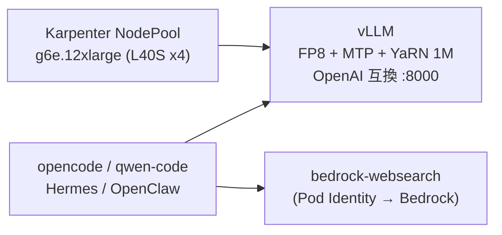

## はじめに

Qwen3.8-27B が話題ですね。ちょうど自作している EKS 基盤（[eks-distributed-ai](https://zenn.dev/tosshi/books/eks-distributed-ai)）があるので、その実験台として気軽に serving してみました。やったことはざっくり 4 つです。

- vLLM / SGLang で serving し、TPOT（1 トークンを生成する間隔）を計測しました。素の bf16 で 22.5 ms だったのが、FP8 と投機的デコードで **9.36 ms（c=1 実測、約 2.4 倍の高速化）** になりました
- YaRN で 1M 設定にしました（実測は 375k トークンの needle 取得まで）
- opencode / qwen-code / Hermes / OpenClaw の 4 エージェントを自前バックエンドに接続しました
- 画像・動画の入力も試しました

すぐ手元で試したい方は [導入は 3 ステップ](#導入は-3-ステップ) からどうぞ。あまり肩肘張らず、やってみた記録として軽くまとめます。

## vLLM と SGLang で serving して TPOT を測る

使ったのは `Qwen/Qwen3.8-27B` です。線形アテンション（Gated DeltaNet）主体のハイブリッドな VLM で、bf16 の重みは約 54 GB あります。ノードは g6e.12xlarge（L40S x4）で、テンソル並列 4 で載せました。vLLM は公式イメージ `vllm/vllm-openai:v0.27.1` がそのまま動き、カスタムビルドは不要でした。

前提として、単一ユーザーの生成（decode）は、小バッチ・短出力ではおおむね **メモリ帯域律速** です。L40S のメモリ帯域は 864 GB/s で、毎トークンで重みを読み切る時間が下限を決めます。つまりカーネルの小細工より、読むバイト数を減らす（量子化）か、1 回の forward で複数トークン出す（投機的デコード）かが効きます。

実測した TPOT はこうなりました。計測は `vllm bench serve`（`dataset=random`、greedy、c=1 = 同時 1 リクエスト、入力 512 / 出力 256）などでの数値です。投機的デコードの速度は入力の受理率しだいなので、コヒーレントな実テキストではもう少し速く出るはずですし、エンジン間の優劣というより手法込みの構成比較として見てください。

| エンジン | 構成 | TPOT |
|---|---|---|
| vLLM | bf16（素） | 22.5 ms |
| vLLM | FP8 | 16.1 ms |
| SGLang | FP8 + DFlash2 | 8.14 ms |
| vLLM | FP8 + MTP(3) | 9.36 ms |

面白かったのは、Qwen3.8-27B が **1 層の MTP（Multi-Token Prediction）ヘッドを内蔵** している点です。vLLM の `--speculative-config` で `method: mtp` を指定すると、別の draft モデルを用意せずに投機的デコードが効きます。しかも target が毎回検証するので、MTP 単体では出力分布が変わりません（品質劣化なし）。`num_speculative_tokens` を 3 にすると 1 層を複数ステップ使い回して速くなりました。

SGLang の DFlash2 のほうが生ベンチでは速い（8.14 ms）のですが、これは別の draft モデルを使う手法で、tool calling やマルチモーダルを通した状態は未検証、起動に Rust ビルドの重いカスタムイメージも要ります。エージェントのバックエンドとして本記事で試した範囲を確認済みなのは vLLM のほうなので、**既定は vLLM の FP8 + MTP(3)** にしました。MTP 自体は出力を変えないので、素の bf16 との品質差は FP8 化の分だけです。

1M コンテキストは YaRN（native 262144 の 4 倍）で広げ、FP8 と併用しました。375k トークン地点に埋めた合言葉（needle）を取り出せることは確認しましたが、これは n=1 の簡易確認で、RULER のような本格評価はしていません。

## エージェントを繋いですぐ使う



動作確認として、4 つのエージェントを自前 Qwen バックエンドに接続しました。いずれも CPU の Pod として常駐させ、ssh 鍵を使わず `kubectl exec` で入って TUI を使う構成です。Web 検索は Amazon Bedrock の web_search 機能を叩く自作ツールを MCP として渡し、認証は EKS Pod Identity に任せています。

実際に動いたところをいくつか載せます。qwen-code に非対話で聞くとバックエンドから素直に返ってきます。

```bash
qwen -p "Reply with exactly: PONG_QWEN_EKS"
# => PONG_QWEN_EKS
```

tool calling も通ります。天気を聞くとツール呼び出しが返ってきました。

```json
{"name": "get_weather", "arguments": {"city": "Tokyo"}}
```

Web 検索ツールも、Bedrock 経由で結果を取ってきて出典 URL 付きで答えてくれました。

ちなみに Kubernetes SIG の [agent-sandbox](https://agent-sandbox.sigs.k8s.io/) も検討しましたが、今回は見送りました。執筆時点では beta で EKS + Pod Identity の実績が見当たらず、そもそも「使い捨てサンドボックスで大量に隔離実行する」用途向けなので、長命な常駐 Pod に exec で入る今回の使い方とはズレるためです。

## 画像・動画も渡す

Qwen3.8-27B は VLM なので、画像と動画も渡せます。エージェントはどれも「Pod のファイルを読んで base64 で埋め込む」方式なので、ローカルのファイルはいったん Pod にコピーしてから参照します。ランチャに `push` を用意して、`kubectl cp` で Pod に置くようにしました。

画像はテキスト入りの PNG を読ませてみました。"FP8 VISION 88" と書いた画像を渡すと、この例では中身をそのまま返してくれました。動画も、4 フレームに別々の単語（CAT / DOG / SUN / CAR）を焼いた短いクリップを渡すと、順番どおりに読み取れました。動画は `push` の中で ffmpeg を通して事前にダウンサンプルしています。サーバー側でどうせ数フレームに間引かれるためです。

画像も動画も素直に通ったのは qwen-code でした。opencode は画像のみで、Hermes と OpenClaw のマルチモーダルは今回は未確認です。qwen-code はモデル名でマルチモーダル対応を判定するので、自前のモデル名では設定でモダリティを明示する必要がありました。

## 導入は 3 ステップ

稼働中の EKS クラスタがある前提で、ワークロードを一撃で入れます。clone してデプロイし、ランチャを入れて起動するだけです。`deploy.sh` は g6e.12xlarge を Karpenter で起動する（＝起動中は課金される）ので、GPU クォータと片付けだけ気をつけてください。

```bash
git clone <repo> && cd <repo>/2026-08-19-qwen3-8-27b-vllm-eks
./scripts/deploy.sh                 # 既定エンジンは vLLM。対象クラスタを確認して投入
install -m 755 <(curl -fsSL <url>/client/qwen-agents.sh) ~/.local/bin/qwen-agents
ln -sf ~/.local/bin/qwen-agents ~/.local/bin/qa   # (任意) 短縮エイリアス
qa opencode                         # どこからでも qa でエージェント起動
```

`deploy.sh` は GPU プール、serving、エージェント、`qwen-serving` という Service エイリアスまでを立ち上げ、最後に smoke チェックで疎通を確認します。片付けは `./scripts/deploy.sh --down` です。

## まとめ

自作 EKS 基盤の実験台として Qwen3.8-27B を serving し、TPOT を素の bf16 の 22.5 ms から FP8 + MTP(3) で 9.36 ms（c=1 実測、約 2.4 倍の高速化）まで詰められました。速度差のうち FP8 化の分は品質にわずかに影響しますが、MTP は出力を変えません。1M 設定（実測は 375k の needle まで）、tool calling、画像・動画入力も動きました。DFlash2 側の tool calling とマルチモーダルの検証は宿題です。話題のモデルを手元の基盤で気軽に試せると、いろいろ捗りますね。
